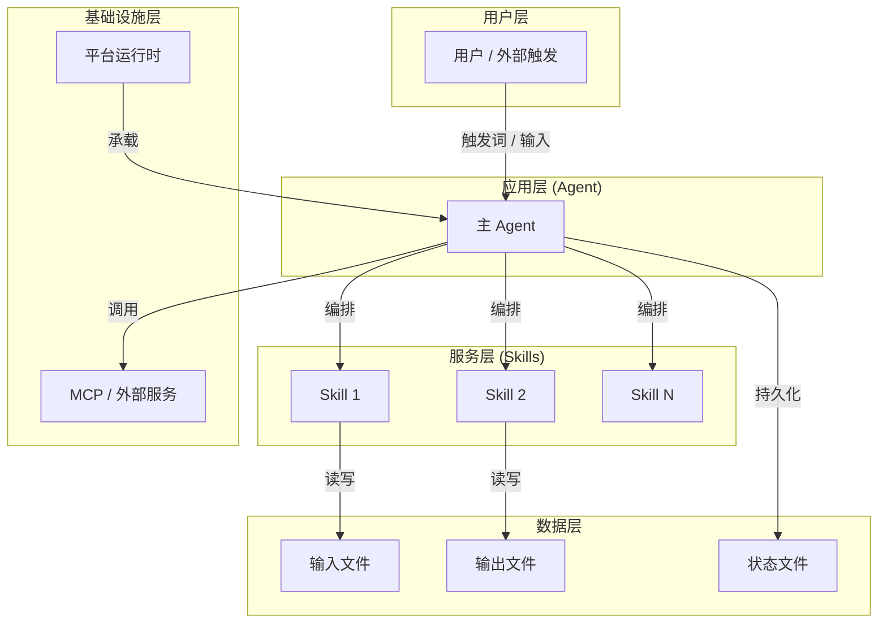
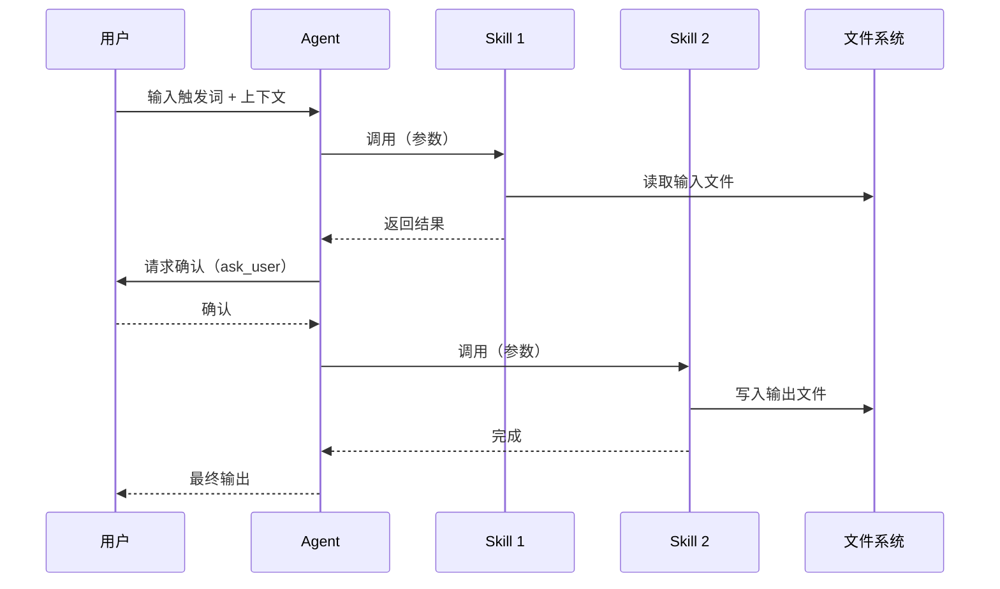

# 高层设计（HLD）：{项目名称}

> 基于 REQUIREMENTS.md + USE-CASES.md 输出。由 meta-se 在 solution-design 阶段生成。
> HLD 必须先通过 CP3 自动预检（`process/checks/CP3-HLD-CONSISTENCY.md`），再经 CP3 人工确认（`checkpoints/CP3-HLD-REVIEW.md`）后，方可进入 Story 拆解阶段。

---

## 1. 问题定义

### 问题陈述

> {用一段话描述：当前痛点是什么，谁受影响，影响有多大}

### 核心价值

> {解决该问题后，用户获得什么价值}

### 目标

| 优先级 | 目标 | 度量方式 |
|--------|------|---------|
| P0 | {必须达成的目标} | {如何度量成功} |
| P1 | {重要目标} | {度量方式} |
| P2 | {期望目标} | {度量方式} |

### 成功标准

- [ ] {可量化的验收标准 1}
- [ ] {可量化的验收标准 2}

### 约束

| 类型 | 约束内容 |
|------|---------|
| 技术 | {技术栈、平台、协议限制} |
| 业务 | {合规、安全、时间限制} |
| 资源 | {团队规模、预算} |

### 非目标（Out of Scope）

- {明确不解决的问题 1}
- {明确不解决的问题 2}

### 关键假设

- {假设 1：如该假设不成立，设计需要重新评估}
- {假设 2}

### 缺失信息

| 优先级 | 缺失信息 | 影响范围 | 决策所需时限 |
|--------|---------|---------|------------|
| BLOCKING | {必须明确才能继续设计} | {影响哪些设计决策} | {何时需要答案} |
| REQUIRED | {重要但可临时假设} | {影响范围} | {时限} |
| OPTIONAL | {可以后续确认} | {影响范围} | — |

---

## 2. 候选架构方案对比

### 方案 A：{方案名称}

**核心思路**：{一句话描述}

| 维度 | 评估 |
|------|------|
| 优点 | {优点 1；优点 2} |
| 缺点 | {缺点 1；缺点 2} |
| 复杂度 | low / medium / high |
| 实施成本 | {相对成本估计} |
| 可扩展性 | {扩展性评估} |
| 风险 | {主要风险} |
| 适用前提 | {该方案成立的前提条件} |

### 方案 B：{方案名称}

**核心思路**：{一句话描述}

| 维度 | 评估 |
|------|------|
| 优点 | |
| 缺点 | |
| 复杂度 | |
| 实施成本 | |
| 可扩展性 | |
| 风险 | |
| 适用前提 | |

### 方案对比矩阵

| 维度 | 方案 A | 方案 B |
|------|--------|--------|
| 实现难度 | ⭐⭐ | ⭐⭐⭐ |
| 可维护性 | ⭐⭐⭐ | ⭐⭐ |
| 性能 | ⭐⭐ | ⭐⭐⭐ |
| 扩展性 | ⭐⭐⭐ | ⭐⭐ |
| 适配目标约束 | ✅ | ⚠️ |

**推荐方案**：{方案 A / B}，理由：{一句话核心理由}

---

## 3. 推荐方案总览

**复杂度模式**：`simple` / `standard` / `complex`

| 判定维度 | 依据 | 结论 |
|---------|------|------|
| 需求规模 | {需求条数} | {判断} |
| 角色数量 | {N 个用户画像 × M 个场景} | {判断} |
| 状态流转 | {N 步流程，有/无扩展分支} | {判断} |
| 平台适配 | {N 个平台} | {判断} |
| Story 拆解 | {是否必须分批} | {判断} |

**系统核心思路**：
> {2~3 句话描述推荐方案的本质：它如何解决问题，核心机制是什么}

**关键架构风格**：{事件驱动 / 管道过滤 / 分层 / 微服务 / 单体 / ...}

**核心能力边界**：
- 做：{明确包含的功能边界}
- 不做：{明确排除的功能}

**关键依赖**：
- {外部系统/服务/库 1}：{用途}
- {外部系统/服务/库 2}：{用途}

**产物形态**：
- Agent 数量：N
- Skill 数量：N
- 工具脚本：N 个
- 目标平台：{Claude Code / Codex / OpenClaw}

---

## 4. 系统架构图

---

## 5. 高层模块与职责划分

| 模块名称 | 类型 | 职责 | 输入 | 输出 | 依赖 |
|---------|------|------|------|------|------|
| {模块名} | Agent / Skill / Tool | {一句话职责} | {输入来源} | {输出目标} | {依赖哪些模块} |
| {模块名} | | | | | |

**模块边界规则**：
- {模块 A} 只负责 {职责范围}，不涉及 {排除范围}
- {模块 B} 的输出格式由 {约定} 决定

---

## 6. 技术选型与理由

| 选型类别 | 选择 | 备选方案 | 选择理由 | 风险 |
|---------|------|---------|---------|------|
| 语言/运行时 | {如 Python 3.11} | {备选} | {理由} | {风险} |
| 框架/库 | {如 LangChain} | {备选} | {理由} | {风险} |
| 存储方案 | {如 Markdown 文件} | {备选} | {理由} | {风险} |
| 平台协议 | {如 MCP} | {备选} | {理由} | {风险} |
| 部署形态 | {如 CLI / Agent} | {备选} | {理由} | {风险} |

---

## 7. 关键流程

### 主流程：{流程名称}

### 扩展流程：{异常/边界流程名称}

> {简要文字说明异常路径如何处理}

---

## 8. 非功能需求设计

| 质量特征 | 设计目标 | 实现手段 | 验证方式 |
|---------|---------|---------|---------|
| 性能 | {如：单次调用 < N 秒} | {如：批量处理、缓存} | {如：计时测试} |
| 可靠性 | {如：错误时回退而非崩溃} | {如：try/except + 降级逻辑} | {如：异常注入测试} |
| 安全性 | {如：无 Prompt 注入} | {如：输入校验 + dangerous-command-scan} | {如：安全扫描} |
| 可维护性 | {如：每个 Skill ≤ 300 行} | {如：单一职责原则} | {如：行数统计} |
| 可移植性 | {如：3 平台无差异安装} | {如：平台适配层} | {如：跨平台验证} |
| 易用性 | {如：触发词 ≤ 3 个汉字} | {如：别名扩展} | {如：用户验收测试} |

---

## 9. 主要风险与应对

| 风险 ID | 风险描述 | 概率 | 影响 | 应对策略 | 触发信号 |
|---------|---------|------|------|---------|---------|
| R1 | {风险 1} | 高/中/低 | 高/中/低 | {应对措施} | {何时触发应对} |
| R2 | {风险 2} | | | | |

---

## 10. ADR 候选决策点

> 以下决策建议沉淀为架构决策记录（`ARCHITECTURE-DECISION.md`）。

| ADR ID | 决策问题 | 建议决定 | 约束此决策的因素 |
|--------|---------|---------|---------------|
| ADR-1 | {关键架构决策问题} | {推荐决定} | {为什么这样决定} |
| ADR-2 | | | |

---

## 11. 分阶段落地建议

| 阶段 | 交付物 | 里程碑标志 | 前提条件 |
|------|--------|---------|---------|
| 阶段 1 | {核心功能} | {可以演示 X} | {依赖 Y 完成} |
| 阶段 2 | {扩展功能} | {可以演示 Z} | {阶段 1 完成} |
| 阶段 3 | {完整交付} | {终验通过} | {阶段 2 完成} |

---

## 12. 工作量粗估

| 类别 | Story 数 | 预计 Wave 数 | 粗估工作量 |
|------|---------|------------|---------|
| 核心 Agent/Skill 实现 | N | W1~WX | {相对大小：S/M/L/XL} |
| 工具脚本 | N | WX | {相对大小} |
| 安装包与平台适配 | N | WX | {相对大小} |
| 文档 | N | WX | {相对大小} |
| **合计** | **N** | **N 个 Wave** | |

---

## 13. 待确认问题

| 问题 ID | 问题描述 | 优先级 | 影响范围 | 负责人 | 目标答复时间 |
|---------|---------|--------|---------|--------|------------|
| Q1 | {需要用户或 SME 确认的问题} | BLOCKING | {影响哪些设计} | {谁来回答} | {何时} |
| Q2 | {需要技术预研的问题} | REQUIRED | | | |

---

<!-- meta-po 填写：CP3 HLD 人工确认记录 -->
## CP3 确认记录

**CP3 自动预检结果**：`process/checks/CP3-HLD-CONSISTENCY.md`  
**CP3 人工 checklist**：`checkpoints/CP3-HLD-REVIEW.md`

**确认状态**：⬜ 待审核 → ✅ 已批准 / ❌ 需修改

**审核意见**：

**确认人**：
**确认时间**：
