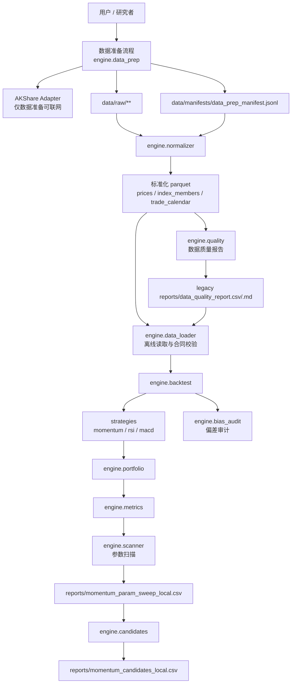

# quant-lab

> 本地日频量化回测层：用 `pandas` + `parquet` 在本地完成数据准备、离线回测、参数扫描和候选报告。  
> **核心原则**：数据准备可联网，回测主路径离线优先；已有本地缓存时优先使用缓存，不在回测、扫描或候选筛选中隐式补抓数据。  
> **验证状态**：`STORY-001` 至 `STORY-013` 已完成验证；CR-011 的 `S01` 至 `S08` 已完成 CP7 验证并通过 CP8 人工终验，CR-011 已关闭；CR-012 已完成 limited-window readiness audit 口径修正和定向测试；CR-013 已完成 full-history / unsupported claim boundary 的 CP7 验证与文档收敛，等待 CP8 终验；CR-014 Batch-A `S01` 至 `S08` 已完成 CP7 验证，范围是离线合同与护栏实现，不包含真实抓取、真实写湖或 S09 执行；CR-015 `S01` 至 `S07`、CR-017 `S01` 至 `S06`、CR-016 `S01` 至 `S04` 与 `S07` 已完成受控离线 / 文档范围 CP7 验证；CR-016 `S05` / `S06` 仍为 later-gated，`implementation_allowed=false`；CR-019 `S01` 至 `S10` 已完成 CP7 验证并通过 CP8 人工终验，CR-019 当前离线合同 / 文档交付已关闭；CR-139 已完成 40/40 Story 闭环，其中 31 个为 Story 级 fixture/static `verified`，9 个为 W2 Gate 证据回映射 `gate-reconciled-complete`；CR-139 不表示 DuckDB/ML/QMT runtime 已生产验证，后续真实 runtime、provider、lake write、catalog publish 或交易操作仍需独立授权；当前仓库不包含真实行情数据。

## 目录

- [项目定位](#项目定位)
- [当前 QMT 模拟盘入口](#当前-qmt-模拟盘入口)
- [项目根与目录边界](#项目根与目录边界)
- [已实现能力](#已实现能力)
- [架构概览](#架构概览)
- [回测平台演进路线](#回测平台演进路线)
- [快速开始](#快速开始)
- [Tushare 真实回补与本地 comparison](#tushare-真实回补与本地-comparison)
- [数据湖备份、恢复与演练](#数据湖备份恢复与演练)
- [CR-014 全 A since-inception 数据湖 Batch-A 边界](#cr-014-全-a-since-inception-数据湖-batch-a-边界)
- [CR-018 S01 production current truth scoped release 与 dataset group](#cr-018-s01-production-current-truth-scoped-release-与-dataset-group)
- [CR-019 S10 QMT CS bridge runbook 边界](#cr-019-s10-qmt-cs-bridge-runbook-边界)
- [CR-019 S09 deferred capability register](#cr-019-s09-deferred-capability-register)
- [CR-025 research execution semantic alignment](#cr-025-research-execution-semantic-alignment)
- [CR-030 多因子策略研究入口](#cr-030-多因子策略研究入口)
- [CR-015 QMT foundation runbook 边界](#cr-015-qmt-foundation-runbook-边界)
- [CR-016 QMT staged activation runbook 边界](#cr-016-qmt-staged-activation-runbook-边界)
- [CR-017 复权双视图与 QMT 消费边界](#cr-017-复权双视图与-qmt-消费边界)
- [CR-011 因子研究生产级数据补齐](#cr-011-因子研究生产级数据补齐)
- [CR-006 旧 data reference-only guardrail](#cr-006-旧-data-reference-only-guardrail)
- [CR-007 quality report legacy 与 current quality truth](#cr-007-quality-report-legacy-与-current-quality-truth)
- [Backtrader 可选后端](#backtrader-可选后端)
- [本地 Notebook 探索](#本地-notebook-探索)
- [典型工作流](#典型工作流)
- [数据契约](#数据契约)
- [配置说明](#配置说明)
- [输出文件](#输出文件)
- [目录结构](#目录结构)
- [数据质量与常见坑点](#数据质量与常见坑点)
- [验证状态与限制](#验证状态与限制)
- [故障排查](#故障排查)

## 项目定位

`quant-lab` 是一个面向本地研究的轻量日频组合回测层，不是完整交易系统、实盘框架或聚宽 API 兼容层。`local_backtest` 是本项目历史仓库名 / legacy alias，仅用于兼容旧路径、旧过程证据和历史审计语境。它服务于这样的研究流程：

1. 用独立数据准备流程从 AKShare 等数据源抓取原始数据，按限速、重试、断点续传写入 raw cache 和 manifest。
2. 从 raw cache 派生标准化 parquet，并生成数据质量报告。
3. 在回测主路径中只读取本地 parquet、manifest 和质量报告，执行动量、RSI、MACD 等策略研究。
4. 本地完成参数扫描，只输出少量候选参数供用户手动回填聚宽或其他平台做真实性验证。

当前实现以 Python 模块/API 为主，没有生成安装脚本，也没有 console script 入口。命令示例统一使用 `uv run --python 3.11`。

## 当前 QMT 模拟盘入口

当前文档总入口是 [docs/README.md](docs/README.md)。它按组件和场景组织 quant-lab 文档，避免继续把 CR 编号文档作为用户首选入口。

当前 QMT 多因子策略 runner 的正式用户入口是 [docs/USER-MANUAL.md](docs/USER-MANUAL.md) 中的 “RUNNER-QMT simulation multifactor 手动运行指南”，完整场景案例见 [docs/scenarios/MULTIFACTOR-SIMULATION-RUNNER-OPERATION.md](docs/scenarios/MULTIFACTOR-SIMULATION-RUNNER-OPERATION.md)。它说明如何在逐次授权后手动启动 Windows gateway、检查 health / capabilities / positions、运行 simulation operator、停止 gateway、处理 `session_expired`、检查 evidence 和执行 manual takeover。

交易窗口外的 runner 准备入口是 [docs/scenarios/NON-TRADING-WINDOW-RUNNER-READINESS.md](docs/scenarios/NON-TRADING-WINDOW-RUNNER-READINESS.md)。该流程只运行 `preflight-only`、`plan-only`、`fixture`、`reconcile-only` 等非 runtime 模式，用于检查 operator spec、策略准入包、evidence schema、异常恢复矩阵和稳定性窗口；不读取 env、不构造 QMT client、不启动 gateway、不读取凭据、不连接账户、不提交或撤单。

相关文档：

| 文档 | 用途 |
|---|---|
| [docs/README.md](docs/README.md) | 文档导航，按组件、场景、参考边界和 legacy 兼容入口组织。 |
| [docs/components/ENGINE.md](docs/components/ENGINE.md) | 数据准备、标准化、质量、loader、回测和指标。 |
| [docs/components/EXPERIMENTS.md](docs/components/EXPERIMENTS.md) | 实验、参数扫描、候选筛选和报告。 |
| [docs/components/MULTIFACTOR-RESEARCH.md](docs/components/MULTIFACTOR-RESEARCH.md) | 多因子研究组件说明。 |
| [docs/components/QMT-GATEWAY.md](docs/components/QMT-GATEWAY.md) | QMT gateway 组件说明。 |
| [docs/components/RUNNER.md](docs/components/RUNNER.md) | Runner 组件说明。 |
| [docs/scenarios/MULTIFACTOR-RESEARCH-TO-STRATEGY.md](docs/scenarios/MULTIFACTOR-RESEARCH-TO-STRATEGY.md) | 多因子策略研究案例，从数据准备到输出策略。 |
| [docs/scenarios/MULTIFACTOR-SIMULATION-RUNNER-OPERATION.md](docs/scenarios/MULTIFACTOR-SIMULATION-RUNNER-OPERATION.md) | 多因子策略模拟盘运行案例。 |
| [docs/scenarios/NON-TRADING-WINDOW-RUNNER-READINESS.md](docs/scenarios/NON-TRADING-WINDOW-RUNNER-READINESS.md) | 非交易窗口 runner 准备案例，覆盖 preflight、plan、fixture、reconcile 和 evidence schema。 |
| [docs/scenarios/DAILY-OPERATIONS.md](docs/scenarios/DAILY-OPERATIONS.md) | 日常运维案例。 |
| [docs/USER-MANUAL.md](docs/USER-MANUAL.md) | 操作者手册、手动运行步骤、停止 / 检查流程和典型用户案例。 |
| [docs/QMT-GATEWAY-INSTALL.md](docs/QMT-GATEWAY-INSTALL.md) | Windows S 端 gateway 环境文件、启动、检查、停止和故障处理。 |
| [docs/QMT-C-S-BRIDGE-RUNBOOK.md](docs/QMT-C-S-BRIDGE-RUNBOOK.md) | C/S bridge、endpoint、HMAC scope 和只读证据边界。 |
| [docs/reference/RUNNER-QMT-AUTHORIZATION.md](docs/reference/RUNNER-QMT-AUTHORIZATION.md) | runtime 授权模板、scope separation 和 evidence redaction 规则。 |

边界：该入口只覆盖 `simulation`，不授权 `small_live`、`live`、scale-up、真实生产交易、未脱敏账户 / 订单回执落盘、provider fetch、lake write、broker lake write 或 publish。非交易窗口 readiness 只证明本地 runner 准备度，不等于 runtime authorization，也不授权 simulation runtime、`small_live` 或 `live`。真实 operator 最近一次审计是旧过程证据 `legacy_process@a6b0607f:process/quant-lab/checks/RUNNER-QMT-SIMULATION-MULTIFACTOR-STRATEGY-RUNTIME-REAL-OPERATOR-2026-06-25.md`；若状态为 `session_expired`，必须先刷新 Windows gateway session 后再复跑。

## 项目根与目录边界

`quant-lab/` 是本工具项目的 future-facing canonical 根目录。当前本地工作区或历史过程证据中仍可能出现 `local_backtest/`；该名称只表示 legacy alias / 历史审计名。README、用户手册、`pyproject.toml`、`config/`、`engine/`、`strategies/`、`tests/`、`data/` 和 `reports/` 均以当前仓库根为基准；除非命令另有说明，所有示例都应在仓库根目录执行。

本地工作区必须由一个非 Git 项目容器根承载两个直接子仓：`<project-root>/quant-lab/` 是本发布仓，`<project-root>/quant-lab-process/` 是过程仓。两者不得放在项目容器根外，也不得用跨仓软链接连接。

目录边界如下：

| 对象 | 当前定位 | 处理规则 |
|---|---|---|
| `quant-lab` 发布仓 | 本地回测工具项目 canonical 发布根 | 保留工具代码、配置、测试、必要示例、报告占位和用户/发布文档；不保存过程治理树。 |
| sibling 过程仓 `quant-lab-process` | Meta Flow 过程治理根 | 保存 `PROJECT.yaml`、Work/CR、门禁、QA、复盘、进化和未来设计文档；通过 tracked binding 解析，不通过软链接访问。 |
| `meta-flow-artifacts` | 旧共享过程仓 | 按冻结 OID 与 `process/quant-lab` 子路径只读回查；不复制、不双写、不修正旧历史。 |
| `local_backtest/` | 历史仓库名 / legacy alias | 仅用于兼容旧本地目录、历史 CR、过程证据和审计引用；不再作为 future-facing canonical 项目名。 |
| `llm-wiki` | 外部学习知识库 | 不复制进本项目；学习资料、学习复盘和笔记任务继续在 `llm-wiki` 中处理。 |
| `work/studies/quant-trading/local_backtest/` | 旧建议路径 / 误创建空骨架 | CR-001 中已确认无文件，并已用 `rmdir` 清理；不再作为项目根或输出路径。 |
| `delivery/` | meta-flow 通用交付包概念，不是当前 production 项目的正式出口 | CR-001 中已确认无文件，并已用 `rmdir` 清理；当前项目不生成 `delivery/**`、安装脚本或 meta-flow 交付包。 |
| `README.md` + `docs/` retained manuals | 当前 production 项目正式用户/发布文档出口 | 保留组件、场景、安装/运行、reference、runbook 和 release 入口；新过程/设计/质量治理对象写入 sibling 过程仓。当前 `docs/product` 与 `docs/legacy` 是待长期治理的过渡库存，本 CR 不批量搬迁。 |

不要把学习资料大规模拷贝进 quant-lab。发布仓只保留运行和维护工具所需的代码、配置、测试、必要示例、报告占位和用户/发布文档；新过程证据进入独立过程仓，旧证据继续留在 `meta-flow-artifacts` 并只读回查。学习复盘、长篇资料沉淀和知识库整理应留在 `llm-wiki`。历史文档中的 `local_backtest` 仍按 legacy alias 理解。

Agent 协作由当前会话的 Host Orchestrator 主进程编排，功能 Agent 按需调度。vNext `project/work/status/check/query` 通过 `.meta-flow/workspace.yaml` 解析过程仓；`repository` 命令仍显式指定单仓根。任何仍硬编码 `process/...` 的 legacy 工具在 binding-only 下都不视为可用，必须先完成兼容整改。

本文后续若引用 `legacy_process@a6b0607f:process/quant-lab/<path>`，表示按 `meta-flow-artifacts` 的冻结 OID `a6b0607fba7cf474e9996ec9c802048534862638` 只读回查；它不是当前发布仓内的可点击链接。当前过程证据使用 `process_repo:<relative-path>` 表示。CR-174 的“文档管理落地”仅表示归属政策和精确库存已建立，不表示全部 legacy 文档引用已经迁移。

## 已实现能力

| 范围 | 状态 | 说明 |
|---|---|---|
| 工程基线 | verified | `pyproject.toml`、`uv.lock`、`engine/`、`strategies/`、`config/`、`data/`、`reports/` 已建立；依赖由 `uv` 管理。 |
| 数据拉取与 manifest | verified | `engine.data_prep` 支持配置读取、批次规划、AKShare adapter 边界、请求节流、有限重试、退避、断点续传、raw cache 写入和 JSONL manifest。 |
| raw 到 parquet 标准化 | verified | `engine.normalizer` 从本地 raw JSONL 与 manifest 派生 `prices.parquet`、`index_members.parquet`、`trade_calendar.parquet`，不触发联网。 |
| 数据质量报告 | verified | `engine.quality` 计算覆盖区间、缺失率、失败批次、重复记录、异常价格、回补记录、数据新鲜度和 `pass/warn/fail`。CR-007 后旧仓库报告仅作 legacy，当前质量真相源以 configured lake root 下的 `quality/catalog` 为准。 |
| 离线 Data Loader | verified | `engine.data_loader` 只读本地 parquet 和质量报告，校验 schema、复权口径、质量门禁和 W3 增强开关。 |
| 动量信号与组合成交 | verified | `strategies.momentum`、`engine.portfolio` 支持动量排名、缓冲持仓、T 日收盘后信号、T+1 或之后成交、等权组合、成本扣除、留现金/未成交记录。 |
| 单次回测与指标 | verified | `engine.backtest`、`engine.metrics` 输出调仓 schedule、组合净值、累计收益、年化收益、最大回撤、Sharpe、换手和 metadata。 |
| 参数扫描 | verified | `engine.scanner` 默认生成 60 组动量参数，失败组合保留行并记录错误。 |
| 候选报告 | verified | `engine.candidates` 从扫描结果选择不超过 4 组候选，包含选择理由和聚宽人工验证字段。 |
| W3 真实性增强契约 | verified | PIT 股票池、交易状态、涨跌停、事件 `available_at` 相关接口和 fail-fast 防线已存在；JQData limited window 已注册 `trade_status.daily`、`prices_limit.daily`、`events.disclosure`，完整历史覆盖仍需数据权限确认。 |
| CR-011 因子研究数据补齐 | closed | 真实 benchmark、PIT 股票池 / lifecycle、可交易性 / 涨跌停、OHLCV/VWAP、复权 / 公司行动、行业 / 市值 / 风格、流动性 / 容量 / 成本敏感性、factor panel audit 与 robust validation 已完成 Story 级 CP7 验证，并已通过 CP8 人工终验。 |
| CR-013 full-history 声明边界 | verified-pending-cp8 | `2025-02-11..2026-02-18` 仅为 supported limited window；`2020-01-01..2024-12-31` 保持 blocked / `research_limited_only`。真实 VWAP、VWAP fill、分钟 / 逐笔 / 盘口 / 撮合执行价保持 blocked / unsupported；unsupported register 的 `excluded` 项不进入正式 pass 分母。 |
| CR-014 Batch-A 全 A 数据湖合同与护栏 | verified | `CR014-S01` 至 `CR014-S08` 已通过 CP7，交付的是 all-A since-inception universe/lifecycle、Parquet layout、manifest/catalog、Explicit Publish Gate、P0 pipeline、DuckDB 只读查询/审计边界、readiness/claim boundary、replay/retention 和 research consumer 只读边界。真实 provider 抓取、raw/manifest/run metadata 写湖与任何 S09 真实运行均拆到后续 Batch-B。 |
| CR-015 QMT foundation | verified | `CR015-S01` 至 `CR015-S07` 已完成受控离线 / mock / fixture / 文档范围 CP7 验证。CR-015 只允许 `shadow` / `dry_run` / `mock`，不授权 simulation、live_readonly、small_live、scale_up、真实 QMT、真实发单、撤单、账户查询、凭据读取、真实 broker lake 写入、真实抓取、真实 lake 写入或 publish。 |
| CR-016 QMT staged activation runbook | controlled-offline-verified-with-later-gated-scope | `CR016-S01` 至 `CR016-S04` 与 `CR016-S07` 已完成受控离线 / 文档范围 CP7 验证；`CR016-S05` 和 `CR016-S06` 仍为 later-gated，`implementation_allowed=false`，不得写成 implemented 或 verified。`CR016-S04` 交付 [docs/QMT-SIMULATION-LIVE-RUNBOOK.md](docs/QMT-SIMULATION-LIVE-RUNBOOK.md)，`CR016-S07` 增加 [docs/QMT-INCIDENT-PLAYBOOK.md](docs/QMT-INCIDENT-PLAYBOOK.md)。runbook、incident playbook、CP5、CP6/CP7、Story verified 或文档存在均不自动授权 `simulation`、`live`、`small_live`、`scale_up` 或真实 broker 操作。 |
| CR-017 复权双视图消费边界 | verified | `CR017-S01` 至 `CR017-S06` 已完成 CP7 验证，覆盖复权策略、raw prices / adj_factor 合同、qfq / hfq 派生视图、reader policy gate、质量 / 泄漏验证、research / QMT consumer 文档与迁移指南。scale_up 仍受 CR016-S06 later-gated、research maturity gate 和用户后续显式授权控制；production adjustment governance / scale_up 自动放行计数仍为 0。 |
| CR-018 S01 production current truth 合同 | ready-for-verification | `market_data.release_scope` 冻结 `2015-01-05..latest_closed_trade_date` scoped release，`market_data.dataset_groups` 冻结 P0 dataset group / P1 dataset group、required_for_publish 和 blocked claims；本项只定义合同与离线测试，不抓取 provider、不写 lake、不 publish current pointer、不读取凭据、不操作 QMT。 |
| CR-019 S09 deferred capability register | verified | Deferred capability 摘要保留在 [docs/QMT-C-S-BRIDGE-RUNBOOK.md](docs/QMT-C-S-BRIDGE-RUNBOOK.md)；原静态 register 的历史定位是 `legacy_process@a6b0607f:process/quant-lab/docs/source-archive/docs/CR019-DEFERRED-CAPABILITIES.md`。`backtrader_w6`、`qlib_w7`、`minute_spike`、`level2_spike` 均为 non-P0 / later-gated 范围；本项不新增依赖、不接入外部 provider、不抓取 minute / Level2 数据、不读取凭据、不改变 legacy strategy readiness admission 或 QMT C/S bridge 的当前实现范围。 |
| CR-019 QMT C/S bridge delivery | closed | `CR019-S01` 至 `CR019-S10` 已完成 CP7 验证并通过 CP8 人工终验；新增 [docs/QMT-C-S-BRIDGE-RUNBOOK.md](docs/QMT-C-S-BRIDGE-RUNBOOK.md) 作为 QMT C/S bridge 用户边界入口，汇总 legacy strategy readiness admission、pairing/HMAC、endpoint matrix、run gate、fallback、deferred register 和 no-real-operation 计数；后续真实 QMT 运行与 deferred capabilities 的历史跟踪定位是 `legacy_process@a6b0607f:process/quant-lab/changes/CR-019-FOLLOW-UP-TRACKING-2026-05-31.md`，本文档、README、USER-MANUAL、CP5/CP6/CP7、CP8 或 Story verified 都不提供真实操作许可。 |
| CR-139 strategy data foundation | closed | 40/40 Story 已闭环：31 个 Story 级 fixture/static `verified`，9 个 W2 Gate 证据回映射 `gate-reconciled-complete`。W2 current truth 已完成真实 lake/catalog/pointer 证据闭环；Backlog-A 主要交付代码、合同、静态 / fixture 测试和过程证据。DuckDB 保持 read-only facade / no hard dependency；S10 ML 全流程需要 `ml` dependency group；任何真实 DuckDB runtime、ML runtime、provider fetch、lake write、catalog publish、QMT 或交易操作仍需独立授权。 |
| RUNNER-QMT simulation multifactor | operator-ready-with-runtime-gate | 当前具备逐次授权后的 simulation operator 入口：P1 多因子目标组合、P2 模拟盘订单计划、P3 simulation submit/cancel、P4 对账。正式操作步骤见 [docs/USER-MANUAL.md](docs/USER-MANUAL.md)；仅限 `simulation`，不进入 `small_live` / `live`。最近真实 gateway 尝试曾因 `session_expired` 阻断，复跑前必须刷新 Windows gateway session。 |
| 因子审计与稳健性验证 | closed | 新版研究报告、factor panel 和 robust validation 默认隔离到 `reports/experiment_17_21_cr011/**`；旧 `reports/experiment_17_21/factor_strategy_report.md` 只作为 baseline 引用，不得覆盖。 |
| 偏差审计 | verified | `engine.bias_audit` 支持 baseline/enhanced 对比，输出收益、回撤、Sharpe、换手、候选排名变化及降级 warning。 |
| 策略扩展 | verified | `strategies.base`、`strategies.rsi`、`strategies.macd` 提供策略接口和 RSI/MACD 示例。 |
| 诊断日志 | verified | STORY-004..013 入口接入结构化诊断日志，字段包括 `event_name`、`run_id`、`module`、`story_id`、`status`、`params_summary`、`elapsed_seconds`；错误路径包含 `structured_error`。 |
| CSV 安全 | verified | 报告自由文本字段通过 `sanitize_tabular_text` 防护 `=`, `+`, `-`, `@` 开头的公式注入。 |

## 架构概览



**核心边界**：

- 数据准备流程可以联网，但必须限速、有限重试、写 raw cache、manifest 和质量报告。
- 回测、扫描、候选筛选、偏差审计主路径只读本地文件，不自动调用 AKShare、聚宽或其他远程接口。
- W3 增强数据源超出已验证窗口或缺少 `available_at` 时，PIT universe、交易状态、涨跌停和事件数据启用路径会 fail fast。

## 回测平台演进路线

本项目后续继续以当前 `market_data/` + `engine/` + `strategies/` 骨架为主干，不整体迁移到单一开源框架。开源框架以可选后端或加速器方式接入：Backtrader 用于事件驱动、订单成交和分钟级验证；VectorBT 用于大规模参数扫描；Qlib、LEAN 仅在因子机器学习或实盘/多资产平台成为主目标时单独评估。

历史路线、阶段目标、切换条件和不做事项位于 `legacy_process@a6b0607f:process/quant-lab/docs/source-archive/docs/ROADMAP.md`；历史 ADR-023 位于 `legacy_process@a6b0607f:process/quant-lab/ARCHITECTURE-DECISION.md`。它们不是新过程仓的当前 Roadmap/HLD；长期目标将在 CR-174 后另起 Work。

## 快速开始

### 环境准备

本项目统一使用 `uv` 管理 Python 解释器、虚拟环境和依赖：

```bash
uv sync --python 3.11
```

默认环境覆盖核心数据、回测、合同和 fixture/static 测试。实验 23-29 的 ML 全流程会进入 `scikit-learn` / `LightGBM` 路径，这些依赖在 `pyproject.toml` 的 `ml` dependency group 中，不随默认 sync 安装。需要运行 ML 模型训练、walk-forward 全流程或 `tests/experiments/test_ml_factor_strategy_suite_exp23_29.py` 时，先安装 ML 依赖组：

```bash
uv sync --python 3.11 --group ml
uv run --python 3.11 --group ml pytest -q tests/experiments/test_ml_factor_strategy_suite_exp23_29.py
```

CR-139 的 S10 no-bypass / lake-as-of 合同验证不要求安装 `ml` 组；它通过 static/fixture 测试确认实验入口不再直接绕过 lake reader。真实 ML 全流程运行仍需要显式安装 `ml` 依赖组，并且不等于 runtime、provider、lake write、catalog publish 或交易授权。

验证当前环境：

```bash
uv run --python 3.11 pytest -q
```

CR-174 当前基础迁移验证见 `process_repo:works/CR-174/ROUTE-VALIDATION.md`，范围是 import/CLI 与 3 个测试文件共 18 项，不声称全量 pytest 通过。旧 F-004 回归仅作为 `legacy_process@a6b0607f:process/quant-lab/handoffs/META-QA-REGRESSION-F004-LOGGING-2026-05-16.md` 历史记录。

### 准备数据

当前仓库只保留 `data/.gitkeep` 和 `reports/.gitkeep`，不包含真实行情、raw cache、parquet 或报告数据。你需要使用自备数据，或显式运行数据准备流程。

数据准备 API 示例：

```bash
uv run --python 3.11 python - <<'PY'
from engine.data_prep import DataPrepRequest, run_data_prep

summary = run_data_prep(
    DataPrepRequest(
        source="akshare",
        interface="stock_zh_a_hist",
        params={"adjust": "qfq", "target_dataset": "prices"},
        symbols=["000001", "000002"],
        date_range={"start": "2019-01-01", "end": "2025-12-31"},
    )
)
print(summary)
PY
```

默认配置在 [config/data_prep.yaml](config/data_prep.yaml)：

- `request_interval_seconds: 2`
- `batch_size: 50`
- `max_concurrency: 1`
- `max_retries: 3`
- `backoff_policy: exponential_jitter`
- `recent_trade_days_backfill: 5`

数据准备成功后，从 raw/manifest 派生标准化 parquet：

```bash
uv run --python 3.11 python - <<'PY'
from engine.normalizer import run_normalization

result = run_normalization(
    manifest_path="data/manifests/data_prep_manifest.jsonl",
    raw_root="data/raw",
    output_dir="data",
)
print(result.parquet_paths)
PY
```

生成质量报告：

```bash
uv run --python 3.11 python - <<'PY'
from engine.quality import run_quality_report

result = run_quality_report(
    parquet_paths=None,
    manifest_path="data/manifests/data_prep_manifest.jsonl",
    report_dir="reports",
    requested_range={"start": "2019-01-01", "end": "2025-12-31"},
)
print(result)
PY
```

### Tushare 真实回补与本地 comparison

CR-005 将 Tushare 作为可选真实数据源接入本地数据湖，但启用条件必须同时满足四项：`enabled=true`、exact interface `allowlist` 命中、`TUSHARE_TOKEN` 仅从环境变量读取、用户执行显式真实抓取命令（`explicit command`）。默认 pytest、回测、reader、comparison、Notebook 和 Backtrader optional backend 都不联网、不读取 token、不触发 connector。

本轮用户运维决策是使用本地 `.env` 管理 Tushare token、本机数据湖路径和 NAS rsync 同步参数。`.env` / `.env.*` 已由 [.gitignore](.gitignore) 忽略，不提交、不生成带真实值的样例文件。文档中的本地 `.env` 内容只能使用以下占位形式：

```bash
TUSHARE_TOKEN=<由用户本机填写，不提交>
JQDATA_USERNAME=<由用户本机填写，不提交>
JQDATA_PASSWORD=<由用户本机填写，不提交>
MARKET_DATA_LAKE_ROOT=<local-quant-lab-data-lake-root>
MARKET_DATA_LAKE_ARCHIVE_ROOT=<local-quant-lab-archive-root>
MARKET_DATA_LAKE_BACKUP_ROOT=<local-quant-lab-backup-root>
MARKET_DATA_LAKE_RESTORE_ROOT=<local-quant-lab-restore-root>
QUANT_LAB_RESEARCH_ROOT=<local-quant-lab-research-root>
QUANT_LAB_RESEARCH_REPORTS_ROOT=<local-quant-lab-research-reports-root>
QUANT_LAB_RESEARCH_RUNS_ROOT=<local-quant-lab-research-runs-root>
QUANT_LAB_EXPERIMENTS_ROOT=<local-quant-lab-experiments-root>
QUANT_LAB_NOTEBOOK_OUTPUTS_ROOT=<local-quant-lab-notebooks-root>
QUANT_LAB_RESEARCH_EXTRA_SOURCES="reports runs notebooks/outputs"
MARKET_DATA_NAS_IP=192.168.101.83
MARKET_DATA_NAS_USERNAME=<由用户本机填写，不提交>
MARKET_DATA_NAS_PASSWORD=<由用户本机填写，不提交>
MARKET_DATA_NAS_RSYNC_MODE=daemon
MARKET_DATA_NAS_RSYNC_PORT=873
MARKET_DATA_NAS_RSYNC_MODULE=<NAS rsync daemon 模块名>
MARKET_DATA_NAS_RSYNC_LAKE_TARGET=/data-lake
MARKET_DATA_NAS_RSYNC_RESEARCH_TARGET=/research
MARKET_DATA_NAS_RSYNC_DELETE=false
```

项目代码只读取环境变量；`pyproject.toml` / `uv.lock` 已落地 `tushare==1.4.29` 与 `jqdatasdk` dependency group。Tushare 正式命令入口通过 `uv run --env-file .env --group tushare --python 3.11 ...` 加载本机 `.env` 并启用该 group：

```bash
uv run --env-file .env --group tushare --python 3.11 python -m market_data.cli hs300-backfill --help
```

JQData 作为 limited window PIT / W3 历史真实源和对照来源保留，source 为 `jqdata`，package 为 `jqdatasdk`。当前已注册 exact interface：`index_members.snapshot` / `get_index_stocks`、`index_weights.snapshot` / `get_index_weights`、`stock_basic.snapshot` / `get_all_securities`、`trade_status.daily` / `get_price + get_extras`、`prices_limit.daily` / `get_price`、`events.disclosure` / `get_extras`。`index_weights` 或 `stock_basic` 仍不得替代 `index_members` 的 PIT membership 合同。

当前账号已知验证窗口为 `2025-02-11..2026-02-18`。该窗口曾完成真实 smoke：`index_members`、`index_weights`、`stock_basic` 均发布为 `published/pass/available/pit_available`，W3 的 `trade_status`、`prices_limit`、`events` 均发布为 `published/pass/available`；其中 `events` 为 ST 状态变更口径，空事件表在 source/interface 与 `available_at_rule` 冻结时允许通过。CR-012 后该记录只作为 historical smoke 证据；当前 strict readiness 仍需按 `snapshot_asof`、dataset-specific `available_at` 和缺口归因重新审计。

```bash
UV_CACHE_DIR=/tmp/uv-cache-local-backtest uv run --env-file .env --group jqdata --python 3.11 python -m market_data.cli jqdata-acquire \
  --dataset index_members \
  --index-code 399300.SZ \
  --start-date 2025-02-11 \
  --end-date 2025-02-11 \
  --run-id run-jqdata-index-members-smoke \
  --batch-id jqdata-hs300-20250211 \
  --dry-run true \
  --json
```

真实执行必须显式加 `--enable-real-source`，凭据只来自 `JQDATA_USERNAME` / `JQDATA_PASSWORD` 环境变量，不在命令、raw、manifest、quality、catalog、日志或文档中展开：

```bash
UV_CACHE_DIR=/tmp/uv-cache-local-backtest uv run --env-file .env --group jqdata --python 3.11 python -m market_data.cli jqdata-acquire \
  --dataset index_members \
  --index-code 399300.SZ \
  --start-date 2025-02-11 \
  --end-date 2025-02-11 \
  --run-id run-jqdata-index-members-smoke \
  --batch-id jqdata-hs300-20250211 \
  --dry-run false \
  --enable-real-source \
  --json

UV_CACHE_DIR=/tmp/uv-cache-local-backtest uv run --env-file .env --group jqdata --python 3.11 python -m market_data.cli normalize \
  --dataset index_members \
  --run-id run-jqdata-index-members-smoke

UV_CACHE_DIR=/tmp/uv-cache-local-backtest uv run --env-file .env --group jqdata --python 3.11 python -m market_data.cli validate \
  --dataset index_members \
  --index-code 399300.SZ \
  --start-date 2025-02-11 \
  --end-date 2025-02-11 \
  --run-id run-jqdata-index-members-smoke
```

也可以先在当前 shell 中加载，再执行后续命令：

```bash
set -a
. ./.env
set +a
```

数据与研究产物默认采用本机主存储、NAS rsync daemon 同步的方式：项目命令只把 `.env` 中的 `MARKET_DATA_LAKE_ROOT` 或显式 `--lake-root` 当作 lake root 使用，推荐值写为 `<local-quant-lab-data-lake-root>`，并与 NAS 末级目录 `/data-lake` 保持一致。实验数据、实验报告、研究 runs 和 Notebook 输出统一放入 `<local-quant-lab-research-root>`；为兼容既有脚本，`scripts/sync_data_lake_to_nas.sh push research` 也会同步仓库内存在的 `reports/`、`runs/` 和 `notebooks/outputs/`。NAS 不作为实时读取路径，而是通过 `rsync` 同步；真实 NAS 用户名和密码只写入本地未跟踪 `.env`，不得进入日志、manifest、quality、catalog 或测试 fixture。

初始化本机目录：

```bash
mkdir -p <local-quant-lab-root>/{data-lake,archive,backup,restore,research/{reports,runs,experiments,notebooks}}
```

先 dry-run 检查本机数据湖到 NAS 的同步计划：

```bash
scripts/sync_data_lake_to_nas.sh push all
```

确认无误后执行同步；`--delete` 只在确认 NAS 端应与本机主湖完全一致时使用：

```bash
scripts/sync_data_lake_to_nas.sh push all --execute
scripts/sync_data_lake_to_nas.sh push all --execute --delete
```

只同步其中一类时可使用 `lake` 或 `research`：

```bash
scripts/sync_data_lake_to_nas.sh push lake
scripts/sync_data_lake_to_nas.sh push research
```

截至 `2026-05-18T20:01:26+08:00`，CR-005 已完成 `2024-01-02` 至 `2024-01-05` 小窗口真实 Tushare 链路验证：preflight、dry-run、真实 fetch/write、`hs300_index` normalize、quality、catalog 和 reader 最小链路均为 PASS。该结论只覆盖本次小窗口，不代表更大窗口、2015-2025 长区间或全量回补已完成或已授权。

`hs300_index` 的真实回补入口来自 CR005-S01 数据层 job。dry-run 只规划路径，不联网、不写湖；未显式传 `--lake-root` 时优先使用 `.env` 中的 `MARKET_DATA_LAKE_ROOT`：

```bash
UV_CACHE_DIR=/tmp/uv-cache-local-backtest uv run --env-file .env --group tushare --python 3.11 python -m market_data.cli hs300-backfill \
  --index-code 399300.SZ \
  --start-date 2024-01-02 \
  --end-date 2024-01-05 \
  --run-id run-hs300-small-window \
  --dry-run true
```

真实执行必须由用户显式授权，并同时具备外置 lake root、`--enable-real-source` 和有效 `TUSHARE_TOKEN`。该命令负责 plan/fetch/write；后续运维 CLI 已支持 `hs300_index` 的 normalize、validate 和 read。comparison 只读取已经落地并通过 quality/catalog 的本地文件，不调用 Tushare、connector、runtime、storage 或网络。

```bash
UV_CACHE_DIR=/tmp/uv-cache-local-backtest uv run --env-file .env --group tushare --python 3.11 python -m market_data.cli hs300-backfill \
  --index-code 399300.SZ \
  --start-date 2024-01-02 \
  --end-date 2024-01-05 \
  --run-id run-hs300-small-window \
  --dry-run false \
  --enable-real-source

UV_CACHE_DIR=/tmp/uv-cache-local-backtest uv run --env-file .env --group tushare --python 3.11 python -m market_data.cli normalize \
  --dataset hs300_index \
  --run-id run-hs300-small-window

UV_CACHE_DIR=/tmp/uv-cache-local-backtest uv run --env-file .env --group tushare --python 3.11 python -m market_data.cli validate \
  --dataset hs300_index \
  --index-code 399300.SZ \
  --start-date 2024-01-02 \
  --end-date 2024-01-05 \
  --run-id run-hs300-small-window \
  --open-trade-dates 2024-01-02,2024-01-03,2024-01-04,2024-01-05

UV_CACHE_DIR=/tmp/uv-cache-local-backtest uv run --env-file .env --group tushare --python 3.11 python -m market_data.cli read \
  --dataset hs300_index \
  --index-code 399300.SZ \
  --start-date 2024-01-02 \
  --end-date 2024-01-05 \
  --columns trade_date,index_code,close
```

复验后仓库内 `data/market_data` 未重新生成；真实 lake root 应保持为外置路径，不能把真实 raw、manifest、canonical、quality、catalog 或 gold 数据写回仓库默认目录。更大窗口、2015-2025 长区间或全量回补仍必须由用户另行显式授权。

### 数据湖备份、恢复与演练

`market_data.cli` 提供手动备份和恢复命令：`backup-plan`、`backup-run`、`backup-verify`、`backup-report`、`restore-plan`、`restore-run`、`restore-drill`。这些命令默认 dry-run；只有显式传入 `--execute` 的 `backup-run`、`restore-run` 和 `restore-drill` 才会复制文件。命令不会读取 `TUSHARE_TOKEN`，只使用 `.env` 中的数据湖路径变量或显式 root 参数。

备份 / 恢复报告只输出 root label、相对路径、file count、bytes 与 checksum 状态，不输出 `.env` 内容、token、NAS 凭据或真实私有路径。`restore-root` 与 `lake-root` 指向同一路径时会 fail fast；checksum 相同会 skip，checksum mismatch 会失败并拒绝覆盖。

备份计划：

```bash
UV_CACHE_DIR=/tmp/uv-cache-local-backtest uv run --env-file .env --group tushare --python 3.11 python -m market_data.cli backup-plan \
  --release-id <release-id> \
  --json
```

执行备份：

```bash
UV_CACHE_DIR=/tmp/uv-cache-local-backtest uv run --env-file .env --group tushare --python 3.11 python -m market_data.cli backup-run \
  --release-id <release-id> \
  --execute \
  --json
```

校验与报告：

```bash
UV_CACHE_DIR=/tmp/uv-cache-local-backtest uv run --env-file .env --group tushare --python 3.11 python -m market_data.cli backup-verify \
  --release-id <release-id> \
  --json
```

```bash
UV_CACHE_DIR=/tmp/uv-cache-local-backtest uv run --env-file .env --group tushare --python 3.11 python -m market_data.cli backup-report \
  --release-id <release-id> \
  --json
```

恢复计划、执行与演练：

```bash
UV_CACHE_DIR=/tmp/uv-cache-local-backtest uv run --env-file .env --group tushare --python 3.11 python -m market_data.cli restore-plan \
  --release-id <release-id> \
  --json
```

```bash
UV_CACHE_DIR=/tmp/uv-cache-local-backtest uv run --env-file .env --group tushare --python 3.11 python -m market_data.cli restore-run \
  --release-id <release-id> \
  --execute \
  --json
```

```bash
UV_CACHE_DIR=/tmp/uv-cache-local-backtest uv run --env-file .env --group tushare --python 3.11 python -m market_data.cli restore-drill \
  --release-id <release-id> \
  --execute \
  --json
```

`restore-drill` 使用临时 restore root 做演练，返回 `read` / `revalidate` / `replay` 三段结果；其中 `replay.network_calls=0` 且 `replay.auto_execute=false`。如果需要按范围收敛，可加 `--run-id <run-id>`、`--dataset <dataset>` 或 `--no-include-raw`、`--no-include-gold` 等 include flags。

2026-05-22 真实运维 smoke 已在已发布 `prices` run 上通过：`backup-plan/run/verify/report` 覆盖 4 个文件、78,772 bytes，`backup-run --execute` 首次 copied=4，二次 same checksum skip=4；`restore-plan/drill/run` 使用 restore root 或临时 root，不覆盖 hot lake；恢复副本 `read` 返回 3 行，`revalidate.network_calls=0`，`replay.network_calls=0` 且 `writes=0`。`restore-root == lake-root` 已复核为 `restore_root_conflict`。

保留策略当前以只读预检实现：published run 受保护，failed / candidate run 保留用于审计，成功 run 在清理前仍要求先完成备份校验和人工确认；本版本不提供自动删除命令。

### CR-010 production_strict 当前状态

截至 2026-05-22，真实 lake 在 `2025-02-11..2026-02-18` limited window 内曾完成 Tushare-only current truth 发布：Tushare 发布 `prices`、`adj_factor`、`hs300_index`、`trade_calendar`、`index_members`、`index_weights`、`stock_basic`、`trade_status`、`prices_limit`、`events`。其中 `index_members` 由 Tushare `index_weight` 派生，`trade_status` 由 `suspend_d + stock_st + daily` 合成，`prices_limit` 来自 `stk_limit`，`events` 第一版仅覆盖 `stock_st` 派生 ST 进入 / 退出事件。

CR-012 修正了 limited-window readiness audit 口径：历史 CR-010 `PASS` 只能表示当时发布流程完成，不再直接等同于当前 strict readiness pass。当前复验必须按 `snapshot_asof` PIT membership 展开、dataset-specific `available_at` policy、tradability / lifecycle 缺口归因、VWAP claim 边界和 unsupported register 重新审计。`2025-02-11..2026-02-18` 不能外推为 `2020-01-01..2024-12-31` 或完整历史覆盖；`production_current_truth` 仍 blocked，`production_strict_research` 也必须以新审计输出为准。

CR-012 readiness report 的新分类为：`data_gap`、`metadata_semantics_gap`、`audit_mode_mismatch`、`unsupported_claim`。其中 `index_weights` 只证明权重与 as-of membership 对齐，不证明 PIT universe；`trade_calendar.available_at` 只表示日历已知时间，`next_open` 需要独立字段；`adj_factor.available_at` 仍执行 strict PIT 检查，ex-post 复权必须保留 blocked claim。

### CR-013 full-history 与 unsupported 声明边界

CR-013 将 CR-012 limited-window 结论和 2020-2024 full-history 声明边界拆开：`2025-02-11..2026-02-18` 可以作为 supported limited window；`2020-01-01..2024-12-31` 仍是 blocked window，当前 full-history 状态为 `research_limited_only`，不能声明为 full-history `production_strict_research` pass。

当前正式 dataset 分母仍固定为 10 项：`prices`、`adj_factor`、`hs300_index`、`trade_calendar`、`index_members`、`index_weights`、`stock_basic`、`trade_status`、`prices_limit`、`events`。CR-013 gap register 中 10 项均为 `limited_window_only`，`full_history_allowed_claim_count=0`，旧 `reports/data_lake_readiness_2020_2024/*` 只作为只读证据基线。

真实 VWAP / 执行价边界也保持 blocked：`real_vwap_execution`、`vwap_fill_claim`、`vwap_execution`、`minute_execution` 和 `order_match_execution` 均不可声明为 allowed claim。close proxy 只能是 `research_degradation`，`amount/volume` 不得派生为真实 VWAP。

unsupported register 的 9 项被分为四类声明：supported 仅指 limited-window supported；research-only 包含 `industry_classification`、`market_cap`、`style_exposure_beta_size_value_quality`；unsupported 包含 `capacity_inputs_turnover_adv_constraints`、`corporate_actions_full`、`non_hs300_benchmark`、`minute_tick_level2_order_match`、`microstructure_impact_cost`；blocked 包含 `real_vwap_execution` 及 execution/VWAP blocked claims。所有 `pass_denominator=excluded` 项进入正式 dataset pass denominator 的次数为 0。

CR-013 新证据写入 `reports/data_lake_readiness_2020_2024_cr013/`；历史 backfill roadmap 定位为 `legacy_process@a6b0607f:process/quant-lab/docs/source-archive/docs/DATA-LAKE-FULL-HISTORY-BACKFILL-ROADMAP.md`。当前 provider fetch、lake write、credential read、legacy data read、old report overwrite 均为 0；任何真实补数、VWAP / 分钟数据接入或 allowed claim 解除，都必须另起 Story、CP5 和用户显式授权。

### CR-014 全 A since-inception 数据湖 Batch-A 边界

CR-014 将目标从 fixed window readiness 扩展为 A 股证券自存在 / 上市日起至最近已闭市交易日的 production current truth。当前已完成的是 `CR014-FULL-HISTORY-LAKE-BATCH-A`：`CR014-S01` 至 `CR014-S08` 均已 CP7 PASS，性质是**离线合同与护栏实现**，不是全 A 真实数据回补结果。

Batch-A 已验证的合同和护栏包括：

| 范围 | 当前结论 |
|---|---|
| Source of truth | 外置 Parquet lake、manifest 和 catalog current pointer 仍是事实源；quality/readiness report、DuckDB query/view/parity result 和临时 audit evidence 都不得自动成为 current truth。 |
| 写入链路 | 用户模型保持为 `plan -> run -> normalize/replay -> validate -> publish -> read/query`。真实 lake pipeline 的写入对象是 Parquet raw / normalized candidate、manifest、run metadata、quality/readiness/audit candidate 和 catalog pointer；DuckDB 不写生产事实。 |
| Publish boundary | `validate` PASS 或 DuckDB / pandas / pyarrow parity PASS 不自动发布；只有 Explicit Publish Gate 在明确授权下才能更新 catalog current pointer。 |
| DuckDB 边界 | DuckDB 仅是 read-only query / audit / parity 候选层；本批不引入 DuckDB 依赖、不打开或写入 `.duckdb` 文件、不把 DuckDB view 或 SQL result 当作 source of truth。 |
| Research consumer 边界 | 研究消费层只能读取 published current truth、clean reader output 和 structured claim metadata；不得扫描 candidate lake、publish、fetch provider data、读取凭据、写 DuckDB 或用旧报告当事实源。 |
| Unsupported claim 边界 | W3 / minute / tick / Level2 / VWAP production allowed claim 仍为 0；close proxy 与 `amount/volume` 派生 VWAP 只能作为降级或 blocked evidence，不能解除真实 VWAP / 微观结构声明。 |

Batch-A 明确没有授权或执行以下动作：

| 动作 | 当前计数 / 状态 |
|---|---|
| 真实 provider fetch | `0` |
| 真实 lake write，包括 raw / manifest / run metadata 写湖 | `0` |
| credential read，包括 `.env`、token、JQData 密码、NAS 凭据 | `0` |
| DuckDB dependency change / DuckDB write / `.duckdb` source-of-truth file | `0` |
| catalog current pointer 真实 publish | `0` |
| S09 real execution | `0` |

真实 provider 抓取和 raw / manifest / run metadata 写湖已拆到后续 `CR014-S09-windowed-real-fetch-lake-write-run`，属于 `CR014-REAL-RUN-BATCH-B`。S09 只有在以下条件全部满足后才能执行：`S09 LLD approved`、`S09 CP5 approved`、每次真实 run 都有用户提供的 `authorization_id`，并且授权文本明确 dataset、date range、source/interface allowlist、lake root、window policy、resume policy 和 rollback policy。即使 S09 完成 raw / manifest 写湖，也不得自动 normalize、validate 或 publish；后续发布仍必须走 Explicit Publish Gate。

### CR-018 S01 production current truth scoped release 与 dataset group

CR-018 S01 production current truth 只冻结第一版 release 与 dataset group 合同，不发布 catalog current pointer。第一版 production current truth 的 release scope 是 `2015-01-05..latest_closed_trade_date`；2015 年前或 since-inception 完整声明必须写为 `blocked/future_backfill`，不得写成已关闭。

| 合同项 | 当前定义 | 声明边界 |
|---|---|---|
| scoped release | `2015-01-05..latest_closed_trade_date` | 只允许声明 scoped production current truth；pre-2015 / since-inception 仍为 future backfill。 |
| P0 dataset group | `prices_raw`、`adj_factor`、`prices_qfq`、`prices_hfq`、`returns_adjusted`、`trade_calendar`、`pit_universe`、`lifecycle_code_change`、`trade_status`、`prices_limit_st_suspend`、`benchmark_group` | 任一 P0 缺失都会阻断 core release 和 required_for_publish。 |
| P1 dataset group | `industry_classification`、`market_cap_total`、`market_cap_float`、`beta_style_factors`、`adv`、`turnover_rate`、`liquidity_capacity`、`market_impact_cost` | P1 缺失不阻断 core release，但阻断 neutralized、pure-alpha、capacity、scale_up 和资金放大声明。 |
| unknown dataset | 未登记 dataset 不得进入 publish readiness | readiness pass count 固定为 `0`，必须输出 `unregistered_dataset`。 |

S01 的 provider fetch、lake write、credential read、current pointer publish、QMT operation 计数均为 `0`。`market_data.catalog` 只提供只读 metadata helper；它不会调用 publish，不会写 catalog current pointer，也不会把 CR014 S14 candidate 自动提升为 production current truth。

### CR-019 S10 QMT CS bridge runbook 边界

CR-019 S10 新增 [docs/QMT-C-S-BRIDGE-RUNBOOK.md](docs/QMT-C-S-BRIDGE-RUNBOOK.md)，作为 legacy strategy readiness admission 与 QMT C/S bridge 的用户可读边界。`Stage 6 admission` 是历史阶段命名，当前文档只在审计引用中保留。该 runbook 汇总 CP3 DQ-01..DQ-07、CR019-S01..S10 Story 边界、pairing/HMAC、endpoint matrix、run gate、fallback、deferred register 和 No-real-operation 计数。

该 runbook 是文档合同，不是运行开关。README、USER-MANUAL、QMT runbook、incident playbook、CP5、CP6、CP7、Story `verified` 或文档存在，都不提供真实操作许可；任何真实 QMT / MiniQMT / XtQuant、账户查询、发单、撤单、broker lake 写入、provider fetch、market-data lake 写入、publish、simulation 或 live，都必须另有后续 CR / CP、per-run authorization 和对应 stage gate。

| Boundary | Current value |
|---|---:|
| dependency_change | `0` |
| service_start | `0` |
| credential_read | `0` |
| qmt_miniqmt_xtquant_operation | `0` |
| provider_fetch | `0` |
| lake_or_broker_lake_write | `0` |
| publish | `0` |
| simulation_live_run | `0` |
| default_real_operation_authorization_claim | `0` |

用户入口按职责拆分：

| Entry | 用途 | 边界 |
|---|---|---|
| [docs/QMT-C-S-BRIDGE-RUNBOOK.md](docs/QMT-C-S-BRIDGE-RUNBOOK.md) | QMT C/S bridge 的总 runbook | 只读边界和排障入口 |
| [docs/USER-MANUAL.md](docs/USER-MANUAL.md) | 用户操作手册 | 说明真实授权禁区和后续 CR / CP 路径 |
| [docs/QMT-SIMULATION-LIVE-RUNBOOK.md](docs/QMT-SIMULATION-LIVE-RUNBOOK.md) | CR016 staged activation 治理入口 | 仍需 per-run authorization 和 later-gated stage |
| [docs/QMT-INCIDENT-PLAYBOOK.md](docs/QMT-INCIDENT-PLAYBOOK.md) | incident / fallback / signed file 处理 | 只允许 fail-closed 和 manual dry-run candidate |

### CR-019 S09 deferred capability register

CR-019 S09 的详细 register 历史定位为 `legacy_process@a6b0607f:process/quant-lab/docs/source-archive/docs/CR019-DEFERRED-CAPABILITIES.md`。源码仓库只保留 [docs/QMT-C-S-BRIDGE-RUNBOOK.md](docs/QMT-C-S-BRIDGE-RUNBOOK.md) 中的用户可读摘要。该 register 是范围合同，不是运行开关；它不覆盖既有 Backtrader 可选后端说明，也不把 Backtrader W6、Qlib W7、minute Spike 或 Level2 Spike 放入当前 readiness P0。

| Capability | Current boundary | Later entry condition |
|---|---|---|
| `backtrader_w6` | non-P0 / later-gated | clean feed、候选策略稳定、执行语义对照需求都形成证据后，另起 CR 和 CP 链路。 |
| `qlib_w7` | non-P0 / later-gated | factor panel、report catalog、PIT / `available_at` 与 isolated runner I/O 合同冻结后，另起 CR 和 CP 链路。 |
| `minute_spike` | Spike candidate | 日频执行假设被实验证明不足，并且 source / schema / storage / quality audit 方案获批后，另起 Spike CR。 |
| `level2_spike` | Spike candidate | order book、queue、impact cost 或微观结构风险成为主要量化阻断，且 L1 / minute 证据不足后，另起 Spike CR。 |

| Counter | Current value |
|---|---:|
| Stage 6 P0 dependency additions | `0` |
| QMT C/S bridge dependency additions | `0` |
| New runtime feature flags from S09 | `0` |
| Real provider / broker / QMT operations from S09 | `0` |
| Credential reads from S09 | `0` |
| Data acquisition jobs from S09 | `0` |

这些能力满足 register 中的触发条件后仍必须重新经过需求、HLD / ADR、Story Plan、CP5、CP6 和 CP7。缺少后续 CR 与检查点时，任何依赖变更、provider 接入、minute / Level2 数据获取、QMT / MiniQMT / XtQuant 调用、simulation / live 运行或真实 broker 操作都保持 blocked。

### CR-025 research execution semantic alignment

CR-025 的过程专题文档历史定位为 `legacy_process@a6b0607f:process/quant-lab/docs/source-archive/docs/CR025-RESEARCH-EXECUTION-SEMANTIC-ALIGNMENT.md`。源码仓库保留的用户入口是 [docs/reference/BACKTRADER-MODULE-REFERENCE.md](docs/reference/BACKTRADER-MODULE-REFERENCE.md)，用于说明 Backtrader optional / no-copy / `migration_candidate=[]` 边界。原专题汇总 CR025-S01..S06、DQ-CP3-CR025-01..06、semantic diff、`order_intent_draft_v1`、no-real-operation safety、CR-020..CR-024 独立 QMT 后续路线，以及 CR-030 多因子研究框架借鉴候选上下文。

该专题文档只说明 research execution semantic alignment，不是运行开关。CR-025 的 LLD、CP5、CP6、CP7、Story `verified`、README 入口或 USER-MANUAL 说明，都不授权依赖安装、Backtrader run、Backtrader source copy、gateway 启动、真实 broker、QMT / MiniQMT / XtQuant、provider fetch、lake write、broker lake write、publish、simulation/live、credential read、FactorSpec / FactorRunSpec、IC / RankIC、分层收益、多因子组合、实验追踪、策略准入包、Qlib / Alphalens / vectorbt / vnpy.alpha 集成。

后续路线必须独立推进：CR-020..CR-024 需要各自的 CR / CP / stage gate / per-run authorization；CR-030 需要在正式启动前重新验证候选 GitHub 项目的 license、维护状态、依赖体量和 clean-room 借鉴边界。CR-025 只可作为 later-gated 输入，不提供这些后续路线的默认许可。

### CR-030 多因子策略研究入口

CR-030 的用户入口已并入 [docs/components/MULTIFACTOR-RESEARCH.md](docs/components/MULTIFACTOR-RESEARCH.md) 和 [docs/scenarios/MULTIFACTOR-RESEARCH-TO-STRATEGY.md](docs/scenarios/MULTIFACTOR-RESEARCH-TO-STRATEGY.md)。这些文档说明如何从 `FactorSpec` / `FactorRunSpec` 开始，构建本地离线 factor panel 与 label window，生成 `FactorEvaluationReport`、`MultiFactorPortfolioPlan`、`ExperimentManifest` / `ResearchReportCatalog` 和 `StrategyAdmissionPackage`。

CR-030 的出口语义是完成多因子策略研究与实验闭环，达到策略侧模拟盘入口审查输入。它不表示 QMT-ready、simulation-ready、live-ready、production truth 或真实可交易授权；QMT 接口 ready、simulation 账号、gateway、账户 / 订单和运行授权仍需 CR-020 / CR-021 等后续 CR 单独通过。

边界与证据链、外部项目借鉴矩阵的历史定位分别为 `legacy_process@a6b0607f:process/quant-lab/docs/source-archive/docs/CR030-MULTIFACTOR-RESEARCH-LOOP.md` 和 `legacy_process@a6b0607f:process/quant-lab/docs/source-archive/docs/CR030-MULTIFACTOR-REFERENCE-MATRIX.md`；源码仓库只保留非 CR 命名的组件文档和场景文档作为用户手册入口。

### CR-015 QMT foundation runbook 边界

CR-015 交付的是 QMT foundation 的离线合同、shadow pipeline、dry-run plan、mock event 和用户可见 runbook。完整 runbook 见 [docs/QMT-TRADING-RUNBOOK.md](docs/QMT-TRADING-RUNBOOK.md)。当前可用模式只有：

| Mode | 当前用途 | 外部效果 |
|---|---|---|
| `shadow` | 从 target portfolio / fixture snapshot 生成本地 order intent、risk result、state transition 和 audit summary | 不调用 QMT / MiniQMT / broker API |
| `dry_run` | 输出 broker lake schema / write plan / reconciliation prerequisite | 不打开、不创建、不写入真实 broker lake |
| `mock` | 用本地 mock broker event 驱动 OMS 状态机 | 不触达真实账户、柜台或交易节点 |

CR-015 明确不授权以下事项：

| Blocked claim / operation | 当前值 |
|---|---:|
| simulation activation | `0` |
| live_readonly / small_live / scale_up activation | `0` |
| real QMT / MiniQMT / broker API call | `0` |
| real_order_call / real_cancel_call / account_query_call / account_write_call | `0` |
| credential_read，包括 `.env`、token、password、cookie、session、private key、真实账户快照或 holdings 文件 | `0` |
| real_broker_lake_write / real_lake_write / provider_fetch / publish | `0` |
| real trading availability claim | `0` |
| real VWAP / minute / tick / Level2 / order-match allowed claim | `0` |

CR-016 是后续 simulation / live 运行治理入口。当前已 verified 的 CR-016 范围只覆盖 `CR016-S01` 至 `CR016-S04` 与 `CR016-S07` 的受控离线 / 文档合同；`CR016-S05` 与 `CR016-S06` 仍为 later-gated，`implementation_allowed=false`。任何 simulation、live_readonly、small_live、scale_up、真实发单、撤单、账户查询、凭据读取、真实 broker lake 写入、真实抓取、真实 lake 写入和 publish，都必须另有目标阶段的 CP5/CP6/CP7、逐次 per-run authorization、stage gate、reconciliation gate、kill switch / recovery gate；缺少任一项时保持 blocked。

### CR-016 QMT staged activation runbook 边界

CR-016 的用户入口是 [docs/QMT-SIMULATION-LIVE-RUNBOOK.md](docs/QMT-SIMULATION-LIVE-RUNBOOK.md) 和 [docs/QMT-INCIDENT-PLAYBOOK.md](docs/QMT-INCIDENT-PLAYBOOK.md)。runbook 定义 `shadow -> simulation -> live_readonly -> small_live -> scale_up` 的 staged activation 文档合同，以及 per-run authorization、rollback / recovery matrix 和 incident stop conditions；incident playbook 定义 `heartbeat_fail`、`risk_blocked`、`recon_diff`、`manual_trigger`、`recovery_required` 的 trigger、immediate action、owner、evidence required、recovery gate 和 rollback target。

阶段边界如下：

| Stage | 用户可见含义 | 当前边界 |
|---|---|---|
| `shadow` | CR-015 foundation 离线证据 | 只允许本地 shadow / dry-run / mock |
| `simulation` | 后续模拟盘 gate 请求目标 | 需要 runbook readiness、CR016-S01/S02/S03 evidence、per-run authorization；文档本身不启动 simulation |
| `live_readonly` | 后续只读核对阶段 | later-gated，需要 live-readonly admission 和对账证据 |
| `small_live` | 后续小资金阶段 | later-gated，需要资金上限、kill switch drill、人工审批和回滚方案 |
| `scale_up` | 后续资金放大阶段 | later-gated；CR017 S01-S06 已 verified，但仍必须等待 CR016-S06 解禁、research maturity gate 和用户后续显式授权 |

默认不授权声明：

| Claim | Current value |
|---|---:|
| `simulation_run` | `0` |
| `live_run` | `0` |
| `small_live_run` | `0` |
| `scale_up_run` | `0` |
| `real_broker_operation` | `0` |
| `default_real_operation_authorization_claim` | `0` |

Runbook、incident playbook、README、USER-MANUAL、CP5、CP6/CP7、Story `verified` 或文档存在均不自动授权 `simulation`、`live`、`small_live`、`scale_up` 或真实 broker 操作。文档合同和 CP7 PASS 只证明离线 / 文档 / 静态验证通过，不是真实运行授权。任何真实 broker 操作、QMT / MiniQMT / GUI、发单、撤单、账户查询、凭据读取、真实 snapshot 拉取、真实 broker lake 写入、provider fetch、真实 lake 写入、真实 incident 持久化或 publish，都必须由后续明确授权的 run 和对应 stage gate 单独控制。

### CR-017 复权双视图与 QMT 消费边界

CR-017 将研究侧复权视图和 QMT 执行价格隔离：研究可显式选择 `qfq`、`hfq` 或 `returns_adjusted`；QMT order intent 和任何真实 / 模拟执行价只能使用 `raw` / broker reference。`CR017-S01` 至 `CR017-S06` 已完成 CP7 验证；其中 `CR017-S06` 只提供文档和 metadata helper，不授权真实外部操作，也不解除 CR016 scale_up later-gated 边界。

| Consumer | 推荐口径 | 可用范围 | 执行价边界 |
|---|---|---|---|
| chart | `qfq` | 图表展示可用 `qfq`，也可展示 `raw` 对照；必须标明 policy | 不产生执行价 |
| long-horizon research | `hfq_or_returns_adjusted` | 长周期价格连续性优先 `hfq`，收益序列优先 `returns_adjusted` | 不产生执行价 |
| factor research | `returns_adjusted` | 因子研究默认 `returns_adjusted`；同一 run 必须保持单一 `research_adjustment_policy` | 不产生执行价 |
| QMT order intent | `raw` | 只允许携带研究 metadata；不得把 `qfq`、`hfq`、`returns_adjusted` 当执行价 | QMT execution raw-only |

QMT execution raw-only 的可验证计数固定为：

| 计数 | 当前值 |
|---|---:|
| non-raw execution allowed count | `0` |
| adjusted execution price pass count | `0` |
| provider_fetch | `0` |
| lake_write | `0` |
| credential_read | `0` |
| current_pointer_publish | `0` |
| real_order_call / real_cancel_call / account_query_call | `0` |
| dependency_change | `0` |
| legacy_qfq_overwrite | `0` |

CR017 S01-S06 已完成 CP7 验证，但 production adjustment governance claim allowed count 和 scale_up allowed count 仍为 `0`。解除这些 blocked claim 至少还需要后续 production governance / CR016-S06 scale_up gate 解禁、research maturity gate、对应 CP5/CP6/CP7 证据和用户显式授权。

迁移规则保持兼容：legacy qfq 仍是 `legacy_qfq_readonly`，旧报告只作为历史证据，不覆盖、不替换、不提升为 current truth；新的 `prices_qfq` 不声明已经覆盖旧报告或旧 qfq 基线。当前也不声明真实 VWAP、minute、tick、Level2、order-match 或 microstructure impact cost execution 已支持；这些能力保持 unsupported / blocked，必须另起 Story、CP5 和显式授权。

### CR-011 因子研究生产级数据补齐

CR-011 将实验 17-21 从“固定快照股票池 + 代理 benchmark + close 执行价”的探索基线，补齐到可审计、可复现、可分层验证的生产级研究输入。当前 `CR011-S01` 至 `CR011-S08` 均已通过 CP7，文档刷新已完成，CP8 人工终验已 `approved`，CR-011 状态为 `closed`。

已验证能力边界如下：

| 能力 | 当前结论 |
|---|---|
| 真实 benchmark | 支持真实 `hs300_index` 覆盖、benchmark policy 消费和 proxy / real benchmark 字段隔离。 |
| PIT 股票池 / lifecycle | 支持历史成分、权重、上市退市、股票状态与 as-of universe gate；缺少必要 PIT 字段时 fail closed。 |
| 可交易性 / 涨跌停 | 支持停牌、ST、无成交、上市天数、涨跌停和事件状态进入研究门控。 |
| OHLCV / VWAP clean feed | 支持 open/high/low/close/VWAP 或明确 close proxy 降级合同；execution price policy 使用 exact 语义。 |
| 复权 / 公司行动 | 支持 `adj_factor` 链路、公司行动 available_at 审计和异常价格解释。 |
| 行业 / 市值 / 风格暴露 | 支持行业、市值 / 流通市值、Beta / 风格暴露与中性化声明边界；缺失暴露时 blocked claims 保留。 |
| 流动性 / 容量 / 成本敏感性 | 支持成交额、换手、容量模型、冲击成本和成本敏感性网格。 |
| factor panel audit | 四阶段 exact：`raw`、`directional`、`winsorized`、`zscore`。 |
| robust validation | 五类 exact：`rolling`、`annual`、`market_state`、`parameter_grid`、`cost_grid`。 |

新版报告、factor panel 和 robust validation 输出路径为 `reports/experiment_17_21_cr011/**`。旧 `reports/experiment_17_21/factor_strategy_report.md` 只作为实验 17-21 baseline 引用，不得覆盖、复制为新报告或作为当前质量证明。

默认安全边界保持为：

| 计数 | 默认值 | 说明 |
|---|---:|---|
| `network_calls` | 0 | 文档与默认验证路径不真实联网、不真实 Tushare 抓取。 |
| `lake_writes` | 0 | 不写真实 lake，不把真实 raw / canonical / quality / catalog 写回仓库。 |
| `credential_reads` | 0 | 不读取、打印或记录 `.env`、token、密码、私钥、cookie、session。 |
| `legacy_data_operations` | 0 | 不读取、列出、迁移、复制、比对或删除旧 `data/**`。 |
| `old_report_overwrites` | 0 | 不覆盖旧 `reports/experiment_17_21/factor_strategy_report.md`。 |

CR-011 的历史验证摘要位于 `legacy_process@a6b0607f:process/quant-lab/checks/CP7-CR011-S08-factor-panel-audit-and-robust-validation-VERIFICATION-DONE.md`：S08 定向测试 `3 passed`，上游与实验回归 `29 passed`，fail-closed probe 为 PASS；历史 Story 状态位于 `legacy_process@a6b0607f:process/quant-lab/STORY-STATUS.md`。

### CR-006 旧 data reference-only guardrail

CR-006 后，旧 repo `data/` 只保留为人工 reference-only 线索：它可以帮助用户在另行授权后手动理解历史口径，但不能作为 fallback、迁移源、覆盖证明、测试 fixture、smoke 前置条件或运行时输入。不得用旧 repo `data/` 当 fallback，不得用旧 repo `data/` 证明覆盖率；任何 agent、测试、reader、comparison、Backtrader optional backend、Notebook 或数据层 job 默认都不得读取、列出、复制、迁移、比对或删除旧 repo `data/**`。

本文中仍出现的 `data/...` 运行时路径只表示用户显式准备或数据准备流程新生成的当前项目输入；它不授权消费旧 repo `data/`，也不表示旧 repo `data/` 能补齐缺失的 Tushare、canonical、gold 或 benchmark 数据。缺少真实 `hs300_index`、canonical/gold 或 benchmark 时，消费层必须返回结构化 `required_missing` / unavailable，并给出 dry-run 优先的 `remediation_job_spec` / `next_action`，不得静默回退旧数据。

旧数据授权门禁：

| 行为 | 默认状态 | 规则 |
|---|---|---|
| 文档引用旧 repo `data/` | 允许 | 只能表述为 reference-only，不得承诺可运行、可迁移或可覆盖。 |
| 读取、列出、复制、迁移、比对或删除旧 `data/**` | 禁止 | 必须先由用户给出具体、显式、当次授权；默认次数为 0。 |
| 用旧 `data/**` 补齐 Tushare / canonical / gold / benchmark 缺口 | 禁止 | 返回 `required_missing` / unavailable；由用户按 Tushare-first runbook 显式执行。 |
| 把真实 lake、raw、manifest、canonical、quality、catalog、gold 或报告写回仓库默认目录 | 禁止 | 真实 lake root 必须保持在仓库外，通过 `.env` 或 `--lake-root` 指定。 |

`required_missing` 是消费层的结构化缺口状态，不自动联网、不自动 backfill、不自动写湖。消费层只返回 `remediation_job_spec` 和 `next_action`，由用户按 runbook 显式执行数据层 job；默认 `dry_run=true` 用于确认 dataset/source/interface/index_code/date range/lake root/run_id/resume_policy/path/error enum。

`market_data.comparison` 输出 ADR-012 的 10 个字段：`dataset`、`key`、`field`、`left_source`、`right_source`、`left_value`、`right_value`、`diff`、`tolerance`、`status`，并提供 status summary。旧代理基准只能命名为 `proxy_baseline`；`proxy_baseline` 不能填充 `hs300_index` benchmark 字段，也不得声明沪深 300 相对收益。

Backtrader 是 `optional backend`：不默认替代轻量主路径、不联网、不读 token/connector、不导入数据源 connector、不绕过 quality gate。未安装、benchmark `required_missing`、PIT/复权/quality gate 失败时，应返回结构化不可用或回退轻量主路径，而不是触发补数。

### CR-007 quality report legacy 与 current quality truth

CR-007 后，仓库旧 `reports/data_quality_report.csv` 只能作为 `legacy quality report` / `legacy old report` 被提及。它的 `coverage proof forbidden`：不得作为 `current quality truth`、coverage proof、fixture、fallback 或 smoke 前置条件，也不得通过覆盖旧报告来制造当前质量通过证据。旧 `data/**` 同样是 coverage proof forbidden，不能证明 Tushare-first、canonical、gold、benchmark 或研究输入链路可用。

当前质量真相源是 configured lake root 下的 `quality/catalog`，即 `lake quality/catalog current truth` / `current quality truth`。任何 coverage proof 必须来自该 lake `quality/catalog`，并至少包含 `dataset`、`start/end`、`denominator`、`run_id/source/interface`、`quality_status` 和 `catalog/lineage`。缺少这些字段时只能返回结构化 `required_missing` / unavailable 或 dry-run 优先的 remediation，不得引用 legacy old report 或旧 `data/**` 作为替代。

文档和测试中可以提及 `reports/data_quality_report.csv` 路径，但只能用于说明 legacy 边界；不得读取、打开、覆盖或把它复制成当前质量 fixture。S05 guardrail 只扫描 README、USER-MANUAL、`.gitignore` 和测试自身这四类 allowlisted text files，并用字符串级 denylist 阻断 `reports/**`、`data/**`、`.env`、credentials、真实 lake 和大文件路径。

### Backtrader 可选后端

默认 `engine.backtest.run_backtest(...)` 仍然是轻量主路径，不安装、不导入、不运行 Backtrader。只有显式选择 `backend="backtrader"`，并传入已经由 reader/quality gate 完成 PIT、复权和 benchmark policy 校验的 clean feed，才会进入可选后端。

Backtrader 依赖固定在 `backtrader` dependency group 中：

```bash
uv sync --python 3.11 --group backtrader
```

也可以只在单次命令中启用该 group：

```bash
uv run --python 3.11 --group backtrader python -c "import backtrader as bt; cerebro = bt.Cerebro(); print(type(cerebro).__name__)"
```

显式调用示例：

```bash
uv run --python 3.11 --group backtrader python - <<'PY'
import pandas as pd

from engine.backtest import run_backtest_with_backend
from engine.backtrader_adapter import BacktraderRequest

ohlcv = pd.DataFrame(
    {
        "trade_date": pd.to_datetime(["2020-01-02", "2020-01-03", "2020-01-06"] * 2),
        "symbol": ["A", "A", "A", "B", "B", "B"],
        "open": [10.0, 10.5, 11.0, 20.0, 19.5, 20.5],
        "high": [10.5, 11.0, 11.5, 20.5, 20.0, 21.0],
        "low": [9.8, 10.2, 10.8, 19.8, 19.0, 20.0],
        "close": [10.0, 11.0, 12.0, 20.0, 19.0, 21.0],
        "adjustment_policy": ["qfq"] * 6,
    }
)
request = BacktraderRequest(
    ohlcv=ohlcv,
    calendar=["2020-01-02", "2020-01-03", "2020-01-06"],
    benchmark_result={"status": "available", "dataset": "hs300_index"},
    config={"initial_cash": 1_000_000.0, "benchmark_required": False},
    input_contract={
        "quality_status": "pass",
        "pit_checked": True,
        "pit_status": "pass",
        "adjusted_price_ready": True,
        "adjustment_policy": "qfq",
    },
)
result = run_backtest_with_backend(pd.DataFrame(), backend="backtrader", backtrader_request=request)
print(result.status)
print(result.to_metadata())
PY
```

边界规则：

- 未安装或版本不匹配时返回 `backend_unavailable`，默认轻量回测不受影响。
- quality `fail`、PIT gate fail、`available_at > decision_time`、adjusted price 缺失、`adj_factor` 冲突或 `adjustment_policy` 混用时返回 `input_rejected`，Backtrader 不运行。
- benchmark `required_missing` / `unavailable` 且调用方要求 benchmark 时返回 `benchmark_unavailable`，只透传 `missing_reason`、`next_action`、`remediation_job_spec`，不 fetch、不 backfill、不写湖。
- `proxy_baseline` 只能作为旧代理口径展示，不能填充 `hs300_index`，也不能声明沪深 300 相对收益。
- Backtrader adapter 不读取 `TUSHARE_TOKEN`，不联网，不导入数据源 connector/runtime/storage，不写真实 `data/**` 或 `reports/**`。

### 运行本地回测

回测主路径从本地 parquet 与质量报告加载数据：

```bash
uv run --python 3.11 python - <<'PY'
from engine.data_loader import LoaderConfig, load_backtest_data
from engine.backtest import BacktestConfig, run_backtest

loaded = load_backtest_data(
    LoaderConfig(
        data_dir="data",
        quality_report_path="reports/data_quality_report.csv",
        start_date="2019-01-01",
        end_date="2025-12-31",
    )
)

result = run_backtest(
    loaded.close_df,
    BacktestConfig(
        lookback_days=20,
        rebalance_freq=20,
        top_fraction=0.10,
    ),
    metadata=loaded.metadata,
)

print(result.metrics)
print(result.metadata)
PY
```

### 运行参数扫描并生成候选

```bash
uv run --python 3.11 python - <<'PY'
from engine.data_loader import LoaderConfig, load_backtest_data
from engine.scanner import run_parameter_sweep, write_sweep_csv
from engine.candidates import select_candidates, write_candidate_csv
from engine.charts import generate_report_charts

loaded = load_backtest_data(
    LoaderConfig(
        data_dir="data",
        quality_report_path="reports/data_quality_report.csv",
        start_date="2019-01-01",
        end_date="2025-12-31",
    )
)

sweep = run_parameter_sweep(loaded.close_df)
write_sweep_csv(sweep, "reports/momentum_param_sweep_local.csv")

selection = select_candidates(sweep.rows, max_candidates=4)
write_candidate_csv(selection, "reports/momentum_candidates_local.csv")
generate_report_charts("reports")

print({"success": sweep.success_count, "failed": sweep.failed_count, "candidates": len(selection.rows)})
PY
```

## 本地 Notebook 探索

本地探索入口位于 [notebooks/local_research_intro.ipynb](notebooks/local_research_intro.ipynb)，目录说明见 [notebooks/README.md](notebooks/README.md)。该 Notebook 使用 `%matplotlib inline` 做本地交互式观察，默认读取 `reports/equity_curve.csv` 展示净值和回撤；缺少 CSV 时只提示下一步动作，不生成替代数据。K 线示例仅在用户自备 `data/ohlcv.csv` 且 OHLCV 字段完整时启用 `mplfinance`。

探索依赖放在 `[dependency-groups].exploration`，包含 `jupyter`、`ipykernel` 和 `mplfinance`，不进入 runtime 默认依赖：

```bash
uv sync --python 3.11 --group exploration
uv run --python 3.11 --group exploration jupyter notebook notebooks/local_research_intro.ipynb
```

Notebook 默认只做交互式 inline 展示，不调用 `savefig`，也不写入 `reports/charts/`。它用于探索和人工观察，不替代 CR-002 的正式 PNG 报告路径；正式可复现图表仍使用 `generate_report_charts("reports")` 输出 `reports/charts/*.png` 与 `reports/charts/index.md`。

## 典型工作流

1. **准备或更新数据**：运行独立数据准备流程，写入 `data/raw/**` 和 `data/manifests/data_prep_manifest.jsonl`。
2. **标准化与质量检查**：从 raw cache 派生 `data/*.parquet`，输出 `reports/data_quality_report.csv` 与 `.md`。
3. **离线加载数据**：`load_backtest_data` 校验 parquet、质量报告、复权口径和增强开关。
4. **运行单次回测**：`run_backtest` 执行动量或其他策略，输出净值、交易、成本、指标和 metadata。
5. **扫描参数与筛候选**：`run_parameter_sweep` 默认跑 60 组参数，`select_candidates` 输出不超过 4 组候选。
6. **生成图表报告**：`generate_report_charts` 从现有报告 CSV 输出 `reports/charts/*.png` 与 `reports/charts/index.md`。
7. **人工平台验证**：用户把候选参数手动回填聚宽；本项目不自动提交、轮询或抓取聚宽任务。

## 数据契约

| 文件 | 必需字段 | 可选字段 | 说明 |
|---|---|---|---|
| `data/prices.parquet` | `trade_date`, `symbol`, `close` | `available_at`, `adjustment_policy`, `volume`, `amount`, `is_suspended`, `limit_up`, `limit_down` | 默认复权口径为 `qfq`；同一次运行不得混用复权口径。 |
| `data/index_members.parquet` | `symbol` | `snapshot_date`, `effective_date`, `available_at`, `is_member`, `is_pit_universe`, `index_code` | 第一版固定股票池需标记 `is_pit_universe=false` 并披露幸存者偏差。 |
| `data/trade_calendar.parquet` | `trade_date` | `is_open` | `is_open=true` 的日期进入交易日序列；缺省按开市处理。 |

`available_at` 规则：

- 任一参与决策的数据必须满足 `available_at <= decision_time`。
- 日线价格缺少 `available_at` 时，当前默认规则为 `trade_date_close_after`，即 T 日收盘后可用于信号。
- 事件类字段不能套用日线价格推导；财报、公告、ST 等事件字段必须提供真实 `available_at`。

## 配置说明

[config/data_prep.yaml](config/data_prep.yaml) 是数据准备默认配置：

| 配置项 | 默认值 | 说明 |
|---|---:|---|
| `request_interval_seconds` | `2` | 相邻远程请求最小间隔。 |
| `batch_size` | `50` | 单批最大 symbol 或等价请求规模。 |
| `max_concurrency` | `1` | 当前默认保守串行抓取。 |
| `max_retries` | `3` | 每批最多 1 次初始请求 + 3 次重试。 |
| `backoff_policy` | `exponential_jitter` | 指数退避并加入抖动。 |
| `backoff_base_seconds` | `2` | 退避基准秒数。 |
| `backoff_max_seconds` | `60` | 单次退避上限。 |
| `recent_trade_days_backfill` | `5` | 最近 N 个交易日回补窗口，按交易日历而不是自然日理解。 |
| `raw_cache_retention` | `keep_forever` | raw cache 默认保留，用于复现 parquet 派生。 |
| `raw_cache_path_pattern` | `data/raw/{source}/{interface}/{yyyymmdd}/{batch_id}.{ext}` | raw 路径模板。 |

## 输出文件

| 路径 | 产生方 | 说明 |
|---|---|---|
| `data/raw/**` | `engine.data_prep` | 原始响应或原始表格 JSONL cache；当前仓库不自带真实 raw。 |
| `data/manifests/data_prep_manifest.jsonl` | `engine.data_prep` | 批次状态、请求参数、重试、raw 路径、覆盖范围和失败项。 |
| `data/prices.parquet` | `engine.normalizer` | 标准化价格数据。 |
| `data/index_members.parquet` | `engine.normalizer` | 股票池数据；固定池需披露非 PIT 和幸存者偏差。 |
| `data/trade_calendar.parquet` | `engine.normalizer` | 交易日历。 |
| `reports/data_quality_report.csv` | `engine.quality` | `legacy quality report` / `legacy old report`，只描述旧 flat/report 链路，不是 CR-007 的 current quality truth 或 coverage proof。 |
| `reports/data_quality_report.md` | `engine.quality` | legacy old report 的人工可读版本；当前质量证明应来自 configured lake root 下的 `quality/catalog`。 |
| `reports/momentum_param_sweep_local.csv` | `engine.scanner` | 默认 60 组参数扫描结果。 |
| `reports/momentum_candidates_local.csv` | `engine.candidates` | 不超过 4 组候选参数和人工聚宽验证字段。 |
| `reports/charts/*.png` | `engine.charts` | 净值、回撤、月度收益、换手持仓、参数热力图和候选对比图。 |
| `reports/charts/index.md` | `engine.charts` | 可在 Markdown 查看器中直接浏览的图表索引。 |
| `reports/bias_audit_report.*` | `engine.bias_audit` | baseline/enhanced 偏差审计输出；具体扩展数据启用受已验证 window、source/interface 和 `available_at` 规则限制。 |
| `reports/experiment_17_21_cr011/**` | 实验 17-21 CR-011 链路 | 新版研究报告、四阶段 factor panel audit 和五类 robust validation 输出目录；旧 `reports/experiment_17_21/factor_strategy_report.md` 不得覆盖。 |
| `notebooks/local_research_intro.ipynb` | 本地探索入口 | 读取既有报告 CSV 做 inline 观察；不替代正式报告图表。 |

## 目录结构

```text
README.md                     # 正式用户文档入口
pyproject.toml / uv.lock      # Python 依赖声明与锁定结果
config/
  data_prep.yaml              # 数据准备默认配置
data/
  .gitkeep                    # 数据目录占位；真实数据不入库
engine/
  akshare_adapter.py          # AKShare adapter 边界
  data_prep.py                # 数据准备、节流、重试、raw cache、manifest
  manifest.py                 # JSONL manifest 读写
  normalizer.py               # raw -> 标准化 parquet
  quality.py                  # 数据质量报告
  data_loader.py              # 离线加载与合同校验
  portfolio.py                # 组合成交、成本、现金与会计恒等式
  backtest.py                 # 单次回测编排
  metrics.py                  # 绩效指标
  scanner.py                  # 参数扫描
  candidates.py               # 候选选择
  charts.py                   # 报告图表生成
  source_registry.py          # exact source/interface 注册表
  universe.py                 # 股票池 provider
  trade_status.py             # 交易状态 provider
  trading_constraints.py      # 涨跌停约束 provider
  events.py                   # 事件 available_at 校验
  bias_audit.py               # 偏差审计
  diagnostics.py              # 结构化诊断日志
  reporting.py                # CSV/Markdown 安全输出
strategies/
  base.py                     # 策略统一接口
  momentum.py                 # 动量策略
  rsi.py                      # RSI 示例
  macd.py                     # MACD 示例
reports/
  .gitkeep                    # 报告目录占位；真实报告不入库
tests/
  test_strategy_pipeline_contracts.py       # STORY-004..013 代表路径测试
docs/
  USER-MANUAL.md              # 用户手册
```

说明：

- `work/` 不属于当前项目结构；旧路径 `work/studies/quant-trading/local_backtest/` 已在 CR-001 中作为空骨架清理。
- 发布仓没有 `process/` 目录；过程对象位于 sibling `quant-lab-process`，由 tracked workspace binding 解析。
- `delivery/` 不属于当前 production 项目的正式交付出口；当前项目不写入 `delivery/**`，不生成安装脚本。
- `llm-wiki` 是外部学习知识库，不作为本项目输入目录、运行目录或交付目录。

## 数据质量与常见坑点

- **复权**：默认研究口径为前复权 `qfq`。同一次回测、扫描和候选筛选不得混用不同复权口径。
- **停牌与无成交**：缺失成交价或不可交易目标不得静默填充为真实成交；组合层会留现金、记录未成交或通过交易状态门禁处理。
- **涨跌停**：涨跌停 provider 和约束接口已存在，但真实数据源仍未解析；启用前必须替换 exact source/interface。
- **新股、退市、ST**：第一版不完整建模这些状态，报告必须披露限制。
- **财报披露日和事件时点**：事件数据必须用真实 `available_at`，不得用报告期日期替代披露日。
- **指数成分历史**：固定当前沪深 300 股票池不是 PIT universe，存在幸存者偏差。
- **未来函数**：任何决策字段必须满足 `available_at <= decision_time`；T 日收盘信号只能使用 T 日收盘后可得的数据，成交只能发生在 T+1 或之后。
- **PIT `available_at`**：PIT 股票池和事件字段必须同时具备生效日期与可用日期；缺失时应 fail fast。
- **数据源更新周期**：默认增量补缺口，最近 5 个交易日回补用于处理迟到修正；除 `force_refresh` 或回补窗口外，不重复已成功批次。
- **AKShare 限速与稳定性**：免费接口可能限流、字段变化或临时不可用；数据准备流程使用节流、有限重试、退避、manifest 和 raw cache 降低风险。
- **CR-011 因子审计**：factor panel 必须同时具备 `raw`、`directional`、`winsorized`、`zscore` 四阶段；稳健性验证必须同时具备 `rolling`、`annual`、`market_state`、`parameter_grid`、`cost_grid` 五类视图，缺任一项都应 fail closed，不能生成强 allowed claim。

## 验证状态与限制

当前验证结论：

- `STORY-001` 至 `STORY-013` 均为 `verified`。
- CR-011 `S01` 至 `S08` 均为 `verified / CP7 PASS`；文档刷新已完成，CP8 人工终验已 approved，CR-011 已关闭。
- CR-011 新版研究输出隔离到 `reports/experiment_17_21_cr011/**`；旧 `reports/experiment_17_21/factor_strategy_report.md` 继续保留为 baseline，不得覆盖。
- CR-014 Batch-A `S01` 至 `S08` 均为 `verified / CP7 PASS`；验证范围是离线合同、静态护栏、fixture / `tmp_path` 测试和 forbidden-operation counters，不代表全 A 真实数据已回补、已发布或已可用于 production current truth。
- CR-014 S09 仍为后续 Batch-B planned Story；真实 provider fetch、raw / manifest / run metadata 写湖、credential read、current pointer publish、DuckDB 依赖引入或 `.duckdb` 写入均未授权、未执行。
- 历史 `FAIL` 已由后续回归 `PASS` 覆盖；`BUG-STORY-003-001` 为 `CLOSED / REGRESSION_PASS`。
- `QA-IND-REQ-001 / F-004` 日志缺口已由 2026-05-16 回归关闭。
- 过程文档建议进入 documentation，当前 README 与用户手册即为本阶段输出。
- CR-001 目录结构收敛已完成：`work/` 与 `delivery/` 清理前均未发现文件，已用 `rmdir` 删除空目录树；该历史基线曾以 `local_backtest/` 作为仓库根。CR060 后，future-facing canonical 项目名为 `quant-lab`，`local_backtest` 仅作为 legacy alias / 历史审计名保留。
- 正式用户文档出口为 `README.md` + `docs/USER-MANUAL.md`；当前项目不生成 `delivery/**`、安装脚本、真实生产数据或报告样本。

剩余非阻塞限制：

| 项 | 级别 | 说明 |
|---|---|---|
| W3 / PIT 完整历史数据源 | ADVISORY | `2025-02-11..2026-02-18` limited window 曾完成 Tushare-only PIT/W3 同窗发布；CR-012 后需按 `snapshot_asof` PIT、dataset-specific `available_at` 和缺口归因重新审计后才可声明当前 `production_strict_research`，完整历史 PIT universe、持续生产 current truth 和更长窗口覆盖仍需账号权限或数据采购确认。 |
| CR-014 S09 真实抓取与写湖 | BLOCKED UNTIL AUTHORIZED | 只能在 S09 LLD approved、S09 CP5 approved、per-run `authorization_id` 和明确 dataset/date/source/lake/window/rollback policy 后执行；Batch-A 不能被解读为 S09 授权。 |
| DuckDB 查询层 | ADVISORY | Batch-A 仅冻结 read-only query / audit / parity 边界；不引入依赖、不写 `.duckdb`、不把 DuckDB 作为事实源。后续如要持久 DuckDB cache / DuckLake / native DB，必须另起 ADR / Story / CP5。 |
| CP8 人工终验 | PASS | 用户已 approve `checkpoints/CP8-CR011-DELIVERY-READINESS.md`，CR-011 已关闭。 |
| `scripts/check_delivery_guardrails.py` 缺失 | 流程债 | 项目规则提到的 guardrail 脚本不存在，不能执行该检查；当前 QA 用静态扫描和目录边界检查替代。 |
| legacy `process/VALIDATION-ENV.yaml` 元数据滞后 | ADVISORY | 该对象仅可按 `legacy_process@a6b0607f:process/quant-lab/VALIDATION-ENV.yaml` 回查；历史 `story_id` 不作为当前过程仓真相。 |
| git 审计环境 | ADVISORY | 过程记录曾说明当前目录不能依赖 git worktree 审计；本次文档生成环境可执行 `git status`，但大量文件仍未跟踪。正式交付前建议在目标 git worktree 中复核变更边界。 |
| 真实生产数据 | 明确不包含 | 仓库仅包含 `.gitkeep`，没有真实生产行情、raw、parquet 或报告样本。 |

## 故障排查

| 问题现象 | 可能原因 | 处理方式 |
|---|---|---|
| `缺少标准 parquet` | 尚未生成 `data/prices.parquet`、`data/index_members.parquet` 或 `data/trade_calendar.parquet` | 先运行数据准备和标准化，或提供满足 schema 的本地 parquet。 |
| `缺少当前质量证明` | configured lake root 下的 `quality/catalog` 缺少 dataset、start/end、denominator、run_id/source/interface、quality_status 或 catalog/lineage | 先执行 dry-run，确认 lake root、dataset、interface、date range 和 run_id；不得用 legacy old report 或旧 `data/**` 补证。 |
| legacy 质量报告状态为 `fail` | 旧 flat/report 链路存在 schema 缺失、覆盖缺口、重复键、异常价格或缺失率过高 | 可把 `reports/data_quality_report.csv/.md` 作为 legacy quality report 线索查看，但它的 coverage proof forbidden，不能替代 lake `quality/catalog`。 |
| W3 增强启用时报 `source/interface 未解析` | 请求的窗口或数据集没有已注册 exact source/interface，或未走 `jqdata` limited window 注册项 | 先确认 `market_data/source_registry.py` 中的 exact source/interface、账号权限窗口和 `available_at` 规则，再对 acquire、normalize、validate、publish、read、revalidate、replay 全链路回归。 |
| CR-011 报告写入旧目录被拒绝 | 新版报告、panel 或 robust validation 指向了 `reports/experiment_17_21` 或旧 `factor_strategy_report.md` | 改用 `reports/experiment_17_21_cr011/**`；旧报告只作 baseline 引用，不覆盖。 |
| robust validation 不能生成 allowed claim | 缺少 `rolling`、`annual`、`market_state`、`parameter_grid`、`cost_grid` 任一视图，或上游 blocked claims 未消除 | 补齐五类视图和必要输入；blocked claim 优先级高于同名 allowed claim，不得在 S08 中放宽。 |
| AKShare 抓取失败或限流 | 免费接口限速、字段变化或临时不可用 | 保持 `request_interval_seconds`、`batch_size`、`max_concurrency=1` 的保守配置；查看 manifest 的失败项和重试记录。 |
| 扫描报告少于预期成功行 | 部分参数组合失败 | `engine.scanner` 会保留失败行；查看 `status` 和 `error_message`，不要直接删除失败参数。 |
| CSV 打开后文本前有 `'` | 公式注入防护生效 | 这是预期行为，用于防止 `=cmd` 等自由文本被表格软件解释为公式。 |
| 回测结果与聚宽逐日不一致 | 本地模型不完整模拟撮合、停牌、涨跌停、成交量、ST、退市、财报披露日和历史成分变化 | 只做方向一致性比较；必要时启用真实 W3 数据源并重新回归。 |

更多操作细节见 [docs/USER-MANUAL.md](docs/USER-MANUAL.md)。
