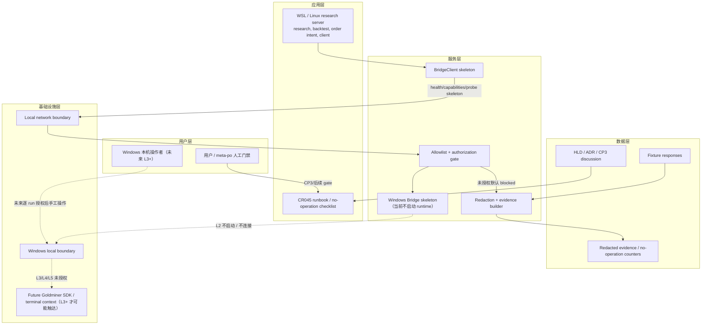
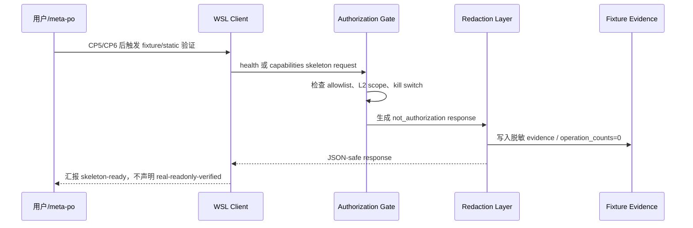
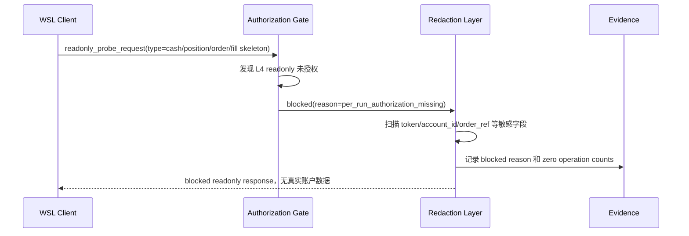

# 高层设计（HLD）：CR045 Goldminer Windows Bridge Readonly Probe

> 本 HLD 已经 CR045 CP3 人工确认通过。它确认架构边界、Story / LLD 建议和 CP3 决策项，但不授权任何真实 Goldminer runtime。

## 修订记录

| 版本 | 日期 | 修订人 | 变更要点 |
|---|---|---|---|
| 1.1 | 2026-06-11 | meta-po | 回填 CP3 approved；按用户确认补强未来高性能 Linux research server 边界：Linux/WSL 只做研究、回测、组合生成、order intent 和 bridge client，Windows trading PC 是唯一 Goldminer SDK runtime / 交易执行边界。 |
| 1.0 | 2026-06-11 | meta-se | 初始 CR045 scoped HLD，覆盖 Windows bridge 架构灰区、候选方案、推荐方案、只读 probe skeleton、安全边界、Story / LLD 建议和 CP3 输入。 |

## 1. 问题定义

### 问题陈述

用户的 Windows 电脑已经登录掘金量化，但当前 WSL 项目和未来高性能 Linux research server 都不能直接、安全、可审计地接入该环境。CR043 只证明 `gm` / `gmtrade` 存在静态候选接口，CR044 已交付 offline admission guard，但仍不授权凭据、登录、连接、账户查询、交易或 simulation/live。CR045 需要在不读取 token/account_id、不启动 bridge runtime、不连接 Goldminer 的前提下，设计一个 Windows-side bridge skeleton，使 WSL / Linux 侧未来只能通过 allowlist API 做 health、capabilities 和 readonly probe request/response skeleton，并且所有真实操作默认 fail-closed。

### 核心价值

CR045 的价值是把“Windows 已登录，WSL / 未来 Linux research server 想接入”的高风险诉求转化为可审计、分层授权的工程边界：Linux 侧只负责研究、回测、组合生成、order intent 和 bridge client 调用；Windows trading PC 是唯一 Goldminer SDK runtime 与交易执行边界。当前先交付 L2 skeleton / fixture / static validation，后续 L3/L4/L5 真实运行必须逐 run、逐动作、逐证据授权。

### 目标

| 优先级 | 目标 | 度量方式 |
|---|---|---|
| P0 | 明确 Windows bridge 为主路线，WSL / Linux research server 只调用 allowlist API | HLD 和 ADR 至少 1 条主决策；候选方案不少于 2 个；WSL / Linux direct SDK 不作为默认路线。 |
| P0 | 当前只授权 L2 skeleton / fixture-only / static validation | 不授权项覆盖 13 类；真实操作计数目标为 0；HLD/ADR 不出现真实 token/account_id 值。 |
| P0 | 定义 health、capabilities、readonly probe skeleton 合同 | HLD 至少定义 3 类 endpoint / action；每类都有输入、输出、失败路径和验证方式。 |
| P0 | 设计 blocked-first kill switch 与 allowlist | 默认 allowlist 仅含 3 类 skeleton 动作；未授权 L3/L4/L5 时所有 account/cash/position/order/fill/query/submit/cancel 返回 blocked。 |
| P1 | 给出 Story 拆解和 lld_policy | 至少 5 个 CR045 Story；每个 Story 标记 `full-lld` 或 `technical-note`，并给出触发原因。 |
| P1 | 为 meta-po 的 CP3 Decision Brief 提供决策输入 | 至少 6 个 DQ；每个 DQ 有推荐方案、备选方案、影响 / 风险和切换条件。 |

### 成功标准

- [ ] HLD 包含 4 个 Architecture Gray Areas、advisor table、至少 3 个候选架构方案、推荐方案、架构图、模块职责、关键流程、NFR、安全设计、失败路径、Use Case traceability、3 个场景模拟、ADR 候选、风险和 Story / LLD 建议。
- [ ] ADR 草案包含不少于 6 个 CR045 决策，且每个决策都有状态、推荐方案、备选方案、优劣、影响 / 风险和 when to switch。
- [ ] 讨论日志和 checkpoint 明确记录 CP3 前置方案形成输入，并标记当前用户已在 CP2 接受 L1/L2 边界，但 CP3 尚未人工批准。
- [ ] 敏感值出现数量为 0；所有 token/account_id/账号/密码/session/cookie/private key 只可作为脱敏占位或字段名出现在禁止/脱敏规则中。
- [ ] 本 HLD 不要求、不触发、不描述执行任何 Windows bridge runtime 启动、Goldminer 登录/连接、账户查询、下单/撤单、simulation/live、provider fetch、lake write 或 catalog publish。

### 约束

| 类型 | 约束内容 |
|---|---|
| 授权 | 当前仅 L1 formal CR orchestration 和 L2 Windows bridge design / skeleton / fixture-only / static validation。 |
| 不授权 | 禁止读取 token/account_id；禁止启动 Windows bridge runtime；禁止登录/连接 Goldminer；禁止账户/资金/持仓/委托/成交查询；禁止下单/撤单；禁止 simulation/live；禁止 provider fetch/lake write/catalog publish。 |
| 平台 | Windows 侧持有未来 Goldminer SDK / 终端交互边界；WSL / 未来高性能 Linux research server 只可调用本地网络 endpoint 的 allowlist contract。 |
| 依赖 | CR045 L2 不新增项目依赖，不把 `gm` / `gmtrade` 加入项目 runtime，不导入真实 SDK runtime。 |
| 安全 | token/account_id、账号、密码、session、cookie、private key、broker account、order/fill ref 等敏感材料不得进入仓库、对话、STATE、测试 fixture、日志或报告原文。 |
| 验证 | 当前只能 fixture/static；不得用真实 Windows runtime、真实 Goldminer 或真实账户状态证明通过。 |

### 非目标（Out of Scope）

- 不实现真实 Goldminer adapter，不替换 `GoldminerStubBrokerAdapter` 为真实运行态对象。
- 不读取、请求、收集、记录 token、account_id、账号、密码、session、cookie、private key。
- 不启动 Windows bridge runtime，不登录、不连接 Goldminer，不调用 `set_token`、`account`、`login`、`start`、`set_endpoint`。
- 不查询 cash、position、order、fill、execution report、account state。
- 不下单、不撤单、不启动 simulation/live。
- 不执行 provider fetch、lake write、catalog publish。
- 不声明 `real-readonly-verified`、`simulation_ready=true` 或 `live_ready=true`。
- 不修改长期 `docs/product/USE-CASES.md` / `docs/product/REQUIREMENTS.md` 基线。

### 关键假设

| 假设 | 影响 | 失效处理 |
|---|---|---|
| Windows 侧是未来持有 Goldminer SDK / 已登录终端上下文的唯一位置 | HLD 默认 bridge service 在 Windows 侧，WSL / Linux research server 只做 client、研究、回测、组合生成和 order intent 生产 | 若用户要求 WSL / Linux 持有 token/SDK，必须回退 CP3 并新增安全决策。 |
| 当前仍无 L3/L4/L5 授权 | 所有真实 runtime path 均 blocked | 若用户另行授权，必须通过 meta-po 发起逐 run gate，不得由本 HLD 自动打开。 |
| CR042/CR044 的 `BrokerAdapter`、敏感字段、operation counters、blocked-first 语义继续有效 | CR045 不绕过既有 broker-neutral 合同 | 若合同需要扩展，Story 必须 `full-lld` 并回到 CP5 确认。 |
| CR043 静态 SDK 事实仍只可作为设计输入 | capabilities 只能声明 skeleton / static candidate，不表示授权 | 若需要真实字段结构，新增 L4 readonly probe 授权。 |

### 缺失信息

| 优先级 | 缺失信息 | 影响范围 | 决策所需时限 |
|---|---|---|---|
| BLOCKING | 无阻断 CP3 HLD 草案的信息缺失 | 当前 HLD 可以基于 CP2 已批准 L1/L2 边界形成 | N/A |
| REQUIRED | Windows bridge runtime 的最终技术栈、端口、进程管理、日志位置 | 影响 CP5/CP6 实现细节，不影响 CP3 主架构 | CP5 前 |
| REQUIRED | L3/L4 run manifest 的操作者、时间窗、授权文本和证据路径 | 影响后续真实 runtime，不影响 L2 skeleton | 任何 L3+ run 前 |
| OPTIONAL | 官方本地终端 endpoint 是否存在且稳定 | 影响 WSL direct terminal endpoint 备选，不影响当前推荐方案 | 后续 Spike 或 L4 前 |

## 2. 蓝图适用性与边界承接

| 项 | 判定 | 理由 | 当前处理 | 后续触发条件 |
|---|---|---|---|---|
| `BLUEPRINT.md` | waived-for-cr-scoped-hld | CR045 是 CR044 后续 scoped bridge 设计，不重写全局 Feature / Epic 蓝图；能力边界在本 HLD §9 和 Story 建议中内联定义。 | 不生成新的全局 `BLUEPRINT.md`；不修改现有长期蓝图。 | 若 CP3 要把 Goldminer bridge 升为长期生产能力，story-planning 必须补 `FEATURE-DESIGN-MATRIX-CR045.md` 并评估是否增量回写全局蓝图。 |
| `DOMAIN-MAP.md` | waived-for-cr-scoped-hld | 领域对象沿用 CR042/CR044：authorization layer、capability state、operation counters、redaction summary、blocked result。 | 本 HLD §9 定义 CR045 增量对象：BridgeHealth、BridgeCapabilities、ReadonlyProbeRequest/Response、BridgeEvidence。 | 若新增持久状态、真实 account session 或 endpoint registry，必须回写领域图或新增 Feature 级设计。 |
| `DEPENDENCY-MAP.md` | waived-for-cr-scoped-hld | 依赖方向可在本 HLD 明确：WSL / Linux research client -> Windows bridge skeleton -> future Goldminer SDK；禁止反向依赖和真实 SDK 进入 WSL / Linux。 | 本 HLD §8/§9/§11 内联依赖图；ADR-CR045-001/002 固化。 | 若引入新进程管理、HTTP 框架、安装脚本或真实 SDK runtime，必须在 CP5/CR 中更新依赖地图。 |

## 3. 架构灰区与方案形成记录

**CP3 讨论日志**：`process/discussions/CP3-CR045-HLD-DISCUSSION-LOG.md`  
**CP3 讨论恢复点**：`process/checks/CP3-CR045-DISCUSSION-CHECKPOINT.json`

### Architecture Gray Areas

| 灰区 ID | 关键问题 | 为什么会影响架构 | 影响面 | 推荐讨论顺序 | canonical refs | 状态 |
|---|---|---|---|---|---|---|
| AGA-CR045-01 | WSL / 未来 Linux research server 如何接入 Windows 已登录 Goldminer 环境 | 决定凭据驻留、SDK runtime 位置、网络边界、依赖方向和后续安全门禁 | 范围 / 模块 / 数据 / 安全 / 验证 / 文档 | 1 | CP2 DQ-02；CR045 handoff；CR043 SPIKE-CONCLUSION；用户确认未来增加高性能 Linux 研究服务器 | approved-at-cp3 |
| AGA-CR045-02 | bridge API 边界是否只允许 health/capabilities/readonly skeleton | 决定 allowlist、kill switch、endpoint 契约和是否会误触账户查询 | 模块 / 外部接口 / 安全 / 失败路径 / QA | 2 | CP2 DQ-01/04；CR045 CR `non_authorized_scope` | recommendation-selected-for-cp3 |
| AGA-CR045-03 | token/account_id 驻留与脱敏策略 | 决定是否存在凭据读取、日志泄漏、fixture 污染和 L3 授权前置 | 数据 / 安全 / 日志 / 证据 / runbook | 3 | CP2 DQ-03；`engine/broker_adapter.py` `SENSITIVE_FIELD_PATTERNS` | recommendation-selected-for-cp3 |
| AGA-CR045-04 | L3/L4/L5 如何从 L2 skeleton 切换 | 决定后续 run gate、Story/LLD 范围、CP8 结论和风险接受 | 运行授权 / Story / 回退 / 验证 / 发布 | 4 | CP2 DQ-04/05/06；CR044 closure | recommendation-selected-for-cp3 |

### Advisor Table

#### AGA-CR045-01：接入拓扑

| Option | Pros | Cons | Impact Surface | Recommendation | Assumptions / When to switch |
|---|---|---|---|---|---|
| A. Windows-side bridge，WSL / Linux 调用 allowlist API | token/account_id 可留在 Windows 用户本地；WSL / Linux 不持有 SDK/凭据；可以集中做 kill switch、redaction、no-operation evidence | 需要设计跨 OS 本地网络边界；后续 runtime 部署多一个 Windows 进程 | 架构、网络、安全、WSL / Linux client、runbook、QA | 推荐 / CP3 approved | 当前只 L2；若 L3/L4 获批，仍用 bridge 打开最小只读动作。 |
| B. WSL / Linux 直接安装 `gm` / `gmtrade` SDK 并持有 token | 路径短，少一个 bridge 进程 | token/account_id 进入 WSL / Linux；`gmtrade` Python 3.11 不匹配；难证明 no-operation；越过 Windows 已登录上下文 | 依赖、凭据、安全、项目 runtime | 不推荐 | 只有用户明确接受 WSL / Linux 持有凭据且 CP3 重新批准安全边界才可考虑。 |
| C. WSL 直连 Windows 终端本地 endpoint | 可能复用终端已有登录态；无需自建完整 bridge SDK 层 | 官方本地 endpoint 未验证；端口、认证、字段、稳定性未知；仍可能触发真实查询 | 外部接口、运行授权、平台兼容 | 治理备选 / Spike | 只有官方或用户提供可验证本地 endpoint 文档，且 L3/L4 逐 run 授权后才切换。 |
| D. 暂停 CR045，停在 CR044 offline admission | 零 runtime 风险 | 无 bridge skeleton，无法推进 WSL client 合同 | 范围、交付、follow-up | 回退备选 | 若用户拒绝 bridge 维护成本或 CP3 不接受安全风险，关闭为 `blocked-by-runtime-authorization` 或 `not-recommended`。 |

#### AGA-CR045-02：Bridge API allowlist

| Option | Pros | Cons | Impact Surface | Recommendation | Assumptions / When to switch |
|---|---|---|---|---|---|
| A. 仅 health、capabilities、readonly probe request/response skeleton | 最小可审计；不触发账户查询；适合 fixture/static validation | 不能证明真实 readonly 字段 | API、测试、QA、runbook | 推荐 | 当前 L4 未授权；后续 L4 单次授权才新增真实 readonly endpoint。 |
| B. 提前定义 cash/position/order/fill 真实查询 endpoint 但默认 disabled | 后续扩展路径清晰 | 容易被误读为已可调用；需要更多敏感字段和错误语义 | API、redaction、安全、Story | 条件不推荐 | 仅在 CP5 后新增 run-gated Story，且 endpoint 默认返回 blocked。 |
| C. 暂不定义 readonly probe，只做 bridge health | 最保守 | 无法满足 CR045 readonly probe preparation 目标 | 范围、交付 | 回退备选 | 若 CP3 判定 readonly skeleton 仍有误授权风险，则降级到 health-only。 |

#### AGA-CR045-03：凭据与证据

| Option | Pros | Cons | Impact Surface | Recommendation | Assumptions / When to switch |
|---|---|---|---|---|---|
| A. 零敏感值持有，所有敏感值仅脱敏占位 | 泄漏风险最低；符合 CP2 | 无法验证真实账号权限 | 数据、日志、fixture、文档、QA | 推荐 | 当前 L3 未授权。 |
| B. 用户 Windows 本地配置，Agent 不读取，bridge runtime 后续只返回状态摘要 | 可支持未来 L3/L4；凭据仍不入 WSL/仓库 | 需要用户手工配置和 run manifest | runbook、Windows bridge、审计 | 后续条件推荐 | 只有 L3 逐 run 授权，且所有值只留用户本地。 |
| C. 仓库存放 `.env` 或让 Agent 读取 token/account_id | 实施方便 | 违反不授权边界；泄漏风险不可接受 | 全仓、安全、合规 | 禁止 | 不切换。 |

#### AGA-CR045-04：后续授权切换

| Option | Pros | Cons | Impact Surface | Recommendation | Assumptions / When to switch |
|---|---|---|---|---|---|
| A. L3/L4/L5 独立逐 run gate | 审计清晰；每次真实动作都有授权、时间窗、证据和 kill switch | 决策链较长 | CP3、CP5、runbook、QA、CP8 | 推荐 | 当前不授权真实 runtime。 |
| B. CP3 一次性批准到 L4 readonly | 可更快得到真实只读结果 | 超出用户当前 CP2 同意内容；需要凭据和 bridge runtime | 安全、运行、验证 | 不推荐 | 仅用户明确新授权后，由 meta-po 重发 runtime_authorization 决策。 |
| C. CR045 永久只做 skeleton，不保留后续授权入口 | 风险最低 | 后续真实验证需要重开完整设计 | follow-up、用户价值 | 治理备选 | 若用户只想交付离线工程资产，CP8 可关闭为 `readonly-bridge-skeleton-ready`。 |

### 方案形成输入与事后审查区分

| 类型 | 来源 | 影响的 HLD 章节 | 处理结果 | 说明 |
|---|---|---|---|---|
| 方案形成输入 | lane-product | §1/§5/§6/§15 | adopted | 接受用户目标是推进 bridge 工程准备，但交付结论可能只是 skeleton-ready。 |
| 方案形成输入 | lane-architecture | §4/§8/§9/§11/§14 | adopted | 选择 Windows bridge，WSL / Linux research client 不持有 SDK/凭据；真实 SDK 留到后续 Windows runtime。 |
| 方案形成输入 | lane-quality | §12/§13/§18 | adopted | 默认 blocked-first、敏感字段零泄漏、真实操作计数 0、fixture/static validation。 |
| 方案形成输入 | lane-docs-check | §17/§20 | adopted | 明确 CP3 approval 不等于 runtime authorization；所有开放项状态化。 |
| HLD 后评审意见 | CP3 review | 待 meta-po 发起 | pending | 本文件尚未进入 CP3 人工审查，不倒填为前置意见。 |

### Deferred Architecture Ideas

| ID | 想法 / 风险 / 扩展方向 | 来源 | 延后原因 | 触发切换或重启条件 |
|---|---|---|---|---|
| DAI-CR045-01 | Windows bridge 真实 runtime 服务、端口和进程管理 | AGA-01 | 当前不授权启动 runtime | L3 bridge health 单次授权 + CP5/CP6 设计证据完成。 |
| DAI-CR045-02 | 真实 cash/position/order/fill readonly probe | AGA-02 | 当前不授权账户查询 | L3 credential setup + L4 readonly probe 逐 run 授权。 |
| DAI-CR045-03 | Goldminer submit/cancel simulation 或 live | AGA-04 | 当前不授权 L5，风险高于 CR045 skeleton | L3/L4 通过后另起 L5 CR，并提供订单白名单、kill switch、回滚/对账计划。 |
| DAI-CR045-04 | WSL direct terminal endpoint | AGA-01 | 官方 endpoint 未验证 | 官方文档或用户导出证据可验证，且 CP3/CR 重新决策。 |

## 4. 候选架构方案对比

### 方案 A：Windows Bridge Skeleton + WSL / Linux Allowlist Client

**核心思路**：Windows 侧定义 bridge skeleton 和未来 SDK runtime 边界；WSL / Linux research server 只通过 allowlist client 调用 health、capabilities、readonly probe skeleton；当前所有动作 fixture/static，真实 runtime 关闭。未来高性能 Linux 服务器只承担研究、回测、组合生成和 order intent 生产，不直接持有凭据、不直接连接 Goldminer、不直接下单。

| 维度 | 评估 |
|---|---|
| 优点 | 凭据驻留在 Windows 用户本地；WSL / Linux 不持有 token/account_id；可集中实现 allowlist、kill switch、redaction、blocked-first 证据。 |
| 缺点 | 需要设计跨 OS 本地网络和未来 Windows 进程；L2 阶段不能证明真实只读字段。 |
| 复杂度 | medium |
| 实施成本 | M；需要 5-6 个 Story，其中高风险 Story 需 full-lld。 |
| 可扩展性 | 高；L3/L4/L5 可逐 run 打开，不改变 WSL / Linux 侧主契约。 |
| 风险 | 本地端口暴露、误启动 runtime、日志泄漏、CP3 被误读为运行授权。 |
| 适用前提 | 当前只允许 L2；用户接受 skeleton-ready 作为可能关闭结论；后续真实动作单独授权。 |

### 方案 B：WSL Direct SDK

**核心思路**：WSL / Linux 直接安装 `gm` / `gmtrade` 并运行 SDK 逻辑，未来由 WSL / Linux 持有 token/account_id 和账户上下文。

| 维度 | 评估 |
|---|---|
| 优点 | 架构短，少一层 bridge；如果后续授权充分，开发路径直接。 |
| 缺点 | token/account_id 进入 WSL / Linux 和项目运行面；`gmtrade` Python 3.11 wheel 不可用；更难证明 no-operation；不利用 Windows 已登录上下文。 |
| 复杂度 | medium-high |
| 实施成本 | M/L；需要依赖管理、凭据隔离和真实 SDK guard。 |
| 可扩展性 | 中；后续多 SDK / 多账号隔离复杂。 |
| 风险 | 凭据泄漏、项目依赖污染、误调用真实 SDK。 |
| 适用前提 | 用户明确授权 WSL / Linux 持有凭据并接受运行风险；当前不满足。 |

### 方案 C：WSL Direct Windows Terminal Endpoint Spike

**核心思路**：如果 Windows 掘金终端提供官方本地 endpoint，WSL 直接访问该 endpoint，而不自建 bridge SDK 层。

| 维度 | 评估 |
|---|---|
| 优点 | 可能复用终端登录态，减少自建 SDK 运行逻辑。 |
| 缺点 | endpoint 是否存在、认证、字段、稳定性均未验证；仍需 L3/L4 授权。 |
| 复杂度 | unknown |
| 实施成本 | Spike=S；生产化=M/L。 |
| 可扩展性 | 取决于官方 endpoint。 |
| 风险 | 使用未验证接口、误触真实查询、不可维护。 |
| 适用前提 | 官方文档或用户提供可验证本地 endpoint 资料；当前不满足。 |

### 方案 D：暂停 CR045

**核心思路**：不设计 bridge，停留在 CR044 offline admission 结论。

| 维度 | 评估 |
|---|---|
| 优点 | 零 runtime 风险，无新增维护成本。 |
| 缺点 | 无法推进 WSL client 合同和 readonly probe preparation。 |
| 复杂度 | low |
| 实施成本 | S |
| 可扩展性 | 低；后续需要重新启动 CR。 |
| 风险 | 用户目标无法满足。 |
| 适用前提 | 用户或 CP3 不接受 bridge 风险。 |

### 方案对比矩阵

| 维度 | 方案 A Windows bridge | 方案 B WSL direct SDK | 方案 C terminal endpoint Spike | 方案 D 暂停 |
|---|---|---|---|---|
| 适配当前授权 | 高：L2 skeleton-only | 低：需要凭据/SDK | 低：需验证 endpoint 和 runtime | 高 |
| 凭据隔离 | 高：Windows 本地驻留 | 低：WSL / Linux 持有 | 中：取决于 endpoint | 高 |
| 可验证性 | 高：fixture/static/no-op | 中：需更多 guard | 低：事实不足 | N/A |
| 维护成本 | 中 | 中/高 | 未知 | 低 |
| 后续 L3/L4 演进 | 清晰 | 风险高 | 取决于官方接口 | 需重启 |
| 平台兼容 | 高：WSL/Linux/Windows 分层 | 中：SDK runtime 限制 | 未知 | N/A |
| 安全风险 | 中，可通过 gate 管控 | 高 | 中/高 | 低 |

**推荐方案**：方案 A，理由：它在满足用户“Windows 已登录，WSL / 未来 Linux research server 需受控接入”目标的同时，把 token/account_id 和真实 SDK runtime 留在 Windows 用户边界内，并允许 L2 用 fixture/static 证明 no-operation，而不误授权 L3/L4/L5。

## 5. 推荐方案总览

**复杂度模式**：`standard`

| 判定维度 | 依据 | 结论 |
|---|---|---|
| 需求规模 | bridge skeleton、WSL client、allowlist、redaction、kill switch、runbook、no-op validation | medium |
| 角色数量 | 用户、meta-po、meta-se、meta-dev、meta-qa；未来 Windows operator | medium |
| 状态流转 | L1/L2 当前授权，L3/L4/L5 后续逐 run | high-risk state gating |
| 平台适配 | Windows + WSL + future Linux research server | standard |
| Story 拆解 | 5-6 个 Story，多个 full-lld | standard |

**系统核心思路**：Windows bridge 是未来唯一触碰 Goldminer SDK / 终端环境的边界；WSL / Linux research client 只发送 allowlist skeleton 请求，并只接收脱敏、not-authorization 响应。当前 L2 只实现合同、fixture、静态扫描和 blocked-first 证据，不启动 runtime、不读取凭据、不查询账户。

**关键架构风格**：分层 + boundary gateway + fail-closed authorization gate。

**核心能力边界**：

- 做：bridge skeleton、WSL / Linux client contract、health/capabilities schema、readonly probe skeleton、allowlist、kill switch、redaction、fixture/static validation、runbook。
- 不做：凭据读取、真实 runtime 启动、Goldminer 登录/连接、账户查询、交易、simulation/live、provider/lake/catalog。

**关键依赖**：

- `engine/broker_adapter.py`：既有 broker-neutral 合同、敏感字段模式、operation counters、blocked reasons。
- CR043 工程事实：`gm` / `gmtrade` 静态候选，仅作为设计输入。
- CR044 offline admission guard：blocked-first、redaction、kill switch、fixture/static 验证边界。
- Meta Flow gate：CP3 仅为架构确认，CP5/CP6/CP7/CP8 后续独立门控。

**适用条件**：

- 用户接受当前交付可能是 `readonly-bridge-skeleton-ready`，不是 `real-readonly-verified`。
- 所有真实运行均通过 meta-po 另行发起 runtime_authorization 决策。
- WSL / Linux 不持有 token/account_id，不直接导入或调用 Goldminer SDK。
- 未来高性能 Linux research server 只承担研究、回测、组合生成和 order intent 生产；不得直接连接 Goldminer、不得直接下单。

**产物形态**：

- Agent 数量：0 个新增 Agent。
- Skill 数量：0 个新增 Skill。
- 工具脚本：后续 Story 可新增 0-2 个静态扫描 / fixture 生成脚本，本 HLD 不实现。
- 目标平台：Windows bridge skeleton + WSL / Linux Python client；当前仅设计输入。

## 6. 适用性矩阵

| 适用性维度 | 当前项目判断 | 推荐方案如何适配 | 不适配信号 | When to switch |
|---|---|---|---|---|
| 用户目标 | Windows 已登录，WSL / 未来 Linux research server 要受控接入 | 用 Windows bridge 保留本地登录/凭据边界，WSL / Linux 只调用 allowlist | 用户要求 WSL / Linux 直接持有 token/account_id | 回退 CP3，转安全决策，不得静默切换。 |
| 项目成熟度 | 已有 CR042/CR044 broker guard，但无真实 Goldminer runtime 授权 | 复用既有 blocked-first 合同，新增 CR-scoped bridge skeleton | 需要生产级 Windows service / installer | 进入 Feature 设计和平台安装 CR。 |
| 认知负担 | 高风险外部 broker 接入，需要避免误授权 | 用 L1-L5 分层和 not-authorized table 固化边界 | 用户把 CP3 误认为允许查询或交易 | meta-po CP3 brief 必须重列不授权项。 |
| 验证条件 | 仅 fixture/static；不可真实连接 | health/capabilities/probe skeleton 均可离线验证 | 用户要求 real-readonly evidence | 先申请 L3/L4 run gate。 |
| 回退成本 | scoped CR，可退回 CR044 offline admission | 不改全局 HLD/需求，不新增依赖 | bridge skeleton 已进入共享 runtime | 回退需 CR，清除 bridge runtime 和依赖。 |

### 优化 / 牺牲 / 切换条件

| 方案选择 | 优化了什么 | 牺牲了什么 | 接受理由 | 切换条件 |
|---|---|---|---|---|
| Windows bridge L2 skeleton | 凭据隔离、可审计、no-operation、后续分层授权 | 短期无法证明真实只读字段 | 当前授权边界只允许 L2 | L3/L4 逐 run 授权后，新增真实 readonly probe Story。 |
| WSL / Linux allowlist client | Linux 侧简单、稳定、低权限 | 多一层 bridge 调用 | 防止 WSL / Linux 持有 SDK/凭据 | 若用户明确选择 direct SDK 且接受风险，回退 CP3。 |
| Blocked-first kill switch | 防误运行 | 初期所有真实动作 blocked | 外部 broker 风险高 | 只有 per-run authorization + kill switch explicitly enabled 才切换。 |

## 7. Use Case → Architecture Traceability

| Use Case | 支撑模块 / 组件 | 关键流程 | 异常 / 失败路径 | 验证方式 | 备注 |
|---|---|---|---|---|---|
| UC-CR045-01 WSL 检查 bridge skeleton 是否存在 | WSL client、Bridge health contract | WSL client 构造 health request -> fixture transport -> health response | bridge 未启动或 L2 fixture 模式：返回 `blocked_runtime_not_authorized` 或 fixture health，不启动 runtime | fixture/static | 不代表真实 Windows runtime 正在运行。 |
| UC-CR045-02 WSL 获取 capabilities | WSL client、Bridge capabilities、BrokerAdapter capability projection | client 请求 capabilities -> bridge 返回 `real_broker_enabled=false`、`readonly_probe_ready=false`、`not_authorization=true` | 出现 `simulation_ready=true` / `live_ready=true` / 敏感字段则失败 | fixture tests + artifact scan | capabilities 是合同能力，不是运行授权。 |
| UC-CR045-03 只读 probe skeleton | ReadonlyProbeRequest/Response、allowlist、kill switch | client 发送脱敏 probe skeleton -> allowlist 检查 -> L4 未授权 -> blocked response | 请求含 token/account_id 或真实 query type -> redacted/blocked；真实操作计数非零 -> blocked | fixture/static | 不查询 cash/position/order/fill。 |
| UC-CR045-04 用户准备后续 L3/L4 授权 | Runbook、per-run gate descriptor | runbook 指明需 meta-po 发起授权 -> 用户确认 -> 新 run gate | 用户直接提供 token/account_id -> 停止，要求不要在对话/仓库记录 | 人工审查 | 本 HLD 不创建授权。 |

## 8. 关键场景模拟

| 模拟 ID | 场景 | 输入 / 前置条件 | 推荐架构执行路径 | 预期输出 | 失败 / 回退路径 | 结果 |
|---|---|---|---|---|---|---|
| SIM-CR045-01 | WSL health skeleton | L2 fixture 模式；无 Windows runtime；无凭据 | WSL client -> fixture transport -> BridgeHealth schema | `status=blocked_or_fixture`、`runtime_started=false`、`not_authorization=true`、operation counts 全 0 | 若实现尝试启动 runtime，CP6/CP7 阻断并回退 S02/S03 | PASS |
| SIM-CR045-02 | capabilities skeleton | L2 fixture；CR043 静态事实可引用 | WSL client -> capabilities response builder -> redaction/no-op guard | `real_broker_enabled=false`、`simulation_ready=false`、`live_ready=false`、`readonly_probe_allowed=false` | 若将 SDK 静态候选写成已授权能力，CP3/CP5 返工 | PASS |
| SIM-CR045-03 | readonly probe request skeleton | 请求不含敏感值；L4 未授权 | client -> allowlist -> kill switch -> blocked readonly response | `status=blocked`、reason=`goldminer_readonly_query_not_authorized` 或 `per_run_authorization_missing`，无 cash/position/order/fill 数据 | 若请求包含 token/account_id，立即 redacted/blocked；若需要真实查询，转 L4 gate | PASS |

## 9. 系统架构图

## 10. 高层模块与职责划分

| 模块名称 | 类型 | 职责 | 输入 | 输出 | 依赖 |
|---|---|---|---|---|---|
| BridgeClient skeleton | WSL / Linux client | 构造 health/capabilities/readonly probe skeleton 请求；处理 blocked response | WSL 命令 / future research server / future adapter 调用 | JSON-safe response / blocked result | Bridge API contract |
| Bridge API contract | Contract | 定义 endpoint/action、schema、状态码、blocked reasons 和 redaction 要求 | HLD/ADR/LLD | API schema / fixture | CR042/CR044 blocked-first |
| Authorization gate | Service boundary | 校验 L1-L5 授权层、allowlist、kill switch、per-run authorization | Request metadata、run gate descriptor（未来） | allowed/blocked decision | CP2/CP3 decisions |
| Redaction layer | Service boundary | 阻断或脱敏敏感字段；生成 no-operation evidence | Request/response/evidence payload | redacted payload、violations | `SENSITIVE_FIELD_PATTERNS` |
| Windows Bridge skeleton | Windows-side skeleton | 表达未来 runtime 边界；当前不启动、不连接、不读取凭据 | Fixture / static config placeholder | health/capability fixture | Windows local boundary |
| Readonly probe skeleton | Contract / fixture | 定义只读 probe request/response 外形，L4 未授权时返回 blocked | Probe type、placeholder symbols | blocked readonly response | Authorization gate |
| Runbook / no-operation checklist | Documentation | 告知用户如何后续申请 L3/L4/L5，列明禁止事项 | HLD/ADR/Story | 人工可读操作边界 | meta-po gates |

**模块边界规则**：

- WSL / Linux client 只能消费 bridge allowlist API，不直接导入 `gm` / `gmtrade`，不读取 token/account_id。
- Windows Bridge skeleton 当前只代表设计边界和 fixture 行为，不启动 runtime、不连接 Goldminer。
- Authorization gate 默认 deny；没有 per-run authorization 时，readonly/submit/cancel/simulation/live 全部 blocked。
- Redaction layer 不保存真实敏感值；如果出现敏感字段，输出只能是脱敏摘要或 blocked reason。
- BrokerAdapter 集成只能通过后续 Story/LLD 显式完成；CR045 HLD 不把 bridge 直接接入交易执行路径。

## 11. 技术选型与理由

| 选型类别 | 选择 | 备选方案 | 选择理由 | 风险 |
|---|---|---|---|---|
| 拓扑 | Windows bridge + WSL / Linux client | WSL / Linux direct SDK；terminal endpoint Spike | 隔离凭据和 SDK runtime，适配 Windows 已登录事实 | 本地网络和未来进程管理需 CP5/CP6 设计。 |
| 当前运行方式 | fixture/static only | 真实 bridge runtime | 符合 CP2 授权；真实操作计数可保持 0 | 无法证明真实只读字段。 |
| 数据交换 | JSON-safe schema | Python object / SDK object 透传 | 易审计、易脱敏、跨 OS 稳定 | 字段结构需要后续 L4 确认。 |
| 权限模型 | L1-L5 分层 + allowlist + kill switch | 单一布尔开关 | 可表达 CR045 当前不授权和后续逐 run | 决策表较长，需要 runbook 解释。 |
| SDK 策略 | 不在 L2 项目 runtime 导入 `gm` / `gmtrade` | 预埋真实 SDK import | 避免依赖污染和误调用 | 后续真实 runtime 需要新增设计。 |
| 依赖管理 | 不新增依赖；Python 命令后续统一 `uv run` | pip / 手工 venv | 符合项目规则 | Windows 侧未来 runtime 需单独依赖方案。 |

## 12. 关键流程

### 主流程：L2 health / capabilities skeleton

### 扩展流程：readonly probe skeleton 被阻断

### 失败流程：请求或 artifact 含敏感值

| 步骤 | 行为 |
|---|---|
| 1 | Redaction layer 扫描请求、fixture、日志、证据 payload。 |
| 2 | 命中 token/account_id/password/session/cookie/private_key 等字段或疑似真实值时，返回 `blocked` 或仅保存 `<REDACTED_*>` 占位。 |
| 3 | 证据只记录字段类别、计数、blocked reason，不记录原值。 |
| 4 | 若敏感值来自用户对话或仓库文件，停止当前任务并交回 meta-po 处理安全决策。 |

### 回退流程：CP3 不接受 Windows bridge

| 用户 / 门禁反馈 | 回退目标 | 处理 |
|---|---|---|
| `reject` | CR044 offline admission | CR045 关闭为 `not-recommended` 或 `blocked-by-runtime-authorization`。 |
| `修改: 改为 WSL direct SDK` | CP3 重新设计 | 新增 security DQ；评估 WSL 持有凭据、依赖和 `gmtrade` runtime 风险。 |
| `修改: 直接做真实 readonly` | runtime_authorization gate | meta-po 发起 L3/L4 决策；HLD 不自动授权。 |

## 13. 非功能需求设计

| 质量特征 | 设计目标 | 实现手段 | 验证方式 |
|---|---|---|---|
| 安全性 | 真实敏感值泄漏数 = 0；真实操作计数 = 0 | 零敏感值持有、redaction、allowlist、kill switch、blocked-first | artifact scan、fixture tests、manual review |
| 可靠性 | 未授权、缺 runtime、缺配置时 100% fail-closed | 默认 deny、明确 blocked reasons、operation counters | negative fixture tests |
| 可维护性 | endpoint/action 不超过 3 类 L2 skeleton；L3+ 必须新 Story | health/capabilities/readonly skeleton 三类合同 | LLD review |
| 可追溯性 | 每个真实动作都有对应授权层级和 DQ | L1-L5 状态表、ADR、runbook | CP3/CP5/CP8 Decision Brief |
| 平台兼容 | WSL / Linux 不依赖 Windows SDK package；Windows runtime 后续可独立演进 | JSON-safe API + fixture transport | static compatibility review |
| 可测试性 | L2 无需 Windows runtime 即可验证合同 | fixture responses、static scan、zero counter evidence | pytest/static scan after CP5/CP6 |
| 性能 | L2 skeleton 单次 fixture response 目标 < 1 秒 | 无真实网络；本地 schema 构造 | 后续单元测试计时，不作为 CP3 阻断 |

## 14. 安全 / 权限设计

### 授权分层

| 层级 | 当前状态 | 允许动作 | 禁止动作 |
|---|---|---|---|
| L1 formal CR orchestration | approved | 更新 CR / checkpoint / handoff / design docs | 任何 runtime 和凭据动作 |
| L2 bridge skeleton / fixture-only | approved by CP2, pending CP3 | HLD、ADR、bridge/client skeleton、fixtures、static validation、runbook | 启动 bridge runtime、读取凭据、连接 Goldminer、账户查询、交易 |
| L3 Windows credential local setup | not-authorized | N/A | 读取 token/account_id、生成真实配置、访问 Windows 凭据 |
| L4 readonly probe | not-authorized | N/A | 查询 cash/position/order/fill/account state |
| L5 submit/cancel/simulation/live | not-authorized | N/A | 下单、撤单、simulation/live、provider/lake/catalog |

### 不授权项

| 不授权项 | 当前状态 | HLD 处理 |
|---|---|---|
| 读取 `.env`、token、account_id、账号、密码、session、cookie、private key | not-authorized | 只允许 `<REDACTED_TOKEN>` / `<REDACTED_ACCOUNT_ID>` 等占位。 |
| 启动 Windows bridge runtime | not-authorized | HLD 只定义 skeleton 和 future boundary。 |
| 登录 / 连接 Goldminer | not-authorized | 所有 login/connect path 在 L2 blocked。 |
| 查询资金 / 持仓 / 委托 / 成交 / account state | not-authorized | readonly probe 只定义 request/response skeleton，返回 blocked。 |
| 下单 / 撤单 | not-authorized | L5 后续 CR 才可讨论。 |
| simulation/live | not-authorized | capabilities 必须保持 false。 |
| provider fetch / lake write / catalog publish | not-authorized | 不进入 CR045 Story。 |

### 敏感字段策略

| 类别 | 示例 | L2 行为 |
|---|---|---|
| 凭据 | token、secret、password、passwd、trade_password、private_key | 不读取、不记录；fixture 中出现也必须 blocked 或 redacted。 |
| 账户 | account_id、broker_account、real_account | 只可写 `<REDACTED_ACCOUNT_ID>`，不得出现真实值。 |
| 会话 | session、cookie | 不读取、不记录。 |
| 订单/成交标识 | broker_order_id、client_order_id、entrust_no、order_id、execution_id | L2 fixture 用假值或脱敏占位；真实值需 L5 后续。 |
| endpoint / runtime | endpoint、login context | 当前只可写占位；不读取真实配置。 |

## 15. 失败路径与阻断语义

| 触发条件 | 期望结果 | blocked reason 候选 | 证据 |
|---|---|---|---|
| L4 未授权但收到 readonly probe | 返回 blocked，无真实账户数据 | `per_run_authorization_missing` / `goldminer_readonly_query_not_authorized` | redacted evidence + operation_counts=0 |
| 请求含 token/account_id | 返回 blocked 或 redacted response | `sensitive_material_present` | 不保存原值，只记录字段类别 |
| bridge runtime 未启动 | health 返回 fixture/blocked，不尝试启动 | `windows_bridge_runtime_not_authorized` | runtime_started=false |
| allowlist 不包含 action | 返回 blocked | `operation_not_whitelisted` | action name + no sensitive value |
| kill switch 默认关闭 | 返回 blocked | `global_kill_switch_disabled` | kill_switch_state=disabled |
| 任何真实操作计数非零 | 阻断 CP6/CP7，不得发布 | `forbidden_operation_nonzero` | counter name only |
| 用户要求真实查询 | 停止并交回 meta-po runtime gate | `runtime_authorization_required` | pending decision item |

## 16. 主要风险与应对

| 风险 ID | 风险描述 | 概率 | 影响 | 应对策略 | 触发信号 |
|---|---|---|---|---|---|
| R-CR045-001 | CP3 被误读为允许启动 bridge runtime | 中 | 高 | HLD/ADR/CP3 brief 重复声明 CP3 不授权 runtime；capabilities `not_authorization=true` | 用户要求“现在连一下”或产物写 runtime-ready |
| R-CR045-002 | token/account_id 泄漏到仓库、日志或对话 | 中 | 高 | 零敏感值持有；redaction；artifact scan；占位符策略 | 出现疑似真实账号/凭据字符串 |
| R-CR045-003 | WSL / Linux direct SDK 被后续实现误选为捷径 | 中 | 高 | ADR 固化 Windows bridge 主选；WSL / Linux 禁止 SDK/凭据 | 代码出现 `gm` / `gmtrade` import 或 token 参数 |
| R-CR045-004 | readonly skeleton 被误认为 real-readonly-verified | 中 | 高 | 响应字段包含 `status=blocked`、`not_authorization=true`、`real_readonly_verified=false` | 文档或报告称已验证真实资金/持仓 |
| R-CR045-005 | 本地 bridge endpoint 暴露过宽 | 低/中 | 高 | 只绑定本地、allowlist、future pairing/HMAC 需 L3+ 设计 | 设计引入公网/0.0.0.0 或无认证 |
| R-CR045-006 | `gmtrade` Python runtime 差异影响后续路线 | 中 | 中 | 继续将 `gm` 作为主选静态候选，`gmtrade` 仅 fallback | 后续必须使用 `gmtrade` 独有能力 |
| R-CR045-007 | CR045 Story 过早接入 BrokerAdapter 执行路径 | 低/中 | 高 | CP5 full-lld 明确 dev_gate；未获 L3+ 时只允许 blocked-first | Story 输出文件改动 execution runner |

## 17. ADR 候选决策点

| ADR ID | 决策问题 | 建议决定 | 约束此决策的因素 |
|---|---|---|---|
| ADR-CR045-001 | Windows bridge vs WSL / Linux direct SDK | 选择 Windows bridge skeleton + WSL / Linux allowlist client | CP2 DQ-02；token/account_id 不进 WSL / Linux；`gmtrade` runtime 风险；未来 Linux research server 只做研究 / 回测 / order intent |
| ADR-CR045-002 | Bridge API allowlist | L2 只允许 health、capabilities、readonly probe skeleton | L4 未授权；避免账户查询 |
| ADR-CR045-003 | 凭据驻留与脱敏 | token/account_id 仅在未来用户 Windows 本地，Agent 不读取不记录 | CP2 DQ-03；敏感字段模式 |
| ADR-CR045-004 | Kill switch 与 authorization gate | 默认 hard-off；无 per-run 授权则所有真实动作 blocked | CP2 DQ-04；CR044 guard |
| ADR-CR045-005 | L3/L4/L5 切换 | 后续逐 run gate，不由 CP3 自动授权 | CP2 DQ-06；Meta Flow gate |
| ADR-CR045-006 | Story / LLD 策略 | S01-S05 full-lld，S06 technical-note/条件升 full-lld | 外部接口、安全、权限、跨模块合同 |

ADR 正文草案见 `docs/design/ARCHITECTURE-DECISION-CR045.md`。

## 18. 分阶段落地建议

| 阶段 | 交付物 | 里程碑标志 | 前提条件 |
|---|---|---|---|
| CP3 solution-design | 本 HLD、ADR、discussion log、checkpoint | meta-po 可据此发起 CP3 Decision Brief | CP2 已 approved；当前 HLD 草案完成 |
| CP4 story-planning | `FEATURE-DESIGN-MATRIX-CR045.md`、Story cards、Development Plan | Story DAG / lld_policy 明确 | CP3 人工 approved |
| CP5 design evidence | S01-S05 full-lld、S06 technical-note 或 full-lld | 全量设计证据可审查 | CP4 自动预检 PASS |
| CP6 L2 implementation | bridge/client skeleton、fixtures、static scans、runbook | 不启动 runtime，真实操作计数 0 | CP5 approved |
| CP7 verification | fixture/static 验证报告 | no-operation、redaction、allowlist、blocked-first 可审计 | CP6 PASS |
| CP8 delivery readiness | skeleton-ready / blocked-by-runtime-authorization / not-recommended 结论 | 用户确认交付或风险 | CP7 完成 |
| Future L3/L4/L5 | 独立 run authorization / follow-up CR | 可尝试真实 bridge health 或 readonly probe | 用户单独授权，不由 CR045 CP3 自动触发 |

## 19. Story 拆解建议与 lld_policy

| Story ID | 标题 | 推荐 lld_policy | 触发原因 | 主要输出候选 | 依赖 | dev_gate |
|---|---|---|---|---|---|---|
| CR045-S01 | Windows bridge security boundary and authorization model | full-lld | security、permission、runtime_authorization、shared-story-boundary | L1-L5 model、not-authorized table、sensitive field policy | CP3 | CP5 approved；不得读取凭据。 |
| CR045-S02 | Bridge health and capabilities skeleton | full-lld | cross-module-contract、external-interface、data-model | health schema、capabilities schema、blocked capabilities、fixture responses | S01 | 不启动 Windows runtime；不导入 SDK。 |
| CR045-S03 | WSL client contract and network precheck | full-lld | cross-platform-contract、external-interface、failure-path | client request/response、network precheck contract、runtime-not-started behavior | S01/S02 | 不连接真实 bridge runtime；fixture transport only。 |
| CR045-S04 | Readonly probe allowlist and blocked-first response | full-lld | external-interface、security、permission、rollback | readonly probe request/response skeleton、allowlist、blocked reasons | S01/S02/S03 | 不查询 cash/position/order/fill。 |
| CR045-S05 | Redaction evidence and no-operation static validation | full-lld | security、audit、validation、data-model | redacted evidence schema、operation count scan、artifact scan | S01-S04 | 敏感值只用占位；真实操作计数必须 0。 |
| CR045-S06 | User runbook and L3/L4/L5 follow-up gate | technical-note；若生成自动 manifest/schema 则 full-lld | docs-handoff、runtime_authorization、follow_up_tracking | runbook、future run manifest outline、CP8 wording | S01-S05 | 不授权真实 run；只说明如何申请。 |

推荐 Wave：

| Wave | Story | 并行性 | 说明 |
|---|---|---|---|
| W1 | S01 | 串行 | 安全和授权根合同。 |
| W2 | S02、S03 | 可并行但共享 S01 合同 | bridge/server skeleton 与 client contract 可并行设计。 |
| W3 | S04、S05 | 可并行但共享 S02/S03 | readonly blocked-first 与 redaction evidence。 |
| W4 | S06 | 串行收敛 | runbook 汇总全部边界。 |

Feature 级实现设计触发条件：

| Feature / Epic | 判定 | 触发原因 | 目标输出路径 | 阻塞状态 |
|---|---|---|---|---|
| FEAT-CR045-BRIDGE | required after CP3 | cross-module-contract、security、permission、external-interface、rollback、shared-story-boundary | `docs/design/FEATURE-DESIGN-MATRIX-CR045.md`；必要时 `docs/features/cr045-goldminer-bridge/DESIGN.md` / `TEST-PLAN.md` / `TASKS.md` | CP3 未确认前不得生成。 |

## 20. 工作量粗估

| 类别 | Story 数 | 预计 Wave 数 | 粗估工作量 |
|---|---:|---:|---|
| Windows bridge / WSL client skeleton | 3 | W1-W2 | M |
| allowlist / readonly blocked-first / redaction | 2 | W3 | M |
| 文档 / runbook / follow-up gate | 1 | W4 | S |
| **合计** | **6** | **4** | **M/L（高安全审计密度）** |

## 21. 待确认问题

| 问题 ID | 状态 | 问题描述 | 优先级 | 影响范围 | 负责人 | 目标答复时间 |
|---|---|---|---|---|---|---|
| Q-CR045-01 | decision-item | CP3 是否接受 Windows bridge 作为主路线，WSL / Linux direct SDK 作为不推荐备选 | REQUIRED | 架构主线、Story、ADR | user via meta-po | CP3 |
| Q-CR045-02 | decision-item | CP3 是否接受 API allowlist 仅包含 health/capabilities/readonly skeleton | REQUIRED | API、LLD、验证 | user via meta-po | CP3 |
| Q-CR045-03 | decision-item | CP3 是否接受 token/account_id 只留未来 Windows 本地，Agent 不读取不记录 | REQUIRED | 安全、runbook、redaction | user via meta-po | CP3 |
| Q-CR045-04 | decision-item | CP3 是否接受 L3/L4/L5 后续逐 run gate | REQUIRED | 后续授权、CP8 结论 | user via meta-po | CP3 |
| Q-CR045-05 | non-blocking-open | Windows bridge future runtime 端口、进程管理、认证方式 | REQUIRED | CP5/CP6 LLD | meta-dev after CP3 | CP5 |
| Q-CR045-06 | non-blocking-open | 官方 terminal local endpoint 是否可用 | OPTIONAL | 备选方案 C | user / future Spike | 后续 CR |

## 22. CP3 Decision Brief 输入

| 决策 ID | 决策类型 | 待确认问题 | 推荐方案 | 备选方案 | 优劣分析 | 影响 / 风险 | 回退 / 切换条件 |
|---|---|---|---|---|---|---|---|
| DQ-CP3-CR045-01 | architecture | WSL / 未来 Linux research server 如何接入 Windows Goldminer 环境？ | Windows-side bridge skeleton + WSL / Linux allowlist client；Linux 侧只做研究、回测、组合生成、order intent 和 client 调用。 | A: WSL / Linux direct SDK；B: WSL / Linux direct terminal endpoint Spike；C: 暂停 CR045。 | 推荐方案隔离凭据和 SDK runtime；A 简短但凭据进 WSL / Linux；B 事实不足；C 无工程进展。 | 决定拓扑、依赖方向、安全边界和未来 Linux 研究服务器部署边界。 | 若官方 endpoint 可验证且用户授权 L3/L4，可切 B；若拒绝 bridge 风险，回退 C。 |
| DQ-CP3-CR045-02 | architecture | Bridge API 边界如何限定？ | L2 仅 health、capabilities、readonly probe skeleton，真实 readonly 默认 blocked。 | A: 提前定义真实查询 endpoint 但 disabled；B: health-only。 | 推荐方案覆盖 CR045 目标且不过度暴露；A 容易误授权；B 覆盖不足。 | 影响 API、Story、QA 和 runbook。 | 若 CP3 认为 readonly skeleton 仍过宽，降级 health-only；若 L4 授权后新增真实 endpoint。 |
| DQ-CP3-CR045-03 | security | token/account_id 如何驻留和脱敏？ | 仅未来用户 Windows 本地持有；Agent/WSL/Linux server/仓库/对话不读取不记录。 | A: 用户提供无真实值结构文档；B: WSL / Linux 持有凭据。 | 推荐方案泄漏风险最低；A 可补设计事实；B 当前不可接受。 | 防止敏感值泄漏和误运行。 | 任何步骤需要真实值，暂停并发起 L3 安全授权。 |
| DQ-CP3-CR045-04 | runtime_authorization | kill switch 和 allowlist 默认状态？ | 默认 hard-off；无 per-run 授权或 action 不在 allowlist 则 blocked。 | A: 仅日志警告不阻断；B: CP3 一次性授权 L4。 | 推荐方案 fail-closed；A 风险高；B 超出当前授权。 | 影响失败路径、验证和未来 runtime。 | 后续 L3/L4 run manifest 明确允许时，按单次授权打开。 |
| DQ-CP3-CR045-05 | risk_acceptance | 是否接受 CR045 可能只关闭为 skeleton-ready？ | 接受 `readonly-bridge-skeleton-ready` 或 `blocked-by-runtime-authorization`，不宣称 real-readonly-verified。 | A: 等 L4 后再推进；B: 取消 CR045。 | 推荐方案先交付安全工程准备；A 阻塞；B 放弃用户目标。 | 影响 CP8 预期和用户验收。 | 若用户要求真实只读验证，必须先 L3/L4 授权。 |
| DQ-CP3-CR045-06 | implementation | Story / LLD 批次如何划分？ | S01-S05 full-lld，S06 technical-note/条件升 full-lld，CP3 后再进入 story-planning。 | A: 只做 S01-S03；B: 加入真实 L4/L5 Story。 | 推荐方案覆盖安全、bridge、client、readonly、redaction、runbook；A 覆盖不足；B 越权。 | 决定 CP5 设计证据范围。 | 若 scope 需缩小，可延后 S06；不得加入真实 runtime。 |

## 23. HLD 自审记录

| 自审项 | 结果 | 证据 / 说明 |
|---|---|---|
| Architecture Gray Areas 已前置处理 | PASS | 本 HLD §3；discussion log / checkpoint 已指定 CR045 scoped 路径。 |
| Advisor table 已影响推荐方案 | PASS | AGA-CR045-01..04 均进入 §4、§5、§22。 |
| 至少 2 个候选方案 | PASS | §4 提供 4 个候选方案。 |
| 适用性矩阵完整 | PASS | §6 覆盖用户目标、成熟度、认知负担、验证条件、回退成本。 |
| Use Case Traceability 完整 | PASS | §7 覆盖 4 个 CR045 scoped UC。 |
| 关键场景模拟通过 | PASS | §8 三个 L2 场景均 PASS；仅证明 skeleton/blocked-first，不证明真实 runtime。 |
| NFR、安全、失败路径明确 | PASS | §13、§14、§15。 |
| HLD / ADR / Risk / NFR 内部一致 | PASS | ADR 草案见 `docs/design/ARCHITECTURE-DECISION-CR045.md`；均保持 L3/L4/L5 not-authorized。 |
| HLD 拆分原则已评估 | PASS | CR045 围绕一个核心产物 Windows bridge skeleton；Story=6 但同一 Feature 强耦合，保持单份 HLD。 |
| 蓝图适用性已评估 | PASS_WITH_WAIVER | §2 明确 CR-scoped waived，不改写全局 BLUEPRINT/DOMAIN/DEPENDENCY。 |
| 不授权边界可见 | PASS | §1/§14/§22 均列出不授权项。 |

## 24. CP3 确认记录

**CP3 自动预检结果**：待 meta-po 生成，建议路径 `process/checks/CP3-CR045-HLD-CONSISTENCY.md`  
**CP3 人工 checklist**：待 meta-po 生成，建议路径 `process/checkpoints/CP3-CR045-HLD-REVIEW.md`

**确认状态**：待审核。本 HLD 未获得 CP3 人工确认。
