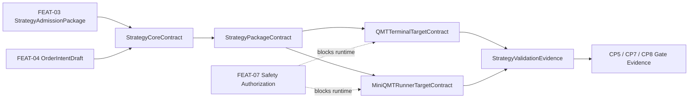

# HLD CR046 QMT / MiniQMT 双目标策略交付框架

## 修订记录

| 版本 | 日期 | 修订人 | 变更要点 |
|---|---|---|---|
| 1.0 | 2026-06-13 | meta-po | 初版 HLD，定义 framework-first 架构、策略包契约、QMT terminal target、MiniQMT runner target、验证框架和后续 CR 门禁 |
| 1.1 | 2026-06-13 | meta-po | 用户通过 CP3，接受 FEAT-09、平台无关 StrategyCoreContract、MiniQMT install dry-run 设计、验证证据分级和 CR047/CR051 后置 |

## 问题定义

CR046 已由用户在 CP2 批准为 framework-first：先定义 QMT terminal 与 MiniQMT runner 双目标策略交付框架、验证框架、MiniQMT runner 安装设计和策略包契约；不交付具体策略，不做 QMT 运行验证，不连接 MiniQMT，不 submit/cancel。

本 HLD 要解决 4 个设计问题：

| 问题 ID | 问题 | 成功标准 |
|---|---|---|
| P-01 | 如何让同一研究策略核心同时面向 QMT terminal 与 MiniQMT runner | 至少定义 1 个平台无关策略核心合同、2 个 target adapter 合同和 1 个策略包目录合同 |
| P-02 | 如何避免框架设计被误读为真实运行授权 | 所有真实运行、连接、凭据、账户查询、submit/cancel、simulation/live 项均标记 not-authorized，计数目标为 0 |
| P-03 | 如何让 MiniQMT runner 安装设计提前冻结但不触碰真实环境 | 安装设计覆盖 Windows 目录、uv、依赖隔离、配置、日志、kill switch、upgrade/uninstall/rollback 共 7 类字段 |
| P-04 | 如何把后续具体策略交付和研究框架完善从 CR046 分离 | CR047 / CR049 / CR051 候选均有进入条件、消费对象和阻断条件 |

## Architecture Gray Areas

| 问题 | Option | Pros | Cons | Impact Surface | Recommendation | Assumptions / When to switch |
|---|---|---|---|---|---|---|
| 双目标能力放在哪个 Feature | 独立 FEAT-09 | 策略交付合同不污染 gateway/runtime/OMS 边界；后续 CR047 可直接消费 | 增加一个 Feature 入口 | BLUEPRINT、DOMAIN-MAP、DEPENDENCY-MAP、HLD、ADR | 采用 FEAT-09 | 若 MiniQMT 路线长期放弃，可降级为 FEAT-05/06 子能力 |
| 策略核心是否允许导入 QMT/MiniQMT API | 允许 target adapter 导入，禁止 core 导入 | 保持双目标可复用；静态 guardrail 清晰 | target adapter 需要额外边界设计 | 策略包、测试、后续策略交付 | 禁止 core 导入 QMT / XtQuant | 若策略完全 QMT-only，需另起 CR 改范围 |
| MiniQMT runner 本轮做到什么程度 | 安装设计 + install dry-run 方案 | 冻结目录和依赖，不触碰真实环境 | 无真实运行证据 | runner 安装、文档、验证计划 | 只设计，不安装 / 不连接 | MiniQMT 权限就绪后进入 CR049 |
| 验证框架是否包含 QMT terminal shadow | 包含计划和证据格式，不执行 | 后续运行验证可直接消费 | 当前无法证明 runtime | validation、runbook、CP7 | 仅定义计划 | 用户另起 runtime authorization 后执行 |

## 推荐架构

采用 FEAT-09 作为双目标策略交付框架边界，内部拆分为 5 个设计对象：

| 模块 | 职责 | 输入 | 输出 | 禁止事项 |
|---|---|---|---|---|
| StrategyCoreContract | 定义平台无关策略核心输入、输出、风险假设和 order intent 语义 | FEAT-03 StrategyAdmissionPackage、FEAT-04 OrderIntentDraft | strategy core schema、target portfolio schema、order intent schema | 导入 QMT / XtQuant / MiniQMT |
| StrategyPackageContract | 定义策略交付包目录、metadata、target 列表、validation 和 docs bundle | StrategyCoreContract | package layout、manifest、docs index | 交付具体策略实现 |
| QMTTerminalTargetContract | 定义 QMT 终端策略入口、配置、导入步骤、shadow 报告格式 | StrategyPackageContract | terminal target spec、manual validation plan | 执行 QMT 终端验证 |
| MiniQMTRunnerTargetContract | 定义 runner 安装目录、uv、依赖隔离、配置、日志、kill switch、启动/停止合同 | StrategyPackageContract | runner target spec、install dry-run plan | 真实安装、连接 MiniQMT、订阅行情 |
| StrategyValidationEvidence | 定义 fixture/static/schema/dry-run/人工证据分级 | 以上 4 个合同 | validation evidence model | 声称 runtime verified |

## 策略包契约

| 路径 | 责任 | 本 CR 交付形态 |
|---|---|---|
| `strategy_core/` | 平台无关策略核心合同、输入输出 schema、风险假设 | 目录契约和 schema 设计 |
| `targets/qmt_terminal/` | QMT 终端入口、配置样例、导入步骤、shadow 报告格式 | target contract 和人工验证计划 |
| `targets/miniqmt_runner/` | runner 入口、安装设计、启动/停止合同、日志、kill switch | install dry-run 设计 |
| `validation/` | fixture、schema、静态 guardrail、dry-run 输入输出 | 验证框架设计 |
| `docs/` | 用户手册、运行边界、排错、不授权项 | 文档契约 |
| `manifest.yaml` | package_id、layout_version、targets、required_authorization、evidence | manifest schema 设计 |

## MiniQMT Runner 安装设计

| 维度 | 设计口径 | CR046 状态 |
|---|---|---|
| Windows 目录 | 默认候选 `C:\\local_backtest\\miniqmt_runner\\<package_id>`，允许用户后续覆盖 | design-only |
| Python / uv | 使用 uv 管理 Python 解释器、虚拟环境和依赖；不得用裸 pip 作为默认入口 | design-only |
| 依赖隔离 | `xtquant` / MiniQMT 依赖只允许在 runner target 环境声明，不进入 Linux 主依赖 | design-only |
| 配置 | 使用 redacted config template；不读取 `.env`、账号、token、session 或交易密码 | design-only |
| 进程控制 | 定义 start / stop / health / status / kill switch 合同 | design-only |
| 日志 | 日志必须脱敏，只保存 package_id、run_id、target、状态和相对路径 | design-only |
| upgrade / uninstall / rollback | 每项均需 dry-run 计划和回滚目标 | design-only |

## 验证框架

| 验证层 | 目标 | 允许证据 | 禁止证据 / 操作 |
|---|---|---|---|
| schema validation | 合同字段完整、类型稳定 | JSON/YAML schema、fixture | 真实终端输入 |
| static guardrail | 禁止 core 导入 QMT / XtQuant，禁止凭据读取，禁止 submit/cancel | 静态扫描计划 | 运行 QMT/MiniQMT |
| fixture dry-run | 验证 strategy core 输入输出与 target contract 映射 | 本地 fixture、预期输出 | 真实行情或账户 |
| QMT terminal shadow plan | 定义后续人工验证步骤和证据格式 | 手册、报告 schema | 本 CR 执行终端运行 |
| MiniQMT install dry-run plan | 定义安装步骤、目录、依赖、日志、回滚 | dry-run plan、配置模板 | 真实安装、连接或启动 runtime |

## 非功能设计

| 维度 | 要求 |
|---|---|
| 安全 | no-real-operation counters 目标为 0；任何真实操作必须后续 authorization gate |
| 可审计 | 每个策略包合同必须保留 package_id、layout_version、target、evidence path |
| 可移植 | strategy core 不依赖 QMT / MiniQMT；target adapter 独立 |
| 可回滚 | runner 安装设计必须包含 uninstall / rollback plan |
| 可测试 | 至少覆盖 schema、static、fixture、docs guardrail 4 类验证 |

## 风险与缓解

| 风险 ID | 风险 | 严重度 | 缓解 |
|---|---|---|---|
| R-01 | 策略包合同被误读为可交易策略包 | High | 文档、ADR、CP3/CP5/CP8 均列不授权项 |
| R-02 | MiniQMT install design 被误执行到真实 Windows 环境 | High | CR046 只允许 dry-run 设计；真实安装后置 CR049 |
| R-03 | QMT terminal target 被误认为已 runtime verified | High | 证据模型区分 design/static/fixture/runtime verified |
| R-04 | 研究框架输出与策略核心合同不匹配 | Medium | CR051 候选消费 StrategyCoreContract |
| R-05 | FEAT-09 与 FEAT-05/06 边界混淆 | Medium | 依赖图 FD-11..FD-16 和 ADR-CR046-001 固化边界 |

## ADR 候选

| ADR ID | 结论 |
|---|---|
| ADR-CR046-001 | 新增 FEAT-09 双目标策略交付框架 |
| ADR-CR046-002 | StrategyCoreContract 平台无关，禁止导入 QMT / XtQuant |
| ADR-CR046-003 | MiniQMT runner 本 CR 只做安装设计和 install dry-run 方案 |
| ADR-CR046-004 | 验证框架分级，不把 design/static/fixture 证据声明为 runtime verified |
| ADR-CR046-005 | 首个具体策略交付后置 CR047 |
| ADR-CR046-006 | 研究框架完善后置 CR051 |

## 分阶段落地建议

| 阶段 | 范围 | Gate |
|---|---|---|
| CR046 CP3 | 蓝图、HLD、ADR、设计边界 | CP3 人工确认 |
| CR046 CP4/CP5 | Feature 设计矩阵、Story 拆解、LLD/technical-note | CP5 全量确认 |
| CR046 CP6/CP7 | 合同、schema、guardrail、文档和验证设计实现 | CP7 |
| CR046 CP8 | 发布说明、用户手册、不授权边界 | CP8 |
| CR047 | 首个具体策略双目标交付 | 独立 CR |
| CR049 | MiniQMT runner install / readonly 实机验证 | 独立 runtime authorization |
| CR051 | 研究框架反向完善 | 独立 CR |

## 不授权项

本 HLD 不授权具体策略交付、QMT 终端 shadow / 模拟盘运行验证、MiniQMT runner 真实安装、MiniQMT / XtQuant / QMT 外部 Python API 连接、真实行情订阅、账户 / 资金 / 持仓 / 委托 / 成交查询、submit/cancel、simulation/live、provider fetch、lake write、catalog publish、凭据读取或 `.env` 读取。
