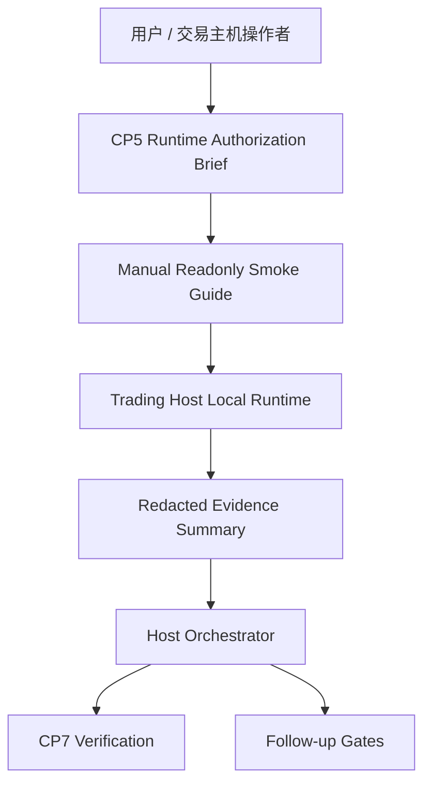
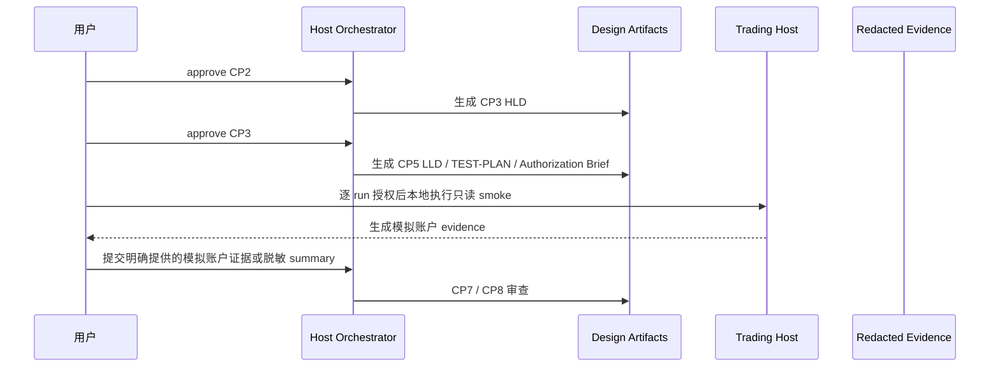

# CR092 Real QMT Readonly Runtime Smoke HLD

## 修订记录

| 版本 | 日期 | 修订人 | 变更要点 |
|---|---|---|---|
| 1.2 | 2026-06-18 | host-orchestrator | 回填 CP3 approved：用户接受修订后的 DQ-CP3-CR092-01..04，允许进入 CP5 LLD / TEST-PLAN / readiness。 |
| 1.1 | 2026-06-18 | host-orchestrator | 按用户 CP3 反馈修订 DQ-CP3-CR092-02：允许读取用户明确提供的模拟账户测试证据，同时继续禁止凭据、真实账户、NAS、未指定日志和 runtime。 |
| 1.0 | 2026-06-18 | host-orchestrator | 初始 HLD，覆盖真实只读 runtime smoke 的范围、架构灰区、候选方案、推荐方案、安全边界和 CP3 输入。 |

## 1. 问题定义

### 问题陈述

CR091 已交付离线 runner 合同、fake readonly gateway、fixtures 和 redacted evidence，但它不证明真实 QMT / MiniQMT / XtQuant / gateway / runner runtime 可用。CR092 要解决的是：如何在不越过权限边界的前提下，把离线 runner 过渡到真实交易主机上的只读 smoke 设计。

### 核心价值

用户可以获得一条可审计、可回退、逐 run 授权的真实只读 smoke 路线，用于验证 health、capabilities 和 `query_positions` 类只读路径，而不会把设计确认误读为 NAS、凭据、真实账户原文、下单、撤单、simulation 或 live 授权。若用户明确说明测试基于模拟账户并提供证据路径 / 内容，Codex 可读取该模拟账户测试证据，但不得扩大为凭据、真实账户、NAS 或未指定日志读取。

### 目标

| 优先级 | 目标 | 度量方式 |
|---|---|---|
| P0 | 定义真实只读 runtime smoke 的执行边界 | HLD 必须列出 7 类不授权项、3 类允许只读 scope、5 个失败回退状态。 |
| P0 | 定义逐 run 授权模型 | HLD / CP5 输入必须包含 `run_id`、授权 scope、执行主体、证据路径、过期条件和禁止动作计数。 |
| P0 | 定义模拟账户 evidence 合同 | evidence 字段至少覆盖 run_id、account_mode、scope、health_status、capabilities_status、query_positions_status、redaction_status、forbidden_counters；允许读取用户明确提供的模拟账户测试证据，禁止凭据、真实账户、NAS 和未指定日志。 |
| P1 | 保持 CR092 与 CR089 解耦 | CP3 Decision Brief 必须确认 CR089 保持 blocked-readiness-approved，不自动启动。 |
| P1 | 保持后续候选分流 | NAS package exchange、order-write、ledger hygiene 必须继续保留为 CR091-FU-02..04。 |

### 成功标准

- [ ] CP3 HLD 包含不少于 2 个真实候选方案并明确推荐方案。
- [ ] CP3 HLD 至少覆盖 4 个 Architecture Gray Areas，且每个都有 advisor table 取舍。
- [ ] Use Case → Architecture Traceability 覆盖 4 个 use case：准备授权、执行只读 smoke、生成 evidence、失败回退。
- [ ] 关键场景模拟至少 3 条全部 PASS，且无 BLOCKING。
- [ ] 不授权项数量为 7 类，且在 HLD、CP3 checkpoint、后续 CP5 输入中保持一致。

### 约束

| 类型 | 约束内容 |
|---|---|
| 技术 | CP3 不写真实 runtime 代码，不启动 QMT / gateway，不读取 `.env` 或凭据。 |
| 安全 | Codex / host-orchestrator 不读取凭据、真实账户原文、真实资金 / 持仓 / 委托 / 成交或未指定日志原文；可读取用户明确提供的模拟账户测试证据。 |
| 运行 | 真实 smoke 只能由用户在交易主机逐 run 授权后执行；默认不自动运行。 |
| 交付 | CR092 当前是 design gate；CP5 approved 前不得实施任何真实调用路径。 |

### 非目标（Out of Scope）

- 不启动、连接、安装或运行 QMT / MiniQMT / XtQuant / gateway / runner。
- 不访问、列取、读取、复制、拉取、写入、发布或删除 NAS。
- 不读取 `.env`、凭据、真实账号、真实账户、真实资金 / 持仓 / 委托 / 成交或未指定日志原文；允许读取用户明确提供的模拟账户测试证据。
- 不执行 submit / cancel、buy / sell。
- 不执行 simulation / live。
- 不执行 provider fetch、lake write、catalog publish。
- 不自动启动 CR089，不恢复 CR020 用户删除的 gateway 路线。

### 关键假设

- 用户仍希望保留从 CR091 离线 runner 到真实只读 smoke 的路线。
- 真实交易主机上的执行必须由用户逐 run 控制，Codex 不持有凭据。
- CR089 历史只读经验只能作为设计参考，不改变当前 blocked 状态。

### 缺失信息

| 优先级 | 缺失信息 | 影响范围 | 决策所需时限 |
|---|---|---|---|
| REQUIRED | 交易主机上的具体执行方式：手工命令、脚本或既有 runner wrapper | CP5 LLD / TEST-PLAN | CP5 前 |
| REQUIRED | evidence 输出目录和保留策略 | 脱敏扫描、回滚 | CP5 前 |
| OPTIONAL | 是否未来合并 CR089 只读 smoke 经验 | 后续 CR 合并 / supersede | CP8 前 |

## 2. 架构灰区与方案形成记录

**CP3 讨论日志**：`process/discussions/CP3-CR092-HLD-DISCUSSION-LOG.md`  
**CP3 讨论恢复点**：`process/checks/CP3-CR092-DISCUSSION-CHECKPOINT.json`

### Architecture Gray Areas

| 灰区 ID | 关键问题 | 为什么会影响架构 | 影响面 | 推荐讨论顺序 | canonical refs | 状态 |
|---|---|---|---|---|---|---|
| AGA-CR092-01 | 真实只读 smoke 由人工执行还是 runner 内置真实 transport | 决定模块边界、执行授权、evidence 归属和失败回退方式 | 范围 / 模块 / 安全 / 验证 | 1 | CP2 DQ-01/02/05 | selected |
| AGA-CR092-02 | 是否复用 CR089 只读 smoke 经验 | 决定是否合并旧门禁或保持独立设计 | 架构 / 状态 / 安全 | 2 | CP2 DQ-04 / CR089 | selected |
| AGA-CR092-03 | evidence 是否允许落盘 | 决定脱敏字段、输出目录和敏感扫描 | 数据 / 安全 / 验证 | 3 | CP2 DQ-03 | selected |
| AGA-CR092-04 | 只读 smoke 成功是否解锁 NAS 或 order-write | 防止 scope creep 和错误授权 | 范围 / 风险 / follow-up | 4 | CP2 DQ-03/04 | selected |

### Advisor Table

| Option | Pros | Cons | Impact Surface | Recommendation | Assumptions / When to switch |
|---|---|---|---|---|---|
| A. 人工逐 run 只读 smoke 设计门禁 | 权限最小；用户本地控制执行；Codex 不接触凭据或真实账户原文，可读取用户明确提供的模拟账户测试证据。 | 自动化低；需要清晰 manual guide 和 evidence 模板。 | runtime authorization / evidence / docs / CP5 readiness | 推荐 | 若未来需要自动化，必须另起 runtime execution CR。 |
| B. runner 内置真实 readonly transport | 自动化强；离线 runner 到真实网关路径短。 | 容易被误读为 runtime 授权；实现触碰 gateway、凭据和账户边界。 | code / gateway / credentials / account / tests | 不推荐当前 CP3 | 仅在 CP5 approved 且用户逐 run 授权后评估。 |
| C. 直接恢复 CR089 runtime smoke | 复用已有路径和历史经验。 | CR089 仍 blocked；可能带入 NAS package exchange 和旧授权语义。 | CR089 / CR092 / NAS / runtime | 不推荐 | 用户明确要求合并时重新做 CR 影响分析。 |
| D. 暂停真实 smoke | 风险最低。 | 无法推进真实只读 readiness 设计。 | backlog / risk acceptance | 备选 | 用户 reject CP3 或取消 runtime 路线时切换。 |

### 方案形成输入与事后审查区分

| 类型 | 来源 | 影响的 HLD 章节 | 处理结果 | 说明 |
|---|---|---|---|---|
| 方案形成输入 | lane-product | §1 / §5 / §6 | adopted | 保留从离线 runner 到真实只读 smoke 的路线，但先设计。 |
| 方案形成输入 | lane-architecture | §3 / §4 / §8 / §9 | adopted | 选择人工逐 run 模式，runner 不直接连接真实 gateway。 |
| 方案形成输入 | lane-quality | §7 / §12 / §13 | adopted | evidence 脱敏和 forbidden counters 是核心验证对象。 |
| 方案形成输入 | lane-docs-check | §15 / §17 | adopted | 后续需要 manual guide、TEST-PLAN 和 rollback 边界。 |
| HLD 后评审意见 | CP3 review | 全文 | pending | 等待用户审查。 |

### Deferred Architecture Ideas

| ID | 想法 / 风险 / 扩展方向 | 来源 | 延后原因 | 触发切换或重启条件 |
|---|---|---|---|---|
| DAI-CR092-01 | runner 内置真实 readonly transport | AGA-CR092-01 | 当前只批准设计，不批准 runtime 实现。 | CP5 approved 且逐 run 授权。 |
| DAI-CR092-02 | NAS package exchange 合并到 smoke | AGA-CR092-04 | NAS 是独立边界；当前模拟账户测试证据不需要 NAS 参与。 | 用户启动 CR091-FU-02。 |
| DAI-CR092-03 | submit/cancel 或 simulation/live | AGA-CR092-04 | order-write 风险更高。 | 用户启动 CR091-FU-03。 |
| DAI-CR092-04 | CR019 / CR025 ledger hygiene | CP2 风险项 | 与 runtime smoke 架构无直接关系。 | 用户启动 CR091-FU-04。 |

## 3. 候选架构方案对比

### 方案 A：人工逐 run 只读 smoke 设计门禁

**核心思路**：CR092 只设计真实只读 smoke 的授权、执行和 evidence 合同；真实执行由用户在交易主机本地逐 run 控制。

| 维度 | 评估 |
|---|---|
| 优点 | 权限最小；状态可审计；不接触凭据和真实账户原文；可读取用户明确提供的模拟账户测试证据；适合当前 CP2 / CP3 授权边界。 |
| 缺点 | 自动化程度低；需要 CP5 冻结 manual guide 和 evidence 模板。 |
| 复杂度 | medium |
| 实施成本 | M |
| 可扩展性 | 可后续扩展到自动 readonly transport，但必须另起授权。 |
| 风险 | 用户手工执行结果需要严格脱敏和结构化回填。 |
| 适用前提 | 用户接受先设计、后逐 run 授权执行。 |

### 方案 B：runner 内置真实 readonly transport

**核心思路**：在 runner 模块中加入真实 readonly gateway transport，直接从 runner 发起 health / capabilities / query_positions。

| 维度 | 评估 |
|---|---|
| 优点 | 自动化强；可统一 runner evidence。 |
| 缺点 | 容易越过当前授权；会触碰 gateway / 凭据 / 账户边界；CP5 前不可实施。 |
| 复杂度 | high |
| 实施成本 | L |
| 可扩展性 | 高，但权限风险高。 |
| 风险 | 设计 approve 被误读为 runtime approve。 |
| 适用前提 | 用户明确授权真实 transport 实现和逐 run 执行。 |

### 方案 C：合并 / 恢复 CR089

**核心思路**：把 CR092 目标并入 CR089，只读接口验证沿用 CR089 路线。

| 维度 | 评估 |
|---|---|
| 优点 | 能复用 CR089 package / redaction / smoke 经验。 |
| 缺点 | CR089 仍 blocked-readiness-approved，且包含 NAS package exchange 语义，范围更大。 |
| 复杂度 | high |
| 实施成本 | M |
| 可扩展性 | 中等。 |
| 风险 | 状态合并可能重开旧授权边界。 |
| 适用前提 | 用户明确要求合并 CR092 到 CR089。 |

### 方案对比矩阵

| 维度 | 方案 A | 方案 B | 方案 C |
|---|---|---|---|
| 实现难度 | 中 | 高 | 高 |
| 可维护性 | 高 | 中 | 中 |
| 安全边界 | 高 | 低 | 中 |
| 与 CP2 授权一致性 | 高 | 低 | 中 |
| 可验证性 | 高 | 中 | 中 |
| scope creep 风险 | 低 | 高 | 高 |

**推荐方案**：方案 A。理由：它满足用户推进真实只读 smoke 设计的目标，同时保持当前不授权 runtime / NAS / 凭据 / 真实账户 / 交易动作的边界；对用户明确提供的模拟账户测试证据开放读取，用于提高后续 CP5 / CP7 的可验证性。

## 4. 推荐方案总览

**复杂度模式**：`standard`

| 判定维度 | 依据 | 结论 |
|---|---|---|
| 需求规模 | 5 个 CP2 决策，4 个灰区，3 类只读 scope | standard |
| 角色数量 | 用户、host-orchestrator、未来交易主机人工执行者 | standard |
| 状态流转 | CP2 -> CP3 -> CP5 -> 后续 CP6/CP7/CP8 | standard |
| 平台适配 | Linux 工作区 + 未来 Windows / QMT 主机人工动作 | high-risk standard |
| Story 拆解 | 当前预计 3 个 Story | standard |

**系统核心思路**：CR092 将真实只读 smoke 拆为设计合同、人工逐 run 执行边界和模拟账户 evidence 合同三层。Codex / runner 不直接启动真实 runtime；若用户明确提供模拟账户测试证据，Codex 可读取该证据用于审查，但不得读取凭据、真实账户、NAS 或未指定日志。

**关键架构风格**：分层设计 + 人工运行授权门禁 + 文件化 evidence 交接。

**核心能力边界**：

- 做：定义 health / capabilities / query_positions 只读 smoke 的授权、manual execution、evidence、失败回退和后续 CP5 readiness。
- 不做：真实 runtime 启动、NAS、凭据读取、真实账户原文读取、交易写、simulation/live、provider/lake/publish；允许读取用户明确提供的模拟账户测试证据。

**关键依赖**：

- CR091 offline runner：提供 adapter / fake readonly gateway / evidence 模型背景。
- CR089 historical readiness：提供只读 scope 与脱敏 evidence 经验，仅作设计参考。
- process checkpoint：承载 CP3 / CP5 / CP8 人工门禁。

**产物形态**：

- HLD：1 份。
- LLD / TEST-PLAN：CP5 前各 1 份。
- 工具脚本：当前 0 个；是否需要 manual guide / checker 由 CP5 决定。
- 目标平台：Linux dev workspace + future Windows trading host manual action。

## 5. 适用性矩阵

| 适用性维度 | 当前项目判断 | 推荐方案如何适配 | 不适配信号 | When to switch |
|---|---|---|---|---|
| 用户目标 | 从离线 runner 过渡到真实只读 smoke | 先冻结设计和授权，不触碰真实环境 | 用户要求立即执行真实 smoke | 转 runtime authorization gate |
| 项目成熟度 | runner 离线合同刚关闭 | 先只定义真实只读 smoke 合同 | 需要自动化 CI runtime | 转方案 B 或新 CR |
| 认知负担 | 用户需要清楚 approve 不等于授权运行 | 所有门禁重复列出不授权边界 | 用户希望简化流程 | 提供 manual guide，但不删门禁 |
| 验证条件 | 当前无真实 runtime 授权 | 只验证 HLD / LLD / evidence 合同 | 用户提供逐 run 授权 | 进入 CP6/CP7 runtime evidence gate |
| 回退成本 | 设计文件可回退 | 不改代码、不改环境 | 已执行真实动作 | 需 runtime incident / rollback CR |

### 优化 / 牺牲 / 切换条件

| 方案选择 | 优化了什么 | 牺牲了什么 | 接受理由 | 切换条件 |
|---|---|---|---|---|
| 方案 A | 安全、审计、权限最小化、状态清晰 | 自动化速度 | 当前授权只允许设计 | 用户明确授权真实 execution |
| 保持 CR089 blocked | 状态一致性、避免旧范围扩大 | 无法复用 CR089 自动路径 | CR089 含 NAS / runtime 旧语义 | 用户要求合并并通过 CR 影响分析 |
| evidence contract 先行 | 可验证性和模拟账户 / 真实账户边界 | 需要 CP5 再细化 | 防止凭据和真实账户原文泄露 | CP5 指定输出目录、字段白名单和扫描规则 |

## 6. Use Case → Architecture Traceability

| Use Case | 支撑模块 / 组件 | 关键流程 | 异常 / 失败路径 | 验证方式 | 备注 |
|---|---|---|---|---|---|
| UC-CR092-01 准备逐 run 授权 | Authorization Brief / CP5 readiness | 用户确认 scope、run_id、执行主体、有效期和禁止动作 | scope 包含 NAS / order-write 时 blocked | CP5 checklist | CP3 只定义模型 |
| UC-CR092-02 执行只读 smoke | Manual execution guide / future script | 用户在交易主机本地执行 health / capabilities / query_positions | gateway 不可用、scope denied、credential missing 均 fail closed | CP7 evidence review | Codex 不执行 |
| UC-CR092-03 生成模拟账户 evidence | Evidence template / redaction scan | 用户提供模拟账户测试证据路径 / 内容，host-orchestrator 可读取明确提供的模拟账户证据 | 出现凭据、真实账户、live 标识、NAS 路径或未指定日志则 reject evidence | sensitive scan + manual review | 不读取凭据 / 真实账户 / NAS |
| UC-CR092-04 失败回退 | Rollback / incident notes | 记录失败原因，保持 CR092 active 或回退到 backlog | 真实动作副作用出现则升级 incident | CP7 / CP8 risk review | 不自动重试 |

## 7. 关键场景模拟

| 模拟 ID | 场景 | 输入 / 前置条件 | 推荐架构执行路径 | 预期输出 | 失败 / 回退路径 | 结果 |
|---|---|---|---|---|---|---|
| SIM-CR092-01 | CP5 前尝试真实运行 | 用户尚未逐 run 授权 | HLD boundary -> CP5 gate -> blocked | `blocked_runtime_not_authorized` | 回到 CP5 决策 | PASS |
| SIM-CR092-02 | 用户批准只读 smoke scope | CP5 approved + run_id + scope `qmt:positions:read` + account_mode=`simulated` | manual guide -> user local execution -> simulated-account evidence | evidence summary 或用户明确提供的模拟账户证据，不含凭据 / 真实账户 / NAS | evidence 含凭据、真实账户、live 标识、NAS 路径或未指定日志则 reject | PASS |
| SIM-CR092-03 | 用户要求 NAS package exchange | 请求包含 NAS pull / publish | scope classifier -> CR091-FU-02 | 不在 CR092 执行 | 启动独立 NAS gate | PASS |
| SIM-CR092-04 | 用户要求 submit/cancel | 请求包含 order-write | scope classifier -> CR091-FU-03 | 不在 CR092 执行 | 启动高风险 order-write CR | PASS |

## 8. 系统架构图

## 9. 高层模块与职责划分

| 模块名称 | 类型 | 职责 | 输入 | 输出 | 依赖 |
|---|---|---|---|---|---|
| Authorization Brief | process checkpoint | 冻结 run_id、scope、执行主体、有效期、不授权项 | CP5 Decision Brief | approved / rejected scope | CR092 HLD |
| Manual Readonly Smoke Guide | process / docs | 指导用户本地执行只读 smoke | CP5 approved scope | 用户执行步骤 | CP5 |
| Runtime Evidence Template | process / docs | 定义模拟账户 evidence 字段和敏感字段拒收规则 | smoke summary / simulated-account evidence | YAML / JSON evidence | CR091 evidence model |
| Evidence Review | verification | 审查模拟账户 evidence、敏感字段和 forbidden counters | simulated-account evidence | CP7 result | meta-qa / host |
| Follow-up Classifier | governance | 把 NAS / order-write / ledger hygiene 分流 | 用户新请求 | CR091-FU-02..04 | CR091 tracking |

**模块边界规则**：

- Authorization Brief 只批准逐 run scope，不替代真实运行授权。
- Manual Guide 只指导用户本地动作，Codex 不读取凭据、不执行命令。
- Evidence Review 可读取用户明确提供的模拟账户测试证据；不读取凭据、真实账户 / 真实持仓 / 真实委托 / 真实成交、NAS 或未指定日志。

## 10. 技术选型与理由

| 选型类别 | 选择 | 备选方案 | 选择理由 | 风险 |
|---|---|---|---|---|
| 运行方式 | 人工逐 run 执行 | runner 自动 transport | 权限最小，符合 CP2 | 自动化低 |
| 证据格式 | YAML / JSON 脱敏摘要或用户明确提供的模拟账户测试证据 | 凭据、真实账户原文、完整未指定日志 / 截图 | 可机器审查，贴合模拟账户测试 | 用户需要确认 account_mode=simulated，且不得混入凭据 / 真实账户 / NAS |
| 状态管理 | process checkpoint / CR index | 对话约定 | 可审计、可恢复 | 历史账本旧账仍需独立治理 |
| gateway scope | health / capabilities / query_positions | account/order full API | 最小只读验证 | 不能证明交易写能力 |

## 11. 关键流程

### 主流程：只读 smoke 设计到执行准备

### 扩展流程：请求越权

如果请求包含 NAS、凭据读取、真实账户原文、submit/cancel、simulation/live、provider/lake/publish，CR092 必须返回 blocked，并路由到 CR091-FU-02 / FU-03 或新 CR。用户明确提供的模拟账户测试证据可在 DQ-CP3-CR092-02 范围内读取。

## 12. 非功能需求设计

| 质量特征 | 设计目标 | 实现手段 | 验证方式 |
|---|---|---|---|
| 安全性 | 禁止项计数 7 类均为 0 | authorization brief + evidence counters | CP7 review |
| 可靠性 | 失败时 fail closed | blocked status / no auto retry | 场景模拟 |
| 可审计性 | 每次 smoke 有 run_id 和 scope | evidence template | CP7 traceability |
| 可维护性 | 与 CR089 / CR091 边界清晰 | HLD 非目标和 ADR | CP3 review |
| 可恢复性 | 可回退到 CR091 follow-up backlog | rollback table | CP8 review |

## 13. 主要风险与应对

| 风险 ID | 风险描述 | 概率 | 影响 | 应对策略 | 触发信号 |
|---|---|---|---|---|---|
| R-CR092-01 | CP3 approve 被误读为 runtime 授权 | 中 | 高 | 每个门禁列出不授权项 | 用户要求运行命令 |
| R-CR092-02 | evidence 泄露凭据、真实账户 / 持仓 / 日志原文 | 中 | 高 | 只允许用户明确提供的模拟账户证据；敏感扫描失败即 reject | evidence 包含 credential、real_account、live、NAS 或未指定 raw_log 字段 |
| R-CR092-03 | CR089 被隐式恢复 | 低 | 中 | CR092 独立推进；CR089 保持 blocked | 用户要求合并旧门禁 |
| R-CR092-04 | 只读 smoke 成功后 scope creep 到 NAS / order-write | 中 | 高 | FU-02 / FU-03 独立分流 | 请求包含 NAS 或 submit/cancel |
| R-CR092-05 | 历史 cr-tracking 旧账影响门禁可信度 | 中 | 中 | 保留 CR091-FU-04 | cr-tracking exit 1 |

## 14. ADR 候选决策点

| ADR ID | 决策问题 | 建议决定 | 约束此决策的因素 |
|---|---|---|---|
| ADR-CR092-01 | 真实只读 smoke 是否由人工逐 run 执行 | 采用人工逐 run 执行设计门禁 | CP2 不授权 runtime 自动化 |
| ADR-CR092-02 | 是否恢复 CR089 | 不恢复，CR092 独立推进 | CR089 blocked 且包含 NAS 语义 |
| ADR-CR092-03 | evidence 是否可读模拟账户测试信息 | 可读用户明确提供的模拟账户测试证据；不可读凭据、真实账户、NAS 或未指定日志 | 用户明确模拟账户授权 + 凭据 / 真实账户 / 日志边界 |
| ADR-CR092-04 | smoke 成功是否解锁后续交易能力 | 不解锁；NAS / order-write 独立 CR | 防止 scope creep |

## 15. 分阶段落地建议

| 阶段 | 交付物 | 里程碑标志 | 前提条件 |
|---|---|---|---|
| CP3 | HLD / CP3 checkpoint | HLD approved | CP2 approved |
| CP5 | LLD / TEST-PLAN / Authorization Brief | readiness approved | CP3 approved |
| CP6/CP7 | 如用户授权，则执行 manual smoke evidence review | PASS / PASS_WITH_RISK | CP5 approved + 逐 run 授权 |
| CP8 | release readiness | closed-current-delivery 或 deferred | CP7 完成或用户取消 |

## 16. 工作量粗估

| 类别 | Story 数 | 预计 Wave 数 | 粗估工作量 |
|---|---:|---:|---|
| 设计 / 门禁 | 1 | 1 | S |
| LLD / TEST-PLAN / manual guide | 1 | 1 | M |
| evidence review / release | 1 | 1 | S |
| **合计** | **3** | **3** | M |

## 17. 待确认问题

| 问题 ID | 问题描述 | 优先级 | 影响范围 | 负责人 | 目标答复时间 |
|---|---|---|---|---|---|
| Q-CR092-01 | CP5 是否允许生成 manual guide 文件 | REQUIRED | CP5 / docs | user | CP5 |
| Q-CR092-02 | evidence 输出目录和保留策略 | REQUIRED | CP5 / CP7 | user | CP5 |
| Q-CR092-03 | 是否需要将 CR089 历史只读 smoke 经验归档为参考附录 | OPTIONAL | docs | host-orchestrator | CP8 |

## 18. HLD 自审记录

| 自审项 | 结果 | 证据 / 说明 |
|---|---|---|
| Architecture Gray Areas 已前置处理 | PASS | `process/discussions/CP3-CR092-HLD-DISCUSSION-LOG.md` |
| Advisor table 已影响推荐方案 | PASS | §2 / §3 选择方案 A |
| 适用性矩阵完整 | PASS | §5 |
| Use Case → Architecture Traceability 完整 | PASS | §6 |
| 关键场景模拟通过 | PASS | §7 全部 PASS |
| 优化 / 牺牲 / 切换条件明确 | PASS | §5 |
| HLD / ADR / Risk / NFR 内部一致 | PASS | 不授权项在 §1 / §4 / §12 / §13 / §14 一致 |
| HLD 拆分原则已评估 | PASS | 单一核心产物为 CR092 readonly runtime smoke design gate；Story 数 3；无需拆分。 |

## CP3 确认记录

**CP3 自动预检结果**：`process/checks/CP3-CR092-HLD-CONSISTENCY.md`  
**CP3 人工 checklist**：`process/checkpoints/CP3-CR092-READONLY-RUNTIME-SMOKE-HLD-REVIEW.md`

**确认状态**：待审核

**审核意见**：

**确认人**：
**确认时间**：
