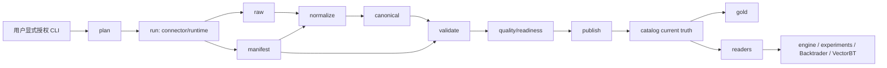
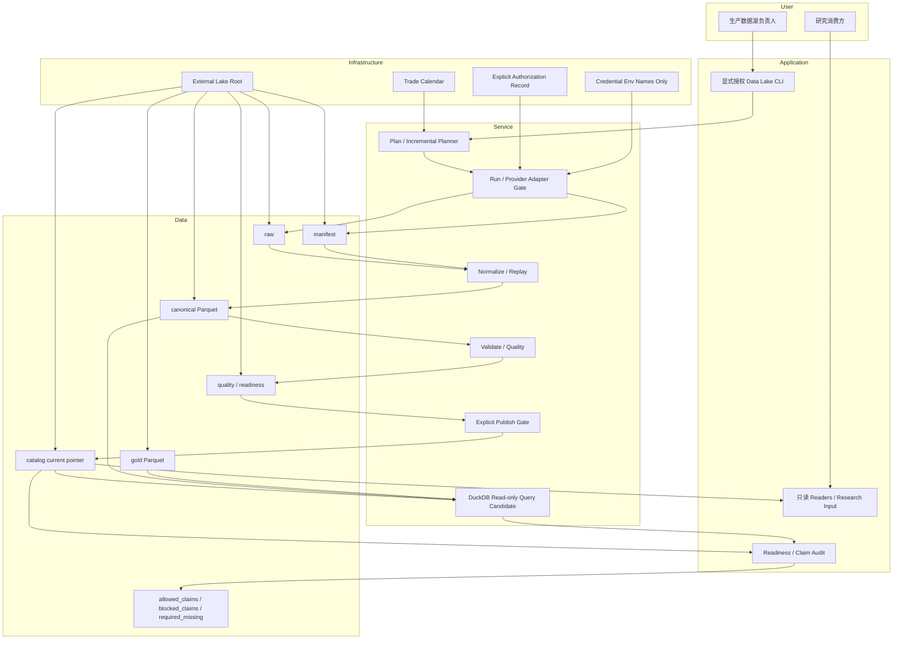
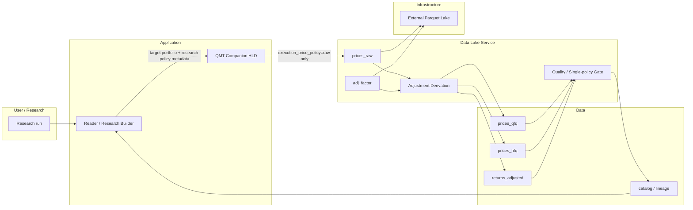
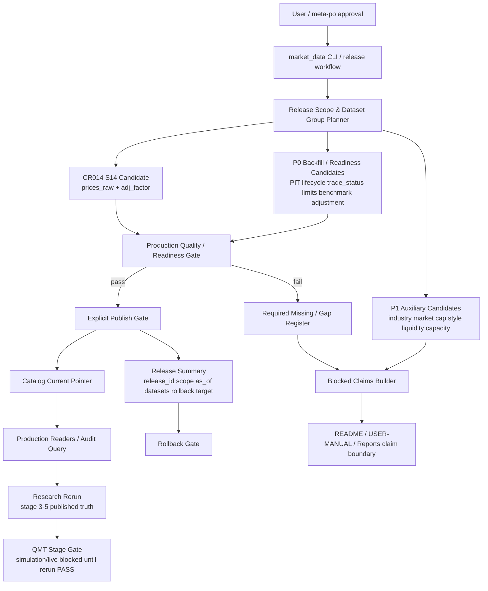

# 高层设计（HLD）：CR-010 生产级市场数据湖

> 本 HLD 是 `process/HLD.md` 的 companion HLD，仅拥有市场数据湖生产链路。主 HLD 继续拥有回测框架、研究消费、experiments、报告、Backtrader / VectorBT clean feed。未经 CP3 / CP4 / CP5 确认，不得执行真实联网、真实回补或真实 lake 写入。

## 修订记录

| 版本 | 日期 | 修订人 | 变更要点 |
|---|---|---|---|
| 0.1 | 2026-05-22 | meta-se | 按 CR-010 新建 companion HLD；定义外置数据湖分层、生产 CLI、P0/P1 dataset 合同、publish gate、日频价格可用时点、W3 fail-fast、恢复审计和实验只读消费边界 |
| 0.2 | 2026-05-23 | meta-se | 按 CR-011 追加 §14：补齐因子研究生产级数据合同，覆盖 benchmark policy、PIT universe、tradability、OHLCV/VWAP、adjustment/corporate action、industry/market cap/style exposure、liquidity/capacity/cost sensitivity 和 factor panel audit 的数据湖生产/readiness 口径；本增量待 CP3/CP4 确认 |
| 0.3 | 2026-05-24 | codex | 按 CR-012 追加 §15：修正 limited-window readiness audit 口径，明确 snapshot_asof / daily_materialized、trade_calendar available_at、adj_factor strict PIT、缺口归因和 unsupported claim 边界 |
| 0.4 | 2026-05-25 | meta-se | 按 CR-013 追加 §16：定义 2020-2024 full-history readiness gap、execution/VWAP blocked、unsupported register excluded denominator、旧证据保留和未来 backfill 权限边界的数据湖审计合同 |
| 0.5 | 2026-05-26 | meta-se | 按 CR-014 追加 §17：定义全 A since-inception current truth、证券生命周期 / 退市 / 代码变更、P0 dataset 分层、catalog current pointer、增量刷新 / replay、DuckDB 只读 query/audit/feature extraction 候选、权限边界、claim boundary、NFR、风险和分阶段落地；本增量待 CP3 人工确认 |
| 0.6 | 2026-05-26 | meta-se | 按 CP3 R2 修改意见补强 §17.7.1 和 §17.7.2：明确 DuckDB 只读时数据由 lake production pipeline 在 CP5 + 用户显式授权后写入，区分 raw/manifest/run metadata、canonical/gold/quality candidate、validate audit evidence 与 explicit publish current pointer；补充可行性、易用性和扩展性讨论，继续推荐 CR14-A |
| 0.7 | 2026-05-27 | meta-se | 按 CR-017 追加 §18：冻结 `prices_raw` + `adj_factor` 事实源、`prices_qfq` / `prices_hfq` / `returns_adjusted` 独立派生、qfq `as_of_trade_date`、旧 qfq 兼容、QMT raw 执行价隔离和 Q-030 / Q-031 CP3 决策输入；本增量待 CP3 人工确认，不授权真实抓取、写湖、publish、迁移或依赖修改 |
| 0.8 | 2026-05-29 | meta-se | 按 CR-018 追加 §19：以 CR014 S14 candidate 为输入，定义 `2015-01-05..latest_closed_trade_date` scoped release、P0/P1 dataset group、四类 benchmark、Explicit Publish Gate、release 级 rollback、publish 后研究重跑和 QMT 后置；本增量待 CP3 人工确认，不授权 provider fetch、真实 lake 写入、publish current pointer、凭据读取、DuckDB 事实源写入或 QMT 操作 |

## 1. 问题定义

### 1.1 问题陈述

CR-007 / CR-008 / CR-009 已证明小窗口真实 Tushare 数据链路和研究消费防线可工作，但当前能力仍偏“已验证局部链路”：数据湖生产、catalog current truth、quality/readiness、PIT/W3 缺口、真实回补分阶段授权和 16 个 experiments 的真实性报告尚未统一成生产级契约。

CR-010 的问题是：需要在不破坏回测消费只读边界的前提下，把 `market_data` 推进为可恢复、可审计、可扩展的外置数据湖，同时让 experiments 能以更真实但仍可披露限制的数据输入运行。

### 1.2 目标

| 优先级 | 目标 | 可度量成功标准 |
|---|---|---|
| P0 | 数据湖生产链路物理隔离 | engine / experiments / Backtrader / VectorBT 对 `market_data.connectors`、`market_data.runtime`、`market_data.storage`、真实 provider SDK、网络库和凭据读取的导入次数为 0 |
| P0 | 外置 lake root | 真实生产命令必须显式使用 `MARKET_DATA_LAKE_ROOT` 或 `--lake-root`；repo 内 `data/**` 真实 lake 写入次数为 0 |
| P0 | P0 dataset 合同 | `prices`、`adj_factor`、`hs300_index`、`trade_calendar`、`index_members`、`index_weights`、`stock_basic` 7 个 dataset 均有 key、字段、lineage、quality/readiness 契约 |
| P0 | 显式 publish gate | validate pass 自动成为 current truth 的次数为 0；publish 后 reader 才可读取 current truth |
| P0 | 日频可用时点 | 价格数据 100% 写 `available_at_rule`；T 日开盘前决策使用 T-1 数据；事件缺 explicit `available_at` 时进入决策次数为 0 |
| P0 | 分阶段真实回补 | 小窗口、1 年、全历史 3 个阶段均先 dry-run，再由用户授权真实执行；每次执行记录 run_id / batch_id / coverage / quality / readiness |
| P1 | W3 fail-fast | PIT、交易状态、涨跌停、events 未确认 source/interface 前，生产 planning、normalizer、quality、reader、engine gate 均返回 unresolved / required_missing，不伪造 available |
| P1 | 16 个 experiments 真实性报告 | 每个 experiment 输出 dataset coverage、benchmark/universe/adjustment/quality/readiness/W3 限制、allowed_claims、blocked_claims 和 production_strict 可行性 |

### 1.3 非目标

| 非目标 | 说明 |
|---|---|
| 服务化调度 / API / 告警系统 | 第一阶段只交付 CLI + catalog + quality/readiness report；调度系统另起 CR |
| 全市场实时行情服务 | 短期范围是 HS300 及历史成员，长期仅预留全 A 股扩展 |
| 在 consumer 中自动补数 | reader / engine / experiments 发现缺口只能返回 typed failure / remediation spec，不触发 fetch/backfill |
| 伪造 W3 可用 | 未确认 source/interface 的 W3 数据不得以空表、当前快照或替代 dataset 表示 available |
| 读取旧 repo `data/**` | 旧 `data/**` 继续 reference-only，默认不读取、不列出、不迁移、不比对、不删除 |

### 1.4 上游确认与默认值

| 决策 | 当前值 | 状态 |
|---|---|---|
| 日频价格口径 | 价格作为当日收盘价；开盘前决策只能使用前一交易日已形成数据 | RESOLVED，用户确认 D11 |
| 短期范围 | HS300 及其历史成员 | DEFAULTED |
| 长期范围 | 预留全 A 股扩展 | DEFAULTED |
| 历史区间 | `2015-01-01` 至最近已闭市交易日 | DEFAULTED |
| benchmark | 短期沪深 300 价格指数；长期补全收益指数 | DEFAULTED |
| W3 优先级 | PIT -> 涨跌停 / 交易状态 -> events | DEFAULTED |
| 真实回补授权 | 小窗口 -> 1 年 -> 全历史逐级授权 | DEFAULTED |

## 2. 候选方案对比

| 方案 | 描述 | 优点 | 缺点 | 结论 |
|---|---|---|---|---|
| A：独立 companion 数据湖 HLD + CLI 生产链路 | 数据湖 HLD 单独拥有生产、publish、quality truth；主 HLD 只读消费 | 边界清晰；真实源风险隔离；便于 CP3/CP4/CP5 门控和分阶段真实复验 | 需要维护双 HLD 双向引用 | 推荐 |
| B：继续把数据湖增量写入主 HLD | 所有设计继续追加到 `process/HLD.md` | 初始改动少 | 主 HLD 膨胀，生产职责和研究消费职责混写，评审和 Story 分派失真 | 放弃 |
| C：直接引入服务化数据平台 | 一次性建设 scheduler / API / alert / job UI | 长期生产能力更完整 | 超出短期 HS300 日频研究目标，凭据和运维风险过高 | 后续评估 |

## 3. 推荐架构

### 3.1 分层视图

### 3.2 数据湖层级

| 层级 | 职责 | 写入方 | 读取方 |
|---|---|---|---|
| `raw` | 保存 provider 原始响应与最小 metadata | `run` | `normalize` / `replay` |
| `manifest` | 记录 run / batch / idempotency / request / attempts / retry / raw checksum / status | `run` | `normalize` / `validate` / `replay` / 审计 |
| `canonical` | 标准化 dataset parquet，包含 schema、lineage、available_at_rule | `normalize` | `validate` / `publish` 候选 |
| `quality` | CSV/Markdown readiness、coverage、PIT、lineage 和 failure reason | `validate` / `revalidate` | `publish` / 审计 |
| `catalog` | 显式 publish 后的 current truth | `publish` | `readers` / benchmark resolver |
| `gold` | 面向研究消费的派生视图或 clean feed | `publish` 或后续 gold builder | `readers` / optional adapters |

### 3.3 生产 CLI 生命周期

| 子命令 | 是否联网 | 是否写湖 | 输入 | 输出 | 约束 |
|---|---:|---:|---|---|---|
| `plan` | 0 | 0 | dataset、source/interface、date range、universe、lake root | 批次计划、idempotency_key、target path、coverage denominator | 默认 dry-run |
| `run` | 可选 | raw + manifest | plan、`--enable-real-source`、凭据 env 引用 | batch result、error enum、manifest | 未授权 fail-fast |
| `normalize` | 0 | canonical | manifest/raw、run_id、dataset | canonical parquet、lineage | 不重新联网 |
| `validate` | 0 | quality candidate | canonical、manifest、calendar、threshold | quality/readiness report | 不自动 current truth |
| `publish` | 0 | catalog/gold | quality pass / warn policy、canonical candidate | catalog current truth | `quality_status=fail` 阻断 |
| `read` | 0 | 0 | catalog current truth、filter、quality policy | DataFrame / metadata / remediation | 未 publish 视为 unavailable |
| `revalidate` | 0 | quality candidate | 已发布或候选 run | 新 quality report | 不重新联网 |
| `replay` | 0 | canonical / quality candidate | manifest/raw、run_id、batch_id | 派生链路重放结果 | 不调用 provider |

## 4. Dataset 合同

### 4.1 P0 Dataset

| Dataset | Key | 必需字段 |
|---|---|---|
| `prices` | `trade_date`、`symbol` | `open/high/low/close/volume/amount/source/source_interface/source_run_id/schema_version/available_at/available_at_rule/lineage_raw_checksum` |
| `adj_factor` | `trade_date`、`symbol` | `adj_factor/adjustment_policy/source/source_interface/source_run_id/available_at/available_at_rule` |
| `hs300_index` | `trade_date`、`index_code` | `open/high/low/close/pre_close/pct_chg/volume/amount/benchmark_kind/source/source_interface/source_run_id/available_at/available_at_rule` |
| `trade_calendar` | `trade_date`、`exchange` | `is_open/pretrade_date/source/source_interface/source_run_id/available_at/available_at_rule` |
| `index_members` | `trade_date/effective_date`、`index_code`、`con_code` | `effective_date/available_date/available_at/available_at_rule/is_pit_universe/pit_status/readiness_status` |
| `index_weights` | `trade_date`、`index_code`、`con_code` | `weight/effective_date/available_date/available_at/available_at_rule/pit_status/readiness_status` |
| `stock_basic` | `symbol` | 基础股票信息、状态字段、`snapshot_date/source/source_interface/source_run_id/readiness_status`；只辅助，不证明 PIT universe |

### 4.2 P1 / W3 Dataset

| Dataset | 字段 | 未确认 source/interface 行为 |
|---|---|---|
| `trade_status` | `trade_date/symbol/is_tradable/is_suspended/is_st/status_reason/source_run_id/available_at` | `source_unresolved` / `required_missing`；不得默认可交易 |
| `prices_limit` | `trade_date/symbol/limit_up/limit_down/source_run_id/available_at` | `source_unresolved` / `required_missing`；不得忽略涨跌停后声明真实可成交 |
| `events` | `symbol/event_type/event_date/available_at/payload/source_run_id` | 缺 `available_at` 时 fail；不得进入决策 |

### 4.3 `available_at_rule`

| 值 | 含义 | 适用 |
|---|---|---|
| `explicit_timestamp` | 数据源提供明确时间戳 | events、PIT、部分日频非价格 |
| `daily_close_fact` | T 日收盘后形成的日频价格事实 | prices、hs300_index |
| `previous_trade_day_for_open_decision` | T 日开盘前只能消费 T-1 数据 | open-decision reader / engine gate |
| `date_only_next_open` | 非价格型日频数据只有日期时，按下一开市日前可见处理 | calendar / membership 的保守推导 |
| `missing_required` | 严格生产或事件类缺少 `available_at` | events / production_strict |
| `not_applicable` | 不参与决策时点判断 | 纯描述性元数据 |

## 5. Quality / Readiness / Publish

| 规则 | 处理 |
|---|---|
| `quality_status=pass` | 允许 publish |
| `quality_status=warn` | exploratory 可消费；production_strict 默认阻断，除非 publish 时显式 allow warn |
| `quality_status=fail` | 阻断 publish 和 production_strict 消费 |
| coverage denominator | 使用 `trade_calendar.is_open=true`，不得用自然日冒充交易日覆盖率 |
| legacy report | `reports/data_quality_report.csv` 只作为 legacy，不作为 current quality truth |

必检项：required fields、duplicate key、open trade date gap、future availability、negative/zero invalid prices、OHLC 关系、adjustment conflict、benchmark/calendar gap、PIT incomplete、readiness_status、lineage checksum。

Catalog current truth 字段至少包含：dataset、date range、denominator、coverage ratio、source/interface/provider_interface、run_id、lineage checksum、quality_status、readiness_status、pit_status、available_at_rule、known_limitations、published_at。

## 6. 真实回补与恢复

| 阶段 | 范围 | 授权要求 | 验收 |
|---|---|---|---|
| 小窗口 | 3-5 个交易日 | dry-run 后用户授权 | plan/run/normalize/validate/publish/read/revalidate/replay 全链路 PASS |
| 1 年 | 最近或指定 1 年 | 小窗口 PASS 后再次授权 | batch/resume/coverage/quality/report PASS |
| 全历史 | `2015-01-01` 至最近闭市交易日 | 1 年 PASS 后再次授权 | 失败批次恢复、catalog current truth、experiments smoke PASS |

恢复策略：

| 情况 | 行为 |
|---|---|
| 已成功批次 | 默认 skip |
| 失败批次 | 可 retry |
| 参数 / source/interface / dataset / date range / universe 变化 | `resume_conflict` |
| provider / network / rate limit / schema mismatch / quality failed | 使用结构化 error enum |
| 日志 | 不打印 token、真实私有路径或凭据 |

## 7. 消费边界

| Consumer | 允许 | 禁止 |
|---|---|---|
| `engine/research_dataset.py` | 只读 readers、BenchmarkResult、catalog metadata | connector/runtime/storage/provider SDK/network/env token |
| `engine/universe.py` | 读取 `index_members` readiness；fixed snapshot 只能 exploratory | `index_weights` 替代完整 `index_members`；`stock_basic` 当前快照证明 PIT |
| `engine/trade_status.py` | 读取已发布 `trade_status` 或返回 required_missing | 默认全可交易 |
| `engine/trading_constraints.py` | 读取已发布 `prices_limit` 或返回 required_missing | 忽略涨跌停后声明真实可成交 |
| `engine/events.py` | 仅消费 explicit `available_at` events | 日期推导事件可用时点 |
| experiments | 默认 exploratory，输出 limitations / allowed_claims / blocked_claims | 自动 backfill、读取凭据、强声明 production_strict |

## 8. 非功能设计

| 维度 | 设计 | 验收 |
|---|---|---|
| 安全 | 真实联网与凭据只存在生产 CLI；consumer 静态导入扫描 | consumer forbidden import 命中数为 0 |
| 可恢复 | manifest + idempotency_key + resume_conflict | retry / skip / conflict 单测覆盖 100% 主要分支 |
| 可审计 | run_id、batch_id、lineage checksum、quality report、catalog publish | 任一 reader 结果能追溯 source_run_id 和 publish entry |
| 可扩展 | source registry exact match；W3 未确认 fail-fast | unknown / unresolved interface 单测 PASS |
| 可验证 | fake/offline pipeline 覆盖全生命周期 | 无真实 token、无真实 lake、无网络的集成测试 PASS |

## 9. 风险与缓解

| 风险 | 级别 | 缓解 |
|---|---|---|
| validate 自动变成 current truth | 高 | 引入 publish gate；reader 只读 published catalog |
| consumer 隐式补数 | 高 | forbidden import + network monkeypatch + remediation spec `auto_execute=false` |
| 事件缺 `available_at` 仍进决策 | 高 | normalizer / reader / engine gate 全部 fail |
| W3 空数据伪装可用 | 高 | `source_unresolved` 和 `required_missing` 为唯一默认结果 |
| 全历史回补中断后重复写或污染 catalog | 中高 | manifest idempotency、resume_conflict、publish 显式动作 |
| benchmark proxy 被误读 | 中高 | `proxy_*` 与 `hs300_*` 字段隔离；缺真实 benchmark 返回 required_missing |

## 10. ADR 候选

| ADR | 决策 | 回写对象 |
|---|---|---|
| ADR-030 | 生产级数据湖独立 companion HLD | 主 HLD §26、本 HLD |
| ADR-031 | consumer 只读 catalog/canonical/gold，不触发数据生产 | readers、engine、experiments |
| ADR-032 | 日频价格与开盘前决策可用时点规则 | contracts、normalization、research gates |
| ADR-033 | W3 source/interface 未确认前 fail-fast | source registry、normalizer、reader、engine gates |
| ADR-034 | catalog 显式 publish 后才能作为 current truth | catalog、CLI、readers |
| ADR-035 | 真实回补采用分阶段授权和可恢复批次执行 | CLI、runtime、manifest、QA real smoke |

## 11. 分阶段落地

| Wave | Story | 范围 | 粗估 |
|---|---|---|---|
| CR010-DL-BATCH-A | CR010-S01..S05 | multi-dataset CLI、P0 回补闭环、catalog coverage 和 readiness report | L |
| CR010-DL-BATCH-B | CR010-S06..S09 | PIT spike、trade_status、prices_limit、events 合同与 fail-fast | M |
| CR010-QF-BATCH-C | CR010-S10..S12 | `realism_mode`、16 个 experiments smoke、Backtrader/VectorBT clean feed 边界 | M/L |

## 12. Gotchas

| Gotcha | 规避方式 |
|---|---|
| 把质量 report 写出来就当 current truth | 必须显式 `publish`，并记录 `published_at` |
| 用自然日覆盖率验证交易行情 | denominator 必须来自 `trade_calendar.is_open=true` |
| `stock_basic` 当前快照被当作历史 universe | 只能辅助状态说明，不能证明 PIT |
| `index_weights` 被当成完整成分集 | 权重不是完整 membership，缺 `index_members` 时 PIT fail |
| W3 未确认前用空表继续 production_strict | 空表只能是 missing，不得 available |
| close-to-close 与 open-decision 混用 | metadata 必须写 `available_at_rule` 和 execution rule |
| 在日志或 report 中打印真实 lake 绝对私有路径 | 使用安全 label 或相对路径，不记录 token / 私有路径 |

## 13. 开放问题

| ID | 问题 | 状态 | 默认处理 | 决策人 |
|---|---|---|---|---|
| DL-Q1 | 第一阶段是否授权小窗口真实 smoke | OPEN | 不授权；仅 dry-run / offline | 用户 |
| DL-Q2 | Tushare `index_member/index_weight` 是否作为 PIT source | OPEN | 先 Spike，不作为 production_strict 当前可用 | 用户 / meta-se |
| DL-Q3 | 全收益指数何时补充 | OPEN | 不阻塞短期价格指数 benchmark | 用户 |
| DL-Q4 | VectorBT 是否进入本批次 | OPEN | 只做 clean feed 边界或扫描加速器后续评估 | 用户 |

## 14. CR-011 因子研究数据补齐增量

> 本节是 CR-011 的数据湖生产侧增量。主 HLD `process/HLD.md` §27 负责研究消费、实验 17-21 v2、factor panel audit 与报告声明；本节只定义数据湖必须如何表达 dataset、source/interface、quality/readiness、publish 和降级状态。本节不授权真实联网、真实抓取、真实 lake 写入、旧 `data/**` 操作、旧报告覆盖或凭据读取。

### 14.1 问题与边界

CR-011 需要把实验 17-21 的关键缺口从报告文字限制转成可被 reader 和 research gate 消费的数据湖状态。数据湖生产侧的目标不是立即保证所有真实数据可用，而是保证每个缺口都有 exact dataset contract、source/interface 状态、quality/readiness、lineage、publish gate 和 missing reason，避免 consumer 用空表、当前快照、proxy 或模糊字段伪装可用。

| 目标 | 可度量成功标准 |
|---|---|
| benchmark policy | `hs300_index` current truth 和 benchmark policy metadata 至少暴露 `benchmark_kind`、`index_code`、coverage、quality_status、readiness_status、policy_confirmed 6 个字段 |
| PIT universe | `index_members` / `index_weights` / `stock_basic` readiness 能输出 `pit_status`、`available_at_rule`、`effective_date`、`available_date`、`lifecycle_status` 5 类字段 |
| tradability gates | `trade_status`、`prices_limit`、`events` 缺 source/interface 时统一返回 `source_unresolved` 或 `required_missing`；production_strict available 次数为 0 |
| OHLCV / VWAP | `prices` 必须表达 open/high/low/close/volume/amount；VWAP 不可用时写 `vwap_status=required_missing`，不得由 consumer 静默推导为真实 VWAP |
| adjustment audit | `adj_factor` 与 corporate action availability 分开表达；缺公司行动时 `corporate_action_status=required_missing`，不得声明完整公司行动审计 |
| exposure data | industry、market cap、float market cap、style exposure 均要求 effective/available_at 或明确 missing；当前快照不证明 PIT exposure |
| liquidity / capacity | amount、volume、turnover 和 capacity inputs 必须保留 lineage；缺任一输入时 capacity conclusion blocked |
| factor panel audit | 数据湖可登记新版 factor panel artifact metadata，但 factor 计算和 robust validation 归主 HLD consumer |

### 14.2 Dataset / Readiness 合同

| Dataset / Artifact | Key | 必需字段 | 未满足时状态 |
|---|---|---|---|
| `benchmark_policy` | `policy_id`、`index_code` | `benchmark_kind`、`price_or_total_return`、`source_dataset`、`coverage_start`、`coverage_end`、`policy_confirmed`、`available_at_rule` | `policy_unconfirmed`，consumer 不得声明真实超额收益 |
| `index_members` | `index_code`、`con_code`、`effective_date` | `available_date`、`available_at`、`available_at_rule`、`is_pit_universe`、`pit_status`、`readiness_status` | `pit_incomplete` / `required_missing` |
| `stock_lifecycle` | `symbol`、`effective_date` | `list_date`、`delist_date`、`list_status`、`st_status`、`available_at`、`source_run_id` | `lifecycle_missing` |
| `trade_status` | `trade_date`、`symbol` | `is_tradable`、`is_suspended`、`is_st`、`status_reason`、`available_at`、`source_interface` | `source_unresolved` / `required_missing` |
| `prices_limit` | `trade_date`、`symbol` | `limit_up`、`limit_down`、`can_buy`、`can_sell`、`available_at`、`source_interface` | `required_missing` |
| `execution_prices` | `trade_date`、`symbol` | `open`、`high`、`low`、`close`、`volume`、`amount`、`vwap`、`vwap_status`、`available_at_rule` | `vwap_required_missing` 或 close proxy 降级 |
| `corporate_actions` | `symbol`、`event_date`、`event_type` | `available_at`、`payload`、`source_run_id`、`lineage_raw_checksum` | `corporate_action_required_missing` |
| `industry_classification` | `symbol`、`effective_date`、`classification_standard` | `industry_code`、`industry_name`、`available_at`、`pit_status` | `industry_missing` |
| `market_cap` | `trade_date`、`symbol` | `market_cap`、`float_market_cap`、`shares_outstanding`、`float_shares`、`available_at` | `market_cap_missing` |
| `style_exposure` | `trade_date`、`symbol`、`style_factor` | `exposure_value`、`model_version`、`available_at`、`lineage` | `style_exposure_missing` |
| `liquidity_capacity_inputs` | `trade_date`、`symbol` | `amount`、`volume`、`turnover`、`adv20`、`participation_rate_limit`、`source_run_id` | `capacity_inputs_missing` |
| `factor_panel_artifacts` | `panel_id`、`stage` | `stage=raw|directional|winsorized|zscore`、`factor_names`、`date_range`、`row_count`、`schema_version`、`lineage` | `panel_incomplete` |

### 14.3 Source / Interface 策略

| 数据簇 | 默认 source/interface 策略 | 失败路径 |
|---|---|---|
| benchmark / prices / adj_factor | 复用 CR-010 已发布 P0 dataset；缺 current truth 时返回 typed missing | 不触发 consumer backfill |
| PIT / lifecycle | exact interface 未确认前保持 Spike / unresolved；不得用 `index_weights` 或 `stock_basic` 替代完整 membership | production_strict fail |
| tradability / limit / events | 继承 CR010-DL-BATCH-B fail-fast，source/interface 未确认前只输出 contract 和 missing reason | exploratory 写 limitation |
| VWAP | 若 provider 未提供真实 VWAP，可登记 `vwap_status=derived_unavailable`；使用 `amount/volume` 派生必须在 LLD 明确审计公式和限制 | 默认不声明真实 VWAP |
| industry / market cap / style | 需要 effective/available_at；当前快照只能作为 descriptive snapshot，不能进入 PIT neutralization | blocked neutralization claims |
| factor panel artifacts | 由 consumer 生成后登记 metadata；数据湖只保存 artifact lineage，不拥有因子计算逻辑 | panel 缺阶段时 robust validation fail |

### 14.4 Quality / Readiness / Publish 补充规则

| 规则 | 处理 |
|---|---|
| readiness 状态 | 所有 CR-011 新数据簇统一使用 `available`、`warn`、`required_missing`、`source_unresolved`、`quality_failed`、`pit_incomplete` 六类状态 |
| publish gate | `required_missing`、`source_unresolved`、`quality_failed` 不允许 publish 为 production current truth；可作为 candidate/missing report 被 consumer 读取 |
| PIT 时点 | 非价格类 dataset 缺 explicit `available_at` 时不得进入 production_strict；日期推导只允许在 HLD/ADR 明确批准的数据簇使用 |
| lineage | reader 结果必须能追溯到 `source_run_id`、catalog entry 或 missing reason；缺 lineage 的数据不得支撑生产结论 |
| old data boundary | 旧 `data/**` 和旧实验报告不得作为 CR-011 current truth 或 coverage proof |

### 14.5 与主 HLD 的集成边界

| 调用方向 | 数据湖输出 | 主 HLD 消费 | 降级 |
|---|---|---|---|
| readers -> benchmark policy gate | `BenchmarkPolicyResult`、coverage、quality/readiness | CR011-S01 | 缺真实 benchmark 时只允许 proxy baseline |
| readers -> universe gate | PIT universe / lifecycle readiness | CR011-S02 | 缺 PIT 时 production_strict fail |
| readers -> tradability / execution gate | trade_status、prices_limit、events、execution_prices | CR011-S03/S04 | 缺 W3 或 VWAP 时 blocked claims |
| readers -> adjustment audit | adj_factor lineage、corporate_action_status | CR011-S05 | 公司行动缺失时不声明完整审计 |
| readers -> exposure / capacity | industry、cap、style、liquidity inputs | CR011-S06/S07 | 缺数据阻断中性化 / 容量结论 |
| artifact registry -> robust validation | factor_panel_artifacts metadata | CR011-S08 | panel incomplete 阻断 robust validation |

### 14.6 风险与 Gotchas

| 风险 / Gotcha | 级别 | 缓解 |
|---|---|---|
| 用空表 publish W3 dataset | 高 | `required_missing` 不允许 production publish |
| 当前行业/市值快照被当作 PIT exposure | 高 | exposure dataset 必填 effective/available_at 和 `pit_status` |
| 用 `amount / volume` 静默派生 VWAP 并声明真实 VWAP | 中高 | `vwap_status` 与 `execution_price_policy` 必须进入 consumer metadata |
| company action 缺失但 adj_factor 存在时过度声明 | 中 | adjustment audit 区分 `adj_factor_lineage` 与 `corporate_action_status` |
| factor panel artifact 被当作数据湖生产 dataset | 中 | 数据湖只登记 artifact metadata，因子计算归主 HLD |

### 14.7 CR-011 Story 映射

| Story | 数据湖侧责任 |
|---|---|
| CR011-S01 | benchmark policy result、hs300 readiness、proxy missing reason |
| CR011-S02 | PIT universe、index_members/readiness、stock lifecycle |
| CR011-S03 | trade_status、prices_limit、events fail-fast reader contract |
| CR011-S04 | OHLCV / VWAP / execution price availability |
| CR011-S05 | adj_factor lineage 与 corporate action availability |
| CR011-S06 | industry、market cap、style exposure dataset readiness |
| CR011-S07 | liquidity / capacity inputs readiness |
| CR011-S08 | factor panel artifact metadata registry 与 lineage |

## 15. CR-012 Limited Window Readiness 审计口径修正

> 本节是 CR-012 的数据湖审计增量。它不授权真实补数、真实 lake 写入、provider fetch、凭据读取、旧 `data/**` fallback 或覆盖旧 readiness 报告；只定义后续只读 readiness audit 如何区分数据缺口、metadata 语义缺口、审计模式错配和 unsupported claim。

### 15.1 问题与边界

`reports/data_lake_readiness_limited_2025_2026/*` 的旧审计结果把多个问题混在一起：snapshot 成分被按每日行审计、`trade_calendar.available_at` 的 next-open 语义被当成通用 future availability、`adj_factor` ex-post 可见性与 strict PIT claim 未分开、价格缺口未结合停牌 / 生命周期归因。CR-012 的目标是修正审计口径，让后续 readiness report 能直接指导补数据、改 metadata 或保持 blocked claim。

### 15.2 Dataset-specific 审计口径

| Dataset | CR-012 口径 | 不允许的解释 |
|---|---|---|
| `index_members` | 默认 `snapshot_asof`：用 `effective_date` / `in_date` / `out_date` / `available_at` 展开到 `trade_calendar.is_open=true` 的交易日；`daily_materialized` 只用于每日物化 membership | 用 snapshot 原始行数直接判定每日 PIT coverage 缺口 |
| `index_weights` | 只校验权重行与 as-of PIT membership 对齐 | 用权重数据替代完整 membership 证明 |
| `prices` / `adj_factor` | denominator 来自 as-of PIT membership；缺口结合 tradability 和 stock lifecycle 分类 | 把停牌、不可交易、未上市 / 退市一律写成真实行情缺失 |
| `trade_calendar` | `available_at` 表示交易日历已知时间；`next_open` 必须使用独立字段 | 把 next-open 日期写入 `available_at` 并声明 PIT 可用 |
| `adj_factor` | `available_at > trade_date` 保持 strict PIT fail，并阻断 `pit_adjustment_no_leakage` claim | 用 ex-post 复权因子声明无泄漏 PIT 复权 |
| `execution_prices` | 必须有 open/high/low/close/volume/amount；真实 VWAP 只在 `vwap` 且 `vwap_status=available` 时成立 | 用 `amount / volume` 静默派生真实 VWAP |

### 15.3 输出分类

| 分类 | 含义 | 典型 remediation |
|---|---|---|
| `data_gap` | 当前发布数据或覆盖不足 | 补齐目标窗口 current truth，或重发 dataset / catalog |
| `metadata_semantics_gap` | 字段语义、`available_at`、`available_at_rule` 或 readiness metadata 不满足 strict claim | 修正 metadata 并重新审计 |
| `audit_mode_mismatch` | 审计模式与数据形态不匹配 | 对 snapshot 使用 `snapshot_asof`，或物化 daily membership 后用 `daily_materialized` |
| `unsupported_claim` | 当前数据不足以支撑生产级声明 | 保留 blocked claim，直到数据合同和 as-of 可见性可证明 |

### 15.4 报告声明边界

CR-010 limited-window historical pass 只能表示当时发布流程曾完成，不能自动升级为 CR-012 strict readiness pass。`2025-02-11..2026-02-18` 不能外推到 `2020-01-01..2024-12-31`、完整历史 PIT universe 或持续生产级 current truth。后续报告必须同时给出“正式 dataset 已支持”“当前发布数据不满足”“当前审计模式不匹配”“当前不支持生产级声明”四类结论。

### 15.5 Gotchas

| Gotcha | 规避方式 |
|---|---|
| 看到 20 个 rebalance 日期就认定 PIT coverage 只有 20 天 | 对 snapshot membership 先做 as-of 展开，再计算 open trade date coverage |
| `index_weights` coverage pass 被误读为 PIT membership pass | 报告中明确 weights 只对齐 membership，不替代 membership |
| 把 `trade_calendar.next_open` 写入 `available_at` | `available_at` 只表达日历已知时间；next-open 迁移到独立字段 |
| `adj_factor` 只存在 ex-post 可见性却声明无泄漏 | 输出 `unsupported_claim` 并阻断 `pit_adjustment_no_leakage` |
| 缺行情未区分停牌和未上市 | 输出 `missing_price_count`、`untradable_or_suspended_count`、`not_listed_or_delisted_count`、`denominator_excluded_count` |

## 16. CR-013 数据湖审计 / 声明边界增量

> 本节是 CR-013 的数据湖生产与审计侧增量。主 HLD `process/HLD.md` §29 负责研究消费、报告声明和 Story 边界；本节只定义数据湖审计结果、unsupported register、证据保留和后续 backfill 权限如何表达。本节不授权 provider fetch、真实 lake 写入、凭据读取、旧 `data/**` 读取或旧报告覆盖。

### 16.1 问题与边界

`reports/data_lake_readiness_2020_2024/readiness_summary.md` 显示 `overall_status=research_limited_only`，10 个正式 dataset 全部为 `limited_window_only`；`readiness_matrix.csv` 的 `target_window_covered=False` 覆盖 `prices`、`adj_factor`、`hs300_index`、`trade_calendar`、`index_members`、`index_weights`、`stock_basic`、`trade_status`、`prices_limit`、`events`。因此，数据湖 current truth 可以继续声明 limited-window 通过，但不能声明 2020-2024 full-history production strict 可用。

| 目标 | 可度量成功标准 |
|---|---|
| full-history gap register | 10 个 dataset 的 `final_status=limited_window_only`、`issue_code`、`issue_category=data_gap`、`remediation` 和 evidence path 100% 进入 gap register |
| execution / VWAP audit | `execution_price_status=required_missing`、`missing_ohlcv_columns=volume;amount`、`true_vwap_available_count=0` 和 `blocked_claims=real_vwap_execution;vwap_fill_claim` 100% 进入 blocked claim |
| unsupported register | 9 个 `data_item` 的 `status`、`reason`、`pass_denominator=excluded` 100% 进入正式声明边界，excluded 项计入 pass 分母次数为 0 |
| evidence preservation | 5 个 CR-013 证据文件记录为 `evidence_paths`，后续新报告必须写 `old_baseline_preserved=true` |
| permission counters | 默认审计 / dry-run / 文档刷新路径的 `provider_fetches`、`lake_writes`、`credential_reads`、`legacy_data_reads`、`old_report_overwrites` 均为 0 |

### 16.2 Dataset 与 Register 合同

| 对象 | 必需字段 | 当前证据状态 | 声明约束 |
|---|---|---|---|
| full-history readiness summary | `target_window`、`overall_status`、`status counts`、`safety counters` | `2020-01-01..2024-12-31`、`research_limited_only`、`limited_window_only=10` | 不得输出 full-history production strict pass |
| full-history readiness matrix | `dataset`、`priority`、`final_status`、`issue_code`、`issue_category`、`target_window_covered`、`remediation` | 10 个正式 dataset 均 `limited_window_only`，`target_window_covered=False` | 必须输出 gap register 和 remediation |
| execution price audit | `execution_price_status`、`missing_ohlcv_columns`、`true_vwap_available_count`、`blocked_claims` | `required_missing`、`volume;amount`、0、`real_vwap_execution;vwap_fill_claim` | 真实 VWAP / VWAP fill / 分钟执行价保持 blocked |
| unsupported data register | `data_item`、`status`、`reason`、`pass_denominator` | 9 行全部 `excluded`，状态为 `research_contract_only`、`unsupported` 或 `contract_supported_but_unavailable` | excluded 不进入 formal pass denominator；必须进入 report/docs 声明 |
| future backfill run | `run_id`、`target_window`、`authorization_id`、`provider_fetches`、`lake_writes`、`evidence_paths` | 当前不存在授权 run | 必须另行 CP5 / 用户授权后才可创建 |

### 16.3 Audit / Claim 输出分类

| 分类 | 含义 | 触发条件 | 输出 |
|---|---|---|---|
| `limited_window_supported` | 只证明 `2025-02-11..2026-02-18` 窗口通过 | CR-012 limited-window readiness summary pass | `supported_window`，不得自动生成 full-history allowed claim |
| `full_history_blocked` | 2020-2024 全历史尚未通过 | 10 个 dataset `limited_window_only` 或 `target_window_covered=False` | `blocked_window`、dataset gap register、remediation |
| `execution_claim_blocked` | 执行价 claim 证据不足 | `required_missing`、无 `vwap_status=available`、true VWAP count 为 0 | `real_vwap_execution`、`vwap_fill_claim` blocked |
| `unsupported_excluded` | 非正式 production dataset 或 contract available 但数据不可用 | unsupported register `pass_denominator=excluded` | research-only / unsupported / blocked 摘要，不计 pass denominator |
| `future_authorization_required` | 后续可能需要真实补数 | S04 roadmap 触发 | 新 CR / Story / CP5 / 用户授权，不生成真实命令 |

### 16.4 与主 HLD 的集成边界

| 数据湖输出 | 主 HLD 消费 | 降级 / forbidden |
|---|---|---|
| full-history gap register | CR013-S01、report claim boundary | 缺任一 dataset 状态时不允许 full-history pass |
| execution/VWAP blocked claim | CR013-S02、execution claim gate | 禁止由 close proxy 或 `amount/volume` 派生真实 VWAP claim |
| unsupported register summary | CR013-S03、README / USER-MANUAL / readiness summary refresh | `pass_denominator=excluded` 不计 formal dataset pass denominator |
| old evidence paths | CR013-S01/S03/S04 metadata | 禁止覆盖 `reports/data_lake_readiness_2020_2024/*` 和既有 unsupported register |
| future backfill roadmap | CR013-S04 | 只输出路线图，不读取 provider / 凭据 / 旧数据，不写 lake |

### 16.5 风险与 Gotchas

| 风险 / Gotcha | 级别 | 缓解 |
|---|---|---|
| 把 `limited_window_only` 当作 publish current truth 全历史可用 | 高 | full-history gap register 必须显示 `target_window_covered=False` |
| unsupported register 被当成正式 dataset 列表 | 高 | `pass_denominator=excluded` 由 ADR-046 固化，任何 pass 率计算必须排除 |
| execution audit 缺 volume/amount 时仍声明真实 VWAP | 高 | ADR-045 规定真实 VWAP 必须有 `vwap` 且 `vwap_status=available`，本轮保持 blocked |
| 后续补数覆盖旧证据报告 | 中高 | 新 run / 新目录 / `old_baseline_preserved=true`，旧证据只读引用 |
| S04 路线图被误认为真实 lake 授权 | 高 | roadmap 不包含 provider 命令、token、lake root 写入动作或旧 data 操作 |

### 16.6 CR-013 Story 映射

| Story | 数据湖侧责任 |
|---|---|
| CR013-S01 | 从 2020-2024 readiness summary / matrix 固化 full-history gap register 和 10 dataset remediation |
| CR013-S02 | 从 execution audit 固化真实 VWAP / VWAP fill / minute execution blocked claim 和解除条件 |
| CR013-S03 | 将 unsupported register 的 9 行 status / reason / excluded denominator 暴露为 report/docs 声明输入 |
| CR013-S04 | 输出 full-history backfill roadmap、授权门、run/report 命名和旧证据保留策略；不执行真实 backfill |

## 17. CR-014 全 A since-inception 生产级数据湖 companion 设计

> 本节是 CR-014 的数据湖生产与审计侧 HLD 增量。它把数据湖目标从 CR-010/012/013 的窗口级 current truth / blocked 声明扩展为 A 股证券自存在 / 上市日起至最近已闭市交易日的 production current truth。本文只冻结 HLD/ADR 草案和 CP3 评审输入；本节不生成 Story Plan、LLD 或实现，不授权 provider fetch、真实 lake 写入、凭据读取、旧 `data/**` 读取 / 列出 / 迁移 / 复制 / 比对 / 删除、旧 reports 覆盖或 DuckDB 依赖修改。

### 17.1 问题定义

**问题陈述**：现有数据湖已经具备 raw / manifest / canonical / gold / quality / catalog 分层、publish gate 和 limited-window readiness 证据，但 CR-013 已明确 `2020-01-01..2024-12-31` 仍是 `research_limited_only`，不能外推为全历史或全市场生产 current truth。CR-014 要求将目标升级为全 A 股证券自存在 / 上市日起至当前交易日的可审计、可发布、可回滚、可增量刷新的 production current truth，并评估 DuckDB 是否作为只读 query / audit / feature extraction 候选层。

**价值**：CR-014 将“是否拥有生产级全历史 A 股数据湖”从人工叙述转为可度量的 universe、生命周期、P0 dataset、catalog current pointer、权限计数和 claim boundary。它允许研究消费层只读可信 current truth 或结构化缺口，避免把 limited-window pass、2020-2024 roadmap、close proxy 或 unsupported register 误解为全 A 全历史生产可用。

| 目标 | 可度量成功标准 |
|---|---|
| 全 A since-inception current truth 范围冻结 | readiness metadata 100% 写入 `universe_scope=all_a_share`、`coverage_start_policy=security_inception_or_list_date`、`current_trade_date_policy=last_closed_open_trade_date`、`as_of_trade_date`、`calendar_source` |
| 证券生命周期可审计 | 任一 production current truth 发布必须具备 `list_date`、`delist_date`、`list_status`、`code_change_mapping`、`exchange`、`board`、`effective_date`、`available_at`、`source_interface`、`run_id` 10 类字段或结构化 `required_missing` |
| P0 dataset 分层完整 | `prices`、`adj_factor`、`hs300_index`、`trade_calendar`、`index_members`、`index_weights`、`stock_basic` 7 个 P0 dataset 和 lifecycle/code-change 能力 100% 经过 raw / manifest / canonical / gold / quality / catalog 职责分离；缺任一必需层时 publish 次数为 0 |
| catalog current pointer 安全发布 | validate pass 自动更新 current pointer 的次数为 0；current pointer 100% 记录 dataset、schema_version、coverage_start/end、coverage_denominator、latest_manifest_run_id、lineage checksum、published_at、known_limitations |
| 增量刷新与 replay 可恢复 | 默认增量计划对已成功批次 `skip`，对失败批次 `retry`，对参数冲突输出 `resume_conflict`；replay 的 `provider_fetches=0`、`credential_reads=0`、`raw_writes=0`、`current_pointer_changes=0` |
| DuckDB 候选边界清晰 | CP3/CP5 前 `dependency_changes=0`、`.duckdb_source_of_truth_files=0`；若后续采用，DuckDB 只读 Parquet / catalog，用于 query、coverage audit、PIT join、feature extraction 和 pandas/pyarrow parity |
| 权限与声明边界 | 未授权路径 `provider_fetches=0`、`lake_writes=0`、`credential_reads=0`、`legacy_data_reads/lists/copies/deletes=0`、`old_report_overwrites=0`；未通过 gate 的声明 100% 进入 `blocked_claims` 或 `required_missing` |

### 17.2 约束、非目标、假设与缺失信息

| 类型 | 内容 | 状态 |
|---|---|---|
| 约束 | CR-014 CP2 已批准 `REQ-088..REQ-097`、`UC-09`、`TS-014-01..07`，HLD 必须覆盖这些 P0/P1 需求 | RESOLVED |
| 约束 | 本轮仅允许修改 HLD / ADR / CP3 自动预检文件；不得修改 Story、LLD、README、docs、代码、测试、依赖、reports、旧 `data/**` | RESOLVED |
| 约束 | DuckDB 官方文档支持直接读取多个 Parquet 文件、projection/filter pushdown、Hive partition filter pushdown 和保留 Parquet 文件创建 view；并发方面 read-only mode 支持多进程读取，native DB 多进程写入需谨慎。因此本轮只把 DuckDB 作为只读候选层，不作为事实源或写入型 native DB | RESOLVED |
| 非目标 | 不补齐 CR-010 / CR-012 / CR-013 已声明的旧窗口缺口，不把 limited-window pass 或 CR-013 roadmap 直接升级为全 A since-inception production current truth | IN_SCOPE_BOUNDARY |
| 非目标 | 不改变 CR-011 研究消费职责；因子研究、report metadata、factor panel audit 和 robust validation 继续由主 HLD 拥有，只能消费数据湖 current truth 或结构化 missing | IN_SCOPE_BOUNDARY |
| 非目标 | 不在本 CR 把 W3、minute、tick、Level2、order book、order match 或真实撮合执行价升级为 P0 current truth；这些仍按 CR-011/013 的 blocked / unsupported 口径处理，解除需单独 source/interface、Story、CP5 和用户授权 | IN_SCOPE_BOUNDARY |
| 非目标 | 不用 DuckDB `.duckdb` 文件、DuckLake 或外部数据库替代 Parquet lake、manifest、catalog current pointer、publish gate 或 source-of-truth lineage | IN_SCOPE_BOUNDARY |
| 假设 | “当前交易日”采用最近已闭市且 `trade_calendar.is_open=true` 的交易日；盘中或未闭市数据不进入 production current truth | RESOLVED_BY_CP2 |
| 假设 | 全 A universe 包含沪深北全部 A 股、科创板、创业板、北交所、退市 / 摘牌证券和历史代码变更；缺字段进入 `required_missing` / `blocked_claims` | RESOLVED_BY_CP2 |
| 缺失信息 | 真实 provider/interface、具体 lake root、凭据、历史旧 `data/**` 内容、本轮是否安装 DuckDB | NON_BLOCKING；均不得在 CP3 前访问或修改，后续 Story/CP5 单独决策 |

### 17.3 候选架构方案对比

| 方案 | 描述 | 优点 | 缺点 | 复杂度 / 成本 | 扩展性 | 主要风险 | 适用前提 |
|---|---|---|---|---|---|---|---|
| CR14-A：Parquet lake + manifest/catalog source of truth + DuckDB 只读候选层（推荐） | 继续以 Parquet 分层 lake、manifest、catalog current pointer 作为事实源；DuckDB 只读读取 Parquet / catalog，用于 query、coverage audit、PIT join、feature extraction 和 parity，不写事实源 | 与现有 CR-010 分层兼容；source-of-truth 明确；DuckDB 可用 pushdown 与 Hive partition 降低全历史查询成本；权限边界最小 | 需要维护 SQL/query 层与 pandas/pyarrow parity；DuckDB 依赖是否引入要等 CP3/CP5 | high / 中高 | 高，可扩展到全 A 分区和审计视图 | DuckDB 被误解为事实源；SQL view 与 catalog pointer 漂移 | 用户接受 DuckDB 先只读评估，publish 仍由 catalog 控制 |
| CR14-B：仅 pandas/pyarrow 扩展现有 lake，不引入 DuckDB | Parquet lake 与 catalog 不变，所有全历史 coverage audit、PIT join 和 feature extraction 继续由 pandas/pyarrow 执行 | 依赖最少；实现路径熟悉；无 DuckDB 并发 / SQL 语义风险 | 全 A since-inception 扫描和 join 成本较高；审计 SQL 可读性弱；跨 dataset parity 工具不足 | medium / 中 | 中，可继续分批优化 | 性能瓶颈导致审计慢；大表内存压力高 | 数据规模可控或先不做大范围交互审计 |
| CR14-C：DuckDB native DB / DuckLake 作为主要事实源 | 将 Parquet / manifest 转入持久 `.duckdb` 或 DuckLake 形态，catalog 和查询统一 SQL 化 | SQL 查询体验最好；可建立统一 view registry | 与现有 Parquet lake source-of-truth 冲突；多进程写入和 NAS 文件锁风险更高；迁移成本大 | very-high / 高 | 高但平台耦合强 | 写入并发、恢复、迁移和事实源争议 | 只有在后续证明 Parquet+catalog 无法满足，并有运维授权时评估 |

**推荐**：CR14-A。该方案保留既有 Parquet lake + catalog/manifest 的事实源地位，并把 DuckDB 收敛为只读候选查询层，能满足全历史审计的性能诉求，同时不在 CP3 前引入依赖或写入风险。

### 17.4 推荐方案总览与系统架构图

### 17.5 高层模块、职责与集成契约

| 模块 | 职责 | 调用方向 | 调用时机 / 触发方式 | 输入契约 | 输出契约 | 降级 / 失败策略 | 调用方同步范围 |
|---|---|---|---|---|---|---|---|
| Universe Lifecycle Registry | 维护全 A 证券身份、上市 / 存在起始日、退市 / 摘牌、代码变更、交易所 / 板块迁移和状态可用时点 | planner / reader / audit -> lifecycle registry | 生成 coverage denominator、as-of universe 或 claim audit 时显式调用 | `symbol`、as-of date、calendar、source lineage、lifecycle fields | PIT universe rows、status timeline、missing reason、lineage | 任一必需生命周期字段缺失时返回 `required_missing`，阻断 production current truth | planner、quality、catalog、research reader 必须消费同一 lifecycle status |
| P0 Dataset Planner | 将 P0 dataset、universe、date range 和 current trade date policy 转为分批计划 | CLI -> planner -> manifest candidate | 显式 `plan` 或后续授权的 incremental refresh | dataset list、source/interface allowlist、calendar、last published pointer、recent N trade days | plan manifest、idempotency_key、batch list、coverage denominator | source/interface 未确认或权限缺失时计划可输出，但 `run_allowed=false` | run、validate、audit 使用 plan 中的 denominator，不自行重算口径 |
| Provider Adapter Gate | 控制真实 provider fetch 与凭据读取边界 | run -> provider adapter | 仅在 Story/CP5 和用户显式授权后触发 | authorization_id、source/interface、credential env var 名称、plan batch | raw response、run manifest、error enum | 未授权时 fail-fast，`provider_fetches=0`、`credential_reads=0` | CLI 和日志只能记录 env var 名称、source/interface、run_id 和脱敏 root label |
| Normalize / Replay | 从 raw / manifest 生成 canonical / quality candidate，可重放派生链路 | normalize/replay -> raw/manifest | run 后 normalize；replay 时显式指定 run_id/batch_id | raw path、manifest、schema_version、dataset contract | canonical Parquet、lineage checksum、candidate quality inputs | replay 不触发 provider、不读凭据、不写 raw、不改 current pointer | validate 和 DuckDB audit 只能读取 candidate 或已发布 Parquet，不推断缺失源 |
| Quality / Readiness Gate | 计算 coverage、schema、lineage、PIT、lifecycle、gap 和 readiness | validate -> canonical / manifest / lifecycle / calendar | normalize 后或 revalidate 时 | canonical Parquet、manifest、calendar、lifecycle、thresholds | quality report、readiness matrix、gap register | `fail` 或 P0 required missing 阻断 publish；`warn` 只能进入 exploratory 或显式 allow-warn | publish、claim audit、README refresh 后续必须消费同一 readiness status |
| Catalog Current Pointer | 维护已发布 current truth 指针 | publish -> catalog；reader/audit -> catalog | 仅显式 publish 且 quality/readiness policy 满足时更新 | publish candidate、quality report、lineage checksum、known limitations | current pointer、published_at、latest_manifest_run_id、coverage metadata | validate pass 不自动更新；publish 输入不完整时 current pointer 保持旧值 | readers、DuckDB candidate、research builder 只读 catalog current pointer |
| DuckDB Read-only Query Candidate | 只读查询 Parquet / catalog，用于 audit、PIT join、feature extraction 候选和 pandas/pyarrow parity | audit / feature job -> DuckDB -> Parquet/catalog | CP3/CP5 批准依赖后，由显式只读 audit/query 入口触发；本轮只作设计候选 | catalog current pointer、Parquet glob / Hive partition path、SQL template、read-only connection policy | audit table、query result、parity report、versioned feature candidate metadata | 不写 `.duckdb` 事实源；read-only 打开失败时回退 pandas/pyarrow audit；SQL 结果不得自动 publish | audit/report 可消费结果；catalog/publish 不消费 DuckDB 输出作为事实源 |
| Claim Boundary Builder | 生成 allowed_claims / blocked_claims / required_missing | audit -> claim boundary -> report/docs input | readiness summary、research report 或 user docs refresh 前 | current pointer、quality/readiness、lifecycle gaps、permission counters、CR-010/012/013 evidence | claim summary、解除条件、evidence_paths | 任一 gate 未通过时默认 blocked；不允许自由文本替代结构化 claim | 主 HLD、README、USER-MANUAL、TEST-STRATEGY 后续只消费结构化 claim |

### 17.6 技术选型与理由

| 选型 | 决策 | 理由 | 备选 / 切换条件 |
|---|---|---|---|
| 存储事实源 | 继续使用 Parquet lake + manifest + catalog current pointer | 兼容 CR-010 已有分层；Parquet 适合分区、批处理、审计和跨工具读取；manifest/catalog 可表达 lineage 与 publish gate | 若 Parquet+catalog 无法满足一致性或并发运维，再另起 CR 评估 DuckLake / external catalog |
| 分区策略 | P0 dataset 默认按 `dataset`、`schema_version`、`trade_date` 或 `partition_date`、可选 `exchange/board` 分区；生命周期类按 `effective_date` / `symbol_prefix` 辅助分区 | 支持全历史增量刷新、按交易日和 dataset 审计；与 DuckDB Hive partition filter pushdown 候选兼容 | 具体目录键在 LLD 冻结；若 provider 数据形态不支持，输出映射表而不是推断 |
| Catalog pointer | JSON / manifest current pointer 继续作为 source of truth | 现有系统已采用 catalog current truth；显式 publish gate 能阻断 validate pass 污染 | 后续可增加 view registry，但 registry 只能派生自 catalog，不反向成为事实源 |
| 查询 / 审计候选 | DuckDB 只读读取 Parquet / catalog | 官方能力支持多 Parquet 读取、projection/filter pushdown、Hive partition 过滤和 read-only 多进程读取；适合 coverage audit、PIT join、feature extraction、parity | 若依赖引入不被批准或 parity 不通过，保留 pandas/pyarrow audit |
| 并发与写入 | DuckDB native DB 不作为写入事实源 | 官方并发说明对 read-only 多进程友好，但 native DB 多进程写入需谨慎；本项目外置 lake/NAS 风险较高 | 只有在单写者、锁策略和恢复策略另行确认后才评估持久 `.duckdb` cache |

### 17.7 关键流程

1. **Scope freeze**：读取 CP2 已确认的 `REQ-088..REQ-097`，冻结全 A universe、最近已闭市交易日、P0 dataset 和权限边界；未确认项进入 CP3 待确认问题，不触发真实操作。
2. **Plan**：planner 根据 catalog current pointer、lifecycle registry、calendar 和 P0 dataset 计算 coverage denominator、缺口日期、已成功批次、失败批次和最近 N 交易日回补窗口。
3. **Run authorization gate**：未获得 Story/CP5 与用户显式授权时，run 输出 `run_allowed=false`，真实 provider fetch、凭据读取和真实 lake 写入计数保持 0。
4. **Normalize / Validate**：已授权 run 或未来 replay 产出 canonical/gold candidate；validate 输出 coverage numerator/denominator、schema、lineage、PIT/lifecycle 和 readiness，不更新 current pointer。
5. **Publish**：只有 quality/readiness policy 通过且显式 publish 时，catalog current pointer 指向新版本；publish 必须记录 `published_at`、`latest_manifest_run_id` 和 `known_limitations`。
6. **Replay**：按 run_id / batch_id 从 raw / manifest 重放 normalize / validate；replay 不触发 provider、不读凭据、不写 raw、不修改 current pointer。
7. **DuckDB read-only audit candidate**：在 CP3/CP5 批准后，DuckDB 可只读打开 Parquet / catalog 进行 coverage audit、PIT join、feature extraction 和 pandas/pyarrow parity；失败时回退 pandas/pyarrow，结果不得自动成为 current truth。
8. **Claim boundary**：claim builder 根据 current pointer、quality/readiness、lifecycle、permission counters 和 CR-010/012/013 evidence 生成 `allowed_claims`、`blocked_claims`、`required_missing`，供主 HLD 和后续文档消费。

### 17.7.1 写入时序与读写边界（CP3 R2）

用户在 CP3 人工审查中提出：“DuckDB 作为只读，那么数据在什么时候写入。”本节明确结论：**DuckDB 只读不等于系统没有写入；写入由 lake production pipeline 的单写者链路负责，DuckDB 只读消费已发布 current truth 或受控 candidate audit 路径。**

#### 写入何时发生

| 阶段 | 是否真实写入 | 谁负责写入 | 写入层 / 对象 | 是否更新 catalog current pointer | 说明 |
|---|---:|---|---|---:|---|
| CP3 HLD / ADR | 0 | 无写入者 | 无 | 0 | 本阶段只冻结设计，不授权 provider fetch、credential read、lake write、依赖修改或旧数据操作 |
| CP4 / CP5 前 Story / LLD 设计 | 0 | 无真实写入者 | 可设计 plan / dry-run / candidate 合同，但不得写真实 lake | 0 | 只有文档和计划产物，不产生真实数据 |
| CP5 + 用户显式授权后的 `plan` | 0 | P0 Dataset Planner | plan artifact / dry-run result / authorization_needed | 0 | 计划只计算批次、denominator、缺口和权限需求，不抓 provider |
| CP5 + 用户显式授权后的 `run` | 1 | Provider Adapter / Run Gate | `raw`、`manifest`、run metadata、request/attempt/error enum、raw checksum | 0 | 只有满足 Story dev_gate、CP5 approved、用户显式授权和 source/interface allowlist 时才允许 provider fetch 与 raw/manifest 写入 |
| `normalize` | 1 | Normalize Pipeline | `canonical` candidate、必要的 `gold` candidate、lineage checksum | 0 | 从 raw/manifest 派生标准化 Parquet，不重新联网、不读取凭据 |
| `replay` | 1 | Replay Pipeline | `canonical` candidate、`quality` candidate 或 replay audit result | 0 | replay 只从 raw/manifest 重放派生链路；`provider_fetches=0`、`credential_reads=0`、`raw_writes=0`、`current_pointer_changes=0` |
| `validate` / parity audit | 1 | Quality / Readiness Gate；可选 DuckDB read-only audit 只读参与 | `quality` candidate、readiness matrix、parity report、audit evidence | 0 | validate 和 parity 只生成 candidate / evidence；即使 PASS 也不自动发布 |
| `publish` | 1 | Explicit Publish Gate | `catalog` current pointer、published metadata、known limitations；必要时登记 published `gold` | 1 | 只有 quality/readiness policy 满足且显式 publish 时才更新 current pointer |
| reader / DuckDB published read | 0 | Reader / DuckDB read-only query candidate | 无写入 | 0 | 只读取 catalog current pointer 指向的 Parquet / gold / canonical |
| DuckDB candidate audit read | 0 | DuckDB read-only query candidate | 无事实源写入；仅可生成 audit evidence / parity report candidate | 0 | 只能读取受控 candidate path；query/view/report 不得反向成为 source of truth |

#### 单写者与候选层边界

| Lake 层 / 输出 | 单写者 | 输入 | 输出性质 | DuckDB 是否可写 | 发布规则 |
|---|---|---|---|---:|---|
| `raw` | Provider Adapter / Run Gate | provider response、authorization_id、source/interface、credential env var 名称 | 真实原始数据层 | 0 | 不直接 publish；只供 normalize / replay |
| `manifest` / run metadata | Provider Adapter / Run Gate | plan batch、request、attempt、error enum、raw checksum | 批次审计事实 | 0 | 不直接 publish；支持 resume / replay / audit |
| `canonical` | Normalize / Replay | raw、manifest、schema contract | 标准化 candidate 或重放 candidate | 0 | validate 后仍是 candidate，直到 publish 指针引用 |
| `gold` | Normalize / Publish 后续 gold builder | canonical、quality policy、feature contract | candidate 或 published derivative | 0 | 未被 catalog 指针引用前不得作为 current truth |
| `quality` / readiness | Quality / Readiness Gate | canonical、manifest、calendar、lifecycle、thresholds | candidate / audit evidence | 0 | PASS 不自动 publish |
| parity report / DuckDB audit evidence | Quality / Readiness Gate 调度的 DuckDB read-only audit | published pointer 或受控 candidate path、SQL template、read-only connection | audit evidence | 0 | 不得更新 catalog，不得单独成为事实源 |
| `catalog` current pointer | Explicit Publish Gate | quality/readiness pass、lineage checksum、known limitations、publish intent | published current truth 指针 | 0 | 唯一使 reader/DuckDB 默认可见的新版本入口 |

#### DuckDB 何时读取、读什么、不能做什么

| 读取场景 | 触发时机 | 读取对象 | 输出 | 明确禁止 |
|---|---|---|---|---|
| Published current truth query | publish 后，reader / audit / feature extraction 需要查询已发布版本时 | catalog current pointer 指向的 Parquet / gold / canonical | query result、coverage slice、feature extraction result candidate | 不写 raw/manifest/canonical/gold/quality/catalog；不创建事实源 `.duckdb` |
| Candidate audit | validate / parity audit 阶段，显式指定 candidate path 且不污染 current pointer 时 | 受控 canonical/gold candidate path、候选 manifest、SQL template | parity report、audit evidence、gap evidence | audit PASS 不触发 publish；DuckDB view 不替代 catalog pointer |
| Regression / parity | 对比 pandas/pyarrow 与 DuckDB 结果时 | 同一 catalog pointer 或同一 candidate path | mismatch report、parity status | parity report 不反向修改 source Parquet，不改变 claim boundary |
| Research consumption | 主 HLD 研究入口需要数据时 | 只通过 reader / published catalog / clean feed；可引用 DuckDB audit evidence | research metadata、allowed/blocked claims | 实验入口不得直接 DuckDB 写入、发布或扫描未 publish lake |

### 17.7.2 方案可行性、易用性与扩展性讨论（CP3 R2）

| 维度 | 评估 | 风险 | 缓解 | 结论 |
|---|---|---|---|---|
| 可行性 | 可行。CR14-A 把写入链路放在已有 lake production pipeline，DuckDB 只读消费 Parquet/catalog，避免把查询引擎变成写入系统 | 需要严格区分 candidate、published pointer 和 DuckDB audit evidence | 用单写者表、publish gate 和权限计数固化边界；CP5 前真实写入为 0 | 继续推荐 CR14-A |
| 易用性 | 对用户可解释：写入由 plan/run/normalize/validate/publish 五步完成；DuckDB 只负责读、查、审计和对账 | 用户可能误以为 DuckDB 只读意味着不能生成数据，或以为 validate PASS 就可读 | 在 CLI / runbook 后续设计中把 `candidate_unpublished`、`published_current_truth`、`duckdb_audit_only` 三类状态显式输出 | CR14-A 易用性优于“DuckDB 事实源”迁移方案 |
| 后续扩展性 | 扩展性高。Parquet 分区、manifest 和 catalog 保留跨工具兼容；DuckDB 可扩展为只读审计、特征抽取和交互查询层 | 如果后续要持久 DuckDB cache / DuckLake，会引入新事实源和并发写入问题 | 将持久 `.duckdb`、DuckLake、外部 catalog 保持为未来 ADR / CR，不混入当前 source-of-truth | CR14-A 是当前最稳妥的可扩展路径 |

**R2 讨论结论**：继续推荐 CR14-A。原因是它把“写入”和“读取 / 审计”分开：数据由 lake production pipeline 在 CP5 + 用户显式授权后写入，DuckDB 作为只读查询和审计候选，不承担 source-of-truth 写入职责。这一设计在可行性、易用性和扩展性上均优于把 DuckDB native DB 作为事实源；同时比纯 pandas/pyarrow 路径更适合后续全 A since-inception 的 coverage audit、PIT join 和 feature extraction。

### 17.8 前置校验与失败路径

| 阶段 | 前置条件 | 失败行为 | 回退 / 降级 |
|---|---|---|---|
| HLD / CP3 | CP2 approved，`REQ-088..097`、`UC-09`、CR-014 安全边界可读 | 缺任一基线时 CP3 自动预检 `BLOCKED` | 回退 `requirement-clarification` |
| Universe planning | 全 A universe 口径、calendar、current trade date policy 已确认 | denominator 不可计算时输出 `required_missing`，不得声明 current truth | 回退 lifecycle / calendar contract |
| Lifecycle gate | lifecycle/code-change 必需字段可追溯或有 missing reason | 缺字段时 PIT current truth 和全历史 allowed claim 均阻断 | 输出 `lifecycle_required_missing` |
| Provider run | 有 CP5、Story dev_gate 和用户显式授权 | 未授权时不执行 run，计数保持 0 | 只输出 dry-run plan 和 authorization_needed |
| Validate | canonical candidate、manifest、lineage checksum、calendar、lifecycle 可读 | 任一 P0 必需层缺失时 `quality_status=fail`，publish 阻断 | 输出 gap register / remediation |
| Publish | quality/readiness policy pass，publish 输入完整 | current pointer 保持旧值；新 candidate 标记 `candidate_unpublished` | 回退 validate 或重新 plan |
| Replay | raw / manifest / run_id / batch_id 可定位 | 缺 raw/manifest 时 replay fail，不触发 provider 补抓 | 输出 `replay_source_missing` |
| DuckDB candidate | 依赖引入已获 CP3/CP5，连接以 read-only 打开，SQL 模板受控 | 依赖未批准或 read-only 打开失败时禁用 DuckDB path | 回退 pandas/pyarrow audit |
| Claim boundary | current pointer、readiness、permission counters 和 evidence paths 可读 | 缺证据时默认 blocked，不输出 allowed claim | 输出 `claim_insufficient_evidence` |

### 17.9 非功能需求设计

| 维度 | 设计 | 验收口径 |
|---|---|---|
| 性能 | P0 dataset 分区支持按 dataset/date/exchange/board 裁剪；DuckDB 候选利用 projection/filter pushdown 和 Hive partition filter pushdown | 全历史审计不得要求一次性加载全部列；查询必须声明字段投影和分区过滤 |
| 可扩展性 | source/interface exact allowlist、dataset contract、lifecycle registry 与 catalog pointer 解耦 | 新增 P0/P1 dataset 不需要修改研究消费层真实源权限边界 |
| 可用性 | manifest idempotency、skip/retry/resume_conflict、replay 派生链路 | 增量刷新失败不污染 current pointer；旧 current truth 可继续只读 |
| 安全 | provider、lake write、credential、legacy data、old report、dependency 均由权限计数和 gate 控制 | 默认计数全为 0；日志不得出现 token、密码、`.env` 内容或真实私有路径 |
| 可维护性 | Parquet/source-of-truth、DuckDB/query-candidate、claim boundary 三者职责分离 | ADR、HLD、NFR、风险矩阵一致；DuckDB 输出不能绕过 publish gate |
| 可验证性 | TS-014-01..07 映射到 coverage、lifecycle、分层、current pointer、replay、DuckDB、权限和 claim | CP7 后续必须能逐项定位到结构化输入和输出，不依赖人工自由文本 |
| 并发 | catalog publish 保持单写；DuckDB 只读候选允许多读取者，不承担多进程写入 | 任一写入型 DuckDB native DB 方案必须新 ADR / 新授权 |

### 17.10 主要风险与应对

| 风险 | 级别 | 影响 | 缓解 |
|---|---|---|---|
| 全 A universe / lifecycle denominator 解释漂移 | 高 | coverage 分母不一致，生产 current truth 不可审计 | ADR-050 固化 since-inception、最近已闭市交易日、lifecycle/code-change 必需字段 |
| validate pass 污染 current pointer | 高 | 未发布候选被研究层当作事实 | ADR-048/ADR-050 保留显式 publish gate；validate 自动更新次数为 0 |
| DuckDB 被当作 source of truth | 高 | Parquet/catalog 事实源被绕过，lineage 与恢复失效 | ADR-049 明确 DuckDB 只读 query/audit 候选；`.duckdb` 事实源文件数为 0 |
| replay 误触发 provider 或读取凭据 | 高 | 越权真实抓取，破坏可恢复性 | replay 合同固定 `provider_fetches=0`、`credential_reads=0`、`raw_writes=0` |
| CR-010/012/013 旧基线被外推 | 高 | 用户误信全历史生产可用 | claim boundary 必须同时输出旧证据、blocked_window、解除条件 |
| W3 / minute / tick / Level2 被并入 P0 | 中高 | 范围膨胀并制造虚假可成交声明 | 本 CR 明确排除；继续按 CR-011/013 blocked / unsupported 处理 |
| 真实执行授权被误读 | 高 | provider/lake/credential/old data 越权 | ADR-051 固化所有真实操作必须 Story/CP5 + 用户显式授权 |

### 17.11 ADR 候选决策点

| ADR | 决策 | 回写对象 |
|---|---|---|
| ADR-048 | Parquet lake + manifest/catalog 继续作为 source of truth | §17.3、§17.5、catalog current pointer、publish gate |
| ADR-049 | DuckDB 只作为 read-only query/audit/feature extraction 候选，不作为事实源 | §17.6、§17.7、DuckDB candidate、NFR 并发 |
| ADR-050 | 全 A since-inception 分区、current pointer 和 lifecycle/code-change 是 production current truth 前置 | §17.1、§17.5、§17.8、claim boundary |
| ADR-051 | 真实执行授权和 claim boundary 分离：设计不等于 provider/lake/credential/old data 授权 | §17.2、§17.8、§17.10、后续 CP5 门控 |
| ADR-052 | DuckDB read-only 不等于没有写入；写入由 lake production pipeline 单写者负责，DuckDB 只读消费 | §17.7.1、§17.7.2、publish gate、DuckDB audit boundary |

### 17.12 分阶段落地建议与工作量粗估

> 下表是 HLD 级阶段建议，不是 Story Plan。CP3 人工确认前不得写 `STORY-BACKLOG.md`、`DEVELOPMENT-PLAN.yaml` 或 `process/stories/**`。

| 阶段 | 目标 | 主要输出 | 粗估 |
|---|---|---|---|
| Phase A：范围与生命周期合同 | 冻结全 A universe、最近已闭市交易日、lifecycle/code-change 字段和 denominator 规则 | lifecycle contract、coverage denominator spec、blocked missing policy | M |
| Phase B：P0 Parquet lake 与 catalog pointer | 固化 P0 dataset 分层、partition、manifest、publish current pointer 和 quality/readiness gate | P0 layout spec、catalog pointer contract、publish policy | L |
| Phase C：DuckDB 只读候选评估 | 验证 DuckDB 对 Parquet / Hive partition / read-only query 的适配和 pandas/pyarrow parity | read-only query/audit spike、parity matrix、依赖决策输入 | M |
| Phase D：全历史 backfill plan / run / publish 合同 | 定义真实执行前的 dry-run、授权、批次、replay、resume 和 publish 门控 | authorization table、incremental/replay contract、run/report naming | L |
| Phase E：readiness audit 与 claim boundary | 将全历史 coverage、lifecycle、P0 gate、DuckDB 状态、权限计数汇总为声明边界 | readiness matrix、allowed/blocked/required_missing、后续 docs/test 输入 | M |

### 17.13 CP3 多角色讨论输入

| 字段 | 内容 |
|---|---|
| 推荐方案 | 采用 CR14-A：Parquet lake + manifest/catalog source of truth + DuckDB 只读候选层。理由是它最大化复用现有数据湖契约，能支撑全历史审计性能诉求，同时避免 DuckDB 写入和事实源迁移风险 |
| 备选方案 | CR14-B：只用 pandas/pyarrow 扩展，依赖少但大规模审计成本高；CR14-C：DuckDB native DB / DuckLake 作为事实源，SQL 体验强但迁移、并发写入、NAS 与恢复风险过高 |
| 关键取舍 | 复杂度高、成本中高、扩展性高、可验证性高；维护成本来自 catalog pointer、lifecycle 和 DuckDB parity；平台兼容以 Parquet 为主、DuckDB 为候选；安全风险通过只读候选和权限计数控制 |
| 用户需决策点 | 是否接受 Parquet lake + catalog/manifest 继续作为事实源；是否接受 DuckDB 仅为只读候选且依赖修改等 CP3/CP5；是否接受全 A universe / lifecycle / current trade date 口径；是否接受真实 provider/lake/credential/old data/old report 操作均需单独授权 |
| 回退点 | 若 CP3 不通过，回退到 CR-014 问题定义和 `REQ-088..REQ-097`：重新界定 universe、P0 dataset、DuckDB 定位、current pointer 或授权边界 |

### 17.14 Gotchas

| Gotcha | 规避方式 |
|---|---|
| 把“全历史”理解为固定 `2020-2024` 或某个回补窗口 | 所有声明必须写 `coverage_start_policy=security_inception_or_list_date` 和 `as_of_trade_date` |
| 用当前 A 股列表当作历史 universe | lifecycle registry 必须按 as-of date 返回证券身份；当前快照只能作为 descriptive snapshot |
| 退市股缺失时仍计算 production denominator | 退市 / 摘牌证券和代码变更缺失必须进入 `required_missing`，不得静默排除 |
| validate pass 后 reader 立刻读到新数据 | reader 只读 catalog current pointer；validate candidate 未 publish 时返回 `candidate_unpublished` |
| DuckDB view 被当作 catalog current pointer | DuckDB view 只能派生自 catalog 指向的 Parquet；不得反向更新 catalog 或作为事实源 |
| replay 被写成“重新抓取” | replay 只使用 raw / manifest；若 raw 缺失，返回 `replay_source_missing`，不触发 provider |
| claim boundary 用自然语言兜底 | allowed / blocked / required_missing 必须是结构化字段，且每条 blocked claim 写解除条件和 evidence path |

### 17.15 待确认问题

| ID | 问题 | 状态 | 默认处理 | 影响范围 | 决策人 |
|---|---|---|---|---|---|
| CR14-Q1 | 是否接受 Parquet lake + manifest/catalog 继续作为 source of truth | OPEN | 默认接受，DuckDB 不替代事实源 | 存储、catalog、publish、reader | 用户 / meta-po |
| CR14-Q2 | 是否接受 DuckDB 仅作为 read-only query/audit/feature extraction 候选 | OPEN | 默认接受；CP3/CP5 前不改依赖、不写 `.duckdb` 事实源 | 查询审计、依赖、NFR | 用户 |
| CR14-Q3 | 是否接受全 A universe、最近已闭市交易日、lifecycle/code-change 作为 production current truth 前置 | OPEN | 默认接受；缺字段进入 `required_missing` / `blocked_claims` | denominator、publish、声明 | 用户 |
| CR14-Q4 | 是否接受 P0 dataset 沿用 7 类正式 dataset 并把 lifecycle/code-change 作为必需能力，W3/minute/tick/Level2 继续保持单独 blocked / unsupported 边界 | OPEN | 默认接受；W3 和微观结构不并入本 CR P0 current truth | 范围、后续 Story | 用户 / meta-se |
| CR14-Q5 | 是否接受本 HLD 只授权设计，不授权 provider fetch、真实 lake 写入、凭据读取、旧 `data/**` 操作、旧 reports 覆盖或 DuckDB 依赖修改 | OPEN | 默认接受；真实执行必须后续 CP5 + 用户显式授权 | 安全、执行门控 | 用户 |
| CR14-Q6 | 是否接受“DuckDB 只读”与“lake pipeline 写入”并存：写入由 Provider Adapter / Run Gate、Normalize / Replay、Validate、Publish Gate 分阶段完成，DuckDB 只读 published 或受控 candidate audit | OPEN | 默认接受；DuckDB 输出不得反向成为事实源或触发 publish | 可行性、易用性、扩展性、后续实现边界 | 用户 |

## 18. CR-017 复权双视图与 QMT 原始交易价隔离

> 本节是 CR-017 的数据湖生产与派生视图 HLD 增量。它拥有 `prices_raw`、`adj_factor`、`prices_qfq`、`prices_hfq`、`returns_adjusted`、qfq `as_of_trade_date`、旧 qfq 兼容和 quality / lineage gate。QMT adapter、OMS、pre-trade risk、broker lake 和 stage gate 由 `process/HLD-QMT-TRADING.md` 拥有；主 HLD 只消费本节输出的 view metadata。本节不授权真实抓取、真实写湖、publish current pointer、批量重算 / 覆盖旧 qfq、代码修改或依赖修改。

### 18.1 问题定义

**问题陈述**：现有数据湖和研究文档以单一 `qfq` 研究口径为历史基线。CR-017 要同时支持前复权、后复权和 raw 交易价，并让 QMT 委托、成交、成交核算和 broker 对账只使用 raw / broker price。如果不把 raw 事实源、复权因子、派生视图和执行价边界拆开，后续实现容易把 qfq/hfq 误当真实交易价，或在未来复权因子变化时让历史 qfq 价格漂移不可解释。

**价值**：把复权支持从“单一成品价格”升级为“raw + adj_factor 事实源 + 可重放派生视图 + 单 run 口径 gate”。研究、图表、长期收益、因子和 QMT 执行各自拥有明确价格入口，既保留旧 qfq 报告追溯，又降低实盘价格风险。

| 优先级 | 目标 | 可度量成功标准 |
|---|---|---|
| P0 | raw 与复权事实源分离 | `prices_raw`、`adj_factor` 100% 保留 source/interface/run_id/batch_id/available_at/lineage/quality metadata；只存 qfq/hfq 成品表的发布次数为 0 |
| P0 | qfq/hfq/returns 独立派生 | `prices_qfq`、`prices_hfq`、`returns_adjusted` 均有独立 view_id、schema_version、derivation_version、source_run_id 和 quality_status |
| P0 | qfq as-of 可追溯 | qfq 物化 metadata 100% 写入 `as_of_trade_date`、input_snapshot_id 和 derivation_version |
| P0 | 单 run 口径 gate | 同一研究 run 混用 raw/qfq/hfq/returns_adjusted 时 fail fast；混用通过次数为 0 |
| P0 | QMT raw 执行价隔离 | QMT order intent / 委托 / 成交 / 对账使用 qfq/hfq 作为执行价次数为 0 |

### 18.2 约束、非目标、假设与缺失信息

| 类型 | 内容 | 状态 |
|---|---|---|
| 约束 | CR-017 CP2 已批准 raw + adj_factor 事实源、独立 qfq/hfq/returns_adjusted 派生和 QMT raw 执行价隔离 | RESOLVED |
| 约束 | CR-014 的 Parquet lake + manifest/catalog source of truth 继续有效；DuckDB 仍只读候选，不成为复权事实源 | RESOLVED |
| 非目标 | 不声明完整公司行动链路可审计；`adj_factor` 只能证明使用复权因子，不能替代分红、送转、配股等事件链路 | IN_SCOPE_BOUNDARY |
| 非目标 | 不覆盖旧 qfq 数据或旧报告；旧基线只读保留并写 migration / compatibility summary | IN_SCOPE_BOUNDARY |
| 假设 | provider 的 `adj_factor` 语义可在 LLD / 实现前用样例与官方 / provider 字段说明复核；CP3 先冻结公式方向和校验规则 | REQUIRED_FOR_CP3 |
| 缺失信息 | 真实 provider 字段细节、旧 qfq 实际路径、真实 lake root 和凭据 | NON_BLOCKING；CP3 不访问真实数据或凭据，后续 CP5 单独授权 |

### 18.3 候选架构方案对比

| 方案 | 描述 | 优点 | 缺点 | 复杂度 / 成本 | 扩展性 | 风险 | 适用前提 |
|---|---|---|---|---|---|---|---|
| CR17-A：raw + adj_factor 事实源，独立派生 view（推荐） | `prices_raw` 保留未复权 OHLCV；`adj_factor` 保留因子；qfq/hfq/returns_adjusted 由可重放 derivation 生成 | 源头可追溯；支持 qfq/hfq 并存；QMT raw 执行价清晰；与 catalog/publish gate 兼容 | 需要新增 schema、quality、reader 和迁移声明 | high / 中高 | 高 | provider 因子方向写反会污染派生视图 | 接受先冻结公式和质量 gate，再实现 |
| CR17-B：只保存 qfq/hfq 成品表 | 直接存储两个成品价格表，reader 选择其一 | 读取简单；实现起步快 | raw 与因子链路弱；无法解释重算；QMT 对账仍需另找 raw | medium / 中 | 中 | 历史漂移和执行价误用风险高 | 仅适合一次性离线展示，不适合生产数据湖 |
| CR17-C：单 `prices` 表用 `adjustment_policy` 分区混存 | 同一 dataset 内保存 raw/qfq/hfq，不同 policy 由字段过滤 | 路径数量少；查询看似统一 | 消费方容易混用；破坏现有单口径 gate；QMT 风险高 | medium / 低起步高维护 | 中 | frame 级误读、报告口径漂移 | 仅当 reader 能 100% 强制 exact policy 且无交易消费 |

**推荐**：CR17-A。它让事实源、派生口径、研究消费和交易执行边界同时可审计；代价是新增派生视图和质量门，但这正是 CR-017 的风险所在。

### 18.4 推荐架构与系统图

### 18.5 Dataset / View 合同

| 对象 | 类型 | 必需字段 / metadata | 失败行为 |
|---|---|---|---|
| `prices_raw` | source-of-truth dataset | `trade_date`、`symbol`、`open/high/low/close/volume/amount`、`source`、`source_interface`、`source_run_id`、`batch_id`、`available_at`、`available_at_rule`、`lineage_checksum`、`quality_status` | OHLC 非法、close<=0 非缺失、source lineage 缺失时 fail；不得由 qfq/hfq 覆盖 |
| `adj_factor` | source-of-truth dataset | `trade_date`、`symbol`、`adj_factor`、`provider_factor_direction`、`factor_base_date_policy`、`source_run_id`、`available_at`、`as_of_trade_date` 或可推导 as-of、`quality_status` | 因子方向未确认时 derivation fail；不得声明完整公司行动审计 |
| `prices_qfq` | derived view | `view_id=prices_qfq`、`research_adjustment_policy=qfq`、raw OHLCV key、adjusted OHLC、`as_of_trade_date`、`input_snapshot_id`、`derivation_version`、`source_run_id`、`lineage_checksum` | 缺 as-of 或输入 snapshot 时 fail；不得无声覆盖旧 qfq |
| `prices_hfq` | derived view | `view_id=prices_hfq`、`research_adjustment_policy=hfq`、adjusted OHLC、`derivation_version`、`source_run_id`、`lineage_checksum` | 因子方向或 raw 缺失时 fail |
| `returns_adjusted` | derived view | `view_id=returns_adjusted`、`return_type`、`research_adjustment_policy`、`start_price_ref`、`end_price_ref`、`derivation_version` | 输入价格混用、label window 不足或 quality fail 时 fail / structured truncate |
| `legacy_qfq_baseline` | compatibility evidence | `legacy_qfq_baseline_preserved=true`、旧基线路径或引用、migration_status、禁止覆盖声明、CP5 前置条件 | 未能定位旧基线时输出 `required_missing`，不得覆盖旧报告 |

### 18.6 公式和质量校验

CP3 推荐冻结以下公式口径，LLD / 实现前必须用 provider 字段说明和样例数据再做 exact 复核：

| 派生对象 | 推荐公式口径 | 质量校验 |
|---|---|---|
| `prices_qfq` | 以 `adj_factor` 把历史价格缩放到 `as_of_trade_date` 的前复权锚点；推荐表达为 `raw_price * adj_factor(trade_date) / adj_factor(as_of_trade_date)`，若 provider 因子方向相反则通过 `provider_factor_direction` 显式映射，禁止隐式猜测 | 同一 symbol 的 as-of 因子存在；qfq 输出 close>0；同一 as-of 重算 deterministic；不同 as-of 价格漂移必须有 lineage |
| `prices_hfq` | 以首个有效因子或 provider 指定基准日作为后复权锚点；推荐表达为 `raw_price * adj_factor(trade_date) / adj_factor(base_date)`，其中 `base_date` 写入 metadata | base_date 可追溯；hfq 与 raw 的收益率方向一致；极端跳变进入 warning / fail |
| `returns_adjusted` | 优先从同一复权视图或 raw+factor 计算收益率，不把 qfq/hfq 价格绝对缩放作为研究结论 | `return_type`、窗口、缺失处理和 label availability 可追溯 |

异常价格解释：

| 异常 | 处理 |
|---|---|
| raw OHLC 非法或 close<=0 | `quality_status=fail`，不得派生 |
| adj_factor 缺失 | 派生视图 `required_missing`，不得前填作为事实；可在 CP5 后按 provider 规则设计补齐 |
| qfq/hfq 单日跳变超过阈值 | 输出 `adjustment_jump_warning`，要求 lineage 指向因子变化；无法解释时 fail |
| qfq 与 hfq 收益率方向不一致 | derivation fail，阻断 publish |

### 18.7 关键流程

1. **Scope freeze**：读取已确认 `REQ-098..104` 和 Q-030 / Q-031，冻结 raw、adj_factor、派生 view、旧 qfq 兼容和 QMT raw 执行价边界。
2. **Raw / factor contract**：定义 `prices_raw` 与 `adj_factor` 字段、metadata、provider 因子方向和可用时间；CP3 不触发真实抓取或写入。
3. **Derivation plan**：按公式生成 qfq/hfq/returns_adjusted 候选派生计划；输出 derivation_version、input_snapshot_id 和 quality gate。
4. **Single-policy validation**：reader / research builder 只允许单一 `research_adjustment_policy`；混用时 fail fast。
5. **Legacy compatibility**：旧 qfq 报告和旧 qfq 数据只读保留；迁移摘要说明新 view 与旧入口关系，不覆盖旧产物。
6. **QMT boundary handoff**：向 QMT companion HLD 输出 `execution_price_policy=raw`，qfq/hfq 只能作为 research metadata。

### 18.8 前置校验与失败路径

| 阶段 | 前置条件 | 失败行为 | 回退 / 降级 |
|---|---|---|---|
| CP3 | CP2 approved，REQ-098..104、Q-030、Q-031 可读 | CP3 自动预检 `BLOCKED` | 回退 requirement-clarification |
| derivation design | provider 因子方向、可用时间和公式已冻结 | 若方向不可确认，ADR-053 不批准实现 | 保持旧 qfq 只读基线 |
| reader gate | view_id、policy、schema_version、quality_status 可读 | 返回 structured blocked reason | 用户选择单一 policy 或补齐 view |
| QMT handoff | raw / broker price 可用，order intent 写 `execution_price_policy=raw` | qfq/hfq 执行价 hard block | 只允许 shadow report，不进入 adapter |

### 18.9 非功能需求设计

| 质量特征 | 设计目标 | 实现手段 | 验证方式 |
|---|---|---|---|
| 可追溯性 | 每个派生 view 能追溯 raw、adj_factor、as-of、derivation_version | lineage checksum、input_snapshot_id、source_run_id | TS-017-01 / TS-017-02 |
| 安全性 | 复权价不得进入 QMT 执行价 | execution_price_policy hard gate；QMT companion 二次 risk check | TS-017-03 / TS-015-02 |
| 可维护性 | raw/factor/source-of-truth 与派生 view 分离 | 独立 dataset/view id 与 schema_version | schema review / migration summary |
| 可扩展性 | 后续可增加 dividend/corporate action 审计但不混淆当前 claim | `corporate_action_status` 与 `adj_factor_lineage` 分层 | report claim boundary |
| 性能 | 派生和验证按 dataset/date/symbol 分区执行 | 沿用 CR-014 Parquet 分区和可选 DuckDB 只读 audit | 后续 CP7 性能 smoke |

### 18.10 主要风险与应对

| 风险 | 概率 | 影响 | 应对 |
|---|---|---|---|
| provider 因子方向误读 | 中 | qfq/hfq 全量方向错误，污染研究 | ADR-053 强制 `provider_factor_direction` 和样例 parity；方向不明时禁止实现 |
| qfq as-of 缺失 | 中 | 历史价格漂移不可解释 | qfq 缺 `as_of_trade_date` 时 quality fail |
| 旧 qfq 被覆盖 | 中 | 旧报告不可追溯 | ADR-054 强制 legacy baseline preserved；迁移只写摘要 |
| qfq/hfq 误入 QMT 执行价 | 高 | 真实委托价格错误 | ADR-055/057/059 联合 hard block；QMT HLD 二次校验 |
| `adj_factor` 被过度声明为公司行动审计 | 中 | 用户误信完整分红送转链路 | 报告只允许“使用复权因子”，完整公司行动另起 CR |

### 18.11 ADR 候选决策点

| ADR | 决策 | 回写对象 |
|---|---|---|
| ADR-053 | CR-017 复权公式、provider 因子方向、as-of 和异常价格解释 | §18.5、§18.6、Q-030 |
| ADR-054 | CR-017 dataset / view schema、旧 qfq 兼容入口和迁移策略 | §18.5、§18.7、Q-031 |

### 18.12 分阶段落地建议与工作量粗估

> 下表是 HLD 级阶段建议，不是 Story Plan。CP3 人工确认前不得写 `STORY-BACKLOG.md`、`DEVELOPMENT-PLAN.yaml` 或 `process/stories/**`。

| 阶段 | 目标 | 主要输出 | 粗估 |
|---|---|---|---|
| Phase A：公式与 schema freeze | 冻结 Q-030 / Q-031、raw/factor/view schema、legacy qfq 兼容 | formula spec、schema contract、migration summary | M |
| Phase B：派生与 quality gate | 设计 qfq/hfq/returns derivation、as-of、quality parity | derivation plan、quality matrix | L |
| Phase C：reader / research gate | 设计 single-policy reader 和研究报告 metadata | reader contract、blocked reason enum | M |
| Phase D：QMT handoff | 向 QMT HLD 输出 raw 执行价边界和 order intent metadata | execution price boundary、handoff contract | S |

### 18.13 CP3 Decision Brief 输入

| ID | 推荐方案 | 备选方案 A | 备选方案 B | 接受影响 | 不接受影响 | 风险 / 后续影响 |
|---|---|---|---|---|---|---|
| Q-030 | 冻结 raw + adj_factor 事实源；qfq 以 `as_of_trade_date` 为锚点，hfq 以 provider/base date 为锚点；`provider_factor_direction` 必填；异常价格进入 quality fail/warn | 先只支持 qfq，hfq 后置 | 只保存 provider 成品 qfq/hfq，不冻结公式 | 后续实现可验证公式方向、as-of 和异常解释；QMT raw 价隔离清晰 | 公式方向可能写反，qfq 漂移不可追溯，CP5 Story 无法安全实现 | 影响 ADR-053、派生 normalization、quality parity、reader gate |
| Q-031 | 独立 `prices_raw`、`adj_factor`、`prices_qfq`、`prices_hfq`、`returns_adjusted` view；旧 qfq 只读保留，兼容入口输出 migration summary | 单 `prices` 表按 `adjustment_policy` 分区混存 | 完全迁移旧 qfq 为新 view 并覆盖旧入口 | 单口径 gate 清晰，旧报告可追溯，QMT 不误读复权价 | 消费方容易混用，旧报告可能丢追溯，迁移风险高 | 影响 ADR-054、schema_version、reader API、migration docs |

### 18.14 Gotchas

| Gotcha | 规避方式 |
|---|---|
| 把 `adj_factor` 当作完整公司行动链路 | 报告只声明“使用复权因子”；公司行动审计另起数据合同 |
| qfq 永远用最新因子覆盖 | qfq 物化必须写 `as_of_trade_date` 和 input snapshot |
| 同一个 DataFrame 同时放 raw/qfq/hfq | 独立 view_id；reader single-policy gate fail fast |
| 用复权价格发 QMT 委托 | QMT 只消费 raw / broker price；qfq/hfq 只写 research metadata |
| DuckDB view 作为复权事实源 | DuckDB 仍只读候选；source of truth 保持 Parquet + catalog / manifest |

### 18.15 待确认问题

| ID | 问题 | 状态 | 默认处理 | 影响范围 | 决策人 |
|---|---|---|---|---|---|
| Q-030 | 是否接受推荐复权公式、provider 因子方向字段、as-of 语义和异常价格处理 | OPEN | 默认接受 CR17-A；方向不明时禁止实现 | 派生 view、quality、reader、报告 | 用户 / meta-po |
| Q-031 | 是否接受独立 dataset/view schema、旧 qfq 只读保留和 migration summary | OPEN | 默认接受；不覆盖旧 qfq | schema、reader、迁移、文档 | 用户 / meta-po |

## 19. CR-018 数据湖 production current truth closure

> 本节是 CR-018 的数据湖生产闭环 HLD 增量。它承接 CR-014 S14 已形成的 `prices` / `adj_factor` candidate，但明确 candidate、validate PASS、parity PASS 均不等于 published current truth。CR-018 的生产事实由 release readiness、Explicit Publish Gate、catalog current pointer、rollback、published release 研究重跑共同闭环。本节不授权新增 provider fetch、真实 lake 写入、current pointer publish、凭据读取、DuckDB 持久事实源写入或 QMT simulation / live 操作。

### 19.1 问题定义

**问题陈述**：CR-014 S14 已形成 `2015-01-05..2026-05-28` 全 A `prices` / `adj_factor` candidate，并有 raw、manifest、canonical candidate 和 smoke 证据；但 catalog current pointer 仍未 publish，PIT universe、lifecycle/code-change、trade_status、prices_limit/ST/suspend、benchmark 行情 / 成分 / 权重、复权派生 readiness 和 rollback 证据尚未形成 release 级闭环。如果直接把 candidate 称为 production current truth，研究层会继续携带幸存者偏差、假可交易、proxy benchmark 或不可回滚的 current pointer 风险。

**核心价值**：CR-018 将“已有大规模 candidate”升级为“可审计、可发布、可回滚、可研究重跑、可阻断 QMT 的 production current truth”。它优先解决数据湖生产事实，而不是提前解禁 QMT simulation，避免把在 proxy / fixed snapshot 下成立的策略接入交易链路。

| 优先级 | 目标 | 可度量成功标准 |
|---|---|---|
| P0 | scoped release 范围冻结 | release readiness 100% 输出 `release_scope=2015-01-05..latest_closed_trade_date`、`as_of_trade_date`、calendar source、2015 前 `blocked/future_backfill` |
| P0 | P0 dataset group 闭环 | P0 group 中每个 dataset 都有 raw / manifest / canonical / gold 或 view / quality / catalog lineage；任一缺口输出 `required_missing` 和 blocked claim |
| P0 | Explicit Publish Gate | current pointer 只由 publish gate 更新；validate/parity 自动更新次数为 0；release summary 字段覆盖率 100% |
| P0 | release 级 rollback | rollback event 100% 记录 reason、operator、time、from_release、to_release、smoke result，且 raw/manifest/candidate/history release 删除次数为 0 |
| P0 | publish 后研究重跑 | QMT admission 前必须存在 release-bound research rerun report，且记录 release_id、benchmark、PIT、tradability、adjustment_policy、blocked claims 和 pass/fail |
| P1 | 行业 / 市值 / 风格 / 流动性 / 容量声明边界 | P1 缺失时 pure alpha、行业 / 市值中性、容量可交易和 scale_up ready allowed claim 输出次数为 0 |

### 19.2 约束、非目标、假设与缺失信息

| 类型 | 内容 | 状态 |
|---|---|---|
| 约束 | CR-018 CP2 已 approved，D1-D6 推荐方案已由用户批准；HLD 不重复要求用户重新决策 D1-D6 | RESOLVED_BY_CP2 |
| 约束 | CR014 S14 candidate 是输入事实，不得自动 publish；publish 仍需 CP5、单次授权和 Explicit Publish Gate | ACTIVE |
| 约束 | QMT simulation / live_readonly / small_live / scale_up 在 publish + production research rerun PASS 前保持 blocked | ACTIVE |
| 非目标 | 不补 2015 前 since-inception；2015 前历史列为 blocked/future backfill，除非用户另起 CR 或切换 D1 备选 | IN_SCOPE_BOUNDARY |
| 非目标 | 不把行业 / 市值 / 风格 / 流动性 / 容量升为 P0；它们为 P1，但阻断对应研究和资金放大声明 | IN_SCOPE_BOUNDARY |
| 非目标 | 不把 DuckDB `.duckdb`、临时 SQL view、quality report 或 parity report 作为 source of truth | IN_SCOPE_BOUNDARY |
| 假设 | `latest_closed_trade_date` 由已发布或待发布 trade_calendar 中最近已闭市 open trading day 决定 | REQUIRED_FOR_LLD |
| 缺失信息 | 真实 provider 接口可用性、真实 lake root、凭据、publish approver、release_id 命名最终格式 | NON_BLOCKING_FOR_HLD；后续 Story / CP5 / per-run 授权处理 |

### 19.3 Architecture Gray Areas 与方案形成记录

**CP3 讨论日志**：`process/discussions/CP3-CR018-HLD-DISCUSSION-LOG.md`
**CP3 讨论恢复点**：`process/checks/CP3-CR018-DISCUSSION-CHECKPOINT.json`

| 灰区 ID | 关键问题 | 为什么会影响架构 | 影响面 | 推荐讨论顺序 | canonical refs | 状态 |
|---|---|---|---|---|---|---|
| AGA-CR018-01 | 第一版 release scope 是 scoped release、since-inception 还是 2026 YTD | 决定 denominator、release summary、blocked claims 和 Story 范围 | 范围 / 数据 / 文档 / 研究声明 | 1 | D1、REQ-124、A-036、UC-13 | selected：CP2 已批准 scoped release |
| AGA-CR018-02 | P0/P1 dataset group 如何划分 | 决定模块边界、并行回补、quality gate 和哪些声明可以解除 | 数据 / 模块 / 验证 / 研究声明 | 2 | D2、D3、D4、REQ-126..129、REQ-135..136 | selected：P0 核心 + P1 声明阻断 |
| AGA-CR018-03 | publish 粒度和 rollback 单位 | 决定 current pointer 一致性、回滚复杂度和审计模型 | catalog / 发布 / 安全 / 运维 | 3 | D5、REQ-131..132、RA-045 | selected：release-level 总门 + dataset-level 明细 |
| AGA-CR018-04 | 研究重跑与 QMT 后置关系 | 决定是否允许技术 simulation 先行，以及 QMT stage gate 的前置依赖 | 研究 / QMT / 安全 / 运行治理 | 4 | D6、REQ-123、REQ-133..134、UC-14 | selected：publish + rerun PASS 后再申请 QMT |

### 19.4 Advisor Table

| Option | Pros | Cons | Impact Surface | Recommendation | Assumptions / When to switch |
|---|---|---|---|---|---|
| CR18-A：scoped production release + P0 core group + release-level publish/rollback + rerun-before-QMT | 复用 CR014 S14 candidate；范围可审计；PIT/W3/benchmark 不缺席；rollback 一致；QMT 不提前消费不稳定研究结论 | Story 数量较多；provider 限流和质量门较重；QMT simulation 推迟 | 数据湖 production、research rerun、QMT stage gate、文档声明 | 推荐 | CP2 已批准 D1-D6；若用户要求 2015 前完整历史或 QMT 技术 smoke 先行，需另起 CR 或切换备选 |
| CR18-B：core-only 快速 publish | 仅发布 prices_raw / adj_factor / trade_calendar，最快形成 current pointer | PIT/W3/benchmark 缺失，严肃研究和 QMT admission 仍需 blocked；容易被误读为生产完成 | catalog、reader、研究声明 | 不推荐，作为降级 | 当 provider 权限不足且用户只需要 candidate reader 时切换；必须保留 blocked claims |
| CR18-C：data-rich 一次性把行业 / 市值 / 流动性升 P0 | 研究解释最完整；可更早解除中性化、容量和资金放大声明 | 周期长、接口风险高、publish 延迟明显 | 数据回补、研究、QMT scale_up | 条件推荐 | 当用户把行业中性、纯 alpha、容量或 scale_up 作为近期目标时切换 |
| CR18-D：QMT technical simulation 先行 | 可早测 Windows/QMT 技术链路 | 容易让策略层误读为可运行；违反当前 D6 优先级；需要额外授权和清晰 no-strategy claim | QMT / 安全 / runbook | 不推荐，治理备选 | 仅在用户明确要求“无策略含义 adapter smoke”且另行授权时作为独立 Spike |

### 19.5 候选架构方案对比

| 维度 | 方案 A：CR18-A 推荐方案 | 方案 B：core-only 快速 publish | 方案 C：data-rich 全量 P0 |
|---|---|---|---|
| 核心思路 | 发布 scoped release，P0 覆盖 PIT/W3/benchmark/复权派生，P1 辅助数据阻断对应声明；publish / rollback release 级 | 只把已有 candidate 最小发布为 reader 可见 | 把行业 / 市值 / 风格 / 流动性 / 容量也升为 publish P0 |
| 优点 | 生产 truth、研究可信度和 QMT 安全边界平衡最好 | 上线最快、实现面最小 | 研究解释和资金放大前置最完整 |
| 缺点 | 需要补齐多类 P0 数据和质量审计 | 不足以支持严肃 benchmark、PIT 和 QMT admission | provider 和质量风险最大，publish 可能长期延迟 |
| 复杂度 / 成本 | high / 中高 | medium / 中 | very high / 高 |
| 可扩展性 | 高，后续可把 P1 数据升 P0 或补 2015 前 | 中，后续仍需大规模返工 | 高，但初始耦合更大 |
| 风险 | P0 缺口导致 publish 阻断；release gate 较重 | 误声明 production complete | 一次性交付失败率高 |
| 适用前提 | 用户接受 D1-D6，优先数据湖 truth，再 QMT | 用户接受大量 blocked claims | 用户近期需要中性化 / 容量 / scale_up 声明 |

**推荐方案**：CR18-A。它严格区分 candidate 与 published current truth，维持 CR-014 / CR-017 source-of-truth 设计，并把 QMT 后置落成可验证 stage gate。

### 19.6 推荐架构总览与系统架构图

**关键架构风格**：分层数据湖 + release-gated catalog + claim boundary + research admission gate。

**核心能力边界**：
- 做：定义 CR018 release scope、P0/P1 dataset group、readiness matrix、publish/rollback、research rerun、QMT blocked/admission contract。
- 不做：不执行真实抓取、写湖、publish、QMT、凭据读取；不把 P1 缺失数据包装成已支持声明。

### 19.7 高层模块、职责与集成契约

| 模块 | 职责 | 调用方向 | 输入契约 | 输出契约 | 失败 / 降级 | 调用方需同步修改 |
|---|---|---|---|---|---|---|
| Release Scope Planner | 固化 scoped release、latest closed trade date、2015 前 blocked/future backfill | CLI / story job -> planner | CR014 S14 candidate summary、trade_calendar、D1 scope | `release_scope`、`as_of_trade_date`、denominator policy | 缺 calendar 时 `release_scope_unresolved`，不得 publish | catalog / readiness / docs |
| Dataset Group Registry | 维护 P0/P1 group、优先级、claim impact | planner / quality -> registry | D2-D4、REQ-126..136 | dataset group matrix、P1 blocked claims | P0 缺失阻断 release；P1 缺失阻断声明 | quality gate、research rerun、QMT gate |
| P0 Readiness Gate | 计算 PIT/W3/benchmark/adjustment readiness | validate -> readiness gate | canonical/gold/view candidates、manifest、lineage | readiness matrix、gap register、quality status | 任一 P0 fail 时 release blocked | publish gate、docs、reports |
| Explicit Publish Gate | 唯一更新 current pointer 的入口 | release approver -> publish gate -> catalog | release candidate、quality summary、rollback target、approver | catalog pointer、release summary、checksum | 输入不完整时 current pointer 保持旧值 | reader、DuckDB audit、research builder |
| Rollback Gate | 以 release 为单位恢复上一 current pointer | operator -> rollback gate -> catalog | from_release、to_release、reason、smoke policy | rollback event、smoke result | rollback smoke fail 时进入 manual_review | ops docs、incident report |
| Research Rerun Gate | 使用 published release 重跑阶段三到阶段五核心研究 | research builder -> readers -> reports | release_id、research config、benchmark / PIT / tradability | rerun report、allowed/blocked claims、pass/fail | 缺 release 或 rerun fail 时 QMT blocked | QMT admission、README、USER-MANUAL |
| QMT Admission Adapter | 将数据湖 / 研究状态转成 QMT stage gate 输入 | QMT HLD -> admission adapter | release status、rerun status、foundation status、authorization status | `blocked_by_data_lake_production_truth` 或 admission candidate | 未 publish / 未 rerun pass 时真实 QMT 操作计数 0 | `HLD-QMT-TRADING.md` stage gate |

### 19.8 技术选型与理由

| 选型 | 决策 | 理由 | When to switch |
|---|---|---|---|
| Source of truth | 继续 Parquet lake + manifest + catalog current pointer | 延续 ADR-048/052；release 与 rollback 可基于 manifest / checksum 审计 | 并发写、多团队运维或 ACID 需求显著提升时另起 CR 评估 external catalog |
| Publish 粒度 | release-level 总门 + dataset-level 明细 | 保证跨 P0 dataset 一致性；rollback 可操作；避免多 current pointer 漂移 | 某 dataset 更新频率极端不同且有独立消费需求时增加 sub-release，但仍由总门协调 |
| Benchmark group | HS300、ZZ500、ZZ1000、中证全指行情 / 成分 / 权重列 P0 | 支撑真实超额、指数增强、大小盘暴露与 tracking error | 若接口不可用，可临时只保留行情并把成分 / 权重 `required_missing` |
| P1 auxiliary | 行业 / 市值 / 风格 / 流动性 / 容量列 P1 | 保持核心 truth publish 可达，同时阻断中性化 / 容量 / scale_up 过度声明 | 用户要求近期解除这些声明时升 P0 |
| QMT 后置 | publish + research rerun PASS 后才申请 QMT | 防止 proxy/fixed snapshot 结论进入交易链路 | 仅技术 adapter smoke 可另起无策略含义 Spike |

### 19.9 关键流程

1. **Scope freeze**：读取 CP2 approved D1-D6、REQ-123..137、CR014 S14 candidate summary，冻结 scoped release 与 blocked/future backfill。
2. **Dataset group planning**：生成 P0 / P1 matrix；P0 缺口阻断 release，P1 缺口只阻断对应声明。
3. **P0 backfill/readiness**：对 PIT universe、lifecycle/code-change、trade_status、prices_limit/ST/suspend、benchmark 行情 / 成分 / 权重、qfq/hfq/returns_adjusted 执行 readiness。
4. **Quality gate**：覆盖 coverage、重复键、字段缺失、价格异常、收益尖峰、复权异常、停牌填充、future leakage、manifest lineage、current pointer 一致性。
5. **Explicit Publish Gate**：只有 release candidate 字段完整、quality/readiness pass、rollback target 可用、approver 和 approved_at 已记录时更新 catalog current pointer。
6. **Rollback smoke**：发布后读 current pointer、release summary 和上一 release target；rollback smoke 只切换 pointer，不删除 raw/manifest/candidate。
7. **Published truth research rerun**：以 release_id 重跑阶段三到阶段五核心研究，输出低波 / 因子主线是否仍成立、旧 proxy/fixed-snapshot 对比和 blocked claims。
8. **QMT admission**：未 publish、未 rerun、rerun fail 时返回 blocked；rerun pass 后只允许进入下一轮 QMT stage gate 审批，不自动授权真实操作。

### 19.10 前置校验与失败路径

| 阶段 | 前置条件 | 失败行为 | 回退 / 降级 |
|---|---|---|---|
| CP3 | CP2 approved，HLD / ADR 增量可读，Architecture Gray Areas 已记录 | CP3 自动预检 `BLOCKED` | 回退 requirement-clarification 或重新处理灰区 |
| Release planning | trade_calendar 与 release scope 可计算 | `release_scope_unresolved`，publish 禁止 | 回退 S01 / calendar contract |
| P0 readiness | P0 group 每项有 source/interface 或 required_missing | release status `blocked` | 输出 gap register，不触发 publish |
| Publish | quality/readiness pass、rollback target、approver 字段完整 | current pointer 保持旧值；candidate 仍为 unpublished | 回退 readiness / release summary |
| Rollback | previous release 可读且 smoke policy 可执行 | rollback 进入 manual_review，不删除任何历史 evidence | 回退 catalog pointer 审计 |
| Research rerun | published release 可读，research config 锁定 release_id | QMT admission blocked | 回退 research report 或 release gate |
| QMT admission | release + rerun PASS，CR015/016/017 foundation/gates 可读 | QMT operation count=0，返回 blocked reason | 回退 QMT stage gate，不触发真实 QMT |

### 19.11 非功能需求设计

| 质量特征 | 设计目标 | 实现手段 | 验证方式 |
|---|---|---|---|
| 可审计性 | release、dataset、quality、rollback、research rerun 均可追溯 | release_id、source_run_ids、lineage checksum、evidence_paths | TS-018-02 / TS-018-03 / TS-018-05 |
| 安全性 | 设计阶段真实操作为 0；publish 与 QMT 均需独立授权 | permission counters、authorization_id、forbidden paths | TS-018-01 / TS-018-06 |
| 可用性 | rollback 不破坏 raw/manifest/candidate，旧 release 可恢复 | release-level pointer、rollback smoke | TS-018-03 |
| 可维护性 | P0/P1 声明边界由 registry 和 ADR 固化 | dataset group registry、ADR-062..066 | CP3 / CP4 检查 |
| 性能 | release readiness 支持按 dataset/date/symbol 分区检查 | 沿用 Parquet partition、manifest resume、可选只读 audit | 后续 CP7 性能 smoke |

### 19.12 主要风险与应对

| 风险 | 概率 | 影响 | 应对 |
|---|---|---|---|
| candidate 被误称 production current truth | 高 | 研究和 QMT 误用未发布数据 | ADR-062/065；reader 未 publish 返回 `catalog_not_published` |
| PIT / tradability 缺口未阻断 | 高 | 幸存者偏差和假成交 | P0 readiness gate；REQ-126/127 fail 时 release blocked |
| benchmark group 不完整 | 中高 | 超额收益、指数增强、tracking error 失真 | ADR-064；四类 benchmark 缺失进入 blocked_claims |
| 多 dataset 独立 publish 导致 pointer 漂移 | 中 | rollback 与研究重跑不可复现 | ADR-065；release-level 总门和 rollback |
| P1 数据被误读为可选无影响 | 中 | 中性化、纯 alpha、容量声明失真 | ADR-063；P1 缺失阻断对应 allowed claims |
| QMT foundation 技术可用被误解为 simulation 解禁 | 中高 | 未验证策略进入交易链路 | ADR-066；publish + rerun PASS 前 QMT blocked |

### 19.13 ADR 候选决策点

| ADR | 决策 | 回写对象 |
|---|---|---|
| ADR-062 | CR018 current truth release scope：`2015-01-05..latest_closed_trade_date` scoped release，2015 前 future backfill | §19.1、§19.2、S01 |
| ADR-063 | CR018 P0/P1 dataset group 和声明边界 | §19.3、§19.7、S01/S04 |
| ADR-064 | CR018 benchmark group：HS300、ZZ500、ZZ1000、中证全指行情 / 成分 / 权重为 P0 | §19.7、§19.8、S03 |
| ADR-065 | CR018 Explicit Publish Gate：release-level 总门 + dataset-level 明细，rollback 以 release 为单位 | §19.8、§19.9、S06/S07 |
| ADR-066 | CR018 published truth research rerun 与 QMT 后置 | §19.9、§19.10、S08/S09 |

### 19.14 分阶段落地建议与工作量粗估

| 阶段 | 目标 | 主要输出 | 粗估 |
|---|---|---|---|
| Phase A：release scope 与 dataset group | 冻结 scoped release、P0/P1 group、claim matrix | release policy、dataset group registry、blocked/future backfill | M |
| Phase B：P0 readiness closure | 补齐或阻断 PIT/W3/benchmark/adjustment readiness | readiness matrix、gap register、quality policies | XL |
| Phase C：publish / rollback | 实现 release summary、Explicit Publish Gate、current pointer smoke、rollback smoke | publish gate、release summary、rollback event | L |
| Phase D：research rerun | 使用 published release 重跑阶段三到阶段五核心研究 | release-bound reports、pass/fail、claim diff | L |
| Phase E：QMT admission boundary | 把 release/rerun 状态接入 QMT stage gate | admission result、blocked reason、docs refresh | M |

### 19.15 Use Case -> Architecture Traceability

| Use Case | 支撑模块 / 组件 | 关键流程 | 异常 / 失败路径 | 验证方式 | 备注 |
|---|---|---|---|---|---|
| UC-13 | Release Scope Planner、Dataset Group Registry、P0 Readiness Gate、Explicit Publish Gate、Rollback Gate | §19.9 第 1-6 步 | P0 缺口、quality fail、publish 输入缺失、rollback smoke fail | TS-018-01 至 TS-018-04 | candidate 与 published current truth 隔离是主线 |
| UC-14 | Research Rerun Gate、QMT Admission Adapter、Claim Boundary Builder | §19.9 第 7-8 步 | 未 publish、未 rerun、rerun fail、QMT 授权缺失 | TS-018-05、TS-018-06 | QMT 后置不等于取消 QMT foundation |

### 19.16 关键场景模拟

| 场景 | 输入 | 推荐架构结果 | 结论 |
|---|---|---|---|
| S-1：只有 CR014 S14 candidate，无 publish | `prices_raw` / `adj_factor` candidate、无 release summary | reader / QMT admission 返回 `catalog_not_published` / `blocked_by_data_lake_production_truth`；allowed_claims 不含 production current truth | 通过 |
| S-2：PIT 或 benchmark P0 缺失 | candidate + 缺 lifecycle 或 benchmark weights | readiness matrix 输出 `required_missing`，publish gate 拒绝更新 current pointer，docs 写 blocked claims | 通过 |
| S-3：publish 后研究重跑失败 | published release + rerun report fail | QMT simulation/live_readonly/small_live/scale_up 保持 blocked；旧 proxy/fixed-snapshot 结论不得进入 admission | 通过 |
| S-4：publish 后发现质量异常 | 当前 release + previous release 可读 | rollback gate 回退 current pointer 到上一 release，保留 raw/manifest/candidate/history release | 通过 |

### 19.17 适用性矩阵

| 适用性维度 | 当前项目判断 | 推荐方案如何适配 | 不适配信号 | When to switch |
|---|---|---|---|---|
| 用户目标 | 先 production data lake truth，再 QMT | CR18-A 把 publish/rerun 作为 QMT 前置 | 用户改为只做 QMT 技术 smoke | 另起 no-strategy QMT Spike |
| 项目成熟度 | 已有 CR014 candidate、CR015/16/17 离线验证，但 current truth 未发布 | 保留既有分层与 CP 门控，不重写架构 | catalog / manifest 无法支撑 release consistency | 评估 external catalog / lakeFS |
| 认知负担 | candidate / published truth / blocked claims 易混淆 | release summary、readiness matrix、claim boundary 三件套 | 用户只接受单一“是否可用”布尔值 | 缩小 scope，只做 core-only 并明确 blocked |
| 验证条件 | 有 TS-018-01..06，后续可用 smoke / report 验证 | publish、rollback、rerun、QMT gate 均可机器检查 | provider 不可用或质量报告不可复现 | 保持 candidate，不 publish |
| 回退成本 | release-level rollback 可控 | rollback 不删除 evidence，只切 pointer | 多入口 publish 已发生 | 暂停 publish，先做 catalog repair Story |

### 19.18 CP3 Decision Brief 输入

| 决策项 | 状态 | 推荐方案 | 备选方案 | 影响 / 风险 | 回退 / 切换条件 |
|---|---|---|---|---|---|
| D1-D6 | 已由 CP2 approved | 继续按 CP2 D1-D6 推荐方案形成 HLD / ADR / Story Plan | 见 CP2 Decision Brief 各 D 项 | 不重复要求用户决策；CP3 只审查设计是否正确落实 | 若 CP3 不接受，回退到对应 D 项重新澄清 |
| CP3-CR018-DQ-01 | 待 CP3 确认 | 接受 CR18-A HLD / ADR 增量，作为后续 Story / LLD 输入 | A. core-only 快速 publish；B. data-rich 全量 P0 | 推荐方案平衡速度、研究可信度和 QMT 安全；备选分别牺牲声明能力或交付速度 | CP3 修改或 reject 时回退 §19.3 灰区 |
| CP3-CR018-DQ-02 | 待 CP3 确认 | 接受 CR018-S01..S09 Story 规划在 CP3 approve 后进入 CP4 / CP5 队列 | A. 先只做 S01/S06/S07 发布链路；B. 延后 S08/S09 | 全量 Story 让 QMT 后置闭环可验证；缩小范围会推迟研究和 QMT admission | provider / 时间压力过高时缩小范围 |
| CP3-CR018-DQ-03 | 待 CP3 确认 | 接受本阶段仍不授权真实 fetch、写湖、publish、凭据读取、QMT 操作 | A. CP3 同步授权 publish dry-run；B. CP3 同步授权 QMT technical smoke | 推荐方案权限最小；备选增加安全和审计风险 | 用户另行给出 per-run authorization_id 后再切换 |

### 19.19 Gotchas

| Gotcha | 规避方式 |
|---|---|
| 把 CR014 S14 candidate 称为 production current truth | reader 和 docs 必须输出 `candidate_unpublished`，直到 publish gate 写 current pointer |
| P1 行业 / 市值 / 流动性缺失但报告写纯 alpha 或 scale_up ready | Claim Boundary Builder 必须把 P1 缺口映射为 blocked claims |
| benchmark 只有指数行情，没有历史成分 / 权重 | 可以计算指数收益，但不得声明真实指数增强或 tracking error 完整 |
| publish 多个 dataset 指针，rollback 只回退其中一个 | 采用 release-level 总门和 release-level rollback |
| 研究重跑通过后自动启动 QMT | rerun pass 只允许申请 QMT stage gate，不自动授权真实或模拟操作 |

### 19.20 待确认问题与自审

| ID | 问题 | 状态 | 默认处理 | 影响范围 | 决策人 |
|---|---|---|---|---|---|
| CR18-Q1 | 是否接受 CR18-A HLD / ADR 增量作为 CP3 推荐方案 | OPEN_FOR_CP3 | 默认接受；D1-D6 已由 CP2 approve | HLD、ADR、Story Plan | user / meta-po |
| CR18-Q2 | 是否接受 Story Plan 仅为规划，不授权真实 fetch / lake write / publish / QMT | OPEN_FOR_CP3 | 默认接受；真实操作需 CP5 + per-run authorization | CP4、CP5、运行安全 | user / meta-po |
| CR18-Q3 | 是否需要把 P1 行业 / 市值 / 流动性升 P0 | RESOLVED_BY_CP2_DEFAULT | 默认不升，阻断对应声明 | 研究声明、scale_up | user 可后续 CR 切换 |

**HLD 自审记录**：

| 检查项 | 结果 | 证据 |
|---|---|---|
| 问题定义、目标、约束、非目标、假设完整 | PASS | §19.1、§19.2 |
| 候选方案至少 2 个且有真实取舍 | PASS | §19.4、§19.5 |
| Architecture Gray Areas 前置并有 advisor table | PASS | §19.3、§19.4，讨论证据写入 CP3 log / checkpoint |
| Use Case Traceability 与场景模拟 | PASS | §19.15、§19.16 |
| NFR、风险、失败路径和 rollback | PASS | §19.10、§19.11、§19.12 |
| ADR 与 Story 可追溯 | PASS | §19.13、§19.14、后续 ADR-062..066 / CR018-S01..S09 |
| 安全边界 | PASS | 本节不授权 provider fetch、真实 lake 写入、publish current pointer、凭据读取或 QMT 操作 |
