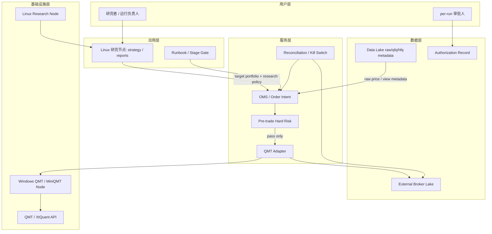

# 高层设计（HLD）：QMT 交易接入与阶段激活

> 本 HLD 是 `process/HLD.md` 的 companion HLD，拥有 CR-015 / CR-016 的 QMT 交易接入、OMS、adapter、pre-trade risk、broker lake、阶段激活、runbook、对账、kill switch 和跨节点部署设计。CR-017 的复权事实源和派生视图由 `process/HLD-DATA-LAKE.md` §18 拥有；主 HLD 只同步研究消费与 order intent metadata。本稿不生成 Story Plan、LLD、实现代码，不授权真实发单、撤单、账户写操作、账户查询、凭据读取、真实 broker lake 写入或 QMT API 调用。

## 修订记录

| 版本 | 日期 | 修订人 | 变更要点 |
|---|---|---|---|
| 0.1 | 2026-05-27 | meta-se | 按 CR-015 / CR-016 新建 QMT companion HLD；冻结 QMT adapter / OMS / pre-trade risk / broker lake / staged activation / runbook / reconciliation / kill switch / cross-node deployment 设计；输出 Q-030..Q-038 CP3 决策输入和 ADR-055..061 候选 |
| 0.2 | 2026-05-30 | meta-se | 按 CR-019 增量修订跨节点通信：默认主路径从 signed file drop 更新为 QMT 独立 C/S 模块，C 侧位于 local_backtest 并采用 Python client / 函数调用为主 + 薄 CLI，S 侧为 Windows 可运行 / 可安装 FastAPI gateway；signed file drop 降级为 blocked-only / 人工 dry-run fallback；完整 endpoint matrix 与真实运行门控分离 |
| 0.2.1 | 2026-05-30 | meta-se | 按 CR-019 CP3 DQ-04 用户修订，将 gateway 鉴权默认值改为配对式 token/HMAC；no-auth 仅允许本机 debug / fixture / 显式临时模式；补充 pairing request/list/approve/complete、HMAC 请求头、timestamp / nonce / scope 校验和鉴权不替代运行门控 |
| 0.3 | 2026-06-01 | meta-se | 按 CR-025 仅同步 order intent draft 消费边界：CR-025 可输出 `order_intent_draft_v1` 供 QMT OMS / risk / adapter 后续审查，但不启动 CR-020 gateway、不授权 simulation/live/account/order/cancel、broker lake 写入、凭据读取或真实 QMT 操作 |

## 1. 问题定义

### 1.1 问题陈述

用户已确认后续会使用 QMT / MiniQMT 进行模拟盘和实盘，但当前项目仍是本地研究、回测和数据湖工具，没有交易接入边界、订单状态机、broker adapter、pre-trade hard risk、外置 broker lake、阶段激活、对账和 kill switch。如果直接在策略或研究脚本里调用 QMT / XtQuant API，会绕过风控和审计，造成误发单、重复下单、复权价下单、凭据泄露和无法复盘等高风险问题。

### 1.2 核心价值

本设计把研究信号到 QMT 交易执行的链路拆为可审计、可阻断、可分阶段启用的交易层：策略只输出 target portfolio / order intent metadata；OMS 负责订单意图、状态机和幂等；pre-trade risk 负责 hard block；adapter 是唯一 broker 触达点；broker lake 外置记录订单、成交、持仓、资产、错误和对账事件；CR-016 再用 stage gate、runbook、per-run 授权、对账和 kill switch 控制模拟盘和实盘推进。

### 1.3 目标

| 优先级 | 目标 | 度量方式 |
|---|---|---|
| P0 | 策略层不得直连 QMT / XtQuant | 策略层导入 / 调用 QMT 下单接口次数为 0；所有 broker 触达经 OMS、risk、adapter |
| P0 | order intent 显式区分研究口径与执行口径 | intent 100% 写 `research_adjustment_policy` 和 `execution_price_policy=raw` |
| P0 | pre-trade risk hard block | 任一风控失败时 adapter 调用次数为 0，blocked reason 和 rule_id 可审计 |
| P0 | OMS 状态机覆盖异常 | accepted、partially_filled、filled、cancel_pending、canceled、rejected、failed、unknown、timeout 均有合法状态迁移 |
| P0 | broker lake 外置和脱敏 | 未授权真实写入时 broker_lake_writes=0；获授权后只写外置 `BROKER_LAKE_ROOT` 或等价受控 root |
| P0 | 阶段激活不可跳过 | `shadow -> simulation -> live_readonly -> small_live -> scale_up` stage gate 顺序通过率 100%，跳阶段请求 blocked |
| P0 | 真实 QMT 操作逐次授权 | 无完整 per-run 授权时 real_order_calls、real_cancel_calls、account_write_calls 均为 0 |
| P0 | 对账和 kill switch 可执行 | 盘前 / 盘中 / 盘后 reconciliation report 100% 写差异、阈值、owner、action；kill switch 触发后停止新单并按规则撤可撤单 |

### 1.4 成功标准

- [ ] CR-015 foundation 默认只运行 shadow / dry-run / mock，真实 `order_stock`、`order_stock_async`、`cancel_order_stock`、账户写操作和凭据读取次数为 0。
- [ ] 任一 order intent 缺 `research_adjustment_policy` 或 `execution_price_policy=raw` 时不得进入 adapter。
- [ ] pre-trade risk 覆盖现金、100 股整手、T+1 可卖、可用持仓、价格口径、重复下单、单票 / 组合限额、异常价格，任一失败均 hard block。
- [ ] mock broker event 覆盖 partial fill、cancel、reject、unknown、timeout，OMS 不把 unknown 静默当作成功。
- [ ] broker lake 计划或后续真实写入只记录 run_id、strategy_id、schema_version、脱敏账户标签、root label、retention_policy、redaction_status，不记录 token、账户号、session、cookie、交易密码或 `.env` 内容。
- [ ] 模拟盘前必须有 runbook，覆盖启动、审批、异常处理、对账、kill switch、暂停 / 恢复和回滚。
- [ ] 真实 QMT 操作 per-run 授权字段至少覆盖账户模式、策略、日期、资金上限、操作范围、审批人和回滚策略。
- [ ] CR-017 未实现验证前不阻断技术模拟盘，但阻断生产策略复权治理完成声明和资金放大。

### 1.5 约束

| 类型 | 约束内容 |
|---|---|
| 平台 | QMT / MiniQMT 与 XtQuant 外部 Python API 位于 Windows 交易节点；Linux 研究节点不直接调用 QMT API |
| 安全 | 不读取、打印、记录或保存 QMT 账户凭据、资金账号、session、cookie、交易密码、`.env` 内容或真实私有路径 |
| 权限 | 本 HLD 不授权真实发单、撤单、账户查询、账户写操作或真实 broker lake 写入；真实操作必须后续 CP5 + per-run 授权 |
| 数据 | QMT 委托、成交、成交核算和 broker 对账只使用 raw / broker price；qfq/hfq 只能作为研究 metadata |
| 运行 | 初期只支持普通股票现金账户；信用、多资产、期货、期权、保证金和完整第三方交易平台迁移均排除 |
| 门控 | CP3 approve 前不得拆 Story；CP5 全量 LLD 确认和 per-run 授权前不得实现真实交易操作 |

### 1.6 非目标（Out of Scope）

- 不在 CR-015 foundation 阶段提交真实订单、撤单、账户写操作或账户查询。
- 不支持信用账户、多资产、期货、期权、保证金、融券或完整第三方交易平台迁移。
- 不把 QMT 接入等同于完整撮合、真实 VWAP、minute、tick、level2、order-match 或微观结构冲击成本支持。
- 不把 qfq/hfq 复权价作为 QMT 委托价、成交价、成交核算价或 broker 对账价。
- 不在本 HLD 中修改代码、引入依赖、写 Story Plan、写 LLD、写 README / docs 或执行验证。

### 1.7 关键假设

- 用户已在 CP2 approve 混合推进：CR-017 先冻结价格口径，CR-015 foundation 可并行设计，CR-016 真实激活后置。
- QMT adapter 运行在 Windows 节点；CR-019 将研究系统与交易节点通信主路径冻结为 QMT 独立 C/S 模块：local_backtest C 侧 Python client / 薄 CLI 通过 REST 调用 Windows S 侧 FastAPI gateway，signed file drop 仅保留为 blocked-only / 人工 dry-run fallback。
- CR-015 默认只允许 shadow / dry-run / mock；真实发单由 CR-016 后续 stage gate 和 per-run 授权控制。
- broker lake 默认为外置 root 或受控存储，默认不写仓库 `data/**` / `reports/**`。
- QMT 执行价格必须使用 raw / broker price，研究复权口径仅进入 metadata。

### 1.8 缺失信息

| 优先级 | 缺失信息 | 影响范围 | 决策所需时限 |
|---|---|---|---|
| REQUIRED_FOR_CP3 | broker lake root / schema / retention / redaction | Q-032、ADR-056、后续文件所有权 | CP3 |
| REQUIRED_FOR_CP3 | OMS 状态机、QMT / mock event 映射、unknown / timeout / partial fill 策略 | Q-033、ADR-057、状态机 LLD | CP3 |
| REQUIRED_FOR_CP3 | pre-trade risk 阈值和配置位置 | Q-034、ADR-058、risk LLD | CP3 |
| REQUIRED_FOR_CP3 | 阶段准入 / 退出 / 回退阈值 | Q-035、ADR-059、CR-016 stage gate | CP3 |
| REQUIRED_FOR_CP3 | T+1 限价 / 保护价、撤单、重试和未成交处理 | Q-036、ADR-060、交易计划 | CP3 |
| REQUIRED_FOR_CP3 | 对账阈值、kill switch 触发 / 恢复条件 | Q-037、ADR-060、runbook | CP3 |
| RESOLVED_CP3_BASELINE_UPDATED_BY_CR019 | Linux 与 Windows QMT 节点通信、鉴权、隔离和运维责任 | Q-038、ADR-061、部署运行 | Q-038 原 CP3 通过；CR-019 将默认通信改为 FastAPI C/S，signed file drop 降级 fallback |
| REQUIRED_FOR_CP3_CR019 | Windows FastAPI gateway 的 bind、防火墙、鉴权、完整 endpoint matrix、运行门控、fallback 和 C 侧接口形态 | Q-039、Q-041、Q-042、Q-044、ADR-068..072 | CR-019 CP3 |

## 2. 候选架构方案对比

| 方案 | 描述 | 优点 | 缺点 | 复杂度 / 成本 | 扩展性 | 风险 | 适用前提 |
|---|---|---|---|---|---|---|---|
| QMT-A：Windows QMT 节点 + OMS + adapter + broker lake + staged activation（推荐） | 研究系统只输出 target portfolio / order intent metadata；Windows 节点承载 adapter；OMS、risk、broker lake 和 stage gate 控制交易 | 风控、审计、mock、对账和授权边界清晰；可逐步从 shadow 到实盘 | 组件较多，需要 runbook 和跨节点通信 | high / 中高 | 高 | 需要严格门控，否则真实 API 风险高 | 用户接受先设计和 mock，再逐步授权真实操作 |
| QMT-B：策略脚本直接调用 QMT API | 研究或策略入口直接导入 XtQuant 并下单 | 起步快，文件少 | 绕过 OMS/risk，无法统一状态机和对账，凭据风险高 | medium / 低起步高事故成本 | 低 | 误下单、重复下单、复权价下单 | 仅适合一次性人工试验，不适合本项目 |
| QMT-C：整体迁移到完整第三方交易平台 | 引入完整 OMS / broker / 数据 / 风控平台替代当前研究系统 | 长期能力完整 | 打散现有数据湖和研究资产，迁移成本高 | very-high / 高 | 高 | 平台锁定、学习成本和凭据风险 | 用户明确转向平台级交易系统 |

**推荐方案**：QMT-A。它保留当前研究 / 数据湖资产，同时把真实 broker 触达收敛到 adapter、OMS、risk 和 stage gate，满足 CR-015/016 的安全边界。

## 3. 推荐方案总览

**复杂度模式**：`standard`

| 判定维度 | 依据 | 结论 |
|---|---|---|
| 需求规模 | REQ-105..122 覆盖架构、安全、数据、运行治理和验证矩阵 | standard/high |
| 角色数量 | P-05 QMT 运行负责人、P-06 口径审计者、P-01 研究者 | standard |
| 状态流转 | 订单状态机 + stage gate + kill switch 均有多分支 | standard |
| 平台适配 | Linux 研究节点 + Windows QMT / MiniQMT 节点 | standard/high |
| Story 拆解 | 后续至少拆 foundation、activation、ops、docs/validation 多组 | standard；本轮不写 Story |

**系统核心思路**：策略不直接下单，只输出目标组合和研究 metadata。OMS 生成订单意图并执行幂等、状态机和风控；adapter 是唯一 QMT / XtQuant 触达点；broker lake 外置记录交易事实；CR-016 通过 stage gate、runbook、per-run 授权、对账和 kill switch 控制真实链路逐步启用。

**关键架构风格**：分层 + adapter boundary + 状态机 + gate-driven operations。

**核心能力边界**：

- 做：target portfolio -> order intent、pre-trade hard risk、OMS state machine、QMT adapter boundary、broker lake contract、stage gate、runbook、reconciliation、kill switch、cross-node deployment contract。
- 不做：真实发单授权、真实 QMT API 实现、凭据存储、完整交易平台、信用 / 多资产 / 期货期权、微观结构执行模型。

**关键依赖**：

- `process/HLD-DATA-LAKE.md` §18：提供 raw/qfq/hfq/returns_adjusted 和 QMT raw 执行价边界。
- XtQuant 外部 Python API：后续 adapter 真实实现的接口来源；本 HLD 只定义边界，不引入依赖。
- Windows QMT / MiniQMT 节点：后续真实 adapter 运行环境；本 HLD 不触发安装或运行。

## 4. 系统架构图



## 5. 高层模块与职责划分

| 模块 | 类型 | 职责 | 输入 | 输出 | 依赖 |
|---|---|---|---|---|---|
| Research Handoff | Application boundary | 接收研究目标组合，附带 `research_adjustment_policy`、lineage 和 `execution_price_policy=raw` | target portfolio、signal_date、target_trade_date、view metadata | order intent draft | 主 HLD、数据湖 HLD |
| OMS | Service | 生成订单意图、幂等 key、状态机、事件归并和 manual_review 标记 | order intent draft、broker events、recon result | order state、state transition events | Risk、Adapter、Broker Lake |
| Pre-trade Risk | Service | 对每条 intent 执行 hard block | order intent、cash/position snapshot、risk config、raw price | pass / blocked reason | Data Lake raw price、Broker snapshot |
| QMT Adapter | Service / Adapter | 唯一 QMT / XtQuant 触达点；支持 shadow / dry-run / mock / simulation / live_readonly / small_live | risk-passed intent、stage、authorization | broker order event、error event | Windows QMT node |
| Broker Lake Contract | Data | 外置记录 order、fill、position、asset、error、reconciliation、incident | OMS / adapter / recon events | versioned broker facts / dry-run plan | `BROKER_LAKE_ROOT` 或等价 root |
| Stage Gate | Governance service | 控制 shadow、simulation、live_readonly、small_live、scale_up 准入 / 退出 / 回退 | previous evidence、runbook、authorization、recon、CR-017 status | gate result、blocked reasons | Runbook、CP evidence |
| Reconciliation | Service | 盘前 / 盘中 / 盘后对账，输出差异、阈值、owner、action | broker snapshot、OMS state、broker lake facts | reconciliation report | Adapter、Broker Lake |
| Kill Switch | Service / Ops | 停止新单、撤可撤单、冻结策略、暂停 / 恢复、人工接管 | heartbeat、risk、recon diff、manual trigger | incident event、takeover audit | OMS、Adapter、Runbook |
| Cross-node Transport / Gateway | Infrastructure boundary | Linux / WSL 研究节点与 Windows QMT 节点的受控通信；CR-019 主路径为 C 侧 REST client -> Windows FastAPI gateway，file drop 仅 fallback | REST request、run_id、intent_id、stage、mode、authorization_ref；fallback dry-run file | typed response、blocked reason、redacted audit、fallback ack/error | OS / network / bind / firewall / auth |

模块边界规则：

- 策略层只输出目标组合和 metadata，不导入或调用 QMT / XtQuant。
- Adapter 只接收 risk pass 且 stage / authorization 满足的 intent；风控失败时 adapter 调用次数为 0。
- Broker lake 不写仓库 `data/**` / `reports/**`；默认只输出 dry-run / mock 审计或写入计划。
- Kill switch 不做研究信号判断，只控制交易运行状态和 broker 操作边界。

## 6. 技术选型与理由

| 选型类别 | 选择 | 备选方案 | 选择理由 | 风险 |
|---|---|---|---|---|
| Broker 接入 | XtQuant 外部 Python API + adapter | 策略直连 QMT；完整第三方交易平台 | 与用户 QMT 目标一致，且可用 adapter 收敛风险 | API 细节需 LLD / Spike 复核 |
| 部署形态 | Linux 研究节点 + Windows QMT 节点 | 全部迁到 Windows；全部留在 Linux | QMT/MiniQMT 约束在 Windows，研究资产保留 Linux | 跨节点通信和运维复杂度 |
| 状态管理 | 本地 OMS 状态机 + broker lake facts | 只依赖 QMT 日志 | 可复盘 partial fill、unknown、timeout 和对账差异 | 状态表设计需要严格 |
| 风控 | pre-trade hard block | warn-only | 真实资金风险不可接受，失败不得触达 broker | 阈值过严会降低成交率 |
| broker 事实存储 | 外置 `BROKER_LAKE_ROOT` 或等价受控 root | 仓库 `data/**` / `reports/**`；QMT 本地日志 | 与研究数据湖隔离，支持脱敏和 retention | root、retention 和 redaction 需 CP3 冻结 |
| 通信 | CR-019 后推荐 QMT C/S bridge：local_backtest C 侧 Python client / 薄 CLI 通过 REST 调 Windows FastAPI gateway；signed file drop 仅 fallback | signed file drop 主路径；策略直连 Windows API；全部迁到 Windows | 满足用户完整 QMT 功能接口目标，支持 heartbeat、capabilities、typed blocked reason 和运行门控；仍保持 WSL 不直连 xtquant | gateway 需要 bind / firewall / auth / redaction / incident 设计；fallback 必须 fail-closed |

## 7. 关键流程

### 7.1 CR-015 foundation shadow / dry-run / mock

1. 策略在 T 日收盘后输出目标组合、策略版本、参数、signal_date、target_trade_date 和研究口径 metadata。
2. OMS 将目标组合转换为 order intent，写 `research_adjustment_policy`、`execution_price_policy=raw`、risk_profile 和 idempotency_key。
3. Pre-trade risk 检查现金、整手、T+1、可用持仓、价格口径、重复 intent、限额和异常价格。
4. 风控失败：写 blocked event，不触达 adapter。
5. 风控通过：adapter 在 shadow / dry-run / mock 模式生成模拟 broker response。
6. OMS 推进状态机并输出脱敏审计事件；未授权真实写入时 broker lake 只输出写入计划。

### 7.2 CR-016 staged activation

1. 用户请求目标 stage。
2. Stage Gate 读取上一阶段证据、runbook、authorization、reconciliation、kill switch 演练和 CR-017 状态。
3. 缺前置项时返回 blocked gate result。
4. 进入 simulation 或真实阶段前，检查 per-run 授权字段完整性。
5. T 日收盘后冻结信号，T+1 使用限价 / 保护价执行。
6. 运行中执行 heartbeat、盘中对账和 kill switch 监控。
7. 盘后输出 reconciliation report、incident / takeover audit 和下一阶段 gate 建议。

### 7.3 OMS 状态机

| 当前状态 | 事件 | 下一状态 | 处理 |
|---|---|---|---|
| `created` | risk_pass | `risk_passed` | 允许进入 adapter |
| `created` | risk_blocked | `blocked` | 不触达 adapter |
| `risk_passed` | adapter_accepted | `accepted` | 记录 broker_order_ref |
| `accepted` | partial_fill | `partially_filled` | 记录 fill_qty / amount |
| `accepted` / `partially_filled` | fill_complete | `filled` | 终态 |
| `accepted` / `partially_filled` | cancel_requested | `cancel_pending` | 发起可撤单撤单 |
| `cancel_pending` | cancel_confirmed | `canceled` | 终态 |
| `cancel_pending` | cancel_failed | `manual_review` | 不重复自动撤单 |
| 任意非终态 | reject | `rejected` | 终态，记录 reason |
| 任意非终态 | timeout | `timeout` | 进入 retry / manual_review |
| 任意非终态 | unknown | `unknown` | 不得当作成功；等待对账或人工确认 |
| 任意非终态 | kill_switch | `frozen` | 停止新单，按规则撤可撤单 |

### 7.4 前置校验与失败路径

| 阶段 | 前置条件 | 失败行为 | 回退 / 降级 |
|---|---|---|---|
| HLD / CP3 | CP2 approved，REQ-105..122、Q-032..038 可读 | CP3 自动预检 BLOCKED | 回退 requirement-clarification |
| Foundation run | adapter_mode 为 shadow / dry-run / mock；真实 API 授权缺失 | 拦截真实 API 调用 | 保持 mock / dry-run |
| Simulation gate | CR-015 foundation 设计和验证证据、runbook、对账规则 | gate_status=blocked | 补齐 runbook / mock evidence |
| Live readonly | simulation 通过、只读授权、对账阈值 | 不允许账户写操作 | 保持 simulation |
| Small live | live_readonly 通过、per-run 授权、资金上限、kill switch | real_order_calls=0 | 保持 live_readonly |
| Scale up | 小资金稳定、CR-017 实现验证、研究成熟度 gate | blocked_claims | 保持 small_live 或 simulation |

## 8. 非功能需求设计

| 质量特征 | 设计目标 | 实现手段 | 验证方式 |
|---|---|---|---|
| 安全性 | 未授权真实交易操作为 0 | stage gate、per-run authorization、adapter mode hard block | TS-015-01、TS-016-02 |
| 可追溯性 | 每个 order / broker event 可复盘 | broker lake schema、run_id、strategy_id、state transition、redaction_status | TS-015-03、TS-015-04 |
| 可用性 | 异常时停止新风险暴露 | kill switch、manual_review、reconciliation threshold | TS-016-03 |
| 可维护性 | QMT 接入与研究层隔离 | adapter boundary、forbidden import、三 HLD 职责表 | 静态扫描 / 设计评审 |
| 可验证性 | mock / dry-run 覆盖核心分支 | mock broker events、risk samples、stage gate fixtures | CP7 后续矩阵 |
| 可移植性 | Linux / Windows 职责清晰 | cross-node contract、transport ack、redaction | Q-038 CP3 决策 |

## 9. 主要风险与应对

| 风险 ID | 风险描述 | 概率 | 影响 | 应对策略 | 触发信号 |
|---|---|---|---|---|---|
| QMT-R1 | 策略层直连 QMT API | 中 | 高 | ADR-055；策略 forbidden import；adapter 唯一 broker 触达点 | 策略文件出现 xtquant / order API import |
| QMT-R2 | qfq/hfq 误作为执行价 | 中 | 高 | ADR-053/055/058；order intent 和 risk 双重 hard block | execution_price_policy 非 raw |
| QMT-R3 | broker lake 或日志泄露账户 / 凭据 | 中 | 高 | ADR-056；redaction gate；只保留脱敏 root label 和 env var 名称 | 日志包含账号、token、session、`.env` 内容 |
| QMT-R4 | unknown / timeout 被当作成功 | 中 | 高 | ADR-057；unknown/timeout 进入 manual_review / reconciliation | timeout 后继续生成重复订单 |
| QMT-R5 | warn-only 风控触达 broker | 低 | 高 | ADR-058；风控失败 adapter 调用次数为 0 | risk fail 后出现 adapter event |
| QMT-R6 | 阶段推进过快 | 中 | 高 | ADR-059；stage gate 不可跳过；小资金和资金放大量化阈值 | simulation 未通过即请求 small_live |
| QMT-R7 | 对账和 kill switch 不可执行 | 中 | 高 | ADR-060；runbook、阈值、owner、恢复条件 | reconciliation diff 超阈值但无 action |
| QMT-R8 | 跨节点通信不受控或 gateway 被误当成真实授权通道 | 中 | 高 | ADR-061 + ADR-068..072；FastAPI C/S 主路径必须绑定受控地址、走运行门控、日志脱敏；signed file drop 仅 fallback | Linux 直接远程执行 Windows QMT 命令；gateway 可达后绕过 stage gate |

## 10. ADR 候选决策点

| ADR | 决策 | 回写对象 |
|---|---|---|
| ADR-055 | QMT 接入采用 Windows QMT 节点 + OMS + adapter，策略不得直连 QMT | Q-038、REQ-105、§4、§5、§6 |
| ADR-056 | broker lake 外置、schema、retention、redaction 与研究数据湖隔离 | Q-032、REQ-108、REQ-111 |
| ADR-057 | OMS 状态机和 QMT / mock event 映射，unknown / timeout / partial fill 处理 | Q-033、REQ-107、REQ-116 |
| ADR-058 | pre-trade hard risk gate 规则、阈值、配置位置和失败行为 | Q-034、REQ-109、REQ-110 |
| ADR-059 | staged activation 准入 / 退出 / 回退阈值 | Q-035、REQ-112、REQ-119 |
| ADR-060 | T+1 限价 / 保护价、撤单重试、对账阈值和 kill switch 行为 | Q-036、Q-037、REQ-115..117 |
| ADR-061 | Linux 研究节点与 Windows QMT 节点通信、鉴权、隔离和运维责任 | Q-038、REQ-105、REQ-113 |
| ADR-068 | CR-019 QMT C/S bridge 主选：local_backtest C 侧 client + Windows S 侧 FastAPI gateway | Q-039、REQ-145、REQ-149、REQ-159 |
| ADR-069 | C 侧接口形态采用 Python client / 函数调用为主 + 薄 CLI | Q-044、REQ-160 |
| ADR-070 | 完整 QMT endpoint matrix 与 run mode / stage / risk / kill-switch 门控分离 | Q-041、REQ-146、REQ-147 |
| ADR-071 | 配对式 token/HMAC 默认启用；no-auth 仅 debug / fixture / 显式临时 | Q-039、REQ-148、REQ-151 |
| ADR-072 | FastAPI fallback 只 blocked-only 或人工 dry-run / signed file drop，不自动真实 QMT | Q-042、REQ-145、REQ-150 |

## 11. 分阶段落地建议

> 下表是 HLD 级阶段建议，不是 Story Plan。CP3 人工确认前不得写 `STORY-BACKLOG.md`、`DEVELOPMENT-PLAN.yaml` 或 `process/stories/**`。

| 阶段 | 交付物 | 里程碑标志 | 前提条件 |
|---|---|---|---|
| Phase A：Foundation contract | order intent、OMS state machine、risk rule、broker lake schema、adapter mode contract | shadow / dry-run / mock 设计可评审 | CP3 approve |
| Phase B：Foundation validation | mock broker events、risk samples、state transition audit、redaction samples | 真实 API 调用 0，mock event 全覆盖 | Phase A LLD / CP5 |
| Phase C：Simulation readiness | runbook、stage gate、per-run authorization、T+1 limit/protect policy、recon rules | simulation gate 可执行 | CR-015 foundation verified |
| Phase D：Live readonly / small live | live_readonly 对账、小资金限额、kill switch 演练 | 只读 / 小资金 gate 可执行 | 用户 per-run 授权 |
| Phase E：Scale-up gate | 研究成熟度、CR-017 实现验证、运行稳定性和资金放大阈值 | scale_up blocked/allowed 可审计 | 小资金阶段稳定且 CP8 终验边界明确 |

## 12. 工作量粗估

| 类别 | 候选 Story 数 | 预计 Wave 数 | 粗估工作量 |
|---|---:|---:|---|
| CR-015 foundation | 6-7 | 2-3 | L |
| CR-016 activation / ops | 6-7 | 3-4 | L |
| 文档 / runbook / incident playbook | 2-3 | 1-2 | M |
| 验证矩阵 | 3-4 | 2 | M |
| 合计 | 17-21 | 5-7 | XL |

## 13. CP3 Decision Brief 输入（Q-030 至 Q-038）

| ID | 推荐方案 | 备选方案 A | 备选方案 B | 接受影响 | 不接受影响 | 风险 / 后续影响 |
|---|---|---|---|---|---|---|
| Q-030 | 接受 `process/HLD-DATA-LAKE.md` §18：raw + adj_factor 事实源，qfq/hfq 明确公式、provider 因子方向、as-of 和异常价格质量门 | 只先支持 qfq，hfq 后置 | 只保存 provider 成品 qfq/hfq | 公式方向和 qfq 漂移可审计，后续实现可验证 | 派生方向可能写反，QMT raw 价边界缺上游事实 | ADR-053，影响 data lake LLD |
| Q-031 | 独立 `prices_raw` / `adj_factor` / `prices_qfq` / `prices_hfq` / `returns_adjusted` view，旧 qfq 只读保留 | 单 `prices` 表按 policy 混存 | 覆盖旧 qfq 并迁移为新 view | 单口径 gate 清晰，旧报告可追溯 | 消费混用或旧证据丢失 | ADR-054，影响 reader / migration |
| Q-032 | broker lake 外置 root，schema 覆盖 order/fill/position/asset/error/reconciliation/incident；默认 retention 3 年或用户配置；敏感字段脱敏 / 禁入库 | 只依赖 QMT 本地日志 | 写入仓库 `data/**` / `reports/**` | 可复盘、可对账、凭据风险低 | 无法审计交易事实或泄露敏感信息 | ADR-056，影响 broker lake LLD 和 runbook |
| Q-033 | OMS 状态机覆盖 accepted/partial/filled/cancel_pending/canceled/rejected/failed/unknown/timeout/manual_review/frozen；unknown/timeout 不自动成功，需对账或人工确认 | 简化为 submitted/filled/failed 三态 | 直接以 QMT 返回值为唯一状态 | 部分成交、撤单失败和超时可审计 | 重复下单、误判成功、对账失真 | ADR-057，影响状态机和 QA fixtures |
| Q-034 | pre-trade risk hard block：现金、100 股整手、T+1 可卖、可用持仓、价格口径、重复 intent、单票 / 组合限额、异常价格；配置在交易配置 / run profile，失败 adapter_calls=0 | warn-only 记录但允许继续 | 只做 QMT 返回后校验 | 实盘风险受控，失败可解释 | 风控失败仍可能下单 | ADR-058，影响 risk config / tests |
| Q-035 | stage gate 固定 `shadow -> simulation -> live_readonly -> small_live -> scale_up`；每阶段有准入、退出、回退、观察窗口、资金上限和失败阈值；CR-017 未验证前阻断 scale_up | simulation 通过后直接 small_live | 长期停留 simulation，不设计 live gate | 可先验证技术链路又控制资金风险 | 直接实盘风险高或无法验证真实链路 | ADR-059，影响 activation runbook |
| Q-036 | T 日收盘后信号，T+1 限价 / 保护价；推荐保护带以 raw close 或 broker reference price 的可配置百分比表达；超时未成交默认撤可撤单，单 run 自动重试次数上限为 1，未成交归因为 cash / unfilled | T+1 市价或最优五档即时成交 | 当日盘中即时信号即时下单 | 控制追单和滑点，保持可解释 | 成交率下降但风险可控；不接受会增加未来函数和价格风险 | ADR-060，影响 order plan / runbook |
| Q-037 | 盘前 / 盘中 / 盘后对账覆盖委托、成交、持仓、资产、现金；金额 / 持仓 / 委托差异阈值可配置，超阈值 manual_review 或 kill switch；恢复需对账 pass + 人工接管记录 | 只盘后对账 | 只靠 QMT 客户端人工查看 | 异常可早发现，恢复可审计 | 盘中风险持续扩大，事故不可复盘 | ADR-060，影响 reconciliation / incident |
| Q-038 / CR019 | Linux 研究节点与 Windows QMT 节点解耦继续有效；CR-019 将默认通信主路径更新为 C 侧 REST client -> Windows FastAPI gateway；signed file drop + ack/error enum 降级为 blocked-only / 人工 dry-run fallback；adapter 只在 Windows；运维责任分为 research owner、trading node owner、approver | 继续 signed file drop 作为主路径 | 全部迁移到 Windows 单机运行 | 满足用户 D7 与完整 endpoint 目标，capability / heartbeat / blocked reason 更可观测 | 服务生命周期、bind、防火墙和可选鉴权复杂度上升；不接受会回退到低交互 fallback | ADR-055/061/068/072，影响部署和 runbook |

## 14. CP3 多角色讨论输入

| 字段 | 内容 |
|---|---|
| 推荐方案 | QMT-A：Windows QMT / MiniQMT 节点 + XtQuant adapter + OMS + pre-trade hard risk + broker lake + staged activation。理由是它保留研究 / 数据湖资产，同时把真实 broker 触达收敛到可审计边界 |
| 备选方案 | QMT-B：策略直接调用 QMT API，起步快但绕过风控和审计；QMT-C：完整第三方交易平台，能力强但迁移成本高、会打散现有资产 |
| 关键取舍 | 复杂度和运维成本上升；安全、可验证性、可维护性明显提升；平台兼容需要 Linux / Windows 分工；QMT 和凭据风险通过 adapter、authorization、redaction 和 stage gate 控制 |
| 用户需决策点 | 是否接受新增 QMT companion HLD；是否接受 Q-032..Q-038 推荐方案；是否接受 CR-017 设计未实现前只阻断生产策略声明和资金放大、不阻断技术模拟盘 |
| 回退点 | 若 CP3 不通过，回退到 CR-015 / CR-016 问题定义，重新界定 QMT 接入方式、broker lake root、OMS 状态机、risk gate、activation stage 或跨节点部署 |

## 15. Gotchas

| Gotcha | 规避方式 |
|---|---|
| 看到 QMT API 可用就让策略直接下单 | 策略层 QMT import / call 次数必须为 0；adapter 是唯一 broker 触达点 |
| 把 shadow / dry-run 当作模拟盘 | shadow / dry-run / mock 不触达真实 QMT；simulation 必须通过 CR-016 stage gate |
| unknown / timeout 被当作失败后立刻重下 | unknown / timeout 进入 manual_review 或 reconciliation；自动重试有上限 |
| broker lake 写入仓库 | broker lake 外置，默认只写 dry-run plan；仓库 `data/**` / `reports/**` 写入次数为 0 |
| 把 qfq/hfq 作为委托价 | order intent 和 risk 双重检查 `execution_price_policy=raw` |
| per-run 授权记录凭据值 | 授权只记录脱敏摘要、env var 名称和审批证据，不记录密码、token、账户号 |

## 16. 待确认问题

| ID | 问题 | 状态 | 默认处理 | 影响范围 | 决策人 |
|---|---|---|---|---|---|
| Q-032 | 是否接受 broker lake 外置 root、schema、retention 和 redaction 方案 | OPEN | 默认接受外置 root、3 年或用户配置保留、敏感字段脱敏 | broker lake、runbook、QA | 用户 / meta-po |
| Q-033 | 是否接受 OMS 状态机和 unknown / timeout / partial fill 处理 | OPEN | 默认接受完整状态机和 manual_review / reconciliation | OMS、adapter、对账 | 用户 / meta-po |
| Q-034 | 是否接受 pre-trade risk hard block 清单、阈值和配置位置 | OPEN | 默认接受 hard block，warn-only 不可用 | risk、order intent、adapter | 用户 / meta-po |
| Q-035 | 是否接受 stage gate 阈值和 CR-017 对资金放大的前置关系 | OPEN | 默认接受阶段不可跳过，CR-017 未验证前阻断 scale_up | activation、资金风险 | 用户 / meta-po |
| Q-036 | 是否接受 T+1 限价 / 保护价、超时撤单、失败重试和未成交归因 | OPEN | 默认接受可配置保护带、自动重试上限 1、未成交留现金 | order plan、runbook | 用户 / meta-po |
| Q-037 | 是否接受盘前 / 盘中 / 盘后对账阈值、owner、kill switch 和恢复条件 | OPEN | 默认接受结构化对账和 kill switch | ops、incident、runbook | 用户 / meta-po |
| Q-038 | 是否接受 Linux / Windows 解耦、signed file drop 保守默认和运维责任划分 | RESOLVED_CP3_SUPERSEDED_BY_CR019 | 原 CP3 已接受；CR-019 改为 FastAPI C/S 主路径，signed file drop fallback | deployment、security、ops | 用户 / meta-po |
| Q-039 | 是否接受配对式 token/HMAC 默认启用，no-auth 仅 debug / fixture / 显式临时 | OPEN_FOR_CR019_CP3 | 默认接受；HMAC 只识别调用方，真实交易仍走 run mode / stage / risk / kill-switch / authorization | gateway security、logs、deployment、pairing | 用户 / meta-po |
| Q-041 | 是否接受完整 endpoint matrix 与真实转发门控分离 | OPEN_FOR_CR019_CP3 | 默认接受；接口完整，真实转发受 run mode / stage / risk / kill-switch / authorization 控制 | API、stage gate、QA | 用户 / meta-po |
| Q-042 | 是否接受 FastAPI fallback 只 blocked-only 或人工 dry-run / signed file drop | OPEN_FOR_CR019_CP3 | 默认接受；禁止自动真实 QMT fallback | incident、availability、safety | 用户 / meta-po |
| Q-044 | 是否接受 C 侧 Python client / 函数调用为主 + 薄 CLI | OPEN_FOR_CR019_CP3 | 默认接受；CLI 仅复用 client 做 smoke / ops / scripts | C-side API、tests、docs | 用户 / meta-po |

## 17. CR-019 QMT C/S Bridge 增量

> 本节覆盖 CR-019 对 QMT companion HLD 的修订。它只改变通信与 gateway 合同，不改变 CR-015/016/017 已批准的 adapter 唯一 broker 触达、OMS、risk、broker lake、stage gate、runbook、对账、kill switch 和 raw execution policy。接口完整支持不代表真实操作授权；本节不授权实现、安装、启动服务、真实 QMT / MiniQMT / XtQuant 调用、账户查询、发单、撤单、凭据读取或 broker lake 写入。

### 17.1 结构边界

```text
local_backtest / WSL
  QMT C-side Python client
  Thin CLI wrapper
    |
    | REST: run_id / intent_id / endpoint / mode / stage / authorization_ref
    v
Windows QMT node
  FastAPI gateway command
  Run gate / redaction / heartbeat
  QMT / XtQuant adapter
    |
    v
QMT / MiniQMT / XtQuant / QMT service
```

| 边界 | 主选 | 禁止项 |
|---|---|---|
| C 侧 | 位于 local_backtest，向 strategy / OMS / admission / tests 暴露 Python client / 函数接口；CLI 只做薄包装；默认持有 pairing 后得到的 client id / secret 引用 | 不导入 `xtquant`；不读取 QMT 账户凭据；不通过 shell 文本解析作为内部主路径；不写日志输出 secret |
| S 侧 | Windows 可运行 / 可安装 FastAPI gateway，接收 REST 并转换为 QMT / XtQuant adapter 调用；默认启用配对式 token/HMAC | 不嵌入回测主进程；不默认公网暴露；不把 health/capabilities pass 或 HMAC pass 当成真实授权 |
| fallback | blocked-only 或人工 dry-run / signed file drop | 不自动真实发单、撤单、查询账户或写 broker lake |

### 17.2 Endpoint Matrix 与门控继承

| Endpoint 类别 | 支持状态 | 继承门控 |
|---|---|---|
| health / capabilities | required | 不触达真实 QMT；只返回脱敏能力和状态 |
| validate / dry-run / mock | required | adapter_mode=shadow/dry_run/mock；真实 QMT 调用为 0 |
| market query | required | 不写研究 lake；不替代 production current truth |
| account / position / order / trade query | required but later-gated | live_readonly 或更高 stage + per-run authorization + redaction |
| simulation submit / cancel | required but later-gated | simulation stage PASS + risk PASS + kill switch clear + authorization |
| live submit / cancel | required but later-gated | small_live / scale_up stage PASS + risk PASS + authorization |
| reconciliation / kill-switch | required | reconciliation / kill-switch policy；真实撤单动作仍受 stage / mode / authorization 控制 |

### 17.3 鉴权、绑定和日志

| 设计项 | CR-019 冻结建议 | 切换条件 |
|---|---|---|
| 应用层鉴权 | 配对式 token/HMAC 默认启用。C 侧先发起 pairing request，S 侧管理员 list / approve，C 侧 complete 后后续请求携带 client id、timestamp、nonce 和 HMAC signature | no-auth 只允许本机 debug、fixture 测试或显式配置的临时模式；组织化多人 / 跨网段 / live 默认开放时增加 scope、secret rotation 或更强鉴权 |
| Bind / firewall | LLD 必须定义 Windows bind host / port、WSL 访问路径、Windows 防火墙和来源 allowlist；公网默认 fail | 无法安全限定来源时，gateway 不进入运行，切回 fallback |
| 日志脱敏 | 只记录 run_id、intent_id、endpoint、client id hash、latency、blocked reason、redaction_status | 日志中出现 secret、pairing code、token、账户号、session、cookie、交易密码、`.env` 或真实私有路径时 fail |
| Pairing 字段 | pending request 记录 `request_id`、client name、来源 IP、机器指纹摘要、创建时间、过期时间；approve 后生成 client id + secret 与一次性 pairing code 或短 TTL 领取窗口 | pending request 过期、来源异常或管理员未批准时 hard block |
| HMAC 校验 | 请求头包含 `X-QMT-Client-Id`、`X-QMT-Timestamp`、`X-QMT-Nonce`、`X-QMT-Signature`；签名建议 `HMAC_SHA256(secret, method + path + body_hash + timestamp + nonce)` | timestamp 偏移、nonce replay、scope 不足或 signature mismatch 时 hard block |

### 17.4 失败路径

| 失败触发 | 处理 | 真实操作计数 |
|---|---|---|
| gateway 不可达 / heartbeat fail | 返回 transport blocked；可生成人工 dry-run file | QMT API / order / cancel / account query = 0 |
| pairing 未完成、pairing code 过期、client 未批准或 HMAC 失败 | 返回 auth blocked；不进入 adapter | QMT API / order / cancel / account query = 0 |
| stage gate / risk gate / kill switch 未满足 | 返回 gate blocked，列出缺失前置 | QMT API / order / cancel / account query = 0 |
| fallback 被请求真实 QMT | hard block；记录 incident candidate | QMT API / order / cancel / account query = 0 |

### 17.5 与 ADR-061 的关系

ADR-061 的“Linux 研究节点与 Windows QMT 节点解耦、adapter 只在 Windows、运维责任分层”继续有效；CR-019 只修订通信主路径。原 signed file drop + ack/error enum 不删除其历史决策含义，但不再是默认主路径，只作为 FastAPI 不可达、鉴权失败或部署边界不满足时的人工 dry-run / blocked fallback。

## 18. CR-025 order intent draft 消费边界

> 本节仅同步 CR-025 的研究输出到 QMT 路线的接口边界。它不启动 CR-020，不授权 gateway health、simulation、live-readonly、small-live、scale-up、账户查询、下单、撤单、broker lake 写入、凭据读取或真实 QMT / MiniQMT / XtQuant 调用。

### 18.1 输入合同

| 字段 | 是否必填 | 消费边界 |
|---|---|---|
| `schema_version` | 是 | 固定为 `order_intent_draft_v1` 或后续 CP3/CP5 批准版本；未知版本 blocked。 |
| `strategy_id` / `run_id` | 是 | 用于 OMS 幂等、审计和后续对账引用；不得包含凭据或真实账户号。 |
| `signal_date` / `target_trade_date` | 是 | QMT route 只接受可解释的 T 日信号与目标交易日；缺失时 blocked。 |
| `symbol` | 是 | 后续由 tradability / risk / position gate 校验。 |
| `side` | 条件必填 | 若仅给 target weight / qty，可由 OMS 后续推导，但推导规则需 LLD 冻结。 |
| `target_weight` / `target_qty` | 至少一项 | 缺两者时不得进入 OMS；数量转换必须后续由 OMS / risk 处理。 |
| `research_adjustment_policy` | 是 | 只作为研究 metadata；不得作为委托、成交或对账价格。 |
| `execution_price_policy` | 是 | 必须为 `raw` 或后续明确 raw / broker reference；qfq/hfq 进入执行价时 hard block。 |
| `cost_config_ref` | 是 | 用于解释 semantic diff 与 risk 预算，不代表真实 broker 手续费已确认。 |
| `data_lineage_ref` | 是 | 指向 release / source run / quality evidence；不可追溯时 blocked。 |
| `limitations` | 是 | 必须携带 unavailable、blocked claims、proxy / degradation 原因。 |

### 18.2 失败路径

| 触发 | 处理 | 真实操作计数 |
|---|---|---|
| `execution_price_policy` 缺失或非 raw | hard block，不进入 adapter | QMT API / order / cancel / account query = 0 |
| `data_lineage_ref` 或 `limitations` 缺失 | blocked，要求回到 research output 修正 | QMT API / broker lake write = 0 |
| CR-025 semantic diff 被标记为 simulation-ready | blocked，改为 research comparison | simulation submit = 0 |
| 用户要求用 CR-025 直接启动 gateway | blocked，必须另起 CR-020 或后续授权 | service start / port bind / QMT call = 0 |

### 18.3 与 CR-020..CR-024 的关系

| 对象 | 关系 | 不继承事项 |
|---|---|---|
| CR-025 | 只提供 research output、semantic diff 和 order intent draft | 不提供 gateway readiness、account permission、simulation authorization。 |
| CR-020 | 可在用户明确启动后做 gateway health / Windows node 准入 | 不继承 CR-025 的 CP3 设计通过作为运行授权。 |
| CR-021..CR-024 | 分别承接 simulation、live-readonly、small-live、scale-up | 需独立 CP2/CP3/CP5、stage gate 和 per-run authorization。 |

<!-- meta-po 填写：CP3 HLD 人工确认记录 -->
## CP3 确认记录

### CR-019 记录

**CP3 自动预检结果**：`process/checks/CP3-CR019-HLD-CONSISTENCY.md`
**CP3 人工 checklist 草案**：`checkpoints/CP3-CR019-HLD-REVIEW.md`

**确认状态**：待 meta-po 正式发起

**审核意见**：

**确认人**：

**确认时间**：

### CR-015 / CR-016 / CR-017 历史记录

**CP3 自动预检结果**：`process/checks/CP3-CR015-CR016-CR017-HLD-CONSISTENCY.md`
**CP3 人工 checklist**：`checkpoints/CP3-CR015-CR016-CR017-HLD-REVIEW.md`

**确认状态**：待审核

**审核意见**：

**确认人**：

**确认时间**：
