# 高层设计（HLD）：本地日频组合回测层

> 本 HLD 基线基于已确认的 `process/USE-CASES.md` v1.5、`process/REQUIREMENTS.md` v1.5、`process/CLARIFICATION-LOG.md` 和 `process/handoffs/META-SE-HLD-2026-05-14.md` 生成；CR-013 增量基于已确认的 `process/REQUIREMENTS.md` v1.6（REQ-083..REQ-087）；CR-014 增量基于已确认的 `process/USE-CASES.md` v1.6、`process/REQUIREMENTS.md` v1.7（REQ-088..REQ-097）。
> HLD 经人工确认并将 frontmatter 更新为 `confirmed: true` 后，方可进入 Story 拆解。本稿不生成 Story、LLD、实现代码或 `delivery/**`。

## 修订记录

| 版本 | 日期 | 修订人 | 变更要点 |
|---|---|---|---|
| 1.0 | 2026-05-14 | meta-se | 初始 HLD 草稿；收敛 Q-004 至 Q-019；定义轻量本地日频回测架构、独立数据准备链路、限速退避、manifest、质量报告、回测时点、防未来函数、参数扫描和增强路线 |
| 1.0.1 | 2026-05-14 | meta-se | 仅修订 §20 待确认问题覆盖和映射；将确认项逐项对齐 Q-004 至 Q-019，保持 §7 既有语义不变 |
| 1.0.2 | 2026-05-14 | meta-po | 记录用户确认 HLD 通过；frontmatter 标记为 confirmed，作为 story-planning 输入 |
| 1.1 | 2026-05-17 | meta-se | 按 CR-004 追加 §21：定义 `market_data/` 独立可迁移包、Parquet 数据湖 raw/manifest/canonical/gold/quality/catalog 分层、connector/runtime/storage/normalization/validation/readers/cli 架构、fake/offline 默认、真实 TickFlow/AkShare/Tushare adapter 边界、实验十/十二只读接入路线和 CP3/CP4/CP5 门控建议；旧 HLD 确认基线保留，CR-004 增量待 CP3/CP4 确认 |
| 1.2 | 2026-05-17 | meta-se | 按 CR-005 追加 §22：将 Tushare 5000 真实源限定为本地数据湖写入链路，新增 `hs300_index`、`index_weights`、`trade_calendar`、`adj_factor` 等 dataset 规划，定义 Backtrader 为 `CR005-S06` 可选回测后端；明确 Backtrader 只读 canonical/gold + quality gate，不联网、不读取 `TUSHARE_TOKEN`、不导入 `market_data.connectors`，且不得早于数据契约与质量门稳定进入开发 |
| 1.3 | 2026-05-17 | meta-se | 按 CR-005 CP3/CP4 人工确认前追加意见修订 §22：明确 PIT 由 Pandas 数据层基于 `available_date` / `effective_date` / `available_at` 做 as-of join；复权由行情层保存 `adj_factor` 与 adjusted price；价格收益、技术指标和 forward return 使用统一 `adjustment_policy`；Backtrader 只消费干净 factor panel / score / OHLCV feed，并只负责调仓、成交、成本、仓位、净值和风险分析 |
| 1.4 | 2026-05-17 | meta-se | 按 CR-005 第三轮评审修订 §22：明确消费层 structured `unavailable` / `required_missing` 与数据层显式 `hs300_index` Tushare backfill job 的两步契约；补齐 `BenchmarkResult` typed schema、backfill job spec、hs300 accuracy/quality gate、CP3/CP4 重跑输入和 CR005-S04/S06 dev_gate 前置条件 |
| 1.5 | 2026-05-18 | meta-se | 按 CR-006 追加 §23：冻结 legacy flat data dir 外置化设计，明确 `LOCAL_BACKTEST_DATA_DIR` 与 `MARKET_DATA_LAKE_ROOT` 分离、配置优先级为显式参数/CLI > env/.env > config > fallback `data/`，保留 `data/` 兼容 fallback，禁止自动迁移/复制/删除真实数据，并规划 CR006-BATCH-A 三个 Story |
| 1.6 | 2026-05-18 | meta-se | 按 CR-006 CP3 前用户修改意见重写 §23：旧 `data/` 保持现状且仅作人工参考；新主线改为 Tushare-first structured lake，raw/manifest 仅承担采集审计、复现和质量追溯职责；轻量回测消费 canonical/gold 或派生 external `legacy_flat`，Backtrader 消费 quality gate 后的 clean feed；Story 调整为 4 张 |
| 1.7 | 2026-05-20 | meta-se | 按 CR-007 追加 §24：补齐 canonical 数据湖长期覆盖、真实沪深300 benchmark、trade_calendar、index_members / index_weights / stock_basic readiness、实验十三真实 benchmark 消费、旧质量报告 legacy 边界和 CR007-BATCH-A 五 Story 计划 |
| 1.8 | 2026-05-21 | meta-se | 按 CR-008 追加 §25：在 CR-007 数据生产侧基础上收敛研究消费侧 `research_input_v1`、proxy/real benchmark 字段隔离、`research_dataset_builder`、质量/复权/label window gate、PIT/fixed universe 声明和因子研究辅助数据合同；明确 CR007-S02 可并行实现，CR007-S04/S05 在 CR008 CP3/CP4 结论前继续 hold |
| 1.9 | 2026-05-22 | meta-se | 按 CR-010 拆出 companion HLD `process/HLD-DATA-LAKE.md`：主 HLD 保留 engine / experiments / research input / reports / Backtrader / VectorBT clean feed 只读消费契约，数据湖 HLD 拥有 connector、runtime、storage、backfill、normalize、validate、catalog publish、lineage 与 quality truth；追加 §26 说明双 HLD 关系 |
| 2.0 | 2026-05-23 | meta-se | 按 CR-011 追加 §27：保留实验 17-21 旧基线，补齐真实 benchmark policy 消费、PIT universe、可交易性、执行价/VWAP 降级、复权审计、行业/市值/风格、流动性/容量/成本敏感性、factor panel audit 与稳健性验证的研究消费架构；同步引用 `process/HLD-DATA-LAKE.md` v0.2 数据生产契约，规划 CR011-S01..S08 与三类 LLD 批次 |
| 2.1 | 2026-05-24 | codex | 按 CR-012 追加 §28：修正 limited-window readiness audit 的研究声明边界，明确 `snapshot_asof` PIT、daily materialized、dataset-specific `available_at`、缺口归因与 blocked claim 输出 |
| 2.2 | 2026-05-25 | meta-se | 按 CR-013 追加 §29：把 2020-2024 full-history 不得外推、真实 VWAP / 分钟执行价 blocked、unsupported register 声明边界、证据保留和权限边界收敛为研究消费侧 HLD 增量；规划 CR013-S01..S04，不生成 LLD 或实现 |
| 2.3 | 2026-05-26 | meta-se | 按 CR-014 追加 §30：同步全 A since-inception 数据湖 current truth 对研究消费层的输入合同和声明边界影响；明确研究消费层不得直接触发 provider、lake、credential、旧 data、旧 reports 或 DuckDB 事实源操作 |
| 2.4 | 2026-05-26 | meta-se | 按 CR-014 CP3 R2 修改意见补强 §30.3：明确研究消费层不得通过 DuckDB 直接写入、发布或绕过 catalog；DuckDB audit/parity 结果只能作为证据，不反向成为 current truth |

## HLD 拆分判定

| 判定项 | 结论 | 理由 |
|---|---|---|
| 核心产物数量 | 1 个 | 核心产物是本地 Python 日频研究工具；数据准备、回测、扫描和报告是同一工具的必要能力边界 |
| 职责跨层 | 未跨元工作流治理层 | 本 HLD 不设计 meta-po / Agent 编排机制，不涉及 SCOPE-Pack 自身治理改造 |
| ADR 分簇 | 可在单一 HLD 内闭环 | 数据链路、回测引擎和报告限制项共用同一离线契约和偏差披露模型 |
| 交付顺序 | 可分阶段但不独立成多产物 | M0 数据准备是 M1/M2 的前置，独立拆 HLD 会增加双向引用 |
| 结论 | 不拆分 | 保持单份 HLD，后续 Story 计划按 HLD 确认结果拆解 |

### CR-004 拆分判定

| 判定项 | 结论 | 理由 |
|---|---|---|
| 核心产物数量 | 1 个主产物 + 1 个可迁移内部组件 | `market_data/` 是本地研究工具的数据工程组件，后续可迁移，但本轮仍服务同一回测 / 实验数据契约 |
| Story 数量 | CR-004 新增 5 个 Story | 未超过强制拆分阈值，且 Story 之间以 canonical schema、manifest 和 reader 契约强关联 |
| ADR 分簇 | 可在原 ADR 集内增量追加 | 回测只读、联网默认关闭、数据湖契约和多源校验都延续既有离线边界 ADR |
| 交付顺序 | 可独立落地但需要与实验十/十二对齐 | 最小闭环先完成 `market_data/`，后续实验接入只读 reader；拆 HLD 会增加基线 HLD 与 CR HLD 双向同步成本 |
| 结论 | 不新建 companion HLD | 按 CR-004 在本 HLD 追加 §21，并通过 CP3 对增量设计单独确认；若后续把 `market_data/` 发布为跨仓库公共包，再通过新 CR 拆出独立 HLD |

### CR-005 拆分判定

| 判定项 | 结论 | 理由 |
|---|---|---|
| 核心产物数量 | 1 个主产物 + 2 个受控能力增量 | Tushare 真实源、dataset 扩展、质量门和 Backtrader optional backend 都通过同一 `market_data` canonical/gold 契约衔接，仍服务本地回测研究工具 |
| Story 数量 | CR-005 新增 6 个 Story | 达到拆分关注阈值，但 6 个 Story 共享 dataset schema、quality gate、reader 和本地 benchmark 契约；拆成独立 HLD 会造成 Backtrader 数据适配重复设计 |
| ADR 分簇 | 可在原 ADR 集中追加 | ADR-013 至 ADR-016 均是 ADR-009/010/011/012 的收敛延伸，核心边界仍是“真实源写湖、研究路径只读” |
| 交付顺序 | Tushare 数据湖链路先于 Backtrader | Backtrader 仅消费本地 canonical/gold + quality gate，不能独立提前上线；并入同一 CR 可用 DAG 强制后置 |
| 结论 | 不新建 CR-006 / 不新建 companion HLD | 按 CR-005 在本 HLD 追加 §22，并在 Story 计划中新增 CR005-S01..S06；若未来把 Backtrader 升级为默认主框架或引入事件撮合系统，再通过新 CR/ADR 评审 |

> CR-006 说明：上表中的“不新建 CR-006”仅针对 2026-05-17 的 Backtrader 归属判断。2026-05-18 新建的 CR-006 曾以 legacy flat data dir 外置化为初稿；本轮 CP3 前修订已改为 Tushare-first 数据方案，并保持 Backtrader 作为 CR-005 可选后端的历史决策。

### CR-006 拆分判定

| 判定项 | 结论 | 理由 |
|---|---|---|
| 核心产物数量 | 1 个主产物的数据源重定向增量 | CR-006 不再治理旧 `data/` 外置化，而是把后续数据主线收敛到 Tushare-first structured lake，并为轻量回测与 Backtrader 提供受控消费面 |
| Story 数量 | CR-006 调整为 4 个 Story | 数量低于拆分阈值；四者共享 Tushare structured lake、quality gate、canonical/gold、external `legacy_flat` 派生和旧 `data/` reference-only 护栏 |
| ADR 分簇 | 单一决策簇 | ADR 聚焦 Tushare structured lake 作为事实源、raw/manifest 审计边界、运行时消费面和旧 `data/` reference-only，不需要 companion HLD |
| 交付顺序 | 可放入一个 LLD 批次 | Tushare 采集契约、轻量回测适配、Backtrader clean feed 和旧数据护栏可统一进入 `CR006-BATCH-A` LLD，全量确认后按依赖开发 |
| 结论 | 不新建 companion HLD | 按 CR-006 在本 HLD 追加 §23，并通过 CP3/CP4 对增量设计单独确认 |

### CR-007 拆分判定

| 判定项 | 结论 | 理由 |
|---|---|---|
| 核心产物数量 | 1 个主产物的数据覆盖增强 | CR-007 承接 CR-006 Tushare-first structured lake，目标是补齐同一 `market_data` canonical/gold 事实源的数据覆盖、benchmark 与实验消费能力 |
| Story 数量 | CR-007 新增 5 个 Story | 达到但不超过拆分关注阈值；五者共享 backfill/runbook、dataset readiness、quality/catalog/readers、benchmark resolver 与旧数据 reference-only 护栏 |
| ADR 分簇 | 单一决策簇 | ADR 聚焦长期 backfill、真实 benchmark 优先、PIT / 非 PIT dataset readiness 和 legacy report 边界；拆分会造成 coverage policy 与消费 policy 双向引用 |
| 交付顺序 | 可放入一个 LLD 批次 | S01/S02/S03 形成数据覆盖基础，S04 消费真实 benchmark，S05 收敛报告与文档护栏；均需 `CR007-BATCH-A` 全量 LLD 确认后再开发 |
| 结论 | 不新建 companion HLD | 按 CR-007 在本 HLD 追加 §24，并通过 CP3/CP4 对增量设计单独确认 |

### CR-008 拆分判定

| 判定项 | 结论 | 理由 |
|---|---|---|
| 核心产物数量 | 1 个主产物的研究消费层增强 | CR-008 不替换数据生产层或回测平台主干，而是在同一 `market_data` canonical/gold 事实源之上新增研究入口、报告 metadata 和准入 gate |
| Story 数量 | CR-008 新增 6 个 Story | 达到拆分关注阈值，但六者共享 `research_input_v1`、`research_dataset_builder`、报告 metadata、benchmark、PIT 和 quality gate；拆分会造成研究入口合同双写 |
| ADR 分簇 | 单一决策簇 | ADR 聚焦研究入口唯一性、proxy/real benchmark 字段隔离、builder 只读边界、PIT/fixed universe 声明、质量/复权/label gate 和因子辅助数据缺失降级 |
| 交付顺序 | 可放入一个 LLD 批次 | S01/S02 冻结报告与 benchmark 字段合同，S03 建 builder，S04/S05 收敛 gate，S06 接入因子研究辅助数据缺失语义；均需 `CR008-BATCH-A` 全量 LLD 确认后再开发 |
| 与 CR-007 关系 | 不暂停 CR007-S02；暂停 CR007-S04/S05 | S02 是 CR008 的上游 benchmark/calendar 合同，可继续离线实现；S04/S05 与 CR008 报告字段、metadata、legacy report 和文档口径重叠，须等待 CR008 设计确认 |
| 结论 | 不新建 companion HLD | 按 CR-008 在本 HLD 追加 §25，并通过 CR008 专属 CP3/CP4 对增量设计单独确认；若未来把 Qlib exporter 或高频数据 catalog 升级为独立主产物，再新建 CR / HLD |

### CR-010 拆分判定

| 判定项 | 结论 | 理由 |
|---|---|---|
| 核心产物数量 | 2 个清晰产物 | CR-010 同时治理生产级外置数据湖和本地研究 / 回测消费框架；二者生命周期、风险、授权边界和验收方式不同 |
| 职责跨层 | 明显跨生产链路与消费链路 | 数据湖负责真实源、回补、raw/manifest/canonical/quality/catalog/gold、publish 与恢复；主 HLD 负责 engine、experiments、research input、reports、Backtrader/VectorBT clean feed |
| Story 数量 | 12 个 CR-010 Story | Story 可按数据湖基础生产化、W3 fail-fast、实验消费真实性三组独立归类，超过单份 HLD 可读阈值 |
| ADR 分簇 | 两个决策簇 | ADR-030/034/035 主要约束数据湖生产；ADR-031/032/033 同时约束消费者只读、时点规则和 W3 缺口 fail-fast |
| 交付顺序 | 可先完成数据湖，再接消费复验 | Wave 1/2 可在 `market_data/**` 内完成，Wave 3 才最小修改 `engine/**` / `experiments/**`；双 HLD 能降低交叉返工 |
| 结论 | 新建 companion HLD | 新增 `process/HLD-DATA-LAKE.md` 作为生产级数据湖 HLD；本 HLD 仅保留只读消费契约和双向引用 |

### CR-011 拆分判定

| 判定项 | 结论 | 理由 |
|---|---|---|
| 核心产物数量 | 2 个既有产物内增量 | CR-011 同时影响生产级数据湖和因子研究消费层，但 CR-010 已将二者拆为主 HLD + companion HLD；本轮不新建第三份 HLD |
| 职责跨层 | 跨数据生产与研究消费 | 数据湖 HLD 拥有真实源、dataset、quality/readiness、publish 和 lineage；主 HLD 拥有 research input、实验 17-21 消费、报告声明、因子审计和稳健性验证 |
| Story 数量 | 8 个 CR-011 Story | Story 可按 `CR011-DATA-BATCH-A`、`CR011-RESEARCH-BATCH-B`、`CR011-VALIDATION-BATCH-C` 三组归类；数量超过单批实现阈值，但不要求新 HLD |
| ADR 分簇 | 两个职责簇，统一 CR-011 决策链 | ADR-036..040 主要约束 benchmark/PIT/tradability/execution/adjustment；ADR-041..043 约束 exposure/capacity/factor panel validation，均通过研究消费合同闭环 |
| 交付顺序 | 数据合同先行，研究和验证后置 | S01..S06 冻结数据与消费合同，S07 扩展容量成本敏感性，S08 在全部合同冻结后输出 factor panel audit 与 robust validation |
| 结论 | 不新建 companion HLD；双 HLD 同步增量 | `process/HLD.md` 追加 §27 作为研究消费 HLD，`process/HLD-DATA-LAKE.md` 追加 §14 作为数据生产 HLD；CP3 必须同时审查两份 HLD 与 ADR-036..043 |

## 1. 问题定义

### 问题陈述

用户需要一个轻量、透明、可调试的本地日频组合回测层，用于在本地复现“实践六”动量策略、完成 60 组参数扫描并生成候选参数报告。当前痛点是：如果直接依赖聚宽或远程数据源，每次实验都受平台任务数量、等待时间、联网状态、数据源限速和不可追溯数据处理影响；如果直接引入大型量化框架，又会在学习阶段引入过多撮合、账户和事件驱动复杂度。

### 核心价值

本设计把“数据准备”和“离线回测主路径”物理隔离：联网 AKShare 拉取、限速、重试、raw 缓存、manifest 和质量报告只发生在独立数据准备流程；回测、参数扫描、候选筛选和本地差异分析只读取本地 parquet、manifest 和质量摘要。这样用户可以在本地稳定运行 2019-2025 区间回测和 60 组参数扫描，只把不超过 4 组候选手动回填聚宽做真实性验证。

### 目标

| 优先级 | 目标 | 度量方式 |
|---|---|---|
| P0 | 建立轻量本地日频回测层 | 不引入 RQAlpha、Backtrader、vectorbt、bt 作为主框架；核心分层包含数据加载、信号、组合、指标、扫描、报告 |
| P0 | 保障回测主路径离线可运行 | 在本地 parquet schema 与覆盖区间合规时，默认回测、60 组扫描、候选筛选均不发起网络请求 |
| P0 | 建立可追溯数据准备链路 | 每次数据准备输出 raw 缓存、标准化 parquet、manifest/checkpoint 和质量报告，manifest 字段覆盖批次、请求、重试、失败、raw 路径、输出路径和状态 |
| P0 | 避免关键未来函数 | 决策字段满足 `available_at <= decision_time`；日线价格缺少字段时只允许使用 HLD 批准的“收盘后可用”推导规则 |
| P0 | 支持动量策略参数扫描 | 默认网格 `5 * 4 * 3 = 60` 组全部产生扫描行，失败组合也有 `status` 与 `error_message` |
| P1 | 为真实性增强保留演进路线 | PIT universe、交易状态、涨跌停、事件级 `available_at`、偏差审计均可增量接入 raw/manifest/质量报告/离线读取契约 |
| P2 | 支持 RSI/MACD 等策略扩展 | 信号层以纯函数接口扩展，不改组合层、指标层和扫描层主契约 |

### 成功标准

- [ ] `data/prices.parquet`、`data/index_members.parquet`、`data/trade_calendar.parquet` 覆盖 2019-01-01 至 2025-12-31 时，默认动量回测输出完整日净值序列，且指标至少包含累计收益、年化收益、最大回撤、Sharpe 和换手。
- [ ] 参数扫描按 `lookbacks=[5,10,20,30,60]`、`rebalance_freqs=[5,10,20,30]`、`fractions=[0.05,0.10,0.20]` 输出 `reports/momentum_param_sweep_local.csv`，行数为 60 行；失败参数组合不得丢行，必须记录 `status` 与 `error_message`。
- [ ] 候选报告 `reports/momentum_candidates_local.csv` 输出候选数不超过 4 组，覆盖默认参数、Sharpe 最优、收益最优、保守低换手参数；候选均含选择理由。
- [ ] 回测、扫描、候选筛选和本地差异分析主路径在断网环境下可运行；前提是本地 parquet、manifest 和质量报告满足请求区间。主路径网络调用次数目标值为 0。
- [ ] 数据准备流程任意相邻远程请求间隔不小于 `request_interval_seconds`；默认 `request_interval_seconds=2` 秒、`batch_size=50`、`max_concurrency=1`。
- [ ] 同一批次最多执行 1 次初始请求加 `max_retries=3` 次重试；退避记录进入 manifest，单次退避等待不超过 60 秒。
- [ ] manifest 中每个批次均记录 `batch_id`、`source`、`interface`、`request_params`、`symbol_range` 或 `date_range`、`requested_at`、`attempts`、`retry_events`、`raw_path`、`standardized_output_path`、`coverage_start`、`coverage_end`、`status`。
- [ ] 数据质量报告至少输出覆盖区间、缺失率、失败数、重复记录数、异常价格数、回补交易日数、最近成功更新时间、`data_freshness_trade_days` 和 `quality_status`。
- [ ] 任一报告 metadata 均披露复权口径、信号/成交时点、`available_at` 规则、固定当前沪深 300、`is_pit_universe=false`、幸存者偏差、停牌、涨跌停、新股、退市、ST、财报披露日和历史成分变化限制。

### 约束

| 类型 | 约束内容 |
|---|---|
| 工程 | 工程根为当前仓库 `/home/hyde/workspace/local_backtest`；后续 Python 入口必须遵循 uv 规则，依赖以 `pyproject.toml` 和 `uv.lock` 管理 |
| 架构 | 第一版采用项目内轻量日频回测层，不默认引入大型事件驱动框架 |
| 联网 | 联网能力只能存在于独立数据准备/更新流程；回测、扫描、候选筛选、本地差异分析不得请求 AKShare、聚宽或其他远程接口 |
| 数据 | 标准化 parquet 只由数据准备/更新流程写入；回测主路径只读 parquet、manifest 和质量报告摘要 |
| 时间 | T 日收盘后生成信号，成交只能发生在 T+1 或之后 |
| 偏差 | 第一版使用固定当前沪深 300 成分股快照，必须标记非 PIT 与幸存者偏差 |
| 报告 | CSV 是第一版必需输出；Notebook、热力图和可视化为可选增强 |

### 非目标（Out of Scope）

- 第一版不建设完整交易系统、订单簿、账户模型、实盘接口、聚宽 API 兼容层或自动聚宽任务调度。
- 第一版不精确建模完整停牌状态、涨跌停撮合、真实成交量约束、分钟级撮合、新股上市初期特殊规则、退市整理/摘牌、ST 历史状态、财报披露日和沪深 300 历史成分变化。
- 第一版不把财报、公告、ST 等事件字段作为策略信号输入；后续引入时必须提供事件级 `available_at`。
- 第一版不做高频抓取、实时行情订阅或对免费数据源进行压力测试。
- 第一版不追求本地与聚宽逐日净值完全一致；只追求候选排序方向、收益/回撤量级、换手特征和差异解释方向一致。
- 第一版不以热力图、Notebook 或交互式看板作为验收阻塞项。

### 相邻边界澄清

| 相邻对象 | 本 HLD 负责 | 本 HLD 不负责 |
|---|---|---|
| 数据准备流程 | AKShare 拉取、限速、退避、断点续传、raw 缓存、标准化派生、manifest、质量报告 | 在回测主路径中自动补数或隐藏数据失败 |
| 回测引擎 | 离线读取 parquet、执行信号/组合/指标/报告 | 直接调用 AKShare、聚宽或任何远程接口 |
| 聚宽验证 | 输出不超过 4 组候选参数和差异分析字段 | 自动提交、轮询或抓取聚宽任务 |
| 真实性增强 | 规划 PIT、交易状态、涨跌停、事件可用时点和偏差审计扩展点 | 第一版一次性实现完整真实交易约束 |
| 策略扩展 | 预留纯函数策略接口 | 第一版实现 RSI/MACD |

### 关键假设

- 第一版使用固定当前沪深 300 成分股快照，接受非 PIT 和幸存者偏差，并在报告中强制披露。
- 第一版动量策略默认使用前复权日收盘价（`adjustment_policy=qfq`）作为研究价格口径；本地和聚宽候选验证应使用一致口径。
- 日线收盘价如缺少 `available_at` 字段，可按“交易日 T 收盘后可用”推导；事件类字段不得使用该推导。
- 默认成交口径为 T+1 收盘价成交的 close-to-close 近似；新增持仓从 T+1 收盘后开始承担下一交易日收益。
- AKShare 等数据源可能限速、变更字段或临时不可用；本设计以 raw 缓存、manifest、质量报告和离线降级降低影响。

### 缺失信息与状态

| 优先级 | 缺失信息 | 状态 | HLD 处理 | 影响范围 |
|---|---|---|---|---|
| BLOCKING | 无 | CLOSED | 当前无阻塞 HLD 的缺失信息 | - |
| REQUIRED | Q-004 至 Q-019 的默认值是否被人工接受 | RESOLVED | 用户已在 HLD 检查点确认通过，HLD 默认决策可作为 Story 拆解输入 | 回测口径、数据准备默认参数、质量阈值 |
| OPTIONAL | 后续是否引入 RQAlpha/vectorbt 或图形化报告 | OPEN | 作为增强路线，不进入第一版主路径 | 后续迁移和展示 |

## 2. 候选架构方案对比

### 方案 A：分层轻量本地日频回测层 + 独立数据准备管道（推荐）

**核心思路**：在项目内实现轻量 Python 日频回测层；数据准备独立联网并生成 raw/parquet/manifest/质量报告，回测主路径离线只读。

| 维度 | 评估 |
|---|---|
| 问题与边界 | 解决本地研究效率、数据可追溯和离线扫描；不追求完整撮合和实盘级真实性 |
| 架构方案 | 分层单体 + 管道过滤：数据准备管道、离线数据加载、信号纯函数、组合净值、指标分析、扫描报告 |
| 关键流程与非功能 | 数据准备限速可追溯；回测主路径 0 网络调用；CSV 报告可复现；失败可降级 |
| 优点 | 复杂度可控；符合学习型项目；数据源风险不污染回测主路径；便于调试和扩展 |
| 缺点 | 真实性弱于事件驱动框架；第一版需要明确披露多个偏差限制 |
| 复杂度 | medium |
| 实施成本 | 中；需要同时实现数据准备契约和回测核心，但模块边界清晰 |
| 可扩展性 | 高；PIT、交易状态、涨跌停、事件字段可按契约增量加入 |
| 风险 | 默认成交价和前复权研究价格可能与平台真实撮合有差异 |
| 适用前提 | 用户接受第一版为学习/研究工具，并接受偏差披露与聚宽少量验证 |
| ADR 决策点 | ADR-001 数据准备与回测隔离；ADR-002 轻量框架；ADR-003 前复权与 T+1 收盘成交默认 |

### 方案 B：直接引入 RQAlpha/Backtrader 等完整事件驱动框架

**核心思路**：把本地工具建立在成熟回测框架上，由框架负责事件循环、账户、订单和撮合，再定制数据接入与报告。

| 维度 | 评估 |
|---|---|
| 问题与边界 | 可提高长期真实性和框架能力，但超出第一版“轻量、透明、可调试”的核心诉求 |
| 架构方案 | 框架适配层 + 自定义数据源 + 策略插件 + 框架报告 |
| 关键流程与非功能 | 依赖框架数据模型和配置；回测结果更接近交易系统，但学习和排错成本更高 |
| 优点 | 未来支持账户、订单、撮合和风控更自然；生态能力更完整 |
| 缺点 | 第一版复杂度高；需要处理框架数据格式、扩展点和版本兼容；不利于快速验证动量参数 |
| 复杂度 | high |
| 实施成本 | 高；需要框架调研、适配和额外测试 |
| 可扩展性 | 对真实交易约束扩展强；对轻量自定义研究流程灵活性中等 |
| 风险 | 过早框架化导致需求漂移，难以解释本地与聚宽差异来源 |
| 适用前提 | 后续明确需要订单、账户、撮合、风控、实盘模拟或多品种支持 |
| ADR 决策点 | ADR-002 第一版是否绑定大型框架；ADR-010 后续迁移触发条件 |

### 方案 C：仅手工准备 parquet + 最小回测脚本

**核心思路**：不建设独立数据准备链路，只假设用户手工提供 `prices.parquet`、`index_members.parquet` 和 `trade_calendar.parquet`，回测脚本直接读取运行。

| 维度 | 评估 |
|---|---|
| 问题与边界 | 可最快跑通回测，但无法满足 v1.3 对 AKShare 限速、raw 缓存、manifest、质量报告和断点续传的要求 |
| 架构方案 | 简单脚本 + parquet loader + 回测函数 + CSV 输出 |
| 关键流程与非功能 | 回测离线性较好；数据准备不可追溯，失败降级和质量阈值缺失 |
| 优点 | 初始实现成本低；适合一次性实验 |
| 缺点 | 不满足 REQ-047 至 REQ-058；数据源失败、字段变化和缓存陈旧无法审计 |
| 复杂度 | low |
| 实施成本 | 低 |
| 可扩展性 | 低；后续补数据治理会重构 |
| 风险 | 用户无法复现 parquet 来源，参数扫描结果可信度不足 |
| 适用前提 | 用户明确放弃数据准备可追溯和质量报告要求 |
| ADR 决策点 | ADR-001 是否必须建设独立数据准备链路 |

### 方案对比矩阵

| 维度 | 方案 A | 方案 B | 方案 C |
|---|---|---|---|
| 适配已确认需求 | 高：覆盖 REQ-001 至 REQ-058 主线 | 中：覆盖真实性增强但超出第一版边界 | 低：不覆盖数据准备治理 |
| 实现难度 | 中 | 高 | 低 |
| 可维护性 | 高：本地分层清晰 | 中：受框架扩展点约束 | 低：后续治理重构成本高 |
| 离线回测 | 强 | 取决于框架适配 | 强 |
| 数据可追溯 | 强 | 中，需要额外适配 | 弱 |
| 真实性 | 中，依赖偏差披露和聚宽验证 | 高 | 低 |
| 参数扫描效率 | 中到高 | 中，受框架开销影响 | 高 |
| 扩展性 | 高，按数据契约增量扩展 | 高，但框架复杂 | 低 |
| 风险 | 默认口径需明确披露 | 过早复杂化 | 不满足 v1.3 |

**推荐方案**：方案 A。它以最小可解释复杂度满足 v1.3 的离线主路径、数据源限速、可追溯缓存、参数扫描和偏差披露要求，同时为后续真实性增强保留清晰扩展点。

## 3. 推荐方案总览

**复杂度模式**：`standard`

| 判定维度 | 依据 | 结论 |
|---|---|---|
| 需求规模 | 58 条需求，覆盖数据准备、回测、扫描、报告和增强路线 | standard |
| 角色数量 | 2 类用户画像，6 个使用场景 | standard |
| 状态流转 | 数据准备、回测、扫描、候选验证、增强演进多阶段 | standard |
| 外部集成 | AKShare 只在数据准备流程；聚宽只人工验证 | standard |
| Story 拆解 | HLD 确认后预计按 5 个实施阶段拆解 | standard；本 HLD 不拆 Story |

**系统核心思路**：

系统由两个物理隔离入口组成：`data_prep` 入口负责联网数据准备和数据治理；`backtest/scan/report` 入口负责离线研究运行。标准化 parquet 是两者之间的唯一运行数据面，manifest 和质量报告是审计数据面。回测引擎内部坚持信号层、组合层、分析层、扫描层分离，动量策略核心保持纯函数。

**关键架构风格**：分层单体 + 管道过滤 + 离线缓存优先。

**核心能力边界**：

- 做：AKShare 数据准备、请求节流、有限重试退避、断点续传、raw 缓存、标准化 parquet、manifest、质量报告、离线动量回测、60 组扫描、候选报告、偏差 metadata。
- 不做：完整交易系统、自动聚宽集成、真实撮合、历史 PIT 成分股、完整停牌/涨跌停/ST/退市/财报事件建模。

**关键依赖**：

- Python 3.11+ 与 uv：运行时和依赖管理。
- pandas + pyarrow：parquet 读取、宽表转换和报告数据处理。
- AKShare：仅用于独立数据准备流程；不是回测主路径依赖。
- 本地文件系统：保存 raw、parquet、manifest、质量报告和回测报告。

**产物形态**：

- 目标产物：本地 Python 研究工具。
- 过程文档：`process/HLD.md`、HLD 确认后再生成 ADR 与 Story 计划。
- 运行数据面：CR-006 修订后，后续新增数据主线以 Tushare structured lake 为事实源；旧仓库 `data/` 保持现状，仅供以后人工参考/比对，不作为默认 fallback 或新链路可用性证明；如轻量 engine 仍需旧扁平形态，应从 canonical/gold 派生新的外置 `legacy_flat`，而不是读取旧 `data/`。
- 报告数据面：`reports/data_quality_report.*`、`reports/momentum_*.csv` 仍为本地报告输出；真实数据迁移、复制或删除不属于 HLD 自动动作。

## 4. 系统架构图

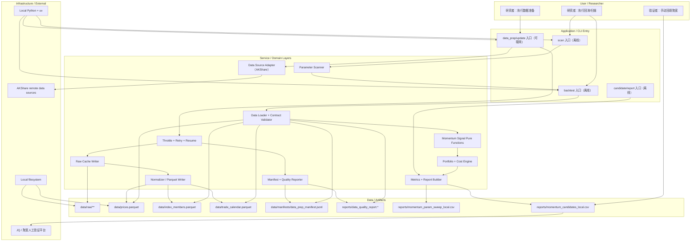

## 5. 高层模块与职责划分

| 模块名称 | 类型 | 职责 | 输入 | 输出 | 依赖 |
|---|---|---|---|---|---|
| Data Prep Entry | Application | 读取数据准备配置，编排 AKShare 请求、节流、重试、raw 缓存和标准化派生 | 数据源配置、股票/日期范围、节流参数、manifest | raw 缓存、parquet、manifest、质量报告 | AKShare Adapter、Throttle、Normalizer |
| AKShare Adapter | Service | 封装 AKShare 接口调用，返回原始响应或原始表格 | 接口名、请求参数、symbol/date 范围 | 原始数据切片或错误 | AKShare |
| Throttle / Retry / Resume | Service | 控制请求间隔、并发、退避、断点续传和批次状态 | `request_interval_seconds`、`batch_size`、`max_concurrency`、`max_retries`、manifest | 可执行批次、重试记录、状态更新 | Manifest Store |
| Raw Cache Writer | Service/Data | 按批次保存原始响应，保证标准化 parquet 可从 raw 派生 | 原始响应、批次元数据 | `data/raw/<source>/<interface>/<batch_id>.*` | 本地文件系统 |
| Normalizer / Parquet Writer | Service | 从 raw 派生标准化 parquet，执行字段映射、类型规范和去重 | raw 缓存、schema 版本 | `prices.parquet`、`index_members.parquet`、`trade_calendar.parquet` | pandas/pyarrow |
| Manifest Store | Data Service | 以 JSONL 记录每个批次的请求、重试、路径、覆盖和状态，兼作 checkpoint 事实源 | 批次事件 | `data/manifests/data_prep_manifest.jsonl` | 本地文件系统 |
| Quality Reporter | Service | 统计覆盖、缺失、失败、重复、异常价格、回补和新鲜度 | parquet、manifest、目标区间 | `reports/data_quality_report.*` | Manifest、Parquet |
| Data Loader / Contract Validator | Service | 离线读取 parquet、manifest、质量摘要并校验 schema、复权、`available_at`、覆盖区间 | 本地 parquet、manifest、质量报告、回测区间 | `close_df`、股票池、交易日、metadata、限制项 | pandas/pyarrow |
| Momentum Strategy | Service | 纯函数计算动量排名和目标集合 | `close_df` 窗口、当前持仓、`lookback_days`、`top_fraction`、`sell_buffer` | 目标股票集合与过滤统计 | Data Loader |
| Portfolio Engine | Service | 根据目标集合生成等权目标、应用 T+1 收盘成交、成本扣除、现金处理和净值更新 | 当前持仓、目标、价格、成本参数 | 日净值、持仓、成交、成本明细 | Momentum Strategy |
| Metrics Engine | Service | 计算累计收益、年化收益、最大回撤、Sharpe、换手和指标假设 | 净值、收益、持仓、成交 | 指标对象和报告行 | Portfolio Engine |
| Parameter Scanner | Application/Service | 构造 60 组网格，循环调用单次回测并保留失败行 | 参数网格、回测入口、数据 metadata | `momentum_param_sweep_local.csv` | Backtest Entry |
| Candidate Builder | Service | 从扫描结果选择不超过 4 组候选并输出聚宽回填字段 | 扫描 CSV、选择规则 | `momentum_candidates_local.csv` | Parameter Scanner |

**模块边界规则**：

- 数据准备模块可以联网，但不得被回测、扫描、候选筛选或差异分析主路径隐式调用。
- Data Loader 只读本地文件；发现缺口时返回明确错误或警告，不自动触发数据准备。
- 策略层不读写文件、不调用全局状态、不处理成本；仅输出目标集合或目标权重前置集合。
- 组合层不计算选股信号；只处理成交口径、成本、现金、净值和持仓。
- 分析层不修改回测结果；只计算指标和生成报告字段。
- 扫描层不改变策略逻辑；只调度多组参数并汇总结果。

## 6. 技术选型与理由

| 选型类别 | 选择 | 备选方案 | 选择理由 | 风险与限制 |
|---|---|---|---|---|
| 语言/运行时 | Python 3.11+，使用 uv 管理 | 系统 Python、conda | 符合仓库规则；适合 pandas/pyarrow/AKShare 生态 | 需在后续实现中建立 `pyproject.toml` 和 `uv.lock` |
| 数据处理 | pandas + pyarrow/parquet | polars、duckdb | pandas 对学习型量化研究更熟悉；parquet 适合本地列式缓存 | 数据量扩大后性能可能需要 polars/duckdb 优化 |
| 数据源 | AKShare 仅用于 data_prep | TuShare、聚宽 API、手工 CSV | 符合用户学习阶段和 INPUT-INDEX 调研；免费接口风险通过缓存治理缓解 | 接口可能限速、字段变更或不可用 |
| 回测框架 | 项目内轻量日频回测层 | RQAlpha、Backtrader、vectorbt、bt | 满足透明、可调试和第一版快速验证 | 真实性弱于完整事件驱动框架 |
| 持久化 | raw 文件 + 标准化 parquet + JSONL manifest + CSV/Markdown 质量报告 | SQLite、DuckDB、YAML-only | 文件形态简单、可审计、便于断点续传和人工检查 | JSONL schema 升级需版本字段 |
| 报告 | CSV 必需，metadata 字段内联；质量报告可 CSV/Markdown | Notebook、HTML Dashboard | 符合验收；可被 Notebook/图表派生 | CSV 承载复杂 metadata 可读性有限，后续可增加 sidecar JSON |

## 7. 关键设计决策：Q-004 至 Q-019

| 问题 ID | HLD 结论 / 默认值 | 状态 | 影响章节 |
|---|---|---|---|
| Q-004 | 默认复权口径为前复权 `qfq`；同一次回测、扫描、候选筛选和聚宽对照必须使用同一 `adjustment_policy`；报告记录实际值。 | CONFIRMED | 数据契约、报告、ADR-003 |
| Q-005 | 默认成交假设为 T 日收盘后生成信号，T+1 收盘价成交；成本在 T+1 调仓后从组合净值扣除，新持仓从 T+1 收盘后承担后续收益。 | CONFIRMED | 回测流程、组合层、ADR-004 |
| Q-006 | 第一版 `index_members.parquet` 使用固定当前沪深 300快照，必含 `symbol`，建议含 `snapshot_date`、`is_pit_universe=false`；PIT provider 后续增强。 | CONFIRMED | 数据 schema、偏差披露 |
| Q-007 | 历史窗口不足和信号端点价格缺失在信号层剔除；成交价缺失、无成交、停牌或未知交易状态在组合层留现金并记录未成交原因；关键输入完全缺失则失败。 | CONFIRMED | 缺失处理表、组合层 |
| Q-008 | 最小 price schema 为 `trade_date`、`symbol`、`close`；`adjustment_policy` 可作为列或 manifest 数据集 metadata；`available_at` 缺失时仅日线收盘价可用 HLD 推导规则。 | CONFIRMED | parquet schema、未来函数校验 |
| Q-009 | 涨跌停字段第一版不强制进入 schema；必须进入报告 metadata 限制项，并作为 P1 增强实现。 | CONFIRMED | 报告 metadata、增强路线 |
| Q-010 | 未来函数校验覆盖数据加载层、信号层、股票池层和报告审计层；事件层第一版禁用，后续必须字段级 `available_at`。 | CONFIRMED | 校验策略、NFR |
| Q-011 | 财报披露日、财报/公告事件和 ST 事件字段第一版明确 Out of Scope；后续纳入时必须提供事件级 `available_at`。 | CONFIRMED | 非目标、增强路线 |
| Q-012 | 默认 `request_interval_seconds=2`、`batch_size=50`、`max_concurrency=1`；配置位置建议为 `config/data_prep.yaml` 或等价 CLI 参数。 | CONFIRMED | 数据准备契约 |
| Q-013 | 默认 `max_retries=3`；`backoff_policy=exponential_jitter`，基础等待 2 秒，最大单次等待 60 秒；每次重试进入 manifest 的 `retry_events`。 | CONFIRMED | 退避与 manifest |
| Q-014 | `data/manifests/data_prep_manifest.jsonl` 是 checkpoint 事实源；批次状态枚举为 `pending`、`running`、`success`、`partial_success`、`failed`、`skipped`。 | CONFIRMED | 断点续传 |
| Q-015 | 默认 `recent_trade_days_backfill=5`；价格和复权相关日线数据使用该窗口；固定成分股快照不滚动回补，交易日历按目标区间缺口补齐。 | CONFIRMED | 增量更新 |
| Q-016 | raw 缓存第一版长期保留，不自动清理；路径按 `source/interface/date/batch_id` 组织；清理只允许用户显式执行。 | CONFIRMED | raw 缓存 |
| Q-017 | manifest 使用 JSONL，schema 版本字段为 `schema_version`；每行一批次最终记录或批次事件记录，质量报告通过 `manifest_run_id` 关联。 | CONFIRMED | manifest schema |
| Q-018 | `quality_status` 枚举为 `pass`、`warn`、`fail`；schema 缺失、覆盖缺口、未解决重复键、异常价格或请求区间缺失率 > 5% 为 `fail`；0 < 缺失率 <= 5% 为 `warn`。 | CONFIRMED | 质量报告 |
| Q-019 | 同时披露交易日新鲜度和自然日新鲜度：`data_freshness_trade_days` 按目标结束日与 `data_coverage_end` 间开市日数计算，`data_freshness_calendar_days` 按当前日期与 `last_successful_update_at` 计算。 | CONFIRMED | 失败降级、报告 |

## 8. 数据链路与契约设计

### 8.1 数据准备链路

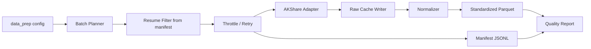

数据准备默认执行增量更新：先读取 manifest 与已有 parquet 覆盖，识别缺失 symbol/date 和最近 N 个交易日回补范围；除 `force_refresh=true` 或最近 N 交易日回补外，跳过已成功批次。远程请求必须经过 Throttle / Retry / Resume，不允许绕过限速直接调用 AKShare。

### 8.2 raw 缓存

| 项 | 设计 |
|---|---|
| 路径 | `data/raw/<source>/<interface>/<YYYYMMDD>/<batch_id>.<ext>` |
| 命名 | `batch_id` 使用 `source.interface.range.hash` 的稳定摘要或等价可复现标识 |
| 内容 | 原始响应、原始表格或足以复现标准化 parquet 的原始切片 |
| 保留策略 | 第一版长期保留，不自动清理；用户显式清理前必须知晓删除 raw 后无法证明 parquet 派生 |
| 复现边界 | 删除标准化 parquet 但保留 raw 与 manifest 时，应能重新派生等价 schema 的 parquet |

### 8.3 标准化 parquet schema

| 文件 | 必需字段 | 可选字段 | 失败行为 |
|---|---|---|---|
| `data/prices.parquet` | `trade_date`, `symbol`, `close` | `available_at`, `adjustment_policy`, `volume`, `amount`, `is_suspended`, `limit_up`, `limit_down` | 必需字段缺失、`trade_date` 不可解析、`close <= 0` 非缺失值、同一运行复权口径混用时拒绝回测 |
| `data/index_members.parquet` | `symbol` | `snapshot_date`, `available_at`, `is_pit_universe`, `index_code` | `symbol` 缺失拒绝回测；缺 `is_pit_universe` 时按第一版固定快照推导为 `false` 并在报告警示 |
| `data/trade_calendar.parquet` | `trade_date` | `is_open` | 缺失或重复交易日导致无法排序时拒绝回测；存在 `is_open` 时仅 `true` 计入 |

### 8.4 manifest schema

| 字段 | 类型 | 必需 | 说明 |
|---|---|---|---|
| `schema_version` | string | 是 | 第一版为 `1.0` |
| `run_id` | string | 是 | 单次数据准备运行 ID |
| `batch_id` | string | 是 | 批次唯一 ID |
| `source` | string | 是 | 如 `akshare` |
| `interface` | string | 是 | 数据源接口名或逻辑接口名 |
| `request_params` | object | 是 | 请求参数快照 |
| `symbol_range` | array/string | 条件必需 | 股票范围；与日期范围至少一类可定位 |
| `date_range` | object | 条件必需 | `start`、`end` |
| `requested_at` | string | 是 | ISO 时间 |
| `completed_at` | string | 否 | ISO 时间 |
| `attempts` | integer | 是 | 初始请求 + 重试次数 |
| `retry_events` | array | 是 | 每次失败、等待秒数、错误类型 |
| `raw_path` | string | 条件必需 | 成功或部分成功时必需 |
| `standardized_output_path` | string | 条件必需 | 成功派生后必需 |
| `coverage_start` / `coverage_end` | date | 否 | 批次覆盖范围 |
| `success_items` / `failed_items` | array | 是 | 成功和失败 symbol/date 或批次项 |
| `error_type` / `error_message` | string | 否 | 失败原因 |
| `status` | enum | 是 | `pending`、`running`、`success`、`partial_success`、`failed`、`skipped` |

### 8.5 质量报告规则

| 质量项 | `pass` | `warn` | `fail` |
|---|---|---|---|
| schema | 必需字段全部存在 | 可选字段缺失但已降级披露 | 必需字段缺失或类型不可解析 |
| 覆盖区间 | 覆盖请求区间 | 覆盖目标区间但缓存陈旧 | 请求区间存在交易日缺口且无法用缺失规则处理 |
| 缺失率 | `missing_rate = 0` | `0 < missing_rate <= 5%` | `missing_rate > 5%` |
| 重复键 | 0 | 已去重且记录原因 | 存在未解决重复 `trade_date + symbol` |
| 异常价格 | 0 | 已定位且未进入请求区间 | 请求区间存在 `close <= 0` 等异常非缺失价格 |
| 数据源失败 | 0 | 有失败但不影响本次请求区间 | 影响本次请求区间且无本地合规缓存 |
| 新鲜度 | `data_freshness_trade_days = 0` | `1-5` 个交易日 | `>5` 个交易日且请求区间需要最新数据 |

## 9. 回测边界与未来函数防护

### 9.1 复权与价格口径

- 默认 `adjustment_policy=qfq`（前复权）。
- 同一次运行只能存在一个复权口径；如果 `prices.parquet` 行级或 manifest metadata 显示混用，回测拒绝运行。
- 报告必须记录 `adjustment_policy`，并说明前复权价格是研究口径，不等同于真实可成交历史价格。

### 9.2 信号、成交与收益归属

| 项 | 第一版规则 |
|---|---|
| 信号日 | 第 `rebalance_freq` 个交易日触发信号，记为 T |
| 决策时点 | T 日收盘后 |
| 动量计算 | `close[T] / close[T-lookback_days] - 1` |
| 成交日 | T+1 或之后；默认使用 T+1 收盘价成交 |
| 成本扣除 | 在 T+1 调仓成交后，从组合净值中扣除佣金、滑点和卖出税 |
| 收益归属 | 调仓前持仓承担从上一收盘到 T+1 收盘的收益；调仓后新持仓从 T+1 收盘到下一交易日收盘开始贡献收益 |
| 无 T+1 价格 | 不静默填充；目标权重留现金并记录未成交，若大量缺失导致质量 `fail` 则本次运行失败 |

### 9.3 `available_at <= decision_time` 校验

| 层级 | 校验规则 | 失败行为 |
|---|---|---|
| 数据加载层 | 必需字段存在；日线收盘价缺 `available_at` 时可按 T 日收盘后可用推导 | 不可推导字段进入决策时拒绝运行 |
| 股票池层 | 固定快照记录 `snapshot_date`，`is_pit_universe=false`；如有 `available_at` 必须不晚于回测开始决策 | 违反时拒绝使用该股票池 |
| 信号层 | 动量窗口端点价格必须在 T 收盘后可用 | 不合规股票剔除并计入过滤统计 |
| 组合层 | 成交价必须在成交日收盘后可用；第一版不使用盘中成交判断 | 缺失成交价留现金并记录 |
| 事件层 | 第一版禁用财报、公告、ST 等事件字段 | 一旦事件字段被配置为信号输入，直接失败并提示需扩展事件级 `available_at` |
| 报告层 | 输出 `available_at_rule` 和未来函数防护摘要 | 缺失摘要视为报告不合规 |

## 10. 缺失数据与不可交易处理

| 场景 | 数据加载层 | 信号排名层 | 组合成交层 | 报告/质量输出 |
|---|---|---|---|---|
| 历史窗口不足 | 允许加载 | 剔除该股票 | 不产生目标买入 | 记录 `insufficient_lookback_count` |
| 信号端点价格缺失 | 允许加载为缺失 | 剔除该股票 | 不产生目标买入 | 记录缺失 symbol/date |
| 成交日价格缺失 | 加载为缺失 | 若已入选目标仍保留意图 | 不成交，目标权重留现金 | 记录 `unfilled_reason=missing_execution_price` |
| 无成交字段缺失 | 第一版不强制字段 | 不参与信号过滤 | 按未知限制处理，报告警示；若显式标记无成交则不成交 | metadata 警示“未完整建模无成交/停牌” |
| 显式停牌 | 如字段存在则加载 | 可选择剔除或保留信号意图 | 不成交，留现金 | 记录 `unfilled_reason=suspended` |
| 涨跌停 | 第一版字段不强制 | 不参与信号过滤 | 不做涨跌停撮合限制 | metadata 强制警示 |
| 新股窗口不足 | 通过窗口不足自然剔除 | 剔除 | 不成交 | 披露新股规则未精确建模 |
| 退市/ST/财报事件 | 第一版不读取事件字段 | 不使用 | 不使用 | metadata 强制警示 |

## 11. 集成契约

| 契约 | 调用方向 | 调用时机 | 输入契约 | 输出契约 | 降级策略 | 调用方同步修改范围 |
|---|---|---|---|---|---|---|
| Data Prep -> AKShare | Data Prep 调用 AKShare Adapter | 用户显式执行数据准备/更新 | source、interface、params、symbol/date、节流配置 | raw 响应或错误 | 重试耗尽后写 failed/partial_success，不阻塞已有合规缓存回测 | 新增接口时同步 normalizer、manifest 字段和质量检查 |
| Normalizer -> Parquet | Normalizer 读取 raw 写标准化 parquet | raw 批次成功或部分成功后 | raw_path、schema_version、字段映射 | 标准化 parquet 和覆盖元数据 | 字段缺失则批次 failed 或 partial_success | schema 变化时同步 Data Loader 和报告字段 |
| Backtest -> Data Loader | Backtest 离线调用 Loader | 单次回测启动 | 回测区间、股票池、复权口径、成本配置 | close_df、universe、calendar、metadata | schema/覆盖 fail 则拒绝；warn 则继续并披露 | 新增数据字段时同步 validator、metadata |
| Scanner -> Backtest | Scanner 循环调用单次回测 | 参数扫描 | 60 组参数、固定数据快照 | 每组指标行，失败行保留 | 单组失败不终止全局扫描，除非数据契约 fail | 新增策略参数时同步扫描 CSV schema |
| Report -> Quality Summary | Report Builder 引用质量报告 | 单次回测、扫描、候选输出 | quality_status、新鲜度、失败摘要 | 报告 metadata 字段 | 无质量报告时主路径失败；除非用户显式允许仅探索运行 | 质量字段变化时同步报告 schema |
| Candidate -> 聚宽人工验证 | 用户读取候选手动回填 | 扫描完成后 | 不超过 4 组候选参数和选择理由 | 聚宽手动验证输入 | 不自动联网；无聚宽结果时仍保留本地候选 | 若后续自动化聚宽，需新 HLD/ADR 或 CR |

## 12. 关键流程

### 12.1 数据准备/更新流程

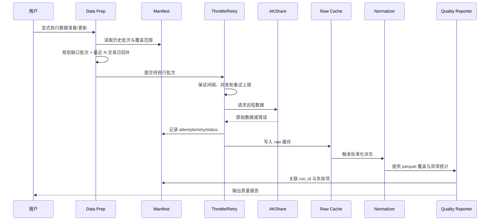

### 12.2 离线回测流程

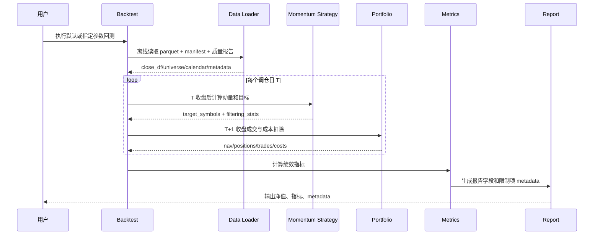

### 12.3 参数扫描与候选生成流程

1. Scanner 构造 60 组参数网格。
2. Scanner 校验本地 parquet、manifest 和质量报告，不联网。
3. Scanner 对每组参数调用 Backtest，单组失败保留一行 `status=failed` 和错误信息。
4. Scanner 输出 `reports/momentum_param_sweep_local.csv`，记录 `scan_elapsed_seconds`。
5. Candidate Builder 从扫描结果中选择默认参数、Sharpe 最优、收益最优、保守低换手参数，去重后候选数不超过 4。
6. Candidate Builder 输出 `reports/momentum_candidates_local.csv`，包含聚宽手动回填字段、选择理由、偏差警示和质量摘要。

### 12.4 前置校验与失败路径

| 阶段 | 前置条件 | 失败路径 | 可降级条件 |
|---|---|---|---|
| 数据准备 | 配置合法、父目录为目录、节流参数为正数、manifest 可读或可创建 | 配置非法直接失败；AKShare 错误按重试上限处理，耗尽后批次 failed | 已有合规 parquet 时，不阻塞后续离线回测 |
| 标准化派生 | raw 存在、字段可映射、schema_version 已知 | 必需字段缺失则批次 failed；部分 symbol/date 失败则 partial_success | 非请求区间失败可 warn |
| 质量报告 | parquet、manifest 可读 | schema 缺失、覆盖缺口或质量阈值 fail | warn 状态允许回测继续但强制披露 |
| 单次回测 | parquet 覆盖区间、复权口径一致、交易日历可用 | 数据契约 fail 时拒绝运行 | 缺失少量价格时剔除/留现金并披露 |
| 参数扫描 | 单次回测入口可运行，参数网格可序列化 | 数据契约 fail 终止全局扫描；单组参数失败保留失败行 | 单组失败不影响其他组 |
| 候选生成 | 扫描 CSV 存在且至少一组成功 | 无成功参数则候选生成失败 | 候选类型去重后少于 4 组可接受，并记录原因 |

## 13. 非功能需求设计

| 质量特征 | 设计目标 | 实现手段 | 验证方式 |
|---|---|---|---|
| 性能 | 60 组参数扫描必须记录 `scan_elapsed_seconds`；第一版不设相对聚宽耗时阻塞值 | 本地 parquet、离线循环、避免远程请求 | 检查扫描报告耗时字段和 60 行输出 |
| 可靠性 | 数据源失败不阻塞已有合规缓存上的回测 | raw 缓存、manifest、质量报告、离线降级 | 模拟数据源失败后运行离线扫描 |
| 可追溯性 | 每个标准化输出可追溯到 raw 和 batch manifest | raw_path、standardized_output_path、run_id | 删除 parquet 后从 raw 重新派生的设计验证 |
| 安全性 | 回测主路径无网络副作用；不提交凭据 | 物理隔离入口，不集成聚宽自动调用 | 静态检查主路径无 AKShare/网络 adapter 调用 |
| 可维护性 | 每层单一职责，策略纯函数可单测 | 信号/组合/指标/扫描分离 | 模块边界评审 |
| 可解释性 | 所有偏差限制进入报告 metadata | 统一 metadata 字段和质量摘要 | 检查单次、扫描、候选三类报告字段一致 |
| 可扩展性 | PIT、交易状态、涨跌停、事件字段可按契约增量接入 | raw/manifest/质量报告/schema 均有版本 | 后续增强 Story 必须同步四类契约 |

## 14. 主要风险与应对

| 风险 ID | 风险描述 | 概率 | 影响 | 应对策略 | 触发信号 |
|---|---|---|---|---|---|
| R1 | AKShare 接口限速、字段变更或临时不可用 | 高 | 中 | 节流、有限重试、raw 缓存、manifest、质量报告；回测离线降级 | failed 批次增加、字段映射失败 |
| R2 | 前复权研究价格与真实成交价格不一致 | 中 | 中 | 报告记录 `adjustment_policy=qfq` 和研究口径限制；聚宽少量验证解释差异 | 本地与聚宽收益量级偏差扩大 |
| R3 | 固定当前沪深 300 导致幸存者偏差 | 高 | 高 | 强制 `is_pit_universe=false`、快照日期和幸存者偏差 metadata；PIT provider 列为首个增强 | 候选在聚宽历史成分下排序变化 |
| R4 | 不建模停牌/涨跌停/退市/ST/财报导致可交易性高估 | 高 | 高 | metadata 强制警示；交易状态和涨跌停约束列入 P1 增强 | 聚宽验证显示换手或成交差异大 |
| R5 | `available_at` 推导过宽导致未来函数 | 中 | 高 | 仅日线收盘价允许收盘后可用推导；事件字段第一版禁用 | 事件字段被配置为信号输入 |
| R6 | 质量阈值过严导致学习阶段频繁阻塞 | 中 | 中 | `pass/warn/fail` 分级；warn 可运行但强制披露 | `missing_rate` 经常在 0-5% |
| R7 | 参数扫描样本内过拟合 | 高 | 中 | 报告添加样本内选择警示；样本外拆分列为后续增强 | 本地最优在聚宽验证表现不稳定 |
| R8 | raw 长期保留占用空间 | 中 | 低 | 第一版不自动删除，后续可设计显式清理命令和保留策略 | `data/raw` 超出用户可接受大小 |

## 15. ADR 候选决策点

> 本阶段仅列出 ADR 候选。正式 `process/ARCHITECTURE-DECISION.md` 应在 HLD 人工确认后生成，避免绕过 HLD 门控。

| ADR ID | 决策问题 | 建议决定 | 约束此决策的因素 | 已回写章节 |
|---|---|---|---|---|
| ADR-001 | 数据准备是否与回测主路径物理隔离 | 是，数据准备可联网，回测/扫描/候选/差异分析离线只读 | REQ-016、REQ-034、REQ-047 至 REQ-057 | §3、§4、§8、§12 |
| ADR-002 | 第一版是否引入大型回测框架 | 否，采用项目内轻量日频回测层 | REQ-036、用户原始请求 | §2、§3、§6 |
| ADR-003 | 默认复权口径 | 默认 `qfq` 前复权，运行内不得混用 | Q-004、REQ-037 | §7、§9 |
| ADR-004 | 默认成交口径 | T 日收盘信号，T+1 收盘价成交，close-to-close 收益归属 | Q-005、REQ-005 | §7、§9 |
| ADR-005 | manifest/checkpoint 形态 | JSONL manifest 作为 checkpoint 事实源 | Q-014、Q-017、REQ-055 | §7、§8 |
| ADR-006 | 质量阈值与运行降级 | `pass/warn/fail`，warn 可运行并披露，fail 阻塞请求区间 | Q-018、REQ-056、REQ-057 | §8、§12、§13 |
| ADR-007 | 第一版真实性限制处理 | 不精确建模，统一进入报告 metadata 和增强路线 | REQ-015、REQ-041 至 REQ-046 | §1、§10、§17 |

## 16. 分阶段落地建议

| 阶段 | 交付物 | 里程碑标志 | 前提条件 |
|---|---|---|---|
| M0 - 数据准备与缓存可追溯 | data_prep 入口、AKShare adapter、节流/退避/断点续传、raw 缓存、标准化 parquet、manifest、质量报告 | 可从 AKShare 或 raw 生成三类标准 parquet，并输出 `quality_status` | HLD 确认 |
| M1 - 本地动量最小回测器 | Data Loader、复权/available_at 校验、动量纯函数、组合净值、成本、指标、单次报告 metadata | 2019-2025 默认回测完整输出净值和指标 | M0 或已有合规 parquet/manifest/质量报告 |
| M2 - 参数扫描与候选报告 | 60 组扫描、失败行保留、扫描 CSV、候选 CSV、过拟合和偏差警示 | `momentum_param_sweep_local.csv` 为 60 行，候选不超过 4 组 | M1 |
| M3 - 真实性增强 | PIT universe provider、交易状态、涨跌停约束、事件级 `available_at`、偏差审计报告 | 可量化说明增强前后收益/回撤/换手/候选排序变化 | M2 |
| M4 - 策略扩展 | RSI/MACD 等新策略纯函数接口和横向报告 | 新策略复用数据加载、组合和指标层 | M2 |

## 17. 后续增强路线

| 增强项 | 优先级 | 增强内容 | 对 raw/manifest/质量报告/离线读取契约的影响 |
|---|---|---|---|
| PIT universe provider | P1-1 | 按日期返回当时可用沪深 300 成分和 `available_at` | raw 增加历史成分源；manifest 增加 index_code/date 批次；质量报告增加成分覆盖；Data Loader 改为按 T 查询股票池 |
| 交易状态表 | P1-2 | 表达停牌、无成交、特殊处理和可交易性 | parquet 增加 `trade_status`；质量报告统计状态缺失；组合层按状态拒绝或延后成交 |
| 涨跌停约束 | P1-3 | 增加 `limit_up`、`limit_down` 或涨跌停状态 | raw/manifest 记录涨跌停接口；质量报告检查价格边界；组合层拒绝不可成交买卖 |
| 事件级 `available_at` | P1-4 | 财报、公告、ST 等事件可用于信号或过滤 | raw 记录事件源；manifest 记录披露批次；Data Loader 强制字段级 `available_at` |
| 偏差审计报告 | P1-5 | 汇总启用/未启用真实性约束及影响 | 报告增加受影响样本数、收益/回撤/换手/候选排序变化 |
| 样本外拆分 | P2 | 参数扫描结果增加样本内/样本外稳定性分析 | 扫描报告增加 split 字段和稳定性指标 |
| RSI/MACD 策略扩展 | P2 | 新增策略纯函数与参数扫描 | 策略层新增函数；扫描 schema 扩展策略名和指标参数 |
| 大型框架迁移评估 | P3 | RQAlpha/vectorbt 等作为后续迁移候选 | 需单独 ADR，对数据契约和报告口径重新评审 |

## 18. 工作量粗估

> 该估算只用于 HLD 评审，不拆解 Story。正式 Story 数、依赖图和 Wave 分组必须在 HLD 确认后生成。

| 类别 | 预计工作包数 | 对应阶段 | 粗估工作量 |
|---|---:|---|---|
| 数据准备与缓存治理 | 2-3 | M0 | L |
| 离线回测核心 | 2-3 | M1 | M |
| 参数扫描与候选报告 | 1-2 | M2 | M |
| 真实性增强 | 4-5 | M3 | XL，分批执行 |
| 策略扩展与展示 | 1-2 | M4 | M |
| **合计** | **10-15 个工作包（HLD 粗估）** | **5 个阶段** | **XL** |

**CR-004 一致性补充**：上述 §18 是 2026-05-14 基线 HLD 粗估，已落地为 STORY-001..013 共 13 个 verified Story。CR-004 不改写该基线，另在 §21.11 追加 5 个 Story（STORY-014..018）和 CR4-W0..CR4-W4；因此 CR-004 后 Backlog 总数为 18，其中 13 个为既有已验证基线，5 个为 CR-004 增量。

**CR-005 一致性补充**：CR-005 不新建 CR-006，不改变轻量 `engine/backtest.py` 主路径。它在 §22.11 追加 6 个 Story（CR005-S01..S06）和 CR5-W0..CR5-W5；因此当前规划总数为 24，其中 13 个为基线 Story、5 个为 CR-004 市场数据组件 Story、6 个为 CR-005 Tushare 真实写湖与 Backtrader optional backend Story。CR005-S06 必须依赖 CR005-S02/S03 的 dataset schema、normalization、PIT as-of、adjusted price、quality/catalog/readers 契约稳定后才能进入开发。

## 19. Gotchas

- 不要在回测启动时“发现数据缺失就自动调用 data_prep”。这会破坏离线主路径和可复现性。
- 不要把前复权价格描述为真实成交价格。第一版使用的是研究口径，报告必须说明限制。
- 不要用财报报告期日期替代披露日。事件字段第一版禁用，后续必须提供事件级 `available_at`。
- 不要对缺失价格做前填、后填、0 填充或指数收益替代，然后当作真实价格参与排名或成交。
- 不要把固定当前沪深 300 成分股称为 PIT universe。第一版必须显式标记 `is_pit_universe=false`。
- 不要让参数扫描因单组失败丢行。失败行是可审计报告的一部分。
- 不要把 Tushare adapter 接到 `engine/data_loader.py`、`engine/backtest.py`、实验十或实验十二。Tushare 只负责写入本地 raw/manifest/canonical/quality/catalog/gold 链路。
- 不要让 Backtrader adapter 读取 `TUSHARE_TOKEN`、导入 `market_data.connectors`、自己补数、生成 PIT 或计算复权因子；它只能消费本地 canonical/gold 经 quality gate、PIT as-of 和复权一致检查后的干净 feed。
- 不要把 Backtrader 描述为默认主框架。轻量 `engine/backtest.py` 仍是默认主路径，Backtrader 只是可选后端和结果对照面。

## 20. 已确认问题

| 问题 ID | 问题描述 | 优先级 | 当前 HLD 默认 | 影响范围 | 负责人 | 确认时间 |
|---|---|---|---|---|---|---|
| Q-004 | 是否接受默认复权口径为 `adjustment_policy=qfq` 前复权，并要求同一次回测、扫描、候选筛选和聚宽对照不得混用复权口径 | REQUIRED | 默认前复权 `qfq`；报告记录实际 `adjustment_policy`；同一次研究链路必须使用一致复权口径 | 数据契约、动量排名、收益计算、候选筛选、聚宽对照、报告 metadata、ADR-003 | 用户/meta-po | 2026-05-14 |
| Q-005 | 是否接受默认成交假设为 T 日收盘后生成信号，T+1 收盘价成交，并按 HLD 口径归属成本和收益 | REQUIRED | T 日收盘后生成信号；T+1 收盘价成交；成本在 T+1 调仓后从组合净值扣除；新持仓从 T+1 收盘后承担后续收益 | 回测流程、组合层、成本模型、净值归属、差异解释、ADR-004 | 用户/meta-po | 2026-05-14 |
| Q-006 | 是否接受第一版 `index_members.parquet` 使用固定当前沪深 300 快照，并明确披露非 PIT 股票池 | REQUIRED | 使用固定当前沪深 300 快照；必含 `symbol`，建议含 `snapshot_date`、`is_pit_universe=false`；PIT provider 后续增强 | 股票池 schema、偏差披露、报告 metadata、增强路线 | 用户/meta-po | 2026-05-14 |
| Q-007 | 是否接受历史窗口不足、端点价格缺失、成交价缺失、无成交、停牌或未知交易状态的分层处理策略 | REQUIRED | 历史窗口不足和信号端点价格缺失在信号层剔除；成交价缺失、无成交、停牌或未知交易状态在组合层留现金并记录未成交原因；关键输入完全缺失则失败 | 缺失处理表、信号层、组合层、失败降级、审计报告 | 用户/meta-po | 2026-05-14 |
| Q-008 | 是否接受最小 price schema、`adjustment_policy` 记录位置，以及 `available_at` 缺失时的日线收盘价推导规则 | REQUIRED | 最小 price schema 为 `trade_date`、`symbol`、`close`；`adjustment_policy` 可作为列或 manifest 数据集 metadata；`available_at` 缺失时仅日线收盘价可按“交易日 T 收盘后可用”推导 | parquet schema、manifest metadata、未来函数校验、报告限制项 | 用户/meta-po | 2026-05-14 |
| Q-009 | 是否接受涨跌停字段第一版不强制进入 schema，但必须进入报告 metadata 限制项并作为 P1 增强 | REQUIRED | 第一版不强制 `limit_up`、`limit_down` 入 schema；报告 metadata 必须披露涨跌停限制；P1 增强补齐涨跌停约束 | price schema、报告 metadata、真实性增强路线 | 用户/meta-po | 2026-05-14 |
| Q-010 | 是否接受未来函数校验覆盖数据加载层、信号层、股票池层和报告审计层，且事件层第一版禁用 | REQUIRED | 校验覆盖数据加载层、信号层、股票池层和报告审计层；事件层第一版禁用；后续事件字段必须提供字段级 `available_at` | 校验策略、未来函数防护、NFR、事件增强边界 | 用户/meta-po | 2026-05-14 |
| Q-011 | 是否接受财报披露日、财报/公告事件和 ST 事件字段第一版 Out of Scope，且后续必须事件级 `available_at` | REQUIRED | 财报披露日、财报/公告事件和 ST 事件字段第一版不进入策略输入；后续纳入时必须提供事件级 `available_at` | 非目标、相邻边界、事件增强路线、报告限制项 | 用户/meta-po | 2026-05-14 |
| Q-012 | 是否接受数据准备默认限速参数 `request_interval_seconds=2`、`batch_size=50`、`max_concurrency=1` | REQUIRED | 默认请求间隔 2 秒、批大小 50、最大并发 1；配置位置建议为 `config/data_prep.yaml` 或等价 CLI 参数 | 数据准备链路、节流策略、数据源压力、运行耗时 | 用户/meta-po | 2026-05-14 |
| Q-013 | 是否接受默认重试和退避策略 `max_retries=3`、`backoff_policy=exponential_jitter`、基础等待 2 秒、最大单次等待 60 秒 | REQUIRED | 最多 3 次重试；指数抖动退避；基础等待 2 秒；最大单次等待 60 秒；每次重试写入 manifest `retry_events` | 失败恢复、退避策略、manifest、数据准备可追溯性 | 用户/meta-po | 2026-05-14 |
| Q-014 | 是否接受 `data/manifests/data_prep_manifest.jsonl` 作为 checkpoint 事实源，并采用完整批次状态枚举 | REQUIRED | `data/manifests/data_prep_manifest.jsonl` 是 checkpoint 事实源；批次状态枚举为 `pending`、`running`、`success`、`partial_success`、`failed`、`skipped` | 断点续传、批次审计、失败降级、质量报告输入 | 用户/meta-po | 2026-05-14 |
| Q-015 | 是否接受默认 `recent_trade_days_backfill=5`，并按 HLD 范围回补价格、复权相关日线、固定成分股快照和交易日历 | REQUIRED | 默认回补最近 5 个交易日；价格和复权相关日线数据使用该窗口；固定成分股快照不滚动回补；交易日历按目标区间缺口补齐 | 增量更新、数据新鲜度、交易日历覆盖、回补成本 | 用户/meta-po | 2026-05-14 |
| Q-016 | 是否接受 raw 缓存第一版长期保留、不自动清理，并按 `source/interface/date/batch_id` 组织 | REQUIRED | raw 缓存长期保留且不自动清理；路径按 `source/interface/date/batch_id` 组织；清理只允许用户显式执行 | raw 缓存、可复现性、磁盘空间、用户清理操作 | 用户/meta-po | 2026-05-14 |
| Q-017 | 是否接受 manifest 使用 JSONL、包含 `schema_version`，并通过 `manifest_run_id` 关联质量报告 | REQUIRED | manifest 使用 JSONL；schema 版本字段为 `schema_version`；质量报告通过 `manifest_run_id` 关联对应数据准备运行 | manifest schema、质量报告关联、schema 升级、审计追溯 | 用户/meta-po | 2026-05-14 |
| Q-018 | 是否接受 `quality_status=pass/warn/fail`，并按 HLD 阈值处理 schema 缺失、覆盖缺口、重复键、异常价格和缺失率 | REQUIRED | `quality_status` 为 `pass`、`warn`、`fail`；schema 缺失、覆盖缺口、未解决重复键、异常价格或请求区间缺失率 > 5% 为 `fail`；0 < 缺失率 <= 5% 为 `warn` | 质量报告、数据准备阻塞/告警策略、回测启动前校验 | 用户/meta-po | 2026-05-14 |
| Q-019 | 是否接受同时披露交易日新鲜度和自然日新鲜度，并按 HLD 字段和计算口径执行 | REQUIRED | 同时披露 `data_freshness_trade_days` 与 `data_freshness_calendar_days`；前者按目标结束日与 `data_coverage_end` 间开市日数计算，后者按当前日期与 `last_successful_update_at` 计算 | 数据新鲜度披露、失败降级、质量报告、报告 metadata | 用户/meta-po | 2026-05-14 |

## 21. CR-004 可迁移市场数据组件增量设计

> 本节是 CR-004 的 HLD 增量。旧版本地回测 HLD 仍保持 2026-05-14 人工确认状态；本节在 CP3/CP4 通过前仅作为 `draft-pending-cp3-cp4` 设计输入，不授权实现。

### 21.1 问题与边界

**问题陈述**：既有 `engine/` 数据准备链路已能服务当前本地回测，但它与回测工程同仓同层，未来难以整体迁移到其他研究项目。CR-004 需要新增 `market_data/` 独立包，把数据获取、raw/manifest/canonical 数据湖、质量校验、多源比对、只读 reader 和 CLI 形成可迁移组件，同时确保实验十、实验十二和回测主路径只读 parquet，不因接入组件而隐式联网。

**价值**：`market_data/` 将数据工程能力从回测引擎中抽出，提供一个 fake/offline 默认、真实 adapter 显式启用、数据可追溯、reader 只读的市场数据底座。既有 `engine/` 在 CR-004 首轮不被重写，后续通过 reader 兼容输出逐步迁移。

| 维度 | CR-004 设计口径 |
|---|---|
| 目标 | 新增仓库内独立包 `market_data/`；最小闭环可从 fake connector 生成 raw + manifest，派生 canonical parquet，执行 validation，reader 只读，CLI offline smoke 可跑通 |
| 成功标准 | fake/offline 默认路径网络调用次数为 0；至少 1 个 fake 数据集完成 raw -> canonical -> validation -> read；manifest 每批包含 source/interface/params/status/attempts/raw_path/canonical_path；质量结果覆盖字段缺失、重复、异常价格、覆盖缺口；多源比对至少支持 fake/reference；实验十/十二接入计划不直接联网 |
| 约束 | STORY-014..017 的最小闭环不修改 `market_data/**` 以外旧实现；STORY-018 仅允许按 CP5 确认后的只读方式修改实验十/十二入口；不提交凭据；不提交真实行情数据；真实 TickFlow/AkShare/Tushare adapter 默认关闭；Python 依赖仍用 uv 管理 |
| 非目标 | 不真实联网抓全量行情；不把实验十/十二改成运行时联网；不把 TickFlow/Tushare token 写入仓库；不一次性替换 `engine/data_loader.py`；不发布跨仓库安装包 |
| 关键假设 | 当前仓库已有 pandas/pyarrow/akshare 可复用；TickFlow/Tushare 的真实认证、配额和精确接口仍待用户确认；真实沪深 300 基准数据先作为只读 canonical/gold 输入，不由实验入口联网获取 |
| 缺失信息 | `TickFlow` exact 接口、Tushare token 配置位置、真实沪深 300 指数行情字段源和复权/收益口径仍为 OPEN；不阻塞 fake/offline 最小闭环，但阻塞真实 adapter 启用 |

### 21.2 候选方案对比

| 方案 | 核心思路 | 优点 | 缺点 | 复杂度 / 成本 | 扩展性 | 风险 | 适用前提 |
|---|---|---|---|---|---|---|---|
| CR4-A：新增独立 `market_data/` 包，既有 `engine/` 只读消费（推荐） | 在仓库根新增可迁移包，提供 connector/runtime/storage/normalization/validation/readers/cli；通过 canonical parquet 与 `engine/` 解耦 | 边界清晰，迁移成本低；默认 offline；不破坏 STORY-001..013 已验证基线 | 初期会与 `engine/` 数据准备存在一段能力重叠 | medium / 中 | 高；后续可迁移到其他项目 | 需要严格避免双写同一数据文件导致口径漂移 | 用户接受分阶段迁移，首轮只建立最小闭环 |
| CR4-B：直接重构 `engine/data_prep.py` 为通用组件 | 在现有 `engine/` 内扩展 TickFlow/AkShare/Tushare、多源比对和 CLI | 复用现有代码最多；短期文件少 | 可迁移性弱；容易破坏已验证回测基线；真实联网边界更难隔离 | medium-high / 中高 | 中 | 回归面大，旧 Story 状态容易失真 | 用户不要求跨项目迁移 |
| CR4-C：引入外部数据湖/调度框架 | 使用 DuckDB/Delta/LakeFS/Airflow 等作为数据层和运行时 | 长期治理能力强 | 超出学习型本地工具；依赖和运维成本高 | high / 高 | 高 | 方案过重，难以保持 offline 简单路径 | 明确需要团队级数据平台 |

**推荐**：CR4-A。它满足 CR-004 的可迁移、fake/offline 默认、真实 adapter 默认关闭和只读 reader 边界，同时把对既有回测基线的影响控制在后续接入 Story。

### 21.3 推荐架构总览

`market_data/` 采用分层包结构：

| 模块 | 职责 | 输入 | 输出 | 关键约束 |
|---|---|---|---|---|
| `connectors/` | 定义 `ConnectorProtocol`、fake connector、TickFlow/AkShare/Tushare adapter 边界 | source/interface/params、auth 配置引用 | 原始响应或结构化错误 | fake 为默认；真实 adapter 需要 `enabled=true` 且配置完整，否则 fail fast |
| `runtime/` | 执行 planner 产出的批次，处理限速、有限重试、熔断和可测试 clock/sleeper | batch plan、connector、runtime policy | batch result、attempts、circuit state | 默认不真实等待过长；熔断打开时停止后续真实请求并写 manifest |
| `storage/` | 管理 Parquet 数据湖路径、raw 写入、manifest 写入、catalog 写入 | batch result、lake root | raw 文件、manifest JSONL、catalog metadata | 写入前逐级确认父路径为目录；禁止写入真实私有数据 fixture |
| `normalization/` | 从 raw 派生 canonical parquet | raw、manifest、schema registry | canonical parquet | canonical schema 版本化；未知接口 fail fast |
| `validation/` | 校验字段、重复、价格非负、覆盖区间、manifest 一致性和多源差异 | canonical、manifest、reference source | quality records、comparison records | 多源比对首轮用 fake/reference；真实多源不参与默认测试联网 |
| `readers/` | 只读 canonical/gold parquet，供回测、实验和 Notebook 使用 | dataset id、date range、symbols | DataFrame / typed result | reader 不导入 connector，不触发网络，不写数据湖 |
| `cli.py` | 提供 plan/fetch/normalize/validate/read 等 offline 命令 | CLI 参数、配置文件 | 控制台输出、数据湖产物 | 默认 `--source fake` 或 `--offline`，真实 source 必须显式启用 |

### 21.4 数据湖分层

| 层级 | 推荐路径 | 写入方 | 读取方 | 最小内容 | 首轮状态 |
|---|---|---|---|---|---|
| raw | `data/market_data/raw/<source>/<interface>/<YYYYMMDD>/<batch_id>.*` | connector/runtime/storage | normalization、审计 | 原始响应、batch metadata、source/interface/params | 必做 |
| manifest | `data/market_data/manifest/market_data_manifest.jsonl` | runtime/storage | resume、normalization、quality、catalog | `schema_version`、`run_id`、`batch_id`、`source`、`interface`、`params`、`attempts`、`status`、`raw_path`、`canonical_path`、错误、时间 | 必做 |
| canonical | `data/market_data/canonical/<dataset>/<schema_version>/part-*.parquet` | normalization | validation、readers、engine 接入 | 标准 schema 日频表，至少 prices/index_members/trade_calendar 或 fake 等价数据集 | 必做 |
| gold | `data/market_data/gold/<dataset>/...` | 后续聚合/基准任务 | 实验十/十二、报告 | 真实沪深 300 基准、派生指标或研究口径宽表 | 预留；实验接入 Story 只读 |
| quality | `data/market_data/quality/<run_id>.*` | validation | CLI、报告、QA | 字段缺失、重复、异常价格、覆盖、source manifest 一致性、多源差异 | 必做 |
| catalog | `data/market_data/catalog/catalog.json` 或 `.parquet` | storage/validation | CLI、reader discovery | dataset、schema_version、coverage、quality_status、latest_manifest_run_id | 预留最小 catalog；首轮可 JSON |

canonical 最小价格 schema：

| 字段 | 类型 | 必填 | 说明 |
|---|---|---|---|
| `trade_date` | date/string | 是 | 交易日，按升序可排序 |
| `symbol` | string | 是 | 证券代码或 fake symbol |
| `close` | float | 是 | 收盘价，必须大于等于 0；真实价格为正数，停牌/缺失不得静默填充 |
| `source` | string | 是 | `fake`、`akshare`、`tickflow`、`tushare` 等 |
| `source_run_id` | string | 是 | 对应 manifest run |
| `adjustment_policy` | string | 条件必需 | 价格数据必需，fake 可固定为 `none` 或 `qfq` |
| `available_at` | datetime/string | 条件必需 | 缺失时只允许日线收盘后推导；事件字段不得推导 |

### 21.5 系统架构图

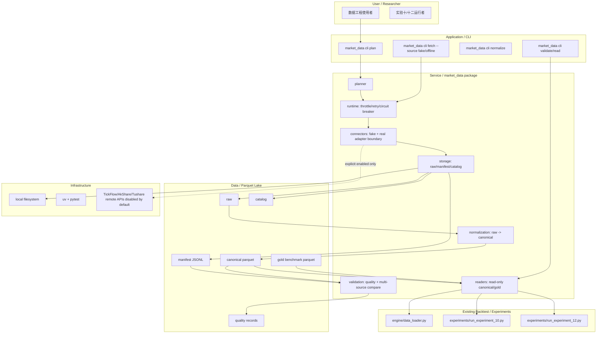

### 21.6 真实 adapter 边界

| Source | 首轮默认 | 允许实现内容 | 禁止内容 | 启用条件 |
|---|---|---|---|---|
| fake | enabled | deterministic fixture、失败/重试/部分成功模拟、小样本 raw + manifest | 伪装成真实行情 | 默认测试和 CLI smoke |
| AkShare | disabled | adapter 类、接口白名单、配置校验、错误映射；可复用既有依赖 | 默认测试真实联网；在 reader 中导入 AkShare | `enabled=true`、接口白名单、用户显式命令 |
| Tushare | disabled | token 环境变量名或配置引用、adapter protocol、fail-fast 错误 | 提交 token；默认联网；模糊接口名 | 用户确认 token 管理与接口配额后 |
| TickFlow | disabled | adapter 边界、source/interface registry 占位、fail-fast | 假设未知官方接口；提交凭据或真实请求 | 用户提供 exact API、认证、速率限制 |

真实 adapter 的错误必须统一为结构化结果：`error_type`、`error_message`、`retryable`、`source`、`interface`、`status`。缺少凭据、接口未允许、source/interface 未解析均为非重试 fail fast。

### 21.7 关键流程

1. `plan`：读取配置和目标 dataset，生成批次，写出或打印计划，不调用 connector。
2. `fetch`：默认 fake/offline；runtime 按限速、重试、熔断执行批次，storage 写 raw 和 manifest。
3. `normalize`：从 raw + manifest 派生 canonical parquet，未知 source/interface 或 schema 版本不匹配直接失败。
4. `validate`：检查 canonical 字段、重复键、价格非负、覆盖区间、source manifest 一致性；可用 fake/reference 执行多源差异比对。
5. `read`：reader 只读 canonical/gold，返回 DataFrame 或 typed result；不得导入 connector 或修改数据湖。
6. 实验接入：实验十/十二先通过 reader 读取与现有 `close_df` 等价的数据；真实沪深 300 基准只读 gold/canonical 文件，不在实验入口联网下载。

### 21.8 非功能需求设计

| 维度 | 设计 | 验收口径 |
|---|---|---|
| 可迁移性 | `market_data/` 不反向依赖 `engine/`、`experiments/`、`reports/` 内部模块 | 静态导入检查或代码评审中 `market_data` 不 import `engine` |
| 可用性 | fake/offline 最小闭环可在无网络环境运行 | 默认 pytest 和 CLI smoke 网络调用次数为 0 |
| 可靠性 | 限速、有限重试、熔断均可用 fake clock/sleeper 测试 | 失败重试次数不超过配置；熔断打开后停止后续请求 |
| 安全 | 真实 adapter 默认关闭，不保存凭据 | 仓库无 token/API key；真实 source 未配置时 fail fast |
| 可维护性 | schema、manifest、source registry 版本化 | 新增 dataset 必须同步 schema、normalizer、validation、catalog |
| 可观测性 | manifest/quality/catalog 能定位 run、batch、source 和输出路径 | 任一 canonical 文件可追溯到 manifest run 和 raw path |

### 21.9 主要风险与应对

| 风险 | 级别 | 影响 | 缓解 |
|---|---|---|---|
| `market_data/` 与既有 `engine/` 数据准备双轨导致口径漂移 | 高 | 回测结果不一致 | 首轮只通过 canonical reader 接入；不让两个流程同时写同一标准输出；Story 明确文件所有权 |
| 真实 adapter 被误用于默认测试或实验入口 | 高 | 联网、凭据、限频风险 | fake/offline 默认；真实 adapter `enabled=true` + allowlist；QA 扫描网络调用和凭据 |
| TickFlow/Tushare 接口未确认 | 中 | adapter 只能占位 | 明确 OPEN；实现为 fail-fast 边界，不伪造真实接口 |
| 数据湖层级过重 | 中 | 首轮复杂度上升 | 最小实现只强制 raw/manifest/canonical/quality，gold/catalog 可最小预留 |
| 实验十/十二改造回归面大 | 中 | 既有报告退化 | 单独 Story 先只读 reader 接入，保留旧 `--data-dir` 兼容 |

### 21.10 ADR 候选决策点

| ADR | 决策点 | 推荐结论 | 回写位置 |
|---|---|---|---|
| ADR-008 | `market_data/` 是否作为独立可迁移包 | 是；不得反向依赖 `engine` | §21.3、Story-014 |
| ADR-009 | 回测/实验主路径是否只读 | 是；实验十/十二只读 canonical/gold，不联网 | §21.7、Story-018 |
| ADR-010 | 真实联网 adapter 默认策略 | 默认关闭；fake/offline 为默认测试路径 | §21.6、Story-015 |
| ADR-011 | 数据湖 canonical schema 和 manifest 契约 | raw/manifest/canonical/quality 必做，gold/catalog 预留 | §21.4、Story-014..016 |
| ADR-012 | 多源校验策略 | 首轮 fake/reference，比对接口先稳定；真实多源需另行启用 | §21.7、Story-017 |

### 21.11 分阶段落地与工作量

| 阶段 | Story | 内容 | 粗估 |
|---|---|---|---|
| CR4-W0 契约 | STORY-014 | 包骨架、schema、数据湖路径、source registry、迁移边界 | M |
| CR4-W1 最小获取 | STORY-015 | fake connector、真实 adapter fail-fast 边界、runtime 限速/重试/熔断、raw/manifest | L |
| CR4-W2 标准化读取 | STORY-016 | canonical normalization、quality、catalog、只读 reader | L |
| CR4-W3 操作闭环 | STORY-017 | CLI offline workflow、多源 fake/reference compare、smoke test | M |
| CR4-W4 实验接入 | STORY-018 | 实验十/十二 reader 只读接入路线、真实沪深 300 基准只读 gold/canonical | M |

### 21.12 CP3/CP4/CP5 门控建议与开放问题

| 类型 | 建议 |
|---|---|
| CP3 | 需要重开。CR-004 改变 HLD 架构边界和数据湖契约，应由 meta-po 基于本节生成 CP3 人工审查；重点审查 `market_data/` 独立性、真实 adapter 默认关闭、reader 只读和实验接入不联网 |
| CP4 | 需要重开。新增 STORY-014..018、Wave、DAG、文件所有权和并行策略，应由 meta-po 发起 Story Plan 人工确认 |
| CP5 | 建议分 3 批：批次 A=STORY-014/015（契约 + 获取运行时），批次 B=STORY-016/017（canonical + reader + CLI），批次 C=STORY-018（实验接入）。批次 A 通过后才能进入最小实现；批次 B 可在 STORY-015 contract 冻结后起草 LLD，但开发等待上游 verified；批次 C 等 reader 契约冻结后起草 |

| 问题 ID | 问题 | 状态 | 影响 | 决策人 |
|---|---|---|---|---|
| CR4-Q1 | TickFlow exact API、认证方式、限频规则和字段 schema | OPEN | 真实 TickFlow adapter 只能 fail fast | 用户 / 后续数据源 owner |
| CR4-Q2 | Tushare token 管理方式和允许接口 | OPEN | 真实 Tushare adapter 禁止启用 | 用户 / 后续数据源 owner |
| CR4-Q3 | 真实沪深 300 基准采用指数收盘价、全收益指数还是同股票池代理 | OPEN | STORY-018 只能先做只读路径和字段契约 | 用户 / meta-se |
| CR4-Q4 | `market_data/` 未来是否单独发布为包 | OPEN | 当前只做仓库内可迁移结构，不做安装发布 | 用户 / meta-po |

## 确认记录

**确认状态**：已确认

**审核意见**：用户明确回复“确认通过，让自agent继续推行”。该回复视为 HLD 人工确认通过；Q-004 至 Q-019 的 HLD 默认决策被接受作为后续 Story 拆解输入。

**CR-004 增量确认状态**：待 CP3/CP4。2026-05-17 的 §21 尚未由 meta-po 发起人工确认，不能直接授权 meta-dev 实现。

**CR-005 增量确认状态**：待 CP3/CP4。2026-05-17 的 §22 尚未由 meta-po 发起人工确认，不能直接授权 meta-dev 实现真实 Tushare 调用、Backtrader adapter、`pyproject.toml` / `uv.lock` 依赖变更或真实数据写入。

**确认人**：user

**确认时间**：2026-05-14

## 22. CR-005 Tushare 真实写湖与 Backtrader 可选后端增量设计

> 本节是 CR-005 的 HLD 增量。旧版本地回测 HLD 与 CR-004 `market_data` 方向继续保留；本节在 CP3/CP4 通过前仅作为 `draft-pending-cp3-cp4` 设计输入，不授权实现、不新增依赖、不写真实数据。

### 22.1 问题与边界

**问题陈述**：用户准备购买 Tushare 5000 积分档，需要把当前 `market_data/connectors/tushare.py` 从 fail-fast 边界升级为可控真实源，并补齐真实沪深 300 指数、指数权重、交易日历、股票复权价格等本地数据湖 dataset。同时用户提出集成 Backtrader；该能力必须并入 CR-005，作为依赖本地数据湖质量门的可选回测后端，而不是新建 CR-006 或替代轻量主路径。

**价值**：Tushare 提升真实数据覆盖和长期回补能力，但仍只写入本地 raw / manifest / canonical / quality / catalog / gold 链路；Backtrader 提供成熟框架的对照验证能力，但只读取本地 canonical/gold 和 quality gate。两者以本地数据湖为唯一交界面，避免联网、凭据和框架复杂度污染现有回测主路径。

| 维度 | CR-005 设计口径 |
|---|---|
| 目标 | 将 Tushare 作为显式启用的真实写湖 source；扩展 dataset schema/normalization/quality/catalog/readers；提供本地沪深 300 benchmark；提供多源 comparison 与文档；规划 Backtrader optional backend |
| 成功标准 | Tushare import 网络调用次数为 0；无 `TUSHARE_TOKEN`、未启用或接口未 allowlist 时 100% fail fast；至少 4 个 P0 dataset 有 exact 契约；每个 dataset quality CSV 含 `fetch_status`、`dataset_status`、coverage、thresholds、denominator、run/source 复现字段；`hs300_index` quality 以交易日历 open dates 为分母并记录 missing trade dates、gap reason、duplicate key、source lineage 与 raw checksum 或等价 lineage；非行情数据 as-of join 后 100% 满足 `available_at <= decision_time`；价格收益、技术指标和 forward return 100% 使用同一 `adjustment_policy` 的复权价格；Data Loader/实验/Backtrader 网络调用次数为 0；缺 `hs300_index` 时消费层自动 fetch/backfill/write 次数为 0；未安装 Backtrader 时轻量主路径可运行 |
| 约束 | Tushare 只进入本地写湖链路；消费层缺 `hs300_index` 只能返回 typed `unavailable` / `required_missing` / `quality_failed` 和只读 `next_action` / `remediation_job_spec`，不得自动联网或补数；数据层只有用户显式执行 `market_data` Tushare fetch/backfill job 时才允许联网并写 raw / manifest / canonical / quality / catalog / gold；PIT 对齐和复权价格生成先在 Pandas 数据层完成；Backtrader 只读本地 canonical/gold + quality gate 派生的干净 factor panel / score / OHLCV feed；Backtrader 不读取 `TUSHARE_TOKEN`、不导入 `market_data.connectors`、不联网、不生成 PIT、不计算复权因子；`engine/backtest.py` 仍为默认主路径；`pyproject.toml` / `uv.lock` 只有后续 CP5 批次确认后才能修改 |
| 非目标 | 不提交 token；不把 Tushare API 直接接入 `engine/data_loader.py`、`engine/backtest.py` 或实验入口；不默认安装或启用 Backtrader；不在 Backtrader adapter 中实现 PIT 生成、复权因子计算或联网补数；不引入 PostgreSQL/MySQL/ClickHouse；不伪造真实沪深 300 数据；不提交真实私有行情大文件 |
| 关键假设 | Tushare 5000 积分足以支撑日线、指数、权重、交易日历和复权相关接口的分批回补；当前 `market_data` 代码只支持 `prices` 读写，需要通过 CR005-S02/S03 扩展 dataset；当前 `pyproject.toml` 尚无 `tushare` / `backtrader` |
| 缺失信息 | Tushare 具体接口配额、Backtrader 依赖版本上限、真实沪深 300 口径（价格指数/全收益/复权指数）、真实 lake root 与 `.gitignore` 策略为 OPEN；不阻塞 structured unavailable 与 dry-run 契约设计，但阻塞真实 available 路径、真实联网写湖和依赖修改实现 |

### 22.2 候选方案对比

| 方案 | 核心思路 | 优点 | 缺点 | 复杂度 / 成本 | 扩展性 | 风险 | 适用前提 |
|---|---|---|---|---|---|---|---|
| CR5-A：Tushare 写湖 + Pandas 数据层清洗 + Backtrader 只读 optional backend（推荐） | Tushare 只通过 connector/runtime/storage 写 raw/manifest；normalization 生成 canonical/gold；Pandas 数据层完成 PIT as-of join 与 adjusted price；Backtrader adapter 只消费 reader + quality gate 后的干净 feed | 隔离凭据和联网风险；复用 CR-004 数据湖；PIT/复权口径集中；Backtrader 后置且可选；不破坏轻量主路径 | 需要先扩展 dataset/reader，Backtrader 不能立即开发 | medium / 中 | 高；后续可接更多源和更多后端 | Story 依赖多，需严格文件所有权 | 用户接受先数据契约再后端 |
| CR5-B：Tushare 直接接入 Data Loader / 实验 / Backtrader | Data Loader 或 Backtrader adapter 直接调用 Tushare API | 短期可快速拿到真实数据 | 破坏离线主路径；凭据泄露和限频风险高；测试不可复现 | medium-high / 中高 | 低 | 一旦主路径联网，QA 和回归成本上升 | 仅适用于一次性探索，不适合本项目 |
| CR5-C：Backtrader 独立 CR/项目先行 | 先新建 Backtrader 子项目，后续再适配 `market_data` | 可单独研究 Backtrader API | 会重复设计数据适配层；在 schema/quality 未稳定前返工概率高 | high / 高 | 中 | 与 CR-005 dataset 口径漂移 | 只有 Backtrader 升级为默认框架时才成立 |

**推荐**：CR5-A。它满足用户对 Tushare 与 Backtrader 的共同目标，同时把真实源、质量门和可选后端都压在本地数据湖契约之后。

### 22.3 推荐架构总览

CR-005 采用“真实源写湖 + Pandas 数据层 PIT/复权清洗 + 本地只读消费 + 可选后端”架构。

| 模块 | 职责 | 输入 | 输出 | 关键约束 |
|---|---|---|---|---|
| Tushare Connector | 延迟导入真实 provider，按 allowlist 调用 Tushare 接口并返回结构化 raw rows / errors | source config、interface、params、`TUSHARE_TOKEN` env 引用 | `ConnectorResult` 或 `ConnectorError` | import 不联网；token 值不得进入日志/manifest/quality |
| Dataset Schema Registry | 定义 `prices`、`hs300_index`、`index_weights`、`trade_calendar`、`adj_factor` 等 dataset exact schema 和接口映射 | source/interface、target_dataset | schema version、required columns、key columns | 禁止模糊 dataset 映射 |
| Pandas Normalization / PIT / Adjustment | 将 Tushare raw 规范化为 canonical/gold；非行情数据按 `available_date` / `effective_date` / `available_at` 做 as-of join；行情层保存 `adj_factor` 与 adjusted price | raw、manifest、schema registry、`adjustment_policy`、PIT keys | PIT 对齐后的 factor panel / score / OHLCV feed、复权价格 parquet | 回测日只能看到当时已可得数据；收益、技术指标、forward return 使用同一复权价格 |
| Quality / Catalog | 对 dataset、PIT 对齐结果和复权口径输出 quality CSV 和 catalog | canonical/gold、thresholds、manifest lineage | quality records、catalog entry | CSV 是机器事实源；Markdown human-only；quality `fail` 阻断消费方 |
| Readers / Benchmark Resolver | 只读 canonical/gold，向实验和后端提供 prices/benchmark/calendar/weights/factor panel | dataset、date range、symbols、quality policy | DataFrame / typed result / unavailable 状态 | 不导入 connector/runtime；缺失时结构化 unavailable |
| Backtrader Optional Backend | 把数据层生成的干净 factor panel / score / OHLCV feed 转为 Backtrader feed，运行可选对照回测并输出结果差异 | reader 输出、quality gate、轻量回测结果 | optional backend result、comparison report | 只负责调仓、成交、成本、仓位、净值和风险分析；未安装时 `backend_unavailable`；不替代 `engine/backtest.py` |

### 22.4 Dataset 与接口契约

| Dataset | Tushare 接口候选 | 最小 canonical/gold 字段 | 用途 | 优先级 | 失败行为 |
|---|---|---|---|---|---|
| `prices` | `daily` 或 `pro_bar` + `adj_factor` | `trade_date`、`symbol`、`open`、`high`、`low`、`close`、`adjusted_open`、`adjusted_high`、`adjusted_low`、`adjusted_close`、`adj_factor`、`vol`、`amount`、`adjustment_policy`、`source`、`source_run_id`、`available_at` | 股票回测价格、收益、技术指标、forward return 统一输入 | P0 | 复权口径缺失、adjusted price 缺失或混用则 dataset `fail` |
| `hs300_index` | `index_daily(ts_code='399300.SZ')` 映射为 exact interface `hs300_index.daily` | `trade_date`、`index_code`、`close`、`pre_close` 或 `pct_chg`、`benchmark_kind`、`source`、`source_interface`、`source_run_id`、`schema_version`、`available_at`、`lineage_raw_checksum` 或等价 lineage | 替换代理沪深 300 基准 | P0 | 缺失时 benchmark `unavailable` / `required_missing`，携带 remediation spec，不静默代理、不自动补数 |
| `trade_calendar` | `trade_cal` | `trade_date`、`exchange`、`is_open`、`pretrade_date`、`source_run_id`、`source_interface` | coverage 分母和回测日历 | P0 | 请求区间无 open date、分母不完整或日期不可解析则质量 `fail` |
| `index_weights` | `index_weight(index_code='399300.SZ')` | `trade_date`、`index_code`、`con_code`、`weight`、`effective_date`、`available_date`、`available_at`、`source_run_id` | 沪深 300 成分和权重；PIT 股票池/权重输入 | P0/P1 | 权重和不在容差范围则 `warn/fail`；`available_at > decision_time` 的记录不得进入当日回测 |
| `adj_factor` | `adj_factor` 或 `pro_bar` 派生 | `trade_date`、`symbol`、`adj_factor`、`adjustment_policy`、`source_run_id`、`available_at` | 复权一致性和 adjusted price 生成 | P0/P1 | 与 prices 口径冲突或缺少对应交易日则 `fail` |
| `stock_basic` | `stock_basic` | `symbol`、`list_date`、`delist_date`、`market`、`status`、`effective_date`、`available_date`、`available_at` | 股票池过滤和非行情 PIT 输入 | P1 | 缺失不阻塞 P0，但必须披露；参与回测过滤时必须通过 as-of join |

### 22.5 系统架构图

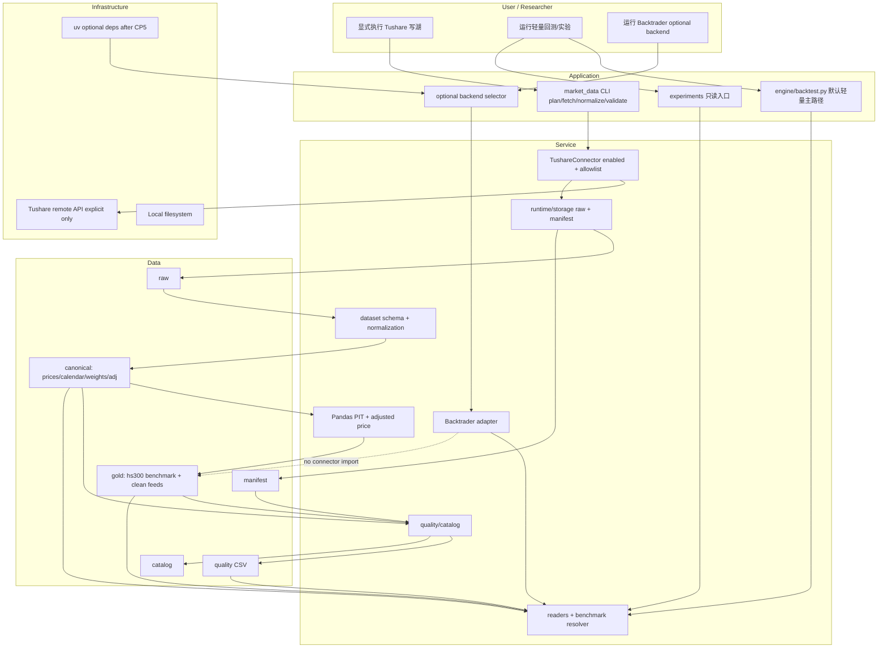

### 22.6 集成契约

| 契约 | 调用方向 | 调用时机 | 输入契约 | 输出契约 | 降级策略 | 调用方同步修改范围 |
|---|---|---|---|---|---|---|
| CLI/Runtime -> Tushare Connector | `market_data` 写湖入口调用 connector | 用户显式执行真实抓取命令且 source enabled | exact source/interface、allowlist、env var 名、batch params | raw rows 或 `ConnectorError` | 缺 token/未启用/接口未允许为非重试 fail fast | `config.py`、`source_registry.py`、connector 测试 |
| Benchmark Consumer -> Remediation Spec | Data Loader/实验/benchmark resolver/Backtrader 消费只读 benchmark | 本地 `hs300_index` 缺失、coverage 不足或 quality fail | dataset、requested date range、required flag、quality policy、lake_root hint | typed `BenchmarkResult`，含 status 与 `next_action` / `remediation_job_spec` | 仅返回建议；不执行 fetch/backfill，不导入 connector/runtime/storage | `benchmarks.py`、实验 metadata、Backtrader unavailable 处理 |
| Explicit Backfill Job -> Lake | 用户显式执行 `market_data` Tushare fetch/backfill job | 用户确认并执行数据层命令，且 dry-run=false、source enabled、allowlist/token/lake root 满足 | `remediation_job_spec` 或等价 CLI 参数 | raw / manifest / canonical / quality / catalog / gold | 任一前置失败返回结构化错误，不写湖；dry-run 默认不联网 | `cli.py` 或等价 job、runtime/storage、normalization、validation、catalog |
| Tushare Raw -> Normalization | normalization 消费 raw/manifest | fetch 成功或部分成功后 | raw_path、manifest record、target_dataset | canonical/gold parquet | 字段缺失或 dataset 不支持时 batch failed | `contracts.py`、`normalization.py`、quality schema |
| Normalization -> PIT/Adjustment Data Layer | Pandas 数据层消费 canonical/gold | reader 或消费方请求 factor panel / score / OHLCV feed 前 | dataset keys、`available_date`、`effective_date`、`available_at`、`adj_factor`、`adjustment_policy` | PIT 对齐 DataFrame、统一复权价格、干净 factor panel / score / OHLCV feed | `available_at > decision_time`、复权口径冲突或 adjusted price 缺失时 fail | `contracts.py`、`normalization.py`、`validation.py`、reader 输出契约 |
| Quality/Catalog -> Readers | reader 消费 quality/catalog | Backtest/实验/Backtrader 启动前 | dataset、date range、quality policy、PIT/复权策略 | DataFrame 或 unavailable / quality failed | quality `fail` 阻断；缺 benchmark 返回 unavailable | `readers.py`、`benchmarks.py`、调用方错误处理 |
| Backtrader Adapter -> Readers | optional backend 调用 reader | 用户显式选择 `backend=backtrader` | 已通过 quality gate 的本地 factor panel / score / OHLCV feed、calendar、benchmark | Backtrader feed / result / comparison | 未安装依赖返回 `backend_unavailable`，轻量主路径不受影响 | backend selector、adapter、文档、可选测试 |

#### 22.6.1 `BenchmarkResult` typed schema

`resolve_hs300_benchmark` 或等价 resolver 必须返回 typed result，不得用裸字符串或异常消息作为主要契约。

| 字段 | 必填 | 说明 |
|---|---|---|
| `status` | 是 | 枚举：`available`、`unavailable`、`required_missing`、`quality_failed` |
| `dataset` | 是 | 固定为 `hs300_index` |
| `source` | 是 | `tushare`、`local_fixture`、`none` 或 LLD 冻结值；缺失时为 `none` |
| `index_code` | 是 | 默认候选 `399300.SZ`；CR5-Q2 未确认前不得把其他口径混入同一 catalog entry |
| `interface` | 是 | exact interface，默认候选 `hs300_index.daily`，映射 Tushare `index_daily` |
| `start_date` / `end_date` | 是 | 请求区间 |
| `available_start_date` / `available_end_date` | 条件必填 | status 为 `available` 或部分覆盖时记录本地覆盖区间 |
| `coverage` | 是 | 包含 numerator、denominator、ratio；denominator 来自 `trade_calendar` open dates |
| `quality_status` | 是 | `pass`、`warn`、`fail`、`missing` |
| `missing_reason` | 条件必填 | `missing_dataset`、`missing_quality`、`coverage_gap`、`duplicate_key`、`policy_unconfirmed`、`quality_failed` 等 |
| `required` | 是 | true 时缺失映射为 `required_missing`；false 时映射为 `unavailable` |
| `remediation_job_spec` | 条件必填 | status 为 `unavailable` / `required_missing` / `quality_failed` 时给出只读补齐建议 |
| `catalog_entry` | 条件必填 | status 为 `available` 时记录 catalog id/path/schema version/latest run |
| `run_id` / `lineage` | 是 | 包含 manifest run、source_run_id、raw checksum 或等价 lineage；缺失时写明 `lineage_unavailable` |

#### 22.6.2 `hs300_index` backfill job spec

`remediation_job_spec` 与显式数据层 job 使用同一字段集。该 spec 可被 CLI/job 消费，但 resolver、实验入口和 Backtrader 只能生成或展示它，不能执行它。

| 字段 | 值 / 规则 |
|---|---|
| `dataset` | `hs300_index` |
| `source` | `tushare` |
| `interface` | exact 值 `hs300_index.daily`，映射 Tushare `index_daily`；CP5 可冻结为等价 exact 值 |
| `index_code` | 默认候选 `399300.SZ`；若 CR5-Q2 改口径，必须新建 policy 或 exact dataset/interface |
| `start_date` / `end_date` | 来自请求区间或 quality gap 区间 |
| `lake_root` | 用户显式传入或配置；真实写入前必须确认不污染仓库 |
| `run_id` | 用户传入或 deterministic 生成；进入 manifest / quality / catalog lineage |
| `resume_policy` | 默认 `success=skip, failed=retry, partial_success=retry` 或 LLD 冻结等价值 |
| `dry_run` | 默认 `true`；dry-run 网络调用和写湖次数均为 0 |
| `manifest_path` | `manifest` 层目标路径或规划路径 |
| `quality_path` | `quality` CSV 目标路径或规划路径 |
| `catalog_path` | `catalog` entry 目标路径或规划路径 |
| `error_enum` | `source_disabled`、`interface_not_allowed`、`missing_credential`、`quota_or_rate_limited`、`remote_error`、`schema_mismatch`、`quality_failed`、`lake_root_invalid`、`resume_conflict` |

### 22.7 关键流程

1. `plan`：仅规划 Tushare 接口、dataset、批次、日期范围和目标 lake root，不联网。
2. `fetch`：只有 `enabled=true`、allowlist 命中、`TUSHARE_TOKEN` 存在且用户显式命令满足时，才延迟导入 provider 并调用真实接口。
3. `normalize`：按 exact interface 或显式 `target_dataset` 派生 canonical/gold，未知 dataset 直接失败。
4. `adjusted_price`：行情层用 `adj_factor` 和统一 `adjustment_policy` 生成 adjusted price；价格收益、技术指标和 forward return 只消费该复权价格。
5. `pit_align`：Pandas 数据层对非行情数据按 `available_date` / `effective_date` / `available_at` 做 as-of join，生成回测日可见的 factor panel 或 score。
6. `validate/catalog`：为每个 dataset、PIT 对齐结果和复权口径输出 quality CSV 和 catalog entry；`fetch_status` 与 `dataset_status` 分离。
7. `benchmark/read`：实验、Data Loader 如需披露 benchmark metadata、轻量回测和 Backtrader 只读 `hs300_index`；缺失时返回 `BenchmarkResult(status=unavailable|required_missing|quality_failed)`，可携带 `next_action` / `remediation_job_spec`，但不联网、不补数、不写湖。
8. `hs300_backfill`：用户显式执行 `market_data` Tushare backfill job 后，数据层按 spec 先 dry-run，再在显式关闭 dry-run 且前置条件满足时联网写 raw/manifest，并串接 normalize、validate、catalog/gold；该步骤不由消费层自动触发。
9. `backtrader`：可选后端先检查依赖、quality gate、benchmark policy 和 reader 输出；只消费干净 feed；成功后运行调仓、成交、成本、仓位、净值和风险分析，失败时不影响轻量主路径。

### 22.8 前置校验与失败路径

| 阶段 | 前置条件 | 失败路径 | 可降级条件 |
|---|---|---|---|
| Tushare fetch | `offline=false`、source enabled、allowlist 命中、env var 存在、用户显式命令 | 任一缺失返回结构化错误，不重试、不联网 | 已有合规 canonical 可继续供 reader 使用 |
| Dataset normalization | raw/manifest 存在且 schema 可映射 | 必需字段缺失、复权口径冲突、unknown dataset 失败 | 非 P0 dataset 可标 `unavailable` |
| PIT as-of join | 非行情数据具备 `available_date` / `effective_date` / `available_at` 或等价字段，决策日历明确 | 任一参与信号/过滤的记录 `available_at > decision_time`、缺少可得性字段或 as-of key 不唯一时失败 | 不使用该非行情 dataset，报告披露 unavailable |
| Adjusted price generation | `prices` 与 `adj_factor` 可按 `trade_date + symbol` 对齐，`adjustment_policy` 唯一 | adjusted price 缺失、复权口径混用、收益/指标/forward return 使用未复权价格时失败 | 无降级；必须修复行情层 |
| Quality/catalog | canonical 可读，thresholds 可追溯 | quality CSV 写入失败或 status 非法则阻断 reader | `warn` 可由显式策略放行并披露 |
| 沪深 300 benchmark | `hs300_index` canonical/gold 覆盖请求区间；coverage denominator 来自 `trade_calendar` open dates；benchmark policy 已冻结 | 缺失、coverage gap、重复 key、quality fail 或 CR5-Q2 未冻结时返回 typed `BenchmarkResult`，状态为 `unavailable` / `required_missing` / `quality_failed` | 用户未要求 benchmark 时允许跳过相对指标，但报告不得声明 hs300 相对收益；旧代理只能标为 `proxy_baseline` |
| hs300 backfill job | 用户显式执行数据层 job；source enabled、allowlist/token/lake root/run_id/resume policy 满足；dry-run 默认 | 前置缺失返回结构化错误；dry-run 不联网不写湖；partial success 进入 quality/catalog lineage | 已有合规 canonical/gold 可继续供 reader 使用 |
| Backtrader backend | 依赖已安装、quality gate 通过、reader 输出完整且已 PIT/复权清洗的 OHLCV/日历/factor panel，benchmark status schema 和 policy 已冻结 | 未安装返回 `backend_unavailable`；quality fail、PIT fail、复权 fail、benchmark required_missing 或数据缺失均阻断 | 自动回退到轻量主路径，报告记录 backend 未运行；不触发补数 |

### 22.9 非功能需求设计

| 维度 | 设计 | 验收口径 |
|---|---|---|
| 安全 | token 只读环境变量名，不记录值；adapter import 不联网 | 仓库搜索无 token 值；manifest/quality/catalog/log 不含凭据 |
| 离线性 | Data Loader、实验、Backtrader adapter 均只读本地数据 | 这些模块不 import `market_data.connectors`，默认网络调用次数为 0 |
| 防未来函数 | 非行情数据 as-of join 在 Pandas 数据层完成 | 回测日输入 100% 满足 `available_at <= decision_time` |
| 复权一致性 | 行情层保存 `adj_factor` 与 adjusted price，收益/技术指标/forward return 统一使用复权价格 | 单次运行 `adjustment_policy` 唯一；混用或缺失直接 fail |
| 可追溯性 | 每个 canonical/gold 文件可追到 manifest run 和 raw checksum | catalog 和 quality 行含 `run_id`、source、interface、coverage |
| hs300 准确性 | `hs300_index` 以交易日历 open dates 为 denominator；记录缺失交易日、gap reason、重复 key、source lineage、raw checksum 或等价 lineage | duplicate key count 为 0；coverage 达到 quality thresholds；缺口和质量失败映射到 typed unavailable/required_missing |
| 可扩展性 | dataset schema 与 interface mapping exact 化 | 新 dataset 必须同步 contracts、normalization、validation、readers |
| 可维护性 | Backtrader optional backend 与轻量主路径解耦 | 未安装 Backtrader 时默认 pytest 和轻量回测仍通过 |
| 可验证性 | 默认测试使用 fake/offline fixture；真实 Tushare 测试需要显式标记 | `uv run --python 3.11 pytest -q` 不需要 token、不联网 |

### 22.10 主要风险与应对

| 风险 | 级别 | 影响 | 缓解 |
|---|---|---|---|
| Tushare API 被误接入主路径 | 高 | 断网不可运行、凭据泄露、测试不稳定 | ADR-013 强制 Tushare 只写湖；Story forbidden path 禁止 `engine/data_loader.py` / `engine/backtest.py` 直接调用 Tushare |
| dataset schema 过早绑定错误字段 | 高 | 后续 reader/Backtrader 返工 | CR005-S02 先冻结 schema/normalization；Backtrader 后置到 CR5-W5 |
| PIT as-of join 漏到 Backtrader 或消费方 | 高 | 产生未来函数并污染收益 | ADR-017 强制 PIT 在 Pandas 数据层完成；CR005-S03 quality gate 检查 `available_at <= decision_time` |
| 复权价格计算分散 | 高 | 收益、技术指标、forward return 口径不一致 | `adj_factor` 和 adjusted price 在行情层生成；CR005-S02/S03 阻断混用 `adjustment_policy` |
| Backtrader 成为事实默认框架 | 中 | 轻量主路径被复杂框架污染 | ADR-016 明确 optional；未安装时 `backend_unavailable`，默认主路径不变 |
| 真实数据大文件误提交 | 中 | 仓库污染和合规风险 | 真实 lake root 与 `.gitignore` / 人工确认由后续 CP5 明确；本阶段不写数据 |
| quality gate 被绕过 | 高 | 回测结果不可解释 | Backtrader 和实验都只消费 quality/catalog；quality `fail` 阻断 |
| required_missing 被误实现为自动补数 | 高 | 消费层联网、写湖和凭据边界被破坏 | ADR-015 强制两步契约；`BenchmarkResult.remediation_job_spec` 只读；S04/S06 forbidden path 禁止 connector/runtime/storage |
| hs300 available 路径质量不足 | 高 | 相对收益和对照报告不可信 | S02/S03/S04 强制 index_code、interface、benchmark_kind、coverage denominator、missing dates、duplicate key、lineage、quality thresholds 和 catalog entry |

### 22.11 ADR 候选决策点

| ADR | 决策点 | 推荐结论 | 回写位置 |
|---|---|---|---|
| ADR-013 | Tushare 是否可直接接入回测/实验 | 否；只允许写入本地数据湖链路 | §22.1、§22.6、CR005-S01 |
| ADR-014 | CR-005 dataset schema 扩展范围 | P0 覆盖 `prices`、`hs300_index`、`trade_calendar`、`index_weights`，P1 覆盖复权和股票基本信息 | §22.4、CR005-S02/S03 |
| ADR-015 | 本地沪深 300 benchmark 口径 | 优先 `hs300_index` canonical/gold；缺失返回 typed `BenchmarkResult` + remediation spec，不静默代理、不自动补数 | §22.6、§22.7、CR005-S04 |
| ADR-016 | Backtrader 接入定位 | optional backend；只读本地 canonical/gold + quality gate，不替代轻量主路径 | §22.6、§22.8、CR005-S06 |
| ADR-017 | PIT 与复权职责边界 | PIT as-of join 和 adjusted price 在 Pandas 数据层完成；Backtrader 只消费干净 feed | §22.3、§22.6、CR005-S02/S03/S06 |

### 22.12 分阶段落地与工作量

| 阶段 | Story | 内容 | 粗估 |
|---|---|---|---|
| CR5-W0 真实源边界 | CR005-S01 | Tushare connector 显式启用、allowlist、token env、错误映射、plan/dry-run、`hs300_index` backfill job spec 和 `market_data/cli.py` 或等价 job 所有权 | M |
| CR5-W1 dataset 契约 | CR005-S02 | dataset schema、source/interface exact mapping、normalization、PIT 字段和 adjusted price 扩展 | L |
| CR5-W2 质量读取 | CR005-S03 | 多 dataset quality/catalog/readers、PIT as-of gate、复权一致 gate 和 CSV 事实源 | L |
| CR5-W3 本地基准 | CR005-S04 | 沪深 300本地 benchmark resolver、`BenchmarkResult` typed schema、只读 next_action / remediation spec 与实验只读基准接入 | M |
| CR5-W4 比对文档 | CR005-S05 | 多源 comparison、显式 backfill runbook、README/USER-MANUAL 更新规划；不拥有 backfill job 主入口 | M |
| CR5-W5 可选后端 | CR005-S06 | Backtrader optional backend、selector、结果对照、未安装降级；只消费已 PIT/复权清洗的 factor panel / score / OHLCV feed | L/M |

### 22.13 CP3/CP4/CP5 门控建议与开放问题

| 类型 | 建议 |
|---|---|
| CP3 | 需要重跑。第三轮评审已 supersede 旧 CP3 人工稿；新 CP3 输入必须包含 CR-005 两步契约、`BenchmarkResult` schema、`hs300_index` backfill job spec、hs300 quality/accuracy gate、proxy_baseline 禁止替代 hs300、Backtrader optional 边界 |
| CP4 | 需要重跑。第三轮评审已 supersede 旧 CP4 人工稿；新 CP4 输入必须包含 CR005-S01 对 `market_data/cli.py` 或等价 job 的所有权、CR005-S04/S06 required_contracts、文件冲突策略、LLD 批次与开发串行门控 |
| CP5 | 建议分 4 批并拆清 LLD 与开发门控：A=CR005-S01/S02，B1=CR005-S03，B2=CR005-S04，C=CR005-S05，D=CR005-S06。S04/S06 的 LLD 可在契约冻结后起草，但开发必须等待 hs300 backfill job spec、reader quality、`BenchmarkResult` schema 和 benchmark policy 冻结；D 批还必须等待 PIT as-of、adjusted price 与 quality gate confirmed/verified |

| 问题 ID | 问题 | 状态 | 影响 | 决策人 |
|---|---|---|---|---|
| CR5-Q1 | Tushare 5000 档具体接口限频、积分消耗和可用字段 | OPEN | 影响 CR005-S01 batch planner 与 retry/throttle 默认值 | 用户 / 数据源 owner |
| CR5-Q2 | `hs300_index` 使用价格指数、全收益指数或其他口径 | OPEN | 影响 CR005-S04 benchmark 口径、`benchmark_kind`、catalog entry 和对照报告解释；未关闭前真实 available 路径不得实现为最终口径 | 用户 / meta-se |
| CR5-Q3 | Backtrader 依赖版本上限与 optional dependency 分组 | OPEN | 影响 CR005-S06 的 `pyproject.toml` / `uv.lock` 修改范围 | meta-dev / meta-qa / 用户 |
| CR5-Q4 | 真实数据 lake root 和 `.gitignore` 策略 | OPEN | 影响真实抓取是否允许写入仓库工作树外目录 | 用户 / meta-po |

## 23. CR-006 Tushare-first 数据方案增量设计

> 本节是 CR-006 的 CP3 前修订稿。它响应用户明确的新方向：旧 `data/` 目录保持现状，仅供以后人工参考/比对；不删除、不迁移、不纳入新的 Tushare 主路径；不把旧 `data/` 作为默认 fallback 来证明新链路可用。后续新增数据方案以 Tushare structured lake 为事实源，并为当前轻量回测框架和 Backtrader 提供受控消费面。

### 23.1 问题与边界

**问题陈述**：仓库内旧 `data/` 的数据来源、生成批次和质量证明不可在本轮设计中被确认，且 Tushare 不能被承诺“完全覆盖旧 `data/`”。继续围绕旧 `data/` 做外置化或 fallback 会把不可审计的历史数据带入新链路，导致 Tushare structured lake、轻量回测输入和 Backtrader feed 的事实源不清晰。

**价值**：把新链路改为 Tushare-first 后，数据获取、审计、复现和质量追溯统一发生在 structured lake；轻量回测和 Backtrader 都只消费 quality gate 后的 clean 数据面。旧 `data/` 不被删除，但也不再承担默认运行、覆盖证明或自动回退职责，从根上避免“旧数据来源不明”污染新设计。

| 维度 | CR-006 修订设计口径 |
|---|---|
| 目标 | 建立 Tushare-first 数据获取与消费方案；确认 raw/manifest 只属于采集审计/复现/质量追溯层；轻量回测消费 canonical/gold 或从其派生的 external `legacy_flat`；Backtrader 消费经过 quality gate 的 clean OHLCV/factor/score feed；旧 `data/` reference-only |
| 成功标准 | Tushare structured lake 被定义为新数据事实源；raw/manifest 不被轻量回测或 Backtrader 当作运行时输入；当前轻量框架至少有 1 个明确消费面：canonical/gold reader 或派生 external `legacy_flat`；Backtrader 至少有 1 个 clean feed contract；旧 `data/` 默认读取、fallback、迁移、复制、删除次数均为 0 |
| 约束 | 不读取、列出、迁移、复制或删除真实 `data/**`；不读取或记录 `.env`、Tushare token、NAS 用户名、密码或真实私有路径；不承诺 Tushare 完全覆盖旧 `data/`；不在 CP3/CP4 前修改代码、测试、README、docs、market_data 或 delivery |
| 非目标 | 不实现 Tushare 抓取；不执行真实回补；不验证旧 `data/` 内容；不做旧数据和 Tushare 的自动差异比对；不把 Backtrader 变成默认主框架；不把 raw/manifest 设计成回测运行时依赖 |
| 关键假设 | CR-005 的 `market_data` structured lake 分层可作为 Tushare-first 基础；旧轻量 engine 可能仍需要 flat parquet 形态，但该形态应从 canonical/gold 派生到仓库外 external `legacy_flat`；Backtrader feed 的 PIT、复权和质量门由 Pandas 数据层完成 |
| 缺失信息 | Tushare P0 dataset 是否足以覆盖用户下一轮策略研究为 OPEN；Backtrader 依赖版本为 OPEN；external `legacy_flat` 的物理路径为 OPEN 且不得记录真实值；这些不阻塞 CP3/CP4 设计确认，但阻塞真实回补和实现 |

### 23.2 候选方案对比

| 方案 | 核心思路 | 优点 | 缺点 | 复杂度 / 成本 | 扩展性 | 风险 | 适用前提 |
|---|---|---|---|---|---|---|---|
| CR6-A：Tushare structured lake 作为事实源，回测消费 clean 派生面（推荐） | Tushare 写 raw/manifest/canonical/quality/catalog/gold；轻量 engine 读 canonical/gold 或派生 external `legacy_flat`；Backtrader 读 clean feed；旧 `data/` reference-only | 事实源清晰；raw/manifest 保留审计价值但不污染运行时；轻量框架和 Backtrader 可共享质量门；不需要验证旧 `data/` 来源 | 需要补充 adapter/contract；旧硬编码 `data/` 调用点后续要受控改造 | medium / 中 | 高；可逐步扩展 dataset、quality gate、feed contract | 若 adapter 绕过 quality gate，会重新产生不可解释结果 | 用户接受新链路不承诺覆盖旧 `data/` |
| CR6-B：继续外置旧 `data/` 并保留 fallback | 旧 flat parquet/raw/manifest 搬到外置目录，旧 engine 默认 fallback 到仓库 `data/` | 对旧代码改动较小；短期兼容旧命令 | 继续依赖来源不明数据；fallback 可能被误当成新链路证明；无法回答 Tushare 覆盖性 | medium / 中 | 中 | 新旧事实源混淆，审计链断裂 | 仅适合用户明确要求延续旧数据运行 |
| CR6-C：只用 Tushare raw/manifest 直接喂回测 | 回测运行时直接读取 Tushare raw 或 manifest 中的批次记录 | 少一个 canonical/gold 派生步骤 | raw schema 不稳定；manifest 是审计事实而非行情数据面；Backtrader feed 难以保证 PIT/复权和质量门 | low 起步 / high 维护 | 低 | 回测语义漂移、未来函数和复权口径风险高 | 仅适合一次性数据调试，不适合正式回测 |
| CR6-D：旧 `data/` 与 Tushare 做全量覆盖比对后再设计 | 先审计旧 `data/`，再决定 Tushare 覆盖和迁移策略 | 理论上能解释旧结果来源 | 需要读取/列出/分析真实 `data/**`，违反本轮约束；且仍不能保证 Tushare 覆盖未知旧源全部字段 | high / 高 | 中 | 泄露私有数据或陷入旧数据考古 | 仅在用户另行授权读取旧数据后 |

**推荐**：CR6-A。它承认 Tushare 不能承诺完全覆盖旧 `data/`，同时给出可审计、可回放、可被轻量框架和 Backtrader 消费的新事实源路径。

### 23.3 推荐架构总览

CR-006 采用“Tushare acquisition/audit 层 + canonical/gold 事实源 + runtime adapter/feed + old data reference-only guardrail”的架构。

| 模块 | 职责 | 输入 | 输出 | 关键约束 |
|---|---|---|---|---|
| Tushare Acquisition Job | 显式执行 Tushare plan/dry-run/fetch，写 raw 与 manifest | dataset spec、接口 allowlist、日期范围、环境变量名 | raw 响应、manifest run、错误枚举 | 不由回测运行时触发；不打印 token 或真实路径 |
| Normalization / Quality / Catalog | 从 raw/manifest 派生 canonical、quality、catalog、gold | raw、manifest、dataset schema | canonical/gold parquet、quality gate、catalog lineage | raw/manifest 是追溯输入，不是回测运行输入 |
| Lightweight Engine Adapter | 为当前轻量回测提供 canonical/gold reader 或 external `legacy_flat` 派生 | canonical/gold、quality pass/warn、schema policy | `prices.parquet` 等兼容形态或 typed in-memory input | 不读取旧 `data/` fallback；quality fail 阻断 |
| Backtrader Clean Feed Adapter | 为 Backtrader 提供 clean OHLCV/factor/score feed | quality gate 后的 canonical/gold、PIT/复权结果 | Backtrader feed / structured unavailable | 不读取 raw/manifest；不读取 Tushare token；不导入 connector/runtime |
| Old Data Reference Guardrail | 声明旧 `data/` 只作人工参考/比对样本 | HLD/ADR/Story/实现结果 | 文档、错误提示、静态 guardrail | 不迁移、不删除、不默认读取旧 `data/` |

### 23.4 raw / manifest 评估与数据目录契约

| 对象 | 是否需要 | 职责边界 | 运行时消费方 |
|---|---|---|---|
| raw | 需要 | 保存 Tushare 原始响应、支持重新 normalize、排查源字段变化和质量问题 | 数据层 normalization / replay；轻量回测和 Backtrader 不直接消费 |
| manifest | 需要 | 记录 run_id、batch、source/interface、params、attempts、status、raw_path、canonical_path、错误和 lineage，作为审计与断点续传事实 | 数据层 resume / audit / quality；轻量回测和 Backtrader 不直接消费 |
| canonical | 需要 | 统一 schema、类型、主键、`available_at`、复权字段和 source lineage | 轻量 adapter、Backtrader feed、实验 reader |
| quality | 需要 | 判断 dataset 是否 pass/warn/fail，记录覆盖、缺失、重复、异常、PIT/复权 gate | 所有回测消费面必须读取 gate 结论 |
| catalog | 需要 | 暴露 dataset、coverage、latest run、quality_status 和 lineage | reader、adapter、runbook |
| gold | 需要 | 面向研究/回测的稳定数据面，如 clean OHLCV、factor panel、score、benchmark | 轻量 engine 和 Backtrader 的首选运行输入 |
| external `legacy_flat` | 条件需要 | 仅为兼容当前轻量 engine 的 flat parquet 文件名契约，从 canonical/gold 派生到仓库外 | 轻量 engine 兼容模式；不等同旧 repo `data/` |
| repo `data/` | 不作为新链路需要 | 保持现状，仅供以后人工参考/比对样本 | 默认运行时消费方为 0 |

目录示意只使用占位符：

```text
<external-data-root>/
  market_data_lake/        # MARKET_DATA_LAKE_ROOT；Tushare-first 事实源
    raw/
    manifest/
    canonical/
    quality/
    catalog/
    gold/
  legacy_flat/             # 可选派生兼容面；由 canonical/gold 生成
    prices.parquet
    index_members.parquet
    trade_calendar.parquet

<repo>/data/               # 保持现状；reference-only；不作为默认 fallback
```

### 23.5 系统架构图

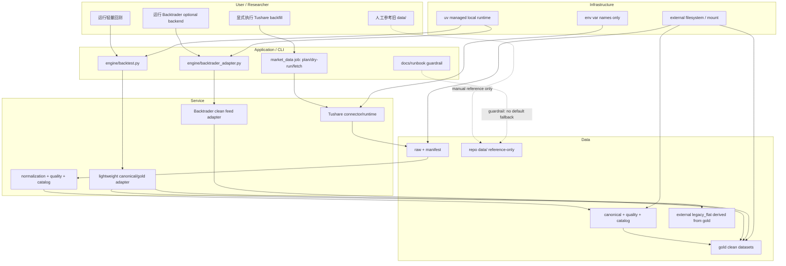

### 23.6 集成契约

| 契约 | 调用方向 | 调用时机 | 输入契约 | 输出契约 | 错误 / 降级策略 | 调用方同步修改范围 |
|---|---|---|---|---|---|---|
| Tushare job -> raw/manifest | 用户显式 CLI 调用数据层 job | 数据回补或刷新时 | dataset、source/interface、日期范围、dry-run、lake root、env var name | raw、manifest、fetch status、error enum | 缺 token/env/source allowlist 时 fail fast；dry-run 不联网不写数据 | `market_data` job / runbook |
| raw/manifest -> canonical/gold | normalization/quality/catalog 调用 | fetch 成功或 replay 时 | raw_path、manifest_run_id、schema_version、dataset mapping | canonical、quality、catalog、gold | schema 不匹配或 quality fail 时阻断运行消费面 | `market_data/normalization.py`、`validation.py`、`catalog.py`、`readers.py` |
| canonical/gold -> lightweight engine | engine adapter 或 reader 调用 | 轻量回测启动前 | dataset、date range、adjustment_policy、quality gate | in-memory input 或 external `legacy_flat` parquet | required_missing / quality_failed 返回 typed error；不读旧 `data/` fallback | `engine/data_loader.py`、`engine/backtest.py`、实验入口 |
| canonical/gold -> Backtrader clean feed | Backtrader adapter 调用 | optional backend 启动前 | clean OHLCV、factor panel、score、calendar、benchmark status | Backtrader feed 或 structured unavailable | 未安装返回 backend_unavailable；quality/PIT/复权 fail 阻断；不触发 fetch | `engine/backtrader_adapter.py`、backend selector |
| old `data/` guardrail | 文档、错误提示、静态检查 | 用户误把旧数据作为默认输入时 | repo `data/` 路径字面量或旧配置 | reference-only 提示 / fail-fast | 不删除不迁移；不以旧数据作为 fallback | README、USER-MANUAL、tests/guardrail |

### 23.7 关键流程

1. `plan_tushare_backfill`：用户显式规划 Tushare dataset、接口、日期范围、lake root 和 run id；不读取旧 `data/`。
2. `fetch_to_raw_manifest`：显式关闭 dry-run 后，Tushare job 写 raw/manifest；manifest 记录可审计 lineage，且不含 token、用户名、密码或真实私有路径值。
3. `normalize_validate_catalog`：从 raw/manifest 派生 canonical、quality、catalog、gold；quality fail 阻断回测消费。
4. `serve_lightweight_input`：轻量 engine 优先读 canonical/gold；若现有 engine 仍需要 flat parquet，则从 gold 派生 external `legacy_flat`，不读取 repo `data/`。
5. `serve_backtrader_feed`：Backtrader 只读取 clean OHLCV/factor/score feed；PIT、复权和 quality gate 已在数据层完成。
6. `reference_old_data_manually`：旧 `data/` 仅由用户人工查看或未来另行授权比对；程序默认路径不得用它证明新链路可用。

### 23.8 前置校验与失败路径

| 阶段 | 前置条件 | 失败路径 | 可降级条件 |
|---|---|---|---|
| Tushare plan | dataset/interface allowlist 命中；日期范围合法；lake root 指向外部或用户确认位置 | 参数非法返回结构化错误；不联网 | 可只输出 remediation spec |
| Tushare fetch | dry-run 明确关闭；env var name 存在且 source enabled；用户显式执行 | 缺凭据或限频错误写 failed manifest；不由回测自动重试 | 已有 quality pass 的 canonical/gold 可继续供消费 |
| normalization / quality | raw/manifest 存在，schema_version 可识别 | 字段缺失、重复 key、PIT/复权冲突或覆盖不足时 quality_failed | 非目标 dataset 可标 unavailable |
| 轻量回测启动 | canonical/gold 或 external `legacy_flat` 来自当前 lake lineage 且 quality gate 通过 | 缺数据返回 required_missing；不得 fallback 到 repo `data/` | 可返回只读 remediation spec |
| Backtrader 启动 | optional dependency 可用；clean feed、calendar、benchmark policy 满足 gate | 未安装返回 backend_unavailable；quality/PIT/复权失败阻断 | 自动回退轻量主路径并记录未运行 |
| old data reference | 用户人工查看或另行授权比对 | 本 CR 不执行读取、列出、迁移、删除 | 保持现状，无运行时降级 |

### 23.9 非功能需求设计

| 维度 | 设计 | 验收口径 |
|---|---|---|
| 安全 | 不记录 token、NAS 用户名、密码、真实私有路径；不操作真实 `data/**` | 凭据/私有路径记录次数为 0；真实 `data/**` 操作次数为 0 |
| 可复现性 | raw/manifest 保留采集 lineage，canonical/gold 可从 run_id 追溯 | 每个 canonical/gold dataset 可追到 manifest run 和 source/interface |
| 离线性 | 回测消费面不联网、不导入 connector/runtime | 轻量 engine 和 Backtrader 网络调用次数为 0；connector import 次数为 0 |
| 可维护性 | 数据事实源、运行时消费面、旧数据参考面分层 | raw/manifest、canonical/gold、feed/adapter、old data guardrail 有独立职责 |
| 兼容性 | 当前轻量 engine 可通过 reader 或 external `legacy_flat` 过渡 | 不要求旧 repo `data/` 参与；flat 文件名兼容只来自派生面 |
| 可验证性 | 默认测试使用 fake/offline fixture 和 tmp_path | 不需要真实 Tushare token、不需要 NAS、不联网 |

### 23.10 主要风险与应对

| 风险 | 级别 | 影响 | 缓解 |
|---|---|---|---|
| 错误承诺 Tushare 完全覆盖旧 `data/` | 高 | 误导用户并污染验收 | HLD/ADR 明确不承诺覆盖；旧数据只作人工参考 |
| raw/manifest 被回测直接消费 | 高 | schema 漂移、质量门绕过 | ADR-018 限定 raw/manifest 为审计层；Story AC 检查运行时输入 |
| 轻量 engine 为兼容继续默认读 repo `data/` | 高 | 来源不明数据进入新链路 | S02 要求 canonical/gold 或 external `legacy_flat`；旧 `data/` 默认消费次数为 0 |
| Backtrader 自己补数或清洗 PIT/复权 | 高 | 未来函数、复权口径漂移 | S03 继承 ADR-016/017，只消费 clean feed |
| external `legacy_flat` 被误认为旧 repo `data/` | 中 | 责任边界混淆 | 命名、文档和 catalog lineage 必须说明其由 canonical/gold 派生 |
| 旧 `data/` 被误删 | 高 | 数据不可恢复 | 本 CR 不执行删除；未来清理需另行授权 |

### 23.11 ADR 候选决策点

| ADR | 决策点 | 推荐结论 | 回写位置 |
|---|---|---|---|
| ADR-018 | CR-006 的事实源 | Tushare structured lake 是新链路事实源；旧 `data/` reference-only | §23.1、§23.4、CR006-S01、CR006-S04 |
| ADR-018 | raw/manifest 是否需要 | 需要，但仅用于采集审计、复现、质量追溯和 replay，不是回测运行时依赖 | §23.4、CR006-S01 |
| ADR-018 | 轻量 engine 输入 | canonical/gold 优先；必要时从 gold 派生 external `legacy_flat`，不得默认 fallback repo `data/` | §23.6、CR006-S02 |
| ADR-018 | Backtrader 输入 | quality gate 后的 clean OHLCV/factor/score feed；不读 raw/manifest/token/connector | §23.6、CR006-S03 |

### 23.12 分阶段落地与工作量

| 批次 / 阶段 | Story | 内容 | 粗估 |
|---|---|---|---|
| CR006-BATCH-A / S01 | CR006-S01-tushare-first-data-acquisition-runbook | 冻结 Tushare-first acquisition/runbook、raw/manifest 审计职责、canonical/gold 产出和 no-old-data 采集边界 | M |
| CR006-BATCH-A / S02 | CR006-S02-canonical-gold-lightweight-engine-adapter | 设计轻量 engine 消费 canonical/gold 或派生 external `legacy_flat` 的 adapter/contract，不默认读 repo `data/` | M |
| CR006-BATCH-A / S03 | CR006-S03-backtrader-clean-feed-contract | 设计 Backtrader clean OHLCV/factor/score feed contract，继承 PIT/复权/quality gate，不触发补数 | M |
| CR006-BATCH-A / S04 | CR006-S04-old-data-reference-only-guardrail | 为旧 `data/` reference-only 建立文档、错误提示和静态 guardrail；禁止默认 fallback、迁移、删除 | S/M |

Story 数为 4，Wave / LLD 批次为 1 个 `CR006-BATCH-A`；该数量必须与 `process/STORY-BACKLOG.md` 和 `process/DEVELOPMENT-PLAN.yaml` 保持一致。

### 23.13 Gotchas

| Gotcha | 规避方式 |
|---|---|
| 把“旧 `data/` 保持现状”理解为 fallback 继续可用 | 明确 reference-only；默认运行时消费次数必须为 0 |
| 认为有 manifest 就能让回测直接读 manifest | manifest 是审计和 resume 事实，不是行情数据面；回测只读 canonical/gold/feed |
| 为兼容轻量 engine 直接复制旧 flat 文件 | external `legacy_flat` 必须从 canonical/gold 派生并带 lineage，不来自旧 repo `data/` |
| Backtrader adapter 顺手调用 Tushare 或 connector | Story forbidden path 和静态检查禁止导入 connector/runtime、读取 token 或联网 |
| 为了证明覆盖而读取旧 `data/**` | 本 CR 不做旧数据覆盖证明；比对需另行授权和独立 CR/任务 |

### 23.14 CP3/CP4/CP5 门控建议与开放问题

| 类型 | 建议 |
|---|---|
| CP3 | 需要重新发起 CR-006 HLD/ADR 人工确认。重点审查 Tushare-first 事实源、raw/manifest 审计边界、轻量/Backtrader 运行时消费面、旧 `data/` reference-only |
| CP4 | 需要重新发起 CR-006 Story Plan 人工确认。重点审查 `CR006-BATCH-A` 四个 Story、文件所有权、依赖、dev_gate、no-old-data fallback 护栏 |
| CP5 | `CR006-BATCH-A` 必须覆盖全部四个 Story 的 LLD，统一人工确认后再开发；开发默认串行/受控并行，S02/S03 依赖 S01 的数据层契约，S04 收敛全链路护栏 |

| 问题 ID | 问题 | 状态 | 影响 | 决策人 |
|---|---|---|---|---|
| CR6-Q1 | Tushare P0 dataset 是否覆盖下一轮策略研究所需字段 | OPEN；不承诺覆盖旧 `data/` | 影响 S01 dataset/runbook 和 S02/S03 feed 字段 | 用户 / 数据源 owner |
| CR6-Q2 | external `legacy_flat` 是否作为轻量 engine 过渡方案必须产出 | OPEN；默认允许但不强制 | 影响 S02 实现范围和测试夹具 | meta-se / meta-dev / 用户 |
| CR6-Q3 | Backtrader clean feed 首批字段集和 optional dependency 版本 | OPEN；默认沿用 CR005-S06 后置策略 | 影响 S03 LLD 和 `pyproject.toml` 后续变更 | meta-dev / meta-qa / 用户 |
| CR6-Q4 | 是否未来授权读取旧 `data/**` 做人工比对 | OPEN；当前未授权 | 阻塞任何旧数据覆盖性分析；不阻塞新 Tushare-first 设计 | 用户 |

## 24. CR-007 Canonical 数据覆盖与真实 Benchmark 增量设计

> 本节是 CR-007 的 solution-design 刷新稿。它承接 CR-006 已确认的 Tushare-first structured lake、canonical/gold 消费面和旧 `data/**` reference-only 护栏；本节不授权真实 Tushare 抓取、不写入 `/mnt/ugreen-data-lake`、不读取 `.env` 或凭据、不读取旧 `data/**`。

### 24.1 问题定义

**问题陈述**：当前架构已具备 Tushare-first structured lake 和 canonical/gold 只读消费底座，但数据覆盖仍停留在局部可用状态：`prices` 只有 2025 小窗口，`hs300_index` 仅有 2024 四天样本且与 2025 `prices` 无重叠，canonical `trade_calendar` 缺失，`index_members` / `stock_basic` 新链路不完整，实验十三仍以同股票池等权代理作为 benchmark。因此系统不能证明 2015-2020 分段测试、2015-2025 样本内外研究或真实沪深300相对收益。

**价值**：把 CR-006 的数据湖底座从“结构可用”推进到“研究覆盖可判定”：长期 backfill 可规划、可恢复、可校验；真实沪深300 benchmark 与交易日历同区间；非行情 dataset 明确 PIT / 非 PIT 边界；实验十三在真实 benchmark 可用时不再默认代理；旧 `reports/data_quality_report.csv` 不再被误用为 canonical lake 当前质量真相源。

| 优先级 | 目标 | 成功标准 |
|---|---|---|
| P0 | 长周期 `prices` backfill 规划 | 支持 `2015-01-01` 至 `2025-12-31` 或用户指定 end date 的 dry-run plan；输出股票池分批、日期分片、resume policy、预计批次数、target paths、coverage gate，网络调用与写入均为 0 |
| P0 | 真实沪深300 benchmark 最小闭环 | `hs300_index` 与 `trade_calendar` 至少可规划并校验 `2025-01-02` 至 `2025-05-07` 同区间 coverage；缺失返回 `required_missing`，不静默代理 |
| P0 | 长周期研究覆盖 | `prices`、`hs300_index`、`trade_calendar` 的 coverage gate 支持 `2015-01-01` 至 `2020-03-31` 分段测试与 `2015-01-01` 至 `2025-12-31` 全周期规划 |
| P0 | 实验十三真实 benchmark 消费 | 真实 `hs300_index` available 且 coverage ratio = 1.0 时，实验十三输出真实 benchmark 字段；代理只允许命名为 `proxy_baseline` |
| P1 | 成分 / 权重 / stock_basic readiness | `index_members`、`index_weights`、`stock_basic` 的接口、schema、quality/readers readiness 可判定；PIT 不完整时返回 structured warn/unavailable，不伪装 PIT |
| P1 | 旧质量报告收敛 | `reports/data_quality_report.csv` 标记为 legacy 旧报告，canonical lake 当前质量真相源改为 lake `quality/catalog` |

### 24.2 约束、非目标与假设

| 类型 | 内容 |
|---|---|
| 安全约束 | 不读取、不打印、不记录 `.env`、Tushare token、NAS 用户名、密码或真实私有路径；真实抓取与真实 lake 写入必须另行人工授权 |
| 数据约束 | 不读取、列出、迁移、复制、比对或删除旧 `data/**`；旧 `data/**` 不作为 fallback、迁移源、覆盖证明或 fixture |
| 运行约束 | CR-007 默认只设计 plan/dry-run、schema、quality、reader、实验消费合同和文档护栏；不执行真实 Tushare 调用 |
| 覆盖约束 | 2025 小窗口 `prices` 与 2024 四天 `hs300_index` 只能作为局部证据，不得声明为 2015-2025 或 2015-2020 覆盖证明 |
| 非目标 | 不建设调度服务、不自动定时全量抓取、不承诺 Tushare 免费/积分配额足以一次跑完全市场、不把代理 benchmark 包装为真实沪深300 |
| 关键假设 | CR005/CR006 已验证的 `market_data` 分层、`BenchmarkResult`、quality/catalog/readers 和 no-old-data 护栏可作为 CR-007 的上游合同 |

### 24.3 候选架构方案对比

| 方案 | 核心思路 | 优点 | 缺点 | 复杂度 / 成本 | 扩展性 | 风险 | 适用前提 |
|---|---|---|---|---|---|---|---|
| CR7-A：在现有 `market_data` 内扩展分批 backfill planner 与 coverage gate（推荐） | 复用 Tushare-first job、manifest、normalization、quality、catalog/readers；新增长期分片、resume、dataset readiness 与实验十三消费 | 最小改动；沿用 CR-006 安全边界；Story 文件所有权可控；不引入新调度系统 | 大规模真实执行仍需用户手动授权与外部运行治理 | medium / 中 | 高；后续可把 planner 升级为调度器 | 分片策略若不严谨会造成重复抓取或 coverage 误判 | 接受先交付 dry-run / coverage / readiness，再授权真实 backfill |
| CR7-B：新增独立数据运维调度层 | 新建 scheduler / job state / retries / backfill orchestration，集中管理长期数据生产 | 长期自动化能力强；适合持续运营 | 超出当前研究工具规模；引入权限、凭据、并发和失败恢复复杂度 | high / 高 | 高 | 容易绕过显式授权与 no-network 消费边界 | 用户明确需要常驻调度或生产级数据运维 |
| CR7-C：手工脚本补齐具体缺口 | 用一次性脚本分别抓 `prices`、`hs300_index`、calendar 和成分数据 | 初始最快；代码少 | 不可追溯、不可恢复、不可复用；quality/catalog/readers 容易漂移 | low / 低 | 低 | 覆盖证明和 benchmark 口径不可审计 | 只做一次性探索且用户放弃长期质量门 |

**推荐方案**：CR7-A。它在现有 `market_data` 分层内补齐 planner、dataset readiness 和消费链路，避免新增调度系统，同时满足 CR-007 对长期 coverage、真实 benchmark 和安全边界的要求。

### 24.4 推荐方案总览与架构图

CR-007 采用“Backfill Planner + Dataset Readiness + Coverage/Quality Gate + Benchmark Consumer + Legacy Report Guardrail”的增量架构。

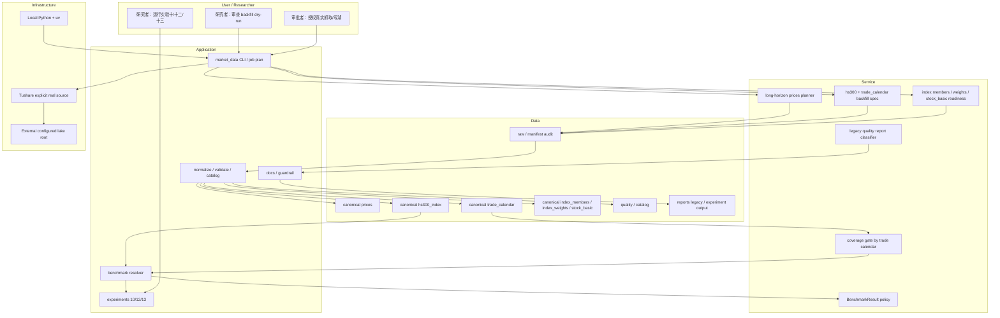

### 24.5 高层模块与职责划分

| 模块 | 职责 | 输入 | 输出 | 禁止事项 |
|---|---|---|---|---|
| Long Horizon Backfill Planner | 为 `prices.daily` + `prices.adj_factor` 生成按股票池和日期分片的 dry-run / plan / resume 策略 | dataset、symbols/universe source、start/end、batch size、lake root、run_id | batch plan、target paths、coverage expectations、resume policy、error enum | 不默认全市场无 `ts_code` 长周期拉取；不读取旧 `data/**` |
| Benchmark Calendar Backfill | 规划并校验 `hs300_index` 与 `trade_calendar` 同区间 coverage | index_code、calendar exchange、start/end、quality thresholds | canonical/gold readiness、coverage ratio、missing trade dates | 不用代理填充 `hs300_index` |
| Dataset Readiness Layer | 补齐 `index_members`、`index_weights`、`stock_basic` 的接口、schema、normalizer、validator、reader readiness | Tushare exact interface、raw/manifest、PIT policy | dataset status、quality/catalog entries、reader result | PIT 不完整时不得标记为 PIT available |
| Experiment Benchmark Consumer | 让实验十三优先消费真实 `hs300_index`；复核实验十/十二参数与 metadata | BenchmarkResult、close_df、experiment args | comparison CSV、benchmark metadata、proxy_baseline 对照 | 不联网、不自动 backfill |
| Quality Report Guardrail | 把旧 `reports/data_quality_report.csv` 归类为 legacy；文档化当前质量真相源 | README、USER-MANUAL、guardrail tests | docs、静态检查、legacy warning | 不覆盖旧报告、不把旧报告作为当前 canonical 质量证明 |

### 24.6 技术选型与理由

| 选型 | 决策 | 理由 |
|---|---|---|
| 分批 planner | 在 `market_data/cli.py` 或等价 job 内扩展，不新增常驻服务 | 与 CR006 Tushare-first runbook 保持一致，便于 dry-run 与显式授权 |
| 分片策略 | 股票池分批 + 日期分片 + manifest resume | 控制 Tushare 配额和失败恢复；支持长周期 2015-2025 |
| coverage denominator | 以 `trade_calendar.is_open=true` 为基准 | benchmark 和 prices coverage 必须按交易日而非自然日计算 |
| benchmark | 真实 `hs300_index` 优先，`proxy_baseline` 仅作对照 | 防止代理口径污染真实沪深300相对收益 |
| PIT policy | `index_members` 优先 PIT；不完整时 structured warn/unavailable | 避免用非 PIT 成分伪装历史真实股票池 |
| quality truth | lake `quality/catalog` 为当前真相源，旧 repo report 为 legacy | 与 CR006 canonical/gold 消费面一致 |

### 24.7 关键流程

1. `plan_prices_long_horizon`：输入日期区间、股票池来源、batch size 和 lake root，输出 `prices.daily` / `prices.adj_factor` 分片计划、resume policy、target raw/manifest/canonical/quality/catalog/gold path、预计 coverage gate；dry-run 网络调用为 0，写入为 0。
2. `backfill_benchmark_calendar`：先规划 `trade_calendar`，再规划 `hs300_index`；validate 时用 calendar open dates 作为 denominator，输出 missing trade dates、gap reason、coverage ratio 和 quality status。
3. `prepare_dataset_readiness`：为 `index_members`、`index_weights`、`stock_basic` 建立 exact interface、schema、normalizer、validator、reader 结果；若 PIT 字段不完整，返回 `unavailable` / `warn` 和 remediation，不输出 PIT available。
4. `consume_real_benchmark_in_experiment_13`：实验十三调用 `resolve_hs300_benchmark`；available 时以真实 `hs300_index` 指标进入 comparison；unavailable 时保留 `proxy_baseline` 并在 metadata 中说明原因。
5. `classify_legacy_quality_report`：README / USER-MANUAL / guardrail 标记 `reports/data_quality_report.csv` 为 legacy old report，当前 canonical lake quality truth 只来自 lake `quality/catalog`。

### 24.8 前置校验与失败路径

| 阶段 | 前置条件 | 失败路径 | 可降级条件 |
|---|---|---|---|
| prices planner | start/end 合法；symbols 或 universe source 明确；lake root 显式或 env 引用存在 | 返回 `invalid_date_range`、`universe_missing`、`lake_root_missing`；不联网 | 可只输出 remediation spec |
| benchmark/calendar planner | `trade_calendar` 与 `hs300_index` 区间一致；index_code 固定或显式传入 | coverage gap 返回 `required_missing`；不代理 | 可先闭环 2025 小窗口再扩展长周期 |
| dataset readiness | exact interface 与 schema 已登记 | 未登记返回 `unavailable`；PIT 不完整返回 warn/unavailable | 非 PIT stock_basic 可作为过滤参考，但不得标 PIT |
| experiment 13 | BenchmarkResult policy 已确认；真实 benchmark coverage 合格 | 缺 benchmark 时输出 proxy_baseline 对照并标明原因 | 若用户未要求 benchmark，可继续代理对照但不声明 hs300 |
| docs/guardrail | legacy report 文案与 denylist 已更新 | 发现旧报告被称为当前质量真相源时阻断 CP4 | 保留旧报告文件本身不覆盖 |

### 24.9 非功能需求设计

| 维度 | 设计 | 验收口径 |
|---|---|---|
| 安全 | 所有真实抓取和 lake 写入需要显式授权；凭据只以 env var name 表达 | token / NAS 凭据 / 私有路径记录次数为 0 |
| 可恢复性 | manifest resume policy 覆盖 success/failed/partial_success/duplicate_manifest | plan 输出 resume policy 字段；重复执行可判定 skip/retry/fail |
| 可扩展性 | dataset readiness 以 exact registry + schema registry 扩展 | 新增 dataset 不需要实验入口直接理解 Tushare API |
| 可用性 | 2025 小窗口优先闭环，长周期按同一合同扩展 | 小窗口和长周期 coverage gate 使用同一字段集 |
| 可维护性 | `prices` / benchmark / dataset readiness / experiment / docs 分 Story 所有权 | 并行 LLD 可行，开发按共享文件冲突串行 |
| 可验证性 | 默认测试用 tmp lake / fixture / dry-run / static scan | 不需要真实 Tushare、NAS 或旧 `data/**` |

### 24.10 主要风险与应对

| 风险 | 级别 | 影响 | 缓解 |
|---|---|---|---|
| 长周期无 `ts_code` 全市场拉取导致配额失控 | 高 | 真实执行失败或成本不可控 | S01 要求股票池分批，禁止无边界全市场默认策略 |
| `hs300_index` 与 `prices` 区间不重叠仍被用于相对收益 | 高 | benchmark 失真 | S02 coverage gate 要求同区间；S04 消费前检查 coverage |
| 非 PIT 成分被误标为 PIT | 高 | 产生未来函数和幸存者偏差 | S03 structured warn/unavailable；报告强制披露 PIT 状态 |
| 实验十三继续默认代理 benchmark | 中 | 用户误解策略超额收益 | S04 强制真实优先、代理命名 `proxy_baseline` |
| 旧 `reports/data_quality_report.csv` 被误认为当前质量真相源 | 中 | 质量验收错误 | S05 文档和 guardrail 明确 legacy |
| 设计任务误触真实 lake 或旧数据 | 高 | 安全与数据污染 | CR-007 设计阶段禁止真实抓取、真实 lake 写入和旧 `data/**` 操作 |

### 24.11 ADR 候选决策点

| ADR | 决策点 | 推荐结论 | 回写位置 |
|---|---|---|---|
| ADR-019 | 长周期 backfill 策略 | 采用股票池分批 + 日期分片 + resume + coverage gate；dry-run 默认 | §24.5、CR007-S01 |
| ADR-020 | 真实 benchmark policy | `hs300_index` + `trade_calendar` 同区间 coverage 是真实沪深300 benchmark 的前置；代理只能是 `proxy_baseline` | §24.7、CR007-S02、CR007-S04 |
| ADR-021 | dataset readiness 与 PIT 边界 | `index_members` / `index_weights` / `stock_basic` 必须有 readiness 状态；PIT 不完整不得标 available | §24.5、CR007-S03 |
| ADR-022 | legacy quality report policy | 旧 `reports/data_quality_report.csv` 是 legacy 报告；lake `quality/catalog` 是当前质量真相源 | §24.7、CR007-S05 |

### 24.12 分阶段落地与工作量

| 批次 / 阶段 | Story | 内容 | 粗估 |
|---|---|---|---|
| CR007-BATCH-A / S01 | CR007-S01-prices-long-horizon-backfill-planner | 长周期 `prices.daily` + `prices.adj_factor` 分批 planner、resume、coverage gate | M/L |
| CR007-BATCH-A / S02 | CR007-S02-benchmark-calendar-backfill | `hs300_index` 与 `trade_calendar` 同区间 backfill / validate / catalog / reader | M |
| CR007-BATCH-A / S03 | CR007-S03-index-members-stock-basic-datasets | `index_members`、`index_weights`、`stock_basic` Tushare 接入、schema、PIT/readiness、reader | M/L |
| CR007-BATCH-A / S04 | CR007-S04-experiment-real-benchmark-consumption | 实验十三真实 benchmark 消费，复核实验十/十二参数和 metadata | M |
| CR007-BATCH-A / S05 | CR007-S05-data-quality-report-and-doc-guardrail | 旧质量报告 legacy 文档、README/USER-MANUAL、guardrail 静态检查 | S/M |

Story 数为 5，Wave / LLD 批次为 1 个 `CR007-BATCH-A`；该数量必须与 `process/STORY-BACKLOG.md` 和 `process/DEVELOPMENT-PLAN.yaml` 保持一致。

### 24.13 Gotchas

| Gotcha | 规避方式 |
|---|---|
| 把 2025 小窗口 `prices` 当成长周期 coverage 证明 | 所有 coverage 声明必须给出 start/end、交易日 denominator、dataset、run_id 和 quality status |
| 把 2024 四天 `hs300_index` 用作 2025 benchmark | S02/S04 必须检查 benchmark 与 prices 同区间重叠，缺口返回 `required_missing` |
| 用 `index_weights` 替代 `index_members` PIT | 两者用途不同；S03 必须区分成分、权重和股票基础信息 readiness |
| 让实验十三在缺真实 benchmark 时继续写“沪深300超额” | 缺真实 benchmark 只能写 `proxy_baseline` 对照，不能填充 hs300 字段 |
| 覆盖旧 `reports/data_quality_report.csv` 来制造通过证据 | S05 只标记 legacy 并引导 lake quality/catalog，不覆盖旧报告 |

### 24.14 CP3/CP4/CP5 门控建议与开放问题

| 类型 | 建议 |
|---|---|
| CP3 | 需要发起 CR-007 HLD/ADR 人工确认。重点审查长期 backfill、真实 benchmark policy、dataset readiness、PIT/非 PIT 边界和 legacy quality report |
| CP4 | 需要发起 CR-007 Story Plan 人工确认。重点审查 `CR007-BATCH-A` 五个 Story、DAG、文件所有权、dev_gate、并行策略和安全边界 |
| CP5 | `CR007-BATCH-A` 必须覆盖全部五个 Story 的 LLD，全部 CP5 自动预检完成并统一人工确认后才可实现 |

| 问题 ID | 问题 | 状态 | 影响 | 决策人 |
|---|---|---|---|---|
| CR7-Q1 | 长周期终止日期使用 `2025-12-31` 还是当前可得日期 | OPEN；默认 plan 支持两者，真实执行前确认 | 影响 S01/S02 backfill 范围 | 用户 |
| CR7-Q2 | 长周期股票池来源与分批规模 | OPEN；默认显式 symbols/universe source，禁止无边界全市场默认 | 影响 S01 批次数和配额 | 用户 / meta-dev |
| CR7-Q3 | `index_members` 是否要求完整 PIT 后才可用于股票池 | OPEN；默认 PIT 不完整则 unavailable/warn，不作为真实 PIT | 影响 S03 与后续实验 | 用户 / meta-se |
| CR7-Q4 | 实验十三缺真实 benchmark 时是否允许继续输出 proxy 对照 | OPEN；默认允许，但字段必须为 `proxy_baseline` 且不得声明 hs300 | 影响 S04 报告语义 | 用户 |
| CR7-Q5 | 是否另行授权真实 Tushare 长周期抓取和 `/mnt/ugreen-data-lake` 写入 | OPEN；当前未授权 | 阻塞真实执行，不阻塞设计/LLD | 用户 |

## 25. CR-008 研究级数据层口径硬化增量设计

> 本节是 CR-008 的 solution-design 刷新稿。它承接 CR-007 的 canonical 数据覆盖与真实 benchmark 数据生产计划，但不授权 CR-008 实现、不创建 CR008 LLD、不执行真实 Tushare 抓取、不写入真实 lake、不读取旧 `data/**`、不读取旧 `reports/data_quality_report.csv`、不读取或记录 `.env` / token / NAS 凭据。CR007/CR008 冲突时，以本节的研究级数据口径为主；CR007-S02 可并行离线实现，CR007-S04/S05 在 CR008 CP3/CP4 结论前保持 hold。

### 25.1 问题定义

**问题陈述**：当前项目已具备本地回测、canonical/gold 数据湖、真实 benchmark resolver 和部分因子实验能力，但研究消费侧仍存在严肃结论风险：代理 benchmark 与真实 `hs300_index` 字段可能被混用，固定快照股票池可能被误称 PIT，`forward_return_horizon` 末端样本可能缺完整未来收益标签，复权口径与 quality 状态没有统一变成研究入口准入 gate，实验十五因子框架只能证明工程链路可跑，不能证明可交易性、行业 / 市值中性化、PIT 股票池和真实 benchmark 均可用。

**价值**：把数据层从“可跑实验”推进到“可支撑研究结论”：所有新研究报告必须通过统一 `research_input_v1` / `research_dataset_builder` 获取价格、日历、股票池、benchmark、质量状态、复权口径、label window 和已知限制；无法满足严肃研究条件时以结构化失败或显式降级披露，禁止静默生成误导性结论。

| 类别 | 目标 / 成功标准 |
|---|---|
| P0 目标 | 创建 `research_input_v1` 合同和新报告强制 metadata，字段覆盖 `manifest_run_id/source_run_id`、coverage、benchmark、universe、adjustment、label window、quality/readiness、known limitations |
| P0 目标 | 拆分 proxy benchmark 与真实 `hs300_index` 字段；缺真实 benchmark 时真实 `hs300_*` 输出次数为 0，代理只写 `proxy_*` 或 `proxy_baseline` |
| P0 目标 | 新增统一 `research_dataset_builder` 只读入口，只消费 `market_data.readers` / benchmark resolver，不导入 connector/runtime/storage，不触发 backfill |
| P0 目标 | 复权口径不唯一、quality fail、label window 不足、严肃 PIT 要求不可满足时结构化失败或显式截断，不能静默继续 |
| P0 目标 | PIT / fixed snapshot universe 必须显式声明；严肃因子研究要求 PIT 时，PIT 不可用必须 fail，不得把 fixed snapshot 伪装 PIT |
| P1 目标 | 因子研究辅助数据合同覆盖可交易性、OHLCV/VWAP、行业、市值、复权审计、流动性和风格暴露；缺失时阻断对应结论或降级披露 |

### 25.2 约束、非目标与假设

| 类型 | 内容 |
|---|---|
| 约束 | CR-008 只定义研究消费侧合同、报告字段语义和准入门禁；不默认授权新增真实抓取、真实 lake 写入或任何凭据读取 |
| 约束 | 研究入口必须继承 CR-006/CR-007 的 no-old-data 边界；旧 `data/**` 与旧 `reports/data_quality_report.csv` 不作为 current truth、fixture、coverage proof 或 fallback |
| 非目标 | 不把 Qlib、Backtrader、VectorBT、LEAN、vn.py、NautilusTrader 或 QUANTAXIS 升级为核心数据层；它们最多作为后续消费端或参考 |
| 非目标 | 不在 CR008 默认批次内实现行业、市值、风格暴露等真实数据生产；S06 只定义消费合同和缺失降级语义 |
| 假设 | CR007-S02 最终冻结 `hs300_index` + `trade_calendar` 同区间 coverage gate；CR007-S03 最终冻结 `index_members` / `stock_basic` readiness 与 PIT 状态 |
| 假设 | 当前自研 `market_data/` + `engine/` 继续作为主干；Qlib exporter、Backtrader adapter 或 VectorBT panel 可在后续 CR 按同一 `ResearchDataset` 输出适配 |

### 25.3 候选架构方案对比

| 方案 | 核心思路 | 优点 | 缺点 | 复杂度 / 成本 | 扩展性 | 风险 | 适用前提 |
|---|---|---|---|---|---|---|---|
| CR8-A：在自研 `engine/` 内新增 `research_dataset_builder`（推荐） | 以 `market_data` canonical/gold 为事实源，新增只读研究入口和 gate result，实验报告统一消费该入口 | 最小改动；复用 CR006/CR007 安全边界；报告字段和 gate 可集中治理；不引入新依赖 | 需要维护自研合同和测试 | medium / 中 | 高；后续可导出 Backtrader/Qlib/VectorBT | builder 若职责过宽会变成数据生产层 | 接受自研 engine 继续作为日频研究主路径 |
| CR8-B：直接采用 Qlib Data Layer 作为研究入口 | 把 canonical 数据导出到 Qlib format，研究报告消费 Qlib DataHandler / Dataset | 因子研究生态成熟，ML 研究扩展强 | 存储格式和当前 lake 分层不同；raw/manifest/quality/PIT/benchmark 仍需先自研转换；会扩大依赖面 | high / 高 | 中高 | Qlib `.bin` 被误当唯一事实源；A 股数据口径仍需治理 | 因子 ML 平台成为主目标，且愿意单独治理 exporter |
| CR8-C：在各实验脚本内分别补 metadata 和 gate | 每个实验独立检查 benchmark、PIT、label window、复权和辅助数据 | 初始改动最少 | 字段语义重复；容易遗漏；实验十五与未来实验继续漂移；无法统一 CP5/QA | low 起步 / high 维护 | 低 | 报告口径不一致，继续产生误读 | 仅做一次性审计，不追求严肃研究入口 |

**推荐方案**：CR8-A。它把 CR008 的核心问题限定在研究消费层：`market_data` 继续负责数据可信层，`engine/research_dataset.py` 负责统一研究入口和 gate result，实验脚本和报告只消费 `ResearchDataset` 或其 metadata，不自行补数、不自行判断真实 benchmark、不绕过 quality/PIT/复权/label gate。

### 25.4 推荐方案总览与架构图

CR-008 采用“Research Input Contract + Benchmark Field Isolation + Research Dataset Builder + Gate Result + Auxiliary Data Declaration”的增量架构。

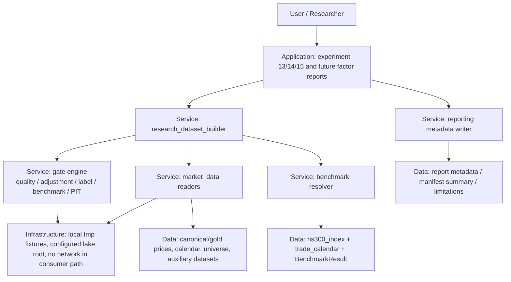

核心能力边界：

| 能力 | 负责模块 | 输入 | 输出 | 禁止事项 |
|---|---|---|---|---|
| `research_input_v1` 合同 | `engine/research_dataset.py` / report metadata helpers | Research request、market_data reader result、BenchmarkResult | `ResearchDataset.metadata`、gate result、known limitations | 不触发 fetch/backfill，不读旧 `data/**` |
| proxy / real benchmark 隔离 | experiments/reporting + `market_data/benchmarks.py` | `BenchmarkResult`、proxy baseline | `proxy_*` 与 `hs300_*` 分离字段 | 不用 proxy 填充真实 hs300 字段 |
| 质量 / 复权 / label gate | gate engine in builder | prices, calendar, request horizon, adjustment policy | fail / warn / available gate result | 不混用复权，不静默保留 label 不足样本 |
| PIT / fixed universe 声明 | `engine/universe.py` 或 builder helper | index_members / stock_basic readiness | universe metadata、survivorship note | 不把 fixed snapshot 标为 PIT |
| 因子辅助数据合同 | builder + experiment 15 adapter | tradability, OHLCV, industry, market_cap, liquidity, style data | auxiliary availability matrix | 不声明未控制的行业 / 市值 / 风格中性结论 |

### 25.5 高层模块与职责划分

| 模块 | 职责 | 主要输入 | 主要输出 | 边界 |
|---|---|---|---|---|
| Research Input Contract | 定义 `ResearchDatasetRequest` / `ResearchDataset` / `GateResult` 字段集和报告 metadata 必填项 | HLD/ADR、CR008、CR007 contracts | typed request/result、metadata schema | 不实现数据生产 |
| Benchmark Field Isolation | 将 `benchmark_total_return` / `excess_return` 历史模糊字段迁移为 `proxy_*` 与 `hs300_*` 或明确 metadata | BenchmarkResult、proxy_baseline | 报告字段、CSV/Markdown 命名规则 | 不改变 hs300 数据生产 |
| Research Dataset Builder | 统一读取 prices/calendar/universe/benchmark/tradability/auxiliary 数据并聚合 gate result | `market_data.readers`、BenchmarkResult、request | `ResearchDataset` | 不导入 connector/runtime/storage |
| Gate Engine | 统一执行 quality、adjustment、label window、benchmark、PIT gate | ResearchDataset intermediate | fail/warn/pass、issues、known limitations | 不自动降级到旧数据 |
| Universe Consumer Contract | 明确 `universe_mode=fixed_snapshot|pit|missing`、`is_pit_universe`、`pit_status`、幸存者偏差说明 | index_members/readiness | universe metadata | PIT 不完整不得 available |
| Factor Auxiliary Contract | 为实验十五和未来因子研究声明可交易性、OHLCV/VWAP、行业、市值、流动性、风格暴露可用性 | auxiliary datasets/readiness | availability matrix、allowed claims | 缺数据时阻断对应结论 |

### 25.6 技术选型与理由

| 选型 | 结论 | 理由 |
|---|---|---|
| 核心数据层 | 保留 `market_data` canonical/gold | CR008 问题是消费侧合同与报告语义，不是存储框架替换 |
| 研究入口落点 | `engine/research_dataset.py` | `engine` 是自研研究主路径；builder 可统一服务实验和未来 adapter |
| Benchmark 口径 | `hs300_*` 与 `proxy_*` 字段隔离 | 直接消除代理被误读为真实指数超额收益的风险 |
| Gate 表达 | typed `GateResult` / `known_limitations` | 便于报告、测试和 QA 统一断言 |
| 因子辅助数据 | P1 合同先行，真实数据后续 CR | 避免在 CR008 默认批次扩大真实数据生产授权 |
| 外部框架 | Backtrader/Qlib/VectorBT 作为后续消费端 | 保持事实源在 canonical/gold，不让外部格式成为唯一真相 |

### 25.7 关键流程

1. `build_research_request`：实验入口构造 `ResearchDatasetRequest`，显式传入 start/end、universe、universe_mode、benchmark_policy、adjustment_policy、forward_return_horizon 和辅助数据要求。
2. `load_canonical_inputs`：builder 只读 `market_data.readers` 和 benchmark resolver，读取 prices、calendar、benchmark、universe、tradability 和 auxiliary 数据；缺失返回 typed missing，不触发 backfill。
3. `evaluate_gates`：依次执行 quality、adjustment、label window、benchmark、PIT/universe、tradability/auxiliary gate，形成 `GateResult`。
4. `materialize_research_dataset`：当 gate 通过或允许探索降级时输出 `ResearchDataset`；严肃研究条件不满足时结构化失败。
5. `write_report_metadata`：新报告写入 `research_input_v1` metadata、coverage、benchmark、universe、label window、adjustment、known limitations 和 allowed claims。
6. `adapt_experiment_15`：因子面板和策略回测消费 `ResearchDataset`，缺行业 / 市值 / 可交易性 / 风格暴露时阻断相应中性化、容量或纯 alpha 结论。

### 25.8 前置校验与失败路径

| 阶段 | 前置条件 | 失败路径 | 可降级条件 |
|---|---|---|---|
| research input metadata | 新报告入口声明 `research_input_v1` | metadata 缺必填字段时报告生成失败 | 历史报告保留为 legacy，不回写 |
| benchmark field isolation | CR007-S02 或等价 BenchmarkResult 合同可用 | 真实 benchmark missing 时 `hs300_*` 输出为 0 | 可输出 `proxy_*`，但必须标明非真实沪深300 |
| builder 只读加载 | lake root 显式配置或 tmp fixture；reader contract 可用 | reader missing / quality failed 返回 typed failure | 探索模式可 warn，但不得声明严肃研究结论 |
| label window gate | `forward_return_horizon` 与价格可用终点可计算 | label 不足时 fail 或显式截断并写 `label_available_end` | 探索模式允许截断，但 metadata 必填 |
| PIT universe gate | 请求严肃 PIT 时 PIT 数据可用且 as-of pass | PIT 不可用时 fail | 探索模式可 fixed snapshot，但必须写幸存者偏差 |
| auxiliary claims gate | 报告声明行业 / 市值 / 风格中性或容量结论 | 缺对应数据时禁止该结论 | 可输出原始因子表现或 close-only 框架验证 |

### 25.9 非功能需求设计

| 维度 | 设计 | 验收口径 |
|---|---|---|
| 安全 | research builder 消费路径禁止联网、禁止 connector/runtime/storage import、禁止凭据读取 | forbidden import / credential / network 操作次数为 0 |
| 可用性 | 支持探索模式和严肃研究模式，二者在 metadata 中明确 | `analysis_mode` / `universe_mode` / `benchmark_status` 字段可断言 |
| 可维护性 | `research_input_v1` 为单一报告字段事实源 | 新报告 metadata 必填字段覆盖率 100% |
| 可扩展性 | auxiliary availability matrix 可添加行业、市值、风格暴露等数据 | 新 auxiliary dataset 不改变 builder 主接口 |
| 可测试性 | 使用 tmp parquet、tmp lake、monkeypatch reader / BenchmarkResult fixture | CR008 测试不需要 token、NAS、真实 lake 或旧数据 |
| 可追溯性 | coverage、source_run_id、lineage、quality/readiness 与 known limitations 必填 | 报告能追溯到 reader/catalog/BenchmarkResult |

### 25.10 主要风险与应对

| 风险 | 级别 | 影响 | 缓解 |
|---|---|---|---|
| builder 变成隐式补数入口 | 高 | 破坏离线研究边界和凭据安全 | ADR-026 强制只读；Story forbidden import / no-network 测试 |
| proxy 字段继续被误读为真实 benchmark | 高 | 研究报告结论错误 | ADR-025 强制 `proxy_*` / `hs300_*` 隔离；缺真实 benchmark 时 hs300 输出为 0 |
| fixed snapshot 被误称 PIT | 高 | 幸存者偏差污染因子结论 | ADR-027 强制 `universe_mode`、`pit_status`、`survivorship_bias_note` |
| label window 不足仍进入因子回测 | 高 | 末端样本未来收益缺失 | ADR-028 强制 `label_available_end` 和 fail / truncation 策略 |
| 行业 / 市值 / 可交易性缺失仍声明中性化或真实可成交 | 中高 | 因子归因和容量结论失真 | ADR-029 禁止对应 claims，S06 输出 availability matrix |
| CR007-S04/S05 提前实现导致返工 | 中 | 报告字段和文档口径冲突 | 本节要求 S04/S05 hold 到 CR008 CP3/CP4 设计确认 |

### 25.11 ADR 候选决策点

| ADR | 决策点 | 推荐结论 | 回写位置 |
|---|---|---|---|
| ADR-024 | `research_input_v1` 是否作为唯一新研究入口与报告 metadata 合同 | 是；新报告必须写入 research input metadata，不得绕过 | §25.4、§25.5、CR008-S01 |
| ADR-025 | proxy benchmark 与真实 benchmark 字段是否强隔离 | 是；proxy 只能写 `proxy_*` / `proxy_baseline`，真实 benchmark 只写 `hs300_*` | §25.3、§25.7、CR008-S02 |
| ADR-026 | `research_dataset_builder` 是否只读 canonical/gold | 是；只消费 reader/resolver，不触发 fetch/backfill | §25.4、§25.8、CR008-S03 |
| ADR-027 | PIT / fixed universe 声明规则 | 严肃研究要求 PIT；fixed snapshot 只能探索并写幸存者偏差 | §25.8、CR008-S05 |
| ADR-028 | quality / adjustment / label window gate | 质量失败、复权混用、label window 不足必须 fail 或结构化截断 | §25.8、CR008-S04 |
| ADR-029 | 因子辅助数据缺失时的 allowed claims | 缺行业、市值、可交易性、流动性、风格暴露时禁止对应严肃结论 | §25.5、CR008-S06 |

### 25.12 分阶段落地与工作量

| 批次 / 阶段 | Story | 内容 | 粗估 |
|---|---|---|---|
| CR008-BATCH-A / S01 | CR008-S01-research-input-contract-and-report-metadata | `research_input_v1`、报告 metadata 必填字段、legacy report 边界 | M |
| CR008-BATCH-A / S02 | CR008-S02-proxy-real-benchmark-field-separation | `proxy_*` / `hs300_*` 字段隔离，实验报告不再混用 benchmark | M |
| CR008-BATCH-A / S03 | CR008-S03-research-dataset-builder | `engine/research_dataset.py` 统一研究数据构建入口 | L |
| CR008-BATCH-A / S04 | CR008-S04-quality-adjustment-label-window-gates | quality、复权、label window gate 与结构化失败 / 截断 | M/L |
| CR008-BATCH-A / S05 | CR008-S05-pit-universe-consumption-contract | PIT / fixed snapshot universe 消费合同与幸存者偏差披露 | M |
| CR008-BATCH-A / S06 | CR008-S06-factor-research-auxiliary-data-contract | 因子研究辅助数据 availability matrix 与缺失降级语义 | M |

Story 数为 6，Wave / LLD 批次为 1 个 `CR008-BATCH-A`；该数量必须与 `process/STORY-BACKLOG.md` 和 `process/DEVELOPMENT-PLAN.yaml` 保持一致。CR008 全部目标 Story 的 LLD 必须统一进入 CP5 批次确认，不得只为当前 Wave 子集确认。

### 25.13 Gotchas

| Gotcha | 规避方式 |
|---|---|
| 把 `benchmark_total_return` 继续解释为真实沪深300 | 新报告字段必须改为 `proxy_*` 或 `hs300_*`，metadata 写 `benchmark_kind` |
| 把 `quality_status=pass` 当作 PIT 可用 | quality、readiness、pit_status 分离；PIT 不完整不得 `is_pit_universe=true` |
| `stock_basic` 当前快照被当作历史可得性证明 | `stock_basic` 只能支持上市 / 退市状态说明，缺 `available_at` 时不得 PIT |
| label window 不足仍计算 forward return | gate 计算 `label_available_end`；不足时 fail 或显式截断并披露 |
| 因子报告写“行业中性 / 市值中性 / 纯 alpha”但没有辅助数据 | S06 allowed claims gate 禁止对应结论 |
| builder 顺手调用 Tushare 或读取旧 `data/**` | Story forbidden path 和静态 import / path scan 必须覆盖 |

### 25.14 CP3/CP4/CP5 门控建议与开放问题

| 类型 | 建议 |
|---|---|
| CP3 | 需要发起 CR-008 HLD/ADR 人工确认。重点审查 CR008 是否作为研究消费侧优先口径、是否接受 `research_input_v1`、proxy/real 字段隔离、PIT/fixed 声明、label/复权/quality gate 和辅助数据缺失降级 |
| CP4 | 需要发起 CR-008 Story Plan 人工确认。重点审查 `CR008-BATCH-A` 六 Story、与 CR007-S02/S03/S04/S05 的依赖和 hold 边界、文件所有权、LLD 全量批次和 dev gate |
| CP5 | `CR008-BATCH-A` 必须覆盖全部六个 Story 的 LLD，全部 CP5 自动预检完成并统一人工确认后才可实现 |

| 问题 ID | 问题 | 状态 | 影响 | 决策人 |
|---|---|---|---|---|
| CR8-Q1 | 严肃研究模式是否强制 PIT universe | OPEN；默认强制，探索模式可 fixed snapshot + survivorship warning | 影响 S05 和实验十五报告措辞 | 用户 / meta-se |
| CR8-Q2 | 缺真实 benchmark 时是否允许继续生成 proxy 报告 | OPEN；默认允许探索 proxy，但所有真实 `hs300_*` 输出为 0 | 影响 S02 与 CR007-S04 修订 | 用户 |
| CR8-Q3 | label window 不足时 fail fast 还是截断样本 | OPEN；默认严肃研究 fail，探索模式允许截断并写 `label_available_end` | 影响 S04 | 用户 / meta-qa |
| CR8-Q4 | 因子辅助数据 P1 是否全部纳入 CR008-BATCH-A LLD | OPEN；默认 S06 只定义合同和缺失降级，不授权真实数据生产 | 影响 S06 工作量 | 用户 / meta-se |
| CR8-Q5 | Qlib exporter 是否进入本批次 | OPEN；默认不进入，作为后续 CR | 影响外部框架适配路线 | 用户 |
| CR8-Q6 | 是否允许 CR007-S04/S05 在 CR008 CP3/CP4 前继续实现 | OPEN；默认不允许，保持 hold | 影响 CR007 当前实现队列 | meta-po / 用户 |

## 26. CR-010 与生产级数据湖 HLD 的关系

CR-010 将数据生产能力从本 HLD 中拆出为 companion HLD：`process/HLD-DATA-LAKE.md`。本 HLD 继续作为本地日频研究 / 回测框架主 HLD，负责消费面、研究口径和报告声明；数据湖 HLD 负责生产面、外置 lake、真实源回补、质量事实与 publish 门控。

### 26.1 职责所有权

| 职责 | 主 HLD `process/HLD.md` | 数据湖 HLD `process/HLD-DATA-LAKE.md` |
|---|---|---|
| engine / scanner / reports | 拥有；只读消费数据湖 current truth 或结构化缺失结果 | 不拥有 |
| experiments | 拥有；默认 `realism_mode=exploratory`，显式 `production_strict` 才启用硬门 | 不拥有实验业务逻辑 |
| Backtrader / VectorBT clean feed | 拥有 adapter 与 clean feed 消费边界；不得联网或触发 backfill | 只提供 canonical/gold/catalog/readiness 输入 |
| connector / provider SDK | 不拥有；不得由 consumer 导入 | 拥有；真实源只允许生产 CLI 显式启用 |
| runtime / storage / raw / manifest | 不拥有；consumer 不读取 raw/manifest 作为运行输入 | 拥有；raw/manifest 仅用于审计、恢复、replay 和 lineage |
| normalization / validation / quality truth | 只消费结果和 readiness metadata | 拥有；validate 不自动成为 current truth，必须 publish |
| catalog publish | 只读已 publish 的 current truth | 拥有 publish gate、current truth、known limitations 和 lineage |
| W3 PIT / 交易状态 / 涨跌停 / events | 只执行 fail-fast 或 limitation，不伪造可用 | 拥有 source/interface 确认前的 required_missing / unresolved 契约 |

### 26.2 集成契约

| 调用方向 | 调用时机 | 输入契约 | 输出契约 | 降级策略 |
|---|---|---|---|---|
| 数据湖生产 CLI -> 外置 lake | 用户显式执行 plan/run/normalize/validate/publish/revalidate/replay | `MARKET_DATA_LAKE_ROOT`、dataset、source/interface、date range、run_id、batch_id、显式真实源授权 | raw/manifest/canonical/quality/catalog/gold 与 readiness report | plan 默认 dry-run；真实 source 缺授权 fail-fast |
| engine / experiments -> `market_data.readers` | 回测或实验启动时 | 已 publish catalog current truth、realism mode、date range、symbols/universe、quality policy | DataFrame、metadata、known limitations、allowed/blocked claims、remediation spec | exploratory 可消费 warn 或 fixed snapshot；production_strict 缺 PIT/benchmark/复权/W3/quality 时 fail |
| Backtrader / VectorBT adapter -> clean feed reader | 显式选择 optional backend 或扫描加速器时 | quality pass 的 clean OHLCV/factor/score feed、benchmark result | 内存 feed bundle 与 lineage metadata | 后端不可用或数据缺口返回 typed unavailable，不触发补数 |

### 26.3 日频价格与可用时点

CR-010 采用用户确认的 D11 口径：`trade_date=T` 的日频 `close/adjusted_close` 是 T 日收盘后形成的事实。T 日开盘前决策只能使用 T-1 及更早已形成数据；T 日收盘后可以使用 T 日 close 生成 T+1 信号。事件数据不适用日期推导，必须提供 explicit `available_at`，缺失时不得进入决策。

### 26.4 真实性模式

| 模式 | 适用范围 | 允许 | 阻断 |
|---|---|---|---|
| `exploratory` | 16 个 experiments 的短期默认复验 | quality warn、fixed snapshot、缺 W3 继续实验，但必须写 limitation | 事件缺 `available_at`、把 proxy 说成真实 benchmark、声明 PIT/真实可交易等强结论 |
| `production_strict` | 生产验收和正式研究声明 | 仅消费 quality pass、PIT/benchmark/复权/readiness 证据齐全的数据 | 缺 PIT、缺真实 benchmark、缺复权、quality fail/warn 未豁免、事件缺 `available_at`、交易状态或涨跌停缺失 |

### 26.5 迁出说明

原 §21-§25 中关于 `market_data/` 的生产职责仍保留为历史追溯基线，但 CR-010 之后的当前事实以 `process/HLD-DATA-LAKE.md` 为准。主 HLD 不再新增 connector/runtime/storage/backfill/publish 设计细节；后续对数据湖生产链路的结构性变更必须优先修改 companion HLD，并在本 HLD 仅同步消费契约影响。

## 27. CR-011 因子研究生产级数据补齐增量设计

> 本节是 CR-011 的 solution-design 增量。它保留 `reports/experiment_17_21/factor_strategy_report.md` 的旧实验基线，不覆盖旧报告、不改变既有阶段性结论；CR-011 只定义把该结论从“fixed snapshot + proxy benchmark + close execution proxy”升级到生产级因子研究所需的数据、研究消费、审计和验证合同。本节不授权 LLD、代码实现、真实联网、真实 lake 写入、旧 `data/**` 读取/比对、凭据读取或报告覆盖。

### 27.1 问题定义

**问题陈述**：实验 17-21 已筛出 `volatility_20d`、`rsi_14`、`max_drawdown_20d`、`reversal_5d` 四类更稳定因子，并形成“低波动 + 低 RSI + 小回撤 + 短期反转组合相对趋势/追涨因子更稳定”的探索结论。但该结论仍受真实 benchmark 缺失、固定快照股票池、可交易性缺口、close 执行价代理、复权审计不足、行业/市值/风格暴露缺失、容量成本未分层和 factor panel 审计不完整的限制。CR-011 要把这些限制转化为显式数据合同、研究门禁和稳健性验证，而不是在报告中继续以文字限制兜底。

| 类别 | 目标 / 可度量成功标准 |
|---|---|
| 真实 benchmark | 新版实验 17-21 消费结果必须同时输出 `benchmark_policy_id`、`benchmark_kind`、`hs300_available`、`hs300_coverage_ratio`、`proxy_baseline_used`、`benchmark_missing_reason` 6 个字段；代理 benchmark 写入真实 `hs300_*` 字段的次数为 0 |
| PIT universe | production_strict 因子研究必须要求 `universe_mode=pit`、`is_pit_universe=true`、`pit_status=pass`、`as_of_join_violation_count=0`；fixed snapshot 只能进入 exploratory 并写入 `survivorship_bias_note` |
| 可交易性 | 停牌、涨跌停、ST、无成交、上市天数和事件状态 6 类 gate 均有 `available / required_missing / blocked` 结构化结果；production_strict 缺任一 P0 gate 时通过次数为 0 |
| 执行价 / VWAP | `execution_price_policy` 只允许 `open`、`close`、`vwap`、`close_proxy` 四值；选择 `close_proxy` 时 `execution_degradation_reason` 必填，且真实可成交 / VWAP 成交声明输出次数为 0 |
| 复权审计 | `adjustment_policy`、`adj_factor_lineage`、`corporate_action_status`、`adjustment_audit_status` 4 个字段进入研究 metadata；复权口径混用进入因子计算的次数为 0 |
| 暴露控制 | 行业、市值、流通市值、beta/style exposure 4 类 availability 进入报告；缺数据时行业中性、市值中性、风格中性和 pure alpha 声明输出次数为 0 |
| 流动性 / 容量 / 成本 | 成本敏感性固定输出 4 档成本网格 `[0, 5, 10, 20]` bps；容量结果固定包含成交额占比、换手、持仓数量、样本损失、成本侵蚀 5 类字段 |
| 因子审计 / 稳健性 | factor panel 落盘必须覆盖 raw、directional、winsorized、zscore 4 个阶段；稳健性报告固定输出 rolling、年度、市场状态、参数敏感性、成本敏感性 5 个验证视图 |

**价值**：CR-011 不试图把探索结论直接包装成生产结论，而是建立可审计升级路径：旧实验 17-21 报告继续作为 fixed/proxy/close baseline，新版本只有在 benchmark、PIT、交易约束、复权、暴露、容量和因子审计门禁满足时，才允许声明更强结论。

### 27.2 约束、非目标与假设

| 类型 | 内容 |
|---|---|
| 约束 | 研究消费层继续只读 `market_data` readers / catalog / gold / typed remediation；不得导入 connector/runtime/storage/provider SDK，不读取 `.env` 或 token，不触发 backfill |
| 约束 | CR-011 默认只做设计和后续离线实现规划；真实联网、真实 Tushare 抓取、真实 lake 写入、旧 `data/**` 操作和旧报告覆盖均需用户另行显式授权 |
| 约束 | 旧 `reports/experiment_17_21/factor_strategy_report.md` 是旧基线，不得被 CR-011 直接覆盖；新报告应输出到新目录或版本化路径 |
| 非目标 | 不引入 Qlib / LEAN / Zipline / vn.py / NautilusTrader 作为主研究框架；CR-011 只扩展当前轻量研究链路和可选后端边界 |
| 非目标 | 不以 `index_weights`、`stock_basic` 当前快照或行业当前快照证明 PIT universe 或 PIT exposure |
| 非目标 | 不实现分钟级撮合、订单簿、实盘交易系统或自动调度服务 |
| 假设 | CR-010 DL-BATCH-A verified 的 P0 catalog/readiness/publish gate 可作为 CR-011 数据合同基础；CR010-DL-BATCH-B/QF-BATCH-C 的 W3/realism 合同仍是后续 dev gate |
| 假设 | CR-008 已验证的 `research_input_v1`、proxy/real benchmark 字段隔离、builder 只读、quality/adjustment/label gate、PIT/fixed 和 allowed claims 是 CR-011 的上游消费基线 |

### 27.3 候选架构方案对比

| 方案 | 核心思路 | 优点 | 缺点 | 复杂度 / 成本 | 扩展性 | 风险 | 适用前提 |
|---|---|---|---|---|---|---|---|
| CR11-A：复用数据湖 current truth + 研究门禁 + factor audit pipeline（推荐） | 数据生产契约写入 companion HLD；主 HLD 扩展 `research_input_v1`、实验 17-21 消费、容量成本和稳健性报告；缺数据用 typed missing / blocked claims | 边界清晰；复用 CR-008/CR-010；旧报告可追溯；每类严肃结论都有机器可验证门禁 | Story 数较多，必须严格分批 CP5；部分 W3/source 仍可能长期 unavailable | high / 中高 | 高 | 上游 CR010 B/C 未完成时 dev gate 会阻塞 | 用户接受先合同与审计，再逐步真实数据补齐 |
| CR11-B：直接改实验 17-21 脚本并在报告里追加限制项 | 在当前实验脚本中直接读取可用字段，缺失时继续 close/proxy/fixed 跑通 | 初始改动少，短期可快速产出新版报告 | 容易绕过数据湖 publish/readiness；无法证明 PIT、可交易性和复权审计；报告结论仍靠人工解释 | medium / 中 | 低 | proxy/PIT/执行价误读风险高 | 只适合一次性探索，不适合生产级研究输入 |
| CR11-C：引入完整量化研究平台或风险模型体系 | 使用 Qlib/Barra-like risk model/完整 portfolio analytics 接管因子研究 | 长期能力强，支持更复杂风险归因 | 超出当前轻量工具目标；依赖、学习和数据治理成本高；会稀释 CR-010 数据湖边界 | very-high / 高 | 高 | 大量返工和平台适配风险 | 用户明确转向平台级量化研究系统 |

**推荐**：CR11-A。该方案延续 CR-008 的研究消费防线和 CR-010 的生产级数据湖边界，把“是否可声明某个研究结论”变成字段、门禁和报告合同，而不是依赖人工阅读限制项。

### 27.4 推荐方案总览与架构图

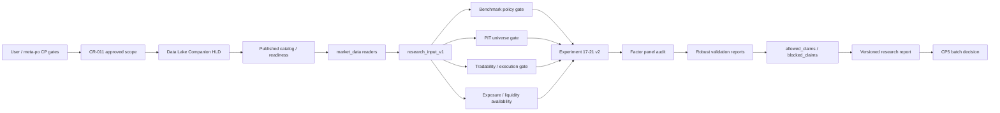

| 模块 | 职责 | 输入 | 输出 | 边界 |
|---|---|---|---|---|
| Benchmark Policy Consumer | 读取真实 `hs300_index` 与 policy metadata，区分价格指数、收益指数和 proxy baseline | catalog current truth、benchmark resolver、实验日期范围 | `BenchmarkPolicyResult`、coverage、missing reason、allowed claims | 不自动补 benchmark，不用 proxy 填充 `hs300_*` |
| PIT Universe Consumer | 基于 `index_members` / `index_weights` / `stock_basic` readiness 做 as-of 股票池与生命周期门禁 | PIT reader、effective/available date、上市退市状态 | as-of universe、survivorship note、PIT gate result | `index_weights` 不替代完整 membership；snapshot 不证明 PIT |
| Tradability / Execution Gate | 合并停牌、涨跌停、ST、无成交、上市天数、事件状态和执行价 policy | W3 readers、OHLCV/VWAP、portfolio request | gate matrix、blocked trades、execution degradation | close proxy 只能作为降级，不能声明真实 VWAP |
| Adjustment Audit Consumer | 读取 `adj_factor` lineage 和公司行动状态，校验因子与收益使用同一复权口径 | prices / adj_factor / corporate action status | adjustment audit report、metadata | 公司行动缺失时只声明“已复权价格”，不得声明可审计公司行动链 |
| Exposure Availability Layer | 暴露行业、市值、流通市值、beta/style availability 和 neutralization claims | industry/cap/style readers | exposure matrix availability、blocked neutralization claims | 缺 PIT exposure 时不允许行业/市值/风格中性结论 |
| Capacity / Cost Sensitivity Layer | 按成交额、换手、持仓数和成本网格评估容量与成本侵蚀 | amount/volume/turnover、portfolio trades、cost grid | capacity report、cost sensitivity report | 无流动性数据时不得声明容量 |
| Factor Panel Audit | 版本化保存 raw/directional/winsorized/zscore panel 和 preprocessing summary | research dataset、factor definitions | audited factor panels、schema metadata | 不覆盖旧实验 17-21 报告和旧 CSV |
| Robust Validation | rolling、年度、市场状态、参数、成本五类稳健性验证 | factor panel、strategy result、market state labels | robust validation report、allowed/blocked claims | 不把探索样本内结论升级为生产结论 |

### 27.5 集成契约

| 调用方向 | 调用时机 | 输入契约 | 输出契约 | 错误 / 降级 |
|---|---|---|---|---|
| `experiments/run_experiment_17_21_factor_suite.py` -> `engine/research_dataset.py` | 新版实验启动时 | `research_input_v1`、date range、factor list、`realism_mode`、execution policy、cost grid | `ResearchDataset`、metadata、availability matrix、allowed/blocked claims | 缺 P0 数据时 production_strict fail；exploratory 可运行但写 limitation |
| `engine/research_dataset.py` -> `market_data.readers` | 组装研究输入时 | published catalog、dataset/readiness、quality policy | DataFrame bundle、lineage、known limitations、typed remediation | reader 不触发 backfill；`auto_execute=false` |
| Benchmark policy -> report builder | 输出 benchmark 相关指标时 | `BenchmarkPolicyResult`、proxy result、coverage | `hs300_*` 或 `proxy_*` 分离字段 | 缺真实 benchmark 时 `hs300_*` 输出 0 行 / null 字段，proxy 只能写 proxy |
| Tradability / execution gate -> portfolio | 生成成交和收益时 | gate matrix、execution price policy、OHLCV/VWAP availability | executable trade set、blocked reason、execution degradation | VWAP 缺失可降级 `close_proxy`，但 blocked claims 必须同步 |
| Factor panel audit -> robust validation | 因子预处理完成后 | raw/directional/winsorized/zscore panel、preprocessing metadata | panel manifest、validation inputs | panel 缺阶段或 schema 不一致时 robust validation fail |

### 27.6 关键流程

1. 读取旧实验 17-21 metadata，将旧结论标记为 `baseline_scope=fixed_snapshot_proxy_close`，不覆盖原报告。
2. 通过 `research_input_v1` 请求真实 benchmark、PIT universe、tradability、execution price、adjustment、exposure、liquidity 和 cost inputs。
3. 对每个输入生成 availability matrix；production_strict 下任一 P0 gate 缺失即 fail，exploratory 下运行并写 `known_limitations` 与 `blocked_claims`。
4. 执行因子计算，保存 raw / directional / winsorized / zscore 四阶段 panel 与 preprocessing summary。
5. 执行单因子、多因子和策略化回测；执行价若为 close proxy，则报告必须写明降级，不输出真实可成交或 VWAP 声明。
6. 输出 rolling、年度、市场状态、参数敏感性和成本敏感性五类稳健性结果。
7. 生成版本化研究报告，将旧 baseline 与新结果并列展示，结论只从 `allowed_claims` 中产生。

### 27.7 前置校验与失败路径

| 阶段 | 前置条件 | 失败行为 | 回退 / 降级 |
|---|---|---|---|
| benchmark consumption | `hs300_index` publish current truth 或明确 missing result | production_strict fail；exploratory 使用 proxy 并写 limitation | 回退到 CR011-S01 / CR010-S03 数据合同 |
| PIT universe | `index_members` PIT readiness pass，生命周期字段可 as-of | production_strict fail；fixed snapshot 仅 exploratory | 回退到 CR011-S02 / CR010-S04/S06 |
| tradability gate | trade_status、prices_limit、events gate 可解析 | 缺 P0 gate 时 production_strict fail | exploratory 写 blocked claims，不声明真实可成交 |
| execution price | 请求的 execution policy 有对应 OHLCV/VWAP 字段 | VWAP/open 缺失时 fail 或显式 `close_proxy` 降级 | 降级后阻断 VWAP / 真实成交声明 |
| adjustment audit | 价格、收益、因子输入使用同一 `adjustment_policy` | 复权混用 fail | 缺公司行动 lineage 时只允许“已复权价格”声明 |
| exposure / capacity | 行业、市值、风格、流动性 availability 可解析 | 缺数据时 blocked claims | 不做中性化 / pure alpha / 容量结论 |
| factor panel audit | 4 阶段 panel 和 schema metadata 齐全 | robust validation fail | 回退到 factor panel 生成阶段 |

### 27.8 非功能需求设计

| 维度 | 设计 | 验收口径 |
|---|---|---|
| 安全 | 研究消费层只读，不触发真实源、不读取凭据 | consumer 导入 connector/runtime/storage/provider SDK 的次数为 0 |
| 可追溯 | 每个新版报告写 source_run_id、catalog entry、quality/readiness、panel manifest | 报告中 8 类 CR-011 输入均有 lineage 或 missing reason |
| 可维护 | 八个 Story 分文件所有权，shared 文件指定 merge_owner | CP4 文件冲突未处理项为 0 |
| 可验证 | 每类门禁都有 fixture/offline 测试入口 | CP5 前全部 LLD 必须列出验证入口和关键场景 |
| 可扩展 | 行业、市值、风格、成本模型作为 availability contract 扩展 | 缺数据时 blocked claims 语义不变 |

### 27.9 主要风险与应对

| 风险 | 级别 | 影响 | 缓解 |
|---|---|---|---|
| 旧实验结论被误读为生产级结论 | 高 | 用户决策基于不完整数据 | 报告强制写 `baseline_scope` 和 `allowed_claims`；旧报告不覆盖 |
| `proxy_baseline` 再次混入真实 benchmark 字段 | 高 | 超额收益错误 | ADR-036 强制字段隔离；S01 测试覆盖 proxy 写入 `hs300_*` 次数为 0 |
| fixed snapshot 被当作 PIT | 高 | 幸存者偏差 | ADR-037 强制 PIT gate；S02 约束 `index_weights` / `stock_basic` 不替代 membership |
| VWAP 缺失时 close proxy 被当作真实执行价 | 中高 | 可交易性和成本估计失真 | ADR-039 强制 `execution_degradation_reason` 与 blocked claims |
| 行业/市值/风格数据非 PIT | 中高 | 中性化结论存在未来函数 | ADR-041 要求 effective/available_at；缺 PIT exposure 阻断中性化 |
| 容量成本参数被过拟合 | 中 | 策略表现失真 | 固定成本网格与 sensitivity report，不用单一成本点声明稳健 |
| factor panel 审计面板覆盖不全 | 中 | 无法复现实验结论 | ADR-043 要求四阶段 panel 与 manifest |

### 27.10 ADR 候选决策点

| ADR | 决策 | 回写对象 |
|---|---|---|
| ADR-036 | benchmark policy consumption：真实 `hs300_index` 与 proxy baseline 分离消费 | CR011-S01、实验 17-21 v2 report |
| ADR-037 | PIT universe 与股票生命周期 as-of gate | CR011-S02、universe reader |
| ADR-038 | tradability gates：停牌、涨跌停、ST、无成交、上市天数、事件状态 | CR011-S03、portfolio gate |
| ADR-039 | execution price / VWAP degradation policy | CR011-S04、portfolio/execution metadata |
| ADR-040 | adjustment 与 corporate action audit | CR011-S05、factor return input |
| ADR-041 | industry / market cap / style exposure availability 与 blocked claims | CR011-S06、neutralization report |
| ADR-042 | liquidity / capacity / cost sensitivity | CR011-S07、capacity report |
| ADR-043 | factor panel audit 与 robust validation | CR011-S08、versioned research report |

### 27.11 分阶段落地与工作量

| 批次 / 阶段 | Story | 内容 | 粗估 |
|---|---|---|---|
| CR011-DATA-BATCH-A | CR011-S01..S06 | benchmark、PIT、tradability、execution price、adjustment、exposure 六类数据与消费合同 | L |
| CR011-RESEARCH-BATCH-B | CR011-S07 | 流动性、容量和成本敏感性研究能力 | M |
| CR011-VALIDATION-BATCH-C | CR011-S08 | factor panel audit、rolling/annual/market-state/parameter/cost robust validation 与新版报告 | L |

Story 数为 8，LLD 批次为 3 个；该数量必须与 `process/STORY-BACKLOG.md`、`process/DEVELOPMENT-PLAN.yaml` 和 CR-011 CP4 自动预检保持一致。全部 CR011 Story 的 LLD 必须按批次全量完成 CP5 自动预检和人工确认后，才允许对应批次进入实现。

### 27.12 Gotchas

| Gotcha | 规避方式 |
|---|---|
| 把 CR-011 新报告覆盖旧 `reports/experiment_17_21/factor_strategy_report.md` | Story forbidden path 禁止覆盖旧报告；新版输出必须版本化 |
| `index_weights` 有数据就声称 PIT universe | S02 强制 membership/readiness；`index_weights` 只能辅助权重，不证明完整成员集 |
| VWAP 缺失时继续输出真实可成交结论 | S04 必须写 `close_proxy` 降级和 blocked claims |
| 公司行动数据缺失时声称复权链路可审计 | S05 区分“已使用复权价格”和“公司行动链路可审计” |
| 行业、市值、风格暴露用当前快照补历史 | S06 要求 effective/available_at；缺 PIT exposure 阻断中性化结论 |
| 只看单一成本假设 | S07 固定四档成本网格并输出 cost sensitivity |
| 只保留最终 zscore 面板 | S08 要求 raw/directional/winsorized/zscore 四阶段 panel |

### 27.13 CP3/CP4/CP5 门控建议与开放问题

| 门控 | 建议 |
|---|---|
| CP3 | 需要发起 CR-011 HLD/ADR 人工确认。重点审查旧实验基线保留、双 HLD 职责、ADR-036..043、production_strict / exploratory 边界、真实数据授权边界 |
| CP4 | 需要发起 CR-011 Story Plan 自动预检并由 meta-po 汇入 CP5。重点审查 CR011-S01..S08、三类 LLD 批次、依赖类型、文件所有权、dev_gate 和旧报告 forbidden path |
| CP5 | `CR011-DATA-BATCH-A`、`CR011-RESEARCH-BATCH-B`、`CR011-VALIDATION-BATCH-C` 分别全量 LLD、自动预检和人工确认；批次 CP5 approved 前不得实现 |

| ID | 问题 | 状态 | 默认处理 | 影响范围 | 决策人 |
|---|---|---|---|---|---|
| CR11-Q1 | 是否接受旧实验 17-21 报告仅作为 baseline，不覆盖原文件 | OPEN | 默认接受，新报告版本化输出 | 报告路径、验收方式 | 用户 / meta-po |
| CR11-Q2 | 是否接受 production_strict 缺任一 P0 gate 时 fail，而非自动降级 | OPEN | 默认接受；exploratory 才允许 limitation | 实验运行模式、报告声明 | 用户 |
| CR11-Q3 | 是否接受 `close_proxy` 只能作为执行价降级，不能声明 VWAP 或真实成交 | OPEN | 默认接受 | 策略回测解释、容量成本 | 用户 / meta-se |
| CR11-Q4 | 行业/市值/风格数据未确认 source/interface 前是否只输出 blocked claims | OPEN | 默认接受，不伪造 exposure | 中性化、pure alpha 声明 | 用户 |
| CR11-Q5 | 是否授权后续真实数据补齐执行 | OPEN | 本轮不授权，只做设计与计划 | 真实联网、真实 lake 写入 | 用户 |

## 28. CR-012 Limited Window Readiness 审计与研究声明边界

> 本节是 CR-012 的研究消费侧增量。它不改变 CR-011 已验证的消费能力；只修正 limited-window readiness audit 结果如何被研究报告、README 和用户手册解释。本节不授权真实 lake 复验、真实补数、provider fetch、凭据读取、旧 `data/**` 读取或旧报告覆盖。

### 28.1 问题定义

CR-010 的 limited-window historical pass 容易被误读为当前 strict readiness pass。CR-012 将 `reports/data_lake_readiness_limited_2025_2026/*` 中的阻断拆成四类：真实数据缺口、metadata 语义缺口、审计模式错配和 unsupported claim。研究消费层只能依据新分类声明能力，不能把旧 `PASS` 外推到 `2020-01-01..2024-12-31`、完整历史 PIT universe 或持续生产级 current truth。

### 28.2 集成契约

| 调用方向 | 输入契约 | 输出契约 | 降级 / blocked claim |
|---|---|---|---|
| readiness audit -> report builder | `readiness_matrix.csv` 的 `issue_category`、coverage、gap attribution、`blocked_claims` | summary 中区分正式 dataset 支持、当前数据不满足、审计模式不匹配、不支持生产级声明 | 任一 P0 strict blocker 存在时禁止 production strict pass |
| PIT universe gate -> research metadata | `index_members` `snapshot_asof` 展开后的 as-of date-symbol denominator | `universe_mode=pit`、coverage、as-of availability | daily materialized 模式不匹配时写 `audit_mode_mismatch` |
| execution feed gate -> strategy report | open/high/low/close/volume/amount，且真实 VWAP 需 `vwap_status=available` | `execution_price_status`、close proxy 或 real VWAP | 缺 VWAP 时阻断 `real_vwap_execution`，不得由 amount/volume 推导 |
| adjustment audit -> factor return metadata | `adj_factor.available_at <= trade_date` 或可证明 as-of 可见性 | adjustment claim / blocked claim | ex-post 复权只允许 `pit_adjustment_no_leakage` blocked claim |

### 28.3 报告声明规则

| 情况 | 报告允许声明 | 报告禁止声明 |
|---|---|---|
| 10 个正式 dataset 合同存在但 current truth 覆盖不足 | “正式 dataset 已支持，当前发布数据仍有 data_gap” | “production strict pass” |
| `trade_calendar.available_at` 写入 next-open 语义 | “metadata_semantics_gap，需要迁移 next_open 字段” | “PIT available_at 已通过” |
| snapshot membership 被 daily materialized 模式审计 | “audit_mode_mismatch，应改用 snapshot_asof 或补每日物化表” | “PIT universe 缺失”或“PIT universe pass”二选一的简单结论 |
| `adj_factor` 只能证明 ex-post 可见 | “复权数据存在，但 PIT 无泄漏声明 blocked” | “PIT adjustment no leakage” |
| prices 缺口可由停牌 / 未上市解释 | “denominator excluded 分类成立” | “全部都是真实行情缺失” |

### 28.4 前置校验与失败路径

| 阶段 | 前置条件 | 失败行为 |
|---|---|---|
| limited-window report 生成 | 显式 `--lake-root`、no env fallback、no legacy data、no provider fetch、no lake writes | 缺 lake root 或指向旧 `data/**` 时 fail fast |
| PIT denominator | `trade_calendar` open dates + `index_members` as-of membership | denominator 不可得时 strict blocked |
| daily dataset coverage | as-of membership + tradability / lifecycle attribution | `missing_price_count > 0` 时 data_gap blocked |
| claim 汇总 | `issue_category` 和 `blocked_claims` 非空项已回写 | 存在 unsupported claim 时不生成生产级声明 |

### 28.5 Story 与验证范围

| Story | 范围 | 验证 |
|---|---|---|
| CR012-S01 | PIT as-of coverage audit | snapshot 成分展开到 open trade dates；daily materialized 不展开且输出 mismatch |
| CR012-S02 | available_at policy audit | trade calendar next-open 不再算 future false positive；真实 future 仍 fail；adj_factor strict blocked |
| CR012-S03 | daily gap attribution | prices 缺口归因为 missing price、停牌 / 不可交易、未上市 / 退市、denominator excluded |
| CR012-S04 | report / docs claim refresh | summary、blocking gaps、README、USER-MANUAL 区分历史 pass 与当前 strict 复验 |

### 28.6 Gotchas

| Gotcha | 规避方式 |
|---|---|
| 把 limited-window 复验写成 2020-2024 覆盖 | 报告必须写目标窗口，不能跨窗口外推 |
| 看见 `index_weights` pass 就认为 PIT universe pass | `index_weights` 只对齐 membership，不证明 membership |
| 用 `amount / volume` 推导真实 VWAP | 只有 `vwap` 且 `vwap_status=available` 才允许真实 VWAP claim |
| 把 ex-post adj_factor 当成 PIT 无泄漏 | 保留 `unsupported_claim`，直到可证明 as-of 可见 |

## 29. CR-013 Unsupported Data 与 Claim Boundary 研究消费侧增量

> 本节是 CR-013 的 solution-design 增量。它保留 CR-012 limited-window pass 作为 `2025-02-11..2026-02-18` 的窗口级结论，但明确该结论不得外推到 `2020-01-01..2024-12-31`。本节只定义研究消费、报告声明、unsupported register 和后续路线图边界；不授权 provider fetch、真实 lake 写入、凭据读取、旧 `data/**` 读取或旧报告覆盖。

### 29.1 问题定义

**问题陈述**：CR-012 已证明 limited-window 的 10 个正式 dataset 可以达到 `production_strict_target_window_pass`，但 2020-2024 边界复验显示同一组 dataset 全部是 `limited_window_only`，总体为 `research_limited_only`。同时，`execution_price_audit.csv` 显示 execution feed 仍为 `required_missing`，`true_vwap_available_count=0`，真实 VWAP / VWAP fill claim 被 blocked；`unsupported_data_register.csv` 还列出 9 个 research-only、unsupported 或 contract-supported-but-unavailable 项，且全部 `pass_denominator=excluded`。如果研究报告、README 或用户手册只展示 limited-window pass，用户会把局部窗口误读为 full-history 生产级可用。

| 类别 | 目标 / 可度量成功标准 |
|---|---|
| full-history 声明边界 | 所有报告与文档必须同时输出 `supported_window=2025-02-11..2026-02-18`、`blocked_window=2020-01-01..2024-12-31`、`full_history_status=research_limited_only` 和 10 个 dataset 的 `limited_window_only` 状态；full-history production strict allowed claim 输出次数为 0 |
| execution / VWAP 声明边界 | 当 `execution_price_status=required_missing` 或 `true_vwap_available_count=0` 时，`blocked_claims` 必须包含 `real_vwap_execution` 与 `vwap_fill_claim`；分钟 / 逐笔 / 盘口 / 撮合执行价声明为 unsupported；由 close proxy 或 `amount/volume` 派生真实 VWAP claim 的次数为 0 |
| unsupported register | `industry_classification`、`market_cap`、`style_exposure_beta_size_value_quality`、`capacity_inputs_turnover_adv_constraints`、`corporate_actions_full`、`non_hs300_benchmark`、`minute_tick_level2_order_match`、`microstructure_impact_cost`、`real_vwap_execution` 9 行必须进入声明摘要；`pass_denominator=excluded` 进入正式 dataset pass 分母的次数为 0 |
| 证据保留 | `reports/data_lake_readiness_2020_2024/*` 和 `reports/data_lake_readiness_limited_2025_2026/unsupported_data_register.csv` 作为 CR-013 触发证据只读保留；后续新报告必须使用新 run_id / 新目录，旧证据覆盖次数为 0 |
| 权限边界 | 本 CR 默认 `provider_fetches=0`、`lake_writes=0`、`credential_reads=0`、`legacy_data_reads=0`、`old_report_overwrites=0`；任何全历史补数或真实 VWAP / 分钟数据接入必须另起 Story / CP5 并取得用户显式授权 |

**价值**：CR-013 把“当前不支持什么”变成可审计的合同和交付声明，防止 production strict 结论越界。它不否定 CR-012 的 limited-window pass，而是给出更精确的 claim boundary 和后续 full-history backfill 路线图入口。

### 29.2 约束、非目标与假设

| 类型 | 内容 |
|---|---|
| 约束 | CR-012 limited-window pass 只适用于 `2025-02-11..2026-02-18`，不得外推到 `2020-01-01..2024-12-31`、更长历史或全市场生产 current truth |
| 约束 | 真实 VWAP、VWAP fill、分钟线、逐笔、盘口、委托、成交明细和真实撮合执行价在 `vwap` 且 `vwap_status=available` 并通过 execution audit 前保持 blocked / unsupported |
| 约束 | unsupported register 中 `research_contract_only`、`unsupported`、`contract_supported_but_unavailable` 均必须进入用户文档与报告声明边界；`pass_denominator=excluded` 不得计入正式 dataset pass 分母 |
| 约束 | 本轮不修改 README、USER-MANUAL、代码、测试、报告 CSV/MD 证据、真实 lake 或旧 `data/**`；Story 只定义后续可执行边界 |
| 非目标 | 不补齐 2020-2024 数据，不执行 provider fetch，不读取凭据，不写 `/mnt/ugreen-data-lake`，不从旧 `data/**` 做覆盖性比较 |
| 非目标 | 不用 close proxy、日频 amount/volume 或任何派生字段声明真实 VWAP / 分钟执行价 |
| 非目标 | 不把 unsupported register 中的 research-only capability 升级为正式 production dataset |
| 假设 | `process/REQUIREMENTS.md` v1.6 的 REQ-083..REQ-087 已确认；CR-011 全部 Story 已闭合，作为当前研究消费实现基线 |

### 29.3 候选架构方案对比

| 方案 | 核心思路 | 优点 | 缺点 | 复杂度 / 成本 | 扩展性 | 风险 | 适用前提 |
|---|---|---|---|---|---|---|---|
| CR13-A：声明边界优先 + gap register + blocked claim gate（推荐） | 不补真实数据，先把 2020-2024 gap、execution/VWAP blocked、unsupported register 和证据保留写成报告 / 文档消费合同与 Story 计划 | 最小权限；保留 CR-012 pass；避免错误 allowed claim；可直接交给 meta-dev 写 LLD | 不立即解决全历史数据缺口；需要后续 S04 另行规划真实补数 | medium / 低中 | 高 | 后续文档实现若遗漏 register 行会产生声明不一致 | 用户接受先修声明边界，再决定是否授权 backfill |
| CR13-B：直接启动 2020-2024 全历史 backfill 后再改文档 | 先补齐 10 个 dataset 和 VWAP / 分钟数据，再统一刷新声明 | 若成功可直接解除部分 blocked | 当前未授权 provider/lake/credential/old data；真实数据风险高；周期和成本不可控 | very-high / 高 | 高 | 越权风险和证据覆盖风险高 | 用户另行明确授权真实抓取、写湖和凭据读取 |
| CR13-C：只在 README 增加人工备注 | 不改研究报告 metadata、unsupported register 或 Story 计划，只加文字提示 | 短期最快 | 无机器可验证门禁；容易与报告 allowed_claims 冲突；无法约束 future report | low / 低 | 低 | 声明漂移风险高 | 仅适合临时公告，不适合生产级研究边界 |

**推荐**：CR13-A。该方案用最小权限收敛 claim boundary，既保留 CR-012 的窗口级通过结论，又让 full-history、VWAP 和 unsupported 项保持机器可验证的 blocked / excluded 状态。

### 29.4 推荐方案总览与架构图

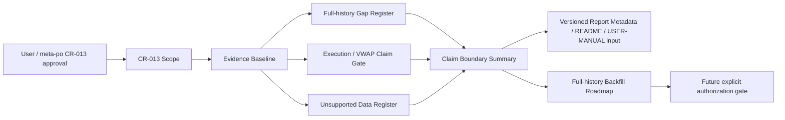

| 模块 | 职责 | 输入 | 输出 | 边界 |
|---|---|---|---|---|
| Full-History Gap Register | 固化 10 个正式 dataset 的 `limited_window_only`、`target_window_not_covered` 和 remediation | 2020-2024 readiness summary / matrix | full-history gap register、blocked_window、dataset status counts | 不补数据、不写 lake、不覆盖旧报告 |
| Execution / VWAP Claim Gate | 根据 execution audit 阻断真实 VWAP / VWAP fill / 分钟级执行价声明 | `execution_price_audit.csv`、CR011 execution policy | blocked claims、解除条件、close proxy 降级说明 | 不由 `amount/volume` 派生真实 VWAP |
| Unsupported Register Consumer | 将 unsupported register 9 行纳入报告 / 文档声明边界 | `unsupported_data_register.csv` | supported / research-only / unsupported / blocked 摘要 | excluded 项不计入 pass 分母 |
| Evidence Baseline Guard | 保留 CR-013 触发证据路径、run_id 和权限计数 | reports evidence paths | `old_baseline_preserved=true`、evidence path list | 不覆盖旧报告，不读取旧 `data/**` |
| Full-History Backfill Roadmap | 仅规划后续全历史补数、复验、发布和权限门控 | S01/S02/S03 输出 | route map、授权点、验收门 | 当前不执行 provider/lake/credential 操作 |

### 29.5 集成契约

| 调用方向 | 调用时机 | 输入契约 | 输出契约 | 错误 / 降级 |
|---|---|---|---|---|
| readiness report -> gap register | CR013-S01 读取只读证据时 | `readiness_summary.md`、`readiness_matrix.csv` 中 target window、overall_status、dataset final_status、issue_code、remediation | `full_history_status=research_limited_only`、10 行 dataset gap、`blocked_window=2020-01-01..2024-12-31` | 证据缺失时 fail-fast，不推断 pass |
| execution audit -> claim gate | CR013-S02 计算声明边界时 | `execution_price_status`、`missing_ohlcv_columns`、`true_vwap_available_count`、`blocked_claims` | `real_vwap_execution`、`vwap_fill_claim` blocked；minute/tick/level2/order match unsupported | close proxy 只能写 research degradation |
| unsupported register -> report/docs summary | CR013-S03 刷新声明消费合同时 | `data_item`、`status`、`reason`、`pass_denominator` | supported / research-only / unsupported / blocked 摘要；excluded denominator policy | 缺任一 register 行时 summary fail |
| CR013 roadmap -> future backfill | CR013-S04 形成路线图时 | S01/S02/S03 输出、REQ-083..087、ADR-044..047 | future Story 切分、权限表、run/report 命名规则 | 不创建真实执行授权；不读取 provider / lake / credential |

### 29.6 关键流程

1. 读取 CR-013 证据路径，只消费报告和 register 文件内容，不读取真实 lake、不读取旧 `data/**`。
2. 建立 2020-2024 gap register：10 个正式 dataset 均记录 `limited_window_only`、`target_window_not_covered` 或 `coverage_denominator_empty`，并保留 remediation。
3. 建立 execution / VWAP claim gate：当 `execution_price_status=required_missing` 或缺 `vwap_status=available` 时，真实 VWAP / VWAP fill / 分钟级执行价保持 blocked。
4. 建立 unsupported register summary：9 行全部进入声明边界，`pass_denominator=excluded` 只作为 excluded 证据，不参与 formal dataset pass denominator。
5. 输出 report/docs refresh 的消费合同，但本轮不修改 README / USER-MANUAL。
6. 输出 full-history backfill roadmap：列出需要补齐的 10 个 dataset、真实 VWAP / 分钟数据解除条件、权限授权点、新 run_id / 新报告路径规则。

### 29.7 前置校验与失败路径

| 阶段 | 前置条件 | 失败行为 | 回退 / 降级 |
|---|---|---|---|
| evidence intake | CR-013 evidence paths 存在且只读可解析 | 缺证据时 CR013-S01/S02/S03 LLD 不得通过 | 回退到 CR-013 evidence collection |
| full-history boundary | `overall_status=research_limited_only` 且 10 个 dataset `limited_window_only` 可追溯 | 任一 dataset 状态不可判定时，不输出 full-history pass | 输出 `status_unknown` 并阻断 allowed claim |
| execution claim | execution audit 中 `execution_price_status`、`true_vwap_available_count`、`blocked_claims` 可解析 | 缺字段时默认 blocked，不允许真实 VWAP claim | 降级为 `execution_claim_insufficient_evidence` |
| unsupported register | 9 行 register 均包含 status / reason / pass_denominator | 缺行时 report/docs summary fail | 保留旧文档，进入 docs refresh blocker |
| roadmap | 用户未另行授权真实 provider/lake/credential/old data | 只输出路线图，不生成真实任务命令 | 若用户要求补数，另建 CR / Story / CP5 |

### 29.8 非功能需求设计

| 维度 | 设计 | 验收口径 |
|---|---|---|
| 安全 | 默认只读报告证据，不访问 provider、凭据、真实 lake、旧 `data/**` | `provider_fetches=0`、`lake_writes=0`、`credential_reads=0`、`legacy_data_reads=0` |
| 可追溯 | 每个 blocked / unsupported claim 均指向 evidence path 和 CR-013 requirement | summary 中 `evidence_paths` 覆盖 5 个输入证据文件 |
| 可验证 | full-history、execution、unsupported 三类 claim 以结构化字段输出 | allowed full-history production claim、real VWAP claim 和 excluded denominator 误计数均为 0 |
| 可维护 | S01/S02/S03/S04 文件所有权分离，文档刷新 Story 与路线图 Story 不写代码 | CP4 文件冲突为 0；LLD gate 统一进入 `CR013-BATCH-A` |
| 可扩展 | S04 将补数、VWAP / 分钟接入、register 正式化拆成后续授权点 | 当前 Story 不携带真实执行权限 |

### 29.9 主要风险与应对

| 风险 | 级别 | 影响 | 缓解 |
|---|---|---|---|
| limited-window pass 被误读为 2020-2024 full-history pass | 高 | 用户基于未覆盖窗口做生产级研究结论 | ADR-044；S01 输出 blocked_window 和 10 dataset gap register |
| close proxy 或 `amount/volume` 被包装为真实 VWAP | 高 | 执行价和容量成本结论失真 | ADR-045；S02 固化真实 VWAP 解除条件和 blocked claims |
| unsupported register 未进入用户文档 | 中高 | research-only / unsupported 项被误认为正式 dataset | ADR-046；S03 强制消费 9 行 register 和 excluded denominator |
| 后续 backfill 覆盖旧证据 | 中高 | CR-013 触发证据不可追溯 | ADR-047；S04 规定新 run_id / 新目录 / old_baseline_preserved |
| 计划被误解为当前真实补数授权 | 高 | provider/lake/credential 越权 | 所有 Story dev_gate 默认 `implementation_allowed=false`，S04 只做路线图 |

### 29.10 ADR 候选决策点

| ADR | 决策 | 回写对象 |
|---|---|---|
| ADR-044 | CR-012 limited-window pass 不得外推为 2020-2024 full-history production strict | CR013-S01、README / report claim boundary |
| ADR-045 | execution / VWAP / minute execution claims 在真实数据和审计通过前保持 blocked | CR013-S02、execution claim gate |
| ADR-046 | unsupported register 成为正式声明边界输入，`pass_denominator=excluded` 不计入 pass 分母 | CR013-S03、report/docs summary |
| ADR-047 | CR-013 证据基线只读保留，后续真实补数必须另行授权并输出新 run / 新报告 | CR013-S04、future backfill roadmap |

### 29.11 分阶段落地与工作量

| 批次 / 阶段 | Story | 内容 | 粗估 |
|---|---|---|---|
| CR013-BATCH-A | CR013-S01 | 建立 2020-2024 full-history readiness gap register | M |
| CR013-BATCH-A | CR013-S02 | 加固 execution / VWAP / minute execution claim boundary | S |
| CR013-BATCH-A | CR013-S03 | 定义 unsupported register 与 README / USER-MANUAL / report refresh 合同 | M |
| CR013-BATCH-A | CR013-S04 | 制定 full-history backfill roadmap 与权限门控 | S |

Story 数为 4，LLD 批次为 1 个 `CR013-BATCH-A`；该数量必须与 `process/STORY-BACKLOG.md`、`process/DEVELOPMENT-PLAN.yaml` 和 CR-013 CP4 自动预检保持一致。CP4 通过后仍不得生成 LLD 或实现，需由 meta-po 将 CP4 摘要汇入 CP5 并组织全量 LLD 批次。

### 29.12 CP3 多角色讨论输入

| 字段 | 内容 |
|---|---|
| 推荐方案 | 采用 CR13-A：声明边界优先 + gap register + blocked claim gate。理由是最小权限、可追溯、能立即阻断错误 full-history / VWAP / unsupported allowed claim，同时不否定 CR-012 limited-window pass |
| 备选方案 | CR13-B：先做全历史 backfill 后刷新声明；CR13-C：只在 README 手工备注。B 需要单独真实数据授权且成本高；C 缺机器可验证门禁 |
| 关键取舍 | 复杂度中等、成本低中、可验证性高、维护成本低；代价是不会立即解除 full-history 或 VWAP blocked；平台兼容风险低；安全风险通过只读证据和权限计数控制 |
| 用户需决策点 | 是否接受 CR-012 pass 只限 limited-window；是否接受真实 VWAP / 分钟执行价继续 blocked；是否接受 unsupported register 的 excluded denominator；是否接受 S04 只做路线图不授权补数 |
| 回退点 | 若 CP3 不通过，回退到 CR-013 问题定义，重新界定 full-history blocked 范围、execution/VWAP 解除条件或 unsupported register 的正式声明粒度 |

### 29.13 Gotchas

| Gotcha | 规避方式 |
|---|---|
| 把 `production_strict_target_window_pass` 简写为 production strict pass | 所有输出必须带 `supported_window`，且 full-history 单独显示 blocked |
| 看到 `prices` 有 amount / volume 就声明 VWAP | ADR-045 规定真实 VWAP 必须有 `vwap` 且 `vwap_status=available`，本轮禁止派生真实 VWAP claim |
| 把 research-only exposure 当作正式 dataset | unsupported register 的 `research_contract_only` 只表示研究合同候选，不进入 formal pass denominator |
| S04 路线图被当成补数授权 | S04 的 file ownership 和 dev_gate 禁止 provider/lake/credential/old data 操作；真实补数需新授权 |

### 29.14 待确认问题

| ID | 问题 | 状态 | 默认处理 | 影响范围 | 决策人 |
|---|---|---|---|---|---|
| CR13-Q1 | 是否接受 `2025-02-11..2026-02-18` pass 只作为窗口级结论 | OPEN | 默认接受，不外推 | 报告、README、USER-MANUAL | 用户 / meta-po |
| CR13-Q2 | 是否接受真实 VWAP / VWAP fill / 分钟级执行价在本轮继续 blocked | OPEN | 默认接受，直到真实字段与审计通过 | execution claims、容量成本说明 | 用户 |
| CR13-Q3 | 是否接受 unsupported register 9 行全部进入声明边界且 excluded 不计 pass 分母 | OPEN | 默认接受 | 文档、报告、readiness summary | 用户 / meta-se |
| CR13-Q4 | 是否接受 S04 只输出路线图，不授权真实补数 | OPEN | 默认接受；真实 backfill 另起授权 | 后续数据建设 | 用户 |

## 30. CR-014 全 A since-inception 数据湖对研究消费层的影响

> 本节只同步 CR-014 对主 HLD 研究消费面的合同影响。生产级全历史数据湖的 source-of-truth、P0 分层、catalog current pointer、DuckDB 候选层、增量刷新和 replay 设计由 companion HLD `process/HLD-DATA-LAKE.md` §17 拥有。本节不授权 Story、LLD、实现、provider fetch、真实 lake 写入、凭据读取、旧 `data/**` 操作、旧 reports 覆盖或 DuckDB 依赖修改。

### 30.1 问题与边界

CR-014 将数据湖目标升级为 A 股证券自存在 / 上市日起至最近已闭市交易日的 production current truth。主 HLD 的变化不是接管生产链路，而是让 `engine`、experiments、research dataset builder、reports 和 optional backend 只消费更严格的 current truth 输入和 claim boundary：

| 类型 | 内容 | 可度量边界 |
|---|---|---|
| 目标 | 研究消费层读取已 publish 的全 A since-inception current truth 或结构化 `required_missing` / `blocked_claims` | consumer 触发 provider/lake/credential/legacy data/old report 操作次数为 0 |
| 输入 | catalog current pointer、readers、quality/readiness、lifecycle status、claim summary、可选 DuckDB audit/parity 结果 | 任一报告必须记录 `universe_scope`、`as_of_trade_date`、P0 gate status、claim boundary |
| 非目标 | 主 HLD 不设计 provider adapter、P0 分区、catalog publish、DuckDB query runtime 或真实执行授权 | 这些职责 100% 指向 `process/HLD-DATA-LAKE.md` §17 |
| 相邻边界 | CR-010/012/013 的 limited-window、2020-2024 blocked 和 unsupported register 继续作为声明基线；CR-011 的因子研究消费合同继续有效 | 旧结论不得外推为 CR-014 allowed claim |

### 30.2 研究消费集成契约

| 调用方向 | 调用时机 | 输入契约 | 输出契约 | 错误 / 降级 | 后续衔接 |
|---|---|---|---|---|---|
| `engine/research_dataset.py` -> `market_data.readers` | 构建研究输入时 | catalog current pointer、dataset list、date range、quality policy、lifecycle requirement | DataFrame bundle、lineage、quality/readiness、known limitations、typed remediation | 缺 P0 current truth 时返回 `required_missing`；不得触发 fetch/backfill | reports 写入 blocked claim；data lake 后续 Story 处理缺口 |
| experiments -> `research_input_v1` | 新版实验启动时 | `universe_scope=all_a_share` 或更窄研究范围、`as_of_trade_date`、benchmark/universe/execution policy | report metadata、allowed_claims、blocked_claims、required_missing | 全 A gate 未通过时 production claim 为 0；exploratory 必须写限制 | CR-011 factor audit / robust validation 继续消费该 metadata |
| reports/docs input -> Claim Boundary Summary | 报告或文档刷新前 | P0 gate、lifecycle gate、catalog pointer、CR-010/012/013 evidence、permission counters | allowed / blocked / required_missing 三类结构化声明 | claim evidence 缺失时默认 blocked，不写自由文本兜底 | 后续 README / USER-MANUAL / TEST-STRATEGY 只消费结构化结果 |
| optional backend -> clean feed | Backtrader / VectorBT 后续可选运行时 | 已 publish gold / clean feed、quality pass、execution policy | clean feed、execution degradation reason、unsupported microstructure claims | 不读取 connector/runtime/storage；minute/tick/Level2 缺失继续 blocked | 微观结构能力需单独 CR / Story / CP5 |

### 30.3 DuckDB 对研究消费层的边界

DuckDB 在 CR-014 中只属于数据湖侧只读 query / audit / feature extraction 候选，不成为主 HLD 研究消费层的直接事实源。研究消费层不得绕过 catalog current pointer 直接扫描 lake 或直接把 DuckDB SQL view 当作 published current truth。

| 场景 | 允许 | 禁止 |
|---|---|---|
| Coverage audit / PIT join | 消费数据湖侧生成的只读 audit/parity 结果，并在 report metadata 中引用 run_id / evidence path | 在实验入口直接打开 DuckDB 并扫描未 publish Parquet |
| Feature extraction | 只消费已 publish gold 或经 catalog 指针引用的 versioned feature candidate | 用 DuckDB 临时 view 替代 catalog / manifest / publish gate |
| Parity | 读取 DuckDB vs pandas/pyarrow parity summary 作为审计证据 | parity pass 自动更新 current pointer 或 allowed claim |
| 依赖 | 等 CP3/CP5 批准后由数据湖 Story 引入 | 本节或研究消费 Story 直接修改 `pyproject.toml` / `uv.lock` |

**CP3 R2 补充**：研究消费层可以引用数据湖侧 DuckDB 只读 audit/parity evidence，但不得成为 DuckDB 写入方、发布方或事实源管理方。即使后续 DuckDB 被批准安装，实验入口、research builder、optional backend 也只能通过 reader / catalog / clean feed 获取 published current truth；若需要分析 candidate，只能消费数据湖侧显式生成的 candidate audit evidence，不能直接扫描未发布 lake 路径。

| 研究消费动作 | 允许 | 禁止 |
|---|---|---|
| 写入数据 | 不允许；研究消费层写入次数为 0 | 通过 DuckDB、pandas 或任何 reader 反写 raw/manifest/canonical/gold/quality/catalog |
| 发布数据 | 不允许；publish 只能由 data lake Explicit Publish Gate 完成 | 研究报告、parity report 或 DuckDB view 触发 current pointer 更新 |
| 读取 published current truth | 允许通过 reader / catalog / clean feed 读取 | 绕过 catalog 直接读取 provider raw 或未发布 candidate |
| 使用 DuckDB evidence | 允许引用数据湖侧生成的 audit/parity evidence path 和 run_id | 在实验入口创建 DuckDB view 并把 view 当作 current truth |

### 30.4 前置校验与失败路径

| 阶段 | 前置条件 | 失败行为 | 回退 / 降级 |
|---|---|---|---|
| research input build | catalog current pointer 存在，P0 gate 和 lifecycle gate 可读 | 返回 typed `required_missing`，production report 不生成 allowed claim | 回退数据湖补齐计划，不触发 provider |
| all-A claim | `universe_scope=all_a_share`、`coverage_start_policy`、`as_of_trade_date` 可追溯 | 报告标记 `all_a_since_inception_claim_blocked` | 输出 blocked reason 和 evidence path |
| CR-010/012/013 baseline merge | limited-window / blocked / unsupported evidence 可读 | evidence 缺失时不输出全历史 allowed claim | 保留旧声明，等待证据补齐 |
| optional backend run | clean feed 已由 catalog/gold 发布，execution policy 明确 | backend 返回 `data_unavailable` 或 `backend_unavailable` | 轻量主路径继续只读运行 |

### 30.5 NFR、风险与 Gotchas

| 维度 / 风险 | 设计约束 | 验收口径 |
|---|---|---|
| 安全 | 研究消费层不导入 connector/runtime/storage/provider SDK，不读取 `.env` 或 token | forbidden import / credential / network / lake write 计数为 0 |
| 可追溯 | 每个研究报告声明都指向 catalog pointer、quality/readiness 和 claim boundary | `evidence_paths`、`run_id`、`as_of_trade_date` 字段覆盖率 100% |
| 可维护 | 主 HLD 只同步消费合同，生产细节只在 companion HLD 修改 | CR-014 数据生产职责在本节新增数为 0 |
| 风险：旧窗口外推 | CR-010/012/013 旧基线必须同时进入 blocked_claims 或 limitations | 未通过全 A gate 的 allowed claim 输出次数为 0 |
| Gotcha：直接用 DuckDB SQL 跑实验 | DuckDB SQL 只能是数据湖侧只读候选证据，实验入口只消费 published reader / clean feed | 实验入口直接 DuckDB 连接次数为 0，除非后续单独 ADR/CP5 |

### 30.6 CP3 多角色讨论输入

| 字段 | 内容 |
|---|---|
| 推荐方案 | 主 HLD 只同步研究消费合同，生产链路继续由 `process/HLD-DATA-LAKE.md` §17 拥有。理由是职责边界清晰，避免研究层直接触发真实数据操作 |
| 备选方案 | 在主 HLD 内同时设计生产和消费。优点是集中，缺点是再次混写 provider/lake/credential 风险，违背 CR-010 companion 拆分结论 |
| 关键取舍 | 复杂度低、维护成本低、安全风险低；代价是需要维护双 HLD 引用。可验证性通过 forbidden import、claim boundary 和 evidence path 保证 |
| 用户需决策点 | 是否接受研究消费层不直接触发 provider/lake/credential/old data/DuckDB source-of-truth 操作，只消费 published current truth 或 blocked/missing 声明 |
| 回退点 | 若 CP3 不通过，回退到 CR-014 主问题定义，重新决定数据生产与研究消费是否继续拆分 |
