# Story Backlog

> STORY-001..013 的基线 Backlog 已由用户确认通过并已验证完成。CR-013 追加的 CR013-S01..S04 当前为 `draft-pending-cp3-cp4`，只能作为 meta-po 发起 CP3/CP4 与后续 CP5 全量 LLD 的规划草案；未经 CP5，不得进入实现。

## 修订记录

| 版本 | 日期 | 修订人 | 变更要点 |
|---|---|---|---|
| 0.1 | 2026-05-14 | meta-se | 按已确认 HLD M0-M4 拆解 13 个 draft Story，并建立 Wave 与依赖 DAG |
| 0.2 | 2026-05-14 | meta-po | 记录 Story Plan 人工确认通过；W0 首个可执行 Story 为 STORY-001 |
| 0.3 | 2026-05-17 | meta-se | 按 CR-004 追加 STORY-014 至 STORY-018 和 CR4-W0 至 CR4-W4；旧 STORY-001..013 verified 状态不改写；CR-004 增量待 CP4 人工确认 |
| 0.4 | 2026-05-17 | meta-se | 按 CR-005 追加 CR005-S01 至 CR005-S06 和 CR5-W0 至 CR5-W5；将 Backtrader 纳入 CR-005 optional backend，强制依赖 dataset schema、quality/catalog/readers 与本地基准契约稳定 |
| 0.5 | 2026-05-17 | meta-se | 按 CR-005 追加修改点修订 CR005-S02/S03/S06：PIT as-of join、`adj_factor` + adjusted price 和 Backtrader 干净 feed 职责边界进入 Story 验收与 dev_gate |
| 0.6 | 2026-05-17 | meta-se | 按 CR-005 第三轮评审修订 CR005-S01/S02/S03/S04/S05/S06：前移 `market_data/cli.py` 或等价 backfill job 所有权，补齐 `BenchmarkResult`、`hs300_index` backfill spec、accuracy/quality AC、proxy_baseline 边界和 CR005-S04/S06 dev_gate |
| 0.7 | 2026-05-18 | meta-se | 按 CR-006 新增 `CR006-S01-legacy-data-dir-config-resolver`、`CR006-S02-engine-experiments-path-migration`、`CR006-S03-docs-runbook-and-cleanup-guardrails`，建立 `CR006-BATCH-A`，明确 legacy flat dir 与 structured lake root 分离、文件所有权、依赖、dev_gate 和禁止真实数据操作 |
| 0.8 | 2026-05-18 | meta-se | 按 CR-006 CP3 前修改意见替换 CR006-S01..S03 并新增 S04：新主线改为 Tushare-first acquisition、canonical/gold 到轻量 engine adapter、Backtrader clean feed contract、旧 `data/` reference-only guardrail；旧 repo `data/` 不作为 fallback 或覆盖证明 |
| 0.9 | 2026-05-18 | meta-se | 处理 CR006-BATCH-A LLD 双 lane review 计划侧 REQUIRED：同步 Tushare-first 权威 AC 映射，闭环 CR005 verified / CP7 PASS 状态，将 S04 计划依赖口径收敛为 contract |
| 1.0 | 2026-05-20 | meta-se | 按 CR-007 新增 CR007-S01..S05 和 `CR007-BATCH-A`：长周期 prices backfill planner、benchmark/calendar backfill、index_members/index_weights/stock_basic readiness、实验十三真实 benchmark 消费、legacy quality report/docs/guardrail；建立全量 LLD 批次和安全边界 |
| 1.1 | 2026-05-21 | meta-se | 按 CR-008 新增 CR008-S01..S06 和 `CR008-BATCH-A`：`research_input_v1`、proxy/real benchmark 字段隔离、research dataset builder、quality/adjustment/label gate、PIT/fixed universe、因子辅助数据合同；CR007-S02 可并行实现，CR007-S04/S05 在 CR008 设计确认前 hold |
| 1.2 | 2026-05-22 | meta-se | 按 CR-010 新增 CR010-S01..S12 与 `CR010-DL-BATCH-A`、`CR010-DL-BATCH-B`、`CR010-QF-BATCH-C`：生产级数据湖 plan/run/normalize/validate/publish/read/revalidate/replay、P0 dataset 生产化、W3 fail-fast、`realism_mode` 与 16 experiments 真实性报告；CR007/CR008/CR009 已验证结论不回滚 |
| 1.3 | 2026-05-22 | meta-po | 按用户给定 CR-010 剩余能力计划登记 `CR010-OPS-BATCH-D` 与 CR010-S13..S16：backup/archive/restore env、backup CLI、restore CLI/drill、retention policy；本轮只更新编排与检查点，不修改代码 |
| 1.4 | 2026-05-23 | meta-se | 按 CR-011 追加 CR011-S01..S08 与 `CR011-DATA-BATCH-A`、`CR011-RESEARCH-BATCH-B`、`CR011-VALIDATION-BATCH-C`：真实 benchmark policy 消费、PIT universe、tradability gates、execution price/VWAP 降级、adjustment audit、industry/market cap/style exposure、liquidity/capacity/cost sensitivity、factor panel audit/robust validation；本轮只补 Story Plan，不生成 LLD / CP3 / CP4 检查点、不实现代码 |
| 1.5 | 2026-05-24 | meta-po | 回写 CR011-DATA-BATCH-A 的 S01..S06 六份 LLD、六份 Story 级 CP5 自动预检和批次人工审查结果；CP5 已由用户 approve，S01 已调度进入 in-development，S02..S06 保持 lld-approved 并等待依赖 / 文件所有权串行调度；仍不授权真实联网、写湖、凭据读取、旧 data 或旧报告覆盖 |
| 1.6 | 2026-05-24 | meta-po | 收敛 CR011-S01 / S02 CP7 PASS / verified 状态；S02 已由 replacement meta-dev/dev-zhang 完成 CP6 接管复核，并由 meta-qa/qa-shi 完成 CP7 PASS；S03 dev_gate 已通过并由 meta-dev/dev-he 开始离线实现 |
| 1.7 | 2026-05-25 | meta-se | 按 CR-013 追加 CR013-S01..S04 与 `CR013-BATCH-A`：full-history readiness gap register、execution/VWAP claim boundary、unsupported register and docs refresh、full-history backfill roadmap；本轮只补 Story Plan 与 CP3/CP4 自动预检，不生成 LLD、不修改 README/docs/代码/测试/报告证据、不执行真实数据操作 |
| 1.8 | 2026-05-27 | meta-se | 按 CR-014 CP3 R2 approved 口径追加 CR014-S01..S08 与 `CR014-FULL-HISTORY-LAKE-BATCH-A`：全 A universe/lifecycle、Parquet layout/manifest/catalog publish gate、P0 plan/run/normalize/validate/publish、DuckDB read-only audit/parity、full-history readiness/claim boundary、incremental refresh/replay/retention、research consumer read-only/docs 后续边界、W3/minute/tick/Level2/VWAP blocked 决策边界；本轮只做 Story Plan 与 CP4，不生成 LLD、不实现、不改依赖、不真实写入 |
| 1.9 | 2026-05-27 | meta-po | 按用户要求将真实 provider 抓取与 raw/manifest 写湖拆分为后续 `CR014-S09-windowed-real-fetch-lake-write-run` 与 `CR014-REAL-RUN-BATCH-B`；S09 只在 S01..S08 完成后进入独立 LLD / CP5 / 用户真实运行授权，按分时段窗口执行，不自动 publish current pointer |

## Story 列表

| Story ID | 标题 | 目标 | 范围 | 非范围 | 优先级 | 依赖 | Wave | 量化验收标准摘要 | 需求映射 | HLD 映射 | ADR 映射 |
|---|---|---|---|---|---|---|---|---|---|---|---|
| STORY-001 | 工程基线与数据契约骨架 | 建立本地 Python 研究工具的目录、依赖和契约骨架 | `pyproject.toml`、`uv.lock`、`config/`、`engine/`、`strategies/`、`data/`、`reports/`、契约常量/文档内联 | 不实现回测逻辑；不联网 | P0 | 无 | M0 | 目录与文件边界覆盖 100% P0 路径；Python 依赖统一由 uv 管理 | REQ-001, REQ-013, REQ-036 | §3, §5, §6, §16 | ADR-002 |
| STORY-002 | 数据准备节流重试与 manifest | 实现独立联网数据准备编排和 JSONL checkpoint | data_prep 入口、AKShare adapter 边界、节流、重试、退避、断点续传、raw 写入、manifest | 不写回测主路径；不生成策略报告 | P0 | STORY-001 | M0 | 相邻请求间隔 >=2 秒；单批 <=50；并发 <=1；每批 manifest 字段完整 | REQ-016, REQ-047, REQ-048, REQ-049, REQ-050, REQ-051, REQ-055 | §8.1, §8.2, §8.4, §12.1 | ADR-001, ADR-005 |
| STORY-003 | 标准化 parquet 与数据质量报告 | 从 raw 派生三类 parquet，并输出质量报告和降级状态 | normalizer、parquet writer、quality reporter、`pass/warn/fail`、数据新鲜度 | 不实现策略回测；不做自动清理 raw | P0 | STORY-001, STORY-002 | M0 | 三类 parquet schema 校验；质量报告字段覆盖 HLD 列表；缺失率阈值按 ADR-006 处理 | REQ-021, REQ-022, REQ-052, REQ-053, REQ-054, REQ-056, REQ-057 | §8.3, §8.5, §12.1, §12.4 | ADR-003, ADR-006 |
| STORY-004 | 离线 Data Loader 与合同校验 | 让回测主路径只读本地 parquet、manifest、质量报告并校验数据契约 | `engine/data_loader.py`、复权一致、`available_at`、固定股票池、质量状态消费 | 不触发 data_prep；不计算策略信号 | P0 | STORY-003 | M1 | 合规 parquet 返回 `close_df`、universe、calendar、metadata；合同 fail 时拒绝运行 | REQ-002, REQ-003, REQ-016, REQ-034, REQ-037, REQ-038, REQ-057 | §8.3, §9.1, §9.3, §11, §12.2 | ADR-001, ADR-003, ADR-006 |
| STORY-005 | 动量信号与组合成交引擎 | 实现 T 日收盘动量信号、T+1 成交、等权组合和成本扣除 | `strategies/momentum.py`、`engine/portfolio.py`、缺失/不可交易分层处理 | 不输出扫描 CSV；不实现 PIT/涨跌停增强 | P0 | STORY-004 | M1 | 动量剔除历史窗口不足和端点缺失；成交日不早于 T+1；成本三项均记录 | REQ-004, REQ-005, REQ-006, REQ-007, REQ-008, REQ-009, REQ-039, REQ-040 | §9.2, §10, §12.2 | ADR-002, ADR-004 |
| STORY-006 | 指标、单次回测报告与 metadata | 完成默认单次回测编排、绩效指标和限制项 metadata | `engine/backtest.py`、`engine/metrics.py`、报告 builder、默认回测输出 | 不执行 60 组扫描；不生成候选报告 | P0 | STORY-005 | M1 | 2019-2025 合规数据输出完整净值；指标至少 5 项；metadata 限制项全量披露 | REQ-010, REQ-015, REQ-017, REQ-023, REQ-024, REQ-025, REQ-031, REQ-035, REQ-041 | §12.2, §13, §14 | ADR-002, ADR-003, ADR-004, ADR-007 |
| STORY-007 | 60 组参数扫描报告 | 实现动量参数网格扫描并保留失败行 | `engine/scanner.py`、扫描 CSV、失败行、耗时字段、质量摘要 | 不选择聚宽候选；不做并行优化作为验收阻塞 | P0 | STORY-006 | M2 | 默认网格输出 60 行；失败组合不丢行；主路径网络调用为 0 | REQ-011, REQ-012, REQ-026, REQ-027, REQ-032, REQ-034 | §12.3, §13, §16 | ADR-001, ADR-006, ADR-007 |
| STORY-008 | 候选报告与聚宽人工验证模板 | 从扫描结果生成不超过 4 组候选和差异分析字段 | `engine/candidates.py`、候选 CSV、聚宽手动回填字段、方向一致性模板 | 不自动调用聚宽；不轮询平台任务 | P0 | STORY-007 | M2 | 候选数 <=4；覆盖默认、Sharpe 最优、收益最优、保守低换手；选择理由非空 | REQ-018, REQ-028, REQ-029, REQ-030, REQ-041 | §11, §12.3, §16 | ADR-001, ADR-007 |
| STORY-009 | PIT 股票池 Provider 增强契约 | 增量引入按日期可用的历史成分股股票池契约 | PIT provider、成分股 raw/manifest/quality 扩展、loader 按日查询 | 不重构成完整事件驱动框架 | P1 | STORY-008 | M3 | 按日期返回股票池与 `available_at`；偏差字段可量化比较固定池与 PIT 池 | REQ-042, REQ-058 | §17, §14 | ADR-007 |
| STORY-010 | 交易状态与不可交易约束 | 增强停牌、无成交、特殊处理和可交易性判断 | trade status parquet、quality 检查、组合层不可交易规则 | 不实现涨跌停价格约束；不处理事件字段 | P1 | STORY-009 | M3 | 不可交易目标 100% 记录原因；成交明细包含留现金/延后处理 | REQ-043, REQ-058 | §10, §17 | ADR-004, ADR-007 |
| STORY-011 | 涨跌停与事件 available_at 增强 | 增强涨跌停约束和事件级可用时点门控 | limit fields、event `available_at` 契约、数据准备/loader/report 扩展 | 不把财报事件默认加入动量第一版信号 | P1 | STORY-009, STORY-010 | M3 | 涨停买入/跌停卖出受限时拒绝或延后；事件字段缺 `available_at` 时失败 | REQ-044, REQ-045, REQ-058 | §9.3, §10, §17 | ADR-006, ADR-007 |
| STORY-012 | 偏差审计报告 | 输出真实性增强前后的影响审计 | bias audit report、受影响样本数、收益/回撤/换手/候选排序变化 | 不新增交易规则；不自动聚宽验证 | P1 | STORY-010, STORY-011 | M3 | 审计报告覆盖至少 5 类限制项；四类核心指标变化均输出 | REQ-046, REQ-058 | §14, §17 | ADR-007 |
| STORY-013 | 策略扩展接口与 RSI/MACD 示例 | 复用轻量回测层扩展指标型策略接口 | strategy interface、`strategies/rsi.py`、`strategies/macd.py` 示例、横向报告字段 | 不以 Notebook/热力图作为阻塞项；不引入大型框架 | P2 | STORY-008 | M4 | 新策略不修改组合层/指标层主契约；至少 2 个策略函数示例可进入同一报告 schema | REQ-019, REQ-033 | §16, §17 | ADR-002 |
| STORY-014 | CR-004 market_data 包骨架与数据湖契约 | 创建独立可迁移 `market_data/` 包和 raw/manifest/canonical/gold/quality/catalog 契约 | 包骨架、schema registry、source registry、lake layout、配置样例、迁移边界 | 不实现 connector 请求；不改 `engine/**` | P0 | 无 | CR4-W0 | `market_data` 不 import `engine`；6 个数据湖层级有路径契约；canonical/manifest 字段表完整 | CR-004-AC-001, CR-004-AC-003 | §21.1-§21.4 | ADR-008, ADR-011 |
| STORY-015 | CR-004 connector runtime 与 raw/manifest 写入 | 用 fake connector 跑通 plan/fetch/runtime/storage，真实 adapter 默认关闭 | fake connector、TickFlow/AkShare/Tushare adapter 边界、限速、重试、熔断、raw writer、manifest writer | 不写 canonical；不真实联网；不提交凭据 | P0 | STORY-014 | CR4-W1 | fake raw + manifest deterministic；重试次数有上限；熔断可测试；真实 adapter 未启用时 fail fast | CR-004-AC-002, CR-004-AC-003 | §21.3, §21.6, §21.7 | ADR-010, ADR-011 |
| STORY-016 | CR-004 canonical 标准化、质量校验与只读 reader | 从 raw/manifest 派生 canonical parquet、quality、catalog，并提供只读 reader | normalization、validation、quality、catalog、readers | 不调用 connector；不改实验入口 | P0 | STORY-015 | CR4-W2 | canonical schema 稳定；字段缺失/重复/异常价格/覆盖缺口可识别；reader 网络调用为 0 | CR-004-AC-004, CR-004-AC-005 | §21.4, §21.7, §21.8 | ADR-009, ADR-011 |
| STORY-017 | CR-004 CLI offline 闭环与多源比对接口 | 提供 plan/fetch/normalize/validate/read 或等价 CLI，并稳定 fake/reference 多源比对 | CLI、comparison API、offline smoke tests | 不启用真实多源联网比对；不修改 `engine/**` | P0 | STORY-016 | CR4-W3 | CLI offline smoke 通过；多源比对输出字段完整；默认 source 为 fake/offline | CR-004-AC-006, CR-004-AC-007 | §21.7, §21.8 | ADR-010, ADR-012 |
| STORY-018 | CR-004 实验十/十二只读接入与真实沪深 300 基准路线 | 让实验十/十二按 reader 只读接入，并规划真实沪深 300 基准 gold/canonical 路径 | experiments reader adapter、benchmark reader contract、兼容参数、文档化开放问题 | 不在实验入口联网；不抓取真实基准数据；不删除旧 `--data-dir` 路径 | P1 | STORY-016, STORY-017 | CR4-W4 | 实验接入只读 reader；真实基准缺失时结构化提示；旧路径可回退；默认网络调用为 0 | CR-004-AC-008 | §21.7, §21.9, §21.12 | ADR-009, ADR-012 |
| CR005-S01 | Tushare connector 真实写湖边界 | 将 Tushare 从 fail-fast 边界升级为显式启用的真实写湖 source，并冻结 `hs300_index` backfill job spec | `market_data/connectors/tushare.py`、`market_data/config.py`、`market_data/source_registry.py`、`market_data/runtime.py`、`market_data/storage.py`、`market_data/cli.py` 或等价 job、后续 CP5 才能改 `pyproject.toml`/`uv.lock` | 不写 canonical/gold；不改 Data Loader/实验/Backtrader；不提交 token 或真实数据 | P0 | STORY-015 | CR5-W0 | import 网络调用 0；无 token/未启用/未 allowlist 时 100% fail fast；plan/dry-run 不联网；backfill spec 字段覆盖 dataset/source/interface/index_code/date range/lake root/run/resume/path/errors | CR005-AC-001, CR005-AC-002, CR005-AC-015, CR005-AC-016 | §22.1, §22.6, §22.7 | ADR-013 |
| CR005-S02 | Tushare 多 dataset schema、PIT 字段与复权 normalization | 扩展 dataset schema、exact interface 映射、PIT 可得性字段、adjusted price normalization 与 hs300 raw->canonical 字段映射 | `market_data/contracts.py`、`market_data/source_registry.py`、`market_data/normalization.py`、测试 | 不读取真实 token；不改 reader 消费方；不写实验/Backtrader | P0 | CR005-S01, STORY-016 | CR5-W1 | 至少 4 个 P0 dataset 有 schema；`hs300_index` 字段含 benchmark_kind/source_interface/lineage；raw 到 dataset 仅 exact 映射；非行情字段具备 `available_date`/`effective_date`/`available_at`；`adj_factor` 与 adjusted price 口径冲突 fail | CR005-AC-003, CR005-AC-004, CR005-AC-005, CR005-AC-006, CR005-AC-012, CR005-AC-013, CR005-AC-016 | §22.4, §22.6, §22.7 | ADR-014, ADR-017 |
| CR005-S03 | 多 dataset quality/catalog/readers 与 PIT/复权 gate | 为新增 dataset 建立质量门、catalog、只读 reader、PIT as-of gate、复权一致 gate 和 hs300 专项 accuracy gate | `market_data/validation.py`、`market_data/catalog.py`、`market_data/readers.py`、测试 | 不调用 connector；不改实验/Backtrader；不写真实数据 | P0 | CR005-S02 | CR5-W2 | 每个 dataset quality CSV 含 fetch/dataset 双状态、coverage、thresholds、denominator、复现字段；`hs300_index` 记录 missing dates/gap reason/duplicate key/lineage；reader 网络调用 0；PIT as-of 违规和复权口径混用均阻断消费 | CR005-AC-007, CR005-AC-008, CR005-AC-012, CR005-AC-013, CR005-AC-016, CR005-AC-018 | §22.6, §22.8, §22.9 | ADR-014, ADR-017 |
| CR005-S04 | 沪深 300 本地基准与实验只读接入 | 以 `hs300_index` canonical/gold 提供本地 benchmark resolver、`BenchmarkResult` typed schema 和实验只读基准 | `market_data/benchmarks.py`、`experiments/run_experiment_10.py`、`experiments/run_experiment_12.py`、测试 | 不联网抓基准；不自动补数；不静默代理；不把旧 proxy 填充为 hs300 | P0 | CR005-S01, CR005-S03, STORY-018 | CR5-W3 | 基准缺失返回 typed unavailable/required_missing 并携带只读 remediation spec；实验入口网络调用 0；旧 `--data-dir` 仅保留本地价格路径，proxy 只能命名为 `proxy_baseline` | CR005-AC-003, CR005-AC-008, CR005-AC-015, CR005-AC-017, CR005-AC-018, CR005-AC-019 | §22.6, §22.7, §22.8 | ADR-015 |
| CR005-S05 | 多源 comparison 与回补文档 | 稳定 Tushare vs reference/AkShare fixture 比对和显式回补 runbook | `market_data/comparison.py`、`README.md`、`docs/USER-MANUAL.md`、测试 | 不拥有 backfill job 主入口；不启用默认真实多源联网；不写真实数据；不改 Backtrader | P1 | CR005-S03 | CR5-W4 | comparison 至少含 10 个标准字段；默认测试不联网；文档说明显式 backfill、quality/catalog、禁用边界和 proxy_baseline 口径 | CR005-AC-009, CR005-AC-010, CR005-AC-015, CR005-AC-016, CR005-AC-019 | §22.7, §22.9 | ADR-012, ADR-013, ADR-015 |
| CR005-S06 | Backtrader optional backend | 作为可选后端读取数据层已 PIT/复权清洗的 factor panel / score / OHLCV feed 和 BenchmarkResult，并输出对照报告 | `engine/backtest.py` 或 selector、`engine/backtrader_adapter.py`、后续 CP5 才能改 `pyproject.toml`/`uv.lock`、测试、文档 | 不读取 `TUSHARE_TOKEN`；不导入 `market_data.connectors`；不联网；不生成 PIT；不计算复权因子；不触发补数；不替代轻量主路径 | P1 | CR005-S02, CR005-S03, CR005-S04 | CR5-W5 | 未安装返回 backend_unavailable；benchmark unavailable 只报告对照缺失；Backtrader adapter 静态不导入 connector/runtime；hs300 backfill/readers/BenchmarkResult/policy 未稳定时 dev_gate=false | CR005-AC-011, CR005-AC-014, CR005-AC-015, CR005-AC-017, CR005-AC-019 | §22.6, §22.8, §22.12 | ADR-016, ADR-017 |
| CR006-S01-tushare-first-data-acquisition-runbook | Tushare-first 数据获取与 runbook | 冻结 Tushare-first acquisition/runbook、raw/manifest 审计职责、canonical/gold 产出和 no-old-data 采集边界 | `market_data/cli.py` 或等价 job、`market_data/connectors/tushare.py`、`market_data/storage.py`、`market_data/normalization.py`、`market_data/validation.py`、runbook/测试 | 不读取旧 `data/**`；不承诺覆盖旧数据；不由回测运行时触发 fetch；不记录 token 或真实路径 | P0 | CR005-S01, CR005-S02, CR005-S03 | CR006-BATCH-A | raw/manifest 存在但仅用于审计/复现/质量追溯；canonical/gold 可追溯到 manifest run；旧 `data/**` 读取、列出、迁移、复制、比对、删除次数为 0 | CR006-AC-001, CR006-AC-002, CR006-AC-003, CR006-AC-009 | §23.1, §23.4, §23.6, §23.7 | ADR-018 |
| CR006-S02-canonical-gold-lightweight-engine-adapter | canonical/gold 到轻量 engine 适配 | 为当前轻量回测框架定义 canonical/gold reader 或由 canonical/gold 派生的 external `legacy_flat`，替代 repo `data/` 默认 fallback | `engine/data_loader.py`、`engine/backtest.py`、`experiments/run_experiment_*.py`、`market_data/readers.py`、adapter 测试 | 不读取 raw/manifest 作为运行输入；不默认读取 repo `data/`；不改 Tushare fetch | P0 | CR006-S01-tushare-first-data-acquisition-runbook, CR005-S03 | CR006-BATCH-A | 轻量回测运行输入来自 canonical/gold 或带 lineage 的 external `legacy_flat`；quality fail 阻断；repo `data/` 默认消费次数为 0 | CR006-AC-004, CR006-AC-005, CR006-AC-006, CR006-AC-010 | §23.3, §23.4, §23.6, §23.8 | ADR-018 |
| CR006-S03-backtrader-clean-feed-contract | Backtrader clean feed contract | 为 Backtrader optional backend 定义 quality gate 后的 clean OHLCV/factor/score feed 和 unavailable/error contract | `engine/backtrader_adapter.py`、`engine/backtest.py` 或 selector、`market_data/readers.py`、feed contract 测试 | 不读取 Tushare token；不导入 connector/runtime/storage；不读取 raw/manifest；不自动补数；不替代轻量主路径 | P1 | CR006-S01-tushare-first-data-acquisition-runbook, CR006-S02-canonical-gold-lightweight-engine-adapter, CR005-S06 | CR006-BATCH-A | Backtrader feed 只来自 quality gate 后 clean 数据；PIT/复权由数据层完成；未安装返回 backend_unavailable；联网次数为 0；消费层不触发 fetch/backfill | CR006-AC-007, CR006-AC-008, CR006-AC-011 | §23.3, §23.6, §23.8, §23.10 | ADR-016, ADR-017, ADR-018 |
| CR006-S04-old-data-reference-only-guardrail | 旧 data reference-only 护栏 | 固化旧 `data/` 保持现状、仅供人工参考/比对，不作为 fallback、迁移源或覆盖证明 | `README.md`、`docs/USER-MANUAL.md`、`.gitignore`、guardrail 测试或静态检查 | 不读取/列出/迁移/复制/删除真实 `data/**`；不记录真实路径/凭据；不执行清理 | P1 | CR006-S01-tushare-first-data-acquisition-runbook, CR006-S02-canonical-gold-lightweight-engine-adapter, CR006-S03-backtrader-clean-feed-contract | CR006-BATCH-A | 文档与 guardrail 明确 repo `data/` reference-only；默认 fallback 次数为 0；旧数据覆盖性比对需另行授权；S04 只依赖 S02/S03 契约冻结，不等待其 CP6 runtime | CR006-AC-012, CR006-AC-013, CR006-AC-014 | §23.1, §23.4, §23.10, §23.13 | ADR-018 |
| CR007-S01-prices-long-horizon-backfill-planner | 长周期 prices backfill planner | 为 `prices.daily` + `prices.adj_factor` 提供 2015-2025 或用户指定区间的分批 dry-run、resume、coverage gate 和 runbook | `market_data/cli.py`、`market_data/runtime.py`、`market_data/connectors/tushare.py`、`market_data/normalization.py`、`market_data/validation.py`、测试 | 不真实抓取；不写真实 lake；不默认全市场无股票池抓取；不读取旧 `data/**` | P0 | CR006-S01-tushare-first-data-acquisition-runbook, CR005-S02, CR005-S03 | CR007-BATCH-A | dry-run 网络调用 0、写入 0；plan 输出 batch_count、symbols/universe、date slices、resume policy、target paths、coverage gate；旧 `data/**` 操作 0 | CR007-AC-001, CR007-AC-002, CR007-AC-006 | §24.1, §24.5, §24.7 | ADR-019 |
| CR007-S02-benchmark-calendar-backfill | benchmark 与交易日历同区间 backfill | 补齐 `hs300_index` 与 `trade_calendar` 同区间 plan/normalize/validate/catalog/reader，先闭环 2025 小窗口再支持长周期 | `market_data/cli.py`、`market_data/normalization.py`、`market_data/validation.py`、`market_data/catalog.py`、`market_data/readers.py`、`market_data/benchmarks.py`、测试 | 不用代理填充 hs300；不自动联网；不改实验十三消费逻辑 | P0 | CR007-S01-prices-long-horizon-backfill-planner, CR005-S04 | CR007-BATCH-A | coverage denominator 为 trade_calendar open dates；`hs300_index` 与 `prices` 同区间 coverage gap 返回 required_missing；2025 小窗口与长周期计划均可表达 | CR007-AC-003, CR007-AC-004, CR007-AC-007 | §24.1, §24.5, §24.7 | ADR-020 |
| CR007-S03-index-members-stock-basic-datasets | 成分、权重与股票基础信息 readiness | 补齐 `index_members`、`index_weights`、`stock_basic` 的 exact interface、schema、normalizer、quality/catalog/readers 和 PIT / 非 PIT readiness | `market_data/contracts.py`、`market_data/source_registry.py`、`market_data/connectors/tushare.py`、`market_data/normalization.py`、`market_data/validation.py`、`market_data/readers.py`、测试 | 不把 `index_weights` 当作完整成分 PIT；PIT 不完整不得标 available；不改实验报告 | P0 | CR007-S01-prices-long-horizon-backfill-planner, CR005-S02, CR005-S03 | CR007-BATCH-A | 三类 dataset 有 readiness status；PIT 不完整返回 warn/unavailable；reader 不导入 connector/runtime；quality fail 阻断消费 | CR007-AC-005, CR007-AC-008, CR007-AC-009 | §24.1, §24.5, §24.7 | ADR-021 |
| CR007-S04-experiment-real-benchmark-consumption | 实验真实 benchmark 消费 | 修改实验十三优先消费真实 `hs300_index`，复核实验十/十二参数和 metadata，代理仅作 `proxy_baseline` 对照 | `experiments/run_experiment_13.py`、`experiments/run_experiment_10.py`、`experiments/run_experiment_12.py`、`market_data/benchmarks.py`、测试 | 不联网；不自动 backfill；不把 proxy 填充为 hs300；不改数据层抓取 | P0 | CR007-S02-benchmark-calendar-backfill, CR007-S03-index-members-stock-basic-datasets | CR007-BATCH-A | 真实 benchmark available 且 coverage=1.0 时实验十三输出 hs300 metadata；缺失时只输出 proxy_baseline 和 missing reason；网络调用 0 | CR007-AC-010, CR007-AC-011 | §24.7, §24.8 | ADR-020, ADR-021 |
| CR007-S05-data-quality-report-and-doc-guardrail | 质量报告与文档护栏 | 把旧 `reports/data_quality_report.csv` 标记为 legacy，文档化 lake quality/catalog 当前真相源，扩展 no-old-data / no-legacy-report guardrail | `README.md`、`docs/USER-MANUAL.md`、`.gitignore`、guardrail 测试 | 不覆盖旧报告；不读取旧报告内容；不操作旧 `data/**`；不执行真实抓取 | P1 | CR007-S01-prices-long-horizon-backfill-planner, CR007-S02-benchmark-calendar-backfill, CR007-S03-index-members-stock-basic-datasets, CR007-S04-experiment-real-benchmark-consumption | CR007-BATCH-A | 文档明确旧质量报告 legacy；当前质量真相源为 lake quality/catalog；禁止旧报告作为 coverage 证明；静态 guardrail 覆盖相关短语 | CR007-AC-012, CR007-AC-013 | §24.7, §24.10, §24.13 | ADR-022 |
| CR008-S01-research-input-contract-and-report-metadata | research input 合同与报告 metadata | 定义 `research_input_v1`、新报告必填 metadata 和 legacy report 边界 | `engine/research_dataset.py` 或合同模块、`experiments/**` 报告 helper、测试 | 不实现真实数据抓取；不读取旧报告内容；不触发 backfill | P0 | CR007-S02-benchmark-calendar-backfill | CR008-BATCH-A | metadata 必填字段覆盖 coverage、benchmark、universe、adjustment、label window、quality/readiness、known limitations；旧报告 current truth 使用次数为 0 | CR008-AC-001, CR008-AC-002 | §25.1, §25.4, §25.7 | ADR-024 |
| CR008-S02-proxy-real-benchmark-field-separation | proxy / real benchmark 字段隔离 | 将代理 benchmark 与真实 `hs300_index` 字段拆分，并修订新报告字段语义 | `experiments/run_experiment_13.py`、`experiments/run_experiment_15_factor_framework.py`、`market_data/benchmarks.py`、测试 | 不改数据生产；不以 proxy 填充 hs300；不读取旧报告 | P0 | CR007-S02-benchmark-calendar-backfill, CR008-S01-research-input-contract-and-report-metadata | CR008-BATCH-A | 缺真实 benchmark 时 `hs300_*` 输出次数为 0；proxy 只写 `proxy_*` / `proxy_baseline`；missing reason 必填 | CR008-AC-003, CR008-AC-004 | §25.3, §25.7, §25.13 | ADR-025 |
| CR008-S03-research-dataset-builder | 统一 research dataset builder | 新增只读 `ResearchDatasetRequest` / `ResearchDataset` / `GateResult` builder，聚合价格、日历、benchmark、universe 和 metadata | `engine/research_dataset.py`、`engine/data_loader.py`、`market_data/readers.py`、测试 | 不导入 connector/runtime/storage；不触发 fetch/backfill；不读取旧 `data/**` | P0 | CR008-S01-research-input-contract-and-report-metadata, CR008-S02-proxy-real-benchmark-field-separation | CR008-BATCH-A | builder 消费路径网络调用 0；forbidden import 0；missing 只返回 typed result / remediation spec | CR008-AC-005, CR008-AC-006 | §25.4, §25.5, §25.7 | ADR-026 |
| CR008-S04-quality-adjustment-label-window-gates | 质量、复权与 label window gate | 将 quality、单一复权口径和 `forward_return_horizon` 标签窗口变成研究准入门 | `engine/research_dataset.py`、`engine/quality.py` 或 gate helper、测试 | 不覆盖 quality 报告；不读取旧 quality CSV；不静默截断样本 | P0 | CR008-S03-research-dataset-builder | CR008-BATCH-A | quality fail、复权混用、label window 不足在严肃研究中 fail；探索截断必须写 `label_available_end` 和截断数量 | CR008-AC-007, CR008-AC-008 | §25.8, §25.10 | ADR-028 |
| CR008-S05-pit-universe-consumption-contract | PIT / fixed universe 消费合同 | 定义 `universe_mode`、`is_pit_universe`、`pit_status` 和幸存者偏差披露 | `engine/universe.py`、`engine/research_dataset.py`、`market_data/readers.py`、测试 | 不把 `index_weights` 当完整成分；不把 fixed snapshot 标 PIT；不改真实抓取 | P0 | CR007-S03-index-members-stock-basic-datasets, CR008-S03-research-dataset-builder | CR008-BATCH-A | 严肃研究要求 PIT 时 unavailable 必须 fail；探索 fixed snapshot 必须输出 survivorship warning | CR008-AC-009, CR008-AC-010 | §25.8, §25.13 | ADR-027 |
| CR008-S06-factor-research-auxiliary-data-contract | 因子研究辅助数据合同 | 定义可交易性、OHLCV/VWAP、行业、市值、复权审计、流动性和风格暴露缺失时的 allowed claims | `engine/research_dataset.py`、`market_data/readers.py`、`experiments/run_experiment_15_factor_framework.py`、测试 | 不授权新增真实辅助数据抓取；不声明未控制的中性化或可交易结论 | P1 | CR008-S03-research-dataset-builder, CR008-S04-quality-adjustment-label-window-gates, CR008-S05-pit-universe-consumption-contract | CR008-BATCH-A | 缺行业/市值/可交易性/风格暴露时对应严肃结论输出次数为 0；limitations/allowed_claims 必填 | CR008-AC-011, CR008-AC-012 | §25.5, §25.9, §25.13 | ADR-029 |
| CR010-S01-multidataset-plan-run-publish-cli-contract | multi-dataset plan/run/publish CLI 合同 | 建立 plan/run/normalize/validate/publish/read/revalidate/replay 生命周期与 publish gate | `market_data/cli.py`、`market_data/catalog.py`、`market_data/runtime.py`、`market_data/storage.py`、测试 | 不真实联网；不写真实 lake；不读取旧 `data/**` | P0 | CR009 closed, CR007-S01, CR007-S02 | CR010-DL-BATCH-A | dry-run 网络调用 0；未 publish 不可作为 current truth；publish 记录 coverage/source/run/lineage/available_at_rule | CR010-AC-001, CR010-AC-002 | `process/HLD-DATA-LAKE.md` §3, §5 | ADR-030, ADR-031, ADR-034, ADR-035 |
| CR010-S02-prices-adj-factor-history-backfill-loop | prices + adj_factor 历史回补闭环 | 补齐 `prices` 与 `adj_factor` 的 P0 字段、`available_at_rule`、复权一致性与恢复策略 | `market_data/contracts.py`、`market_data/normalization.py`、`market_data/validation.py`、测试 | 不执行全历史真实抓取；不在 consumer 计算复权 | P0 | CR010-S01-multidataset-plan-run-publish-cli-contract | CR010-DL-BATCH-A | `prices` / `adj_factor` 字段齐全；同一 run 不混用 `adjustment_policy`；缺 `adj_factor` 时 production_strict fail | CR010-AC-003, CR010-AC-004 | `process/HLD-DATA-LAKE.md` §4, §6 | ADR-032, ADR-035 |
| CR010-S03-hs300-index-trade-calendar-backfill-loop | hs300_index + trade_calendar 回补闭环 | 补齐 benchmark 与交易日历同区间 quality、coverage denominator、publish/read 合同 | `market_data/normalization.py`、`market_data/validation.py`、`market_data/benchmarks.py`、测试 | 不用 proxy 填充 hs300；不自动联网 | P0 | CR010-S01-multidataset-plan-run-publish-cli-contract, CR007-S02-benchmark-calendar-backfill | CR010-DL-BATCH-A | coverage denominator 使用 `trade_calendar.is_open=true`；缺 benchmark 返回 required_missing / benchmark_unavailable | CR010-AC-005, CR010-AC-006 | `process/HLD-DATA-LAKE.md` §4, §5 | ADR-032, ADR-034 |
| CR010-S04-index-members-weights-stock-basic-readiness | index_members / index_weights / stock_basic readiness 强化 | 强化 PIT/readiness/status 字段、source/interface exact 和禁止替代规则 | `market_data/contracts.py`、`market_data/source_registry.py`、`market_data/normalization.py`、`market_data/readers.py`、测试 | 不把 `index_weights` 或 `stock_basic` 当前快照证明 PIT | P0 | CR010-S01-multidataset-plan-run-publish-cli-contract, CR007-S03-index-members-stock-basic-datasets | CR010-DL-BATCH-A | PIT 不完整返回 warn/unavailable；`index_members` 缺失时 production_strict fail；stock_basic 仅辅助 | CR010-AC-007, CR010-AC-008 | `process/HLD-DATA-LAKE.md` §4, §7 | ADR-033, ADR-034 |
| CR010-S05-catalog-coverage-production-readiness-report | catalog coverage 与 production readiness report | 输出统一 coverage/readiness/current truth report，区分 legacy quality report | `market_data/catalog.py`、`market_data/validation.py`、`market_data/readers.py`、报告 helper、测试 | 不覆盖旧 `reports/data_quality_report.csv`；不记录私有路径/token | P0 | CR010-S01, CR010-S02, CR010-S03, CR010-S04 | CR010-DL-BATCH-A | report 覆盖 dataset coverage、quality/readiness、PIT、lineage、known_limitations；legacy report 不作为 current truth | CR010-AC-009 | `process/HLD-DATA-LAKE.md` §5, §8 | ADR-034, ADR-035 |
| CR010-S06-pit-source-interface-spike-readiness | PIT source/interface Spike 与 readiness 加固 | 对 PIT exact source/interface 做 Spike 记录，未确认前保持 unresolved fail-fast | `market_data/source_registry.py`、`market_data/contracts.py`、`market_data/readers.py`、测试 | 不真实启用 provider；不把 Spike 结论直接标 production available | P1 | CR010-S04-index-members-weights-stock-basic-readiness | CR010-DL-BATCH-B | 未确认 source/interface 返回 source_unresolved / required_missing；不允许模糊匹配 | CR010-AC-010 | `process/HLD-DATA-LAKE.md` §4.2, §7 | ADR-033 |
| CR010-S07-trade-status-contract-reader-fail-fast | trade_status 合同 / reader / fail-fast | 定义 `trade_status` dataset contract、reader result 和 production_strict gate | `market_data/contracts.py`、`market_data/readers.py`、`engine/trade_status.py`、测试 | 不默认全可交易；不自动抓取交易状态 | P1 | CR010-S06-pit-source-interface-spike-readiness | CR010-DL-BATCH-B | source/interface 未确认时 required_missing；exploratory 写 limitation；production_strict fail | CR010-AC-011 | `process/HLD-DATA-LAKE.md` §4.2, §7 | ADR-033 |
| CR010-S08-prices-limit-contract-gate-fail-fast | prices_limit 合同 / trading constraint gate / fail-fast | 定义涨跌停 dataset contract、reader result 和交易约束 gate | `market_data/contracts.py`、`market_data/readers.py`、`engine/trading_constraints.py`、测试 | 不忽略涨跌停后声明真实可成交；不自动抓取 | P1 | CR010-S06-pit-source-interface-spike-readiness | CR010-DL-BATCH-B | 未确认 source/interface 时 required_missing；production_strict 缺失 fail | CR010-AC-012 | `process/HLD-DATA-LAKE.md` §4.2, §7 | ADR-033 |
| CR010-S09-events-available-at-contract-fail-fast | events 合同 / available_at gate / fail-fast | 定义 events dataset contract，缺 explicit `available_at` 时禁止进入决策 | `market_data/contracts.py`、`market_data/readers.py`、`engine/events.py`、测试 | 不用日期推导事件可用时点；不自动抓取事件 | P1 | CR010-S06-pit-source-interface-spike-readiness | CR010-DL-BATCH-B | events 缺 `available_at` fail；reader/engine gate 均不返回 available | CR010-AC-013 | `process/HLD-DATA-LAKE.md` §4.2, §4.3 | ADR-032, ADR-033 |
| CR010-S10-realism-mode-research-metadata | 统一 `realism_mode` 与 research metadata | 在研究/实验 metadata 中引入 `realism_mode=exploratory/production_strict` 和真实性状态 | `engine/research_dataset.py`、`experiments/reporting.py`、测试 | 不替代现有 `analysis_mode`；不把 exploratory 报告说成 production_strict | P0 | CR010-S05-catalog-coverage-production-readiness-report, CR010-S07, CR010-S08, CR010-S09 | CR010-QF-BATCH-C | exploratory 默认可运行但写 limitation；production_strict 对缺 PIT/W3/benchmark/复权/quality fail 正确 fail | CR010-AC-014 | `process/HLD.md` §26, `process/HLD-DATA-LAKE.md` §7 | ADR-031, ADR-032, ADR-033 |
| CR010-S11-experiments-smoke-limitation-matrix | 16 experiments 真实数据 smoke 与 limitation matrix | 输出每个 experiment 的 coverage、benchmark、universe、adjustment、quality/readiness、W3、claims 和 strict 可行性 | `experiments/**`、`experiments/reporting.py`、测试 | 不触发 backfill；真实 lake smoke 需用户授权 | P0 | CR010-S10-realism-mode-research-metadata | CR010-QF-BATCH-C | 16 个 experiments fixture/offline smoke 可跑；每个报告有 allowed_claims / blocked_claims / production_strict status | CR010-AC-015 | `process/HLD.md` §26, `process/HLD-DATA-LAKE.md` §7 | ADR-031, ADR-034 |
| CR010-S12-backtrader-vectorbt-clean-feed-boundary | Backtrader / VectorBT clean feed 边界回归 | 回归 optional backend / scanner accelerator 只读 clean feed，静态禁止生产层 import | `engine/backtrader_adapter.py`、可选 VectorBT adapter、`engine/research_dataset.py`、测试 | 不引入新默认后端；不触发补数或真实源 | P1 | CR010-S10-realism-mode-research-metadata | CR010-QF-BATCH-C | Backtrader/VectorBT 消费路径网络调用 0；缺数据返回 typed unavailable；clean feed lineage 完整 | CR010-AC-016 | `process/HLD.md` §26, `process/HLD-DATA-LAKE.md` §7 | ADR-031, ADR-034 |
| CR010-S13-backup-archive-restore-env-manifest-contract | backup/archive/restore env 与 manifest/checksum/脱敏契约 | 定义 hot/archive/backup/restore root、backup/restore manifest、checksum、报告脱敏和路径冲突 fail-fast | `market_data/cli.py`、`market_data/storage.py`、备份/恢复 manifest helper、测试 | 不执行真实备份或恢复；不打印 `.env`、token、NAS 凭据或真实私有路径 | P0 | CR010-S05-catalog-coverage-production-readiness-report | CR010-OPS-BATCH-D | 四类 root 均可配置；`restore-root==lake-root` fail-fast；checksum skip/mismatch fail；报告路径脱敏 | CR010-AC-017 | `process/HLD-DATA-LAKE.md` §8 | ADR-034, ADR-035 |
| CR010-S14-backup-cli-dry-run-execute-verify-report | backup CLI dry-run / execute / verify / report | 新增 `backup-plan`、`backup-run`、`backup-verify`、`backup-report`，默认 dry-run，`--execute` 才复制 | `market_data/cli.py`、backup helper、测试 | 不默认复制真实数据；不读取旧 `data/**`；不记录私有路径 | P0 | CR010-S13-backup-archive-restore-env-manifest-contract | CR010-OPS-BATCH-D | dry-run 复制次数为 0；execute 需要显式 flag；verify/report 校验 manifest 与 checksum，输出脱敏报告 | CR010-AC-018 | `process/HLD-DATA-LAKE.md` §8 | ADR-035 |
| CR010-S15-restore-cli-drill-read-revalidate-replay | restore CLI 与 restore drill | 新增 `restore-plan`、`restore-run`、`restore-drill`，drill 只读执行 read/revalidate/replay | `market_data/cli.py`、restore helper、reader/revalidate/replay 集成、测试 | 不覆盖 hot lake；不联网；不把 restore root 与 lake root 指向同一目录 | P0 | CR010-S13-backup-archive-restore-env-manifest-contract, CR010-S14-backup-cli-dry-run-execute-verify-report | CR010-OPS-BATCH-D | `restore-root==lake-root` fail-fast；restore-drill `network_calls=0`；read/revalidate/replay 全部基于恢复副本 | CR010-AC-019 | `process/HLD-DATA-LAKE.md` §8 | ADR-034, ADR-035 |
| CR010-S16-retention-policy-archive-backup-cleanup | retention policy 与 archive/backup cleanup | 定义 archive/backup retention policy、过期对象计划、manifest/checksum 校验和 dry-run cleanup report | retention helper、`market_data/cli.py`、测试 | 不默认删除真实数据；不绕过 manifest；不清理旧 `data/**` | P1 | CR010-S13-backup-archive-restore-env-manifest-contract | CR010-OPS-BATCH-D | retention 计划默认 dry-run；delete 需要显式 `--execute`；checksum 缺失或 mismatch 阻断清理 | CR010-AC-020 | `process/HLD-DATA-LAKE.md` §8 | ADR-035 |
| CR011-S01-real-benchmark-and-policy-consumption | 真实 benchmark 与 policy 消费 | 让实验 17-21 v2 只读 `hs300_index` / benchmark policy，并严格隔离 `hs300_*` 与 `proxy_*` 字段 | `market_data/benchmarks.py`、`engine/research_dataset.py`、`experiments/run_experiment_17_21_factor_suite.py`、新版报告 metadata | 不自动抓取 benchmark；不覆盖旧报告；不用 proxy 填充 `hs300_*` | P0 | CR010-S03-hs300-index-trade-calendar-backfill-loop, CR010-S05-catalog-coverage-production-readiness-report, CR008-S02-proxy-real-benchmark-field-separation | CR011-DATA-BATCH-A | 输出 `benchmark_policy_id/benchmark_kind/hs300_available/hs300_coverage_ratio/proxy_baseline_used/benchmark_missing_reason` 6 字段；proxy 写入 `hs300_*` 次数为 0 | CR011-AC-001 | `process/HLD.md` §27, `process/HLD-DATA-LAKE.md` §14 | ADR-036 |
| CR011-S02-pit-universe-and-stock-lifecycle-completion | PIT 股票池与股票生命周期 | 基于 PIT membership、权重和生命周期字段建立 as-of universe gate | `market_data/readers.py`、`engine/research_dataset.py`、universe gate helper、新版报告 metadata | 不用 `index_weights` 或 `stock_basic` 当前快照证明 PIT；不真实补数 | P0 | CR010-S04-index-members-weights-stock-basic-readiness, CR010-S06-pit-source-interface-spike-readiness, CR008-S05-pit-universe-consumption-contract | CR011-DATA-BATCH-A | production_strict 必须满足 `universe_mode=pit`、`is_pit_universe=true`、`pit_status=pass`、`as_of_join_violation_count=0` | CR011-AC-002 | `process/HLD.md` §27, `process/HLD-DATA-LAKE.md` §14 | ADR-037 |
| CR011-S03-tradability-status-and-price-limit-gates | 可交易性与涨跌停门控 | 将停牌、涨跌停、ST、无成交、上市天数、事件状态纳入因子策略 gate | `market_data/readers.py`、`engine/trade_status.py`、`engine/trading_constraints.py`、`engine/events.py`、`engine/research_dataset.py` | 不默认全可交易；不接真实 provider；不忽略 W3 missing | P0 | CR011-S02-pit-universe-and-stock-lifecycle-completion, CR010-S07-trade-status-contract-reader-fail-fast, CR010-S08-prices-limit-contract-gate-fail-fast, CR010-S09-events-available-at-contract-fail-fast | CR011-DATA-BATCH-A | 6 类 gate 均输出 `available / required_missing / blocked`；production_strict 缺任一 P0 gate 时通过次数为 0；上市天数 / lifecycle gate 消费 CR011-S02 合同，未冻结时返回 `required_missing` | CR011-AC-003 | `process/HLD.md` §27, `process/HLD-DATA-LAKE.md` §14 | ADR-038 |
| CR011-S04-ohlcv-vwap-clean-execution-feed | OHLCV / VWAP 干净执行 feed | 定义 `open/close/vwap/close_proxy` 执行价 policy 和 VWAP 缺失降级合同 | `market_data/readers.py`、`engine/research_dataset.py`、`engine/backtest.py` 或 execution policy helper、报告 metadata | 不实现分钟级撮合；不把 close proxy 声明为 VWAP；不自动推导真实 VWAP | P1 | CR011-S03-tradability-status-and-price-limit-gates, CR010-S02-prices-adj-factor-history-backfill-loop | CR011-DATA-BATCH-A | `execution_price_policy` 只允许 4 值；`close_proxy` 时 `execution_degradation_reason` 必填且真实 VWAP/真实成交声明为 0 | CR011-AC-004 | `process/HLD.md` §27, `process/HLD-DATA-LAKE.md` §14 | ADR-039 |
| CR011-S05-adjustment-and-corporate-action-audit | 复权与公司行动审计 | 将 `adj_factor` lineage、复权一致性和 corporate action availability 纳入研究 metadata | `market_data/readers.py`、`engine/research_dataset.py`、factor return input helper、报告 metadata | 不声明缺公司行动时完整审计；不混用复权口径；不覆盖旧报告 | P1 | CR010-S02-prices-adj-factor-history-backfill-loop, CR008-S04-quality-adjustment-label-window-gates | CR011-DATA-BATCH-A | `adjustment_policy/adj_factor_lineage/corporate_action_status/adjustment_audit_status` 4 字段必填；复权混用进入因子计算次数为 0 | CR011-AC-005 | `process/HLD.md` §27, `process/HLD-DATA-LAKE.md` §14 | ADR-040 |
| CR011-S06-industry-market-cap-style-exposure-data | 行业 / 市值 / 风格暴露 | 定义行业、市值、流通市值、beta/style exposure availability 和中性化 blocked claims | `market_data/readers.py`、`engine/research_dataset.py`、factor analysis metadata、报告 metadata | 不用当前快照支撑 PIT exposure；不实现完整风险模型平台 | P1 | CR008-S06-factor-research-auxiliary-data-contract, CR011-S02-pit-universe-and-stock-lifecycle-completion | CR011-DATA-BATCH-A | 缺行业/市值/风格时，对应行业中性、市值中性、风格中性、pure alpha 声明输出次数为 0 | CR011-AC-006 | `process/HLD.md` §27, `process/HLD-DATA-LAKE.md` §14 | ADR-041 |
| CR011-S07-liquidity-capacity-and-cost-sensitivity | 流动性 / 容量 / 成本敏感性 | 基于 amount、volume、turnover、ADV 或等价输入输出容量与成本敏感性报告 | `engine/research_dataset.py`、`engine/portfolio.py` 或 capacity helper、`experiments/run_experiment_17_21_factor_suite.py`、新版报告 | 不声明缺流动性时容量可行；不只输出单一成本点 | P1 | CR011-S03-tradability-status-and-price-limit-gates, CR011-S04-ohlcv-vwap-clean-execution-feed, CR011-S06-industry-market-cap-style-exposure-data | CR011-RESEARCH-BATCH-B | 固定输出 `[0,5,10,20]` bps 四档成本网格；容量报告包含成交额占比、换手、持仓数、样本损失、成本侵蚀 5 类字段 | CR011-AC-007 | `process/HLD.md` §27, `process/HLD-DATA-LAKE.md` §14 | ADR-042 |
| CR011-S08-factor-panel-audit-and-robust-validation | 因子审计面板与稳健性验证 | 版本化保存 raw/directional/winsorized/zscore factor panel，并输出 rolling/年度/市场状态/参数/成本稳健性 | `experiments/run_experiment_17_21_factor_suite.py`、factor panel writer、robust validation helper、`reports/experiment_17_21_cr011/**` | 不覆盖旧 `reports/experiment_17_21/factor_strategy_report.md`；不生成 LLD 或代码于本轮 | P1 | CR011-S01-real-benchmark-and-policy-consumption, CR011-S02-pit-universe-and-stock-lifecycle-completion, CR011-S05-adjustment-and-corporate-action-audit, CR011-S07-liquidity-capacity-and-cost-sensitivity | CR011-VALIDATION-BATCH-C | 四阶段 factor panel 均存在；稳健性报告包含 rolling、年度、市场状态、参数敏感性、成本敏感性 5 个视图；旧报告覆盖次数为 0 | CR011-AC-008 | `process/HLD.md` §27, `process/HLD-DATA-LAKE.md` §14 | ADR-043 |
| CR013-S01-full-history-readiness-gap-register | full-history readiness gap register | 固化 2020-2024 10 个正式 dataset 的 `limited_window_only`、target-window coverage 缺口、remediation 和 evidence paths | `reports/data_lake_readiness_2020_2024/readiness_summary.md`、`reports/data_lake_readiness_2020_2024/readiness_matrix.csv` 的只读消费合同；后续版本化 gap register 输出 | 不补真实数据；不写 lake；不覆盖旧报告；不读取旧 `data/**` | P0 | CR011-S08-factor-panel-audit-and-robust-validation | CR013-BATCH-A | 10 个 dataset 100% 进入 gap register；full-history production strict allowed claim 输出次数为 0；旧证据覆盖次数为 0 | REQ-083, REQ-087 | `process/HLD.md` §29, `process/HLD-DATA-LAKE.md` §16 | ADR-044, ADR-047 |
| CR013-S02-execution-vwap-claim-boundary | execution / VWAP claim boundary | 将真实 VWAP、VWAP fill、分钟 / 逐笔 / 盘口 / 撮合执行价保持 blocked，并定义解除条件 | `reports/data_lake_readiness_2020_2024/execution_price_audit.csv` 的只读消费合同、execution blocked claim summary | 不从 close proxy、`amount/volume` 或其他日频字段派生真实 VWAP；不构造伪分钟数据 | P0 | CR011-S04-ohlcv-vwap-clean-execution-feed | CR013-BATCH-A | `blocked_claims` 包含 `real_vwap_execution` 和 `vwap_fill_claim`；真实 VWAP / 分钟执行价 allowed claim 输出次数为 0 | REQ-084, REQ-086 | `process/HLD.md` §29, `process/HLD-DATA-LAKE.md` §16 | ADR-045, ADR-047 |
| CR013-S03-unsupported-register-and-doc-refresh | unsupported register and docs refresh | 把 unsupported register 的 research-only / unsupported / contract-supported-but-unavailable 项纳入 README / USER-MANUAL / report 声明合同 | `reports/data_lake_readiness_limited_2025_2026/unsupported_data_register.csv` 的只读消费合同、文档刷新目标文件边界、report summary schema | 本轮不修改 README.md 或 docs/USER-MANUAL.md；不把 excluded 项计入 pass 分母；不修改研究策略逻辑 | P0 | CR013-S01-full-history-readiness-gap-register, CR013-S02-execution-vwap-claim-boundary | CR013-BATCH-A | 9 行 register 100% 进入 supported / research-only / unsupported / blocked 摘要；`pass_denominator=excluded` 计入 formal pass 分母次数为 0 | REQ-085, REQ-086, REQ-087 | `process/HLD.md` §29, `process/HLD-DATA-LAKE.md` §16 | ADR-046, ADR-047 |
| CR013-S04-full-history-backfill-roadmap | full-history backfill roadmap | 制定 2020-2024 full-history 补数、复验、发布、证据保留和权限授权路线图 | S01/S02/S03 输出、REQ-083..087、ADR-044..047；后续 Story / CP5 授权点 | 不执行 provider fetch；不读取凭据；不写 `/mnt/ugreen-data-lake`；不读取旧 `data/**`；不生成真实执行命令 | P1 | CR013-S01-full-history-readiness-gap-register, CR013-S02-execution-vwap-claim-boundary | CR013-BATCH-A | 路线图列出 10 个 dataset 补齐、execution/VWAP 解除条件、新 run/report 命名、old_baseline_preserved 和授权门；真实操作计数均为 0 | REQ-083, REQ-084, REQ-086, REQ-087 | `process/HLD.md` §29, `process/HLD-DATA-LAKE.md` §16 | ADR-044, ADR-045, ADR-047 |
| CR014-S01-a-share-universe-lifecycle-contract | 全 A universe / lifecycle / code-change 合同 | 冻结全 A since-inception universe、最近已闭市交易日、退市/摘牌/代码变更和 coverage denominator 合同 | lifecycle schema、code-change mapping、calendar policy、required_missing / blocked_claims 合同；Story 卡片与 LLD 输入 | 不抓 provider；不读凭据；不写 lake；不修改旧 `data/**`；不声明数据已覆盖 | P0 | 无 | CR014-W1-CONTRACTS | lifecycle 必需字段 10 类 100% 进入合同；缺字段时 allowed full-A claim 输出次数为 0 | REQ-088, REQ-089, REQ-097 | `process/HLD-DATA-LAKE.md` §17.1, §17.7.1 | ADR-050 |
| CR014-S02-parquet-layout-manifest-catalog-publish-gate | Parquet layout / manifest / catalog current pointer / publish gate | 冻结 Parquet lake 分区、manifest、catalog current pointer、candidate 与 publish gate 读写边界 | layout spec、manifest fields、catalog pointer schema、publish gate state machine | 不改代码；不真实写 raw/canonical/gold/quality/catalog；不更新 current pointer | P0 | CR014-S01-a-share-universe-lifecycle-contract | CR014-W1-CONTRACTS | validate pass 自动更新 pointer 次数为 0；catalog pointer 必填字段 100% 进入合同 | REQ-090, REQ-091 | `process/HLD-DATA-LAKE.md` §17.5, §17.7.1 | ADR-048, ADR-052 |
| CR014-S03-p0-plan-run-normalize-validate-publish-contract | P0 dataset plan/run/normalize/validate/publish 合同 | 定义 P0 7 类 dataset 与 lifecycle/code-change 的 plan/run/normalize/replay/validate/publish 合同和 CP5 授权门 | P0 dataset contract、Provider Adapter / Run Gate、Normalize / Replay、Validate、Publish Gate dev_gate | CP5 前 provider_fetch=0、lake_write=0、credential_read=0、dependency_change=0；不实现真实 pipeline | P0 | CR014-S01-a-share-universe-lifecycle-contract, CR014-S02-parquet-layout-manifest-catalog-publish-gate | CR014-W2-PIPELINE | CP5 前真实操作计数均为 0；run/normalize/replay/validate/publish 每阶段输入输出和 candidate/published 状态 100% 定义 | REQ-090, REQ-091, REQ-092, REQ-094 | `process/HLD-DATA-LAKE.md` §17.7.1 | ADR-048, ADR-051, ADR-052 |
| CR014-S04-duckdb-readonly-query-audit-parity-boundary | DuckDB read-only query/audit/parity 边界 | 冻结 DuckDB 只读候选层读取 published current truth 或受控 candidate audit path 的边界与 parity 输出 | DuckDB read-only connection policy、SQL template boundary、parity evidence schema、fallback pandas/pyarrow 策略 | 不改 `pyproject.toml`/`uv.lock`；不写 `.duckdb` 事实源；不触发 publish | P1 | CR014-S02-parquet-layout-manifest-catalog-publish-gate, CR014-S03-p0-plan-run-normalize-validate-publish-contract | CR014-W2-PIPELINE | DuckDB query/view/parity/report 反向成为事实源次数为 0；dependency_change=0 before CP5 | REQ-093, REQ-094, REQ-096 | `process/HLD-DATA-LAKE.md` §17.6, §17.7.1 | ADR-049, ADR-052 |
| CR014-S05-full-history-readiness-gap-claim-boundary | full-history readiness audit / gap register / claim boundary | 定义全 A since-inception readiness matrix、gap register、allowed_claims / blocked_claims / required_missing 输出合同 | readiness summary schema、coverage numerator/denominator、gap register、claim boundary builder | 不读取或覆盖旧 reports；不外推 CR-010/012/013 旧基线；不执行真实补数 | P0 | CR014-S01-a-share-universe-lifecycle-contract, CR014-S02-parquet-layout-manifest-catalog-publish-gate, CR014-S03-p0-plan-run-normalize-validate-publish-contract, CR014-S04-duckdb-readonly-query-audit-parity-boundary | CR014-W3-AUDIT-OPS | 任一 P0 gate 未通过时 full-A allowed claim 输出次数为 0；blocked_claims 100% 写缺口、证据和解除条件 | REQ-088, REQ-095, REQ-096 | `process/HLD-DATA-LAKE.md` §17.10, §17.13 | ADR-048, ADR-049, ADR-050, ADR-051 |
| CR014-S06-incremental-refresh-replay-retention-contract | incremental refresh / replay / retention 合同 | 定义增量刷新、最近 N 个交易日回补、replay、candidate retention 和 current pointer 不污染策略 | incremental planner、replay contract、resume_conflict、retention policy、permission counters | 不触发 provider；不读取凭据；不写 raw；不改 current pointer；不删除旧数据 | P0 | CR014-S02-parquet-layout-manifest-catalog-publish-gate, CR014-S03-p0-plan-run-normalize-validate-publish-contract | CR014-W3-AUDIT-OPS | replay `provider_fetches=0`、`credential_reads=0`、`raw_writes=0`、`current_pointer_changes=0`；resume_conflict 有结构化输出 | REQ-092, REQ-094 | `process/HLD-DATA-LAKE.md` §17.7.1, §17.8 | ADR-051, ADR-052 |
| CR014-S07-research-consumer-readonly-docs-runbook-boundary | research consumer read-only contract 与 docs/runbook 后续边界 | 冻结研究消费层只读 published current truth / blocked claims / required_missing 的契约，并定义 README/USER-MANUAL 后续刷新边界 | `engine/research_dataset.py` / reports / docs 的消费合同、forbidden import、docs/runbook LLD 输入 | 本阶段不改 README/docs/代码；研究层不得直接 DuckDB 写入/发布/扫未发布 lake | P1 | CR014-S04-duckdb-readonly-query-audit-parity-boundary, CR014-S05-full-history-readiness-gap-claim-boundary, CR014-S06-incremental-refresh-replay-retention-contract | CR014-W4-CONSUMER-BOUNDARY | consumer provider/lake/credential/old data 操作次数为 0；实验入口直接 DuckDB 连接次数为 0，除非后续独立 ADR/CP5 | REQ-093, REQ-094, REQ-095 | `process/HLD.md` §30.2, §30.3 | ADR-049, ADR-051, ADR-052 |
| CR014-S08-w3-minute-tick-level2-vwap-blocked-decision-boundary | W3 / minute / tick / Level2 / VWAP blocked 决策边界 | 固化 W3、minute/tick/Level2/order match、execution VWAP 与真实撮合执行价不进入 CR-014 P0 的 blocked / unsupported 决策边界 | unsupported decision matrix、解除条件、future CR / Story gate、claim boundary link | 不接入或构造微观结构数据；不由 close proxy 或 amount/volume 派生真实 VWAP | P0 | CR014-S05-full-history-readiness-gap-claim-boundary | CR014-W4-CONSUMER-BOUNDARY | W3/minute/tick/Level2/VWAP production allowed claim 输出次数为 0；解除条件 100% 指向后续 source/interface + Story + CP5 + 用户授权 | REQ-084, REQ-095, REQ-096 | `process/HLD-DATA-LAKE.md` §17.2, §17.10; `process/HLD.md` §30.1 | ADR-045, ADR-046, ADR-050, ADR-051 |
| CR014-S09-windowed-real-fetch-lake-write-run | 分时段真实抓取与 raw/manifest 写湖执行 | 在 CR014-S01..S08 完成后，按 dataset/date window 执行真实 provider 抓取与 raw/manifest/run metadata 写湖 | 独立 S09 LLD、CP5、authorization_id、分时段窗口计划、run-scoped manifest、resume token、失败窗口隔离 | 不属于当前 BATCH-A CP5；不自动 normalize；不自动 publish current pointer；不执行 retention delete/archive；不读取/覆盖旧 `data/**` 或旧 reports | P0 | CR014-S01..S08 全部 verified | CR014-W5-REAL-RUN | 每次真实 run 必须有 authorization_id、dataset、date range、window policy、source/interface allowlist、lake root；raw/manifest 写湖后 current_pointer_changes=0 | REQ-090, REQ-091, REQ-092, REQ-094 | `process/HLD-DATA-LAKE.md` §17.7.1, §17.8 | ADR-048, ADR-051, ADR-052 |

## Wave 分组

| Wave | 对应 HLD 阶段 | Story | 串并行策略 | 进入条件 | 退出条件 | 完成准则 |
|---|---|---|---|---|---|---|
| W0 | M0 - 数据准备与缓存可追溯 | STORY-001, STORY-002, STORY-003 | 串行；STORY-002/003 均依赖契约骨架，STORY-003 依赖 manifest/raw | HLD confirmed；Story 计划确认后方可进入 LLD | 三类 parquet、manifest、quality report 契约完成 | M0 产物支持后续 M1 离线读取 |
| W1 | M1 - 本地动量最小回测器 | STORY-004, STORY-005, STORY-006 | 串行；loader -> signal/portfolio -> metrics/report | W0 完成或用户提供合规 parquet/manifest/quality | 默认回测输出净值、指标和 metadata | 覆盖 2019-2025 的单次动量回测主路径 |
| W2 | M2 - 参数扫描与候选报告 | STORY-007, STORY-008 | 串行；扫描报告先于候选报告 | W1 完成 | 60 行扫描 CSV 和 <=4 候选 CSV | 第一版本地研究主路径闭环 |
| W3 | M3 - 真实性增强 | STORY-009, STORY-010, STORY-011, STORY-012 | 串行规划；为保持 5 个 Wave 与 M0-M4 一一对应，本轮不拆 M3 子 Wave | W2 完成；增强需求仍需 Story 计划确认 | 真实性限制可量化审计 | 增强不破坏 M0-M2 离线隔离 |
| W4 | M4 - 策略扩展 | STORY-013 | 单 Story 串行；当前计划按 Wave 顺序在 W3 后执行 | W3 完成；若后续人工确认重排，可在 W2 后单独执行 | RSI/MACD 等策略复用主契约 | 新策略不修改组合和指标主接口 |
| CR4-W0 | CR-004 契约阶段 | STORY-014 | 无上游依赖；可作为 CR-004 首个 CP5 批次 A 的 LLD 输入 | CP3/CP4 对 CR-004 增量确认通过 | `market_data/` 包骨架和数据湖契约稳定 | 下游 Story 可基于冻结 schema/source registry 设计 |
| CR4-W1 | CR-004 获取运行时 | STORY-015 | 依赖 STORY-014；LLD 可与 STORY-016 草案小批次评审，但开发需等待 STORY-014 契约冻结 | STORY-014 LLD 确认，schema/source registry 冻结 | fake connector、runtime、raw/manifest 写入完成 | fake/offline 获取闭环可被 normalization 消费 |
| CR4-W2 | CR-004 标准化读取 | STORY-016 | 依赖 STORY-015；开发默认串行，避免 manifest/canonical 契约冲突 | STORY-015 verified 或至少 manifest/raw contract frozen | canonical、quality、catalog、reader 完成 | reader 可供 CLI 和实验接入 |
| CR4-W3 | CR-004 操作闭环 | STORY-017 | 依赖 STORY-016；与 STORY-018 的 LLD 可在 reader 契约冻结后并行起草 | STORY-016 reader contract frozen | CLI offline smoke 与 fake/reference comparison 完成 | 默认路径 offline 可交给 QA 验证 |
| CR4-W4 | CR-004 实验接入 | STORY-018 | 依赖 STORY-016/017；开发应在 reader/CLI 稳定后执行，避免实验入口反复变更 | STORY-016 verified，STORY-017 comparison/CLI contract frozen | 实验十/十二只读接入路线和基准只读契约完成 | 后续可接入真实沪深 300 基准文件 |
| CR5-W0 | CR-005 Tushare 写湖边界 | CR005-S01 | 可与 CR005-S02 起草 LLD，但开发需等待 STORY-015 raw/manifest contract 和 source registry 稳定 | CP3/CP4 对 CR-005 增量确认通过；STORY-015 verified 或 contract frozen | Tushare 真实 source 显式启用边界、token env、plan/dry-run 和 `hs300_index` backfill job spec 稳定 | 下游 dataset normalization 和 benchmark resolver remediation spec 可引用数据层 job |
| CR5-W1 | CR-005 dataset schema/normalization | CR005-S02 | 依赖 CR005-S01 与 STORY-016；开发默认串行，避免 contracts/normalization 冲突 | CR005-S01 connector result/raw contract frozen；CR-004 canonical 基础已稳定 | 多 dataset schema、exact interface 映射、PIT 字段和 adjusted price normalization 稳定 | quality/catalog/readers 可按 dataset、PIT 和复权策略扩展 |
| CR5-W2 | CR-005 quality/catalog/readers | CR005-S03 | 依赖 CR005-S02；CR005-S04/S06 的 LLD 可在 PIT/复权/reader/hs300 quality contract 冻结后起草 | CR005-S02 dataset schema、PIT 字段、复权价格和 hs300 raw->canonical 契约 confirmed | 多 dataset quality CSV、catalog、readers、PIT as-of gate、复权一致 gate 和 hs300 accuracy gate 完成 | 实验基准和 Backtrader 可只读消费干净数据 |
| CR5-W3 | CR-005 本地基准 | CR005-S04 | 依赖 CR005-S01、CR005-S03 与 STORY-018；LLD 可基于冻结契约起草，开发需等 backfill job spec、reader quality、BenchmarkResult schema、benchmark policy 冻结 | `hs300_index` reader/quality contract frozen；CR005-S01 backfill job spec frozen；实验只读接入边界保留 | 基准 resolver 返回 typed `BenchmarkResult`，含 available/unavailable/required_missing/quality_failed、remediation spec、catalog/lineage | 实验十/十二可使用真实本地基准或结构化缺失，不联网、不静默代理 |
| CR5-W4 | CR-005 comparison/文档 | CR005-S05 | 依赖 CR005-S03；可与 CR005-S04 LLD 并行，开发需避开 CLI/job 主入口文件所有权 | quality/catalog/readers contract frozen；CR005-S01 backfill job spec frozen | comparison 输出与显式回补 runbook 完成 | 用户可安全执行真实回补准备；文档不把回补描述为消费层自动动作 |
| CR5-W5 | CR-005 Backtrader optional backend | CR005-S06 | LLD 可在 CR005-S02/S03/S04 contract frozen 后起草；开发必须等待 PIT/复权/quality/readers/benchmark verified | CR005-S02 PIT/复权契约 confirmed；CR005-S03 reader quality verified；CR005-S04 BenchmarkResult schema 与 benchmark policy frozen；CP5 批次 D 人工确认 | optional backend 可用或 structured unavailable，不影响轻量主路径 | Backtrader 对照报告只消费本地数据湖派生的干净 feed，不触发补数 |
| CR006-BATCH-A | CR-006 Tushare-first 数据方案 | CR006-S01-tushare-first-data-acquisition-runbook, CR006-S02-canonical-gold-lightweight-engine-adapter, CR006-S03-backtrader-clean-feed-contract, CR006-S04-old-data-reference-only-guardrail | LLD 可按 max_parallel_lld=3 分轮起草并统一确认；开发默认按 S01 -> S02 -> S03/S04 顺序；S04 对 S02/S03 是 contract 依赖，可在其契约冻结后收敛，不要求等待 S02/S03 CP6 runtime | CR-006 CP3/CP4 人工确认通过；不得触碰真实 `data/**` 或凭据；CR006-BATCH-A CP5 全量确认前不得实现 | 四张 Story 卡片、文件所有权、dev_gate、raw/manifest 审计边界和 old data reference-only guardrail 稳定 | Tushare-first structured lake 成为正式 LLD 输入；旧 `data/` 仍保持现状且不参与默认运行 |
| CR007-BATCH-A | CR-007 canonical 数据覆盖与真实 benchmark | CR007-S01-prices-long-horizon-backfill-planner, CR007-S02-benchmark-calendar-backfill, CR007-S03-index-members-stock-basic-datasets, CR007-S04-experiment-real-benchmark-consumption, CR007-S05-data-quality-report-and-doc-guardrail | LLD 可按 max_parallel_lld=3 分轮起草并统一确认；开发默认 S01 -> S02 -> S03 -> S04 -> S05；S02/S03 可并行起草 LLD，但因共享 `market_data/normalization.py`、`validation.py`、`readers.py` 默认不得并行开发；S05 依赖前四者合同冻结 | CR-007 CP3/CP4 人工确认通过；不得触碰 `.env`、真实 lake、旧 `data/**` 或旧报告内容；CP5 全量确认前不得实现 | 五张 Story 卡片、长期 coverage policy、benchmark/calendar gate、dataset readiness、实验消费与 legacy quality guardrail 稳定 | CR007-BATCH-A 可交给 meta-dev 生成全量 LLD，但不得实现 |
| CR008-BATCH-A | CR-008 研究级数据层口径硬化 | CR008-S01-research-input-contract-and-report-metadata, CR008-S02-proxy-real-benchmark-field-separation, CR008-S03-research-dataset-builder, CR008-S04-quality-adjustment-label-window-gates, CR008-S05-pit-universe-consumption-contract, CR008-S06-factor-research-auxiliary-data-contract | LLD 可按 max_parallel_lld=3 分轮起草并统一确认；开发默认 S01/S02 合同先行 -> S03 builder -> S04/S05 gates -> S06 辅助数据合同；S04/S05 可并行起草 LLD，但因共享 `engine/research_dataset.py` 默认不得并行开发 | CR-008 CP3/CP4 人工确认通过；不得实现 CR008；不得触碰 `.env`、真实 lake、旧 `data/**`、旧质量报告内容或凭据；CR008-BATCH-A CP5 全量确认前不得实现 | 六张 Story 卡片、`research_input_v1`、benchmark 字段隔离、builder 只读边界、quality/adjustment/label gate、PIT/fixed universe 与 auxiliary allowed claims 稳定 | CR008-BATCH-A 可交给 meta-dev 生成全量 LLD；CR007-S02 可并行实现，CR007-S04/S05 继续 hold 到 CR008 设计确认 |
| CR010-DL-BATCH-A | CR-010 数据湖基础生产化 | CR010-S01-multidataset-plan-run-publish-cli-contract, CR010-S02-prices-adj-factor-history-backfill-loop, CR010-S03-hs300-index-trade-calendar-backfill-loop, CR010-S04-index-members-weights-stock-basic-readiness, CR010-S05-catalog-coverage-production-readiness-report | LLD 可按 max_parallel_lld=3 分轮起草并统一确认；开发默认 S01 -> S02/S03/S04 -> S05；S02/S03/S04 共享 `contracts.py`、`normalization.py`、`validation.py`、`readers.py` 时默认不得并行开发 | CR-010 CP3/CP4 人工确认通过；CR009 关闭；不得真实抓取、真实 lake 写入、旧 `data/**` 操作或凭据读取；CP5 全量确认前不得实现 | multi-dataset pipeline 离线可验证；P0 dataset quality/catalog/readiness 可用；publish gate 可用 | 真实小窗口 smoke 需要用户另行授权 |
| CR010-DL-BATCH-B | CR-010 W3 数据契约与 fail-fast | CR010-S06-pit-source-interface-spike-readiness, CR010-S07-trade-status-contract-reader-fail-fast, CR010-S08-prices-limit-contract-gate-fail-fast, CR010-S09-events-available-at-contract-fail-fast | LLD 可并行起草；开发默认 S06 合同先行 -> S07/S08/S09；共享 `market_data/contracts.py`、`readers.py` 和 engine gate 文件时由 meta-po 判定文件无冲突后才可并行 | CR010-DL-BATCH-A 相关 reader/catalog 合同已冻结；未确认真实 source/interface 前不得接 provider | W3 source/interface 未确认时全链路 fail-fast；PIT/trade_status/prices_limit/events 不伪造可用 | exploratory 可 limitation；production_strict fail |
| CR010-QF-BATCH-C | CR-010 实验消费与真实性报告 | CR010-S10-realism-mode-research-metadata, CR010-S11-experiments-smoke-limitation-matrix, CR010-S12-backtrader-vectorbt-clean-feed-boundary | LLD 默认串行 S10 -> S11/S12；S11 改 `experiments/**`，S12 改 adapter，若文件无冲突可并行开发；任何真实 smoke 另走 QA 授权 | CR010-DL-BATCH-A/B 离线验证通过；`realism_mode` 合同确认；不得触发 backfill | 16 个 experiments fixture/offline 可在 exploratory 跑通；production_strict 对缺口正确 fail；optional backend clean feed 边界回归 | 真实 lake 小窗口/1 年 smoke 需用户授权 |
| CR010-OPS-BATCH-D | CR-010 备份、归档、恢复与保留策略 | CR010-S13-backup-archive-restore-env-manifest-contract, CR010-S14-backup-cli-dry-run-execute-verify-report, CR010-S15-restore-cli-drill-read-revalidate-replay, CR010-S16-retention-policy-archive-backup-cleanup | LLD 默认 S13 合同先行 -> S14/S15/S16；S14/S15/S16 可并行起草 LLD，开发需按文件所有权重新判定 | NFS hot/archive/backup/restore root 已就绪；DL-BATCH-A current truth/report 合同冻结；CP5 全量确认前不得实现 | backup/restore/retention CLI 默认 dry-run；`--execute` 才复制/恢复/删除；restore drill 网络调用 0；报告脱敏 | archive/backup/restore 可审计、可恢复、可 dry-run 验证 |
| CR011-DATA-BATCH-A | CR-011 数据与研究消费合同 | CR011-S01-real-benchmark-and-policy-consumption, CR011-S02-pit-universe-and-stock-lifecycle-completion, CR011-S03-tradability-status-and-price-limit-gates, CR011-S04-ohlcv-vwap-clean-execution-feed, CR011-S05-adjustment-and-corporate-action-audit, CR011-S06-industry-market-cap-style-exposure-data | LLD 可按 max_parallel_lld=3 分轮起草；CP5 必须等六张 LLD 和自动预检全部完成后统一确认；开发默认 S01/S02/S03/S05 合同先行，S04 依赖 S03，S06 依赖 S02/CR008-S06；共享 `engine/research_dataset.py` / `market_data/readers.py` 默认不得并行开发 | CR-011 CP3/CP4 通过；CR010-DL-BATCH-A verified；CR010-DL-BATCH-B / QF-BATCH-C 的相关合同至少冻结；不得真实联网、读凭据、写 lake、操作旧 data 或覆盖旧报告 | benchmark、PIT、tradability、execution、adjustment、exposure 六类门禁进入研究消费合同 | 新版实验 17-21 可基于门禁决定 exploratory / production_strict |
| CR011-RESEARCH-BATCH-B | CR-011 容量成本研究 | CR011-S07-liquidity-capacity-and-cost-sensitivity | 单 Story；LLD 等 CR011-DATA-BATCH-A 相关合同冻结后起草；开发需等 CP5-B approved 且 S03/S04/S06 依赖满足 | DATA-BATCH-A 的 tradability、execution、exposure 合同冻结；CP5-B 前不得实现 | 容量与成本敏感性报告合同稳定 | 报告固定四档成本网格并阻断缺流动性时的容量声明 |
| CR011-VALIDATION-BATCH-C | CR-011 因子面板审计与稳健性验证 | CR011-S08-factor-panel-audit-and-robust-validation | 单 Story；LLD 需消费前两批全部 Story 合同；开发需等 DATA-BATCH-A 与 RESEARCH-BATCH-B 对应 CP5 和依赖满足 | CR011-S01/S02/S05/S07 合同冻结；旧报告 forbidden path 生效；CP5-C 前不得实现 | factor panel audit 与 robust validation 报告合同稳定 | 新版报告版本化输出，不覆盖旧实验 17-21 baseline |
| CR013-BATCH-A | CR-013 unsupported data 与 claim boundary | CR013-S01-full-history-readiness-gap-register, CR013-S02-execution-vwap-claim-boundary, CR013-S03-unsupported-register-and-doc-refresh, CR013-S04-full-history-backfill-roadmap | LLD 可按 max_parallel_lld=3 分轮起草并统一确认；开发默认 S01/S02 合同先行 -> S03 声明刷新 -> S04 路线图。S01 与 S02 可并行起草 LLD；S03 依赖 S01/S02；S04 依赖 S01/S02。任何 Story 在 CP5 全量确认前不得实现 | CR-013 CP3/CP4 通过；CR011 closed 状态不回滚；只读 CR-013 证据文件；不得 provider fetch、读凭据、写真实 lake、读旧 data 或覆盖旧报告 | full-history blocked、execution/VWAP blocked、unsupported register excluded denominator 和 future backfill roadmap 合同稳定 | CR-013 后续 LLD / 实现只能在 CP5 全量确认和用户权限边界内推进 |
| CR014-W1-CONTRACTS | CR-014 全 A 与数据湖事实合同 | CR014-S01-a-share-universe-lifecycle-contract, CR014-S02-parquet-layout-manifest-catalog-publish-gate | LLD 可同批起草；开发必须 S01 合同冻结后再做 S02，避免 denominator / lifecycle 与 layout/catalog 字段冲突。CP5 前 implementation_allowed=false | CR-014 CP3 R2 已 approved；CP4 自动预检通过；本阶段真实 provider_fetch=0、lake_write=0、credential_read=0、duckdb_dependency_change=0 | universe/lifecycle/code-change 合同、Parquet layout、manifest、catalog current pointer 和 Explicit Publish Gate 合同稳定 | 下游 plan/run/normalize/validate/publish 与 DuckDB read-only 只能引用冻结合同，不得自行扩展事实源 |
| CR014-W2-PIPELINE | CR-014 P0 pipeline 与 DuckDB 只读候选层 | CR014-S03-p0-plan-run-normalize-validate-publish-contract, CR014-S04-duckdb-readonly-query-audit-parity-boundary | S03 先冻结 plan->run->normalize/replay->validate->publish 状态机；S04 在 S02/S03 合同冻结后收敛。DuckDB 依赖变更不进入 CP5 前范围 | S01/S02 合同冻结；CP5 前不得实现真实 Provider Adapter / Run Gate、不得写 raw/manifest/run metadata、不得改依赖 | CP5+显式授权后的单写者写湖边界、candidate/published 分离、DuckDB read-only query/audit/parity 读边界稳定 | DuckDB query/view/parity/report 反向成为 source of truth 次数必须为 0 |
| CR014-W3-AUDIT-OPS | CR-014 full-history readiness 与 replay/retention | CR014-S05-full-history-readiness-gap-claim-boundary, CR014-S06-incremental-refresh-replay-retention-contract | S05 消费 S01..S04 全部事实/候选边界；S06 消费 S02/S03 并可与 S05 并行起草 LLD。实现前由 CP5 重新判定文件所有权 | S01..S04 合同冻结；CP5 前不得读取旧 reports、旧 data、真实 lake 或凭据 | readiness matrix、gap register、claim boundary、incremental refresh、replay 和 retention candidate 策略稳定 | 任一 P0 gate 未通过时 full-A allowed claim 输出为 0；replay 不触发 provider、不写 raw、不改 current pointer |
| CR014-W4-CONSUMER-BOUNDARY | CR-014 研究消费与 unsupported 决策边界 | CR014-S07-research-consumer-readonly-docs-runbook-boundary, CR014-S08-w3-minute-tick-level2-vwap-blocked-decision-boundary | S07 依赖 S04/S05/S06；S08 依赖 S05。LLD 可并行起草，开发需避开 `engine/research_dataset.py` 与文档文件所有权冲突 | S05/S06 合同冻结；CP5 前不得修改 README/docs/代码/测试/报告 | 研究消费层只读 published current truth；docs/runbook 后续刷新范围、W3/minute/tick/Level2/VWAP unsupported/blocked 解除条件稳定 | research consumer 不直接 DuckDB 写入/发布/扫未发布 lake；unsupported claim 不被计入 allowed production claim |

## 依赖 DAG 摘要

```mermaid
graph TD
  STORY-001 --> STORY-002
  STORY-001 --> STORY-003
  STORY-002 --> STORY-003
  STORY-003 --> STORY-004
  STORY-004 --> STORY-005
  STORY-005 --> STORY-006
  STORY-006 --> STORY-007
  STORY-007 --> STORY-008
  STORY-008 --> STORY-009
  STORY-009 --> STORY-010
  STORY-009 --> STORY-011
  STORY-010 --> STORY-011
  STORY-010 --> STORY-012
  STORY-011 --> STORY-012
  STORY-008 --> STORY-013
  STORY-014 --> STORY-015
  STORY-015 --> STORY-016
  STORY-016 --> STORY-017
  STORY-016 --> STORY-018
  STORY-017 --> STORY-018
  STORY-015 --> CR005-S01
  STORY-016 --> CR005-S02
  CR005-S01 --> CR005-S02
  CR005-S02 --> CR005-S03
  CR005-S01 --> CR005-S04
  STORY-018 --> CR005-S04
  CR005-S03 --> CR005-S04
  CR005-S03 --> CR005-S05
  CR005-S02 --> CR005-S06
  CR005-S03 --> CR005-S06
  CR005-S04 --> CR005-S06
  CR005-S01 --> CR006-S01
  CR005-S02 --> CR006-S01
  CR005-S03 --> CR006-S01
  CR006-S01 --> CR006-S02
  CR005-S03 --> CR006-S02
  CR006-S01 --> CR006-S03
  CR006-S02 --> CR006-S03
  CR005-S06 --> CR006-S03
  CR006-S01 --> CR006-S04
  CR006-S02 --> CR006-S04
  CR006-S03 --> CR006-S04
  CR006-S01 --> CR007-S01
  CR005-S02 --> CR007-S01
  CR005-S03 --> CR007-S01
  CR007-S01 --> CR007-S02
  CR005-S04 --> CR007-S02
  CR007-S01 --> CR007-S03
  CR005-S02 --> CR007-S03
  CR005-S03 --> CR007-S03
  CR007-S02 --> CR007-S04
  CR007-S03 --> CR007-S04
  CR007-S01 --> CR007-S05
  CR007-S02 --> CR007-S05
  CR007-S03 --> CR007-S05
  CR007-S04 --> CR007-S05
  CR007-S02 --> CR008-S01
  CR007-S02 --> CR008-S02
  CR008-S01 --> CR008-S02
  CR008-S01 --> CR008-S03
  CR008-S02 --> CR008-S03
  CR008-S03 --> CR008-S04
  CR007-S03 --> CR008-S05
  CR008-S03 --> CR008-S05
  CR008-S03 --> CR008-S06
  CR008-S04 --> CR008-S06
  CR008-S05 --> CR008-S06
  CR009-CLOSED --> CR010-S01
  CR007-S01 --> CR010-S01
  CR007-S02 --> CR010-S01
  CR010-S01 --> CR010-S02
  CR010-S01 --> CR010-S03
  CR010-S01 --> CR010-S04
  CR007-S02 --> CR010-S03
  CR007-S03 --> CR010-S04
  CR010-S02 --> CR010-S05
  CR010-S03 --> CR010-S05
  CR010-S04 --> CR010-S05
  CR010-S04 --> CR010-S06
  CR010-S06 --> CR010-S07
  CR010-S06 --> CR010-S08
  CR010-S06 --> CR010-S09
  CR010-S05 --> CR010-S10
  CR010-S07 --> CR010-S10
  CR010-S08 --> CR010-S10
  CR010-S09 --> CR010-S10
  CR010-S10 --> CR010-S11
  CR010-S10 --> CR010-S12
  CR010-S05 --> CR010-S13
  CR010-S13 --> CR010-S14
  CR010-S13 --> CR010-S15
  CR010-S14 --> CR010-S15
  CR010-S13 --> CR010-S16
  CR010-S03 --> CR011-S01
  CR010-S05 --> CR011-S01
  CR008-S02 --> CR011-S01
  CR010-S04 --> CR011-S02
  CR010-S06 --> CR011-S02
  CR008-S05 --> CR011-S02
  CR010-S07 --> CR011-S03
  CR010-S08 --> CR011-S03
  CR010-S09 --> CR011-S03
  CR011-S02 --> CR011-S03
  CR011-S03 --> CR011-S04
  CR010-S02 --> CR011-S04
  CR010-S02 --> CR011-S05
  CR008-S04 --> CR011-S05
  CR008-S06 --> CR011-S06
  CR011-S02 --> CR011-S06
  CR011-S03 --> CR011-S07
  CR011-S04 --> CR011-S07
  CR011-S06 --> CR011-S07
  CR011-S01 --> CR011-S08
  CR011-S02 --> CR011-S08
  CR011-S05 --> CR011-S08
  CR011-S07 --> CR011-S08
  CR011-S08 --> CR013-S01
  CR011-S04 --> CR013-S02
  CR013-S01 --> CR013-S03
  CR013-S02 --> CR013-S03
  CR013-S01 --> CR013-S04
  CR013-S02 --> CR013-S04
  CR014-S01-a-share-universe-lifecycle-contract --> CR014-S02-parquet-layout-manifest-catalog-publish-gate
  CR014-S01-a-share-universe-lifecycle-contract --> CR014-S03-p0-plan-run-normalize-validate-publish-contract
  CR014-S02-parquet-layout-manifest-catalog-publish-gate --> CR014-S03-p0-plan-run-normalize-validate-publish-contract
  CR014-S02-parquet-layout-manifest-catalog-publish-gate --> CR014-S04-duckdb-readonly-query-audit-parity-boundary
  CR014-S03-p0-plan-run-normalize-validate-publish-contract --> CR014-S04-duckdb-readonly-query-audit-parity-boundary
  CR014-S01-a-share-universe-lifecycle-contract --> CR014-S05-full-history-readiness-gap-claim-boundary
  CR014-S02-parquet-layout-manifest-catalog-publish-gate --> CR014-S05-full-history-readiness-gap-claim-boundary
  CR014-S03-p0-plan-run-normalize-validate-publish-contract --> CR014-S05-full-history-readiness-gap-claim-boundary
  CR014-S04-duckdb-readonly-query-audit-parity-boundary --> CR014-S05-full-history-readiness-gap-claim-boundary
  CR014-S02-parquet-layout-manifest-catalog-publish-gate --> CR014-S06-incremental-refresh-replay-retention-contract
  CR014-S03-p0-plan-run-normalize-validate-publish-contract --> CR014-S06-incremental-refresh-replay-retention-contract
  CR014-S04-duckdb-readonly-query-audit-parity-boundary --> CR014-S07-research-consumer-readonly-docs-runbook-boundary
  CR014-S05-full-history-readiness-gap-claim-boundary --> CR014-S07-research-consumer-readonly-docs-runbook-boundary
  CR014-S06-incremental-refresh-replay-retention-contract --> CR014-S07-research-consumer-readonly-docs-runbook-boundary
  CR014-S05-full-history-readiness-gap-claim-boundary --> CR014-S08-w3-minute-tick-level2-vwap-blocked-decision-boundary
  CR014-S01-a-share-universe-lifecycle-contract --> CR014-S09-windowed-real-fetch-lake-write-run
  CR014-S02-parquet-layout-manifest-catalog-publish-gate --> CR014-S09-windowed-real-fetch-lake-write-run
  CR014-S03-p0-plan-run-normalize-validate-publish-contract --> CR014-S09-windowed-real-fetch-lake-write-run
  CR014-S04-duckdb-readonly-query-audit-parity-boundary --> CR014-S09-windowed-real-fetch-lake-write-run
  CR014-S05-full-history-readiness-gap-claim-boundary --> CR014-S09-windowed-real-fetch-lake-write-run
  CR014-S06-incremental-refresh-replay-retention-contract --> CR014-S09-windowed-real-fetch-lake-write-run
  CR014-S07-research-consumer-readonly-docs-runbook-boundary --> CR014-S09-windowed-real-fetch-lake-write-run
  CR014-S08-w3-minute-tick-level2-vwap-blocked-decision-boundary --> CR014-S09-windowed-real-fetch-lake-write-run
```

## 阻塞项

| ID | 阻塞项 | 状态 | 影响 | 需要谁决策 |
|---|---|---|---|---|
| BLK-001 | 无 BLOCKING 阻塞项 | CLOSED | Story 计划可提交给 meta-po 发起人工确认 | - |
| CR4-BLK-001 | CR-004 尚未完成 CP3/CP4 人工确认 | OPEN | STORY-014..018 不得进入实现；可提交 meta-po 发起 CP3/CP4 | meta-po / user |
| CR4-BLK-002 | TickFlow/Tushare exact source/interface 和凭据策略未确认 | OPEN | 不阻塞 fake/offline 最小闭环；阻塞真实 adapter 启用 | user / 后续数据源 owner |
| CR5-BLK-001 | CR-005 尚未完成 CP3/CP4 人工确认 | RESOLVED：CR-005 CP3/CP4/CP5 批次已按检查点门控获批，CR005-S01..S06 已 verified / CP7 PASS | 不再阻塞 CR006；保留为历史阻塞项闭环记录 | meta-po / user |
| CR5-BLK-002 | Backtrader 依赖版本与 optional dependency 策略未确认 | RESOLVED：CR005-S06 CP5 Batch D 已确认 dependency group/version/lazy import，CP6/CP7 均 PASS | 不再阻塞 CR005-S06 或 CR006-S03；后续新增后端策略仍需新门控 | user / meta-qa / meta-dev |
| CR5-BLK-003 | `hs300_index` 基准口径和真实 lake root 未确认 | SUPERSEDED：真实 lake root 由用户本机配置且不记录真实值；CR005-S04/S05/S06 已以 typed unavailable / remediation spec 和文档边界 verified | 不再阻塞 CR006；真实抓取或真实 lake 写入仍需另行授权 | user / meta-po |
| CR5-BLK-004 | CR005-S02/S03 PIT、复权和 quality gate 契约尚未人工确认并验证 | RESOLVED：CR005-S02 blocker fix 后 CP7 重验 PASS，CR005-S03 CP7 PASS，CR005-S06 CP7 PASS | 不再阻塞 CR006-S03；Backtrader clean feed 可引用已验证契约 | meta-po / user |
| CR5-BLK-005 | 原 CP3/CP4 旧稿已被第三轮评审 superseded | RESOLVED：第三轮修订后的 CR005 CP3/CP4 自动预检与人工审查已 approved，旧稿仅保留历史追溯 | 不再阻塞 CR006；旧稿不得重新作为当前批准依据 | meta-po |
| CR6-BLK-001 | CR-006 尚未完成 CP3/CP4 人工确认 | RESOLVED：2026-05-18 用户“全部接受”，CP3/CP4 已回填 approved | CR006-S01..S04 可进入全量 LLD；CP5 全量确认前仍不得实现 | meta-po / user |
| CR6-BLK-002 | 旧 `data/**` 读取/比对授权未确认 | OPEN | 不阻塞 Tushare-first 设计；阻塞任何旧数据覆盖性分析、读取、列出、迁移、复制或删除动作 | user |
| CR7-BLK-001 | CR-007 尚未完成 CP3/CP4 人工确认 | RESOLVED：2026-05-20 用户原始回复 `同意` 已由 meta-po 回填 CP3/CP4 approved；CR007-BATCH-A CP5 也已 approved | 不再阻塞 CR007-S02；S03/S04/S05 仍受当前 Story DAG、文件冲突和 CR008 影响分析约束 | meta-po / user |
| CR7-BLK-002 | 真实 Tushare 长周期抓取和 `/mnt/ugreen-data-lake` 写入未授权 | OPEN | 不阻塞设计和 LLD；阻塞任何真实抓取、真实 lake 写入或大规模 backfill | user |
| CR8-BLK-001 | CR-008 尚未完成 CP3/CP4 人工确认 | OPEN | CR008-S01..S06 不得进入 LLD；CP3/CP4 通过后才可进入 CR008-BATCH-A 全量 LLD | meta-po / user |
| CR8-BLK-002 | CR008-BATCH-A 尚未完成全量 LLD 与 CP5 批次人工确认 | OPEN | CR008 任一 Story 不得实现；不得修改代码、测试或报告 | meta-po / user |
| CR8-BLK-003 | CR007-S04/S05 与 CR008 报告 metadata / benchmark 字段 / legacy report 口径重叠 | OPEN | CR007-S04/S05 在 CR008 CP3/CP4 结论前保持 hold；避免提前实现后返工 | meta-se / meta-po |
| CR10-BLK-001 | CR-010 尚未完成 CP3/CP4 人工确认 | RESOLVED for S01..S12；OPS-D addendum 已按用户预授权回填 CP4 approved | CR010-S01..S12 CP4 已 approved；S13..S16 可进入 LLD handoff，但真实子 agent 未调度前不得声明完成 | meta-po / user |
| CR10-BLK-002 | CR010 批次 CP5 尚未完成 | OPEN | DL-BATCH-A 已 approved 并 verified；DL-BATCH-B、QF-BATCH-C、OPS-BATCH-D 未完成 LLD/CP5，不得实现 | meta-po / user |
| CR10-BLK-003 | 真实联网、真实 lake 写入、旧 `data/**` 操作和凭据读取未授权 | PARTIAL | 真实联网/Tushare/写 lake/.env 读取已按用户授权用于小窗口 smoke 与 NFS 校验；旧 `data/**` 对比仍 deferred；本轮不打印凭据或真实私有路径 | user |
| CR10-BLK-004 | W3 exact source/interface 尚未确认 | OPEN | 不阻塞 fail-fast 合同；阻塞 PIT/trade_status/prices_limit/events production available 声明 | user / meta-se |
| CR10-BLK-005 | 当前线程无可调用子 agent 调度工具 | OPEN | 已创建 handoff-only；必须由主线程真实 `spawn_agent`/`resume_agent`/`send_input` 调度后，才能补齐 CP5/CP6/CP7 PASS | main-thread / meta-po |
| CR11-BLK-001 | CR-011 尚未完成 CP3/CP4 人工确认 | RESOLVED：CP3 人工审查 approved，CP4 自动预检 PASS | CR011-DATA-BATCH-A 已进入 LLD；CP5 批次确认前仍不得实现 | meta-po / user |
| CR11-BLK-002 | CR011 批次 CP5 尚未完成 | PARTIAL：DATA-BATCH-A 六份 Story 级 CP5 自动预检 PASS，批次人工审查已 approved；B/C 批次尚未开始 | DATA-BATCH-A 可按 Story DAG 与文件所有权进入离线实现；S07/S08 不得实现 | meta-po / user |
| CR11-BLK-003 | CR010-DL-BATCH-B / QF-BATCH-C 仍有 W3/realism 合同未最终 verified | OPEN | 不阻塞 Story Plan；阻塞 CR011 依赖真实可交易 / realism 的 dev_ready | meta-po / user |
| CR11-BLK-004 | 真实联网、真实 lake 写入、凭据读取、旧 `data/**` 操作和旧报告覆盖均未在本轮授权 | OPEN | 不阻塞设计；阻塞任何真实抓取、真实写湖、旧数据比对或旧报告覆盖 | user |
| CR13-BLK-001 | CR-013 HLD 增量尚需 meta-po 发起 CP3 人工确认 | OPEN | CR013-S01..S04 不得进入 LLD / CP5；本轮 CP3 仅为自动预检 | meta-po / user |
| CR13-BLK-002 | CR013-BATCH-A 尚未完成全量 LLD 与 CP5 批次人工确认 | OPEN | CR013 任一 Story 不得实现；不得修改 README/docs/代码/测试/报告证据 | meta-po / user |
| CR13-BLK-003 | provider fetch、真实 lake 写入、凭据读取、旧 `data/**` 读取和旧报告覆盖未授权 | OPEN | 不阻塞设计和路线图；阻塞任何真实补数、VWAP/分钟数据接入或旧证据覆盖 | user |
| CR14-BLK-001 | CR014-FULL-HISTORY-LAKE-BATCH-A 尚未完成 CP5 批次人工确认 | OPEN | CR014-S01..S08 的 LLD 与 CP5 自动预检已完成，但 CP5 人工确认前不得实现、不得标记 dev-ready | meta-po / user |
| CR14-BLK-002 | S09 独立 CP5 + 用户显式授权前真实 provider fetch、真实 lake 写入、凭据读取、DuckDB 依赖变更均未授权 | OPEN | 不阻塞 BATCH-A 设计 / 离线实现；阻塞 Provider Adapter / Run Gate 真实写 raw/manifest/run metadata、Normalize/Replay 真实写 candidate、Publish Gate 更新 current pointer、DuckDB 依赖安装 | user |
| CR14-BLK-003 | Explicit Publish Gate 尚未通过任何真实 current pointer 更新授权 | OPEN | Validate / parity PASS 只能生成 candidate 或 audit evidence；reader/DuckDB 不得看到未发布 candidate 作为 current truth | user / meta-po |
| CR14-BLK-004 | CR014-REAL-RUN-BATCH-B / S09 尚未完成 LLD、CP5 和真实 run 授权 | OPEN | S09 只作为后续分时段真实抓取与 raw/manifest 写湖 Story；必须等 S01..S08 完成后单独推进 | meta-po / user |

## 待确认问题

| ID | 问题 | 默认规划 | 状态 |
|---|---|---|---|
| SP-Q1 | 是否确认 13 个 Story、5 个 Wave 的拆解粒度 | 作为本轮 Story 计划提交确认 | RESOLVED：用户确认通过 |
| SP-Q2 | 是否确认 M3/M4 进入 Backlog 但不阻塞 M0-M2 第一版本地主路径 | M3/M4 保持 P1/P2 draft Story | RESOLVED：用户确认通过 |
| SP-Q3 | 是否确认本轮不生成安装规格和安装脚本 | 遵循交接文件允许输出范围 | RESOLVED：用户确认通过 |
| CR4-SP-Q1 | 是否确认 STORY-014..018 五个 Story 的 CR-004 最小闭环拆解 | 默认提交 CP4 确认 | OPEN |
| CR4-SP-Q2 | 是否确认 CP5 采用 A=014/015、B=016/017、C=018 三批滚动确认 | 默认提交 CP4 确认 | OPEN |
| CR4-SP-Q3 | 是否确认实验十/十二只做 reader 只读接入，不在实验入口联网 | 默认提交 CP4 确认 | OPEN |
| CR5-SP-Q1 | 是否确认 CR005-S01..S06 六个 Story 的拆解粒度 | 已由 CR005 CP4 / 后续 CP5 批次门控确认 | RESOLVED |
| CR5-SP-Q2 | 是否确认 Backtrader 并入 CR-005，且仅为 optional backend | 已由 CR005-S06 LLD、CP5 Batch D、CP7 PASS 确认 | RESOLVED |
| CR5-SP-Q3 | 是否确认 CR005-S06 必须晚于 CR005-S02/S03/S04 数据契约和质量门稳定 | 已由 CR005-S06 dev_gate 与 CP7 PASS 闭环 | RESOLVED |
| CR5-SP-Q4 | 是否确认 Tushare 只进入本地写湖链路，不直接接入 Data Loader/实验/Backtrader | 已由 CR005-S01/S04/S06 验证和 ADR-013/016/017 闭环 | RESOLVED |
| CR5-SP-Q5 | 是否确认 PIT 与复权统一由 Pandas 数据层完成，Backtrader 只消费干净 feed | 已由 CR005-S02/S03/S06 CP7 PASS 闭环 | RESOLVED |
| CR5-SP-Q6 | 是否确认消费层 `required_missing` 只携带 remediation spec，不自动执行数据层 backfill | 已由 CR005-S04/S05/S06 验证闭环 | RESOLVED |
| CR5-SP-Q7 | 是否确认 `market_data/cli.py` 或等价 backfill job 主所有权归 CR005-S01，不晚于 CR005-S04 | 已由 CR005-S01 backfill job spec 与后续 Story 验证闭环 | RESOLVED |
| CR6-SP-Q1 | 是否确认 CR006-BATCH-A 调整为 4 个 Story 的拆解粒度 | 默认确认：Tushare acquisition、轻量 adapter、Backtrader clean feed、old data guardrail | RESOLVED：用户“全部接受” |
| CR6-SP-Q2 | 是否确认 raw/manifest 仍需要，但只属于采集审计/复现/质量追溯层 | 默认确认；回测运行时不直接消费 raw/manifest | RESOLVED：用户“全部接受” |
| CR6-SP-Q3 | 是否确认轻量 engine 只消费 canonical/gold 或外置派生 `legacy_flat`，不默认 fallback repo `data/` | 默认确认；旧 `data/` reference-only | RESOLVED：用户“全部接受” |
| CR6-SP-Q4 | 是否确认 Backtrader 只消费 quality gate 后 clean feed | 默认确认；Backtrader 不读取 token/raw/manifest，不触发补数 | RESOLVED：用户“全部接受” |
| CR6-SP-Q5 | 是否确认 CR-006 不读取、迁移、复制、删除真实 `data/**` | 默认确认；旧数据覆盖性比对需另行授权 | RESOLVED：用户“全部接受”；旧数据读取/比对/迁移/复制/删除仍需另行授权 |
| CR7-SP-Q1 | 是否确认 CR007-BATCH-A 五个 Story 的拆解粒度 | 默认确认：prices planner、benchmark/calendar、dataset readiness、experiment benchmark、quality/docs guardrail | RESOLVED：CP4 approved |
| CR7-SP-Q2 | 是否确认 CR007-BATCH-A 采用全量 LLD 统一确认，CP5 通过前不得实现 | 默认确认；可按 max_parallel_lld=3 分轮写 LLD，但统一人工确认 | RESOLVED：CP5 batch approved |
| CR7-SP-Q3 | 是否确认真实抓取、真实 lake 写入、旧 `data/**` 操作和旧质量报告内容读取均不在默认设计/LLD/开发授权内 | 默认确认；需用户另行显式授权 | RESOLVED for default scope；真实抓取 / 真实 lake / 旧数据 / 旧报告内容读取仍需另行授权 |
| CR8-SP-Q1 | 是否确认 CR008-BATCH-A 六个 Story 的拆解粒度 | 默认确认：S01 research input、S02 benchmark 字段隔离、S03 builder、S04 quality/adjustment/label gate、S05 PIT/fixed universe、S06 auxiliary contract | OPEN |
| CR8-SP-Q2 | 是否确认 CR008-BATCH-A 采用全量 LLD 统一确认，CP5 通过前不得实现 | 默认确认；可按 max_parallel_lld=3 分轮写 LLD，但统一人工确认 | OPEN |
| CR8-SP-Q3 | 是否确认 CR007-S02 可与 CR008 solution-design 并行，CR007-S04/S05 在 CR008 CP3/CP4 前 hold | 默认确认；S02 是上游数据合同，S04/S05 与 CR008 字段/文档重叠 | OPEN |
| CR8-SP-Q4 | 是否确认 CR008 不引入 Qlib / Backtrader / VectorBT 为核心数据层 | 默认确认；仅作为后续 adapter / exporter 评估 | OPEN |
| CR8-SP-Q5 | 是否确认真实抓取、真实 lake 写入、旧 `data/**` 操作和旧质量报告内容读取均不在 CR008 默认授权内 | 默认确认；需用户另行显式授权 | OPEN |
| CR10-SP-Q1 | 是否确认 CR010-S01..S16 的拆解粒度 | 默认确认：5 个 P0 数据湖基础 Story、4 个 W3 fail-fast Story、3 个实验真实性 Story、4 个 OPS Story | RESOLVED：S01..S12 已 CP4 approved；S13..S16 按用户本轮计划登记并回填 CP4 addendum |
| CR10-SP-Q2 | 是否确认 CR010 采用 4 个开发批次并分别进行全量 LLD / CP5 确认 | 默认确认：`CR010-DL-BATCH-A`、`CR010-DL-BATCH-B`、`CR010-QF-BATCH-C`、`CR010-OPS-BATCH-D` | RESOLVED for planning；B/C/D 仍等待 LLD 与 CP5 |
| CR10-SP-Q3 | 是否确认真实回补授权逐级推进，小窗口 / 1 年 / 全历史互不继承授权 | 默认确认；小窗口真实联网/Tushare/写 lake 已单独授权并执行，后续 1 年 / 全历史仍需另行授权 | PARTIAL |
| CR10-SP-Q4 | 是否确认 W3 未确认 source/interface 前只实现合同和 fail-fast，不伪造 available | 默认确认；production_strict fail，exploratory 写 limitation | OPEN |
| CR10-SP-Q5 | 是否确认 experiments 默认 `realism_mode=exploratory`，production_strict 只用于显式验收 | 默认确认；报告必须输出 allowed_claims / blocked_claims | OPEN |
| CR10-SP-Q6 | 是否确认新增 OPS-BATCH-D 的 S13..S16 拆解粒度 | 默认确认：S13 契约、S14 backup CLI、S15 restore CLI/drill、S16 retention policy | RESOLVED：用户本轮给定全量实施计划并预授权 CP4 addendum |
| CR11-SP-Q1 | 是否确认 CR011-S01..S08 的拆解粒度 | 默认确认：6 个数据/消费合同 Story + 1 个容量成本 Story + 1 个审计验证 Story | OPEN |
| CR11-SP-Q2 | 是否确认 CR011 采用三个 CP5 批次 | 默认确认：`CR011-DATA-BATCH-A`、`CR011-RESEARCH-BATCH-B`、`CR011-VALIDATION-BATCH-C` | OPEN |
| CR11-SP-Q3 | 是否确认旧实验 17-21 报告不覆盖，新版报告版本化输出 | 默认确认；旧报告只作为 fixed/proxy/close baseline | OPEN |
| CR11-SP-Q4 | 是否确认 production_strict 缺 benchmark/PIT/tradability/execution/adjustment/exposure/capacity 任一 P0 gate 时 fail | 默认确认；exploratory 才允许 limitation 和 blocked claims | OPEN |
| CR11-SP-Q5 | 是否确认本轮不授权真实联网、真实 lake 写入、凭据读取、旧 `data/**` 操作或旧报告覆盖 | 默认确认；后续真实执行需用户另行授权 | OPEN |
| CR13-SP-Q1 | 是否确认 CR013-S01..S04 的拆解粒度 | 默认确认：S01 full-history gap register、S02 execution/VWAP claim boundary、S03 unsupported register/docs refresh、S04 full-history roadmap | OPEN |
| CR13-SP-Q2 | 是否确认 CR013-BATCH-A 采用全量 LLD 统一确认，CP5 通过前不得实现 | 默认确认；可按 max_parallel_lld=3 分轮写 LLD，但统一人工确认 | OPEN |
| CR13-SP-Q3 | 是否确认 CR-012 limited-window pass 不外推到 `2020-01-01..2024-12-31` | 默认确认；full-history 继续 blocked，直到新补数和新审计通过 | OPEN |
| CR13-SP-Q4 | 是否确认真实 VWAP / 分钟执行价继续 blocked，且不得由 close proxy 或 `amount/volume` 派生 | 默认确认；解除条件为真实 `vwap` + `vwap_status=available` + execution audit pass | OPEN |
| CR13-SP-Q5 | 是否确认本轮不授权 provider fetch、真实 lake 写入、凭据读取、旧 `data/**` 读取或旧报告覆盖 | 默认确认；S04 只做路线图，真实执行需另行授权 | OPEN |
| CR14-SP-Q1 | 是否确认 CR014-S01..S09 的拆解粒度 | 默认确认：S01 universe/lifecycle、S02 layout/manifest/catalog/publish、S03 P0 pipeline、S04 DuckDB read-only、S05 readiness/claim、S06 incremental/replay/retention、S07 consumer/docs boundary、S08 unsupported blocked boundary、S09 分时段真实抓取与 raw/manifest 写湖执行 | PENDING_CP5_DECISION_BRIEF |
| CR14-SP-Q2 | 是否确认 CR014 采用 BATCH-A / BATCH-B 两批推进 | 默认确认：`CR014-FULL-HISTORY-LAKE-BATCH-A` 统一确认 S01..S08 LLD；`CR014-REAL-RUN-BATCH-B` 在 S01..S08 完成后单独输出 S09 LLD / CP5 / 真实 run 授权 | PENDING_CP5_DECISION_BRIEF |
| CR14-SP-Q3 | 是否确认 CP5 前 `implementation_allowed=false` 且 provider_fetch=0、lake_write=0、credential_read=0、duckdb_dependency_change=0 | 默认确认；本阶段只做 Story Plan / CP4，不做 LLD、不实现、不改依赖、不真实写入 | PENDING_CP5_DECISION_BRIEF |
| CR14-SP-Q4 | 是否确认 Normalize / Replay 只生成 candidate，Validate/parity PASS 不自动 publish，只有 Explicit Publish Gate 更新 current pointer | 默认确认；DuckDB query/view/parity/report 不反向成为 source of truth | PENDING_CP5_DECISION_BRIEF |
| CR14-SP-Q5 | 是否确认 W3/minute/tick/Level2/execution VWAP 在 CR014 P0 中继续 blocked / unsupported | 默认确认；解除条件必须指向后续 source/interface + 独立 Story + CP5 + 用户显式授权 | PENDING_CP5_DECISION_BRIEF |
| CR14-SP-Q6 | 是否确认真实抓取与 raw/manifest 写湖拆分为 S09，且按 dataset/date window 分时段执行 | 默认确认；S09 必须等 S01..S08 verified、S09 LLD/CP5 approved、用户给出 authorization_id 和 dataset/date/source/lake 范围后才能真实执行 | PENDING_CP5_DECISION_BRIEF |
