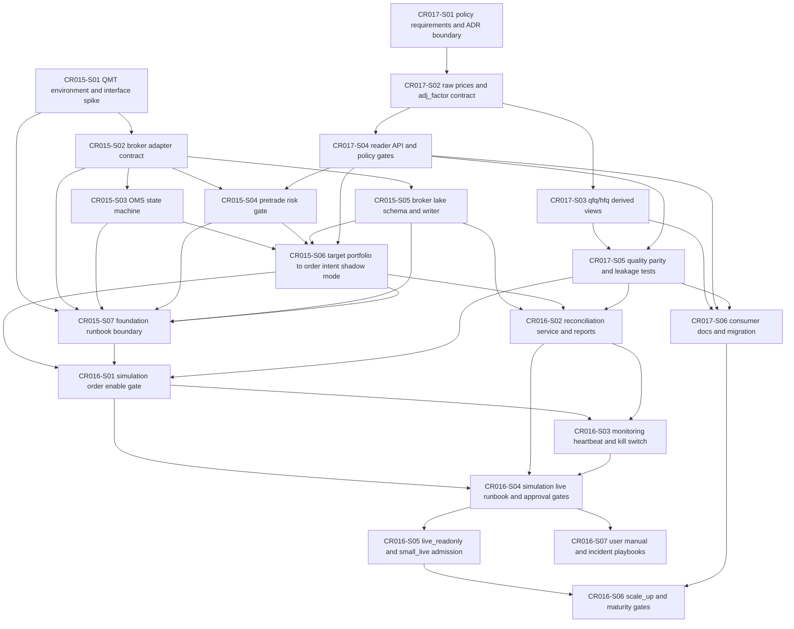

# CP4 自动预检：CR-015 / CR-016 / CR-017 Story DAG 与并行安全

## 结论

**PASS**。

CR-015 / CR-016 / CR-017 已按 CP3 人工审批后的 HLD / ADR 口径完成 Story Plan：20 个 Story、8 个 Wave、3 个建议 LLD 批次。DAG 静态检查无环、无无效引用；每个 Story 均已记录依赖类型、文件所有权、`lld_gate` 与 `dev_gate`；CP5 前 `implementation_allowed=false`。

本检查只覆盖 Story Plan / CP4 自动预检，不授权 LLD、不授权实现、不授权真实外部接口调用、不授权真实写入、不授权发布指针更新、不授权交易相关写操作、不授权读取敏感凭据或会话材料。

## Entry Criteria

| ID | 标准 | 证据 | 状态 |
|---|---|---|---|
| EC-01 | CR-015 / CR-016 / CR-017 CP3 HLD / ADR 已通过人工审批 | `checkpoints/CP3-CR015-CR016-CR017-HLD-REVIEW.md` 已回填 approved；handoff 记录用户批准进入 Story Plan / CP4 | PASS |
| EC-02 | 需求与场景基线足以拆分 Story | `process/USE-CASES.md` UC-10..UC-12、`process/REQUIREMENTS.md` REQ-098..REQ-122 已作为输入 | PASS |
| EC-03 | HLD / ADR 足以确定模块边界和关键依赖 | `process/HLD-QMT-TRADING.md`、`process/HLD-DATA-LAKE.md` §18、`process/HLD.md` §31、`process/ARCHITECTURE-DECISION.md` ADR-053..061 已作为输入 | PASS |
| EC-04 | 本阶段只允许 Story Plan / CP4 | 允许文件限定为 Story Backlog、Development Plan、Story Status、CR015/CR016/CR017 Story 卡片、本 CP4 文件与 handoff 结果摘要 | PASS |
| EC-05 | 禁止范围已明确 | Handoff 明确禁止 LLD、实现、依赖变更、真实外部操作、旧报告 / 旧数据覆盖 | PASS |

## Checklist

| ID | 检查项 | 结果 | 证据 |
|---|---|---|---|
| C-01 | Story 覆盖 CR-017 复权双视图影响范围 | PASS | CR017-S01..S06 覆盖需求/ADR 边界、raw prices / adj_factor 合同、qfq/hfq derived view、reader policy gate、质量与泄漏验证、consumer 迁移文档 |
| C-02 | Story 覆盖 CR-015 QMT foundation 影响范围 | PASS | CR015-S01..S07 覆盖环境与 transport 边界、broker adapter contract、OMS 状态机、pre-trade risk、broker lake schema、shadow order intent、foundation runbook |
| C-03 | Story 覆盖 CR-016 simulation / live activation 影响范围 | PASS | CR016-S01..S07 覆盖 simulation enable gate、对账、监控与 kill switch、runbook / approval gates、live_readonly / small_live admission、scale_up maturity gate、incident playbooks |
| C-04 | Story ID 与文件名稳定 | PASS | Story ID 使用 `CR015-Sxx-*`、`CR016-Sxx-*`、`CR017-Sxx-*`；slug 为 kebab-case；文件位于 `process/stories/` |
| C-05 | Story 卡片自给自足 | PASS | 20 张 Story 卡片均包含 `dev_context`、`validation_context`、`acceptance_criteria`、依赖、文件影响范围、禁止范围、LLD 输入 |
| C-06 | Wave 划分明确 | PASS | `process/STORY-BACKLOG.md` 与 `process/DEVELOPMENT-PLAN.yaml` 记录 8 个新增 Wave |
| C-07 | DAG 静态无环 | PASS | 依赖边从 CR017 contract / CR015 foundation 单向流向 CR016 activation，无下游回边 |
| C-08 | 无无效依赖引用 | PASS | 新增 DAG 节点均有对应 Story 行、Story 卡片和 Development Plan 条目；外部依赖只引用已存在 verified / approved 基线或 CP3 决策 |
| C-09 | 文件所有权明确 | PASS | 每个 Story 在 `DEVELOPMENT-PLAN.yaml` 中记录 `output_files`、primary/shared/forbidden/merge_owner |
| C-10 | 并行 LLD 安全 | PASS | `max_parallel_lld=3`；可按 7 个 LLD group 分轮写作；共享文件冲突在 LLD 阶段由 merge_owner 串行收敛 |
| C-11 | 开发并行安全 | PASS | CP5 前全部 `implementation_allowed=false`；CP5 后 CR017 数据层、CR015 foundation、CR016 activation 仍按 Wave / 文件所有权保守串行 |
| C-12 | CR017 对 CR015/CR016 的 contract 前置关系清楚 | PASS | CR015-S04、CR015-S06、CR016-S01/S02/S06 均依赖 CR017 reader / quality / migration 相关 Story |
| C-13 | CR015 foundation 不越界到真实激活 | PASS | CR015 Story 均限定 shadow / dry-run / mock foundation；simulation / live_readonly / small_live / scale_up 留给 CR016 阶段门控 |
| C-14 | CR016 later-gated 范围明确 | PASS | CR016-S05 / CR016-S06 标记为 `planned-later-gated`，不作为当前可直接实现项 |
| C-15 | CP5 前阻断项明确 | PASS | 本文件与 `process/STORY-BACKLOG.md` 均记录全量 LLD / CP5 未完成、CR017 未验证前阻断 scale_up、真实外部操作未授权、文件所有权冲突需 LLD 收敛 |
| C-16 | 禁止范围未触碰 | PASS | 本阶段未创建或修改 `*-LLD.md`，未修改业务代码、测试、依赖声明或锁文件，未执行真实外部操作 |
| C-17 | CP4 只作为自动预检 | PASS | 未生成 CP4 人工审查稿；本摘要可由 meta-po 汇入 CP5 Decision Brief |

## Story DAG 摘要

## Wave 与并行策略

| Wave | Story | parallel_lld | parallel_dev | 依赖 / 并行说明 |
|---|---|---|---|---|
| CR017-W1-ADJUSTMENT-CONTRACTS | CR017-S01、CR017-S02 | true | false | S01/S02 可与 CR015-S01 并行写 LLD；开发需同一合同所有者收敛 |
| CR017-W2-DERIVATION-READERS | CR017-S03、CR017-S04 | true-after-S02 | false | 依赖 S02；normalization 与 reader API 共享数据层文件，开发串行 |
| CR017-W3-CONSUMER-MIGRATION | CR017-S05、CR017-S06 | true-after-S03-S04 | false | 质量与消费迁移在 reader / derived view 明确后收敛 |
| CR015-W1-FOUNDATION-CONTRACTS | CR015-S01、CR015-S02 | true-after-S01-for-S02 | false | S01 可并行，S02 依赖环境 / transport contract |
| CR015-W2-OMS-RISK-LAKE | CR015-S03、CR015-S04、CR015-S05 | true-after-S02 | false | OMS、risk、broker lake 共享 trading 边界，开发保守串行 |
| CR015-W3-SHADOW-RUNBOOK | CR015-S06、CR015-S07 | true-after-W2 | false | order intent shadow mode 与 runbook 收敛 foundation |
| CR016-W1-SIMULATION-OPS-GATES | CR016-S01、CR016-S02、CR016-S03、CR016-S04 | true-after-CR015-foundation-and-CR017-quality | false | simulation / reconciliation / monitoring / approval gates 需按门控串行开发 |
| CR016-W2-LIVE-SCALE-DOCS-GATED | CR016-S05、CR016-S06、CR016-S07 | limited | false | S05/S06 later-gated；S07 文档只在 CP5 后跟随 runbook 边界 |

## LLD 设计批次建议

| LLD 批次 | Story 范围 | 建议用途 | CP5 备注 |
|---|---|---|---|
| CR017-ADJUSTMENT-DUAL-VIEW-BATCH-A | CR017-S01..S06 | 先冻结 raw / qfq / hfq / returns_adjusted 双视图口径与消费迁移边界 | 应作为 CR015/CR016 价格口径前置输入 |
| CR015-QMT-FOUNDATION-BATCH-A | CR015-S01..S07 | 冻结 QMT foundation、shadow / dry-run / mock、OMS、risk、broker lake 与 runbook 边界 | 不授权真实激活 |
| CR016-QMT-ACTIVATION-BATCH-A | CR016-S01..S07 | 冻结 simulation、live_readonly、small_live、scale_up 与 incident playbook 门控 | S05/S06 即使完成 LLD 也需 later-gated 决策 |

### 可并行 LLD 分组

| Group | Story | 前置条件 | 说明 |
|---|---|---|---|
| LLD-G1 | CR017-S01、CR017-S02、CR015-S01 | CP3 approved | 复权 contract 与 QMT 环境边界可并行起草 |
| LLD-G2 | CR015-S02、CR015-S03、CR017-S03 | G1 相关 contract 草案稳定 | adapter / OMS 与 qfq/hfq derived view 可并行，但共享文件需分别收敛 |
| LLD-G3 | CR017-S04、CR017-S05、CR015-S04 | CR017-S02/S03 与 CR015-S02 稳定 | reader gate、quality gate 与 pre-trade risk 对齐价格口径 |
| LLD-G4 | CR015-S05、CR015-S06、CR017-S06 | CR015-S03/S04 与 CR017-S04/S05 稳定 | broker lake、shadow intent 与 consumer migration 收敛 |
| LLD-G5 | CR015-S07、CR016-S01、CR016-S02 | CR015 foundation LLD 草案完整 | foundation runbook、simulation gate、对账可并行起草 |
| LLD-G6 | CR016-S03、CR016-S04、CR016-S05 | CR016-S01/S02 稳定 | 监控、runbook、live_readonly / small_live admission 分层收敛 |
| LLD-G7 | CR016-S06、CR016-S07 | CR016-S04/S05 与 CR017-S06 稳定 | scale_up later-gated 与用户文档 / playbook 收尾 |

## 开发串行 / 并行约束

| 约束 | 状态 | 说明 |
|---|---|---|
| CP5 前实现 | BLOCKED | 所有 Story `implementation_allowed=false` |
| CR017 数据层开发 | SERIAL_BY_SHARED_FILES | `market_data/contracts.py`、`normalization.py`、`readers.py`、`validation.py` 等共享文件由 LLD 指定 merge_owner 后串行 |
| CR015 foundation 开发 | SERIAL_BY_RISK_BOUNDARY | 环境 / adapter / OMS / risk / broker lake / shadow runbook 需保守串行，防止真实激活边界泄漏 |
| CR016 activation 开发 | GATED_SERIAL | 必须等待 CR015 foundation verified 与 CR017 quality/migration 关键门控；S05/S06 后续独立审批 |
| 文件所有权冲突 | NEED_LLD_RESOLUTION | 如 LLD 发现并行 Story 修改同一核心文件，必须拆分或串行，不得并发实现 |
| 真实外部操作 | NOT_AUTHORIZED | 当前批次禁止真实外部接口调用、真实写入、发布指针更新和交易相关写操作 |

## Exit Criteria

| ID | 标准 | 状态 | 说明 |
|---|---|---|---|
| XC-01 | Story Backlog 已记录 CR015/CR016/CR017 Story / Wave / DAG / 阻断项 | PASS | `process/STORY-BACKLOG.md` 已增量更新 |
| XC-02 | Development Plan 已记录 Wave / DAG / 文件所有权 / lld_gate / dev_gate / 并行策略 | PASS | `process/DEVELOPMENT-PLAN.yaml` 已增量更新 |
| XC-03 | Story Status 已记录 CR015/CR016/CR017 状态摘要 | PASS | `process/STORY-STATUS.md` 已增量更新 |
| XC-04 | Story 卡片已创建 | PASS | 20 张 CR015/CR016/CR017 Story 卡片已创建 |
| XC-05 | CP4 自动预检已写入 | PASS | 本文件已生成，结论 PASS |
| XC-06 | 无 CP5 前实现授权 | PASS | 全部新增 Story 保持 planned / planned-later-gated |

## Deliverables

| 交付物 | 路径 | 状态 |
|---|---|---|
| Story Backlog 增量 | `process/STORY-BACKLOG.md` | DONE |
| Development Plan 增量 | `process/DEVELOPMENT-PLAN.yaml` | DONE |
| Story Status 摘要 | `process/STORY-STATUS.md` | DONE |
| CR017 Story 卡片 | `process/stories/CR017-S01-adjustment-policy-requirements-and-adr-refresh.md` | DONE |
| CR017 Story 卡片 | `process/stories/CR017-S02-raw-prices-and-adj-factor-contract-hardening.md` | DONE |
| CR017 Story 卡片 | `process/stories/CR017-S03-qfq-hfq-derived-view-normalization.md` | DONE |
| CR017 Story 卡片 | `process/stories/CR017-S04-reader-api-and-policy-gates.md` | DONE |
| CR017 Story 卡片 | `process/stories/CR017-S05-validation-quality-parity-and-leakage-tests.md` | DONE |
| CR017 Story 卡片 | `process/stories/CR017-S06-research-qmt-consumer-docs-and-migration-guide.md` | DONE |
| CR015 Story 卡片 | `process/stories/CR015-S01-qmt-environment-and-interface-spike.md` | DONE |
| CR015 Story 卡片 | `process/stories/CR015-S02-qmt-broker-adapter-contract.md` | DONE |
| CR015 Story 卡片 | `process/stories/CR015-S03-oms-order-state-machine.md` | DONE |
| CR015 Story 卡片 | `process/stories/CR015-S04-pretrade-risk-gate.md` | DONE |
| CR015 Story 卡片 | `process/stories/CR015-S05-broker-lake-schema-and-writer.md` | DONE |
| CR015 Story 卡片 | `process/stories/CR015-S06-target-portfolio-to-order-intent-shadow-mode.md` | DONE |
| CR015 Story 卡片 | `process/stories/CR015-S07-docs-and-foundation-runbook-boundary.md` | DONE |
| CR016 Story 卡片 | `process/stories/CR016-S01-simulation-account-order-enable-gate.md` | DONE |
| CR016 Story 卡片 | `process/stories/CR016-S02-reconciliation-service-and-reports.md` | DONE |
| CR016 Story 卡片 | `process/stories/CR016-S03-monitoring-heartbeat-and-kill-switch.md` | DONE |
| CR016 Story 卡片 | `process/stories/CR016-S04-simulation-live-runbook-and-approval-gates.md` | DONE |
| CR016 Story 卡片 | `process/stories/CR016-S05-live-readonly-and-small-live-admission.md` | DONE |
| CR016 Story 卡片 | `process/stories/CR016-S06-scale-up-and-research-maturity-gates.md` | DONE |
| CR016 Story 卡片 | `process/stories/CR016-S07-docs-user-manual-and-incident-playbooks.md` | DONE |
| CP4 自动预检 | `process/checks/CP4-CR015-CR016-CR017-STORY-DAG-PARALLEL-SAFETY.md` | PASS |

## CP5 前阻断项

| ID | 阻断项 | 状态 | 解除条件 |
|---|---|---|---|
| CR15-17-CP4-BLK-001 | 20 个 Story 尚未生成全量 LLD | OPEN | meta-po 按 LLD 分组调度全部目标 Story 的 LLD |
| CR15-17-CP4-BLK-002 | CP5 自动预检与人工确认尚未发生 | OPEN | 全部目标 Story LLD、CP4 摘要与 CP5 自动预检完成后，由用户统一 approve |
| CR15-17-CP4-BLK-003 | CR017 复权双视图未验证前阻断 scale_up | OPEN | CR017-S01..S06 完成 LLD、实现、CP6/CP7 并经 meta-po 收敛 |
| CR15-17-CP4-BLK-004 | CR015 foundation 未验证前阻断 CR016 activation | OPEN | CR015-S01..S07 完成 LLD、实现、CP6/CP7 并经 meta-po 收敛 |
| CR15-17-CP4-BLK-005 | CR016-S05 / CR016-S06 属于 later-gated 范围 | OPEN | 用户对 live_readonly / small_live / scale_up 准入、资金上限、观察窗口和失败阈值作后续独立确认 |
| CR15-17-CP4-BLK-006 | 真实外部操作未授权 | OPEN | CP5 后仍需按具体 run / 阶段单独授权 |
| CR15-17-CP4-BLK-007 | 文件所有权冲突需 LLD 收敛 | OPEN | LLD 明确 merge_owner、串行合并顺序或拆分输出文件 |

## 需汇入 CP5 Decision Brief 的开放决策

| ID | 问题 | 当前建议 | 状态 |
|---|---|---|---|
| CR15-17-CP5-Q1 | 是否按 3 个 LLD 批次组织 CP5 全量确认 | 推荐按 CR017 / CR015 / CR016 三批起草，但 CP5 对全部目标 Story 统一发起人工确认 | OPEN |
| CR15-17-CP5-Q2 | CR016-S05 / CR016-S06 是否纳入本轮 LLD 全量批次但保持 later-gated | 推荐纳入 LLD 覆盖，以便完整定义边界；实现与真实阶段仍需后续审批 | OPEN |
| CR15-17-CP5-Q3 | 文件所有权冲突是否采用 merge_owner 串行合并 | 推荐采用 Development Plan 中的 merge_owner，并在 LLD 中复核 | OPEN |
