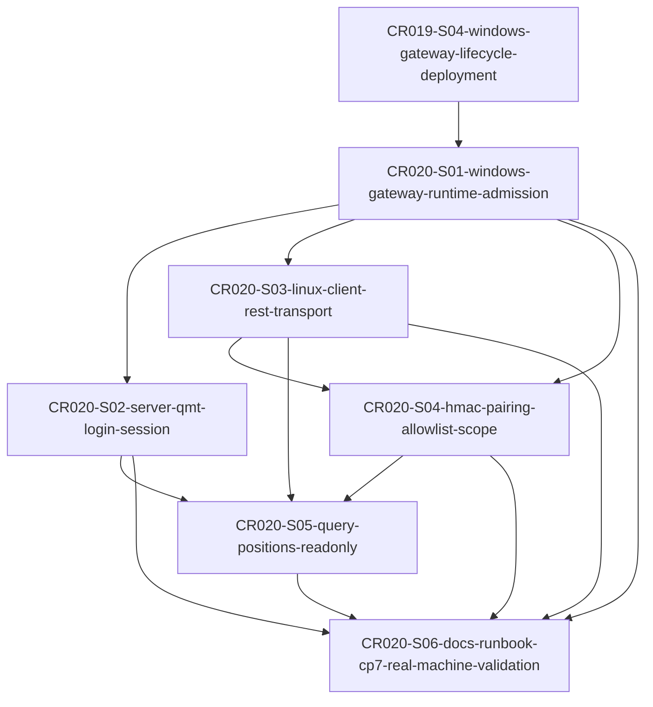

# CP4-CR020 Story Plan 自动预检

## 结论

**PASS**。CR-020 Story Plan 已按 CP3 approved 口径收敛为 6 个 Story、4 个 Wave、1 个全量 LLD 批次 `CR020-QMT-GATEWAY-READONLY-BATCH-A`。DAG 单向无环，文件 owner 已标注，CP5 前 `implementation_allowed=false`，本轮未授权 LLD、实现、依赖变更、gateway 启动、端口绑定、真实 `.env` 读取、QMT / MiniQMT / XtQuant 连接、凭据输出、交易、账户写入、simulation/live、provider/lake/publish 或 reports overwrite。

## Entry Criteria

| 条目 | 检查结果 | 证据 |
|---|---|---|
| CR-020 CP2 需求基线存在 | PASS | `checkpoints/CP2-CR020-REQUIREMENTS-BASELINE.md` |
| CR-020 CP3 HLD 人工审查 approved | PASS | `checkpoints/CP3-CR020-HLD-REVIEW.md` status=approved，DQ-CP3-CR020-01..07 accepted |
| CR-020 CP3 自动一致性 PASS | PASS | `process/checks/CP3-CR020-HLD-CONSISTENCY.md` |
| HLD §36 可作为 Story Plan 输入 | PASS | `process/HLD.md` §36，Story 候选为 S01..S06 / W1..W4 |
| Handoff 指定 story-planning / CP4 范围 | PASS | `process/handoffs/META-SE-CR020-STORY-PLANNING-2026-06-05.md` |
| 禁止范围已纳入规划门禁 | PASS | Development Plan `cr020_increment.no_real_operation_boundary` 与各 Story `dev_gate` |

## Checklist

| 检查项 | 结果 | 说明 |
|---|---|---|
| Story 数一致性 | PASS | HLD §36 候选为 6 个 Story；Backlog 追加 CR020-S01..S06；Development Plan `cr020_increment.story_count=6`；实际创建 6 张 Story 卡片 |
| Wave 数一致性 | PASS | HLD §36 候选为 4 个 Wave；Backlog 追加 CR020-W1..W4；Development Plan `cr020_increment.wave_count=4` |
| Story ID / 文件名一致 | PASS | 6 个 Story ID 与文件名一一对应：CR020-S01..S06 |
| ADR / DQ 追溯 | PASS | `ARCHITECTURE-DECISION.md` 追加 ADR-087..093 与 AD-Q82..AD-Q86，对齐 CP3 DQ-CP3-CR020-01..07 |
| DAG 无环 | PASS | 依赖单向：S01 -> S02/S03/S04，S03 -> S04，S02/S03/S04 -> S05，S01..S05 -> S06；无回边 |
| 无效引用 | PASS | 内部节点为 CR020-S01..S06；外部引用仅 CR019-S04 作为既有 gateway lifecycle contract |
| 孤立节点 | PASS | 无孤立 Story；S01 为内部根节点，S06 为汇总叶子节点 |
| 并行 LLD 策略 | PASS | `max_parallel_lld=3`；W1/W2 可按 Story/file owner 分轮起草 LLD；CP5 统一确认前不得实现 |
| 并行开发策略 | PASS | CP5 前全部 Story `implementation_allowed=false`；CP5 后开发仍需按依赖、文件 owner 和运行授权重新计算 |
| 文件 owner | PASS | 每张 Story 均定义 primary / shared / forbidden / merge_owner；共享文件由 Story owner 串行合并 |
| 依赖类型 | PASS | 每张 Story 均标注 dependency_type：gateway-runtime-contract、gateway-rest-contract、client-auth-contract、session-ready-runtime、readonly-query-contract 等 |
| LLD gate | PASS | 每张 Story `lld_gate.status=pending`、`cp5_required=true`，本轮不创建 LLD |
| Dev gate | PASS | 每张 Story `dev_gate.implementation_allowed=false`，且 credentials/QMT/service/runtime 等禁止项显式为 false |
| CP5 前 implementation_allowed=false | PASS | Backlog、Development Plan 和 6 张 Story 卡片均显式保持 false |
| CP6 / CP7 未启动 | PASS | Development Plan 标记 `cp6_status=not-started`、`cp7_status=not-started`；无 CP6/CP7 文件生成 |
| 不授权项 | PASS | 不授权 LLD、实现、依赖变更、gateway 启动、端口绑定、QMT / MiniQMT / XtQuant 连接、真实 `.env` 读取、凭据输出、交易、账户写入、simulation/live、provider/lake/publish/reports overwrite |
| 唯一只读接口 | PASS | CR020-S05 固定 `only_query_positions_allowed=true`，scope=`qmt:positions:read` |
| 凭据边界 | PASS | `.env` / `.env.*` 为 forbidden；`.env.example` 只允许 placeholder；credential_ref 必须 redacted |
| 真实运行边界 | PASS | 本轮未启动 gateway、未绑定端口、未连接 QMT、未读取 `.env`、未执行交易或数据写入 |

## Story / Wave 对照

| Wave | Story | 依赖 | 并行策略 |
|---|---|---|---|
| CR020-W1-GATEWAY-RUNTIME-SESSION | CR020-S01、CR020-S02 | S02 依赖 S01 | LLD 可分轮起草；开发默认 S01 -> S02 |
| CR020-W2-CLIENT-AUTH | CR020-S03、CR020-S04 | S03 依赖 S01；S04 依赖 S01/S03 | LLD 可按 owner 并行；开发默认 S03 -> S04 |
| CR020-W3-READONLY-POSITIONS | CR020-S05 | 依赖 S02/S03/S04 | 单 Story；等待上游合同冻结 |
| CR020-W4-DOCS-REAL-MACHINE-VALIDATION | CR020-S06 | 依赖 S01..S05 | 单 Story；文档和 CP7 evidence 最后汇总 |

## DAG 摘要

## Exit Criteria

| 条目 | 检查结果 | 说明 |
|---|---|---|
| `ARCHITECTURE-DECISION.md` 已追加 CR-020 ADR / AD-Q 增量 | PASS | ADR-087..093、AD-Q82..AD-Q86 |
| `STORY-BACKLOG.md` 已追加 CR-020 Story / Wave / DAG / 阻塞项 / 待确认项 | PASS | CR020-S01..S06、CR020-W1..W4、CR20-BLK、CR20-SP-Q |
| `DEVELOPMENT-PLAN.yaml` 已追加 CR-020 机器可读调度块 | PASS | `cr020_increment` |
| 6 张 Story 卡片已创建 | PASS | `process/stories/CR020-S01...md` 至 `CR020-S06...md` |
| CP5 前实现禁止 | PASS | `implementation_allowed=false` |
| 无 BLOCKING 缺失信息 | PASS | 无需进入 blocked；运行授权和真实机器验证均为后续门禁项 |

## Deliverables

| 产物 | 状态 |
|---|---|
| `process/ARCHITECTURE-DECISION.md` | UPDATED |
| `process/STORY-BACKLOG.md` | UPDATED |
| `process/DEVELOPMENT-PLAN.yaml` | UPDATED |
| `process/stories/CR020-S01-windows-gateway-runtime-admission.md` | CREATED |
| `process/stories/CR020-S02-server-qmt-login-session.md` | CREATED |
| `process/stories/CR020-S03-linux-client-rest-transport.md` | CREATED |
| `process/stories/CR020-S04-hmac-pairing-allowlist-scope.md` | CREATED |
| `process/stories/CR020-S05-query-positions-readonly.md` | CREATED |
| `process/stories/CR020-S06-docs-runbook-cp7-real-machine-validation.md` | CREATED |
| `process/checks/CP4-CR020-STORY-PLAN-PRECHECK.md` | CREATED |

## 后续交接建议

meta-po 回收后可将本 CP4 摘要汇入 CR-020 CP5 Decision Brief，组织 meta-dev 为 6 个 Story 产出全量 LLD。CP5 人工确认前不得进入实现；CP7 实机验证必须由 meta-po / meta-qa 在独立运行授权下发起，且验证范围仅限 `query_positions` 只读持仓查询。
