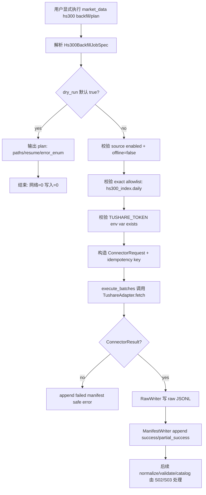

# LLD: CR005-S01 - Tushare connector 真实写湖边界

> 本 LLD 仅冻结 CR-005 CP5 Batch A 中 CR005-S01 的低层设计。`confirmed=false` 且 `implementation_allowed=false` 时，不得实现真实 Tushare connector、不得改依赖、不得执行真实联网测试、不得写真实 `data/**`。

## 0. 修订记录

| 版本 | 日期 | 修订人 | 变更要点 |
|---|---|---|---|
| 1.0 | 2026-05-17 | meta-dev | 基于 CR-005 CP3/CP4 approved 输入、HLD §22、ADR-013、STORY-015 verified raw/manifest/runtime 契约和 CR005-S01 Story 起草 CP5 Batch A LLD；范围限定 Tushare 显式写湖边界、`hs300_index` backfill job spec、manifest/idempotency/resume/partial success、凭据脱敏和默认离线 QA 输入。 |

## 1. Goal

创建可实现的 Tushare 真实写湖低层设计：保持 Tushare 默认 disabled、import 阶段无网络；只有 `market_data` 写湖 / 数据准备层在 source enabled、exact interface allowlist、`TUSHARE_TOKEN` env 存在、用户显式执行真实命令且 `dry_run=false` 时，才允许延迟导入真实 provider 并通过既有 runtime/storage 写 raw 与 manifest。

本 Story 同时冻结 `hs300_index` backfill job spec，使后续 CR005-S04 的 `remediation_job_spec` 可以指向同一机器参数集合，但消费层只能展示或返回该 spec，不得执行 fetch/backfill。

## 2. Requirements（Functional / Non-Functional）

### 2.1 Functional

- 默认配置中 `tushare` 继续 `enabled=false`，`MarketDataConfig.offline=true` 时网络调用次数必须为 0。
- `import market_data.connectors.tushare` 不得导入真实 Tushare provider、不得读取 token 值、不得联网、不得创建文件。
- `TushareAdapter.fetch(request)` 的前置校验顺序固定为：source enabled -> exact interface allowlist -> credential env var exists -> explicit real execution context；前三类缺失分别返回非重试 `source_disabled`、`interface_not_allowed`、`missing_credential`。
- Tushare 真实调用只能由 `market_data` 写湖 / 数据准备入口调用；Data Loader、实验入口、benchmark resolver、Backtrader adapter、Notebook 主路径均不得导入或调用 `market_data.connectors.tushare`、`market_data.runtime`、`market_data.storage`。
- 冻结 `hs300_index` backfill job spec：`target_dataset=hs300_index`、`source=tushare`、`interface=hs300_index.daily`、provider method `index_daily`、`index_code=399300.SZ`、start/end date、lake root、run id、resume policy、`dry_run=true` 默认、raw/manifest/canonical/quality/catalog/gold 输出路径和错误枚举。
- `dry_run=true` 时只返回 plan，不调用 provider，不写 raw、manifest、canonical、quality、catalog、gold，网络调用次数为 0。
- `dry_run=false` 且前置条件满足时，写湖链路只允许调用 connector/runtime/storage 写 raw + manifest；canonical/quality/catalog/gold 由 job 编排后续 normalization/validation/catalog 步骤，消费层不得自动触发。
- manifest / idempotency / resume / partial success contract 必须复用 STORY-015 的 `run_id + batch_id + source + interface + params_hash` 幂等键、append-only manifest 和 `success=skip, failed=retry, partial_success=retry` 默认续传策略。
- token 值不得进入 manifest、quality、catalog、stdout、stderr、日志、测试 fixture、文档示例值或错误消息；只允许引用环境变量名 `TUSHARE_TOKEN`。
- CP5 QA 输入必须默认使用 fake provider / fixture；真实网络测试只能在显式人工环境中执行，且不属于默认 pytest 阻塞路径。

### 2.2 Non-Functional

- 安全：所有输出路径、manifest record、错误 payload 和测试断言均不得包含真实 token 值；敏感参数继续通过 `storage.sanitize_params(...)` 和 `ManifestWriter._assert_no_sensitive_values(...)` 守门。
- 离线性：默认 `uv run --python 3.11 pytest -q tests/test_market_data_tushare_connector.py` 不需要 token、不联网。
- 可追溯：每个成功或部分成功 batch 必须可追溯到 run_id、batch_id、source、interface、params_hash、raw_path、raw_checksum、raw_row_count、status、error_type、retryable。
- 幂等：重复执行同一 run/batch/source/interface/params_hash 时，`success` batch 默认 skip；failed 和 partial_success 默认 retry；重复 success manifest 视为 resume conflict。
- 可维护：不在 S01 修改 `contracts.py` 全局 dataset schema；如需要追加全局 dataset/status 常量，由 CR005-S02 负责或在 CP5 后明确合并。

## 3. 模块拆分与职责

| 模块 / 文件组 | 职责 | 说明 |
|---|---|---|
| `market_data/connectors/tushare.py` | 保留默认 fail-fast，新增真实 provider 延迟导入分支的设计入口和错误映射 | import no-network；只有显式执行路径读取 env var 是否存在，不记录值。 |
| `market_data/config.py` | 声明 Tushare 默认 disabled、allowlist、credential env var、offline 默认和真实源配置校验 | `TUSHARE_TOKEN` 只作为 env var 名出现。 |
| `market_data/source_registry.py` | 登记 exact interface allowlist 与 target_dataset 映射 | 本 Story 至少冻结 `hs300_index.daily -> hs300_index`；`prices`/多 dataset 完整 registry 由 CR005-S02 统一扩展。 |
| `market_data/runtime.py` | 复用 `execute_batches(...)`、`ResumePolicy`、manifest 写入和 partial success status | 本 Story不重写 runtime，只定义 Tushare job 如何调用。 |
| `market_data/storage.py` | 复用 raw JSONL、manifest append、idempotency key、params 脱敏和敏感值防护 | token 禁止进入 record；参数中的敏感 key 必须 redacted。 |
| `market_data/cli.py` 或等价 job | 创建 `hs300_index` backfill plan/fetch job spec 的命令入口与 JSON 输出契约 | 默认 dry-run；S01 只 owns job spec 和 raw/manifest 写湖入口，不 owns S02/S03 的 schema/quality 细节实现。 |
| `tests/test_market_data_tushare_connector.py` | 覆盖 import no-network、disabled、missing token、not allowlisted、dry-run no-network、hs300 backfill plan、脱敏和 fake provider QA 输入 | 默认离线；真实网络测试只允许显式人工 marker，不进入默认命令。 |

## 4. 代码结构与文件影响范围

| 动作 | 文件路径 | 变更内容 |
|---|---|---|
| 修改 | `market_data/connectors/tushare.py` | 增加真实 provider 延迟导入边界、explicit execution context 参数检查、Tushare `index_daily` 错误映射和 safe error payload；保留默认 fail-fast。 |
| 修改 | `market_data/config.py` | 增加 Tushare allowlist 配置示例/默认值、真实 source 启用校验和 `offline`/`dry_run` 组合约束；不读取 token 值。 |
| 修改 | `market_data/source_registry.py` | 追加 exact interface `hs300_index.daily` 映射 `target_dataset=hs300_index`，并保证未知 interface 继续 `interface_not_allowed`。 |
| 修改 | `market_data/cli.py` | 增加 `hs300-index plan/backfill` 或等价 `backfill --target-dataset hs300_index` job spec 输出；默认 `dry_run=true`，输出路径规划、resume policy、error enum；真实执行前 fail fast。 |
| 修改 | `market_data/runtime.py` | 仅在实现确需暴露 job summary 时兼容追加 typed result 字段；不得改变 STORY-015 已验证的 `execute_batches(...)` 行为。 |
| 修改 | `market_data/storage.py` | 仅在实现确需扩展敏感值扫描时兼容追加 unsafe literal / key 检测；不得降低现有 manifest 字段校验。 |
| 创建 | `tests/test_market_data_tushare_connector.py` | 新增离线单元测试和 fixture，覆盖 S01 验收项。 |
| 不修改 | `pyproject.toml` / `uv.lock` | 本 LLD 阶段和默认实现不修改依赖；真实 `tushare` 包依赖只能在后续 CP5 人工确认后通过 `uv` 管理。 |
| 禁止 | `engine/data_loader.py`、`engine/backtest.py`、`experiments/**`、`market_data/readers.py`、`data/**`、`reports/**`、`delivery/**` | S01 不触碰消费层、真实数据、报告或交付包。 |

## 5. 数据模型与持久化设计

### 5.1 `Hs300BackfillJobSpec`

| 字段 | 类型 | 约束 | 说明 |
|---|---|---|---|
| `target_dataset` | `Literal["hs300_index"]` | 必填 | 兼容用户要求字段名；与 HLD 的 `dataset` 同义，输出中同时给出 `dataset`。 |
| `dataset` | `Literal["hs300_index"]` | 必填 | 下游 remediation spec 与 job 共用字段。 |
| `source` | `Literal["tushare"]` | 必填 | 只允许 Tushare 写湖 source。 |
| `interface` | `Literal["hs300_index.daily"]` | 必填 | exact interface；映射 provider `index_daily`。 |
| `provider_interface` | `Literal["index_daily"]` | 必填 | 仅在 job plan 中描述 provider method，不由 consumer 调用。 |
| `index_code` | `str` | 默认 `399300.SZ`；upper + strip；不得模糊匹配 | 沪深 300 指数代码候选。 |
| `start_date` / `end_date` | `str` | ISO `YYYY-MM-DD` 或 compact `YYYYMMDD` 输入；输出规范化为 ISO；`start_date <= end_date` | 请求范围或 quality gap 范围。 |
| `lake_root` | `str` | 必填；真实写入前必须存在可写父路径且不被普通文件占用 | 真实 lake root / `.gitignore` 策略仍是 OPEN。 |
| `run_id` | `str` | 必填或 deterministic 生成；不得含 token | 进入 manifest、quality、catalog lineage。 |
| `batch_id` | `str` | 每个 batch 必填 | 用于 raw path 和 idempotency key。 |
| `resume_policy` | `dict[str,str]` | 默认 `{success: skip, failed: retry, partial_success: retry, duplicate_manifest: fail}` | 与 `runtime.ResumePolicy` 对齐。 |
| `dry_run` | `bool` | 默认 `true` | true 时不联网不写湖。 |
| `raw_path` | `str` | plan 输出 | 规划形态：`raw/tushare/hs300_index.daily/<YYYYMMDD>/<batch_id>.jsonl`。 |
| `manifest_path` | `str` | plan 输出 | 规划形态：`manifest/market_data_manifest.jsonl`。 |
| `canonical_path` | `str` | plan 输出 | 规划形态：`canonical/hs300_index/<schema_version>/run_id=<run_id>/part-<batch_id>.parquet`；由 S02 normalization 生成。 |
| `quality_path` | `str` | plan 输出 | 规划形态：`quality/hs300_index/<run_id>/quality.csv` 或 S03 冻结等价路径。 |
| `catalog_path` | `str` | plan 输出 | 规划形态：`catalog/market_data_catalog.json` 或 S03 冻结等价路径。 |
| `gold_path` | `str` | plan 输出 | 规划形态：`gold/hs300_index/<schema_version>/...`；真实生成由 S03/S04 gate 冻结。 |
| `error_enum` | `list[str]` | 必含 HLD §22.6.2 枚举 | 见 5.4。 |

### 5.2 Manifest / raw contract

S01 复用现有 `MANIFEST_REQUIRED_FIELDS`，不删除字段。Tushare 写湖成功或部分成功时，manifest record 必须包含：

| 字段 | 规则 |
|---|---|
| `schema_version` | 使用 `contracts.SCHEMA_VERSION`。 |
| `run_id`、`batch_id`、`idempotency_key` | `idempotency_key = sha256(run_id|batch_id|source|interface|params_hash)`。 |
| `source`、`interface` | 固定 `tushare`、`hs300_index.daily`。 |
| `params` | 只包含脱敏后的 `target_dataset`、`index_code`、date range、batch metadata；不得包含 token 值。 |
| `params_hash` | 基于脱敏参数计算；token 不参与 hash。 |
| `status` | `success`、`partial_success`、`failed`、`skipped`、`circuit_open`、`orphan_raw`。 |
| `raw_path`、`raw_checksum`、`raw_row_count` | `success` / `partial_success` 时必填；failed 可为空。 |
| `canonical_path` | S01 raw 阶段可为 `None`；后续 normalization/catalog 不得依赖 S01 回写历史 manifest。 |
| `error_type`、`error_message`、`retryable` | failed 或 partial_success 时必填 safe payload；不得包含 token。 |
| `success_items`、`failed_items`、`backoff_seconds` | 复用 runtime 当前扩展字段；用于 partial success 和限频审计。 |

### 5.3 Resume / idempotency / partial success

| 场景 | 处理 |
|---|---|
| manifest 已有同 idempotency key 且 status=`success` | 默认 `skip`，返回 `skipped`，不重新联网，不重写 raw。 |
| manifest 已有 status=`failed` | 默认 `retry`，从失败 batch 重新执行；新 manifest append 新终态。 |
| manifest 已有 status=`partial_success` | 默认 `retry`，重新请求缺口或整批重试；必须保留旧 partial lineage。 |
| manifest 存在重复 success | 返回 `resume_conflict`，不联网，不写湖。 |
| raw 写入成功但 manifest append 失败 | 复用 `orphan_raw` quarantine contract；返回 `storage_error`，不得声明 success。 |
| provider 返回部分错误 | runtime status=`partial_success`，manifest 记录第一个 safe error，并写 `success_items` / `failed_items`；quality/catalog 后续必须能识别缺口。 |

### 5.4 Error enum

`hs300_index` job spec 的 `error_enum` 固定包含：

| error_type | retryable | 触发条件 | 暴露位置 |
|---|---|---|---|
| `source_disabled` | false | source 未启用、未传 `--enable-real-source` 或 `offline=true` 阻断真实执行 | connector/job stderr JSON、plan result |
| `interface_not_allowed` | false | interface 不在 exact allowlist | connector/job stderr JSON |
| `missing_credential` | false | `TUSHARE_TOKEN` env var 不存在 | connector/job stderr JSON；消息只写 env var 名 |
| `quota_or_rate_limited` | true | provider 返回配额、积分或限频错误 | manifest safe error、job summary |
| `remote_error` | true | provider 临时错误、超时、网络异常 | manifest safe error、job summary |
| `schema_mismatch` | false | provider row 字段不满足 S02 raw mapping 前置 | manifest safe error 或 normalization summary |
| `quality_failed` | false | 后续 validation/catalog 阶段质量失败 | job summary；不由 connector 伪造 available |
| `lake_root_invalid` | false | lake root 父路径被普通文件占用或真实写入策略未确认 | job stderr JSON |
| `resume_conflict` | false | manifest idempotency index 不可判定或重复 success | job stderr JSON |

S01 不要求立即修改 `contracts.CONNECTOR_ERROR_TYPES`；若实现要把新增 enum 升格为全局常量，必须在 CP5 中确认 `market_data/contracts.py` 的共享所有权或交由 CR005-S02 合并。

## 6. API / Interface 设计

| 接口 / 入口 | 输入 | 输出 | 调用方 | 说明 |
|---|---|---|---|---|
| `TushareAdapter(config).fetch(request)` | `ConnectorRequest(source="tushare", interface, params, run_id, batch_id, params_hash)` | `ConnectorResult` 或 `ConnectorError` | `market_data` job / runtime | 前置校验失败返回 safe `ConnectorError`；真实 provider 只在显式路径延迟导入。测试：`T-S01-CONNECTOR-01..05`。 |
| `resolve_interface("tushare", "hs300_index.daily", config)` | source、interface、config | `InterfaceSpec(name="hs300_index.daily", target_dataset="hs300_index")` 或 `SourceRegistryError` | CLI/job planner | exact mapping；未知 interface fail fast。测试：`T-S01-REGISTRY-01`。 |
| `build_hs300_backfill_plan(spec)` | `Hs300BackfillJobSpec` 参数 | JSON plan：dataset/source/interface/index_code/date range/lake_root/run_id/resume_policy/dry_run/path/error_enum | CLI/job, S04 remediation spec consumer | dry-run 默认；不联网不写湖。测试：`T-S01-PLAN-01`。 |
| `cmd_hs300_backfill(args)` 或等价 job | CLI args 或 remediation spec | dry-run plan 或 execution summary | 用户显式执行 | `dry_run=true` 默认；`dry_run=false` 才进入 runtime。测试：`T-S01-DRYRUN-01`、`T-S01-REAL-GATE-01`。 |
| `execute_batches([...], TushareAdapter(...), layout, RuntimePolicy, ResumePolicy)` | batch requests、adapter、layout、policy | `BatchExecutionResult[]` + raw/manifest | job execution path | 复用 STORY-015；S01 只定义 Tushare request 形态。测试：`T-S01-RESUME-01`、`T-S01-PARTIAL-01`。 |
| `sanitize_params(params)` / `ManifestWriter.append(record, layout)` | manifest params/record | redacted manifest JSONL 或 `CredentialExposureError` | runtime/storage | token 值不得写入。测试：`T-S01-TOKEN-01`。 |

本节接口对应的测试均列入第 10 节。

## 7. 核心处理流程



异常路径：

1. import `market_data.connectors.tushare`：只加载本模块和协议对象，不导入 provider，不读取 env，不联网。
2. plan/dry-run：只执行参数校验、路径规划和 JSON 输出；provider 调用次数为 0。
3. real execution 前置失败：返回结构化 JSON 错误，退出码使用现有 CLI usage/execution 语义，不写 raw/manifest。
4. provider 限频或远端错误：按 retryable 错误进入 runtime retry；重试耗尽后 append failed manifest。
5. partial success：写 raw 成功行，manifest status=`partial_success`；下游 quality/catalog 必须将缺口映射为 gap / unavailable，不得声明完整 available。
6. token 泄漏检测失败：返回 `credential_exposure` 或 `storage_error`，不得继续写 manifest；测试 fixture 不包含真实 token。

## 8. 技术设计细节

- 关键算法 / 规则：
  - exact interface：`hs300_index.daily` 是唯一 S01 冻结的 hs300 interface；provider method 为 Tushare `index_daily`，参数 `ts_code=399300.SZ`，日期参数由 provider adapter 在真实分支转换。
  - params 脱敏：manifest params 不包含 token；如果 CLI 参数中出现 `token`、`secret`、`password`、`cookie`、`session`、`key` 片段，写入 `<redacted>`。
  - idempotency：复用 `compute_params_hash(sanitize_params(params))` 和 `compute_idempotency_key(...)`。
  - resume：默认 `ResumePolicy(success="skip", failed="retry", partial_success="retry", duplicate_manifest="fail")`；job plan 必须显示该策略。
  - path planning：raw/manifest 路径复用 `LakeLayout`；canonical/quality/catalog/gold 路径在 plan 中只作为后续目标，不在 dry-run 创建。
- 依赖选择与复用点：
  - 复用 STORY-015 的 `ConnectorRequest`、`ConnectorResult`、`ConnectorError`、`execute_batches`、`RawWriter`、`ManifestWriter`。
  - 不新增真实 provider 依赖到 `pyproject.toml` / `uv.lock`，除非后续 CP5 人工确认并通过 `uv add`。
- 兼容性处理：
  - 当前 `market_data/cli.py` 只支持 `prices`，S01 实现需兼容追加 hs300 backfill 入口，不破坏现有 `plan/fetch/normalize/validate/read/compare`。
  - 当前 `SOURCE_REGISTRY[SOURCE_TUSHARE]` 只登记 `prices.daily`；S01 追加 `hs300_index.daily` 不得移除旧接口。
  - 当前 `TushareAdapter.fetch` 返回 `ConnectorError`；真实分支必须保持返回类型仍为 `ConnectorResult | ConnectorError`，不抛裸 provider 异常。
- 图示类型选择：流程图；本 Story 跨 CLI/config/registry/connector/runtime/storage 6 个模块，已补 Mermaid 图。

## 9. 安全与性能设计

| 维度 | 设计措施 | 验证方式 |
|---|---|---|
| 安全 | token 只以 env var 名 `TUSHARE_TOKEN` 出现；manifest、quality、catalog、stdout/stderr、日志、fixture、文档示例值均禁止 token 值 | `T-S01-TOKEN-01` 使用哨兵字符串扫描所有输出；静态 `rg` 检查 fixture 不含 token 示例值 |
| 安全 | consumer 禁止导入 connector/runtime/storage；S01 forbidden path 不修改 `engine/**`、`experiments/**`、`market_data/readers.py` | CP5/CP6 静态文件范围检查；后续 S04/S06 另做 consumer import 扫描 |
| 安全 | dry-run 默认 true；真实执行必须显式 `--dry-run false` 或等价确认，并满足 source enabled / allowlist / token / lake root | `T-S01-DRYRUN-01`、`T-S01-REAL-GATE-01` |
| 性能 | 默认串行、保守 throttle；CR5-Q1 未确认前不冻结高并发或高频策略 | OPEN `O-S01-01`；真实 provider 测试仅人工环境 |
| 性能 | resume success skip 避免重复请求，failed/partial retry 有上限 | `T-S01-RESUME-01` |
| 可追溯 | 每个 batch 记录 run_id、batch_id、params_hash、raw_checksum、row_count、status、error_type | manifest fixture 断言 |

## 10. 测试设计

| 测试场景 | 前置条件 | 操作 | 预期结果 | 验证方式 |
|---|---|---|---|---|
| `T-S01-IMPORT-01` import no-network | monkeypatch socket/provider import 哨兵 | import `market_data.connectors.tushare` | provider import 次数 0；网络调用次数 0；不读取 env | pytest monkeypatch |
| `T-S01-CONNECTOR-01` disabled fail fast | default `AdapterConfig(enabled=False)` | `TushareAdapter.fetch(ConnectorRequest(...hs300_index.daily...))` | `ConnectorError(error_type="source_disabled", retryable=False)` | pytest |
| `T-S01-CONNECTOR-02` not allowlisted | enabled true, allowlist 不含 interface | fetch | `interface_not_allowed`，不调用 provider | pytest |
| `T-S01-CONNECTOR-03` missing token | enabled true, allowlist 命中，无 env | fetch | `missing_credential`，message 只含 env var 名，不含值 | pytest |
| `T-S01-CONNECTOR-04` explicit context missing | enabled + allowlist + fake env，但未显式真实执行 | fetch | fail fast，不联网 | pytest |
| `T-S01-REGISTRY-01` exact mapping | Tushare enabled config allowlist 包含 `hs300_index.daily` | `resolve_interface(...)` | target_dataset=`hs300_index`；unknown interface 失败 | pytest |
| `T-S01-PLAN-01` hs300 plan fields | CLI/job plan args | 生成 plan | 至少包含 dataset/source/interface/index_code/start/end/lake_root/run_id/resume_policy/dry_run/raw/manifest/canonical/quality/catalog/gold/error_enum | pytest JSON 断言 |
| `T-S01-DRYRUN-01` dry-run no side effect | tmp lake root，provider spy | 执行默认 backfill plan | 网络调用 0；raw/manifest/canonical/quality/catalog/gold 写入 0 | pytest tmp_path |
| `T-S01-REAL-GATE-01` real execution gate | `dry_run=false` 但缺 enabled/allowlist/token 任一项 | 执行 job | 结构化错误；不写湖 | 参数化 pytest |
| `T-S01-RESUME-01` idempotency/resume | tmp manifest 已有 success/failed/partial records | 重新执行 batch | success skip；failed/partial retry；重复 success -> `resume_conflict` | pytest fixture |
| `T-S01-PARTIAL-01` partial success contract | fake provider 返回 rows + partial_errors | execute job | raw 写成功行；manifest status=`partial_success`；failed_items > 0 | fake provider fixture |
| `T-S01-TOKEN-01` token 不暴露 | env 设为哨兵 `secret-value` | 执行 fail/plan/fake success 路径 | manifest/stdout/stderr/error/fixture 输出中哨兵出现次数 0 | pytest + string scan |
| `T-S01-QA-INPUT-01` 默认离线 QA | 无 token、网络不可用 | `uv run --python 3.11 pytest -q tests/test_market_data_tushare_connector.py` | 测试不需要真实 Tushare、不联网 | pytest |

真实网络测试不进入默认测试命令；若后续人工环境需要，必须使用显式 marker 和真实 lake root，并由 meta-qa 单独记录，不得把返回样本或 token 写入仓库。

## 11. 实施步骤

| TASK-ID | 动作 | 目标文件 | 详细描述 | 对应测试 |
|---|---|---|---|---|
| CR005-S01-T1 | 修改 | `market_data/connectors/tushare.py` | 保留 fail-fast，增加 explicit real execution context、延迟 provider 导入边界、`index_daily` 参数映射和 safe error mapping | `T-S01-IMPORT-01`、`T-S01-CONNECTOR-01..04`、`T-S01-TOKEN-01` |
| CR005-S01-T2 | 修改 | `market_data/config.py` | 增加 Tushare allowlist 默认/校验，保持 disabled/offline 默认；真实 source 缺 allowlist fail fast | `T-S01-REAL-GATE-01` |
| CR005-S01-T3 | 修改 | `market_data/source_registry.py` | 追加 `hs300_index.daily -> hs300_index` exact mapping；未知接口继续失败 | `T-S01-REGISTRY-01` |
| CR005-S01-T4 | 修改 | `market_data/cli.py` | 增加 `hs300_index` backfill plan/job spec，默认 dry-run，输出路径、resume policy、error enum；真实执行前置校验 | `T-S01-PLAN-01`、`T-S01-DRYRUN-01`、`T-S01-REAL-GATE-01` |
| CR005-S01-T5 | 修改 | `market_data/runtime.py` | 如需追加 job summary 字段，只做兼容扩展；保持 `execute_batches` 已验证行为 | `T-S01-RESUME-01`、`T-S01-PARTIAL-01` |
| CR005-S01-T6 | 修改 | `market_data/storage.py` | 如需强化敏感值扫描，只能增加检查，不能放松 manifest required fields | `T-S01-TOKEN-01` |
| CR005-S01-T7 | 创建 | `tests/test_market_data_tushare_connector.py` | 创建默认离线测试，覆盖 connector gate、plan/dry-run、resume、partial success、token 脱敏和 fake provider QA 输入 | 全部 S01 测试 |

每个文件影响项均由至少一个 TASK-ID 覆盖；不触碰 forbidden path。

## 12. 风险、难点与预研建议

| 风险 / 难点 | 影响 | 缓解措施 / 预研建议 |
|---|---|---|
| Tushare 5000 档限频、积分消耗和字段细节未确认 | 无法安全冻结真实 provider batch size、throttle 和重试默认值 | 保持真实执行保守串行；CP5 人工确认前只冻结接口边界和 dry-run spec；真实参数进入 OPEN。 |
| 真实 lake root 与 `.gitignore` 策略未确认 | 真实写入可能污染仓库或生成大文件 | dry-run 默认；真实写入前要求用户显式 lake root 且 fail fast 检查父路径；不得写 `data/**` 大文件。 |
| `CONNECTOR_ERROR_TYPES` 当前不含 HLD 新枚举 | 实现时若强行修改 `contracts.py` 会越过 S01 所有权 | S01 先在 job spec 层冻结 error enum；全局 constants 由 CP5 指定 merge owner 或交由 S02 扩展。 |
| provider 依赖未加入项目 | 真实 fetch 分支实现可能缺包 | import 阶段不导入 provider；真实依赖只能在 CP5 批次批准后通过 `uv add` 加入，不属于本 LLD 起草范围。 |
| partial success 后下游误判完整可用 | hs300 benchmark 可能错误 available | manifest 标记 `partial_success`，S02/S03/S04 必须以 quality/catalog 判定 available；S01 plan 不声明 benchmark available。 |

### OPEN / Spike 跟踪

| ID | 类型（OPEN / Spike） | 问题 | 下一动作 | 责任方 |
|---|---|---|---|---|
| O-S01-01 | OPEN | CR5-Q1：Tushare 5000 档 exact 限频、积分消耗和可用字段未确认，影响 batch planner、throttle、retry 默认值和 provider 参数。 | CP5 人工审查前由用户 / 数据源 owner 确认；未确认时真实 provider 成功路径不得作为默认实现验收。 | 用户 / 数据源 owner |
| O-S01-02 | OPEN | CR5-Q4：真实数据 lake root 与 `.gitignore` 策略未确认，影响真实写入是否允许在工作树内执行。 | CP5 或真实执行 runbook 明确 lake root；默认只在 `tmp_path` / 人工确认目录测试。 | 用户 / meta-po |
| O-S01-03 | OPEN | 是否把 `quota_or_rate_limited`、`remote_error`、`schema_mismatch`、`lake_root_invalid`、`resume_conflict` 升格进 `contracts.CONNECTOR_ERROR_TYPES`。 | CP5 确认文件所有权；若需要全局常量，交由 CR005-S02 或共享 merge owner 处理。 | meta-po / meta-dev |

## 13. 回滚与发布策略

- 发布方式：CP5 Batch A 人工确认后，按 TASK-ID 小步实现；默认测试仍离线；真实网络路径必须由显式人工环境启用。
- 回滚触发条件：
  - import 或 dry-run 出现网络调用；
  - token 值进入 manifest/stdout/stderr/quality/catalog/fixture；
  - consumer path 直接调用 Tushare、runtime 或 storage；
  - `dry_run=true` 写入任何 lake 文件；
  - `pyproject.toml` / `uv.lock` 未经 CP5 批准被修改。
- 回滚动作：
  - 撤回 `market_data/connectors/tushare.py`、`config.py`、`source_registry.py`、`cli.py` 中 S01 变更；
  - 删除 `tests/test_market_data_tushare_connector.py` 中 S01 测试；
  - 保留 STORY-015 已验证 runtime/storage/raw/manifest 基线；
  - 不删除真实数据目录，因为 S01 默认不得写真实数据；若人工环境写入，按 run_id 和 lake root 手动隔离。

## 14. Definition of Done

- [ ] LLD 14 个可见章节完整，frontmatter 包含 `tier`、`shared_fragments`、`open_items`。
- [ ] `confirmed=false` 且 CP5 Batch A 人工确认前不进入实现。
- [ ] `TushareAdapter` 默认 disabled、import no-network、missing token / not allowlisted fail fast 设计已覆盖。
- [ ] `market_data` 写湖 / 数据准备层是唯一允许显式调用 Tushare 的层；consumer 禁止调用。
- [ ] `hs300_index` backfill job spec 字段完整，含 target_dataset、source、exact interface、index_code、date range、lake root、run id、resume policy、dry-run 默认、raw/manifest/canonical/quality/catalog/gold path 和 error enum。
- [ ] manifest / idempotency / resume / partial success contract 与 STORY-015 对齐。
- [ ] token 值禁止进入 manifest、quality、catalog、stdout/stderr、日志、测试 fixture 或文档示例值。
- [ ] CP5 QA 输入明确：fake provider / fixture 默认离线，真实网络只允许显式人工环境。
- [ ] 未修改 `pyproject.toml` / `uv.lock`，未写真实数据，未进入 CP6/CP7。

## 人工确认区

> **CP5 - CR005-S01 Story LLD 可实现性门**
> meta-dev 已写入 `process/checks/CP5-CR005-S01-tushare-connector-real-lake-writer-LLD-IMPLEMENTABILITY.md` 自动预检结果。
> meta-po 收齐 CR005-BATCH-A 内 CR005-S01 与 CR005-S02 的 LLD 和 CP5 自动预检后，再生成并提示用户审查 `checkpoints/CP5-CR005-BATCH-A-LLD-BATCH.md`。
> 用户统一确认本轮批次 LLD 设计后，仍需满足依赖门控与文件所有权门控方可进入实现。

**CP5 checklist 摘要**：

| # | 检查项 | 状态 | 证据 |
|---|---|---|---|
| 1 | LLD 覆盖 AC | 待检查 | 第 2 / 10 / 14 节 |
| 2 | 与 HLD / ADR 一致 | 待检查 | 第 3 / 8 / 12 节 |
| 3 | 文件影响范围明确 | 待检查 | 第 4 / 11 节 |
| 4 | 接口契约完整 | 待检查 | 第 6 节 |
| 5 | 测试与 dev_gate 可计算 | 待检查 | 第 10 / 14 节 |

**人工确认回复**：

请直接回复以下任一整行：

```text
approve
修改: <具体修改点>
reject
```

**人工审查结果回填**：

- 结论：`approved | changes_requested | rejected`
- 审查人：
- 审查时间：
- 修改意见：
- 风险接受项：
