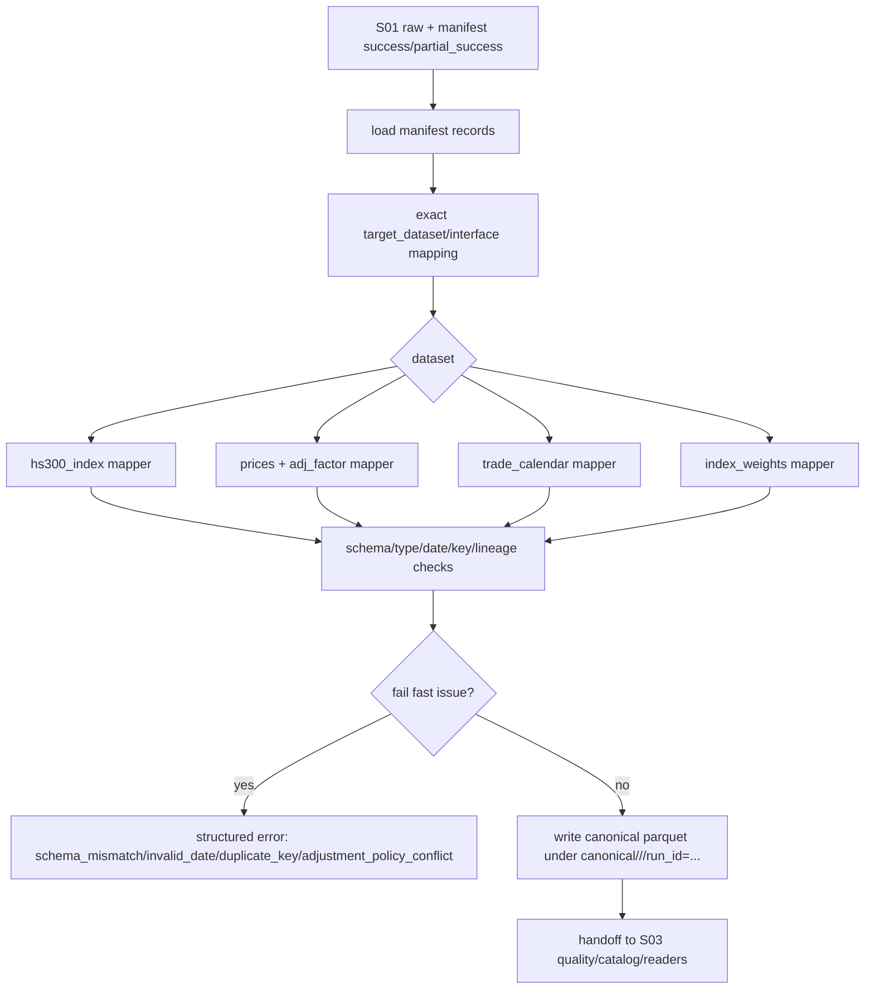

# LLD: CR005-S02 - Tushare 多 dataset schema、PIT 字段与复权 normalization

> 本 LLD 仅冻结 CR-005 CP5 Batch A 中 CR005-S02 的低层设计。`confirmed=false` 且 `implementation_allowed=false` 时，不得修改 schema/normalization 代码、不得导入真实 provider、不得写真实数据、不得进入 reader/quality/benchmark/Backtrader 实现。

## 0. 修订记录

| 版本 | 日期 | 修订人 | 变更要点 |
|---|---|---|---|
| 1.0 | 2026-05-17 | meta-dev | 基于 CR-005 CP3/CP4 approved 输入、HLD §22、ADR-014/017、STORY-016 verified canonical/quality/reader 基线、CR005-S01 LLD job spec 与 CR005-S02 Story 起草 CP5 Batch A LLD；范围限定多 dataset schema、exact interface registry、`hs300_index` raw->canonical 映射、PIT 可得性字段、`prices` + `adj_factor` 复权 normalization、typed status 和 S03/S04 交接要求。 |

## 1. Goal

创建可实现的多 dataset schema 与 normalization 设计：在 `market_data/contracts.py`、`source_registry.py`、`normalization.py` 中冻结 `prices`、`hs300_index`、`trade_calendar`、`index_weights` 及 `adj_factor` 关联行情层的 exact schema、source/interface 映射、PIT 可得性字段和复权价格契约。

本 Story 必须让后续 CR005-S03 能实现 quality/catalog/readers/PIT gate，让 CR005-S04 能基于本地 `hs300_index` schema 实现 typed `BenchmarkResult`，同时禁止 consumer 猜测 Tushare 字段、绕过 exact mapping 或重新计算复权口径。

## 2. Requirements（Functional / Non-Functional）

### 2.1 Functional

- 至少 4 个 P0 dataset 具备常量、schema、key columns、sort rule 和 typed status：`prices`、`hs300_index`、`trade_calendar`、`index_weights`。
- Tushare P0 interface 至少 4 个 exact mapping 到 target_dataset；禁止 fuzzy、contains、相似度、大小写猜测或接口别名自动推断。
- `hs300_index` raw -> canonical 映射必须列出 raw field、canonical field、type、nullable、unit、key、dedupe rule、sort rule、date parser、index code normalization、missing policy。
- `hs300_index` canonical 必须包含 `trade_date`、`index_code`、`close`、`pct_chg` 或 `pre_close`、`benchmark_kind`、`source`、`source_interface`、`source_run_id`、`schema_version`、`available_at`、`lineage_raw_checksum` 或等价 lineage。
- `prices` 行情层必须保存 `adj_factor` 与统一 `adjustment_policy` 下的 adjusted price；收益、技术指标、forward return 和 Backtrader OHLCV feed 不得下游重新选择复权口径。
- 非行情 dataset 必须定义 `available_date`、`effective_date`、`available_at`；as-of join 规则为消费日只允许读取 `available_at <= decision_time` 的记录。
- `trade_calendar`、`index_weights`、`prices` / `adj_factor` 与 `hs300_index` 的 schema registry 关系必须明确。
- 缺字段、未来可得性、复权口径混用、duplicate key 和非法日期必须 fail fast 或输出 structured unavailable / schema status，不得静默修正。
- normalization 不读取 `TUSHARE_TOKEN`，不导入 `market_data.connectors.tushare`，不联网，不写 reader/experiment/Backtrader 范围。
- CP5 QA 输入必须记录：`next_action` 字段表一致性和 fake backfill 后 resolver available 的后续跨 Story 集成测试，作为 S03/S04 交接要求。

### 2.2 Non-Functional

- 可追溯：canonical/gold 每行可追到 `source`、`source_interface`、`source_run_id`、`lineage_raw_checksum` 或等价 raw lineage。
- 可验证：默认测试使用 raw/manifest fixture，不需要 token、不联网、不写真实 `data/**`。
- 可维护：schema 只允许显式常量和表驱动 mapping；新增 dataset 必须同步 contracts、registry、normalization、quality/readers。
- 一致性：单次 normalization run 的 `adjustment_policy` 必须唯一；冲突直接失败。
- 防未来函数：PIT 字段缺失或 `available_at > decision_time` 在 S03 gate 中阻断消费；S02 先保证字段存在、可解析、类型明确。

## 3. 模块拆分与职责

| 模块 / 文件组 | 职责 | 说明 |
|---|---|---|
| `market_data/contracts.py` | 增加 dataset 常量、schema registry、key columns、typed status、PIT 字段、adjusted price 字段和 error/status 枚举 | 只做契约常量/轻量结构，不导入 pandas/provider。 |
| `market_data/source_registry.py` | 增加 Tushare exact interface -> target_dataset 映射，标注行情/非行情、PIT/复权需求 | 与 S01 的 `hs300_index.daily` 保持一致。 |
| `market_data/normalization.py` | 扩展 raw/manifest -> canonical normalization，支持多 dataset mapping、lineage 校验、date parser、duplicate key、adjusted price 生成 | 不读 token，不导入 connector/runtime。 |
| `tests/test_market_data_tushare_datasets.py` | 覆盖 exact mapping、schema、非法日期、duplicate key、PIT 字段、复权冲突、hs300 字段类型/单位和 S03/S04 交接断言 | 默认离线 fixture。 |
| CR005-S01 LLD | 提供 `hs300_index` backfill job spec、raw/manifest result contract、source/interface/run lineage | S02 消费 raw/manifest，不拥有 connector。 |
| CR005-S03/S04 交接 | S03 消费 schema 做 quality/catalog/readers/PIT gate；S04 消费 `hs300_index` schema 做 resolver available/unavailable | 本 LLD 必须明确交接字段和后续集成测试。 |

## 4. 代码结构与文件影响范围

| 动作 | 文件路径 | 变更内容 |
|---|---|---|
| 修改 | `market_data/contracts.py` | 增加 `DATASET_HS300_INDEX`、`DATASET_INDEX_WEIGHTS`、可选 `DATASET_ADJ_FACTOR`、schema registry、key columns、required columns、PIT fields、adjusted price fields、typed status constants。 |
| 修改 | `market_data/source_registry.py` | 增加 exact mapping：`hs300_index.daily`、`prices.daily`、`prices.adj_factor`、`trade_calendar.daily`、`index_weights.snapshot` 或 `index_weights.daily` 的冻结映射；未知 dataset/interface fail fast。 |
| 修改 | `market_data/normalization.py` | 扩展 `map_raw_to_dataset(...)`、`load_manifest_success_records(...)`、`normalize_run(...)` 或新增 dataset-specific normalizer；实现 `hs300_index` raw->canonical、PIT 字段校验、prices+adj_factor adjusted price 合并。 |
| 创建 | `tests/test_market_data_tushare_datasets.py` | 新增离线 fixture 测试，覆盖 S02 验收项与 S03/S04 交接要求。 |
| 禁止 | `market_data/connectors/tushare.py` | S02 不修改 connector；S01 拥有 Tushare 写湖入口。 |
| 禁止 | `market_data/readers.py` | reader/quality gate 属于 CR005-S03。 |
| 禁止 | `engine/**`、`experiments/**`、`data/**`、`reports/**`、`delivery/**` | S02 不触碰消费层、真实数据、报告或交付包。 |

## 5. 数据模型与持久化设计

### 5.1 Dataset registry

| Dataset | Category | Exact interface | Provider method | Key columns | PIT / 复权要求 |
|---|---|---|---|---|---|
| `hs300_index` | market benchmark | `hs300_index.daily` | Tushare `index_daily` | `trade_date,index_code` | `available_at` required；`benchmark_kind` required；quality denominator 由 `trade_calendar` 提供。 |
| `prices` | market prices | `prices.daily` | Tushare `daily` 或 CP5 冻结等价 | `trade_date,symbol` | 必须与 `adj_factor` 合并或保存 adjusted prices；`adjustment_policy` run-level 唯一。 |
| `adj_factor` | market adjustment | `prices.adj_factor` | Tushare `adj_factor` | `trade_date,symbol` | 作为 `prices` adjusted price 生成输入；可独立 canonical 或合并到 `prices`。 |
| `trade_calendar` | non-market calendar | `trade_calendar.daily` | Tushare `trade_cal` | `trade_date,exchange` | `is_open`、`pretrade_date`；作为 coverage denominator。 |
| `index_weights` | non-market weights | `index_weights.snapshot` | Tushare `index_weight` | `trade_date,index_code,con_code` | 必须有 `effective_date`、`available_date`、`available_at`，供 as-of join。 |

### 5.2 Typed status

| 状态 | 适用对象 | 含义 | 行为 |
|---|---|---|---|
| `normalized` | normalization result | raw/manifest 成功映射并写出 canonical | 可进入 S03 quality。 |
| `unavailable` | dataset status | dataset 不存在或非必需数据不可用 | S03/S04 可返回 typed unavailable。 |
| `required_missing` | dataset status | 必需 dataset 缺失 | S04 benchmark required 时返回 required_missing。 |
| `schema_mismatch` | normalization error | 必需字段缺失或类型不可转换 | fail fast，不写 canonical。 |
| `invalid_date` | normalization error | 日期不符合 `%Y%m%d` 或 ISO date | fail fast。 |
| `duplicate_key` | normalization error / quality issue | canonical key 重复 | S02 可 fail fast；S03 quality 必须阻断 available。 |
| `future_availability` | PIT gate status | `available_at > decision_time` | S03 reader/PIT gate 阻断消费。 |
| `adjustment_policy_conflict` | normalization error | 同一 run 混用 qfq/hfq/none 或 adjusted price 来源冲突 | fail fast。 |
| `quality_failed` | S03/S04 status | quality CSV fail | S04 不得 available。 |
| `policy_unconfirmed` | benchmark status | CR5-Q2 口径未冻结 | 可 normalization，但 S04 available 路径不得宣称最终 hs300 benchmark。 |

### 5.3 `hs300_index` raw -> canonical exact mapping

默认 raw 来源为 Tushare `index_daily(ts_code="399300.SZ")`，exact interface 为 `hs300_index.daily`。字段表如下；实现时 raw fixture 必须完全覆盖 required raw fields。

| Raw field | Canonical field | Type | Nullable | Unit | Key | Dedupe rule | Sort rule | Date parser / normalization | Missing policy |
|---|---|---|---|---|---|---|---|---|---|
| `ts_code` | `index_code` | `str` | false | Tushare code | yes | duplicate key fail | sort after `trade_date` | `strip().upper()`；必须等于 spec `index_code`，默认 `399300.SZ` | `schema_mismatch` |
| `trade_date` | `trade_date` | `date` serialized `YYYY-MM-DD` | false | date | yes | duplicate key fail | primary sort asc | parse `%Y%m%d`; ISO 输入也可接受并输出 ISO | `invalid_date` |
| `close` | `close` | `float64` | false | index point | no | n/a | n/a | numeric cast | `schema_mismatch` |
| `pre_close` | `pre_close` | `float64` | true if `pct_chg` exists | index point | no | n/a | n/a | numeric cast | require one of `pre_close` or `pct_chg` |
| `pct_chg` | `pct_chg` | `float64` | true if `pre_close` exists | percent points | no | n/a | n/a | numeric cast, not fraction | require one of `pre_close` or `pct_chg` |
| `open` | `open` | `float64` | true | index point | no | n/a | n/a | numeric cast | nullable; if missing, not used for available benchmark minimum |
| `high` | `high` | `float64` | true | index point | no | n/a | n/a | numeric cast | nullable |
| `low` | `low` | `float64` | true | index point | no | n/a | n/a | numeric cast | nullable |
| `vol` | `volume` | `float64` | true | provider native | no | n/a | n/a | numeric cast | nullable |
| `amount` | `amount` | `float64` | true | provider native | no | n/a | n/a | numeric cast | nullable |
| manifest `source` | `source` | `str` | false | n/a | no | n/a | n/a | exact from manifest | `schema_mismatch` |
| manifest `interface` | `source_interface` | `str` | false | n/a | no | n/a | n/a | exact `hs300_index.daily` | `schema_mismatch` |
| manifest `run_id` | `source_run_id` | `str` | false | n/a | no | n/a | n/a | exact from manifest | `schema_mismatch` |
| manifest / raw checksum | `lineage_raw_checksum` | `str` | false | sha256 | no | n/a | n/a | exact from manifest `raw_checksum` | `schema_mismatch` |
| contract constant | `schema_version` | `str` | false | n/a | no | n/a | n/a | `SCHEMA_VERSION` | `schema_mismatch` |
| config / policy | `benchmark_kind` | `str` | false | enum | no | n/a | n/a | `price_index` candidate; CR5-Q2 未确认时另标 `policy_unconfirmed` | `policy_unconfirmed` |
| derived | `available_at` | timezone aware string | false | timestamp | no | n/a | n/a | default next local availability after trade_date close, or provider/manifest supplied | `schema_mismatch` |

`hs300_index` canonical key 为 `trade_date + index_code`，排序为 `trade_date ASC, index_code ASC`。任一重复 key 在 S02 normalization 中 fail fast；S03 quality 仍需再次统计 duplicate key count。

### 5.4 `prices` + `adj_factor` adjusted price contract

| 字段 | Type | Nullable | 规则 |
|---|---|---|---|
| `trade_date` | date string | false | parse `%Y%m%d` / ISO，输出 `YYYY-MM-DD`。 |
| `symbol` | str | false | Tushare `ts_code` 规范化为 upper；不做模糊证券代码纠错。 |
| `open/high/low/close` | float64 | false | 原始未复权行情；非正价格进入 schema/quality fail。 |
| `adj_factor` | float64 | false for adjusted output | 来自 exact interface `prices.adj_factor` 或 provider 等价输入；缺失则不能生成 adjusted price。 |
| `adjustment_policy` | enum `qfq/hfq/none` | false | 单次 run 唯一；默认候选 `qfq` 与 ADR 历史决策一致，CP5 可冻结。 |
| `adjusted_open/high/low/close` | float64 | false for adjusted output | 由行情层生成或从等价 provider adjusted price 显式写入；下游只消费这些字段计算收益/指标/forward return。 |
| `available_at` | timestamp string | false | 行情日线默认 trade_date 收盘后可得，沿用 STORY-016 fake 规则或 provider supplied。 |
| `source/source_interface/source_run_id/schema_version/lineage_raw_checksum` | str | false | lineage 必填。 |

复权口径规则：

- 同一 `run_id + dataset=prices` 只能存在一个 `adjustment_policy`。
- 如果 raw 同时提供 adjusted price 与 adj_factor，必须验证二者一致或选择单一来源；冲突返回 `adjustment_policy_conflict`。
- 如果 `adjustment_policy="none"`，则 adjusted 字段可以等于 raw OHLC，但必须显式记录 `none`，不得省略。
- 下游 S03/S04/S06 不得重新计算复权因子，只能消费本层字段。

### 5.5 非行情 PIT 字段与 as-of join 规则

| Dataset | Required PIT fields | Join key | As-of rule |
|---|---|---|---|
| `index_weights` | `effective_date`、`available_date`、`available_at` | `index_code,con_code` | 对每个 `decision_time`，选择 `available_at <= decision_time` 且 `effective_date <= trade_date` 的最新记录；key 不唯一时 fail。 |
| `stock_basic`（P1 预留） | `effective_date`、`available_date`、`available_at` | `symbol` | 股票池过滤只能读取已可得状态；缺字段 unavailable。 |
| `trade_calendar` | `trade_date`、`is_open`、`pretrade_date` | `exchange` | 作为时间轴和 coverage denominator；不参与未来可得性信号，但日期必须合法。 |

S02 负责字段存在、类型和日期合法；S03 负责 reader/PIT gate 检查 `available_at <= decision_time` 并输出 structured unavailable 或 quality fail。

## 6. API / Interface 设计

| 接口 / 入口 | 输入 | 输出 | 调用方 | 说明 |
|---|---|---|---|---|
| `contracts.DATASET_*` / schema registry | 无运行输入 | dataset constants、required columns、key columns、typed status | normalization、validation、tests | 测试：`T-S02-CONTRACT-01`。 |
| `resolve_interface(source, interface, config)` | `source="tushare"`、exact interface | `InterfaceSpec(name, target_dataset)` 或 `SourceRegistryError` | S01 job、normalization planner | 禁止 fuzzy；测试：`T-S02-REGISTRY-01`。 |
| `map_raw_to_dataset(manifest_record, target_dataset=None, interface_map=None)` | manifest record + optional target_dataset | dataset exact string 或 `DatasetMappingError` | `normalize_run` | 扩展支持 hs300/trade_calendar/index_weights/prices；测试：`T-S02-MAP-01`。 |
| `normalize_run(manifest_path, lake_root, dataset, run_id=None, thresholds=None)` | manifest、lake_root、dataset | `NormalizationResult` + canonical paths + typed status | CLI/job、S03 quality | 多 dataset 分派；测试：`T-S02-NORM-*`。 |
| `normalize_hs300_index(record, raw_rows, layout)` | manifest success record + raw rows | hs300 canonical frame | `normalize_run` | exact field mapping、date parser、dedupe、lineage；测试：`T-S02-HS300-01..06`。 |
| `normalize_prices_with_adjustment(records, raw_rows)` | prices daily + adj_factor records | prices canonical frame with adjusted OHLC | `normalize_run` | adjustment policy 唯一；测试：`T-S02-ADJ-01..04`。 |
| `validate_pit_fields(dataset, frame)` | canonical frame | typed pass/error | normalization/S03 handoff | 缺 PIT 字段 fail；测试：`T-S02-PIT-01`。 |

本节每个接口均在第 10 节有对应测试。

## 7. 核心处理流程



异常路径：

1. unknown interface / unknown target_dataset：`DatasetMappingError`，不写 canonical。
2. required raw field missing：`CanonicalSchemaError` / `schema_mismatch`，不写 canonical。
3. illegal date：`invalid_date`，不写 canonical。
4. duplicate key：`duplicate_key`，不写 canonical；S03 仍需 quality 再验。
5. missing PIT fields for non-market dataset：`schema_mismatch` 或 `required_missing` typed status，阻断 consumer。
6. `available_at` 解析失败：`schema_mismatch`；`available_at > decision_time` 由 S03 PIT gate 返回 `future_availability`。
7. adjustment policy mixed：`adjustment_policy_conflict`，不写 canonical。
8. raw checksum / source_run_id 不一致：`ManifestLineageError`，不写 canonical。

## 8. 技术设计细节

- 关键算法 / 规则：
  - Dataset mapping 使用显式 `target_dataset` 优先；未提供时只用 exact interface mapping；两者冲突时 fail fast。
  - 日期 parser 接受 `%Y%m%d` 和 ISO `YYYY-MM-DD`，输出统一 ISO；其他格式 `invalid_date`。
  - `index_code` normalization 只做 `strip().upper()`；不做相似匹配，不把非 `399300.SZ` 自动改为默认值。
  - key dedupe 在写 parquet 前执行；`hs300_index` key 为 `trade_date,index_code`。
  - adjusted price 生成由 `prices` 与 `adj_factor` 按 `trade_date,symbol` exact join；缺 adj factor 或冲突时 fail。
  - PIT as-of join 只冻结规则，不在 S02 reader 中执行；S02 输出字段和测试 fixture，S03 实现 gate。
- 依赖选择与复用点：
  - 复用 STORY-016 的 manifest/raw 读取、canonical parquet 原子写入、lineage 校验思路。
  - 复用 S01 的 `hs300_index.daily` job spec 和 manifest contract。
  - 不导入 connector/runtime，normalization 只读 raw/manifest。
- 兼容性处理：
  - 现有 `prices` canonical 最小字段继续兼容，但 CR005-S02 追加 adjusted price 字段后，旧 fixture 若缺字段应明确走旧 schema version 或 fail；不得静默混合。
  - `trade_calendar` 既有占位 dataset 名称保留，补齐 schema 而不改名。
  - `index_members` 旧占位不等同 `index_weights`；本 CR 新增 `index_weights`，避免字段语义混用。
- 图示类型选择：流程图；本 Story 跨 contracts/source_registry/normalization/S01/S03/S04 多模块，已补 Mermaid 图。

## 9. 安全与性能设计

| 维度 | 设计措施 | 验证方式 |
|---|---|---|
| 安全 | normalization 不导入 connector/runtime，不读取 `TUSHARE_TOKEN`，不联网 | `T-S02-BOUNDARY-01` 静态扫描 + monkeypatch env |
| 安全 | raw fixture 不含真实 Tushare 返回样本或 token；只构造最小合成字段 | 测试 fixture review；`rg` token 哨兵 |
| 安全 | future availability 不进入 reader 消费；S02 输出字段，S03 gate 阻断 | `T-S02-PIT-01` + S03 handoff |
| 性能 | 表驱动 mapping 和 pandas vectorized cast/dedupe；不在 normalization 中请求远端 | pytest 大小适中 fixture |
| 性能 | `adj_factor` join 按 key 排序并校验唯一，避免笛卡尔积 | `T-S02-ADJ-03` duplicate fixture |
| 可追溯 | 每行保留 source/interface/run/raw checksum/schema version | `T-S02-LINEAGE-01` |

## 10. 测试设计

| 测试场景 | 前置条件 | 操作 | 预期结果 | 验证方式 |
|---|---|---|---|---|
| `T-S02-CONTRACT-01` dataset constants | import contracts | 检查常量/schema registry | 至少 `prices`、`hs300_index`、`trade_calendar`、`index_weights` 有 schema/key/status | pytest |
| `T-S02-REGISTRY-01` exact mappings | Tushare source spec | resolve P0 exact interfaces | 至少 4 个 exact mapping；unknown interface 100% fail fast | pytest |
| `T-S02-MAP-01` target_dataset 优先 | manifest params 含 target_dataset | `map_raw_to_dataset` | exact target dataset 返回；冲突/未知失败 | pytest |
| `T-S02-HS300-01` hs300 raw mapping | 合成 `index_daily` raw + manifest | normalize hs300 | canonical 字段、类型、单位、key、sort、lineage 全部满足 | pandas/pyarrow |
| `T-S02-HS300-02` hs300 illegal date | raw `trade_date` 非法 | normalize hs300 | `invalid_date`，不写 canonical | pytest |
| `T-S02-HS300-03` hs300 duplicate key | 两行同 `trade_date,index_code` | normalize hs300 | `duplicate_key`，不写 canonical | pytest |
| `T-S02-HS300-04` hs300 missing required field | 缺 `close` 或 `ts_code` | normalize hs300 | `schema_mismatch` | pytest |
| `T-S02-HS300-05` index code normalization | raw `ts_code` 含空格/小写 | normalize hs300 | 输出 `399300.SZ`；非目标 code fail | pytest |
| `T-S02-HS300-06` benchmark policy status | CR5-Q2 未冻结 | normalize/metadata | 输出 `benchmark_kind` 字段，并保留 `policy_unconfirmed` handoff，不让 S04 available | pytest + LLD handoff check |
| `T-S02-ADJ-01` adjusted prices generated | prices daily + adj_factor fixture | normalize prices | 输出 adjusted OHLC、adj_factor、adjustment_policy | pytest |
| `T-S02-ADJ-02` adjustment policy conflict | 同 run 两种 policy | normalize prices | `adjustment_policy_conflict` | pytest |
| `T-S02-ADJ-03` adj_factor duplicate key | adj_factor key 重复 | normalize prices | duplicate fail | pytest |
| `T-S02-PIT-01` non-market PIT fields | index_weights 缺 available_at | normalize index_weights | schema fail / required_missing typed status | pytest |
| `T-S02-CALENDAR-01` trade calendar schema | trade_cal fixture | normalize trade_calendar | `trade_date,exchange,is_open,pretrade_date` 合法，非法日期 fail | pytest |
| `T-S02-BOUNDARY-01` no token/provider | 无 token、网络不可用 | import/execute normalization tests | 不导入 connector，不读取 env，不联网 | static scan + monkeypatch |
| `T-S02-HANDOFF-01` next_action 字段表交接 | 读取本 LLD 和 S04 handoff contract | 检查 S03/S04 交接要求 | 明确 `next_action` 字段表一致性由 S04 LLD 冻结，S02/S03 提供 target_dataset/source/interface/date range 输入 | 文档断言 |
| `T-S02-HANDOFF-02` fake backfill -> resolver available 交接 | fake raw/manifest/canonical/quality fixture 设计 | 标记跨 Story 集成测试 | S03/S04 必须实现 fake backfill 后 resolver 从 missing 转 available；默认不联网 | CP5 QA checklist |

## 11. 实施步骤

| TASK-ID | 动作 | 目标文件 | 详细描述 | 对应测试 |
|---|---|---|---|---|
| CR005-S02-T1 | 修改 | `market_data/contracts.py` | 增加多 dataset constants、schema registry、key columns、PIT fields、adjusted price fields、typed status constants | `T-S02-CONTRACT-01` |
| CR005-S02-T2 | 修改 | `market_data/source_registry.py` | 增加 Tushare exact interface -> target_dataset 映射；禁止 unknown/fuzzy | `T-S02-REGISTRY-01`、`T-S02-MAP-01` |
| CR005-S02-T3 | 修改 | `market_data/normalization.py` | 扩展 map/load/normalize 分派；实现 hs300/trade_calendar/index_weights/prices+adj_factor schema/type/date/key/lineage 校验 | `T-S02-HS300-*`、`T-S02-CALENDAR-01`、`T-S02-PIT-01` |
| CR005-S02-T4 | 修改 | `market_data/normalization.py` | 实现 adjusted price 生成、`adjustment_policy` 唯一性和 adj_factor duplicate/missing fail fast | `T-S02-ADJ-01..03` |
| CR005-S02-T5 | 创建 | `tests/test_market_data_tushare_datasets.py` | 创建合成 raw/manifest fixture，覆盖 exact mapping、字段缺失、非法日期、重复 key、PIT 字段、复权冲突、no-token/no-provider boundary | 全部 S02 测试 |
| CR005-S02-T6 | 创建 | `tests/test_market_data_tushare_datasets.py` | 增加 S03/S04 交接断言：`next_action` 字段表一致性、fake backfill 后 resolver available 集成测试必须被后续 Story 消费 | `T-S02-HANDOFF-01`、`T-S02-HANDOFF-02` |

每个 TASK-ID 与第 4 节文件影响范围一一对应；S02 不修改 connector、reader、engine、experiments、数据或报告文件。

## 12. 风险、难点与预研建议

| 风险 / 难点 | 影响 | 缓解措施 / 预研建议 |
|---|---|---|
| CR5-Q1 Tushare 字段与 5000 档限制未确认 | raw mapping 可能与真实 provider 字段有差异 | CP5 先冻结 candidate exact mapping；真实实现前用人工环境验证字段，差异通过 LLD 修改或 CR 处理。 |
| CR5-Q2 hs300 benchmark 口径未确认 | `benchmark_kind` 和 available 路径不能最终声明 | Schema 先保留 `benchmark_kind` 和 `policy_unconfirmed`；S04 available path 必须等待口径冻结。 |
| S01 job spec 未经 CP5 批准 | S02 raw/manifest 输入 contract 仍未正式 frozen | Batch A 同批确认；S02 实现前 dev_gate 等待 S01 LLD confirmed。 |
| `prices` 复权口径设计过早绑定 provider | 未来 pro_bar / daily+adj_factor 方案切换可能返工 | LLD 同时记录主选 `daily + adj_factor` 与备选 provider adjusted price；切换条件是 CP5/真实字段验证。 |
| S03/S04 交接测试缺失 | schema 可写但 resolver available 闭环未证明 | 在本 LLD DoD 和 CP5 预检中强制记录 fake backfill -> quality/catalog -> resolver available 集成测试为 S03/S04 REQUIRED 输入。 |

### OPEN / Spike 跟踪

| ID | 类型（OPEN / Spike） | 问题 | 下一动作 | 责任方 |
|---|---|---|---|---|
| O-S02-01 | OPEN | CR5-Q1：真实 Tushare 5000 档字段、积分消耗、限频未确认，可能影响 `index_daily`、`daily`、`adj_factor`、`trade_cal`、`index_weight` 字段细节。 | CP5 前接受 candidate mapping；真实实现前由数据源 owner 人工核验字段。 | 用户 / 数据源 owner |
| O-S02-02 | OPEN | CR5-Q2：`hs300_index` 采用价格指数、全收益指数或其他口径未确认。 | 在 S04 LLD 冻结 benchmark policy；未确认前 available 路径只能返回 `policy_unconfirmed` / unavailable。 | 用户 / meta-se |
| O-S02-03 | OPEN | `prices` adjusted price 主选 `daily + adj_factor` 还是 provider adjusted output。 | CP5 人工确认主选为 `daily + adj_factor`；若选 provider adjusted output，必须补一致性校验。 | meta-dev / meta-qa / 用户 |
| O-S02-04 | OPEN | `next_action` 机器字段表由 CR005-S04 拥有，S02 只能交接 target_dataset/source/interface/date range。 | S04 LLD 必须把 `next_action.type=run_data_layer_backfill` 等字段列为条件必填；CP5 Batch B2 检查。 | meta-po / CR005-S04 owner |

## 13. 回滚与发布策略

- 发布方式：CP5 Batch A 人工确认后，按 TASK-ID 实现；默认只用合成 raw/manifest fixture 和 tmp lake root 验证，不接触真实 Tushare。
- 回滚触发条件：
  - normalization 导入 connector/runtime、读取 `TUSHARE_TOKEN` 或联网；
  - schema registry 允许 fuzzy/contains/相似度推断；
  - `hs300_index` duplicate key、非法日期、缺字段未 fail fast；
  - `prices` 缺 adj_factor 或混用 adjustment_policy 却仍生成 adjusted price；
  - S02 修改 `market_data/connectors/tushare.py`、`market_data/readers.py`、`engine/**`、`experiments/**` 或写真实 `data/**`。
- 回滚动作：
  - 撤回 `market_data/contracts.py`、`source_registry.py`、`normalization.py` 中 S02 变更；
  - 删除 `tests/test_market_data_tushare_datasets.py`；
  - 保留 STORY-016 已验证 `prices` 最小 canonical/quality/reader 基线；
  - 若临时测试写入 tmp lake root，删除 tmp 目录；不得删除仓库真实数据目录。

## 14. Definition of Done

- [ ] LLD 14 个可见章节完整，frontmatter 包含 `tier`、`shared_fragments`、`open_items`。
- [ ] `confirmed=false` 且 CP5 Batch A 人工确认前不进入实现。
- [ ] `hs300_index` raw -> canonical exact 字段映射、类型、nullable、单位、key、dedupe、sort、date parser、index code normalization、missing policy 已完整列出。
- [ ] `prices` 与 `adj_factor` / adjusted price / `adjustment_policy` 契约已冻结。
- [ ] 非行情数据 `available_date` / `effective_date` / `available_at` 和 PIT as-of join 规则已冻结。
- [ ] `trade_calendar`、`index_weights`、`prices` / `adj_factor` 与 `hs300_index` 的 schema registry 关系已明确。
- [ ] 缺字段、未来可得性、复权口径混用、duplicate key、非法日期的 fail fast / structured unavailable 行为已明确。
- [ ] CP5 QA 输入已记录：`next_action` 字段表一致性和 fake backfill 后 resolver available 后续跨 Story 集成测试作为 S03/S04 交接要求。
- [ ] 未实现代码，未修改 `pyproject.toml` / `uv.lock`，未写真实数据，未进入 CP6/CP7。

## 人工确认区

> **CP5 - CR005-S02 Story LLD 可实现性门**
> meta-dev 已写入 `process/checks/CP5-CR005-S02-tushare-dataset-schema-normalization-LLD-IMPLEMENTABILITY.md` 自动预检结果。
> meta-po 收齐 CR005-BATCH-A 内 CR005-S01 与 CR005-S02 的 LLD 和 CP5 自动预检后，再生成并提示用户审查 `checkpoints/CP5-CR005-BATCH-A-LLD-BATCH.md`。
> 用户统一确认本轮批次 LLD 设计后，仍需满足依赖门控与文件所有权门控方可进入实现。

**CP5 checklist 摘要**：

| # | 检查项 | 状态 | 证据 |
|---|---|---|---|
| 1 | LLD 覆盖 AC | 待检查 | 第 2 / 5 / 10 / 14 节 |
| 2 | 与 HLD / ADR 一致 | 待检查 | 第 3 / 8 / 12 节 |
| 3 | 文件影响范围明确 | 待检查 | 第 4 / 11 节 |
| 4 | 接口契约完整 | 待检查 | 第 6 节 |
| 5 | 测试与 dev_gate 可计算 | 待检查 | 第 10 / 14 节 |

**人工确认回复**：

请直接回复以下任一整行：

```text
approve
修改: <具体修改点>
reject
```

**人工审查结果回填**：

- 结论：`approved | changes_requested | rejected`
- 审查人：
- 审查时间：
- 修改意见：
- 风险接受项：
