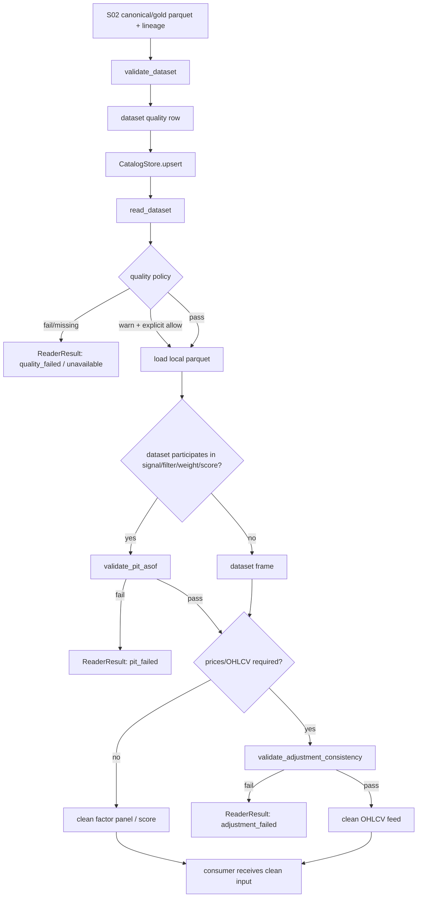

# LLD: CR005-S03 - 多 dataset quality/catalog/readers 与 PIT/复权 gate

> 本 LLD 已通过 CP5 Batch B1 / S03 人工确认，可作为 `CR005-S03` 实现输入。实现仍必须仅限本 Story 允许文件，不得进入 CP6/CP7、S04/S05/S06、Backtrader、真实联网、真实 Tushare fetch、真实写 lake 或依赖修改。

## 修订记录

| 版本 | 日期 | 修订人 | 变更要点 |
|---|---|---|---|
| 1.0 | 2026-05-17 | meta-dev | 基于 CR005-S03 Story、CR005-S02 LLD/CP7、HLD §22.6/§22.8/§22.9、ADR-014/ADR-017 与 Batch A lake root 决策，起草 S03 quality/catalog/readers/PIT/复权 gate LLD。 |

## 1. Goal

创建 CR005-S03 的实现设计，使 `market_data/validation.py`、`market_data/catalog.py`、`market_data/readers.py` 在后续实现中能够为 `prices`、`hs300_index`、`trade_calendar`、`index_weights` 等 P0 dataset 提供统一 quality CSV、catalog entry、只读 reader、PIT as-of gate、复权一致 gate 与 `hs300_index` 专项 accuracy gate；完成后实验、轻量回测和 Backtrader 只能消费已通过本地质量门、PIT 门和复权门的数据输入。

## 2. Requirements（Functional / Non-Functional）

### 2.1 Functional

- 修改 `market_data/validation.py`，实现多 dataset quality 规则、coverage/denominator/thresholds、`fetch_status` 与 `dataset_status` 分离、`quality_status` 聚合、PIT as-of gate、复权一致 gate 和 `hs300_index` 专项 accuracy gate。
- 修改 `market_data/catalog.py`，实现多 dataset catalog entry 的 upsert/get/list 设计，记录 schema version、coverage、quality status、latest manifest run、quality path 与 lineage 摘要。
- 修改 `market_data/readers.py`，实现默认离线的本地只读 dataset reader，支持 `prices` 以外 dataset 的过滤读取，并输出已通过 quality/PIT/复权 gate 的 factor panel、score 或 OHLCV feed 契约。
- 创建 `tests/test_market_data_multidataset_quality_readers.py`，覆盖 quality gate、catalog、reader、PIT as-of、复权一致、`hs300_index` accuracy gate 与 no-network/no-connector import。
- 每个 P0 dataset quality CSV 必须至少输出 20 个字段或等价完整字段集，并包含 `fetch_status`、`dataset_status`、`quality_status`、coverage numerator/denominator/ratio、thresholds、run/source/interface/lineage。
- `hs300_index` quality CSV 必须包含 `benchmark_kind`、coverage denominator、missing trade dates、gap reason、duplicate key count、source lineage、raw checksum 或等价 lineage、quality thresholds。
- quality `fail` 必须阻断 reader；quality `warn` 只有显式 `quality_policy` 允许时可放行；缺数据必须返回 structured unavailable / required_missing，不自动补数。
- 非行情数据参与信号、过滤、权重或 score 前，PIT as-of join 后 100% 记录必须满足 `available_at <= decision_time`。
- `adjustment_policy` 混用、`adj_factor` 缺失、adjusted price 缺失或收益/指标/forward return 使用未复权价格时，消费成功次数必须为 0。
- Backtrader adapter 只能消费本 Story reader 输出的干净 factor panel、score 或 OHLCV feed；Backtrader 不承担 PIT、复权、quality gate、fetch/backfill。

### 2.2 Non-Functional

- 默认离线：S03 代码不得导入 `market_data.connectors`、`market_data.runtime`，不得读取 `TUSHARE_TOKEN`，默认网络调用次数为 0。
- 只读边界：reader 不写 raw、manifest、canonical、quality、catalog、gold，也不执行 remediation/backfill job。
- Lake root 边界：真实 lake root 必须由显式 `lake_root` 或 `MARKET_DATA_LAKE_ROOT` 提供；未配置时返回 structured missing / fail fast，不默认写仓库内真实 `data/**`。
- 可追溯：quality/catalog/reader 错误必须保留 dataset、requested date range、source/interface、run_id、manifest_run_id、lineage 或缺失原因。
- 可验证：默认验证使用 tmp lake root、合成 parquet、quality CSV 和静态 import 扫描，不需要 token、不联网、不写真实 lake。
- 可维护：新增 dataset 必须同步 contracts、normalization、validation、catalog、readers；禁止 fuzzy/contains/similarity 推断 dataset 或 source interface。

## 3. 模块拆分与职责

| 模块 / 文件组 | 职责 | 说明 |
|---|---|---|
| `market_data/validation.py` | 实现 dataset quality 计算、quality CSV 行模型、coverage threshold、PIT as-of 校验、复权一致校验、`hs300_index` accuracy gate | 消费 S02 canonical schema，不导入 connector/runtime，不写 raw/manifest/canonical。 |
| `market_data/catalog.py` | 管理本地 catalog entry 的 upsert/get/list 和 latest quality summary | catalog 是 reader 的索引与状态入口；quality CSV 仍是机器事实源。 |
| `market_data/readers.py` | 提供只读 dataset reader、quality policy gate、PIT/复权 gate 后的 factor panel / score / OHLCV feed 输出 | 调用 validation/catalog；禁止联网、补数或写 lake。 |
| `market_data/contracts.py` | 复用 S02 dataset constants、required columns、key columns、PIT fields、adjusted price fields、typed status constants | S03 可读取或小范围补充 status/quality 常量；不得改写 S02 schema 语义。 |
| `tests/test_market_data_multidataset_quality_readers.py` | 创建离线 tmp lake fixture，验证 quality/catalog/readers/PIT/复权/no-network 边界 | 本 Story 唯一新增测试文件；默认使用合成数据。 |
| CR005-S02 LLD / CP7 | 提供 P0 dataset schema、PIT 字段、adjusted price、exact source interface、unknown/fuzzy fail fast 与 verified 证据 | S03 必须消费，不重新定义 raw->canonical mapping。 |
| Batch A CP5 O-S01-02 | 提供 lake root 外置可配置、真实 lake 不入 Git、未配置 fail fast 的硬约束 | S03 reader/validation/catalog 不得默认写仓库 `data/**`，测试只用 tmp lake。 |

## 4. 代码结构与文件影响范围

| 动作 | 文件路径 | 变更内容 |
|---|---|---|
| 修改 | `market_data/validation.py` | 创建或扩展 `QualityResult`、quality row builder、dataset coverage validator、`validate_hs300_index(...)`、`validate_pit_asof(...)`、`validate_adjustment_consistency(...)`；输出 typed status 和 structured issue list。 |
| 修改 | `market_data/catalog.py` | 创建或扩展 `CatalogEntry` / `CatalogStore`，支持 dataset + schema_version + date range + quality path + latest manifest run + coverage + status 的 upsert/get/list。 |
| 修改 | `market_data/readers.py` | 创建或扩展 `read_dataset(...)`、`read_factor_panel(...)` / 等价 reader、quality policy enforcement、PIT/复权 gate 调用与 structured unavailable/error 返回。 |
| 修改 | `market_data/contracts.py` | 仅在实现确需时补充 quality/catalog/reader status 常量；不得修改 S02 已 verified 的 dataset schema、exact interface 和 adjusted price 字段语义。 |
| 创建 | `tests/test_market_data_multidataset_quality_readers.py` | 创建离线测试，覆盖 quality CSV 字段、catalog entry、hs300 denominator、duplicate key、lineage、reader quality fail/warn、PIT future availability、复权冲突、no connector/runtime import。 |
| 禁止 | `market_data/connectors/**` | S03 不修改 connector，不导入 provider，不执行 Tushare fetch。 |
| 禁止 | `market_data/runtime.py`、`market_data/storage.py` | S03 不修改 runtime/storage，不写 raw/manifest/canonical/quality/catalog/gold。 |
| 禁止 | `engine/**`、`experiments/**`、`data/**`、`reports/**`、`delivery/**`、`pyproject.toml`、`uv.lock` | S03 LLD 与后续实现均不得触碰这些路径；Backtrader 与消费层由后续 Story 拥有。 |

## 5. 数据模型与持久化设计

S03 不新增真实生产数据湖写入入口；后续实现只在测试中使用 tmp lake root 写合成 parquet/CSV fixture。正式质量事实源为已有 lake 内的 quality CSV，catalog 为本地元数据索引。真实 lake root 仍按 Batch A CP5 决策外置可配置，未配置时 fail fast / structured missing。

### 5.1 Quality row 字段集

| 字段 | 类型 | 约束 | 说明 |
|---|---|---|---|
| `dataset` | str | required | `prices`、`hs300_index`、`trade_calendar`、`index_weights` 等 exact dataset。 |
| `schema_version` | str | required | 来自 S02 contracts / canonical metadata。 |
| `start_date` / `end_date` | date string | required | 请求或验证覆盖区间，ISO `YYYY-MM-DD`。 |
| `fetch_status` | enum | required | `not_applicable`、`success`、`partial_success`、`failed`、`missing`；只描述远端抓取结果或其缺失。 |
| `dataset_status` | enum | required | `available`、`unavailable`、`required_missing`、`schema_mismatch`、`duplicate_key`、`quality_failed` 等；描述本地 dataset 可消费状态。 |
| `quality_status` | enum | required | `pass`、`warn`、`fail`、`missing`；reader gate 直接消费。 |
| `coverage_numerator` | int | required | 覆盖的 open/expected records 数。 |
| `coverage_denominator` | int | required | 期望 records 数；`hs300_index` 必须来自 `trade_calendar` open dates。 |
| `coverage_ratio` | float | required | `coverage_numerator / coverage_denominator`；denominator 为 0 时 fail fast。 |
| `coverage_threshold` | float | required | 当前 dataset threshold。 |
| `missing_dates_json` | json string | required for gap | 缺失交易日或业务日期列表；复杂列表字段使用 `_json` 后缀。 |
| `gap_reason` | str | required for gap | `missing_dataset`、`coverage_gap`、`calendar_missing`、`lineage_unavailable` 等。 |
| `duplicate_key_count` | int | required | 大于 0 时 `quality_status=fail` 且 reader 可用次数为 0。 |
| `source` | str | required | `tushare`、`local_fixture`、`none` 等 exact source。 |
| `source_interface` | str | required | exact interface，禁止 fuzzy。 |
| `source_run_id` | str | required | S01/S02 lineage。 |
| `manifest_run_id` | str | required | manifest lineage。 |
| `lineage_raw_checksum` | str | required or structured missing | raw checksum 或等价 lineage；缺失映射 quality fail/unavailable。 |
| `quality_thresholds_json` | json string | required | 记录 coverage、duplicate、lineage、PIT、adjustment thresholds。 |
| `issue_codes_json` | json string | required | 结构化问题枚举列表。 |
| `generated_at` | timestamp string | required | quality 生成时间。 |

上述字段数量为 21 个，满足 Story “至少 20 个字段或等价完整字段集”验收下限。

### 5.2 `hs300_index` 专项 quality 字段

| 字段 | 类型 | 约束 | 说明 |
|---|---|---|---|
| `benchmark_kind` | enum | required | `price_index` 候选；CR5-Q2 未冻结时记录 `policy_unconfirmed` issue。 |
| `index_code` | str | required | 默认候选 `399300.SZ`，不得混入其他口径。 |
| `calendar_source` | str | required | denominator 来源，必须指向 `trade_calendar`。 |
| `missing_trade_dates_json` | json string | required | 缺失 open dates 列表。 |
| `gap_reason` | str | required for gap | 覆盖缺口原因。 |
| `duplicate_key_count` | int | required | `trade_date,index_code` 重复计数。 |
| `quality_status` | enum | required | duplicate、coverage fail、lineage 缺失均为 fail/missing。 |
| `unavailable_mapping` | enum | required | `unavailable` 或 `required_missing`，由 reader required flag 决定。 |

### 5.3 Catalog entry

| 字段 | 类型 | 约束 | 说明 |
|---|---|---|---|
| `catalog_id` | str | required | deterministic，例如 `{dataset}:{schema_version}:{start_date}:{end_date}`。 |
| `dataset` | str | required | exact dataset。 |
| `schema_version` | str | required | S02 schema version。 |
| `quality_path` | path string | required | 指向 quality CSV；reader 不写此路径。 |
| `canonical_path` | path string | optional | 指向 canonical/gold parquet；缺失时 reader 返回 unavailable。 |
| `latest_manifest_run_id` | str | required | latest lineage。 |
| `source` / `source_interface` | str | required | exact source/interface。 |
| `coverage` | object | required | numerator、denominator、ratio。 |
| `quality_status` | enum | required | `pass/warn/fail/missing`。 |
| `dataset_status` | enum | required | 本地可消费状态。 |
| `updated_at` | timestamp string | required | catalog 更新时间。 |

### 5.4 Reader 结构化结果

| 对象 / 字段 | 类型 | 约束 | 说明 |
|---|---|---|---|
| `ReaderResult.status` | enum | required | `available`、`unavailable`、`required_missing`、`quality_failed`、`pit_failed`、`adjustment_failed`。 |
| `ReaderResult.frame` | pandas DataFrame | required when available | 已通过 quality/PIT/复权 gate 的输出。 |
| `ReaderResult.issues` | list | required | structured issue codes，不用裸字符串作为主要契约。 |
| `ReaderResult.catalog_entry` | object | conditional | available 时必须存在。 |
| `ReaderResult.remediation_spec` | object | conditional | unavailable/required_missing/quality_failed 时可给只读建议，但 reader 不执行。 |

## 6. API / Interface 设计

| 接口 / 入口 | 输入 | 输出 | 调用方 | 说明 |
|---|---|---|---|---|
| `validate_dataset(dataset, lake_root, expected_range, thresholds, required=False)` | exact dataset、lake_root、日期区间、thresholds、required flag | `QualityResult` + quality row dict + issue codes | CLI/job 后续串接、catalog、reader、tests | 覆盖 P0 dataset 通用 quality；测试：`T-S03-QUALITY-01..04`。 |
| `validate_hs300_index(lake_root, index_code, expected_range, trade_calendar, thresholds, required)` | `hs300_index` canonical/gold、`trade_calendar` open dates、thresholds | `QualityResult`，含 denominator、missing dates、duplicate count、lineage、unavailable mapping | benchmark resolver 后续、reader、tests | denominator 必须来自 open dates；测试：`T-S03-HS300-01..05`。 |
| `validate_pit_asof(frame, decision_calendar, dataset, keys, decision_time_column="decision_time")` | 非行情 canonical 或 joined frame、决策日历、keys | pass 或 structured `future_availability` / `pit_field_missing` / `pit_key_not_unique` | reader/factor panel builder | 100% 输出满足 `available_at <= decision_time`；测试：`T-S03-PIT-01..03`。 |
| `validate_adjustment_consistency(prices_frame, adjustment_policy)` | prices canonical、期望复权策略 | pass 或 structured `adjustment_policy_conflict` / `adjusted_price_missing` / `adj_factor_missing` | reader/OHLCV feed builder | 下游不得重算复权因子；测试：`T-S03-ADJ-01..03`。 |
| `CatalogStore.upsert(entry)` | `CatalogEntry` | stored entry 或 structured error | validation/job 串接、tests | 后续实现可基于 CSV/JSON 元数据；不写 raw/canonical。测试：`T-S03-CATALOG-01`。 |
| `CatalogStore.get(dataset, date_range, quality_policy)` | dataset、日期区间、quality policy | matching `CatalogEntry` 或 `unavailable` | reader、benchmark resolver 后续 | fail/missing 按 policy 阻断；测试：`T-S03-CATALOG-02`。 |
| `CatalogStore.list(dataset=None)` | optional dataset | catalog entry list | reader/tests | 至少列出 4 个 P0 dataset 最新状态；测试：`T-S03-CATALOG-03`。 |
| `read_dataset(dataset, lake_root, filters, quality_policy, required=False)` | dataset、lake_root、date/symbol/index filters、quality policy | `ReaderResult` / DataFrame 或 structured unavailable/error | Data Loader、实验、benchmark resolver 后续 | 不导入 connector/runtime；quality fail 阻断。测试：`T-S03-READER-01..04`。 |
| `read_factor_panel(datasets, decision_calendar, pit_policy, adjustment_policy, quality_policy)` | dataset set、决策日历、PIT/复权/quality policy | 干净 factor panel / score / OHLCV feed | 轻量回测、实验、Backtrader 后续 | 输出前完成 PIT 与复权 gate；测试：`T-S03-FEED-01..03`。 |

本节每个接口在第 10 节均有对应测试入口；错误路径在第 7 节和第 10 节一一覆盖。

## 7. 核心处理流程



正常流程：

1. validation 读取 S02 canonical/gold 与 lineage，按 exact dataset 计算 coverage、duplicate、schema、lineage、thresholds 和 typed status。
2. `hs300_index` validation 使用 `trade_calendar.is_open=true` 的 open dates 作为 denominator，生成 missing trade dates 和 gap reason。
3. catalog 记录 latest quality summary、canonical/quality path、schema_version、manifest_run_id、source/interface 和 coverage。
4. reader 先读取 catalog/quality，再读取本地 parquet；reader 不导入 connector/runtime，不写任何 lake 产物。
5. reader 对参与信号、过滤、权重或 score 的非行情数据执行 PIT as-of gate，所有输出行满足 `available_at <= decision_time`。
6. reader 对 OHLCV、收益、指标或 forward return 相关输出执行复权一致 gate，确保 `adjustment_policy` 唯一且 adjusted price 字段存在。
7. reader 输出 DataFrame、factor panel、score 或 OHLCV feed；后续 Backtrader 只消费该输出。

异常路径：

1. lake root 未显式传入且 `MARKET_DATA_LAKE_ROOT` 未配置：返回 `lake_root_missing` / structured missing；不默认写 `./data`。
2. quality CSV 缺失：required dataset 返回 `required_missing`，非 required 返回 `unavailable`。
3. quality `fail`：返回 `quality_failed`；`allow_warn` 不得放行 fail。
4. quality `warn`：仅显式 `quality_policy.allow_warn=true` 时放行，并在 `ReaderResult.issues` 记录 warning。
5. `coverage_denominator=0` 或 denominator 缺失：quality fail；`hs300_index` 不 available。
6. `duplicate_key_count > 0`：quality fail，reader/resolver 可用次数为 0。
7. source/interface/run lineage 或 raw checksum 缺失：quality fail 或 structured unavailable，保留 `lineage_unavailable`。
8. `available_at > decision_time`、PIT 字段缺失或 as-of key 不唯一：返回 `pit_failed` / `future_availability`，不输出 clean feed。
9. `adjustment_policy` 混用、adjusted OHLC 缺失、`adj_factor` 缺失或复权策略冲突：返回 `adjustment_failed`，消费成功次数为 0。
10. unknown dataset / unknown interface / fuzzy match 请求：fail fast；不得相似匹配。

## 8. 技术设计细节

- 关键算法 / 规则：
  - Coverage 计算使用 dataset-specific expected calendar。`hs300_index` 固定使用 `trade_calendar` open dates；缺 calendar 时 `calendar_missing`，不得用自然日代替。
  - Quality status 聚合顺序为：schema/lineage/duplicate/PIT/adjustment hard fail 优先于 coverage warn；任一 hard fail 使 `quality_status=fail`。
  - `fetch_status` 与 `dataset_status` 分离：远端失败不直接阻断已有合规本地 dataset；本地 dataset fail 必须阻断 reader。
  - `quality_policy` 支持 `strict`、`allow_warn`、`required` 或等价结构；`fail` 永不放行。
  - PIT as-of gate 对每个 `decision_time` 使用 `available_at <= decision_time` 的最新记录；若同一 as-of key 出现多个同等 latest 记录，返回 `pit_key_not_unique`。
  - 复权一致 gate 只校验 S02 已生成的 `adj_factor`、`adjusted_open/high/low/close` 和 `adjustment_policy`；S03 不重新计算复权因子。
  - Reader filters 只接受 exact dataset、date range、symbols/index_code；未知字段返回 structured error，不忽略。
- 依赖选择与复用点：
  - 复用 S02 verified schema registry、PIT fields、adjusted price fields、exact interface mapping 和 typed status。
  - 复用 Batch A CP5 lake root 决策：真实数据外置，可用 `--lake-root` / `MARKET_DATA_LAKE_ROOT`，未配置 fail fast。
  - 使用 pandas DataFrame 完成 quality/PIT/复权 gate；不引入 Backtrader 依赖，不改 `pyproject.toml` / `uv.lock`。
- 兼容性处理：
  - 现有 `prices` reader 路径必须继续支持已验证离线 fixture；新增 quality gate 后旧 fixture 若缺 S03 必需字段，必须通过显式 legacy schema 或 structured unavailable 处理，不得静默 pass。
  - `hs300_index` 的 CR5-Q2 benchmark 口径仍 OPEN；S03 可输出 quality/catalog 和 typed unavailable，但不得宣称最终 available benchmark policy。
  - `index_members` 旧占位不等同 `index_weights`；reader 必须使用 S02 exact dataset 名。
- 图示类型选择：流程图。本 Story 跨 validation/catalog/readers/contracts/tests，并包含 quality/PIT/复权异常分支。

## 9. 安全与性能设计

| 维度 | 设计措施 | 验证方式 |
|---|---|---|
| 安全 | `market_data/readers.py`、`validation.py`、`catalog.py` 不导入 `market_data.connectors`、`market_data.runtime`，不读取 `TUSHARE_TOKEN` | `T-S03-BOUNDARY-01` 静态 AST/import 扫描与 env monkeypatch。 |
| 安全 | reader 只读 local parquet/quality/catalog，不执行 remediation/backfill，不写 raw/manifest/canonical/quality/catalog/gold | `T-S03-BOUNDARY-02` tmp lake 写入快照前后文件列表一致。 |
| 安全 | 真实 lake root 外置可配置；未配置返回 structured missing，不默认写仓库 `data/**` | `T-S03-LAKE-01` 未配置 lake root fail fast。 |
| 安全 | quality/catalog/log/ReaderResult 不记录 token 或真实凭据 | `T-S03-BOUNDARY-03` token sentinel 搜索。 |
| 防未来函数 | PIT gate 在 Pandas 数据层执行，输出 100% 满足 `available_at <= decision_time` | `T-S03-PIT-01` 和 `T-S03-PIT-02`。 |
| 复权一致性 | feed 输出只使用 S02 adjusted price 字段和唯一 `adjustment_policy` | `T-S03-ADJ-01..03`。 |
| 性能 | coverage、duplicate、PIT 和复权校验使用 pandas vectorized / groupby / merge_asof；测试 fixture 控制在秒级 | pytest 单文件目标命令。 |
| 可追溯 | 每个 quality/catalog/result 带 run/source/interface/manifest/raw checksum 或 structured missing | `T-S03-QUALITY-02`、`T-S03-CATALOG-01`。 |

## 10. 测试设计

| 测试场景 | 前置条件 | 操作 | 预期结果 | 验证方式 |
|---|---|---|---|---|
| `T-S03-QUALITY-01` P0 quality 字段完整 | tmp lake 含 4 个 P0 dataset canonical fixture | 调用 `validate_dataset` | 每个 quality row 至少 20 字段，含三类 status、coverage、thresholds、lineage | pytest + pandas CSV 断言 |
| `T-S03-QUALITY-02` fetch/dataset status 分离 | 本地 canonical pass，模拟 fetch_status failed | 生成 quality | `fetch_status=failed` 但合规本地 dataset 可 `dataset_status=available`；本地 fail 仍阻断 | pytest |
| `T-S03-QUALITY-03` duplicate key fail | `hs300_index` 或任一 dataset key 重复 | 调用 validation + reader | `duplicate_key_count>0`，`quality_status=fail`，reader available 次数为 0 | pytest |
| `T-S03-QUALITY-04` lineage 缺失 | canonical 缺 source_run_id/raw checksum | 调用 validation | quality fail 或 unavailable，issues 含 `lineage_unavailable` | pytest |
| `T-S03-HS300-01` denominator 使用 open dates | trade_calendar 含 open/closed dates | `validate_hs300_index` | denominator 等于 open dates 数，不等于自然日数 | pytest |
| `T-S03-HS300-02` 缺交易日 gap | hs300 少 1 个 open date | validate/read required | missing_trade_dates_json 含缺口，required 映射 `required_missing` | pytest |
| `T-S03-HS300-03` duplicate key | 同 `trade_date,index_code` 两行 | validate/read | quality fail，reader/resolver available 次数为 0 | pytest |
| `T-S03-HS300-04` benchmark lineage | hs300 缺 benchmark_kind/source/interface/raw checksum | validate | quality fail 或 structured unavailable | pytest |
| `T-S03-HS300-05` policy unconfirmed | CR5-Q2 未冻结标志存在 | validate/read | 可记录 `policy_unconfirmed`，不得宣称最终 available benchmark policy | pytest + issue code 断言 |
| `T-S03-CATALOG-01` catalog upsert | quality pass rows | `CatalogStore.upsert` | entry 含 schema_version、coverage、quality_status、latest_manifest_run_id、quality_path | pytest |
| `T-S03-CATALOG-02` catalog get policy | catalog 中 fail/warn/pass entry | `CatalogStore.get` with policies | fail 阻断，warn 仅 allow_warn 放行，pass 返回 entry | pytest |
| `T-S03-CATALOG-03` catalog list P0 | 4 个 P0 dataset entries | `CatalogStore.list` | 至少列出 4 个 P0 dataset 最新 coverage/status | pytest |
| `T-S03-READER-01` read_dataset pass | quality pass + canonical parquet | `read_dataset` | 返回 DataFrame/ReaderResult available | pytest |
| `T-S03-READER-02` quality fail blocks | quality fail | `read_dataset` | 返回 `quality_failed`，不读出可消费 frame | pytest |
| `T-S03-READER-03` warn policy | quality warn | strict 与 allow_warn 各读一次 | strict blocked，allow_warn returns frame with warning issue | pytest |
| `T-S03-READER-04` missing data structured | catalog/quality/canonical 缺失 | `read_dataset(required=True/False)` | required -> `required_missing`，非 required -> `unavailable` | pytest |
| `T-S03-PIT-01` as-of success | index_weights available_at 均早于 decision_time | `read_factor_panel` | 输出 100% 满足 `available_at <= decision_time` | pytest |
| `T-S03-PIT-02` future availability blocked | 一行 `available_at > decision_time` | `read_factor_panel` | 返回 `pit_failed/future_availability`，消费成功次数 0 | pytest |
| `T-S03-PIT-03` PIT 字段缺失或 key 不唯一 | 缺 available_at 或 latest key duplicate | `validate_pit_asof` | structured `pit_field_missing` / `pit_key_not_unique` | pytest |
| `T-S03-ADJ-01` adjusted OHLC feed | prices 含 adj_factor、adjusted OHLC、唯一 policy | `read_factor_panel` / OHLCV feed | feed 只含统一复权口径 | pytest |
| `T-S03-ADJ-02` policy conflict | 同 run 混用 qfq/hfq | feed builder | `adjustment_failed`，消费成功次数 0 | pytest |
| `T-S03-ADJ-03` adjusted price missing | 缺 adjusted_close 或 adj_factor | feed builder | `adjustment_failed`，不回退未复权价 | pytest |
| `T-S03-FEED-01` clean factor panel | prices + index_weights + calendar quality pass | `read_factor_panel` | 输出 panel 已 PIT 对齐且复权一致 | pytest |
| `T-S03-FEED-02` clean score | factor panel 可评分 fixture | reader score 输出 | score 输入不含未来可得记录 | pytest |
| `T-S03-FEED-03` Backtrader feed boundary | 调用 OHLCV feed builder | 检查输出字段 | feed 已完成 quality/PIT/复权 gate；Backtrader 不需清洗 | pytest |
| `T-S03-BOUNDARY-01` no connector/runtime import | 源码存在 | AST/static scan `market_data/readers.py`、`validation.py`、`catalog.py` | connector/runtime import 命中数为 0 | pytest |
| `T-S03-BOUNDARY-02` reader no writes | tmp lake 快照 | read_dataset/read_factor_panel | raw/manifest/canonical/quality/catalog 文件数不增加 | pytest |
| `T-S03-BOUNDARY-03` no token/no network | `TUSHARE_TOKEN` sentinel，网络禁用 | 执行 S03 测试 | 不读取 token，不联网 | pytest/monkeypatch |
| `T-S03-LAKE-01` lake root missing | 未传 lake_root 且 env 未配置 | reader/validation 初始化 | structured `lake_root_missing`，不写 `./data` | pytest |

验证入口：`uv run --python 3.11 pytest -q tests/test_market_data_multidataset_quality_readers.py`。本 LLD 阶段不运行该命令，因为测试文件尚未实现。

## 11. 实施步骤

| TASK-ID | 动作 | 目标文件 | 详细描述 | 对应测试 |
|---|---|---|---|---|
| CR005-S03-T1 | 修改 | `market_data/validation.py` | 增加多 dataset `QualityResult`、quality row 字段集、coverage/threshold 聚合、`fetch_status` 与 `dataset_status` 分离、duplicate/lineage hard fail、`validate_hs300_index` accuracy gate | `T-S03-QUALITY-01..04`、`T-S03-HS300-01..05` |
| CR005-S03-T2 | 修改 | `market_data/validation.py` | 增加 `validate_pit_asof` 和 `validate_adjustment_consistency`，阻断 future availability、PIT 字段缺失、key 不唯一、adjustment policy 冲突、adjusted price 缺失 | `T-S03-PIT-01..03`、`T-S03-ADJ-01..03` |
| CR005-S03-T3 | 修改 | `market_data/catalog.py` | 增加多 dataset `CatalogEntry` / `CatalogStore.upsert/get/list`，记录 schema_version、coverage、quality_status、latest_manifest_run_id、quality_path、source/interface/lineage | `T-S03-CATALOG-01..03` |
| CR005-S03-T4 | 修改 | `market_data/readers.py` | 增加 `read_dataset` 的 exact dataset filters、quality policy gate、structured unavailable/required_missing/quality_failed；确保 reader 不写 lake、不导入 connector/runtime | `T-S03-READER-01..04`、`T-S03-BOUNDARY-01..02`、`T-S03-LAKE-01` |
| CR005-S03-T5 | 修改 | `market_data/readers.py` | 增加 `read_factor_panel` / score / OHLCV feed 输出契约，串接 PIT as-of gate 与复权一致 gate，输出 Backtrader 可消费的干净输入 | `T-S03-FEED-01..03`、`T-S03-PIT-01..03`、`T-S03-ADJ-01..03` |
| CR005-S03-T6 | 修改 | `market_data/contracts.py` | 仅在需要时补充 quality/catalog/reader typed status 常量；保持 S02 dataset schema、exact interface、PIT fields、adjusted price fields 不变 | `T-S03-QUALITY-01`、`T-S03-READER-04` |
| CR005-S03-T7 | 创建 | `tests/test_market_data_multidataset_quality_readers.py` | 创建 tmp lake 合成 parquet/quality/catalog fixture 和静态扫描测试，覆盖本 LLD 第 10 节全部场景 | 全部 `T-S03-*` |

每个 TASK-ID 与第 4 节文件影响范围一一对应；本 LLD 设计阶段不执行上述实现步骤。

## 12. 风险、难点与预研建议

| 风险 / 难点 | 影响 | 缓解措施 / 预研建议 |
|---|---|---|
| Story 卡片 frontmatter 仍为 `status=draft`，但 STATE 已将 S03 放入 `lld_ready` 且 handoff 已创建 | 形式状态与调度状态不一致，可能影响审计 | 本轮按 handoff 等价待设计执行，并在 Story frontmatter 更新为 `lld-ready-for-review`；CP5 记录该差异。 |
| CR5-Q2 `hs300_index` benchmark 口径未冻结 | S03 可生成 quality/catalog，但 S04/S06 不能宣称最终 available benchmark policy | S03 记录 `policy_unconfirmed` issue；S04 LLD 必须冻结 BenchmarkResult policy 后才实现 available 路径。 |
| 旧 `prices` reader 与新增 quality gate 兼容 | 旧 fixture 可能缺 S03 quality/catalog 字段 | 实现时提供明确 legacy schema 或 structured unavailable；不得静默绕过 quality gate。 |
| PIT as-of join 多 dataset key 复杂 | key 不唯一会污染信号输入 | `validate_pit_asof` 对 latest key duplicate 直接 fail；测试覆盖 `pit_key_not_unique`。 |
| `fetch_status` 与 `dataset_status` 混用 | 远端失败可能误阻断已有本地合规数据，或本地 fail 被放行 | 数据模型强制双状态字段，测试覆盖远端失败但本地可用、本地 fail 必阻断。 |
| Reader 误触发 backfill/remediation | 消费层越界联网或写湖 | ReaderResult 只携带 remediation spec，不执行；静态扫描和 no-write 测试覆盖。 |

### OPEN / Spike 跟踪

| ID | 类型（OPEN / Spike） | 问题 | 下一动作 | 责任方 |
|---|---|---|---|---|
| O-S03-01 | OPEN | CR5-Q2：`hs300_index` benchmark 口径（价格指数/全收益/其他）未冻结，S03 不得宣称最终 available benchmark policy。 | S04 LLD 冻结 BenchmarkResult policy；S03 只记录 `benchmark_kind` 和 `policy_unconfirmed`。 | meta-po / CR005-S04 owner / 用户 |
| O-S03-02 | OPEN | catalog 持久化格式沿用当前实现事实，需实现时在 `market_data/catalog.py` 中选择 CSV/JSON 或现有格式。 | 实现前读取现有 catalog 代码，按最小变更扩展；不得新建未批准存储层。 | CR005-S03 implementer |
| O-S03-03 | OPEN | `quality_policy` 具体枚举名称需与现有 reader 风格对齐。 | 实现时以当前 `market_data/readers.py` 命名为准；保留 `strict/allow_warn/required` 行为语义。 | CR005-S03 implementer |
| O-S03-04 | OPEN | fake backfill -> quality/catalog -> resolver available 的跨 Story 集成测试属于 S03/S04 交接，S03 只能提供 quality/catalog/reader 侧入口。 | S04 LLD 必须消费 S03 reader 入口并补 resolver available 集成测试。 | CR005-S04 owner |
| O-S03-05 | OPEN | Backtrader feed 字段最终 shape 由 CR005-S06 拥有，S03 只冻结 clean OHLCV/factor/score 输入边界。 | S06 LLD 冻结 adapter 形态；不得要求 S03 引入 Backtrader 依赖。 | CR005-S06 owner |

## 13. 回滚与发布策略

- 发布方式：CP5 `CR005-BATCH-B1-S03-LLD` 人工确认后，且 Story `dev_gate` 满足时，按第 11 节 TASK-ID 实现；默认使用合成 parquet/CSV fixture 和 tmp lake root 验证，不联网、不读取 token、不写真实 lake。
- 回滚触发条件：
  - `market_data/readers.py`、`validation.py` 或 `catalog.py` 导入 `market_data.connectors` / `market_data.runtime`、读取 `TUSHARE_TOKEN` 或触发网络；
  - reader 写 raw/manifest/canonical/quality/catalog/gold 或自动执行 remediation/backfill；
  - quality `fail` 被 `allow_warn` 放行；
  - `fetch_status` 与 `dataset_status` 混用导致本地 fail 被放行；
  - `hs300_index` denominator 未使用 `trade_calendar` open dates；
  - `available_at > decision_time`、PIT 字段缺失、adjustment policy 冲突或 adjusted price 缺失仍输出 clean feed；
  - 实现触碰 `engine/**`、`experiments/**`、真实 `data/**`、`reports/**`、`delivery/**`、`pyproject.toml` 或 `uv.lock`。
- 回滚动作：
  - 撤回 `market_data/validation.py`、`market_data/catalog.py`、`market_data/readers.py`、必要时 `market_data/contracts.py` 的 S03 变更；
  - 删除 `tests/test_market_data_multidataset_quality_readers.py`；
  - 保留 CR005-S01/S02 已 verified 的 connector/job spec、schema/normalization、PIT 字段和 adjusted price 基线；
  - 删除测试用 tmp lake root；不得删除仓库真实数据目录或外置真实 lake。

## 14. Definition of Done

- [ ] LLD 14 个可见章节完整，frontmatter 包含 `tier`、`shared_fragments`、`open_items`。
- [ ] `confirmed=false` 且 CP5 批次人工确认前不进入实现。
- [ ] S02 输出契约已消费：P0 dataset schema、PIT 字段、adjusted price / `adj_factor`、exact source interface、unknown/fuzzy fail fast。
- [ ] Batch A lake root 决策已消费：真实 lake root 外置可配置；未配置 fail fast / structured missing；不得默认写仓库真实 `data/**`。
- [ ] quality CSV 字段集至少 20 字段，且包含双状态、coverage、thresholds、run/source/interface/lineage。
- [ ] `hs300_index` quality gate 明确 benchmark_kind、open dates denominator、missing trade dates、gap reason、duplicate key count、lineage、thresholds。
- [ ] catalog 至少记录 4 个 P0 dataset 最新 coverage 和 quality_status。
- [ ] reader 默认离线、无 token、无 connector/runtime import、网络调用次数 0。
- [ ] PIT as-of gate 输出 100% 满足 `available_at <= decision_time`，失败路径有结构化 issue。
- [ ] 复权一致 gate 阻断 `adjustment_policy` 混用、adjusted price 缺失、`adj_factor` 缺失或未复权价消费。
- [ ] Backtrader 只消费 clean factor panel / score / OHLCV feed，不承担数据清洗职责。
- [ ] 第 6 节接口在第 10 节均有测试入口；第 7 节异常路径在第 10 节均有错误路径验证。
- [ ] 第 11 节 TASK-ID 与第 4 节文件影响范围一一对应。
- [ ] 未实现代码，未修改源码/测试源码/依赖锁文件，未写真实数据，未进入 CP6/CP7。

## 人工确认区

> **CP5 - CR005-S03 Story LLD 可实现性门**
> meta-dev 已写入 `process/checks/CP5-CR005-S03-multidataset-quality-catalog-readers-LLD-IMPLEMENTABILITY.md` 自动预检结果。
> meta-po 已生成 `checkpoints/CP5-CR005-BATCH-B1-S03-LLD-BATCH.md`，用户已回复“通过”。
> 本轮批次 LLD 设计已 approved；仍需通过真实子 agent 调度执行 S03 实现，且不得进入 S04/S05/S06、Backtrader、真实联网或真实写 lake。

**CP5 checklist 摘要**：

| # | 检查项 | 状态 | 证据 |
|---|---|---|---|
| 1 | LLD 覆盖 AC | 待检查 | 第 2 / 10 / 14 节 |
| 2 | 与 HLD / ADR 一致 | 待检查 | 第 3 / 8 / 12 节 |
| 3 | 文件影响范围明确 | 待检查 | 第 4 / 11 节 |
| 4 | 接口契约完整 | 待检查 | 第 6 节 |
| 5 | 测试与 dev_gate 可计算 | 待检查 | 第 10 / 14 节 |

**人工确认回复**：

请直接回复以下任一整行：

```text
approve
修改: <具体修改点>
reject
```

**人工审查结果回填**：

- 结论：`approved`
- 审查人：user
- 审查时间：2026-05-17T21:39:16+08:00
- 修改意见：无
- 风险接受项：O-S03-01、O-S03-02、O-S03-03、O-S03-04、O-S03-05 按 `checkpoints/CP5-CR005-BATCH-B1-S03-LLD-BATCH.md` 保留。
