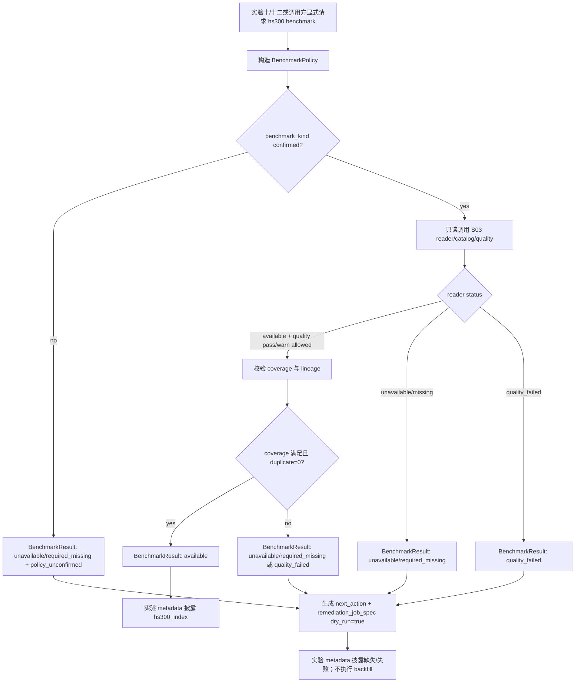

# LLD: CR005-S04 - 沪深 300 本地基准与实验只读接入

> 本 LLD 已通过 `CR005-BATCH-B2C-S04-S05-LLD` 批次 CP5 人工确认，可作为 CR005-S04 实现输入。实现仍必须仅限本 Story 允许文件，不得联网、不得真实 Tushare fetch、不得写 lake、不得进入 S06 或 Backtrader。

## 修订记录

| 版本 | 日期 | 修订人 | 变更要点 |
|---|---|---|---|
| 1.0 | 2026-05-17 | meta-dev | 基于 CR005-S04 Story、S01/S03 verified 证据、STORY-018 LLD、HLD §22.6/§22.7/§22.8、ADR-015 与 Batch A lake root 决策，起草 S04 本地 `hs300_index` benchmark resolver、`BenchmarkResult` typed schema、benchmark policy、实验十/十二只读接入和 CP5 测试设计。 |

## 1. Goal

创建 CR005-S04 的可实现设计：后续实现将创建 `market_data/benchmarks.py` 和 `tests/test_market_data_hs300_benchmark.py`，并按受控共享范围修改 `experiments/run_experiment_10.py`、`experiments/run_experiment_12.py` 和必要的 `market_data/readers.py` 调用适配，使实验十/十二在显式启用本地市场数据模式时只读消费 `hs300_index` benchmark。

本 Story 冻结 `BenchmarkResult` typed schema、`next_action` 字段表、`remediation_job_spec` 字段表和 benchmark policy。缺失、质量失败或口径未确认时，resolver 必须返回 typed `unavailable` / `required_missing` / `quality_failed`，不得联网、不得自动 backfill、不得导入 connector/runtime/storage、不得静默使用等权或股票池代理填充 `hs300_index`。

## 2. Requirements（Functional / Non-Functional）

### 2.1 Functional

- 创建 `market_data/benchmarks.py`，定义 `BenchmarkResult`、`BenchmarkCoverage`、`BenchmarkPolicy`、`RemediationJobSpec`、`NextAction` 和 `resolve_hs300_benchmark(...)` 只读 resolver。
- `BenchmarkResult.status` 枚举固定为 `available`、`unavailable`、`required_missing`、`quality_failed`，实现不得新增同义状态替代这 4 个主状态。
- `BenchmarkResult` 至少输出 15 个 typed 字段：`status`、`dataset`、`source`、`index_code`、`interface`、`start_date`、`end_date`、`available_start_date`、`available_end_date`、`coverage`、`quality_status`、`missing_reason`、`required`、`benchmark_kind`、`next_action`、`remediation_job_spec`、`catalog_entry`、`run_id`、`lineage`；其中条件字段允许为 `null`，但 key 必须存在。
- `dataset` 固定为 `hs300_index`；`interface` 固定候选为 `hs300_index.daily`；默认 `index_code` 为 `399300.SZ`；`source` 只允许 `tushare`、`local_fixture`、`none` 或后续 CP5 明确新增值。
- `benchmark_kind` policy 冻结为 `price_index`、`total_return_index`、`adjusted_index`、`policy_unconfirmed` 四值；CR5-Q2 未确认时默认 `policy_unconfirmed`，resolver 不得返回 production `available`。
- 本地数据可用且 policy 已显式确认时，resolver 通过 S03 reader/catalog/quality 契约只读 `hs300_index` canonical/gold，并返回 `available`。
- 本地数据缺失且 `required=false` 时，resolver 返回 `unavailable`；本地数据缺失且 `required=true` 时，resolver 返回 `required_missing`。
- quality `fail`、duplicate key、coverage gap、lineage 缺失或 policy 未确认时，resolver 返回 `quality_failed` 或按 required flag 返回 `required_missing`；不得绕过 quality gate。
- `unavailable`、`required_missing`、`quality_failed` 必须携带 `next_action` 和 `remediation_job_spec`；该 spec 只能展示或返回给用户，resolver、实验入口、Data Loader、Backtrader 均不得执行。
- `remediation_job_spec.dry_run` 默认值必须为 `true`；网络调用次数和 raw/manifest/canonical/quality/catalog/gold 写入次数必须为 0。
- 实验十/十二必须保留旧 `--data-dir` 本地价格路径；旧代理如保留只能输出 `proxy_baseline`，不得填充 `BenchmarkResult.dataset=hs300_index` 或声明 hs300 相对收益。
- 实验入口只在显式 market data / benchmark 参数启用时调用 resolver；默认行为不得联网、不得读取 token、不得修改真实数据目录。

### 2.2 Non-Functional

- 离线性：默认测试和实验入口网络调用次数为 0；不得导入 `requests`、`urllib`、`socket`、`httpx`、`aiohttp` 或真实 Tushare provider。
- 只读性：resolver 和实验入口不得写 raw、manifest、canonical、quality、catalog、gold、`data/**`、`reports/**` 或真实 lake。
- 凭据安全：resolver、实验入口和测试不得读取或输出 `TUSHARE_TOKEN` 值；错误和 metadata 只允许引用 env var 名或结构化 error code。
- 路径安全：真实 lake root 必须外置且显式传入或来自 `MARKET_DATA_LAKE_ROOT`；未配置时返回 structured missing，不得默认写仓库 `./data`。
- 可追溯：所有非 available 结果必须披露 `missing_reason`、`coverage`、`quality_status`、`next_action`、`remediation_job_spec` 和 lineage 缺失原因。
- 兼容性：STORY-018 的实验十/十二只读接入边界继续有效；旧 `--data-dir` 兼容路径不得被删除。

## 3. 模块拆分与职责

| 模块 / 文件组 | 职责 | 说明 |
|---|---|---|
| `market_data/benchmarks.py` | 定义 `BenchmarkResult` typed schema、benchmark policy、只读 `hs300_index` resolver、`next_action` 和 remediation spec 生成 | 新建主产物；不导入 connector/runtime/storage；只消费 reader/catalog/quality 契约。 |
| `market_data/readers.py` | 提供 S03 已验证的 `read_dataset(...)` / catalog / quality gate 入口 | S04 仅做必要调用适配；不得改变 S03 quality/PIT/复权语义。 |
| `experiments/run_experiment_10.py` | 在实验十显式 market data 模式下调用 benchmark resolver，并把 result 写入 metadata | 保留旧 `--data-dir`；不执行 backfill。 |
| `experiments/run_experiment_12.py` | 在实验十二显式 market data 模式下调用 benchmark resolver，并披露 unavailable / proxy_baseline 边界 | 保留旧 `--data-dir`；不执行 backfill。 |
| `tests/test_market_data_hs300_benchmark.py` | 覆盖 resolver schema、available/unavailable/required_missing/quality_failed、remediation spec、no-network/no-write、proxy_baseline 和实验接入 | 使用 `tmp_path` 合成 canonical/gold/quality/catalog fixture；不使用真实数据。 |
| CR005-S01 verified 契约 | 提供 `hs300_index` backfill job spec、dry-run 默认、error enum、lake root 外置约束 | S04 只生成同字段 spec，不执行 job。 |
| CR005-S03 verified 契约 | 提供 quality/catalog/readers、`ReaderResult` typed status、`hs300_index` denominator、duplicate/lineage/coverage gate | S04 通过 reader 输出判断 benchmark 状态。 |
| STORY-018 confirmed LLD | 提供实验十/十二只读接入、旧 `--data-dir` 兼容、缺基准 unavailable 和不静默代理边界 | S04 扩展为 CR005 的 `BenchmarkResult` schema，不覆盖其边界。 |

## 4. 代码结构与文件影响范围

| 动作 | 文件路径 | 变更内容 |
|---|---|---|
| 创建 | `market_data/benchmarks.py` | 实现 `BenchmarkResult` typed schema、`BenchmarkPolicy`、`resolve_hs300_benchmark(...)`、`next_action` 和 `remediation_job_spec` 生成；只读 local reader/catalog/quality；不联网不写湖。 |
| 创建 | `tests/test_market_data_hs300_benchmark.py` | 覆盖 S04 全部验收：schema 字段、4 个 status、quality_failed、remediation dry-run、no-network/no-write、proxy_baseline 隔离、实验十/十二 metadata。 |
| 修改 | `experiments/run_experiment_10.py` | 增加显式只读 benchmark 参数/配置映射、调用 resolver、输出 `BenchmarkResult` metadata；保留旧 `--data-dir`。 |
| 修改 | `experiments/run_experiment_12.py` | 增加同等只读 benchmark metadata，缺基准时不声明 hs300 相对收益；旧代理字段命名为 `proxy_baseline`。 |
| 修改 | `market_data/readers.py` | 仅在实现确需时增加面向 benchmark resolver 的轻量 helper 或导出；不得改变 S03 reader status、quality gate 和 no-connector 边界。 |
| 禁止 | `market_data/connectors/**` | S04 不修改 connector，不导入真实 provider，不执行 Tushare fetch。 |
| 禁止 | `market_data/runtime.py`、`market_data/storage.py`、`market_data/cli.py` | S04 不拥有 backfill job 主入口，不写 raw/manifest，不执行 remediation。 |
| 禁止 | `engine/backtest.py`、`engine/backtrader_adapter.py` | S04 不进入 Backtrader 或轻量回测引擎实现。 |
| 禁止 | `data/**`、`reports/**`、`delivery/**`、`pyproject.toml`、`uv.lock` | S04 不写真实数据、报告、交付包或依赖锁。 |

## 5. 数据模型与持久化设计

S04 不新增持久化写入。实现只读取本地 canonical/gold/quality/catalog，测试只在 `tmp_path` 创建合成 fixture。`BenchmarkResult` 是内存 typed result，可序列化为实验 metadata。

### 5.1 `BenchmarkCoverage`

| 字段 | 类型 | 约束 | 说明 |
|---|---|---|---|
| `numerator` | int | required, `>=0` | 已覆盖交易日数。 |
| `denominator` | int | required, `>=0` | 来自 `trade_calendar` open dates；不得用自然日替代。 |
| `ratio` | float | required | denominator 为 0 时结果不可 available。 |
| `missing_trade_dates` | list[str] | required | 缺失 open dates；无缺失为空列表。 |
| `gap_reason` | str \| None | conditional | `missing_dataset`、`coverage_gap`、`calendar_missing` 等。 |

### 5.2 `BenchmarkPolicy`

| 字段 | 类型 | 约束 | 说明 |
|---|---|---|---|
| `benchmark_kind` | enum | required | `price_index`、`total_return_index`、`adjusted_index`、`policy_unconfirmed`。 |
| `confirmed` | bool | required | `false` 时 resolver 不返回 production `available`。 |
| `required` | bool | required | `true` 时缺失映射为 `required_missing`。 |
| `quality_threshold` | float | required | 默认沿用 S03 quality threshold；实现不得低于 S03 pass 门。 |
| `allow_warn` | bool | required | 仅允许 quality warn；quality fail 永不放行。 |

### 5.3 `BenchmarkResult`

| 字段 | 类型 | 约束 | 说明 |
|---|---|---|---|
| `status` | enum | required | `available`、`unavailable`、`required_missing`、`quality_failed`。 |
| `dataset` | literal | required | 固定 `hs300_index`。 |
| `source` | enum | required | `tushare`、`local_fixture`、`none`。 |
| `index_code` | str | required | 默认 `399300.SZ`。 |
| `interface` | literal | required | 固定 `hs300_index.daily`。 |
| `start_date` / `end_date` | str | required | 请求区间，ISO `YYYY-MM-DD`。 |
| `available_start_date` / `available_end_date` | str \| None | key required | available 或部分覆盖时记录本地覆盖区间。 |
| `coverage` | `BenchmarkCoverage` | required | 包含 numerator/denominator/ratio/missing list。 |
| `quality_status` | enum | required | `pass`、`warn`、`fail`、`missing`。 |
| `missing_reason` | str \| None | key required | `missing_dataset`、`missing_quality`、`coverage_gap`、`duplicate_key`、`policy_unconfirmed`、`quality_failed`、`lineage_unavailable`。 |
| `required` | bool | required | 来自 policy 或调用参数。 |
| `benchmark_kind` | enum | required | 来自 `BenchmarkPolicy` 或 catalog quality。 |
| `next_action` | object \| None | key required | 非 available 必填；见 5.4。 |
| `remediation_job_spec` | object \| None | key required | 非 available 必填；见 5.5。 |
| `catalog_entry` | object \| None | key required | available 时必填，非 available 可为空。 |
| `run_id` / `lineage` | str/object | required | available 时来自 catalog/quality；缺失时写 `lineage_unavailable`。 |

### 5.4 `NextAction`

| 字段 | 类型 | 约束 | 说明 |
|---|---|---|---|
| `type` | literal | required | 固定 `run_data_layer_backfill` 或 `confirm_benchmark_policy`。 |
| `owner` | literal | required | `user` 或 `data-layer-job`；consumer 不拥有执行权。 |
| `allowed_executor` | literal | required | 固定 `market_data_cli_or_equivalent_job`。 |
| `auto_execute` | bool | required, false | resolver 和实验入口不得执行。 |
| `message_code` | str | required | `benchmark_missing`、`benchmark_required_missing`、`benchmark_quality_failed`、`benchmark_policy_unconfirmed`。 |

### 5.5 `RemediationJobSpec`

| 字段 | 类型 | 约束 | 说明 |
|---|---|---|---|
| `dataset` / `target_dataset` | literal | required | `hs300_index`。 |
| `source` | literal | required | `tushare`。 |
| `interface` | literal | required | `hs300_index.daily`。 |
| `provider_interface` | literal | required | `index_daily`。 |
| `index_code` | str | required | 默认 `399300.SZ`。 |
| `start_date` / `end_date` | str | required | 请求区间或缺口区间。 |
| `lake_root` | str \| None | key required | 来自显式配置或 env hint；缺失时为 `null` 并暴露 `lake_root_missing`。 |
| `run_id` / `batch_id` | str | required | deterministic 生成或来自调用配置；不得含 token。 |
| `resume_policy` | object | required | 默认 `{success: skip, failed: retry, partial_success: retry, duplicate_manifest: fail}`。 |
| `dry_run` | bool | required, default true | true 时网络调用和写湖次数均为 0。 |
| `raw_path` / `manifest_path` / `canonical_path` / `quality_path` / `catalog_path` / `gold_path` | str \| None | key required | 规划路径；resolver 不创建路径。 |
| `error_enum` | list[str] | required | 至少包含 `source_disabled`、`interface_not_allowed`、`missing_credential`、`lake_root_invalid`、`quality_failed`、`resume_conflict`，并保留 S01 扩展枚举。 |

## 6. API / Interface 设计

| 接口 / 入口 | 输入 | 输出 | 调用方 | 说明 |
|---|---|---|---|---|
| `BenchmarkPolicy.from_config(config, required=False)` | benchmark config、required flag、optional `benchmark_kind` | `BenchmarkPolicy` | experiments、tests | 冻结 policy 解析；测试：`T-S04-POLICY-01`。 |
| `build_hs300_remediation_spec(request, lake_root_hint, reason)` | dataset、date range、required、lake root hint、reason | `RemediationJobSpec` dict | resolver | 只生成 spec，不执行；测试：`T-S04-REMEDIATION-01`。 |
| `build_next_action(reason, required)` | reason、required flag | `NextAction` dict | resolver | auto_execute 固定 false；测试：`T-S04-NEXT-ACTION-01`。 |
| `resolve_hs300_benchmark(lake_root, start_date, end_date, policy, index_code="399300.SZ")` | local lake root、日期区间、policy、index_code | `BenchmarkResult` | experiments、future Data Loader/S06 | 只读 local reader/catalog/quality；测试：`T-S04-AVAILABLE-01`、`T-S04-MISSING-01`、`T-S04-REQUIRED-01`、`T-S04-QUALITY-01`。 |
| `BenchmarkResult.to_metadata()` | typed result | JSON-safe dict | experiments、reports | 输出稳定字段集，不含 token；测试：`T-S04-SCHEMA-01`。 |
| `apply_benchmark_metadata_experiment_10(result, existing_metadata)` | `BenchmarkResult`、实验 metadata | metadata dict | `run_experiment_10.py` | 不改变旧 `--data-dir` 默认；测试：`T-S04-EXP10-01`。 |
| `apply_benchmark_metadata_experiment_12(result, existing_metadata)` | `BenchmarkResult`、实验 metadata | metadata dict | `run_experiment_12.py` | 缺基准时不声明 hs300 相对收益；测试：`T-S04-EXP12-01`。 |

本节接口在第 10 节均有对应测试入口；第 7 节异常路径均映射到错误路径测试。

## 7. 核心处理流程

正常流程：

1. 调用方显式传入 market data root 或 benchmark config 后，构造 `BenchmarkPolicy`。
2. 若 `benchmark_kind=policy_unconfirmed` 或 `confirmed=false`，resolver 返回 `unavailable` 或 `required_missing`，并给出 `next_action.type=confirm_benchmark_policy`。
3. policy 已确认时，resolver 只读调用 S03 reader/catalog/quality 获取 `hs300_index`。
4. reader 返回 available 且 quality pass/warn 可接受时，resolver 校验 coverage、duplicate key、lineage 和 date range。
5. 全部通过后，resolver 返回 `BenchmarkResult(status="available")`，并把 catalog entry、run_id、lineage 写入 metadata。
6. 实验十/十二把 `BenchmarkResult.to_metadata()` 合并到结果 metadata；旧 `proxy_baseline` 保持独立字段。

异常路径：

1. lake root 缺失：返回 `unavailable` / `required_missing`，`missing_reason=lake_root_missing`，不默认写 `./data`。
2. `hs300_index` catalog 或 quality 缺失：返回 `missing_dataset` / `missing_quality`，生成 dry-run remediation spec。
3. coverage gap：返回 `coverage_gap`，spec 的 start/end 使用缺口区间。
4. duplicate key、lineage 缺失或 quality fail：返回 `quality_failed`，不放行 available。
5. `required=true` 且任一缺失：主状态必须为 `required_missing`，但保留底层 `missing_reason`。
6. 实验入口缺基准：跳过 hs300 相对收益，metadata 记录 unavailable；不得静默代理。
7. 任何 connector/runtime/storage import 或网络调用：测试失败，后续实现不得交付 CP6。

## 8. 技术设计细节

- 关键算法 / 规则：
  - `status` 映射顺序固定为：policy 未确认 -> quality hard fail -> missing/coverage gap -> available。
  - required flag 只改变缺失类主状态：缺失且 `required=true` 输出 `required_missing`；quality hard fail 仍可输出 `quality_failed` 并在 metadata 标明 `required=true`。
  - coverage denominator 必须来自 S03 `trade_calendar` open dates；denominator 为 0 或 calendar missing 时不得 available。
  - `BenchmarkResult.to_metadata()` 输出稳定 key 集，禁止根据 status 动态删除核心字段。
  - `proxy_baseline` 与 `hs300_index` 字段物理分离；任何代理基准不得写入 `BenchmarkResult.dataset`。
- 依赖选择与复用点：
  - 复用 S01 `Hs300BackfillJobSpec` 字段和 Batch A lake root 决策。
  - 复用 S03 `ReaderResult`、quality/catalog、`hs300_index` denominator、duplicate、lineage 和 no-connector 边界。
  - 复用 STORY-018 的实验只读接入、旧 `--data-dir` 兼容和 no silent proxy 约束。
- 兼容性处理：
  - 若现有实验脚本没有统一 metadata builder，实现阶段只追加最小 helper，不重构实验主流程。
  - 若 `market_data/readers.py` 已提供足够 API，S04 不修改 readers；若缺少 benchmark 适配 helper，只添加向后兼容导出。
  - CR5-Q2 未确认前，生产 available 路径默认 disabled；测试可用显式 synthetic policy fixture 覆盖 available 分支。
- 图示类型选择：流程图。本 Story 跨 benchmark resolver、reader/catalog/quality、两个实验脚本和 remediation spec，且包含多条异常分支。

## 9. 安全与性能设计

| 维度 | 设计措施 | 验证方式 |
|---|---|---|
| 安全 | `market_data/benchmarks.py` 和实验入口不得导入 connector/runtime/storage/真实 provider/网络客户端 | `T-S04-BOUNDARY-01` AST/import 扫描。 |
| 安全 | resolver 不读取 `TUSHARE_TOKEN`，metadata/error/spec 不包含 token 值 | `T-S04-BOUNDARY-02` env monkeypatch 与 sentinel 扫描。 |
| 安全 | `remediation_job_spec.auto_execute=false`、`dry_run=true`，resolver 不调用 CLI/job | `T-S04-REMEDIATION-01` 和 monkeypatch 调用计数。 |
| 只读 | resolver 和实验入口运行前后 tmp lake 文件集合一致 | `T-S04-NO-WRITE-01` 文件快照。 |
| 只读 | 缺 lake root structured missing，不默认写仓库 `data/**` | `T-S04-LAKE-01`。 |
| 可追溯 | metadata 包含 source/interface/index_code/date range/coverage/quality/status/lineage/missing_reason | `T-S04-SCHEMA-01`。 |
| 性能 | resolver 只读取请求日期范围和必要列，不扫描真实仓库数据目录 | 小样本 fixture 单元测试；目标单文件测试在 2 秒内完成。 |
| 兼容 | 旧 `--data-dir` 默认路径不启用 benchmark resolver，不改变现有实验输入形态 | `T-S04-LEGACY-01`。 |

## 10. 测试设计

| 测试场景 | 前置条件 | 操作 | 预期结果 | 验证方式 |
|---|---|---|---|---|
| `T-S04-SCHEMA-01` | 构造 4 种 status result | 调用 `to_metadata()` | 输出至少 15 个稳定 typed key，status 枚举固定 | 单元测试 |
| `T-S04-POLICY-01` | `benchmark_kind=policy_unconfirmed` | 调用 policy + resolver | 返回 unavailable/required_missing，`missing_reason=policy_unconfirmed` | 单元测试 |
| `T-S04-AVAILABLE-01` | tmp lake 有 hs300 canonical/gold、quality pass、policy confirmed | 调用 resolver | `status=available`，含 catalog_entry、coverage、lineage | 单元测试 |
| `T-S04-MISSING-01` | tmp lake 无 hs300 catalog/quality，`required=false` | 调用 resolver | `status=unavailable`，含 next_action/remediation dry_run=true | 单元测试 |
| `T-S04-REQUIRED-01` | tmp lake 无 hs300，`required=true` | 调用 resolver | `status=required_missing`，connector/runtime/storage 调用次数 0 | 单元测试 + monkeypatch |
| `T-S04-QUALITY-01` | quality fail、duplicate key 或 coverage gap fixture | 调用 resolver | `status=quality_failed` 或 required_missing；available 次数 0 | 单元测试 |
| `T-S04-REMEDIATION-01` | 任一非 available result | 检查 remediation spec | dataset/source/interface/index_code/date range/lake_root/run_id/resume/dry_run/path/error_enum 完整，dry_run=true | 单元测试 |
| `T-S04-NEXT-ACTION-01` | missing/quality/policy reason | 构造 next_action | `auto_execute=false`，type 与 reason 匹配 | 单元测试 |
| `T-S04-BOUNDARY-01` | 源码存在 | AST/import 扫描 benchmarks/experiments | 不导入 connector/runtime/storage/网络客户端 | 静态测试 |
| `T-S04-BOUNDARY-02` | env 中放置 token sentinel | 运行 resolver 异常路径 | stdout/stderr/metadata/spec 不含 token 值 | 单元测试 |
| `T-S04-NO-WRITE-01` | tmp lake 文件快照 | 运行 resolver + 实验接入 | raw/manifest/canonical/quality/catalog/gold 文件集合不变 | 文件系统断言 |
| `T-S04-LAKE-01` | 未配置 lake root | 调用 resolver | 返回 structured missing，不创建 `./data` | 单元测试 |
| `T-S04-EXP10-01` | 实验十显式 market data mode | 注入 unavailable/available result | metadata 披露 BenchmarkResult，不执行 backfill | 单元测试 |
| `T-S04-EXP12-01` | 实验十二显式 market data mode | 注入缺基准 result | 不声明 hs300 相对收益；proxy 仅输出 `proxy_baseline` | 单元测试 |
| `T-S04-LEGACY-01` | 旧 `--data-dir` fixture | 运行旧路径 | 默认行为不调用 resolver，不要求 lake root | 单元测试 |

## 11. 实施步骤

| TASK-ID | 动作 | 目标文件 | 详细描述 | 对应测试 |
|---|---|---|---|---|
| CR005-S04-T1 | 创建 | `market_data/benchmarks.py` | 实现 `BenchmarkResult`、`BenchmarkCoverage`、`BenchmarkPolicy`、`NextAction`、`RemediationJobSpec`、`resolve_hs300_benchmark(...)` 和 JSON-safe metadata 输出；不导入 connector/runtime/storage。 | `T-S04-SCHEMA-01`, `T-S04-POLICY-01`, `T-S04-AVAILABLE-01`, `T-S04-MISSING-01`, `T-S04-REQUIRED-01`, `T-S04-QUALITY-01`, `T-S04-REMEDIATION-01`, `T-S04-NEXT-ACTION-01`, `T-S04-BOUNDARY-01`, `T-S04-BOUNDARY-02`, `T-S04-NO-WRITE-01`, `T-S04-LAKE-01` |
| CR005-S04-T2 | 修改 | `experiments/run_experiment_10.py` | 增加显式 benchmark config 映射、resolver 调用和 metadata 合并；保留旧 `--data-dir` 默认路径。 | `T-S04-EXP10-01`, `T-S04-LEGACY-01`, `T-S04-BOUNDARY-01` |
| CR005-S04-T3 | 修改 | `experiments/run_experiment_12.py` | 增加同款 metadata 合并；缺基准时跳过 hs300 相对收益；旧代理字段命名为 `proxy_baseline`。 | `T-S04-EXP12-01`, `T-S04-LEGACY-01`, `T-S04-BOUNDARY-01` |
| CR005-S04-T4 | 修改 | `market_data/readers.py` | 仅在缺少必要调用适配时增加向后兼容 helper/export；保持 S03 `ReaderResult`、quality gate 和 no-connector 边界不变。 | `T-S04-AVAILABLE-01`, `T-S04-QUALITY-01`, `T-S04-BOUNDARY-01` |
| CR005-S04-T5 | 创建 | `tests/test_market_data_hs300_benchmark.py` | 创建 tmp lake fixture 和静态扫描，覆盖本 LLD 第 10 节全部测试场景。 | 第 10 节全部测试 |

## 12. 风险、难点与预研建议

| 风险 / 难点 | 影响 | 缓解措施 / 预研建议 |
|---|---|---|
| CR5-Q2 benchmark 口径未确认 | production available 路径不得声明最终真实沪深 300 benchmark | 冻结 `policy_unconfirmed`，未确认时只返回 unavailable/required_missing；available 测试仅用显式 confirmed synthetic policy fixture。 |
| S03 reader helper 与 S04 resolver 需要最小适配 | 可能触碰 `market_data/readers.py` shared 文件 | 只添加向后兼容导出或在 `benchmarks.py` 内适配现有 `ReaderResult`；不得改 S03 gate 语义。 |
| 实验十/十二 metadata 结构可能不同 | 实现需分别接入，避免重构实验主流程 | 使用小型 helper 合并 metadata；保留旧路径和原始输出。 |
| remediation spec 被误执行 | 消费层越界联网或写湖 | `NextAction.auto_execute=false`、spec `dry_run=true`，测试 monkeypatch CLI/job/connector 调用次数为 0。 |
| proxy baseline 被误读为 hs300 benchmark | 报告解释错误 | 字段名强制隔离：代理只能为 `proxy_baseline`，`BenchmarkResult.dataset` 只能为 `hs300_index`。 |

### OPEN / Spike 跟踪

| ID | 类型（OPEN / Spike） | 问题 | 下一动作 | 责任方 |
|---|---|---|---|---|
| O-S04-01 | OPEN | CR5-Q2：`hs300_index` 使用价格指数、全收益指数、复权指数或其他口径未确认。 | CP5 可接受本 Story 先冻结 schema、policy 和 unavailable/required_missing；production available 路径必须等待用户确认 benchmark_kind。 | 用户 / meta-po |
| O-S04-02 | OPEN | S04 是否需要修改 `market_data/readers.py` 暴露 benchmark helper，取决于实现时现有 reader API 足够性。 | 实现阶段优先在 `benchmarks.py` 适配现有 API；仅当无法表达 S03 verified contract 时小范围修改 readers。 | meta-dev |
| O-S04-03 | OPEN | S06 将复用 `BenchmarkResult`，但 S06 不得在 S04 CP5 批次确认和 schema 冻结前进入实现。 | meta-po 在 S04 CP5 人工确认后再计算 S06 dev_gate。 | meta-po |

## 13. 回滚与发布策略

- 发布方式：CP5 Batch B2 人工确认且 Story 进入 `dev-ready` 后，按第 11 节 TASK-ID 实现；默认通过现有实验十/十二入口和 `uv run --python 3.11 pytest -q tests/test_market_data_hs300_benchmark.py` 验证，不新增安装脚本。
- 回滚触发条件：实验入口联网、导入 connector/runtime/storage、读取 token、写 raw/manifest/canonical/quality/catalog/gold、默认写 `./data`、缺基准静默代理、旧 `--data-dir` 兼容破坏、`BenchmarkResult` 主状态脱离 4 值枚举。
- 回滚动作：撤回 `market_data/benchmarks.py`；撤回实验十/十二中 S04 benchmark metadata 接入；撤回 `market_data/readers.py` 中 S04 专属 helper；删除 `tests/test_market_data_hs300_benchmark.py`；保留 S01/S03/STORY-018 已 verified/confirmed 产物不变。
- 降级策略：若 benchmark resolver 不可用，实验十/十二继续使用旧 `--data-dir` 本地价格路径；缺 hs300 benchmark 时输出 structured unavailable，不输出 hs300 相对收益。

## 14. Definition of Done

- [x] 14 个章节全部填写完成。
- [x] LLD 复用 Story 卡片 `story_slug=hs300-local-benchmark`，文件名为 `CR005-S04-hs300-local-benchmark-LLD.md`。
- [x] 文件影响范围限定为 `market_data/benchmarks.py`、`tests/test_market_data_hs300_benchmark.py`、`experiments/run_experiment_10.py`、`experiments/run_experiment_12.py` 和必要 `market_data/readers.py` 适配。
- [x] `BenchmarkResult` schema 固定包含 `available`、`unavailable`、`required_missing`、`quality_failed` 四个主状态。
- [x] `next_action` 和 `remediation_job_spec` 字段表已冻结，且 `auto_execute=false`、`dry_run=true`。
- [x] HLD §22.6/§22.7/§22.8、ADR-015、S01 backfill spec、S03 reader/quality 和 STORY-018 实验只读边界均已映射。
- [x] 第 6 节接口均在第 10 节有测试入口。
- [x] 第 7 节异常路径均在第 10 节有错误路径验证。
- [x] 第 11 节 TASK-ID 与第 4 节文件影响范围一一对应。
- [x] OPEN 项已清点；O-S04-01 不阻断 LLD 起草，但阻断 production available 口径声明。
- [x] `confirmed=false`、`implementation_allowed=false`，批次 CP5 人工确认前不得进入实现。

## 人工确认区

> **CP5 - CR005-S04 LLD 可实现性门**
> meta-po 收齐 `CR005-BATCH-B2-S04-LLD` 批次 LLD 与自动预检后，生成并提示用户审查 `checkpoints/CP5-CR005-BATCH-B2-S04-LLD-BATCH.md`。用户统一确认前不得实现本 Story。

**CP5 checklist 摘要**：

| # | 检查项 | 状态 | 证据 |
|---|---|---|---|
| 1 | LLD 覆盖 S04 验收标准 | 待检查 | 第 2 / 10 / 14 节 |
| 2 | 与 HLD / ADR / S01 / S03 / STORY-018 一致 | 待检查 | 第 3 / 5 / 8 / 12 节 |
| 3 | 文件影响范围明确且未触碰禁区 | 待检查 | 第 4 / 11 节 |
| 4 | 接口、错误模型、remediation spec 完整 | 待检查 | 第 5 / 6 / 7 节 |
| 5 | 测试与 dev_gate 可计算 | 待检查 | 第 10 / 14 节 |

**人工审查结果回填**：

- 结论：`approved | changes_requested | rejected`
- 审查人：
- 审查时间：
- 修改意见：
- 风险接受项：
