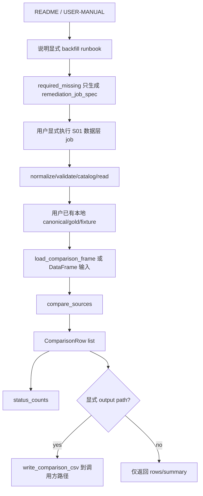

# LLD: CR005-S05 - 多源 comparison 与回补文档

> 本 LLD 已通过 `CR005-BATCH-B2C-S04-S05-LLD` 批次 CP5 人工确认，可作为 CR005-S05 实现输入。实现仍必须仅限本 Story 允许文件，不得联网、不得真实 Tushare fetch、不得真实写 lake、不得写 token、不得进入 CR005-S04/S06 或 Backtrader 实现。

## 修订记录

| 版本 | 日期 | 修订人 | 变更要点 |
|---|---|---|---|
| 1.0 | 2026-05-17 | meta-dev | 基于 CR005-S05 Story、S01/S03 CP7 PASS 证据、HLD §22.7/§22.9、ADR-012/ADR-013/ADR-016、README、USER-MANUAL 和 `market_data/comparison.py` 起草 S05 LLD。 |

## 1. Goal

创建 CR005-S05 的实现设计，使后续实现能够扩展本地 comparison 能力并补齐用户文档：comparison 只比较本地 DataFrame/CSV/parquet 或 fixture，不在 compare 阶段调用 Tushare、connector、runtime 或网络；README 和用户手册必须清楚说明 Tushare 真实启用前置条件、显式 backfill runbook、quality/catalog/reader 消费边界、`required_missing` 的只读补齐建议、`proxy_baseline` 命名限制和 Backtrader optional backend 边界。

## 2. Requirements（Functional / Non-Functional）

### 2.1 Functional

- 修改 `market_data/comparison.py`，保持 ADR-012 的 10 个 comparison row 字段：`dataset`、`key`、`field`、`left_source`、`right_source`、`left_value`、`right_value`、`diff`、`tolerance`、`status`。
- 修改 `market_data/comparison.py`，支持 CR-005 本地 dataset 的 exact keys/fields comparison，至少覆盖 `prices`、`hs300_index`、`trade_calendar`、`index_weights` 的本地 fixture 或本地文件输入。
- 修改 `market_data/comparison.py`，输出可机器断言的 status summary，至少包含 `match`、`mismatch`、`missing_left`、`missing_right`、`non_numeric_mismatch` 的计数。
- 修改 `README.md`，增加 Tushare 写湖边界、显式 backfill、quality gate、catalog/reader、Backtrader optional backend、`proxy_baseline` 边界和默认离线验证口径。
- 修改 `docs/USER-MANUAL.md`，增加真实回补 runbook、前置条件、dry-run、失败路径、回退策略和禁止自动补数说明。
- 创建 `tests/test_market_data_tushare_comparison.py`，覆盖本地 comparison no-network、connector/runtime 禁止导入、CR-005 dataset 字段、status summary、文档 forbidden path 静态检查。
- 文档必须列出 4 类真实启用前置条件：`enabled=true`、exact interface allowlist、`TUSHARE_TOKEN` 环境变量存在、用户显式真实抓取命令。
- 文档必须说明 `required_missing` 只产生 `remediation_job_spec` / `next_action`，真实写湖只由用户显式执行 CR005-S01 数据层 job。
- 文档必须说明旧代理只能命名为 `proxy_baseline`，不得填充 `hs300_index` benchmark 字段，不得声明沪深 300 相对收益。
- 文档必须说明 Backtrader 是 optional backend，不默认替代轻量主路径，不联网，不读 token/connector，不绕过 quality gate。

### 2.2 Non-Functional

- 默认离线：comparison、文档示例和默认 pytest 网络调用次数为 0，不需要 token、不读取 `TUSHARE_TOKEN` 值。
- 安全：token 值不得进入 README、USER-MANUAL、comparison 输出、quality/catalog、日志、测试 fixture 或错误消息。
- 只读边界：comparison 不执行 fetch/backfill/remediation，不写 raw/manifest/canonical/quality/catalog/gold，不导入 `market_data.connectors`、`market_data.runtime`、`market_data.storage`。
- 可追溯：文档中的 runbook 必须把 plan/fetch/normalize/validate/catalog/read/compare 顺序与 S01/S03 已验证契约对齐，并显式列出每一步的输入、输出和失败处理。
- 可维护：文档与代码使用 exact source/interface/dataset 命名；禁止 fuzzy/contains/similarity 推断平台路径或 dataset。
- 可验证：所有新增行为必须通过 `uv run --python 3.11 pytest -q tests/test_market_data_tushare_comparison.py` 离线验证；文档内容通过静态扫描断言。

## 3. 模块拆分与职责

| 模块 / 文件组 | 职责 | 说明 |
|---|---|---|
| `market_data/comparison.py` | 提供本地 comparison row、文件加载、差异计算、status summary 和 CR-005 dataset helper | 只读本地 DataFrame/CSV/parquet；不导入 connector/runtime/storage；不触发网络。 |
| `README.md` | 面向项目入口读者记录 CR-005 真实数据启用边界、显式 backfill、quality gate、comparison 与 optional Backtrader 口径 | 属于 S05 shared 文件，CP5 批次确认前不得修改。 |
| `docs/USER-MANUAL.md` | 面向操作者提供真实回补 runbook、失败路径、回退策略和安全限制 | runbook 只描述用户显式执行；不把 resolver/compare 写成自动执行 job。 |
| `tests/test_market_data_tushare_comparison.py` | 验证 comparison 离线行为、字段/status summary、no-network/no-token、文档关键句和禁止路径 | 使用本地 fixture 与静态扫描；不联网、不写真实 lake。 |
| CR005-S01 verified 证据 | 提供 `hs300_index` backfill job spec、dry-run no-network/no-write、token 安全和错误枚举 | S05 文档必须引用该数据层 job 作为唯一真实写湖入口。 |
| CR005-S03 verified 证据 | 提供 quality/catalog/readers、`required_missing`、PIT/复权 gate 和 reader no-network 证据 | S05 文档必须说明 reader/compare 只消费本地产物，不自动补数。 |

## 4. 代码结构与文件影响范围

| 动作 | 文件路径 | 变更内容 |
|---|---|---|
| 修改 | `market_data/comparison.py` | 保持 `COMPARISON_FIELDS` 10 字段；增加 CR-005 dataset comparison helper 或参数化约束；确保 status summary 可覆盖所有状态；确保源码无 connector/runtime/storage/provider/network import。 |
| 修改 | `README.md` | 增加 Tushare 数据层启用边界、显式 backfill 流程、quality/catalog/reader gate、comparison 本地只读边界、`proxy_baseline` 限制和 Backtrader optional backend 说明。 |
| 修改 | `docs/USER-MANUAL.md` | 增加真实回补 runbook：前置条件、dry-run、显式真实执行、normalize、validate、catalog、read、compare、失败路径、回退策略和安全注意事项。 |
| 创建 | `tests/test_market_data_tushare_comparison.py` | 创建离线测试，覆盖 comparison 字段/status summary、本地 CR-005 dataset、no connector/runtime import、no network/no token、文档 required strings 和 forbidden strings。 |
| 禁止 | `market_data/connectors/**`、`market_data/runtime.py`、`market_data/storage.py`、`market_data/cli.py` | S05 不拥有数据层 job 主入口，不修改 connector/runtime/storage/CLI；真实 backfill 主契约归 CR005-S01。 |
| 禁止 | `engine/**`、`experiments/**`、真实 `data/**`、真实 `reports/**`、`delivery/**`、`pyproject.toml`、`uv.lock` | S05 不进入消费层实现、Backtrader、安装交付、依赖变更或真实数据写入。 |

## 5. 数据模型与持久化设计

S05 不新增持久化数据模型，不创建真实数据湖文件，不写真实 `data/**` 或 `reports/**`。后续实现只使用本地 fixture、tmp path 和文档静态扫描。

### 5.1 Comparison row

| 对象 / 字段 | 类型 | 约束 | 说明 |
|---|---|---|---|
| `ComparisonRow.dataset` | str | required | exact dataset，例如 `prices`、`hs300_index`、`trade_calendar`、`index_weights`。 |
| `ComparisonRow.key` | str | required | 由 exact keys 序列化，例如 `trade_date=2026-01-02|index_code=399300.SZ`。 |
| `ComparisonRow.field` | str | required | 被比较字段，例如 `close`、`index_close`、`is_open`、`weight`。 |
| `ComparisonRow.left_source` | str | required | 本地左侧来源；真实源结果必须已落到本地后再比较。 |
| `ComparisonRow.right_source` | str | required | 本地右侧来源；旧代理只能标为 `proxy_baseline`，不能标为 `hs300_index`。 |
| `ComparisonRow.left_value` / `right_value` | scalar/null | required | 缺失侧为 null。 |
| `ComparisonRow.diff` | float/null | required | 数值字段为绝对差；非数值 exact 比较为 null。 |
| `ComparisonRow.tolerance` | float | required | 每次比较的 tolerance；默认 0.0 或调用方显式传入。 |
| `ComparisonRow.status` | enum | required | `match`、`mismatch`、`missing_left`、`missing_right`、`non_numeric_mismatch`。 |

字段数为 10，满足 ADR-012 和 Story 验收下限。

### 5.2 Comparison summary

| 对象 / 字段 | 类型 | 约束 | 说明 |
|---|---|---|---|
| `row_count` | int | required | comparison rows 总数。 |
| `status_counts` | dict[str, int] | required | 每个 status 的计数；缺失状态可为 0 或不出现，但测试必须覆盖 5 类状态。 |
| `datasets` | list[str] | required | 本次参与比较的 exact dataset 列表。 |
| `left_source` / `right_source` | str | required | 摘要来源，不得泄露 token。 |
| `network_calls` | int | test-only evidence | 默认测试中必须为 0。 |

### 5.3 Backfill runbook 文档字段

| 字段 | 类型 | 约束 | 说明 |
|---|---|---|---|
| `dataset` | str | required | `hs300_index` 或其他 CP5 批准 dataset。 |
| `source` | str | required | `tushare`。 |
| `interface` | str | required | exact `hs300_index.daily` 或 CP5 批准等价值。 |
| `index_code` | str | required for hs300 | 默认候选 `399300.SZ`。 |
| `start_date` / `end_date` | date string | required | 缺口区间或用户请求区间。 |
| `lake_root` | path string | required | 用户显式传入或 `MARKET_DATA_LAKE_ROOT`；不得默认污染仓库真实 `data/**`。 |
| `run_id` | str | required | 进入 manifest/quality/catalog lineage。 |
| `resume_policy` | str | required | 默认遵循 S01：`success=skip, failed=retry, partial_success=retry` 或等价。 |
| `dry_run` | bool | required | 默认 true；dry-run 网络调用和写湖次数均为 0。 |
| `paths` | object | required | manifest、quality、catalog、gold 规划路径。 |
| `error_enum` | list[str] | required | 至少覆盖 S01 错误枚举。 |

## 6. API / Interface 设计

| 接口 / 入口 | 输入 | 输出 | 调用方 | 说明 |
|---|---|---|---|---|
| `compare_sources(left, right, dataset, keys, fields, tolerance, left_source, right_source)` | DataFrame/records、exact dataset、keys、fields、tolerance、source labels | `list[ComparisonRow]` | CLI、测试、后续 QA | 只读本地输入；测试：`T-S05-COMPARE-01..04`。 |
| `load_comparison_frame(path)` | 本地 CSV/parquet path | pandas DataFrame | CLI、测试 | 只读本地文件，不支持 URL；测试：`T-S05-FILE-01`。 |
| `write_comparison_csv(rows, path)` | rows、显式 output path | CSV | CLI、测试 | 只在调用方显式 output path 下写 comparison CSV；不写 raw/manifest/canonical/quality/catalog/gold；测试：`T-S05-FILE-02`。 |
| `status_counts(rows)` | `Sequence[ComparisonRow]` | `dict[str, int]` | README 示例、CLI、测试 | 汇总 match/mismatch/missing/non_numeric；测试：`T-S05-SUMMARY-01`。 |
| README CR-005 章节 | S01/S03 verified 契约、HLD/ADR 边界 | 用户入口说明 | 用户、meta-doc、QA | 必须含启用前置条件、显式 backfill、quality gate、proxy_baseline、Backtrader optional；测试：`T-S05-DOC-01`。 |
| USER-MANUAL backfill runbook | dataset/source/interface/date range/lake root/run_id/resume/dry_run | 操作步骤和失败路径 | 用户、QA | 只描述显式执行数据层 job；不得要求 compare/resolver 自动执行；测试：`T-S05-DOC-02..05`。 |

本节每个接口在第 10 节均有至少 1 条测试入口；错误路径在第 7 节和第 10 节一一覆盖。

## 7. 核心处理流程



正常流程：

1. 用户或测试准备本地 left/right DataFrame、CSV、parquet 或 fixture；真实 Tushare 数据必须已经通过 S01/S03 链路落到本地并通过 quality/catalog。
2. `compare_sources` 校验 keys/fields 非空、字段存在、key 唯一，按 exact key 合并左右侧。
3. comparison 对数值字段计算绝对差并应用 tolerance；对非数值字段做 exact 比较。
4. comparison 输出 10 字段 row；`status_counts` 输出状态汇总。
5. 如调用方显式传入 output path，`write_comparison_csv` 只写 comparison CSV；不写任何 lake 层文件。
6. README 和 USER-MANUAL 描述真实回补时，必须把 `required_missing` 定义为只读建议，执行者必须是用户显式调用 CR005-S01 数据层 job。
7. Backtrader 文档只作为 optional backend 说明，不进入实现细节，不作为默认主路径。

异常路径：

1. keys 为空或 fields 为空：抛出 `ComparisonInputError`，不读网络、不写文件。
2. left/right 缺少 keys 或 fields：抛出 `ComparisonInputError`，错误只列字段名，不含凭据。
3. 任一侧 key 重复：抛出 `ComparisonInputError`，不输出可能误导的 comparison rows。
4. 本地输入文件不存在或类型不是 CSV/parquet：抛出 `ComparisonInputError`。
5. compare 请求 URL、远程 source、connector 或 runtime：测试必须阻断；实现不得提供该入口。
6. `required_missing` 出现在文档或结果中：必须同时说明不自动联网、不自动 backfill、不自动写湖，并给出 dry-run 默认的 `remediation_job_spec`。
7. 基准缺失时：不得用旧等权或同股票池代理填充 `hs300_index` 字段；如保留旧代理，只能命名为 `proxy_baseline`。
8. Backtrader 未安装、quality fail、PIT fail、复权 fail 或 benchmark required_missing：文档必须说明 optional backend 结构化失败并回退轻量主路径，不触发补数。

## 8. 技术设计细节

- 关键算法 / 规则：
  - comparison 保持当前 `ComparisonRow` dataclass 与 `COMPARISON_FIELDS` 10 字段，避免破坏 STORY-017 已验证契约。
  - key 序列化继续使用 `key=value` 并以 `|` 拼接；keys 由调用方显式传入，禁止按列名模糊推断。
  - 数值比较使用绝对差和统一 tolerance；非数值比较使用 exact equality；缺失侧返回 `missing_left` / `missing_right`。
  - `status_counts` 对 `ComparisonRow.status` 聚合，不从文本报告解析。
  - README/USER-MANUAL 文档测试使用 exact string 或正则断言关键短语，避免文档漂移。
- 依赖选择与复用点：
  - 复用 S01 verified backfill job spec、dry-run 默认 no-network/no-write、错误枚举和 token 安全边界。
  - 复用 S03 verified quality/catalog/readers、`required_missing`、reader no-network/no-write 和 Backtrader clean feed 边界。
  - 复用现有 pandas、csv、dataclass，不新增依赖，不修改 `pyproject.toml` / `uv.lock`。
- 兼容性处理：
  - `COMPARISON_FIELDS` 顺序保持不变；现有 `tests/test_market_data_cli_comparison.py` 不应因 S05 变更失败。
  - 文档新增内容必须与当前 README/USER-MANUAL 结构兼容，新增章节位置由实现阶段按最小可读变更选择。
  - S04 可能并行起草 LLD；S05 文档只描述 `proxy_baseline` 和 optional backend 边界，不拥有 `BenchmarkResult` resolver 实现。
- 图示类型选择：流程图。本 Story 跨 comparison 代码、README、USER-MANUAL、测试，并包含显式 backfill 与只读 comparison 的分支边界。

## 9. 安全与性能设计

| 维度 | 设计措施 | 验证方式 |
|---|---|---|
| 安全 | comparison 源码不得导入 `market_data.connectors`、`market_data.runtime`、`market_data.storage`、`tushare` 或网络库 | `T-S05-BOUNDARY-01` AST/static scan。 |
| 安全 | 默认 pytest 设置空 `TUSHARE_TOKEN`，comparison 不读取 token env，输出和错误不含 token 值 | `T-S05-BOUNDARY-02` token sentinel 扫描。 |
| 安全 | README/USER-MANUAL 明确 token 只来自环境变量且值不写文件；真实数据不提交 | `T-S05-DOC-03` 静态扫描。 |
| 安全 | `required_missing` 文档必须说明不自动联网、不自动 backfill、不自动写湖 | `T-S05-DOC-02` 静态扫描。 |
| 离线性 | compare 阶段只读本地 DataFrame/CSV/parquet；网络调用次数为 0 | `T-S05-COMPARE-04` monkeypatch/socket 禁用。 |
| 只读边界 | comparison 不写 raw/manifest/canonical/quality/catalog/gold；仅显式 output 写 comparison CSV | `T-S05-FILE-02` tmp_path 文件快照。 |
| 性能 | comparison 对小型本地 fixture 使用 pandas records + dict index，测试规模控制在秒级 | 单文件 pytest 运行时间观察；不引入远端 I/O。 |
| 可维护性 | 文档关键边界由测试静态断言，防止后续把 optional/backfill/no-network 口径改丢 | `T-S05-DOC-01..05`。 |

## 10. 测试设计

| 测试场景 | 前置条件 | 操作 | 预期结果 | 验证方式 |
|---|---|---|---|---|
| `T-S05-COMPARE-01` 10 字段输出 | left/right 本地 DataFrame 含 `hs300_index` fixture | 调用 `compare_sources(..., dataset="hs300_index", keys=["trade_date","index_code"], fields=["close"])` | 每行字段等于 `COMPARISON_FIELDS` 10 字段，dataset/key/source/status 正确 | pytest |
| `T-S05-COMPARE-02` tolerance 与 mismatch | 数值差分别小于/大于 tolerance | 调用 `compare_sources` | 小于等于 tolerance 为 `match`，超过为 `mismatch` | pytest |
| `T-S05-COMPARE-03` 缺失与非数值 | left/right 有缺 key 和文本字段不同 | 调用 `compare_sources` | 输出 `missing_left`、`missing_right`、`non_numeric_mismatch` | pytest |
| `T-S05-COMPARE-04` compare no-network | monkeypatch 禁用 socket/网络，`TUSHARE_TOKEN` 为空 | 执行 comparison 测试 | 网络调用次数 0，不读取 token，不导入 connector | pytest + monkeypatch/static scan |
| `T-S05-FILE-01` 本地文件加载 | tmp_path 写 CSV/parquet fixture | 调用 `load_comparison_frame` | 只读本地文件，unsupported suffix 抛 `ComparisonInputError` | pytest |
| `T-S05-FILE-02` 只写显式 comparison CSV | tmp_path 文件快照 | 调用 `write_comparison_csv` | 仅 output CSV 新增；raw/manifest/canonical/quality/catalog/gold 未新增 | pytest |
| `T-S05-SUMMARY-01` status summary | 构造 5 类 status rows | 调用 `status_counts` | 5 类 status 计数正确 | pytest |
| `T-S05-BOUNDARY-01` 禁止 import | 源码存在 | AST/static scan `market_data/comparison.py` | `market_data.connectors`、`runtime`、`storage`、`tushare`、`requests`、`urllib`、`socket` 命中数为 0 | pytest |
| `T-S05-BOUNDARY-02` no token leak | token sentinel 写入 env，不写入 fixture | 执行 comparison 与错误路径 | stdout/stderr/rows/docs 不含 token sentinel | pytest |
| `T-S05-DOC-01` 启用前置条件 | README/USER-MANUAL 已修改 | 静态扫描 | 同时出现 enabled、allowlist、token env、explicit command 四类条件 | pytest |
| `T-S05-DOC-02` required_missing 边界 | README/USER-MANUAL 已修改 | 静态扫描 | 明确不自动联网、不自动 backfill、不自动写湖，且指向 `remediation_job_spec` | pytest |
| `T-S05-DOC-03` token 与真实数据安全 | README/USER-MANUAL 已修改 | 静态扫描 | 明确 token 不写文件、默认 pytest 不联网、真实数据不提交 | pytest |
| `T-S05-DOC-04` proxy_baseline 边界 | README/USER-MANUAL 已修改 | 静态扫描 | 出现 `proxy_baseline`；不得出现“proxy_baseline 填充 hs300_index”或等价违规语句 | pytest |
| `T-S05-DOC-05` Backtrader optional | README/USER-MANUAL 已修改 | 静态扫描 | 明确 optional、不联网、不读 token/connector、不替代轻量主路径 | pytest |
| `T-S05-DOC-06` backfill job 字段 | USER-MANUAL runbook 已修改 | 静态扫描 | 至少列出 dataset/source/interface/index_code/date range/lake root/run_id/resume_policy/dry_run/path/error enum | pytest |

验证入口：`uv run --python 3.11 pytest -q tests/test_market_data_tushare_comparison.py`。本 LLD 阶段不运行该命令，因为测试文件尚未实现。

## 11. 实施步骤

| TASK-ID | 动作 | 目标文件 | 详细描述 | 对应测试 |
|---|---|---|---|---|
| CR005-S05-T1 | 修改 | `market_data/comparison.py` | 保持 `ComparisonRow`/`COMPARISON_FIELDS` 10 字段，补充 CR-005 dataset 本地 comparison helper 或参数化文档，强化 key/field 校验、status summary 和 no connector/runtime/network 边界 | `T-S05-COMPARE-01..04`、`T-S05-FILE-01..02`、`T-S05-SUMMARY-01`、`T-S05-BOUNDARY-01..02` |
| CR005-S05-T2 | 修改 | `README.md` | 增加 CR-005 真实启用条件、显式 Tushare backfill、quality/catalog/reader gate、本地 comparison、`proxy_baseline` 和 Backtrader optional backend 说明 | `T-S05-DOC-01..05` |
| CR005-S05-T3 | 修改 | `docs/USER-MANUAL.md` | 增加真实回补 runbook：plan/dry-run、显式真实抓取、normalize、validate、catalog、read、compare、失败路径、回退策略、token/真实数据安全 | `T-S05-DOC-01..06` |
| CR005-S05-T4 | 创建 | `tests/test_market_data_tushare_comparison.py` | 创建本地 fixture、静态扫描和文档断言测试，覆盖第 10 节全部场景 | 全部 `T-S05-*` |

每个 TASK-ID 与第 4 节文件影响范围一一对应；本 LLD 设计阶段不执行上述实现步骤。

## 12. 风险、难点与预研建议

| 风险 / 难点 | 影响 | 缓解措施 / 预研建议 |
|---|---|---|
| Story frontmatter 初始 `status=draft`，但 handoff 与 CP4 已将 S05 纳入 CP5 LLD 调度 | 形式状态与调度状态不一致 | 本轮按 handoff 等价待设计执行，并将 Story 更新为 `lld-ready-for-review`；CP5 记录该差异。 |
| S05 与 S04 并行 LLD 对 `proxy_baseline` / benchmark policy 表述可能漂移 | README/USER-MANUAL 未来实现时可能与 S04 `BenchmarkResult` LLD 不一致 | S05 只冻结文档边界：旧代理只能 `proxy_baseline`，不得填充 `hs300_index`；S04 拥有 resolver schema 和 available policy。 |
| README/USER-MANUAL 是 shared 文件 | 后续实现可能与文档或 meta-doc 更新冲突 | CP5 通过后实现前检查 git 状态；若同文件有并行写入，按 merge_owner 和 meta-po 指令串行合并。 |
| `market_data/comparison.py` 已有 10 字段契约 | 过度扩字段会破坏 STORY-017 回归 | 保持 `COMPARISON_FIELDS` 不变；新增 summary/helper 不改变 row schema。 |
| 文档静态扫描可能因措辞变化误报 | 测试脆弱影响可维护性 | 测试使用关键语义短语和 forbidden pattern 组合，避免整段文本精确匹配。 |
| 真实 Tushare 启用条件和 quota 未最终实测 | 文档可能被误读为默认可联网 | 明确默认 pytest 不联网，真实调用需 enabled/allowlist/token/env/explicit command 全满足，且由用户显式执行。 |

### OPEN / Spike 跟踪

| ID | 类型（OPEN / Spike） | 问题 | 下一动作 | 责任方 |
|---|---|---|---|---|
| O-S05-01 | OPEN | S04 `BenchmarkResult` schema 与 benchmark available policy 仍在并行 LLD 中冻结；S05 不拥有 resolver 字段表。 | S05 实现文档只写边界和只读补齐建议；若需引用字段表，等待 S04 CP5 确认后再同步。 | meta-po / CR005-S04 owner / CR005-S05 implementer |
| O-S05-02 | OPEN | README/USER-MANUAL shared 文件可能被后续文档阶段或 S04/S06 文档补丁同时修改。 | 实现前读取 git 状态和目标章节；若冲突，按 meta-po 串行调度或人工合并。 | meta-po / CR005-S05 implementer |
| O-S05-03 | OPEN | Backtrader adapter 具体命令、依赖安装和输出形态由 CR005-S06 拥有，S05 只能描述 optional 边界。 | S06 LLD 确认后，meta-doc 或后续 CR 可补充详细 Backtrader 操作手册。 | CR005-S06 owner / meta-doc |
| O-S05-04 | OPEN | 真实 Tushare 配额、字段和限频仍需用户在真实启用前确认；S05 不执行联网验证。 | 文档将真实启用写为显式条件路径；真实联网测试必须单独人工授权。 | 用户 / meta-qa |

## 13. 回滚与发布策略

- 发布方式：CP5 `CR005-BATCH-C-S05-LLD` 人工确认后，且 Story `dev_gate` 满足时，按第 11 节 TASK-ID 实现；默认只运行离线 pytest 和文档静态扫描。
- 回滚触发条件：
  - comparison 导入 connector/runtime/storage/provider/network，或读取 `TUSHARE_TOKEN`；
  - compare 阶段触发真实网络、真实 Tushare fetch、真实写 lake 或自动 backfill；
  - `COMPARISON_FIELDS` 10 字段顺序被破坏且 STORY-017 回归失败；
  - 文档把 `required_missing` 写成自动联网、自动 backfill 或自动写湖；
  - 文档把旧代理填充为 `hs300_index` 或声明为沪深 300 相对收益；
  - 文档把 Backtrader 写成默认主路径、联网、读取 token/connector 或绕过 quality gate；
  - 实现触碰 `market_data/connectors/**`、`runtime.py`、`storage.py`、`cli.py`、`engine/**`、`experiments/**`、真实 `data/**`、真实 `reports/**`、`delivery/**`、`pyproject.toml` 或 `uv.lock`。
- 回滚动作：
  - 撤回 `market_data/comparison.py` 的 S05 变更；
  - 撤回 README 与 USER-MANUAL 中 S05 新增章节；
  - 删除 `tests/test_market_data_tushare_comparison.py`；
  - 保留 S01/S03 已 verified 产物、S04/S06 独立设计产物和真实外置 lake 不变；
  - 删除测试 tmp_path 产物；不得删除仓库真实数据目录或外置真实 lake。

## 14. Definition of Done

- [ ] LLD 14 个可见章节完整，frontmatter 包含 `tier`、`shared_fragments`、`open_items`。
- [ ] `confirmed=false` 且 CP5 批次人工确认前不进入实现。
- [ ] S01 verified 契约已消费：`hs300_index` backfill job spec、dry-run no-network/no-write、token 安全、错误枚举。
- [ ] S03 verified 契约已消费：quality/catalog/readers、`required_missing`、reader no-network/no-write、PIT/复权 gate。
- [ ] comparison row 字段保持 ADR-012 的 10 字段，status summary 可机器断言。
- [ ] compare 阶段网络调用次数为 0，不导入 connector/runtime/storage，不读取 token，不写 lake。
- [ ] README 至少说明 4 类真实启用条件：enabled、allowlist、token env、explicit command。
- [ ] USER-MANUAL runbook 至少覆盖 dataset/source/interface/index_code/date range/lake root/run_id/resume_policy/dry_run/path/error enum。
- [ ] 文档明确 `required_missing` 不自动联网、不自动 backfill、不自动写湖。
- [ ] 文档明确 token 不写入文件、默认 pytest 不联网、真实数据不提交。
- [ ] 文档明确旧代理只能命名为 `proxy_baseline`，不得填充 `hs300_index` benchmark 字段。
- [ ] 文档明确 Backtrader optional、不联网、不读 token/connector、不替代轻量主路径。
- [ ] 第 6 节接口在第 10 节均有测试入口；第 7 节异常路径在第 10 节均有错误路径验证。
- [ ] 第 11 节 TASK-ID 与第 4 节文件影响范围一一对应。
- [ ] 未实现代码，未修改源码/README/USER-MANUAL/测试源码/依赖锁文件，未写真实数据，未进入 CP6/CP7。

## 人工确认区

> **CP5 - CR005-S05 Story LLD 可实现性门**
> meta-dev 已写入 `process/checks/CP5-CR005-S05-comparison-backfill-docs-LLD-IMPLEMENTABILITY.md` 自动预检结果。
> meta-po 收齐 `CR005-BATCH-C-S05-LLD` 或其调度批次内全部 LLD 与 CP5 自动预检后，再生成并提示用户审查对应 `checkpoints/CP5-*-LLD-BATCH.md`。
> 批次人工确认通过且 Story `dev_gate` 满足前，不得实现 S05，不得修改业务源码、README、USER-MANUAL 或测试源码。

**CP5 checklist 摘要**：

| # | 检查项 | 状态 | 证据 |
|---|---|---|---|
| 1 | LLD 覆盖 AC | 待检查 | 第 2 / 10 / 14 节 |
| 2 | 与 HLD / ADR 一致 | 待检查 | 第 3 / 8 / 12 节 |
| 3 | 文件影响范围明确 | 待检查 | 第 4 / 11 节 |
| 4 | 接口契约完整 | 待检查 | 第 6 节 |
| 5 | 测试与 dev_gate 可计算 | 待检查 | 第 10 / 14 节 |

**人工确认回复**：

请直接回复以下任一整行：

```text
approve
修改: <具体修改点>
reject
```

**人工审查结果回填**：

- 结论：`approved | changes_requested | rejected`
- 审查人：
- 审查时间：
- 修改意见：
- 风险接受项：
