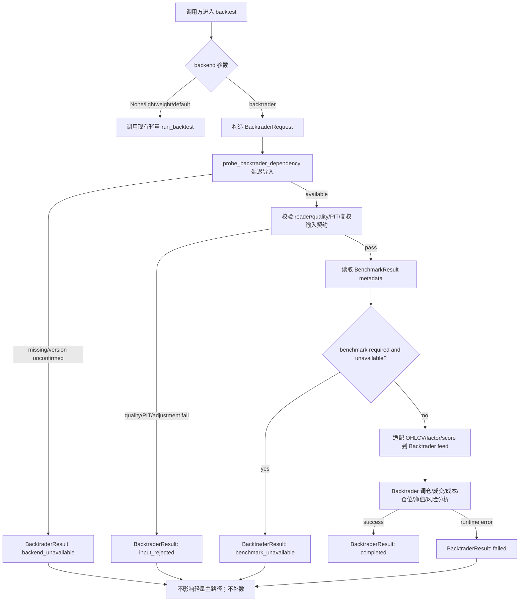

# LLD: CR005-S06 - Backtrader optional backend

> 本 LLD 已通过 `CR005-BATCH-D-S06-LLD` 批次 CP5 人工确认。实现阶段必须使用 dependency group `backtrader`，版本固定为 `backtrader==1.9.78.123`；必须 lazy import，默认 `lightweight` 不依赖 Backtrader；CP6 必须验证 Python 3.11 import + tiny Cerebro smoke test。若真实 Backtrader smoke 失败，则降级为 `backend_unavailable` + fake smoke，不在本 Story 临时切换 fork。

## 修订记录

| 版本 | 日期 | 修订人 | 变更要点 |
|---|---|---|---|
| 1.0 | 2026-05-17 | meta-dev | 基于 S06 Story、HLD §22.6/§22.8/§22.12/§22.13、ADR-015/016/017、Development Plan、Story Backlog 和 S02/S03/S04/S05 CP7 PASS 证据，起草 Backtrader optional backend 的文件范围、typed result、selector、异常降级、依赖策略、测试设计和实现门控。 |
| 1.1 | 2026-05-18 | meta-po | 回填 CP5 Batch D 人工批准；关闭 `O-S06-01 / CR5-Q3`，确认 dependency group `backtrader` 与 `backtrader==1.9.78.123`；关闭 `O-S06-02`，确认优先最小 wrapper / 默认 lightweight selector；增加 CP6 Python 3.11 import + tiny Cerebro smoke 约束和真实 smoke 失败 fallback。 |

## 1. Goal

创建 CR005-S06 的可实现设计：后续实现将在 CP5 Batch D 人工确认通过且开放项处理后，创建 `engine/backtrader_adapter.py` 和 `tests/test_backtrader_optional_backend.py`，并按受控共享范围修改 `engine/backtest.py`、`README.md`、`docs/USER-MANUAL.md`、`pyproject.toml` 与 `uv.lock`。

Backtrader 必须作为显式启用的 optional backend 和对照结果输出存在，不替代轻量 `engine/backtest.py` 默认主路径。adapter 只消费 S02/S03/S04 已验证的数据层契约：PIT as-of、复权 adjusted price、quality/catalog/readers、干净 factor panel / score / OHLCV feed、calendar 和 `BenchmarkResult`。Backtrader 不生成 PIT、不计算复权因子、不读取 Tushare、不联网、不读取 `TUSHARE_TOKEN`、不导入 connector/runtime/storage、不触发 benchmark backfill 或 lake 写入。

## 2. Requirements（Functional / Non-Functional）

### 2.1 Functional

- 默认 backend 固定为 `lightweight`；只有调用方显式传入 `backend="backtrader"` 或等价已确认 selector 值时，才进入 Backtrader optional backend。
- 未安装 Backtrader 时返回 typed `BacktraderResult(status="backend_unavailable")`，轻量主路径、默认 pytest 和默认 `run_backtest(...)` 行为不受影响。
- 创建 `engine/backtrader_adapter.py`，定义 `BacktraderRequest`、`BacktraderResult`、`BacktraderUnavailableReason` 或等价 typed schema，以及 `run_backtrader_backend(...)` 入口。
- `BacktraderResult.status` 主枚举固定为 `completed`、`backend_unavailable`、`input_rejected`、`benchmark_unavailable`、`failed`；不得用自由文本替代主状态。
- `backend_unavailable` 只用于 optional dependency 未安装或版本不满足；不得在默认轻量路径抛异常。
- adapter 输入必须是 reader/quality gate 后的干净 OHLCV feed、factor panel / score、calendar、benchmark result 和配置。输入不得是 Tushare raw、connector result、runtime plan、storage path 或未通过质量门的 dataset。
- quality `fail`、PIT gate fail、`available_at > decision_time`、复权 gate fail、adjusted price 缺失、`adj_factor` 冲突或 `adjustment_policy` 混用时，Backtrader 成功运行次数必须为 0，返回 `input_rejected` 并保留结构化 reason。
- `BenchmarkResult.status in {"unavailable", "required_missing", "quality_failed"}` 时，Backtrader 不触发 fetch/backfill/write；若 benchmark required，则返回 `benchmark_unavailable` 或 `input_rejected`，只在 metadata 透传 `missing_reason`、`next_action`、`remediation_job_spec`。
- `proxy_baseline` 不得填充 `hs300_index`，不得声明沪深 300 相对收益；仅允许作为旧代理口径独立字段展示。
- Backtrader 成功路径职责限定为调仓、成交、成本、仓位、净值和风险分析，并输出与轻量主路径可比较的 metadata / metrics / equity curve。
- 依赖修改只能在 CP5 Batch D 人工确认通过后执行；用户已确认 dependency group 为 `backtrader`，版本固定为 `backtrader==1.9.78.123`，实现阶段必须通过 uv 更新依赖和 lock。

### 2.2 Non-Functional

- 离线性：Backtrader adapter、selector、测试和文档默认网络调用次数为 0；不得导入 `requests`、`urllib`、`socket`、`httpx`、`aiohttp` 或 Tushare provider。
- 凭据安全：adapter 不读取 `TUSHARE_TOKEN`、不读取真实 token env、不把 env value 写入 metadata、错误或日志。
- 边界隔离：adapter 不导入 `market_data.connectors`、`market_data.runtime`、`market_data.storage`；只允许消费 `market_data.readers` 输出对象和 `market_data.benchmarks.BenchmarkResult`。
- 可维护性：Backtrader 相关代码集中在 `engine/backtrader_adapter.py`；`engine/backtest.py` 只增加最小 selector / wrapper，不把 Backtrader 细节下沉到轻量回测主流程。
- 兼容性：默认 `run_backtest(close_df, config, metadata=...)` 签名和返回 `BacktestResult` 语义保持兼容；新增入口必须可选，不破坏既有调用方。
- 可测试性：所有异常路径使用 fake/offline fixture 和 import monkeypatch；默认测试不要求安装 Backtrader。
- 可追溯：非 completed 结果必须包含 `status`、`reason_code`、`backend`、`fallback_backend`、`benchmark_metadata`、`issues` 和 `input_contract` 摘要。

## 3. 模块拆分与职责

| 模块 / 文件组 | 职责 | 说明 |
|---|---|---|
| `engine/backtrader_adapter.py` | 定义 Backtrader optional backend typed schema、依赖探测、输入契约校验、feed 适配、Backtrader 运行封装和结构化降级 | 新建主产物；只允许延迟导入 `backtrader`，未安装返回 `backend_unavailable`。 |
| `engine/backtest.py` | 保持轻量主路径默认；增加显式 backend selector 或 wrapper | 仅可新增 `backend="lightweight"` 默认参数、`run_backtest_with_backend(...)` 或等价最小入口；不得让 Backtrader 成为默认。 |
| `market_data/readers.py` | 提供 S03 已验证的 `ReaderResult`、`read_factor_panel(...)`、PIT gate、复权 gate 和 quality gate 输出 | S06 不修改该文件；实现只消费其输出，不重新实现 gate。 |
| `market_data/benchmarks.py` | 提供 S04 已验证的 `BenchmarkResult` typed schema、`next_action`、`remediation_job_spec` 和只读 benchmark policy | S06 不修改该文件；只透传 metadata，不执行 remediation。 |
| `tests/test_backtrader_optional_backend.py` | 覆盖 optional dependency、selector 默认、no forbidden import、输入拒绝、benchmark unavailable、no network/no token/no write 和成功路径 smoke | 新建测试；默认通过 monkeypatch/fake module 模拟 Backtrader，不要求安装真实依赖。 |
| `README.md` / `docs/USER-MANUAL.md` | 说明 Backtrader optional backend 的启用边界、未安装降级、no-network/no-token、benchmark 缺失行为和 `proxy_baseline` 边界 | 仅实现阶段在 CP5 Batch D 确认后修改；LLD 阶段不写。 |
| `pyproject.toml` / `uv.lock` | CP5 approved 后通过 `uv` 增加 dependency group `backtrader`，固定 `backtrader==1.9.78.123` | LLD 阶段禁止修改；实现阶段不得手工编辑锁文件。 |

## 4. 代码结构与文件影响范围

| 动作 | 文件路径 | 变更内容 |
|---|---|---|
| 创建 | `engine/backtrader_adapter.py` | 实现 typed request/result、dependency probe、input validation、OHLCV/factor/score feed adapter、Backtrader execution wrapper、metadata builder、structured unavailable / rejected / failed result。 |
| 创建 | `tests/test_backtrader_optional_backend.py` | 覆盖未安装降级、默认 lightweight、显式 selector、forbidden import 静态扫描、quality/PIT/复权失败阻断、benchmark unavailable/required_missing 不补数、fake Backtrader 成功 smoke。 |
| 修改 | `engine/backtest.py` | 只增加显式 backend selector 或 wrapper，默认仍调用现有轻量 `run_backtest(...)`；不得改变 `BacktestConfig` 默认含义和既有 `BacktestResult`。 |
| 修改 | `README.md` | 在实现阶段补充 optional backend 安装/启用说明、未安装降级和禁用边界；不得描述为默认主路径。 |
| 修改 | `docs/USER-MANUAL.md` | 在实现阶段补充用户操作、失败排查、benchmark missing 和 `proxy_baseline` 说明。 |
| 修改 | `pyproject.toml` | 仅在 CP5 Batch D 人工确认后，通过 `uv add --group backtrader backtrader==1.9.78.123` 或等价 uv 命令修改。 |
| 修改 | `uv.lock` | 仅由 uv 在实现阶段生成；不得手工编辑。 |
| 禁止 | `market_data/connectors/**` | S06 不修改、不导入、不触发真实 Tushare。 |
| 禁止 | `market_data/runtime.py`、`market_data/storage.py` | S06 不修改、不导入、不执行 backfill/write。 |
| 禁止 | `data/**`、`reports/**`、`delivery/**`、`TUSHARE_TOKEN` | S06 不写真实数据、报告或交付目录，不读取或写入 token。 |

## 5. 数据模型与持久化设计

S06 不新增持久化写入。所有结果对象为内存 typed result，可由调用方选择写入报告 metadata；adapter 本身不得写 `data/**`、`reports/**`、lake、catalog 或 remediation 文件。测试仅使用 `tmp_path` 与内存 DataFrame/fake module。

### 5.1 `BacktraderRequest`

| 对象 / 字段 | 类型 | 约束 | 说明 |
|---|---|---|---|
| `backend` | literal | required | 固定传入 `backtrader`；默认 selector 不构造该请求。 |
| `ohlcv` | `pd.DataFrame` | required | 已通过 S03 reader/quality/PIT/复权 gate；必须含 `trade_date`、`symbol`、`open`、`high`、`low`、`close`、可选 `volume`。 |
| `factor_panel` / `score` | `pd.DataFrame` / `pd.Series` / `None` | conditional | 已 PIT 对齐；任一用于信号/权重的非行情字段必须可证明 `available_at <= decision_time`。 |
| `calendar` | list[str/date] | required | S03 / trade calendar open dates；Backtrader 不自行生成交易日历。 |
| `benchmark_result` | `BenchmarkResult` / mapping / None | optional | 来自 S04 resolver；非 available 时只透传 metadata 或阻断 required benchmark。 |
| `config` | mapping | required | 手续费、滑点、初始资金、rebalance 规则、strategy 参数；不含 token。 |
| `input_contract` | mapping | required | 包含 `quality_status`、`adjustment_policy`、`pit_checked`、`source_dataset`、`run_id` 等审计摘要。 |

### 5.2 `BacktraderResult`

| 对象 / 字段 | 类型 | 约束 | 说明 |
|---|---|---|---|
| `status` | enum | required | `completed`、`backend_unavailable`、`input_rejected`、`benchmark_unavailable`、`failed`。 |
| `backend` | literal | required | 固定 `backtrader`。 |
| `fallback_backend` | literal / None | conditional | 未运行时写 `lightweight`，表示默认主路径仍可用；不得自动重跑轻量路径除非调用方显式要求。 |
| `reason_code` | enum / None | conditional | `dependency_missing`、`dependency_version_unconfirmed`、`quality_failed`、`pit_failed`、`adjustment_failed`、`benchmark_required_missing`、`runtime_error` 等。 |
| `message` | str | required | 面向用户的短说明；不得含 token 值。 |
| `metrics` | dict | required | completed 时包含 Backtrader metrics；未运行时为空 dict。 |
| `equity_curve` | `pd.DataFrame` / None | conditional | completed 时返回净值曲线；未运行时为 None。 |
| `orders` / `positions` / `trades` | `pd.DataFrame` / None | conditional | completed 时按可比较字段输出；未运行时为 None。 |
| `benchmark_metadata` | dict | required | 透传 `BenchmarkResult.to_metadata()` 的 JSON-safe 子集；不得执行 remediation。 |
| `issues` | list[dict] | required | 结构化问题列表，包含 code、dataset、field、severity。 |
| `input_contract` | dict | required | 记录 quality/PIT/复权/reader 证据摘要。 |
| `network_calls` / `lake_writes` / `token_reads` | int | required, 0 | 测试断言均为 0；生产代码不得主动计数真实网络，只固定声明边界。 |

### 5.3 持久化

| 对象 / 字段 | 类型 | 约束 | 说明 |
|---|---|---|---|
| 持久化写入 | N/A | 无新增 | S06 不写 raw/manifest/canonical/gold/quality/catalog，不写真实 reports；只返回内存结果。 |
| 依赖锁 | `pyproject.toml` / `uv.lock` | 条件变更 | 仅在 `CR5-Q3` 决策完成且 CP5 Batch D approved 后由 uv 修改；group=`backtrader`，version=`backtrader==1.9.78.123`。 |

## 6. API / Interface 设计

| 接口 / 入口 | 输入 | 输出 | 调用方 | 说明 |
|---|---|---|---|---|
| `select_backtest_backend(backend=None)` 或等价 selector | `None` / `"lightweight"` / `"backtrader"` | exact backend name 或 structured error | `engine/backtest.py` wrapper、tests | 默认返回 `lightweight`；测试：`T-S06-SELECTOR-01`。 |
| `run_backtest(..., backend="lightweight")` 或 `run_backtest_with_backend(...)` | 现有 `close_df`、`BacktestConfig`、metadata、显式 backend | `BacktestResult` 或 `BacktraderResult` / wrapper result | CLI/experiments/future callers | 实现阶段选择最小兼容形态；默认必须保持现有轻量结果；测试：`T-S06-LIGHTWEIGHT-01`。 |
| `probe_backtrader_dependency()` | 无 | `{available: bool, reason_code, version}` | adapter | 延迟导入；未安装不抛到默认路径；测试：`T-S06-DEPENDENCY-01`。 |
| `validate_backtrader_inputs(request)` | `BacktraderRequest` | normalized input 或 `BacktraderResult(input_rejected)` | adapter | 校验 quality/PIT/复权/benchmark required；测试：`T-S06-INPUT-01`、`T-S06-PIT-01`、`T-S06-ADJUSTMENT-01`。 |
| `run_backtrader_backend(request)` | `BacktraderRequest` | `BacktraderResult` | 显式 backend selector | 只负责调仓、成交、成本、仓位、净值和风险分析；测试：`T-S06-BACKTRADER-SMOKE-01`。 |
| `BacktraderResult.to_metadata()` | typed result | JSON-safe dict | reports/docs/future comparison | 输出稳定字段集，含 unavailable/rejected reason；测试：`T-S06-SCHEMA-01`。 |
| benchmark metadata pass-through | `BenchmarkResult` | `benchmark_metadata` 子对象 | adapter | unavailable/required_missing 不执行 remediation；测试：`T-S06-BENCHMARK-01`。 |

本节所有接口在第 10 节均有对应测试入口；第 7 节异常路径也逐项映射到错误路径测试。

## 7. 核心处理流程



正常流程：

1. 调用方未传 backend 或传 `lightweight` 时，执行现有轻量 `run_backtest(...)`，不导入 `backtrader`。
2. 调用方显式传 `backtrader` 时，构造 `BacktraderRequest`，并延迟探测 Backtrader 依赖。
3. 依赖可用后，adapter 校验输入来自 S03 reader/quality gate 后的 clean feed，并检查 `input_contract` 中的 PIT 和复权证据。
4. adapter 读取 S04 `BenchmarkResult` metadata；benchmark 非 available 但非 required 时，Backtrader 可运行绝对收益与非 hs300 相对指标，并标记 `benchmark_unavailable` metadata；benchmark required 且缺失时阻断运行。
5. adapter 将 OHLCV/factor/score 转为 Backtrader feed，只执行调仓、成交、成本、仓位、净值和风险分析。
6. 成功后返回 `BacktraderResult(status="completed")`，不覆盖轻量 `BacktestResult`。

异常路径：

1. Backtrader 未安装或版本策略未确认：返回 `backend_unavailable`；默认轻量路径不受影响。
2. quality fail：返回 `input_rejected(reason_code="quality_failed")`；不允许 `allow_warn` 以外的隐式放行。
3. PIT fail、`available_at > decision_time`、缺少可得性字段：返回 `input_rejected(reason_code="pit_failed")`。
4. adjusted price 缺失、`adj_factor` 冲突或 `adjustment_policy` 混用：返回 `input_rejected(reason_code="adjustment_failed")`。
5. `BenchmarkResult.status=required_missing` 且调用方要求 benchmark：返回 `benchmark_unavailable(reason_code="benchmark_required_missing")`，透传 spec，不执行。
6. `BenchmarkResult.status=unavailable` 且 benchmark 非 required：允许仅输出绝对指标，但不得声明 hs300 相对收益，旧代理只可标记 `proxy_baseline`。
7. 任何 connector/runtime/storage import、网络调用、token 读取或 lake 写入：视为实现缺陷，CP6 不得通过。

## 8. 技术设计细节

- 关键算法 / 规则：
  - selector exact 值只接受 `lightweight` 和 `backtrader`；未知值返回结构化错误或抛 `BacktestError("unknown_backend")`，测试固定。
  - `backtrader` 导入必须放在 `probe_backtrader_dependency()` 或运行函数内部；模块 import `engine.backtrader_adapter` 时不要求安装 Backtrader。
  - 输入校验顺序固定为 dependency -> quality -> PIT -> adjustment -> benchmark required -> feed schema -> runtime。
  - Backtrader feed 使用 adjusted OHLCV 字段；不得回退到未复权 `close` 计算收益。
  - `BenchmarkResult.remediation_job_spec` 只作为 metadata 复制；禁止调用 S01 CLI/job、runtime 或 storage。
  - `status` 与 `reason_code` 分离：主状态可机器分流，reason_code 保留细粒度失败原因。
- 依赖选择与复用点：
  - 复用 S02 CP7 PASS 的 separate `prices.daily` + `prices.adj_factor` join、invalid date fail fast、adjusted price normalization 契约。
  - 复用 S03 CP7 PASS 的 `ReaderResult`、`read_factor_panel(...)`、quality fail、PIT as-of gate、复权一致 gate、no connector/runtime import。
  - 复用 S04 CP7 PASS 的 `BenchmarkResult`、四状态 schema、dry-run remediation、no backfill/no network/no token 和 `proxy_baseline` 隔离。
  - 复用 S05 CP7 PASS 的文档边界：Backtrader optional backend 不默认替代轻量主路径，不联网、不读 token、不绕过 quality gate。
- 兼容性处理：
  - `engine/backtest.py` 当前只暴露轻量 `run_backtest(close_df, config=None, metadata=None)`；实现阶段优先新增 wrapper，减少对既有签名的冲击。
  - 若必须在 `BacktestConfig` 增加 backend 字段，默认值必须为 `lightweight`，且现有测试期望不变。
  - 默认 pytest 不安装 Backtrader；Backtrader 成功路径测试使用 monkeypatch fake module 或在 optional group 环境下单独标记。
- 图示类型选择：流程图。本 Story 跨 `engine/backtest.py`、`engine/backtrader_adapter.py`、reader/benchmark typed result 和文档/依赖策略，且有多条异常降级路径。

## 9. 安全与性能设计

| 维度 | 设计措施 | 验证方式 |
|---|---|---|
| 安全 | adapter / selector 不导入 `market_data.connectors`、`market_data.runtime`、`market_data.storage`、网络客户端或 Tushare provider | `T-S06-BOUNDARY-01` AST/import 扫描。 |
| 安全 | adapter 不读取 `TUSHARE_TOKEN` 或真实 env token；metadata/error 不含 token value | `T-S06-TOKEN-01` monkeypatch sentinel 和 `rg` 扫描。 |
| 安全 | `BenchmarkResult.remediation_job_spec` 只透传，不执行 CLI/job/runtime/storage | `T-S06-BENCHMARK-01` monkeypatch 调用计数和文件快照。 |
| 安全 | `proxy_baseline` 与 `hs300_index` 字段分离，非 available 不声明 hs300 相对收益 | `T-S06-PROXY-01` metadata 断言。 |
| 性能 | 默认 lightweight 路径不导入 Backtrader，不增加额外 heavy dependency import | `T-S06-LIGHTWEIGHT-01` import spy 和默认测试。 |
| 性能 | Backtrader optional 成功路径仅处理调用方传入的已清洗 feed，不扫描 lake 或全量 dataset | `T-S06-BACKTRADER-SMOKE-01` 使用小样本 fixture，断言不调用 reader/fetch。 |
| 可靠性 | 未安装依赖、输入失败、benchmark 缺失均返回 typed result，不影响轻量路径 | `T-S06-DEPENDENCY-01`、`T-S06-INPUT-01`、`T-S06-BENCHMARK-01`。 |

## 10. 测试设计

| 测试场景 | 前置条件 | 操作 | 预期结果 | 验证方式 |
|---|---|---|---|---|
| `T-S06-SELECTOR-01` 默认 selector | Backtrader 未安装或 monkeypatch import missing | 调用默认 `run_backtest(...)` 或 wrapper 不传 backend | 不导入 Backtrader，返回既有轻量 `BacktestResult` | pytest + import spy。 |
| `T-S06-LIGHTWEIGHT-01` 默认 pytest 不依赖 Backtrader | 清空 fake backtrader module | 运行 S06 测试默认路径 | `backend="lightweight"` 行为不变，未产生 `backend_unavailable` 异常 | pytest。 |
| `T-S06-DEPENDENCY-01` 未安装降级 | monkeypatch `importlib.import_module("backtrader")` 抛 `ImportError` | 显式 backend=`backtrader` | 返回 `BacktraderResult(status="backend_unavailable", reason_code="dependency_missing")` | 单测。 |
| `T-S06-SCHEMA-01` result schema 稳定 | 构造 completed / unavailable / rejected result | 调用 `to_metadata()` | 所有 required key 存在，token/network/lake counters 为 0 | 单测。 |
| `T-S06-BOUNDARY-01` forbidden import | 实现文件存在 | AST 扫描 `engine/backtrader_adapter.py` 和 `engine/backtest.py` | connector/runtime/storage/network/Tushare import 命中数为 0 | 静态测试。 |
| `T-S06-TOKEN-01` no token | 环境中设置 sentinel `TUSHARE_TOKEN` | 显式运行 missing dependency 和 benchmark missing 路径 | 不读取 env value，metadata 不含 sentinel | monkeypatch + string scan。 |
| `T-S06-INPUT-01` quality fail 阻断 | 构造 `input_contract.quality_status="fail"` 或 `ReaderResult(status="quality_failed")` | 显式 backend=`backtrader` | 返回 `input_rejected`，成功运行次数为 0 | 单测。 |
| `T-S06-PIT-01` PIT fail 阻断 | 构造 `available_at > decision_time` 或 `pit_checked=false` | 调用 validator | 返回 `input_rejected(reason_code="pit_failed")` | 单测。 |
| `T-S06-ADJUSTMENT-01` 复权 fail 阻断 | 缺 adjusted OHLCV、`adj_factor` 冲突或 policy 混用 | 调用 validator | 返回 `input_rejected(reason_code="adjustment_failed")` | 单测。 |
| `T-S06-BENCHMARK-01` benchmark 不补数 | 构造 `BenchmarkResult(status="required_missing")` 且 required=true | 显式 backend=`backtrader` | 返回 `benchmark_unavailable`，不调用 fetch/backfill/write，透传 metadata | 单测 + monkeypatch 调用计数。 |
| `T-S06-PROXY-01` proxy 不填 hs300 | 构造 benchmark unavailable 和 proxy_baseline metadata | 生成 result metadata | 无 `hs300_index` available 声明，无 hs300 relative return；proxy 仅在 `proxy_baseline` | 单测。 |
| `T-S06-BACKTRADER-SMOKE-01` fake Backtrader 成功路径 | monkeypatch fake `backtrader` module 和小样本 clean OHLCV | 显式 backend=`backtrader` | 返回 `completed`，只生成净值/metrics/orders/positions 的 fake 可比结果 | 单测，不安装真实 Backtrader。 |
| `T-S06-NO-WRITE-01` no lake/report write | tmp lake 快照 | 运行 unavailable、input rejected、fake completed 三类路径 | `data/**`、`reports/**`、lake fixture 文件集合不变 | 文件快照。 |
| `T-S06-DOCS-01` 文档边界 | 实现阶段文档已修改 | 扫描 README / USER-MANUAL | 明确 optional、默认 lightweight、no network/no token、benchmark missing 不补数 | 文档静态测试或人工复核。 |

## 11. 实施步骤

| TASK-ID | 动作 | 目标文件 | 详细描述 | 对应测试 |
|---|---|---|---|---|
| CR005-S06-T1 | 创建 | `engine/backtrader_adapter.py` | 定义 typed request/result、dependency probe、input validator、metadata builder、fake-test-friendly execution wrapper；禁止 import connector/runtime/storage/network/token。 | `T-S06-DEPENDENCY-01`、`T-S06-SCHEMA-01`、`T-S06-BOUNDARY-01`、`T-S06-TOKEN-01`。 |
| CR005-S06-T2 | 修改 | `engine/backtest.py` | 增加显式 backend selector 或 wrapper；默认 `lightweight` 保持现有 `run_backtest(...)` 语义；未知 backend 结构化失败。 | `T-S06-SELECTOR-01`、`T-S06-LIGHTWEIGHT-01`。 |
| CR005-S06-T3 | 修改 | `pyproject.toml`, `uv.lock` | 仅在 CP5 Batch D approved 后，通过 `uv add --group backtrader backtrader==1.9.78.123` 增加 Backtrader dependency group；不得手工改锁。默认 lightweight 路径不得导入或依赖 Backtrader。 | `T-S06-DEPENDENCY-01`、Python 3.11 import + tiny Cerebro smoke 和实现阶段依赖/锁文件审查。 |
| CR005-S06-T4 | 创建 | `tests/test_backtrader_optional_backend.py` | 覆盖 selector、dependency missing、forbidden import、no token/no network/no write、quality/PIT/复权阻断、benchmark missing 不补数、fake Backtrader smoke。 | 全部 `T-S06-*`。 |
| CR005-S06-T5 | 修改 | `README.md`, `docs/USER-MANUAL.md` | 说明 optional backend 启用、未安装降级、benchmark unavailable/required_missing、`proxy_baseline`、no-network/no-token/no-backfill 边界。 | `T-S06-DOCS-01`。 |

每个 TASK-ID 均映射到第 4 节文件影响范围；实现必须按 TASK-ID 顺序执行，T3 不得早于 CP5 Batch D 人工确认。若真实 Backtrader smoke 失败，不在本 Story 临时切换 fork，改按 `backend_unavailable` + fake smoke 降级完成。

## 12. 风险、难点与预研建议

| 风险 / 难点 | 影响 | 缓解措施 / 预研建议 |
|---|---|---|
| `CR5-Q3` 已确认 Backtrader dependency group/version | 允许 `pyproject.toml` / `uv.lock` 由 uv 修改；真实 Backtrader smoke 仍可能因包兼容性失败 | 用户确认 group=`backtrader`、version=`backtrader==1.9.78.123`；CP6 执行 Python 3.11 import + tiny Cerebro smoke。失败时降级为 `backend_unavailable` + fake smoke，不切换 fork。 |
| Backtrader 依赖一旦进入默认 dependencies 会污染轻量路径 | 默认安装和 CI 变慢，违背 ADR-016 | 仅允许 optional dependency；默认 selector 不导入 Backtrader；测试监控默认路径不导入。 |
| PIT / 复权职责被重复实现到 adapter | 产生未来函数或口径漂移 | adapter 只校验/消费 S03 clean feed；所有生成职责保持在 Pandas 数据层。 |
| `BenchmarkResult.required_missing` 被误用为自动补数触发器 | 消费层越权联网和写湖 | adapter 只透传 `next_action` / `remediation_job_spec`；静态扫描禁止 runtime/storage/connector import。 |
| fake Backtrader smoke 与真实 Backtrader API 存在差异 | 首次安装真实依赖后可能返工 feed 适配 | CP6 必须执行真实 Python 3.11 import + tiny Cerebro smoke；若失败，按 `backend_unavailable` + fake smoke 记录，不在本 Story 改依赖 fork。 |
| 共享文件 `engine/backtest.py`、README、USER-MANUAL、依赖锁与其他线程冲突 | 可能违反并行文件所有权 | 实现前复核 `process/STATE.md.parallel_execution.dev_running` 和 Story file ownership；冲突则阻塞，不自行合并。 |

### OPEN / Spike 跟踪

| ID | 类型（OPEN / Spike） | 问题 | 下一动作 | 责任方 |
|---|---|---|---|---|
| O-S06-01 | RESOLVED / accepted-with-constraints | `CR5-Q3`：Backtrader dependency group/version 已由用户确认。 | 使用 `uv add --group backtrader backtrader==1.9.78.123`；实现必须 lazy import；默认 lightweight 不依赖 Backtrader；CP6 必须验证 Python 3.11 import + tiny Cerebro smoke。若真实 smoke 失败，则降级为 `backend_unavailable` + fake smoke，不在本 Story 临时切换 fork。 | user / meta-po / meta-dev / meta-qa |
| O-S06-02 | RESOLVED / accepted-with-constraints | `run_backtest` selector 形态采用最小兼容入口。 | 优先新增 wrapper；如必须扩展既有入口，默认值保持 `lightweight`，并证明既有默认 `run_backtest(...)` 行为不变。 | meta-dev / meta-qa |

## 13. 回滚与发布策略

- 发布方式：仅在 `confirmed=true`、CP5 Batch D 人工确认 approved、`dev_gate` 满足、文件所有权无冲突后实现。Backtrader 作为 optional backend 发布；默认轻量路径和默认测试不安装、不导入、不运行 Backtrader。
- 回滚触发条件：
  - 默认 `lightweight` 行为或既有全量 pytest 回归失败。
  - `engine/backtrader_adapter.py` 或 `engine/backtest.py` 出现 connector/runtime/storage/network/Tushare/token import/read。
  - 未安装 Backtrader 时未返回 `backend_unavailable` 或影响默认轻量主路径。
  - quality/PIT/复权失败仍运行 Backtrader。
  - benchmark unavailable/required_missing 触发 fetch/backfill/write 或声明 hs300 相对收益。
  - `pyproject.toml` / `uv.lock` 未通过 uv 修改，或未按 group=`backtrader` / version=`backtrader==1.9.78.123` 锁定。
- 回滚动作：
  - 撤销 `engine/backtest.py` selector 变更，保留既有轻量 `run_backtest(...)`。
  - 删除或停用 `engine/backtrader_adapter.py` 的 selector 引用，使 `backtrader` 显式请求返回 `backend_unavailable`。
  - 使用 uv 回退 optional dependency 变更；不得手工编辑 `uv.lock`。
  - README / USER-MANUAL 回退到 S05 已验证的文档边界，保留 no-network/no-token/no-backfill 说明。

## 14. Definition of Done

- [ ] `engine/backtrader_adapter.py` 存在，模块 import 不要求安装 Backtrader。
- [ ] 默认 backend 为 `lightweight`；不传 backend 时既有轻量 `run_backtest(...)` 行为不变。
- [ ] 未安装 Backtrader 时显式 backend 返回 `BacktraderResult(status="backend_unavailable")`，默认 pytest 不受影响。
- [ ] adapter 对 `TUSHARE_TOKEN` 读取次数为 0。
- [ ] adapter 对 `market_data.connectors`、`market_data.runtime`、`market_data.storage` 的导入次数为 0。
- [ ] adapter 对网络客户端和真实 Tushare provider 的导入次数为 0。
- [ ] quality fail、PIT fail、`available_at > decision_time`、复权 fail、adjusted price 缺失、`adj_factor` 冲突或 `adjustment_policy` 混用时 Backtrader 成功运行次数为 0。
- [ ] PIT 生成、复权因子计算、Tushare 读取、联网补数、lake 写入职责在 adapter 中出现次数为 0。
- [ ] `BenchmarkResult.status in {"unavailable", "required_missing", "quality_failed"}` 时 fetch/backfill/write 触发次数为 0。
- [ ] `proxy_baseline` 不填充 `hs300_index`，非 available benchmark 不声明沪深 300 相对收益。
- [ ] Backtrader completed 路径只负责调仓、成交、成本、仓位、净值和风险分析。
- [ ] 不写真实 `data/**`、`reports/**`、`delivery/**`，不提交凭据。
- [ ] `tests/test_backtrader_optional_backend.py` 覆盖第 10 节全部测试入口。
- [ ] CP6 执行 Python 3.11 import + tiny Cerebro smoke；若真实 Backtrader smoke 失败，记录 `backend_unavailable` + fake smoke，并不切换 fork。
- [ ] `README.md` 与 `docs/USER-MANUAL.md` 覆盖 optional backend、未安装降级和禁止补数边界。
- [ ] `CR5-Q3` 已关闭；仅允许通过 uv 修改 `pyproject.toml` / `uv.lock`，dependency group 固定为 `backtrader`，版本固定为 `backtrader==1.9.78.123`。

## 人工确认区

> **CP5 - Story LLD 可实现性门**
> meta-dev 已写入 `process/checks/CP5-CR005-S06-backtrader-optional-backend-LLD-IMPLEMENTABILITY.md` 自动预检结果。
> meta-po 收齐本轮 LLD 设计批次内全部 Story 的 LLD 和 CP5 自动预检后，再生成并提示用户审查 `checkpoints/CP5-CR005-BATCH-D-S06-LLD-BATCH.md`。
> 用户已确认本轮批次 LLD 设计。进入实现仍需满足文件所有权门控，并按本文件记录的 `CR5-Q3` dependency group/version 与 CP6 smoke/fallback 约束执行。

**CP5 checklist 摘要**：

| # | 检查项 | 状态 | 证据 |
|---|---|---|---|
| 1 | LLD 覆盖 AC | 待检查 | 第 2 / 10 / 14 节 |
| 2 | 与 HLD / ADR 一致 | 待检查 | 第 3 / 8 / 12 节 |
| 3 | 文件影响范围明确 | 待检查 | 第 4 / 11 节 |
| 4 | 接口契约完整 | 待检查 | 第 5 / 6 节 |
| 5 | 测试与 dev_gate 可计算 | 待检查 | 第 10 / 12 / 14 节 |

**人工确认回复**：

请直接回复以下任一整行：

```text
approve
修改: <具体修改点>
reject
```

**人工审查结果回填**：

- 结论：`approved`
- 审查人：user
- 审查时间：2026-05-18T00:00:56+08:00
- 修改意见：按用户确认，S06 使用 dependency group `backtrader`，版本固定 `backtrader==1.9.78.123`；实现阶段必须 lazy import，默认 lightweight 不依赖 Backtrader；CP6 必须验证 Python 3.11 import + tiny Cerebro smoke test；若真实 Backtrader smoke 失败，则降级为 `backend_unavailable` + fake smoke，不在本 Story 临时切换 fork。
- 风险接受项：`O-S06-01 / CR5-Q3` 与 `O-S06-02` 均 accepted-with-constraints。
