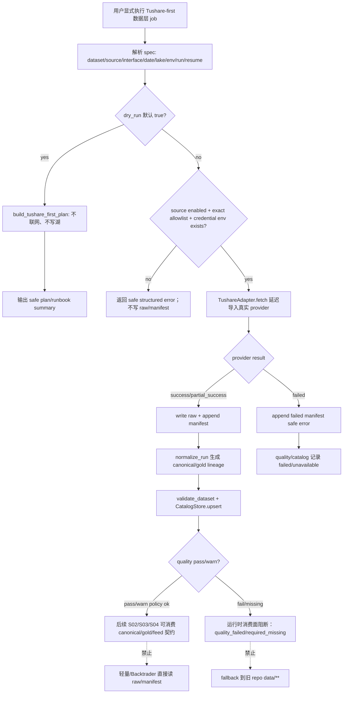

# LLD: CR006-S01 - Tushare-first 数据获取与 runbook

> 本 LLD 仅冻结 CR006-BATCH-A 中 CR006-S01 的低层设计。`confirmed=false`、CR006-BATCH-A 全量 CP5 未统一人工确认、或 `dev_gate.implementation_allowed=false` 时，不得修改业务代码、不得执行真实 Tushare 抓取、不得读取或写入真实数据湖、不得读取或列出旧 `data/**`，也不得读取、打印或记录 `.env`、Tushare token、NAS 用户名、NAS 密码或真实私有路径。

## 1. Goal

为 CR-006 冻结 Tushare-first 数据获取与 runbook 的实现蓝图：后续实现必须让 Tushare structured lake 成为新数据事实源，明确 plan/dry-run/fetch 只由用户显式执行的数据层 job 触发，并把 raw/manifest 限定为采集审计、断点续传、复现、replay 和质量追溯层；轻量回测、experiments 和 Backtrader 的运行时输入次数必须为 0 次直接消费 raw/manifest，旧 repo `data/**` 的读取、列出、迁移、复制、删除次数必须为 0。

## 2. Requirements（Functional / Non-Functional）

### 2.1 Functional

- 创建 `tests/test_cr006_tushare_first_acquisition.py`，用 fake/offline fixture 和 `tmp_path` 验证 S01 数据层契约，不需要真实 Tushare token、不需要 NAS、不联网。
- 修改 `market_data/cli.py` 或等价 job，使 Tushare-first plan/dry-run/fetch/runbook 行为显式、可审计、可用 JSON/结构化结果验证，并继承 CR005-S01 的默认 dry-run、no-network、no-write 计划契约。
- 修改 `market_data/connectors/tushare.py` 的边界文档或实现约束时，只能强化显式执行、source allowlist、missing credential、safe error 和 no-token-print 语义；不得让 import、reader、engine、experiment 或 Backtrader 自动触发真实 provider。
- 修改 `market_data/storage.py` 时，只能强化 raw/manifest 写入、lineage、params 脱敏和敏感值拦截；不得降低 CR005-S01 已冻结的 manifest/idempotency/resume 约束。
- 修改 `market_data/normalization.py`、`market_data/validation.py`、`market_data/catalog.py` 时，必须让 canonical/gold、quality、catalog 可追溯到 manifest run，并能在 schema 或 quality fail 时阻断运行时消费面。
- 明确 raw/manifest 仍然保留，但职责是采集审计、复现、quality 追溯和 replay；轻量回测、experiments、Backtrader 不直接读取 raw/manifest。
- 明确旧 repo `data/**` 保持 reference-only，不参与 plan、fetch、normalize、validate、catalog、gold 生成，也不作为 fallback 或覆盖证明。

### 2.2 Non-Functional

- 安全：token、NAS 用户名、NAS 密码、真实私有路径写入 manifest、quality、catalog、stdout、stderr、日志、fixture 和错误消息的次数为 0；只允许引用环境变量名。
- 离线可验证：默认测试网络调用次数为 0，真实 lake 写入次数为 0，旧 `data/**` 操作次数为 0。
- 可追溯：每个 canonical/gold dataset 至少保留 run/source/interface/quality lineage，并能追溯到 manifest run 或输出结构化 lineage 缺失错误。
- 可恢复：manifest/resume 行为继承 CR005-S01 的 `success=skip`、`failed=retry`、`partial_success=retry`、重复 success 冲突 fail-fast 语义。
- 可维护：S01 只冻结 acquisition/runbook 和 raw/manifest -> canonical/gold 交接契约，不重新设计 S02 轻量 adapter、S03 Backtrader feed 或 S04 old data guardrail。

## 3. 模块拆分与职责

| 模块 / 文件组 | 职责 | 说明 |
|---|---|---|
| Tushare plan/dry-run/fetch job（`market_data/cli.py` 或等价 job） | 提供用户显式执行的数据层入口，输出 plan、dry-run summary、execution summary、结构化错误和 runbook 可消费结果 | 复用 CR005-S01 `hs300_index` backfill job spec；S01 扩展为 Tushare-first acquisition/runbook 总入口，不授权回测运行时触发 |
| Tushare connector boundary（`market_data/connectors/tushare.py`） | 保持默认 disabled、source allowlist、missing credential、safe error、真实 provider 延迟导入和 no-token-print 边界 | 只允许数据层 job 调用；consumer path、engine、experiments、Backtrader、Notebook 主路径不得导入或调用 |
| raw/manifest storage（`market_data/storage.py`） | 写入 raw 响应、append-only manifest、idempotency/resume、params 脱敏、sensitive value guard 和 lineage 字段 | raw/manifest 是审计层和 replay 输入，不是回测运行输入；不得记录真实私有路径值 |
| normalization / quality / catalog（`market_data/normalization.py`、`validation.py`、`catalog.py`） | 从 raw/manifest 派生 canonical/gold、quality、catalog，记录 manifest_run_id/source/interface/run_id/lineage，并在 schema/quality fail 时阻断运行时消费 | 消费 CR005-S02 schema、CR005-S03 quality/catalog/readers 契约；S01 不重新定义 S02/S03 已 verified 字段语义 |
| S01 离线测试（`tests/test_cr006_tushare_first_acquisition.py`） | 验证 dry-run no-network/no-write、显式执行门、raw/manifest 审计字段、canonical/gold lineage、quality gate、no-old-data、no-secret-output | 使用 fake provider、tmp lake、manifest fixture、monkeypatch 和静态扫描；不执行真实 Tushare |
| 上游共享契约 | CR005-S01、CR005-S02、CR005-S03 的 verified Story/LLD/CP7 契约 | `process/stories/CR005-S01...LLD.md`、`CR005-S02...LLD.md`、`CR005-S03...LLD.md` 是强输入，不在 S01 中改写 |

## 4. 代码结构与文件影响范围

| 动作 | 文件路径 | 变更内容 |
|---|---|---|
| 修改 | `market_data/cli.py` | 增加或收敛 Tushare-first acquisition/runbook 入口；默认 dry-run；输出 dataset/source/interface/date range/lake root/env var name/run_id/resume policy/raw/manifest/canonical/quality/catalog/gold path plan/error enum；真实执行必须显式关闭 dry-run 并满足 enabled、allowlist、credential env 和用户执行上下文 |
| 修改 | `market_data/connectors/tushare.py` | 强化 Tushare connector 只能由数据层 job 调用的边界；保持 import no-network、真实 provider 延迟导入、safe `ConnectorError`、source disabled / interface not allowed / missing credential 等错误语义 |
| 修改 | `market_data/storage.py` | 强化 manifest/run lineage、raw checksum、row count、status、idempotency key、params 脱敏和敏感值扫描；不得记录 token 值、NAS 凭据或真实私有路径值 |
| 修改 | `market_data/normalization.py` | 复用 CR005-S02 exact schema/mapping，把 manifest success/partial_success 作为 canonical/gold 派生输入，并保留 source/interface/run/raw checksum lineage；不得读取旧 `data/**` |
| 修改 | `market_data/validation.py` | 复用 CR005-S03 quality gate，为 S01 runbook 结果提供 quality pass/warn/fail、lineage missing、schema mismatch、quality failed 等结构化状态 |
| 修改 | `market_data/catalog.py` | 记录 canonical/gold 最新 coverage、quality_status、latest_manifest_run_id、quality_path、catalog lineage，供后续 S02/S03/S04 消费 |
| 创建 | `tests/test_cr006_tushare_first_acquisition.py` | 创建默认离线单测，覆盖 S01 接口、异常路径、安全边界和 no-old-data 约束 |
| 禁止 | `engine/**`、`experiments/**`、`README.md`、`docs/USER-MANUAL.md`、`data/**`、`.env`、`credentials`、`delivery/**` | S01 实现不得修改、读取、列出、迁移、复制或删除这些禁止范围；本 LLD 阶段也未读取真实 `data/**` 或凭据 |

## 5. 数据模型与持久化设计

S01 不新增独立数据库、服务端存储或新 lake 分层；它冻结后续实现对 CR005 已存在 structured lake 分层的使用方式。所有路径示例必须使用占位符，不写真实私有路径。

| 对象 / 字段 | 类型 | 约束 | 说明 |
|---|---|---|---|
| `TushareFirstRunSpec.dataset` | exact string | 必填；来自 allowlist；未知 dataset fail-fast | 可包含 `hs300_index`、`prices`、`trade_calendar`、`index_weights` 等 CR005-S02 P0 dataset；不得 fuzzy/contains 推断 |
| `TushareFirstRunSpec.source` | literal | 必须为 `tushare` | 新链路事实源；旧 repo `data/**` 不是 source |
| `TushareFirstRunSpec.source_interface` | exact string | 必填；例如 `hs300_index.daily`；未知 interface fail-fast | 复用 CR005-S01/S02 exact mapping |
| `TushareFirstRunSpec.start_date/end_date` | date string | 合法日期；`start_date <= end_date` | plan/dry-run/fetch 范围；非法返回结构化参数错误 |
| `TushareFirstRunSpec.lake_root` | path-like value | 必填或由配置/env 提供；输出中只允许使用安全占位或脱敏摘要 | 不记录真实 NAS 用户名、密码或真实私有路径 |
| `TushareFirstRunSpec.credential_env` | string | 只允许环境变量名，例如 `TUSHARE_TOKEN` | 不读取、打印或记录 token 值 |
| `TushareFirstRunSpec.run_id` | string | 必填或 deterministic 生成；不得含敏感值 | 进入 manifest、quality、catalog lineage |
| `TushareFirstRunSpec.resume_policy` | dict / typed object | 默认 `success=skip, failed=retry, partial_success=retry, duplicate_manifest=fail` | 与 CR005-S01 runtime/storage 契约一致 |
| `TushareFirstRunSpec.dry_run` | bool | 默认 `true` | true 时 provider 调用 0 次，raw/manifest/canonical/quality/catalog/gold 写入 0 次 |
| `ManifestRecord.manifest_run_id` | string | required | 可等价复用 `run_id` 或由 manifest writer 生成；canonical/gold 必须可追溯 |
| `ManifestRecord.source/source_interface` | string | required | 必须与 run spec exact 值一致 | quality/catalog/readers 的 lineage 输入 |
| `ManifestRecord.raw_checksum/raw_row_count/status` | string/int/enum | success/partial_success 时 required | 支撑 replay、quality gap 和 partial success 追溯 |
| `CanonicalGoldLineage.source_run_id/source_interface/manifest_run_id/lineage_raw_checksum` | string | required 或 structured missing | S02/S03/S04 后续消费的最小 lineage 字段集 |
| `QualityCatalogStatus.quality_status/dataset_status` | enum | pass/warn/fail/missing 与 available/unavailable/required_missing 等 | quality fail 必须阻断轻量/Backtrader 运行时消费面 |

持久化分层语义：

| 分层 | S01 设计口径 | 运行时消费方 |
|---|---|---|
| raw | Tushare 原始响应审计、replay、排查源字段变化 | normalization/replay；轻量回测、experiments、Backtrader 直接消费次数为 0 |
| manifest | run/batch/source/interface/params/status/raw path/checksum/lineage 审计与 resume 事实 | data job、quality/catalog；轻量回测、experiments、Backtrader 直接消费次数为 0 |
| canonical/gold | schema、PIT、复权、quality gate 后的事实数据面 | 轻量 engine adapter、Backtrader clean feed、实验 reader 后续消费 |
| quality/catalog | dataset 状态、coverage、lineage、quality gate 和 reader 索引 | 所有运行时消费面必须读取 gate 结论 |
| old repo `data/**` | reference-only；S01 不读取、不列出、不迁移、不复制、不删除 | 默认程序消费次数为 0 |

## 6. API / Interface 设计

| 接口 / 入口 | 输入 | 输出 | 调用方 | 说明 |
|---|---|---|---|---|
| `build_tushare_first_plan(spec)` | `TushareFirstRunSpec(dataset, source, source_interface, start_date, end_date, lake_root, credential_env, run_id, resume_policy, dry_run=True)` | 结构化 plan JSON：batches、target raw/manifest/canonical/quality/catalog/gold paths、resume_policy、error_enum、network_calls=0、writes=0 | CLI/job、runbook、tests | 默认不联网不写湖；测试：`T-CR006-S01-PLAN-01`、`T-CR006-S01-NOOLD-01` |
| `cmd_tushare_first_acquire(args)` 或等价 job | CLI args / remediation spec；用户显式执行上下文；`dry_run` 默认 true | dry-run plan、execution summary 或 structured error；退出码遵循现有 CLI 语义 | 用户显式数据层 job | `dry_run=false` 才允许进入 connector/runtime；consumer 不得调用；测试：`T-CR006-S01-DRYRUN-01`、`T-CR006-S01-REAL-GATE-01` |
| `TushareAdapter.fetch(request)` | `ConnectorRequest(source="tushare", interface, params, run_id, batch_id, params_hash)` | `ConnectorResult` 或 safe `ConnectorError` | 数据层 job/runtime | 继承 CR005-S01；source disabled / not allowlisted / missing credential 非重试；测试：`T-CR006-S01-CONNECTOR-01` |
| `ManifestWriter.append(record)` / `storage.write_raw(...)` | connector result、batch metadata、sanitized params、safe error | raw JSONL/等价 raw artifact、append-only manifest 或 `CredentialExposureError` | runtime/storage | 写入前扫描敏感值；不得记录 token、NAS 凭据、真实私有路径；测试：`T-CR006-S01-MANIFEST-01`、`T-CR006-S01-SECRET-01` |
| `normalize_run(manifest_path, lake_root, dataset, run_id)` | success/partial_success manifest records、raw rows、dataset exact mapping | `NormalizationResult`、canonical/gold path、typed status | data job 后续阶段 | 复用 CR005-S02 schema；不读取旧 `data/**`；测试：`T-CR006-S01-LINEAGE-01` |
| `validate_dataset(...)` / `CatalogStore.upsert(...)` | canonical/gold path、expected range、thresholds、manifest lineage | quality CSV/row、catalog entry、quality_status、dataset_status | data job 后续阶段、reader | quality fail 阻断运行时消费；测试：`T-CR006-S01-QUALITY-01` |
| `emit_tushare_first_runbook_summary(result)` | plan/execution/normalization/quality/catalog summary | safe human-readable summary + machine JSON；只含占位路径或脱敏摘要 | CLI stdout、runbook、tests | 不输出 token、NAS 凭据、真实私有路径；测试：`T-CR006-S01-RUNBOOK-01` |

## 7. 核心处理流程



主流程：

1. `plan_tushare_first_acquisition`：用户显式传入或选择 dataset/source/interface/date range/lake root/env var name/run id/resume policy；默认 dry-run；不读取旧 `data/**`。
2. `dry_run_plan`：只执行参数校验、batch 规划、目标分层路径规划、错误枚举输出；provider 调用次数为 0，写入次数为 0。
3. `real_fetch_gate`：只有 `dry_run=false`、source enabled、exact allowlist 命中、credential env 存在且用户显式执行时，才进入 fetch；任一失败返回 safe structured error。
4. `raw_manifest_audit`：成功、失败、partial success 均通过 append-only manifest 留痕；params 和 errors 必须脱敏；token、NAS 凭据和真实私有路径不得进入任何输出。
5. `normalize_quality_catalog`：从 manifest success/partial_success 派生 canonical/gold，并输出 quality/catalog；quality fail 阻断后续 reader/adapter/feed。
6. `runtime_boundary`：轻量回测、experiments、Backtrader 后续只能消费 canonical/gold 或 clean feed；不得调用 fetch/backfill，不得读 raw/manifest，不得 fallback 到旧 repo `data/**`。

异常路径：

| 异常 | 处理 | 测试覆盖 |
|---|---|---|
| unknown dataset/interface | 返回 `interface_not_allowed` 或 `unknown_dataset`；不联网不写湖 | `T-CR006-S01-PLAN-02` |
| date range 非法 | 返回 `invalid_date_range`；不联网不写湖 | `T-CR006-S01-PLAN-03` |
| missing credential env | 返回 `missing_credential`，只输出 env var 名；不打印值 | `T-CR006-S01-REAL-GATE-01`、`T-CR006-S01-SECRET-01` |
| provider 限频/远端错误 | manifest status=`failed` 或 runtime retry 后 failed；safe error | `T-CR006-S01-MANIFEST-02` |
| partial success | manifest status=`partial_success`，记录 failed_items/gap；quality/catalog 不得声明完整 available | `T-CR006-S01-MANIFEST-03` |
| schema/lineage 缺失 | normalization/quality 返回 `schema_mismatch`、`lineage_unavailable` 或 `quality_failed` | `T-CR006-S01-LINEAGE-02`、`T-CR006-S01-QUALITY-01` |
| 旧 repo `data/**` 被作为输入 | fail-fast 或测试 spy 断言调用次数为 0；S01 不读取、不列出 | `T-CR006-S01-NOOLD-01` |

## 8. 技术设计细节

- 关键规则：
  - Tushare structured lake 是新链路事实源；旧 repo `data/**` 只作 reference-only，不作为 fallback、迁移源或覆盖证明。
  - raw/manifest 需要保留，但仅用于采集审计、断点续传、复现、replay 和质量追溯；运行时消费面不得直接读取。
  - `dry_run=true` 是默认值；dry-run 输出必须包含 `network_calls=0` 和 `writes=0` 或等价结构化断言字段。
  - `dry_run=false` 必须同时满足 source enabled、exact interface allowlist、credential env exists、用户显式执行上下文；任一不满足时不写 raw/manifest。
  - canonical/gold lineage 最小字段集为 `source`、`source_interface`、`source_run_id` 或 `run_id`、`manifest_run_id`、`schema_version`、`lineage_raw_checksum` 或等价 lineage、`quality_status`。
  - quality fail、schema mismatch、lineage missing、PIT/复权 gate fail 均不得被 runbook 宣称为可消费。

- 依赖选择与复用点：
  - 复用 CR005-S01：`TushareAdapter.fetch`、`hs300_index` backfill job spec、dry-run no-network/no-write、manifest/idempotency/resume、safe connector error。
  - 复用 CR005-S02：P0 dataset exact mapping、schema registry、PIT 字段、adjusted price / `adj_factor` 语义、unknown/fuzzy fail-fast。
  - 复用 CR005-S03：quality CSV、catalog entry、reader gate、PIT as-of gate、复权一致 gate、structured unavailable / required_missing / quality_failed。
  - 不引用平台安装结构；本 Story 不涉及 `delivery/**`、安装器或平台路径安装规范。

- 兼容性处理：
  - 对既有 `hs300_index` job spec 保持向后兼容；S01 只是把它纳入 Tushare-first acquisition/runbook 总契约。
  - 对其他 P0 dataset 先按 CR005-S02 exact mapping 输出计划和 fake fixture 验证；真实 provider 字段、积分和限频仍在 OPEN 中，不作为默认测试条件。
  - 对 existing reader/engine 的兼容由 CR006-S02 处理；S01 不修改 `engine/**` 或 `experiments/**`。
  - 对 Backtrader clean feed 的兼容由 CR006-S03 处理；S01 只提供 quality/catalog lineage 前置。

- 图示类型选择：流程图。S01 横跨 CLI/job、connector、storage、normalization、validation、catalog、tests，并包含 dry-run、real fetch、partial success、quality fail 和 no-old-data 异常分支。

## 9. 安全与性能设计

| 维度 | 设计措施 | 验证方式 |
|---|---|---|
| 安全 | token 值、NAS 用户名、NAS 密码和真实私有路径不得进入 manifest、quality、catalog、stdout、stderr、日志、fixture 或错误消息；只允许记录 env var 名和脱敏路径摘要 | `T-CR006-S01-SECRET-01` 使用 sentinel 扫描所有结构化输出、异常消息和测试 fixture |
| 安全 | 默认测试和 dry-run 不联网、不写 lake；真实 fetch 只能由用户显式数据层 job 触发 | `T-CR006-S01-DRYRUN-01`、`T-CR006-S01-REAL-GATE-01` 使用 provider spy 和 write spy |
| 安全 | 旧 repo `data/**` 在 S01 plan/fetch/normalize/validate/catalog 中读取、列出、迁移、复制、删除次数为 0 | `T-CR006-S01-NOOLD-01` monkeypatch filesystem/list/read/copy/delete spy；不触碰真实 `data/**` |
| 安全 | 轻量回测、experiments、Backtrader 不直接消费 raw/manifest，不触发 fetch/backfill | S01 测试检查 acquisition 输出契约；S02/S03/S04 后续静态检查补充 consumer import/path 断言 |
| 性能 | plan/dry-run 只做参数校验和 batch/path 规划，复杂度随 batch 数线性增长 | `T-CR006-S01-PLAN-01` 使用小型 fake date range 断言秒级完成 |
| 性能 | manifest/resume 复用 idempotency key，避免重复 success 重新联网；failed/partial_success 按策略重试 | `T-CR006-S01-MANIFEST-02`、`T-CR006-S01-MANIFEST-03` |
| 可追溯 | raw/manifest/canonical/gold/quality/catalog 都保留 run/source/interface/manifest/raw checksum 或 structured missing | `T-CR006-S01-LINEAGE-01`、`T-CR006-S01-QUALITY-01` |
| 可维护 | exact dataset/interface mapping 和 quality gate 复用 CR005-S02/S03，不在 S01 复制 schema 逻辑 | CP5 文件影响范围检查；实现时 code review 检查 S01 不改写 verified schema 语义 |

## 10. 测试设计

验证入口：`uv run --python 3.11 pytest -q tests/test_cr006_tushare_first_acquisition.py`。本 LLD 阶段不运行该命令，因为测试文件尚未实现。

| 测试场景 | 前置条件 | 操作 | 预期结果 | 验证方式 |
|---|---|---|---|---|
| `T-CR006-S01-PLAN-01` plan 字段完整 | fake spec，tmp lake root，占位 env var 名 | 调用 `build_tushare_first_plan(spec)` | 输出 dataset/source/interface/date/lake/run/resume/dry_run/raw/manifest/canonical/quality/catalog/gold/error_enum，且 `network_calls=0`、`writes=0` | pytest JSON 断言 |
| `T-CR006-S01-PLAN-02` unknown dataset/interface fail-fast | spec 使用未知 dataset 或 fuzzy interface | 调用 plan | 返回 `unknown_dataset` / `interface_not_allowed`；不联网不写湖 | pytest 参数化 |
| `T-CR006-S01-PLAN-03` invalid date range | start/end 非法或 start > end | 调用 plan | 返回 `invalid_date_range`；不创建文件 | pytest |
| `T-CR006-S01-DRYRUN-01` dry-run no side effect | fake provider spy、tmp lake root | 执行默认 acquisition job | provider 调用 0 次；raw/manifest/canonical/quality/catalog/gold 写入 0 次 | pytest spy + tmp_path 快照 |
| `T-CR006-S01-REAL-GATE-01` real execution gate | `dry_run=false`，分别缺 enabled/allowlist/credential env | 执行 acquisition job | 返回 `source_disabled`、`interface_not_allowed` 或 `missing_credential`；不写 raw/manifest | pytest 参数化 |
| `T-CR006-S01-CONNECTOR-01` connector 只由数据层调用 | import connector，fake config | 检查 import 和 fetch 前置失败路径 | import provider 调用 0 次、网络 0 次；前置失败均为 safe `ConnectorError` | pytest + monkeypatch |
| `T-CR006-S01-MANIFEST-01` manifest audit fields | fake success result | 写 raw + append manifest | manifest 含 run_id/batch_id/source/interface/params_hash/raw_checksum/raw_row_count/status/error_type；不含敏感值 | pytest fixture |
| `T-CR006-S01-MANIFEST-02` resume/idempotency | tmp manifest 含 success/failed/partial_success/duplicate success | 执行对应 batch | success skip；failed/partial retry；duplicate success -> `resume_conflict` | pytest |
| `T-CR006-S01-MANIFEST-03` partial success quality handoff | fake provider 返回 rows + partial_errors | 执行 job 后进入 quality summary | manifest status=`partial_success`；quality/catalog 不声明完整 available；缺口保留 | pytest |
| `T-CR006-S01-LINEAGE-01` canonical/gold 可追溯 | fake raw/manifest success + S02 schema fixture | normalize + catalog | canonical/gold 至少包含 source/interface/run/manifest/raw checksum/schema lineage | pytest + pandas/parquet fixture |
| `T-CR006-S01-LINEAGE-02` lineage missing blocks | fake canonical 缺 manifest_run_id 或 raw checksum | validate/catalog | 返回 `lineage_unavailable`、`quality_failed` 或 structured unavailable；运行时消费不 available | pytest |
| `T-CR006-S01-QUALITY-01` quality fail 阻断 | fake canonical duplicate key/schema mismatch/coverage fail | validate + catalog | quality_status=`fail`；catalog/reader 可消费状态为 blocked/unavailable | pytest |
| `T-CR006-S01-NOOLD-01` no old data operation | monkeypatch filesystem APIs；不访问真实 `data/**` | 执行 plan/dry-run/fake normalize/validate/catalog | 旧 repo `data/**` read/list/migrate/copy/delete 调用次数均为 0 | pytest spy |
| `T-CR006-S01-SECRET-01` no credential or private path exposure | env 设置 sentinel token；fake NAS credential/path sentinel | 执行 fail/plan/fake success/quality/catalog/runbook summary | sentinel 在 stdout/stderr/manifest/quality/catalog/errors/fixtures 中出现次数为 0 | pytest string scan |
| `T-CR006-S01-RUNBOOK-01` safe runbook summary | fake plan、fake success、fake quality fail 三类结果 | 调用 `emit_tushare_first_runbook_summary` | 输出包含下一步和结构化状态，不包含真实私有路径或凭据，不宣称旧数据覆盖 | pytest |

接口到测试映射：

| 第 6 节接口 | 对应测试 |
|---|---|
| `build_tushare_first_plan(spec)` | `T-CR006-S01-PLAN-01..03`、`T-CR006-S01-NOOLD-01` |
| `cmd_tushare_first_acquire(args)` | `T-CR006-S01-DRYRUN-01`、`T-CR006-S01-REAL-GATE-01` |
| `TushareAdapter.fetch(request)` | `T-CR006-S01-CONNECTOR-01` |
| `ManifestWriter.append(record)` / `storage.write_raw(...)` | `T-CR006-S01-MANIFEST-01..03`、`T-CR006-S01-SECRET-01` |
| `normalize_run(...)` | `T-CR006-S01-LINEAGE-01..02` |
| `validate_dataset(...)` / `CatalogStore.upsert(...)` | `T-CR006-S01-QUALITY-01` |
| `emit_tushare_first_runbook_summary(result)` | `T-CR006-S01-RUNBOOK-01`、`T-CR006-S01-SECRET-01` |

## 11. 实施步骤

| TASK-ID | 动作 | 目标文件 | 详细描述 | 对应测试 |
|---|---|---|---|---|
| CR006-S01-T1 | 修改 | `market_data/cli.py` 或等价 job | 增加 Tushare-first acquisition/runbook plan/dry-run/fetch 入口；默认 dry-run；输出分层目标路径、resume policy、error enum、network/write 计数和 safe runbook summary | `T-CR006-S01-PLAN-01..03`、`T-CR006-S01-DRYRUN-01`、`T-CR006-S01-RUNBOOK-01` |
| CR006-S01-T1A | 修改 | `market_data/cli.py` 或等价 job | 增加 real execution gate：`dry_run=false`、source enabled、exact allowlist、credential env exists、用户显式执行上下文均满足才进入 connector/runtime | `T-CR006-S01-REAL-GATE-01` |
| CR006-S01-T1B | 修改 | `market_data/connectors/tushare.py` | 保持并强化 import no-network、真实 provider 延迟导入、safe connector error、source disabled / not allowlisted / missing credential 的结构化错误 | `T-CR006-S01-CONNECTOR-01` |
| CR006-S01-T2 | 修改 | `market_data/storage.py` | 确认 raw/manifest 写入、idempotency/resume、partial success、lineage 字段和敏感值扫描；只允许强化检查，不降低 CR005-S01 约束 | `T-CR006-S01-MANIFEST-01..03`、`T-CR006-S01-SECRET-01` |
| CR006-S01-T3 | 修改 | `market_data/normalization.py` | 复用 CR005-S02 exact schema，把 manifest success/partial_success 派生为 canonical/gold，保留 manifest_run_id/source/interface/run/raw checksum lineage | `T-CR006-S01-LINEAGE-01..02` |
| CR006-S01-T3A | 修改 | `market_data/validation.py` | 复用 CR005-S03 quality gate，确保 schema mismatch、lineage missing、duplicate/coverage fail 输出 quality_failed / unavailable，阻断运行时消费 | `T-CR006-S01-QUALITY-01` |
| CR006-S01-T3B | 修改 | `market_data/catalog.py` | 记录 latest_manifest_run_id、quality_status、coverage、quality_path、source/interface/run lineage，供 S02/S03/S04 后续消费 | `T-CR006-S01-LINEAGE-01`、`T-CR006-S01-QUALITY-01` |
| CR006-S01-T4 | 创建 | `tests/test_cr006_tushare_first_acquisition.py` | 创建默认离线测试，覆盖本 LLD 第 10 节全部场景；使用 fake provider、tmp lake、monkeypatch 和静态扫描，不需要 token、不联网、不访问真实 `data/**` | 全部 `T-CR006-S01-*` |

文件影响范围到 TASK-ID 映射：

| 文件路径 | TASK-ID |
|---|---|
| `market_data/cli.py` 或等价 job | CR006-S01-T1、CR006-S01-T1A |
| `market_data/connectors/tushare.py` | CR006-S01-T1B |
| `market_data/storage.py` | CR006-S01-T2 |
| `market_data/normalization.py` | CR006-S01-T3 |
| `market_data/validation.py` | CR006-S01-T3A |
| `market_data/catalog.py` | CR006-S01-T3B |
| `tests/test_cr006_tushare_first_acquisition.py` | CR006-S01-T4 |

## 12. 风险、难点与预研建议

| 风险 / 难点 | 影响 | 缓解措施 / 预研建议 |
|---|---|---|
| 误把 raw/manifest 当成回测运行时输入 | 绕过 schema、PIT、复权和 quality gate，产生不可审计结果 | S01 在接口、测试和 DoD 中声明运行时直接消费次数为 0；S02/S03/S04 继续做 consumer 静态检查 |
| 为证明新链路可用而读取旧 repo `data/**` | 违反用户授权和 ADR-018，可能泄露或污染不可审计数据 | S01 测试用 monkeypatch spy，不访问真实 `data/**`；任何覆盖性比对必须另行授权 |
| Tushare P0 dataset 字段、积分、限频未完全确认 | 真实 fetch 参数和 batch planner 可能调整 | 保持默认 dry-run/offline；真实 provider 字段、限频和积分进入 OPEN；默认测试只用 fake fixture |
| real lake root / external 私有路径处理不当 | 可能记录真实路径或写入不应写入的位置 | 输出只保留占位、脱敏摘要或 env var 名；真实路径不进入 LLD、测试 fixture、日志或 manifest 示例 |
| partial success 被后续 quality/catalog 误判为完整 available | 运行时可能消费缺口数据 | manifest 保留 partial_success 和 gap；quality/catalog 必须记录 coverage/gap 并阻断或 structured unavailable |
| S01 修改 shared 文件与 S02/S03/S04 并行实现冲突 | 后续开发可能发生文件所有权冲突 | 本 LLD 只起草；实现必须等 CR006-BATCH-A 全量 CP5，通过 Wave/DAG 串行或 merge_owner 协调 |

### OPEN / Spike 跟踪

| ID | 类型（OPEN / Spike） | 问题 | 下一动作 | 责任方 |
|---|---|---|---|---|
| O-CR006-S01-01 | OPEN | Tushare P0 dataset 是否覆盖下一轮策略研究所需字段仍未确认；本 LLD 不承诺覆盖旧 `data/**` 或用户未来全部研究字段 | CP5 人工确认时接受 S01 只冻结 acquisition/runbook 边界；真实回补范围由用户 / 数据源 owner 在后续执行前确认 | 用户 / 数据源 owner |
| O-CR006-S01-02 | OPEN | 真实 provider 的 batch size、限频、积分消耗和字段细节未确认 | 默认实现保持 dry-run/offline 与保守串行；真实执行参数在另行授权的真实回补前确认 | 用户 / 数据源 owner / meta-dev |
| O-CR006-S01-03 | OPEN | runbook 输出中的 lake root 展示格式需要与现有 CLI 风格对齐，同时不得暴露真实私有路径 | 实现前读取当前 `market_data/cli.py` 的输出风格，采用占位、basename 或 hash 摘要；测试用 sentinel 防泄漏 | CR006-S01 implementer |

## 13. 回滚与发布策略

- 发布方式：CR006-BATCH-A 全部四张 Story 的 LLD 与 CP5 自动预检完成后，由 meta-po 生成 `checkpoints/CP5-CR006-BATCH-A-LLD-BATCH.md` 并发起统一人工确认；确认前 S01 不进入实现。确认后按 Wave/DAG 和文件所有权门控实现，默认验证命令为 `uv run --python 3.11 pytest -q tests/test_cr006_tushare_first_acquisition.py`。
- 回滚触发条件：
  - plan/dry-run 出现网络调用或写入；
  - token、NAS 凭据或真实私有路径进入 manifest、quality、catalog、stdout、stderr、日志、fixture 或错误消息；
  - S01 读取、列出、迁移、复制或删除旧 repo `data/**`；
  - raw/manifest 被轻量回测、experiments 或 Backtrader 作为直接运行输入；
  - quality fail、schema mismatch 或 lineage missing 仍被 catalog/runbook 宣称为 available；
  - 实现修改 `engine/**`、`experiments/**`、README、docs、真实 `data/**`、`.env`、`delivery/**`。
- 回滚动作：
  - 撤回 `market_data/cli.py` 或等价 job 中 S01 acquisition/runbook 入口变更；
  - 撤回 `market_data/connectors/tushare.py`、`storage.py`、`normalization.py`、`validation.py`、`catalog.py` 中由 S01 引入的行为变更，保留 CR005 已 verified 的 baseline；
  - 删除 `tests/test_cr006_tushare_first_acquisition.py`；
  - 不删除真实数据目录，不迁移旧 `data/**`，不清理用户私有 lake；若人工真实执行曾写入外部 lake，需由用户另行授权按 run_id 手动处理。

## 14. Definition of Done

- [ ] 14 个章节全部填写完成，且 `tier=M`、`shared_fragments`、`open_items` 已在 frontmatter 标注。
- [ ] Story 范围、HLD §23、ADR-018、CR005-S01/S02/S03 verified 契约均已映射到接口、流程、测试和 DoD。
- [ ] 文件影响范围与 Story `file_ownership` 一致：只允许后续实现修改 `market_data/cli.py` 或等价 job、`market_data/connectors/tushare.py`、`market_data/storage.py`、`market_data/normalization.py`、`market_data/validation.py`、`market_data/catalog.py`，并创建 `tests/test_cr006_tushare_first_acquisition.py`。
- [ ] 禁止范围明确：不修改 `engine/**`、`experiments/**`、README、docs、真实 `data/**`、`.env`、`credentials`、`delivery/**`。
- [ ] raw/manifest 的职责被限定为采集审计、复现、quality 追溯和 replay；轻量回测、experiments、Backtrader 直接消费 raw/manifest 次数为 0。
- [ ] canonical/gold 至少包含 run/source/interface/quality lineage，可追溯到 manifest run；lineage missing 或 quality fail 会阻断运行时消费面。
- [ ] Tushare job 只能由用户显式执行；回测运行时触发 fetch/backfill 次数为 0。
- [ ] 旧 repo `data/**` 读取、列出、迁移、复制、删除次数为 0；本 LLD 和 CP5 阶段也未读取或列出真实 `data/**`。
- [ ] token、NAS 用户名、NAS 密码、真实私有路径记录次数为 0；本 LLD 和 CP5 阶段未读取或打印 `.env` 或凭据。
- [ ] 第 6 节每个接口在第 10 节至少有 1 条测试覆盖。
- [ ] 第 7 节每条异常路径在第 10 节有对应错误路径测试。
- [ ] 第 11 节 TASK-ID 与第 4 节文件影响范围一一对应。
- [ ] `confirmed=false` 时不进入实现；CR006-BATCH-A 全量 CP5 自动预检与统一人工确认通过前不进入实现。
- [ ] OPEN 项已清点为 3 个，均不阻塞 LLD 确认，但阻塞真实 provider 参数或真实回补范围默认化。

## 人工确认区

> **CP5 — Story LLD 可实现性门**
> meta-dev 已写入 `process/checks/CP5-CR006-S01-tushare-first-data-acquisition-runbook-LLD-IMPLEMENTABILITY.md` 自动预检结果。
> meta-po 收齐 CR006-BATCH-A 全部四张目标 Story 的 LLD 和 CP5 自动预检后，再生成并提示用户审查 `checkpoints/CP5-CR006-BATCH-A-LLD-BATCH.md`。
> 用户统一确认全部目标 Story 的 LLD 后，仍需满足当前 Wave、依赖门控与文件所有权门控方可进入实现。

**CP5 checklist 摘要**：

| # | 检查项 | 状态 | 证据 |
|---|---|---|---|
| 1 | LLD 覆盖 AC | 待检查 | 第 2 / 10 / 14 节 |
| 2 | 与 HLD / ADR 一致 | 待检查 | 第 3 / 8 / 12 节 |
| 3 | 文件影响范围明确 | 待检查 | 第 4 / 11 节 |
| 4 | 接口契约完整 | 待检查 | 第 6 节 |
| 5 | 测试与 dev_gate 可计算 | 待检查 | 第 10 / 14 节 |
| 6 | 安全边界完整 | 待检查 | 第 7 / 9 / 13 / 14 节 |

**人工确认回复**：

请直接回复以下任一整行：

```text
approve
修改: <具体修改点>
reject
```

**人工审查结果回填**：

- 结论：`approved | changes_requested | rejected`
- 审查人：
- 审查时间：
- 修改意见：
- 风险接受项：
