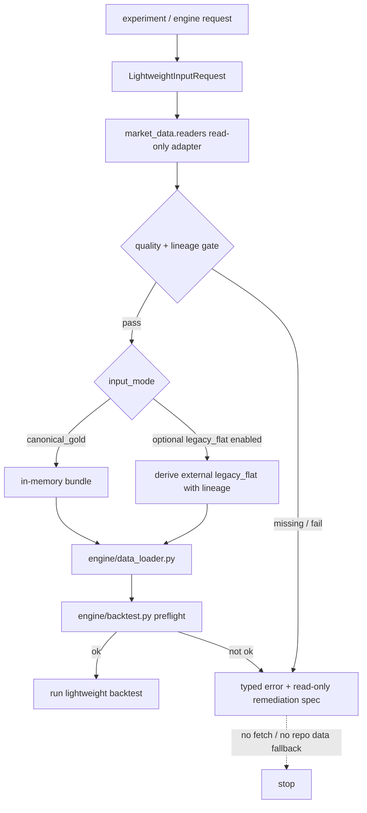

# LLD: CR006-S02 - canonical/gold 到轻量 engine 适配

本文档是 `CR006-S02-canonical-gold-lightweight-engine-adapter` 的 Low-Level Design。它只定义后续实现设计，不实现代码；必须纳入 `CR006-BATCH-A` 全部目标 Story 的 CP5 统一人工确认。`confirmed=false`、全量 CP5 未通过、上游 contract 未冻结或文件所有权冲突未清除前，不得进入实现。

## 1. Goal

修改当前轻量回测框架的数据输入契约，使轻量 engine 和实验入口的 P0 必交付运行输入为 `market_data` canonical/gold reader。external `legacy_flat` 仅是兼容期可选派生入口，只有 CP5 或后续实现 Story 明确启用时才交付；它不作为新事实源，不作为默认路径，不 fallback repo `data/`。本 Story 禁止把 raw/manifest 作为行情运行输入，禁止默认 fallback 到 repo `data/`，并在缺数据或质量失败时返回结构化错误和只读补齐建议。

## 2. Requirements（Functional / Non-Functional）

### 2.1 Functional

- 为轻量 engine 定义 P0 canonical/gold reader 输入模式：输入 dataset、日期范围、symbols、`adjustment_policy`、quality policy，输出轻量 engine 可直接消费的 price/universe/calendar/metadata bundle。
- 明确 external `legacy_flat` 为兼容期可选派生入口：默认不要求实现、不计入 S02 P0 完成条件；只有 CP5 人工确认或后续实现 Story 明确启用时，才从 canonical/gold 且 quality gate 通过的数据派生 flat 兼容文件，并写入显式外置目标目录。
- 修改 `engine/data_loader.py` 与 `engine/backtest.py` 的输入策略，使默认运行不读取 repo `data/`，缺数据时返回 `required_missing` 或等价 typed error，而不是自动补数或自动回退。
- 修改实验入口 `experiments/run_experiment_06_07.py`、`08.py`、`09.py`、`10.py`、`12.py`、`13.py`，统一接入 canonical/gold reader；只有 optional `legacy_flat` 被明确启用时才接受显式 external `legacy_flat` 参数，不把 raw/manifest 当作行情输入。
- 修改 `market_data/readers.py`，暴露轻量 engine 所需的 read-only adapter contract；该 contract 不导入 connector/runtime/storage，不触发 Tushare fetch/backfill。
- 创建 `tests/test_cr006_lightweight_engine_adapter.py`，P0 覆盖 canonical/gold 成功、quality fail、required missing、repo `data/` 不参与、raw/manifest 不作为运行输入、无 connector/runtime/token 访问；optional `legacy_flat` 仅在启用时覆盖 lineage 和 explicit-dir 行为。

### 2.2 Non-Functional

- 安全：不得读取、列出、迁移、复制、比对或删除真实 `data/**`；不得读取、打印或记录 `.env`、Tushare token、NAS 用户名、NAS 密码或真实私有路径。
- 离线性：轻量 engine、实验入口和 adapter 网络调用次数为 0，Tushare fetch/backfill 触发次数为 0。
- 可追溯性：P0 canonical/gold bundle 必须携带 quality/catalog lineage；external `legacy_flat` 若被显式启用并产出，必须携带 canonical/gold lineage，至少可追溯 dataset、run/source/interface、quality status、schema version 或等价 catalog lineage。
- 可维护性：S02 不修改 Tushare connector/runtime/storage；reader/adapter 与采集链路保持单向依赖，消费层只读。
- 兼容性：P0 交付 canonical/gold in-memory bundle；external `legacy_flat` 只作为后续明确启用的兼容入口，不得成为新默认事实源。
- 可验证性：默认测试只使用 `tmp_path`、fake canonical/gold fixture、monkeypatch 和静态扫描；不需要真实 Tushare token、真实 NAS、真实数据湖或联网。

## 3. 模块拆分与职责

| 模块 / 文件组 | 职责 | 说明 |
|---|---|---|
| `market_data/readers.py` | 创建轻量 engine read-only adapter contract，读取 canonical/gold 与 quality/catalog 元数据，返回 typed bundle 或 typed error | 复用 HLD §23.6 canonical/gold -> lightweight engine 契约；不得导入 connector/runtime/storage |
| `engine/data_loader.py` | 修改数据加载入口，使默认输入来自 canonical/gold bundle；仅在 optional `legacy_flat` 被明确启用时接受显式 external `legacy_flat`，禁止默认 fallback repo `data/` | 负责把 reader result 转成现有 engine 所需 dataframe/series 形态 |
| `engine/backtest.py` | 修改回测启动前的数据前置校验，quality fail / required missing 时阻断并返回结构化错误 | 不触发 fetch/backfill；不自行读取 raw/manifest |
| `experiments/run_experiment_06_07.py`、`08.py`、`09.py`、`10.py`、`12.py`、`13.py` | 修改实验入口参数与 data loader 调用，P0 统一使用 Tushare-first canonical/gold reader；optional `legacy_flat` 只有明确启用时可用 | 不在实验入口联网；不把旧 repo `data/` 当作新链路可用性证明 |
| `tests/test_cr006_lightweight_engine_adapter.py` | 创建 S02 专项测试，覆盖接口、错误路径、安全边界和文件所有权约束 | 使用 `tmp_path` fixture；不得读取真实 `data/**` |
| 上游 `CR006-S01` contract | 冻结 canonical/gold lineage、quality gate、raw/manifest audit-only 边界 | S02 LLD 可基于 Story contract 起草；实现需等待 S01 LLD 与全量 CP5 |
| 上游 `CR005-S03` contract | 冻结 market_data readers、quality gate、PIT/复权 gate | S02 不重新设计 PIT/复权，只消费已通过 gate 的数据 |

## 4. 代码结构与文件影响范围

| 动作 | 文件路径 | 变更内容 |
|---|---|---|
| 修改 | `market_data/readers.py` | 暴露 `LightweightInputRequest` / `LightweightInputResult` 等价 contract、P0 canonical/gold 读取入口、quality gate 检查入口；optional external `legacy_flat` 派生入口仅在明确启用时交付；禁止导入 connector/runtime/storage |
| 修改 | `engine/data_loader.py` | 将轻量数据加载默认源改为 canonical/gold reader result；仅在 optional `legacy_flat` 明确启用时支持显式 external `legacy_flat`；移除或封禁 repo `data/` 默认 fallback 行为 |
| 修改 | `engine/backtest.py` | 在回测启动前校验 reader status、quality status、lineage；`required_missing` / `quality_failed` / `lineage_missing` 阻断运行并返回结构化错误 |
| 修改 | `experiments/run_experiment_06_07.py` | 接入统一 input mode 与 reader result；不读取 raw/manifest；不默认 repo `data/` |
| 修改 | `experiments/run_experiment_08.py` | 接入统一 input mode 与 reader result；不读取 raw/manifest；不默认 repo `data/` |
| 修改 | `experiments/run_experiment_09.py` | 接入统一 input mode 与 reader result；不读取 raw/manifest；不默认 repo `data/` |
| 修改 | `experiments/run_experiment_10.py` | 接入统一 input mode 与 reader result；与 benchmark resolver 的 required_missing 行为保持一致；不静默代理为 hs300 |
| 修改 | `experiments/run_experiment_12.py` | 接入统一 input mode 与 reader result；P0 只读 canonical/gold，optional `legacy_flat` 仅在明确启用时可用 |
| 修改 | `experiments/run_experiment_13.py` | 接入统一 input mode 与 reader result；不触发 Tushare fetch/backfill |
| 创建 | `tests/test_cr006_lightweight_engine_adapter.py` | 覆盖 S02 acceptance criteria、接口对应测试、错误路径、安全边界、静态 no-old-data fallback 检查 |
| 禁止 | `market_data/connectors/**` | S02 不修改 connector，不新增真实 Tushare 调用 |
| 禁止 | `market_data/runtime.py`、`market_data/storage.py` | S02 不修改运行时和存储写入链路 |
| 禁止 | `README.md`、`docs/USER-MANUAL.md`、`delivery/**` | S02 不修改文档或交付包；旧 data 文档护栏由 S04 负责 |
| 禁止 | `data/**`、`.env`、`credentials` | S02 不读取、不列出、不写入、不记录真实数据或凭据 |

## 5. 数据模型与持久化设计

S02 不新增仓库内持久化 schema，不写真实数据湖，不读写真实 `data/**`。后续实现可新增内存 typed 对象或轻量 dataclass。P0 路径不产出 external `legacy_flat`；只有 CP5 或后续实现 Story 明确启用 optional `legacy_flat` 时，才允许在显式外置目标目录或测试 `tmp_path` 中写入兼容 parquet，且不得写 repo `data/`。

| 对象 / 字段 | 类型 | 约束 | 说明 |
|---|---|---|---|
| `LightweightInputRequest.dataset` | `str` | 必填；exact dataset id | 指向 canonical/gold dataset，不接受 raw/manifest dataset 作为行情输入 |
| `LightweightInputRequest.start_date` / `end_date` | `date | str` | 必填；`start_date <= end_date` | 轻量回测请求区间 |
| `LightweightInputRequest.symbols` | `list[str] | None` | 可选；为空表示使用 reader 支持的 universe contract | 不从旧 repo `data/` 推断股票池 |
| `LightweightInputRequest.adjustment_policy` | `str` | 必填；与 CR005-S03 gate 一致 | 复权口径必须与 canonical/gold lineage 一致 |
| `LightweightInputRequest.quality_policy` | `str` | 必填；默认 `require_pass` | `fail` 阻断；`warn` 是否放行由显式策略决定 |
| `LightweightInputRequest.input_mode` | `canonical_gold | legacy_flat` | 必填；默认且 P0 为 `canonical_gold`；`legacy_flat` 仅在 optional capability enabled 时合法 | `legacy_flat` 表示外置派生兼容面，不等于 repo `data/` |
| `LightweightInputRequest.legacy_flat_dir` | `Path | None` | optional `legacy_flat` 启用且 `input_mode=legacy_flat` 时必填；必须显式传入 | 禁止默认 `<repo>/data`；测试使用 `tmp_path` |
| `LightweightInputResult.status` | `ok | required_missing | quality_failed | lineage_missing | invalid_request` | 必填 | 回测启动前必须检查；非 `ok` 不运行 |
| `LightweightInputResult.bundle` | `object | None` | `status=ok` 时存在 | 包含 prices、calendar、universe、metadata 或现有 engine 等价结构 |
| `LightweightInputResult.remediation_job_spec` | `dict | None` | 只读建议；不得自动执行 | 描述用户可显式执行的数据层补齐动作 |
| `LegacyFlatLineage` | `dict` | optional `legacy_flat` 被启用并写入时必填；P0 canonical/gold-only 不要求产出 | 至少包含 source dataset、quality status、schema version、run/source/interface 或 catalog lineage |

## 6. API / Interface 设计

| 接口 / 入口 | 输入 | 输出 | 调用方 | 说明 |
|---|---|---|---|---|
| `read_lightweight_input(request)` 或等价 reader contract | `LightweightInputRequest`：dataset、date range、symbols、adjustment_policy、quality_policy、`input_mode=canonical_gold` | `LightweightInputResult`：`ok` bundle 或 typed error | `engine/data_loader.py`、experiments | P0 必交付；只读 canonical/gold；不导入 connector/runtime/storage；测试 T-S02-01/T-S02-02/T-S02-03 覆盖 |
| `derive_external_legacy_flat(request)` 或等价派生入口 | optional capability enabled、canonical/gold request、显式外置 `legacy_flat_dir`、lineage policy | `LegacyFlatResult`：生成的 flat 文件路径与 lineage，或 typed error | `engine/data_loader.py` 兼容模式、experiments | 可选兼容入口；默认不交付；只有 CP5/实现 Story 明确启用时交付；只从 canonical/gold 派生；禁止从 repo `data/` 复制；条件测试 T-S02-04/T-S02-05 覆盖 |
| `load_engine_market_data(input_spec)` 或现有 data loader 入口 | reader result 或 explicit external `legacy_flat` spec | engine 所需 prices/universe/calendar 结构，或 typed error | `engine/backtest.py` | 默认不接受 repo `data/` fallback；测试 T-S02-03/T-S02-06 覆盖 |
| `run_backtest(..., data_input=...)` 或现有回测启动入口 | strategy params、portfolio params、`data_input` | 回测结果或结构化失败 | experiments、CLI/notebook 调用方 | quality fail / required missing 时不运行；不触发 fetch/backfill；测试 T-S02-02/T-S02-06 覆盖 |
| experiment adapter 参数约定 | P0 `--data-source canonical-gold` 或等价配置、dataset/date range；optional enabled 时才接受显式 `legacy_flat_dir` | 实验运行结果或 typed unavailable | `run_experiment_06_07.py`、`08.py`、`09.py`、`10.py`、`12.py`、`13.py` | 不读取 raw/manifest，不默认 repo `data/`；测试 T-S02-07/T-S02-08 覆盖 |

错误状态必须暴露给调用方，不得被转换为静默 fallback：

| 错误状态 | 触发条件 | 暴露内容 | 禁止行为 |
|---|---|---|---|
| `required_missing` | canonical/gold 覆盖请求区间或 symbols 不足 | dataset、date range、missing reason、只读 remediation spec | 禁止自动 fetch/backfill；禁止 fallback repo `data/` |
| `quality_failed` | quality gate 为 fail 或 PIT/复权 gate 不满足 | quality status、失败 gate、lineage id | 禁止继续回测；禁止直接读 raw/manifest |
| `lineage_missing` | canonical/gold 缺少 lineage；或 optional `legacy_flat` 启用后缺少 lineage | missing fields、target dataset | 禁止把无 lineage 数据当作可信输入 |
| `invalid_request` | 请求参数非法；或未启用 optional capability 却请求 `legacy_flat`；或 `legacy_flat_dir` 未显式指定 | invalid fields、expected values | 禁止推断默认路径；禁止用真实私有路径填充日志 |

## 7. 核心处理流程

1. 调用方构造 `LightweightInputRequest`，显式声明 dataset、日期范围、复权口径、quality policy 和 input mode。
2. `market_data/readers.py` 的 read-only adapter 校验请求，不导入 connector/runtime/storage，不读取 raw/manifest，不访问 `.env`。
3. adapter 读取 canonical/gold metadata、quality/catalog lineage 和数据 fixture；若缺失或 gate fail，返回 typed error 与只读 remediation spec。
4. P0 路径固定为 `input_mode=canonical_gold`：adapter 返回 in-memory bundle；`engine/data_loader.py` 将 bundle 转换成现有轻量 engine 输入结构。
5. optional `legacy_flat` 只有在 CP5/实现 Story 明确启用时进入流程：adapter 只从 canonical/gold 派生到显式 external `legacy_flat_dir`，写入 lineage metadata；`engine/data_loader.py` 读取该显式外置兼容面。
6. `engine/backtest.py` 在运行前检查 result status；非 `ok` 直接阻断，不触发补数，不 fallback repo `data/`。
7. 实验入口传递统一 input spec，并把 typed error 作为实验失败原因或 unavailable 状态输出。



## 8. 技术设计细节

- 关键规则：
  - `canonical_gold` 是 P0 必交付和默认输入模式；`legacy_flat` 是 optional capability，只有 CP5/实现 Story 明确启用时才允许实现和验收。
  - `legacy_flat` 即使启用，也只能通过显式参数使用，且目标目录必须由调用方传入。
  - `legacy_flat` 命名只表示 flat 文件兼容形态，不表示旧 repo `data/`；禁止把 `<repo>/data` 作为默认值。
  - raw/manifest 只用于上游 acquisition/replay/quality 追溯，S02 adapter 不把 raw/manifest 当作行情输入。
  - quality gate 默认 `require_pass`；`warn` 放行必须由显式 policy 决定并写入 metadata。
  - `remediation_job_spec` 只描述用户可手动执行的数据层 job，不自动执行任何 Tushare fetch/backfill。
- 依赖选择与复用点：
  - 复用 CR005-S03 的 reader、quality gate、PIT as-of gate 和复权一致 gate。
  - 复用 CR006-S01 的 canonical/gold lineage contract 和 raw/manifest audit-only 边界。
  - 不新增外部依赖；若后续实现需要 parquet 读写，使用项目已存在的 pandas/pyarrow 能力和 uv 管理环境。
- 兼容性处理：
  - 现有 engine 必须优先走 `canonical_gold` in-memory 路径，该路径构成 S02 P0 DoD。
  - 现有 engine 若仍依赖 flat 文件名，只有 optional `legacy_flat` 被明确启用时才使用 external `legacy_flat` 过渡；派生结果必须在 repo 外或测试 `tmp_path`，并携带 lineage。
  - 旧 `--data-dir` 或类似参数若保留，只能在 optional `legacy_flat` 启用后解释为显式 external `legacy_flat` 目录；不得默认为 repo `data/`。
- 图示类型选择：第 7 节使用流程图，因为本 Story 跨 `market_data/readers.py`、`engine/data_loader.py`、`engine/backtest.py`、experiments 与测试 5 组对象，且存在 typed error 分支。

## 9. 安全与性能设计

| 维度 | 设计措施 | 验证方式 |
|---|---|---|
| 安全 | 不读取、列出、迁移、复制、比对或删除真实 `data/**`；不读取 `.env`；不打印 token、NAS 用户名、密码或真实私有路径；不导入 connector/runtime/storage；不触发 fetch/backfill | `tests/test_cr006_lightweight_engine_adapter.py` 使用 monkeypatch 阻断 forbidden imports / forbidden path access；静态扫描目标文件中无 repo `data/` 默认 fallback、无 `TUSHARE_TOKEN` 读取、无 connector/runtime/storage import |
| 性能 | 默认走 canonical/gold reader 的列裁剪和日期/symbol 过滤；external `legacy_flat` 只在显式兼容模式生成；不重复 normalize、不读取 raw/manifest | 单元测试使用小型 fixture 验证请求只访问必要 reader 方法；无网络调用；无真实湖扫描 |
| 可追溯 | P0 result metadata 记录 dataset、date range、quality status、schema/run/source/interface 或等价 catalog lineage；optional `legacy_flat` 启用时也必须写 lineage | 测试断言 canonical/gold lineage 字段齐全；optional tests 启用时断言 `legacy_flat` lineage 字段齐全；缺 lineage 返回 `lineage_missing` |
| 离线性 | adapter 只读本地 fixture/canonical/gold，不访问网络，不调用数据层 job | monkeypatch 网络/connector 调用为失败；测试确认触发次数为 0 |

## 10. 测试设计

| 测试场景 | 前置条件 | 操作 | 预期结果 | 验证方式 |
|---|---|---|---|---|
| T-S02-01 canonical/gold quality pass 可生成 engine bundle | `tmp_path` 中构造 fake canonical/gold 与 quality pass metadata | 调用 `read_lightweight_input` 等价入口 | 返回 `status=ok`，bundle 含 prices/universe/calendar/metadata | `uv run --python 3.11 pytest -q tests/test_cr006_lightweight_engine_adapter.py -k canonical_gold_ok` |
| T-S02-02 quality fail 阻断回测 | fake quality metadata 为 fail | 调用 reader 与 `run_backtest` preflight | 返回 `quality_failed`，回测不运行 | 单元测试断言 backtest runner 未被调用 |
| T-S02-03 缺 canonical/gold 返回 required_missing | 请求日期或 dataset 不存在 | 调用 reader | 返回 `required_missing` 与只读 remediation spec；不触发 fetch/backfill | monkeypatch fetch/backfill 为失败并断言调用次数为 0 |
| T-S02-04 optional legacy_flat 未启用时不是 P0 必交付 | 默认 S02 P0 实现只启用 canonical/gold reader | 请求或查找 `derive_external_legacy_flat` 等价入口 | canonical/gold-only DoD 仍成立；若请求 `legacy_flat`，返回 `invalid_request` 或 capability-disabled 状态；不要求生成 flat 文件 | 单元测试或静态测试断言 P0 不依赖 legacy_flat |
| T-S02-05 optional legacy_flat 启用后只从 canonical/gold 派生 | CP5/实现 Story 明确启用 optional capability；fake canonical/gold pass；显式 `legacy_flat_dir=tmp_path/...` | 调用 `derive_external_legacy_flat` 等价入口 | 生成 flat 兼容文件与 lineage；lineage 指向 canonical/gold；repo `data` 默认推断被拒绝 | 条件测试；检查 tmp_path 输出和 lineage 字段；monkeypatch path access |
| T-S02-06 engine/data_loader 不静默 fallback | reader 返回 `required_missing` / `quality_failed` | 调用 data_loader/backtest preflight | 结构化失败向上暴露；不使用旧数据继续运行 | 单元测试断言错误状态和 runner 调用次数 |
| T-S02-07 experiments 统一传递 input spec | 使用实验入口的参数构造函数或 main 封装 | P0 传入 canonical/gold 参数；optional enabled 时传入 legacy_flat 参数 | 实验入口调用统一 adapter，不读取 raw/manifest；未启用 optional 时不要求 legacy_flat | monkeypatch adapter 捕获 request；静态检查 raw/manifest 不作为行情输入 |
| T-S02-08 forbidden import 与凭据访问为 0 | monkeypatch `market_data.connectors`、runtime/storage、env/token 访问为失败 | 执行 S02 adapter 相关测试 | 无 forbidden import，无 `.env` / token 读取 | pytest monkeypatch + 静态扫描 |
| T-S02-09 acceptance criteria 静态护栏 | 目标文件实现后存在 | 扫描 S02 owned/shared 文件 | 无 repo `data/` 默认 fallback、无 raw/manifest runtime read、无 Tushare fetch/backfill 调用 | `tests/test_cr006_lightweight_engine_adapter.py` 静态断言 |

## 11. 实施步骤

| TASK-ID | 动作 | 目标文件 | 详细描述 | 对应测试 |
|---|---|---|---|---|
| CR006-S02-T1 | 修改 | `market_data/readers.py` | 定义并实现轻量 read-only adapter contract：请求校验、canonical/gold 读取、quality/catalog gate、typed result、只读 remediation spec；禁止 connector/runtime/storage import | T-S02-01、T-S02-02、T-S02-03、T-S02-08 |
| CR006-S02-T1B-OPTIONAL | 条件修改 | `market_data/readers.py` | 仅在 CP5/实现 Story 明确启用 optional `legacy_flat` 时，实现 external `legacy_flat` 派生入口：显式目标目录、lineage 写入、repo `data/` 默认推断拒绝、缺 lineage 返回 `lineage_missing` | T-S02-05 |
| CR006-S02-T2 | 修改 | `engine/data_loader.py` | 接入 `LightweightInputResult` 等价结构；P0 默认 canonical/gold；optional `legacy_flat` 未启用时拒绝 legacy flat 请求；移除或封禁 repo `data/` 默认 fallback | T-S02-04、T-S02-06 |
| CR006-S02-T3 | 修改 | `engine/backtest.py` | 增加回测启动前 typed status 检查；`required_missing`、`quality_failed`、`lineage_missing` 时停止并暴露错误 | T-S02-02、T-S02-03、T-S02-06 |
| CR006-S02-T4 | 修改 | `experiments/run_experiment_06_07.py` | 使用统一 input spec 调用 reader/data_loader；不读取 raw/manifest；不默认 repo `data/` | T-S02-07、T-S02-09 |
| CR006-S02-T5 | 修改 | `experiments/run_experiment_08.py` | 使用统一 input spec 调用 reader/data_loader；不读取 raw/manifest；不默认 repo `data/` | T-S02-07、T-S02-09 |
| CR006-S02-T6 | 修改 | `experiments/run_experiment_09.py` | 使用统一 input spec 调用 reader/data_loader；不读取 raw/manifest；不默认 repo `data/` | T-S02-07、T-S02-09 |
| CR006-S02-T7 | 修改 | `experiments/run_experiment_10.py` | 使用统一 input spec；与 benchmark required_missing 行为保持一致；不静默代理为 hs300；不默认 repo `data/` | T-S02-07、T-S02-09 |
| CR006-S02-T8 | 修改 | `experiments/run_experiment_12.py` | 使用统一 input spec 调用 reader/data_loader；不读取 raw/manifest；不默认 repo `data/` | T-S02-07、T-S02-09 |
| CR006-S02-T9 | 修改 | `experiments/run_experiment_13.py` | 使用统一 input spec 调用 reader/data_loader；不触发 Tushare fetch/backfill；不默认 repo `data/` | T-S02-07、T-S02-09 |
| CR006-S02-T10 | 创建 | `tests/test_cr006_lightweight_engine_adapter.py` | 创建 fake canonical/gold、quality pass/fail、optional legacy_flat disabled/enabled、forbidden import/path/env monkeypatch 和静态扫描测试 | T-S02-01 至 T-S02-09 |

## 12. 风险、难点与预研建议

| 风险 / 难点 | 影响 | 缓解措施 / 预研建议 |
|---|---|---|
| S01 LLD 尚未确认时 S02 过度绑定具体函数名 | 可能与上游 canonical/gold lineage contract 不一致 | S02 以 typed contract 和行为约束为主，函数名标注“或等价”；实现等待 S01 LLD 与全量 CP5 |
| CR005-S03 reader/quality gate 既有接口与 S02 所需 bundle 不完全一致 | 实现时可能需要 adapter shim | 在 `market_data/readers.py` 中新增轻量 adapter 层，不改 connector/runtime/storage；测试以 contract 验证行为 |
| optional `legacy_flat` 被误用为旧 repo `data/` 或事实源 | 来源不明数据重新进入新链路，或 optional 能力被误认为 P0 必交付 | P0 明确只交付 canonical/gold reader；`legacy_flat` 默认 disabled；若启用则强制显式目录、lineage 必填、repo `data/` 默认推断拒绝；S04 文档再收敛 reference-only 说明 |
| experiments 数量较多，输入参数迁移容易遗漏 | 部分实验仍可能走旧路径 | S02 测试包含静态扫描与 monkeypatch，覆盖 6 个实验入口；实现按 TASK-ID 逐一修改 |
| typed error 被上层吞掉并静默继续 | 质量失败仍运行回测 | `engine/backtest.py` preflight 统一阻断；测试断言 runner 不被调用 |
| 为了补齐缺口触发真实 Tushare job | 破坏消费层只读边界 | `remediation_job_spec` 只读；测试 monkeypatch fetch/backfill 为失败并断言调用次数为 0 |

### OPEN / Spike 跟踪

| ID | 类型（OPEN / Spike） | 问题 | 下一动作 | 责任方 |
|---|---|---|---|---|
| O-S02-02 | OPEN | S01 LLD 尚未在本线程内确认，canonical/gold lineage 字段最终名称可能调整 | 等待 CR006-S01 LLD 与 CP5 自动预检；实现前按 S01 confirmed LLD 对齐字段名 | meta-dev(S01/S02) |
| O-S02-03 | OPEN | 现有 engine 是否必须保留旧 `--data-dir` 参数名作为外置 `legacy_flat` 显式参数，需实现时查看代码后确定 | 实现阶段读取目标代码后决定保留参数名或新增更明确参数；不得把默认值设为 repo `data/` | meta-dev(S02) |

### REQUIRED finding 修订记录

| Finding | 状态 | 修订决策 | 证据 |
|---|---|---|---|
| `CR006-REQ-005` / `F-QA-CR006-LLD-003` | CLOSED | 选择 B：canonical/gold reader 是 S02 P0 必交付；external `legacy_flat` 是兼容期可选派生入口，只有 CP5/实现 Story 明确启用时才交付；不作为新事实源、不默认 fallback repo `data/` | LLD §1、§2、§5、§6、§10、§11、§12、§14；CP5 自动预检 Checklist #19 |

## 13. 回滚与发布策略

- 发布方式：在 CR006-BATCH-A 全量 CP5 人工确认后，按 Story DAG 开发；S02 实现必须等待 S01 canonical/gold 与 quality gate contract 冻结。P0 发布以 canonical/gold reader 代码变更 + S02 专项测试通过为准；optional `legacy_flat` 只有 CP5/实现 Story 明确启用时才进入发布范围。不发布真实数据、不执行真实回补、不修改交付包。
- 回滚触发条件：S02 P0 canonical/gold reader 实现导致默认轻量回测无法在 fake/offline fixture 下运行；出现 repo `data/` 默认 fallback；出现 raw/manifest runtime read；出现 connector/runtime/storage import；出现 token/env/真实路径读取或日志暴露；optional `legacy_flat` 被未授权启用或被当作事实源；S01/CR005-S03 contract 与 S02 适配不兼容。
- 回滚动作：回退 S02 涉及的 `market_data/readers.py` canonical/gold adapter 增量、`engine/data_loader.py`/`engine/backtest.py` 输入改动、experiments 输入改动和 `tests/test_cr006_lightweight_engine_adapter.py` 中对应假设；若 optional `legacy_flat` 被启用，则单独回退 optional 派生入口。保留已确认 LLD 与 CP5 审查记录，由 meta-po 发起修改意见或 CR 追踪。不得通过读取或复制旧 `data/**` 来临时恢复。

## 14. Definition of Done

- [ ] 14 个可见章节全部填写完成，frontmatter 含 `tier=M`、`confirmed=false`、`implementation_allowed=false`、`shared_fragments`、`open_items=2`。
- [ ] 文件影响范围、接口、测试与 TASK-ID 一一对应，且不超出 S02 Story 卡片所有权范围。
- [ ] `market_data/readers.py` P0 adapter contract 只读 canonical/gold，不导入 connector/runtime/storage，不触发 fetch/backfill。
- [ ] `engine/data_loader.py` 与 `engine/backtest.py` 默认不 fallback repo `data/`；缺数据和 quality fail 返回 typed error。
- [ ] 六个实验入口 P0 统一传递 canonical/gold input spec，不读取 raw/manifest 作为行情输入；optional `legacy_flat` 未启用时不得要求 flat 派生能力。
- [ ] external `legacy_flat` 是兼容期可选派生入口；若后续明确启用，必须从 canonical/gold 派生，写入显式外置目录或测试 `tmp_path`，并携带 lineage。
- [ ] `tests/test_cr006_lightweight_engine_adapter.py` 覆盖第 10 节 P0 测试场景；optional `legacy_flat` tests 仅在启用时作为条件测试执行。
- [ ] 默认验证不联网、不需要 token、不需要真实 NAS、不读取真实 `data/**`。
- [ ] CP5 自动预检写入 `process/checks/CP5-CR006-S02-canonical-gold-lightweight-engine-adapter-LLD-IMPLEMENTABILITY.md`。
- [ ] 全部目标 Story LLD 统一人工确认前不进入实现。

## 人工确认区

> **CP5 - Story LLD 可实现性门**
> meta-dev 已按 S02 范围写入 Story LLD，并需要写入 `process/checks/CP5-CR006-S02-canonical-gold-lightweight-engine-adapter-LLD-IMPLEMENTABILITY.md` 自动预检结果。
> meta-po 收齐 `CR006-BATCH-A` 全部四张 Story 的 LLD 和 CP5 自动预检后，再生成并提示用户审查 `checkpoints/CP5-CR006-BATCH-A-LLD-BATCH.md`。
> 用户统一确认全部目标 Story 的 LLD 后，仍需满足当前 Wave、依赖门控与文件所有权门控方可进入实现。

**CP5 checklist 摘要**：

| # | 检查项 | 状态 | 证据 |
|---|---|---|---|
| 1 | LLD 覆盖 AC | PASS | 第 2 / 10 / 14 节覆盖 S02 Tushare-first 轻量 engine 输入边界；canonical/gold reader 为 P0，optional `legacy_flat` 非默认 |
| 2 | 与 HLD / ADR 一致 | PASS | 第 3 / 6 / 7 / 8 / 12 节对齐 HLD §23 与 ADR-018 |
| 3 | 文件影响范围明确 | PASS | 第 4 / 11 节列出所有允许、共享和禁止路径 |
| 4 | 接口契约完整 | PASS | 第 6 节定义 P0 canonical/gold reader、optional `legacy_flat`、data_loader、backtest、experiments 接口和错误状态 |
| 5 | 测试与 dev_gate 可计算 | PASS | 第 10 / 14 节定义验证入口、错误路径和 CP5 前不得实现 |

**人工确认回复**：

请直接回复以下任一整行：

```text
approve
修改: <具体修改点>
reject
```

**人工审查结果回填**：

- 结论：`approved | changes_requested | rejected`
- 审查人：
- 审查时间：
- 修改意见：
- 风险接受项：
