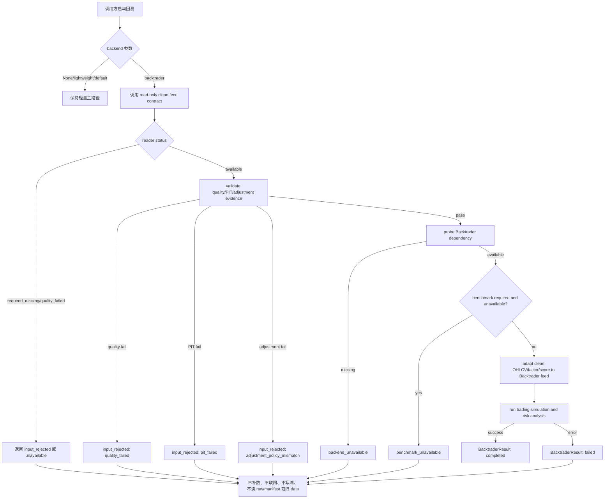

# LLD: CR006-S03 - Backtrader clean feed contract

> 本 LLD 只定义 CR006-S03 的可实现设计，不实现代码。CR006-BATCH-A 的四张 Story LLD 与 CP5 自动预检必须全部完成，并由 meta-po 发起统一人工确认后，才能进入实现。实现前还必须重新复核 `dev_gate`、上游契约冻结状态、`process/STATE.md.parallel_execution.dev_running` 和共享文件所有权。

## 1. Goal

为 Backtrader optional backend 创建 Tushare-first clean feed contract 的低层设计。后续实现将让 Backtrader 只消费经过 quality gate、PIT as-of、复权一致检查后的 clean OHLCV / factor / score feed，并在未安装 Backtrader、输入不合格、benchmark 不可用或契约缺失时返回结构化 unavailable / rejected 状态。

本 Story 不改变 Backtrader 作为 optional backend 的定位，不替代轻量 `engine/backtest.py` 主路径。S03 明确允许显式 Backtrader backend 通过 `read_backtrader_clean_feed(...)` 或等价 read-only clean feed reader 消费 quality-gated canonical/gold clean feed fixture 或已授权的 clean feed contract，并允许 `validate_backtrader_clean_feed(...)` 对内存 bundle 做校验。S03 禁止的是 raw/manifest runtime read、旧 repo `data/**` 读取、`.env` 或凭据读取、`market_data.connectors` / `market_data.runtime` / `market_data.storage` 导入或调用、Tushare fetch/backfill、数据层 normalize/revalidate/replay job、真实私有 lake I/O 和任何 lake write。

## 2. Requirements（Functional / Non-Functional）

### 2.1 Functional

- Backtrader 输入必须 100% 来自 clean feed：clean OHLCV、factor panel、score、calendar、quality metadata、benchmark status 和 input contract 摘要。
- `read_backtrader_clean_feed(...)` 或等价 reader 是允许接口，但只能以 read-only 方式返回 quality-gated clean feed；不得把 raw/manifest、connector result、runtime plan、storage path、旧 repo `data/**` 或真实私有 lake 路径作为输入。
- `validate_backtrader_clean_feed(...)` 或等价 validator 是允许接口，但只能校验内存 clean feed bundle；不得执行数据层 normalize / validate job、replay、fetch、backfill、lake read/write 或 connector/runtime/storage 操作。
- clean feed 必须能证明 `quality_status in {"pass", "warn" with accepted policy}`、PIT as-of gate 已执行、`available_at <= decision_time`、adjusted OHLCV 与 `adjustment_policy` 一致。
- Backtrader adapter 对 raw、manifest、connector result、runtime plan、storage path、old repo `data/**` 的直接消费次数必须为 0。
- `market_data/readers.py` 或等价 reader contract 只暴露 quality gate 后的 clean feed bundle；缺数据返回 `required_missing` / `quality_failed` / `pit_failed` / `adjustment_policy_mismatch` 等 typed status，不自动补数。
- `engine/backtrader_adapter.py` 只接受 clean feed bundle 或等价 typed request，不在 adapter 内执行 PIT join、复权因子计算、quality 判定、Tushare 读取、raw/manifest replay 或数据湖写入。
- `engine/backtest.py` 或 backend selector 默认仍为 lightweight；只有显式选择 `backtrader` 时才进入 Backtrader optional backend。
- 未安装 Backtrader 时返回 `backend_unavailable`，默认轻量主路径、默认 pytest 和 S02 轻量 adapter 不受影响。
- quality fail、PIT fail、复权冲突、benchmark required missing 或 clean feed schema 缺失时，Backtrader 成功运行次数为 0。
- Backtrader 成功路径只负责调仓、成交、成本、仓位、净值和风险分析，输出 optional 对照结果，不覆盖轻量回测结果。
- 实现偏离本 LLD 时，必须在 CP6 编码完成检查中记录偏差、原因、影响和回滚方式。

### 2.2 Non-Functional

- 安全：不得读取、打印或记录 `.env`、Tushare token、NAS 用户名、NAS 密码或真实私有路径；不得读取、列出、迁移、复制、比对或删除真实 `data/**`。
- 离线性：Backtrader adapter、selector 和 S03 测试默认网络调用次数为 0；不得导入网络客户端或 Tushare provider。
- 边界隔离：adapter 不导入 `market_data.connectors`、`market_data.runtime`、`market_data.storage`，不调用 fetch/backfill、数据层 normalize/revalidate/replay job、raw/manifest read、真实 lake read/write 或 connector/runtime/storage API；该禁令不包含 read-only clean feed reader 与内存 validator。
- 可维护性：Backtrader clean feed 相关逻辑集中在 `engine/backtrader_adapter.py` 与 reader contract 边界，`engine/backtest.py` 只保留最小 selector / wrapper。
- 兼容性：沿用 CR005-S06 已验证的 optional backend 策略、dependency group `backtrader` 和 `backtrader==1.9.78.123`；默认 lightweight 不依赖 Backtrader。
- 可测试性：默认测试使用内存 DataFrame、fake reader result、monkeypatch dependency probe、AST/import 静态扫描和 `tmp_path` 快照；不需要真实 token、真实 NAS、真实数据湖或联网。
- 可追溯性：所有 non-completed 结果必须包含 `status`、`reason_code`、`issues`、`input_contract`、`next_action` 或只读 remediation spec 摘要。

## 3. 模块拆分与职责

| 模块 / 文件组 | 职责 | 说明 |
|---|---|---|
| `market_data/readers.py` | 暴露 Backtrader clean feed 所需 read-only reader contract 或 feed bundle | 只返回 canonical/gold 派生并通过 quality/PIT/复权 gate 的结果；不得导入 connector/runtime/storage；不得直接读取 raw/manifest 或真实私有 lake；默认测试只使用 fixture / tmp_path。 |
| `engine/backtrader_adapter.py` | 接收 clean feed bundle，执行内存输入契约校验、dependency probe、Backtrader feed 适配、optional backend 运行和 structured result 输出 | 复用 CR005-S06 optional backend 边界；允许内存 `validate_backtrader_clean_feed(...)`，但不得自行生成 PIT、计算复权因子、读取 Tushare、触发补数或调用数据层 job。 |
| `engine/backtest.py` 或 backend selector | 保持默认 lightweight；显式 `backend="backtrader"` 时调用 adapter | 共享文件；实现前需与 S02 轻量 adapter 的 selector 形态对齐，避免重复入口。 |
| `tests/test_cr006_backtrader_clean_feed.py` | 覆盖 S03 clean feed contract、错误状态、no connector import、no raw/manifest/token/fetch 和 optional dependency 降级 | 本 Story primary 文件；测试必须离线、无真实数据、无凭据。 |
| CR006-S01 contract | 冻结 Tushare-first raw/manifest 审计边界、canonical/gold lineage 和 quality gate | S03 只消费其 contract，不实现 S01 数据层 job。 |
| CR006-S02 contract | 冻结 canonical/gold 到轻量 engine adapter、repo `data/` reference-only 行为和 external `legacy_flat` 策略 | S03 与 S02 共享 `market_data/readers.py` 和 `engine/backtest.py`，实现前需按 merge owner 与 dev_running 复核。 |
| CR005-S06 verified backend | 已验证 Backtrader optional backend、lazy import、dependency group、no connector/token/network 和 tiny Cerebro smoke | S03 在此基础上收紧 Tushare-first clean feed 输入契约。 |

## 4. 代码结构与文件影响范围

| 动作 | 文件路径 | 变更内容 |
|---|---|---|
| 修改 | `market_data/readers.py` | 增加或稳定 Backtrader read-only clean feed reader contract，返回 `BacktraderCleanFeedBundle` 或等价 mapping；字段包含 clean OHLCV、factor panel、score、calendar、benchmark status、quality summary、PIT/复权证据、lineage 摘要和 structured unavailable；不得进入 raw/manifest、connector/runtime/storage 或真实私有 lake。 |
| 修改 | `engine/backtrader_adapter.py` | 增加对 clean feed contract 的接收和内存校验；拒绝 raw/manifest/token/connector/runtime/storage 输入；把 quality/PIT/复权失败映射为 `input_rejected`；未安装依赖映射为 `backend_unavailable`。 |
| 修改 | `engine/backtest.py` 或 selector | 与 S02 轻量 adapter 共用显式 backend selector；默认保持 lightweight；S03 只增加 Backtrader clean feed 调用分支或 wrapper，不改变默认轻量主路径。 |
| 创建 | `tests/test_cr006_backtrader_clean_feed.py` | 覆盖 clean feed 成功、quality/PIT/复权 gate fail、未安装 Backtrader、forbidden import、no token/no raw/manifest/no fetch、no old data、no write 和 selector 兼容。 |
| 禁止 | `market_data/connectors/**` | S03 不修改、不导入、不调用。 |
| 禁止 | `market_data/runtime.py` | S03 不修改、不导入、不调用。 |
| 禁止 | `market_data/storage.py` | S03 不修改、不导入、不调用。 |
| 禁止 | `README.md`、`docs/USER-MANUAL.md` | S03 不拥有文档产物；CR006-S04 负责 old data reference-only 文档护栏。 |
| 禁止 | `data/**`、`.env`、`credentials`、`delivery/**` | S03 不读取、不列出、不迁移、不复制、不比对、不删除真实数据或凭据，不写交付目录。 |

## 5. 数据模型与持久化设计

S03 不新增持久化写入，不写 raw/manifest/canonical/gold/quality/catalog、reports、delivery 或真实数据湖。新增对象均为内存 typed result 或 read-only clean feed reader contract；测试使用内存 fixture 与 `tmp_path`，不得读取真实 `data/**`、raw/manifest 或真实私有 lake。

| 对象 / 字段 | 类型 | 约束 | 说明 |
|---|---|---|---|
| `BacktraderCleanFeedBundle` / 等价 mapping | typed dict / dataclass | required | reader 输出给 Backtrader adapter 的唯一输入容器。 |
| `ohlcv` | `pd.DataFrame` | required | 必须为 adjusted OHLCV；字段至少含 `trade_date`、`symbol`、`open`、`high`、`low`、`close`，可选 `volume`；不得来自 raw/manifest。 |
| `factor_panel` | `pd.DataFrame` / None | optional | 若用于信号，必须已 PIT as-of 对齐并保留 `available_at <= decision_time` 证据。 |
| `score` | `pd.DataFrame` / `pd.Series` / None | optional | 若用于调仓权重，必须来自 clean dataset，不允许 adapter 内现算未来可见指标。 |
| `calendar` | list / index | required | 来自 quality gate 后 trade calendar；Backtrader 不自行生成或补齐。 |
| `benchmark_status` | mapping / `BenchmarkResult` subset | required | 可为 available/unavailable/required_missing/quality_failed；required missing 不触发补数。 |
| `quality_summary` | mapping | required | 至少含 `quality_status`、coverage、threshold profile、dataset status 和 blocking issues。 |
| `pit_evidence` | mapping | required | 至少含 `pit_checked=true`、as-of policy、decision time 字段和违规计数。 |
| `adjustment_evidence` | mapping | required | 至少含 `adjustment_policy`、adjusted field set、policy mismatch 计数和缺失计数。 |
| `lineage` | mapping | required | 至少含 dataset、source/interface、manifest run id 或等价 lineage 摘要；不得含真实私有路径或凭据值。 |
| `BacktraderCleanFeedStatus` | enum | required | `available`、`required_missing`、`quality_failed`、`pit_failed`、`adjustment_policy_mismatch`、`backend_unavailable`。 |
| 持久化写入 | N/A | 无新增 | adapter 和测试不得写真实 `data/**`、reports、lake 或 delivery。 |

## 6. API / Interface 设计

| 接口 / 入口 | 输入 | 输出 | 调用方 | 说明 |
|---|---|---|---|---|
| `read_backtrader_clean_feed(...)` 或等价 reader contract | dataset/date range、quality policy、adjustment policy、benchmark policy、lineage policy | `BacktraderCleanFeedBundle` 或 structured unavailable | backend selector / adapter | 允许的 read-only clean feed reader；只读 quality-gated canonical/gold clean feed fixture 或已授权 clean feed contract；不得读取 raw/manifest、旧 repo `data/**`、真实私有 lake 或 connector/runtime/storage；测试：`T-S03-READER-01`、`T-S03-RAW-MANIFEST-01`。 |
| `validate_backtrader_clean_feed(bundle)` | clean feed bundle | normalized bundle 或 `BacktraderResult(status="input_rejected")` | `engine/backtrader_adapter.py` | 允许的 in-memory validator；只校验 bundle schema、quality、PIT、复权、benchmark required；不得调用数据层 normalize/validate job、replay、fetch/backfill、lake I/O 或 connector/runtime/storage；测试：`T-S03-QUALITY-01`、`T-S03-PIT-01`、`T-S03-ADJUSTMENT-01`、`T-S03-NO-FETCH-01`。 |
| `run_backtrader_backend(request_or_bundle)` | clean feed bundle、strategy/config、explicit backend | `BacktraderResult` | selector / future CLI | 仅显式 backend 调用；未安装返回 `backend_unavailable`；测试：`T-S03-DEPENDENCY-01`、`T-S03-SMOKE-01`。 |
| `select_backtest_backend(backend)` 或 S02 统一 selector | `None` / `"lightweight"` / `"backtrader"` | exact backend or structured error | `engine/backtest.py` | 默认 lightweight；S03 不创建第二套冲突 selector；测试：`T-S03-SELECTOR-01`。 |
| forbidden boundary scan | source paths | PASS/FAIL | pytest static test | 检查 connector/runtime/storage/network/Tushare/env token/raw/manifest 执行入口；测试：`T-S03-BOUNDARY-01`、`T-S03-TOKEN-01`。 |

允许 / 禁止边界：

| 类别 | 状态 | 说明 | 验证 |
|---|---|---|---|
| read-only clean feed reader | 允许 | `read_backtrader_clean_feed(...)` 只消费 quality-gated canonical/gold clean feed fixture 或已授权 clean feed contract，返回内存 bundle 或 structured unavailable。 | `T-S03-READER-01`、`T-S03-NO-FETCH-01` |
| in-memory validator | 允许 | `validate_backtrader_clean_feed(...)` 只校验已传入 bundle，不触发任何数据层 job 或 I/O。 | `T-S03-QUALITY-01`、`T-S03-PIT-01`、`T-S03-ADJUSTMENT-01` |
| 数据层 job/runtime/storage/connector | 禁止 | 禁止调用 fetch/backfill、normalize/revalidate/replay job、runtime plan、storage read/write、connector API。 | `T-S03-NO-FETCH-01`、`T-S03-BOUNDARY-01` |
| raw/manifest runtime read | 禁止 | raw/manifest 只属于采集审计/复现/质量追溯层，不是 S03 feed 输入。 | `T-S03-RAW-MANIFEST-01` |
| 真实私有 lake / 旧 repo `data/**` I/O | 禁止 | 默认测试和本 Story 不读取、列出、比对、迁移、复制、删除真实数据或真实私有 lake。 | `T-S03-OLD-DATA-01`、`T-S03-NO-WRITE-01` |
| token/env 凭据读取 | 禁止 | 不读取 `.env`、token value、NAS 用户名、密码或真实私有路径。 | `T-S03-TOKEN-01` |

接口错误模型：

| 状态 / reason_code | 触发条件 | 结果 | 自动动作 |
|---|---|---|---|
| `backend_unavailable` / `dependency_missing` | 未安装 Backtrader 或版本不可用 | 返回 structured unavailable，fallback 指向 lightweight | 不安装依赖，不修改 lock。 |
| `input_rejected` / `quality_failed` | quality gate 为 fail 或 blocking issue 非空 | 阻断 Backtrader 成功运行 | 不触发 fetch/backfill。 |
| `input_rejected` / `pit_failed` | `pit_checked=false`、`available_at > decision_time` 或 as-of 证据缺失 | 阻断 Backtrader 成功运行 | 不在 adapter 内补 PIT。 |
| `input_rejected` / `adjustment_policy_mismatch` | adjusted OHLCV 缺失、`adj_factor` 冲突、policy 混用 | 阻断 Backtrader 成功运行 | 不在 adapter 内计算复权。 |
| `benchmark_unavailable` / `benchmark_required_missing` | benchmark required 且 status 非 available | 返回对照缺失 | 只透传 remediation spec，不执行。 |
| `failed` / `runtime_error` | Backtrader 运行异常 | 返回 structured failed | 不覆盖轻量结果，不写 reports。 |

## 7. 核心处理流程



正常流程：

1. 调用方默认不传 backend 或传 `lightweight` 时，直接执行轻量主路径，不导入 Backtrader。
2. 调用方显式传 `backtrader` 时，selector 调用 S03 read-only clean feed reader contract。
3. reader contract 返回 clean feed bundle 或 typed unavailable；unavailable 不触发任何数据层 job/runtime/storage/connector。
4. adapter 校验 clean feed 的 schema、quality、PIT、复权和 benchmark policy。
5. adapter lazy probe Backtrader 依赖；未安装返回 `backend_unavailable`。
6. adapter 将 clean OHLCV/factor/score 转为 Backtrader feed，执行调仓、成交、成本、仓位、净值和风险分析。
7. adapter 返回 optional `BacktraderResult`，结果只作为对照，不覆盖轻量 `BacktestResult`。

异常路径：

1. clean feed 缺失：返回 `required_missing`，只提供只读 next action / remediation spec，不执行 fetch/backfill。
2. quality fail：返回 `input_rejected(reason_code="quality_failed")`。
3. PIT fail：返回 `input_rejected(reason_code="pit_failed")`。
4. 复权失败：返回 `input_rejected(reason_code="adjustment_policy_mismatch")`。
5. 未安装 Backtrader：返回 `backend_unavailable(reason_code="dependency_missing")`。
6. benchmark required missing：返回 `benchmark_unavailable(reason_code="benchmark_required_missing")`。
7. 任一 forbidden import、token/env 读取、raw/manifest 运行时消费、old data 读取、数据层 job/runtime/storage/connector 调用、fetch/backfill 或真实 lake read/write：视为 CP6 阻断缺陷；read-only clean feed reader 与内存 validator 不属于 forbidden 调用。

## 8. 技术设计细节

- 关键算法 / 规则：
  - selector exact 值只接受 `lightweight` 和 `backtrader`；未知值返回 existing structured error 或 `unknown_backend`，不得模糊匹配。
  - clean feed 校验顺序固定为 read-only reader status -> in-memory schema -> quality -> PIT -> adjustment -> benchmark required -> dependency -> runtime。
  - `quality_status="fail"` 必须阻断；`warn` 只有在 reader contract 明确标注 policy accepted 且无 blocking issue 时可继续。
  - PIT 证据必须来自数据层，不允许 Backtrader adapter 根据 `available_at` 自行 join。
  - adjusted OHLCV 必须由数据层提供；adapter 不计算 `adj_factor`，也不在不同 `adjustment_policy` 之间自动转换。
  - `remediation_job_spec` 只能作为 metadata 透传，不能传给 CLI/job/runtime/storage 执行；不得触发 normalize/revalidate/replay 或 lake I/O。
  - `lineage` 只记录非敏感摘要；不得写真实私有路径、token、用户名、密码或旧 repo `data/**` 文件清单。
- 依赖选择与复用点：
  - 复用 CR005-S06 已确认的 Backtrader optional backend、dependency group `backtrader`、`backtrader==1.9.78.123`、lazy import 和 tiny Cerebro smoke 策略。
  - 复用 ADR-016：Backtrader 不替代轻量主路径。
  - 复用 ADR-017：PIT 与复权由 Pandas 数据层完成，Backtrader 只消费干净输入。
  - 复用 ADR-018：Tushare structured lake 为事实源，raw/manifest 为审计层，旧 repo `data/` reference-only。
  - 复用 S01/S02 合同方向；实现仍需等待 S01/S02 LLD 与 CR006-BATCH-A 全量 CP5 批准。
- 兼容性处理：
  - 若 S02 选择直接 canonical/gold reader，S03 reader contract 在同一 reader surface 上新增 Backtrader 专用 bundle。
  - 若 S02 选择 external `legacy_flat` 过渡，S03 不从 `legacy_flat` 反推 Backtrader feed，除非该兼容面保留完整 clean lineage、quality、PIT 和 adjustment evidence。
  - `engine/backtest.py` 的默认签名和返回语义保持兼容；新增 wrapper 优先于修改默认行为。
- 图示类型选择：流程图。S03 跨 reader、selector、adapter、optional dependency、benchmark metadata 和错误状态，且异常分支较多。

## 9. 安全与性能设计

| 维度 | 设计措施 | 验证方式 |
|---|---|---|
| 安全 | adapter、selector、read-only clean feed reader 和 S03 tests 不读取 `.env`，不读取或打印 token/env value，不记录 NAS 用户名、密码或真实私有路径 | `T-S03-TOKEN-01` 使用 sentinel 环境变量名与 metadata scan；不读取真实 `.env`。 |
| 安全 | adapter 不导入 connector/runtime/storage/Tushare provider/network client | `T-S03-BOUNDARY-01` AST/import 扫描 `engine/backtrader_adapter.py`、`engine/backtest.py`。 |
| 安全 | Backtrader 不消费 raw/manifest、old repo `data/**`、runtime plan 或 storage path | `T-S03-RAW-MANIFEST-01`、`T-S03-OLD-DATA-01` 使用 fake path token 和 call spy，不访问真实数据。 |
| 安全 | `remediation_job_spec` 只透传，不执行 fetch/backfill、normalize/revalidate/replay、raw/manifest read、真实 lake read/write 或 connector/runtime/storage API；允许 read-only clean feed reader 和 in-memory validator | `T-S03-NO-FETCH-01` monkeypatch 数据层 job/runtime/storage/connector 入口为 fail-on-call，同时断言 clean reader / validator 可被调用。 |
| 性能 | 默认 lightweight 路径不导入 Backtrader，不构造 clean feed bundle | `T-S03-SELECTOR-01` import spy 和默认路径测试。 |
| 性能 | Backtrader 成功路径只处理 read-only reader 返回的小型 clean feed fixture，不扫描真实 lake 或全量 dataset | `T-S03-SMOKE-01` 小样本 fake Backtrader smoke；断言数据层 job/fetch 调用次数为 0。 |
| 可靠性 | 所有失败路径返回 typed result，不抛出非结构化异常到默认轻量路径 | `T-S03-DEPENDENCY-01`、`T-S03-QUALITY-01`、`T-S03-PIT-01`、`T-S03-ADJUSTMENT-01`。 |

## 10. 测试设计

| 测试场景 | 前置条件 | 操作 | 预期结果 | 验证方式 |
|---|---|---|---|---|
| `T-S03-SELECTOR-01` 默认 lightweight | Backtrader 未安装或 import spy 激活 | 调用默认 wrapper / `run_backtest` 不传 backend | 不导入 Backtrader，不读取 clean feed，轻量结果保持兼容 | pytest + import spy。 |
| `T-S03-READER-01` clean feed available | 构造 fake canonical/gold clean feed fixture，quality pass、PIT/复权证据完整 | 调用 `read_backtrader_clean_feed` 或等价 read-only 接口 | 返回 `status=available` 的 clean feed bundle，字段齐全；不调用数据层 job/runtime/storage/connector | 单测。 |
| `T-S03-QUALITY-01` quality fail 阻断 | clean feed `quality_status="fail"` | 显式 backend=`backtrader` | 返回 `input_rejected` / `quality_failed`，Backtrader 成功运行次数为 0 | 单测。 |
| `T-S03-PIT-01` PIT fail 阻断 | `pit_checked=false` 或 `available_at > decision_time` | 调用 validator | 返回 `input_rejected` / `pit_failed`，不在 adapter 内 as-of join | 单测。 |
| `T-S03-ADJUSTMENT-01` 复权冲突阻断 | adjusted OHLCV 缺失、policy mixed 或 conflict count > 0 | 调用 validator | 返回 `input_rejected` / `adjustment_policy_mismatch` | 单测。 |
| `T-S03-DEPENDENCY-01` 未安装 Backtrader | monkeypatch dependency probe missing | 显式 backend=`backtrader` 且 clean feed pass | 返回 `backend_unavailable`，轻量路径不受影响 | 单测。 |
| `T-S03-SMOKE-01` fake Backtrader 成功路径 | fake backtrader module、小样本 clean OHLCV/factor/score | 显式运行 optional backend | 返回 `completed`，职责限定为交易模拟和风险分析 | 单测，不要求真实依赖。 |
| `T-S03-BOUNDARY-01` forbidden import | 实现文件存在 | AST 扫描 adapter / selector | connector/runtime/storage/network/Tushare import 命中数为 0 | 静态测试。 |
| `T-S03-TOKEN-01` no token/env read | 设置 sentinel env name/value；不读取 `.env` | 运行 dependency missing、quality fail、benchmark missing 路径 | metadata/message/issues 不含 sentinel value，env read spy 为 0 | monkeypatch + scan。 |
| `T-S03-RAW-MANIFEST-01` no raw/manifest runtime | fake bundle 包含 raw/manifest path 字段诱饵 | 调用 adapter | 直接拒绝或忽略 forbidden 字段；不打开、不读取、不列出 | 单测 + monkeypatch open/list fail-on-call。 |
| `T-S03-OLD-DATA-01` no old data | fake config 含 repo data fallback 诱饵字符串 | 显式 backend=`backtrader` | 不访问旧 repo `data/**`，返回 required_missing 或 input_rejected | 单测，不触碰真实数据。 |
| `T-S03-NO-FETCH-01` no data job/runtime/storage/connector | monkeypatch Tushare job、runtime、storage、connector、normalize/revalidate/replay、raw/manifest read 和 lake I/O 入口 fail-on-call；clean reader / validator 使用 spy | 运行 unavailable、required_missing、clean feed pass 路径 | 数据层 job/runtime/storage/connector/fetch/backfill/normalize/revalidate/replay/raw-manifest-read/lake-I/O 调用次数为 0；`read_backtrader_clean_feed` 和 `validate_backtrader_clean_feed` 在允许范围内可被调用 | 单测。 |
| `T-S03-NO-WRITE-01` no persistent write | `tmp_path` 快照，clean feed fixture 为只读输入 | 运行 unavailable、rejected、fake completed | 测试目录除显式 fixture 外文件集合不变；不写 reports/lake/delivery；不写 raw/manifest/canonical/gold/quality/catalog | 文件快照。 |
| `T-S03-BENCHMARK-01` benchmark required missing | clean feed pass，benchmark status required_missing | 显式 backend=`backtrader` | 返回 `benchmark_unavailable`，只透传 remediation spec，不执行 | 单测。 |

## 11. 实施步骤

| TASK-ID | 动作 | 目标文件 | 详细描述 | 对应测试 |
|---|---|---|---|---|
| CR006-S03-T1 | 修改 | `market_data/readers.py` | 增加或稳定 `read_backtrader_clean_feed(...)` / `BacktraderCleanFeedBundle` 契约，返回 clean OHLCV/factor/score/calendar/benchmark/quality/PIT/adjustment/lineage 摘要与 typed unavailable；允许 read-only clean feed 读取，禁止 raw/manifest runtime input、数据层 job/runtime/storage/connector 和真实私有 lake I/O。 | `T-S03-READER-01`、`T-S03-RAW-MANIFEST-01`、`T-S03-NO-FETCH-01` |
| CR006-S03-T2 | 修改 | `engine/backtrader_adapter.py` | 接入 clean feed bundle，增加 `validate_backtrader_clean_feed(...)` 或等价内存校验，映射 quality/PIT/复权/benchmark/dependency 错误状态；禁止 connector/runtime/token/raw/manifest/old data、数据层 job 和真实 lake I/O。 | `T-S03-QUALITY-01`、`T-S03-PIT-01`、`T-S03-ADJUSTMENT-01`、`T-S03-DEPENDENCY-01`、`T-S03-BOUNDARY-01`、`T-S03-TOKEN-01`、`T-S03-NO-FETCH-01` |
| CR006-S03-T3 | 修改 | `engine/backtest.py` 或 selector | 与 S02 统一 backend selector；默认 lightweight；显式 `backend="backtrader"` 时读取 clean feed 并调用 adapter；未知 backend exact fail。 | `T-S03-SELECTOR-01`、`T-S03-SMOKE-01`、`T-S03-BENCHMARK-01` |
| CR006-S03-T4 | 创建 | `tests/test_cr006_backtrader_clean_feed.py` | 创建离线专项测试，覆盖 clean feed schema、gate fail、optional dependency、forbidden imports、no token、no raw/manifest、no old data、no fetch/write 和 fake success。 | 全部 `T-S03-*` |

实现前置顺序：

1. 等待 CR006-BATCH-A 全部 LLD 与 CP5 自动预检完成。
2. 等待 meta-po 发起并回填 `checkpoints/CP5-CR006-BATCH-A-LLD-BATCH.md` 人工确认。
3. 确认 S01/S02 LLD 中 canonical/gold lineage、quality gate、reader surface、selector 形态和 old data reference-only 行为已冻结。
4. 复核 `process/STATE.md.parallel_execution.dev_running` 和共享文件所有权；若 S02 正在写 `engine/backtest.py` 或 `market_data/readers.py`，S03 必须等待或由 merge owner 协调。

## 12. 风险、难点与预研建议

| 风险 / 难点 | 影响 | 缓解措施 / 预研建议 |
|---|---|---|
| S01/S02 LLD 尚未统一确认时提前实现 S03 | clean feed 字段、reader surface 或 selector 形态可能返工 | 本 LLD 明确 `implementation_allowed=false`；实现必须等待 CR006-BATCH-A CP5 批量批准。 |
| S02 与 S03 同时修改 `market_data/readers.py` / `engine/backtest.py` | 共享文件冲突、重复 selector 或契约漂移 | 实现前复核 `dev_running`；S03 只接入 S02 冻结的 reader / selector，必要时由 merge owner 串行。 |
| Backtrader adapter 绕过 quality gate | 可能产生不可解释或未来函数污染的对照结果 | 将 quality/PIT/复权证据作为 required input；测试覆盖 fail 阻断。 |
| read 禁令过宽导致合法 clean reader / validator 被误判 | 实现阶段无法调用 `read_backtrader_clean_feed(...)` 或测试误报，与 HLD §23.6 冲突 | 本版 LLD 精确区分允许 read-only clean feed reader / in-memory validator 与禁止的数据层 job/runtime/storage/connector、raw/manifest、真实 lake I/O。 |
| raw/manifest 被误当作 feed 输入 | schema 漂移、审计层污染运行时 | reader contract 和 adapter validator 均拒绝 raw/manifest 运行时字段；静态和单测覆盖。 |
| old repo `data/**` 被误用于 fallback | 来源不明数据进入新链路 | S03 不读取旧数据；缺数据返回 required_missing；S04 负责全链路文档护栏。 |
| Benchmark missing 诱发自动补数 | 越过用户授权并可能联网/写湖 | S03 只透传 remediation spec；fetch/backfill 入口 fail-on-call 测试。 |
| Backtrader dependency 版本策略与 CR005-S06 漂移 | optional backend 行为不一致 | 复用 CR005-S06 已确认 `backtrader==1.9.78.123`，S03 不新增依赖组或版本。 |

### OPEN / Spike 跟踪

| ID | 类型（OPEN / Spike） | 问题 | 下一动作 | 责任方 |
|---|---|---|---|---|
| O-S03-01 | OPEN | CR006-S01/S02 LLD 尚未在本文件生成时统一确认；S03 的 clean feed 字段集依赖其 canonical/gold lineage、quality gate、reader surface 和 selector 形态。 | CP5 批量人工确认时联审 S01/S02/S03；实现前以已确认 LLD 为强输入复核本设计。 | meta-po / meta-dev |
| O-S03-02 | OPEN | Backtrader clean feed 首批字段集仍需与下一轮策略研究字段对齐；当前 LLD 给出最小 OHLCV/factor/score contract。 | 若用户新增策略字段需求，先走 CR 或更新 S01/S02/S03 LLD 后再实现。 | user / meta-se / meta-dev |
| O-S03-03 | OPEN | external `legacy_flat` 若被 S02 采用，是否允许 S03 读取其派生结果作为 clean feed 的兼容输入需确认。 | 默认 S03 优先读 canonical/gold reader；只有 `legacy_flat` 带完整 clean lineage、quality、PIT、adjustment evidence 时可作为兼容输入。 | meta-dev / meta-qa |
| R-S03-01 | RESOLVED | Review finding `CR006-REQ-001` 指出“不得 read / validate”禁令过宽，可能误伤 clean reader / validator。 | 已在 §1、§2、§6、§9、§10、§11、§12、§14 收窄边界：允许 read-only clean feed reader 和 in-memory validator，禁止数据层 job/runtime/storage/connector、raw/manifest、真实 lake I/O。 | meta-dev |

## 13. 回滚与发布策略

- 发布方式：本 Story 实现后随 CR006-BATCH-A 的 Story 执行波次发布；先合入 reader/selector/adapter/test 代码，再由 CP6 记录专项验证结果，交给 meta-qa 执行 CP7。
- 发布前置：`confirmed=true`、`checkpoints/CP5-CR006-BATCH-A-LLD-BATCH.md` approved、S01/S02 契约冻结、dev_running 文件冲突为 false、CP6 前置测试可运行。
- 回滚触发条件：
  - 默认 lightweight 路径行为变化或需要 Backtrader 才能运行。
  - adapter 导入 connector/runtime/storage、读取 token/env value、访问 raw/manifest/old data、触发 fetch/backfill、调用数据层 job/runtime/storage/connector 或写真实数据；read-only clean feed reader 与内存 validator 不属于回滚触发条件。
  - quality/PIT/复权 fail 仍能进入 Backtrader 成功路径。
  - S02 reader / selector 形态与 S03 实现不兼容。
- 回滚动作：
  - 回退 `engine/backtrader_adapter.py` 中 S03 clean feed 接入变更或恢复到 CR005-S06 optional backend 边界。
  - 回退 `engine/backtest.py` 中 S03 selector 分支，保持默认 lightweight。
  - 回退 `market_data/readers.py` 中 Backtrader clean feed contract 变更，保留 S02 已确认 reader surface。
  - 保留或调整 `tests/test_cr006_backtrader_clean_feed.py` 为 xfail/blocked 证据，记录阻断原因，不删除安全边界测试意图。
- 发布限制：本 Story 不发布安装脚本、不写 `delivery/**`、不执行真实 Tushare 抓取、不读取或比对真实 `data/**`。

## 14. Definition of Done

- [ ] 14 个章节全部填写完成，并保持 `tier`、`shared_fragments`、`open_items` 可见。
- [ ] LLD frontmatter `confirmed=false`；CR006-BATCH-A 全量 CP5 人工确认前不得实现。
- [ ] 每条 S03 acceptance criteria 在第 2 节、第 6 节、第 10 节和第 14 节有设计或验证入口。
- [ ] 第 6 节每个接口在第 10 节至少有 1 条对应测试。
- [ ] 第 7 节每条异常路径在第 10 节至少有 1 条错误路径测试。
- [ ] 第 11 节每个 TASK-ID 对应第 4 节文件影响范围，且每个文件影响项至少被 1 个 TASK-ID 覆盖。
- [ ] `market_data/readers.py` 只暴露 quality/PIT/复权 gate 后 clean feed，不读取 raw/manifest。
- [ ] `read_backtrader_clean_feed(...)` 或等价接口只执行 read-only clean feed reader 行为，不触发数据层 job/runtime/storage/connector，不读取 raw/manifest、旧 repo `data/**` 或真实私有 lake。
- [ ] `validate_backtrader_clean_feed(...)` 或等价接口只校验内存 clean feed bundle，不触发 normalize/revalidate/replay、fetch/backfill、lake I/O 或 connector/runtime/storage。
- [ ] `engine/backtrader_adapter.py` 不导入 connector/runtime/storage，不读取 token，不联网，不触发补数，不写 lake。
- [ ] `engine/backtest.py` 默认 lightweight，Backtrader 仅显式启用。
- [ ] quality/PIT/复权/benchmark required fail 时 Backtrader 成功运行次数为 0。
- [ ] 未安装 Backtrader 时返回 `backend_unavailable`，默认轻量主路径仍可用。
- [ ] 不修改或读取真实 `data/**`、`.env`、凭据、README、docs、delivery。
- [ ] CP6 必须记录实现文件清单、偏差、已知限制、验证入口、安全边界和回滚策略。
- [ ] OPEN / Spike 已清点；实现前必须重新复核 O-S03-01、O-S03-02、O-S03-03。

## 人工确认区

> **CP5 - CR006-BATCH-A Story LLD 可实现性门**
> meta-dev 已为本 Story 写入 `process/checks/CP5-CR006-S03-backtrader-clean-feed-contract-LLD-IMPLEMENTABILITY.md` 自动预检结果。
> meta-po 收齐 CR006-S01 / S02 / S03 / S04 全部 LLD 和 CP5 自动预检后，再生成并提示用户审查 `checkpoints/CP5-CR006-BATCH-A-LLD-BATCH.md`。
> 用户统一确认全部目标 Story 的 LLD 后，仍需满足当前 Wave、依赖门控与文件所有权门控方可进入实现。

**CP5 checklist 摘要**：

| # | 检查项 | 状态 | 证据 |
|---|---|---|---|
| 1 | LLD 覆盖 AC | 待人工审查 | 第 2 / 6 / 10 / 14 节 |
| 2 | 与 HLD / ADR 一致 | 待人工审查 | 第 3 / 7 / 8 / 12 节 |
| 3 | 文件影响范围明确 | 待人工审查 | 第 4 / 11 节 |
| 4 | 接口契约完整 | 待人工审查 | 第 5 / 6 节 |
| 5 | 测试与 dev_gate 可计算 | 待人工审查 | 第 10 / 11 / 14 节 |

**人工确认回复**：

请直接回复以下任一整行：

```text
approve
修改: <具体修改点>
reject
```

**人工审查结果回填**：

- 结论：`approved | changes_requested | rejected`
- 审查人：
- 审查时间：
- 修改意见：
- 风险接受项：
