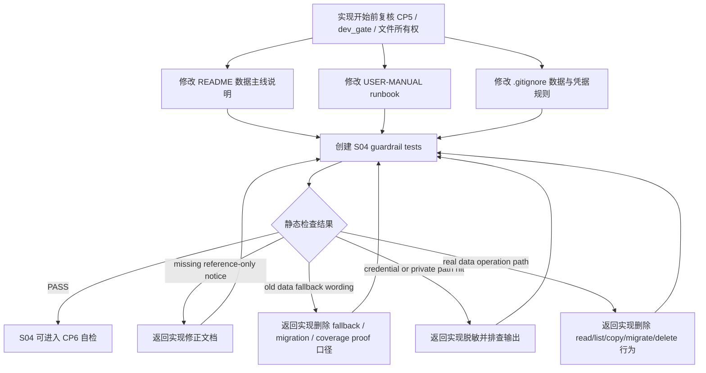

# LLD: CR006-S04 - 旧 data reference-only 护栏

本文档只定义 `CR006-S04-old-data-reference-only-guardrail` 的可实现设计，不实现代码、不修改文档、不运行测试。`confirmed=false`、`CR006-BATCH-A` 全量 CP5 未统一人工确认、上游合同未冻结或 `dev_gate.implementation_allowed=false` 时，不得进入实现。S04 对 S01/S02/S03 的依赖类型统一为 `contract`：依赖对象是 LLD 合同冻结、边界术语一致和文件所有权可调度，不要求等待 S02/S03 CP6 runtime 产物。

本 LLD 阶段不读取、列出、迁移、复制、比对或删除真实 `data/**`，不读取、打印或记录 `.env`、Tushare token、NAS 用户名、NAS 密码或真实私有路径，不执行 Tushare 真实抓取、真实回补、normalize、validate、read 或写真实数据湖。

## 1. Goal

为旧 repo `data/` 的 `reference-only` 状态建立文档、错误提示和静态 guardrail 的低层设计。后续实现必须让 README、USER-MANUAL、`.gitignore` 和 S04 专项测试共同表达同一条合同：旧 `data/` 保持现状，仅供以后人工参考或另行授权比对，不作为 Tushare-first 新链路的默认 fallback、迁移源、复制源、覆盖证明、测试前提或 smoke 证明。

完成后，Tushare structured lake 是新链路事实源；raw/manifest 是采集审计、复现和质量追溯层；轻量 engine 消费 canonical/gold 或由 canonical/gold 派生的 external `legacy_flat`；Backtrader 消费 quality gate 后 clean feed；旧 repo `data/` 的默认程序消费次数为 0。

## 2. Requirements（Functional / Non-Functional）

### 2.1 Functional

- 修改 `README.md`，增加 Tushare-first 数据主线说明，并至少 1 处明确旧 repo `data/` 为 `reference-only`。
- 修改 `docs/USER-MANUAL.md`，增加用户 runbook 说明：如何理解 Tushare structured lake、raw/manifest 审计层、canonical/gold 事实源、external `legacy_flat` 兼容面，以及旧 `data/` 未来比对需要另行授权。
- 修改 `.gitignore`，在不触碰真实 `data/**` 的前提下补充真实数据形态不入库规则；若现有规则已覆盖，则只做最小必要补充，不删除追溯性注释。
- 创建 `tests/test_cr006_old_data_reference_guardrail.py`，使用静态文本扫描、AST/源码扫描、tmp_path fixture 和 sentinel 字符串验证 old data reference-only 合同。
- 后续实现必须检查 README 和 USER-MANUAL 中把 repo `data/` 描述为默认 fallback、迁移源、复制源或覆盖证明的次数为 0。
- 后续实现必须检查文档和错误提示中真实 token、NAS 用户名、密码或真实私有路径出现次数为 0；只允许记录环境变量名、占位路径或脱敏摘要。
- 后续实现必须检查 S01/S02/S03 相关运行边界被文档一致引用：raw/manifest 不作为回测运行输入；缺 canonical/gold 时返回 `required_missing` / remediation spec，不 fallback 旧 `data/`；Backtrader 不读 raw/manifest/token/connector。
- 后续实现不得读取、列出、迁移、复制、比对或删除真实 `data/**`；guardrail test 必须通过 monkeypatch / 静态扫描验证调用次数为 0，而不是访问真实目录。

### 2.2 Non-Functional

- 安全：默认验证不需要 Tushare token、不需要 NAS、不联网；不得读取 `.env`；不得打印或记录凭据值、真实私有路径或真实数据湖位置。
- 离线性：S04 测试只扫描仓库内源码和文档文本，不触发 Tushare fetch/backfill/normalize/validate/read，不写真实数据湖。
- 可维护性：old data 口径集中使用 `reference-only`、`Tushare-first`、`canonical/gold`、`external legacy_flat`；禁止把旧 repo `data/` 称为默认目录、兼容数据源或 fallback。
- 可追溯性：文档必须保留“旧 `data/` 来源不明、Tushare 不承诺完全覆盖旧数据、未来比对需另行授权”的决策背景。
- 可验证性：每条验收标准在第 10 节至少有 1 个测试入口或人工审查入口。
- 并行安全：S04 primary 只拥有 `tests/test_cr006_old_data_reference_guardrail.py`；README、USER-MANUAL、`.gitignore` 是 shared 文件，实现前必须复核 `process/STATE.md.parallel_execution.dev_running` 和文件所有权。
- 依赖门控：S04 只依赖 S01/S02/S03 的合同冻结和共享文件无冲突，不等待 S02/S03 CP6 runtime；若实现需要读取 S02/S03 已生成源码，也只能读取第 6 节 allowlist 中的文本文件，并不得读取禁止范围。

## 3. 模块拆分与职责

| 模块 / 文件组 | 职责 | 说明 |
|---|---|---|
| README 数据主线说明 | 面向开发者声明 Tushare-first 事实源、old data reference-only、缺数据处理和默认运行边界 | S04 shared 文件；实现时只写与 CR-006 数据边界有关的最小段落 |
| USER-MANUAL runbook | 面向用户说明如何理解 structured lake、raw/manifest、canonical/gold、external `legacy_flat` 和旧数据另行授权比对 | S04 shared 文件；不得写真实 NAS 路径或凭据值 |
| `.gitignore` 数据护栏 | 防止真实数据、派生数据湖、local flat 兼容面或凭据误入库 | 不读取或列出现有真实 `data/**` 内容；只改规则文本 |
| S04 guardrail test | 静态扫描文档、源码和错误消息，验证无 old data fallback、无凭据泄露、无 silent migration、无真实 data 操作 | Primary 文件：`tests/test_cr006_old_data_reference_guardrail.py` |
| 上游 S01 contract | 冻结 Tushare-first acquisition、raw/manifest 审计职责、canonical/gold lineage 和 no-old-data 采集边界 | 当前 S01 LLD 为 `confirmed=false` 草案；实现需等待 CR006-BATCH-A 全量 CP5 |
| 上游 S02 contract | 冻结轻量 engine 只读 canonical/gold 或 external `legacy_flat`，不默认 fallback repo `data/` | S04 文档和测试必须对齐 S02 术语，不重新设计 adapter |
| 上游 S03 contract | 冻结 Backtrader clean feed、no raw/manifest/token/connector 和 optional backend 降级 | S04 文档只做边界说明，不修改 Backtrader 实现 |

依赖类型收敛：

| 上游 Story | 依赖类型 | S04 消费内容 | 不要求的内容 |
|---|---|---|---|
| CR006-S01 | contract | Tushare-first 事实源、raw/manifest audit-only、canonical/gold lineage、no-old-data 采集边界 | 不等待真实 Tushare fetch、真实 lake 写入或 S01 CP6 runtime 产物 |
| CR006-S02 | contract | 轻量 engine 只读 canonical/gold 或 external `legacy_flat`、no repo `data/` fallback、required_missing / remediation spec 口径 | 不等待 S02 CP6 runtime；不要求 S04 运行轻量 engine |
| CR006-S03 | contract | Backtrader clean feed、no raw/manifest runtime read、no connector/runtime/token/fetch/backfill 口径 | 不等待 S03 CP6 runtime；不要求 S04 运行 Backtrader |
| 文件所有权 | contract gate | README、USER-MANUAL、`.gitignore` shared 文件实现前无并行写入冲突 | 不合并其他 Story 的实现改动 |

## 4. 代码结构与文件影响范围

| 动作 | 文件路径 | 变更内容 |
|---|---|---|
| 修改 | `README.md` | 增加或修订 CR-006 Tushare-first 数据主线段落：structured lake 为事实源；raw/manifest 为审计层；canonical/gold 或 external `legacy_flat` 为运行输入；旧 `data/` 为 reference-only；缺数据返回 typed remediation，不 fallback 旧数据 |
| 修改 | `docs/USER-MANUAL.md` | 增加用户 runbook：如何显式使用 Tushare structured lake、如何理解 raw/manifest、何时需要 external `legacy_flat`、为什么旧 `data/` 不作为默认 fallback、未来旧数据比对需要单独授权 |
| 修改 | `.gitignore` | 补充或确认真实数据湖、external `legacy_flat`、本地凭据和临时数据产物不入库；不得通过读取真实目录来生成规则 |
| 创建 | `tests/test_cr006_old_data_reference_guardrail.py` | 创建静态 guardrail 测试，覆盖 README/USER-MANUAL wording、forbidden fallback phrase、forbidden path operation、credential/private path sentinel、no silent migration |
| 禁止 | `engine/**` | S04 不修改轻量 engine；S02 拥有轻量运行时适配 |
| 禁止 | `experiments/**` | S04 不修改实验入口；S02 拥有实验输入迁移 |
| 禁止 | `market_data/**` | S04 不修改数据层；S01/S02/S03 拥有相关实现边界 |
| 禁止 | `data/**` | S04 不读取、不列出、不迁移、不复制、不比对、不删除真实旧数据 |
| 禁止 | `.env`、`credentials` | S04 不读取、不打印、不记录凭据或真实私有路径 |
| 禁止 | `delivery/**` | S04 不修改交付包或安装器 |

## 5. 数据模型与持久化设计

S04 不新增业务数据模型，不新增数据库，不写 raw/manifest/canonical/gold/quality/catalog，不写真实数据湖，不创建或修改真实 `data/**`。后续实现只新增静态测试文件和文档规则。

| 对象 / 字段 | 类型 | 约束 | 说明 |
|---|---|---|---|
| `OldDataReferencePolicy.status` | literal string | 固定为 `reference-only` | 文档和测试共同使用的语义，不要求创建运行时代码对象 |
| `OldDataReferencePolicy.allowed_use` | list[str] | 仅允许 `manual_reference`、`separately_authorized_comparison` | 表达旧数据可由用户人工参考；自动比对需另行授权 |
| `OldDataReferencePolicy.forbidden_use` | list[str] | 必含 `fallback`、`migration_source`、`copy_source`、`coverage_proof`、`test_fixture`、`smoke_precondition` | 静态测试检查文档和目标源码不得宣称这些用途 |
| `TushareFirstDocContract.fact_source` | literal string | 固定为 `Tushare structured lake` | 新链路事实源 |
| `TushareFirstDocContract.audit_layer` | list[str] | `raw`、`manifest` | 只用于采集审计、复现、质量追溯；不是回测运行输入 |
| `TushareFirstDocContract.runtime_surface` | list[str] | `canonical/gold`、`external legacy_flat`、`Backtrader clean feed` | 运行时可消费面，需经过 quality gate |
| `GuardrailScanResult` | test-local dict / dataclass | 只存在于测试内存中 | 可记录 scanned_files、violations、credential_hits、old_data_operation_hits；不得持久化真实路径或凭据 |
| `.gitignore` 规则 | 文本 | 只包含通用 pattern 或占位路径 | 不从真实 `data/**` 反推规则 |

持久化说明：

- 文档持久化：只修改 README 和 USER-MANUAL 的说明文字，不嵌入真实路径、真实 lake root、token、用户名或密码。
- 规则持久化：只修改 `.gitignore` 文本规则，不读取现有真实数据目录。
- 测试持久化：只创建 `tests/test_cr006_old_data_reference_guardrail.py`；测试 fixture 使用 `tmp_path`，不得写真实 repo `data/**`。

## 6. API / Interface 设计

| 接口 / 入口 | 输入 | 输出 | 调用方 | 说明 |
|---|---|---|---|---|
| README documentation contract | S01/S02/S03/S04 冻结合同、ADR-018、HLD §23 | 面向开发者的数据主线说明 | 开发者、meta-qa、meta-doc | 测试：`T-S04-DOC-01`、`T-S04-FALLBACK-01` |
| USER-MANUAL runbook contract | Tushare-first 事实源、raw/manifest 审计层、canonical/gold 运行面、old data reference-only | 面向用户的操作和边界说明 | 用户、meta-qa、meta-doc | 测试：`T-S04-DOC-02`、`T-S04-AUTH-01` |
| `.gitignore` data safety contract | 现有 ignore 规则、CR-006 数据形态边界 | 通用数据/凭据/派生产物不入库规则 | git、开发者、meta-qa | 测试：`T-S04-GITIGNORE-01` |
| `test_docs_state_old_data_reference_only` | README / USER-MANUAL 文本 | PASS 或 violation list | pytest | 检查各至少 1 处 `reference-only` 和 Tushare-first 说明 |
| `test_no_old_data_default_fallback_wording` | README / USER-MANUAL / target source text | PASS 或 violation list | pytest | 检查旧 repo `data/` 作为 fallback、迁移源、覆盖证明的描述次数为 0 |
| `test_no_credentials_or_private_paths_in_docs` | 文档文本、错误消息常量、test-local sentinel | PASS 或 violation list | pytest | 检查 token、NAS 用户名、密码、真实私有路径 sentinel 出现次数为 0 |
| `test_no_real_data_path_operations` | monkeypatch filesystem operations、静态源码文本 | PASS 或 violation list | pytest | 不访问真实 `data/**`；仅断言实现没有 read/list/copy/migrate/delete old data 路径 |
| `test_no_silent_migration_or_comparison` | README / USER-MANUAL / target source text | PASS 或 violation list | pytest | 未来旧数据比对必须另行授权；默认迁移/复制/比对次数为 0 |
| `guardrail_scan_allowlist` | 固定路径集合 | 扫描输入文件迭代器 | pytest helper | 只允许读取第 6.1 节列出的 Markdown、`.gitignore`、Python 源码和测试文本；禁止 repo root 递归扫描 |
| `guardrail_scan_denylist` | 固定禁止集合与后缀规则 | fail-fast path filter | pytest helper | 禁止读取或列出 `data/**`、`.env*`、外部 lake、凭据、二进制、缓存和生成产物 |

### 6.1 Guardrail 静态扫描 allowlist / denylist

S04 guardrail 静态扫描必须使用精确 allowlist。实现时不得从仓库根目录递归发现扫描对象，不得读取或列出 denylist 范围。

允许扫描的文本文件范围：

| 类别 | 精确 allowlist | 用途 |
|---|---|---|
| S04 文档与规则 | `README.md`、`docs/USER-MANUAL.md`、`.gitignore` | 验证 reference-only、Tushare-first、raw/manifest audit-only、ignore 规则和无凭据泄露 |
| S01 合同相关源码 / 测试 | `market_data/cli.py`、`market_data/connectors/tushare.py`、`market_data/storage.py`、`market_data/normalization.py`、`market_data/validation.py`、`market_data/catalog.py`、`tests/test_cr006_tushare_first_acquisition.py` | 仅做源码文本扫描，验证 no-old-data acquisition、no token print、raw/manifest audit-only wording |
| S02 合同相关源码 / 测试 | `market_data/readers.py`、`engine/data_loader.py`、`engine/backtest.py`、`experiments/run_experiment_06_07.py`、`experiments/run_experiment_08.py`、`experiments/run_experiment_09.py`、`experiments/run_experiment_10.py`、`experiments/run_experiment_12.py`、`experiments/run_experiment_13.py`、`tests/test_cr006_lightweight_engine_adapter.py` | 仅做源码文本扫描，验证 no repo `data/` fallback、no raw/manifest runtime input、typed missing remediation |
| S03 合同相关源码 / 测试 | `engine/backtrader_adapter.py`、`engine/backtest.py`、`market_data/readers.py`、`tests/test_cr006_backtrader_clean_feed.py` | 仅做源码文本扫描，验证 clean feed、no connector/runtime/storage/token/fetch/backfill/raw/manifest runtime read |
| S04 自身测试 | `tests/test_cr006_old_data_reference_guardrail.py` | 验证 guardrail 自身没有越权扫描、真实数据访问或凭据读取 |

禁止扫描、禁止读取、禁止列出、禁止统计的范围：

| 类别 | 精确 denylist / pattern | 禁止原因 |
|---|---|---|
| 真实旧数据 | `data/**` | 当前未授权读取、列出、迁移、复制、比对或删除 |
| 凭据与环境 | `.env`、`.env.*`、`credentials`、`credentials/**`、任何 token / password / secret 文件 | 禁止读取、打印或记录凭据值 |
| 外部数据湖 / 私有路径 | `MARKET_DATA_LAKE_ROOT` 指向路径、`LOCAL_BACKTEST_DATA_DIR` 指向路径、`<external-data-root>/**`、NAS / mount 真实路径 | 禁止读取真实 lake、旧 flat 或私有路径 |
| 生成产物与报告 | `reports/**`、`*.parquet`、`*.feather`、`*.arrow`、`*.csv`、`*.jsonl`、`*.zip`、`*.gz`、`*.sqlite`、`*.db` | 避免读取大文件、真实数据或派生结果 |
| 缓存与环境 | `.git/**`、`.venv/**`、`.pytest_cache/**`、`__pycache__/**`、`*.pyc`、`.mypy_cache/**`、`.ruff_cache/**` | 避免扫描缓存、虚拟环境和二进制 |
| 非文本或大型二进制 | `*.png`、`*.jpg`、`*.jpeg`、`*.pdf`、`*.ipynb`、`*.pkl`、`*.joblib` | 避免误读二进制、Notebook 输出和潜在数据样本 |

扫描输出限制：

- violation 只输出 allowlist 内文件路径、规则 ID、行号和脱敏摘要。
- 不输出匹配到的 token、密码、NAS 用户名、真实私有路径或长段上下文。
- 遇到 denylist 路径时必须 fail fast，记录规则 ID，例如 `S04_DENYLIST_PATH_BLOCKED`，不得尝试 `exists()`、`iterdir()`、`glob()`、`open()` 或读取元数据。

错误暴露与限制：

| 状态 / violation | 触发条件 | 暴露内容 | 禁止行为 |
|---|---|---|---|
| `old_data_fallback_wording` | 文档或错误消息声明 repo `data/` 是默认 fallback、迁移源或覆盖证明 | 文件路径、规则 ID、匹配到的安全摘要 | 禁止打印长段文档、禁止读取真实 `data/**` |
| `credential_or_private_path_exposure` | 文档或错误消息包含 token 值、NAS 凭据或真实私有路径 sentinel | 文件路径、规则 ID、脱敏摘要 | 禁止打印凭据值 |
| `silent_migration_or_comparison` | 文档或源码暗示自动迁移、复制、比对旧 `data/**` | 文件路径、规则 ID、脱敏摘要 | 禁止执行迁移、复制、比对 |
| `missing_reference_only_notice` | README 或 USER-MANUAL 缺少 required wording | 文件路径、缺失字段 | 禁止以测试通过替代文档修订 |

## 7. 核心处理流程



正常流程：

1. 实现前复核 `confirmed=true`、CR006-BATCH-A 全量 CP5 approved、上游 S01/S02/S03 合同冻结、`dev_gate.dependencies_satisfied=true`、`file_conflict_free=true`；S04 不等待 S02/S03 CP6 runtime，但必须确认合同冻结和 shared 文件无并行写入冲突。
2. 修改 README，用一个小节或现有数据章节中的段落声明 Tushare-first 新主线和旧 `data/` reference-only。
3. 修改 USER-MANUAL，用 runbook 语言说明用户如何理解新事实源、审计层、运行时消费面和旧数据未来比对授权。
4. 修改 `.gitignore`，仅补充通用忽略规则，不读取真实数据目录。
5. 创建 S04 静态测试，只扫描第 6.1 节 allowlist 中的文本文件，验证没有 old data fallback、silent migration、credential/private path 暴露或真实 old data operation；对第 6.1 节 denylist 必须 fail fast，且不得读取或列出。
6. meta-dev 完成后运行 `uv run --python 3.11 pytest -q tests/test_cr006_old_data_reference_guardrail.py`，再写 CP6。

异常路径：

| 异常 | 处理 | 测试覆盖 |
|---|---|---|
| README 或 USER-MANUAL 缺少 reference-only 说明 | 测试失败，返回实现补充文档 | `T-S04-DOC-01`、`T-S04-DOC-02` |
| 文档暗示旧 `data/` 是 fallback、迁移源或覆盖证明 | 测试失败，要求删除或改写为 reference-only | `T-S04-FALLBACK-01` |
| 文档或错误消息包含 token、NAS 凭据或真实私有路径 | 测试失败，要求脱敏；不得打印命中值 | `T-S04-SECRET-01` |
| 测试或实现试图读取、列出、迁移、复制、删除真实 `data/**` | 测试失败并阻断 CP6 | `T-S04-NOOLD-OPS-01` |
| 旧数据比对需求出现 | 返回 `requires_separate_authorization` 说明，不在 S04 自动执行 | `T-S04-AUTH-01` |

## 8. 技术设计细节

- 关键规则：
  - 术语固定为 `reference-only`，含义是旧 repo `data/` 保持现状，仅供以后人工参考或另行授权比对。
  - 旧 repo `data/` 不作为 fallback、默认目录、迁移源、复制源、覆盖证明、测试前提或 smoke 证明。
  - Tushare structured lake 是新数据事实源；raw/manifest 是审计、复现和质量追溯层，不是轻量 engine 或 Backtrader 的运行时输入。
  - external `legacy_flat` 若存在，只能从 canonical/gold 派生到仓库外，带 lineage；它不等于旧 repo `data/`。
  - 缺 canonical/gold 或 quality fail 时，消费层返回 `required_missing`、`quality_failed` 或只读 remediation spec，不自动补数，不 fallback 旧数据。
  - guardrail test 只扫描受控文本和源码，不访问真实 `data/**`，不读取 `.env`。
  - guardrail test 使用第 6.1 节的精确 allowlist / denylist；禁止 repo root 递归扫描，禁止从环境变量或配置解析真实外部路径后再扫描。
- 依赖选择与复用点：
  - 复用 S01 草案中的 raw/manifest audit-only、canonical/gold lineage 和 no-old-data acquisition 边界。
  - 复用 S02 草案中的 canonical/gold reader、external `legacy_flat` 和 no repo `data/` fallback 口径。
  - 复用 S03 草案中的 Backtrader clean feed、no raw/manifest/token/connector 口径。
  - 复用 ADR-018 的事实源和 old data reference-only 决策。
  - 依赖类型与最新 Development Plan 对齐为 `contract+contract+contract`；S04 消费合同和术语，不消费 S02/S03 runtime 产物。
- 兼容性处理：
  - 若 README/USER-MANUAL 已有旧数据或回补章节，后续实现应在原章节局部修订，不整体替换文档。
  - 若 `.gitignore` 已覆盖真实数据形态，后续实现仅补足缺口，不重复堆叠同义规则。
  - 若 S02 最终不产出 external `legacy_flat`，S04 文档仍可写为“若存在 external `legacy_flat`，它必须由 canonical/gold 派生且不等于旧 repo `data/`”。
  - 若未来用户授权旧数据比对，必须新建独立 CR/任务和新的安全边界，不复用 S04 默认测试绕过禁令。
- 图示类型选择：流程图。S04 跨 README、USER-MANUAL、`.gitignore`、pytest guardrail 和 CP6，自身没有异步服务或持久化写湖。

## 9. 安全与性能设计

| 维度 | 设计措施 | 验证方式 |
|---|---|---|
| 安全 | 不读取、列出、迁移、复制、比对或删除真实 `data/**`；guardrail 使用 monkeypatch 和静态扫描验证调用次数为 0 | `T-S04-NOOLD-OPS-01`；实现和验证均不得访问真实数据目录 |
| 安全 | 不读取 `.env`，不打印或记录 Tushare token、NAS 用户名、NAS 密码或真实私有路径；文档只允许环境变量名和占位路径 | `T-S04-SECRET-01` 使用 sentinel 和脱敏摘要扫描 |
| 安全 | 文档禁止承诺 Tushare 完全覆盖旧 `data/`；禁止把旧数据称为 fallback、默认目录、迁移源或覆盖证明 | `T-S04-FALLBACK-01`、`T-S04-AUTH-01` |
| 安全 | 不触发 Tushare fetch/backfill/normalize/validate/read，不写真实数据湖 | `T-S04-NO-FETCH-01` 静态扫描和 monkeypatch fail-on-call |
| 安全 | 静态扫描只读取精确 allowlist 文本文件；对 `data/**`、`.env*`、外部 lake、凭据、缓存、二进制和大型生成产物 fail fast | `T-S04-SCAN-SCOPE-01`、`T-S04-DENYLIST-01` |
| 性能 | 默认测试只读取小型文档和源码文本，复杂度随扫描文件数量线性增长 | 单测限定扫描文件集合，不递归扫描真实数据目录 |
| 性能 | `.gitignore` 规则不依赖真实目录枚举 | 人工审查和静态测试确认未使用目录 listing 生成规则 |
| 可维护 | 使用规则 ID 输出 violation，便于 meta-qa 定位 | pytest failure message 仅包含文件路径、规则 ID 和脱敏摘要 |

## 10. 测试设计

验证入口：`uv run --python 3.11 pytest -q tests/test_cr006_old_data_reference_guardrail.py`。本 LLD 阶段不运行该命令，因为测试文件尚未实现，且当前请求禁止实现业务产物。

| 测试场景 | 前置条件 | 操作 | 预期结果 | 验证方式 |
|---|---|---|---|---|
| `T-S04-DOC-01` README reference-only 说明存在 | README 已按 S04 实现修订 | 读取 README 文本 | 至少 1 处说明旧 repo `data/` 为 `reference-only`；至少 1 处说明 Tushare structured lake 是新事实源 | pytest 文本断言 |
| `T-S04-DOC-02` USER-MANUAL runbook 说明存在 | USER-MANUAL 已按 S04 实现修订 | 读取 USER-MANUAL 文本 | 至少 1 处说明旧 repo `data/` reference-only；说明 raw/manifest 是审计层、canonical/gold 或 clean feed 是运行面 | pytest 文本断言 |
| `T-S04-FALLBACK-01` 无旧数据默认 fallback 口径 | README、USER-MANUAL、目标源码文本存在 | 扫描 old data + fallback / migration / coverage proof 组合规则 | repo `data/` 被描述为 fallback、迁移源、复制源或覆盖证明的次数为 0 | pytest 规则扫描，输出脱敏摘要 |
| `T-S04-AUTH-01` 未来比对需另行授权 | USER-MANUAL / README 修订后 | 扫描 comparison wording | 旧数据比对只被描述为未来另行授权动作；默认自动比对次数为 0 | pytest 文本断言 |
| `T-S04-GITIGNORE-01` 数据与凭据不入库规则存在 | `.gitignore` 已修订或确认 | 读取 `.gitignore` 文本 | 包含真实数据湖、external `legacy_flat` 或本地凭据相关通用 ignore 规则；不基于真实目录枚举 | pytest 文本断言 |
| `T-S04-SECRET-01` 无凭据和真实私有路径暴露 | 文档和错误消息使用 sentinel fixture | 扫描 token/NAS/private path sentinel | token 值、NAS 用户名、密码、真实私有路径出现次数为 0；只允许 env var 名 | pytest sentinel 扫描 |
| `T-S04-NOOLD-OPS-01` 不访问真实 old data | monkeypatch `Path.iterdir`、`glob`、`open`、copy/delete/move 等敏感入口 | 执行 S04 guardrail scan | 真实 `data/**` read/list/copy/migrate/delete 调用次数为 0 | pytest monkeypatch；不触碰真实目录 |
| `T-S04-NO-FETCH-01` 不触发数据层 job | monkeypatch Tushare fetch/backfill/normalize/validate/read/write 入口为 fail-on-call | 执行 S04 guardrail scan | 数据层真实抓取、回补、normalize、validate、read、lake write 调用次数为 0 | pytest monkeypatch + 静态扫描 |
| `T-S04-SOURCE-STATIC-01` 源码无 silent migration | S01/S02/S03/S04 实现文件存在 | 扫描目标源码中 old data 与 copy/migrate/fallback/delete 组合 | 默认 silent migration、copy、delete、fallback 次数为 0 | pytest 静态扫描 |
| `T-S04-SCAN-SCOPE-01` 扫描 allowlist 精确 | 第 6.1 节 allowlist 固化为常量 | 构造 scanner 输入集合 | 扫描集合只包含 allowlist 精确路径；不使用 repo root `rglob`、`glob("**/*")` 或目录枚举发现对象 | pytest helper 断言 |
| `T-S04-DENYLIST-01` 禁止范围 fail fast | 构造 `data/**`、`.env`、外部 lake、reports、缓存、二进制路径样本 | 调用 denylist path filter | 返回 blocked rule ID；不调用 `exists()`、`iterdir()`、`glob()`、`open()`、`read_text()` | pytest monkeypatch fail-on-call |
| `T-S04-REVIEW-FIX-01` S04 依赖类型为 contract | LLD frontmatter 与 Development Plan 可读 | 读取 LLD frontmatter 和计划片段文本 | S04 依赖类型为 `contract+contract+contract`；文本说明不等待 S02/S03 CP6 runtime | pytest 文本断言或 CP5 人工审查 |
| `T-S04-AC-TRACE-01` 验收标准追溯完整 | S04 测试文件实现后 | 映射 Story acceptance criteria 到测试 ID | CR006-AC-012/013/014 均至少 1 个测试覆盖 | pytest 内部 mapping 断言或人工审查 |

验收标准映射：

| Story 验收标准 | 测试 / 审查入口 |
|---|---|
| README 和 USER-MANUAL 均至少各 1 处说明旧 repo `data/` reference-only | `T-S04-DOC-01`、`T-S04-DOC-02` |
| 文档中把 repo `data/` 作为默认 fallback、迁移源或覆盖证明的次数为 0 | `T-S04-FALLBACK-01` |
| 文档中说明 Tushare structured lake 是新链路事实源 | `T-S04-DOC-01`、`T-S04-DOC-02` |
| 文档中说明 raw/manifest 是审计层，不是回测运行时输入 | `T-S04-DOC-02` |
| 文档中真实 token、NAS 用户名、密码或真实私有路径出现次数为 0 | `T-S04-SECRET-01` |
| 自动读取、列出、迁移、复制、删除真实 `data/**` 的次数为 0 | `T-S04-NOOLD-OPS-01` |
| 不修改 forbidden 文件范围 | 第 4 节文件影响范围、CP6 文件清单审查 |

## 11. 实施步骤

| TASK-ID | 动作 | 目标文件 | 详细描述 | 对应测试 |
|---|---|---|---|---|
| CR006-S04-T1 | 修改 | `README.md` | 增加 Tushare-first 数据主线和旧 repo `data/` reference-only 说明；明确缺 canonical/gold 返回 typed remediation，不 fallback 旧数据 | `T-S04-DOC-01`、`T-S04-FALLBACK-01`、`T-S04-SECRET-01` |
| CR006-S04-T2 | 修改 | `docs/USER-MANUAL.md` | 增加 runbook：Tushare structured lake、raw/manifest 审计层、canonical/gold 运行面、external `legacy_flat` 兼容面、旧数据比对需另行授权 | `T-S04-DOC-02`、`T-S04-AUTH-01`、`T-S04-SECRET-01` |
| CR006-S04-T3 | 修改 | `.gitignore` | 补充真实数据湖、external `legacy_flat`、本地凭据和临时数据产物不入库规则；不得读取真实 `data/**` 生成规则 | `T-S04-GITIGNORE-01`、`T-S04-NOOLD-OPS-01` |
| CR006-S04-T4 | 创建 | `tests/test_cr006_old_data_reference_guardrail.py` | 创建静态 guardrail 测试：文档 wording、fallback 禁用、凭据私有路径 sentinel、no-old-data operation、no fetch/backfill、silent migration 禁用、AC mapping | `T-S04-DOC-01` 至 `T-S04-AC-TRACE-01` |
| CR006-S04-T5 | 创建 | `tests/test_cr006_old_data_reference_guardrail.py` | 在 guardrail 测试中固化 allowlist / denylist 常量、denylist fail-fast path filter 和 S04 contract dependency assertion | `T-S04-SCAN-SCOPE-01`、`T-S04-DENYLIST-01`、`T-S04-REVIEW-FIX-01` |

每个文件影响项均有 TASK-ID 覆盖；S04 不拥有 engine、experiments、market_data、data、delivery、`.env` 或 credentials 的实现写入范围。

## 12. 风险、难点与预研建议

| 风险 / 难点 | 影响 | 缓解措施 / 预研建议 |
|---|---|---|
| README / USER-MANUAL 已有旧数据或 CR-005 真实数据说明，S04 修订可能与现有措辞冲突 | 用户可能误解旧 `data/` 仍可作为 fallback | 实现时局部修订现有章节，使用固定术语 `reference-only`；guardrail 测试扫描 fallback 组合词 |
| `.gitignore` 规则过宽导致追溯文件或 fixture 被误忽略 | 可能影响测试夹具或文档示例 | 使用明确通用 pattern，避免忽略 `tests/fixtures` 和过程文档；CP6 审查 git status |
| 静态扫描误判正常历史描述 | 测试噪声阻碍实现 | 规则采用文件白名单、上下文窗口和 allowlist 注释；violation 输出规则 ID 便于调整 |
| 静态扫描范围过宽或过窄 | 过宽会读取不相关大文件或误碰禁止范围；过窄会漏掉 S01/S02/S03 fallback / raw-manifest runtime 违规 | 使用第 6.1 节精确 allowlist / denylist；测试禁止 repo root 递归扫描，并对 denylist path filter 做 fail-fast 断言 |
| 依赖类型被调度器误解为 runtime | S04 可能被错误延后到 S02/S03 CP6 之后，或 dev_gate 判断与计划冲突 | frontmatter、§3、§8、§10 和 CP5 均声明 `contract+contract+contract`；S04 只依赖合同冻结与文件所有权，不等待 runtime 产物 |
| S01/S02/S03 LLD 草案仍未统一确认 | S04 文档口径可能需要随上游合同微调 | S04 引用上游草案作为对齐输入，但实现必须等待 CR006-BATCH-A 全量 CP5 approved |
| 用户未来要求读取旧 `data/**` 做覆盖比对 | 与当前禁令冲突 | 新建独立 CR/任务，先明确授权、数据脱敏、读取范围、输出约束和安全检查；S04 默认不授权 |
| 文档中写入真实 NAS 路径或凭据示例 | 泄露风险 | 仅使用 `<external-data-root>`、`<repo>`、env var 名；测试 sentinel 扫描 |

### OPEN / Spike 跟踪

| ID | 类型（OPEN / Spike） | 问题 | 下一动作 | 责任方 |
|---|---|---|---|---|
| CR006-S04-O1 | OPEN | 未来是否授权读取旧 `data/**` 做覆盖性比对 | 当前不授权、不实现、不设计读取流程；如用户后续明确授权，先创建独立 CR/任务和安全边界 | 用户 / meta-po |

## 13. 回滚与发布策略

- 发布方式：随 CR006-S04 后续实现以普通代码变更发布，包含 README、USER-MANUAL、`.gitignore` 和 S04 guardrail 测试；不包含数据迁移、安装脚本或真实数据产物。
- 发布前置：`CR006-BATCH-A` 四张 Story LLD 与 CP5 自动预检全部完成，`checkpoints/CP5-CR006-BATCH-A-LLD-BATCH.md` 统一人工确认 approved；S04 上游 S01/S02/S03 合同冻结；实现前 `dev_gate` 满足。
- 依赖前置：S04 依赖 S01/S02/S03 LLD 合同和边界术语冻结，不依赖 S02/S03 CP6 runtime；实现前仍必须复核 shared 文件无并行写入冲突。
- 验证入口：`uv run --python 3.11 pytest -q tests/test_cr006_old_data_reference_guardrail.py`，再由 CP6 记录结果；默认不联网、不需要 token、不读取真实数据。
- 回滚触发条件：文档误导用户把旧 `data/` 当作 fallback；guardrail 误报过多且阻碍已确认合同；`.gitignore` 误忽略必须入库文件；发现凭据或真实私有路径写入。
- 回滚动作：回退 S04 修改的 README/USER-MANUAL 段落、`.gitignore` 规则和 `tests/test_cr006_old_data_reference_guardrail.py`；不触碰真实 `data/**`；回滚后重新运行 S04 guardrail 或记录无法运行原因。
- 灰度策略：先在文档和测试层建立护栏，不改变 engine、experiments、market_data 行为；S02/S03 的运行时改造另按其 Story 发布。

## 14. Definition of Done

- [ ] README 至少 1 处说明旧 repo `data/` 是 `reference-only`，并说明 Tushare structured lake 是新链路事实源。
- [ ] USER-MANUAL 至少 1 处说明旧 repo `data/` 是 `reference-only`，并说明 raw/manifest 是审计层、canonical/gold 或 clean feed 是运行时输入。
- [ ] 文档中把 repo `data/` 描述为默认 fallback、迁移源、复制源或覆盖证明的次数为 0。
- [ ] 文档中真实 token、NAS 用户名、密码或真实私有路径出现次数为 0。
- [ ] 自动读取、列出、迁移、复制、比对或删除真实 `data/**` 的次数为 0。
- [ ] `.gitignore` 覆盖真实数据形态、external `legacy_flat` 或本地凭据风险，且不误忽略必要测试/过程文件。
- [ ] `tests/test_cr006_old_data_reference_guardrail.py` 存在并覆盖第 10 节列出的 S04 验证场景。
- [ ] S04 guardrail 扫描范围使用第 6.1 节精确 allowlist / denylist；禁止 repo root 递归扫描，禁止读取或列出 `data/**`、`.env*`、外部 lake、凭据、缓存、二进制和大型生成产物。
- [ ] S04 对 S01/S02/S03 的依赖类型为 `contract+contract+contract`；实现只依赖合同冻结和文件所有权，不等待 S02/S03 CP6 runtime。
- [ ] `uv run --python 3.11 pytest -q tests/test_cr006_old_data_reference_guardrail.py` 在实现完成后通过，或 CP6 明确记录无法运行原因。
- [ ] 未修改 `engine/**`、`experiments/**`、`market_data/**`、真实 `data/**`、`.env`、`credentials`、`delivery/**`。
- [ ] CP6 编码完成检查记录实现文件清单、偏差、已知限制、验证入口和安全确认。
- [ ] `confirmed=false` 时不进入实现；全量 CP5 approved、上游合同冻结和 `dev_gate` 满足前不进入实现。
- [ ] OPEN 项 `CR006-S04-O1` 已保留，且未把旧数据比对伪装成本 Story 默认能力。

## 人工确认区

> **CP5 - Story LLD 可实现性门**
>
> meta-dev 已写入 `process/checks/CP5-CR006-S04-old-data-reference-only-guardrail-LLD-IMPLEMENTABILITY.md` 自动预检结果。meta-po 收齐 CR006-BATCH-A 全部目标 Story 的 LLD 和 CP5 自动预检后，再生成并提示用户审查 `checkpoints/CP5-CR006-BATCH-A-LLD-BATCH.md`。
>
> 用户统一确认全部目标 Story 的 LLD 后，仍需满足当前 Wave、依赖门控与文件所有权门控方可进入实现。

**CP5 checklist 摘要**：

| # | 检查项 | 状态 | 证据 |
|---|---|---|---|
| 1 | LLD 覆盖 AC | 待人工确认 | 第 2 / 10 / 14 节 |
| 2 | 与 HLD / ADR 一致 | 待人工确认 | 第 3 / 8 / 12 节 |
| 3 | 文件影响范围明确 | 待人工确认 | 第 4 / 11 节 |
| 4 | 接口契约完整 | 待人工确认 | 第 6 节 |
| 5 | 测试与 dev_gate 可计算 | 待人工确认 | 第 10 / 14 节 |

**人工确认回复**：

请直接回复以下任一整行：

```text
approve
修改: <具体修改点>
reject
```

**人工审查结果回填**：

- 结论：`approved | changes_requested | rejected`
- 审查人：
- 审查时间：
- 修改意见：
- 风险接受项：
