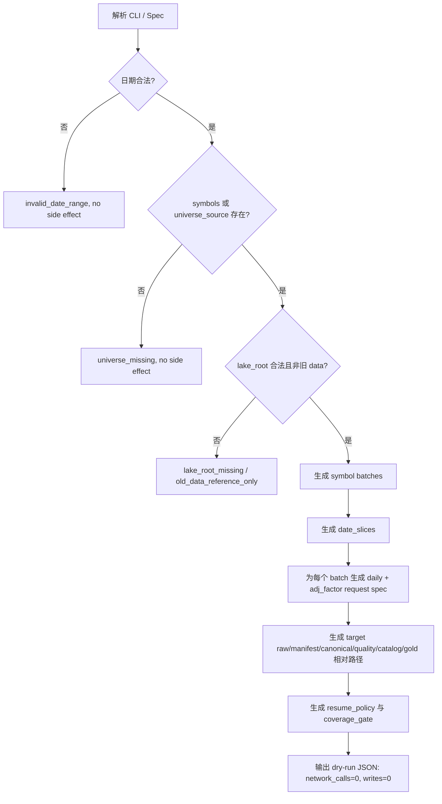

# LLD: CR007-S01-prices-long-horizon-backfill-planner - 长周期 prices backfill planner

> 本 LLD 只覆盖 `CR007-S01-prices-long-horizon-backfill-planner`。CP5 批次人工确认已由用户原文 `同意` 批准，`confirmed=true`，`implementation_allowed=true`。该授权仅允许进入离线代码实现调度，不授权真实 Tushare 抓取、真实 lake 写入、凭据读取或旧数据 / 旧报告操作。
>
> 本设计不执行真实 Tushare 抓取，不写入真实 lake，不读取 `.env`、token 或 NAS 凭据，不读取、列出、迁移、复制、比对或删除旧 `data/**`，不读取或覆盖旧 `reports/data_quality_report.csv`。

## 1. Goal

为现有 `market_data` 数据层设计一个长周期 `prices.daily` + `prices.adj_factor` dry-run planner。该 planner 接收显式股票池或 universe source、日期区间、分批参数、run 标识和 configured lake root，输出可审计的分批计划、resume policy、target paths、coverage gate、错误枚举和安全计数；dry-run 下网络调用数为 0、写入数为 0。

本 Story 不授权真实 backfill 执行。实现阶段只有在 CP5 全量确认后，才能修改 Story 卡片声明的共享文件和创建 `tests/test_cr007_prices_long_horizon_backfill_planner.py`。

## 2. Requirements（Functional / Non-Functional）

### 2.1 Functional

- 创建 `prices-long-horizon-plan` CLI 子命令或等价可测试函数，默认 `dry_run=true`，输出字段覆盖 `dataset`、`source`、`interfaces`、`start_date`、`end_date`、`symbols_or_universe`、`batch_count`、`date_slices`、`run_id`、`resume_policy`、`target_paths`、`coverage_gate`，字段数不少于 Story AC 要求的 12 个。
- planner 只接受显式 `--symbols` 或 `--universe-source`。两者均缺失时返回结构化错误 `universe_missing`，不得退化为无边界全市场长周期抓取。
- planner 必须同时生成 `prices.daily` 与 `prices.adj_factor` 请求计划，二者使用相同 `date_slices`、相同 symbol batches、相同 `adjustment_policy`、相同 `run_id` 和成对 `batch_id` pattern。
- planner 必须复用或对齐现有 `ResumePolicy(success=skip, failed=retry, partial_success=retry, duplicate_manifest=fail)` 语义。计划阶段不得扫描旧 `data/**` 判断 resume。
- coverage gate 必须表达 `requested_start`、`requested_end`、`symbols_count`、`date_slices`、`denominator_mode`、`expected_rows`、`minimum_coverage_ratio`、`quality_status_required` 和 `old_data_operations`。
- target paths 必须以 `LakeLayout` 生成的相对路径表达，`lake_root` 对外仅显示 `<configured-lake-root>`，不得打印真实私有路径。
- 复权口径固定为显式 `adjustment_policy`，默认 `qfq`。`prices.daily` 与 `prices.adj_factor` 口径冲突时 fail fast，错误为 `adjustment_policy_conflict`。
- planner 必须保留当前 `tushare-first-acquire` 的真实执行门控：未传真实授权时网络调用为 0、写入为 0；即使 `dry_run=false` 的执行能力存在，也不属于本 Story 默认授权。

### 2.2 Non-Functional

- 安全：`.env`、token、NAS 凭据读取或打印次数为 0；旧 `data/**` 操作计数均为 0；旧质量报告读取或覆盖次数为 0。
- 可恢复：每个计划批次包含 idempotency 输入字段，能映射到 `execute_batches()` 的 manifest resume 语义。
- 可测试：全部验证使用 tmp lake、fixture symbols、fake manifest 或函数级对象，不需要网络、Tushare token、NAS 或旧数据目录。
- 可维护：优先扩展现有 `market_data/cli.py`、`runtime.py`、`connectors/tushare.py`、`normalization.py`、`validation.py` 的现有契约，不新增常驻调度服务。
- 可审计：输出显式列出 `planner_mode=dry_run`、`network_calls=0`、`writes=0`、`implementation_allowed=true_for_offline_code_only` 和 `real_execution_requires_user_authorization=true`。

## 3. 模块拆分与职责

| 模块 / 文件组 | 职责 | 说明 |
|---|---|---|
| `market_data/cli.py` | 增加 `prices-long-horizon-plan` 参数解析、输入校验、计划生成和 JSON 输出 | 复用 `_contract_date_range()`、`_safe_lake_root_label()`、`_resume_policy_payload()`、`TushareFirstRunSpec` 路径生成习惯；新增函数必须可被单测直接调用 |
| `market_data/runtime.py` | 将现有 `ResumePolicy` 作为 planner 输出的唯一 resume 语义来源 | 不改真实执行语义；LLD 要求计划输出与 runtime 状态枚举一致 |
| `market_data/connectors/tushare.py` | 明确 `prices.daily` 与 `prices.adj_factor` 的 provider 参数约束 | 现有 adapter 已映射 `INTERFACE_PRICES_DAILY` 和 `INTERFACE_PRICES_ADJ_FACTOR`；本 Story 只设计 planner 如何生成请求，不授权 fetch |
| `market_data/normalization.py` | 明确长周期 `prices` canonical 依赖 `adj_factor` lookup 和复权一致 fail-fast | 复用 `_load_adj_factor_lookup()`、`adjustment_policy_conflict`、`schema_mismatch: adj_factor key mismatch` |
| `market_data/validation.py` | 明确 coverage gate 使用显式 open trade dates 或返回未确认分母提示 | 复用 `validate_dataset()`、`DENOMINATOR_MODE_PRICES`、`validate_adjustment_consistency()`；长周期不得用自然日默认误称通过 |
| `tests/test_cr007_prices_long_horizon_backfill_planner.py` | 创建 Story 专属测试 | 覆盖 dry-run、无 universe fail fast、resume、coverage gate、no old data、no credential、复权冲突设计入口 |

## 4. 代码结构与文件影响范围

| 动作 | 文件路径 | 变更内容 |
|---|---|---|
| 修改 | `market_data/cli.py` | 新增 dataclass `PricesLongHorizonPlanSpec`、计划生成函数 `build_prices_long_horizon_plan()`、CLI handler `cmd_prices_long_horizon_plan()`、parser 子命令 `prices-long-horizon-plan`、结构化错误枚举和 target path 输出 |
| 修改 | `market_data/runtime.py` | 增加只读 helper `resume_policy_to_dict()` 或等价复用点，确保 planner 输出与 `ResumePolicy` 默认值一致；不改 `execute_batches()` 行为 |
| 修改 | `market_data/connectors/tushare.py` | 补充或确认 `prices.adj_factor` 计划参数命名与 provider 映射一致；不在 planner dry-run 中调用 `_provider()` 或 `fetch()` |
| 修改 | `market_data/normalization.py` | 暴露或复用复权一致性错误枚举到 planner 输出；确保 LLD 实现可引用 `adjustment_policy_conflict` 作为计划级 fail-fast 类型 |
| 修改 | `market_data/validation.py` | 增加或复用 coverage gate 计算 helper，输入显式 open trade dates / symbols / slices，输出 expected rows 和 denominator mode；不读取真实 lake 或旧数据 |
| 创建 | `tests/test_cr007_prices_long_horizon_backfill_planner.py` | 创建 Story 专属单测，全部使用 tmp path、fixture symbols 和直接函数调用；不运行真实抓取 |

禁止修改：`engine/**`、`experiments/**`、`README.md`、`docs/USER-MANUAL.md`、`data/**`、`reports/**`、`.env`、`credentials`、`delivery/**`。

## 5. 数据模型与持久化设计

本 Story 不新增真实持久化表、不写入 raw/manifest/canonical/quality/catalog/gold。planner 仅输出 JSON 计划对象。

| 对象 / 字段 | 类型 | 约束 | 说明 |
|---|---|---|---|
| `PricesLongHorizonPlanSpec.dataset` | `str` | 固定为 `prices` | 不支持其他 dataset；S02/S03 分别拥有 benchmark/calendar 和非行情 dataset |
| `PricesLongHorizonPlanSpec.start_date/end_date` | ISO date string | `start_date <= end_date` | 默认目标支持 `2015-01-01` 至 `2025-12-31`，真实终止日期仍为 OPEN |
| `PricesLongHorizonPlanSpec.symbols` | `tuple[str, ...]` | 与 `universe_source` 至少一个非空 | 显式 symbols 优先；不得默认全市场 |
| `PricesLongHorizonPlanSpec.universe_source` | `str | None` | 只记录来源标识，不读取旧数据 | 可为后续 S03 readiness 输出或人工提供文件的逻辑标识；本 Story 不读取实际文件 |
| `PricesLongHorizonPlanSpec.symbol_batch_size` | `int` | `>=1` | 控制 symbol batches |
| `PricesLongHorizonPlanSpec.slice_days` | `int` | `>=1` | 控制 date slices；按日历日期切片，coverage gate 后续用交易日分母 |
| `PricesLongHorizonPlanSpec.adjustment_policy` | `str` | 默认 `qfq`，必须在 daily 与 adj_factor 间一致 | 冲突错误为 `adjustment_policy_conflict` |
| `plan.interfaces` | `list[dict]` | 必含 `prices.daily` 与 `prices.adj_factor` | 每个 batch 生成成对请求 |
| `plan.target_paths` | `dict` | 相对路径 | 不打印真实 lake root |
| `plan.coverage_gate` | `dict` | 含 denominator、expected_rows、quality status 要求 | 不使用旧报告或旧数据证明覆盖 |
| `plan.old_data_operations` | `dict[str, int]` | 全部为 0 | 覆盖 read/list/migrate/copy/compare/delete |

## 6. API / Interface 设计

| 接口 / 入口 | 输入 | 输出 | 调用方 | 说明 |
|---|---|---|---|---|
| `build_prices_long_horizon_plan(spec)` | `PricesLongHorizonPlanSpec` | `dict[str, Any]` plan payload | CLI handler、单测 | 纯函数；不得访问网络、`.env`、旧 `data/**` 或旧报告 |
| `prices-long-horizon-plan` CLI | `--lake-root`、`--start-date`、`--end-date`、`--symbols` 或 `--universe-source`、`--symbol-batch-size`、`--slice-days`、`--run-id`、`--adjustment-policy`、`--dry-run` | JSON 到 stdout；结构化错误到 stderr | 用户、meta-qa | dry-run 默认 true；输出 `network_calls=0`、`writes=0` |
| `resume_policy_to_dict()` | 可选 `ResumePolicy` | `{"success": "skip", ...}` | planner、测试 | 若不新增函数，直接复用 `_resume_policy_payload()` 并在测试中对齐 runtime 默认值 |
| `build_prices_coverage_gate(...)` | start/end、symbols_count、date_slices、open_trade_dates 可选、threshold | coverage dict | planner、validation 测试 | 无 open trade dates 时输出 `denominator_mode=trade_calendar_required`，不得声明长周期通过 |
| `planned_connector_requests` 对象 | symbol batch、date slice、interface、params | 成对 `prices.daily` / `prices.adj_factor` request spec | 未来真实执行 Story 或人工授权流程 | 本 Story 只输出 request spec，不调用 `TushareAdapter.fetch()` |

错误模型：

| error_type | 触发条件 | HTTP / CLI 语义 | 安全要求 |
|---|---|---|---|
| `invalid_date_range` | 日期格式非法或 start 晚于 end | exit code 2 | 不输出路径或凭据 |
| `universe_missing` | `symbols` 与 `universe_source` 同时缺失 | exit code 2 | 不默认全市场 |
| `batch_size_invalid` | batch size 或 slice days 小于 1 | exit code 2 | 无副作用 |
| `lake_root_missing` | `--lake-root` 缺失 | exit code 2 | 只提示配置方式 |
| `old_data_reference_only` | lake root 指向 repo `data/**` 或请求旧数据来源 | exit code 2 | 不读取旧目录 |
| `adjustment_policy_conflict` | daily 与 adj_factor 口径不一致 | exit code 2 或 plan `ok=false` | 阻断 canonical/gold 消费 |

第 10 节测试设计逐项覆盖本节接口和错误模型。

## 7. 核心处理流程



主流程：

1. 解析 `PricesLongHorizonPlanSpec`，调用现有 `_contract_date_range()` 验证日期。
2. 校验 `symbols` 或 `universe_source`。若两者均空，抛出 `StructuredCliError("universe_missing", ...)`。
3. 校验 `lake_root` 必须显式配置且不能指向 repo `data/**`，对外输出 `<configured-lake-root>`。
4. 按 `symbol_batch_size` 将显式 symbols 切分为 `symbol_batches`；若仅提供 `universe_source`，输出 `symbols_resolved=false` 和 `universe_source`，真实解析留给后续授权执行或 S03 readiness。
5. 按 `slice_days` 将日期范围切为闭区间 `date_slices`，每个 slice 生成两个接口请求：`prices.daily` 和 `prices.adj_factor`。
6. 为每个请求生成 deterministic `batch_id`，格式如 `prices-YYYYMMDD-YYYYMMDD-sNN-iNN-daily` 与 `prices-YYYYMMDD-YYYYMMDD-sNN-iNN-adj-factor`。
7. 使用 `LakeLayout` 构造相对 `raw_path`、`manifest_path`、`canonical_path`、`quality_path`、`catalog_path`、`gold_path`。
8. 输出 `resume_policy`、`coverage_gate`、`error_enum`、`old_data_operations`、`network_calls=0`、`writes=0`。

异常流程：

1. `dry_run=false` 在本 Story 默认实现中仍返回 `source_disabled` 或要求 `--enable-real-source`，不得进入真实 `execute_batches()`。
2. `adjustment_policy` 在 daily 与 adj_factor 计划不一致时直接返回 `adjustment_policy_conflict`，不得输出可执行计划。
3. 没有 `open_trade_dates` 时 coverage gate 只能输出 `trade_calendar_required`，不得声称 2015-2025 coverage 通过。
4. 任何读取旧 `data/**`、旧质量报告或凭据的需求均转为 `blocked_by_policy`，不执行读取。

## 8. 技术设计细节

- 关键算法 / 规则：
  - 日期切片采用闭区间顺序切分：`[start, min(start + slice_days - 1, end)]`，下一片从前一片结束日加 1 天开始。
  - symbol batching 保持输入顺序，去除空字符串，重复 symbol 在计划阶段 fail fast 为 `duplicate_symbol`，避免重复抓取。
  - interface pairing 要求每个 symbol/date slice 必有 `prices.daily` 和 `prices.adj_factor` 两个 request spec；缺任一方时 plan `ok=false`。
  - expected_rows 计算在无 `open_trade_dates` 时只给出 `symbols_count * planned_date_slice_calendar_days` 的 planning estimate，并标记 `coverage_denominator_status=trade_calendar_required`；有 `open_trade_dates` 时才给出交易日 denominator。
- 依赖选择与复用点：
  - `market_data/cli.py` 已有 `TushareFirstRunSpec`、`build_tushare_first_plan()`、`_safe_lake_root_label()`、`_resume_policy_payload()` 和结构化 CLI 错误，可作为直接模式。
  - `market_data/runtime.py` 已有 `ResumePolicy` 和 `execute_batches()` resume 行为；planner 只输出与其一致的状态，不执行。
  - `market_data/connectors/tushare.py` 已支持 `INTERFACE_PRICES_DAILY` 与 `INTERFACE_PRICES_ADJ_FACTOR` provider 参数映射；planner 不触发 provider import。
  - `market_data/normalization.py` 已支持 `DATASET_ADJ_FACTOR` raw 映射、`adj_factor_lookup`、`adjustment_policy_conflict`。
  - `market_data/validation.py` 已支持 `validate_dataset()`、`DENOMINATOR_MODE_PRICES` 和 `validate_adjustment_consistency()`。
- 兼容性处理：
  - 保留现有 `plan`、`tushare-first-acquire`、`hs300-backfill` CLI 行为，不改默认参数。
  - 新子命令的 JSON 输出采用现有 `_print_json()`，错误采用 `_error_payload()`。
  - 计划输出中的 `target_paths` 使用相对路径，避免破坏现有测试对 safe lake root 的断言。
- 图示类型选择：流程图。该 Story 跨 CLI、runtime、connector、normalization、validation 与测试 6 个模块，且存在多条安全失败路径。

## 9. 安全与性能设计

| 维度 | 设计措施 | 验证方式 |
|---|---|---|
| 安全 | planner 不读取 `.env`，不读取 token 值，credential 只允许以 env var name 出现在输出；`dry_run=true` 时不调用 connector，不调用 provider，不执行 `execute_batches()` | 单测 monkeypatch token 值并断言 JSON 不包含 token；断言 network_calls=0、writes=0 |
| 安全 | `lake_root` 对外显示 `<configured-lake-root>`；target paths 全部为相对路径 | 单测断言输出不包含真实 tmp path 之外的敏感路径，且 target paths 不为绝对路径 |
| 安全 | repo `data/**`、旧 `reports/data_quality_report.csv` 只能作为禁止对象；planner 不读取、不列出、不比对 | 单测 monkeypatch `Path.iterdir` / `Path.rglob` 或使用静态断言，验证 `old_data_operations` 全 0 |
| 性能 | 计划生成复杂度为 `O(symbol_count + slice_count + symbol_count * slice_count * 2)`；默认只构造 JSON，不做 IO | 单测用小规模 fixture 验证 batch_count；代码审查确认无 DataFrame 全量读 |
| 性能 | 长周期不默认全市场，必须有显式 symbols 或 universe source | 缺 universe 测试返回 `universe_missing`；无默认 symbol 扩展 |
| 可恢复 | `resume_policy` 与 runtime 默认值一致，batch_id deterministic | 单测比对 `ResumePolicy()` 默认值和 plan 输出 |

## 10. 测试设计

| 测试场景 | 前置条件 | 操作 | 预期结果 | 验证方式 |
|---|---|---|---|---|
| `test_plan_outputs_required_fields_and_no_side_effects` | tmp lake、symbols=`000001.SZ,000002.SZ` | 调用 `build_prices_long_horizon_plan()` 或 CLI dry-run | 输出字段不少于 12 个；`interfaces` 含 daily 与 adj_factor；`network_calls=0`、`writes=0`；tmp lake 无文件 | `uv run --python 3.11 pytest -q tests/test_cr007_prices_long_horizon_backfill_planner.py` |
| `test_missing_universe_fails_fast` | tmp lake，无 symbols/universe | 调用新 CLI | exit code 2，stderr `error_type=universe_missing`，无文件写入 | 同上 |
| `test_symbol_and_date_batches_are_paired` | 3 个 symbols、`symbol_batch_size=2`、两个 date slices | 调用纯函数 | `batch_count = symbol_batch_count * date_slice_count * 2`；每组 slice 同时存在 `prices.daily` 与 `prices.adj_factor` | 同上 |
| `test_resume_policy_matches_runtime_default` | 无 IO | 对比 plan `resume_policy` 与 `ResumePolicy()` | success/failed/partial_success/duplicate_manifest 与 runtime 默认一致 | 同上 |
| `test_coverage_gate_requires_trade_calendar_denominator` | 未传 open trade dates | 调用 planner | `coverage_denominator_status=trade_calendar_required`，不得声明 coverage pass | 同上 |
| `test_coverage_gate_uses_open_trade_dates_when_provided` | fixture open trade dates | 调用 coverage helper | `expected_rows = len(open_trade_dates) * symbols_count`，denominator mode 为 open trade dates | 同上 |
| `test_adjustment_policy_conflict_fails_fast` | daily policy 与 adj_factor policy 被构造成不同 | 调用 plan helper | `adjustment_policy_conflict`，无 request spec 可执行 | 同上 |
| `test_no_credentials_or_old_data_are_read_or_printed` | monkeypatch env token 值、禁止 old path 遍历 | 调用 planner | 输出不含 token 值；`old_data_operations` 全 0；不读取旧报告 | 同上 |
| `test_tushare_adapter_not_invoked_by_dry_run` | monkeypatch `TushareAdapter.fetch` 抛错 | 调用 planner | 测试不触发 fetch；计划成功 | 同上 |

第 6 节接口对应关系：`build_prices_long_horizon_plan()` 覆盖前 8 个测试；CLI 覆盖前 2 个测试；`resume_policy_to_dict()` 覆盖 resume 测试；`build_prices_coverage_gate()` 覆盖两个 coverage 测试；planned request spec 覆盖 pairing 测试。

第 7 节异常路径对应关系：`invalid_date_range`、`universe_missing`、`old_data_reference_only`、`adjustment_policy_conflict`、coverage denominator missing 均有测试入口。

## 11. 实施步骤

| TASK-ID | 动作 | 目标文件 | 详细描述 | 对应测试 |
|---|---|---|---|---|
| CR007-S01-T1 | 修改 | `market_data/cli.py` | 创建 `PricesLongHorizonPlanSpec`、`build_prices_long_horizon_plan()`、`cmd_prices_long_horizon_plan()` 和 parser 子命令；输出 required fields、target paths、error enum、安全计数 | `test_plan_outputs_required_fields_and_no_side_effects`、`test_missing_universe_fails_fast`、`test_symbol_and_date_batches_are_paired`、`test_no_credentials_or_old_data_are_read_or_printed` |
| CR007-S01-T2 | 修改 | `market_data/runtime.py` | 创建 `resume_policy_to_dict()` 或等价只读复用点，保证 plan resume policy 与 `ResumePolicy()` 默认一致；不改执行行为 | `test_resume_policy_matches_runtime_default` |
| CR007-S01-T3 | 修改 | `market_data/connectors/tushare.py` | 确认 `prices.daily` / `prices.adj_factor` provider 参数仍以 symbol、start/end 生成；补充 dry-run planner 不调用 adapter 的边界测试必要钩子 | `test_tushare_adapter_not_invoked_by_dry_run` |
| CR007-S01-T4 | 修改 | `market_data/normalization.py` / `market_data/validation.py` | 提供复权一致错误枚举和 coverage gate helper；保持 `validate_dataset()`、`validate_adjustment_consistency()` 现有行为兼容 | `test_adjustment_policy_conflict_fails_fast`、`test_coverage_gate_requires_trade_calendar_denominator`、`test_coverage_gate_uses_open_trade_dates_when_provided` |
| CR007-S01-T5 | 创建 | `tests/test_cr007_prices_long_horizon_backfill_planner.py` | 创建上述全部测试；使用 tmp path 和纯函数，不联网、不读旧数据、不写真实 lake | 全部测试 |

TASK 与文件影响范围一一对应：第 4 节每个文件均被至少一个 TASK 覆盖；每个 TASK 均有对应测试。

## 12. 风险、难点与预研建议

| 风险 / 难点 | 影响 | 缓解措施 / 预研建议 |
|---|---|---|
| Story 卡片状态仍为 `draft`，但 CR/STATE/handoff 表示 CP3/CP4 已批准进入 LLD | 可能影响 meta-po 后续自动聚合 CP5 | 本 LLD 记录为 `ready-for-review`，CP5 记录状态漂移；由 meta-po 在批次确认前同步 Story frontmatter，不授权实现 |
| S01 与 S02/S03 共享 `market_data/cli.py`、`normalization.py`、`validation.py` | 后续开发存在文件冲突 | CR007-BATCH-A 全量 CP5 后由 meta-po 按 Wave 串行开发；S02/S03 只并行 LLD，不并行开发 |
| 无 `trade_calendar` 时无法真实计算长周期交易日 denominator | coverage gate 可能被误读为通过 | 计划输出必须标记 `trade_calendar_required`；真正 coverage pass 依赖 S02 |
| 显式 universe source 如果被实现为读取旧 `data/**` | 违反 CR-007 安全边界 | 本 Story 只记录 universe source 字符串或外部契约 ID，不读取文件；旧 data 操作为 0 |
| 长周期实际真实执行可能受 Tushare 配额和限速影响 | 后续真实 backfill 失败或成本不可控 | 本 Story 只交付 dry-run plan；真实执行需另行用户授权并可按 plan 分批审查 |

### OPEN / Spike 跟踪

| ID | 类型（OPEN / Spike） | 问题 | 下一动作 | 责任方 |
|---|---|---|---|---|
| CR007-S01-O1 | OPEN | Story 卡片 `status=draft` 与 STATE/CR/handoff 的 `cp3-cp4-approved-lld-ready` 存在状态漂移 | meta-po 在 CP5 聚合前同步 Story 状态或在批次审查中显式说明等价授权 | meta-po |
| CR007-S01-O2 | OPEN | 长周期终止日期使用 `2025-12-31` 还是当前可得日期 | LLD 默认支持显式 end date；真实执行前由用户确认 | user |
| CR007-S01-O3 | OPEN | 长周期股票池来源与分批规模尚未最终确认 | LLD 强制显式 symbols/universe source；默认不全市场；实现时保留参数 | user / meta-dev |
| CR007-S01-O4 | Spike | coverage gate 在 S02 之前只能生成 denominator 需求，不能证明 open trade dates 完整 | S02 LLD/实现冻结 trade_calendar 同区间 coverage 后，S01 planner 可消费其结果 | meta-dev / meta-qa |

## 13. 回滚与发布策略

- 发布方式：随 CR007-S01 实现一起以代码和测试提交进入本地 `market_data` 包；默认只新增 dry-run planner，不改变现有 `plan`、`fetch`、`tushare-first-acquire`、`normalize`、`validate`、`read`、`compare` 行为。
- 回滚触发条件：新 CLI 子命令破坏现有 CLI、计划输出泄露真实路径或凭据、dry-run 出现网络调用或写入、无 universe 时未 fail fast、复权冲突未阻断。
- 回滚动作：移除 `prices-long-horizon-plan` parser 分支、新增 dataclass/helper 和 Story 专属测试；保留现有 CR005/CR006 数据层行为；不得删除或修改真实数据、旧 `data/**` 或旧质量报告。
- 发布前门控：当前 LLD `confirmed=true`，CP5 批次已人工确认；允许按 Wave 调度离线实现。实现完成后必须写 CP6，验证必须由 meta-qa 在 CP7 处理。

## 14. Definition of Done

- [x] LLD 保持 14 个可见章节，frontmatter `confirmed=true`、`implementation_allowed=true`。
- [x] `process/checks/CP5-CR007-S01-prices-long-horizon-backfill-planner-LLD-IMPLEMENTABILITY.md` 已写入，且 CP5 批次人工确认已通过。
- [ ] plan 输出字段不少于 12 个，覆盖 Story AC 的 dataset/source/interfaces/start/end/symbols/batch/date/run/resume/paths/coverage。
- [ ] dry-run 下 `network_calls=0`、`writes=0`，测试不导入或调用真实 provider。
- [ ] 无 symbols / universe source 时返回 `universe_missing`，默认全市场长周期抓取次数为 0。
- [ ] `prices.daily` 与 `prices.adj_factor` 使用同一 `adjustment_policy`；冲突时 fail fast。
- [ ] 旧 `data/**` 操作次数为 0；`.env` / token / NAS 凭据读取或打印次数为 0；旧 `reports/data_quality_report.csv` 读取或覆盖次数为 0。
- [ ] 第 6 节接口在第 10 节均有测试入口；第 7 节异常路径在第 10 节均有错误路径测试。
- [ ] 第 11 节 TASK-ID 与第 4 节文件影响范围一一对应。
- [ ] OPEN / Spike 已清点，并明确责任方和下一动作。

## 人工确认区

> **CP5 - Story LLD 可实现性门**
> meta-dev 先写入 `process/checks/CP5-CR007-S01-prices-long-horizon-backfill-planner-LLD-IMPLEMENTABILITY.md` 自动预检结果。
> meta-po 收齐 CR007-BATCH-A 全部目标 Story 的 LLD 和 CP5 自动预检后，再生成并提示用户审查 `checkpoints/CP5-CR007-BATCH-A-LLD-BATCH.md`。
> 用户统一确认全部目标 Story 的 LLD 后，仍需满足当前 Wave、依赖门控与文件所有权门控方可进入实现。

**CP5 checklist 摘要**：

| # | 检查项 | 状态 | 证据 |
|---|---|---|---|
| 1 | LLD 覆盖 AC | 待检查 | 第 2 / 10 / 14 节 |
| 2 | 与 HLD / ADR 一致 | 待检查 | 第 3 / 8 / 12 节 |
| 3 | 文件影响范围明确 | 待检查 | 第 4 / 11 节 |
| 4 | 接口契约完整 | 待检查 | 第 6 节 |
| 5 | 测试与 dev_gate 可计算 | 待检查 | 第 10 / 14 节 |

**人工确认回复**：

请直接回复以下任一整行：

```text
approve
修改: <具体修改点>
reject
```

**人工审查结果回填**：

- 结论：`approved | changes_requested | rejected`
- 审查人：
- 审查时间：
- 修改意见：
- 风险接受项：
