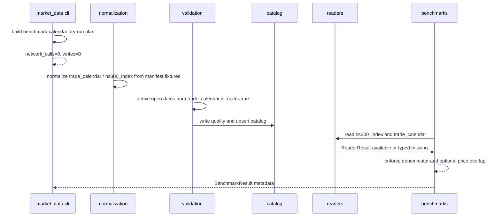

# LLD: CR007-S02 — benchmark 与交易日历同区间 backfill

> 本文档仅是 `CR007-S02-benchmark-calendar-backfill` 的低层设计。CP5 批次人工确认已由用户原文 `同意` 批准，`confirmed=true`，且 `implementation_allowed=true`。该授权仅允许在当前 Story `dev_gate` 满足后进入离线代码实现调度，不授权真实 Tushare 抓取、真实 `/mnt/ugreen-data-lake` 写入、凭据读取或旧数据 / 旧报告操作。

## 1. Goal

创建 `hs300_index` 与 `trade_calendar` 同区间 dry-run/backfill 规划、normalize、validate、catalog、reader 与 benchmark resolver 合同，使真实沪深300 benchmark 只能在 `trade_calendar.is_open=true` 分母下 coverage 合格时返回 `available`；缺口返回 typed `required_missing` / `unavailable` / `quality_failed`，旧代理只能作为 `proxy_baseline` 对照。

## 2. Requirements（Functional / Non-Functional）

### 2.1 Functional

- 创建 benchmark/calendar 组合规划入口，输入 `hs300_index`、`trade_calendar`、`start_date`、`end_date`、`index_code`、`exchange`、`lake_root`、`run_id`、`dry_run`，输出 calendar-first、hs300-second 的计划、target paths、resume policy、coverage denominator 与错误枚举。
- 修改 `trade_calendar` 与 `hs300_index` normalization/validation 合同，确保 `trade_calendar.is_open=true` 是 benchmark coverage 唯一 denominator；自然日 denominator 在 S02 benchmark 合同中使用次数为 0。
- 修改 quality/catalog/readers 合同，使 `trade_calendar` 与 `hs300_index` 都能在 tmp lake fixture 下登记、读取、过滤和暴露 lineage，不导入 connector/runtime/storage。
- 修改 `resolve_hs300_benchmark` 合同，使 `BenchmarkResult.to_metadata()` 至少包含 `status`、`dataset`、`index_code`、`start_date`、`end_date`、`coverage`、`quality_status`、`missing_reason`、`lineage`，并在 calendar missing、coverage gap、policy unconfirmed、quality fail、与 prices 无同区间覆盖时返回 typed 非 available。
- 创建 `tests/test_cr007_benchmark_calendar_backfill.py`，覆盖同区间 available、coverage gap、缺 calendar、无 proxy/no network/no write/no old data 操作。
- 保持 `experiments/run_experiment_13.py` 不变；实验消费属于 CR007-S04。

### 2.2 Non-Functional

- 默认测试只使用 tmp lake、canonical fixture、trade_calendar fixture 与 monkeypatch；真实 Tushare 调用次数为 0。
- dry-run planner 网络调用次数为 0，写入次数为 0；不读取、列出、迁移、复制、比对或删除旧 `data/**`。
- 不读取、打印或记录 `.env`、Tushare token、NAS 用户名、NAS 密码或真实私有路径；payload 中只允许出现 env var 名称或 `<configured-lake-root>` 类安全标签。
- reader / benchmark resolver 消费路径不导入 `market_data.connectors`、`market_data.runtime`、`market_data.storage`，不触发 fetch/backfill。
- 与 CR007-S01 的 contract 依赖：S02 实现前必须等待 S01 planner/date range/coverage gate/resume policy 冻结；S02/S03 因共享 `normalization.py`、`validation.py`、`readers.py` 默认不得并行开发。

## 3. 模块拆分与职责

| 模块 / 文件组 | 职责 | 说明 |
|---|---|---|
| `market_data/cli.py` | 创建 benchmark/calendar dry-run 组合入口；补齐 `trade_calendar` validate/read 运维入口；保持真实执行 gate | 复用现有 `TushareFirstRunSpec`、`build_tushare_first_plan`、`cmd_hs300_backfill` 事实；新入口不得默认联网或写湖 |
| `market_data/normalization.py` | 复用并收紧 `_normalize_hs300_rows`、`_normalize_trade_calendar_rows` exact schema 与 duplicate key 规则 | `hs300_index` key 为 `trade_date,index_code`；`trade_calendar` key 为 `trade_date,exchange` |
| `market_data/validation.py` | 创建组合 coverage gate 或增强 `validate_hs300_index`，统一输出 `trade_calendar_open_dates` denominator、missing trade dates、gap reason、lineage | 当前已有 `validate_hs300_index()` 与 `QualityResult` 字段，S02 在其上补齐 calendar 缺失与 price overlap 语义 |
| `market_data/catalog.py` | 保持 `CatalogEntry` 为 hs300/calendar quality 与 lineage 索引；确保 `start_date/end_date/coverage` 在 upsert 中可追溯 | 不新增持久化后端，只使用现有 JSON catalog |
| `market_data/readers.py` | 扩展 `read_dataset` 对 `trade_calendar` 的 `exchange` 过滤和 required_missing/quality_failed 语义 | reader 不导入 connector/runtime/storage |
| `market_data/benchmarks.py` | 增强 `BenchmarkCoverage`、`BenchmarkResult` 与 `resolve_hs300_benchmark` 的 calendar/price overlap 缺口映射 | 保留 CR005 `BenchmarkResult` schema 向后兼容 |
| `tests/test_cr007_benchmark_calendar_backfill.py` | 创建 S02 离线测试集 | tmp lake fixture，不读取旧 `data/**`、不读取旧报告、不需要 token |

## 4. 代码结构与文件影响范围

| 动作 | 文件路径 | 变更内容 |
|---|---|---|
| 修改 | `market_data/cli.py` | 创建 `benchmark-calendar-backfill` 或等价组合 subcommand；输出 calendar plan、hs300 plan、coverage denominator、network_calls=0、writes=0；为 `trade_calendar` validate/read 补齐入口；保留 `hs300-backfill` 兼容入口 |
| 修改 | `market_data/normalization.py` | 确认 `INTERFACE_TRADE_CALENDAR_DAILY` exact 映射；收紧 `trade_calendar.is_open` 布尔解析、日期解析和 duplicate key fail-fast；保持 `hs300_index` exact `index_code` 校验 |
| 修改 | `market_data/validation.py` | 创建 `validate_benchmark_calendar_coverage` 或增强 `validate_hs300_index` 参数，输出 `denominator_mode=trade_calendar_open_dates`、`missing_trade_dates`、`gap_reason`、`calendar_missing`、`price_benchmark_overlap_missing` |
| 修改 | `market_data/catalog.py` | 如现有字段不足，补齐 `CatalogEntry.coverage` 使用约定；不得改变 JSON 存储格式的向后兼容读取 |
| 修改 | `market_data/readers.py` | 扩展 `_filter_frame` 支持 `exchange`；为 `trade_calendar` required reader 保持 typed `required_missing` / `quality_failed`；静态边界不导入 connector/runtime/storage |
| 修改 | `market_data/benchmarks.py` | 为 `resolve_hs300_benchmark` 增加可选 `price_trade_dates` / `required_trade_dates` 合同，缺同区间价格交易日时返回 `required_missing`；metadata 增加 `denominator_mode` 与 price overlap 证据 |
| 创建 | `tests/test_cr007_benchmark_calendar_backfill.py` | 覆盖 dry-run plan、同区间 available、coverage gap、calendar missing、price overlap missing、proxy 隔离和 no-network/no-write/static imports |

禁止修改：`experiments/run_experiment_13.py`、`engine/**`、`data/**`、`reports/**`、`.env`、`delivery/**`。

## 5. 数据模型与持久化设计

| 对象 / 字段 | 类型 | 约束 | 说明 |
|---|---|---|---|
| `BenchmarkCalendarPlan.command` | `str` | 固定 `benchmark-calendar-backfill` | CLI JSON payload 字段；dry-run 输出即可验收 |
| `BenchmarkCalendarPlan.datasets` | `list[dict]` | 顺序固定为 `trade_calendar`、`hs300_index` | calendar 先规划，hs300 后规划 |
| `BenchmarkCalendarPlan.denominator_mode` | `str` | 固定 `trade_calendar_open_dates` | benchmark coverage 不允许自然日 denominator |
| `BenchmarkCalendarPlan.coverage_gate` | `dict` | 含 `index_code`、`exchange`、`start_date`、`end_date`、`required_ratio=1.0` | 供 validate/resolver 测试断言 |
| `QualityResult.missing_trade_dates` | `list[str]` | 仅来自 `trade_calendar.is_open=true` 日期差集 | 现有字段继续使用 |
| `QualityResult.gap_reason` | `str` | 枚举：`calendar_missing`、`coverage_gap`、`price_benchmark_overlap_missing`、`policy_unconfirmed`、空字符串 | 写入 quality CSV / metadata |
| `BenchmarkCoverage.denominator` | `int` | 等于 open trade dates 数量；若 calendar missing 则为 0 | 不使用自然日 |
| `BenchmarkCoverage.missing_trade_dates` | `list[str]` | 按 open trade dates 升序 | metadata 与测试断言入口 |
| `BenchmarkResult.lineage` | `dict` | 至少含 `manifest_run_id` 或 `source_run_id` 或 `lineage_raw_checksum`；缺失为 `quality_failed` | 保持 CR005 schema |

无新增数据库、无新增外部持久化服务。S02 仅复用现有 canonical parquet、quality CSV/MD、catalog JSON；真实 lake 写入不在本 LLD 授权范围内。

## 6. API / Interface 设计

| 接口 / 入口 | 输入 | 输出 | 调用方 | 说明 |
|---|---|---|---|---|
| CLI `benchmark-calendar-backfill` | `--lake-root`、`--start-date`、`--end-date`、`--index-code`、`--exchange`、`--run-id`、`--dry-run=true` | JSON：`ok`、`datasets`、`denominator_mode`、`coverage_gate`、`network_calls`、`writes`、`old_data_operations`、`error_enum` | 数据运维 / 测试 | 仅 plan/dry-run；测试见第 10 节 T01 |
| CLI `validate --dataset trade_calendar` | `--lake-root`、`--start-date`、`--end-date`、`--exchange` | JSON：quality status、dataset status、coverage、quality paths、catalog path | 数据运维 / 测试 | 不允许自然日 fallback 声明 benchmark pass；测试见 T02/T03 |
| CLI `validate --dataset hs300_index` | `--lake-root`、`--index-code`、`--start-date`、`--end-date`、可选 `--open-trade-dates` | JSON：`denominator_mode=trade_calendar_open_dates`、missing dates、gap reason、catalog entry | 数据运维 / 测试 | 若无 `--open-trade-dates` 且 catalog 中无 `trade_calendar`，返回 usage error；测试见 T02/T03 |
| `validate_benchmark_calendar_coverage(...)` | `lake_root`、`index_code`、`expected_range`、`trade_calendar`、`canonical_paths`、`price_trade_dates?`、`required` | `QualityResult` 或等价 dataclass | CLI / QA fixture | 若实现为增强 `validate_hs300_index`，必须保持同等字段 |
| `read_dataset(DATASET_TRADE_CALENDAR, filters={...})` | `lake_root`、`start/end`、`exchange`、`quality_policy`、`required` | `ReaderResult(status, frame, issues, catalog_entry)` | benchmark resolver / 测试 | 不导入 connector/runtime/storage；测试见 T05 |
| `resolve_hs300_benchmark(..., price_trade_dates=None)` | `lake_root`、`start_date`、`end_date`、`BenchmarkPolicy`、`index_code`、`required`、可选 price dates | `BenchmarkResult` | 实验十/十二既有路径、后续 S04 实验十三 | 缺 calendar 或缺重叠返回 typed 非 available；不自动 backfill；测试见 T04/T06 |

接口兼容性：

- `resolve_hs300_benchmark` 新增参数必须为可选 keyword-only 参数，默认保持 CR005 调用方行为。
- 现有 `hs300-backfill` CLI 保留，新增组合入口不得删除旧命令。
- `BenchmarkResult.to_metadata()` 只能新增字段，不删除 CR005 已验证字段。

## 7. 核心处理流程

1. 用户或测试调用 `benchmark-calendar-backfill --dry-run true`。
2. CLI 解析 `start_date/end_date/index_code/exchange/lake_root/run_id`，先构造 `trade_calendar.daily` 计划，再构造 `hs300_index.daily` 计划。
3. CLI 输出相对 lake target paths、resume policy、coverage gate、`denominator_mode=trade_calendar_open_dates`、`network_calls=0`、`writes=0`、`old_data_operations` 全 0。
4. normalize 阶段从 manifest success raw 派生 `trade_calendar` 与 `hs300_index` canonical fixture，分别执行 schema、exact interface、duplicate key、lineage 校验。
5. validate 阶段读取 `trade_calendar` open dates，调用 hs300 coverage gate；若 calendar 缺失、open dates 为 0、hs300 缺日期、重复 key、lineage 缺失或 policy 未确认，输出 typed quality/dataset status。
6. catalog 阶段记录 hs300/calendar coverage、quality status、canonical path、quality path、source/interface、lineage。
7. reader / benchmark resolver 只读 catalog + canonical；available 时返回真实 hs300 frame，缺口时返回 `required_missing` / `unavailable` / `quality_failed` 和 remediation spec，且 `auto_execute=false`。
8. 若传入 `price_trade_dates` 且与 requested open dates 无交集，resolver 返回 `required_missing`，`missing_reason=price_benchmark_overlap_missing`，真实 benchmark 输出次数为 0。



异常路径：

- `lake_root_missing`：CLI / reader 返回 typed missing，不读取 `.env` 内容，不回退旧 `data/**`。
- `calendar_missing`：无法得到 open dates，benchmark coverage denominator 为 0，结果非 available。
- `coverage_gap`：缺少任一 open trade date，结果非 available，写入 `missing_trade_dates`。
- `price_benchmark_overlap_missing`：价格交易日与 benchmark 请求区间无交集，结果非 available，不输出真实 benchmark。
- `policy_unconfirmed`：BenchmarkPolicy 未确认，返回 `required_missing` 或 `unavailable`，不进入 available。
- `quality_failed`：schema、duplicate key、lineage 缺失或 catalog quality fail，reader/resolver 均阻断。

## 8. 技术设计细节

- 关键算法 / 规则：
  - open dates = `trade_calendar.trade_date` 中 `is_open == true` 且落在 `[start_date, end_date]` 的升序唯一集合。
  - coverage numerator = open dates 中存在同 `index_code` 的 `hs300_index.trade_date` 数量。
  - coverage denominator = open dates 数量；denominator 为 0 时 `gap_reason=calendar_missing`。
  - coverage ratio = `numerator / denominator`；默认 required threshold 为 1.0。
  - 可选 price overlap 检查：`price_trade_dates` 传入时必须与 open dates 存在交集，且真实 benchmark 只可对请求价格区间声明 available。
- 依赖选择与复用点：
  - 复用 `market_data.contracts` 中 `DATASET_HS300_INDEX`、`DATASET_TRADE_CALENDAR`、`INTERFACE_HS300_INDEX_DAILY`、`INTERFACE_TRADE_CALENDAR_DAILY`。
  - 复用 `LakeLayout` 生成 raw/manifest/canonical/quality/catalog/gold 相对路径。
  - 复用 `QualityResult`、`CatalogEntry`、`read_dataset`、`BenchmarkResult`，避免新增平行 schema。
- 兼容性处理：
  - `hs300-backfill` 保留，新增组合 planner 不破坏既有 tests。
  - `resolve_hs300_benchmark` 新参数默认 `None`，CR005 实验十/十二调用无需修改。
  - `CatalogStore` JSON 格式只新增字段值约定，不改变读取结构。
- 图示类型选择：使用时序图，因为本 Story 跨 CLI、normalization、validation、catalog、readers、benchmarks 六个模块，并存在 calendar missing、coverage gap、quality failed 等异常分支。

## 9. 安全与性能设计

| 维度 | 设计措施 | 验证方式 |
|---|---|---|
| 安全 | dry-run 默认 `network_calls=0`、`writes=0`；真实执行必须显式 `--enable-real-source` 且不在本 Story 默认测试中触发 | T01/T06 断言 tmp lake 文件列表不变或仅 fixture 写入，monkeypatch connector/runtime/storage 不被调用 |
| 安全 | 不读取、打印、记录 `.env`、token、NAS 凭据；payload 中不得包含 token 值 | T06 设置假 token 后断言 metadata JSON 不包含 token 字符串 |
| 安全 | 不读取、列出、迁移、复制、比对或删除旧 `data/**`；不读取旧 `reports/data_quality_report.csv` | T06 静态扫描和 tmp path 断言；测试不引用旧报告路径 |
| 安全 | reader / resolver 不导入 connector/runtime/storage，不自动补数 | T06 AST import 边界检查 |
| 性能 | coverage gate 使用 set membership 计算 missing dates，时间复杂度 O(open_dates + hs300_rows) | T02/T03 fixture 验证；长周期不会引入嵌套日期扫描 |
| 性能 | catalog 读取一次、canonical parquet 按 dataset root 发现，不新增常驻服务 | T05 通过 tmp lake 小样本验证 |
| 一致性 | duplicate key 在 normalize/validate 阶段 fail-fast；catalog quality fail 阻断 reader | T03/T05 覆盖 duplicate/quality fail |
| 幂等 | dry-run plan 不写入；resume policy 固定 success=skip、failed/partial_success=retry、duplicate_manifest=fail | T01 断言重复 plan 不改变 tmp lake |

## 10. 测试设计

| 测试场景 | 前置条件 | 操作 | 预期结果 | 验证方式 |
|---|---|---|---|---|
| T01 benchmark/calendar dry-run plan | tmp lake 空目录，无 token | 调用 CLI `benchmark-calendar-backfill --dry-run true` | 输出 calendar-first + hs300 plan；`denominator_mode=trade_calendar_open_dates`；`network_calls=0`；`writes=0`；tmp lake 无新增文件 | `uv run --python 3.11 pytest -q tests/test_cr007_benchmark_calendar_backfill.py -k dry_run_plan` |
| T02 同区间 available | tmp lake 写入 `trade_calendar` open dates 与 `hs300_index` 同区间 canonical/catalog fixture | 调用 validate / resolver | quality pass；dataset available；BenchmarkResult available；coverage ratio 1.0；lineage 存在 | 同测试文件 fixture |
| T03 coverage gap / calendar missing | tmp lake 缺 calendar，或 calendar open dates 多于 hs300 dates | 调用 validate / resolver required=True | 缺 calendar 返回 `required_missing` 或 usage error；gap 返回 `required_missing`；`missing_trade_dates` 非空；不使用自然日 denominator | 同测试文件 fixture |
| T04 与 prices 无同区间覆盖 | 传入 `price_trade_dates` 与请求 benchmark open dates 无交集 | 调用 `resolve_hs300_benchmark(..., required=True, price_trade_dates=[...])` | status=`required_missing`；`missing_reason=price_benchmark_overlap_missing`；真实 benchmark frame 为 None | 同测试文件 |
| T05 reader/catalog 合同 | tmp lake catalog 登记 hs300/calendar，quality pass/fail 各一组 | 调用 `read_dataset` 读取 `trade_calendar` / `hs300_index` | pass 可读并按日期/exchange/index_code 过滤；quality fail 返回 `quality_failed` | 同测试文件 |
| T06 no proxy / no network / no credentials exposure | monkeypatch token env 为假值；不配置真实 source；不写旧 data/reports | 调用 resolver 和 CLI dry-run；AST 扫描 imports | metadata 不含 token 值；无 `proxy_baseline` 填充 hs300；benchmarks/readers 不导入 connector/runtime/storage；旧 data/report 操作 0 | 同测试文件 + AST |
| T07 回归既有 hs300 CLI | 现有 `tests/test_market_data_cli_comparison.py::test_hs300_index_cli_normalize_validate_and_read` | 跑现有测试 | 旧 `normalize/validate/read` hs300 流程不回退 | `uv run --python 3.11 pytest -q tests/test_market_data_cli_comparison.py::test_hs300_index_cli_normalize_validate_and_read` |

## 11. 实施步骤

| TASK-ID | 动作 | 目标文件 | 详细描述 | 对应测试 |
|---|---|---|---|---|
| CR007-S02-T1 | 修改 | `market_data/cli.py` | 创建 benchmark/calendar dry-run 组合入口；补齐 `trade_calendar` validate/read；输出 network/write/old-data 操作计数与 denominator mode | T01、T03、T06 |
| CR007-S02-T2 | 修改 | `market_data/normalization.py` | 收紧 `trade_calendar` 与 `hs300_index` exact interface、日期、布尔、duplicate key、lineage 规则；复用现有 canonical schema | T02、T03、T07 |
| CR007-S02-T3 | 修改 | `market_data/validation.py` | 增强 hs300/calendar coverage gate；输出 `calendar_missing`、`coverage_gap`、`missing_trade_dates`、`price_benchmark_overlap_missing` 与 `trade_calendar_open_dates` | T02、T03、T04 |
| CR007-S02-T4 | 修改 | `market_data/catalog.py` | 明确 `CatalogEntry.coverage` 写入 S02 字段约定；保持旧 JSON 兼容 | T02、T05 |
| CR007-S02-T5 | 修改 | `market_data/readers.py` | 扩展 trade_calendar filters 与 quality policy 行为；保持 no connector/runtime/storage imports | T05、T06 |
| CR007-S02-T6 | 修改 | `market_data/benchmarks.py` | 增加可选 price overlap 输入与 typed missing 映射；metadata 增量暴露 denominator/lineage，不删除旧字段 | T02、T03、T04、T06 |
| CR007-S02-T7 | 创建 | `tests/test_cr007_benchmark_calendar_backfill.py` | 创建 tmp lake fixtures 与六类 S02 验证场景；不依赖 token/NAS/真实抓取/旧数据/旧报告 | T01-T06 |

每个文件影响项均由至少一个 TASK-ID 覆盖；每个 TASK-ID 均有对应测试入口。实现时必须按 T1 -> T7 顺序提交小步变更，若 T3/T6 与 S04 设计冲突，应停止并回到 CP5 修改 LLD。

## 12. 风险、难点与预研建议

| 风险 / 难点 | 影响 | 缓解措施 / 预研建议 |
|---|---|---|
| Story 卡片 frontmatter 仍为 `status: draft`，但 STATE/handoff 表示已进入 LLD dispatch | 状态源不一致可能影响 CP5 批次聚合 | 本 LLD 记录该差异；meta-po 在批次聚合前应将 Story 状态推进到 `lld-ready-for-review` 或等价审查态 |
| CR007-S01 planner contract 尚未冻结 | S02 组合 plan 的 date range / resume policy 可能与 S01 后续 LLD 不一致 | S02 仅设计可选/兼容字段；实现前必须等待 S01 LLD confirmed 与 planner/coverage contract frozen |
| `BenchmarkResult` 已被 CR005/S04/S06 使用 | 直接改字段可能破坏既有实验十/十二或 Backtrader 测试 | 只新增可选参数和 metadata 字段，不删除或重命名旧字段 |
| `trade_calendar` generic validation 当前 CLI 未完整开放 | 如果实现选择过度复用 prices validate，会残留自然日 fallback | S02 必须为 benchmark path 显式要求 calendar open dates；无 calendar 不可 pass |
| `price_trade_dates` 与 coverage denominator 容易混淆 | 可能错误把价格日期作为 denominator | denominator 仍固定 open trade dates；price dates 只作为 overlap gate 和缺口原因 |
| 与 S03 共享 `normalization.py`、`validation.py`、`readers.py` | 并行开发冲突 | LLD 可并行，开发默认串行；若 CP5 后要并行，meta-po 必须重新判定 file ownership |

### OPEN / Spike 跟踪

| ID | 类型（OPEN / Spike） | 问题 | 下一动作 | 责任方 |
|---|---|---|---|---|
| O-01 | OPEN | Story frontmatter `status: draft` 与 STATE/handoff 的 `ready-for-lld-dispatch` 不一致 | meta-po 批次聚合前回填 Story 状态；不影响本 LLD 起草，但阻止实现 | meta-po |
| O-02 | OPEN | CR007-S01 planner/date range/resume policy 尚未 confirmed | 等 S01 LLD 与 CP5 自动预检完成后对齐字段名；实现前校验 required_contracts | meta-dev / meta-po |
| O-03 | OPEN | 长周期 end date 使用 `2025-12-31` 还是当前可得日期 | 保持 CLI 参数化；真实执行前由用户确认 | user / meta-po |
| O-04 | Spike | price overlap gate 是否放在 `resolve_hs300_benchmark` 还是 S04 experiment adapter | S02 实现默认以可选 `price_trade_dates` 参数提供底层能力；S04 决定调用方式 | meta-dev S02 / S04 |

## 13. 回滚与发布策略

- 发布方式：本 Story 实现完成后只通过代码与测试进入仓库；默认不运行真实 Tushare，不写真实 lake，不生成交付包。
- 回滚触发条件：
  - 新增 CLI 入口破坏现有 `hs300-backfill`、`normalize`、`validate`、`read` 流程。
  - `BenchmarkResult.to_metadata()` 删除或重命名 CR005 已验证字段。
  - benchmark coverage 出现自然日 denominator pass。
  - reader/resolver 引入 connector/runtime/storage import 或自动 backfill。
- 回滚动作：
  - 回退 `market_data/cli.py` 中新增组合入口与 trade_calendar validate/read 改动。
  - 回退 `validation.py` / `benchmarks.py` 中 S02 新增可选参数与 gap reason。
  - 保留失败测试作为复现依据，回到 LLD 修改或 Story blocked；不得通过代理填充 hs300。
- 数据回滚：无真实数据写入；tmp lake fixture 由测试生命周期清理。不得删除、覆盖或比较旧 `data/**` 与旧 `reports/data_quality_report.csv`。

## 14. Definition of Done

- [x] 14 个章节全部填写完成，frontmatter `confirmed=true`、`implementation_allowed=true`。
- [x] `process/checks/CP5-CR007-S02-benchmark-calendar-backfill-LLD-IMPLEMENTABILITY.md` 已写入，且 CP5 批次人工确认已通过。
- [ ] `coverage.denominator_mode` 对 benchmark 固定为 `trade_calendar_open_dates`，自然日 denominator pass 次数为 0。
- [ ] `BenchmarkResult` metadata 包含 status、dataset、index_code、start/end、coverage、quality_status、missing_reason、lineage。
- [ ] `hs300_index` 与 prices 无同区间覆盖时真实 benchmark 输出次数为 0，返回 typed missing。
- [ ] reader / benchmark resolver 消费路径 connector/runtime/storage 调用次数为 0。
- [ ] 旧 `data/**`、旧 `reports/data_quality_report.csv`、`.env`、token、NAS 凭据操作次数为 0。
- [ ] `tests/test_cr007_benchmark_calendar_backfill.py` 覆盖 T01-T06；既有 hs300 CLI 回归 T07 通过。
- [ ] OPEN / Spike 已清点；Story 状态差异已记录给 meta-po 处理。

## 人工确认区

> **CP5 — Story LLD 可实现性门**
> meta-dev 已先写入 `process/checks/CP5-CR007-S02-benchmark-calendar-backfill-LLD-IMPLEMENTABILITY.md` 自动预检结果。
> meta-po 收齐 CR007-BATCH-A 全部五个 Story 的 LLD 和 CP5 自动预检后，再生成并提示用户审查 `checkpoints/CP5-CR007-BATCH-A-LLD-BATCH.md`。
> 用户统一确认全部目标 Story 的 LLD 后，仍需满足当前 Wave、依赖门控与文件所有权门控方可进入实现。

**CP5 checklist 摘要**：

| # | 检查项 | 状态 | 证据 |
|---|---|---|---|
| 1 | LLD 覆盖 AC | PASS | 第 2 / 10 / 14 节 |
| 2 | 与 HLD / ADR 一致 | PASS | 第 3 / 8 / 12 节 |
| 3 | 文件影响范围明确 | PASS | 第 4 / 11 节 |
| 4 | 接口契约完整 | PASS | 第 6 节 |
| 5 | 测试与 dev_gate 可计算 | PASS | 第 10 / 14 节 |

**人工确认回复**：

请直接回复以下任一整行：

```text
approve
修改: <具体修改点>
reject
```

- `approve`：LLD 设计合理，允许纳入 CR007-BATCH-A CP5 批次确认。
- `修改: <具体修改点>`：指出具体修改点后由 meta-dev 更新重提。
- `reject`：设计方向有根本问题，需重新设计。

**人工审查结果回填**：

- 结论：`approved | changes_requested | rejected`
- 审查人：
- 审查时间：
- 修改意见：
- 风险接受项：
