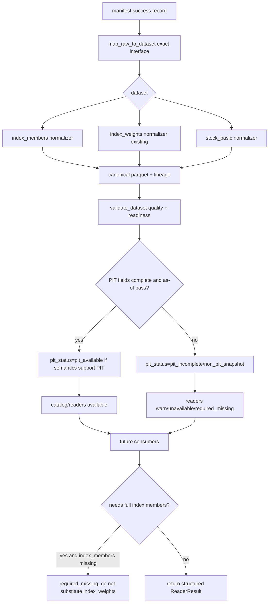

# LLD: CR007-S03 - 成分、权重与股票基础信息 readiness

> 本 LLD 只定义 `CR007-S03-index-members-stock-basic-datasets` 的可实现设计，不实现代码。CP5 批次人工确认已由用户原文 `同意` 批准，`confirmed=true`，`implementation_allowed=true`。该授权仅允许在 `dev_gate`、上游 contract、`process/STATE.md.parallel_execution.dev_running` 和共享文件所有权复核通过后进入离线代码实现调度；不授权真实 Tushare 抓取、真实 lake 写入、凭据读取或旧数据 / 旧报告操作。
>
> Ready-check 说明：Story 卡片 frontmatter 当前仍为 `status="draft"`，但 `process/STATE.md.parallel_execution.lld_design_batch`、CR-007 和 handoff 均显示 `CR007-BATCH-A` 已通过 CP3/CP4 人工确认并处于 `ready-for-lld-dispatch`。本 LLD 将其作为仅限 LLD 写作的等价待设计状态处理；实现前必须由 meta-po 回填 Story 审查态 / dev-ready 状态，当前不得实现。

## 1. Goal

为 `index_members`、`index_weights`、`stock_basic` 创建 dataset readiness 低层设计。后续实现将补齐三类 dataset 的 exact source/interface、canonical schema、key columns、PIT fields、normalizer、validator、catalog、reader 结果语义和结构化 unavailable/warn 状态，让数据层能明确回答：

- dataset 是否登记、是否有 canonical schema、是否可被 reader 只读消费。
- dataset 是否具备 PIT readiness，若不具备，必须返回 structured warn / unavailable，不得标记为 PIT available。
- `index_weights` 是否只能作为权重数据，不得自动替代完整 `index_members` 成分集。
- `stock_basic` 在用于上市 / 退市 / ST 等过滤前，是否具备 `effective_date`、`available_date`、`available_at` 或等价字段。

本 Story 不修改实验入口、不生成报告、不执行真实 Tushare 抓取、不写入 `/mnt/ugreen-data-lake`，不读取 `.env`、凭据、旧 `data/**` 或旧 `reports/data_quality_report.csv`。

## 2. Requirements（Functional / Non-Functional）

### 2.1 Functional

- 三类 dataset 必须在 contract 层有 schema registry 条目：`index_members`、`index_weights`、`stock_basic` 均定义 `columns`、`key_columns`、`pit_fields`、readiness status 字段。
- `index_members` 必须新增 canonical schema，字段至少包含 `trade_date`、`index_code`、`con_code`、`in_date`、`out_date`、`is_member`、`effective_date`、`available_date`、`available_at`、`is_pit_universe`、`pit_status`、`readiness_status`、`source`、`source_interface`、`source_run_id`、`schema_version`、`lineage_raw_checksum`。
- `index_weights` 必须继承既有 canonical schema，并增加 readiness / PIT 语义：有 `effective_date`、`available_date`、`available_at` 才允许 PIT gate；权重数据不能自动推断为完整成分集。
- `stock_basic` 必须新增 canonical schema，字段至少包含 `symbol`、`name`、`market`、`list_status`、`list_date`、`delist_date`、`effective_date`、`available_date`、`available_at`、`pit_status`、`readiness_status`、`source`、`source_interface`、`source_run_id`、`schema_version`、`lineage_raw_checksum`。
- Tushare exact registry 必须登记 `index_members.snapshot` -> provider method `index_member` -> target dataset `index_members`，以及 `stock_basic.snapshot` -> provider method `stock_basic` -> target dataset `stock_basic`；默认仍遵守 Tushare source disabled / allowlist / explicit real execution 边界。
- Tushare adapter 必须显式映射上述两个 interface，但仍仅在 source enabled、interface allowlisted、`offline=false`、credential present、`explicit_real_execution=true` 时才会进入 provider；测试使用 fake provider，不执行真实抓取。
- `normalization.py` 必须支持 `index_members` 与 `stock_basic` 的 raw/manifest success record 标准化，并保持 exact interface 冲突检查、lineage 校验、duplicate key fail fast。
- `validation.py` 必须输出三类 dataset 的 `quality_status`、`dataset_status`、`readiness_status`、`pit_status`、`issue_codes` 和 unavailable mapping；PIT 字段缺失、future availability、重复 key、lineage 缺失、schema mismatch 均可被结构化识别。
- `readers.py` 必须通过 `read_dataset(...)` 或新增轻量 readiness helper 返回 `ReaderResult(status="available" | "unavailable" | "required_missing" | "quality_failed" | "pit_failed")`，并在 issue/remediation 中暴露 `readiness_status`、`pit_status`、`is_pit_universe`。
- PIT 不完整时，`index_members` 和 `stock_basic` 的 PIT available 次数必须为 0；允许 non-PIT snapshot readiness 返回 `warn` / `unavailable`，但必须明确 `pit_status`。
- `index_weights` 自动替代 `index_members` 的次数必须为 0；任何 consumer 请求完整成分集时，如果 `index_members` 不可用，不得从 `index_weights` 静默推导。
- reader、validation、normalization 默认测试网络调用次数为 0；reader 不导入 `market_data.connectors`、`market_data.runtime`、`market_data.storage`。
- 实现偏离本 LLD 时，必须在 CP6 编码完成检查中记录偏差、原因、影响和回滚方式。

### 2.2 Non-Functional

- 安全：不得读取、打印或记录 `.env`、Tushare token、NAS 用户名、NAS 密码或真实私有路径；不得读取、列出、迁移、复制、比对或删除旧 `data/**`；不得读取或覆盖旧 `reports/data_quality_report.csv`。
- 离线性：LLD、实现测试和 reader 路径默认不联网；Tushare provider 只在显式真实执行路径中受控调用，S03 测试不得进入真实 provider。
- 可维护性：readiness 语义集中在 contracts / validation / readers，Tushare adapter 只负责 interface -> provider method 参数映射，不负责质量判定或 PIT 判定。
- 兼容性：保留现有 `index_weights` 字段和测试语义；新增 `index_members` / `stock_basic` 不破坏 `prices`、`hs300_index`、`trade_calendar`、`index_weights` 已有合同。
- 可测试性：使用 `tmp_path` lake、raw JSONL / manifest fixture、fake provider、AST import scan、reader no-write 快照；不依赖真实 token、NAS、真实数据湖、旧数据或联网。
- 性能：normalizer 和 validator 采用 pandas 批处理与 duplicate key 向量化检查；reader 按 dataset + filters 读取 canonical/catalog，不触发 connector/runtime。
- 可追溯性：quality/catalog/readers 结果必须包含 dataset、source/interface、run_id、lineage checksum 或等价 lineage 摘要；不得包含真实凭据值。

## 3. 模块拆分与职责

| 模块 / 文件组 | 职责 | 说明 |
|---|---|---|
| `market_data/contracts.py` | 定义 `index_members`、`index_weights`、`stock_basic` 的 canonical schema、key columns、PIT fields、readiness / PIT status 字段集合和 interface 常量 | `index_weights` 已有基础；本 Story 补齐 `index_members` / `stock_basic` schema registry，并让三类 dataset 的 readiness 语义可枚举。 |
| `market_data/source_registry.py` | 补齐 Tushare exact interface 到 target dataset / provider method 的登记 | `index_members.snapshot` -> `index_member`，`stock_basic.snapshot` -> `stock_basic`；source 默认仍 disabled，allowlist 精确。 |
| `market_data/connectors/tushare.py` | 增加 interface -> provider method 与参数映射 | 不改变 fail-fast 安全边界；不读取或记录 token 值；测试使用 fake provider。 |
| `market_data/normalization.py` | 将 raw/manifest success record 标准化为 `index_members` / `stock_basic` canonical parquet，并保持 `index_weights` PIT 字段校验 | exact mapping、schema mismatch、duplicate key、lineage 校验均 fail fast。 |
| `market_data/validation.py` | 扩展 generic dataset quality / readiness / PIT gate 语义 | 输出 `readiness_status`、`pit_status`、`is_pit_universe`、`issue_codes`、unavailable mapping；quality fail 阻断消费。 |
| `market_data/readers.py` | 只读消费 catalog/canonical，返回结构化 `ReaderResult` 与 readiness/PIT issue | 不导入 connector/runtime/storage；不触发 fetch/backfill；不把 `index_weights` 自动当作 `index_members`。 |
| `tests/test_cr007_index_members_stock_basic_datasets.py` | S03 primary 测试文件 | 覆盖 schema registry、registry/adapter exact mapping、normalizer、validator、reader、PIT incomplete、quality fail、no connector/runtime import、no old data/no legacy report。 |
| CR007-S01 contract | 长期 prices planner、lake root 和 coverage policy | S03 只消费其 contract；实现前需等全量 CP5 确认，不要求 S01 runtime 已执行。 |
| CR005-S02/S03 contract | 多 dataset schema、normalization、PIT fields、quality/catalog/readers 和 PIT as-of gate | S03 延续已验证的数据层合同，补齐本 Story 三类 dataset。 |

## 4. 代码结构与文件影响范围

| 动作 | 文件路径 | 变更内容 |
|---|---|---|
| 修改 | `market_data/contracts.py` | 新增 `INTERFACE_STOCK_BASIC_SNAPSHOT`；补齐 `CANONICAL_INDEX_MEMBERS_COLUMNS`、`CANONICAL_STOCK_BASIC_COLUMNS`；将 `index_members`、`stock_basic` 加入 `DATASET_SCHEMA_REGISTRY`；将 `index_members` 加入 `DATASET_PIT_FIELDS`；定义或复用 readiness / PIT status 值。 |
| 修改 | `market_data/source_registry.py` | 在 Tushare `SourceSpec.interfaces` 中登记 `index_members.snapshot` / `stock_basic.snapshot` exact interface；在 fake registry 保持测试可用的 deterministic interface，不启用真实联网。 |
| 修改 | `market_data/connectors/tushare.py` | 导入新增 interface 常量；扩展 `_provider_method(...)` 与 `_fetch_provider_rows(...)`，映射 `index_member(index_code,start_date,end_date)` 和 `stock_basic(exchange,list_status,fields)` 或等价 provider params；保持 disabled/offline/allowlist/credential/explicit gate。 |
| 修改 | `market_data/normalization.py` | 扩展 `DEFAULT_INTERFACE_DATASET_MAP`、imports、`_frame_for_dataset(...)`；新增 `_normalize_index_members_rows(...)`、`_normalize_stock_basic_rows(...)`；保持 duplicate key、available_at、lineage 和 schema mismatch fail fast。 |
| 修改 | `market_data/validation.py` | 扩展 generic quality 结果，识别 `pit_fields` 缺失、future availability、readiness status；为 `index_members` / `stock_basic` 给出 PIT / non-PIT availability mapping。 |
| 修改 | `market_data/readers.py` | 在 `read_dataset(...)` 或新增 helper 中暴露 readiness / PIT status issues；增加完整成分集读取语义时禁止从 `index_weights` 静默替代 `index_members`；保持 no connector/runtime/storage imports。 |
| 创建 | `tests/test_cr007_index_members_stock_basic_datasets.py` | 覆盖 S03 全部接口、状态、异常路径和安全边界。 |
| 禁止 | `engine/**`、`experiments/**` | 本 Story 不修改消费层实验或回测入口；实验消费属于 S04。 |
| 禁止 | `README.md`、`docs/USER-MANUAL.md`、`reports/**` | 本 Story 不修改文档或实验报告；旧质量报告处理属于 S05。 |
| 禁止 | `data/**`、`.env`、`credentials`、`/mnt/ugreen-data-lake` | 不读取、不列出、不迁移、不复制、不比对、不删除、不写入；不记录凭据或真实私有路径。 |

## 5. 数据模型与持久化设计

本 Story 不新增新的存储层级，仍使用既有 lake layout：`canonical/<dataset>/1.0/run_id=<run_id>/part-*.parquet`、`quality/**`、`catalog/**`。新增或扩展的是三类 canonical dataset schema 与 quality/catalog/readiness 字段。

| 对象 / 字段 | 类型 | 约束 | 说明 |
|---|---|---|---|
| `CANONICAL_INDEX_MEMBERS_COLUMNS` | tuple[str, ...] | required | `trade_date`、`index_code`、`con_code`、`in_date`、`out_date`、`is_member`、`effective_date`、`available_date`、`available_at`、`is_pit_universe`、`pit_status`、`readiness_status`、source/lineage 字段。 |
| `CANONICAL_INDEX_WEIGHTS_COLUMNS` | tuple[str, ...] | existing + readiness | 保留既有 `trade_date/index_code/con_code/weight/effective_date/available_date/available_at/source...`；readiness/PIT 状态由 validation/catalog/reader 暴露。 |
| `CANONICAL_STOCK_BASIC_COLUMNS` | tuple[str, ...] | required | `symbol`、`name`、`market`、`list_status`、`list_date`、`delist_date`、`effective_date`、`available_date`、`available_at`、`pit_status`、`readiness_status`、source/lineage 字段。 |
| `DATASET_KEY_COLUMNS[index_members]` | tuple[str, ...] | required | `("trade_date", "index_code", "con_code")`，与现有 contracts 保持一致。 |
| `DATASET_KEY_COLUMNS[index_weights]` | tuple[str, ...] | existing | `("trade_date", "index_code", "con_code")`。 |
| `DATASET_KEY_COLUMNS[stock_basic]` | tuple[str, ...] | existing | `("symbol",)`；若后续保留历史快照，可在新 CR 中升级为 `("available_date","symbol")` 或等价版本化 key。 |
| `DATASET_PIT_FIELDS[index_members]` | tuple[str, ...] | required | `("effective_date", "available_date", "available_at")`；缺失则 PIT 不可用。 |
| `DATASET_PIT_FIELDS[index_weights]` | tuple[str, ...] | existing | 继续使用 `("effective_date", "available_date", "available_at")`。 |
| `DATASET_PIT_FIELDS[stock_basic]` | tuple[str, ...] | existing | 继续使用 `("effective_date", "available_date", "available_at")`；若 provider 只能给当前快照，reader 必须标 non-PIT / warn。 |
| `readiness_status` | enum string | required | `available`、`warn`、`unavailable`、`required_missing`、`quality_failed`、`schema_mismatch`、`pit_incomplete`、`non_pit_snapshot`。 |
| `pit_status` | enum string | required | `pit_available`、`pit_incomplete`、`non_pit_snapshot`、`pit_failed`、`not_applicable`。 |
| `is_pit_universe` | bool | required for index members | 只有 PIT 字段完整且 as-of gate 通过时才能为 true；默认 false。 |
| `remediation_spec` | mapping | reader result | 只读建议，含 dataset/source/interface/provider_interface/start/end/dry_run/auto_execute=false；不得执行。 |

字段标准化规则：

| Dataset | Raw 字段 | Canonical 字段 | 规则 |
|---|---|---|---|
| `index_members` | `index_code`、`con_code`、`in_date`、`out_date`、`trade_date` 或 params date | canonical 成分字段 | `index_code/con_code` uppercase；`trade_date` 优先 raw，否则取 `effective_date`；`effective_date` 优先 `in_date` / raw `effective_date`；`available_at` 必填或从 manifest `finished_at` 显式派生并标 `pit_status=pit_incomplete`。 |
| `index_weights` | 既有 `trade_date/index_code/con_code/weight/...` | canonical 权重字段 | 保持现有 normalizer；缺 `available_at` fail fast。 |
| `stock_basic` | `ts_code`、`symbol`、`name`、`market`、`list_status`、`list_date`、`delist_date` | canonical 股票基础字段 | `symbol` 统一为 Tushare `ts_code` 或等价代码；若只有当前快照，`pit_status=non_pit_snapshot`，不得用于 PIT available。 |

## 6. API / Interface 设计

| 接口 / 入口 | 输入 | 输出 | 调用方 | 说明 |
|---|---|---|---|---|
| `contracts.DATASET_SCHEMA_REGISTRY` | dataset name | schema columns、key columns、pit fields | normalizer / validator / reader / tests | 三类 dataset 均可查 schema；测试：`T-S03-CONTRACT-01`。 |
| `resolve_interface("tushare", "index_members.snapshot", config)` | source、interface、allowlist config | `InterfaceSpec(target_dataset="index_members", provider_method="index_member", pit_required=True)` | runtime / tests | exact registry；未 allowlist 或大小写不匹配返回 `interface_not_allowed`；测试：`T-S03-REGISTRY-01`。 |
| `resolve_interface("tushare", "stock_basic.snapshot", config)` | source、interface、allowlist config | `InterfaceSpec(target_dataset="stock_basic", provider_method="stock_basic", pit_required=True)` | runtime / tests | 默认 source disabled；显式 config 才可 resolve；测试：`T-S03-REGISTRY-02`。 |
| `TushareAdapter.fetch(ConnectorRequest(interface="index_members.snapshot"))` | explicit request、fake provider in tests | `ConnectorResult` rows or `ConnectorError` | runtime / tests | 映射 provider method，不真实抓取；disabled/offline/missing credential gate 不变；测试：`T-S03-ADAPTER-01`。 |
| `TushareAdapter.fetch(ConnectorRequest(interface="stock_basic.snapshot"))` | explicit request、fake provider in tests | `ConnectorResult` rows or `ConnectorError` | runtime / tests | `fields` 参数可通过 request 显式传入；错误不暴露 token；测试：`T-S03-ADAPTER-02`。 |
| `map_raw_to_dataset(manifest_record)` | manifest success record | exact dataset | normalizer | 新增 interface exact mapping；target_dataset 冲突 fail fast；测试：`T-S03-MAP-01`。 |
| `normalize_run(..., dataset="index_members")` | manifest path、tmp lake、dataset | canonical parquet paths、row_count、manifest_records | CLI / tests | 标准化成分 canonical；缺 PIT 字段或 duplicate key fail fast；测试：`T-S03-NORMALIZE-01`、`T-S03-PIT-01`。 |
| `normalize_run(..., dataset="stock_basic")` | manifest path、tmp lake、dataset | canonical parquet paths、row_count、manifest_records | CLI / tests | 标准化股票基础信息；当前快照必须标 non-PIT 或 pit incomplete；测试：`T-S03-NORMALIZE-02`。 |
| `validate_dataset(dataset, lake_root, expected_range, ...)` | dataset、tmp lake、expected dates / keys、validation context | `QualityResult` | quality job / tests | 输出 readiness/PIT issue；quality fail 阻断 reader；测试：`T-S03-VALIDATE-01`、`T-S03-QUALITY-01`。 |
| `read_dataset(dataset, lake_root, filters, quality_policy, required)` | dataset、lake root、filters | `ReaderResult` | experiments / future consumers | reader 只读 canonical/catalog；quality fail / PIT incomplete structured 返回；测试：`T-S03-READER-01`、`T-S03-READER-02`。 |
| `read_index_universe(...)` 或等价 helper | `index_code`、date range、pit_policy | `ReaderResult` with `is_pit_universe` / `pit_status` | future S04 / later consumer | 若不新增 helper，则由 `read_dataset("index_members")` issue 明确表达；禁止用 `index_weights` 替代；测试：`T-S03-NO-SUBSTITUTE-01`。 |

接口错误模型：

| 状态 / error code | 触发条件 | 输出 | 自动动作 |
|---|---|---|---|
| `interface_not_allowed` | source/interface 未登记或未 allowlist | `SourceRegistryError` / `ConnectorError` | 不联网，不补注册。 |
| `source_disabled` | Tushare source 默认未启用或 `offline=true` | `ConnectorError` | 不读取 token，不联网。 |
| `schema_mismatch` | raw/canonical 缺必需字段或字段类型不可解析 | `CanonicalSchemaError` / `QualityResult.dataset_status` | 阻断 normalization 或 reader。 |
| `duplicate_key` | canonical key 重复 | `CanonicalSchemaError` / `quality_failed` | 阻断消费。 |
| `pit_incomplete` | PIT 字段缺失、`available_at` 缺失或 non-PIT snapshot | `warn` / `unavailable` / `required_missing` + issue | 不标 PIT available。 |
| `future_availability` | `available_at > decision_time` | `pit_failed` | 阻断 PIT 消费。 |
| `quality_failed` | catalog/quality 为 fail | `ReaderResult(status="quality_failed")` | 不触发 fetch/backfill。 |
| `index_members_missing` | 请求完整成分集但 `index_members` 不可用 | `required_missing` / `unavailable` | 不从 `index_weights` 自动推导。 |

## 7. 核心处理流程



核心步骤：

1. registry 阶段：新增 exact interface，只允许精确 source/interface 命中；未登记或未 allowlist 立即返回 source/interface 错误。
2. adapter 阶段：只做 request params 到 provider method 的受控映射；默认 disabled/offline，不在测试中真实抓取。
3. normalization 阶段：从 manifest success record 读取 raw fixture，执行 schema、date、lineage、duplicate key 校验，写 tmp canonical fixture。
4. validation 阶段：按 schema registry 和 PIT fields 计算 `quality_status`、`dataset_status`、`readiness_status`、`pit_status` 和 issue codes。
5. reader 阶段：只读 catalog/canonical，quality fail 阻断；PIT 不完整返回 structured warn/unavailable；完整成分集缺失时不使用 `index_weights` 代替。
6. handoff 阶段：S03 为 S04 和后续股票池消费提供 readiness contract，但 S04 才负责实验消费。

异常路径：

| 异常 | 处理 |
|---|---|
| target_dataset 与 interface mapping 冲突 | `DatasetMappingError`，不写 canonical。 |
| raw 缺 `available_at` 且无法显式派生 | normalization fail 或 readiness `pit_incomplete`，不标 PIT available。 |
| `stock_basic` 只有当前快照 | reader 可返回 non-PIT readiness，但 `pit_status=non_pit_snapshot`，`is_pit_universe=false`。 |
| `index_weights` 有数据但 `index_members` 缺失 | 完整成分集请求返回 `required_missing`，不推导。 |
| reader 找不到 catalog/canonical | `required_missing` 或 `unavailable`，只给 remediation spec，不执行补数。 |

## 8. 技术设计细节

- 关键规则：
  - exact interface 是 dataset 映射的唯一入口，禁止模糊匹配或大小写容错。
  - `index_members` 与 `index_weights` 的 key 都是 `trade_date + index_code + con_code`，但语义不同：前者是成分集合，后者是权重观测。
  - PIT available 的判定必须同时满足 PIT fields 存在、`available_at` 可解析、as-of gate 通过、readiness contract 明确允许；否则只能为 `pit_incomplete` / `non_pit_snapshot` / `pit_failed`。
  - `stock_basic` 的 `list_date` / `delist_date` 是有效期信息，不等于历史可得性证明；缺 historical availability 时不得标 PIT available。
  - `readiness_status` 与 `quality_status` 分离：quality pass 只说明文件 schema/coverage 合格，不自动说明 PIT 可用。
- 依赖选择与复用点：
  - 复用 `DATASET_SCHEMA_REGISTRY`、`validate_dataset(...)`、`read_dataset(...)`、`validate_pit_asof(...)`。
  - 复用 CR005-S02/S03 的 exact mapping、lineage、quality/catalog/readers 合同。
  - 复用 `TushareAdapter` 现有 disabled/offline/allowlist/credential/explicit gate。
- 兼容性处理：
  - `index_weights` 现有测试必须继续通过；新增 readiness 字段不要求改变已有 canonical columns，优先由 quality/catalog/reader result 表达。
  - 若新增 `INTERFACE_STOCK_BASIC_SNAPSHOT`，需同步 `__all__` 和 tests import。
  - 若 `stock_basic` raw 字段 `ts_code` 与 `symbol` 并存，canonical `symbol` 统一使用证券代码全称，避免与交易所简写混淆。
- 图示类型选择：流程图。S03 跨 contracts、registry、adapter、normalization、validation、readers、tests 7 个模块，并存在 PIT/non-PIT 异常分支，使用 Mermaid 流程图。

## 9. 安全与性能设计

| 维度 | 设计措施 | 验证方式 |
|---|---|---|
| 安全 | Tushare source 默认 disabled；adapter 保持 offline / allowlist / credential / explicit gate；S03 测试使用 fake provider，不执行真实抓取。 | `T-S03-ADAPTER-01`、`T-S03-NO-FETCH-01`。 |
| 安全 | reader / validation 不导入 `market_data.connectors`、`market_data.runtime`、`market_data.storage`，不读取 `.env` 或 token value。 | `T-S03-BOUNDARY-01` AST import scan；monkeypatch env 后断言输出不含 secret。 |
| 安全 | 不读取、列出、迁移、复制、比对、删除旧 `data/**`；不读取或覆盖旧 `reports/data_quality_report.csv`。 | `T-S03-OLD-DATA-01` 静态路径扫描 / tmp_path 快照。 |
| 安全 | remediation spec 只声明 dry-run / auto_execute=false，不自动补数。 | `T-S03-REMEDIATION-01`。 |
| 性能 | pandas 一次性构造 DataFrame，使用 duplicate key 向量化检查。 | `T-S03-NORMALIZE-01`、`T-S03-NORMALIZE-02`。 |
| 性能 | reader 只按 catalog canonical_path 或 dataset root 读取需要的 parquet，并应用 filter。 | `T-S03-READER-01`。 |
| 一致性 | schema registry 是 validation/readers 的单一字段事实源；interface map 与 source registry exact 对齐。 | `T-S03-CONTRACT-01`、`T-S03-MAP-01`。 |

## 10. 测试设计

验证入口：`uv run --python 3.11 pytest -q tests/test_cr007_index_members_stock_basic_datasets.py`

| 测试场景 | 前置条件 | 操作 | 预期结果 | 验证方式 |
|---|---|---|---|---|
| `T-S03-CONTRACT-01` schema registry 完整 | 导入 contracts | 检查三类 dataset schema、key columns、pit fields、status fields | `index_members` / `index_weights` / `stock_basic` 均可查；必需字段齐全 | pytest assertions。 |
| `T-S03-REGISTRY-01` index members exact registry | Tushare config enabled + allowlist | `resolve_interface("tushare","index_members.snapshot")` | target dataset `index_members`，provider `index_member`，pit_required true | pytest assertions。 |
| `T-S03-REGISTRY-02` stock basic exact registry | Tushare config enabled + allowlist | `resolve_interface("tushare","stock_basic.snapshot")` | target dataset `stock_basic`，provider `stock_basic`，pit_required true | pytest assertions。 |
| `T-S03-ADAPTER-01` adapter 不真实抓取且映射正确 | fake provider factory | fetch index members request | 调用 fake `index_member`；返回 rows；disabled/offline/missing credential 时返回 controlled error | fake provider call log + error assertions。 |
| `T-S03-ADAPTER-02` stock basic adapter 映射正确 | fake provider factory | fetch stock basic request | 调用 fake `stock_basic`；不泄露 token | fake provider + secret absence assertion。 |
| `T-S03-MAP-01` raw 到 dataset exact mapping | manifest records | map new interfaces | 正确映射；冲突 target_dataset 抛 `DatasetMappingError` | pytest raises。 |
| `T-S03-NORMALIZE-01` index_members 标准化 | tmp lake raw/manifest fixture | `normalize_run(..., dataset=index_members)` | parquet 字段、uppercase code、lineage、duplicate key 检查正确 | read parquet assertions。 |
| `T-S03-NORMALIZE-02` stock_basic 标准化 | tmp lake raw/manifest fixture | `normalize_run(..., dataset=stock_basic)` | canonical 字段、status、available/effective 字段、lineage 正确 | read parquet assertions。 |
| `T-S03-PIT-01` PIT 字段缺失不标 available | 缺 `available_at` 或 future availability fixture | normalize / validate / reader | 返回 `pit_incomplete` / `pit_failed` / warn/unavailable，PIT available 次数为 0 | quality result + reader issues。 |
| `T-S03-VALIDATE-01` readiness quality 输出 | 三类 canonical fixture | `validate_dataset(...)` | 输出 `readiness_status`、`pit_status`、`issue_codes`、quality status | QualityResult assertions。 |
| `T-S03-QUALITY-01` quality fail 阻断 reader | catalog quality fail | `read_dataset(...)` | `ReaderResult.status="quality_failed"`，frame is None | pytest assertions。 |
| `T-S03-READER-01` reader no-write available path | tmp canonical + catalog | `read_dataset(index_members/stock_basic/index_weights)` | available / warn 状态符合 policy；调用前后文件快照相同 | tmp_path file snapshot。 |
| `T-S03-READER-02` missing lake/catalog structured result | lake root missing or catalog missing | `read_dataset(required=True)` | `required_missing`，remediation spec auto_execute=false | pytest assertions。 |
| `T-S03-NO-SUBSTITUTE-01` weights 不替代 members | 只有 `index_weights` catalog/canonical | 请求完整 members readiness | 返回 `required_missing` / `unavailable`，不返回 members available | ReaderResult assertions。 |
| `T-S03-BOUNDARY-01` reader/validation 无 connector/runtime/storage import | AST parse files | 扫描 imports | readers/validation/catalog 不导入 forbidden modules | AST assertions。 |
| `T-S03-NO-FETCH-01` 测试网络调用 0 | monkeypatch provider/network sentinels | 执行 S03 tests | 不触发 provider/network/runtime/storage | sentinel assertions。 |
| `T-S03-OLD-DATA-01` 不触碰旧 data / legacy report | 源码静态扫描 + tmp cwd | 执行测试 | 不读取 `data/**`，不读取/覆盖 `reports/data_quality_report.csv` | AST/string scan + file snapshot。 |
| `T-S03-REMEDIATION-01` remediation 只读建议 | missing dataset result | inspect remediation | `dry_run=true` / `auto_execute=false`，不创建 raw/manifest/canonical | payload + tmp_path assertions。 |

接口到测试映射：

| 第 6 节接口 | 对应测试 |
|---|---|
| schema registry | `T-S03-CONTRACT-01` |
| `resolve_interface(...)` | `T-S03-REGISTRY-01`、`T-S03-REGISTRY-02` |
| `TushareAdapter.fetch(...)` | `T-S03-ADAPTER-01`、`T-S03-ADAPTER-02`、`T-S03-NO-FETCH-01` |
| `map_raw_to_dataset(...)` | `T-S03-MAP-01` |
| `normalize_run(...)` | `T-S03-NORMALIZE-01`、`T-S03-NORMALIZE-02`、`T-S03-PIT-01` |
| `validate_dataset(...)` | `T-S03-VALIDATE-01`、`T-S03-QUALITY-01` |
| `read_dataset(...)` / universe helper | `T-S03-READER-01`、`T-S03-READER-02`、`T-S03-NO-SUBSTITUTE-01` |

## 11. 实施步骤

| TASK-ID | 动作 | 目标文件 | 详细描述 | 对应测试 |
|---|---|---|---|---|
| CR007-S03-T1 | 修改 | `market_data/contracts.py` | 新增 / 补齐 `index_members`、`index_weights`、`stock_basic` schema registry、PIT fields、readiness/PIT status 字段、`INTERFACE_STOCK_BASIC_SNAPSHOT` 与 `__all__`。 | `T-S03-CONTRACT-01` |
| CR007-S03-T2 | 修改 | `market_data/source_registry.py` | 在 Tushare registry 中登记 `index_members.snapshot` 与 `stock_basic.snapshot` exact mapping；保持 source disabled 和 allowlist 语义。 | `T-S03-REGISTRY-01`、`T-S03-REGISTRY-02` |
| CR007-S03-T2 | 修改 | `market_data/connectors/tushare.py` | 扩展 provider method map 和 `_fetch_provider_rows(...)` 参数映射；使用 fake provider 测试；不改变真实执行门控。 | `T-S03-ADAPTER-01`、`T-S03-ADAPTER-02`、`T-S03-NO-FETCH-01` |
| CR007-S03-T3 | 修改 | `market_data/normalization.py` | 扩展 interface dataset map；实现 `_normalize_index_members_rows(...)`、`_normalize_stock_basic_rows(...)`；将二者接入 `_frame_for_dataset(...)`；保持 lineage、schema、duplicate、PIT fail fast。 | `T-S03-MAP-01`、`T-S03-NORMALIZE-01`、`T-S03-NORMALIZE-02`、`T-S03-PIT-01` |
| CR007-S03-T3 | 修改 | `market_data/validation.py` | 扩展 generic dataset readiness/PIT status 输出；识别 `pit_incomplete`、`non_pit_snapshot`、`future_availability`、`schema_mismatch`、`duplicate_key`。 | `T-S03-VALIDATE-01`、`T-S03-QUALITY-01`、`T-S03-PIT-01` |
| CR007-S03-T3 | 修改 | `market_data/readers.py` | 在 reader result issues/remediation 中暴露 readiness/PIT 语义；quality fail 阻断；禁止 `index_weights` 替代 `index_members`；保持 forbidden import scan 通过。 | `T-S03-READER-01`、`T-S03-READER-02`、`T-S03-NO-SUBSTITUTE-01`、`T-S03-BOUNDARY-01` |
| CR007-S03-T4 | 创建 | `tests/test_cr007_index_members_stock_basic_datasets.py` | 创建专项离线测试，覆盖 contracts、registry、adapter fake provider、normalizer、validator、reader、安全边界和 no old data/no legacy report。 | 全部 `T-S03-*` |

每个文件影响项均至少由一个 TASK-ID 覆盖；每个 TASK-ID 均对应可执行测试。实现必须按 TASK-ID 顺序执行，并在共享文件实现前复核 `dev_running` 与 CR007-S02 是否存在并行开发冲突。

## 12. 风险、难点与预研建议

| 风险 / 难点 | 影响 | 缓解措施 / 预研建议 |
|---|---|---|
| Story 卡片状态仍为 `draft` | LLD 输入局部状态与 STATE/CR 批次状态不一致 | 本 LLD 仅按 STATE/CR/handoff 的 `ready-for-lld-dispatch` 进入设计；CP5 和后续实现前由 meta-po 回填 Story 状态。 |
| Tushare `index_member` 字段与当前假设存在差异 | normalizer 字段映射可能需调整 | 实现使用 fake provider 明确字段；真实字段差异需在真实抓取授权后以新 CR / fix 修订，不在本 LLD 执行真实抓取。 |
| `stock_basic` 多为当前快照，历史 availability 不完整 | 若误用为 PIT 过滤会产生未来函数 | 默认 `pit_status=non_pit_snapshot` 或 `pit_incomplete`；用于 PIT 过滤前必须有 `available_at <= decision_time` 证据。 |
| `index_weights` 被消费方误作完整成分集 | 成分缺失、幸存者偏差或股票池错误 | reader / helper 明确 `index_members_missing`，测试覆盖 no substitute。 |
| S02/S03 共享 `normalization.py`、`validation.py`、`readers.py` | CP5 后并行开发可能产生文件冲突 | Development Plan 已规定 S02/S03 可并行起草 LLD，但默认不得并行开发；实现前由 meta-po 重新判定 file_conflict_free。 |
| readiness 与 quality 状态混淆 | quality pass 被误认为 PIT available | 将 `quality_status`、`dataset_status`、`readiness_status`、`pit_status` 分离并写测试。 |

### OPEN / Spike 跟踪

| ID | 类型（OPEN / Spike） | 问题 | 下一动作 | 责任方 |
|---|---|---|---|---|
| O-S03-01 | OPEN | Story 卡片 frontmatter `status="draft"`，但 STATE/CR/handoff 已放行 CR007-BATCH-A LLD。 | meta-po 在批次收敛时回填 Story 为 `lld-ready-for-review` 或等价审查态；实现前必须进入 `lld-approved` / `dev-ready`。 | meta-po |
| O-S03-02 | Spike | Tushare `index_member` 真实字段是否完全覆盖 `in_date/out_date/trade_date`。 | 不在本轮真实抓取；实现用 fake provider 固化合同，真实执行授权后若字段不兼容，创建 fix/CR。 | meta-dev / data owner |
| O-S03-03 | OPEN | `stock_basic` 是否允许作为 PIT 过滤输入。 | 默认不允许 PIT available；若后续需要历史状态过滤，必须补 historical availability source 或新 Story。 | user / meta-se |
| O-S03-04 | OPEN | S04 是否直接消费 S03 readiness helper。 | S04 LLD 决定实验消费接口；S03 只提供 reader/result contract，不修改实验。 | meta-dev S04 |

## 13. 回滚与发布策略

- 发布方式：随 CR007-S03 实现以普通代码变更发布；默认只新增 schema/interface/readiness 能力和测试，不执行真实数据作业。
- 回滚触发条件：
  - 新增 interface 破坏既有 `prices`、`hs300_index`、`trade_calendar`、`index_weights` 测试。
  - reader 出现 connector/runtime/storage import 或触发网络 / fetch / backfill。
  - PIT incomplete 被标为 PIT available。
  - `index_weights` 被自动替代 `index_members`。
- 回滚动作：
  - 回退 `contracts.py` 中新增 `index_members` / `stock_basic` schema registry 与 interface 常量。
  - 回退 source registry 与 Tushare adapter 的新增 interface 映射。
  - 回退 normalization / validation / readers 的新增分支。
  - 保留测试中暴露的安全边界用例，作为后续修复输入。
- 数据回滚：本 Story 不授权真实 lake 写入，不读取旧 `data/**` 或旧报告，因此无需迁移、清理或恢复真实数据。
- 文档回滚：本 Story 不修改 README / USER-MANUAL / reports；文档回滚不适用。

## 14. Definition of Done

- [ ] 14 个可见章节全部填写完成。
- [x] `confirmed=true`、`implementation_allowed=true`，CP5 全量人工确认已通过。
- [x] `CR007-BATCH-A` 五份 LLD 与 CP5 自动预检全部完成，并由 meta-po 回填 `checkpoints/CP5-CR007-BATCH-A-LLD-BATCH.md` 人工确认。
- [ ] `index_members`、`index_weights`、`stock_basic` 均定义 key columns、required columns、readiness status 和 PIT status。
- [ ] Tushare exact registry 和 adapter mapping 覆盖 `index_members.snapshot`、`index_weights.snapshot`、`stock_basic.snapshot`，且默认真实抓取次数为 0。
- [ ] normalizer 支持 `index_members` / `stock_basic`，并保留 `index_weights` PIT 字段 fail fast。
- [ ] validator 输出 `quality_status`、`dataset_status`、`readiness_status`、`pit_status`、issue codes 和 unavailable mapping。
- [ ] reader quality fail 阻断消费；PIT 不完整返回 warn/unavailable，不返回 PIT available。
- [ ] `index_weights` 自动替代 `index_members` 次数为 0。
- [ ] reader 导入 connector/runtime/storage 次数为 0。
- [ ] 旧 `data/**`、`.env`、token、NAS 凭据、旧 `reports/data_quality_report.csv` 操作次数为 0。
- [ ] `uv run --python 3.11 pytest -q tests/test_cr007_index_members_stock_basic_datasets.py` 在离线 fixture 下通过。
- [ ] 实现如偏离本 LLD，CP6 必须记录偏差、原因、影响与回滚方式。

## 人工确认区

> **CP5 - Story LLD 可实现性门**
> meta-dev 先写入 `process/checks/CP5-CR007-S03-index-members-stock-basic-datasets-LLD-IMPLEMENTABILITY.md` 自动预检结果。
> meta-po 收齐 `CR007-BATCH-A` 五份 LLD 和五份 CP5 自动预检后，再生成并提示用户审查 `checkpoints/CP5-CR007-BATCH-A-LLD-BATCH.md`。
> 用户统一确认全部目标 Story 的 LLD 后，仍需满足当前 Wave、依赖门控与文件所有权门控方可进入实现。

**CP5 checklist 摘要**：

| # | 检查项 | 状态 | 证据 |
|---|---|---|---|
| 1 | LLD 覆盖 AC | 待批次检查 | 第 2 / 10 / 14 节 |
| 2 | 与 HLD / ADR 一致 | 待批次检查 | 第 3 / 8 / 12 节 |
| 3 | 文件影响范围明确 | 待批次检查 | 第 4 / 11 节 |
| 4 | 接口契约完整 | 待批次检查 | 第 6 节 |
| 5 | 测试与 dev_gate 可计算 | 待批次检查 | 第 10 / 14 节 |

**人工确认回复**：

请直接回复以下任一整行：

```text
approve
修改: <具体修改点>
reject
```

- `approve`：LLD 设计合理，允许进入后续批次门控；仍不代表立即实现，必须满足批次 CP5 和 dev_gate。
- `修改: <具体修改点>`：指出具体修改点后由 meta-dev 更新重提。
- `reject`：设计方向有根本问题，需重新设计。

**人工审查结果回填**：

- 结论：`approved | changes_requested | rejected`
- 审查人：
- 审查时间：
- 修改意见：
- 风险接受项：
