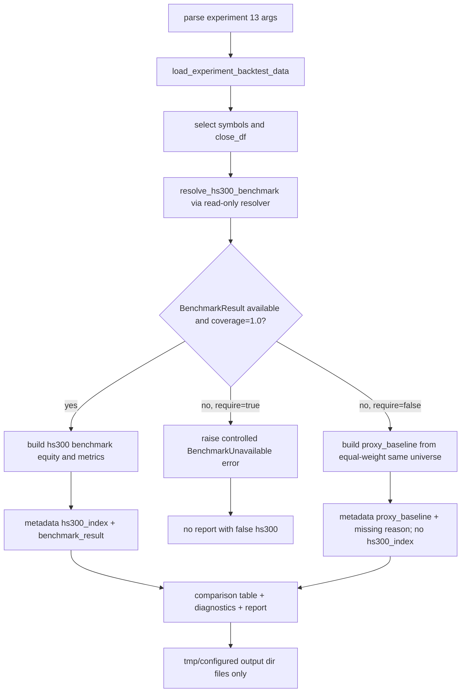

# LLD: CR007-S04 - 实验真实 benchmark 消费

> 本文档仅定义 `CR007-S04-experiment-real-benchmark-consumption` 的低层设计，不实现代码。CP5 批次人工确认已由用户原文 `同意` 批准，`confirmed=true`，`implementation_allowed=true`。该授权仅允许在当前 Story `dev_gate`、S02/S03 contract、`process/STATE.md.parallel_execution.dev_running` 和文件所有权复核通过后进入离线代码实现调度；不授权真实 Tushare 抓取、真实 lake 写入、凭据读取或旧数据 / 旧报告操作。
>
> Ready-check 说明：Story 卡片 frontmatter 当前为 `status="draft"`，但 `process/STATE.md.parallel_execution.lld_design_batch.status="ready-for-lld-dispatch"`、CR-007 `approval_result="approved-for-cr007-batch-a-lld"` 与 handoff 均显示 `CR007-BATCH-A` 已通过 CP3/CP4 人工确认并处于 LLD 写作调度态。本 LLD 将其作为仅限 LLD 写作的等价待设计状态处理；实现前必须由 meta-po 回填 Story 审查态 / dev-ready 状态，当前不得实现。

## 1. Goal

修改实验十三，使其在真实 `hs300_index` benchmark 可用且 coverage 合格时优先使用真实沪深300基准；真实 benchmark 不可用、policy 未确认、coverage gap、quality fail 或与价格区间无重叠时，仅保留同股票池等权代理为 `proxy_baseline` 对照，不填充 `hs300_index` 字段，不声明沪深300超额收益。

同时复核实验十和实验十二的 benchmark 参数、metadata 与 CR-007 policy 一致；必要时仅做兼容性小改，确保三者在 missing 语义、`BenchmarkResult.to_metadata()`、`proxy_baseline` 隔离和 no-network/no-connector 边界上保持一致。

本 Story 不修改数据抓取层，不执行真实 Tushare 抓取，不写入 `/mnt/ugreen-data-lake`，不读取 `.env`、token、NAS 凭据、旧 `data/**` 或旧 `reports/data_quality_report.csv`。

## 2. Requirements（Functional / Non-Functional）

### 2.1 Functional

- 实验十三新增 benchmark CLI 参数，与实验十/十二保持一致：`--benchmark-kind`、`--require-benchmark`、`--allow-benchmark-warn`；复用既有 `--market-data-lake-root`、`--input-mode`、`--data-dir`。
- 实验十三新增只读 benchmark 解析流程：调用 `resolve_hs300_benchmark(...)` 或 S02 冻结后的等价接口，输入 `lake_root`、`start_date`、`end_date`、`benchmark_kind`、`required`、`allow_warn`、可选 `price_trade_dates`。
- 当 `BenchmarkResult.status="available"`、`dataset="hs300_index"`、`coverage.ratio == 1.0` 且真实 frame 可用时，实验十三使用 `hs300_index` 构建 benchmark equity、benchmark metrics 和 comparison table 的 benchmark 列。
- 真实 benchmark available 路径必须输出不少于 8 个 hs300 metadata 字段，至少包含 `status`、`dataset`、`index_code`、`interface`、`start_date`、`end_date`、`coverage`、`quality_status`、`benchmark_kind`、`lineage`。
- 当真实 benchmark 不可用时，实验十三必须输出 `benchmark_result` / `benchmark_status` / `benchmark_missing_reason`，并仅将同股票池等权基准命名为 `proxy_baseline`；填充 `hs300_index` 字段次数为 0。
- 当 `--require-benchmark` 启用且真实 benchmark 不可用时，实验十三必须采用确定性策略：默认 fail fast，抛出包含 `BenchmarkResult.status` 与 `missing_reason` 的受控错误；不写 hs300 equity，不声明真实 benchmark。
- 实验十三报告和 CSV 字段必须区分真实 benchmark 与 proxy：真实路径使用 `沪深300` 或 `hs300_index` 命名；代理路径使用 `proxy_baseline` / `基准代理（同股票池等权）` 命名。
- 实验十/十二复核项：若当前 metadata 已符合 CR-007，只保留行为；若缺少 S02 增量字段或 missing reason，需要补充只增不删字段，保持既有调用兼容。
- `market_data/benchmarks.py` 仅允许补充消费侧所需 metadata helper 或可选 `price_trade_dates` 参数兼容胶水；不得加入 connector/runtime/storage 导入，不得触发 backfill，不得修改数据抓取层。
- 创建 `tests/test_cr007_experiment_real_benchmark_consumption.py`，覆盖真实 available、required missing fail-fast、optional missing proxy_baseline、实验十/十二 metadata 兼容、no network/no connector/no old data/no legacy report。

### 2.2 Non-Functional

- 安全：不读取、打印或记录 `.env`、Tushare token、NAS 用户名、NAS 密码或真实私有路径；不读取、列出、迁移、复制、比对或删除旧 `data/**`；不读取或覆盖旧 `reports/data_quality_report.csv`。
- 离线性：所有测试使用 `tmp_path`、monkeypatch resolver、内存 DataFrame 和 tmp output dir；真实 Tushare 调用次数、connector/runtime/storage 调用次数、真实 lake 写入次数均为 0。
- 兼容性：实验十/十二已有 CLI 和 metadata 行为不破坏；`BenchmarkResult.to_metadata()` 只新增字段，不删除字段。
- 可测试性：新增测试可通过 `uv run --python 3.11 pytest -q tests/test_cr007_experiment_real_benchmark_consumption.py` 单独执行；必要回归测试覆盖 `tests/test_market_data_hs300_benchmark.py`。
- 可追溯性：报告和 metadata 必须保留 `benchmark_status`、`benchmark_missing_reason`、`benchmark_kind`、`coverage`、`lineage` 或 structured unavailable 证据。
- 性能：真实 benchmark equity 构建只对 `close_df.index` 与 benchmark frame 做一次索引对齐，复杂度 O(price_days + benchmark_rows)，不引入网络、后台任务或额外常驻进程。

## 3. 模块拆分与职责

| 模块 / 文件组 | 职责 | 说明 |
|---|---|---|
| `experiments/run_experiment_13.py` | 主实现文件；新增真实 benchmark CLI、解析、metadata、comparison/report 输出和 proxy fallback | 当前事实：该文件只调用 `build_equal_weight_benchmark` 并输出 `benchmark_proxy_equity_curve.csv`；S04 将真实 hs300 作为优先路径，代理仅为 `proxy_baseline` |
| `experiments/run_experiment_10.py` | 复核 / 必要时小改实验十 benchmark metadata | 当前已有 `resolve_benchmark_for_experiment` 和 `apply_benchmark_metadata_experiment_10`；S04 只允许补齐 CR-007 missing reason / S02 字段，不改变扫描逻辑 |
| `experiments/run_experiment_12.py` | 复核 / 必要时小改实验十二 benchmark metadata | 当前已有 `resolve_benchmark_for_experiment`、`apply_benchmark_metadata_experiment_12` 和 `proxy_baseline` 隔离；S04 保持语义一致 |
| `market_data/benchmarks.py` | 只读 BenchmarkResult 合同；可补 S04 所需 metadata helper 或 optional `price_trade_dates` 兼容 | 该文件不属于数据抓取层；不得导入 connector/runtime/storage，不得执行 backfill；S02 是 benchmark/calendar coverage 主合同 |
| `tests/test_cr007_experiment_real_benchmark_consumption.py` | S04 离线专项测试 | 使用 monkeypatch / tmp output；不需要 token、NAS、真实 lake、旧数据或真实抓取 |
| S02 contract | `BenchmarkResult`、trade calendar denominator、price overlap gate、coverage/missing reason | 已有 LLD/CP5；S04 实现前需等待 S02 confirmed 或等价 contract frozen |
| S03 contract | dataset readiness / PIT status / proxy 说明字段边界 | 已有 LLD/CP5；S04 只消费 readiness metadata，不修改 dataset 接入 |

## 4. 代码结构与文件影响范围

| 动作 | 文件路径 | 变更内容 |
|---|---|---|
| 修改 | `experiments/run_experiment_13.py` | 新增 benchmark args；新增 `resolve_benchmark_for_experiment_13(...)`、`apply_benchmark_metadata_experiment_13(...)`、`build_experiment_13_benchmark(...)`、`build_hs300_benchmark_equity(...)` 或等价 helper；available 时使用真实 hs300 metrics/equity，missing 时使用 `proxy_baseline`；报告文案按真实 / proxy 分支输出 |
| 修改 | `experiments/run_experiment_10.py` | 复核并仅在必要时补齐 metadata 字段：`benchmark_missing_reason`、`benchmark_relative_return_enabled`、S02 新增 coverage denominator / price overlap 字段；不改参数扫描与样本内外逻辑 |
| 修改 | `experiments/run_experiment_12.py` | 复核并仅在必要时补齐 metadata 字段：`benchmark_missing_reason`、`hs300_relative_return_enabled=false`、`proxy_baseline` 保留；不改分段回测逻辑 |
| 修改 | `market_data/benchmarks.py` | 如 S02 未覆盖 S04 所需字段，则新增只读 helper / optional keyword-only 参数；只允许消费侧 metadata 增量，不允许数据抓取、写湖或 connector/runtime/storage import |
| 创建 | `tests/test_cr007_experiment_real_benchmark_consumption.py` | 覆盖真实 available、required_missing、optional missing proxy fallback、实验十/十二 metadata 一致、no network/no connector/no old data/no legacy report、报告字段命名 |
| 禁止 | `market_data/connectors/**`、`market_data/runtime.py`、`market_data/storage.py` | 本 Story 不修改数据抓取层、runtime 或 storage |
| 禁止 | `data/**`、`reports/**`、`.env`、`credentials`、`delivery/**` | 不读取、不覆盖、不迁移、不复制、不比对、不删除；测试输出只能写 tmp output dir |

## 5. 数据模型与持久化设计

本 Story 不新增数据库、不新增 lake 层级、不新增真实持久化目录。新增或规范的是实验十三报告 / CSV / metadata 中的字段约定；实现和测试仅写 `tmp_path` 下的临时输出。

| 对象 / 字段 | 类型 | 约束 | 说明 |
|---|---|---|---|
| `benchmark_result` | `dict` | 来自 `BenchmarkResult.to_metadata()` | 所有路径均可写入 metadata；不得含 token 或真实凭据值 |
| `benchmark_dataset` | `str` | available 真实路径固定 `hs300_index`；proxy 路径可为空或 `proxy_baseline` | 不允许用 proxy 填充 `hs300_index` |
| `benchmark_status` | `str` | `available`、`unavailable`、`required_missing`、`quality_failed` | 透传 resolver 状态 |
| `benchmark_missing_reason` | `str | None` | missing 时必填 | 来自 `BenchmarkResult.missing_reason`，如 `policy_unconfirmed`、`coverage_gap`、`calendar_missing`、`price_benchmark_overlap_missing` |
| `benchmark_kind` | `str` | `price_index`、`total_return_index`、`adjusted_index`、`policy_unconfirmed` | 与 CLI 参数和 policy 对齐 |
| `hs300_index` | `dict` | 仅 `BenchmarkResult.available is True` 时存在 | 真实 hs300 metadata；缺失或 proxy 路径必须不存在 |
| `hs300_relative_return_enabled` | `bool` | 仅真实 available 时为 true | 缺真实 hs300 时为 false |
| `proxy_baseline` | `dict | None` | 缺真实 benchmark 时可填；真实 available 时可为空或仅记录 not_used | 同股票池等权基准；不得声明为沪深300 |
| `benchmark_label` | `str` | `沪深300` 或 `基准代理（同股票池等权）` | 决定 comparison table benchmark 列和报告文案 |
| `benchmark_equity_path` | `str` | tmp / configured output dir 下 CSV path | available 写 `hs300_benchmark_equity_curve.csv`；proxy 写 `benchmark_proxy_equity_curve.csv` |

CSV / Markdown 输出约定：

| 输出 | 真实 hs300 available | 缺真实 benchmark |
|---|---|---|
| `cross_strategy_comparison.csv` benchmark 列 | `沪深300` 或 `hs300_index` | `基准代理（同股票池等权）` |
| excess return 行 | 可写 `vs 沪深300超额收益` 或明确 benchmark label | 只能写 `vs proxy_baseline 超额收益` 或保留原 `vs 基准超额收益` 但报告说明为 proxy；不得写沪深300 |
| equity CSV | `hs300_benchmark_equity_curve.csv` | `benchmark_proxy_equity_curve.csv` |
| report data section | 说明真实 `hs300_index`、coverage、quality、lineage | 说明 `proxy_baseline`、missing reason、不可声明沪深300 |

## 6. API / Interface 设计

| 接口 / 入口 | 输入 | 输出 | 调用方 | 说明 |
|---|---|---|---|---|
| CLI `run_experiment_13.py` benchmark args | `--market-data-lake-root`、`--benchmark-kind`、`--require-benchmark`、`--allow-benchmark-warn` | `argparse.Namespace` | 用户 / tests | 与实验十/十二保持一致；测试 `T-S04-CLI-01` |
| `resolve_benchmark_for_experiment_13(...)` | `lake_root`、`start_date`、`end_date`、`benchmark_kind`、`required`、`allow_warn`、`price_trade_dates` | `BenchmarkResult | None` | `main()` / tests | 不配置 lake_root 且非 required 时返回 None；required 时返回 typed missing 或 fail-fast 前置结果；测试 `T-S04-RESOLVE-01` |
| `apply_benchmark_metadata_experiment_13(result, metadata, proxy_info)` | `BenchmarkResult | None`、既有 metadata、proxy metadata | 新 metadata dict | `main()` / tests | available 写 `hs300_index`；missing 移除 `hs300_index` 并写 `proxy_baseline` / missing reason；测试 `T-S04-METADATA-01/02` |
| `build_hs300_benchmark_equity(result, price_index, initial_cash)` | available `BenchmarkResult.frame`、价格交易日 index、initial cash | `{"name","metrics","equity"}` | `build_experiment_13_benchmark(...)` | 只读 frame；按价格交易日对齐并归一到 initial_cash；coverage 不合格则拒绝；测试 `T-S04-REAL-01` |
| `build_experiment_13_benchmark(close_df, initial_cash, result, require_benchmark)` | price close_df、cash、resolver result、required flag | benchmark payload + metadata | `main()` / tests | available 使用真实 hs300；optional missing 使用 proxy；required missing fail fast；测试 `T-S04-REAL-01`、`T-S04-REQUIRED-01`、`T-S04-PROXY-01` |
| `build_comparison_table(...)` | benchmark metrics、strategy rows、decay、benchmark label | comparison rows | `main()` / tests | benchmark 列随 label 切换；proxy 时不得出现 `hs300_index` benchmark 字段；测试 `T-S04-COMPARISON-01` |
| `write_markdown_report(...)` | comparison rows、diagnostics、market rows、paths、benchmark metadata | Markdown report path | `main()` / tests | 文案按真实 / proxy 分支；不得读取旧 report；测试 `T-S04-REPORT-01` |
| `apply_benchmark_metadata_experiment_10/12(...)` | `BenchmarkResult | None`、metadata | metadata dict | 实验十/十二 / tests | 只增不删字段；保持 proxy / hs300 分离；测试 `T-S04-EXP10-12-01` |

接口错误模型：

| 状态 / error code | 触发条件 | 输出 | 自动动作 |
|---|---|---|---|
| `policy_unconfirmed` | `benchmark_kind=policy_unconfirmed` 或 policy 未确认 | optional 为 proxy fallback；required 为受控失败 | 不执行 fetch/backfill |
| `calendar_missing` | S02 无 trade_calendar open dates | `benchmark_status=required_missing/unavailable`、`benchmark_missing_reason=calendar_missing` | 不用自然日 denominator |
| `coverage_gap` | `hs300_index` 缺 open trade dates | missing metadata；proxy optional | 不用 proxy 填 `hs300_index` |
| `price_benchmark_overlap_missing` | S02 price overlap gate 显示无同区间价格 / benchmark | missing metadata；required fail fast | 不声明沪深300 |
| `quality_failed` | quality/catalog/lineage 不合格 | status `quality_failed`；required fail fast | 不使用 frame |
| `connector_import_detected` | 实验或 benchmark helper 导入 connector/runtime/storage | 测试失败，CP6 不可交付 | 不允许豁免 |

## 7. 核心处理流程



核心步骤：

1. `parse_args()` 在保留现有参数的基础上增加 benchmark policy 参数，与实验十/十二一致。
2. `main()` 读取 canonical/gold 或显式 legacy-flat 输入后，选择实验十三股票池，形成 `close_df` 和 `price_trade_dates`。
3. 调用只读 resolver。若 S02 已实现可选 `price_trade_dates`，S04 必须传入；若 S02 合同最终改名，S04 实现按 confirmed LLD 调整，不自行推断。
4. resolver 返回 None：表示用户未配置 lake_root 且未要求 benchmark；实验十三走 proxy_baseline，并在 metadata 写明 `benchmark_status="not_requested"` 或等价非 hs300 状态。
5. resolver 返回 available：校验 dataset 为 `hs300_index`、coverage ratio 为 1.0、frame 非空、lineage 可追溯；构建 hs300 benchmark equity 并写真实 benchmark metadata。
6. resolver 返回非 available 且 `--require-benchmark` 启用：抛出受控错误，错误消息含 status 和 missing reason，不写虚假 hs300 输出。
7. resolver 返回非 available 且 optional：构建 `proxy_baseline`，写 proxy equity CSV 和 missing reason，comparison/report 不声明沪深300。
8. 复核实验十/十二：保持现有 resolver 只读路径和 metadata 分离；如 S02 新增字段已在 `BenchmarkResult.to_metadata()` 中出现，则直接透传。

异常路径：

- `lake_root_missing`：不读取 `.env` 内容；optional 走 proxy，required 受控失败或 typed required_missing。
- `policy_unconfirmed`：不得通过 proxy 填充 hs300；report 必须说明 policy 未确认。
- `coverage_gap` / `calendar_missing`：不使用自然日 denominator；不声明真实 benchmark。
- `quality_failed` / `lineage_unavailable`：不消费 frame；required fail fast。
- `experiment_10/12 input missing`：`load_decay_by_strategy` / `load_market_segment_rows` 可继续返回空表；不读取旧质量报告。

## 8. 技术设计细节

- 关键算法 / 规则：
  - `price_trade_dates = [str(date) for date in close_df.index]`，传给 S02 resolver 的可选 overlap gate。
  - 真实 hs300 equity 使用 `BenchmarkResult.frame[["trade_date","close"]]`，按 `price_trade_dates` 过滤、排序并 forward-fill 只限于已有交易日内对齐；首个有效 close 必须大于 0。
  - `nav = hs300_close / first_valid_close`，`total_value = nav * initial_cash`，复用 `calculate_series_metrics` 或现有等价指标函数计算 metrics。
  - `BenchmarkResult.coverage.ratio` 必须等于 1.0；缺任一 open date 不进入真实 available 输出。
  - proxy fallback 仍复用 `build_equal_weight_benchmark(close_df, initial_cash)`，但输出 name 和 metadata 必须为 `proxy_baseline`。
- 依赖选择与复用点：
  - 复用 `market_data.benchmarks.BenchmarkPolicy`、`BenchmarkResult`、`resolve_hs300_benchmark`。
  - 复用实验十/十二现有参数名、policy 构造和 metadata 分离语义。
  - 复用实验六/七中的 `build_equal_weight_benchmark` 作为 proxy 计算函数，但不再把它称为真实基准。
  - 复用 `write_rows_csv`、现有 comparison/report 输出结构，避免引入新报告框架。
- 兼容性处理：
  - `build_comparison_table(...)` 可新增 `benchmark_label` keyword-only 参数，默认保持旧列名，测试再验证真实 hs300 分支。
  - 实验十/十二 helper 只做字段增量，不改函数签名；如必须新增参数，使用 keyword-only 默认值。
  - `market_data/benchmarks.py` 的 `resolve_hs300_benchmark` 若新增 `price_trade_dates`，必须为 keyword-only 默认 `None`，不破坏 CR005 测试。
  - 输出路径保留旧 proxy 文件名；真实路径新增 `hs300_benchmark_equity_curve.csv`，不得覆盖旧报告或旧 quality report。
- 图示类型选择：流程图。S04 横跨实验入口、benchmark resolver、metadata、comparison/report 和异常分支，流程图可直接表达 available / required missing / optional proxy 三条路径。

## 9. 安全与性能设计

| 维度 | 设计措施 | 验证方式 |
|---|---|---|
| 安全 | 实验十三、实验十、实验十二和 `market_data/benchmarks.py` 禁止导入 `market_data.connectors`、`market_data.runtime`、`market_data.storage`、网络库 | `T-S04-BOUNDARY-01` AST import scan |
| 安全 | 不读取 `.env`、token、NAS 凭据；测试 monkeypatch 假 token 后断言输出不含该值 | `T-S04-SECRET-01` |
| 安全 | 不读取、列出、迁移、复制、比对、删除旧 `data/**`；不读取或覆盖旧 `reports/data_quality_report.csv` | `T-S04-OLD-DATA-01` 静态路径和 tmp output 快照 |
| 安全 | required missing fail fast，不写虚假 hs300 output | `T-S04-REQUIRED-01` |
| 安全 | optional missing 只能写 `proxy_baseline`，`hs300_index` metadata 不存在 | `T-S04-PROXY-01` |
| 性能 | hs300 equity 使用索引过滤和向量化计算，复杂度 O(n)，不循环调用 resolver | `T-S04-REAL-01` 断言 resolver 调用次数为 1 |
| 兼容性 | 实验十/十二既有 metadata 行为继续通过 | `T-S04-EXP10-12-01` 与 `tests/test_market_data_hs300_benchmark.py` |
| 可追溯性 | metadata 至少 8 个 hs300 字段；missing path 有 reason 和 remediation spec | `T-S04-METADATA-01/02` |

## 10. 测试设计

验证入口：`uv run --python 3.11 pytest -q tests/test_cr007_experiment_real_benchmark_consumption.py`

| 测试场景 | 前置条件 | 操作 | 预期结果 | 验证方式 |
|---|---|---|---|---|
| `T-S04-CLI-01` 实验十三 CLI 参数 | 导入 `parse_args` 或 monkeypatch argv | 传入 `--market-data-lake-root`、`--benchmark-kind price_index`、`--require-benchmark`、`--allow-benchmark-warn` | args 字段与实验十/十二命名一致 | pytest assertions |
| `T-S04-REAL-01` 真实 benchmark available | monkeypatch resolver 返回 available `BenchmarkResult`，frame 覆盖 price dates，coverage=1.0 | 构建 benchmark payload / 运行 main 到 tmp output | 使用 hs300 metrics；写 `hs300_benchmark_equity_curve.csv`；proxy 使用次数为 0 | tmp output + resolver call log |
| `T-S04-METADATA-01` available metadata | available result metadata 含 lineage/coverage | 调用 `apply_benchmark_metadata_experiment_13` | `hs300_index` 存在且字段不少于 8 个；`benchmark_status=available`；`hs300_relative_return_enabled=true` | dict assertions |
| `T-S04-REQUIRED-01` required missing fail fast | monkeypatch resolver 返回 `required_missing` / `coverage_gap` | 以 `require_benchmark=True` 构建 benchmark 或运行 main | 抛受控错误；错误含 status/reason；不写 hs300/proxy equity | pytest raises + tmp snapshot |
| `T-S04-PROXY-01` optional missing proxy fallback | resolver 返回 unavailable / policy_unconfirmed，required=False | 构建 benchmark payload / 运行 main 到 tmp output | 写 `benchmark_proxy_equity_curve.csv`；metadata 有 `proxy_baseline`、missing reason；`hs300_index` 不存在 | output + metadata assertions |
| `T-S04-COMPARISON-01` comparison 字段命名 | 构造 strategy rows 与真实 / proxy 两类 benchmark | 调用 `build_comparison_table` | 真实路径 benchmark 列为 hs300 label；proxy 路径不出现 `hs300_index` 填充 | CSV row assertions |
| `T-S04-REPORT-01` report 文案 | tmp output，真实 / proxy 两类 metadata | 调用 `write_markdown_report` | 真实路径说明 coverage/lineage；proxy 路径说明不是真实沪深300；不读取旧报告 | report text assertions |
| `T-S04-EXP10-12-01` 实验十/十二 metadata 一致 | available 和 missing 两类 result | 调用 `apply_benchmark_metadata_experiment_10/12` | available 写 hs300；missing 移除 hs300 并禁用 relative return；proxy 不混入 hs300 | dict assertions |
| `T-S04-BOUNDARY-01` no connector/runtime/storage import | AST parse S04 相关文件 | 扫描 imports | 实验十/十二/十三和 benchmarks 无 forbidden imports | AST assertions |
| `T-S04-SECRET-01` 不泄露凭据 | monkeypatch 假 token / NAS 字符串 | 运行 helper 输出 metadata/report | 输出不含假 secret | string assertions |
| `T-S04-OLD-DATA-01` 不触碰旧数据/旧报告 | tmp cwd / path sentinels | 运行专项测试 | 不访问 `data/**`；不读取或覆盖 `reports/data_quality_report.csv`；真实 lake 写入 0 | monkeypatch `Path.open` / static scan / tmp snapshot |

接口到测试映射：

| 第 6 节接口 | 对应测试 |
|---|---|
| CLI benchmark args | `T-S04-CLI-01` |
| `resolve_benchmark_for_experiment_13(...)` | `T-S04-RESOLVE-01` 或 `T-S04-REAL-01` resolver call assertions |
| `apply_benchmark_metadata_experiment_13(...)` | `T-S04-METADATA-01`、`T-S04-PROXY-01` |
| `build_hs300_benchmark_equity(...)` | `T-S04-REAL-01` |
| `build_experiment_13_benchmark(...)` | `T-S04-REAL-01`、`T-S04-REQUIRED-01`、`T-S04-PROXY-01` |
| `build_comparison_table(...)` | `T-S04-COMPARISON-01` |
| `write_markdown_report(...)` | `T-S04-REPORT-01` |
| `apply_benchmark_metadata_experiment_10/12(...)` | `T-S04-EXP10-12-01` |

## 11. 实施步骤

| TASK-ID | 动作 | 目标文件 | 详细描述 | 对应测试 |
|---|---|---|---|---|
| CR007-S04-T1 | 修改 | `experiments/run_experiment_13.py` | 新增 benchmark CLI 参数、resolver 调用、metadata 分支、真实 hs300 benchmark equity、required missing fail-fast、proxy_baseline fallback、report/comparison label 分支 | `T-S04-CLI-01`、`T-S04-REAL-01`、`T-S04-REQUIRED-01`、`T-S04-PROXY-01`、`T-S04-COMPARISON-01`、`T-S04-REPORT-01` |
| CR007-S04-T2 | 修改 | `experiments/run_experiment_10.py` / `experiments/run_experiment_12.py` | 复核并补齐 CR-007 metadata 一致性；仅新增 missing reason / relative return flag / S02 coverage 字段透传，不改回测逻辑 | `T-S04-EXP10-12-01`、既有 `tests/test_market_data_hs300_benchmark.py` |
| CR007-S04-T3 | 修改 | `market_data/benchmarks.py` | 如 S02 confirmed LLD 要求，新增 optional `price_trade_dates` 或 metadata helper；保持 `BenchmarkResult` 向后兼容和 no connector/runtime/storage imports | `T-S04-REAL-01`、`T-S04-BOUNDARY-01`、S02 回归测试 |
| CR007-S04-T4 | 创建 | `tests/test_cr007_experiment_real_benchmark_consumption.py` | 创建离线专项测试，覆盖真实 available、required missing、proxy fallback、实验十/十二 metadata、import 边界、secret absence、no old data/no legacy report/no real lake write | 全部 `T-S04-*` |

每个文件影响项均至少由一个 TASK-ID 覆盖；每个 TASK-ID 均有对应测试入口。实现必须按 T1 -> T4 顺序执行；若 T3 发现 S02 resolver contract 未冻结或字段冲突，必须停止并回到 CP5 修改 LLD，不得自行改数据抓取层。

## 12. 风险、难点与预研建议

| 风险 / 难点 | 影响 | 缓解措施 / 预研建议 |
|---|---|---|
| Story 卡片状态仍为 `draft` | LLD 输入局部状态与 STATE/CR 批次状态不一致 | 本 LLD 仅按 STATE/CR/handoff 的 `ready-for-lld-dispatch` 进入设计；CP5 和后续实现前由 meta-po 回填 Story 状态 |
| S02 `price_trade_dates` / overlap gate 尚未 confirmed | S04 真实 benchmark 是否能证明与 `close_df` 同区间可能存在接口漂移 | S04 将 S02 LLD 作为 contract dependency；实现前等待 S02 confirmed，并按最终接口名调整 |
| 实验十三 report 现有文案固定写“当前没有沪深300指数行情文件” | 真实 available 后报告会自相矛盾 | T1 必须改为按 benchmark status 分支输出；测试覆盖真实 / proxy 两种文案 |
| `build_comparison_table` 现有列名固定为“基准代理（同股票池等权）” | 真实 benchmark available 时 CSV 仍可能误标为代理 | 新增 benchmark label 分支；真实路径禁止使用 proxy label |
| required missing 是否 hard fail | 用户可能希望实验继续但显式失败行 | 本 LLD 选择 fail fast 作为确定性策略；若 CP5 人工确认要求继续运行，则修改 LLD 后再实现 |
| S03 readiness helper 是否需要 S04 直接消费 | 当前实验十三只需要 benchmark；直接接入 readiness 可能扩大范围 | 本 Story 默认不直接消费 S03 helper，只透传 metadata；若需要股票池 PIT readiness，应另起 Story 或在 CP5 修改范围 |
| `market_data/benchmarks.py` 被 S02/S04 共享 | 并行实现可能冲突 | LLD 可并行；开发默认按 S02 -> S03 -> S04 串行或由 meta-po 重新判定 file_conflict_free |

### OPEN / Spike 跟踪

| ID | 类型（OPEN / Spike） | 问题 | 下一动作 | 责任方 |
|---|---|---|---|---|
| O-S04-01 | OPEN | Story 卡片 frontmatter `status="draft"`，但 STATE/CR/handoff 已放行 CR007-BATCH-A LLD。 | meta-po 在批次收敛时回填 Story 为 `lld-ready-for-review` 或等价审查态；实现前必须进入 `lld-approved` / `dev-ready`。 | meta-po |
| O-S04-02 | OPEN | S02 `resolve_hs300_benchmark(..., price_trade_dates=...)` 或等价 overlap 接口尚未 confirmed。 | 实现前读取 confirmed S02 LLD / CP5；若接口变化，先修订 S04 LLD。 | meta-dev / meta-po |
| O-S04-03 | Spike | `--require-benchmark` 缺失时是否必须 fail fast 或允许生成带 failed status 的报告。 | 本 LLD 默认 fail fast；CP5 人工确认可修改为生成 failed row。 | user / meta-po |
| O-S04-04 | OPEN | 实验十/十二是否需要新增 `benchmark_missing_reason` 字段。 | 实现 T2 时复核现有 metadata；若 `BenchmarkResult.to_metadata()` 已充分覆盖，只保留透传并记录无代码改动。 | meta-dev S04 |

## 13. 回滚与发布策略

- 发布方式：随 CR007-S04 实现以普通代码与测试变更进入仓库；默认只运行离线单元测试和 tmp output，不运行真实 Tushare 抓取，不写真实 lake，不生成交付包。
- 回滚触发条件：
  - 实验十三真实 benchmark available 路径仍输出 proxy label 或填充错误字段。
  - 缺真实 benchmark 时出现 `hs300_index` 字段、沪深300超额收益声明或 proxy 填充 hs300。
  - 实验十/十二既有 benchmark tests 回退失败。
  - S04 相关文件出现 connector/runtime/storage import、网络调用、真实 lake 写入、旧 `data/**` 或旧报告读取。
  - required missing 没有 fail fast，或错误不含 status / missing reason。
- 回滚动作：
  - 回退 `experiments/run_experiment_13.py` 中 benchmark 参数、helper、comparison/report label 分支，恢复旧 proxy-only 行为。
  - 回退实验十/十二的 metadata 增量小改，保留原有 resolver 行为。
  - 回退 `market_data/benchmarks.py` 中 S04 helper / optional 参数增量；若该增量属于 S02 confirmed 合同，则先与 S02 owner 协调，不单方面回退 S02 所有权。
  - 保留 `tests/test_cr007_experiment_real_benchmark_consumption.py` 中暴露问题的用例，作为后续修复输入。
- 数据回滚：无真实数据写入；tmp output 由测试生命周期清理。不得删除、覆盖、比较旧 `data/**` 或旧 `reports/data_quality_report.csv`。
- 文档回滚：本 Story 不修改 README / USER-MANUAL；文档收敛属于 S05。

## 14. Definition of Done

- [ ] 14 个可见章节全部填写完成。
- [x] `confirmed=true`、`implementation_allowed=true`，CP5 全量人工确认已通过。
- [x] `process/checks/CP5-CR007-S04-experiment-real-benchmark-consumption-LLD-IMPLEMENTABILITY.md` 已写入，且 CP5 批次人工确认已通过。
- [ ] 实验十三真实 benchmark available 且 coverage=1.0 时输出 `hs300_index` metadata 字段不少于 8 个。
- [ ] 缺真实 benchmark 时 `proxy_baseline` 使用次数可大于 0，但填充 `hs300_index` 字段次数为 0。
- [ ] `--require-benchmark` 缺真实 benchmark 时受控失败，错误含 status 和 missing reason。
- [ ] 消费路径网络调用、connector/runtime/storage 调用和真实 lake 写入次数均为 0。
- [ ] 实验十/十二/十三 benchmark missing 语义一致，且 proxy / hs300 metadata 隔离。
- [ ] 旧 `data/**`、旧 `reports/data_quality_report.csv`、`.env`、token、NAS 凭据操作次数为 0。
- [ ] `uv run --python 3.11 pytest -q tests/test_cr007_experiment_real_benchmark_consumption.py` 在离线 fixture 下通过。
- [ ] 必要回归：`uv run --python 3.11 pytest -q tests/test_market_data_hs300_benchmark.py` 通过或偏差在 CP6 记录。
- [ ] OPEN / Spike 已清点；Story 状态差异和 S02/S03 contract dependency 已交给 meta-po 批次确认。

## 人工确认区

> **CP5 - Story LLD 可实现性门**
> meta-dev 先写入 `process/checks/CP5-CR007-S04-experiment-real-benchmark-consumption-LLD-IMPLEMENTABILITY.md` 自动预检结果。
> meta-po 收齐 `CR007-BATCH-A` 五份 LLD 和五份 CP5 自动预检后，再生成并提示用户审查 `checkpoints/CP5-CR007-BATCH-A-LLD-BATCH.md`。
> 用户统一确认全部目标 Story 的 LLD 后，仍需满足当前 Wave、依赖门控与文件所有权门控方可进入实现。

**CP5 checklist 摘要**：

| # | 检查项 | 状态 | 证据 |
|---|---|---|---|
| 1 | LLD 覆盖 AC | PASS | 第 2 / 10 / 14 节 |
| 2 | 与 HLD / ADR 一致 | PASS | 第 3 / 8 / 12 节 |
| 3 | 文件影响范围明确 | PASS | 第 4 / 11 节 |
| 4 | 接口契约完整 | PASS | 第 6 节 |
| 5 | 测试与 dev_gate 可计算 | PASS | 第 10 / 14 节 |

**人工确认回复**：

请直接回复以下任一整行：

```text
approve
修改: <具体修改点>
reject
```

- `approve`：LLD 设计合理，允许进入后续批次门控；仍不代表立即实现，必须满足批次 CP5 和 dev_gate。
- `修改: <具体修改点>`：指出具体修改点后由 meta-dev 更新重提。
- `reject`：设计方向有根本问题，需重新设计。

**人工审查结果回填**：

- 结论：`approved | changes_requested | rejected`
- 审查人：
- 审查时间：
- 修改意见：
- 风险接受项：
