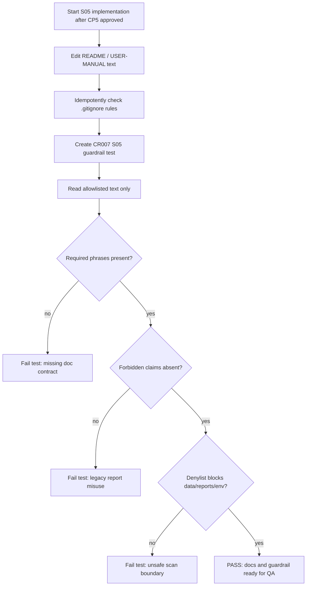

# LLD: CR007-S05 - 质量报告与文档护栏

> 本 LLD 只覆盖 `CR007-S05-data-quality-report-and-doc-guardrail`。CP5 批次人工确认已由用户原文 `同意` 批准，`confirmed=true`，`implementation_allowed=true`。该授权仅允许在上游 Story 合同满足后进入离线代码 / 文档实现调度，不授权真实 Tushare 抓取、真实 lake 写入、凭据读取或旧数据 / 旧报告操作。
>
> 本设计不修改 README、USER-MANUAL、`.gitignore`、guardrail 测试或业务代码；不读取、打开或覆盖旧 `reports/data_quality_report.csv` 内容；不读取、列出、迁移、复制、比对或删除旧 `data/**`；不执行真实 Tushare 抓取；不写入 `/mnt/ugreen-data-lake`；不读取、打印或记录 `.env`、token、NAS 凭据。
>
> Ready-check 说明：Story 卡片 frontmatter 当前为 `status="draft"`，但 `process/STATE.md.parallel_execution.lld_design_batch.status="ready-for-lld-dispatch"`、CR-007 `status="cp3-cp4-approved-lld-ready"`、handoff 与用户当前指令均明确只授权进入 CR007-BATCH-A LLD 设计。本 LLD 将其作为仅限 LLD 写作的等价待设计状态处理；实现前必须由 meta-po 回填 Story 审查态 / dev-ready 状态并完成 CP5 批次人工确认。

## 1. Goal

为 CR-007 收敛文档与静态护栏设计：把旧 `reports/data_quality_report.csv` 明确标记为 `legacy old report` / `legacy quality report`，禁止其作为 current coverage proof；把 configured lake root 下的 lake `quality/catalog` 定义为 `current quality truth`；用 allowlisted text scan 验证 README、USER-MANUAL、`.gitignore` 和 guardrail 测试自身包含 required phrases、拒绝 forbidden claims，并确认扫描不读取旧报告内容、不进入旧 `data/**` 或凭据路径。

完成后，用户文档应能区分三类对象：

- 旧仓库报告：`reports/data_quality_report.csv`，只可作为 legacy old report 被提及，不可作为 CR-007 coverage proof。
- 当前质量事实源：configured lake root 下的 lake `quality/catalog`，必须携带 dataset、start/end、denominator、run_id/source/interface、quality_status、catalog/lineage。
- 静态护栏：只读取 allowlisted text files；对 `data/**`、`reports/**`、`.env`、credentials 和二进制/数据后缀执行字符串级 denylist，不打开这些路径。

## 2. Requirements（Functional / Non-Functional）

### 2.1 Functional

- 修改 `README.md`，新增或修订 CR-007 数据质量说明，必须出现 3 类 required phrase：`legacy quality report`、`lake quality/catalog current truth`、`coverage proof forbidden`。文档必须明确旧 `reports/data_quality_report.csv` 是 legacy old report，不覆盖、不读取内容、不作为 current quality truth 或 coverage proof。
- 修改 `docs/USER-MANUAL.md`，在运行边界、输出文件字段说明和故障排查相关位置补充同一语义：当前质量真相源来自 lake `quality/catalog`，coverage 声明必须包含 dataset、start/end、denominator、run_id/source/interface、quality_status 和 catalog/lineage；旧报告只保留为 legacy 线索。
- 修改 `.gitignore` 时采用幂等策略：若缺少 `data/`、`reports/`、`quality/`、`catalog/`、`market_data_lake/`、`.env`、`.env.*`、`credentials/`、`*.parquet`、`*.jsonl` 等规则则补齐；若现有规则已满足则不改动。实现不得取消 `!tests/fixtures/**`。
- 创建 `tests/test_cr007_quality_report_doc_guardrail.py`，复用 CR006 guardrail 的 allowlist / denylist 设计，只允许读取 `README.md`、`docs/USER-MANUAL.md`、`.gitignore` 和本测试文件自身。allowlist 中 `data/**` 条目数必须为 0，`reports/**` 条目数必须为 0。
- guardrail 必须验证 required phrases：`legacy quality report`、`legacy old report`、`lake quality/catalog current truth`、`current quality truth`、`coverage proof forbidden`、`dataset`、`start/end`、`denominator`、`run_id/source/interface`、`quality_status`、`catalog/lineage`。
- guardrail 必须验证 forbidden claims 不出现，包括但不限于：旧报告是当前质量真相源、旧报告可作为 coverage proof、旧报告可覆盖生成当前质量通过证据、旧 `data/**` 可作为 fallback、旧 `data/**` 可作为 fixture。
- guardrail 必须验证 `_denylist_reason("reports/data_quality_report.csv")`、`_denylist_reason("data/prices.parquet")`、`_denylist_reason(".env")` 均非空，且测试自身不调用 `Path("reports/data_quality_report.csv").read_text()` 或等价内容读取。
- 保持 CR007-S05 与 S01/S02/S03/S04 为 contract dependency：S05 文档用语必须引用上游冻结合同，而不是自行重新定义 planner、benchmark、dataset readiness 或实验消费字段。

### 2.2 Non-Functional

- 安全：`.env`、token、NAS 凭据读取或打印次数为 0；旧 `data/**` 读取、列出、迁移、复制、比对或删除次数为 0；旧 `reports/data_quality_report.csv` 内容读取和覆盖次数为 0。
- 离线性：测试不需要 Tushare token、不需要 NAS、不联网，不依赖真实 lake、旧数据或旧报告。
- 可维护：新增 guardrail 独立为 `tests/test_cr007_quality_report_doc_guardrail.py`，不扩大 CR006 guardrail 的扫描范围；必要时只复用其字符串级路径判定模式。
- 可审计：文档必须把 coverage proof 字段清单写为可检查文本，避免“质量已通过”这类无来源声明。
- 兼容性：保留旧基线中 `reports/data_quality_report.csv` 的历史字段说明，但必须新增 legacy 标记和 current truth 替代说明，避免破坏已存在用户文档结构。

## 3. 模块拆分与职责

| 模块 / 文件组 | 职责 | 说明 |
|---|---|---|
| `README.md` | 面向项目读者声明 CR-007 quality truth、legacy report、coverage proof 边界 | 承接现有 CR006 old data reference-only guardrail 段落；新增 CR007 quality report legacy 段落或在相邻位置扩展 |
| `docs/USER-MANUAL.md` | 面向运行用户说明质量报告字段、缺口处理和真实授权边界 | 需要修订“输入数据准备”“Tushare-first runbook”“输出文件字段说明”“故障排查”等相关位置，但实现时保持小范围编辑 |
| `.gitignore` | 阻止真实 lake、报告、大文件和凭据入库 | 当前已含 `data/`、`reports/`、`quality/`、`catalog/`、`.env` 等规则；实现按缺失补齐，不做无意义 churn |
| `tests/test_cr007_quality_report_doc_guardrail.py` | 新增 S05 专属静态护栏 | 只读 allowlisted text files；测试 required / forbidden phrases、denylist、credential sentinel、no old report read |
| 上游 CR007 LLD 合同 | 提供术语和字段清单 | S01 提供 coverage gate/run_id/source/interface；S02 提供 denominator/benchmark missing 语义；S03 提供 readiness/PIT 状态；S04 待冻结 proxy_baseline 与实验 metadata 语义 |

## 4. 代码结构与文件影响范围

| 动作 | 文件路径 | 变更内容 |
|---|---|---|
| 修改 | `README.md` | 增加 CR-007 quality truth/legacy report 文案；保留 CR006 old data reference-only 说明；明确旧 `reports/data_quality_report.csv` 不作为 current quality truth，不作为 coverage proof |
| 修改 | `docs/USER-MANUAL.md` | 增加用户运行边界、真实授权和 legacy report 注意事项；修订 `reports/data_quality_report.csv` 字段说明，标记旧仓库报告为 legacy old report，当前真相源为 lake `quality/catalog` |
| 修改 | `.gitignore` | 检查并补齐真实 lake、report、quality/catalog、凭据、大文件忽略规则；若规则已存在则保持不变 |
| 创建 | `tests/test_cr007_quality_report_doc_guardrail.py` | 创建 allowlisted static scan 测试，覆盖 required phrases、forbidden claims、denylist、credential sentinel、no data/report content scan |

禁止修改：`engine/**`、`experiments/**`、`market_data/connectors/**`、`market_data/runtime.py`、`market_data/storage.py`、`data/**`、`reports/**`、`.env`、`credentials`、`delivery/**`。

## 5. 数据模型与持久化设计

无新增数据库、无新增 lake 文件、无新增真实 report、无真实持久化写入。本 Story 仅设计文档文本和静态测试。

| 对象 / 字段 | 类型 | 约束 | 说明 |
|---|---|---|---|
| `QUALITY_TRUTH_REQUIRED_PHRASES` | `tuple[str, ...]` | 全部必须出现在 README / USER-MANUAL 合并文本中 | 包含 `legacy quality report`、`lake quality/catalog current truth`、`coverage proof forbidden` |
| `COVERAGE_PROOF_FIELDS` | `tuple[str, ...]` | 全部必须可被静态测试定位 | `dataset`、`start/end`、`denominator`、`run_id/source/interface`、`quality_status`、`catalog/lineage` |
| `FORBIDDEN_LEGACY_REPORT_CLAIMS` | `tuple[str, ...]` | 不得出现在 allowlisted 文档文本中 | 覆盖旧报告作为 current truth / coverage proof 的典型误述 |
| `DOC_SCAN_TARGETS` | `tuple[str, ...]` | 固定为 `README.md`、`docs/USER-MANUAL.md`、`.gitignore` | 不包含 `data/**`、`reports/**`、`.env` |
| `DENYLIST_PREFIXES` | `tuple[str, ...]` | 至少含 `data/`、`reports/`、`credentials/`、`quality/`、`catalog/`、`market_data_lake/` | 只做字符串级路径判定，不读取目录 |
| `DENYLIST_SUFFIXES` | `tuple[str, ...]` | 至少含 `.csv`、`.parquet`、`.jsonl`、`.db`、图片/二进制后缀 | 防止测试误读旧报告或大文件 |

## 6. API / Interface 设计

| 接口 / 入口 | 输入 | 输出 | 调用方 | 说明 |
|---|---|---|---|---|
| 文档 quality truth 说明 | CR007 coverage policy、ADR-022、S01/S02/S03/S04 合同 | README / USER-MANUAL 中的 legacy report 与 lake quality/catalog current truth 说明 | 用户、meta-qa、guardrail 测试 | 对应第 10 节 T01/T02 |
| 文档 coverage proof 字段清单 | dataset、start/end、denominator、run_id/source/interface、quality_status、catalog/lineage | 可静态断言的 coverage proof checklist | 用户、meta-qa | 对应第 10 节 T02/T03 |
| `.gitignore` 护栏 | 忽略规则文本 | 数据、报告、lake、凭据、大文件规则存在 | git、guardrail 测试 | 对应第 10 节 T04 |
| `_denylist_reason(relative_path)` | repo-relative path 字符串 | `None` 或 blocked reason | `tests/test_cr007_quality_report_doc_guardrail.py` | 字符串级规则；对应第 10 节 T05 |
| `_read_allowlisted_text(relative_path)` | allowlisted text path | UTF-8 文本 | 静态测试 | 只允许文档和测试自身；对应第 10 节 T06 |
| forbidden phrase scan | README / USER-MANUAL 合并文本 | violations list | 静态测试 | 不扫描 `reports/**` 内容；对应第 10 节 T07 |

## 7. 核心处理流程

1. 实现阶段先读取 README、USER-MANUAL、`.gitignore` 和 CR006 guardrail 测试的当前文本结构；不得读取旧 `reports/data_quality_report.csv` 内容，不得遍历 `data/**`。
2. 修改 README 的 CR006 old data guardrail 相邻区域或数据运维区域，新增 CR007 quality report legacy 段落，写明 `legacy quality report`、`legacy old report`、`lake quality/catalog current truth`、`current quality truth`、`coverage proof forbidden`。
3. 修改 USER-MANUAL 的数据准备 / Tushare-first runbook / 输出字段说明 / 故障排查相关位置，统一说明旧仓库 `reports/data_quality_report.csv` 只是 legacy old report；当前质量判断必须来自 configured lake root 下的 `quality/catalog`。
4. 检查 `.gitignore` 是否已有 data/report/lake/credential 大文件规则；缺失则补齐，已存在则不改动。
5. 创建 S05 guardrail 测试，定义 allowlist、denylist、required phrases、forbidden claims、credential sentinels。
6. guardrail 测试只读取 allowlisted text files；对 `reports/data_quality_report.csv`、`reports/**`、`data/**`、`.env`、credentials 使用 `_denylist_reason` 字符串断言，不打开文件。
7. 运行 `uv run --python 3.11 pytest -q tests/test_cr007_quality_report_doc_guardrail.py`。若 required phrase 缺失、forbidden claim 出现、allowlist 包含 data/report/env 或测试读取旧报告内容，则失败。



## 8. 技术设计细节

- 关键规则：
  - `reports/data_quality_report.csv` 可被文档提及，但必须紧邻 legacy 限制说明；不得作为 current quality truth、coverage proof、fixture 或 smoke 前置条件。
  - 当前质量事实源必须写为 lake `quality/catalog` 或 `lake quality/catalog current truth`，并绑定 configured lake root，而不是仓库内 `reports/**`。
  - coverage proof 必须包含字段清单：dataset、start/end、denominator、run_id/source/interface、quality_status、catalog/lineage。
  - `coverage proof forbidden` 明确指旧报告和旧 `data/**` 均不能作为 coverage proof。
- 依赖选择与复用点：
  - 复用 CR006 guardrail 的路径字符串 denylist 思路，但不导入或修改 CR006 测试，避免交叉 Story 写入。
  - 复用 README / USER-MANUAL 已有 Tushare-first、MARKET_DATA_LAKE_ROOT、required_missing、proxy_baseline 术语。
  - 复用 S01 的 run_id/source/interface/coverage gate、S02 的 denominator/quality_status/catalog lineage、S03 的 readiness/PIT 状态、S04 待冻结的 proxy_baseline/真实 benchmark metadata。
- 兼容性处理：
  - 旧文档中“`reports/data_quality_report.csv` 是第一版质量报告输出”的历史说明可保留，但必须标注其适用于旧 flat/report 链路；CR-007 current quality truth 不再来自该旧报告。
  - `.gitignore` 当前已包含多数规则，实现时不应重排全文件；只追加缺失规则。
  - 若 S04 LLD 最终调整 `proxy_baseline` metadata 字段，S05 实现只需在文档中保持上游字段名，不重定义消费逻辑。
- 图示类型选择：流程图。S05 跨 README、USER-MANUAL、`.gitignore`、guardrail 测试四个文件，且异常路径主要是静态检查失败，流程图比时序图更直接。

## 9. 安全与性能设计

| 维度 | 设计措施 | 验证方式 |
|---|---|---|
| 凭据安全 | 不读取、打印或记录 `.env`、token、NAS 用户名、NAS 密码；测试只检查 sentinel 字符串不出现 | T08 credential sentinel scan；allowlist 不含 `.env` |
| 旧数据安全 | 不读取、列出、迁移、复制、比对或删除旧 `data/**`；denylist 只做字符串判断 | T05 denylist；T06 allowlist count |
| 旧报告安全 | 不读取、打开或覆盖旧 `reports/data_quality_report.csv` 内容；只在文档中标记 legacy | T05 denylist；T09 测试源码自检禁止 `reports/data_quality_report.csv` 内容读取模式 |
| lake 写入安全 | 文档说明真实 lake root 在仓库外，当前质量真相源是 configured lake root 下 `quality/catalog` | T02 / T04 |
| 性能 | 静态测试仅读取 4 个小文本文件，复杂度 O(total text length) | pytest 运行时间应低于 1 秒量级；不访问大目录 |
| 并发 | S05 primary 仅新增测试文件；README/docs/.gitignore 为 S05 merge_owner，开发时必须等待 CP5 后文件冲突重新判定 | CP6 中记录 `process/STATE.md.parallel_execution.dev_running` 复核结果 |

## 10. 测试设计

验证入口：`uv run --python 3.11 pytest -q tests/test_cr007_quality_report_doc_guardrail.py`。

| 测试场景 | 前置条件 | 操作 | 预期结果 | 验证方式 |
|---|---|---|---|---|
| T01 required phrases | README / USER-MANUAL 已按 S05 修改 | 合并 allowlisted 文档文本，检查 required phrase categories | 至少出现 `legacy quality report`、`lake quality/catalog current truth`、`coverage proof forbidden` 三类 | pytest 字符串断言 |
| T02 current quality truth | 文档包含 lake `quality/catalog` 段落 | 检查 `current quality truth` 与 `quality/catalog` 同时存在 | 当前质量真相源指向 configured lake root 下 quality/catalog | pytest 字符串断言 |
| T03 coverage proof fields | 文档包含 coverage proof 清单 | 检查 dataset、start/end、denominator、run_id/source/interface、quality_status、catalog/lineage | 字段全部出现；旧报告不能替代这些字段 | pytest 字符串断言 |
| T04 `.gitignore` 规则 | `.gitignore` 可读取 | 检查 data/report/lake/credential/binary rules | 必需忽略规则存在；`!tests/fixtures/**` 保留 | pytest 字符串断言 |
| T05 denylist blocks unsafe paths | 测试定义 `_denylist_reason` | 调用 `_denylist_reason("reports/data_quality_report.csv")`、`data/prices.parquet`、`.env` | 均返回 blocked reason；未打开文件 | pytest 函数断言 |
| T06 allowlist excludes data/reports/env | allowlist 固定 | 检查 allowlist targets | `data/**`、`reports/**`、`.env` 条目数均为 0；README/docs/.gitignore/test 自身存在 | pytest 集合断言 |
| T07 forbidden claims absent | 文档已修改 | 扫描 README / USER-MANUAL allowlisted 文本 | 不出现旧报告作为 current truth / coverage proof、旧 data fallback / fixture 等误述 | pytest 字符串断言 |
| T08 credential sentinel absent | 文档与测试文本可读取 | 搜索 fake sentinel：`REAL_TUSHARE_TOKEN_SENTINEL`、`NAS_PASSWORD_SENTINEL` 等 | sentinel 不出现在文档正文；测试自身跳过 sentinel 定义区或只检测目标文档 | pytest 字符串断言 |
| T09 no old report content read pattern | 测试文件自身可读取 | 检查测试源码中不存在对 `reports/data_quality_report.csv` 的 `read_text/open/read_csv` 组合 | 测试只调用 `_denylist_reason`，不读取旧报告内容 | pytest 字符串 / AST 轻量断言 |

第 6 节每个接口均至少有一个测试入口：文档 truth 对应 T01/T02，coverage proof 对应 T03，`.gitignore` 对应 T04，denylist/allowlist 对应 T05/T06，forbidden scan 对应 T07。

## 11. 实施步骤

| TASK-ID | 动作 | 目标文件 | 详细描述 | 对应测试 |
|---|---|---|---|---|
| CR007-S05-T1 | 修改 | `README.md` | 新增 CR-007 quality report legacy 段落；写入 required phrases；说明旧报告 legacy、lake quality/catalog current truth、coverage proof forbidden 和字段清单 | T01、T02、T03、T07 |
| CR007-S05-T2 | 修改 | `docs/USER-MANUAL.md` | 修订运行边界、输出文件字段说明和故障排查；标记旧 `reports/data_quality_report.csv` 为 legacy old report；声明 current quality truth 来自 lake `quality/catalog` | T01、T02、T03、T07 |
| CR007-S05-T3 | 修改 | `.gitignore` | 幂等补齐 data/reports/raw/canonical/gold/quality/catalog/manifest/market_data_lake/legacy_flat、`.env`、credentials 和大文件后缀忽略规则；保留 tests fixtures 例外 | T04 |
| CR007-S05-T4 | 创建 | `tests/test_cr007_quality_report_doc_guardrail.py` | 创建 allowlist / denylist / required phrases / forbidden claims / credential sentinel / no old report read 静态测试 | T01-T09 |

每个 TASK-ID 均覆盖第 4 节文件影响范围；每个文件影响项均有测试入口。实现必须按 T1 -> T2 -> T3 -> T4 顺序执行，避免测试先失败于尚未存在的文档合同。

## 12. 风险、难点与预研建议

| 风险 / 难点 | 影响 | 缓解措施 / 预研建议 |
|---|---|---|
| 旧文档仍把 `reports/data_quality_report.csv` 描述为当前质量报告 | 用户可能误把旧报告当作 CR-007 coverage proof | 在 README / USER-MANUAL 保留历史字段说明但新增 legacy 标记和 current truth 替代说明 |
| required phrases 过于机械 | 文档可读性下降 | 把 required phrases 放入简短的“CR-007 quality truth markers”或自然句中，不堆砌无上下文关键词 |
| forbidden claims 与历史说明误伤 | 测试可能误判旧 flat 报告说明 | forbidden claims 使用精确短语，不禁止单纯提及 `reports/data_quality_report.csv` |
| S04 LLD 尚未生成 | `proxy_baseline` 实验 metadata 语义未最终冻结 | S05 仅引用 HLD/ADR 和 S02/S03 已有合同；S04 相关文案在实现前按 S04 confirmed LLD 复核 |
| `.gitignore` 已满足规则 | 实现若重排可能造成无关 churn | T3 采用缺失补齐策略；若无缺失则不修改 `.gitignore` 并在 CP6 说明 |
| 测试误读 `reports/**` 内容 | 违反用户禁止事项 | denylist 和 allowlist 双重约束；T09 检查测试源码不包含内容读取模式 |

### OPEN / Spike 跟踪

| ID | 类型（OPEN / Spike） | 问题 | 下一动作 | 责任方 |
|---|---|---|---|---|
| O-S05-01 | OPEN | Story 卡片 frontmatter 仍为 `status=draft`，与 STATE/handoff 的 LLD dispatch 状态不一致 | meta-po 在 CR007-BATCH-A CP5 聚合前回填 Story 状态到 `lld-ready-for-review` 或等价审查态 | meta-po |
| O-S05-02 | OPEN | CR007-S04 LLD / CP5 尚未存在，实验真实 benchmark 消费合同未冻结 | S05 实现前读取 S04 confirmed LLD；若 `proxy_baseline` 或 metadata 字段变化，更新文档措辞后再实现 | meta-dev / meta-po |
| O-S05-03 | RESOLVED 2026-05-20 | S01/S02/S03 当前 LLD 已生成且 CP5 批次人工确认后均为 `confirmed=true` | CR007-BATCH-A CP5 已由用户原文 `同意` 放行；S05 实现前仍需校验上游合同 frozen | meta-po |
| O-S05-04 | OPEN | `.gitignore` 当前看似已包含所需规则，但 CP5 前不能修改业务产物验证最终差异 | 实现阶段先检查规则；缺失才补齐，无缺失则记录 no-op | meta-dev |
| O-S05-05 | Spike | 是否把 CR007 S05 guardrail 与 CR006 guardrail 合并 | 默认不合并，避免跨 Story 改已有测试；若后续维护成本上升，再由独立 CR 统一 guardrail | meta-po / meta-qa |

## 13. 回滚与发布策略

- 发布方式：CP5 全量人工确认后，S05 作为文档与测试增量随 Story 实现提交。先改文档，再补 `.gitignore` 缺失规则，最后创建 guardrail 测试并运行 Story 专属 pytest。
- 回滚触发条件：
  - README / USER-MANUAL 出现旧报告作为 current quality truth 或 coverage proof 的误述。
  - guardrail allowlist 包含 `data/**`、`reports/**`、`.env` 或 credentials。
  - 测试读取旧 `reports/data_quality_report.csv` 内容、遍历旧 `data/**` 或访问凭据路径。
  - S04 confirmed LLD 与 S05 文档措辞冲突。
- 回滚动作：
  - 回退 README / USER-MANUAL 中 S05 新增段落到上一个已验证版本，并保留 CR007 需要重写的 OPEN 记录。
  - 回退 `.gitignore` 中仅由 S05 追加且被证明错误的规则；不得删除既有凭据和数据忽略规则。
  - 删除或修正 `tests/test_cr007_quality_report_doc_guardrail.py` 中越权扫描逻辑。
  - 若合同冲突来自上游 LLD，停止实现并回到 CP5 修改本 LLD。

## 14. Definition of Done

- [x] 14 个章节全部填写完成，frontmatter `confirmed=true`、`implementation_allowed=true`。
- [x] `process/checks/CP5-CR007-S05-data-quality-report-and-doc-guardrail-LLD-IMPLEMENTABILITY.md` 已写入，且 CP5 全量人工确认已通过。
- [ ] README / USER-MANUAL 设计覆盖 `legacy quality report`、`legacy old report`、`lake quality/catalog current truth`、`current quality truth`、`coverage proof forbidden`。
- [ ] coverage proof 字段清单覆盖 dataset、start/end、denominator、run_id/source/interface、quality_status、catalog/lineage。
- [ ] guardrail allowlist 中 `data/**`、`reports/**`、`.env`、credentials 条目数均为 0。
- [ ] 旧 `reports/data_quality_report.csv` 内容读取、覆盖或 fixture 使用次数为 0。
- [ ] 旧 `data/**` 读取、列出、迁移、复制、比对、删除次数为 0。
- [ ] `.env`、token、NAS 凭据读取或打印次数为 0。
- [ ] 不修改 `engine/**`、`experiments/**`、`market_data/connectors/**`、`market_data/runtime.py`、`market_data/storage.py`、真实 `data/**`、真实 `reports/**`、`delivery/**`。
- [ ] `uv run --python 3.11 pytest -q tests/test_cr007_quality_report_doc_guardrail.py` 通过。
- [ ] CP6 时记录实际修改文件、no-op `.gitignore` 结论、已知限制和 meta-qa 验证入口。

## 人工确认区

> **CP5 — Story LLD 可实现性门**
> meta-dev 已先写入 `process/checks/CP5-CR007-S05-data-quality-report-and-doc-guardrail-LLD-IMPLEMENTABILITY.md` 自动预检结果。
> meta-po 收齐 CR007-BATCH-A 全部五个 Story 的 LLD 和 CP5 自动预检后，再生成并提示用户审查 `checkpoints/CP5-CR007-BATCH-A-LLD-BATCH.md`。
> 用户统一确认全部目标 Story 的 LLD 后，仍需满足当前 Wave、依赖门控与文件所有权门控方可进入实现。

**CP5 checklist 摘要**：

| # | 检查项 | 状态 | 证据 |
|---|---|---|---|
| 1 | LLD 覆盖 AC | PASS | 第 2 / 10 / 14 节 |
| 2 | 与 HLD / ADR 一致 | PASS | 第 3 / 8 / 12 节 |
| 3 | 文件影响范围明确 | PASS | 第 4 / 11 节 |
| 4 | 接口契约完整 | PASS | 第 6 节 |
| 5 | 测试与 dev_gate 可计算 | PASS | 第 10 / 14 节 |

**人工确认回复**：

请直接回复以下任一整行：

```text
approve
修改: <具体修改点>
reject
```

- `approve`：LLD 设计合理，允许纳入 CR007-BATCH-A CP5 批次确认。
- `修改: <具体修改点>`：指出具体修改点后由 meta-dev 更新重提。
- `reject`：设计方向有根本问题，需重新设计。

**人工审查结果回填**：

- 结论：`approved | changes_requested | rejected`
- 审查人：
- 审查时间：
- 修改意见：
- 风险接受项：
