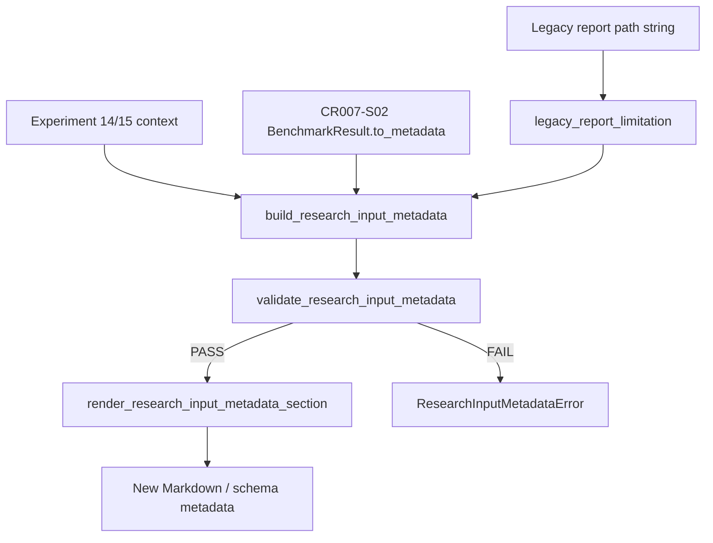

# LLD: CR008-S01 — research input 合同与报告 metadata

> 本文档仅覆盖 `CR008-S01-research-input-contract-and-report-metadata` 的低层设计。当前只允许输出 LLD 与 CP5 自动预检，不允许实现业务代码、运行真实抓取、读取旧 `data/**`、读取旧 `reports/data_quality_report.csv`、读取凭据或写入真实 lake。`confirmed=false`、`implementation_allowed=false` 保持到 CR008-BATCH-A 六份 LLD、六份 CP5 自动预检和批次人工确认全部通过。

## 1. Goal

创建 `research_input_v1` 研究输入 metadata 合同和新研究报告 metadata 写入合同，使 CR008 之后的新报告强制披露 lineage、coverage、benchmark、universe、adjustment、label window、quality/readiness、known limitations 与 allowed claims；历史报告只能作为 legacy 路径或限制说明保留，不能作为 current truth、coverage proof 或默认 fixture。

## 2. Requirements（Functional / Non-Functional）

### 2.1 Functional

- 创建 `ResearchInputMetadata` / `ResearchInputMetadataIssue` / `ResearchInputMetadataError` 合同，字段覆盖 `schema_name=research_input_v1`、`report_kind`、`manifest_run_id` 或 `source_run_id`、`coverage_start`、`coverage_end`、`benchmark_status`、`universe_mode`、`adjustment_policy`、`forward_return_horizon`、`label_available_end`、`quality_status`、`readiness_status`、`known_limitations`、`allowed_claims`、`legacy_report_policy`。
- 创建 metadata 校验入口：缺任一必填字段、`manifest_run_id/source_run_id` 同时缺失、`known_limitations` 为空、`legacy_report_policy` 不等于 `legacy_only_not_current_truth` 时返回结构化错误并阻止新报告生成。
- 创建实验报告 metadata 写入 helper，输出 Markdown metadata section 与 JSON-safe dict；CSV / Markdown 文本字段必须复用或等价执行现有 `sanitize_tabular_text` 防公式注入规则。
- 修改 `experiments/run_experiment_14.py` 的新报告输出，使报告包含 `research_input_v1` metadata section，并把旧质量报告 / 阶段报告路径仅作为 legacy limitation 字段记录；默认不得读取旧 `reports/data_quality_report.csv` 内容作为当前质量真相。
- 修改 `experiments/run_experiment_15_factor_framework.py` 的 report/schema 输出，使因子框架报告包含 `research_input_v1` metadata、fixed snapshot 限制、proxy benchmark 限制、label window 说明和 allowed claims；缺行业 / 市值 / 可交易性 / 风格暴露时不得声明严肃中性化或纯 alpha 结论。
- 创建 `tests/test_cr008_research_input_metadata.py`，覆盖必填字段、缺字段失败、legacy report 边界、BenchmarkResult metadata 映射、no connector/runtime/storage import、no old data/no credentials 边界。

### 2.2 Non-Functional

- 新 metadata 合同的必填字段覆盖率为 100%；测试中每个字段至少有一条正向或负向断言。
- 报告生成路径网络调用次数为 0；不得导入或调用 `market_data.connectors`、`market_data.runtime`、`market_data.storage`。
- 测试只使用 `tmp_path` / in-memory fixture / monkeypatch `BenchmarkResult.to_metadata()`；不读取旧 `data/**`、不打开旧 `reports/data_quality_report.csv`、不读取 `.env`、不打印 token 或 NAS 凭据。
- 与 CR007-S02 的 contract 依赖：可消费已 verified 的 `BenchmarkResult.to_metadata()` 字段，包括 `status`、`dataset`、`index_code`、`start_date`、`end_date`、`coverage`、`quality_status`、`missing_reason`、`lineage`、`denominator_mode` 和 `price_overlap`；S01 不重新实现 benchmark resolver。
- 与 CR008-S03 的开发约束：S01 可先定义 metadata contract；S03 后续扩展 `engine/research_dataset.py` 为完整 builder。两者不得并行开发同一文件，CP5 批次确认后由 meta-po 按 dev gate 串行调度。

## 3. 模块拆分与职责

| 模块 / 文件组 | 职责 | 说明 |
|---|---|---|
| `engine/research_dataset.py` | 创建 `research_input_v1` metadata 类型、必填字段集合、校验函数、BenchmarkResult metadata 映射和错误模型 | S01 只放 metadata contract；S03 在同文件扩展 builder。若 S03 先落地同文件，S01 实现必须改为合并同名 exported contract，不得创建第二套合同 |
| `experiments/reporting.py` | 创建实验层 metadata writer：dict 序列化、Markdown section、legacy report limitation、CSV/Markdown 文本净化 | 新文件；不修改既有 `engine/reporting.py` 的通用 CSV helper，避免扩大文件所有权 |
| `experiments/run_experiment_14.py` | 接入 metadata writer，输出 `research_input_v1` section，并把旧质量报告 / 阶段报告边界标记为 legacy-only | 实现时不得把旧 `reports/data_quality_report.csv` 读取结果作为 current quality truth |
| `experiments/run_experiment_15_factor_framework.py` | 接入 metadata writer，把因子面板 schema、label policy、fixed snapshot universe、proxy benchmark 和 allowed claims 写入 metadata | S06 后续会扩展 auxiliary availability；S01 只写基础 limitation 和 allowed claims |
| `tests/test_cr008_research_input_metadata.py` | 创建 Story 专属离线测试 | tmp fixture；不读取真实 lake、旧 data、旧报告或凭据 |

## 4. 代码结构与文件影响范围

| 动作 | 文件路径 | 变更内容 |
|---|---|---|
| 创建 | `engine/research_dataset.py` | 定义 `RESEARCH_INPUT_SCHEMA_NAME`、`RESEARCH_INPUT_REQUIRED_FIELDS`、`ResearchInputMetadata`、`ResearchInputMetadataIssue`、`ResearchInputMetadataError`、`validate_research_input_metadata()`、`build_research_input_metadata()`、`benchmark_metadata_from_result()`、`metadata_to_dict()` |
| 创建 | `experiments/reporting.py` | 定义 `render_research_input_metadata_section()`、`attach_research_input_metadata()`、`legacy_report_limitation()`；复用或等价执行 `sanitize_tabular_text`；只负责实验报告 metadata，不读写报告历史文件 |
| 修改 | `experiments/run_experiment_14.py` | 在 `render_report()` 中写入 `research_input_v1` metadata section；`load_quality_report()` 的 current truth 使用改为来自显式 fixture / metadata payload，默认旧报告路径只写入 legacy limitation；报告不得以旧质量报告证明 coverage pass |
| 修改 | `experiments/run_experiment_15_factor_framework.py` | 在 schema 与 Markdown report 中加入 `research_input_v1` metadata；将 fixed snapshot、proxy benchmark、close execution proxy、缺辅助数据 allowed claims 写为结构化限制 |
| 创建 | `tests/test_cr008_research_input_metadata.py` | 覆盖 metadata 必填字段、缺字段失败、lineage 缺失、legacy report 边界、BenchmarkResult 映射、experiment 14/15 report section、禁止 import / path / credential 边界 |

禁止修改：`market_data/connectors/**`、`market_data/runtime.py`、`market_data/storage.py`、`data/**`、`reports/data_quality_report.csv`、`.env`、`credentials`、`delivery/**`、`process/HLD.md`、`process/ARCHITECTURE-DECISION.md`、`process/DEVELOPMENT-PLAN.yaml`。

## 5. 数据模型与持久化设计

| 对象 / 字段 | 类型 | 约束 | 说明 |
|---|---|---|---|
| `RESEARCH_INPUT_SCHEMA_NAME` | `str` | 固定 `research_input_v1` | 新报告 metadata schema 名 |
| `ResearchInputMetadata.schema_name` | `str` | 必须等于 `research_input_v1` | 版本化合同入口 |
| `ResearchInputMetadata.report_kind` | `str` | 非空；如 `experiment_14_data_benchmark` / `experiment_15_factor_framework` | 报告类型 |
| `ResearchInputMetadata.lineage` | `dict[str, Any]` | 至少包含 `manifest_run_id` 或 `source_run_id`；可含 `lineage_raw_checksum` | 缺 lineage 时报告生成失败或明确 `lineage_unavailable` issue |
| `coverage_start` / `coverage_end` | `str` | `YYYY-MM-DD`；start 不得晚于 end | 当前研究输入覆盖区间 |
| `benchmark` | `dict[str, Any]` | 至少含 `benchmark_status`、`benchmark_kind`、`missing_reason`、`denominator_mode` | 从 CR007-S02 `BenchmarkResult.to_metadata()` 映射，不重新解析 benchmark 数据 |
| `universe` | `dict[str, Any]` | 至少含 `universe_mode`、`is_pit_universe`、`pit_status`、`survivorship_bias_note` | S01 可写 fixed snapshot / missing；S05 后续强化 PIT 合同 |
| `adjustment_policy` | `str` | 非空；默认 `qfq` 仅在来源已声明时使用 | S04 后续会加混用 gate；S01 只要求显式写入 |
| `label_window` | `dict[str, Any]` | 含 `forward_return_horizon`、`label_available_end`、`label_status` | `label_available_end` 是必填字段 |
| `quality` | `dict[str, Any]` | 含 `quality_status`、`readiness_status` | quality 与 readiness 分离；quality pass 不代表 PIT available |
| `known_limitations` | `list[str]` 或 `list[dict[str, str]]` | 至少 1 项；文本需净化 | 缺限制项时报告失败，防止静默生成误导性报告 |
| `allowed_claims` | `list[str]` | 可为空但必须存在 | 实验十五缺辅助数据时只允许 `framework_validation`、`raw_factor_performance` 等保守声明 |
| `legacy_report_policy` | `str` | 固定 `legacy_only_not_current_truth` | 旧报告只能作为 legacy limitation 或人工参考 |

无新增数据库、无新增外部持久化服务、无真实 lake 写入。S01 只定义内存 dataclass / dict schema 和报告文本输出。报告写入路径仍由实验脚本显式参数控制；测试必须使用 `tmp_path`。

## 6. API / Interface 设计

| 接口 / 入口 | 输入 | 输出 | 调用方 | 说明 |
|---|---|---|---|---|
| `build_research_input_metadata(payload)` | `Mapping[str, Any]`，含 coverage、benchmark、universe、label、quality、limitations | `ResearchInputMetadata` | 实验 14 / 实验 15 / 后续 S03 builder | 必填字段缺失时抛 `ResearchInputMetadataError`；测试见第 10 节 T01/T02 |
| `validate_research_input_metadata(metadata)` | `ResearchInputMetadata` 或 metadata dict | `list[ResearchInputMetadataIssue]` | metadata writer / 测试 | 返回结构化 issue；缺 `benchmark_status`、`universe_mode`、`label_available_end` 必须 fail；测试见 T02 |
| `benchmark_metadata_from_result(result)` | CR007-S02 `BenchmarkResult` 或 dict | `dict[str, Any]` | 实验 14 / 后续 S02 | 只调用 `to_metadata()` 或读取 dict，不调用 resolver、不触发 backfill；测试见 T03 |
| `metadata_to_dict(metadata)` | `ResearchInputMetadata` | JSON-safe `dict[str, Any]` | report writer / schema writer | 不包含凭据值；list/dict 可序列化；测试见 T01/T06 |
| `render_research_input_metadata_section(metadata)` | metadata dataclass 或 dict | Markdown section string | 实验报告 | 输出 `## Research Input Metadata` 或中文等价标题；包含 schema、coverage、benchmark、universe、label、quality、limitations；测试见 T04 |
| `attach_research_input_metadata(report_lines, metadata)` | `list[str]`、metadata | `list[str]` | `run_experiment_14.py` / `run_experiment_15_factor_framework.py` | 只拼接文本，不读取旧报告文件；测试见 T04/T05 |
| `legacy_report_limitation(path, role)` | `str | Path`、`role` | limitation dict/string | 实验 14 | 只把路径作为 legacy 标识写入 metadata，不打开文件；测试见 T05 |

接口兼容性：

- `engine/research_dataset.py` 的 S01 exports 必须保持稳定，S03/S04/S05/S06 只能在其上新增 builder / gate / auxiliary 字段，不得重命名 S01 字段。
- `experiments/run_experiment_14.py` 和 `experiments/run_experiment_15_factor_framework.py` 的 CLI 参数默认值可保留，但默认旧报告路径只能进入 legacy limitation，不得作为 current truth 读取或证明 coverage。
- 若实现需要保留历史审计能力，必须增加显式 opt-in 参数并在默认测试中保持旧报告读取次数为 0；该 opt-in 不属于本 Story 验收路径。

## 7. 核心处理流程

1. 实验入口从当前运行上下文、tmp fixture、CR007-S02 `BenchmarkResult.to_metadata()` 或现有 summary/schema 信息组装 metadata payload。
2. `build_research_input_metadata()` 规范化 payload：补 `schema_name=research_input_v1`、整理 lineage、coverage、benchmark、universe、label window、quality/readiness、known limitations、allowed claims。
3. `validate_research_input_metadata()` 执行必填字段校验；缺字段、lineage 双空、known limitations 为空、legacy policy 错误时生成 error issue 并阻止报告写入。
4. `render_research_input_metadata_section()` 将 metadata 转为 Markdown section；对可能进入 Markdown / CSV 的文本执行净化。
5. `run_experiment_14.py` 在数据与 benchmark 审计报告中插入 metadata section；旧质量报告和阶段报告仅以 `legacy_report_policy=legacy_only_not_current_truth` 进入 limitation，不再作为 current coverage proof。
6. `run_experiment_15_factor_framework.py` 在 factor schema 与 Markdown report 中插入 metadata section；报告声明 fixed snapshot、proxy benchmark、close execution proxy、缺行业/市值/可交易性/风格暴露时的 allowed claims。
7. 若 metadata 构建失败，实验脚本返回结构化失败信息或抛 `ResearchInputMetadataError`，不得写出缺字段的新报告。



异常路径：

- `missing_required_fields`：metadata 缺 `benchmark_status`、`universe_mode`、`label_available_end` 等字段时失败，报告不生成。
- `lineage_missing`：`manifest_run_id` 与 `source_run_id` 同时缺失时失败；若未来允许探索降级，必须写 `lineage_unavailable` limitation，本 Story 默认 fail。
- `legacy_report_current_truth_attempt`：旧报告被标为 current truth / coverage proof 时失败。
- `forbidden_import_detected`：S01 目标文件导入 connector/runtime/storage 时失败。
- `credential_exposure_detected`：metadata 文本包含测试中的假 token 值或 `.env` 内容时失败。

## 8. 技术设计细节

- 关键算法 / 规则：
  - required field set 固定为 `schema_name`、`report_kind`、`coverage_start`、`coverage_end`、`benchmark_status`、`universe_mode`、`adjustment_policy`、`forward_return_horizon`、`label_available_end`、`quality_status`、`readiness_status`、`known_limitations`、`allowed_claims`、`legacy_report_policy`。
  - lineage 规则：`manifest_run_id` 或 `source_run_id` 至少存在一个；若只存在 `lineage_raw_checksum`，仍不足以单独通过 lineage gate。
  - benchmark 映射规则：`BenchmarkResult.to_metadata()` 中 `status` 映射为 `benchmark_status`；`dataset` / `index_code` / `coverage` / `quality_status` / `missing_reason` / `lineage` 原样进入 `benchmark` 子对象；`denominator_mode` 必须保留 CR007-S02 的 `trade_calendar_open_dates` 证据。
  - legacy 规则：旧 `reports/data_quality_report.csv`、旧阶段报告和旧 `data/**` 只能进入 `known_limitations` 或 `legacy_sources` 字段，字段值必须说明 `not_current_truth`。
  - allowed claims 规则：实验十五默认只能声明 `factor_framework_smoke`、`fixed_snapshot_exploration`、`raw_factor_performance`; 不得声明 `pit_factor_research`、`industry_neutral`、`size_neutral`、`pure_alpha`、`tradable_capacity`。
- 依赖选择与复用点：
  - 复用 `engine/reporting.py` 的 `sanitize_tabular_text` 语义；为了遵守 Story 文件所有权，新实验级 writer 放在 `experiments/reporting.py`，可从 `engine.reporting` 导入净化函数。
  - 复用 CR007-S02 verified 的 `BenchmarkResult.to_metadata()`，不导入或调用 `resolve_hs300_benchmark`，除非实验现有逻辑已经显式执行且测试用 monkeypatch 控制。
  - 复用实验 15 现有 `build_factor_schema()`、`render_report()` 结构，只新增 metadata section 和 schema `research_input_metadata` 字段。
- 兼容性处理：
  - 已有历史报告文件不回写、不迁移、不删除。
  - 现有实验 CLI 默认参数不作为本 Story 的测试数据来源；测试通过 tmp output dir 和 monkeypatch fixture 验证。
  - S03/S04/S05/S06 后续可以在 `ResearchInputMetadata` 上新增可选字段，但不得降低 S01 必填字段。
- 图示类型选择：使用流程图，因为本 Story 跨 metadata contract、report writer、两个实验入口和异常 gate。

## 9. 安全与性能设计

| 维度 | 设计措施 | 验证方式 |
|---|---|---|
| 安全 | S01 目标代码不得导入 `market_data.connectors`、`market_data.runtime`、`market_data.storage`，不得调用 fetch/backfill/normalize/revalidate/replay job | T06 使用 AST 或文本扫描目标文件 import/call 边界 |
| 安全 | metadata writer 不打开旧 `reports/data_quality_report.csv`，只把旧报告路径作为 legacy limitation 字符串 | T05 monkeypatch `Path.open` / `Path.read_text` 或 tmp sentinel，断言旧报告读取次数为 0 |
| 安全 | 不读取 `.env`、token、NAS 凭据；metadata 文本不得包含 fake token 值 | T06 monkeypatch env fake secret，断言 `metadata_to_dict()` 与 Markdown section 不含 fake secret |
| 安全 | Markdown / CSV 文本字段防公式注入 | T07 输入 `=cmd`、`+SUM`、`@x` limitation，断言输出被净化 |
| 性能 | metadata 校验只遍历固定字段集合和 limitations 列表，复杂度 O(field_count + limitations) | T01/T02 小样本验证；无需性能基准 |
| 一致性 | `ResearchInputMetadata` 使用 frozen dataclass 或不可变输出 dict；报告 writer 不原地修改调用方 payload | T01 断言输入 payload 不被修改 |
| 可维护性 | S01 合同作为 S03/S04/S05/S06 共享输入，必填字段常量集中定义 | T01 断言 `RESEARCH_INPUT_REQUIRED_FIELDS` 与报告输出字段一致 |

## 10. 测试设计

| 测试场景 | 前置条件 | 操作 | 预期结果 | 验证方式 |
|---|---|---|---|---|
| T01 metadata 正向构建 | in-memory payload 含完整 lineage、coverage、benchmark、universe、label、quality、limitations | 调用 `build_research_input_metadata()` 和 `metadata_to_dict()` | schema 为 `research_input_v1`；必填字段 100% 存在；输入 payload 未被修改 | `uv run --python 3.11 pytest -q tests/test_cr008_research_input_metadata.py -k required_fields` |
| T02 缺字段失败 | payload 缺 `benchmark_status`、`universe_mode`、`label_available_end`、`known_limitations` 中任一项 | 调用 `build_research_input_metadata()` | 抛 `ResearchInputMetadataError`，错误包含 `missing_required_fields` 和字段名 | 同测试文件 |
| T03 CR007-S02 BenchmarkResult 映射 | fake object 提供 `to_metadata()`，字段含 status/dataset/coverage/quality/missing_reason/lineage/denominator_mode | 调用 `benchmark_metadata_from_result()` 再构建 metadata | `benchmark_status` 与 status 对齐；保留 `trade_calendar_open_dates` denominator；不调用 resolver | 同测试文件 |
| T04 Markdown metadata section | 完整 metadata dict | 调用 `render_research_input_metadata_section()` / `attach_research_input_metadata()` | 输出包含 schema、coverage、benchmark、universe、label、quality、limitations、allowed claims | 同测试文件 |
| T05 legacy report 边界 | 传入旧 `reports/data_quality_report.csv` 路径字符串和 fake phase report 路径 | 调用 `legacy_report_limitation()` 和 experiment 14 metadata helper | 不打开文件；metadata 写 `legacy_only_not_current_truth`；current truth / coverage proof 使用次数为 0 | 同测试文件，monkeypatch 文件读取 |
| T06 no old data / no credentials / no forbidden import | monkeypatch fake token env；目标文件存在 | 构建 metadata 并静态扫描目标文件 | 输出不含 fake secret；不引用旧 `data/**` 作为 fixture；无 connector/runtime/storage import | 同测试文件 |
| T07 text sanitization | limitation / allowed claim 含公式前缀和换行 | 渲染 Markdown/CSV-safe dict | 公式前缀被转义；换行被替换为空格 | 同测试文件 |
| T08 实验 15 allowed claims | tmp schema / args，缺行业、市值、可交易性、风格暴露 | 调用实验 15 metadata 组装 helper 或 render path | allowed claims 不含 industry_neutral/size_neutral/pure_alpha/tradable_capacity；limitations 非空 | 同测试文件 |

## 11. 实施步骤

| TASK-ID | 动作 | 目标文件 | 详细描述 | 对应测试 |
|---|---|---|---|---|
| CR008-S01-T1 | 创建 | `engine/research_dataset.py` | 创建 `research_input_v1` metadata dataclass / issue / error / required fields / build / validate / BenchmarkResult mapping / dict export | T01、T02、T03、T06 |
| CR008-S01-T2 | 创建 | `experiments/reporting.py` | 创建 Markdown metadata writer、legacy limitation helper、metadata attach helper；复用文本净化规则 | T04、T05、T07 |
| CR008-S01-T3 | 修改 | `experiments/run_experiment_14.py` | 接入 metadata helper；新报告写 `research_input_v1` section；旧报告路径仅 legacy-only，不作为 current truth / coverage proof | T04、T05、T06 |
| CR008-S01-T4 | 修改 | `experiments/run_experiment_15_factor_framework.py` | factor schema/report 增加 research input metadata；写 fixed snapshot、proxy benchmark、close execution proxy、缺辅助数据 limitations 和 allowed claims | T04、T08 |
| CR008-S01-T5 | 创建 | `tests/test_cr008_research_input_metadata.py` | 创建 tmp/in-memory 测试，覆盖 T01-T08；禁止真实数据、旧报告、凭据、网络、connector/runtime/storage import | T01-T08 |

实施顺序必须为 T1 -> T2 -> T5 -> T3 -> T4：先冻结共享合同和测试，再接入实验脚本。若 S03 已在 `engine/research_dataset.py` 落地 builder，S01 实现必须先读取现有文件并合并同名 metadata contract，不得覆盖 S03 代码。

## 12. 风险、难点与预研建议

| 风险 / 难点 | 影响 | 缓解措施 / 预研建议 |
|---|---|---|
| Story 卡片 frontmatter 仍为 `status: draft`，但 STATE / CR / handoff 已允许 CR008-BATCH-A LLD | 状态源不一致可能影响批次 CP5 聚合 | 本 LLD 记录为 OPEN；因用户明确本轮输出 LLD/CP5 且 CP3/CP4 人工稿 approved，本轮不阻塞设计；meta-po 聚合前回填 Story 审查态 |
| `engine/research_dataset.py` 与 CR008-S03 共享且 S03 为 primary owner | 并行实现会发生文件冲突 | LLD 可并行；实现必须 S01/S02 contract 先行、S03 后续合并，不得并行开发同文件 |
| Story 指定 `experiments/reporting.py` 但仓库当前只有 `engine/reporting.py` | 直接修改 engine helper 会越过 Story 文件所有权；新文件可能引入导入路径约定 | S01 创建 `experiments/reporting.py` 作为实验层 helper，并复用 `engine.reporting.sanitize_tabular_text`；CP5 批次确认该新文件路径 |
| 实验 14 当前具备旧质量报告读取逻辑 | 容易继续把旧报告当 current truth | S01 实现必须默认 legacy-only，不读取旧报告内容作为 current quality；如保留历史审计 opt-in，必须显式参数且不进入验收路径 |
| `ResearchInputMetadata` 字段过早冻结可能限制 S04/S05/S06 | 后续 gate / universe / auxiliary 需要扩展字段 | S01 只冻结最小必填字段；后续 Story 只能新增可选字段或更严格校验，不得删除 / 重命名必填字段 |
| CR007-S02 已 verified，但 CR008-S02 proxy/real 字段尚未完成 | S01 只能写 benchmark status，不能完成字段隔离 | S01 消费 CR007-S02 BenchmarkResult metadata；proxy/real 字段命名归 S02，S01 在 limitations 中保守披露 |

### OPEN / Spike 跟踪

| ID | 类型（OPEN / Spike） | 问题 | 下一动作 | 责任方 |
|---|---|---|---|---|
| O-01 | OPEN | Story 卡片 `status: draft` 与 STATE/CR/handoff 的 LLD-ready 状态不一致 | meta-po 在 CP5 批次聚合前将 Story 状态推进到 `lld-ready-for-review` 或等价审查态 | meta-po |
| O-02 | OPEN | S01 与 S03 共享 `engine/research_dataset.py`，S03 计划为 primary owner | CP5 批次确认后按 S01 -> S03 串行开发；若 S03 先实现，S01 只能合并同名 contract | meta-po / meta-dev |
| O-03 | OPEN | 实验 14 历史审计能力是否保留显式 opt-in 旧报告读取 | 默认不进入 S01 验收；如需要保留，需 meta-po / 用户在实现前确认参数名和安全边界 | user / meta-po |
| O-04 | OPEN | 当前子 agent 的 `agent_id` / `thread_id` 未暴露给本线程 | CP5 自动预检先写 pending，由主线程回填真实 dispatch evidence | meta-po |

## 13. 回滚与发布策略

- 发布方式：本 Story 实现后只通过代码和测试进入仓库；不生成安装脚本，不写 `delivery/**`，不运行真实抓取，不写真实 lake。
- 回滚触发条件：
  - 新 metadata helper 允许缺必填字段的新报告生成。
  - 旧 `reports/data_quality_report.csv` 被用作 current quality truth 或 coverage proof。
  - `engine/research_dataset.py` 删除或重命名已冻结的 `research_input_v1` exported names。
  - 实验报告 metadata 泄露 token / `.env` 内容或导入 connector/runtime/storage。
  - S01 实现覆盖 S03 已落地 builder 或与 S02/S03 并行开发冲突。
- 回滚动作：
  - 回退 `experiments/run_experiment_14.py`、`experiments/run_experiment_15_factor_framework.py` 中 metadata 接入点，保留失败测试作为复现依据。
  - 回退 `experiments/reporting.py` 新 helper 或禁用其调用。
  - 若 `engine/research_dataset.py` 已被 S03 扩展，回滚仅撤销 S01 metadata 变更，不删除 S03 builder。
  - 数据回滚：无真实数据写入；tmp fixture 由 pytest 生命周期清理。不得删除、覆盖、读取或比对旧 `data/**` 与旧 `reports/data_quality_report.csv`。

## 14. Definition of Done

- [ ] 14 个章节全部填写完成，frontmatter `tier=M`、`confirmed=false`、`implementation_allowed=false`。
- [ ] `process/checks/CP5-CR008-S01-research-input-contract-and-report-metadata-LLD-IMPLEMENTABILITY.md` 已写入，且结论只允许 PASS / FAIL / BLOCKED。
- [ ] `research_input_v1` 必填字段覆盖率为 100%，缺字段报告生成失败。
- [ ] 新报告 metadata 包含 lineage、coverage、benchmark、universe、adjustment、label window、quality/readiness、known limitations、allowed claims。
- [ ] 旧报告 current truth / coverage proof 使用次数为 0；旧 `reports/data_quality_report.csv` 读取 / 打开 / 覆盖次数为 0。
- [ ] builder / reporting / experiment metadata 消费路径 connector/runtime/storage import 次数为 0，网络调用次数为 0。
- [ ] `data/**`、`.env`、token、NAS 凭据操作次数为 0。
- [ ] `tests/test_cr008_research_input_metadata.py` 覆盖必填字段缺失、legacy report 边界、BenchmarkResult 映射、no old data/no credentials。
- [ ] OPEN / Spike 已清点；Story 状态差异和 agent_id pending 已交由 meta-po 处理。

## 人工确认区

> **CP5 — Story LLD 可实现性门**
> meta-dev 先写入 `process/checks/CP5-CR008-S01-research-input-contract-and-report-metadata-LLD-IMPLEMENTABILITY.md` 自动预检结果。
> meta-po 收齐 CR008-BATCH-A 六个 Story 的 LLD 和 CP5 自动预检后，再生成并提示用户审查 `checkpoints/CP5-CR008-BATCH-A-LLD-BATCH.md`。
> 用户统一确认全部目标 Story 的 LLD 后，仍需满足当前 Wave、依赖门控与文件所有权门控方可进入实现。

**CP5 checklist 摘要**：

| # | 检查项 | 状态 | 证据 |
|---|---|---|---|
| 1 | LLD 覆盖 AC | PASS | 第 2 / 10 / 14 节 |
| 2 | 与 HLD / ADR 一致 | PASS | 第 3 / 8 / 12 节 |
| 3 | 文件影响范围明确 | PASS | 第 4 / 11 节 |
| 4 | 接口契约完整 | PASS | 第 6 节 |
| 5 | 测试与 dev_gate 可计算 | PASS | 第 10 / 14 节 |

**人工确认回复**：

请直接回复以下任一整行：

```text
approve
修改: <具体修改点>
reject
```

- `approve`：LLD 设计合理，允许纳入 CR008-BATCH-A CP5 批次确认。
- `修改: <具体修改点>`：指出具体修改点后由 meta-dev 更新重提。
- `reject`：设计方向有根本问题，需重新设计。

**人工审查结果回填**：

- 结论：`approved | changes_requested | rejected`
- 审查人：
- 审查时间：
- 修改意见：
- 风险接受项：
