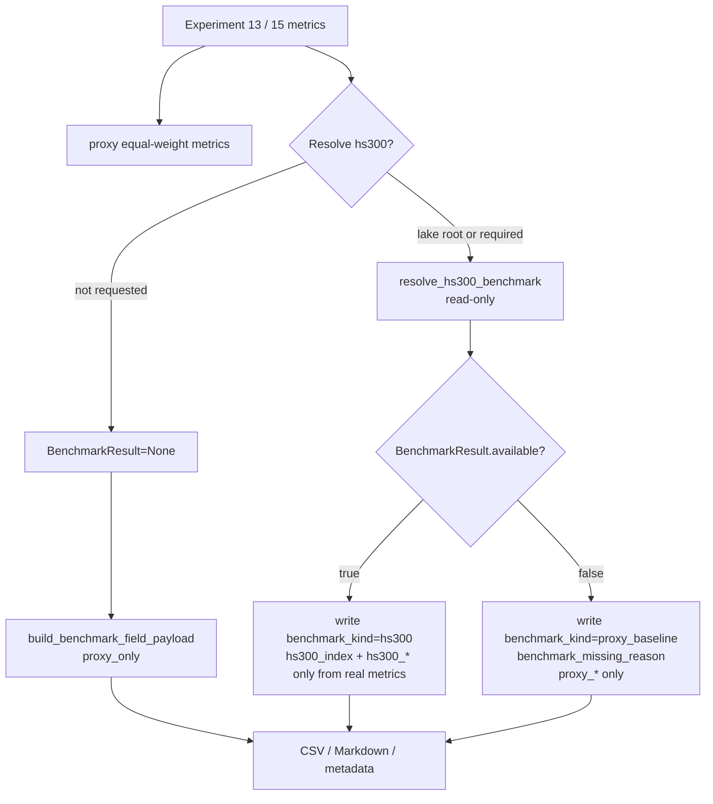

# LLD: CR008-S02 — proxy / real benchmark 字段隔离

> 本文档仅为 `CR008-S02-proxy-real-benchmark-field-separation` 的低层设计。当前 `confirmed=false`、`implementation_allowed=false`；在 `CR008-BATCH-A` 六份 LLD、六份 CP5 自动预检和 CP5 批次人工确认通过前，不得进入实现。
>
> 本 Story 不授权真实 Tushare 抓取、真实 lake read/write、旧 `data/**` 操作、旧 `reports/data_quality_report.csv` 读取/覆盖、凭据读取/打印或 `delivery/**` 修改。

## 1. Goal

修改实验报告与 benchmark metadata 字段合同，使代理 benchmark 只能写入 `proxy_*` / `proxy_baseline`，真实沪深300只在 `BenchmarkResult.available=true` 时写入 `hs300_*` / `hs300_index`；当真实 benchmark 不可用、coverage gap、quality fail、policy unconfirmed 或 price overlap missing 时，真实 `hs300_*` 输出次数为 0，并通过 `benchmark_status`、`benchmark_kind`、`benchmark_missing_reason` 暴露缺失原因。

## 2. Requirements（Functional / Non-Functional）

### 2.1 Functional

- 新增或收敛 benchmark 字段隔离 helper，使 `BenchmarkResult` 与 proxy metrics 统一映射为报告 metadata，不再由实验脚本各自拼接模糊字段。
- 修改实验十三报告字段：当前同股票池等权基准必须命名为 `proxy_baseline` / `proxy_*`；不得继续以“基准超额”或 `benchmark_total_return` 暗示真实沪深300。
- 修改实验十五因子框架报告与 summary：当前同股票池等权基准必须命名为 `proxy_baseline` / `proxy_*`；真实沪深300可用时才写 `hs300_*` 字段。
- 缺真实 benchmark 时，报告 metadata 必须包含 `benchmark_status`、`benchmark_kind`、`benchmark_missing_reason`；`hs300_index` 与所有 `hs300_*` 字段输出次数为 0。
- 真实 benchmark 可用时，metadata 必须保留 `BenchmarkResult.to_metadata()` 中的 coverage、denominator、quality、lineage、missing reason 和 `benchmark_kind` 证据。
- 相关文件不得导入 `market_data.connectors`、`market_data.runtime`、`market_data.storage`，不得触发 fetch/backfill/normalize/revalidate/replay。

### 2.2 Non-Functional

- 测试全部使用 tmp fixture、monkeypatch 或构造的 `BenchmarkResult`；网络调用次数、真实 lake 读写次数、凭据读取次数均为 0。
- 不读取、列出、迁移、复制、比对或删除旧 `data/**`；不读取、打开或覆盖旧 `reports/data_quality_report.csv`。
- 保持向后兼容优先：只删除或替换 S02 修改范围内新报告输出的模糊字段，不改历史报告文件，不回写旧产物。
- 字段规则必须可静态断言：禁止 exact key `benchmark_total_return`、`excess_return`、`hs300_total_return` 在 missing 路径出现。
- 设计必须与 CR007-S02 verified 的 `BenchmarkResult` coverage / missing reason 合同兼容。

## 3. 模块拆分与职责

| 模块 / 文件组 | 职责 | 说明 |
|---|---|---|
| `market_data/benchmarks.py` | 提供 benchmark 字段隔离 helper，基于 `BenchmarkResult` 与 proxy metrics 输出结构化 field payload | 只消费已验证的 resolver result；不导入 connector/runtime/storage；不执行补数 |
| `experiments/run_experiment_13.py` | 将实验十三同股票池等权基准输出为 `proxy_baseline` / `proxy_*`，可选接入真实 `hs300_index` metadata | 现有 `benchmark_proxy_equity_curve.csv` 命名保留；comparison 字段改为明确 proxy/hs300 语义 |
| `experiments/run_experiment_15_factor_framework.py` | 将因子策略回测中的等权代理基准与超额收益字段改为 `proxy_*`；真实可用时才写 `hs300_*` | 当前报告仍可声明“框架验证”，不得声明真实沪深300超额收益 |
| `tests/test_cr008_proxy_real_benchmark_fields.py` | 覆盖 real available、proxy only、required missing、字段禁用、import 边界和安全边界 | 使用 tmp output 和 monkeypatch，不需要 token、NAS、真实 lake 或旧数据 |

## 4. 代码结构与文件影响范围

| 动作 | 文件路径 | 变更内容 |
|---|---|---|
| 修改 | `market_data/benchmarks.py` | 创建 `build_benchmark_field_payload` 或等价 helper；输入 `BenchmarkResult | None`、`proxy_metrics`、可选 `hs300_metrics`，输出 `benchmark_status`、`benchmark_kind`、`benchmark_missing_reason`、`benchmark_result`、`proxy_baseline`、`proxy_*`、`hs300_*` 的隔离 payload |
| 修改 | `experiments/run_experiment_13.py` | 增加真实 benchmark metadata 的只读可选入口；将等权代理字段、Markdown 文案和 comparison row 从模糊“基准”迁移到 `proxy_baseline` / `proxy_*`；缺真实 benchmark 时不写 `hs300_*` |
| 修改 | `experiments/run_experiment_15_factor_framework.py` | 将 `benchmark_annual_return` / `excess_annual_return` 等代理语义字段迁移为 `proxy_annual_return` / `proxy_excess_annual_return`；真实 available 时使用 `hs300_annual_return` / `hs300_excess_annual_return` |
| 创建 | `tests/test_cr008_proxy_real_benchmark_fields.py` | 创建 CR008-S02 专属离线测试，覆盖字段隔离、metadata、缺失原因、no forbidden imports、no old data/report/credentials |

禁止修改：`market_data/connectors/**`、`market_data/runtime.py`、`market_data/storage.py`、`data/**`、`reports/data_quality_report.csv`、`.env`、`credentials`、`delivery/**`、`process/HLD.md`、`process/ARCHITECTURE-DECISION.md`。

## 5. 数据模型与持久化设计

无新增数据库、无新增 lake dataset、无新增外部持久化服务。本 Story 只改变运行期 payload、CSV / Markdown 报告字段和测试 fixture 输出。

| 对象 / 字段 | 类型 | 约束 | 说明 |
|---|---|---|---|
| `benchmark_status` | `str` | `available`、`unavailable`、`required_missing`、`quality_failed`、`proxy_only` | 顶层报告状态；无 resolver result 且允许 proxy 时为 `proxy_only` |
| `benchmark_kind` | `str` | `hs300` 或 `proxy_baseline` | 顶层报告语义；不得把 `BenchmarkResult.benchmark_kind=price_index` 直接作为顶层 kind |
| `benchmark_missing_reason` | `str | None` | 来自 `BenchmarkResult.missing_reason`，或 `not_requested` / `policy_unconfirmed` | 缺真实 benchmark 时必填；available 时为 `None` |
| `benchmark_result` | `dict | None` | `BenchmarkResult.to_metadata()` 原样保留 | 保留 coverage、denominator、quality、lineage、price_overlap 证据 |
| `hs300_index` | `dict` | 仅 `BenchmarkResult.available=true` 时出现 | 缺真实 benchmark 时该 key 输出次数为 0 |
| `hs300_total_return` | `float` | 仅真实 benchmark metrics 可计算且 available 时出现 | 不得由 proxy 填充 |
| `hs300_annual_return` | `float` | 仅真实 benchmark metrics 可计算且 available 时出现 | 不得由 proxy 填充 |
| `hs300_excess_return` / `hs300_excess_annual_return` | `float` | 策略收益减真实 hs300 收益；仅 available 时出现 | missing 时输出次数为 0 |
| `proxy_baseline` | `dict` | 代理对照描述，至少含 `name`、`kind`、`limitations` | 缺真实 benchmark 时必须存在 |
| `proxy_total_return` | `float` | 仅代理路径或保留代理对照时出现 | 不得命名为 `benchmark_total_return` |
| `proxy_annual_return` | `float` | 仅代理路径或保留代理对照时出现 | 实验十五替代旧 `benchmark_annual_return` |
| `proxy_excess_return` / `proxy_excess_annual_return` | `float` | 策略收益减 proxy 收益 | 替代 exact key `excess_return` / `excess_annual_return` 的代理语义 |

兼容性约束：

- `BenchmarkResult.to_metadata()` 现有字段不得删除或重命名。
- 可在新 payload 中保留 `benchmark_result` 作为原始 resolver 证据，但不得用它替代顶层隔离字段。
- 历史报告文件不回写；只约束本 Story 修改后新生成的报告与测试输出。

## 6. API / Interface 设计

| 接口 / 入口 | 输入 | 输出 | 调用方 | 说明 |
|---|---|---|---|---|
| `build_benchmark_field_payload(...)` | `result: BenchmarkResult | None`、`proxy_metrics: Mapping[str, Any] | None`、`hs300_metrics: Mapping[str, Any] | None`、`include_proxy_when_hs300_available: bool=False` | 隔离后的 metadata dict | 实验十三、实验十五、测试 | 第 10 节 T01-T04 覆盖；不得执行 resolver 或数据读取 |
| `resolve_benchmark_for_experiment_13(...)` 或复用现有 resolver wrapper | `lake_root`、`start_date`、`end_date`、`benchmark_kind`、`required`、`allow_warn`、`price_trade_dates` | `BenchmarkResult | None` | 实验十三 | 只读调用 `resolve_hs300_benchmark`；无 lake root 且非 required 时返回 `None` |
| 实验十三 comparison writer | `strategy metrics`、`proxy_metrics`、`benchmark_field_payload` | `cross_strategy_comparison.csv`、Markdown report | CLI / 测试 | 输出字段必须是 `proxy_*` 或 `hs300_*`，不得写 ambiguous exact key |
| 实验十五 `run_factor_backtest` summary | `close_df`、`factor_panel`、可选 `BenchmarkResult` / payload | `factor_backtest_summary.csv` dict | CLI / 测试 | 当前等权买入持有为 proxy；字段改为 `proxy_annual_return`、`proxy_excess_annual_return` |
| CR008-S02 测试入口 | tmp fixture、monkeypatch resolver / BenchmarkResult | pytest assertion | meta-dev / meta-qa | 命令：`uv run --python 3.11 pytest -q tests/test_cr008_proxy_real_benchmark_fields.py` |

错误 / 限制暴露：

- `BenchmarkResult.status in unavailable|required_missing|quality_failed` 时，payload 必须写 `benchmark_missing_reason`，并禁止写 `hs300_index` 与 `hs300_*`。
- `result is None` 且 proxy 可用时，payload 写 `benchmark_status=proxy_only`、`benchmark_kind=proxy_baseline`、`benchmark_missing_reason=not_requested`。
- `result.available=true` 但缺 `hs300_metrics` 时，仅写 `hs300_index` 与 metadata，不伪造收益字段。
- helper 不捕获并隐藏 resolver 的结构化状态；只做字段分类与命名隔离。

## 7. 核心处理流程

1. 实验脚本完成本地 close 数据加载和策略 / 因子回测，生成 strategy metrics 与 proxy equal-weight metrics。
2. 若显式提供 `market_data_lake_root` 或 `--require-benchmark`，实验脚本只读调用 `resolve_hs300_benchmark`；否则 `BenchmarkResult=None`。
3. 实验脚本将 `BenchmarkResult | None`、proxy metrics、可计算的 hs300 metrics 传入 `build_benchmark_field_payload`。
4. helper 先判断真实 benchmark 是否 available：
   - available：写 `benchmark_status=available`、`benchmark_kind=hs300`、`benchmark_result`、`hs300_index`，并只在真实 metrics 存在时写 `hs300_*`。
   - non-available：写 `benchmark_status=result.status`、`benchmark_kind=proxy_baseline`、`benchmark_missing_reason=result.missing_reason`，写 `proxy_baseline` / `proxy_*`，不写 `hs300_*`。
   - result missing：写 `benchmark_status=proxy_only`、`benchmark_kind=proxy_baseline`、`benchmark_missing_reason=not_requested`，写 `proxy_baseline` / `proxy_*`。
5. 实验十三将 comparison CSV / Markdown 的代理相关行和列命名为 `proxy_*` 或 `proxy_baseline`；真实 available 时可新增 `hs300_*` 行，不使用 proxy 填充。
6. 实验十五将因子策略 summary/report 中当前等权代理相关字段改为 `proxy_*`，并在限制说明中保留“同股票池等权代理，不是真实沪深300”的披露。
7. 测试对 real available、proxy only、required missing 三类路径做字段集合断言，并执行 AST import scan。



异常路径：

- `policy_unconfirmed`：`hs300_*` 输出次数为 0；`benchmark_missing_reason=policy_unconfirmed`。
- `calendar_missing` / `coverage_gap` / `price_benchmark_overlap_missing`：`hs300_*` 输出次数为 0；proxy 可作为探索对照。
- `quality_failed` / `lineage_unavailable` / `policy_mismatch`：`hs300_*` 输出次数为 0；不得声明真实沪深300超额收益。
- `lake_root_missing` / `not_requested`：默认 proxy-only；metadata 必须显式写 `benchmark_kind=proxy_baseline`。
- helper 输入同时包含 non-available result 和 hs300 metrics：必须忽略或拒绝 `hs300_metrics`，不得写 `hs300_*`。

## 8. 技术设计细节

- 关键规则：
  - 真实 benchmark 判定唯一条件：`isinstance(result, BenchmarkResult)`、`result.available is True`、`result.dataset == "hs300_index"`、`result.missing_reason is None`。
  - 顶层 `benchmark_kind` 只表达报告语义：`hs300` 或 `proxy_baseline`；`BenchmarkResult.benchmark_kind` 的 `price_index` / `total_return_index` 保留在 `benchmark_result` 和 `hs300_index` 内部。
  - missing 路径对所有 key 做前缀过滤：不得出现 `key == "hs300_index"` 或 `key.startswith("hs300_")`。
  - 模糊 exact key 禁止：`benchmark_total_return`、`excess_return`、`excess_annual_return` 不作为新报告字段；代理字段必须带 `proxy_` 前缀。
- 依赖选择与复用点：
  - 复用 CR007-S02 verified 的 `BenchmarkResult.status`、`coverage.denominator_mode=trade_calendar_open_dates`、`missing_reason`、`price_overlap` 和 `lineage`。
  - 复用实验十/十二的 resolver wrapper 设计，但 S02 不要求修改实验十/十二。
  - 复用实验十三现有 `benchmark_proxy_equity_curve.csv` 命名，不生成真实 hs300 曲线除非真实 available 且显式接入。
- 兼容性处理：
  - CLI 新增 `--benchmark-kind`、`--require-benchmark`、`--allow-benchmark-warn` 时默认保持 `policy_unconfirmed` / optional，不触发真实读取。
  - 历史报告不回写；旧文件路径仅作为字符串参数存在时不得在测试中读取或覆盖。
  - 如果 CR008-S01 后续冻结更细的 `research_input_v1` 字段名，S02 实现必须以 CR008-S01 confirmed LLD 为准调整 helper 输出。
- 图示类型选择：使用流程图，因为本 Story 跨 benchmark helper、实验十三、实验十五和测试四个模块，并存在 available / non-available / not-requested 异常分支。

## 9. 安全与性能设计

| 维度 | 设计措施 | 验证方式 |
|---|---|---|
| 安全 | `market_data/benchmarks.py` helper 只做 dict 字段归一，不执行 resolver、fetch、backfill、normalize、revalidate 或 replay | T05 AST import 与 monkeypatch 调用次数断言 |
| 安全 | 实验十三 / 十五只在显式 lake root 或 required benchmark 时只读 resolver；默认 proxy-only 不联网 | T02/T03 用 tmp fixture 和 monkeypatch result |
| 安全 | 禁止读取、打开或覆盖旧 `reports/data_quality_report.csv`；禁止操作旧 `data/**` | T06 静态路径与 tmp output 断言；测试不引用真实旧路径 |
| 安全 | 不读取、打印或记录 `.env`、Tushare token、NAS 凭据 | T04 设置 fake token 并断言 payload / report 不含 token 值 |
| 性能 | helper 对字段集合做 O(n) 分类，不扫描大 DataFrame；真实 metrics 由调用方显式传入 | T01/T02 小 fixture 验证；不新增长周期扫描 |
| 一致性 | available 与 missing 路径互斥，missing 路径强制删除 `hs300_*` | T01-T04 字段集合断言 |
| 幂等 | 测试写入 tmp output；重复运行覆盖 tmp 文件，不触碰历史报告 | pytest `tmp_path` |

## 10. 测试设计

| 测试场景 | 前置条件 | 操作 | 预期结果 | 验证方式 |
|---|---|---|---|---|
| T01 real available 字段 | 构造 available `BenchmarkResult`，传入 `hs300_metrics` 与 proxy metrics | 调用 `build_benchmark_field_payload` | 输出 `benchmark_status=available`、`benchmark_kind=hs300`、`hs300_index`、`hs300_*`；不出现 exact `benchmark_total_return` / `excess_return` | `uv run --python 3.11 pytest -q tests/test_cr008_proxy_real_benchmark_fields.py -k real_available` |
| T02 proxy only 字段 | `BenchmarkResult=None`，传入 proxy metrics | 调用 helper 或运行实验十三 tmp output | 输出 `benchmark_status=proxy_only`、`benchmark_kind=proxy_baseline`、`benchmark_missing_reason=not_requested`、`proxy_*`；`hs300_*` 输出次数为 0 | 同测试文件 |
| T03 required missing 字段 | 构造 `status=required_missing`、`missing_reason=coverage_gap` 的 `BenchmarkResult` | 调用 helper、实验十三 / 十五 metadata writer | 只写 `proxy_*` / `proxy_baseline`；不写 `hs300_index` / `hs300_*`；missing reason 保留 | 同测试文件 |
| T04 实验十五 summary 代理字段 | tmp prices / members / calendar fixture；无真实 benchmark | 运行 `run_factor_framework` | `factor_backtest_summary.csv` 含 `proxy_annual_return`、`proxy_excess_annual_return`；不含 exact `benchmark_annual_return`、`excess_annual_return` | 同测试文件 |
| T05 forbidden imports | 目标文件存在 | AST 扫描 `market_data/benchmarks.py`、`experiments/run_experiment_13.py`、`experiments/run_experiment_15_factor_framework.py` | 无 `market_data.connectors`、`market_data.runtime`、`market_data.storage`、`requests`、`httpx`、`aiohttp`、`socket` 导入 | 同测试文件 |
| T06 no old data / report / credentials | monkeypatch fake token；tmp output dir | 运行 helper / 实验局部函数 | payload/report 不含 token；不读取旧 `data/**` 或旧 `reports/data_quality_report.csv`；不写真实 `reports/**` | 同测试文件 |
| T07 CR007-S02 合同回归 | 现有 benchmark tests | 运行 benchmark resolver 相关回归 | `BenchmarkResult.to_metadata()` 字段不被删除；coverage/missing reason 语义不回退 | `uv run --python 3.11 pytest -q tests/test_market_data_hs300_benchmark.py` |

## 11. 实施步骤

| TASK-ID | 动作 | 目标文件 | 详细描述 | 对应测试 |
|---|---|---|---|---|
| CR008-S02-T1 | 修改 | `market_data/benchmarks.py` | 创建 `build_benchmark_field_payload` 或等价 helper；实现 available / missing / proxy-only 字段互斥；保留 `BenchmarkResult.to_metadata()` 原 schema | T01、T02、T03、T05、T07 |
| CR008-S02-T2 | 修改 | `experiments/run_experiment_13.py` | 接入 helper；将等权代理 comparison / Markdown / metadata 命名为 `proxy_*` / `proxy_baseline`；可选只读 resolver；missing 时 `hs300_*` 输出 0 | T02、T03、T05、T06 |
| CR008-S02-T3 | 修改 | `experiments/run_experiment_15_factor_framework.py` | 将因子策略 summary/report 中代理 benchmark 和超额字段迁移为 `proxy_*`；真实 available 时才写 `hs300_*` | T03、T04、T05、T06 |
| CR008-S02-T4 | 创建 | `tests/test_cr008_proxy_real_benchmark_fields.py` | 创建 tmp fixture、BenchmarkResult factory、payload 字段断言、AST import scan、old path / credential 禁用断言 | T01-T06 |

每个文件影响项均由至少一个 TASK-ID 覆盖；每个 TASK-ID 均有对应测试入口。实现阶段必须按 T1 -> T4 顺序执行；若 CR008-S01 LLD 确认的 `research_input_v1` 字段与本 LLD 顶层字段冲突，先停止实现并回到 CP5 修改 S02 LLD。

## 12. 风险、难点与预研建议

| 风险 / 难点 | 影响 | 缓解措施 / 预研建议 |
|---|---|---|
| CR008-S01 metadata 合同尚未 confirmed | S02 helper 字段可能与 `research_input_v1` 最终字段名不完全一致 | 本 LLD 固定最小字段集；实现前必须读取 S01 confirmed LLD 并以其字段名为准 |
| ADR-025 文件内状态仍写 `Draft for CR-008 CP3/CP4 review` | 设计文件状态与 CP3/CP4 人工稿 approved 存在文本不同步 | 以 `checkpoints/CP3-CR008-HLD-REVIEW.md` 和 `checkpoints/CP4-CR008-STORY-PLAN-REVIEW.md` approved 为本轮 LLD 依据；不修改 ADR |
| 实验十三现有中文 comparison table 没有稳定机器字段 | 字段隔离测试可能难以断言 | S02 应新增或规范机器可读 metadata / CSV keys，Markdown 允许中文说明但不得写模糊机器 key |
| `BenchmarkResult.benchmark_kind` 与顶层 `benchmark_kind` 语义不同 | 可能把 `price_index` 当成报告 kind | 顶层 `benchmark_kind` 只用 `hs300` / `proxy_baseline`；原值保留在 `benchmark_result` |
| 继续保留 proxy 对照可能被误读为真实 benchmark | 报告结论误导 | proxy 字段必须带 `proxy_` 前缀，并写 `benchmark_missing_reason` 与 limitations |
| 与 CR007-S04 实验十三真实 benchmark 消费范围重叠 | 后续实现顺序可能冲突 | CR008 冲突优先；S02 只做字段隔离，不授权 CR007-S04 旧语义继续写模糊字段 |

### OPEN / Spike 跟踪

| ID | 类型（OPEN / Spike） | 问题 | 下一动作 | 责任方 |
|---|---|---|---|---|
| O-01 | OPEN | CR008-S01 `research_input_v1` metadata 合同尚未 confirmed | 批次 CP5 前对齐 S01 LLD；实现前以 S01 confirmed 合同为准 | meta-dev / meta-po |
| O-02 | OPEN | 缺真实 benchmark 时是否继续生成 proxy 报告仍是 HLD CR8-Q2 OPEN，默认允许探索 proxy | CP5 批次人工确认时由用户接受或修改默认策略 | user / meta-po |
| O-03 | OPEN | Story 卡片与 Development Plan frontmatter 仍为 `status: draft`，但 CR/STATE/CP4 已批准进入 LLD | meta-po 批次聚合前回填 Story 状态；本线程按用户授权只写 LLD/CP5 | meta-po |

## 13. 回滚与发布策略

- 发布方式：本 Story 实现后只通过代码与离线测试进入仓库；不生成交付包，不运行真实 Tushare，不写真实 lake，不改历史报告。
- 回滚触发条件：
  - missing 路径出现 `hs300_index` 或任意 `hs300_*` 字段。
  - proxy 路径写入 exact `benchmark_total_return`、`excess_return` 或其他无前缀真实/代理混淆字段。
  - `market_data/benchmarks.py`、实验十三或实验十五引入 connector/runtime/storage import、联网库 import 或自动 backfill 调用。
  - `BenchmarkResult.to_metadata()` 删除或重命名 CR007-S02 / CR005 已验证字段。
  - 测试读取旧 `data/**`、旧 `reports/data_quality_report.csv` 或凭据。
- 回滚动作：
  - 回退 `market_data/benchmarks.py` 中 S02 helper 与导出符号。
  - 回退实验十三 / 十五字段改造，保留失败测试作为复现证据。
  - 若冲突来自 S01 合同变更，回到 CP5 修改 LLD 后再实现。
- 数据回滚：无真实数据写入；tmp fixture 由 pytest 生命周期清理。不得删除、覆盖、读取或比较旧 `data/**` 与旧 `reports/data_quality_report.csv`。

## 14. Definition of Done

- [ ] 14 个章节全部填写完成，frontmatter `tier=M`、`confirmed=false`、`implementation_allowed=false`。
- [ ] `process/checks/CP5-CR008-S02-proxy-real-benchmark-field-separation-LLD-IMPLEMENTABILITY.md` 已写入。
- [ ] `build_benchmark_field_payload` 或等价 helper 能区分 available / missing / proxy-only 三类路径。
- [ ] 缺真实 benchmark 时 `hs300_*` 和 `hs300_index` 输出次数为 0。
- [ ] proxy 字段全部使用 `proxy_*` / `proxy_baseline` 命名。
- [ ] metadata 包含 `benchmark_status`、`benchmark_kind`、`benchmark_missing_reason`。
- [ ] 相关文件 connector/runtime/storage import 次数为 0。
- [ ] 旧 `data/**`、旧 `reports/data_quality_report.csv`、`.env` 和凭据操作次数为 0。
- [ ] `tests/test_cr008_proxy_real_benchmark_fields.py` 覆盖 T01-T06，CR007-S02 benchmark 回归 T07 通过。
- [ ] OPEN / Spike 已清点；CP5 批次人工确认前不进入实现。

## 人工确认区

> **CP5 — Story LLD 可实现性门**
> meta-dev 已先写入 `process/checks/CP5-CR008-S02-proxy-real-benchmark-field-separation-LLD-IMPLEMENTABILITY.md` 自动预检结果。
> meta-po 收齐 `CR008-BATCH-A` 六个 Story 的 LLD 和 CP5 自动预检后，再生成并提示用户审查 `checkpoints/CP5-CR008-BATCH-A-LLD-BATCH.md`。
> 用户统一确认全部目标 Story 的 LLD 后，仍需满足当前 Wave、依赖门控与文件所有权门控方可进入实现。

**CP5 checklist 摘要**：

| # | 检查项 | 状态 | 证据 |
|---|---|---|---|
| 1 | LLD 覆盖 AC | PASS | 第 2 / 10 / 14 节 |
| 2 | 与 HLD / ADR 一致 | PASS | 第 3 / 8 / 12 节 |
| 3 | 文件影响范围明确 | PASS | 第 4 / 11 节 |
| 4 | 接口契约完整 | PASS | 第 6 节 |
| 5 | 测试与 dev_gate 可计算 | PASS | 第 10 / 14 节 |

**人工确认回复**：

请直接回复以下任一整行：

```text
approve
修改: <具体修改点>
reject
```

- `approve`：LLD 设计合理，允许纳入 `CR008-BATCH-A` CP5 批次确认。
- `修改: <具体修改点>`：指出具体修改点后由 meta-dev 更新重提。
- `reject`：设计方向有根本问题，需重新设计。

**人工审查结果回填**：

- 结论：`approved | changes_requested | rejected`
- 审查人：
- 审查时间：
- 修改意见：
- 风险接受项：
