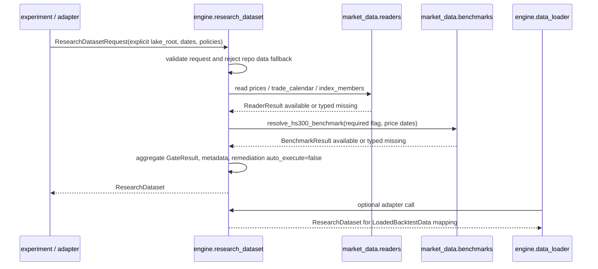

# LLD: CR008-S03 — 统一 research dataset builder

> 本文档仅是 `CR008-S03-research-dataset-builder` 的低层设计。`confirmed=false`，且 CR008 CP5 批次人工确认前 `implementation_allowed=false`。本 LLD 不授权实现、不授权真实 Tushare fetch、不授权真实 lake read/write、不授权旧 `data/**` 或旧 `reports/data_quality_report.csv` 操作、不授权凭据读取或打印。

## 1. Goal

创建 `engine/research_dataset.py` 统一研究数据集构建入口，使实验和后续因子研究通过显式 `ResearchDatasetRequest` 只读消费 `market_data.readers` 与 benchmark resolver，聚合 prices、calendar、benchmark、universe、metadata 和 `GateResult`；缺失或质量不满足时返回 typed result 与 `auto_execute=false` remediation，不触发 fetch/backfill、normalize、revalidate、replay 或旧数据 fallback。

## 2. Requirements（Functional / Non-Functional）

### 2.1 Functional

- 创建 `ResearchDatasetRequest`，显式声明 `lake_root`、`start_date`、`end_date`、`universe`、`universe_mode`、`benchmark_policy`、`adjustment_policy`、`forward_return_horizon`、`analysis_mode` 和可选 `symbols`。
- 创建 `ResearchDataset`，承载 `prices`、`close_df`、`calendar`、`universe_symbols`、`benchmark_result`、`metadata`、`gate_result`、`issues`、`known_limitations`、`allowed_claims` 和 `remediation_spec`。
- 创建 `GateResult` / `ResearchDatasetIssue` / `ResearchDatasetStatus` 等 typed result，支持 `available`、`available_with_warnings`、`required_missing`、`quality_failed`、`invalid_request`、`gate_failed`。
- 创建 `build_research_dataset(request, *, reader=read_dataset, benchmark_resolver=resolve_hs300_benchmark)`，按只读方式聚合 prices、trade_calendar、index_members、benchmark，并输出统一 metadata。
- 创建 typed missing 合同：任何 reader / benchmark 缺失只能进入 `issues`、`gate_result`、`remediation_spec`；所有 remediation 必须包含 `auto_execute=false` 或等价字段，且不得自动执行。
- 修改 `engine/data_loader.py`，新增显式 adapter `load_research_backtest_data` 或等价入口，把需要 CR008 研究合同的调用委托到 `build_research_dataset`；保留既有 `load_backtest_data` 行为不变。
- 修改 `market_data/readers.py`，新增只读 helper `read_research_inputs` 或等价 helper，批量读取 `prices`、`trade_calendar`、`index_members` 并返回 `dict[str, ReaderResult]`；该 helper 不导入 `engine.*`，不触发 connector/runtime/storage。
- 创建 `tests/test_cr008_research_dataset_builder.py`，覆盖 available、typed missing、benchmark missing、remediation no auto execute、forbidden import、no old data、no legacy report、no credentials、data_loader adapter。

### 2.2 Non-Functional

- builder 消费路径网络调用次数为 0；不得导入 `market_data.connectors`、`market_data.runtime`、`market_data.storage`。
- builder 必须要求显式 `lake_root`，不得依赖 `MARKET_DATA_LAKE_ROOT` env fallback，不得读取 `.env`、token、NAS 用户名、NAS 密码或其他凭据。
- builder 必须拒绝 repo-relative `data` / `data/**` 作为 lake root；不得读取、列出、迁移、复制、比对或删除旧 `data/**`。
- builder 不读取、打开或覆盖旧 `reports/data_quality_report.csv`；质量与 coverage 只来自 `ReaderResult.catalog_entry`、reader metadata、BenchmarkResult 或后续 S04 gate 输入。
- `ResearchDataset.metadata` 必须覆盖 S01/S02 草案必填字段：coverage、benchmark status/kind/missing reason、universe mode、adjustment policy、label window、quality/readiness、known limitations。
- CP5 批次人工确认前不得进入实现；S01/S02 合同冻结前不得把 `research_input_v1` 或 proxy/real benchmark 字段视为最终实现合同。

## 3. 模块拆分与职责

| 模块 / 文件组 | 职责 | 说明 |
|---|---|---|
| `engine/research_dataset.py` | 创建 `ResearchDatasetRequest`、`ResearchDataset`、`GateResult`、`ResearchDatasetIssue`、`build_research_dataset`、metadata 聚合与 remediation 归一化 | S03 主产物；只读消费 `market_data.readers` 与 `market_data.benchmarks` |
| `engine/data_loader.py` | 新增 CR008 兼容 adapter，把需要研究合同的轻量回测输入委托给 `build_research_dataset`，并返回既有 `LoadedBacktestData` 形态 | 保留现有 `load_backtest_data` 与 legacy/canonical 行为；不扩大旧 data fallback |
| `market_data/readers.py` | 新增批量只读 helper 或补齐 reader result 字段，帮助 builder 一次读取 prices/calendar/universe | 不导入 `engine.*`，不导入 connector/runtime/storage；继续返回 `ReaderResult` |
| `tests/test_cr008_research_dataset_builder.py` | 创建 S03 离线测试集 | tmp fixture / monkeypatch reader 与 benchmark resolver；不需要 token、NAS、真实 lake |
| CR008-S01 contract draft | 提供 `research_input_v1` metadata 字段草案 | LLD 可引用，开发必须等合同冻结 |
| CR008-S02 contract draft | 提供 proxy / real benchmark 字段隔离草案 | LLD 可引用，开发必须等合同冻结 |
| CR008-S04/S05/S06 后续 Story | 在 S03 builder 输出上追加 quality/label/PIT/auxiliary gates 和 allowed claims | S03 预留扩展字段，不实现 S04/S05/S06 业务规则 |

## 4. 代码结构与文件影响范围

| 动作 | 文件路径 | 变更内容 |
|---|---|---|
| 创建 | `engine/research_dataset.py` | 定义 request/result/gate/issue typed contract；实现 `build_research_dataset`、reader/benchmark missing 映射、metadata 聚合、remediation `auto_execute=false` 归一化、repo old-data 路径拒绝 |
| 修改 | `engine/data_loader.py` | 新增 `load_research_backtest_data` 或等价 adapter，将 `ResearchDataset` 转换为 `LoadedBacktestData`；不修改既有 `load_backtest_data` 默认路径，不读取旧质量报告 |
| 修改 | `market_data/readers.py` | 新增 `ResearchInputReaderRequest` / `read_research_inputs` 或等价只读 helper，批量返回 `prices`、`trade_calendar`、`index_members` 的 `ReaderResult`；不触发数据层写入 |
| 创建 | `tests/test_cr008_research_dataset_builder.py` | 创建 S03 targeted tests，覆盖 available、missing、benchmark policy、remediation、安全边界和 adapter |

禁止修改：`market_data/connectors/**`、`market_data/runtime.py`、`market_data/storage.py`、`data/**`、`reports/data_quality_report.csv`、`.env`、`credentials`、`delivery/**`、CR008-S01/S02/S04/S05/S06 LLD 或业务产物。

## 5. 数据模型与持久化设计

| 对象 / 字段 | 类型 | 约束 | 说明 |
|---|---|---|---|
| `ResearchDatasetRequest.lake_root` | `str | Path` | 必填；不得为 repo-relative `data` / `data/**`；不得为 `None` | 防止 env fallback 和旧数据 fallback |
| `ResearchDatasetRequest.start_date/end_date` | `str | date` | 必填；`start_date <= end_date` | 传给 reader 与 benchmark resolver |
| `ResearchDatasetRequest.universe` | `str` | 默认 `csi300`；S03 只声明语义 | S05 冻结 PIT/fixed 细则 |
| `ResearchDatasetRequest.universe_mode` | `str` | 枚举草案：`fixed_snapshot`、`pit_required`、`pit_optional` | S05 最终冻结；S03 输出 metadata |
| `ResearchDatasetRequest.benchmark_policy` | `str | Mapping | BenchmarkPolicy` | 枚举草案：`hs300_required`、`hs300_optional`、`proxy_allowed` | S02 最终冻结字段；S03 映射 required flag |
| `ResearchDatasetRequest.adjustment_policy` | `str` | 默认 `qfq`；同一 dataset 只能单一口径 | S04 后续加强 gate；S03 先检查 reader frame 中显式不一致 |
| `ResearchDatasetRequest.forward_return_horizon` | `int` | `>= 1` | S04 计算 label window；S03 metadata 必填 |
| `ResearchDatasetRequest.analysis_mode` | `str` | `research` 或 `exploratory` | 严肃/探索降级由 S04/S05/S06 进一步细化 |
| `ResearchDataset.status` | `str` | `available`、`available_with_warnings`、`required_missing`、`quality_failed`、`invalid_request`、`gate_failed` | 由 reader、benchmark 和 gate issue 聚合得到 |
| `ResearchDataset.prices` | `pd.DataFrame | None` | available 时非空；保留 canonical 行字段 | 面向因子和后续 gate；不持久化 |
| `ResearchDataset.close_df` | `pd.DataFrame | None` | available 时可由 adjusted close 或 close pivot 生成 | 供 adapter 和轻量回测兼容 |
| `ResearchDataset.calendar` | `list[date]` | 来自 `trade_calendar` 或 prices trade dates 交集；缺失进入 typed missing | S04 可进一步要求 label window |
| `ResearchDataset.universe_symbols` | `list[str]` | 来自 request symbols 或 index_members reader result | S05 冻结 PIT/fixed 语义 |
| `ResearchDataset.benchmark_result` | `BenchmarkResult | Mapping | None` | 不可用时保留 missing metadata | S02 冻结 proxy/real 字段隔离 |
| `GateResult.status` | `str` | `pass`、`warn`、`fail`、`not_evaluated` | S03 输出框架；S04/S05/S06 扩展具体 gate |
| `GateResult.issues` | `list[ResearchDatasetIssue]` | issue 必含 `code`、`severity`、`dataset?`、`message` | 可测试错误路径 |
| `GateResult.remediation_spec` | `dict` | 所有 action 必须 `auto_execute=false` | 只建议上游显式 job，不执行 |
| `ResearchDataset.metadata` | `dict[str, Any]` | `schema_version=research_input_v1`；字段覆盖 S01/S02 草案 | 报告消费的最小事实源 |

无新增持久化表、无新增数据湖目录、无新增真实数据写入。S03 只创建内存 dataclass / dict 合同；后续报告是否持久化 metadata 由 S01 和实验 Story 处理。

## 6. API / Interface 设计

| 接口 / 入口 | 输入 | 输出 | 调用方 | 说明 |
|---|---|---|---|---|
| `ResearchDatasetRequest(...)` | 显式 lake root、日期区间、universe、benchmark policy、adjustment policy、horizon、mode、可选 symbols | immutable request object | 实验入口、data_loader adapter、测试 | 缺 lake root 或旧 data path 在 builder 中返回 `invalid_request`；测试 T01/T05 |
| `build_research_dataset(request, *, reader=read_dataset, benchmark_resolver=resolve_hs300_benchmark)` | `ResearchDatasetRequest`；可注入 reader/resolver | `ResearchDataset` | 实验十三/十五后续 adapter、S04/S05/S06 gates | 只读聚合 prices/calendar/universe/benchmark；测试 T01-T06 |
| `ResearchDataset.to_metadata()` 或 `build_research_input_metadata(dataset)` | `ResearchDataset` | `dict`，含 `research_input_v1` 字段 | report metadata writer / tests | 字段集对齐 S01/S02 草案；测试 T01/T04 |
| `GateResult.add_issue(...)` 或内部 issue factory | reader/benchmark issue、severity、dataset、remediation | `GateResult` | builder 内部 | 异常路径必须结构化；测试 T02/T03 |
| `normalize_remediation_spec(...)` | reader remediation、BenchmarkResult next_action/remediation | dict，所有 executable action 均 `auto_execute=false` | builder 内部 | 防止隐式补数；测试 T02/T03/T05 |
| `load_research_backtest_data(config)` | dict / adapter config，字段映射到 `ResearchDatasetRequest` | `LoadedBacktestData` 或抛出现有 loader typed error | 兼容轻量回测调用 | 仅新增入口，不改旧默认；测试 T07 |
| `read_research_inputs(request)` in `market_data.readers` | lake root、日期、symbols、datasets、quality policy | `dict[str, ReaderResult]` | `engine.research_dataset` | 只读 helper，不依赖 engine；测试 T01/T05/T06 |

每个接口均在第 10 节有对应测试入口。实现时 `engine.research_dataset` 可以直接调用现有 `read_dataset`；若新增 `read_research_inputs`，其输出必须仍是 `ReaderResult`，避免在 `market_data` 层引入 `engine` 类型。

## 7. 核心处理流程

1. 调用方构造 `ResearchDatasetRequest`，显式传入 `lake_root`、`start_date`、`end_date`、`benchmark_policy`、`adjustment_policy`、`forward_return_horizon`。
2. builder 执行 request 前置校验：日期合法、lake root 非空、lake root 不指向 repo-relative `data/**`、horizon >= 1、benchmark/universe/analysis mode 在允许集合内。
3. builder 调用 `read_research_inputs` 或三次 `read_dataset`，读取 `prices`、`trade_calendar`、`index_members`；所有调用传入显式 `lake_root`，不依赖 env fallback。
4. builder 对每个 `ReaderResult` 做状态归一：`available` 进入内存 frame；`quality_failed`、`required_missing`、`unavailable` 进入 `ResearchDatasetIssue` 与 `GateResult`。
5. builder 从 prices / calendar 生成 `calendar`、`close_df` 和 `universe_symbols`；若 prices 必需字段缺失、frame 为空或 adjustment policy mismatch，返回 typed failure。
6. builder 按 `benchmark_policy` 调用 `resolve_hs300_benchmark`；真实 benchmark 不可用时，按 S02 草案写 `benchmark_status`、`benchmark_kind`、`benchmark_missing_reason`，不得填充 `hs300_*`。
7. builder 聚合 `research_input_v1` metadata：coverage、source/manifest lineage、quality/readiness、benchmark、universe、adjustment、label horizon、known limitations、allowed claims。
8. builder 归一 remediation：从 reader/BenchmarkResult 收集建议动作，强制 `auto_execute=false`、`dry_run_default=true` 或等价字段，并写入 `GateResult.remediation_spec`。
9. builder 返回 `ResearchDataset`。`status` 为 available / available_with_warnings / required_missing / quality_failed / invalid_request / gate_failed 之一；任何 failure 都不触发数据生产。
10. `engine/data_loader.py` 新 adapter 把 available 的 `ResearchDataset.close_df/calendar/universe/metadata` 转为 `LoadedBacktestData`；failure 映射为现有 `DataContractError` / `DataQualityGateError`，不读取旧质量报告。

异常路径：

- `lake_root_missing`：返回 `invalid_request`，不读取 env、`.env`、旧 `data/**`。
- `repo_data_reference_only`：lake root 为 `data` / `data/**` 时返回 `invalid_request`。
- `prices_required_missing`：prices reader 非 available 时返回 `required_missing`，remediation 仅建议显式数据层 job。
- `quality_failed`：reader 或 catalog quality fail 时返回 `quality_failed`，不走探索 fallback。
- `adjustment_policy_mismatch`：prices frame 中口径与 request 不一致时返回 `quality_failed` 或 `gate_failed`。
- `benchmark_required_missing`：`hs300_required` 且 BenchmarkResult 非 available 时返回 required missing；`proxy_allowed` 时仅允许 proxy metadata，不填真实 hs300 字段。
- `calendar_missing`：trade_calendar 不可用时返回 typed missing；S04 可决定是否允许探索截断。
- `universe_missing`：index_members 不可用且 request 未显式 symbols 时返回 typed missing；若有 explicit symbols，可标记 fixed/exploratory limitation。

## 8. 技术设计细节

- 关键算法 / 规则：
  - status 聚合优先级：`invalid_request` > `quality_failed` > `required_missing` > `gate_failed` > `available_with_warnings` > `available`。
  - required datasets：S03 默认 `prices` 必需；`trade_calendar` 与 `index_members` 按 request mode 决定 required，但缺失必须进入 metadata 和 limitations，不得静默忽略。
  - coverage：`coverage_start` / `coverage_end` 优先取 `prices.trade_date` 与 `calendar` 交集；缺 calendar 时取 prices 可用区间并标记 limitation。
  - close matrix：优先使用 `adjusted_close`，缺失时使用 `close`，并将 `adjusted_price_ready=false` 写入 metadata；S04 冻结复权 gate 后可改为 fail。
  - universe：优先 request symbols，其次 index_members 的 `symbol` 或 `con_code` 映射；S05 冻结 PIT/fixed 语义前，S03 只输出 `universe_mode`、`is_pit_universe`、`pit_status` 草案字段。
  - benchmark：只调用 `resolve_hs300_benchmark`，不自行读取 hs300 parquet；结果 metadata 必须保留 `status`、`benchmark_kind`、`missing_reason`、coverage 和 remediation。
  - remediation：递归检查 remediation dict/list；若存在 action/next_action/job spec，强制补 `auto_execute=false`，保留 `dry_run_default=true`。
- 依赖选择与复用点：
  - 复用 `market_data.readers.ReaderResult`、`QualityPolicy`、`read_dataset`。
  - 复用 `market_data.benchmarks.BenchmarkPolicy`、`BenchmarkResult`、`resolve_hs300_benchmark`。
  - 复用 `engine.data_loader.LoadedBacktestData` 作为兼容 adapter 输出，不重写旧 loader。
  - 不引入 Qlib、Backtrader、VectorBT、LEAN、vn.py、NautilusTrader 或 QUANTAXIS。
- 兼容性处理：
  - 新增 `engine/research_dataset.py` 不改变现有实验入口默认行为；后续 S01/S02/S04/S05/S06 再接入具体实验。
  - `market_data/readers.py` 新 helper 保持纯 reader 层输出，不引用 `ResearchDataset` 类型，避免 `market_data -> engine` 反向依赖。
  - `engine/data_loader.py` 新 adapter 是显式 opt-in；旧 `LoaderConfig(input_mode=legacy_flat/canonical_gold)` 不变。
- 图示类型选择：使用时序图，因为本 Story 跨 `engine.research_dataset`、`market_data.readers`、`market_data.benchmarks`、`engine.data_loader` 四个模块，并存在多类 typed missing / quality failure 分支。

## 9. 安全与性能设计

| 维度 | 设计措施 | 验证方式 |
|---|---|---|
| 安全 | `ResearchDatasetRequest.lake_root` 必填；builder 不调用 `_lake_root(None)`，不依赖 env fallback | T05 传 `lake_root=None` 断言 `invalid_request`；monkeypatch env 后不被消费 |
| 安全 | 拒绝 repo-relative `data` / `data/**`；不读取、列出、迁移、复制、比对或删除旧数据 | T05/T06 path sentinel 和 monkeypatch reader 断言 |
| 安全 | 不读取旧 `reports/data_quality_report.csv`，不把旧报告当 current truth | T06 静态扫描和 path sentinel |
| 安全 | `engine/research_dataset.py`、新增 reader helper、data_loader adapter 不导入 connector/runtime/storage | T06 AST import 扫描 |
| 安全 | 不读取、打印或记录 `.env`、token、NAS 凭据；metadata 只允许 env var 名称或安全占位符 | T06 设置假 token 后断言 metadata / issues / remediation 不含 token 值 |
| 安全 | remediation 只建议显式上游 job，所有 job spec `auto_execute=false` | T02/T03/T05 递归断言 |
| 性能 | reader 结果只按 dataset 各读取一次；close matrix pivot 只对过滤后 prices 执行 | T01 小样本验证；长区间复杂度 O(rows) 加 pivot |
| 性能 | metadata / issue 聚合使用 list/dict，不新增常驻进程、缓存服务或后台任务 | 单元测试内存断言 |
| 可维护性 | GateResult 预留 `checks` / `issues` / `known_limitations` / `allowed_claims`，供 S04/S05/S06 扩展 | CP5 检查 S04/S05/S06 依赖字段存在 |

## 10. 测试设计

| 测试场景 | 前置条件 | 操作 | 预期结果 | 验证方式 |
|---|---|---|---|---|
| T01 happy path 生成 ResearchDataset | monkeypatch reader 返回 prices/calendar/index_members available；benchmark resolver 返回 available BenchmarkResult | 调用 `build_research_dataset` | `status=available`；`close_df`、calendar、universe 非空；metadata 含 `research_input_v1`、coverage、benchmark、universe、adjustment、label horizon | `uv run --python 3.11 pytest -q tests/test_cr008_research_dataset_builder.py -k happy_path` |
| T02 prices missing typed result | reader 返回 prices `required_missing`，附 remediation | 调用 builder | `status=required_missing`；issues 含 dataset=prices；不抛未结构化异常；remediation `auto_execute=false` | 同测试文件 |
| T03 quality failed | reader 返回 prices 或 catalog `quality_failed` | 调用 builder | `status=quality_failed`；不调用补数；metadata 不声明 available | 同测试文件 |
| T04 benchmark unavailable / proxy allowed | benchmark resolver 返回 unavailable 或 required_missing；request policy=`proxy_allowed` | 调用 builder | metadata 写 `benchmark_status`、`benchmark_missing_reason`；真实 `hs300_*` 输出 0；allowed claims 不含真实 hs300 超额 | 同测试文件 |
| T05 invalid request and no env fallback | `lake_root=None` 或 `lake_root="data"`；env 中设置假 lake/token | 调用 builder | 返回 `invalid_request`；不调用 reader；不读取 env fallback；不泄漏 token 值 | 同测试文件 + monkeypatch |
| T06 forbidden import / old data / legacy report boundary | 代码实现后 | AST 扫描 `engine/research_dataset.py`、`engine/data_loader.py`、`market_data/readers.py`；path sentinel | connector/runtime/storage import 次数为 0；旧 `data/**`、旧质量报告、`.env`、credentials 操作次数为 0 | 同测试文件 |
| T07 data_loader adapter | builder monkeypatch 返回 available / failure 两组 result | 调用 `load_research_backtest_data` | available 转为 `LoadedBacktestData`；failure 映射为 `DataContractError` / `DataQualityGateError`；旧 `load_backtest_data` 不变 | 同测试文件 |
| T08 remediation no auto execute | reader 与 BenchmarkResult 均带 remediation spec | 调用 builder | 递归 remediation 中所有 action 均 `auto_execute=false` 或 `dry_run_default=true`；无执行函数调用 | 同测试文件 |

接口到测试映射：

| 第 6 节接口 | 对应测试 |
|---|---|
| `ResearchDatasetRequest` | T01、T05 |
| `build_research_dataset` | T01、T02、T03、T04、T05、T08 |
| metadata builder / `to_metadata` | T01、T04 |
| GateResult issue factory | T02、T03、T04 |
| remediation normalizer | T02、T03、T08 |
| `load_research_backtest_data` | T07 |
| `read_research_inputs` | T01、T02、T03、T06 |

## 11. 实施步骤

| TASK-ID | 动作 | 目标文件 | 详细描述 | 对应测试 |
|---|---|---|---|---|
| CR008-S03-T1 | 创建 | `engine/research_dataset.py` | 定义 request/result/gate/issue/status dataclass 与 `build_research_dataset`；实现 request 校验、reader/benchmark 聚合、metadata、typed missing、remediation `auto_execute=false` | T01-T05、T08 |
| CR008-S03-T2 | 修改 | `engine/data_loader.py` | 新增显式 `load_research_backtest_data` adapter；将 available `ResearchDataset` 转为 `LoadedBacktestData`，failure 映射现有 loader error；不改变旧默认入口 | T07 |
| CR008-S03-T3 | 修改 | `market_data/readers.py` | 新增 `ResearchInputReaderRequest` / `read_research_inputs` 或等价 helper；批量只读 prices/calendar/index_members；保持 no engine import、no connector/runtime/storage import | T01-T03、T06 |
| CR008-S03-T4 | 创建 | `tests/test_cr008_research_dataset_builder.py` | 创建 tmp/monkeypatch 测试，覆盖 happy path、missing、quality fail、benchmark unavailable、invalid request、no env fallback、forbidden import、no old data、adapter、remediation | T01-T08 |

每个 TASK-ID 均对应文件影响范围；每个文件影响项至少被一个 TASK-ID 覆盖。实现阶段必须按 T1 -> T4 顺序推进；若 S01/S02 合同冻结结果改变 metadata 或 benchmark 字段，先更新本 LLD 再实现。

## 12. 风险、难点与预研建议

| 风险 / 难点 | 影响 | 缓解措施 / 预研建议 |
|---|---|---|
| S01 `research_input_v1` 字段尚未冻结 | S03 metadata 名称可能与 S01 最终合同不一致 | S03 使用 S01 Story 草案字段；实现前必须等待 S01 LLD confirmed 或批次 CP5 统一确认 |
| S02 proxy / real benchmark 字段尚未冻结 | S03 对 `benchmark_policy`、`benchmark_status`、`hs300_*` 输出边界可能需要调整 | S03 只聚合 BenchmarkResult，不自行计算 proxy/hs300 收益；实现前等待 S02 合同冻结 |
| `market_data.readers.read_dataset` 当前会在 lake_root None 时读 env | 若 builder 直接传 None，会违反显式 lake root 边界 | builder 前置校验必须阻断 None；测试 T05 monkeypatch env 证明不消费 fallback |
| `engine/data_loader.py` 仍有 legacy_flat 兼容逻辑 | 错误接入可能重新打开旧 `data/**` fallback | 新 adapter 使用独立入口和显式 request；不修改旧默认逻辑；测试 T07/T06 覆盖 |
| S04/S05/S06 会共享 `engine/research_dataset.py` | 开发阶段文件冲突和 gate result 语义冲突 | CP5 后开发默认 S03 先行；S04/S05/S06 等 S03 contract frozen 后再串行或由 meta-po 重新判定 file ownership |
| `ResearchDataset` 容易膨胀成数据生产层 | 可能突破 CR006/CR007 离线边界 | ADR-026 强制只读；代码只允许 reader/resolver 注入；remediation 不执行；forbidden import 测试 |
| calendar / universe / label gate 边界横跨 S03/S04/S05 | S03 过度实现会侵入后续 Story | S03 只输出聚合字段和 basic typed missing；quality/label/PIT 细则留给 S04/S05 |

### OPEN / Spike 跟踪

| ID | 类型（OPEN / Spike） | 问题 | 下一动作 | 责任方 |
|---|---|---|---|---|
| O-01 | OPEN | S01 `ResearchInputMetadata` 最终必填字段尚未冻结 | CP5 批次聚合时比对 S01 LLD；若字段名冲突，先修订 S03 LLD | meta-po / CR008-S01 meta-dev / 本 Story meta-dev |
| O-02 | OPEN | S02 `benchmark_policy`、`benchmark_status`、proxy/real 字段最终命名尚未冻结 | CP5 批次聚合时比对 S02 LLD；S03 只保留 BenchmarkResult metadata，不生成收益字段 | meta-po / CR008-S02 meta-dev / 本 Story meta-dev |
| O-03 | OPEN | S04/S05/S06 将扩展 `GateResult` 和 `allowed_claims`，S03 只定义基础容器 | 后续 LLD 必须消费 S03 GateResult；若需要字段变更，由 CP5 批次统一调整 | CR008-S04/S05/S06 meta-dev |
| O-04 | OPEN | Story 卡片 frontmatter 当前仍为 `status: draft`，但 CR/STATE/人工稿已批准进入 LLD | 当前任务仅允许写 LLD/CP5，未更新 Story 卡片；meta-po 批次聚合时回填 Story 状态 | meta-po |
| O-05 | Spike | `read_research_inputs` 是否需要落在 `market_data/readers.py`，或由 `engine/research_dataset.py` 直接多次调用 `read_dataset` | 实现前检查 S04/S05/S06 LLD 是否需要共享 reader helper；若不共享，可最小化为 engine 内部函数并把 readers.py 修改降为无变更申请 | 本 Story meta-dev / meta-po |

## 13. 回滚与发布策略

- 发布方式：CR008 CP5 批次人工确认后，按开发 Wave 串行实现 S03；仅新增 Python 模块、显式 adapter 和测试，不发布安装脚本，不写 `delivery/**`。
- 回滚触发条件：
  - S01/S02 合同冻结后发现 S03 metadata / benchmark 字段冲突。
  - `engine/research_dataset.py` 需要导入 connector/runtime/storage 才能满足需求。
  - 测试发现 builder 需要读取旧 `data/**`、旧质量报告、env token 或真实 lake。
  - S04/S05/S06 LLD 证明 `GateResult` 基础模型无法扩展。
- 回滚动作：
  - CP5 前：修改本 LLD 与 CP5 自动预检，重新提交批次人工确认。
  - 实现前：不创建业务文件，维持 `implementation_allowed=false`。
  - 实现后若需要回滚：删除或停用 `load_research_backtest_data` adapter，保留既有 `load_backtest_data`；移除 `engine/research_dataset.py` 接入点，不触碰旧数据和报告。
- 发布后验证入口：
  - `uv run --python 3.11 pytest -q tests/test_cr008_research_dataset_builder.py`
  - 必要回归：`uv run --python 3.11 pytest -q tests/test_cr006_lightweight_engine_adapter.py tests/test_market_data_multidataset_quality_readers.py tests/test_cr007_benchmark_calendar_backfill.py`

## 14. Definition of Done

- [ ] `engine/research_dataset.py` 创建完成，包含 `ResearchDatasetRequest`、`ResearchDataset`、`GateResult`、typed missing、remediation `auto_execute=false` 和 `build_research_dataset`。
- [ ] `engine/data_loader.py` 只新增显式 CR008 adapter，既有 `load_backtest_data` 默认行为不被重写。
- [ ] `market_data/readers.py` 只新增或补齐只读 helper / result 字段，不导入 `engine.*`，不导入 connector/runtime/storage。
- [ ] `tests/test_cr008_research_dataset_builder.py` 覆盖 available、missing、quality fail、benchmark unavailable、invalid request、no env fallback、forbidden import、no old data、adapter、remediation。
- [ ] builder 消费路径网络调用次数为 0，真实 Tushare fetch 次数为 0，真实 lake read/write 次数为 0。
- [ ] 旧 `data/**`、旧 `reports/data_quality_report.csv`、`.env`、token、NAS 凭据操作次数为 0。
- [ ] `ResearchDataset.metadata` 覆盖 S01/S02 草案要求，并在 S01/S02 合同冻结后完成字段复核。
- [ ] 第 6 节全部接口均在第 10 节有测试入口；第 7 节异常路径均有错误路径测试。
- [ ] CP5 批次人工确认前 `confirmed=false`，不得进入实现。
- [ ] OPEN / Spike 已清点；O-01 至 O-05 在 CP5 批次聚合时处理或显式接受。

### CP5 人工确认说明

meta-po 收齐 `CR008-BATCH-A` 六份 LLD 与六份 CP5 自动预检后，统一生成并提示用户审查 `checkpoints/CP5-CR008-BATCH-A-LLD-BATCH.md`。只有该批次人工确认 `approved`、当前 Story LLD `confirmed=true`、S01/S02 合同冻结、文件所有权无冲突且 dev_gate 满足后，S03 才能进入实现。
