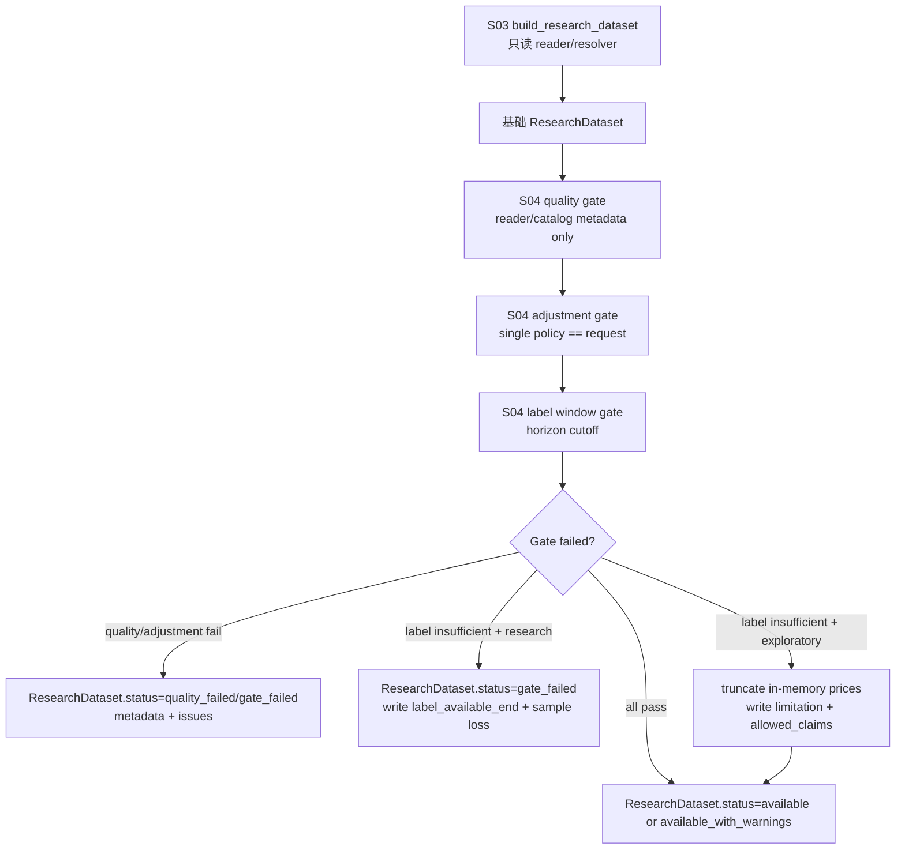

# LLD: CR008-S04 — 质量、复权与 label window gate

> 本文档仅覆盖 `CR008-S04-quality-adjustment-label-window-gates` 的低层设计。`confirmed=false`，且 `CR008-BATCH-A` 六份 LLD、六份 CP5 自动预检和 CP5 批次人工确认通过前 `implementation_allowed=false`。本 LLD 不授权实现业务代码、不授权真实 Tushare fetch、不授权真实 lake read/write、不授权旧 `data/**` 操作、不授权读取或覆盖旧 `reports/data_quality_report.csv`，也不授权读取、打印或记录凭据。

## 1. Goal

在 `CR008-S03` 定义的 `engine/research_dataset.py` 统一研究入口上追加 quality gate、单一复权口径 gate 和 forward return label window gate，使严肃研究模式下 `quality_status=fail`、quality truth 缺失、复权口径缺失 / 混用 / mismatch、label window 不足均结构化失败；探索模式仅允许 label window 截断，并必须在 `ResearchDataset.metadata` / `research_input_v1` 中写入 `label_available_end`、`truncated_sample_count`、`truncated_date_count` 和样本损失限制。

## 2. Requirements（Functional / Non-Functional）

### 2.1 Functional

- 修改 `engine/research_dataset.py`，在 `build_research_dataset` 的只读输入聚合之后、`ResearchDataset` materialize 之前执行 S04 gate，复用 S03 的 `ResearchDatasetRequest`、`ResearchDataset`、`GateResult`、`ResearchDatasetIssue` 和 remediation 归一化合同。
- 新增或扩展 quality gate：只接受 `market_data.readers.ReaderResult.catalog_entry`、reader metadata、S03 聚合 metadata 或后续 lake `quality/catalog` 结果作为 quality truth；不得读取、打开、解析或覆盖旧 `reports/data_quality_report.csv`。
- 新增或扩展 adjustment gate：同一 `ResearchDataset` 只能出现一个非空 `adjustment_policy`；该值必须与 `ResearchDatasetRequest.adjustment_policy` 一致；任意缺失、多个口径、frame 行级口径与 catalog / request 不一致均输出结构化 failure。
- 新增或扩展 label window gate：按 `forward_return_horizon` 和价格可用交易日计算 `label_available_end`；当末端样本无法生成完整未来收益标签时，严肃研究模式失败，探索模式截断不可用样本并写入样本损失。
- 将 gate 结果写回 `ResearchDataset.gate_result`、`ResearchDataset.status`、`ResearchDataset.metadata`、`known_limitations`、`allowed_claims` 和 `issues`；不得在 failure 路径静默返回 available。
- 修改 `engine/quality.py`，只新增纯函数 helper 或 status 归一化工具，供 S04 quality gate 复用；不得把旧质量报告 CSV 读取逻辑接入 research builder。
- 创建 `tests/test_cr008_quality_adjustment_label_gates.py`，覆盖 strict fail、exploratory truncate、复权混用、quality truth 边界、旧报告读取次数 0 和 forbidden import/path/credential 边界。

### 2.2 Non-Functional

- 所有 S04 gate 均为内存计算和 metadata 归一化，不新增数据湖目录、不新增持久化表、不写真实数据、不触发 fetch/backfill/normalize/revalidate/replay。
- 消费路径网络调用次数为 0；不得导入 `market_data.connectors`、`market_data.runtime`、`market_data.storage`。
- 不读取、列出、迁移、复制、比对或删除旧 `data/**`；测试 fixture 使用 `tmp_path`、in-memory DataFrame 或 monkeypatch reader result。
- 不读取、打开或覆盖旧 `reports/data_quality_report.csv`；旧报告路径只能作为 legacy limitation 字符串出现在 S01 metadata，不得作为 quality truth。
- 不读取 `.env`、Tushare token、NAS 用户名、NAS 密码或真实私有路径；错误、metadata、limitations 和 remediation 中不得包含凭据值。
- 与 S03 / S05 / S06 共享 `engine/research_dataset.py` 和 gate result 语义；开发阶段必须等待 S03 builder 合同冻结，且不得与 S05/S06 并行写同一文件，除非 meta-po 在 CP5 后重新判定 file ownership。

## 3. 模块拆分与职责

| 模块 / 文件组 | 职责 | 说明 |
|---|---|---|
| `engine/research_dataset.py` | 扩展 S03 builder，增加 `evaluate_research_gates` 或等价编排；定义 quality / adjustment / label gate check 的结构化输出；将 gate 结果合并到 `ResearchDataset` | S04 只扩展消费侧 gate，不改变 S03 只读边界；开发前必须读取 S03 confirmed LLD / 实现 |
| `engine/quality.py` | 提供 `normalize_quality_status`、`quality_status_from_reader_result` 或等价纯函数，统一 `pass/warn/fail/missing` 映射 | 不读取旧质量报告；只消费调用方传入的 reader/catalog metadata |
| `tests/test_cr008_quality_adjustment_label_gates.py` | Story 专属离线测试，覆盖 quality fail、复权混用、label window fail/truncate、安全边界和旧报告读取次数 0 | 使用 tmp / in-memory fixture，不需要 token、NAS、真实 lake 或旧 data |
| `CR008-S01 research_input_v1` | 提供 metadata 必填字段：`quality_status`、`readiness_status`、`adjustment_policy`、`forward_return_horizon`、`label_available_end`、`known_limitations`、`allowed_claims` | S04 必须保持字段兼容，不删除 / 重命名 S01 必填字段 |
| `CR008-S02 benchmark fields` | 提供 `benchmark_status`、`benchmark_kind`、`benchmark_missing_reason` 与 proxy / hs300 字段隔离 | S04 不处理 benchmark 逻辑，但不得降低 S02 字段隔离 |
| `CR008-S03 research_dataset_builder` | 提供 `ResearchDatasetRequest`、`ResearchDataset`、`GateResult`、`ResearchDatasetIssue`、metadata 聚合和 remediation `auto_execute=false` 合同 | S04 的 gate 直接消费该合同，若字段冲突必须回到 CP5 修订 |
| `CR008-S05/S06` | 后续扩展 PIT / fixed universe gate 与 auxiliary availability / allowed claims gate | S04 只预留 gate result 扩展结构，不实现 PIT / auxiliary 业务规则 |

## 4. 代码结构与文件影响范围

| 动作 | 文件路径 | 变更内容 |
|---|---|---|
| 修改 | `engine/research_dataset.py` | 增加 S04 gate 编排函数；扩展 `GateResult` / metadata 合并逻辑；实现 quality、adjustment、label window 三类 check；在探索模式下返回截断后的 in-memory dataset，在严肃研究模式下返回 `gate_failed` / `quality_failed` |
| 修改 | `engine/quality.py` | 增加只消费传入 metadata 的 quality status 归一化 helper；暴露 `pass/warn/fail/missing` 到 gate check 的映射；不新增旧报告读取入口 |
| 创建 | `tests/test_cr008_quality_adjustment_label_gates.py` | 创建 S04 targeted tests，覆盖 quality fail、quality warn metadata、adjustment missing/mixed/mismatch、label window strict fail、exploratory truncate、no old report、forbidden import / path / credential |

禁止修改：`market_data/connectors/**`、`market_data/runtime.py`、`market_data/storage.py`、`data/**`、`reports/data_quality_report.csv`、`.env`、`credentials`、`delivery/**`、`process/HLD.md`、`process/ARCHITECTURE-DECISION.md`、`process/DEVELOPMENT-PLAN.yaml`、CR008 其他 Story LLD 或业务产物。

## 5. 数据模型与持久化设计

| 对象 / 字段 | 类型 | 约束 | 说明 |
|---|---|---|---|
| `GateResult.status` | `str` | `pass`、`warn`、`fail`、`not_evaluated`；S04 failure 必须聚合为 `fail` | 复用 S03 基础容器；若 S03 实现字段名不同，S04 实现前先对齐 |
| `GateResult.checks` 或等价字段 | `list[dict | GateCheck]` | 每个 check 必含 `name`、`status`、`code`、`severity`、`message`、`details` | S04 至少写入 `quality_gate`、`adjustment_gate`、`label_window_gate` |
| `ResearchDatasetIssue.code` | `str` | S04 新增 `quality_failed`、`quality_missing`、`adjustment_policy_missing`、`adjustment_policy_mixed`、`adjustment_policy_mismatch`、`label_window_insufficient`、`label_window_truncated`、`label_window_empty` | 结构化错误暴露给报告和 QA |
| `metadata.quality.quality_status` | `str` | `pass`、`warn`、`fail`、`missing` | 来自 reader/catalog metadata，不来自旧报告 |
| `metadata.quality.quality_source` | `str` | `reader_result`、`catalog_entry`、`metadata`、`missing` | 审计 quality truth 来源；旧报告不得作为枚举值 |
| `metadata.adjustment.adjustment_policy` | `str` | 必填且唯一；必须等于 request policy | 顶层可同步到 S01 `adjustment_policy` 必填字段 |
| `metadata.adjustment.policies_seen` | `list[str]` | 去重排序；数量必须为 1 才 pass | 行级 frame、catalog entry、request metadata 的口径集合 |
| `metadata.label_window.forward_return_horizon` | `int` | `>= 1`；来自 request | 与 S01 必填字段一致 |
| `metadata.label_window.requested_decision_end` | `str` | 来自 `ResearchDatasetRequest.end_date` 或决策样本最大日期 | 用于区分研究样本截止日与可用价格截止日 |
| `metadata.label_window.label_available_end` | `str | None` | strict fail 与 exploratory truncate 均必须写；无任何可用标签时为 `None` 并 fail | Story AC 要求 label window 不足时 100% 写入 |
| `metadata.label_window.label_status` | `str` | `available`、`insufficient`、`truncated`、`empty` | 报告消费的机器状态 |
| `metadata.label_window.truncated_sample_count` | `int` | `>= 0`；探索截断和 strict fail 均写入 | 行级样本损失数量 |
| `metadata.label_window.truncated_date_count` | `int` | `>= 0` | 末端不可用交易日数量 |
| `metadata.label_window.label_unavailable_start` | `str | None` | 存在截断日期时写第一天不可用日期 | 便于报告说明样本尾部损失 |
| `ResearchDataset.prices` | `pd.DataFrame | None` | 探索模式截断后 `trade_date <= label_available_end`；严肃失败时不继续作为 available 输出 | S04 不写入磁盘，只返回内存对象 |
| `ResearchDataset.known_limitations` | `list[str | dict]` | quality warn、exploratory truncation、label sparse warning 均必须写 limitation | 不得为空掩盖降级 |
| `ResearchDataset.allowed_claims` | `list[str]` | 严肃失败路径不得声明 research conclusion；探索截断只允许 `framework_validation` / `exploratory_analysis` 等保守声明 | S06 可继续收紧 auxiliary claims |

无新增持久化、无新增数据库、无新增 lake 目录。所有新增对象为 dataclass / dict / DataFrame 内存合同，报告持久化仍归 S01 / 实验 Story 管理。

## 6. API / Interface 设计

| 接口 / 入口 | 输入 | 输出 | 调用方 | 说明 |
|---|---|---|---|---|
| `evaluate_research_gates(dataset, request, *, reader_results=None)` | S03 `ResearchDataset`、`ResearchDatasetRequest`、可选 reader result 映射 | 更新后的 `ResearchDataset` 或 `(GateResult, metadata_updates)` | `build_research_dataset` | 编排 quality / adjustment / label gate；第 10 节 T01-T08 覆盖 |
| `evaluate_quality_gate(reader_results, metadata)` | `dict[str, ReaderResult]`、已有 metadata quality/readiness | `GateCheck` / issue list / metadata update | `evaluate_research_gates` | `quality_status=fail/missing` fail；`warn` 写 limitation；不读取旧报告；T01/T02/T07 |
| `evaluate_adjustment_gate(prices, request_policy, metadata)` | prices DataFrame、request `adjustment_policy`、catalog / metadata policy | `GateCheck` / issue list / metadata update | `evaluate_research_gates` | 单一且匹配才 pass；missing/mixed/mismatch fail；T03/T04 |
| `evaluate_label_window_gate(prices, request)` | prices DataFrame、`forward_return_horizon`、`analysis_mode` | `GateCheck`、`label_window` metadata、可选 truncation mask | `evaluate_research_gates` | 计算 `label_available_end`、`truncated_sample_count`；T05/T06 |
| `apply_label_window_policy(dataset, label_result, request)` | `ResearchDataset`、label gate result、request mode | `ResearchDataset` | `evaluate_research_gates` | research 模式失败；exploratory 模式截断并写 limitation；T05/T06/T08 |
| `normalize_quality_status(value)` in `engine.quality` | str / None / catalog status | canonical status | quality gate | 只做纯映射，不读文件；T02/T07 |
| `extract_adjustment_policies(prices, metadata, request_policy)` | prices DataFrame、metadata、request policy | `set[str]` / ordered list | adjustment gate | 过滤空值并暴露缺失；T03/T04 |

接口错误暴露：

- 所有 gate failure 均通过 `GateResult.checks`、`ResearchDatasetIssue`、`metadata` 和 `ResearchDataset.status` 暴露，不抛未结构化异常。
- 所有 remediation 若存在，必须继承 S03 `auto_execute=false` / `dry_run_default=true` 规则。
- 第 6 节每个接口均在第 10 节有对应测试入口。

## 7. 核心处理流程

1. 调用方构造 S03 `ResearchDatasetRequest`，显式传入 `analysis_mode`、`adjustment_policy` 和 `forward_return_horizon`。
2. S03 builder 只读加载 prices / calendar / universe / benchmark 并形成基础 `ResearchDataset` 与 `reader_results`；此阶段仍不得触发 fetch/backfill 或旧数据 fallback。
3. S04 `evaluate_quality_gate` 从 reader result / catalog entry / metadata 中读取 `quality_status`；`fail` 或 `missing` 在严肃研究中输出 failure，`warn` 输出 warning 和 known limitation；旧质量报告路径不得参与。
4. S04 `evaluate_adjustment_gate` 从 request、prices 行级 `adjustment_policy`、catalog / metadata 口径中抽取 `policies_seen`；集合为空、数量大于 1 或唯一值不等于 request policy 时输出 `adjustment_policy_*` failure。
5. S04 `evaluate_label_window_gate` 读取 prices 的 `trade_date`，按 `forward_return_horizon` 计算末端标签可用截止日，并显式区分 `requested_decision_end` 与价格可用尾部：
   - `available_dates = sorted(unique(prices.trade_date))`
   - 若 `len(available_dates) <= horizon`，`label_available_end=None`，`truncated_sample_count=len(prices)`，gate fail。
   - 否则 `label_available_end = available_dates[-horizon - 1]`。
   - `requested_decision_end = request.end_date`；若 request 未提供 end_date，则使用决策样本最大日期。
   - 仅当 `requested_decision_end > label_available_end` 时判定 label window 不足。
   - `truncated_sample_count = count(label_available_end < prices.trade_date <= requested_decision_end)`，`truncated_date_count = count(label_available_end < available_dates <= requested_decision_end)`。
6. 若 `requested_decision_end <= label_available_end`，metadata 写 `label_status=available`，dataset 继续 materialize；价格中晚于 request end 的 buffer 只可作为标签来源，不得进入决策样本。
7. 若 label window 不足且 `analysis_mode=research`，返回 `status=gate_failed`，metadata 仍写 `requested_decision_end`、`label_available_end`、`truncated_sample_count` 和 failure issue；不得静默继续。
8. 若 label window 不足且 `analysis_mode=exploratory`，内存中过滤决策样本到 `trade_date <= label_available_end`，重新生成 `close_df` 或标记需要重建，metadata 写 `label_status=truncated`、样本损失和 limitation；allowed claims 收紧到探索 / 框架验证。
9. `evaluate_research_gates` 聚合三个 gate 的 status：任一 fail 使 `GateResult.status=fail`；存在 warn 且无 fail 时为 `warn`；全部 pass 时为 `pass`。
10. builder 返回更新后的 `ResearchDataset`；failure 路径仍包含 metadata / issues 供报告或测试断言，但不得标记为 available。

异常路径：

- `quality_missing`：无法从 reader/catalog/metadata 判断 quality truth；严肃研究 fail，不读取旧报告补证。
- `quality_failed`：reader/catalog quality fail；严肃研究 fail；探索模式也不得绕过为严肃结论。
- `quality_warn`：metadata 写 limitation；是否继续由 S03 reader quality policy 或 request mode 决定，但不得声明 quality pass。
- `adjustment_policy_missing`：request 或 prices/catalog 无明确口径；fail。
- `adjustment_policy_mixed`：同一 dataset 出现多个非空口径；fail。
- `adjustment_policy_mismatch`：唯一口径与 request 不一致；fail。
- `label_window_empty`：价格交易日数量小于等于 horizon，无可用标签；research 和 exploratory 均 fail。
- `label_window_insufficient`：末端存在不可用标签；research fail，exploratory truncate。
- `legacy_quality_report_used`：任一实现路径打开旧 `reports/data_quality_report.csv`；测试 fail，必须回滚。

## 8. 技术设计细节

- 关键算法 / 规则：
  - Gate 聚合优先级：`quality_failed` / `quality_missing` > `adjustment_policy_*` > `label_window_empty` > `label_window_insufficient` > `quality_warn` > `pass`。
  - `analysis_mode=research` 是严肃研究模式；`analysis_mode=exploratory` 仅对 label window 末端不足开放截断，不能放宽 quality fail 或复权混用。
  - `quality_status=pass` 仅表示 quality gate pass，不代表 PIT available；PIT / fixed universe 由 S05 单独处理。
  - `quality_status=warn` 不升级为 pass；必须进入 `known_limitations`，并在 `GateResult.checks` 中保留 warning。
  - adjustment 口径抽取顺序：prices 行级 `adjustment_policy` 非空唯一值、`ResearchDataset.metadata.adjustment_policy`、reader/catalog metadata、request policy。最终 `policies_seen` 必须只有一个真实来源口径，且等于 request policy。
  - label horizon 使用价格可用交易日序列，不使用自然日；当 calendar 可用时可以用 calendar 与 prices 交集形成 decision dates，但不得联网补 calendar。
  - label gate 以 `request.end_date` 作为决策样本截止日；若实现为了计算 forward return 额外加载 horizon buffer，buffer 日期不得被误计为决策样本。
  - `label_available_end` 必须以 ISO date string 输出；无可用标签时为 `None`，并写 `label_status=empty`。
  - exploratory truncation 只过滤内存 `ResearchDataset.prices` / `close_df`，不写磁盘，不覆盖报告，不修改原始 fixture。
- 依赖选择与复用点：
  - 复用 S03 `ResearchDatasetRequest.analysis_mode`、`adjustment_policy`、`forward_return_horizon`。
  - 复用 S03 `GateResult`、`ResearchDatasetIssue`、`known_limitations`、`allowed_claims`、remediation `auto_execute=false` 约束。
  - 复用 `market_data.readers.ReaderResult.status`、`issues`、`catalog_entry`、`remediation_spec`，但不把 reader 层的 `quality_warn_blocked` 静默改写成 available。
  - 复用 `engine.quality` 中现有 quality status 枚举语义；新增 helper 必须保持纯函数。
- 兼容性处理：
  - 若 S03 已实现 `GateResult` 但没有 `checks` 字段，S04 使用 `issues` + `metadata["gate_checks"]` 表达，避免重写 S03 模型。
  - 若 `prices` 缺 `adjustment_policy` 列但 catalog / metadata 有唯一口径，允许通过；若完全无口径则 fail。
  - 若 `prices` 缺 `trade_date`，label gate 返回 `label_window_empty` / `invalid_input`，不尝试从旧 data 或报告推导。
  - 若 `close_df` 已由 S03 生成，exploratory truncation 后必须同步重建或丢弃 `close_df` 并标记由后续 materialize 重建，不允许保留未截断矩阵。
- 图示类型选择：使用流程图，因为 S04 在 S03 builder 后串接三个 gate，且存在 strict fail 与 exploratory truncate 分支。

## 9. 安全与性能设计

| 维度 | 设计措施 | 验证方式 |
|---|---|---|
| 安全 | S04 不导入 `market_data.connectors`、`market_data.runtime`、`market_data.storage`，不执行 fetch/backfill/normalize/revalidate/replay | T07 AST import scan |
| 安全 | quality gate 只消费 reader/catalog/metadata，不打开旧 `reports/data_quality_report.csv` | T07 monkeypatch `Path.open` / `Path.read_text` sentinel，断言旧报告读取次数为 0 |
| 安全 | 不读取、列出或比对旧 `data/**`；不把旧 data 作为 fixture | T07 path sentinel 和静态字符串扫描 |
| 安全 | 不读取 `.env` 或凭据；metadata、issues、limitations 不包含 fake token 值 | T07 monkeypatch env fake secret 后断言输出不含 secret |
| 安全 | failure / remediation 结构化暴露，且所有 remediation 保持 `auto_execute=false` | T01、T03、T05、T08 递归断言 |
| 性能 | quality / adjustment gate 只扫描 metadata 和一列 policy；复杂度 O(rows) 或 O(unique policy count) | T03/T04 小样本；无需性能基准 |
| 性能 | label gate 只按 `trade_date` 唯一值排序并过滤 DataFrame；复杂度 O(rows + dates log dates) | T05/T06 覆盖；不新增缓存服务 |
| 可维护性 | 三个 gate 输出统一 `GateCheck` / issue / metadata update；S05/S06 可追加 gate 不改 S04 接口 | CP5 检查第 6/10 节接口到测试映射 |
| 一致性 | `label_available_end`、`truncated_sample_count`、`truncated_date_count` 在 pass/fail/truncate 路径均可断言 | T05/T06/T08 |

## 10. 测试设计

| 测试场景 | 前置条件 | 操作 | 预期结果 | 验证方式 |
|---|---|---|---|---|
| T01 quality fail 阻断严肃研究 | 构造 S03 `ResearchDataset`，reader result / metadata `quality_status=fail`，`analysis_mode=research` | 调用 `evaluate_research_gates` 或 `build_research_dataset` | `ResearchDataset.status=quality_failed` 或 `gate_failed`；`GateResult.status=fail`；issue code=`quality_failed`；继续执行次数为 0 | `uv run --python 3.11 pytest -q tests/test_cr008_quality_adjustment_label_gates.py -k quality_fail` |
| T02 quality warn 写 limitation | metadata `quality_status=warn`，prices 口径一致，label 完整 | 调用 gate | `GateResult.status=warn` 或 dataset `available_with_warnings`；`known_limitations` 含 quality warn；不声明 `quality_status=pass` | 同测试文件 |
| T03 复权口径混用 fail | prices 行级包含 `qfq` 与 `hfq` 两个 `adjustment_policy` | 调用 adjustment gate | issue code=`adjustment_policy_mixed`；通过次数为 0；metadata `policies_seen=["hfq","qfq"]` | 同测试文件 |
| T04 复权口径缺失 / mismatch fail | request policy=`qfq`，prices/catalog policy 缺失或唯一值=`hfq` | 调用 adjustment gate | missing 输出 `adjustment_policy_missing`；mismatch 输出 `adjustment_policy_mismatch`；均 fail | 同测试文件 |
| T05 label window 不足时严肃研究 fail | 10 个交易日 prices，`forward_return_horizon=3`，`analysis_mode=research`，request end 等于价格最后一日 | 调用 label gate / full gate | `label_available_end` 为倒数第 4 个交易日；`requested_decision_end > label_available_end`；`truncated_sample_count > 0`；`label_status=insufficient`；dataset 不 available | 同测试文件 |
| T06 label window 探索模式截断 | 同 T05，但 `analysis_mode=exploratory` | 调用 gate | 返回决策样本最大 `trade_date <= label_available_end`；metadata 写 `label_status=truncated`、`requested_decision_end`、`truncated_sample_count`、`truncated_date_count`；allowed claims 收紧 | 同测试文件 |
| T07 no old report / no old data / no credentials / no forbidden import | monkeypatch fake token env；设置旧报告 path sentinel；实现文件存在 | 运行 S04 测试中的静态扫描和 monkeypatch sentinel | 旧 `reports/data_quality_report.csv` 打开/读取/覆盖次数为 0；旧 `data/**` 操作 0；connector/runtime/storage import 0；输出不含 fake secret | 同测试文件 |
| T08 S03 builder 集成状态聚合 | monkeypatch S03 reader 返回 available prices + quality metadata；分别构造 pass / fail / truncate 三组 request | 调用 `build_research_dataset` | pass 返回 available；quality/adjustment fail 返回 structured failure；exploratory truncate 返回 warning + 截断 metadata；remediation `auto_execute=false` | 同测试文件 |

接口到测试映射：

| 第 6 节接口 | 对应测试 |
|---|---|
| `evaluate_research_gates` | T01、T02、T03、T04、T05、T06、T08 |
| `evaluate_quality_gate` | T01、T02、T07 |
| `evaluate_adjustment_gate` | T03、T04、T08 |
| `evaluate_label_window_gate` | T05、T06、T08 |
| `apply_label_window_policy` | T05、T06 |
| `normalize_quality_status` | T01、T02、T07 |
| `extract_adjustment_policies` | T03、T04 |

异常路径到测试映射：

| 第 7 节异常路径 | 对应测试 |
|---|---|
| `quality_missing` / `quality_failed` | T01、T08 |
| `quality_warn` | T02 |
| `adjustment_policy_missing` | T04 |
| `adjustment_policy_mixed` | T03 |
| `adjustment_policy_mismatch` | T04 |
| `label_window_empty` / `label_window_insufficient` | T05、T06 |
| `legacy_quality_report_used` | T07 |

## 11. 实施步骤

| TASK-ID | 动作 | 目标文件 | 详细描述 | 对应测试 |
|---|---|---|---|---|
| CR008-S04-T1 | 修改 | `engine/research_dataset.py` | 扩展 S03 gate/result 合同，增加 `evaluate_research_gates` 编排和 quality / adjustment / label gate check 的 metadata 合并；保持 no fetch、no old data、remediation `auto_execute=false` | T01-T08 |
| CR008-S04-T2 | 修改 | `engine/quality.py` | 新增 `normalize_quality_status`、`quality_status_from_reader_result` 或等价纯函数；只消费传入 metadata，不读取旧质量报告 | T01、T02、T07 |
| CR008-S04-T3 | 创建 | `tests/test_cr008_quality_adjustment_label_gates.py` | 创建 tmp/in-memory/monkeypatch 测试，覆盖 strict fail、warn、复权 mixed/missing/mismatch、label fail/truncate、old report sentinel、forbidden import/path/credential、S03 builder 集成 | T01-T08 |

实施顺序必须为 T1 -> T2 -> T3。若实现前发现 S03 `GateResult` 字段命名与本 LLD 假设不一致，先用最小兼容方式适配；若无法保持接口兼容，停止实现并回到 CP5 修改 S03/S04 LLD，不得自行重写 S03 合同。

每个 TASK-ID 均对应文件影响范围；每个文件影响项至少被一个 TASK-ID 覆盖。当前 LLD 阶段不得执行这些 TASK。

## 12. 风险、难点与预研建议

| 风险 / 难点 | 影响 | 缓解措施 / 预研建议 |
|---|---|---|
| S03 builder 当前仍是未确认 LLD，`GateResult` 具体实现字段可能变化 | S04 gate 需要重命名或适配 result 容器 | 实现前必须等待 S03 LLD confirmed / contract frozen；若字段冲突，先修订 LLD |
| Story 卡片 frontmatter 仍为 `status: draft` | 与 meta-dev ready-check 字段口径不一致 | CR/STATE/CP3/CP4 与用户任务已给出 LLD-ready 等价状态；本轮写范围不含 Story 卡片，交由 meta-po 批次聚合回填 |
| STATE 中 W2 队列残留仍显示等待 W1 | 与用户给定 W1 已完成事实和 W1 CP5 文件存在不一致 | S04 CP5 以 S01/S02/S03 LLD + CP5 PASS 文件作为 W1 完成证据；STATE 回填由主线程处理 |
| label window 的 per-symbol 缺失与末端日期截断可能混在一起 | 若单个 symbol 中间缺未来价格，仅按全局 cutoff 可能不足以解释样本损失 | T05/T06 覆盖末端 window；若实现发现 sparse missing，应新增 `label_sparse_missing_count` issue 并 fail，避免静默通过 |
| `engine/quality.py` 现有职责包含旧标准 parquet quality report | 新 helper 容易误接旧报告读取路径 | helper 必须纯函数，T07 断言旧报告打开次数为 0 |
| S04/S05/S06 共享 `engine/research_dataset.py` | 并行开发会产生文件冲突和 gate result 语义冲突 | CP5 后默认 S04/S05/S06 不并行开发；由 S04 作为本 Story merge_owner 时只合并本 Story范围 |
| quality warn 是否阻断严肃研究存在策略差异 | HLD/ADR 明确 fail 是硬门，warn 可作为 limitation；后续 QA 可能要求更严 | 当前设计将 warn 记为 warning；若 CP5 人工要求 warn 也 fail，修改本 LLD 后再实现 |

### OPEN / Spike 跟踪

| ID | 类型（OPEN / Spike） | 问题 | 下一动作 | 责任方 |
|---|---|---|---|---|
| O-01 | OPEN | S03 `GateResult` / `ResearchDataset` 实现字段尚未 confirmed | CP5 批次确认前比对 S03 LLD；实现前读取 S03 confirmed contract | meta-po / CR008-S03 meta-dev / 本 Story meta-dev |
| O-02 | OPEN | Story 卡片 status 为 `draft`，但 CR008 CR/CP3/CP4/用户任务已允许 LLD | meta-po 在批次聚合或主线程回填 Story 状态为 `lld-ready-for-review` 或等价审查态 | meta-po |
| O-03 | OPEN | STATE 的 W2 队列状态未回写 W1 完成 | 主线程在 S04/S05/S06 完成后统一回填 STATE / handoff dispatch evidence | meta-po / 主线程 |
| O-04 | OPEN | quality warn 在严肃研究中是 warning 还是 fail | 默认 warning + limitation；CP5 批次人工确认时如要求更严，则把 warn 改为 fail | user / meta-qa / meta-po |
| O-05 | Spike | 是否需要 per-symbol label availability 代替全局 date cutoff | 默认按全局交易日 cutoff 覆盖末端 window；实现时若发现 sparse symbol 缺失，新增 sparse issue 和测试 | 本 Story meta-dev / meta-qa |

## 13. 回滚与发布策略

- 发布方式：CR008 CP5 批次人工确认后，按 Wave / Story DAG 和文件所有权串行实现；S04 只修改 `engine/research_dataset.py`、`engine/quality.py` 并创建专属测试，不写安装脚本，不写 `delivery/**`。
- 回滚触发条件：
  - S03 confirmed 合同不支持 S04 gate 扩展，且无法用兼容字段表达。
  - S04 实现需要导入 connector/runtime/storage、读取旧 `data/**`、读取旧质量报告、读取 env/token 或访问真实 lake。
  - quality/adjustment/label gate 无法结构化输出 `label_available_end`、`truncated_sample_count` 或 issue code。
  - S05/S06 confirmed LLD 要求重构 gate result 结构，当前 S04 设计会阻断其实现。
- 回滚动作：
  - CP5 前：修改本 LLD 与 CP5 自动预检，重新提交 CR008-BATCH-A 批次人工确认。
  - 实现前：保持 `implementation_allowed=false`，不创建业务产物。
  - 实现后若需回滚：移除 S04 gate 接入点或通过显式 feature flag 停用新 gate，保留 S03 builder 基础合同；删除 / 调整 S04 专属测试中的预期；不得删除、覆盖、读取或比对旧 `data/**` 与旧 `reports/data_quality_report.csv`。
- 发布后验证入口：
  - `uv run --python 3.11 pytest -q tests/test_cr008_quality_adjustment_label_gates.py`
  - 必要回归：`uv run --python 3.11 pytest -q tests/test_cr008_research_dataset_builder.py tests/test_cr008_research_input_metadata.py tests/test_cr008_proxy_real_benchmark_fields.py`

## 14. Definition of Done

- [ ] `process/stories/CR008-S04-quality-adjustment-label-window-gates-LLD.md` 已输出，且第 1 至第 14 章齐全。
- [ ] `process/checks/CP5-CR008-S04-quality-adjustment-label-window-gates-LLD-IMPLEMENTABILITY.md` 已输出，含 Entry Criteria、Checklist、Exit Criteria、Deliverables、Agent Dispatch Evidence 和结论。
- [ ] `engine/research_dataset.py` 的设计只扩展 S03 builder 的 gate，不触发数据生产、不读取旧数据、不读取旧质量报告。
- [ ] `engine/quality.py` 的设计只新增纯 helper，不把旧质量报告 CSV 作为 quality truth。
- [ ] quality fail / missing 在严肃研究中继续执行次数为 0。
- [ ] 复权口径缺失、混用或 mismatch 通过次数为 0。
- [ ] label window 不足时 metadata 100% 写入 `label_available_end`、`truncated_sample_count` 和 `truncated_date_count`。
- [ ] 探索模式截断只发生在内存 dataset，且必须写 `known_limitations` 与保守 `allowed_claims`。
- [ ] 旧 `reports/data_quality_report.csv` 内容读取 / 打开 / 覆盖次数为 0。
- [ ] `tests/test_cr008_quality_adjustment_label_gates.py` 设计覆盖 pass、fail、warn/truncate、no old report 和安全边界。
- [ ] 第 6 节全部接口均在第 10 节有测试入口；第 7 节异常路径均有错误路径测试。
- [ ] TASK-ID 与文件影响范围一一对应。
- [ ] OPEN / Spike 已清点；O-01 至 O-05 在 CP5 批次聚合或实现前处理。
- [ ] `confirmed=false`、`implementation_allowed=false` 保持到 CR008-BATCH-A CP5 批次人工确认通过；本 LLD PASS 不表示可以实现。

### CP5 人工确认说明

meta-po 收齐 `CR008-BATCH-A` 六份 LLD 与六份 CP5 自动预检后，统一生成并提示用户审查 `checkpoints/CP5-CR008-BATCH-A-LLD-BATCH.md`。只有该批次人工确认 `approved`、当前 Story LLD `confirmed=true`、S03 builder contract frozen、文件所有权无冲突且 dev_gate 满足后，S04 才能进入实现。
