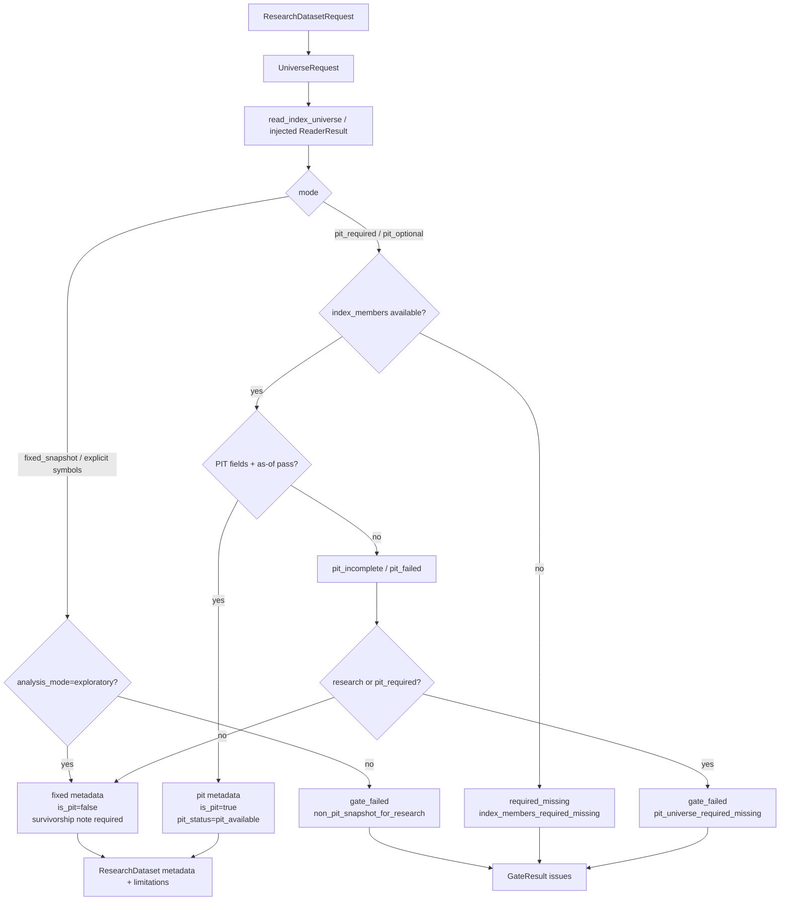

# LLD: CR008-S05 — PIT / fixed universe 消费合同

> 本文档仅覆盖 `CR008-S05-pit-universe-consumption-contract` 的低层设计。当前 `confirmed=false`、`implementation_allowed=false`；在 `CR008-BATCH-A` 六份 LLD、六份 CP5 自动预检和 CP5 批次人工确认通过前，不得进入实现。
>
> 本 Story 不授权真实 Tushare 抓取、联网 backfill、真实 lake read/write、normalize/revalidate/replay/backfill job、旧 `data/**` 操作、旧 `reports/data_quality_report.csv` 读取/覆盖、凭据读取/打印或 `delivery/**` 修改。

## 1. Goal

修改现有 `engine/universe.py` 的股票池消费合同，并让 `engine/research_dataset.py` 在构建 `ResearchDataset` 时消费该合同，强制输出 `universe_mode`、`is_pit_universe`、`pit_status`、`readiness_status` 和 `survivorship_bias_note`。严肃研究或 `pit_required` 请求在 PIT 不可用时必须结构化失败；探索模式可以使用 fixed snapshot 或显式 symbols，但必须写非空幸存者偏差说明，且不得把 fixed snapshot、`stock_basic` 当前快照、`quality_status=pass` 或 `index_weights` 伪装为 PIT universe。

## 2. Requirements（Functional / Non-Functional）

### 2.1 Functional

- 修改 `engine/universe.py`，保留既有 `UniverseProvider` / `load_universe` 兼容入口，同时新增 CR008 universe resolver 合同：`UniverseRequest`、`UniverseResolution`、`UniverseMetadata`、`UniverseIssue`、`resolve_universe(...)`。
- `UniverseRequest` 必须显式声明 `index_code`、`start_date`、`end_date`、`analysis_mode`、`universe_mode`、可选 `symbols`、可选 `decision_calendar`；不得依赖旧 `data/**` 或 env fallback。
- `universe_mode` 请求枚举必须至少覆盖 `pit_required`、`pit_optional`、`fixed_snapshot`；输出 metadata 的 `universe_mode` 必须规范化为 `pit`、`fixed_snapshot` 或 `missing`。
- `pit_status` 输出枚举必须至少覆盖 `pit_available`、`pit_incomplete`、`non_pit_snapshot`、`pit_failed`、`missing`；`readiness_status` 必须与 `quality_status` 分离。
- PIT 成立条件必须同时满足：`index_members` reader result available、字段具备 PIT 可得性、as-of gate 通过、`pit_status=pit_available`、`is_pit_universe=true`；任何单项不满足时不得输出 `is_pit_universe=true`。
- fixed snapshot / explicit symbols / non-PIT `stock_basic` 只允许在 `analysis_mode=exploratory` 或 `universe_mode=fixed_snapshot` 下继续；metadata 必须写非空 `survivorship_bias_note`。
- 严肃研究模式 `analysis_mode=research` 或请求 `universe_mode=pit_required` 时，PIT 缺失、PIT 不完整、quality failed、readiness unavailable、只有 `index_weights`、只有当前 `stock_basic` 快照均返回 structured failure，并写入 `GateResult.issues`。
- 修改 `engine/research_dataset.py`，让 `build_research_dataset` 调用 `resolve_universe(...)` 或等价 helper，将 universe metadata 合并到 `ResearchDataset.metadata["universe"]`、`known_limitations`、`allowed_claims` 和 `gate_result`。
- 修改 `market_data/readers.py`，新增 `read_index_universe(...)` 或扩展 S03 `read_research_inputs(...)`，只读返回 `index_members` / `stock_basic` readiness 与 PIT issue；不得在 reader 层导入 `engine.*`，不得触发 connector/runtime/storage。
- 创建 `tests/test_cr008_pit_universe_contract.py`，覆盖 PIT available、PIT required missing、fixed snapshot disclosure、no weights substitute、quality pass != PIT available、stock_basic snapshot not PIT、builder metadata integration 和 forbidden boundary。

### 2.2 Non-Functional

- 本 Story 的实现测试必须离线运行：`uv run --python 3.11 pytest -q tests/test_cr008_pit_universe_contract.py`，不需要 token、NAS、真实 lake 或旧数据。
- 网络调用、真实 Tushare fetch、真实 lake read/write、旧 `data/**` 操作、旧 `reports/data_quality_report.csv` 读取/覆盖、凭据读取/打印次数均为 0。
- `engine/universe.py`、`engine/research_dataset.py`、`market_data/readers.py` 不得导入 `market_data.connectors`、`market_data.runtime`、`market_data.storage`、联网库或凭据读取逻辑。
- S05 与 S03/S04/S06 共享 `engine/research_dataset.py` 和 `market_data/readers.py`；LLD 可并行，开发必须等待 CR008 CP5 批次确认后由 meta-po 复核 `file_conflict_free`。
- CR007-S03 LLD 已 confirmed，但其运行时代码当前仍受 CR008 优先规则和文件所有权复核约束；S05 可基于 CR007-S03 的 readiness / PIT 合同设计，开发时必须再次确认上游合同和可用字段。

## 3. 模块拆分与职责

| 模块 / 文件组 | 职责 | 说明 |
|---|---|---|
| `engine/universe.py` | 承载 universe resolver 合同、PIT/fixed 判定、幸存者偏差说明、issue / metadata 生成 | 当前文件已存在旧 `UniverseProvider`；S05 实现必须兼容旧入口并新增 CR008 合同，不得删除既有 public names。 |
| `engine/research_dataset.py` | 在 S03 builder 上接入 universe resolver，把结果写入 `ResearchDataset.metadata`、`GateResult`、`known_limitations`、`allowed_claims` | 依赖 S03 LLD 的 request/result/gate 容器；实现前必须等 CR008 批次 CP5 确认。 |
| `market_data/readers.py` | 暴露只读 universe reader helper 或在 `read_research_inputs` 中返回 `index_members` / `stock_basic` reader result | 不依赖 `engine.*`；不把 `index_weights` 转换为完整成员；不触发数据生产。 |
| `tests/test_cr008_pit_universe_contract.py` | S05 专属离线测试 | 使用 in-memory DataFrame / fake `ReaderResult` / tmp path sentinel，不读真实 lake、旧 data、旧报告或凭据。 |
| CR007-S03 readiness 合同 | 提供 `index_members`、`index_weights`、`stock_basic` 的 readiness / PIT 状态语义 | S05 只消费合同；CR007-S03 当前不得在本线程实现。 |
| CR008-S03 builder 合同 | 提供 `ResearchDatasetRequest`、`ResearchDataset`、`GateResult`、`ResearchDatasetIssue` 基础容器 | S05 在其上添加 universe gate，不重新定义 builder 主入口。 |

## 4. 代码结构与文件影响范围

| 动作 | 文件路径 | 变更内容 |
|---|---|---|
| 修改 | `engine/universe.py` | 保留旧 `UniverseProvider` / `load_universe`；新增 `UniverseRequest`、`UniverseMetadata`、`UniverseIssue`、`UniverseResolution`、`resolve_universe(...)`、`build_universe_metadata(...)`、`SURVIVORSHIP_BIAS_FIXED_SNAPSHOT_NOTE`；实现 PIT/fixed 判定、no weights substitute、quality/readiness 分离。若目标分支无该文件才按创建处理。 |
| 修改 | `engine/research_dataset.py` | 在 `build_research_dataset` 或 gate aggregation 中调用 universe resolver；将 universe metadata、issues、known limitations 和 allowed / blocked claims 写入 `ResearchDataset`；严肃 PIT 失败映射为 `gate_failed` 或 `required_missing`。 |
| 修改 | `market_data/readers.py` | 新增 `read_index_universe(...)` 或扩展 `read_research_inputs(...)`，返回 `index_members`、`stock_basic`、可选 `index_weights` 的 `ReaderResult` 和 readiness / PIT issue；不在 reader 层导入 `engine.universe`。 |
| 创建 | `tests/test_cr008_pit_universe_contract.py` | 创建 S05 定向测试，覆盖正向 PIT、PIT 缺失 fail、fixed snapshot warning、weights 不替代 members、quality pass 不等于 PIT、stock_basic 当前快照、builder integration、安全边界。 |

禁止修改：`market_data/connectors/**`、`market_data/runtime.py`、`market_data/storage.py`、`data/**`、`reports/data_quality_report.csv`、`.env`、`credentials`、`delivery/**`、`process/HLD.md`、`process/ARCHITECTURE-DECISION.md`、`process/DEVELOPMENT-PLAN.yaml`、其他 CR008 Story LLD/CP5。

## 5. 数据模型与持久化设计

无新增数据库、无新增 lake dataset、无新增外部持久化服务。本 Story 只新增内存 dataclass / dict 合同和报告 metadata 字段。

| 对象 / 字段 | 类型 | 约束 | 说明 |
|---|---|---|---|
| `UniverseRequest.index_code` | `str` | 必填，默认可由 request universe 映射为 `csi300` / `399300.SZ` 等约定 | 用于读取 `index_members`，不得从 `index_weights` 推导完整成分。 |
| `UniverseRequest.start_date/end_date` | `str | date` | 必填，`start_date <= end_date` | 与 ResearchDataset 日期区间一致。 |
| `UniverseRequest.analysis_mode` | `str` | `research` 或 `exploratory` | research 模式必须 PIT；exploratory 可 fixed snapshot + warning。 |
| `UniverseRequest.universe_mode` | `str` | `pit_required`、`pit_optional`、`fixed_snapshot` | 请求语义；输出 metadata 会规范化。 |
| `UniverseRequest.symbols` | `tuple[str, ...] | None` | 可选；仅作为 explicit fixed snapshot | 不得标 PIT；必须写幸存者偏差说明。 |
| `UniverseRequest.decision_calendar` | `Sequence[date] | None` | PIT as-of 可选输入；缺失时用 `trade_date` / start-end 近似测试 fixture | 实现时优先消费 S03 builder calendar。 |
| `UniverseResolution.status` | `str` | `available`、`available_with_warnings`、`required_missing`、`quality_failed`、`gate_failed`、`invalid_request` | 可直接合并入 `ResearchDataset.status` 聚合。 |
| `UniverseResolution.members` | `pd.DataFrame | None` | available 时非空；至少含 `trade_date`、`symbol`、`index_code` | PIT 时可为日期化成员；fixed 时可复制为统一 snapshot 或只给 symbols。 |
| `UniverseResolution.symbols` | `list[str]` | fixed / explicit path 可用；PIT path 可为全区间 union | 报告只能把 PIT 以 metadata 声明，不以 union 冒充固定池。 |
| `UniverseMetadata.universe_mode` | `str` | `pit`、`fixed_snapshot`、`missing` | `research_input_v1` universe 子对象必填。 |
| `UniverseMetadata.is_pit_universe` | `bool` | 只有 `pit_status=pit_available` 且 as-of pass 时为 true | fixed snapshot、explicit symbols、stock_basic 当前快照均为 false。 |
| `UniverseMetadata.pit_status` | `str` | `pit_available`、`pit_incomplete`、`non_pit_snapshot`、`pit_failed`、`missing` | 不得由 quality status 推导。 |
| `UniverseMetadata.readiness_status` | `str` | `available`、`warn`、`unavailable`、`required_missing`、`quality_failed`、`pit_incomplete`、`non_pit_snapshot` | 继承 CR007-S03 语义。 |
| `UniverseMetadata.survivorship_bias_note` | `str` | PIT true 时可为空；fixed / non-PIT / explicit / missing path 必须非空 | 用于报告披露。 |
| `UniverseIssue.code` | `str` | 结构化 code | 典型值：`pit_universe_required_missing`、`pit_incomplete`、`non_pit_snapshot_for_research`、`index_members_required_missing`、`index_weights_not_members`、`quality_pass_not_pit_available`。 |

## 6. API / Interface 设计

| 接口 / 入口 | 输入 | 输出 | 调用方 | 说明 |
|---|---|---|---|---|
| `UniverseRequest(...)` | index_code、start/end、analysis_mode、universe_mode、symbols、decision_calendar | immutable request object | `build_research_dataset`、测试 | 缺日期、未知 mode、research + fixed_snapshot 冲突时返回 `invalid_request` 或 issue；测试 T01/T02/T03。 |
| `resolve_universe(request, *, index_members_result, stock_basic_result=None, index_weights_result=None)` | `UniverseRequest`；CR007-S03 / S03 reader result | `UniverseResolution` | `engine.research_dataset` | 核心合同；只消费 ReaderResult / DataFrame，不读取路径、不调用 reader；测试 T01-T06。 |
| `build_universe_metadata(resolution)` | `UniverseResolution` | dict / `UniverseMetadata` | metadata writer、S03 builder | 输出 `universe_mode`、`is_pit_universe`、`pit_status`、`readiness_status`、`survivorship_bias_note`；测试 T01-T04。 |
| `read_index_universe(...)` in `market_data.readers` | lake_root、index_code、start/end、quality_policy、required、pit_policy | `ReaderResult` | `engine.research_dataset` | 只读 helper；返回 `index_members` result 和 readiness/PIT issues；不得返回 engine 类型；测试 T07/T08。 |
| `build_research_dataset(...)` universe integration | S03 `ResearchDatasetRequest`、reader/resolver 注入 | `ResearchDataset` with universe metadata / gate issue | 实验十三/十五后续 Story | PIT required missing 映射到 `gate_failed` / `required_missing`，fixed snapshot 写 limitation；测试 T07。 |
| `UniverseResolution.to_gate_issues()` 或等价内部转换 | `UniverseResolution.issues` | `ResearchDatasetIssue` list | `engine.research_dataset` | issue code / severity / dataset / message 可断言；测试 T02/T05/T07。 |

错误 / 限制暴露：

- `pit_universe_required_missing`：research / `pit_required` 请求下 `index_members` missing、quality failed、PIT incomplete 或 non-PIT snapshot。
- `index_weights_not_members`：只有 `index_weights` 可用或调用方尝试以 weights 补 members；必须 fail，不得降级为 PIT。
- `quality_pass_not_pit_available`：reader quality pass 但缺 PIT fields / as-of 证据；必须 warn/fail，不得 `is_pit_universe=true`。
- `stock_basic_not_pit_universe`：`stock_basic` 当前快照只能辅助上市/退市说明，不可证明 PIT。
- `fixed_snapshot_survivorship_bias`：fixed / explicit symbols 路径必须写 warning，并阻断严肃 PIT claims。

每个接口条目均在第 10 节有对应测试入口。

## 7. 核心处理流程

1. `build_research_dataset` 从 S03 `ResearchDatasetRequest` 组装 `UniverseRequest`，显式传入日期区间、analysis mode、universe mode、index code、可选 symbols 和 decision calendar。
2. builder 通过 S03 reader 注入结果或 `market_data.readers.read_index_universe(...)` 只读获取 `index_members`；必要时获取 `stock_basic` 作为辅助 readiness 说明；不得读取 `index_weights` 作为完整成分 fallback。
3. `resolve_universe` 先执行 request 校验：未知 mode、日期非法、research + fixed_snapshot 冲突、无 index code 且无 explicit symbols 均写 structured issue。
4. 若 `universe_mode=fixed_snapshot` 或 explicit symbols：
   - 仅在 `analysis_mode=exploratory` 下返回 `available_with_warnings`。
   - `metadata.universe_mode=fixed_snapshot`、`is_pit_universe=false`、`pit_status=non_pit_snapshot`。
   - `survivorship_bias_note` 必须非空。
5. 若请求 PIT：
   - 必须有 `index_members` available frame。
   - frame 必须有 `index_code`、`symbol` 或 `con_code`、`effective_date`、`available_at`、`is_member` 或等价成员字段。
   - 若 reader / frame 已提供 `pit_status`、`readiness_status`、`is_pit_universe`，必须交叉校验，不得只信 quality pass。
   - 按 decision calendar 做 as-of 筛选：只保留 `effective_date <= decision_time` 且 `available_at <= decision_time` 的成员记录，并要求 member active。
   - 成功后输出 `universe_mode=pit`、`is_pit_universe=true`、`pit_status=pit_available`。
6. 若 PIT 不满足：
   - `analysis_mode=research` 或 `pit_required` 返回 `gate_failed` / `required_missing`，并写 `pit_universe_required_missing`。
   - `pit_optional` + exploratory 可降级 fixed snapshot，但必须写 survivorship warning 和 blocked claims。
7. builder 合并 `UniverseResolution`：
   - failure 写入 `ResearchDataset.gate_result.issues`，严肃研究不 materialize available dataset。
   - fixed snapshot 写入 `known_limitations` 和 `allowed_claims=["framework_validation", "fixed_snapshot_exploration"]` 或保守等价集合。
   - PIT available 才允许后续 S06 声明 `pit_factor_research` 之类严肃 PIT claims。



异常路径：

- `lake_root_missing` 或 reader missing：resolver 不自行读取 env；builder 仅传递 reader issue。
- `index_members_quality_failed`：严肃研究 fail，不从 fixed snapshot 或 weights 自动降级。
- `index_weights_only`：返回 `index_weights_not_members`，完整股票池结果缺失。
- `stock_basic_current_snapshot`：仅可写 limitation，不得把 `list_date/delist_date` 当历史可得性证明。
- `quality_pass_without_pit_fields`：quality pass 仍因 PIT 不完整而 fail / warn。
- `survivorship_note_missing`：fixed snapshot metadata 缺 warning 时测试失败。

## 8. 技术设计细节

- 关键算法 / 规则：
  - PIT 判定优先级：reader status / catalog quality -> readiness status -> PIT fields presence -> as-of gate -> metadata finalization。
  - status 聚合优先级：`invalid_request` > `quality_failed` > `required_missing` > `gate_failed` > `available_with_warnings` > `available`。
  - 成员字段规范化：`symbol` 优先；若只有 `con_code`，复制为 `symbol`；代码字符串 trim，保持 Tushare 后缀，不做模糊映射。
  - active membership：若 `is_member` 存在则为 true；若存在 `out_date`，当 `out_date` 为空或大于 decision time 才 active；不得用 `weight > 0` 替代 membership。
  - fixed snapshot note：统一常量写明“固定快照存在幸存者偏差，仅可用于探索 / 框架验证，不能声明 PIT 因子结论”或同等语义。
  - `stock_basic` 使用边界：可辅助暴露上市 / 退市 / 当前状态限制；缺 `available_at` 时必须 `pit_status=non_pit_snapshot` 或 `pit_incomplete`。
- 依赖选择与复用点：
  - 复用 CR008-S03 的 `ResearchDatasetRequest`、`ResearchDataset`、`GateResult`、`ResearchDatasetIssue` 容器。
  - 复用 CR007-S03 的 `ReaderResult` readiness / PIT issue 语义，不在 S05 重新定义 market_data schema。
  - 复用现有 `engine/universe.py` 文件名和 legacy provider，减少迁移风险。
- 兼容性处理：
  - 旧 `load_universe(path, mode="fixed")` 可保留作为 legacy explicit snapshot helper，但 CR008 builder 不得用它读取旧 `data/**`。
  - 若 S03 最终未新增 `read_research_inputs`，S05 可直接注入 `read_dataset("index_members")` result；若新增 helper，则 S05 只追加 universe-specific readiness 映射。
  - 若 S04 gate 扩展 `GateResult` 字段，S05 只通过 issue list / metadata 子对象接入，不直接重写 S04 quality / label / adjustment 逻辑。
- 图示类型选择：使用流程图。S05 跨 `engine.research_dataset`、`engine.universe`、`market_data.readers` 和 CR007 readiness 合同，且 PIT/fixed 异常分支较多。

## 9. 安全与性能设计

| 维度 | 设计措施 | 验证方式 |
|---|---|---|
| 安全 | resolver 只消费传入的 `ReaderResult` / DataFrame，不打开路径、不读 env、不读 `.env` | T01-T06 用 in-memory fixture；T08 monkeypatch env fake token 后断言输出不含 secret |
| 安全 | builder 调用 reader 时必须使用显式 `lake_root`；不得把旧 `data/**` 作为 fallback | T07/T08 path sentinel 与 `repo_data_reference_only` 断言 |
| 安全 | `engine/universe.py`、`engine/research_dataset.py`、`market_data/readers.py` 无 connector/runtime/storage import、无联网库 import | T08 AST import scan |
| 安全 | 不读取、打开或覆盖旧 `reports/data_quality_report.csv` | T08 静态路径扫描与 monkeypatch file open sentinel |
| 安全 | fixed snapshot 必须写 warning；严肃研究 PIT missing 必须 fail | T02/T03/T05 |
| 性能 | PIT as-of 使用 pandas 过滤、groupby / merge_asof 可选；小 fixture 不建缓存服务 | T01 小样本验证；复杂度 O(rows * calendar) 可通过按日期分组优化 |
| 一致性 | `quality_status`、`readiness_status`、`pit_status` 分离，metadata 必填 | T01/T05/T07 |
| 幂等 | 本 Story 不写数据；测试使用 tmp_path / in-memory，重复运行不触碰真实文件 | pytest tmp fixture |

## 10. 测试设计

验证入口：`uv run --python 3.11 pytest -q tests/test_cr008_pit_universe_contract.py`

| 测试场景 | 前置条件 | 操作 | 预期结果 | 验证方式 |
|---|---|---|---|---|
| T01 PIT available | 构造 `index_members` ReaderResult available，含 `trade_date/index_code/symbol/effective_date/available_at/is_member/pit_status/readiness_status/is_pit_universe` | 调用 `resolve_universe(pit_required, analysis_mode=research)` | `status=available`；`universe_mode=pit`；`is_pit_universe=true`；`pit_status=pit_available`；warning 为空或不含幸存者偏差 | 专项 pytest |
| T02 PIT required unavailable | `index_members` 为 `required_missing` 或 `quality_failed` | 调用 resolver / builder | research path `status=required_missing` 或 `gate_failed`；issues 含 `pit_universe_required_missing`；pass 次数为 0 | 专项 pytest |
| T03 fixed snapshot exploratory | 传 explicit symbols 或 fixed frame，`analysis_mode=exploratory` | 调用 resolver | `status=available_with_warnings`；`is_pit_universe=false`；`pit_status=non_pit_snapshot`；`survivorship_bias_note` 非空 | 专项 pytest |
| T04 index_weights 不替代 index_members | `index_members` missing，`index_weights` available | 调用 resolver | 不返回 PIT；issues 含 `index_weights_not_members` 或 `index_members_required_missing`；`is_pit_universe=false` | 专项 pytest |
| T05 quality pass 不等于 PIT available | ReaderResult catalog quality pass，但 frame 缺 `available_at` 或 `pit_status=pit_incomplete` | 调用 resolver | `is_pit_universe=false`；research path fail；issue 含 `quality_pass_not_pit_available` / `pit_incomplete` | 专项 pytest |
| T06 stock_basic 当前快照不是 PIT | 只有 `stock_basic` current snapshot / 缺 historical availability | 调用 resolver | 不标 PIT；metadata 写 `stock_basic_not_pit_universe` limitation；research path fail | 专项 pytest |
| T07 S03 builder universe metadata integration | monkeypatch S03 reader 返回 prices/calendar/index_members，benchmark resolver fake available | 调用 `build_research_dataset` | `ResearchDataset.metadata["universe"]` 含五个必填字段；PIT failure 写入 `gate_result.issues`；fixed path 写 `known_limitations` | 专项 pytest |
| T08 forbidden import / no old data / no report / no credentials | 目标文件存在，fake token env，tmp output | AST/path scan + resolver/builder 局部调用 | 无 connector/runtime/storage/联网导入；不引用旧 `data/**`、旧报告内容或 token；remediation `auto_execute=false` | 专项 pytest |

接口到测试映射：

| 第 6 节接口 | 对应测试 |
|---|---|
| `UniverseRequest` | T01、T02、T03、T05 |
| `resolve_universe(...)` | T01、T02、T03、T04、T05、T06 |
| `build_universe_metadata(...)` | T01、T03、T05、T06 |
| `read_index_universe(...)` | T07、T08 |
| `build_research_dataset(...)` universe integration | T07 |
| issue / gate conversion | T02、T04、T05、T07 |

异常路径到测试映射：

| 第 7 节异常路径 | 对应测试 |
|---|---|
| reader missing / quality failed | T02、T07 |
| index weights substitute attempt | T04 |
| stock_basic current snapshot | T06 |
| quality pass without PIT fields | T05 |
| fixed snapshot missing warning | T03 |
| forbidden import / old path / credential leakage | T08 |

## 11. 实施步骤

| TASK-ID | 动作 | 目标文件 | 详细描述 | 对应测试 |
|---|---|---|---|---|
| CR008-S05-T1 | 修改 | `engine/universe.py` | 保留 legacy provider；新增 universe request/result/metadata/issue dataclass、PIT/fixed resolver、survivorship note、no weights substitute 和 quality/readiness/PIT 分离规则 | T01-T06、T08 |
| CR008-S05-T2 | 修改 | `engine/research_dataset.py` | 将 S03 builder 接入 `resolve_universe`；合并 universe metadata、issues、known limitations、allowed/blocked claims；严肃 PIT missing 结构化失败 | T02、T03、T07、T08 |
| CR008-S05-T3 | 修改 | `market_data/readers.py` | 新增或扩展只读 universe helper，暴露 `index_members` / `stock_basic` readiness / PIT issue；保持 no engine import、no connector/runtime/storage import；禁止 weights substitute | T04、T07、T08 |
| CR008-S05-T4 | 创建 | `tests/test_cr008_pit_universe_contract.py` | 创建 in-memory / tmp_path 测试，覆盖 PIT available、PIT missing、fixed warning、no weights substitute、quality pass not PIT、stock_basic snapshot、builder integration、安全边界 | T01-T08 |

每个文件影响项均至少被一个 TASK-ID 覆盖；每个 TASK-ID 均有对应测试入口。实现阶段必须按 T1 -> T4 顺序推进；若 S03 或 S04 已先修改 `engine/research_dataset.py`，S05 必须先读取现有实现并在同一合同上合并，不得覆盖他人修改。

## 12. 风险、难点与预研建议

| 风险 / 难点 | 影响 | 缓解措施 / 预研建议 |
|---|---|---|
| CR007-S03 LLD confirmed 但运行时代码仍 hold | S05 开发时可能没有真实 readiness helper /字段实现 | 本 LLD 把 CR007-S03 作为 contract 输入；实现前必须复核 CR007-S03 dev gate、字段和 reader result，可用 fake ReaderResult 完成 S05 离线测试。 |
| CR008-S03 builder LLD 已 PASS 但 CP5 批次未人工确认 | `ResearchDataset` / `GateResult` 字段仍可能在批次评审中调整 | S05 只设计基于 S03 LLD 的扩展；实现前必须等待 CR008-BATCH-A CP5 approved 并读取 confirmed S03 LLD。 |
| `engine/universe.py` 已存在 STORY-009 legacy provider | 直接重写会破坏旧回测入口 | S05 实现以增量修改为准，保留 `UniverseProvider` / `load_universe` public names；新 resolver 使用新 dataclass。 |
| `market_data/readers.py` 同时受 CR007-S03 / CR008-S03 / CR008-S06 影响 | 开发阶段文件冲突 | LLD 可并行；实现前由 meta-po 复核 `dev_running`、merge_owner 和 file_conflict_free；必要时串行合并。 |
| `CR8-Q1` 严肃研究是否强制 PIT 在 HLD 仍标 OPEN | 用户已批准默认策略但批次 CP5 仍可要求修改措辞 | 本 LLD 按默认强制 PIT 设计；CP5 批次人工确认如要求修改，先修订 LLD 后再实现。 |
| PIT 成员日期化输出可能与下游固定 symbol list 预期不同 | 下游实验若只接受 union list 可能误用 PIT | metadata 必须区分 PIT date-wise members 与 union symbols；测试断言不得把 union 称为 fixed PIT。 |

### OPEN / Spike 跟踪

| ID | 类型（OPEN / Spike） | 问题 | 下一动作 | 责任方 |
|---|---|---|---|---|
| O-01 | OPEN | CR007-S03 readiness / PIT 合同已 confirmed，但运行时代码当前仍未由本线程实现，且受 CR008 优先规则 hold | 实现前由 meta-po 复核 CR007-S03 状态；若未实现，S05 使用 fake ReaderResult 完成离线合同测试，不声明真实 PIT available | meta-po / CR007-S03 meta-dev / 本 Story meta-dev |
| O-02 | OPEN | S03 `ResearchDataset` / `GateResult` 字段在 CR008 CP5 批次确认前仍可能调整 | CP5 批次聚合时对齐 S03 LLD；实现前读取 confirmed S03 LLD 并按同名字段合并 | meta-po / CR008-S03 meta-dev / 本 Story meta-dev |
| O-03 | OPEN | `engine/universe.py` legacy provider 的 public compatibility 需要实现前精确回归 | 实现前读取当前文件和历史测试，新增 resolver 不删除旧入口 | 本 Story meta-dev |
| O-04 | OPEN | `read_index_universe(...)` 是否新增独立 helper，还是扩展 S03 `read_research_inputs(...)` | CP5 批次对齐 S03/S06 LLD；若无需共享 helper，优先最小化为 builder 内部 reader composition | meta-po / CR008-S03/S05/S06 meta-dev |
| O-05 | Spike | PIT date-wise membership 与下游实验二维 panel 对齐方式 | S05 先输出 date-wise members + metadata；实验适配由后续 Story 明确是否展开为 mask matrix | 本 Story meta-dev / meta-qa |

## 13. 回滚与发布策略

- 发布方式：CR008 CP5 批次人工确认后，按开发 Wave 串行或经 meta-po 判定无冲突后实现；只提交 Python 合同、builder 接入和离线测试，不发布安装脚本，不写 `delivery/**`。
- 回滚触发条件：
  - fixed snapshot 或 explicit symbols 被标为 `is_pit_universe=true`。
  - `index_weights` 被用作完整 `index_members` 替代。
  - `quality_status=pass` 被用作 PIT available 的唯一依据。
  - research / `pit_required` 路径在 PIT missing 时继续生成 available dataset。
  - 目标文件引入 connector/runtime/storage import、联网库、旧 `data/**`、旧报告读取或凭据输出。
- 回滚动作：
  - 回退 `engine/research_dataset.py` 中 universe resolver 接入点，恢复 S03 builder 基线。
  - 回退 `market_data/readers.py` 中 universe helper / readiness 映射，保留 S03 reader helper 不变。
  - 回退 `engine/universe.py` 的新增 CR008 resolver exports，保留旧 `UniverseProvider` / `load_universe`。
  - 保留失败测试作为后续修复证据；不删除、覆盖、读取或比对旧 `data/**` 与旧 `reports/data_quality_report.csv`。
- 数据回滚：无真实数据写入、无 lake 目录创建、无旧数据操作；tmp fixture 由 pytest 生命周期清理。

## 14. Definition of Done

- [ ] 14 个章节全部填写完成，frontmatter `tier=M`、`confirmed=false`、`implementation_allowed=false`。
- [ ] `process/checks/CP5-CR008-S05-pit-universe-consumption-contract-LLD-IMPLEMENTABILITY.md` 已写入，且结论只允许 PASS / FAIL / BLOCKED。
- [ ] `engine/universe.py` 保留 legacy `UniverseProvider` / `load_universe`，并新增 CR008 universe resolver 合同。
- [ ] `ResearchDataset.metadata["universe"]` 100% 包含 `universe_mode`、`is_pit_universe`、`pit_status`、`readiness_status`、`survivorship_bias_note`。
- [ ] PIT unavailable 时严肃研究 pass 次数为 0。
- [ ] fixed snapshot metadata 100% 包含非空 survivorship warning。
- [ ] `index_weights` 替代 `index_members` 次数为 0。
- [ ] `quality_status=pass` 被当作 PIT available 的次数为 0。
- [ ] 旧 `data/**`、旧 `reports/data_quality_report.csv`、`.env`、token、NAS 凭据操作次数为 0。
- [ ] `tests/test_cr008_pit_universe_contract.py` 覆盖 T01-T08。
- [ ] 第 6 节全部接口均在第 10 节有测试入口；第 7 节异常路径均有错误路径测试。
- [ ] CP5 批次人工确认前不得进入实现；若实现偏离本 LLD，必须回到 CP5 修订或在 CP6 记录偏差、原因、影响和回滚方式。
- [ ] OPEN / Spike 已清点；O-01 至 O-05 在 CR008-BATCH-A CP5 批次聚合或实现前复核。

## 人工确认区

> **CP5 — Story LLD 可实现性门**
> meta-dev 先写入 `process/checks/CP5-CR008-S05-pit-universe-consumption-contract-LLD-IMPLEMENTABILITY.md` 自动预检结果。
> meta-po 收齐 `CR008-BATCH-A` 六个 Story 的 LLD 和 CP5 自动预检后，再生成并提示用户审查 `checkpoints/CP5-CR008-BATCH-A-LLD-BATCH.md`。
> 用户统一确认全部目标 Story 的 LLD 后，仍需满足当前 Wave、依赖门控与文件所有权门控方可进入实现。

**CP5 checklist 摘要**：

| # | 检查项 | 状态 | 证据 |
|---|---|---|---|
| 1 | LLD 覆盖 AC | PASS | 第 2 / 10 / 14 节 |
| 2 | 与 HLD / ADR 一致 | PASS | 第 3 / 8 / 12 节 |
| 3 | 文件影响范围明确 | PASS | 第 4 / 11 节 |
| 4 | 接口契约完整 | PASS | 第 6 节 |
| 5 | 测试与 dev_gate 可计算 | PASS | 第 10 / 14 节 |

**人工确认回复**：

请直接回复以下任一整行：

```text
approve
修改: <具体修改点>
reject
```

- `approve`：LLD 设计合理，允许纳入 `CR008-BATCH-A` CP5 批次确认。
- `修改: <具体修改点>`：指出具体修改点后由 meta-dev 更新重提。
- `reject`：设计方向有根本问题，需重新设计。

**人工审查结果回填**：

- 结论：`approved | changes_requested | rejected`
- 审查人：
- 审查时间：
- 修改意见：
- 风险接受项：
