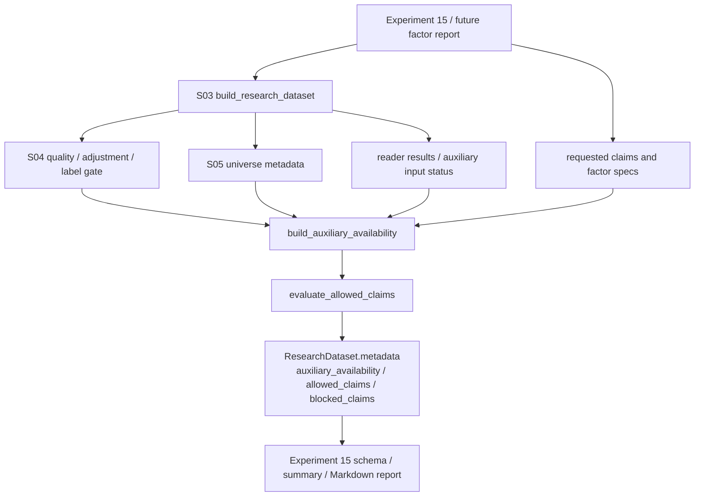

# LLD: CR008-S06 - 因子研究辅助数据合同

> 本文档仅覆盖 `CR008-S06-factor-research-auxiliary-data-contract` 的低层设计。当前 `confirmed=false`、`implementation_allowed=false`；在 `CR008-BATCH-A` 六份 LLD、六份 CP5 自动预检和批次人工确认全部通过前，不得进入实现。
>
> 本 Story 只冻结因子研究辅助数据的消费合同、availability matrix、allowed / blocked claims 和缺失降级语义。不授权真实 Tushare fetch、不授权真实 lake read/write、不授权新增行业/市值/风格暴露等真实数据生产，不读取旧 `data/**`，不读取或覆盖旧 `reports/data_quality_report.csv`，不读取、打印或记录 `.env`、token、NAS 凭据或真实私有路径。

## 1. Goal

修改 `engine/research_dataset.py`、`market_data/readers.py` 和 `experiments/run_experiment_15_factor_framework.py` 的研究消费合同，使实验十五和后续因子研究通过 `auxiliary_availability` 判断可交易性、OHLCV/VWAP、行业、市值/流通市值、复权审计、流动性和风格暴露是否可用，并通过 `allowed_claims` / `blocked_claims` 阻断缺数据时不应声明的严肃结论；缺失原因必须 100% 写入 `known_limitations` 与 `blocked_claims`。

## 2. Requirements（Functional / Non-Functional）

### 2.1 Functional

- 修改 `engine/research_dataset.py`，在 S03 `ResearchDataset` / `GateResult` 基础上新增或扩展 `auxiliary_availability`、`allowed_claims`、`blocked_claims`、`tradability_status`、`industry_classification_status`、`market_cap_status`、`style_exposure_status` 等字段；字段命名不得与 S01 `research_input_v1`、S02 proxy/real benchmark 字段和 S04/S05 gate 字段冲突。
- 修改 `engine/research_dataset.py`，创建 `build_auxiliary_availability()` 和 `evaluate_allowed_claims()` 或等价入口，基于 reader result、S04 gate result、S05 universe metadata 和实验声明的 requested claims 生成 availability matrix。
- 修改 `market_data/readers.py`，新增只读 auxiliary reader contract / helper。该 helper 只返回 typed availability / missing reason / remediation spec，不导入 connector/runtime/storage，不触发 fetch/backfill/normalize/revalidate/replay。
- 修改 `experiments/run_experiment_15_factor_framework.py`，在 schema、summary 和 Markdown report 中写入 `auxiliary_availability`、`allowed_claims`、`blocked_claims` 和 `known_limitations`；当前缺行业、市值、可交易性、风格暴露等数据时，只允许保留框架验证、close-only / volume-only 原始因子表现等保守声明。
- 当缺可交易性数据时，报告不得声明真实可成交、真实成交约束已启用或容量可执行。
- 当缺行业分类时，报告不得声明行业中性、行业内 z-score、行业归因或分行业 IC。
- 当缺市值/流通市值时，报告不得声明 size neutral、市值中性、容量结论或市值加权 IC。
- 当缺复权审计链路时，报告只能声明“使用已复权价格”或等价事实，不得声明公司行动链路可审计。
- 当缺流动性/换手/成交容量数据时，报告不得声明流动性控制、容量可交易或成交额过滤已生效。
- 当缺风格暴露时，报告不得声明纯 alpha、风格中性或已剥离 beta/size/value/liquidity 暴露。
- S06 不新增真实辅助数据生产；后续新增真实行业、市值、可交易性或风格暴露数据必须另走 CR / LLD / CP5。

### 2.2 Non-Functional

- 辅助数据缺失时，对应严肃结论输出次数为 0；测试必须逐类断言。
- `known_limitations` 与 `blocked_claims` 对缺失原因的覆盖率为 100%；缺失但无原因视为失败。
- 消费路径网络调用次数为 0；真实 Tushare fetch 次数为 0；真实 lake read/write 次数为 0。
- 不读取、列出、迁移、复制、比对或删除旧 `data/**`；不读取、打开或覆盖旧 `reports/data_quality_report.csv`。
- 不读取、打印或记录 `.env`、Tushare token、NAS 用户名/密码或真实私有路径。
- 与 S03/S04/S05 的依赖：LLD 可并行起草；实现必须等待 S03 `ResearchDataset` / `GateResult`、S04 quality/adjustment/label gate、S05 PIT/fixed universe 合同冻结，且 CR008-BATCH-A CP5 人工确认 approved。

## 3. 模块拆分与职责

| 模块 / 文件组 | 职责 | 说明 |
|---|---|---|
| `engine/research_dataset.py` | 承载 auxiliary availability 数据模型、claims gate、known limitations 合并和 `ResearchDataset` metadata 扩展 | S06 只扩展 S03 builder 输出，不创建第二套研究入口；实现前必须读取 S03/S04/S05 confirmed LLD |
| `market_data/readers.py` | 暴露只读 auxiliary reader contract，返回各辅助数据集的 `ReaderResult` / typed missing / missing reason | 不导入 `engine.*`；不导入 connector/runtime/storage；不触发补数 |
| `experiments/run_experiment_15_factor_framework.py` | 将实验十五当前 close/volume 框架验证报告接入 availability / claims metadata，并移除或阻断严肃 claims | 与 S01/S02 对同文件的 metadata / benchmark 字段改造合并；S06 只处理辅助数据 claims |
| `tests/test_cr008_factor_auxiliary_data_contract.py` | Story 专属离线测试，覆盖行业、市值、可交易性、风格暴露、OHLCV/VWAP、复权审计、流动性缺失与安全边界 | 使用 in-memory / tmp fixture / monkeypatch reader，不读取真实 lake、旧 data、旧报告或凭据 |
| CR008-S03 contract | 提供 `ResearchDataset`、`GateResult`、reader 聚合、metadata 与 remediation 容器 | 实现前必须 confirmed；S06 不覆盖 S03 类型 |
| CR008-S04 contract | 提供 quality、adjustment、label window gate 结果 | S06 claims gate 必须继承 S04 failure / truncation，不得放宽 |
| CR008-S05 contract | 提供 `universe_mode`、`is_pit_universe`、`pit_status`、`survivorship_bias_note` | S06 不把 fixed snapshot 或 quality pass 推断为 PIT available |

## 4. 代码结构与文件影响范围

| 动作 | 文件路径 | 变更内容 |
|---|---|---|
| 修改 | `engine/research_dataset.py` | 新增 `AuxiliaryAvailabilityEntry` / `AuxiliaryAvailabilityMatrix` / `AllowedClaimsResult` 或等价 dict contract；新增 `build_auxiliary_availability()`、`evaluate_allowed_claims()`、`merge_auxiliary_claims_into_metadata()`；扩展 `ResearchDataset.metadata`、`known_limitations`、`allowed_claims`、`blocked_claims` |
| 修改 | `market_data/readers.py` | 新增 `AuxiliaryInputRequest` / `read_auxiliary_inputs()` 或等价只读 helper，按 exact capability 返回 typed status、missing reason、required columns 和 `auto_execute=false` remediation；保持 no engine import |
| 修改 | `experiments/run_experiment_15_factor_framework.py` | 接入 auxiliary claims metadata；在 factor schema、backtest summary 和 Markdown report 中写入 availability、allowed/blocked claims、缺失限制；当前缺辅助数据时不声明行业中性、size neutral、真实可成交、纯 alpha 或容量结论 |
| 创建 | `tests/test_cr008_factor_auxiliary_data_contract.py` | 创建 CR008-S06 离线测试，覆盖 availability matrix、blocked claims、known limitations、experiment 15 report/schema、forbidden import、no old data/report/credentials |

禁止修改：`market_data/connectors/**`、`market_data/runtime.py`、`market_data/storage.py`、`data/**`、`reports/data_quality_report.csv`、`.env`、`credentials`、`delivery/**`、`process/HLD.md`、`process/ARCHITECTURE-DECISION.md`、`process/DEVELOPMENT-PLAN.yaml`、其他 Story LLD / CP5。

## 5. 数据模型与持久化设计

本 Story 无新增数据库、无新增 lake dataset、无新增外部持久化服务。全部新增对象为内存 dataclass / dict contract；报告持久化仍由实验十五现有输出路径控制，测试必须使用 `tmp_path`。

| 对象 / 字段 | 类型 | 约束 | 说明 |
|---|---|---|---|
| `AuxiliaryAvailabilityEntry.capability` | `str` | exact key；见第 8 节 capability 表 | 如 `tradability`、`ohlcv_vwap`、`industry_classification` |
| `AuxiliaryAvailabilityEntry.status` | `str` | `available`、`partial`、`missing`、`not_requested`、`unavailable`、`quality_failed`、`unknown` | 缺数据不能写 `available` |
| `AuxiliaryAvailabilityEntry.required_for_claims` | `list[str]` | claim enum 列表 | 指明该 capability 支撑哪些严肃结论 |
| `AuxiliaryAvailabilityEntry.missing_reason` | `str` | `status != available` 时非空 | 缺失原因必须进入 `known_limitations` 和 `blocked_claims` |
| `AuxiliaryAvailabilityEntry.source_dataset` | `str | None` | 可为空；存在时为 exact dataset / reader key | 如 `prices`、`industry_classification`、`market_cap`、`style_exposure` |
| `AuxiliaryAvailabilityEntry.required_columns` | `list[str]` | exact 字段名 | 用于静态/fixture 测试 |
| `AuxiliaryAvailabilityEntry.observed_columns` | `list[str]` | reader frame 实际字段 | 不打印真实路径或数据样本 |
| `AuxiliaryAvailabilityEntry.quality_status` | `str | None` | 来自 reader/catalog/gate | quality fail 不得被降级为 available |
| `AuxiliaryAvailabilityEntry.lineage_status` | `str | None` | `available`、`missing`、`not_applicable` | 复权审计、行业、市值等严肃结论需要 lineage |
| `AuxiliaryAvailabilityMatrix.entries` | `dict[str, AuxiliaryAvailabilityEntry]` | capability -> entry | `ResearchDataset.metadata["auxiliary_availability"]` 的来源 |
| `AllowedClaimsResult.allowed_claims` | `list[str]` | 仅保留当前数据可支持的 claim | 默认允许 `framework_validation`、`raw_factor_performance`、`close_only_exploration` 等保守声明 |
| `AllowedClaimsResult.blocked_claims` | `list[dict[str, str]]` | 每项含 `claim`、`reason`、`missing_capability`、`severity` | 缺数据对应的严肃结论必须写入 |
| `AllowedClaimsResult.known_limitations` | `list[str]` 或 `list[dict[str, str]]` | blocked claim 的缺失原因 100% 覆盖 | 与 S01 metadata 合同合并 |
| `AuxiliaryInputRequest.capabilities` | `tuple[str, ...]` | 不为空；exact capability | reader helper 使用；不表示数据生产授权 |
| `ResearchDataset.metadata["auxiliary_availability"]` | JSON-safe dict | 不含凭据值、真实私有路径或旧报告内容 | 供报告 / QA 断言 |

## 6. API / Interface 设计

| 接口 / 入口 | 输入 | 输出 | 调用方 | 说明 |
|---|---|---|---|---|
| `build_auxiliary_availability(reader_results, requirements, *, gate_result=None, universe_metadata=None)` | `Mapping[str, ReaderResult | Mapping]`、capability requirements、S04/S05 metadata | `AuxiliaryAvailabilityMatrix` | `build_research_dataset` / 实验十五 adapter / 测试 | 第 10 节 T01-T07 覆盖；缺 reader result 时返回 typed missing，不触发读取 |
| `evaluate_allowed_claims(auxiliary_availability, requested_claims, *, base_allowed_claims=None, fail_on_blocked_claims=False)` | availability matrix、报告想声明的 claims、基础 allowed claims | `AllowedClaimsResult` | `ResearchDataset` metadata、实验十五 report | blocked claim 必含 reason；`fail_on_blocked_claims=True` 时可返回 gate failure；测试 T01-T07 |
| `merge_auxiliary_claims_into_metadata(metadata, claims_result)` | S01/S03 metadata dict、claims result | JSON-safe metadata dict | report writer / 实验十五 | 合并 `auxiliary_availability`、`allowed_claims`、`blocked_claims`、`known_limitations`，不覆盖 S01/S02/S04/S05 字段；测试 T07 |
| `AuxiliaryInputRequest(...)` | `lake_root`、dates、symbols、capabilities、quality_policy | immutable request 或 dict | `market_data.readers.read_auxiliary_inputs` | `lake_root=None` 不能触发 env fallback；实现前以 S03 reader 边界为准；测试 T08/T09 |
| `read_auxiliary_inputs(request)` | auxiliary request | `dict[str, ReaderResult]` 或 `dict[str, Mapping]` | `engine.research_dataset` | 只读 exact datasets；未知/未登记 dataset 返回 `unavailable` / `missing_reason`；测试 T08 |
| `build_experiment15_auxiliary_requirements(factor_specs, report_claims)` | 因子列表、报告 claims | requirements dict | 实验十五 | 当前 factors 只要求 close/volume；行业/市值/风格/可交易性为严肃 claims 的前置；测试 T05/T06 |
| `render_experiment15_auxiliary_claims_section(metadata)` 或等价接入点 | metadata dict | Markdown section / schema fragment | 实验十五 report/schema | 输出 availability 与 blocked claims；不得写“行业中性/纯 alpha”等被阻断文案；测试 T06/T07 |

错误 / 限制暴露：

- `capability_missing`：capability 未请求或 reader 未提供时，entry `status=missing` 或 `not_requested`，对应 claims 被 blocked。
- `required_columns_missing`：reader frame 缺 required columns 时，entry `status=partial` 或 `missing`，写缺失列名，不打印数据样本。
- `quality_failed`：reader/catalog 或 S04 gate fail 时，entry `status=quality_failed`，严肃 claims 被 blocked。
- `pit_or_universe_not_serious`：S05 universe 为 fixed snapshot 或 PIT unavailable 时，S06 不允许严肃 PIT 因子结论。
- `blocked_claim_requested`：报告请求声明被 blocked 的 claim 时，默认移除该 claim 并写 limitations；若 strict 模式开启，则返回 `gate_failed`。

## 7. 核心处理流程

1. 实验十五或后续因子报告通过 S03 `build_research_dataset` 获得 `ResearchDataset`、基础 metadata、reader results、S04 gate result 和 S05 universe metadata。
2. S06 根据 factor specs 和 report claims 构造 auxiliary requirements。当前 `momentum_*` / `volatility_*` 只需要 close；`volume_ratio_*` 需要 volume；涉及 VWAP、行业内 z-score、市值中性、容量、纯 alpha 的 claims 需要对应辅助 capability。
3. `read_auxiliary_inputs()` 或 S03 reader 聚合结果按 exact capability 返回 typed status。未登记或未请求的数据集不得触发补数，只返回 missing / unavailable / remediation `auto_execute=false`。
4. `build_auxiliary_availability()` 把 reader result、required columns、quality/readiness、lineage 和 S04/S05 gate 结果归一为 availability matrix。
5. `evaluate_allowed_claims()` 从 requested claims 中保留可支持 claims，生成 blocked claims 和 known limitations。每个 blocked claim 必须包含 `missing_capability` 和 `reason`。
6. `merge_auxiliary_claims_into_metadata()` 将 availability / claims 写入 `ResearchDataset.metadata`，保留 S01/S02/S04/S05 已冻结字段。
7. `experiments/run_experiment_15_factor_framework.py` 在 factor schema、summary CSV 和 Markdown report 中渲染 availability / allowed claims / blocked claims；默认报告继续保留框架验证结论，但不得声明被 blocked 的严肃结论。



异常路径：

- S03 / S04 / S05 合同未冻结且进入实现：停止实现，回到 CP5 批次修订，不自行推断字段。
- auxiliary dataset 未登记：返回 `missing` / `not_requested`，写 remediation spec，`auto_execute=false`，不执行 fetch/backfill。
- required columns 不完整：返回 `partial` 或 `missing`，blocked 依赖该列的 claims。
- quality / adjustment / label / PIT gate fail：S06 不覆盖上游 gate；只把上游限制合并到 known limitations。
- strict requested claim 被 blocked：若调用方要求严肃研究且 `fail_on_blocked_claims=True`，返回 `gate_failed`；实验十五默认以探索/框架验证模式移除 blocked claim 并继续输出限制说明。
- 发现旧 `data/**`、旧 `reports/data_quality_report.csv`、凭据或 connector/runtime/storage import：测试失败，阻断实现交付。

## 8. 技术设计细节

- 关键算法 / 规则：
  - availability 状态优先级：`quality_failed` > `missing` > `partial` > `unknown` > `not_requested` > `available`。任何非 `available` 且支撑严肃 claim 的 capability 都必须生成 blocked claim。
  - missing reason 生成规则：优先使用 reader issue code / S04 gate issue / S05 universe issue；若无结构化 reason，则写 `auxiliary_capability_not_available:<capability>`，不得留空。
  - allowed claims 初始值继承 S01/S03 metadata；S06 只移除不被辅助数据支撑的 claims，并可追加保守 claims，如 `framework_validation`、`raw_factor_performance`、`close_only_exploration`、`volume_only_exploration`。
  - blocked claims 必须是机器可断言 dict，最小字段为 `claim`、`missing_capability`、`reason`、`severity`。
  - `known_limitations` 必须包含所有 blocked claims 的人类可读限制说明；数量小于 blocked claims 数量视为失败。
- capability / claims 映射：

| capability | 最小输入 / 字段 | available 时允许的 claims | missing / partial / failed 时必须 blocked 的 claims |
|---|---|---|---|
| `tradability` | 停牌、涨跌停、ST、上市/退市、当日是否可交易；可来自 `trade_status` / `stock_basic` / prices 状态字段 | `tradability_screened_execution`、`realistic_fillability` | `real_tradable_execution`、`tradability_screened`、`true_fillability` |
| `ohlcv_vwap` | `open/high/low/close/volume/amount/vwap` 或清晰的 close-only 声明 | 仅在字段齐全时允许 `open_execution`、`vwap_execution`、`intraday_range_factor`；close/volume 子集只允许对应基础因子 | `vwap_execution`、`open_execution`、`intraday_range_factor`、`full_ohlcv_factor` |
| `industry_classification` | 行业分类、`effective_date` / `available_at` 或等价 PIT availability | `industry_neutral`、`industry_attribution`、`industry_group_ic` | `industry_neutral`、`industry_attribution`、`industry_zscore`、`industry_group_ic` |
| `market_cap` | `market_cap` / `float_market_cap`、日期、lineage / availability | `size_neutral`、`market_cap_weighted_ic`、`capacity_analysis` 的 size 部分 | `size_neutral`、`market_cap_neutral`、`market_cap_weighted_ic`、`capacity_analysis` |
| `adjustment_audit` | `adj_factor` lineage 或 corporate action source | `auditable_adjustment_chain` | `corporate_action_audited`、`auditable_adjustment_chain` |
| `liquidity` | `amount`、turnover、成交天数、缺失率、容量阈值 | `liquidity_screened`、`capacity_analysis` 的 liquidity 部分 | `liquidity_controlled`、`tradable_capacity`、`capacity_analysis` |
| `style_exposure` | beta、size、value、liquidity 等风格暴露矩阵，带日期和 lineage | `pure_alpha`、`style_neutral_alpha`、`risk_model_adjusted` | `pure_alpha`、`style_neutral`、`risk_model_adjusted_alpha` |
| `pit_universe` | S05 `is_pit_universe=true` 且 `pit_status=available/pass` | `pit_factor_research` | `pit_factor_research`、`survivorship_bias_controlled` |
| `label_quality` | S04 label window gate pass 或 quantified truncation | `complete_forward_return_label` | `complete_forward_return_label`，或在探索模式写 `truncated_label_window` limitation |

- 依赖选择与复用点：
  - 复用 S01 `ResearchInputMetadata` / `known_limitations` / `allowed_claims` 字段，不创建第二套 report metadata schema。
  - 复用 S02 proxy/real benchmark 字段；S06 不计算真实 benchmark 或 proxy 收益。
  - 复用 S03 `ResearchDataset`、`GateResult`、`ResearchDatasetIssue`、remediation `auto_execute=false` 语义。
  - 复用 S04 quality/adjustment/label window gate，不在 S06 重写质量门。
  - 复用 S05 universe metadata，不把 fixed snapshot 推断为 PIT。
- 兼容性处理：
  - 当前仓库尚无 `engine/research_dataset.py`；若 S01/S03 实现先创建该文件，S06 实现必须读取并扩展现有类型，不覆盖文件。
  - 当前实验十五仍从 `--data-dir` 的本地 parquet 读取 close/volume，且 summary 使用 `benchmark_annual_return` / `excess_annual_return` 代理字段；S01/S02 实现后 S06 应合并到新的 metadata / proxy 字段，不保留严肃 claims。
  - `market_data/readers.py` 已存在 `ReaderResult`、`read_dataset`、`read_factor_panel`；S06 reader helper 应返回同类结果，不引入新反向依赖。
  - 若 S04/S05 LLD 最终字段名与本 LLD 草案不同，S06 实现前必须按 confirmed 合同调整，不得自由推断。
- 图示类型选择：使用流程图，因为本 Story 跨 `engine.research_dataset`、`market_data.readers`、实验十五和上游 gate，并存在多类 missing / blocked claim 分支。

## 9. 安全与性能设计

| 维度 | 设计措施 | 验证方式 |
|---|---|---|
| 安全 | `engine/research_dataset.py`、`market_data/readers.py`、实验十五不得导入 `market_data.connectors`、`market_data.runtime`、`market_data.storage`、联网库或凭据读取逻辑 | T09 AST / 文本扫描 |
| 安全 | auxiliary reader helper 只读 reader result；missing 时返回 typed status 和 `auto_execute=false` remediation | T08 / T09 monkeypatch reader 调用次数和 remediation 递归断言 |
| 安全 | 不读取、列出、迁移、复制、比对或删除旧 `data/**`；测试不引用真实旧数据路径 | T09 path sentinel / static scan |
| 安全 | 不读取、打开或覆盖旧 `reports/data_quality_report.csv` 内容 | T09 monkeypatch `Path.open` / static scan |
| 安全 | 不读取、打印或记录 `.env`、token、NAS 凭据；metadata/report 不含 fake secret 值 | T09 设置 fake env secret 后断言输出 |
| 安全 | `blocked_claims` 和 `known_limitations` 只写字段名、状态和缺失原因，不写真实样本、路径或凭据 | T07/T09 输出扫描 |
| 性能 | availability matrix 只遍历 capability 列表和 reader metadata，不扫描大 DataFrame；required columns 检查使用列集合 | T01-T07 小 fixture 验证 |
| 性能 | experiment 15 report 渲染只序列化 JSON-safe metadata，不新增后台任务、缓存服务或长周期计算 | T06/T07 |
| 一致性 | blocked claims 生成幂等；重复调用不重复追加同一 claim | T07 断言唯一 claim 集合 |

## 10. 测试设计

| 测试场景 | 前置条件 | 操作 | 预期结果 | 验证方式 |
|---|---|---|---|---|
| T01 缺行业阻断行业结论 | availability fixture 无 `industry_classification` | 调用 `build_auxiliary_availability()` 和 `evaluate_allowed_claims()`，requested 包含 `industry_neutral` | `blocked_claims` 包含 `industry_neutral` / `industry_attribution`；`known_limitations` 非空；allowed 不含行业 claims | `uv run --python 3.11 pytest -q tests/test_cr008_factor_auxiliary_data_contract.py -k industry` |
| T02 缺市值阻断 size / capacity | fixture 无 `market_cap` / `float_market_cap` | requested 包含 `size_neutral`、`capacity_analysis` | 对应 claims 被 blocked；原因含 `market_cap` | 同测试文件 |
| T03 缺可交易性阻断真实可成交 | fixture 无 tradability 或 status missing | requested 包含 `real_tradable_execution` | blocked；报告仍可允许 `framework_validation` | 同测试文件 |
| T04 缺风格暴露阻断纯 alpha | fixture 无 style exposure | requested 包含 `pure_alpha` / `style_neutral` | blocked；allowed 不含纯 alpha / style neutral | 同测试文件 |
| T05 OHLCV/VWAP 部分字段降级 | fixture 仅有 close/volume，缺 open/high/low/vwap | 请求 open/VWAP/intraday claims | close/volume 因子保留探索 claims；VWAP/open/intraday claims blocked | 同测试文件 |
| T06 缺复权审计只允许已复权价格事实 | fixture 有 `adjustment_policy=qfq`，无 `adj_factor` lineage / corporate action | requested 包含 `auditable_adjustment_chain` | blocked audit claim；limitation 写“只能声明使用已复权价格”或等价内容 | 同测试文件 |
| T07 metadata 合并与 100% 原因覆盖 | 构造多个 missing capabilities | 调用 metadata merge / report section | `blocked_claims` 每项都有 reason；`known_limitations` 覆盖全部 missing reason；无重复 claim | 同测试文件 |
| T08 reader helper typed missing | monkeypatch `read_dataset` 返回 missing / unknown dataset | 调用 `read_auxiliary_inputs()` | 返回 typed missing / unavailable，不触发 fetch/backfill；remediation `auto_execute=false` | 同测试文件 |
| T09 安全边界 | 设置 fake token env；创建 path sentinel；目标文件存在 | 静态扫描和局部函数调用 | 无 forbidden import；不读旧 data / 旧报告；输出不含 fake secret；网络调用 0 | 同测试文件 |
| T10 S04/S05 上游限制继承 | gate result 有 `label_window_failed` 或 universe metadata 为 fixed snapshot | 调用 claims gate | S06 不放宽上游 failure；PIT / complete label claims blocked | 同测试文件 |
| T11 实验十五 report/schema 文案 | tmp output、缺行业/市值/风格/可交易性 fixture | 运行实验十五局部 render 或 metadata helper | report/schema 含 auxiliary availability、allowed/blocked claims；不含未授权的行业中性/纯 alpha/真实可成交声明 | 同测试文件 |

接口到测试映射：

| 第 6 节接口 | 对应测试 |
|---|---|
| `build_auxiliary_availability` | T01-T08、T10 |
| `evaluate_allowed_claims` | T01-T07、T10 |
| `merge_auxiliary_claims_into_metadata` | T07、T11 |
| `AuxiliaryInputRequest` / `read_auxiliary_inputs` | T08、T09 |
| `build_experiment15_auxiliary_requirements` | T05、T11 |
| `render_experiment15_auxiliary_claims_section` | T07、T11 |

## 11. 实施步骤

| TASK-ID | 动作 | 目标文件 | 详细描述 | 对应测试 |
|---|---|---|---|---|
| CR008-S06-T1 | 修改 | `engine/research_dataset.py` | 扩展 S03 `ResearchDataset` / `GateResult`：新增 auxiliary availability dataclass / dict、claims gate、metadata merge、known limitations 覆盖检查；继承 S04/S05 gate 结果 | T01-T07、T10 |
| CR008-S06-T2 | 修改 | `market_data/readers.py` | 新增 `AuxiliaryInputRequest` / `read_auxiliary_inputs()` 或等价只读 helper；按 exact capability 返回 ReaderResult / missing reason；不导入 engine，不触发补数 | T08、T09 |
| CR008-S06-T3 | 修改 | `experiments/run_experiment_15_factor_framework.py` | 接入 auxiliary requirements 与 claims metadata；schema/report 写 availability、allowed/blocked claims；缺辅助数据时移除严肃结论文案 | T05、T06、T07、T09、T11 |
| CR008-S06-T4 | 创建 | `tests/test_cr008_factor_auxiliary_data_contract.py` | 创建 in-memory / tmp fixture 测试，覆盖 T01-T11、安全边界、无旧 data/report/credential、forbidden import、上游 gate 继承 | T01-T11 |

每个文件影响项至少被一个 TASK-ID 覆盖；每个 TASK-ID 都有对应测试入口。实现阶段必须按 T1 -> T4 顺序推进，并在实现前读取 confirmed 版 S03/S04/S05 LLD。若 confirmed 上游合同与本 LLD 字段冲突，停止实现并回到 CP5 修改 S06 LLD。

## 12. 风险、难点与预研建议

| 风险 / 难点 | 影响 | 缓解措施 / 预研建议 |
|---|---|---|
| S03 `ResearchDataset` / `GateResult` 尚未 confirmed | S06 字段落点可能与最终 builder 类型不一致 | 本 LLD 只定义扩展合同；实现前必须等待 S03 confirmed，并合并到既有类型 |
| S04 / S05 当前只有 Story 卡片合同草案 | S06 无法最终确定 gate result 与 universe metadata 字段名 | 将 S04/S05 字段列为实现前 required contract；CP5 批次聚合时统一比对 |
| 当前实验十五从旧式 `--data-dir=data` 读取 local parquet | 直接实现可能触碰旧 `data/**` 默认路径 | S06 实现必须跟随 S01/S03 改造后的 research dataset / tmp fixture 入口；测试中不得读取真实 `data/**` |
| availability matrix 过宽导致实现复杂度膨胀 | P1 Story 可能超出合同范围变成数据生产 | 只定义消费合同和缺失降级；真实行业/市值/风格数据生产必须后续 CR |
| allowed / blocked claim enum 与报告中文文案漂移 | QA 难以机器断言严肃结论是否被阻断 | 使用 exact enum 写 metadata；Markdown 可以中文说明，但测试以 enum 和禁止短语扫描为准 |
| S01/S02 已计划修改实验十五同一文件 | 并行实现会覆盖字段改造 | CR008 默认开发顺序 S01/S02 -> S03 -> S04/S05 -> S06；S06 实现时读取现有文件并做增量合并，不回滚他人修改 |

### OPEN / Spike 跟踪

| ID | 类型（OPEN / Spike） | 问题 | 下一动作 | 责任方 |
|---|---|---|---|---|
| O-01 | OPEN | Story 卡片 frontmatter 仍为 `status: draft`，但 CR/STATE/CP3/CP4 与用户任务已允许进入 LLD | meta-po 在 CP5 批次聚合前回填 Story 状态为 `lld-ready-for-review` 或等价审查态 | meta-po |
| O-02 | OPEN | S03 confirmed 版 `ResearchDataset` / `GateResult` 字段未冻结 | CR008-BATCH-A CP5 人工确认前比对 S03 LLD；实现前以 confirmed 字段为准 | meta-po / CR008-S03 meta-dev / 本 Story meta-dev |
| O-03 | OPEN | S04 confirmed 版 quality/adjustment/label gate 字段未冻结 | S04 LLD 完成后比对 `gate_result` / label fields；必要时修订本 LLD | meta-po / CR008-S04 meta-dev / 本 Story meta-dev |
| O-04 | OPEN | S05 confirmed 版 PIT/fixed universe metadata 字段未冻结 | S05 LLD 完成后比对 `universe_mode`、`pit_status`、`survivorship_bias_note` | meta-po / CR008-S05 meta-dev / 本 Story meta-dev |
| O-05 | Spike | `read_auxiliary_inputs()` 是否必须落在 `market_data/readers.py`，或由 S03 builder 用现有 `read_dataset` 组合即可 | 实现前检查 S03/S04/S05 confirmed LLD；若无需共享 reader helper，可把 readers.py 修改降为最小 no-op / adapter | 本 Story meta-dev / meta-po |
| O-06 | OPEN | 当前执行线程未暴露真实 `agent_id` / `thread_id` | CP5 自动预检先写 pending，由主线程回填真实 dispatch evidence | meta-po |

## 13. 回滚与发布策略

- 发布方式：CR008 CP5 批次人工确认后，按 Wave 和 dev_gate 调度实现；本 Story 仅新增/修改 Python 合同、实验十五 metadata 接入和专属测试，不生成安装脚本，不写 `delivery/**`，不运行真实抓取，不写真实 lake。
- 回滚触发条件：
  - 缺行业、市值、可交易性、风格暴露、流动性或复权审计时，对应严肃 claim 仍出现在 `allowed_claims` 或报告文案中。
  - `blocked_claims` 缺 `reason` 或 `known_limitations` 未覆盖全部缺失原因。
  - S06 实现导入 connector/runtime/storage、联网库、读取 `.env` / token / NAS 凭据，或触发 fetch/backfill/normalize/revalidate/replay。
  - 测试或实现读取、列出、迁移、复制、比对、删除旧 `data/**`，或读取/覆盖旧 `reports/data_quality_report.csv`。
  - S06 覆盖 S01/S02/S03/S04/S05 已冻结字段或放宽上游 gate。
- 回滚动作：
  - 回退 `experiments/run_experiment_15_factor_framework.py` 中 S06 claims metadata 接入点，保留失败测试作为复现依据。
  - 回退 `engine/research_dataset.py` 中 S06 auxiliary / claims 扩展，不删除 S01/S03/S04/S05 已落地合同。
  - 回退 `market_data/readers.py` 中 S06 auxiliary helper，保留原有 reader API。
  - 数据回滚：无真实数据写入；tmp fixture 由 pytest 生命周期清理。不得删除、覆盖、读取或比较旧 `data/**` 与旧报告。

## 14. Definition of Done

- [ ] 14 个章节全部填写完成，frontmatter `tier=M`、`confirmed=false`、`implementation_allowed=false`。
- [ ] `process/checks/CP5-CR008-S06-factor-research-auxiliary-data-contract-LLD-IMPLEMENTABILITY.md` 已写入。
- [ ] `auxiliary_availability` 覆盖 tradability、OHLCV/VWAP、industry、market_cap、adjustment_audit、liquidity、style_exposure、PIT universe、label quality。
- [ ] 缺对应辅助数据时，对应严肃结论输出次数为 0。
- [ ] `blocked_claims` 每项都包含 `claim`、`missing_capability`、`reason`、`severity`。
- [ ] `known_limitations` 100% 覆盖 blocked claims 的缺失原因。
- [ ] 实验十五报告保留框架验证结论，但不声明行业中性、size neutral、真实可成交、纯 alpha、容量可交易或公司行动链路可审计等 unsupported claims。
- [ ] S06 不新增真实数据抓取授权，不触发 connector/runtime/storage，不读写真实 lake。
- [ ] 旧 `data/**`、旧 `reports/data_quality_report.csv`、`.env`、token、NAS 凭据操作次数为 0。
- [ ] `tests/test_cr008_factor_auxiliary_data_contract.py` 覆盖 T01-T11。
- [ ] 第 6 节接口在第 10 节有测试入口；第 7 节异常路径有错误路径测试。
- [ ] 实现前 S03/S04/S05 合同已冻结，CR008-BATCH-A CP5 人工确认已 approved，文件所有权无冲突。
- [ ] OPEN / Spike 已清点；O-01 至 O-06 在 CP5 批次聚合或实现前处理。

### 人工确认区

> **CP5 - Story LLD 可实现性门**
> meta-dev 先写入 `process/checks/CP5-CR008-S06-factor-research-auxiliary-data-contract-LLD-IMPLEMENTABILITY.md` 自动预检结果。
> meta-po 收齐 `CR008-BATCH-A` 六个 Story 的 LLD 和 CP5 自动预检后，再生成并提示用户审查 `checkpoints/CP5-CR008-BATCH-A-LLD-BATCH.md`。
> 用户统一确认全部目标 Story 的 LLD 后，仍需满足当前 Wave、依赖门控与文件所有权门控方可进入实现。

**CP5 checklist 摘要**：

| # | 检查项 | 状态 | 证据 |
|---|---|---|---|
| 1 | LLD 覆盖 AC | PASS | 第 2 / 8 / 10 / 14 节 |
| 2 | 与 HLD / ADR 一致 | PASS | 第 3 / 7 / 8 / 12 节 |
| 3 | 文件影响范围明确 | PASS | 第 4 / 11 节 |
| 4 | 接口契约完整 | PASS | 第 6 / 10 节 |
| 5 | 测试与 dev_gate 可计算 | PASS | 第 10 / 12 / 14 节 |

**人工确认回复**：

请直接回复以下任一整行：

```text
approve
修改: <具体修改点>
reject
```

**人工审查结果回填**：

- 结论：`approved | changes_requested | rejected`
- 审查人：
- 审查时间：
- 修改意见：
- 风险接受项：
