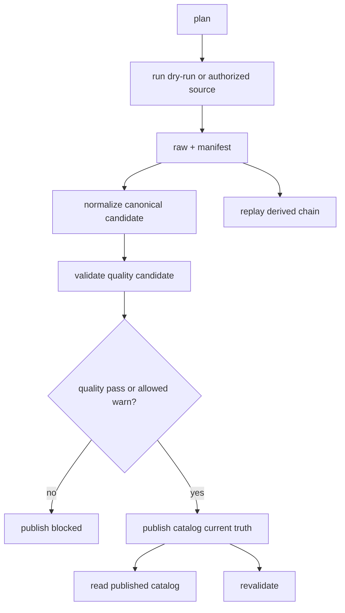

# LLD: CR010-S01-multidataset-plan-run-publish-cli-contract - multi-dataset plan/run/publish CLI contract

> 本 LLD 已按用户“默认人工审批通过”授权纳入 CR010-DL-BATCH-A CP5 批次。授权仅覆盖离线 / fixture / tmp lake 实现与验证，不授权真实联网、真实 lake 写入、旧 `data/**` 操作或凭据读取。

## 1. Goal

修改 `market_data` CLI 与 catalog/readers 合同，使 `plan/run/normalize/validate/publish/read/revalidate/replay` 形成统一 multi-dataset 生命周期：`validate` 只写 unpublished candidate，`publish` 才能更新 catalog current truth，consumer 只读已发布 catalog/canonical/gold。

## 2. Requirements（Functional / Non-Functional）

### 2.1 Functional

- `plan` 只生成计划，不联网、不写湖，输出 dataset、source/interface、date range、run_id、idempotency、target layer paths 和 safety counters。
- `run` 默认 dry-run；真实 source 必须显式 `--enable-real-source`，本批次保持未授权并 fail-fast。
- `normalize` 从 manifest/raw 派生 canonical，不重新联网。
- `validate` 写 quality/readiness/PIT/coverage candidate，不自动 publish。
- `publish` 只接受 pass candidate；warn 需要显式 allow，fail 永远阻断。
- `read` 只读取已 publish catalog；unpublished candidate 返回 `catalog_entry_missing` 或 `required_missing`。
- `revalidate` 和 `replay` 基于候选或已发布 run 重算派生链路，不调用 provider。

### 2.2 Non-Functional

- 安全：不读取 `.env`、token、NAS 凭据、旧 `data/**` 或 legacy report 内容。
- 可恢复：run/resume 使用结构化错误枚举 `provider_error/network_error/rate_limited/schema_mismatch/quality_failed/resume_conflict`。
- 可审计：catalog entry 必含 run_id、date range、source/interface、lineage checksum、quality/readiness/PIT、known limitations、published_at。
- 可测试：所有测试使用 tmp lake 和 fixture，不依赖真实网络或真实 lake。

## 3. 模块拆分与职责

| 模块 / 文件组 | 职责 | 说明 |
|---|---|---|
| `market_data/cli.py` | 统一子命令入口和参数语义 | 扩展现有 plan/run/normalize/validate/publish/read/revalidate/replay，不破坏旧命令 |
| `market_data/catalog.py` | 管理 candidate 与 published current truth | publish gate 的唯一写入点 |
| `market_data/readers.py` | 只读 published catalog | 质量策略由 reader enforcement 处理 |
| `market_data/runtime.py` | 提供 run/resume 错误枚举和 manifest 状态 | S01 不执行真实 source |
| `market_data/validation.py` | 输出 quality/readiness/PIT/coverage candidate | validate 不得更新 catalog current |
| `tests/test_cr010_data_lake_publish_and_contracts.py` | 覆盖 lifecycle 与 publish gate | 全部 tmp lake |

## 4. 代码结构与文件影响范围

| 动作 | 文件路径 | 变更内容 |
|---|---|---|
| 修改 | `market_data/cli.py` | 统一 CLI handler，补齐 `publish`、`revalidate`、`replay` 的 multi-dataset 参数和 dry-run gate |
| 修改 | `market_data/catalog.py` | 增加 published/current 与 candidate 区分，发布时写 metadata 完整字段 |
| 修改 | `market_data/readers.py` | reader 只读取 published catalog，并执行 exploratory / production_strict quality policy |
| 修改 | `market_data/runtime.py` | 暴露 resume conflict 与结构化错误枚举给 CLI/report |
| 修改 | `market_data/validation.py` | validate 产出 candidate quality/readiness，不直接更新 current |
| 修改 | `tests/test_cr010_data_lake_publish_and_contracts.py` | 增加 plan-run-normalize-validate-publish-read-revalidate-replay 离线集成覆盖 |

## 5. 数据模型与持久化设计

| 对象 / 字段 | 类型 | 约束 | 说明 |
|---|---|---|---|
| `CatalogEntry.dataset` | `str` | P0/P1 dataset exact match | 禁止模糊匹配 |
| `CatalogEntry.run_id` | `str` | 非空 | current truth 追溯来源 |
| `date_range` | object | `start_date <= end_date` | publish metadata 必填 |
| `source_interface` | `str` | exact registry value | 未确认 source/interface fail-fast |
| `canonical_path` | `str` | 相对 lake root | 不打印真实私有路径 |
| `quality_status` | enum | `pass/warn/fail` | fail 不可 publish |
| `readiness_status` | enum | `ready/limited/missing` | reader 与 report 消费 |
| `pit_status` | enum | `pit_available/pit_incomplete/non_pit_snapshot/not_applicable` | production strict gate |
| `available_at_rule` | `str` | dataset 合同指定 | 日频价格必须 daily_close_fact |
| `lineage_raw_checksum` | `str` | candidate/published 均记录 | 审计与 replay |
| `known_limitations` | list | 可为空 | exploratory 披露 |

## 6. API / Interface 设计

| 接口 / 入口 | 输入 | 输出 | 调用方 | 说明 |
|---|---|---|---|---|
| `market_data plan` | dataset/source/interface/date range/lake root | plan JSON | 用户、测试 | 不联网、不写湖 |
| `market_data run` | plan/run_id/`--enable-real-source` | manifest 或 dry-run result | 用户、测试 | 默认 dry-run |
| `market_data normalize` | run_id/dataset/raw/manifest | canonical candidate | 数据生产 CLI | 不重新联网 |
| `market_data validate` | canonical/run_id/dataset | quality candidate | QA/CLI | 不 publish |
| `market_data publish` | dataset/run_id/quality candidate | catalog current truth | QA/CLI | fail 阻断，warn 需 allow |
| `market_data read` | dataset/filter/quality policy | DataFrame + metadata 或 typed failure | readers/consumer | 只读 published |
| `market_data revalidate` | run_id 或 published entry | new quality candidate | QA/CLI | 不联网 |
| `market_data replay` | manifest/raw/run_id | derived canonical/quality candidate | QA/CLI | 不联网 |

## 7. 核心处理流程

## 8. 技术设计细节

- 关键规则：validate 写 candidate；publish 写 current；read 只读 current。
- 依赖复用：复用现有 `CatalogStore`、`read_dataset`、CLI JSON 输出和 tmp lake 测试模式。
- 兼容性：保留已有 `validate/read` 参数，新增 publish gate 不改变未发布 candidate 文件格式。
- 图示类型选择：流程图，覆盖 8 个 CLI 子命令和两条派生路径。

## 9. 安全与性能设计

| 维度 | 设计措施 | 验证方式 |
|---|---|---|
| 安全 | 真实 source 需要 `--enable-real-source`，本批次默认失败 | CLI 单测断言 dry-run 与 fail-fast |
| 安全 | 输出使用相对路径和 safe lake label | 测试断言不包含 token/私有路径 |
| 安全 | consumer 不导入 connector/runtime/storage/provider SDK | 静态扫描测试 |
| 性能 | catalog 读写为 JSON 小对象，按 dataset/run_id 定位 | tmp lake 集成测试 |

## 10. 测试设计

| 测试场景 | 前置条件 | 操作 | 预期结果 | 验证方式 |
|---|---|---|---|---|
| validate 不自动 current | tmp lake canonical candidate | `validate` 后 `read` | `catalog_entry_missing` | `pytest tests/test_cr010_data_lake_publish_and_contracts.py` |
| publish 后 reader 可见 | quality pass candidate | `publish` 再 `read` | reader 返回数据和 metadata | 同上 |
| quality fail 阻断 publish | quality fail candidate | `publish` | typed failure `quality_failed` | 同上 |
| warn 策略 | quality warn candidate | exploratory allow / strict deny | allow 时可读，strict 阻断 | 同上 |
| revalidate/replay 不联网 | manifest/raw fixture | `revalidate` / `replay` | 输出 candidate，无 provider 调用 | 同上 |
| consumer boundary | 静态文件扫描 | 扫描 engine/experiments | 无 connector/runtime/storage/provider import | 同上 |

## 11. 实施步骤

| TASK-ID | 动作 | 目标文件 | 详细描述 | 对应测试 |
|---|---|---|---|---|
| CR010-S01-T1 | 修改 | `market_data/catalog.py` | 明确 candidate/current truth，发布写完整 metadata | validate 不自动 current、publish 后 reader 可见 |
| CR010-S01-T2 | 修改 | `market_data/readers.py` | reader 只读 published catalog，执行 quality policy | warn 策略、quality fail |
| CR010-S01-T3 | 修改 | `market_data/cli.py` | 补齐 publish/revalidate/replay 生命周期参数与 dry-run gate | revalidate/replay 不联网 |
| CR010-S01-T4 | 修改 | `market_data/runtime.py` / `validation.py` | 暴露结构化错误和 quality candidate metadata | quality fail 阻断 publish |
| CR010-S01-T5 | 修改 | `tests/test_cr010_data_lake_publish_and_contracts.py` | 增加全生命周期 fixture 测试 | 全部 |

## 12. 风险、难点与预研建议

| 风险 / 难点 | 影响 | 缓解措施 / 预研建议 |
|---|---|---|
| 旧测试假设 validate 后可 read | 测试回归失败 | 更新测试为 publish gate 语义 |
| warn 被误当生产可用 | production_strict 失真 | reader 默认 strict 阻断 warn，exploratory 必须显式 allow |
| revalidate/replay 被实现为重新联网 | 安全边界破坏 | 单测 monkeypatch provider 调用失败 |

### OPEN / Spike 跟踪

| ID | 类型（OPEN / Spike） | 问题 | 下一动作 | 责任方 |
|---|---|---|---|---|
| 无 | OPEN | 无阻断项 | 不适用 | 不适用 |

## 13. 回滚与发布策略

- 发布方式：随 CR010-DL-BATCH-A 离线实现进入 `market_data` 包。
- 回滚触发条件：validate 自动更新 current、reader 可读 unpublished candidate、真实 source 被默认启用、token 或真实路径进入日志。
- 回滚动作：移除新增 publish gate 改动并恢复 reader 到已发布 catalog 之前的版本；不得删除真实数据或旧 `data/**`。

## 14. Definition of Done

- [x] 14 个章节全部填写完成。
- [x] CP5 批次已按用户授权默认 approved。
- [ ] `plan/run/normalize/validate/publish/read/revalidate/replay` 离线生命周期测试通过。
- [ ] validate 不自动 current，publish 后 reader 可见。
- [ ] fail 不可 publish，warn 需要显式 allow 才能 exploratory 消费。
- [ ] consumer forbidden import 静态扫描通过。
