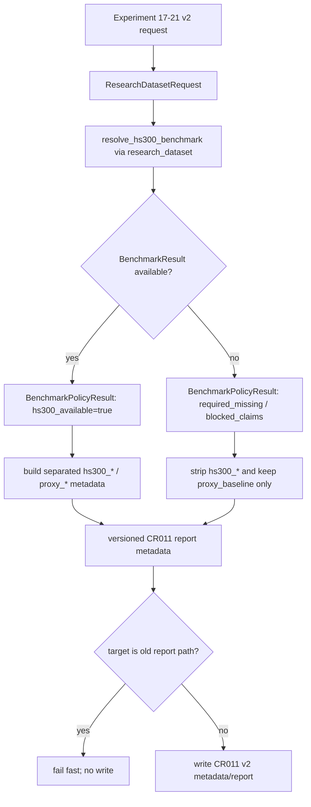

# LLD: CR011-S01 — 真实 benchmark 与 policy 消费

> 本文档是 `CR011-S01-real-benchmark-and-policy-consumption` 的 Story 级低层设计。`CR011-DATA-BATCH-A` CP5 已于 2026-05-24T10:24:02+08:00 获用户批准，本文档可作为实现输入；该批准不授权真实联网、读取凭据、写真实 lake、操作旧 `data/**` 或覆盖旧报告。

## 1. Goal

为实验 17-21 v2 创建真实 `hs300_index` benchmark policy 消费合同：在 `market_data/benchmarks.py` 冻结 `BenchmarkPolicyResult` 元数据结构，在 `engine/research_dataset.py` 将该结构纳入 `research_input_v1` / `ResearchDataset` metadata，在 `experiments/run_experiment_17_21_factor_suite.py` 输出版本化报告 metadata，并创建 `tests/test_cr011_benchmark_policy_consumption.py` 覆盖字段隔离和安全边界。

完成后的工程效果是：新版实验无论真实 benchmark 可用或缺失，都固定输出 `benchmark_policy_id`、`benchmark_kind`、`hs300_available`、`hs300_coverage_ratio`、`proxy_baseline_used`、`benchmark_missing_reason` 6 个字段；proxy baseline 写入真实 `hs300_*` 字段的次数为 0；`production_strict` 缺真实 benchmark 时进入 `required_missing` / `blocked_claims`，不得静默替代。

## 2. Requirements（Functional / Non-Functional）

### 2.1 Functional

- 创建 `BenchmarkPolicyResult` 或等价 frozen dataclass，作为 CR011-S01 的 benchmark policy 消费合同；该结构只从既有 `BenchmarkResult`、proxy baseline metrics 和调用方传入的 policy id 组装，不读取 lake、不调用 connector、不触发 backfill。
- 修改 `market_data/benchmarks.py`，新增 `build_benchmark_policy_result` 或等价 helper，固定输出 6 个验收字段，并在真实 benchmark 不可用时剥离所有 `hs300_*` 指标字段。
- 修改 `engine/research_dataset.py`，让 `ResearchDataset.metadata` 同时包含嵌套 `benchmark_policy` 与扁平 6 字段；`production_strict` 且 `hs300_available=false` 时必须新增 `blocked_claims`，并保持 `auto_execute=false` remediation。
- 修改 `experiments/run_experiment_17_21_factor_suite.py`，让新版实验 17-21 v2 只消费 `ResearchDataset` / `BenchmarkPolicyResult` 输出；旧 `reports/experiment_17_21/factor_strategy_report.md` 只能作为 baseline path 引用，不得作为输出目标。
- 创建 `tests/test_cr011_benchmark_policy_consumption.py`，覆盖真实 benchmark 可用、真实 benchmark 缺失、quality fail、proxy 字段隔离、安全边界和旧报告不覆盖。

### 2.2 Non-Functional

- 安全：默认验证路径 `network_calls=0`、`lake_writes=0`、`credential_reads=0`、`legacy_data_operations=0`；不得导入 `market_data.connectors`、`market_data.runtime`、`market_data.storage`，不得读取 `.env`。
- 可追溯：真实 benchmark available 时 metadata 必须携带 `index_code`、coverage、quality/readiness、source/interface、source_run_id 或 lineage；缺失时必须携带机器可解析 `benchmark_missing_reason`。
- 兼容：保留既有 `BenchmarkResult`、`BenchmarkPolicy`、`build_benchmark_field_payload`、`ResearchDatasetRequest` 的公开行为；新增合同应以附加字段和 helper 为主，不删除已有字段。
- 报告隔离：CR011 v2 默认输出到版本化目录或调用方显式提供的非旧报告路径；任何目标路径解析为 `reports/experiment_17_21/factor_strategy_report.md` 时必须 fail fast。
- 门控：本 LLD 只允许进入 CP5 审查；`confirmed=false`、`CR011-DATA-BATCH-A` CP5 未 approved 或 dev_gate 未满足时不得实现。

## 3. 模块拆分与职责

| 模块 / 文件组 | 职责 | 说明 |
|---|---|---|
| `market_data/benchmarks.py` | 定义 benchmark policy 消费合同和字段隔离 helper | 复用既有 `BenchmarkResult` / `BenchmarkPolicy` / `build_benchmark_field_payload`，新增 `BenchmarkPolicyResult` 和 6 字段输出，不读取凭据、不联网、不写湖 |
| `engine/research_dataset.py` | 将 benchmark policy gate 纳入 `research_input_v1` metadata 和 claims | 消费 `resolve_hs300_benchmark` 返回值，生成 `allowed_claims` / `blocked_claims`，`production_strict` 缺真实 benchmark 时 fail |
| `experiments/run_experiment_17_21_factor_suite.py` | 实验 17-21 v2 消费分离后的 `hs300_*` / `proxy_*` 字段并写版本化 metadata | 保留现有 proxy baseline 计算；真实 benchmark 不可用时只输出 proxy 字段和 limitation；旧报告路径只作为 baseline 引用 |
| `tests/test_cr011_benchmark_policy_consumption.py` | 验证字段合同、安全边界和旧报告隔离 | 使用 fixture / fake benchmark result / monkeypatch；不需要真实 lake、Tushare token 或网络 |
| `process/HLD.md#27.5` | 集成契约来源 | `Benchmark policy -> report builder` 要求缺真实 benchmark 时 `hs300_*` 输出 0 行 / null 字段 |
| `process/HLD-DATA-LAKE.md#14.5` | 数据湖输出与主 HLD 消费边界 | readers 输出 `BenchmarkPolicyResult`、coverage、quality/readiness；consumer 缺真实 benchmark 时只允许 proxy baseline |
| `process/ARCHITECTURE-DECISION.md#ADR-036` | 决策约束 | 真实 benchmark 字段只能写入 `hs300_*`；proxy 只能写入 `proxy_*` / `proxy_baseline` |

## 4. 代码结构与文件影响范围

| 动作 | 文件路径 | 变更内容 |
|---|---|---|
| 修改 | `market_data/benchmarks.py` | 创建 `BenchmarkPolicyResult` dataclass；新增 `build_benchmark_policy_result` helper；保证 `to_metadata()` 固定输出 6 个验收字段、可选 lineage 字段和 `blocked_claims`；真实 benchmark 不可用时删除 `hs300_*` 字段；更新 `__all__` |
| 修改 | `engine/research_dataset.py` | 在 `_research_dataset_metadata` 或相邻 helper 中纳入 `benchmark_policy` metadata；将 6 字段扁平写入 `ResearchDataset.metadata`；扩展 `_benchmark_issues` / `_blocked_claims`，使 `production_strict` 缺真实 benchmark 时产生 `required_missing` 和 `real_benchmark_research` blocked claim |
| 修改 | `experiments/run_experiment_17_21_factor_suite.py` | 增加 v2 benchmark policy metadata 组装；新增或调整 CLI 参数以传入 `benchmark_policy=hs300_required`、`realism_mode`、`baseline_report_path` 和版本化输出目录；写报告前校验不得覆盖旧 `reports/experiment_17_21/factor_strategy_report.md` |
| 创建 | `tests/test_cr011_benchmark_policy_consumption.py` | 创建离线单测，覆盖 available、missing、quality_failed、proxy 字段隔离、forbidden import/path、旧报告不覆盖和默认安全计数 |

禁止修改：`market_data/connectors/**`、`market_data/runtime.py`、`market_data/storage.py`、`.env`、`data/**`、`reports/experiment_17_21/factor_strategy_report.md`、`delivery/**`。本 Story 不新增依赖、不修改 `pyproject.toml` / `uv.lock`。

## 5. 数据模型与持久化设计

本 Story 不新增数据库、不新增 lake dataset、不写真实 lake。新增的是内存数据结构、实验 metadata JSON / report metadata 字段和测试 fixture 输出；旧报告只作为 baseline path 字符串引用。

| 对象 / 字段 | 类型 | 约束 | 说明 |
|---|---|---|---|
| `BenchmarkPolicyResult` | frozen dataclass | 必须可 `to_metadata()`；不得持有不可序列化对象 | CR011-S01 对外冻结的 benchmark policy 消费合同 |
| `benchmark_policy_id` | `str` | 必填；默认 `hs300_required` | 表示本次研究请求的 benchmark policy |
| `benchmark_kind` | `str` | 必填；枚举 `hs300` / `proxy_baseline` / `hs300_required` | 报告语义字段。真实 available 时为 `hs300`；缺真实 benchmark 且 required 时可为 `hs300_required` 并配合 missing reason；探索 proxy 时为 `proxy_baseline` |
| `benchmark_source_kind` | `str | None` | 可选；枚举沿用 `price_index` / `total_return_index` / `adjusted_index` / `policy_unconfirmed` | 防止与既有 `BenchmarkResult.benchmark_kind` 的价格指数口径混淆 |
| `index_code` | `str` | 默认 `399300.SZ` | 真实 benchmark 的指数代码 |
| `hs300_available` | `bool` | 必填 | 只有 `BenchmarkResult.status=available` 且 `missing_reason is None` 时为 `true` |
| `hs300_coverage_ratio` | `float | None` | 缺真实 benchmark 时允许 `0.0` 或 `None`，但必须稳定 | 来自 `BenchmarkResult.coverage.ratio` |
| `proxy_baseline_used` | `bool` | 必填 | 当真实 benchmark 不可用且实验仍输出 proxy 对照时为 `true` |
| `benchmark_missing_reason` | `str | None` | 缺真实 benchmark 时必填 | 允许值包括 `policy_unconfirmed`、`required_missing`、`coverage_gap`、`quality_failed`、`price_benchmark_overlap_missing`、`lineage_unavailable` 等 |
| `allowed_claims` | `list[str]` | 必填，可为空 | 只能包含当前 gate 支持的声明 |
| `blocked_claims` | `list[dict]` | 必填，可为空 | 缺真实 benchmark 时必须包含 `real_benchmark_research` 或等价 claim |
| `lineage` | `dict` | 可选 | 包含 `source_run_id`、catalog entry、quality/readiness、denominator mode 等脱敏信息 |

metadata 持久化目标仅限 CR011 v2 输出目录，例如 `reports/experiment_17_21_cr011/**` 或测试 `tmp_path`。不得写入 `reports/experiment_17_21/factor_strategy_report.md`，不得把旧报告内容读入当前结果。

## 6. API / Interface 设计

| 接口 / 入口 | 输入 | 输出 | 调用方 | 说明 |
|---|---|---|---|---|
| `BenchmarkPolicyResult` | `benchmark_policy_id`、`BenchmarkResult | Mapping | None`、proxy metrics、`allowed_claims`、`blocked_claims` | `to_metadata()` 字典 | `market_data/benchmarks.py` helper、`engine/research_dataset.py` | 固定输出 6 个验收字段；不得触发 resolver、reader、fetch、backfill |
| `build_benchmark_policy_result(...)` | `result`、`policy_id`、`proxy_baseline_used`、`proxy_metrics`、`hs300_metrics`、`allowed_claims`、`blocked_claims` | `BenchmarkPolicyResult` | `engine/research_dataset.py`、实验报告 builder | 真实 benchmark 不可用时必须剥离 `hs300_*` 字段并保留 proxy metadata |
| `ResearchDataset.metadata["benchmark_policy"]` | `ResearchDatasetRequest(benchmark_policy="hs300_required", realism_mode=...)`、benchmark resolver result | 嵌套 benchmark policy metadata + 扁平 6 字段 | `experiments/run_experiment_17_21_factor_suite.py` | `production_strict` 缺真实 benchmark 时 status 为 `required_missing` / `gate_failed`，并写 `blocked_claims` |
| `run_factor_suite(args)` v2 benchmark policy 消费 | `--benchmark-policy hs300_required`、`--realism-mode exploratory|production_strict`、`--baseline-report-path`、`--output-dir` | 版本化 report、`experiment_metadata.json`、proxy / hs300 分离字段 | CLI / tests | 输出路径不得解析为旧报告；缺真实 benchmark 时可输出 proxy baseline，但不写 `hs300_*` 指标 |
| `tests/test_cr011_benchmark_policy_consumption.py` | fake `BenchmarkResult`、fake `ResearchDataset`、`tmp_path` 输出目录、monkeypatch forbidden calls | pytest assertions | meta-qa / CI | 第 10 节覆盖每个接口和错误路径 |

本节所有接口均由第 10 节测试设计覆盖；任何新增异常路径必须同步加入测试表。

## 7. 核心处理流程



1. 实验 17-21 v2 构造 `ResearchDatasetRequest`，显式传入 date range、`benchmark_policy=hs300_required`、`realism_mode`、`lake_root` 或测试 fake resolver；不读取 `.env` 或凭据。
2. `engine/research_dataset.py` 调用既有 benchmark resolver，只读 published catalog / reader。resolver 返回 `BenchmarkResult(status=available|required_missing|unavailable|quality_failed)` 或测试 fake result。
3. `market_data/benchmarks.py` 将 resolver result 和 proxy baseline metrics 组装为 `BenchmarkPolicyResult`。真实 available 时允许写 `hs300_*` 指标；否则 `hs300_*` 指标输出次数为 0。
4. `engine/research_dataset.py` 将 `BenchmarkPolicyResult.to_metadata()` 写入 `ResearchDataset.metadata["benchmark_policy"]`，并将 6 个验收字段扁平写入 metadata 根级，便于报告和测试直接断言。
5. `production_strict` 下若 `hs300_available=false`，`ResearchDataset.status` 保持 `required_missing` / `gate_failed`，`blocked_claims` 包含真实 benchmark 相关声明；`exploratory` 下允许继续输出 proxy baseline 但必须写 limitation。
6. `experiments/run_experiment_17_21_factor_suite.py` 使用版本化输出目录生成 metadata 和报告。写入前执行目标路径校验：旧 `reports/experiment_17_21/factor_strategy_report.md` 匹配时立即失败且不写文件。
7. 测试通过 fake result、tmp_path 和 monkeypatch 验证所有分支；不运行真实网络、真实 lake、凭据或旧 data 路径。

## 8. 技术设计细节

- 关键规则：
  - `hs300_available = result.status == "available" and result.missing_reason is None and result.dataset == "hs300_index"`。
  - `hs300_coverage_ratio` 从 `result.coverage.ratio` 读取；缺 result 时输出 `0.0` 或 `None`，同一 helper 内保持单一稳定值。
  - `benchmark_kind` 是报告语义字段，真实 available 输出 `hs300`，proxy 探索输出 `proxy_baseline`，required 但缺真实 benchmark 可输出 `hs300_required`；既有价格指数口径另写 `benchmark_source_kind`。
  - `proxy_baseline_used=true` 时只允许 `proxy_*` 和 `proxy_baseline` 字段，不允许 `hs300_index`、`hs300_total_return`、`hs300_excess_return` 或任何 `hs300_*` 指标字段。
  - `blocked_claims` 的真实 benchmark claim 使用稳定 code：`real_benchmark_research`；details 包含 `benchmark_status`、`benchmark_missing_reason`、`benchmark_policy_id`。
- 依赖选择与复用点：
  - 复用 `BenchmarkResult`、`BenchmarkPolicy`、`build_benchmark_field_payload`、`benchmark_metadata_from_result` 和 `ResearchDatasetRequest`，不新增外部依赖。
  - 复用 `ResearchDataset` 的 `allowed_claims` / `blocked_claims` / `known_limitations` 结构，不引入新的 claims 框架。
  - 复用实验 17-21 现有 proxy benchmark 计算，只改变命名、metadata 和真实 benchmark gate。
- 兼容性处理：
  - 已有 `BenchmarkResult.benchmark_kind` 继续表示 source/policy 口径；新增 `BenchmarkPolicyResult.benchmark_kind` 表示报告 benchmark 语义，必要时通过 `benchmark_source_kind` 保留原值。
  - 现有旧报告路径不删除、不读取内容、不覆盖；新版默认路径应为 `reports/experiment_17_21_cr011` 或测试传入的 `tmp_path`。
  - `exploratory` 兼容当前 proxy baseline 运行方式，但报告必须明确 `proxy_baseline_used=true` 和 `benchmark_missing_reason`。
- 异常处理：
  - `policy_unconfirmed`：返回 `required_missing` 或 `unavailable`，写 `blocked_claims`，不写 `hs300_*`。
  - `coverage_gap` / `price_benchmark_overlap_missing`：写 coverage details、missing reason 和 remediation spec，production_strict fail。
  - `quality_failed` / `lineage_unavailable`：写 quality status，production_strict fail，不降级为真实可用。
  - `benchmark_resolver_failed`：捕获为 `ResearchDatasetIssue`，不得暴露 token、私有路径或 traceback 到报告。
  - 旧报告输出路径命中：抛出可预期异常或返回结构化 error；文件写入次数为 0。
- 图示类型选择：流程图。命中 3 个以上模块并存在异常分支，已在第 7 节补充 Mermaid 图。

## 9. 安全与性能设计

| 维度 | 设计措施 | 验证方式 |
|---|---|---|
| 安全 | `market_data/benchmarks.py` 和 `engine/research_dataset.py` 不新增 `market_data.connectors`、`market_data.runtime`、`market_data.storage` 导入 | 静态 import 扫描测试断言 forbidden import 命中数为 0 |
| 安全 | `BenchmarkPolicyResult` helper 只消费传入对象，不读取 `.env`、环境变量 token、真实私有路径或旧 `data/**` | monkeypatch `os.environ` / path access / forbidden functions，断言调用次数为 0 |
| 安全 | 旧报告路径写入前 fail fast；baseline 只记录路径字符串，不读取旧报告内容 | tmp_path 测试构造旧报告路径，断言旧文件内容未变化 |
| 安全 | 缺真实 benchmark 时不自动 backfill，remediation `auto_execute=false` | missing benchmark 测试断言 remediation spec 不执行，network calls 为 0 |
| 性能 | `BenchmarkPolicyResult` 组装为 O(1) metadata 操作，不复制完整 benchmark frame | 单测使用含 frame 的 fake result，断言输出 metadata 不包含 DataFrame |
| 性能 | 实验报告只写一次 metadata JSON 和一次 report 文件；字段隔离在 dict 层完成 | 单测断言输出文件数量和关键 payload，不做真实全量数据 I/O |

## 10. 测试设计

| 测试场景 | 前置条件 | 操作 | 预期结果 | 验证方式 |
|---|---|---|---|---|
| `BenchmarkPolicyResult` available 输出 6 字段 | fake `BenchmarkResult(status="available", dataset="hs300_index", missing_reason=None, coverage.ratio=1.0)` | 调用 `build_benchmark_policy_result` | 输出 `benchmark_policy_id`、`benchmark_kind=hs300`、`hs300_available=true`、`hs300_coverage_ratio=1.0`、`proxy_baseline_used=false`、`benchmark_missing_reason=None` | `tests/test_cr011_benchmark_policy_consumption.py` |
| 缺真实 benchmark 结构化 missing | fake `BenchmarkResult(status="required_missing", missing_reason="coverage_gap")` | 构造 `ResearchDataset` metadata | `hs300_available=false`、`proxy_baseline_used=true`、`benchmark_missing_reason=coverage_gap`、`blocked_claims` 包含 `real_benchmark_research`，无 `hs300_*` 指标 | pytest dict assertions |
| quality fail production_strict fail | `realism_mode=production_strict`，fake result `quality_failed` | 调用 research dataset metadata helper 或 build flow | status 为 `required_missing` / `gate_failed` / `quality_failed` 之一，production_strict 通过次数为 0 | pytest status + blocked claims assertions |
| exploratory proxy 允许但受限 | `realism_mode=exploratory`，真实 benchmark unavailable | 运行实验 v2 helper 或报告 metadata writer | 可输出 proxy baseline；`benchmark_kind=proxy_baseline`；报告 limitation 存在；`hs300_*` 指标字段数量为 0 | tmp_path 输出 + key scan |
| proxy 不写真实 `hs300_*` | proxy metrics 包含 annual/total/excess returns | 调用 benchmark field payload / policy result helper | payload 中 `proxy_*` 存在，`hs300_index` 和 `hs300_*` 不存在 | key prefix scan |
| 旧报告不覆盖 | tmp_path 中创建旧报告同名文件或解析到 forbidden path | 尝试写 v2 report 到旧路径 | helper fail fast；旧文件内容不变；覆盖次数为 0 | file content assertion |
| 默认安全计数为 0 | monkeypatch network、credential read、lake write、legacy data path 操作 | 运行 benchmark policy metadata 分支 | `network_calls=0`、`lake_writes=0`、`credential_reads=0`、`legacy_data_operations=0` | counters + monkeypatch |
| forbidden import 扫描 | 读取目标源文件文本 | 扫描 forbidden import 字符串 | `market_data/connectors`、`runtime`、`storage` 新增导入为 0 | 静态文本断言 |
| 接口到测试映射完整 | 第 6 节 4 个接口 | 分别通过上列测试覆盖 | 每个接口至少 1 条测试命中 | pytest test names 与 assertion 注释 |

本 LLD 起草任务不运行测试；上述测试只作为后续 CP5 approved 后的实现验证入口。

## 11. 实施步骤

| TASK-ID | 动作 | 目标文件 | 详细描述 | 对应测试 |
|---|---|---|---|---|
| CR011-S01-T1 | 修改 | `market_data/benchmarks.py` | 创建 `BenchmarkPolicyResult` dataclass 和 `build_benchmark_policy_result` helper；固定 6 字段输出；真实 benchmark 不可用时剥离 `hs300_*`；更新 `__all__` | available 输出 6 字段、缺真实 benchmark、proxy 不写 `hs300_*` |
| CR011-S01-T2 | 修改 | `engine/research_dataset.py` | 将 benchmark policy result 纳入 `ResearchDataset.metadata`；扁平写入 6 字段；`production_strict` 缺真实 benchmark 时写 `blocked_claims` 和 `required_missing` 状态；保持 remediation `auto_execute=false` | quality fail production_strict fail、缺真实 benchmark结构化 missing |
| CR011-S01-T3 | 修改 | `experiments/run_experiment_17_21_factor_suite.py` | 增加 v2 benchmark policy 消费和版本化输出路径校验；保留 proxy baseline；报告 metadata 写 `benchmark_policy`、`allowed_claims`、`blocked_claims`；禁止旧报告路径写入 | exploratory proxy 允许但受限、旧报告不覆盖、安全计数为 0 |
| CR011-S01-T4 | 创建 | `tests/test_cr011_benchmark_policy_consumption.py` | 创建离线 pytest 文件，使用 fake result、tmp_path、monkeypatch 和静态扫描覆盖第 10 节全部场景 | 全部第 10 节测试场景 |

实施顺序必须按 TASK-ID 执行。任何一步发现需要修改 Story forbidden path、LLD 范围、HLD/ADR 或文件所有权时，立即停止并交回 meta-po；不得扩大 Story 范围。

## 12. 风险、难点与预研建议

| 风险 / 难点 | 影响 | 缓解措施 / 预研建议 |
|---|---|---|
| `BenchmarkResult.benchmark_kind` 与报告 `benchmark_kind` 语义不同 | 容易把 `price_index` 误当报告 benchmark 类型 | LLD 明确新增 `benchmark_source_kind` 保留 source kind；报告 `benchmark_kind` 只表达 `hs300` / `proxy_baseline` / `hs300_required` |
| 旧实验默认输出目录当前指向 `reports/experiment_17_21` | 后续实现若不改路径可能覆盖旧报告 | T3 必须新增输出路径 fail-fast，并将 CR011 v2 默认输出切到版本化目录或测试 tmp_path |
| 上游 CR010 runtime 数据覆盖不足 | 真实 available 分支可能长期不可用 | 测试使用 fake available result 覆盖合同；真实缺失路径必须输出 `required_missing` 和 blocked claims |
| shared 文件与 DATA-BATCH-A 其他 Story 重叠 | 并行开发时可能冲突 | CP5 后由 meta-po 按 file ownership 重新判定；当前只写 LLD，不实现 shared 文件 |
| proxy metrics 历史字段名容易残留 | 可能再次出现 `benchmark_total_return` 或 `excess_return` 模糊字段 | 复用 / 加固 `AMBIGUOUS_BENCHMARK_FIELDS` 和 `_strip_disallowed_benchmark_fields`；测试扫描禁止字段 |
| 安全边界被后续真实数据任务误继承 | 可能读取凭据或写真实 lake | 本 Story 默认只读；真实数据补齐必须另起授权任务，不在 S01 实现范围 |

### OPEN / Spike 跟踪

| ID | 类型（OPEN / Spike） | 问题 | 下一动作 | 责任方 |
|---|---|---|---|---|
| 无 | 无 | 本 LLD 无新增设计 OPEN / Spike；`CR011-DATA-BATCH-A` CP5 未 approved 是实现门控，不计入设计 OPEN | meta-po 收齐 S01..S06 LLD 后生成 CP5 批次审查 | meta-po |

## 13. 回滚与发布策略

- 发布方式：后续实现只能在 `CR011-DATA-BATCH-A` 全量 LLD、Story 级 CP5 自动预检和批次 CP5 人工确认 approved 后进入；实现产物以普通代码变更和离线 pytest 交付，不发布安装包，不写 `delivery/**`。
- 回滚触发条件：
  - `BenchmarkPolicyResult` 与 HLD / ADR / Story 验收字段不一致。
  - proxy 仍能写入任意 `hs300_*` 指标字段。
  - `production_strict` 缺真实 benchmark 时仍通过。
  - 默认路径发生网络调用、凭据读取、真实 lake 写入、旧 `data/**` 操作或旧报告覆盖。
  - shared 文件与其他 Story dev_running 冲突且无法由 merge_owner 串行收敛。
- 回滚动作：
  - 回退 `market_data/benchmarks.py`、`engine/research_dataset.py`、`experiments/run_experiment_17_21_factor_suite.py` 与 `tests/test_cr011_benchmark_policy_consumption.py` 中属于 CR011-S01 的变更。
  - 删除或忽略 CR011 v2 版本化测试输出；不得删除、改写或覆盖旧 `reports/experiment_17_21/factor_strategy_report.md`。
  - 保留本 LLD 和 CP5 审查记录用于追溯；若合同需要变更，交回 meta-po 发起修改或重新进入 CP5。

## 14. Definition of Done

- [ ] 14 个章节全部填写完成，frontmatter `tier=M`、`status=ready-for-review`、`confirmed=false`、`created_by=meta-dev`、`open_items=0`。
- [ ] 文件影响范围只包含 `market_data/benchmarks.py`、`engine/research_dataset.py`、`experiments/run_experiment_17_21_factor_suite.py`、`tests/test_cr011_benchmark_policy_consumption.py`，并显式列出 forbidden path。
- [ ] `BenchmarkPolicyResult`、`build_benchmark_policy_result`、`ResearchDataset.metadata["benchmark_policy"]`、实验 v2 输出和测试入口均已定义接口。
- [ ] 数据模型明确无新增 lake / database / 真实持久化，只写版本化 metadata/report，不覆盖旧报告。
- [ ] 异常路径覆盖 `policy_unconfirmed`、`required_missing`、`coverage_gap`、`quality_failed`、`price_benchmark_overlap_missing`、旧报告路径命中和 resolver 异常。
- [ ] 第 6 节每个接口在第 10 节至少有 1 条对应测试。
- [ ] 第 7 / 8 节异常路径在第 10 节有错误路径验证。
- [ ] 第 11 节 TASK-ID 与第 4 节文件影响范围一一对应。
- [ ] 安全边界明确：默认 no network、no credential、no real lake write、no old data operation、no old report overwrite。
- [ ] OPEN / Spike 已清点：无新增设计 OPEN / Spike。
- [ ] `confirmed=false`、CP5 未 approved、dev_gate 未满足或文件所有权冲突时不得实现。

## 人工确认区

> **CP5 — Story LLD 可实现性门**
>
> 本次用户任务只授权创建 `process/stories/CR011-S01-real-benchmark-and-policy-consumption-LLD.md`；不授权写 Story 卡片、CP5 自动预检、DEV-LOG、代码、测试或检查点。meta-po 收齐 `CR011-DATA-BATCH-A` 的 S01..S06 LLD 后，应另行组织 Story 级 CP5 自动预检和批次人工确认。
>
> `CR011-DATA-BATCH-A` CP5 approved 前，本 Story 不得实现。

**CP5 checklist 摘要**：

| # | 检查项 | 状态 | 证据 |
|---|---|---|---|
| 1 | LLD 覆盖 AC | 待检查 | 第 2 / 10 / 14 节 |
| 2 | 与 HLD / ADR 一致 | 待检查 | 第 3 / 8 / 12 节 |
| 3 | 文件影响范围明确 | 待检查 | 第 4 / 11 节 |
| 4 | 接口契约完整 | 待检查 | 第 6 节 |
| 5 | 测试与 dev_gate 可计算 | 待检查 | 第 10 / 14 节 |

**人工确认回复**：

请直接回复以下任一整行：

```text
approve
修改: <具体修改点>
reject
```

- `approve`：LLD 设计合理，允许进入 CP5 批次确认流程；仍不代表已可实现。
- `修改: <具体修改点>`：指出具体修改点后由 meta-dev 更新重提。
- `reject`：设计方向有根本问题，需重新设计。

**人工审查结果回填**：

- 结论：`approved | changes_requested | rejected`
- 审查人：
- 审查时间：
- 修改意见：
- 风险接受项：
