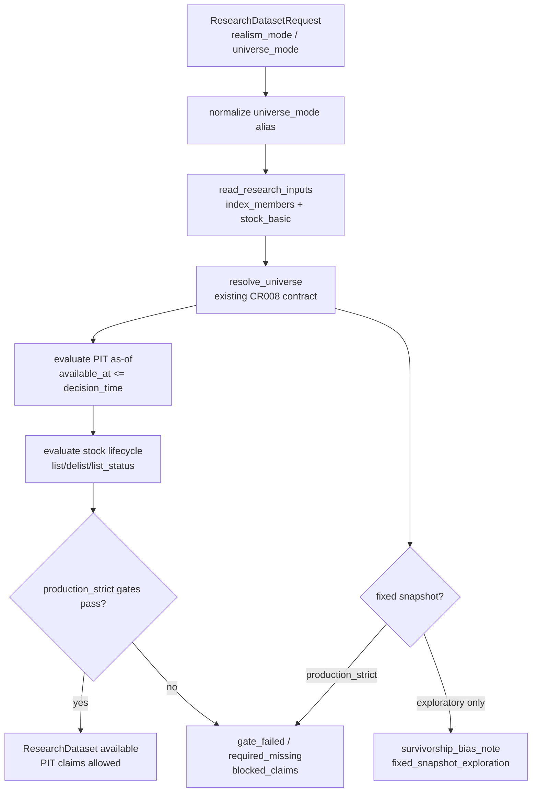

# LLD: CR011-S02 — PIT 股票池与股票生命周期

> 本文档仅覆盖 `CR011-S02-pit-universe-and-stock-lifecycle-completion` 的 Story 级低层设计。`CR011-DATA-BATCH-A` CP5 已于 2026-05-24T10:24:02+08:00 获用户批准，本文档可作为实现输入；该批准不授权真实联网、读取凭据、写真实 lake、操作旧 `data/**` 或覆盖旧报告。真实 PIT source/interface 未冻结时，后续实现必须 fail-fast 并输出 `required_missing` / `source_unresolved`。

修订记录：

| 版本 | 日期 | 修订人 | 变更要点 |
|---|---|---|---|
| 1.0 | 2026-05-24 | meta-dev | 基于 CR-011 CP3 approved、CP4 PASS、Story 卡片和 lld-designer 模板创建 S02 LLD；限定后续实现文件为 Story 允许范围，明确 CP5 前不得实现 |

## 1. Goal

修改 `market_data/readers.py` 与 `engine/research_dataset.py` 的只读研究输入合同，并创建 `tests/test_cr011_pit_universe_lifecycle.py`，使新版实验 17-21 在 `production_strict` 下必须通过 PIT membership、as-of 可得性和股票生命周期 gate，才能声明 PIT 股票池研究结论；fixed snapshot 只能进入 `exploratory` 并写 `survivorship_bias_note`，`index_weights` 或 `stock_basic` 当前快照不得替代完整 `index_members` membership。

## 2. Requirements（Functional / Non-Functional）

### 2.1 Functional

- 扩展 `market_data.readers` 的研究输入读取能力，使 `index_members` 与 `stock_basic` / lifecycle 字段能作为同一次 research input bundle 的只读输入返回；reader 不触发 backfill、不导入 connector/runtime/storage、不读取 env/token。
- 保留并消费上游 CR008-S05 已建立的 `engine.universe.resolve_universe(...)` 合同；本 Story 不修改 `engine/universe.py`，只在 `engine/research_dataset.py` 聚合 PIT universe 与 lifecycle gate 结果。
- `production_strict` 必须同时满足 `universe_mode=pit` 或等价 `pit_required`、`is_pit_universe=true`、`pit_status=pass|pit_available`、`as_of_join_violation_count=0`、`lifecycle_status=pass`。
- `universe_mode` 输入兼容 CR008 既有枚举 `pit_required` / `pit_optional` / `fixed_snapshot`，并接受 CR-011 报告语义别名 `pit` / `required`；输出 metadata 统一写 `universe_mode=pit` 或 `fixed_snapshot`。
- `index_members` 是完整 membership 的主证据；`index_weights` 只提供权重信息，任何“只有 weights 可用”的路径必须输出 `index_weights_not_members` 或等价 issue。
- `stock_basic` / `stock_lifecycle` 只辅助上市、退市、状态和生命周期判断；不得让 `stock_basic` 当前快照使 `is_pit_universe=true`。
- lifecycle gate 必须输出 `list_date`、`delist_date`、`list_status`、`lifecycle_status`、`lifecycle_missing_count`、`lifecycle_blocked_count`、`listing_days_min` 或等价结构化字段。
- `available_at <= decision_time` 是 as-of join 硬约束；任一违反必须计入 `as_of_join_violation_count`，并阻断 `production_strict`。
- PIT 不完整、lifecycle 缺失、as-of 违规、fixed snapshot、weights/basic 替代尝试必须进入 `blocked_claims`，不得只用自由文本说明。
- fixed snapshot / explicit symbols 只允许 `exploratory`，并必须写非空 `survivorship_bias_note`。

### 2.2 Non-Functional

- 默认验证入口必须离线：`uv run --python 3.11 pytest -q tests/test_cr011_pit_universe_lifecycle.py`。
- 默认路径 `network_calls=0`、`lake_writes=0`、`credential_reads=0`、`legacy_data_operations=0`。
- 不读取、列出、迁移、复制、比对或删除旧 `data/**`；不读取或覆盖 `reports/experiment_17_21/factor_strategy_report.md`。
- 不读取 `.env`，不打印 token、用户名、密码、NAS 凭据或真实私有路径。
- 后续实现不得修改 `market_data/connectors/**`、`delivery/**`、HLD、ADR、Story 卡片或检查点。
- CP5 批次人工确认 approved 前不得实现；当前 LLD 只作为 `CR011-DATA-BATCH-A` 的待审查设计输入。

## 3. 模块拆分与职责

| 模块 / 文件组 | 职责 | 说明 |
|---|---|---|
| `market_data/readers.py` | 读取 published catalog / canonical 的 `index_members` 与 `stock_basic` / lifecycle 信息，返回 `ReaderResult`、issues、lineage、remediation | 修改范围仅限只读 reader；不得触发生产 CLI、connector、runtime、storage 或真实 source。 |
| `engine/research_dataset.py` | 在 `build_research_dataset` 聚合 PIT universe、as-of join、stock lifecycle gate、metadata、allowed/blocked claims | 复用 CR008-S05 的 `resolve_universe(...)`；新增 CR011 S02 gate helper 和 metadata 合并逻辑。 |
| `tests/test_cr011_pit_universe_lifecycle.py` | S02 专属离线测试，覆盖 PIT pass、PIT incomplete、fixed snapshot 降级、as-of 违规、lifecycle missing、安全边界 | 使用 in-memory DataFrame、fake reader / resolver、tmp_path sentinel；不得依赖真实 lake、旧 data、凭据或网络。 |
| `engine/universe.py`（只读依赖） | 提供既有 `UniverseRequest` / `UniverseResolution` / `resolve_universe(...)` | 本 Story 不修改该文件；若后续发现必须改动，需要交回 meta-po 扩大文件所有权或发起 CR。 |
| CR010-S04 readiness 合同 | 定义 `index_members` / `index_weights` / `stock_basic` 的 readiness 与 PIT 边界 | 已有 LLD confirmed；S02 只消费其语义。 |
| CR010-S06 PIT source/interface Spike | 约束 source/interface 未确认时返回 `source_unresolved` / `required_missing` | 当前缺单独 LLD 文件；S02 设计必须保持 fail-fast，不声明 production available。 |

## 4. 代码结构与文件影响范围

| 动作 | 文件路径 | 变更内容 |
|---|---|---|
| 修改 | `market_data/readers.py` | 导入并读取 `DATASET_STOCK_BASIC`；扩展 `ResearchInputReaderRequest` 或 `read_research_inputs(...)` 以支持 `require_stock_lifecycle`；新增 `read_stock_lifecycle(...)` 或等价 helper；为 lifecycle 缺失、source unresolved、as-of 字段缺失输出 structured issues 和 `auto_execute=false` remediation。 |
| 修改 | `engine/research_dataset.py` | 在 `_research_reader_datasets(...)` / `build_research_dataset(...)` 中请求 stock lifecycle；规范化 CR011 `universe_mode` 别名；新增 PIT + lifecycle gate helper；写入 `metadata["universe"]`、`metadata["lifecycle"]`、`as_of_join_violation_count`、`lifecycle_status`、`allowed_claims`、`blocked_claims` 和 `GateResult.issues`。 |
| 创建 | `tests/test_cr011_pit_universe_lifecycle.py` | 创建 S02 定向测试，覆盖接口、错误路径、安全边界和 Story 验收标准。 |

禁止修改：`engine/universe.py`、`market_data/connectors/**`、`market_data/runtime.py`、`market_data/storage.py`、`data/**`、`.env`、`reports/experiment_17_21/factor_strategy_report.md`、`delivery/**`、`process/HLD.md`、`process/HLD-DATA-LAKE.md`、`process/ARCHITECTURE-DECISION.md`、`process/REQUIREMENTS.md`、`process/STORY-BACKLOG.md`、`process/DEVELOPMENT-PLAN.yaml`、`process/checks/**`、`checkpoints/**`。

## 5. 数据模型与持久化设计

无新增数据库、无新增 lake dataset、无新增外部持久化。本 Story 只消费既有 published catalog / canonical 数据，并新增内存 metadata / gate result 合同。

| 对象 / 字段 | 类型 | 约束 | 说明 |
|---|---|---|---|
| `index_members.index_code` | `str` | 必填 | 默认沪深 300 为 `399300.SZ`；不得从 `index_weights` 推导完整成员。 |
| `index_members.con_code` / `symbol` | `str` | 至少一个必填 | reader / engine 可把 `con_code` 规范化为 `symbol`，不做模糊匹配。 |
| `index_members.effective_date` | `date` | PIT 必填 | 成分生效日期，必须满足 `effective_date <= decision_time`。 |
| `index_members.available_at` | `timestamp/date` | PIT 必填 | 必须满足 `available_at <= decision_time`；违反计入 `as_of_join_violation_count`。 |
| `index_members.is_pit_universe` | `bool` | production_strict 必须全为 true | 只有该字段与 `pit_status` 同时通过时才允许 PIT 声明。 |
| `index_members.pit_status` | `enum` | `pit_available` / `pass` 视为通过 | `pit_incomplete`、`non_pit_snapshot`、`pit_failed` 均阻断 production_strict。 |
| `index_members.readiness_status` | `enum` | production_strict 必须 `available` | `warn` 只可 exploratory；`required_missing` / `quality_failed` 阻断。 |
| `index_weights.weight` | `float` | 可选辅助 | 只用于权重说明；缺 `index_members` 时不得替代 membership。 |
| `stock_basic.symbol` | `str` | lifecycle 必填 | 必须能与 PIT member symbol 对齐。 |
| `stock_basic.list_date` | `date` | lifecycle pass 必填 | `list_date <= decision_time` 才可参与；缺失输出 `lifecycle_missing`。 |
| `stock_basic.delist_date` | `date | null` | 可为空 | `delist_date <= decision_time` 时该 symbol 被 lifecycle gate 阻断。 |
| `stock_basic.list_status` | `str` | lifecycle pass 必填 | `L` / `listed` / `active` / `上市` 视为 active；`D` / `delisted` / `退市`、`P` / `paused` / `暂停` 阻断，未知值输出 structured issue。 |
| `stock_basic.available_at` | `timestamp/date` | production_strict 必填 | stock lifecycle 自身也必须满足 as-of 可得性。 |
| `PitLifecycleMetadata.as_of_join_violation_count` | `int` | production_strict 必须为 0 | 同时统计 membership 与 lifecycle 的 future availability。 |
| `PitLifecycleMetadata.lifecycle_status` | `str` | `pass` 才允许 production_strict PIT claims | 典型值：`pass`、`lifecycle_missing`、`lifecycle_incomplete`、`lifecycle_blocked`、`quality_failed`。 |
| `PitLifecycleMetadata.survivorship_bias_note` | `str` | fixed / missing path 必须非空 | fixed snapshot 只允许 exploratory。 |

## 6. API / Interface 设计

| 接口 / 入口 | 输入 | 输出 | 调用方 | 说明 |
|---|---|---|---|---|
| `market_data.readers.read_index_universe(...)` | lake_root、index_code、start/end、symbols、pit_required、required | `ReaderResult` with `index_members` frame / issues / remediation | `build_research_dataset` | 继续作为 membership 主入口；S02 可补充 as-of issue count，但不得返回 engine 类型。 |
| `market_data.readers.read_stock_lifecycle(...)`（新增或等价 helper） | lake_root、symbols、start/end、quality_policy、required | `ReaderResult` with stock lifecycle frame / `lifecycle_missing` issues / lineage | `build_research_dataset` | 只读 `stock_basic` / lifecycle 字段；不可证明 PIT membership。 |
| `ResearchInputReaderRequest.require_stock_lifecycle`（新增或等价参数） | bool，默认 false | 控制 `read_research_inputs(...)` 是否读 `DATASET_STOCK_BASIC` | `engine.research_dataset` | production_strict + PIT 请求必须 true；exploratory 可按需求读取。 |
| `ResearchDatasetRequest.universe_mode` alias normalization | `pit`、`required`、`pit_required`、`pit_optional`、`fixed_snapshot` | 内部规范化为 CR008 `pit_required` / `pit_optional` / `fixed_snapshot`，metadata 输出 `pit` / `fixed_snapshot` | 实验 17-21 v2、测试 | 保持 CR008 向后兼容，并满足 CR011 `universe_mode=pit|required` 文档语义。 |
| `_evaluate_pit_lifecycle_gate(...)`（内部 helper） | request、calendar、universe_resolution、index_members_result、stock_basic_result | `PitLifecycleMetadata`、issues、blocked claims | `build_research_dataset` | 统计 as-of 违规、lifecycle 缺失、退市 / 暂停 / 未上市样本；不写文件。 |
| `build_research_dataset(...)` metadata output | `ResearchDatasetRequest`、reader results、benchmark resolver | `ResearchDataset` with `metadata["universe"]`、`metadata["lifecycle"]`、`allowed_claims`、`blocked_claims`、`gate_result` | CR011-S08 / 实验 17-21 v2 | production_strict 缺 PIT/lifecycle 时返回 `gate_failed` 或 `required_missing`。 |

错误 / 限制暴露：

- `pit_incomplete`：PIT 字段缺失、`pit_status` 非 pass、`is_pit_universe=false` 或 membership as-of 不可验证。
- `required_missing`：必需 dataset 未 published / reader 不可用。
- `source_unresolved`：CR010-S06 exact source/interface 未确认，不得伪造可用。
- `index_weights_not_members`：只有权重数据时不得补齐 membership。
- `stock_basic_not_pit_universe`：`stock_basic` 只能辅助生命周期，不证明 PIT。
- `as_of_join_violation`：`available_at > decision_time` 或 `effective_date > decision_time`。
- `lifecycle_missing`：stock lifecycle 缺失或必填字段缺失。
- `lifecycle_blocked`：未上市、已退市、暂停上市或状态未知导致不可参与 production_strict。
- `fixed_snapshot_survivorship_bias`：fixed snapshot 或 explicit symbols 必须降级 exploratory。

本节每个接口条目在第 10 节均有对应测试。

## 7. 核心处理流程

1. `build_research_dataset(...)` 接收 CR011 request，先把 `universe_mode=pit|required` 规范化为 `pit_required`；`fixed_snapshot` 保持兼容。
2. `_research_reader_datasets(...)` 在 PIT 或 `production_strict` 场景中加入 `DATASET_INDEX_MEMBERS` 与 `DATASET_STOCK_BASIC`，并通过 `read_research_inputs(...)` 只读获取 reader results。
3. `read_index_universe(...)` 读取 `index_members` published catalog / canonical；缺失、quality failed、PIT incomplete 或 source unresolved 时返回 structured `ReaderResult`，并写 `auto_execute=false` remediation。
4. `read_stock_lifecycle(...)` 读取 `stock_basic` / lifecycle 字段；缺 `list_date`、`list_status`、`available_at` 或 symbol 覆盖不足时返回 `lifecycle_missing` / `lifecycle_incomplete` issues。
5. `engine.research_dataset` 调用既有 `resolve_universe(...)` 判定 PIT / fixed universe；本 Story 不修改 `engine/universe.py`。
6. `_evaluate_pit_lifecycle_gate(...)` 对 PIT 成员与 lifecycle frame 做 as-of 检查：
   - membership 必须满足 `effective_date <= decision_time` 且 `available_at <= decision_time`。
   - lifecycle 必须满足 `list_date <= decision_time`，`delist_date` 为空或晚于 decision_time，`list_status` 为 active。
   - stock lifecycle 的 `available_at` 也必须不晚于 decision_time。
7. 若 `production_strict` 中任一条件失败，ResearchDataset 状态聚合为 `gate_failed` / `required_missing`，并写入 `blocked_claims`；不得自动降级 fixed snapshot。
8. 若 `exploratory` 且 PIT 缺失，可保留 fixed snapshot 路径，但必须写 `survivorship_bias_note`、`known_limitations` 和 blocked PIT claims。
9. 成功时 metadata 输出：
   - `metadata["universe"].universe_mode="pit"`
   - `metadata["universe"].is_pit_universe=true`
   - `metadata["universe"].pit_status="pass"` 或 `"pit_available"`
   - `metadata["universe"].as_of_join_violation_count=0`
   - `metadata["lifecycle"].lifecycle_status="pass"`
   - `allowed_claims` 可包含 `pit_universe_research` / `survivorship_bias_controlled`。



异常路径：

- `index_members` 缺失：production_strict 输出 `required_missing`，exploratory 可 fixed snapshot，但必须有 survivorship warning。
- `index_weights` 可用但 `index_members` 缺失：输出 `index_weights_not_members`，不进入 PIT。
- `stock_basic` 可用但 membership 缺失：输出 `stock_basic_not_pit_universe`，不进入 PIT。
- `available_at` 越界：`as_of_join_violation_count > 0`，production_strict fail。
- lifecycle 缺失：输出 `lifecycle_missing`，production_strict fail。
- fixed snapshot：只可 exploratory，生产级 PIT claims 被 blocked。

## 8. 技术设计细节

- 关键算法 / 规则：
  - Universe mode 规范化：`pit`、`required`、`pit_required` -> internal `pit_required`；`pit_optional` 保持可探索；`fixed_snapshot` 仅允许 exploratory。
  - as-of 违规计数：按 decision calendar 与每条 membership / lifecycle 记录比较；任一 `available_at > decision_time`、`effective_date > decision_time` 或无法解析的必填日期计入 violation / missing。
  - lifecycle active 判定：`list_date <= decision_time` 且 `delist_date` 为空或 `delist_date > decision_time`，`list_status` 属于 active 映射；未知状态不默认 active。
  - status 聚合优先级：`invalid_request` > `quality_failed` > `source_unresolved|required_missing` > `as_of_join_violation` > `lifecycle_missing|lifecycle_blocked` > `available_with_warnings` > `available`。
  - claims 处理：`production_strict` 只有 gate 全 pass 才允许 `pit_universe_research`；fixed / missing / lifecycle fail 必须进入 `blocked_claims`。
- 依赖选择与复用点：
  - 复用 `engine.universe.resolve_universe(...)`，不改 `engine/universe.py`。
  - 复用 `market_data.readers.ReaderResult`、`QualityPolicy`、`ResearchInputReaderRequest`、`read_research_inputs(...)`。
  - 复用 `market_data.contracts` 中已有 `DATASET_INDEX_MEMBERS`、`DATASET_INDEX_WEIGHTS`、`DATASET_STOCK_BASIC`、PIT/readiness enum 和 stock_basic canonical 字段。
  - 复用 CR008-S05 的 allowed / blocked claims 语义。
- 兼容性处理：
  - 旧 CR008 request 使用 `pit_required` / `pit_optional` 不受影响。
  - `stock_basic` 缺失时不改变 exploratory 运行能力，但 production_strict 必须 fail。
  - 若 CR010-S06 exact PIT source/interface 仍未冻结，reader 必须返回 `source_unresolved` / `required_missing`，不得把 fixture、weights 或 current snapshot 声明为 available。
- 图示类型选择：流程图。该 Story 涉及 reader、research dataset、上游 universe contract、lifecycle gate 和多条异常路径，流程图能明确失败分支。

## 9. 安全与性能设计

| 维度 | 设计措施 | 验证方式 |
|---|---|---|
| 安全 | reader 和 engine 只消费显式传入的 lake_root / fake reader result；默认测试不读取 `.env` | T08 monkeypatch env / path sentinel |
| 安全 | 禁止导入 `market_data.connectors`、`market_data.runtime`、`market_data.storage`、联网库或 provider SDK | T08 AST import scan |
| 安全 | remediation spec 固定 `auto_execute=false`，只描述人工补齐动作 | T02 / T06 断言 |
| 安全 | 不读取、列出或操作旧 `data/**`；不覆盖旧实验 17-21 报告 | T08 path / open sentinel |
| 安全 | `stock_basic` 与 `index_weights` 不能证明 PIT | T04 / T07 断言 |
| 性能 | lifecycle gate 对小样本 fixture 使用 pandas filter/groupby；不建缓存服务 | T01 / T05 小样本验证 |
| 性能 | as-of 计数先按 `symbol` / `decision_time` 过滤，再聚合 count，避免在测试中引入重型依赖 | T05 断言 count 和状态 |
| 一致性 | metadata 同时写 universe 与 lifecycle 子对象，字段名稳定 | T01 / T06 / T07 metadata 快照 |

## 10. 测试设计

验证入口：`uv run --python 3.11 pytest -q tests/test_cr011_pit_universe_lifecycle.py`

| 测试场景 | 前置条件 | 操作 | 预期结果 | 验证方式 |
|---|---|---|---|---|
| T01 production_strict PIT + lifecycle pass | fake reader 返回 `index_members` PIT available、`stock_basic` active lifecycle、prices/calendar 最小样本 | 调用 `build_research_dataset(realism_mode=production_strict, universe_mode=pit)` | `status=available`；`is_pit_universe=true`；`pit_status` pass；`as_of_join_violation_count=0`；`lifecycle_status=pass`；允许 PIT claims | pytest |
| T02 PIT membership incomplete | `index_members` 缺 `available_at` 或 `pit_status=pit_incomplete` | 调用 production_strict builder | `status=gate_failed|required_missing`；issues 含 `pit_incomplete`；`is_pit_universe=false`；blocked claims 含 PIT | pytest |
| T03 fixed snapshot 只能 exploratory | request 使用 `fixed_snapshot` 或 explicit symbols | exploratory 调用通过且写 note；production_strict 调用 fail | exploratory 输出 `survivorship_bias_note`；production_strict blocked PIT claims | pytest |
| T04 weights/basic 不证明 PIT | `index_members` missing，`index_weights` / `stock_basic` 可用 | 调用 production_strict builder / helper | issues 含 `index_weights_not_members` / `stock_basic_not_pit_universe`；PIT available 次数为 0 | pytest |
| T05 as-of 违规阻断 | membership 或 lifecycle `available_at > decision_time` | 调用 gate helper | `as_of_join_violation_count > 0`；production_strict fail；remediation `auto_execute=false` | pytest |
| T06 lifecycle missing | PIT membership pass，但 `stock_basic` 缺失或缺 `list_date/list_status/available_at` | 调用 production_strict builder | `lifecycle_status=lifecycle_missing|lifecycle_incomplete`；blocked claims 含 lifecycle；不声明 survivorship bias controlled | pytest |
| T07 lifecycle block | `stock_basic` 中存在退市、暂停、未上市或未知 `list_status` symbol | 调用 gate helper | 输出 `lifecycle_blocked_count` 和 blocked symbol/date 统计；生产级 gate fail 或剔除策略按 LLD 规则可断言 | pytest |
| T08 forbidden boundary | 设置 fake token env、旧 data/report sentinel、无真实 lake | AST scan + builder 局部调用 | connector/runtime/storage/network imports 为 0；credential reads 为 0；legacy data/report 操作为 0；lake writes 为 0 | pytest |

接口到测试映射：

| 第 6 节接口 | 对应测试 |
|---|---|
| `read_index_universe(...)` | T01、T02、T04、T05、T08 |
| `read_stock_lifecycle(...)` | T01、T06、T07、T08 |
| `ResearchInputReaderRequest.require_stock_lifecycle` | T01、T06、T08 |
| `ResearchDatasetRequest.universe_mode` alias normalization | T01、T03、T08 |
| `_evaluate_pit_lifecycle_gate(...)` | T01、T05、T06、T07 |
| `build_research_dataset(...)` metadata output | T01、T02、T03、T04、T06、T08 |

异常路径到测试映射：

| 第 7 节异常路径 | 对应测试 |
|---|---|
| `index_members` 缺失 / PIT incomplete | T02 |
| `index_weights` 替代尝试 | T04 |
| `stock_basic` 当前快照替代尝试 | T04 |
| as-of 违规 | T05 |
| lifecycle 缺失 / 状态阻断 | T06、T07 |
| fixed snapshot production_strict 阻断 | T03 |
| forbidden import / credential / old data / old report | T08 |

## 11. 实施步骤

| TASK-ID | 动作 | 目标文件 | 详细描述 | 对应测试 |
|---|---|---|---|---|
| CR011-S02-T1 | 修改 | `market_data/readers.py` | 导入 `DATASET_STOCK_BASIC`；新增/扩展 lifecycle reader 与 research input bundle；输出 `lifecycle_missing`、`source_unresolved`、`required_missing`、`auto_execute=false` remediation；保持 no connector/runtime/storage import | T01、T04、T06、T08 |
| CR011-S02-T2 | 修改 | `engine/research_dataset.py` | 规范化 CR011 universe mode alias；生产级 PIT 请求加入 stock lifecycle reader；新增 PIT + lifecycle gate helper、as-of violation count、metadata / allowed / blocked claims 合并逻辑 | T01、T02、T03、T05、T06、T07 |
| CR011-S02-T3 | 创建 | `tests/test_cr011_pit_universe_lifecycle.py` | 使用 fake reader / in-memory DataFrame 覆盖 PIT pass、PIT incomplete、fixed exploratory、weights/basic 不替代、as-of 违规、lifecycle missing/block、安全边界 | T01-T08 |

## 12. 风险、难点与预研建议

| 风险 / 难点 | 影响 | 缓解措施 / 预研建议 |
|---|---|---|
| CR010-S06 PIT source/interface 没有单独 LLD 文件，exact provider 仍可能 unresolved | 不能声明 PIT production available | S02 只实现 fail-fast 消费合同；source/interface 未确认时返回 `source_unresolved` / `required_missing`。 |
| Story 卡片仍为 `status=draft`，但 STATE / CP3 / CP4 已允许输出 LLD | 流程状态有轻微不一致 | 本 LLD 记录为 ready-for-review；Story 状态更新需由 meta-po 在允许文件范围外处理。 |
| `engine/universe.py` 已承载 CR008 resolver，但不在 S02 文件所有权内 | lifecycle 与 universe 深度耦合时可能想改 resolver | S02 只在 `engine/research_dataset.py` 包装/聚合；若必须改 resolver，停止并交回 meta-po 扩范围。 |
| `stock_basic.list_status` 来源枚举可能含 Tushare/JQData 差异 | 错误 active 判定会影响样本 | LLD 默认使用保守映射；未知值按 blocked / missing 处理，不默认 active。 |
| lifecycle 缺失时 exploratory 是否继续 | 报告语义可能与后续 S03/S04/S06 交叉 | exploratory 可继续但必须 blocked claims；production_strict 必须 fail。 |
| 当前已有 CR008 PIT gate 逻辑，CR011 增量可能重复 issue | metadata / blocked claims 出现重复 code | 使用 ordered unique 合并 issue / claim，并保持 CR011 字段独立在 `metadata["lifecycle"]`。 |

### OPEN / Spike 跟踪

| ID | 类型（OPEN / Spike） | 问题 | 下一动作 | 责任方 |
|---|---|---|---|---|
| O-01 | OPEN | `CR011-DATA-BATCH-A` CP5 尚未 approved，本 LLD confirmed=false，不得实现 | meta-po 收齐 S01..S06 LLD 与 CP5 自动预检后发起批次人工确认 | meta-po / user |
| O-02 | Spike | `CR010-S06-pit-source-interface-spike-readiness` 无单独 LLD 文件，PIT source/interface exact 仍按 unresolved/fail-fast 消费 | 若后续需要真实 PIT provider，可由 CR010/CR011 新 CR 或上游 Story 冻结 source/interface；S02 不伪造 available | meta-se / meta-po / user |
| O-03 | OPEN | 当前 Story 卡片 frontmatter 为 `status=draft`，但 `STATE.md` 与 CP3/CP4 允许进入 LLD 起草 | 本 LLD 不修改 Story 卡片；由 meta-po 在允许范围外更新 Story 生命周期状态 | meta-po |

## 13. 回滚与发布策略

- 发布方式：后续实现仅作为 CR011-S02 的离线研究输入 gate 增量发布；必须在 `CR011-DATA-BATCH-A` CP5 approved 后才可开始编码。
- 回滚触发条件：
  - production_strict 使用 fixed snapshot 通过。
  - `index_weights` 或 `stock_basic` 被用于证明 PIT membership。
  - `as_of_join_violation_count > 0` 仍允许 production_strict。
  - lifecycle 缺失仍允许 PIT production claims。
  - 实现触碰 forbidden paths、读取凭据、写 lake、操作旧 data 或覆盖旧报告。
- 回滚动作：
  - 回退 `market_data/readers.py` 的 S02 reader 增量。
  - 回退 `engine/research_dataset.py` 的 CR011 S02 gate / metadata 合并逻辑。
  - 保留本 LLD 与测试设计作为重新实现输入；不得删除旧报告或真实数据。
- 发布后验证：只运行离线 `tests/test_cr011_pit_universe_lifecycle.py`；真实数据补齐、真实 provider、真实 lake smoke 需要用户另行授权，不属于本 Story 默认发布。

## 14. Definition of Done

- [ ] LLD 保持 14 个可见章节，frontmatter 含 `tier`、`shared_fragments`、`open_items`。
- [ ] `confirmed=false` 且 `CR011-DATA-BATCH-A` CP5 未 approved 时不进入实现。
- [ ] 文件影响范围只包含 `market_data/readers.py`、`engine/research_dataset.py`、`tests/test_cr011_pit_universe_lifecycle.py`。
- [ ] `production_strict` 同时要求 `universe_mode=pit` / `pit_required`、`is_pit_universe=true`、`pit_status=pass|pit_available`、`as_of_join_violation_count=0`、`lifecycle_status=pass`。
- [ ] fixed snapshot 进入 production_strict 的次数为 0；exploratory 必须写非空 `survivorship_bias_note`。
- [ ] `index_weights` 或 `stock_basic` 当前快照单独证明 PIT membership 的次数为 0。
- [ ] lifecycle 缺失时输出 `lifecycle_missing` 或等价 missing reason，并阻断 production_strict PIT claims。
- [ ] 默认验证路径 `network_calls=0`、`lake_writes=0`、`credential_reads=0`、`legacy_data_operations=0`。
- [ ] 第 6 节接口在第 10 节有对应测试。
- [ ] 第 7 节异常路径在第 10 节有对应错误路径测试。
- [ ] 第 11 节 TASK-ID 与第 4 节文件影响范围一一对应。
- [ ] OPEN / Spike 已清点：当前为 3 项。

## 人工确认区

> **CP5 — Story LLD 可实现性门**
>
> 按当前用户约束，本轮只写 LLD，不写 CP5 自动预检、不更新 Story 卡片、不追加 DEV-LOG。后续应由 meta-po / checkpoint-manager 在允许范围内为 `CR011-DATA-BATCH-A` 收齐 S01..S06 LLD、生成 CP5 自动预检与批次人工确认稿。CP5 approved、当前 Story LLD confirmed、当前 Wave 可执行且 `dev_gate` 满足前，不得实现。

**CP5 checklist 摘要**：

| # | 检查项 | 状态 | 证据 |
|---|---|---|---|
| 1 | LLD 覆盖 AC | 待检查 | 第 2 / 10 / 14 节 |
| 2 | 与 HLD / ADR 一致 | 待检查 | 第 3 / 8 / 12 节 |
| 3 | 文件影响范围明确 | 待检查 | 第 4 / 11 节 |
| 4 | 接口契约完整 | 待检查 | 第 6 节 |
| 5 | 测试与 dev_gate 可计算 | 待检查 | 第 10 / 14 节 |

**人工确认回复**：

请直接回复以下任一整行：

```text
approve
修改: <具体修改点>
reject
```

**人工审查结果回填**：

- 结论：`approved | changes_requested | rejected`
- 审查人：
- 审查时间：
- 修改意见：
- 风险接受项：
