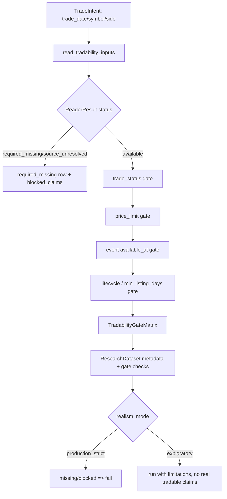

# LLD: CR011-S03 - 可交易性与涨跌停门控

> 本文档是 `CR011-S03-tradability-status-and-price-limit-gates` 的低层设计。`CR011-DATA-BATCH-A` CP5 已于 2026-05-24T10:24:02+08:00 获用户批准，本文档可作为实现输入；该批准不授权真实联网、读取凭据、写真实 lake、操作旧 `data/**` 或覆盖旧 `reports/experiment_17_21/factor_strategy_report.md`。

修订记录：

| 版本 | 日期 | 修订人 | 变更要点 |
|---|---|---|---|
| 1.0 | 2026-05-24 | meta-dev | 初版 LLD，覆盖可交易性、涨跌停、事件时点、blocked claims、接口与测试设计 |

## 1. Goal

创建 CR011-S03 的可交易性 gate 设计：在因子策略 portfolio 前聚合 `trade_status`、`prices_limit`、`events` 和上市天数 / 生命周期输入，输出机器可读的 `tradability_gate_status`、`can_buy`、`can_sell`、blocked reason 和 blocked claims，使 production_strict 模式在停牌、涨跌停、ST、无成交、上市天数、事件状态任一 P0 gate 缺失或阻断时 fail，而 exploratory 模式只能带 limitation / blocked claims 继续。

本 Story 只设计离线消费侧 gate，不新增真实 provider，不触发 backfill，不写 lake，不读取 `.env`，不操作旧 `data/**`，不覆盖旧报告。实现必须等待本 LLD `confirmed=true`、`CR011-DATA-BATCH-A` 六张 LLD 全量完成、CP5 批次人工 approved、依赖合同冻结且 `dev_gate.implementation_allowed=true`。

## 2. Requirements（Functional / Non-Functional）

### 2.1 Functional

- 将停牌、涨跌停、ST、无成交、上市天数、事件状态 6 类 gate 统一输出为结构化状态：`available`、`required_missing`、`blocked`。
- 每个计划交易行必须输出 `trade_date`、`symbol`、`side`、`can_buy`、`can_sell`、`tradability_gate_status`、`blocked_reason`，其中 blocked trade 至少包含 `trade_date`、`symbol`、`side`、`blocked_reason` 4 类字段。
- `trade_status` 输入必须表达 `is_suspended`、`is_st`、`status_reason`、`available_at`、`source_interface`；缺 source/interface、缺 `available_at`、quality/readiness 不合规时不得返回 production 可用。
- `prices_limit` 输入必须表达 `limit_up`、`limit_down`、`can_buy` / `can_sell` 或可由 planned side + execution price 判定的等价约束；触及涨停买入或跌停卖出时输出 blocked reason。
- `events` 输入必须使用 explicit `available_at`；缺 `available_at`、使用日期推导事件时点或事件可用性未知时，production_strict 必须 fail。
- 上市天数 / 退市或暂停上市 gate 必须读取 CR011-S02 冻结后的 lifecycle/as-of 输入，或在输入缺失时返回 `required_missing`，不得默认通过。
- `engine/research_dataset.py` 必须把 tradability matrix 合并到 research metadata、`allowed_claims`、`blocked_claims`、`known_limitations` 和 `gate_result.checks`。
- production_strict 缺任一 P0 gate 时通过次数为 0；exploratory 可运行但必须写 blocked claims，且不得声明 `real_tradable_execution`、`tradability_screened`、`true_fillability`、`realistic_fillability`。

### 2.2 Non-Functional

- 安全：默认验证路径 `network_calls=0`、`lake_writes=0`、`credential_reads=0`、`legacy_data_operations=0`；实现不得导入 `market_data.connectors`、`market_data.runtime`、`market_data.storage` 或 provider SDK。
- 可追溯：每个 gate row 保留 dataset status、issue code、source_run_id / catalog entry 或 missing reason；不得用空表、当前快照或文字限制伪装 available。
- 可维护：复用 `ReaderResult`、`ResearchDataset`、`GateResult` 和 CR008-S06 auxiliary claims 结构；不新建独立研究框架。
- 可验证：测试只使用 fixture / `tmp_path` / monkeypatch，不访问真实 lake、旧 `data/**`、凭据或网络。
- 兼容：现有 exploratory 研究链路可继续返回 framework validation 类声明，但真实可成交相关声明必须受 gate 控制。

## 3. 模块拆分与职责

| 模块 / 文件组 | 职责 | 说明 |
|---|---|---|
| `market_data/readers.py` | 只读拉取 `trade_status`、`prices_limit`、`events` 和 lifecycle 相关输入，返回 `ReaderResult` map | 复用 `read_dataset`、`QualityPolicy` 和 W3 fail-fast；新增 helper 不触发 fetch/backfill/write |
| `engine/trade_status.py` | 评估停牌、ST、无成交、上市天数 / 生命周期相关交易状态 | 在既有 `TradeStatusProvider` 基础上增加 gate result；缺输入时 fail closed |
| `engine/trading_constraints.py` | 评估涨跌停、planned side 与 execution price 的买卖可执行性 | 现有 `LimitPriceProvider` 缺行返回可执行的行为需在 CR011 gate 中收敛为 required_missing 或 blocked，不得默认全可交易 |
| `engine/events.py` | 评估 explicit `available_at` 事件对决策日和 symbol 的阻断 | 空事件表只有在 frozen source/interface 且 schema 完整时可视为 available；缺 `available_at` fail |
| `engine/research_dataset.py` | 组装 tradability matrix，合并 metadata / gate checks / allowed_claims / blocked_claims | 作为 portfolio 前 gate；production_strict 缺 P0 gate 时返回 gate_failed 或 required_missing |
| `tests/test_cr011_tradability_gates.py` | 覆盖六类 gate、missing fail-fast、默认全可交易禁止、安全边界 | 使用离线 fixture，不运行真实 provider，不读取旧数据 |

本 Story 引用的设计输入为 `process/HLD.md` §27.1、§27.4、§27.5、§27.7，`process/HLD-DATA-LAKE.md` §14.2、§14.3、§14.5，`process/ARCHITECTURE-DECISION.md` ADR-038，`process/REQUIREMENTS.md` REQ-073、REQ-080、REQ-081，`process/STORY-BACKLOG.md` CR011-S03 与 `process/DEVELOPMENT-PLAN.yaml` `CR011-DATA-BATCH-A`。

## 4. 代码结构与文件影响范围

| 动作 | 文件路径 | 变更内容 |
|---|---|---|
| 修改 | `market_data/readers.py` | 创建 `TradabilityInputRequest` 与 `read_tradability_inputs`，读取 `DATASET_TRADE_STATUS`、`DATASET_PRICES_LIMIT`、`DATASET_EVENTS` 和可选 lifecycle reader result；所有缺失返回 typed `ReaderResult`，`remediation_spec.auto_execute=false` |
| 修改 | `engine/trade_status.py` | 创建 `TradeStatusGateResult`、`evaluate_trade_status_gate`；输出 `suspended`、`st_status`、`no_trade`、`min_listing_days`、`delist_or_paused`、`can_buy`、`can_sell`、`status_reason` |
| 修改 | `engine/trading_constraints.py` | 创建 `PriceLimitGateResult`、`evaluate_price_limit_gate`；按 `side`、`execution_price`、`limit_up`、`limit_down` 输出 `can_buy`、`can_sell` 和 `limit_up_blocked_buy` / `limit_down_blocked_sell` |
| 修改 | `engine/events.py` | 创建 `EventGateResult`、`evaluate_event_gate`；只消费 explicit `available_at <= decision_time` 的事件，缺字段或 future availability 输出 blocked / required_missing |
| 修改 | `engine/research_dataset.py` | 创建 `TradabilityGateRow`、`TradabilityGateMatrix`、`build_tradability_gate_matrix`、`apply_tradability_gates`，并把结果合并到 metadata、gate checks 和 claims |
| 创建 | `tests/test_cr011_tradability_gates.py` | 覆盖 AC、接口、错误路径、安全边界和离线约束 |

禁止修改 `market_data/connectors/**`、`market_data/runtime.py`、`data/**`、`.env`、`reports/experiment_17_21/factor_strategy_report.md`、`delivery/**`。本 LLD 不授权修改 `process/stories/CR011-S03-tradability-status-and-price-limit-gates.md`、HLD、ADR、检查点或代码。

## 5. 数据模型与持久化设计

本 Story 无新增持久化表、无真实 lake 写入、无旧 `data/**` 读写。所有新增对象均为内存数据结构、metadata payload 或测试 fixture。

| 对象 / 字段 | 类型 | 约束 | 说明 |
|---|---|---|---|
| `TradabilityInputRequest.lake_root` | `str | Path | None` | 必须显式传入；`None` 返回 `required_missing` | 不读取 env fallback，不读取 `.env` |
| `TradabilityInputRequest.trade_dates` | `tuple[str, ...] | None` | 可选；用于限定 gate matrix 日期 | 未提供时由 `ResearchDataset.calendar` 驱动 |
| `TradabilityInputRequest.symbols` | `tuple[str, ...] | None` | 可选；用于限定 symbol | 与 research universe 对齐 |
| `TradeIntent` | dataclass / mapping | 必含 `trade_date`、`symbol`、`side`；可含 `execution_price`、`decision_time` | 输入给 gate matrix 的计划交易行 |
| `TradabilityGateRow.trade_date` | `date | str` | 必填 | blocked trade 审计字段 |
| `TradabilityGateRow.symbol` | `str` | 必填 | blocked trade 审计字段 |
| `TradabilityGateRow.side` | `buy | sell | hold` | 必填 | `hold` 不应触发买卖限制，但仍受状态和事件 gate 影响 |
| `TradabilityGateRow.tradability_gate_status` | `available | required_missing | blocked` | 必填 | 六类 gate 聚合后的行状态 |
| `TradabilityGateRow.can_buy` / `can_sell` | `bool` | 必填 | 任一 gate 阻断相应方向时为 `false` |
| `TradabilityGateRow.blocked_reason` | `str` | blocked 时必填 | 允许值包含 `suspended`、`limit_up`、`limit_down`、`st_status`、`no_trade`、`min_listing_days`、`delist_or_paused`、`event_blocked`、`source_unresolved`、`available_at_missing`、`quality_failed` |
| `TradabilityGateMatrix.rows` | `list[TradabilityGateRow]` | 可为空；空输入不得伪装 gate available | portfolio 前机器可读矩阵 |
| `TradabilityGateMatrix.reason_counts` | `dict[str, int]` | 必填 | 报告 blocked reason 统计 |
| `ResearchDataset.metadata.tradability_gate_status` | `str` | 必填 | 可取 `available`、`required_missing`、`blocked` |
| `ResearchDataset.metadata.blocked_claims[]` | `list[dict]` | 缺 gate 或 blocked 时必填 | 至少包含 `claim`、`missing_capability` 或 `blocked_reason`、`severity` |

输入 dataset 字段来自 `market_data/contracts.py` 既有合同：`trade_status`、`prices_limit`、`events`。上市天数 / 生命周期 gate 若依赖 `stock_lifecycle` 或 CR011-S02 输出，在 CP5 统一确认前不得实现为默认通过。

## 6. API / Interface 设计

| 接口 / 入口 | 输入 | 输出 | 调用方 | 说明 |
|---|---|---|---|---|
| `read_tradability_inputs(request, *, reader=None)` | `TradabilityInputRequest | Mapping` | `dict[str, ReaderResult]`，key 至少含 `trade_status`、`prices_limit`、`events`，可含 `stock_lifecycle` | `engine.research_dataset.build_tradability_gate_matrix` | 只读 reader；`lake_root=None` 或 repo `data/**` 返回 typed missing / invalid；不触发补数 |
| `evaluate_trade_status_gate(row, trade_status_result, lifecycle_result=None, *, min_listing_days=0)` | `TradeIntent`、`ReaderResult` | `TradeStatusGateResult` | `build_tradability_gate_matrix` | 处理 `suspended`、`st_status`、`no_trade`、`min_listing_days`、`delist_or_paused`；缺 required input 返回 `required_missing` |
| `evaluate_price_limit_gate(row, prices_limit_result)` | `TradeIntent`、`ReaderResult` | `PriceLimitGateResult` | `build_tradability_gate_matrix` | 处理 `limit_up` / `limit_down` 与 `can_buy` / `can_sell`；缺涨跌停输入不得默认可交易 |
| `evaluate_event_gate(row, events_result, *, decision_time)` | `TradeIntent`、`ReaderResult`、decision time | `EventGateResult` | `build_tradability_gate_matrix` | 只纳入 `available_at <= decision_time` 的事件；缺 explicit `available_at` 返回 fail / required_missing |
| `build_tradability_gate_matrix(trade_intents, reader_results, *, realism_mode, decision_time, min_listing_days)` | planned trades、reader results、模式 | `TradabilityGateMatrix` | `apply_tradability_gates`、portfolio / report builder | 对每个 symbol/date/side 聚合六类 gate，生成 row 和 reason_counts |
| `apply_tradability_gates(dataset, trade_intents, reader_results=None, *, realism_mode=None, decision_time=None)` | `ResearchDataset`、planned trades、reader results | 更新后的 `ResearchDataset` | 实验 17-21 v2 / 后续 portfolio gate | 合并 metadata、gate checks、allowed_claims、blocked_claims；production_strict 缺 P0 gate 时 fail |

接口与测试对应关系：上述 6 个接口分别由第 10 节 T01、T02、T03、T04、T05、T06/T07 覆盖；错误路径由 T08、T09、T10 覆盖。

## 7. 核心处理流程

1. 调用方在 portfolio 前构造 `TradeIntent` 列表，每行包含 `trade_date`、`symbol`、`side`、`execution_price` 和 `decision_time`。
2. `read_tradability_inputs` 只读 `market_data.readers.read_dataset`，拉取 `trade_status`、`prices_limit`、`events`；缺 `lake_root`、catalog、source/interface、`available_at` 或 quality/readiness 不合规时返回 typed `ReaderResult`。
3. `build_tradability_gate_matrix` 对每个 trade intent 顺序执行 `evaluate_trade_status_gate`、`evaluate_price_limit_gate`、`evaluate_event_gate`，并合并 lifecycle / listing age gate。
4. 任一子 gate 返回 `required_missing` 时，row 的 `tradability_gate_status=required_missing`；production_strict 聚合为 fail，exploratory 聚合为 limitation / blocked claims。
5. 任一子 gate 返回 `blocked` 时，row 的相应方向 `can_buy=false` 或 `can_sell=false`，并记录 `blocked_reason`。
6. `apply_tradability_gates` 把 matrix 写入 `ResearchDataset.metadata["tradability"]`、`metadata["tradability_gate_status"]`、`gate_result.checks`、`blocked_claims` 和 `known_limitations`。
7. report / downstream portfolio 只能从 matrix 的 executable set 生成真实可成交声明；缺 gate 或 blocked 的 symbol/date 不得静默删除。



## 8. 技术设计细节

- 关键算法 / 规则：
  - gate 聚合顺序固定为 `trade_status -> prices_limit -> events -> lifecycle/min_listing_days`；所有子 gate 均输出 `status`、`reason`、`can_buy`、`can_sell`。
  - 子 gate 状态优先级为 `required_missing` 高于 `blocked` 高于 `available`。原因是缺 source/interface 或缺 `available_at` 无法证明真实约束，production_strict 必须 fail。
  - `blocked_reason` 使用稳定枚举，不输出自由文本作为唯一理由；自由文本只能进入 `details`。
  - 空 `trade_status` 或 `prices_limit` 不能视为 available；空 `events` 仅在 catalog/source/interface 已冻结且 schema 含 `available_at` 时可视为 available。
  - `available_at` 校验以 `decision_time` 为准；events 不允许套用日线价格的日期推导。
- 依赖选择与复用点：
  - 复用 `market_data.readers.ReaderResult`、`read_dataset`、`_w3_contract_issues`、`QualityPolicy` 和 `remediation_spec.auto_execute=false`。
  - 复用 `engine.research_dataset.ResearchDataset`、`ResearchDatasetIssue`、`GateResult`、`AllowedClaimsResult` 的字段风格。
  - 复用 CR008-S06 对 `real_tradable_execution`、`tradability_screened`、`true_fillability` 的 blocked claims 语义。
- 兼容性处理：
  - 既有 `TradeStatusProvider.can_execute_trade` 和 `LimitPriceProvider.can_execute_trade` 保留；CR011 新函数不改变旧调用方默认行为，portfolio 新路径必须调用 `build_tradability_gate_matrix`。
  - `prices_limit` 当前 canonical 合同没有 `can_buy` / `can_sell` 字段时，gate 可用 `execution_price` 与 `limit_up` / `limit_down` 推导；若缺 `execution_price`，该 side 返回 `required_missing`，不得默认可交易。
  - `no_trade` 和 `min_listing_days` 若没有冻结字段来源，返回 `required_missing` 并进入 OPEN 处理，不得默认 false。
- 图示类型选择：流程图；本 Story 跨 `readers`、3 个 engine gate 模块和 `research_dataset`，且存在 fail-fast / blocked 分支。

## 9. 安全与性能设计

| 维度 | 设计措施 | 验证方式 |
|---|---|---|
| 安全 | 新增代码不导入 `market_data.connectors`、`market_data.runtime`、`market_data.storage`、`requests`、`httpx`、`aiohttp`、`socket`；不读取 `os.environ`、`.env`、token、用户名或密码 | `tests/test_cr011_tradability_gates.py` 静态 import / AST 扫描；monkeypatch fake secret 后确认输出不包含 secret |
| 安全 | `lake_root=None`、repo `data/**`、catalog missing、source unresolved 均返回 typed missing / invalid，不触发 backfill 或写入 | fixture 调用 `read_tradability_inputs`，断言 reader 不被调用或 `auto_execute=false` |
| 安全 | 不覆盖旧报告；本 Story 不写任何报告文件 | 静态扫描目标文件不包含旧报告写入路径 |
| 性能 | gate matrix 使用 pandas merge / dict index 按 `(trade_date, symbol)` 定位，避免逐行全表扫描 | 1,000 trade intents fixture 下 reason_counts 与 row_count 正确；不设外部 IO |
| 性能 | 只在调用方传入的 date/symbol 范围读取 reader；不全量读取 lake | 测试替身 reader 捕获 filters 中 `start_date`、`end_date`、`symbols` |
| 可观测 | `reason_counts`、`gate_result.checks` 和 `blocked_claims` 可直接审计 | metadata snapshot 测试覆盖字段存在和无重复 |

## 10. 测试设计

本 LLD 只定义验证入口，不在本轮运行测试。默认验证命令为 `uv run --python 3.11 pytest -q tests/test_cr011_tradability_gates.py`，仅在 CP5 approved 后进入实现/自检阶段使用。

| 测试场景 | 前置条件 | 操作 | 预期结果 | 验证方式 |
|---|---|---|---|---|
| T01 六类 gate 均输出结构化状态 | 构造 trade_status、prices_limit、events、lifecycle fixture | 调用 `build_tradability_gate_matrix` | matrix row 覆盖 `suspended`、`limit_up`、`limit_down`、`st_status`、`no_trade`、`min_listing_days`、`event_blocked`；状态仅为 `available/required_missing/blocked` | pytest fixture |
| T02 停牌 / ST / 无成交阻断 | trade_status fixture 含 `is_suspended=true`、`is_st=true`、`is_tradable=false` | 调用 `evaluate_trade_status_gate` | `can_buy=false` 或 `can_sell=false`，`blocked_reason` 为稳定枚举 | pytest fixture |
| T03 涨跌停买卖方向阻断 | prices_limit fixture 含 `limit_up`、`limit_down`，trade intent 含 side 与 price | 调用 `evaluate_price_limit_gate` | 涨停买入返回 `limit_up_blocked_buy`；跌停卖出返回 `limit_down_blocked_sell` | pytest fixture |
| T04 事件缺 explicit `available_at` fail | events fixture 删除 `available_at` 或 `available_at > decision_time` | 调用 `evaluate_event_gate` | 缺字段返回 `required_missing`；future event 不进入当日决策或返回 blocked | pytest fixture |
| T05 production_strict 缺任一 P0 gate fail | reader_results 中任一 W3 result 为 `required_missing` | 调用 `apply_tradability_gates(realism_mode=production_strict)` | dataset status 为 `required_missing` 或 `gate_failed`；`production_strict_research` 不在 allowed_claims | pytest fixture |
| T06 exploratory 可运行但阻断真实可成交声明 | reader_results 缺 W3，`realism_mode=exploratory` | 调用 `apply_tradability_gates` | allowed_claims 保留 `framework_validation` / `exploratory_analysis`；blocked_claims 包含真实可成交相关 claim | metadata assertion |
| T07 blocked trade 审计字段完整 | trade intents 中构造 blocked buy/sell | 生成 matrix | 每个 blocked row 至少含 `trade_date`、`symbol`、`side`、`blocked_reason` | snapshot / dict assertion |
| T08 默认全可交易和空表可用禁止 | trade_status / prices_limit catalog missing 或空表 | 调用 reader / matrix | `required_missing`，`available` 次数为 0，`auto_execute=false` | pytest fixture |
| T09 no network/no credential/no old data | monkeypatch fake secret；扫描目标文件 | AST/import/path 扫描 | `network_calls=0`、`credential_reads=0`、`legacy_data_operations=0`，输出不含 fake secret | 静态测试 |
| T10 接口 filters 传递 | fake reader 记录 filters | 调用 `read_tradability_inputs` | `start_date`、`end_date`、`symbols` 被传递；不访问真实 lake | fake reader assertion |

第 6 节每个接口均有对应测试：`read_tradability_inputs` 对应 T08/T10，`evaluate_trade_status_gate` 对应 T02，`evaluate_price_limit_gate` 对应 T03，`evaluate_event_gate` 对应 T04，`build_tradability_gate_matrix` 对应 T01/T07，`apply_tradability_gates` 对应 T05/T06。

## 11. 实施步骤

CP5 未 approved 前不得执行以下 TASK。本节只定义未来实现顺序。

| TASK-ID | 动作 | 目标文件 | 详细描述 | 对应测试 |
|---|---|---|---|---|
| CR011-S03-T1 | 修改 | `market_data/readers.py` | 创建 `TradabilityInputRequest`、`read_tradability_inputs` 和 `__all__` 导出；复用 W3 fail-fast，确保缺 lake_root / repo data / source unresolved / available_at missing 返回 typed missing 且 `auto_execute=false` | T08、T10 |
| CR011-S03-T2 | 修改 | `engine/trade_status.py` | 创建 `TradeStatusGateResult` 和 `evaluate_trade_status_gate`；处理停牌、ST、无成交、上市天数、退市/暂停上市和缺输入 fail-closed | T01、T02、T08 |
| CR011-S03-T3 | 修改 | `engine/trading_constraints.py` | 创建 `PriceLimitGateResult` 和 `evaluate_price_limit_gate`；根据 side、execution price、limit_up、limit_down 输出方向性阻断原因 | T01、T03 |
| CR011-S03-T4 | 修改 | `engine/events.py` | 创建 `EventGateResult` 和 `evaluate_event_gate`；强制 explicit `available_at`，future availability 不进入当前决策 | T01、T04 |
| CR011-S03-T5 | 修改 | `engine/research_dataset.py` | 创建 `TradabilityGateRow`、`TradabilityGateMatrix`、`build_tradability_gate_matrix`、`apply_tradability_gates`，合并 metadata、checks、allowed_claims、blocked_claims | T01、T05、T06、T07 |
| CR011-S03-T6 | 创建 | `tests/test_cr011_tradability_gates.py` | 建立离线 fixture、fake reader、安全静态扫描和 blocked claims 断言；不读取凭据、不联网、不写 lake、不操作旧 data | T01-T10 |

每个 TASK-ID 覆盖第 4 节至少 1 个文件影响项；每个文件影响项至少被 1 个 TASK-ID 覆盖。

## 12. 风险、难点与预研建议

| 风险 / 难点 | 影响 | 缓解措施 / 预研建议 |
|---|---|---|
| Story 卡片 `status=draft`，但 STATE 已允许调度 LLD | 流程状态与 Story frontmatter 不一致 | 本 LLD 保持 `confirmed=false`；meta-po 后续需在允许范围内更新 Story 状态和 CP5 批次，不得据此实现 |
| `min_listing_days` / lifecycle 来源未在 CR011-S03 depends_on 中显式指向 CR011-S02 | 上市天数 gate 无冻结输入时无法 production available | CP5-A 统一审查时需确认 S03 是否消费 S02 lifecycle 合同；未冻结前返回 `required_missing` |
| CR010-S07/S08/S09 Story 产物未在 `process/stories/` 中找到 | 上游 W3 合同冻结证据不足，dev_ready 会被阻塞 | 实现前必须由 meta-po 确认 CR010-DL-BATCH-B / QF-BATCH-C 相关合同已冻结或 verified；当前只引用现有 `contracts.py` / `readers.py` / `tests/test_cr010_w3_fail_fast_contracts.py` 的事实 |
| 旧 `LimitPriceProvider` 缺行返回可执行 | 若直接复用旧接口，会恢复默认全可交易风险 | CR011 新 gate 不直接把旧缺行行为当 available；缺 prices_limit row 在 production_strict 返回 `required_missing` |
| 空 events 语义容易被误读 | 空表可能代表无事件，也可能代表 source 未确认 | 只有 catalog/source/interface/schema/available_at 合同通过时，空 events 才可 available；否则 required_missing |
| blocked claims 与 CR008-S06 claims 重复 | 报告 metadata 可能出现重复 limitation | 复用 `_ordered_unique` / stable key 去重策略；测试覆盖重复合并 |

### OPEN / Spike 跟踪

| ID | 类型（OPEN / Spike） | 问题 | 下一动作 | 责任方 |
|---|---|---|---|---|
| O-01 | OPEN | CR011-S03 Story 卡片仍为 `status=draft`、`lld_gate.status=not-started`；本轮用户只允许写 LLD，不能更新 Story 或 CP5 | meta-po 在 LLD 收齐后更新批次状态并发起 CP5，不得把本 LLD 视为实现授权 | meta-po |
| O-02 | OPEN | 上市天数 / lifecycle gate 的冻结输入需要与 CR011-S02 合同对齐，但当前 S03 `depends_on` 未列 CR011-S02 | CP5-A 审查时确认是否把 S02 lifecycle result 作为 S03 dev_gate 合同；未确认前实现必须返回 `required_missing` | meta-po / meta-se |
| O-03 | OPEN | `CR011-DATA-BATCH-A` CP5 尚未 approved，且 CR010-S07/S08/S09 上游 W3 合同冻结证据未在 Story 产物中完整可读 | CP5 前只保留设计；实现前复核上游合同、依赖状态和文件所有权，必要时由 meta-po 路由阻塞或 CR | meta-po |

## 13. 回滚与发布策略

- 发布方式：本 Story 未来实现只通过普通代码变更进入仓库，不写真实 lake，不新增安装脚本，不写 `delivery/**`；验证通过后由 meta-qa 生成 CP7，再由 meta-po 推进 Story 状态。
- 回滚触发条件：
  - production_strict 在缺 W3 gate 时仍返回 available。
  - blocked trade 缺少 `trade_date`、`symbol`、`side`、`blocked_reason` 任一字段。
  - 测试或静态扫描发现联网、凭据读取、旧 `data/**` 操作、旧报告覆盖、connector/runtime/storage 导入。
  - CP5 未 approved 即出现代码实现或测试运行。
- 回滚动作：
  - 使用版本控制回退本 Story 修改的 6 个文件，不触碰旧报告、旧 data 或凭据。
  - 保留本 LLD 和 CP5/CP6/CP7 记录作为审计证据。
  - 若回滚原因是接口边界错误，停止实现并交回 meta-po 发起 CR 或重新进入 CP5。

## 14. Definition of Done

- [ ] 14 个章节全部填写完成。
- [ ] `tier=L`、`shared_fragments=[]`、`open_items=3` 已在 frontmatter 写明。
- [ ] LLD `status=ready-for-review`、`confirmed=false`，未把任何实现授权写成已批准。
- [ ] 文件影响范围、接口、核心流程、异常路径、测试与实施步骤可直接指导 CP5 后编码。
- [ ] 六类 gate 均有结构化状态设计：停牌、涨跌停、ST、无成交、上市天数、事件状态。
- [ ] production_strict 缺任一 P0 gate 时通过次数为 0，exploratory 只允许 limitation / blocked claims。
- [ ] blocked trade 至少包含 `trade_date`、`symbol`、`side`、`blocked_reason`。
- [ ] 安全边界明确：不联网、不读凭据、不写真实 lake、不操作旧 `data/**`、不覆盖旧报告。
- [ ] 第 6 节接口在第 10 节均有测试入口；第 7 节异常路径在第 10 节均有错误路径验证。
- [ ] 第 11 节 TASK-ID 与第 4 节文件影响范围一一对应。
- [ ] OPEN / Spike 已清点；CP5 approved 前不得实现。

## 人工确认区

> **CP5 - Story LLD 可实现性门**
>
> 当前用户指令只允许创建本 LLD 文件，未授权写入 `process/checks/CP5-*`、Story 卡片、`DEV-LOG.md` 或任何代码文件。因此本 LLD 仅提交 `ready-for-review` 设计稿；meta-po 收齐 `CR011-DATA-BATCH-A` 六张 LLD 后，需另行生成 CP5 自动预检和 `checkpoints/CP5-CR011-DATA-BATCH-A-LLD-BATCH.md`，并发起统一人工确认。
>
> CP5 批次未 approved、当前 LLD 未 `confirmed=true`、上游合同未冻结、`dev_gate.implementation_allowed=false` 或文件所有权冲突未解除前，不得实现。

**CP5 checklist 摘要**：

| # | 检查项 | 状态 | 证据 |
|---|---|---|---|
| 1 | LLD 覆盖 AC | 待 CP5 检查 | 第 2 / 10 / 14 节 |
| 2 | 与 HLD / ADR 一致 | 待 CP5 检查 | 第 3 / 8 / 12 节 |
| 3 | 文件影响范围明确 | 待 CP5 检查 | 第 4 / 11 节 |
| 4 | 接口契约完整 | 待 CP5 检查 | 第 6 节 |
| 5 | 测试与 dev_gate 可计算 | 待 CP5 检查 | 第 10 / 14 节 |

**人工确认回复**：

请直接回复以下任一整行：

```text
approve
修改: <具体修改点>
reject
```

- `approve`：LLD 设计合理，可纳入 `CR011-DATA-BATCH-A` CP5 批次确认；仍不代表可直接实现。
- `修改: <具体修改点>`：指出具体修改点后由 meta-dev 更新重提。
- `reject`：设计方向有根本问题，需重新设计。

**人工审查结果回填**：

- 结论：`approved | changes_requested | rejected`
- 审查人：
- 审查时间：
- 修改意见：
- 风险接受项：
