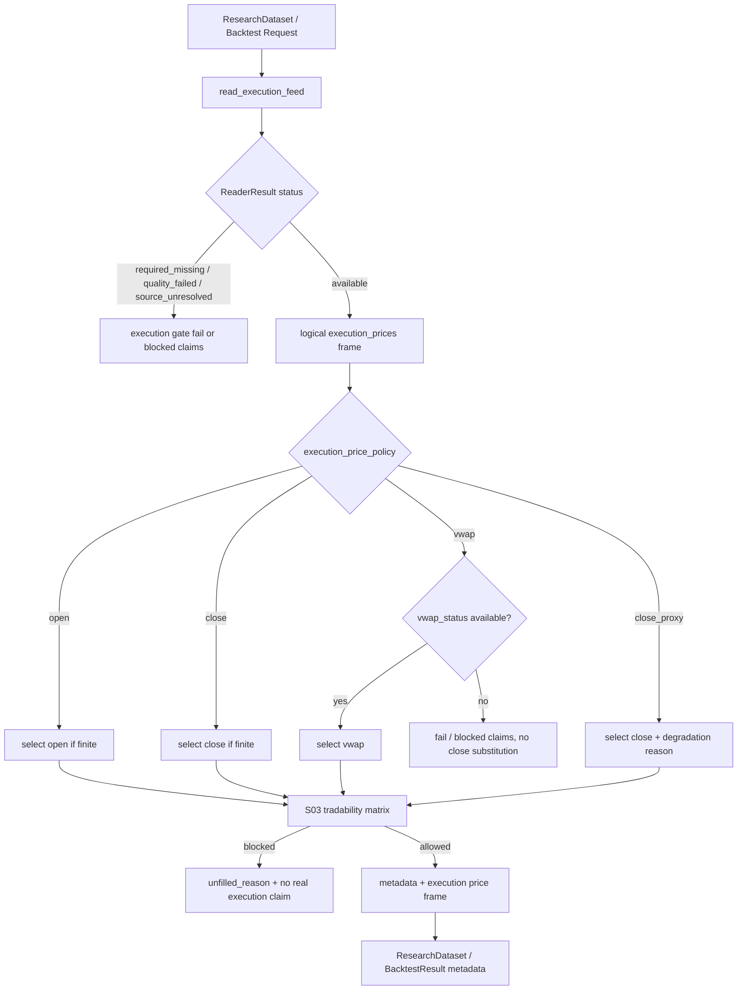

# LLD: CR011-S04 - OHLCV / VWAP 干净执行 feed

> 本文档是 `CR011-S04-ohlcv-vwap-clean-execution-feed` 的低层设计。`CR011-DATA-BATCH-A` CP5 已于 2026-05-24T10:24:02+08:00 获用户批准，本文档可作为实现输入；该批准不授权真实联网、读取凭据、写真实 lake、操作旧 `data/**` 或覆盖旧 `reports/experiment_17_21/factor_strategy_report.md`。

修订记录：

| 版本 | 日期 | 修订人 | 变更要点 |
|---|---|---|---|
| 1.0 | 2026-05-24 | meta-dev | 初版 LLD，覆盖 OHLCV/VWAP availability、四值 execution price policy、close proxy 降级、接口与测试设计 |

## 1. Goal

创建 CR011-S04 的执行价 feed 设计：在研究输入与回测执行前只读 published `prices` current truth，形成可审计的 OHLCV / VWAP availability、`execution_price_policy`、`execution_price`、`execution_degradation_reason`、`vwap_status`、`vwap_or_proxy` 与 `unfilled_reason` 合同，使新版实验能明确区分真实 `open` / `close` / `vwap`、经声明的 `close_proxy` 降级和不可执行行。

本 Story 只设计本地离线消费侧执行价合同，不新增真实 provider，不触发 backfill，不写 lake，不读取 `.env`，不操作旧 `data/**`，不覆盖旧报告，不实现分钟级撮合，不把 `close_proxy` 声明为 VWAP，不由 consumer 静默用 `amount / volume` 推导真实 VWAP。实现必须等待本 LLD `confirmed=true`、`CR011-DATA-BATCH-A` 六张 LLD 全量完成、CP5 批次人工 approved、CR011-S03 tradability 合同冻结、CR010-S02 runtime 数据覆盖可只读消费且 `dev_gate.implementation_allowed=true`。

## 2. Requirements（Functional / Non-Functional）

### 2.1 Functional

- `execution_price_policy` 只允许 `open`、`close`、`vwap`、`close_proxy` 4 个取值；非法值必须 fail fast，不能回退为默认 close。
- `read_execution_feed` 必须只读 published `prices` current truth，输出 `trade_date`、`symbol`、`open`、`high`、`low`、`close`、`volume`、`amount`、`vwap`、`vwap_status`、`available_at_rule`、`source_interface`、`source_run_id`、lineage 或 missing reason。
- `vwap` policy 只有在 `vwap_status=available` 且 `vwap` 为正数、有限值时才可生成 `execution_price`；缺 VWAP、质量失败、source unresolved 或 `vwap_status` 非 available 时不得静默替换为 close。
- `close_proxy` policy 必须写入非空 `execution_degradation_reason`，并同步将 `real_vwap_execution`、`real_open_execution`、`real_tradable_execution`、`vwap_fill_claim` 等真实成交 / VWAP 成交声明加入 `blocked_claims`。
- `open` / `close` policy 必须使用对应字段的同日执行价，不得前填、后填、0 填或跨 symbol 填补；缺字段、缺行、非正数或非有限值必须输出 `unfilled_reason` 或 production_strict fail。
- 执行价解析必须消费 CR011-S03 的 tradability matrix：被停牌、涨跌停、ST、无成交、上市天数或事件状态阻断的计划交易不得产生真实可成交声明。
- `engine/research_dataset.py` 必须把 execution availability、policy、degradation、blocked claims 和 gate checks 合并进 `ResearchDataset.metadata`、`GateResult.checks`、`allowed_claims`、`blocked_claims`、`known_limitations`。
- `engine/backtest.py` 必须显式消费 execution price policy；当执行价缺失时，不进行前填、后填、0 填或 close 隐式替换，portfolio unfilled reason 必须可审计。

### 2.2 Non-Functional

- 安全：默认验证路径 `network_calls=0`、`lake_writes=0`、`credential_reads=0`、`legacy_data_operations=0`；实现不得导入 `market_data.connectors`、`market_data.runtime`、`market_data.storage`、provider SDK 或网络库。
- 可追溯：每个 execution feed result 至少保留 catalog entry、`source_run_id`、`source_interface`、`available_at_rule`、quality/readiness status 或 typed missing reason。
- 可维护：不新增正式 `execution_prices` dataset constant，不修改 `market_data/contracts.py`；S04 将 HLD-DATA-LAKE 中的 `execution_prices` 视为 `DATASET_PRICES` 上的逻辑只读视图，除非 CP5 明确扩大文件所有权。
- 可验证：测试只使用 fixture、fake reader、tmp path 和静态扫描；不得访问真实 lake、旧 `data/**`、凭据、网络或旧报告内容。
- 兼容：既有 `close_df` 信号路径继续使用收盘价生成信号；execution policy 只影响执行价 metadata、执行价矩阵和真实成交声明边界，不改变因子信号计算口径。

## 3. 模块拆分与职责

| 模块 / 文件组 | 职责 | 说明 |
|---|---|---|
| `market_data/readers.py` | 创建 `ExecutionFeedRequest` 与 `read_execution_feed`，把 published `prices` current truth 转为逻辑 `execution_prices` view | 复用 `ReaderResult`、`read_dataset`、`QualityPolicy`；缺 lake/catalog/字段/source/lineage 时返回 typed missing；不触发 fetch/backfill/write |
| `engine/research_dataset.py` | 创建 execution policy 解析与 research metadata 合并逻辑 | 复用 `ResearchDataset`、`GateResult`、`ResearchDatasetIssue`、allowed/blocked claims 结构；消费 S03 tradability matrix |
| `engine/backtest.py` | 在轻量回测入口消费 execution policy 与执行价矩阵 | 保留 `run_portfolio` API；S04 只在 `engine/backtest.py` 层构造受控 execution price frame / metadata，不修改 `engine/portfolio.py` |
| `tests/test_cr011_execution_price_policy.py` | 覆盖四值 policy、VWAP 缺失、close proxy 降级、缺价不填充、安全边界和旧报告隔离 | 使用离线 fixture、fake reader 和静态扫描；不运行真实 provider |

本 Story 引用的设计输入为 `process/HLD.md` §27.1、§27.4、§27.5、§27.7，`process/HLD-DATA-LAKE.md` §14.2、§14.3、§14.5，`process/ARCHITECTURE-DECISION.md` ADR-039，`process/REQUIREMENTS.md` REQ-074、REQ-080、REQ-081、REQ-082，`process/STORY-BACKLOG.md` CR011-S04，`process/DEVELOPMENT-PLAN.yaml` `CR011-DATA-BATCH-A`，以及上游 `process/stories/CR011-S03-tradability-status-and-price-limit-gates-LLD.md` 的 tradability matrix 接口。

## 4. 代码结构与文件影响范围

| 动作 | 文件路径 | 变更内容 |
|---|---|---|
| 修改 | `market_data/readers.py` | 创建 `ExecutionFeedRequest`、`read_execution_feed` 和 `__all__` 导出；以 `DATASET_PRICES` 为物理 dataset，只读返回逻辑 `execution_prices` 字段、`vwap_status`、lineage 和 typed missing reason |
| 修改 | `engine/research_dataset.py` | 创建 `ExecutionPolicyRequest`、`ExecutionPolicyResult`、`resolve_execution_price_policy`、`evaluate_execution_price_gate`、`merge_execution_metadata`，并把 execution gate 合并到 metadata / claims / checks |
| 修改 | `engine/backtest.py` | 创建 `ExecutionPolicyConfig`、`build_execution_price_frame`，并扩展 `run_backtest` / `run_backtest_from_loaded_data` 的可选 execution policy 消费路径；缺价时生成 unfilled / fail，不填充 |
| 创建 | `tests/test_cr011_execution_price_policy.py` | 覆盖 AC、接口、错误路径、安全边界、CP5 前不运行真实链路和旧报告不覆盖 |

禁止修改 `market_data/connectors/**`、`market_data/runtime.py`、`market_data/storage.py`、`market_data/contracts.py`、`data/**`、`.env`、`reports/experiment_17_21/factor_strategy_report.md`、`delivery/**`。本 LLD 不授权修改 `process/stories/CR011-S04-ohlcv-vwap-clean-execution-feed.md`、HLD、ADR、检查点、DEV-LOG、代码或测试。

## 5. 数据模型与持久化设计

本 Story 无新增持久化表、无真实 lake 写入、无旧 `data/**` 读写。所有新增对象均为内存数据结构、metadata payload 或测试 fixture。HLD-DATA-LAKE 中的 `execution_prices` 在本 Story 中是 `DATASET_PRICES` 的逻辑只读视图，不新增 `market_data/contracts.py` 常量。

| 对象 / 字段 | 类型 | 约束 | 说明 |
|---|---|---|---|
| `ExecutionFeedRequest.lake_root` | `str | Path | None` | 必须显式传入；`None` 返回 `required_missing` | 不读取 env fallback，不读取 `.env` |
| `ExecutionFeedRequest.start_date` / `end_date` | `str | date | None` | 可选；用于 reader filters | 与研究请求日期范围一致 |
| `ExecutionFeedRequest.symbols` | `tuple[str, ...] | None` | 可选；用于 reader filters | 与 research universe / planned trades 对齐 |
| `ExecutionFeedRequest.quality_policy` | `QualityPolicy | Mapping | str | None` | production_strict 必须 required | 复用 reader quality 策略 |
| `ExecutionFeedResult` | `ReaderResult` | `status` 只能来自 reader typed status；`frame` 必含逻辑 execution columns 或为空 | 不新增持久化类型；frame 作为逻辑 `execution_prices` view |
| `execution_frame.trade_date` | `date | str` | 必填 key | 执行价日期 |
| `execution_frame.symbol` | `str` | 必填 key | 股票代码 |
| `execution_frame.open/high/low/close` | `float` | `open/high/low/close` policy 所需字段为正数且有限；OHLC 关系由 CR010-S02 quality gate 负责 | S04 不重新写 quality validator，只在消费前 fail closed |
| `execution_frame.volume/amount` | `float | None` | 可缺；缺时不得声明容量 / derived VWAP | 本 Story 不用 `amount/volume` 自动生成真实 VWAP |
| `execution_frame.vwap` | `float | None` | `vwap_status=available` 时必须为正数且有限 | 非 available 时不可用于 `vwap` policy |
| `execution_frame.vwap_status` | `available | required_missing | source_unresolved | quality_failed | derived_unavailable | vwap_required_missing` | 必填；缺字段时 S04 补 typed issue 并视为 `required_missing` | `derived_unavailable` 不等同真实 VWAP |
| `ExecutionPolicyRequest.policy` | `open | close | vwap | close_proxy` | 必填；非法值 fail fast | 对应 Story AC |
| `ExecutionPolicyRequest.realism_mode` | `production_strict | exploratory | None` | production_strict 缺执行价必须 fail；exploratory 可输出 limitation / unfilled | 与 HLD §27 一致 |
| `ExecutionPolicyRequest.tradability_matrix` | `Mapping | None` | 来自 CR011-S03；未冻结前只能作为设计合同引用 | blocked trade 优先阻断真实可成交声明 |
| `ExecutionPolicyResult.execution_price_policy` | `str` | 四值枚举之一 | 写入 metadata |
| `ExecutionPolicyResult.execution_price` | `float | None` | 可执行行必填；缺失时为 `None` | 不填充、不代理 |
| `ExecutionPolicyResult.execution_degradation_reason` | `str` | `close_proxy` 或降级时必填 | 允许值包含 `policy_explicit_close_proxy`、`vwap_required_missing`、`vwap_source_unresolved`、`vwap_quality_failed`、`open_required_missing`、`tradability_blocked` |
| `ExecutionPolicyResult.unfilled_reason` | `str | None` | 缺价或 gate blocked 时必填 | 允许值包含 `missing_execution_price`、`invalid_execution_policy`、`price_not_finite`、`vwap_required_missing`、`tradability_blocked` |
| `ResearchDataset.metadata.execution` | `dict` | 必含 policy、availability、degradation、blocked claims summary | report builder 后续消费 |

## 6. API / Interface 设计

| 接口 / 入口 | 输入 | 输出 | 调用方 | 说明 |
|---|---|---|---|---|
| `read_execution_feed(request, *, reader=read_dataset)` | `ExecutionFeedRequest | Mapping`，含 lake root、date range、symbols、quality policy | `ReaderResult`；`frame` 包含 OHLCV、`vwap`、`vwap_status`、lineage；缺输入返回 typed missing | `engine.research_dataset.evaluate_execution_price_gate` | 只读 `DATASET_PRICES`；不触发补数；不读取 env / `.env`；逻辑 dataset 标记为 `execution_prices` |
| `resolve_execution_price_policy(policy_request, feed_result, *, tradability_matrix=None)` | requested policy、execution feed、tradability matrix、realism mode | `ExecutionPolicyResult` 或 row-level result list | `evaluate_execution_price_gate`、`engine.backtest.build_execution_price_frame` | policy 四值校验；`vwap` 缺失不替换 close；`close_proxy` 强制 degradation |
| `evaluate_execution_price_gate(dataset, request, *, feed_result=None, tradability_matrix=None)` | `ResearchDataset`、`ResearchDatasetRequest | Mapping`、可选 feed / S03 matrix | 更新后的 `ResearchDataset` | `build_research_dataset` 后续 CR011 pipeline | 合并 metadata、gate checks、allowed_claims、blocked_claims、known_limitations |
| `build_execution_price_frame(feed_frame, policy_config, *, tradability_matrix=None)` | long-form feed frame、policy config、S03 matrix | wide `pd.DataFrame`、row-level issues、metadata | `run_backtest` | 生成给现有 `run_portfolio` 使用的受控 price frame；缺价保持 NaN 或 fail，不填充 |
| `run_backtest(close_df, config=None, *, metadata=None, execution_policy=None, execution_feed=None, tradability_matrix=None)` | 既有 close_df + 可选 execution policy / feed / matrix | `BacktestResult`，metadata 包含 execution policy 与 degradation | 实验 17-21 v2 / 后续研究入口 | `close_df` 仍用于信号；当提供 execution feed 时构造 execution price frame；不修改 `engine/portfolio.py` |
| `run_backtest_from_loaded_data(loaded_data, config=None)` | loaded data metadata 中的 execution feed / policy | `BacktestResult` | loader / research dataset adapter | 从 `loaded_data.metadata["execution"]` 消费 policy；缺失时保持现有 close proxy metadata 但不得声明真实 VWAP |

第 6 节每个接口均必须在第 10 节找到测试入口：`read_execution_feed` 对应 T02/T10，`resolve_execution_price_policy` 对应 T01/T03/T04/T05/T06/T07，`evaluate_execution_price_gate` 对应 T08，`build_execution_price_frame` 对应 T06/T09，`run_backtest` / `run_backtest_from_loaded_data` 对应 T08/T09。

## 7. 核心处理流程

1. 调用方在 CR011 研究输入阶段构造 `ExecutionFeedRequest`，显式传入 `lake_root`、日期范围、symbols 和 quality policy。
2. `read_execution_feed` 调用 `read_dataset(DATASET_PRICES, lake_root, filters, required=True)`，只读 published current truth；缺 root、catalog、publish、quality、lineage 或必需字段时返回 typed `ReaderResult`，`remediation_spec.auto_execute=false`。
3. reader 将 `DATASET_PRICES` frame 校验为逻辑 `execution_prices` view：保留 `trade_date`、`symbol`、OHLCV、`vwap`、`vwap_status`、`available_at_rule`、`source_interface`、`source_run_id`；缺 `vwap_status` 时标记 `vwap_required_missing`。
4. `resolve_execution_price_policy` 先校验 policy 四值枚举，再按 S03 tradability matrix 判断 blocked trade；blocked 行输出 `unfilled_reason=tradability_blocked`，不声明真实成交。
5. policy 为 `open` / `close` 时读取对应字段；缺行、缺字段、非正数、非有限值时输出 `missing_execution_price` / `price_not_finite`，production_strict fail，exploratory 可保留 limitation。
6. policy 为 `vwap` 时只接受 `vwap_status=available` 且 `vwap` 有效；否则 production_strict fail，exploratory 写 blocked claims，不能自动使用 close。
7. policy 为 `close_proxy` 时读取 `close` 字段作为代理执行价，写 `execution_degradation_reason=policy_explicit_close_proxy` 或上游缺口原因，并阻断 VWAP / 真实成交 / 真实开盘成交声明。
8. `evaluate_execution_price_gate` 将 execution metadata 合并进 `ResearchDataset.metadata["execution"]`、`gate_result.checks`、`blocked_claims` 和 `known_limitations`。
9. `engine.backtest` 在收到 execution feed 时构造受控 execution price frame；缺价行保持 NaN 或按 production_strict fail，让 `run_portfolio` 产生 `missing_execution_price` / gate reason，不做前填、后填或 0 填。



## 8. 技术设计细节

- 关键算法 / 规则：
  - policy 枚举采用 exact match：`open`、`close`、`vwap`、`close_proxy`；大小写、别名、空字符串和历史 `next_open_day_close_proxy` 不作为合法 policy。
  - 价格有效性统一为 `isfinite(price) and price > 0`；0、负数、NaN、inf 均输出 `price_not_finite` 或 `missing_execution_price`。
  - `vwap` policy 必须同时满足 `vwap_status=available`、`vwap` 有效、lineage 可追溯；`vwap_status=derived_unavailable`、`required_missing`、`source_unresolved`、`quality_failed` 均不得支撑真实 VWAP 声明。
  - `close_proxy` 是显式降级，不是 `close` 的别名；它必须写 `execution_degradation_reason`，并在 `blocked_claims` 中阻断真实 VWAP、真实开盘成交和真实可成交声明。
  - `amount / volume` 不在本 Story 中被 consumer 自动换算为 VWAP。若后续需要使用派生 VWAP，必须新增可审计公式、单位校验、异常成交量处理、claim 语义和测试；当前默认 `vwap_status=required_missing` 或 `derived_unavailable`。
  - 缺执行价时不得前填、后填、0 填、跨 symbol 填或回退 close；exploratory 只能以 limitation / unfilled 行继续，production_strict 必须 fail。
  - S03 tradability blocked 优先级高于 execution price selection；被 blocked 的行不应被 execution price 可用性误标为真实可成交。
- 依赖选择与复用点：
  - 复用 `market_data.readers.ReaderResult`、`QualityPolicy`、`read_dataset` 和 `remediation_spec.auto_execute=false`。
  - 复用 CR010-S02 已确认的 `prices` / `adj_factor` 历史回补合同：OHLCV、amount、quality/readiness、`available_at_rule`、lineage。
  - 复用 CR011-S03 的 `TradabilityGateMatrix` / blocked reason 语义；S04 不重新定义停牌、涨跌停、ST、事件、上市天数 gate。
  - 复用 `engine.research_dataset.ResearchDataset`、`ResearchDatasetIssue`、`GateResult` 和 allowed/blocked claims metadata 风格。
  - 复用 `engine.portfolio.run_portfolio` 的 `missing_execution_price` unfilled 行为；S04 不改 `engine/portfolio.py`。
- 兼容性处理：
  - 现有 `engine/backtest.py` metadata 中的 `execution_time_rule=next_open_day_close_proxy` 必须被新 metadata 覆盖为结构化 `execution_price_policy`，避免旧自由文本被误读。
  - 未提供 execution feed 的旧调用保持可运行，但只能标记为 `close_proxy` / legacy limitation，不能输出真实 VWAP 或真实可成交声明。
  - 若 CP5 要求正式新增 `execution_prices` dataset constant 或修改 schema registry，当前 Story 文件所有权不足，必须停止并交回 meta-po 发起 CR 或扩大 CP5 范围。
- 图示类型选择：流程图；本 Story 跨 `market_data/readers.py`、`engine/research_dataset.py`、`engine/backtest.py` 和 CR011-S03 gate，且存在 policy / missing / degradation / blocked 分支。

## 9. 安全与性能设计

| 维度 | 设计措施 | 验证方式 |
|---|---|---|
| 安全 | 新增代码不导入 `market_data.connectors`、`market_data.runtime`、`market_data.storage`、provider SDK、`requests`、`httpx`、`aiohttp`、`socket`；不读取 `os.environ`、`.env`、token、用户名或密码 | `tests/test_cr011_execution_price_policy.py` 静态 import / AST 扫描；monkeypatch fake secret 后确认输出不含 secret |
| 安全 | `lake_root=None`、repo `data/**`、catalog missing、quality failed、lineage missing 均返回 typed missing / invalid，不触发 backfill 或写入 | fake reader / fixture 断言 `auto_execute=false`，network/write counters 为 0 |
| 安全 | 旧报告只作为 forbidden path；S04 不读取、不覆盖 `reports/experiment_17_21/factor_strategy_report.md` | 静态扫描目标文件不包含旧报告写入路径；测试断言 old report overwrite count 为 0 |
| 性能 | `read_execution_feed` 只读取调用方 date/symbol 范围；long frame 到 wide frame 使用 pandas pivot/index，不逐 symbol 全表扫描 | fake reader 捕获 filters；1,000 行 fixture 下 row_count 与 missing count 正确 |
| 性能 | policy resolver 按 `(trade_date, symbol)` 建立索引并复用 S03 matrix reason map | 参数化测试覆盖多日期多 symbol，无外部 IO |
| 可观测 | metadata 输出 `execution_availability_status`、`execution_price_policy`、`vwap_status_counts`、`unfilled_reason_counts`、`blocked_claims` | metadata snapshot / dict assertion |

## 10. 测试设计

本 LLD 只定义验证入口，不在本轮运行测试。默认验证命令为 `uv run --python 3.11 pytest -q tests/test_cr011_execution_price_policy.py`，仅在 CP5 approved 后进入实现/自检阶段使用。

| 测试场景 | 前置条件 | 操作 | 预期结果 | 验证方式 |
|---|---|---|---|---|
| T01 四值 policy exact 校验 | 构造 policy 参数 `open/close/vwap/close_proxy` 与非法值 | 调用 `resolve_execution_price_policy` | 四个合法值可解析；非法值 fail fast，未回退 close | pytest 参数化 |
| T02 execution feed reader 字段与 typed missing | fake `read_dataset` 返回 prices fixture / 缺字段 fixture | 调用 `read_execution_feed` | available frame 含 OHLCV、`vwap_status`、lineage；缺必需字段返回 `required_missing` 和 issue code | fake reader fixture |
| T03 VWAP available 解析 | fixture 含 `vwap_status=available` 和有效 `vwap` | policy=`vwap` | `execution_price=vwap`，无 close proxy degradation，VWAP claim 可进入 allowed 前置 | pytest fixture |
| T04 VWAP missing 不替换 close | fixture 中 `vwap_status=required_missing` 或缺 `vwap`，close 有效 | policy=`vwap` | production_strict fail 或 exploratory blocked claims；`execution_price` 不等于 close；close substitution 次数为 0 | pytest assertion |
| T05 close_proxy 降级 metadata | fixture 中 close 有效、VWAP missing | policy=`close_proxy` | `execution_degradation_reason` 非空；blocked claims 包含真实 VWAP / 真实成交声明；`vwap_or_proxy` 标记为 proxy | metadata assertion |
| T06 open / close 缺价不填充 | open 或 close 缺行、NaN、0、负数 | policy=`open` / `close` | 输出 `unfilled_reason=missing_execution_price` 或 `price_not_finite`；前填、后填、0 填次数为 0 | pytest fixture |
| T07 tradability blocked 优先阻断 | S03 matrix fixture 中指定 symbol/date blocked | 调用 resolver / gate | blocked 行不产生真实可成交声明；reason 来自 S03 blocked reason | fixture + dict assertion |
| T08 ResearchDataset metadata 合并 | 构造 ResearchDataset、feed result、policy config | 调用 `evaluate_execution_price_gate` | metadata 含 `execution_price_policy`、`execution_availability_status`、`vwap_status_counts`、`blocked_claims`；GateResult checks 可读 | metadata snapshot |
| T09 Backtest 消费 execution frame | close_df 与 execution feed fixture 对齐 / 缺价 | 调用 `run_backtest(..., execution_policy=...)` | result metadata 记录 policy；缺价 trade unfilled；旧 `execution_time_rule` 不再误声明真实执行 | pytest fixture |
| T10 no network/no credential/no old data/no old report | monkeypatch fake secret；扫描目标文件与 fake paths | 静态 import/path 扫描 + fake reader | `network_calls=0`、`credential_reads=0`、`lake_writes=0`、`legacy_data_operations=0`、old report overwrite=0，输出不含 fake secret | 静态测试 |

第 6 节接口均有测试入口：`read_execution_feed` 对应 T02/T10，`resolve_execution_price_policy` 对应 T01/T03/T04/T05/T06/T07，`evaluate_execution_price_gate` 对应 T08，`build_execution_price_frame` 对应 T06/T09，`run_backtest` / `run_backtest_from_loaded_data` 对应 T08/T09。第 7 节错误路径均有测试入口：reader typed missing 对应 T02，VWAP missing 对应 T04，close proxy blocked claims 对应 T05，缺价不填充对应 T06，tradability blocked 对应 T07，安全边界对应 T10。

## 11. 实施步骤

CP5 未 approved 前不得执行以下 TASK。本节只定义未来实现顺序。

| TASK-ID | 动作 | 目标文件 | 详细描述 | 对应测试 |
|---|---|---|---|---|
| CR011-S04-T1 | 修改 | `market_data/readers.py` | 创建 `ExecutionFeedRequest` 与 `read_execution_feed`；以 `DATASET_PRICES` 构造逻辑 `execution_prices` view；缺 lake/catalog/source/lineage/OHLCV/VWAP status 返回 typed missing，`auto_execute=false` | T02、T10 |
| CR011-S04-T2 | 修改 | `engine/research_dataset.py` | 创建 `ExecutionPolicyRequest`、`ExecutionPolicyResult`、`resolve_execution_price_policy`、`evaluate_execution_price_gate`、`merge_execution_metadata`；合并 policy、degradation、blocked claims 和 gate checks | T01、T03、T04、T05、T06、T07、T08 |
| CR011-S04-T3 | 修改 | `engine/backtest.py` | 创建 `ExecutionPolicyConfig`、`build_execution_price_frame`，并扩展 `run_backtest` / `run_backtest_from_loaded_data` 的可选 execution feed 消费；缺价不填充，`close_proxy` 写 metadata | T06、T08、T09 |
| CR011-S04-T4 | 创建 | `tests/test_cr011_execution_price_policy.py` | 建立离线 prices / VWAP missing / tradability matrix fixture、fake reader、安全静态扫描、metadata snapshot 和 old report forbidden path 断言 | T01-T10 |

每个 TASK-ID 覆盖第 4 节至少 1 个文件影响项；每个文件影响项至少被 1 个 TASK-ID 覆盖。

## 12. 风险、难点与预研建议

| 风险 / 难点 | 影响 | 缓解措施 / 预研建议 |
|---|---|---|
| Story 卡片仍为 `status=draft`、`lld_gate.status=not-started`，但 CP4/STATE 已允许 CR011-DATA-BATCH-A Wave2 LLD | 流程状态与 LLD 调度状态不完全一致 | 本 LLD 保持 `confirmed=false`；meta-po 后续需在允许范围内更新 Story 状态、CP5 自动预检和批次人工审查，不得据此实现 |
| CR011-S03 LLD 尚未 CP5 confirmed | S04 的 tradability matrix 依赖合同未最终冻结，dev_ready 不可计算 | S04 只引用 S03 LLD 的接口草案；实现前必须等 S03 `confirmed=true` 且 CR011-DATA-BATCH-A CP5 approved |
| HLD-DATA-LAKE 命名 `execution_prices`，但 S04 文件所有权不含 `market_data/contracts.py` | 若需要新增正式 dataset constant，会超出 Story 范围 | 当前设计将 `execution_prices` 作为 `DATASET_PRICES` 的逻辑只读 view；若 CP5 要求物理 dataset，停止并交回 meta-po 发起 CR 或扩大 CP5 |
| `amount / volume` 派生 VWAP 公式未冻结 | 静默派生会误声明真实 VWAP，且不同市场单位可能导致错误价格 | 本 Story 禁止 consumer 自动派生真实 VWAP；`derived_unavailable` 只能触发 blocked claims。若后续需要派生 VWAP，新增 Spike 明确公式、单位和异常量处理 |
| `engine/portfolio.py` 不在 S04 文件所有权内 | 无法在 portfolio 层彻底拆分 fill price 与 mark-to-market price | S04 在 `engine/backtest.py` 构造受控 execution price frame 并写 limitation；如需双价格簿，应新建后续 Story 或 CR 扩展 portfolio ownership |
| 旧 metadata `execution_time_rule=next_open_day_close_proxy` 可能被误读 | 报告可能继续把旧自由文本当真实执行说明 | S04 metadata 必须写结构化 `execution_price_policy`、`execution_degradation_reason`、blocked claims，并让旧字段不再单独支撑声明 |

### OPEN / Spike 跟踪

| ID | 类型（OPEN / Spike） | 问题 | 下一动作 | 责任方 |
|---|---|---|---|---|
| O-01 | OPEN | CR011-S04 Story 卡片仍为 `status=draft`、`lld_gate.status=not-started`；本轮用户只允许写 LLD，不能更新 Story、CP5 或 DEV-LOG | meta-po 在 LLD 收齐后更新批次状态并发起 CP5，不得把本 LLD 视为实现授权 | meta-po |
| O-02 | OPEN | CR011-S03 tradability matrix、blocked reason 和 missing 行为尚未 CP5 confirmed | CR011-DATA-BATCH-A CP5 审查时冻结 S03/S04 接口；未冻结前 S04 dev_gate 保持 blocked | meta-po / meta-dev |
| O-03 | OPEN | `execution_prices` 在 HLD-DATA-LAKE 中是 dataset/artifact 名称，但 S04 不拥有 `market_data/contracts.py` | CP5-A 确认 S04 采用 `DATASET_PRICES` 逻辑 view；若必须新增物理 dataset，发起 CR 或扩大 Story 文件所有权 | meta-po / meta-se |
| S-01 | Spike | `amount / volume` 派生 VWAP 是否允许进入未来生产级执行价 | 当前 Story 不实现派生 VWAP；若用户要求，新增 Spike 明确单位、成交量为 0、异常 amount、claim 名称和测试 | meta-se / user |

## 13. 回滚与发布策略

- 发布方式：本 Story 未来实现只通过普通代码变更进入仓库，不写真实 lake，不新增安装脚本，不写 `delivery/**`；验证通过后由 meta-qa 生成 CP7，再由 meta-po 推进 Story 状态。
- 回滚触发条件：
  - `execution_price_policy` 接受四值以外的 policy，或非法值回退 close。
  - `vwap` 缺失时仍使用 close、前填、后填、0 填或跨 symbol 填补。
  - `close_proxy` 缺少 `execution_degradation_reason`，或未阻断真实 VWAP / 真实成交 / 真实开盘成交声明。
  - S03 blocked trade 仍输出真实可成交声明。
  - 测试或静态扫描发现联网、凭据读取、真实 lake 写入、旧 `data/**` 操作、旧报告覆盖、connector/runtime/storage 导入。
  - CP5 未 approved 即出现代码实现或测试运行。
- 回滚动作：
  - 使用版本控制回退本 Story 修改的 4 个文件，不触碰旧报告、旧 data、凭据或真实 lake。
  - 保留本 LLD 和后续 CP5/CP6/CP7 记录作为审计证据。
  - 若回滚原因是接口边界错误、需要新增 `execution_prices` 物理 dataset 或需要修改 `engine/portfolio.py`，停止实现并交回 meta-po 发起 CR 或重新进入 CP5。

## 14. Definition of Done

- [ ] 14 个章节全部填写完成。
- [ ] `tier=L`、`shared_fragments`、`open_items=4` 已在 frontmatter 写明。
- [ ] LLD `status=ready-for-review`、`confirmed=false`，未把任何实现授权写成已批准。
- [ ] 文件影响范围、接口、核心流程、异常路径、测试与实施步骤可直接指导 CP5 后编码。
- [ ] `execution_price_policy` 只允许 `open`、`close`、`vwap`、`close_proxy` 四值。
- [ ] `close_proxy` 必须写 `execution_degradation_reason`，并阻断真实 VWAP、真实开盘成交和真实可成交声明。
- [ ] `vwap` 缺失时 close substitution 次数为 0；缺执行价前填、后填或 0 填充次数为 0。
- [ ] S03 tradability blocked 行不产生真实可成交声明。
- [ ] 安全边界明确：不联网、不读凭据、不写真实 lake、不操作旧 `data/**`、不覆盖旧报告。
- [ ] 第 6 节接口在第 10 节均有测试入口；第 7 节异常路径在第 10 节均有错误路径验证。
- [ ] 第 11 节 TASK-ID 与第 4 节文件影响范围一一对应。
- [ ] OPEN / Spike 已清点；CP5 approved 前不得实现。

## 人工确认区

> **CP5 - Story LLD 可实现性门**
>
> 当前用户指令只允许创建本 LLD 文件，未授权写入 `process/checks/CP5-*`、Story 卡片、`DEV-LOG.md` 或任何代码文件。因此本 LLD 仅提交 `ready-for-review` 设计稿；meta-po 收齐 `CR011-DATA-BATCH-A` 六张 LLD 后，需另行生成 CP5 自动预检和 `checkpoints/CP5-CR011-DATA-BATCH-A-LLD-BATCH.md`，并发起统一人工确认。
>
> CP5 批次未 approved、当前 LLD 未 `confirmed=true`、S03 tradability 合同未冻结、CR010-S02 runtime 覆盖不可只读消费、`dev_gate.implementation_allowed=false` 或文件所有权冲突未解除前，不得实现。

**CP5 checklist 摘要**：

| # | 检查项 | 状态 | 证据 |
|---|---|---|---|
| 1 | LLD 覆盖 AC | 待 CP5 检查 | 第 2 / 10 / 14 节 |
| 2 | 与 HLD / ADR 一致 | 待 CP5 检查 | 第 3 / 8 / 12 节 |
| 3 | 文件影响范围明确 | 待 CP5 检查 | 第 4 / 11 节 |
| 4 | 接口契约完整 | 待 CP5 检查 | 第 6 节 |
| 5 | 测试与 dev_gate 可计算 | 待 CP5 检查 | 第 10 / 14 节 |

**人工确认回复**：

请直接回复以下任一整行：

```text
approve
修改: <具体修改点>
reject
```

- `approve`：LLD 设计合理，可纳入 `CR011-DATA-BATCH-A` CP5 批次确认；仍不代表可直接实现。
- `修改: <具体修改点>`：指出具体修改点后由 meta-dev 更新重提。
- `reject`：设计方向有根本问题，需重新设计。

**人工审查结果回填**：

- 结论：`approved | changes_requested | rejected`
- 审查人：
- 审查时间：
- 修改意见：
- 风险接受项：
