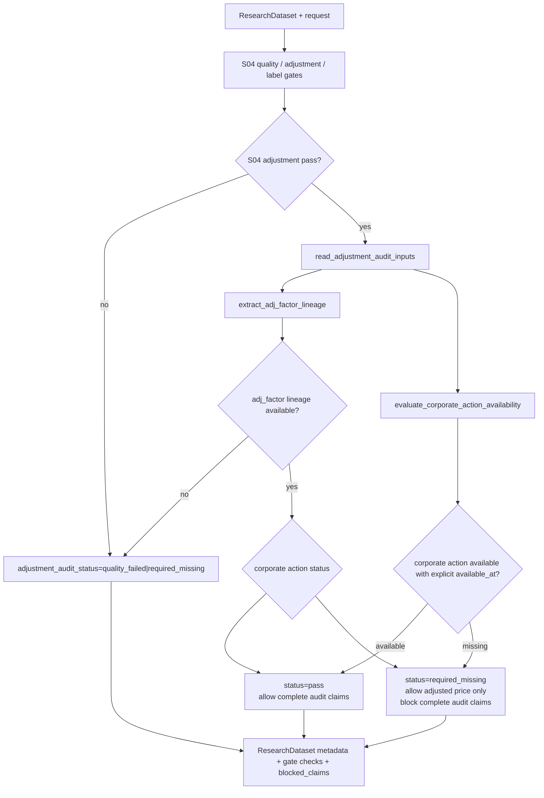

# LLD: CR011-S05 - 复权与公司行动审计

> 本文档是 `CR011-S05-adjustment-and-corporate-action-audit` 的 Story 级低层设计。`CR011-DATA-BATCH-A` CP5 已于 2026-05-24T10:24:02+08:00 获用户批准，本文档可作为实现输入；该批准不授权真实联网、读取凭据、写真实 lake、操作旧 `data/**` 或覆盖旧 `reports/experiment_17_21/factor_strategy_report.md`。缺公司行动真实 source 时不得声明完整审计。

修订记录：

| 版本 | 日期 | 修订人 | 变更要点 |
|---|---|---|---|
| 1.0 | 2026-05-24 | meta-dev | 初版 LLD，覆盖 `adj_factor` lineage、复权一致性、公司行动 availability 分层声明、metadata 合并、接口与测试设计 |

## 1. Goal

创建 CR011-S05 的 adjustment audit 设计：在 `market_data/readers.py` 暴露只读 `adj_factor` lineage 与 `corporate_actions` availability / missing reason，在 `engine/research_dataset.py` 将复权一致性、`adj_factor_lineage`、`corporate_action_status` 和 `adjustment_audit_status` 合并进 `research_input_v1` / `ResearchDataset.metadata`，并创建 `tests/test_cr011_adjustment_audit.py` 覆盖混用复权 fail、公司行动缺失 blocked claims、旧报告不覆盖和默认安全计数。

完成后的工程效果是：因子、收益、benchmark 和 portfolio 计算只能使用同一 `adjustment_policy`；`adj_factor_lineage` 与 `corporate_action_status` 分层表达；缺公司行动或缺 explicit `available_at` 时只能声明“使用已复权价格”，不得声明“完整公司行动链路可审计”；复权口径混用进入因子计算次数为 0。

## 2. Requirements（Functional / Non-Functional）

### 2.1 Functional

- 修改 `market_data/readers.py`，新增 `AdjustmentAuditRequest`、`AdjustmentAuditReaderResult` 或等价只读 helper，读取 `prices`、可选 `adj_factor` 和可选 `corporate_actions` reader result，输出 `adjustment_policy`、`adj_factor_lineage`、`corporate_action_status`、`adjustment_audit_status`、`lineage_raw_checksum`、`mixed_adjustment_policy_count` 和 missing reason。
- 修改 `engine/research_dataset.py`，新增 `AdjustmentAuditResult`、`evaluate_adjustment_audit`、`apply_adjustment_audit_gate` 或等价函数，复用 CR008-S04 的 `evaluate_adjustment_gate`，并将更强的公司行动审计声明单独写入 metadata、`gate_result.checks`、`known_limitations`、`allowed_claims` 和 `blocked_claims`。
- `adjustment_audit_status` 至少支持 `pass`、`required_missing`、`quality_failed` 三类状态；实现可额外保留 `corporate_action_required_missing` / `lineage_missing` 作为 issue code，但对外聚合必须映射到上述三类之一。
- 复权混用、request policy 与数据侧 policy mismatch、缺数据侧 `adjustment_policy`、缺 `adj_factor` lineage 或 quality fail 均不得进入因子计算；严肃研究模式必须 fail 或返回 `quality_failed` / `gate_failed`。
- 公司行动缺失、缺 `available_at` 或 source/interface 未确认时，`corporate_action_status=required_missing`，并阻断 `corporate_action_audited`、`auditable_adjustment_chain`、`complete_corporate_action_audit` 等声明；但若 `adj_factor` lineage 和复权一致性通过，可保留 `adjusted_price_used` / `adjustment_policy_consistent` 等保守声明。
- 创建 `tests/test_cr011_adjustment_audit.py`，覆盖 4 个必填字段、复权口径混用进入因子计算次数为 0、公司行动缺失完整审计声明输出次数为 0、默认安全计数和 forbidden path。

### 2.2 Non-Functional

- 安全：默认验证路径 `network_calls=0`、`lake_writes=0`、`credential_reads=0`、`legacy_data_operations=0`；不得导入 `market_data.connectors`、`market_data.runtime`、`market_data.storage` 或 provider SDK，不读取 `.env`。
- 只读：本 Story 只消费 published catalog / readers / 调用方传入的 fixture，不触发 fetch/backfill/normalize/validate/publish/replay，不写真实 lake，不操作旧 `data/**`。
- 报告隔离：不得读取或覆盖旧 `reports/experiment_17_21/factor_strategy_report.md`；本 Story 不直接写报告，只提供 metadata / claims 给后续 CR011-S08 或实验 v2 输出。
- 可追溯：`adj_factor_lineage` 必须能追溯 `source_run_id`、`lineage_raw_checksum`、catalog entry 或 typed missing reason；不能用空字符串伪装可审计。
- 兼容：不删除 CR008-S04 的 `evaluate_adjustment_gate` / `extract_adjustment_policies` 语义；S05 在其上增加 lineage 与公司行动分层，不重写 S04 quality / label gate。
- 门控：`confirmed=false`、CP5 未 approved、依赖合同未满足或文件所有权冲突时，不得实现第 11 节 TASK。

## 3. 模块拆分与职责

| 模块 / 文件组 | 职责 | 说明 |
|---|---|---|
| `market_data/readers.py` | 新增 adjustment audit 只读 reader helper，聚合 `prices`、`adj_factor`、`corporate_actions` 的 lineage、quality 和 missing reason | 复用 `read_dataset`、`QualityPolicy`、`ReaderResult`、`validate_adjustment_consistency`；不触发 connector/runtime/storage |
| `engine/research_dataset.py` | 评估 S05 adjustment audit gate，并把结果合并到 `ResearchDataset` metadata、gate checks、claims 与 limitations | 复用 CR008-S04 `evaluate_adjustment_gate`，新增更强的 `adj_factor_lineage` / `corporate_action_status` 分层 |
| `tests/test_cr011_adjustment_audit.py` | Story 专属离线测试，覆盖字段合同、复权混用 fail、公司行动缺失 blocked claims、安全边界和旧报告隔离 | 使用 in-memory DataFrame、fake `ReaderResult`、`tmp_path` 与 monkeypatch；不需要真实 lake、Tushare token 或网络 |
| `process/HLD.md#27.5` | 主 HLD 集成契约来源 | `Adjustment Audit Consumer` 要求读取 `adj_factor` lineage 和公司行动状态，并校验因子与收益使用同一复权口径 |
| `process/HLD-DATA-LAKE.md#14.2` | 数据湖 dataset 合同来源 | `corporate_actions` 必含 `symbol`、`event_date`、`event_type`、`available_at`、`payload`、`source_run_id`、`lineage_raw_checksum` |
| `process/ARCHITECTURE-DECISION.md#ADR-040` | 决策约束 | `adj_factor` lineage 与 corporate action availability 必须分开表达，缺公司行动不得声明完整审计 |
| `process/stories/CR010-S02-prices-adj-factor-history-backfill-loop-LLD.md` | 上游 runtime 依赖 | `prices` / `adj_factor` canonical 与复权一致性、OHLC/coverage/lineage 基础合同 |
| `process/stories/CR008-S04-quality-adjustment-label-window-gates-LLD.md` | 上游 contract 依赖 | 质量、复权口径和 label window gate 合同，S05 只扩展复权审计深度 |

## 4. 代码结构与文件影响范围

| 动作 | 文件路径 | 变更内容 |
|---|---|---|
| 修改 | `market_data/readers.py` | 创建 `AdjustmentAuditRequest`、`AdjustmentAuditReaderResult` 或等价 helper；新增 `read_adjustment_audit_inputs`；只读 `prices`、`adj_factor`、`corporate_actions`；输出 lineage、quality、policy、corporate action availability 和 typed missing reason；更新 `__all__` |
| 修改 | `engine/research_dataset.py` | 创建 `AdjustmentAuditResult`、`evaluate_adjustment_audit`、`apply_adjustment_audit_gate` 或等价函数；合并 `adjustment_audit` metadata、`gate_result.checks`、`allowed_claims`、`blocked_claims`、`known_limitations`；复用 S04 adjustment gate |
| 创建 | `tests/test_cr011_adjustment_audit.py` | 创建离线测试，覆盖第 10 节场景、安全计数、forbidden import/path、旧报告不覆盖、公司行动缺失 blocked claims |

禁止修改：`market_data/connectors/**`、`market_data/runtime.py`、`market_data/storage.py`、`data/**`、`.env`、`reports/experiment_17_21/factor_strategy_report.md`、`delivery/**`、`process/HLD.md`、`process/HLD-DATA-LAKE.md`、`process/ARCHITECTURE-DECISION.md`、`process/REQUIREMENTS.md`、`process/STORY-BACKLOG.md`、`process/DEVELOPMENT-PLAN.yaml`、`process/checks/**`、其他 Story 卡片或代码文件。

## 5. 数据模型与持久化设计

本 Story 不新增数据库、不新增 lake dataset、不写真实 lake、不写旧 `data/**`。新增对象均为内存 dataclass / dict、metadata payload 或测试 fixture。后续报告持久化由 CR011-S08 / 实验 v2 Story 管理，且必须使用版本化输出路径。

| 对象 / 字段 | 类型 | 约束 | 说明 |
|---|---|---|---|
| `AdjustmentAuditRequest.lake_root` | `str | Path | None` | 必须由调用方显式传入；`None` 返回 typed missing，不读取 env fallback | 防止默认读取真实 lake 或 `.env` |
| `AdjustmentAuditRequest.adjustment_policy` | `str` | 必填；默认沿用 request `qfq` | 与 `ResearchDatasetRequest.adjustment_policy` 对齐 |
| `AdjustmentAuditRequest.start_date/end_date/symbols` | `str | tuple[str, ...] | None` | 用于 reader filters | 只读取调用方请求范围 |
| `AdjustmentAuditReaderResult.status` | `str` | `available`、`required_missing`、`quality_failed`、`invalid_request` | reader 层聚合状态 |
| `adjustment_policy` | `str` | 必填；必须唯一且与 request 一致 | 顶层 metadata 必填字段 |
| `adj_factor_lineage` | `dict` | 必填；通过时至少含 `source_run_id` 或 `lineage_raw_checksum`；缺失时含 `missing_reason` | 不等同于完整公司行动审计 |
| `corporate_action_status` | `str` | 必填；`available`、`required_missing`、`quality_failed`、`source_unresolved` | 缺 `available_at` 时不得为 `available` |
| `corporate_action_missing_reason` | `str | None` | `corporate_action_status != available` 时必填 | 机器可读 missing reason |
| `adjustment_audit_status` | `str` | 必填；至少 `pass`、`required_missing`、`quality_failed` | Story AC 指定枚举 |
| `lineage_raw_checksum` | `str | None` | 有 lineage 时必填；缺失时写入 missing reason，不伪造 | 可来自 catalog entry 或 frame |
| `mixed_adjustment_policy_count` | `int` | 必填，`>= 0`；验收要求进入因子计算次数为 0 | 由 S04/S05 gate 统计 |
| `blocked_claims[]` | `list[dict]` | 公司行动缺失时必须包含完整审计相关 claim | 阻断过强声明 |
| `known_limitations[]` | `list[dict | str]` | `corporate_action_status` 缺失时必须写 limitation | 报告可直接披露 |

metadata 建议结构：

```text
metadata.adjustment_audit = {
  "adjustment_policy": "qfq",
  "adj_factor_lineage": {...},
  "corporate_action_status": "required_missing",
  "corporate_action_missing_reason": "corporate_actions_source_unresolved",
  "adjustment_audit_status": "required_missing",
  "lineage_raw_checksum": "...",
  "mixed_adjustment_policy_count": 0
}
```

## 6. API / Interface 设计

| 接口 / 入口 | 输入 | 输出 | 调用方 | 说明 |
|---|---|---|---|---|
| `read_adjustment_audit_inputs(request, *, reader=None)` | `AdjustmentAuditRequest | Mapping`、可注入 fake reader | `AdjustmentAuditReaderResult` 或 `ReaderResult` payload | `engine.research_dataset.evaluate_adjustment_audit` | 只读 `prices`、`adj_factor`、`corporate_actions`；缺 corporate action 返回 typed missing；T01/T04/T07/T08 覆盖 |
| `extract_adj_factor_lineage(prices_result, adj_factor_result)` | `ReaderResult` / mapping | `dict`：`source_run_id`、`lineage_raw_checksum`、`quality_status`、`missing_reason` | reader helper / audit gate | 检查 `adj_factor` lineage，不把它提升为公司行动审计；T01/T03/T04 |
| `evaluate_corporate_action_availability(corporate_action_result, *, decision_time=None)` | `ReaderResult` / mapping | `corporate_action_status`、missing reason、issue list | `evaluate_adjustment_audit` | explicit `available_at` 缺失或 future availability 必须 fail / required_missing；T04/T05 |
| `evaluate_adjustment_audit(dataset, request, *, audit_result=None, reader_results=None)` | `ResearchDataset`、`ResearchDatasetRequest`、可选 reader result | `AdjustmentAuditResult` / metadata update / issues / checks | `apply_adjustment_audit_gate` | 复用 S04 `evaluate_adjustment_gate`；聚合 lineage 与公司行动状态；T01-T06 |
| `apply_adjustment_audit_gate(dataset, request, *, audit_result=None, fail_on_required_missing=True)` | `ResearchDataset`、request、可选 audit result | 更新后的 `ResearchDataset` | 实验 17-21 v2、后续 factor return input helper | 合并 metadata、claims、limitations；production_strict 缺必需项 fail；T02/T04/T06 |
| `tests/test_cr011_adjustment_audit.py` | fake reader results、in-memory prices / adj_factor / corporate actions、tmp_path、monkeypatch counters | pytest assertions | meta-qa / CI | 覆盖字段、错误路径和安全边界 |

接口错误暴露：

- 所有 failure 通过 `ResearchDatasetIssue`、`GateResult.checks`、`metadata.adjustment_audit`、`blocked_claims` 和 `known_limitations` 暴露，不抛未结构化异常。
- 所有 remediation 均必须保留 `auto_execute=false`、`dry_run_default=true`；不得由消费层执行补齐。
- 第 6 节每个接口均在第 10 节至少有 1 条对应测试。

## 7. 核心处理流程

1. 调用方构造 `ResearchDatasetRequest`，显式传入 `adjustment_policy`、date range、symbols、`realism_mode` 和显式 lake root 或测试 fake reader。
2. S03/S04 先构建基础 `ResearchDataset` 并执行 quality / adjustment / label gate。若 S04 adjustment gate 已 fail，S05 不继续声明复权审计可用，只把失败映射为 `adjustment_audit_status=quality_failed` 或 `required_missing`。
3. `read_adjustment_audit_inputs` 只读 `prices`、`adj_factor` 和 `corporate_actions`：
   - `prices` / `adj_factor` 复用 CR010-S02 合同，要求 `adjustment_policy`、`source_run_id` 或 `lineage_raw_checksum`。
   - `corporate_actions` 缺 dataset、source/interface、quality pass 或 explicit `available_at` 时返回 `corporate_action_status=required_missing`。
4. `extract_adj_factor_lineage` 生成 `adj_factor_lineage`，记录 lineage 来源、quality、source_run_id、checksum 和 missing reason。
5. `evaluate_corporate_action_availability` 校验公司行动数据是否有 explicit `available_at` 且不晚于需要进入决策的时间；缺失或 future availability 不进入事件型决策。
6. `evaluate_adjustment_audit` 聚合三类结果：
   - policy 一致 + `adj_factor_lineage` 可用 + corporate actions 可用：`adjustment_audit_status=pass`，允许完整公司行动审计声明。
   - policy 一致 + `adj_factor_lineage` 可用 + corporate actions 缺失：`adjustment_audit_status=required_missing`，允许“使用已复权价格”声明，阻断完整公司行动审计声明。
   - policy 混用 / mismatch / quality fail / lineage 缺失：`adjustment_audit_status=quality_failed` 或 `required_missing`，严肃研究不得进入因子计算。
7. `apply_adjustment_audit_gate` 将结果合并到 `ResearchDataset.metadata["adjustment_audit"]`、根级 4 个必填字段、`gate_result.checks`、`issues`、`known_limitations`、`allowed_claims` 和 `blocked_claims`。
8. 后续 factor return input helper 或实验 v2 只能读取更新后的 metadata / claims；不得绕过 gate 直接解释 prices / adj_factor。



异常路径：

- `adjustment_policy_mixed`：`mixed_adjustment_policy_count > 0`，`adjustment_audit_status=quality_failed`，因子计算可进入次数为 0。
- `adjustment_policy_missing` / `adjustment_policy_mismatch`：继承 S04 failure，严肃研究 fail。
- `adj_factor_lineage_missing`：`adj_factor_lineage.missing_reason` 必填，阻断 `adjustment_policy_consistent` 以外的强声明。
- `corporate_action_required_missing`：阻断完整公司行动链路审计声明，但保留“使用已复权价格”声明。
- `corporate_action_available_at_missing`：不得进入事件型决策，`corporate_action_status=required_missing`。
- `quality_failed`：任一必需 reader quality fail 时，`adjustment_audit_status=quality_failed`。
- `legacy_report_overwrite_attempt`：任何输出目标解析为旧报告路径时测试 fail；本 Story 不写报告。

## 8. 技术设计细节

- 关键算法 / 规则：
  - S05 不重复实现 S04 的复权口径抽取，必须调用或兼容 `evaluate_adjustment_gate` / `extract_adjustment_policies` 的结果。
  - `mixed_adjustment_policy_count` 计算规则：当 `policies_seen` 去重后数量大于 1 时，记录涉及的非空口径数量；进入因子计算前该值必须为 0。
  - `adj_factor_lineage` 可从 `adj_factor` reader result、`prices` frame 的 `adj_factor` / `source_run_id` / `lineage_raw_checksum` 或 catalog entry 获取；缺任一强 lineage 证据时不得输出完整审计声明。
  - `corporate_action_status=available` 只允许在 dataset 可读、quality/readiness 可用、必需字段存在且 `available_at` explicit 的情况下产生。
  - `corporate_action_status=required_missing` 是合法降级，不等同于复权口径失败；它只阻断公司行动链路审计相关 claims。
  - allowed claims 建议稳定值：`adjusted_price_used`、`adjustment_policy_consistent`、`adj_factor_lineage_available`、`corporate_action_audited`。
  - blocked claims 建议稳定值：`corporate_action_audited`、`auditable_adjustment_chain`、`complete_corporate_action_audit`、`adjustment_consistent_research`。
  - 若 `realism_mode=production_strict` 且 `adjustment_audit_status != pass`，dataset status 可为 `gate_failed`；若只是公司行动缺失且本批次允许 exploratory，则保留 exploratory allowed claims 并写 blocked claims。
- 依赖选择与复用点：
  - 复用 `market_data.readers.ReaderResult`、`read_dataset`、`QualityPolicy`、`_readiness_remediation` 风格和 `auto_execute=false` remediation。
  - 复用 CR010-S02 `prices` / `adj_factor` canonical lineage 与 adjustment consistency 合同。
  - 复用 CR008-S04 `evaluate_adjustment_gate`、`GateResult`、`ResearchDatasetIssue`、`metadata_to_dict` 和 `ResearchDataset` 合并方式。
  - 复用 S06 auxiliary claims 的 blocked claim payload 风格，但 S05 不实现行业/市值/风格或容量逻辑。
- 兼容性处理：
  - 当前 `engine/research_dataset.py` 已把 `adjustment_audit` 作为 auxiliary capability 的默认能力之一；S05 应用更精确的 metadata 后，需要避免重复 blocked claim，可按 claim name 去重。
  - 当前 `market_data/readers.py` 已有 `read_factor_panel` 对 `prices` 运行 `validate_adjustment_consistency`；S05 新 reader helper 不改变该函数公开行为。
  - 若 `corporate_actions` dataset 常量尚未存在，S05 不应新增生产数据合同；可使用字符串 `"corporate_actions"` 作为 reader dataset key，并在 missing path 中返回 `source_unresolved` / `required_missing`，不得伪造常量可用。
  - 若 `adj_factor` 当前只通过 prices frame 表达，S05 可将 lineage source 标记为 `prices_embedded_adj_factor`，但必须保留 missing reason / limitation，不能声明独立公司行动链路。
- 图示类型选择：流程图。该 Story 跨 `market_data/readers.py`、S04 gate、`engine/research_dataset.py` 和后续实验消费，且存在复权 fail、lineage missing、公司行动 missing 三类分支。

## 9. 安全与性能设计

| 维度 | 设计措施 | 验证方式 |
|---|---|---|
| 安全 | 新增代码不导入 `market_data.connectors`、`market_data.runtime`、`market_data.storage`、`requests`、`httpx`、`aiohttp`、`socket`；不读取 `os.environ`、`.env`、token、用户名或密码 | `tests/test_cr011_adjustment_audit.py` AST / 文本扫描；monkeypatch fake secret 后断言输出不含 secret |
| 安全 | `lake_root=None`、repo `data/**`、catalog missing、source unresolved 均返回 typed missing，不触发补数、不写湖 | fake reader / counter 测试断言 `network_calls=0`、`lake_writes=0`、`legacy_data_operations=0` |
| 安全 | 公司行动缺失时只输出 `required_missing` 和 blocked claims，不把空表或 `adj_factor` 存在推导为完整审计 | T04/T05 metadata assertions |
| 安全 | 本 Story 不写报告；旧报告路径只作为 forbidden path 扫描对象，不读取内容、不覆盖 | T08 旧报告 sentinel |
| 性能 | audit helper 只扫描请求范围内 `prices`、`adj_factor` 和 `corporate_actions` 的必要列；复杂度 O(rows) | 1,000 行 fixture 下字段和计数正确；不设外部 I/O benchmark |
| 性能 | metadata 合并为 dict / dataclass 操作，不复制完整 DataFrame 到 metadata | T01/T06 断言 metadata 不包含 DataFrame 对象 |
| 可维护 | S05 gate 输出独立 `adjustment_audit` 节点，不改变 S04 `adjustment` 节点含义 | metadata snapshot 测试覆盖两个节点并存 |

## 10. 测试设计

本 LLD 只定义验证入口，不在本轮运行测试。默认验证命令为 `uv run --python 3.11 pytest -q tests/test_cr011_adjustment_audit.py`，仅在 CP5 approved 后进入实现/自检阶段使用。

| 测试场景 | 前置条件 | 操作 | 预期结果 | 验证方式 |
|---|---|---|---|---|
| T01 4 个必填字段输出 | 构造 `prices` + `adj_factor` lineage 可用、corporate actions 可用 fixture | 调用 `apply_adjustment_audit_gate` | metadata 根级和 `adjustment_audit` 均包含 `adjustment_policy`、`adj_factor_lineage`、`corporate_action_status`、`adjustment_audit_status` | pytest dict assertion |
| T02 复权口径混用进入因子计算次数为 0 | prices 行级包含 `qfq` 与 `hfq`，request=`qfq` | 调用 `evaluate_adjustment_audit` | `mixed_adjustment_policy_count > 0`，`adjustment_audit_status=quality_failed` 或 gate fail；`allowed_claims` 不含因子研究强声明 | pytest + status assertion |
| T03 `adj_factor` lineage 缺失 fail | prices 有单一 policy 但缺 `source_run_id` / `lineage_raw_checksum` / `adj_factor` lineage | 调用 audit gate | `adj_factor_lineage.missing_reason` 必填；`adjustment_audit_status=required_missing` 或 `quality_failed`；不声明完整审计 | pytest fixture |
| T04 公司行动缺失 blocked claims | corporate actions reader 返回 `required_missing` / `source_unresolved` | 调用 audit gate | `corporate_action_status=required_missing`；`blocked_claims` 包含 `corporate_action_audited` / `auditable_adjustment_chain`；完整公司行动审计声明输出次数为 0 | metadata key scan |
| T05 公司行动缺 explicit `available_at` 不进入事件决策 | corporate actions frame 缺 `available_at` 或 `available_at > decision_time` | 调用 `evaluate_corporate_action_availability` | `corporate_action_status=required_missing`；issue code=`corporate_action_available_at_missing` 或 `corporate_action_future_available_at` | pytest fixture |
| T06 S04/S05 metadata 兼容 | 先构造 S04 pass dataset，再应用 S05 audit gate | 调用 `evaluate_research_gates` 后调用 S05 | `metadata.adjustment` 保留 S04 字段；`metadata.adjustment_audit` 新增 S05 字段；`gate_result.checks` 同时含 `adjustment_gate` 与 `adjustment_audit_gate` | pytest integration |
| T07 默认安全计数为 0 | monkeypatch network、credential read、lake write、legacy data path 操作 | 运行 reader helper 和 audit gate | `network_calls=0`、`lake_writes=0`、`credential_reads=0`、`legacy_data_operations=0`；remediation `auto_execute=false` | monkeypatch counters |
| T08 forbidden import / old report / old data | 扫描 `market_data/readers.py`、`engine/research_dataset.py` 和测试目标 | AST / 文本扫描 | 新增代码不含 forbidden imports；旧报告覆盖路径、旧 `data/**` 操作和 `.env` 读取命中数为 0 | 静态测试 |
| T09 status 枚举映射完整 | 构造 pass / required_missing / quality_failed 三组结果 | 调用 audit status mapper | `adjustment_audit_status` 只落入允许枚举；错误路径有 issue code 和 missing reason | parametrized pytest |

第 6 节接口到测试映射：

| 第 6 节接口 | 对应测试 |
|---|---|
| `read_adjustment_audit_inputs` | T01、T04、T07、T08 |
| `extract_adj_factor_lineage` | T01、T03 |
| `evaluate_corporate_action_availability` | T04、T05 |
| `evaluate_adjustment_audit` | T01、T02、T03、T04、T06、T09 |
| `apply_adjustment_audit_gate` | T01、T02、T04、T06、T07 |

第 7 节异常路径到测试映射：

| 异常路径 | 对应测试 |
|---|---|
| `adjustment_policy_mixed` | T02 |
| `adjustment_policy_missing` / `adjustment_policy_mismatch` | T02、T09 |
| `adj_factor_lineage_missing` | T03 |
| `corporate_action_required_missing` | T04 |
| `corporate_action_available_at_missing` / future availability | T05 |
| `quality_failed` | T09 |
| `legacy_report_overwrite_attempt` | T08 |

## 11. 实施步骤

CP5 未 approved 前不得执行以下 TASK。本节只定义未来实现顺序。

| TASK-ID | 动作 | 目标文件 | 详细描述 | 对应测试 |
|---|---|---|---|---|
| CR011-S05-T1 | 修改 | `market_data/readers.py` | 创建 `AdjustmentAuditRequest`、`AdjustmentAuditReaderResult`、`read_adjustment_audit_inputs`、`extract_adj_factor_lineage` 和 `evaluate_corporate_action_availability`；复用 reader / quality / remediation 合同；缺 corporate actions 返回 typed missing | T01、T03、T04、T05、T07、T08、T09 |
| CR011-S05-T2 | 修改 | `engine/research_dataset.py` | 创建 `AdjustmentAuditResult`、`evaluate_adjustment_audit`、`apply_adjustment_audit_gate`；复用 S04 adjustment gate；合并 metadata、checks、allowed/blocked claims 和 limitations；确保 mixed policy 不进入因子计算 | T01、T02、T03、T04、T06、T09 |
| CR011-S05-T3 | 创建 | `tests/test_cr011_adjustment_audit.py` | 创建 in-memory / fake reader / monkeypatch / 静态扫描测试，覆盖字段合同、三类 status、公司行动缺失、复权混用、安全计数、旧报告和 forbidden path | T01-T09 |

每个 TASK-ID 覆盖第 4 节至少 1 个文件影响项；每个文件影响项至少被 1 个 TASK-ID 覆盖。若实现前发现需要修改 Story forbidden path、HLD/ADR、文件所有权、真实数据授权或检查点，立即停止并交回 meta-po，不得扩大 Story 范围。

## 12. 风险、难点与预研建议

| 风险 / 难点 | 影响 | 缓解措施 / 预研建议 |
|---|---|---|
| Story 卡片 `status=draft`，但 STATE / 用户任务已允许输出 CR011-DATA-BATCH-A LLD | 流程字段与调度事实不一致 | 本 LLD 保持 `confirmed=false`；本轮只写 LLD，不更新 Story / CP5；由 meta-po 在批次收齐后统一回填 |
| `corporate_actions` dataset 的真实 source/interface 未冻结 | 无法在 production_strict 声明完整公司行动审计 | S05 默认返回 `corporate_action_status=required_missing` 并阻断完整审计声明；真实 source 需后续单独授权或 CR |
| `adj_factor` lineage 与公司行动审计容易被混淆 | 报告可能过度声明“公司行动链路可审计” | metadata 强制拆分 `adj_factor_lineage` 与 `corporate_action_status`；T04/T05 覆盖缺公司行动 blocked claims |
| S04 已有 `adjustment_gate`，S05 新增 audit gate 容易重复失败或覆盖 metadata | `ResearchDataset.metadata.adjustment` 被意外改写 | S05 写入独立 `metadata.adjustment_audit`，根级只同步 Story AC 四字段；T06 覆盖兼容 |
| `market_data/readers.py` 已有 `_lake_root` env fallback | 默认路径可能读取环境中的真实 lake root | S05 新 `AdjustmentAuditRequest.lake_root=None` 必须 fail fast，不调用 `_lake_root` env fallback；T07 覆盖 |
| 公司行动空表语义不明确 | 空表可能代表无事件，也可能代表 source 未确认 | 只有 catalog/source/interface/schema/available_at 合同通过时空表才可解释为 available；否则 `required_missing` |
| DATA-BATCH-A 多 Story 共享 `engine/research_dataset.py` / `market_data/readers.py` | 并行开发冲突 | CP5 后由 meta-po 按文件所有权串行调度；本 LLD 不授权并行实现 shared 文件 |

### OPEN / Spike 跟踪

| ID | 类型（OPEN / Spike） | 问题 | 下一动作 | 责任方 |
|---|---|---|---|---|
| O-01 | OPEN | Story 卡片仍为 `status=draft`、`lld_gate.status=not-started`；本轮用户只允许写 LLD，不能更新 Story、DEV-LOG 或 CP5 检查点 | meta-po 在 S04/S05/S06 LLD 收齐后统一回填 Story 状态并发起 CP5 自动预检 / 批次人工确认 | meta-po |
| S-01 | Spike | `corporate_actions` 的真实 source/interface 与 production current truth 尚未冻结；S05 只能设计 missing / blocked claim 合同，不能声明真实公司行动审计可用 | 后续由数据湖生产侧确认 source/interface；确认前 S05 实现必须返回 `corporate_action_status=required_missing` | meta-se / meta-po / 用户 |

## 13. 回滚与发布策略

- 发布方式：后续实现只能在 `CR011-DATA-BATCH-A` 六张 LLD 全量完成、Story 级 CP5 自动预检和批次 CP5 人工确认 approved 后进入；实现产物以普通代码变更和离线 pytest 交付，不发布安装包，不写 `delivery/**`。
- 回滚触发条件：
  - 复权混用仍可进入因子计算。
  - 公司行动缺失时仍输出 `corporate_action_audited` / `auditable_adjustment_chain` / `complete_corporate_action_audit` 等完整审计声明。
  - metadata 未输出 4 个必填字段。
  - 新增代码触发网络、读取凭据、写真实 lake、操作旧 `data/**` 或覆盖旧报告。
  - 与 CR008-S04 `evaluate_adjustment_gate` 或 CR010-S02 `prices` / `adj_factor` lineage 合同冲突。
- 回滚动作：回退 `market_data/readers.py` 的 S05 helper、`engine/research_dataset.py` 的 S05 audit gate 和 `tests/test_cr011_adjustment_audit.py`；保留 CR008-S04 与 CR010-S02 已确认合同不变；不得回滚旧报告或旧 `data/**`。
- 发布前置门禁：`confirmed=true`、`CR011-DATA-BATCH-A` CP5 approved、`dev_gate.implementation_allowed=true`、依赖合同满足、文件所有权无并行冲突。

## 14. Definition of Done

- [x] 14 个章节全部填写完成。
- [x] frontmatter 已填写 `tier`、`shared_fragments`、`open_items`、`status=ready-for-review`、`confirmed=false`、`created_by=meta-dev`。
- [x] 文件影响范围、接口、测试与实施步骤可直接指导编码。
- [x] 第 6 节每个接口在第 10 节有对应测试入口。
- [x] 第 7 节异常路径在第 10 节有对应错误路径验证。
- [x] 第 11 节 TASK-ID 与第 4 节文件影响范围一一对应。
- [x] 明确 `confirmed=false`、CP5 未 approved、依赖未满足或文件所有权冲突时不得实现。
- [x] 明确默认路径不联网、不读凭据、不写真实 lake、不操作旧 `data/**`、不覆盖旧报告。
- [x] OPEN / Spike 已清点。

## 人工确认区

> **CP5 - Story LLD 可实现性门**
> 本轮用户限定只写 LLD，未授权写入 `process/checks/CP5-CR011-S05-adjustment-and-corporate-action-audit-LLD-IMPLEMENTABILITY.md`、未授权更新 Story 卡片或 `DEV-LOG.md`。meta-po 需在 CR011-DATA-BATCH-A 的 S01..S06 LLD 全部收齐后，统一生成 Story 级 CP5 自动预检和 `checkpoints/CP5-ALL-STORIES-LLD-BATCH.md` 或 CR011-DATA-BATCH-A 对应批次审查稿。
>
> CP5 批次未 approved 前，不得实现本 LLD 第 11 节任何 TASK，不得运行测试，不得修改代码，不得联网，不得读取凭据，不得写真实 lake，不得操作旧 `data/**`，不得覆盖旧报告。

**CP5 checklist 摘要**：

| # | 检查项 | 状态 | 证据 |
|---|---|---|---|
| 1 | LLD 覆盖 AC | 待检查 | 第 2 / 10 / 14 节 |
| 2 | 与 HLD / ADR 一致 | 待检查 | 第 3 / 8 / 12 节 |
| 3 | 文件影响范围明确 | 待检查 | 第 4 / 11 节 |
| 4 | 接口契约完整 | 待检查 | 第 6 节 |
| 5 | 测试与 dev_gate 可计算 | 待检查 | 第 10 / 14 节 |

**人工确认回复**：

请直接回复以下任一整行：

```text
approve
修改: <具体修改点>
reject
```

**人工审查结果回填**：

- 结论：`approved | changes_requested | rejected`
- 审查人：
- 审查时间：
- 修改意见：
- 风险接受项：
