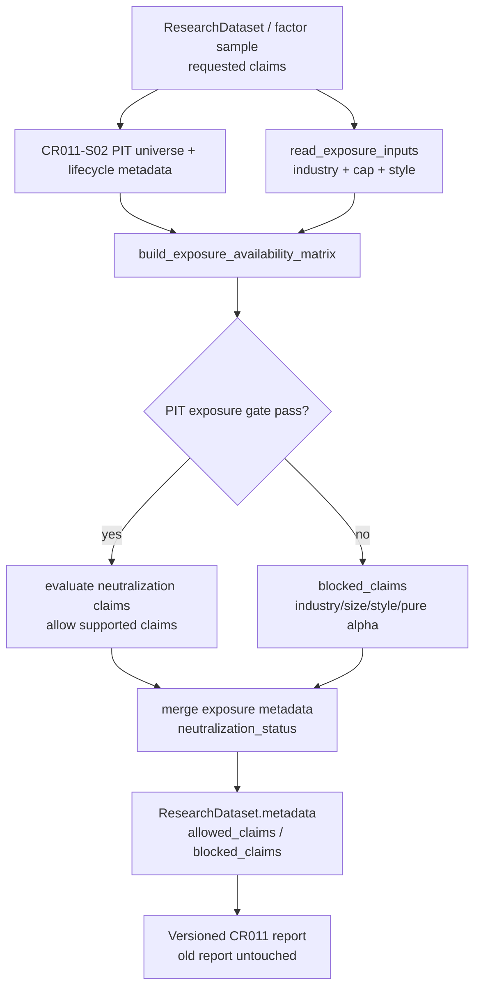

# LLD: CR011-S06 - 行业 / 市值 / 风格暴露

> 本文档仅覆盖 `CR011-S06-industry-market-cap-style-exposure-data` 的 Story 级低层设计。`CR011-DATA-BATCH-A` CP5 已于 2026-05-24T10:24:02+08:00 获用户批准，本文档可作为实现输入；该批准不授权真实联网、读取凭据、写真实 lake、操作旧 `data/**` 或覆盖旧 `reports/experiment_17_21/factor_strategy_report.md`。缺行业 / 市值 / 风格 source 时，中性化与 pure alpha 声明必须 blocked。

修订记录：

| 版本 | 日期 | 修订人 | 变更要点 |
|---|---|---|---|
| 1.0 | 2026-05-24 | meta-dev | 基于 CR-011 CP3 approved、CP4 PASS、Story 卡片、CR008-S06 confirmed LLD、CR011-S02 ready-for-review LLD 和 lld-designer 模板创建 S06 LLD；限定 S06 为 exposure availability、PIT as-of 校验和 neutralization claims 门禁设计，明确 CP5 前不得实现 |

## 1. Goal

修改 `market_data/readers.py` 与 `engine/research_dataset.py` 的只读研究输入合同，并创建 `tests/test_cr011_exposure_claims.py`，使新版因子研究在声明行业中性、市值中性、风格中性或 pure alpha 之前，必须具备 PIT 行业分类、市值、流通市值和 beta/style exposure availability；缺任一对应 exposure、缺 effective/available_at、存在 as-of 违规、只有当前快照或上游 PIT universe gate 未通过时，相关中性化 / pure alpha / size / 市值加权 IC 声明必须进入 `blocked_claims`，对应强声明输出次数为 0。

本 Story 不实现完整风险模型平台，不生产真实行业 / 市值 / 风格数据，不使用当前快照证明 PIT exposure，不覆盖旧实验 17-21 报告。

## 2. Requirements（Functional / Non-Functional）

### 2.1 Functional

- 扩展 `market_data.readers` 的只读 exposure reader contract，使其能按 exact capability 返回 `industry_classification`、`market_cap`、`float_market_cap`、`style_exposure` 的 availability、coverage、lineage、missing reason 和 remediation；reader 不触发 backfill、不导入 connector/runtime/storage、不读取 env/token。
- 复用 CR008-S06 已冻结的 `auxiliary_availability`、`allowed_claims`、`blocked_claims` 和 `known_limitations` 语义；S06 只把行业 / 市值 / 风格暴露升级为 CR-011 的 PIT as-of exposure 合同，不创建第二套 claims 系统。
- 复用 CR011-S02 的 PIT universe gate 与 lifecycle contract；`production_strict` 中若 `universe_mode`、`is_pit_universe`、`pit_status`、`as_of_join_violation_count` 或 `lifecycle_status` 未通过，则 S06 不允许 PIT exposure 支撑强中性化声明。
- `industry_classification` 必须具备 `symbol`、`effective_date`、`available_at`、`classification_standard`、`industry_code` 或 `industry_name`、`pit_status` 或明确 `missing_reason`。
- `market_cap` 必须具备 `trade_date`、`symbol`、`market_cap`、`float_market_cap`、`available_at`、lineage 或明确 `missing_reason`；仅市值或仅流通市值可用于披露 availability，但不得支撑完整 size / 市值中性声明。
- `style_exposure` 必须具备 `trade_date`、`symbol`、`style_factor`、`exposure_value`、`model_version`、`available_at`、lineage 或明确 `missing_reason`；默认至少区分 `beta` 与请求的 style factor 集合。
- 当前快照、缺 `effective_date`、缺 `available_at`、`available_at > decision_time`、`effective_date > decision_time`、`pit_status != pass|pit_available|available` 均不得证明 PIT exposure。
- 缺行业数据时，行业中性、行业归因、行业内 z-score、分行业 IC 和 `industry_neutral_ic` 声明输出次数必须为 0。
- 缺市值或流通市值时，size neutral、市值中性、市值加权 IC、容量相关强结论和 `market_cap_neutral_ic` 声明输出次数必须为 0。
- 缺 beta/style exposure 时，pure alpha、style neutral、risk-model-adjusted alpha 和 `style_neutral_ic` 声明输出次数必须为 0。
- 若下游已提供 raw IC 或 neutralized IC 值，S06 只验证该指标对应 exposure availability 是否允许展示；若未提供中性化指标，S06 不伪造或计算完整风险模型指标，而是输出 metric missing / blocked claim。

### 2.2 Non-Functional

- 默认验证入口必须离线：`uv run --python 3.11 pytest -q tests/test_cr011_exposure_claims.py`。
- 默认路径 `network_calls=0`、`lake_writes=0`、`credential_reads=0`、`legacy_data_operations=0`。
- 不读取、列出、迁移、复制、比对或删除旧 `data/**`；不读取或覆盖 `reports/experiment_17_21/factor_strategy_report.md`。
- 不读取 `.env`，不打印 token、用户名、密码、NAS 凭据或真实私有路径。
- 不导入 `market_data.connectors`、`market_data.runtime`、`market_data.storage`、真实 provider SDK、联网库或自动补数入口。
- CP5 批次人工确认 approved 前不得实现；当前 LLD 只作为 `CR011-DATA-BATCH-A` 的待审查设计输入。

## 3. 模块拆分与职责

| 模块 / 文件组 | 职责 | 说明 |
|---|---|---|
| `market_data/readers.py` | 暴露只读 exposure reader contract，返回行业、市值、流通市值、style exposure 的 `ReaderResult` / typed missing / missing reason / lineage / remediation | 修改范围仅限只读 reader；不得触发生产 CLI、connector、runtime、storage、真实 source 或 lake 写入。 |
| `engine/research_dataset.py` | 在 `build_research_dataset` 或等价研究输入聚合路径中构建 exposure availability matrix、PIT as-of exposure gate、neutralization status、allowed / blocked claims 和 metadata 合并 | 复用 CR008-S06 claims 合同与 CR011-S02 PIT/lifecycle metadata；不创建完整风险模型平台，不覆盖上游 gate。 |
| `tests/test_cr011_exposure_claims.py` | S06 专属离线测试，覆盖 PIT exposure available、行业缺失、市值/流通市值缺失、style 缺失、当前快照阻断、as-of 违规、上游 PIT gate 未通过、安全边界 | 使用 in-memory DataFrame、fake reader result、tmp_path sentinel；不得依赖真实 lake、旧 data、旧报告、凭据或网络。 |
| `process/stories/CR008-S06-factor-research-auxiliary-data-contract-LLD.md`（只读依赖） | 提供 auxiliary availability、allowed / blocked claims、known limitations 和 missing reason 合同 | 当前为 confirmed；S06 必须扩展而非替换该合同。 |
| `process/stories/CR011-S02-pit-universe-and-stock-lifecycle-completion-LLD.md`（只读依赖） | 提供 PIT universe、as-of join、lifecycle gate 和 fixed snapshot 降级语义 | 当前为 ready-for-review / confirmed=false；S06 LLD 可消费其设计，开发仍需等待 DATA-BATCH-A CP5 approved。 |

## 4. 代码结构与文件影响范围

| 动作 | 文件路径 | 变更内容 |
|---|---|---|
| 修改 | `market_data/readers.py` | 新增 `ExposureInputRequest` / `read_exposure_inputs()` 或等价只读 helper；按 exact capability 读取或接收 `industry_classification`、`market_cap`、`style_exposure` reader result；返回 typed status、required columns、observed columns、coverage、lineage、missing reason、remediation `auto_execute=false`；保持 no engine import / no connector import。 |
| 修改 | `engine/research_dataset.py` | 新增 `ExposureAvailabilityEntry` / `ExposureAvailabilityMatrix` / `NeutralizationClaimGateResult` 或等价 JSON-safe dict；新增 `build_exposure_availability_matrix()`、`evaluate_neutralization_claims()`、`merge_exposure_claims_into_metadata()`；将 `industry_availability`、`market_cap_availability`、`float_market_cap`、`style_exposure_availability`、`neutralization_status`、`raw_ic`、`industry_neutral_ic`、`market_cap_neutral_ic`、`style_neutral_ic` 和 blocked claims 写入 metadata。 |
| 创建 | `tests/test_cr011_exposure_claims.py` | 创建 S06 定向测试，覆盖接口、错误路径、as-of 规则、当前快照阻断、上游 PIT gate 继承、CR008 claims 合并、安全边界和 Story 验收标准。 |

禁止修改：`market_data/connectors/**`、`market_data/runtime.py`、`market_data/storage.py`、`data/**`、`.env`、`reports/experiment_17_21/factor_strategy_report.md`、`delivery/**`、`process/HLD.md`、`process/HLD-DATA-LAKE.md`、`process/ARCHITECTURE-DECISION.md`、`process/REQUIREMENTS.md`、`process/STORY-BACKLOG.md`、`process/DEVELOPMENT-PLAN.yaml`、`process/checks/**`、`checkpoints/**`。

## 5. 数据模型与持久化设计

无新增数据库、无新增 lake dataset、无新增真实外部持久化。本 Story 只消费已发布 catalog / reader result 或测试 fixture，并新增内存 metadata / gate result 合同。真实行业 / 市值 / 风格数据生产不在本 Story 范围内。

| 对象 / 字段 | 类型 | 约束 | 说明 |
|---|---|---|---|
| `industry_classification.symbol` | `str` | 必填 | 与 factor sample / PIT universe symbol exact 对齐；不做模糊匹配。 |
| `industry_classification.effective_date` | `date` | PIT 必填 | 必须满足 `effective_date <= decision_time`；缺失或未来生效阻断 PIT exposure。 |
| `industry_classification.available_at` | `timestamp/date` | PIT 必填 | 必须满足 `available_at <= decision_time`；缺失或未来可得阻断 PIT exposure。 |
| `industry_classification.classification_standard` | `str` | 必填 | 如申万、中信或其他 exact 标准；未知标准不能支撑行业归因。 |
| `industry_classification.industry_code` / `industry_name` | `str` | 至少一个必填 | 行业中性和行业归因的最小分类字段。 |
| `industry_classification.pit_status` | `str` | `pass` / `pit_available` / `available` 视为通过 | `snapshot`、`non_pit_snapshot`、`pit_incomplete`、`required_missing` 均阻断。 |
| `market_cap.trade_date` | `date` | 必填 | 按 decision date 或可审计 as-of 日期对齐。 |
| `market_cap.symbol` | `str` | 必填 | 与 factor sample / PIT universe symbol exact 对齐。 |
| `market_cap.market_cap` | `float` | size claim 必填 | 缺失阻断 `market_cap_neutral_ic`、`size_neutral`、市值加权 IC。 |
| `market_cap.float_market_cap` | `float` | size / capacity 强声明必填 | 缺失阻断流通市值相关声明和容量相关严肃结论。 |
| `market_cap.available_at` | `timestamp/date` | PIT / production_strict 必填 | 当前快照或 future availability 不得支撑历史市值中性。 |
| `style_exposure.trade_date` | `date` | 必填 | 与 factor sample date exact 或 as-of 对齐。 |
| `style_exposure.symbol` | `str` | 必填 | 与 factor sample / PIT universe symbol exact 对齐。 |
| `style_exposure.style_factor` | `str` | 必填 | 至少支持 `beta` 与请求的 style factor 集合；未知 factor 不默认可用。 |
| `style_exposure.exposure_value` | `float` | 必填 | 缺失阻断对应 style claim。 |
| `style_exposure.model_version` | `str` | pure alpha / risk model claim 必填 | 无模型版本不得声明 risk-model-adjusted alpha。 |
| `style_exposure.available_at` | `timestamp/date` | PIT / production_strict 必填 | future availability 阻断。 |
| `ExposureAvailabilityEntry.capability` | `str` | exact key：`industry_classification`、`market_cap`、`float_market_cap`、`style_exposure` | 进入 `metadata["exposure_availability"]` 与 CR008 `auxiliary_availability`。 |
| `ExposureAvailabilityEntry.status` | `str` | `available`、`partial`、`required_missing`、`source_unresolved`、`quality_failed`、`pit_incomplete`、`blocked_non_pit` | 非 `available` 不得支撑对应强声明。 |
| `ExposureAvailabilityEntry.coverage_ratio` | `float` | 0.0 到 1.0 | denominator 为 factor sample 或 S02 PIT universe sample；强中性化声明要求 1.0。 |
| `ExposureAvailabilityEntry.missing_rate` | `float` | 0.0 到 1.0 | 报告 metadata 必填；缺 exposure 时用于解释样本损失。 |
| `ExposureAvailabilityEntry.as_of_join_violation_count` | `int` | `production_strict` 必须为 0 | 统计 effective / available_at future violation。 |
| `NeutralizationClaimGateResult.neutralization_status` | `str` | `pass`、`blocked_missing_industry`、`blocked_missing_market_cap`、`blocked_missing_style`、`blocked_non_pit`、`metric_missing` | 统一进入报告 metadata。 |
| `NeutralizationClaimGateResult.raw_ic` | `float | null` | 可从下游 factor result 透传 | S06 不伪造 raw IC。 |
| `NeutralizationClaimGateResult.industry_neutral_ic` | `float | null` | 仅行业 exposure available 且下游提供时可展示 | 否则为空并 blocked。 |
| `NeutralizationClaimGateResult.market_cap_neutral_ic` | `float | null` | 仅 market cap / float cap available 且下游提供时可展示 | 否则为空并 blocked。 |
| `NeutralizationClaimGateResult.style_neutral_ic` | `float | null` | 仅 style exposure available 且下游提供时可展示 | 否则为空并 blocked。 |
| `blocked_claims[]` | `list[dict]` | 每项至少含 `claim`、`missing_capability`、`reason`、`severity`、`source_story` | 复用 CR008-S06 机器可断言格式。 |

## 6. API / Interface 设计

| 接口 / 入口 | 输入 | 输出 | 调用方 | 说明 |
|---|---|---|---|---|
| `market_data.readers.read_exposure_inputs(request)`（新增或等价 helper） | lake_root、symbols、start/end、decision calendar、capabilities、quality_policy、pit_required | `dict[str, ReaderResult]` 或等价 typed result，含 availability、lineage、missing reason、remediation | `engine.research_dataset` | 只读 exact dataset / reader result；未知或未发布 source 返回 `source_unresolved` / `required_missing`，不触发补数；T01、T05、T07、T09 覆盖。 |
| `ExposureInputRequest`（新增或等价 dict） | `symbols`、`dates`、`capabilities`、`classification_standard`、`style_factors`、`quality_policy`、`pit_required` | immutable request / JSON-safe dict | tests / research dataset builder | `lake_root=None` 不触发 env fallback；capability 必须 exact；T07、T09 覆盖。 |
| `build_exposure_availability_matrix(reader_results, factor_sample, *, universe_metadata, decision_time)` | reader results、factor sample index、S02 universe/lifecycle metadata、decision time | `ExposureAvailabilityMatrix` / JSON-safe dict | `build_research_dataset` | 计算 coverage、missing_rate、as-of violation、PIT status；T01-T06、T10、T11 覆盖。 |
| `evaluate_neutralization_claims(exposure_matrix, requested_claims, *, factor_metrics=None, research_mode="exploratory")` | exposure matrix、requested claims、可选 raw/neutralized metrics、research mode | `NeutralizationClaimGateResult`、allowed / blocked claims | report metadata / 实验 17-21 v2 / tests | 非 available capability 的 claim 一律 blocked；不计算完整风险模型；T01-T04、T08、T11 覆盖。 |
| `merge_exposure_claims_into_metadata(metadata, gate_result)` | S01/S03/S06 metadata、gate result | JSON-safe metadata dict | report builder / tests | 合并 `exposure_availability`、`auxiliary_availability`、`neutralization_status`、`allowed_claims`、`blocked_claims`、`known_limitations`；不覆盖 benchmark / PIT / tradability / adjustment 字段；T08 覆盖。 |
| `build_research_dataset(...)` metadata output | `ResearchDatasetRequest`、reader results、factor sample、upstream gate metadata | `ResearchDataset` with exposure metadata / claims | CR011-S08 / 实验 17-21 v2 | production_strict 缺 PIT exposure 时返回 gate failed 或 blocked claims；T01-T11 覆盖。 |

错误 / 限制暴露：

- `industry_missing`：行业分类缺失、字段缺失、coverage 不完整或 source unresolved。
- `market_cap_missing`：市值或流通市值缺失、字段缺失、coverage 不完整或 source unresolved。
- `style_exposure_missing`：beta/style exposure 缺失、style factor 不完整、模型版本缺失或 source unresolved。
- `current_snapshot_not_pit_exposure`：当前行业 / 市值 / 风格快照不得支撑 PIT exposure。
- `as_of_join_violation`：`available_at > decision_time` 或 `effective_date > decision_time`。
- `pit_universe_gate_not_passed`：CR011-S02 PIT/lifecycle gate 未通过，S06 不允许 PIT exposure 强声明。
- `neutralization_metric_missing`：exposure available 但下游未提供对应 neutralized metric 时，不伪造指标。
- `blocked_claim_requested`：报告请求声明被 blocked 的 claim；默认写入 blocked claims，strict 模式可使 gate fail。

本节每个接口条目在第 10 节均有对应测试。

## 7. 核心处理流程

1. `build_research_dataset(...)` 或实验 17-21 v2 adapter 获取 factor sample、requested claims、CR011-S02 universe/lifecycle metadata 和已有 CR008 auxiliary metadata。
2. S06 构造 `ExposureInputRequest`，请求 `industry_classification`、`market_cap`、`float_market_cap`、`style_exposure`；reader 只返回 typed result，不执行 backfill、publish、真实 source 或 env fallback。
3. `build_exposure_availability_matrix(...)` 对每个 capability 执行字段、coverage、lineage、PIT status 和 as-of 校验：
   - 行业分类按 `symbol + effective_date` 选择 `effective_date <= decision_time` 且 `available_at <= decision_time` 的最新记录。
   - 市值 / 流通市值按 `symbol + trade_date` 或明确 as-of date 对齐，并要求 `available_at <= decision_time`。
   - style exposure 按 `symbol + trade_date + style_factor` 对齐，并要求请求的 style factor 集合完整。
   - 任一 current snapshot、缺 available_at、future availability 或 PIT incomplete 均标为 blocked。
4. 若 CR011-S02 的 `is_pit_universe`、`pit_status`、`as_of_join_violation_count` 或 `lifecycle_status` 未通过，S06 将 exposure claims 标为 `blocked_non_pit`；不使用 exposure 数据绕过上游 PIT/lifecycle gate。
5. `evaluate_neutralization_claims(...)` 根据 requested claims 和 availability matrix 生成 allowed / blocked claims：
   - 行业缺失阻断 `industry_neutral_ic`、`industry_neutral`、`industry_attribution`、`industry_group_ic`。
   - 市值 / 流通市值缺失阻断 `market_cap_neutral_ic`、`market_cap_neutral`、`size_neutral`、`market_cap_weighted_ic`、容量相关 size 声明。
   - style exposure 缺失阻断 `style_neutral_ic`、`style_neutral`、`pure_alpha`、`risk_model_adjusted_alpha`。
6. 若 `factor_metrics` 已提供 raw / neutralized IC，S06 仅在对应 exposure gate pass 时允许 metadata 展示；若未提供中性化指标，写 `neutralization_metric_missing`，不计算完整风险模型。
7. `merge_exposure_claims_into_metadata(...)` 将 `industry_availability`、`market_cap_availability`、`float_market_cap`、`style_exposure_availability`、`neutralization_status`、`allowed_claims`、`blocked_claims` 和 `known_limitations` 合并到 `ResearchDataset.metadata`。
8. 下游报告只能从 `allowed_claims` 生成强结论；`blocked_claims` 对应的行业中性、市值中性、风格中性、pure alpha 文案输出次数必须为 0。



异常路径：

- S02 LLD / CR011-DATA-BATCH-A CP5 未确认且进入实现：停止实现，回到 CP5 批次确认，不自行推断字段。
- exposure dataset 未登记或未发布：返回 `source_unresolved` / `required_missing`，remediation `auto_execute=false`。
- required columns 不完整：返回 `partial` 或 `required_missing`，blocked 依赖该列的 claims。
- current snapshot：返回 `current_snapshot_not_pit_exposure`，生产级中性化 claims 输出 0。
- as-of 违规：`as_of_join_violation_count > 0`，production_strict fail 或对应 claims blocked。
- 上游 PIT universe / lifecycle gate fail：S06 不放宽上游 failure，只合并 blocked claims。
- 发现旧 `data/**`、旧实验 17-21 报告、凭据或 connector/runtime/storage import：测试失败，阻断实现交付。

## 8. 技术设计细节

- 关键算法 / 规则：
  - availability 状态优先级：`quality_failed` > `source_unresolved` > `required_missing` > `blocked_non_pit` > `pit_incomplete` > `as_of_join_violation` > `partial` > `available`。任何非 `available` 且支撑强 claim 的 capability 都必须生成 blocked claim。
  - 强中性化声明覆盖率规则：对应 exposure 的 `coverage_ratio` 必须为 `1.0`、`missing_rate=0.0`、`as_of_join_violation_count=0`、`pit_status in pass|pit_available|available`；否则该声明 blocked。
  - as-of 规则：所有参与决策 exposure 字段必须满足 `available_at <= decision_time`；行业分类还必须满足 `effective_date <= decision_time`；市值与 style exposure 必须满足 `trade_date <= decision_date` 或等价已确认 as-of 规则。
  - current snapshot 规则：缺 `effective_date` / `available_at` / `pit_status` 的行业、市值、风格记录只能作为 descriptive snapshot，不支撑 PIT exposure。
  - style factor 规则：`pure_alpha` / `risk_model_adjusted_alpha` 至少要求 `beta`、`size` 和 requested style factor 集合完整；缺 `model_version` 时不得声明风险模型调整。
  - metrics 规则：S06 不计算完整风险模型 residual；只校验下游提供的 `industry_neutral_ic`、`market_cap_neutral_ic`、`style_neutral_ic` 是否可展示，并在缺指标时写 `neutralization_metric_missing`。
  - blocked claims 去重：按 `claim + missing_capability + reason` ordered unique 合并，避免 CR008-S06 与 CR011-S06 重复写同一 claim。

| capability | 最小输入 / 字段 | available 时允许的 claims | missing / partial / failed 时必须 blocked 的 claims |
|---|---|---|---|
| `industry_classification` | `symbol`、`effective_date`、`available_at`、`classification_standard`、`industry_code/name`、`pit_status` | `industry_neutral_ic`、`industry_neutral`、`industry_attribution`、`industry_group_ic` | `industry_neutral_ic`、`industry_neutral`、`industry_attribution`、`industry_zscore`、`industry_group_ic` |
| `market_cap` | `trade_date`、`symbol`、`market_cap`、`available_at`、lineage | `market_cap_neutral_ic`、`size_neutral` 的 market cap 部分 | `market_cap_neutral_ic`、`market_cap_neutral`、`size_neutral`、`market_cap_weighted_ic` |
| `float_market_cap` | `trade_date`、`symbol`、`float_market_cap`、`available_at`、lineage | `size_neutral`、容量相关 size 部分 | `float_cap_neutral`、`capacity_size_supported`、`market_cap_weighted_ic` |
| `style_exposure` | `trade_date`、`symbol`、`style_factor`、`exposure_value`、`model_version`、`available_at` | `style_neutral_ic`、`style_neutral`、`pure_alpha`、`risk_model_adjusted_alpha` | `style_neutral_ic`、`style_neutral`、`pure_alpha`、`risk_model_adjusted_alpha` |
| `pit_universe` | S02 `is_pit_universe=true`、`pit_status=pass|pit_available`、`as_of_join_violation_count=0`、`lifecycle_status=pass` | `pit_exposure_research`、`survivorship_bias_controlled` | `pit_exposure_research`、`survivorship_bias_controlled`、所有 PIT exposure 强声明 |

- 依赖选择与复用点：
  - 复用 CR008-S06 `auxiliary_availability` / `allowed_claims` / `blocked_claims` / `known_limitations` 格式。
  - 复用 CR011-S02 `universe_mode`、`is_pit_universe`、`pit_status`、`as_of_join_violation_count`、`lifecycle_status` 和 fixed snapshot 降级语义。
  - 复用 `market_data.readers.ReaderResult`、quality policy、typed remediation `auto_execute=false` 语义。
  - 复用 `engine.research_dataset` 作为研究输入聚合点；不新建第二套 exposure engine。
- 兼容性处理：
  - 若 `read_auxiliary_inputs()` 已由 CR008-S06 实现，S06 可在其基础上新增 exposure capability adapter，不重复创建同义 API。
  - 若 CR011-S02 confirmed LLD 最终字段名与本文草案不同，S06 实现前必须按 confirmed 合同调整，不得自由推断。
  - 若真实行业 / 市值 / 风格 source/interface 尚未确认，reader 必须返回 `source_unresolved` / `required_missing`，不得把空表、fixture 或 current snapshot 声明为 available。
  - 若下游 CR011-S08 报告需要展示 neutralized IC，必须消费本 Story metadata；不得绕过 `blocked_claims` 直接生成强文案。
- 图示类型选择：流程图。该 Story 涉及 reader、research dataset、CR008 claims、CR011-S02 PIT gate 和多条 missing / blocked claim 分支，流程图能明确失败路径。

## 9. 安全与性能设计

| 维度 | 设计措施 | 验证方式 |
|---|---|---|
| 安全 | reader 和 engine 只消费显式传入的 fake reader result / lake_root；默认测试不读取 `.env` | T09 monkeypatch env / path sentinel |
| 安全 | 禁止导入 `market_data.connectors`、`market_data.runtime`、`market_data.storage`、联网库或 provider SDK | T09 AST import scan |
| 安全 | remediation spec 固定 `auto_execute=false`，只描述人工补齐动作 | T07 / T09 断言 |
| 安全 | 不读取、列出或操作旧 `data/**`；不读取或覆盖旧实验 17-21 报告 | T09 path / open sentinel |
| 安全 | `blocked_claims`、`known_limitations`、metadata 只写字段、状态、缺失原因、脱敏 lineage label，不写 token、真实私有路径或样本明细 | T08 / T09 输出扫描 |
| 性能 | exposure matrix 以 factor sample index 和 capability 列集合做向量化/集合校验；不建立服务、缓存或重型风险模型 | T01-T06 小 fixture 验证 |
| 性能 | as-of 校验按 capability 分组后选择最新可用记录，避免在测试中引入复杂 join engine | T05 / T06 断言 count 和状态 |
| 一致性 | CR008 auxiliary claims 与 CR011 exposure claims ordered unique 合并 | T08 断言无重复 claim |
| 可维护 | 每个 exposure capability 的 required columns 与 blocked claims 显式表驱动 | T01-T04 覆盖字段缺失与声明阻断 |

## 10. 测试设计

验证入口：`uv run --python 3.11 pytest -q tests/test_cr011_exposure_claims.py`

| 测试场景 | 前置条件 | 操作 | 预期结果 | 验证方式 |
|---|---|---|---|---|
| T01 PIT exposure 全部可用 | fake reader 返回 PIT industry、market_cap、float_market_cap、style_exposure；S02 metadata 为 PIT pass；factor metrics 含 raw / neutral IC | 调用 `build_research_dataset` 或 exposure helper | `industry_availability.status=available`；`market_cap_availability.status=available`；`style_exposure_availability.status=available`；`neutralization_status=pass`；对应 claims allowed | pytest |
| T02 缺行业阻断行业声明 | industry reader missing 或缺 `effective_date/available_at` | 调用 exposure matrix 和 claims gate | `blocked_claims` 含 `industry_neutral_ic` / `industry_neutral`；行业中性声明输出次数为 0；`missing_reason` 非空 | pytest |
| T03 缺市值 / 流通市值阻断 size 声明 | market cap 缺 `market_cap` 或 `float_market_cap` | 调用 claims gate，请求 size / market-cap claims | `market_cap_neutral_ic`、`size_neutral`、`market_cap_weighted_ic` blocked；容量相关 size claim blocked | pytest |
| T04 缺 style exposure 阻断 pure alpha | style exposure missing、缺 `beta`、缺 requested style factor 或缺 `model_version` | 调用 claims gate，请求 pure alpha / style neutral | `pure_alpha`、`style_neutral_ic`、`risk_model_adjusted_alpha` blocked；allowed 不含 pure alpha | pytest |
| T05 当前快照不证明 PIT exposure | exposure rows 缺 `effective_date` / `available_at` 或 `pit_status=non_pit_snapshot` | 调用 exposure matrix | issue 含 `current_snapshot_not_pit_exposure`；production_strict 强 claims 全 blocked | pytest |
| T06 as-of 违规阻断 | `available_at > decision_time` 或 `effective_date > decision_time` | 调用 exposure matrix | `as_of_join_violation_count > 0`；production_strict fail 或 claims blocked；remediation `auto_execute=false` | pytest |
| T07 reader helper typed missing | unknown dataset/source unresolved fixture | 调用 `read_exposure_inputs()` | 返回 `source_unresolved` / `required_missing`，不触发 fetch/backfill，missing reason 可机器解析 | pytest |
| T08 CR008 claims 合并不重复 | 传入已有 CR008 auxiliary blocked claims 与 S06 exposure blocked claims | 调用 `merge_exposure_claims_into_metadata()` | `allowed_claims` / `blocked_claims` ordered unique；`known_limitations` 覆盖全部 blocked reasons | pytest |
| T09 forbidden boundary | 设置 fake token env、旧 data/report sentinel、无真实 lake | AST scan + helper 局部调用 | connector/runtime/storage/network imports 为 0；credential reads 为 0；legacy data/report 操作为 0；lake writes 为 0 | pytest |
| T10 上游 PIT gate 未通过 | S02 metadata 为 fixed snapshot、`pit_status` fail 或 `lifecycle_status` fail | 调用 exposure matrix / claims gate | 即使 exposure fixture 有值，也输出 `pit_universe_gate_not_passed`；PIT exposure 强声明 blocked | pytest |
| T11 exposure 部分 coverage | exposure coverage < 1.0 或 missing_rate > 0 | 调用 claims gate | metadata 写 coverage/missing_rate；对应强 neutralization claims blocked；raw factor performance 可保留探索声明 | pytest |

接口到测试映射：

| 第 6 节接口 | 对应测试 |
|---|---|
| `read_exposure_inputs(...)` | T01、T05、T06、T07、T09 |
| `ExposureInputRequest` | T07、T09 |
| `build_exposure_availability_matrix(...)` | T01-T07、T10、T11 |
| `evaluate_neutralization_claims(...)` | T01-T06、T08、T10、T11 |
| `merge_exposure_claims_into_metadata(...)` | T08、T09 |
| `build_research_dataset(...)` metadata output | T01、T02、T03、T04、T09、T10、T11 |

异常路径到测试映射：

| 第 7 节异常路径 | 对应测试 |
|---|---|
| exposure dataset 未登记 / 未发布 | T07 |
| required columns 不完整 | T02、T03、T04 |
| current snapshot 不证明 PIT exposure | T05 |
| as-of 违规 | T06 |
| 上游 PIT / lifecycle gate fail | T10 |
| partial coverage | T11 |
| CR008 / CR011 claims 合并重复 | T08 |
| forbidden import / credential / old data / old report | T09 |

## 11. 实施步骤

| TASK-ID | 动作 | 目标文件 | 详细描述 | 对应测试 |
|---|---|---|---|---|
| CR011-S06-T1 | 修改 | `market_data/readers.py` | 新增/扩展 exposure reader contract：支持 `industry_classification`、`market_cap`、`float_market_cap`、`style_exposure` capability；输出 typed missing / source unresolved / required columns / lineage / coverage / remediation `auto_execute=false`；保持 no connector/runtime/storage import | T01、T05、T06、T07、T09 |
| CR011-S06-T2 | 修改 | `engine/research_dataset.py` | 新增 exposure availability matrix、PIT as-of exposure gate、neutralization claims gate、metadata merge；复用 CR008 auxiliary claims 与 CR011-S02 universe/lifecycle metadata；缺 exposure 时阻断行业 / 市值 / 风格 / pure alpha 声明 | T01-T06、T08、T10、T11 |
| CR011-S06-T3 | 创建 | `tests/test_cr011_exposure_claims.py` | 使用 fake reader / in-memory DataFrame / tmp_path sentinel 覆盖 PIT exposure available、缺行业、缺市值、缺 style、current snapshot、as-of 违规、typed missing、claims 合并、安全边界、上游 PIT gate 和 partial coverage | T01-T11 |

每个文件影响项至少被一个 TASK-ID 覆盖；每个 TASK-ID 都有对应测试入口。实现阶段必须按 T1 -> T3 顺序推进，并在实现前确认 `CR011-DATA-BATCH-A` CP5 approved、当前 LLD `confirmed=true`、CR011-S02 合同已冻结、文件所有权无并行冲突。

## 12. 风险、难点与预研建议

| 风险 / 难点 | 影响 | 缓解措施 / 预研建议 |
|---|---|---|
| Story 卡片 frontmatter 仍为 `status=draft` 且 `lld_gate.status=not-started`，但 STATE 与 CP4 后补核对允许 S06 进入 LLD 起草 | 流程状态存在未回写不一致 | 本 LLD 记录为 ready-for-review；Story 状态更新需由 meta-po 在允许文件范围外处理。 |
| `CR011-DATA-BATCH-A` CP5 尚未 approved | 不得实现代码、测试或业务产物 | 本 LLD `confirmed=false` / `implementation_allowed=false`；CP5 前只作为设计输入。 |
| CR011-S02 LLD 尚未 confirmed | S06 依赖的 PIT/lifecycle 字段可能随 CP5 修订 | 实现前以 confirmed 版 S02 合同为准；若字段冲突，修订 S06 LLD 后重提 CP5。 |
| 行业 / 市值 / 风格 exact source/interface 未冻结 | 不能声明 production exposure available | reader 默认返回 `source_unresolved` / `required_missing`；不把当前快照、空表或 fixture 标为 available。 |
| neutralized IC 计算可能被误解为完整风险模型 | Scope 膨胀到风险模型平台 | S06 只做 availability 与 claims gate；只校验下游已提供指标是否可展示，不实现完整 residualization / Barra-like risk model。 |
| `engine/research_dataset.py` 和 `market_data/readers.py` 被 DATA-BATCH-A 多个 Story 共享 | 并行开发易覆盖其他 Story 修改 | CP5 approved 后仍需 meta-po 按 file ownership 判定；共享文件默认不得并行开发。 |
| blocked claims enum 与报告文案漂移 | QA 难以断言强声明是否被阻断 | 使用 exact enum 作为机器断言源；Markdown/报告文案只能从 allowed claims 生成，测试扫描禁止短语。 |

### OPEN / Spike 跟踪

| ID | 类型（OPEN / Spike） | 问题 | 下一动作 | 责任方 |
|---|---|---|---|---|
| O-01 | OPEN | `CR011-DATA-BATCH-A` CP5 尚未 approved，本 LLD confirmed=false，不得实现 | meta-po 收齐 S01..S06 LLD 与 CP5 自动预检后发起批次人工确认 | meta-po / user |
| O-02 | OPEN | 当前 Story 卡片 frontmatter 仍为 `status=draft` 且 `lld_gate.status=not-started`，但 STATE / CP4 后补核对允许进入 LLD 起草 | 本 LLD 不修改 Story 卡片；由 meta-po 在允许范围外更新 Story 生命周期状态 | meta-po |
| O-03 | OPEN | CR011-S02 PIT universe / lifecycle LLD 尚未 confirmed，S06 只能消费 ready-for-review 合同 | CP5-A 聚合时统一确认 S02/S06 字段；实现前以 confirmed 版 S02 为准 | meta-po / CR011-S02 meta-dev / 本 Story meta-dev |
| O-04 | Spike | 行业 / 市值 / 风格 exact source/interface 与真实生产路径未冻结 | 后续若需要真实 provider 或真实 lake 数据生产，另走 CR / LLD / CP5；S06 当前只输出 source_unresolved / blocked claims | meta-se / meta-po / user |

## 13. 回滚与发布策略

- 发布方式：后续实现仅作为 CR011-S06 的离线研究输入 gate 增量发布；必须在 `CR011-DATA-BATCH-A` CP5 approved、当前 LLD confirmed、依赖合同冻结且文件无冲突后才可开始编码。
- 回滚触发条件：
  - 缺行业、市值、流通市值或 style exposure 时，对应行业中性、市值中性、风格中性或 pure alpha claim 仍出现在 `allowed_claims` 或报告强文案中。
  - 当前快照、空表、fixture 或缺 `effective_date/available_at` 的数据被标为 PIT exposure available。
  - `as_of_join_violation_count > 0` 仍允许 production_strict 中性化强声明。
  - CR011-S02 PIT / lifecycle gate fail 时，S06 仍允许 PIT exposure 强声明。
  - 实现触碰 forbidden paths、导入 connector/runtime/storage、读取凭据、写 lake、操作旧 data 或覆盖旧报告。
  - S06 覆盖 CR008-S06 / CR011-S02 已冻结 claims 或 PIT 字段语义。
- 回滚动作：
  - 回退 `market_data/readers.py` 中 S06 exposure reader 增量。
  - 回退 `engine/research_dataset.py` 中 S06 exposure availability、neutralization claims 和 metadata 合并逻辑；不得删除其他 Story 已落地合同。
  - 保留 `tests/test_cr011_exposure_claims.py` 的失败用例作为复现依据，或随 Story 回滚到 CP5 修订队列。
  - 数据回滚：无真实数据写入；tmp fixture 由 pytest 生命周期清理。不得删除、覆盖、读取或比较旧 `data/**` 与旧报告。
- 发布后验证：只运行离线 `tests/test_cr011_exposure_claims.py`；真实数据补齐、真实 provider、真实 lake smoke 需要用户另行授权，不属于本 Story 默认发布。

## 14. Definition of Done

- [ ] LLD 保持 14 个可见章节，frontmatter 含 `tier=M`、`shared_fragments`、`open_items=4`。
- [ ] `confirmed=false` 且 `CR011-DATA-BATCH-A` CP5 未 approved 时不进入实现。
- [ ] 文件影响范围只包含 `market_data/readers.py`、`engine/research_dataset.py`、`tests/test_cr011_exposure_claims.py`。
- [ ] 行业、市值、流通市值、beta/style exposure 4 类 availability 均进入报告 metadata。
- [ ] 缺行业 / 市值 / 风格时，对应行业中性、市值中性、风格中性、pure alpha 声明输出次数为 0。
- [ ] 当前快照用于证明 PIT exposure 的次数为 0。
- [ ] exposure 缺 effective/available_at 且进入 production_strict 决策的次数为 0。
- [ ] CR011-S02 PIT / lifecycle gate fail 时，S06 PIT exposure 强声明输出次数为 0。
- [ ] `blocked_claims` 每项都包含 `claim`、`missing_capability`、`reason`、`severity`、`source_story` 或等价可追溯字段。
- [ ] `known_limitations` 覆盖全部 blocked claims 的缺失原因。
- [ ] 默认验证路径 `network_calls=0`、`lake_writes=0`、`credential_reads=0`、`legacy_data_operations=0`。
- [ ] 第 6 节接口在第 10 节有对应测试。
- [ ] 第 7 节异常路径在第 10 节有对应错误路径测试。
- [ ] 第 11 节 TASK-ID 与第 4 节文件影响范围一一对应。
- [ ] OPEN / Spike 已清点：当前为 4 项。

## 人工确认区

> **CP5 - Story LLD 可实现性门**
>
> 按当前用户约束，本轮只写 LLD，不写 CP5 自动预检、不更新 Story 卡片、不追加 DEV-LOG。后续应由 meta-po / checkpoint-manager 在允许范围内为 `CR011-DATA-BATCH-A` 收齐 S01..S06 LLD、生成 CP5 自动预检与批次人工确认稿。CP5 approved、当前 Story LLD confirmed、当前 Wave 可执行且 `dev_gate` 满足前，不得实现。

**CP5 checklist 摘要**：

| # | 检查项 | 状态 | 证据 |
|---|---|---|---|
| 1 | LLD 覆盖 AC | 待检查 | 第 2 / 10 / 14 节 |
| 2 | 与 HLD / ADR 一致 | 待检查 | 第 3 / 8 / 12 节 |
| 3 | 文件影响范围明确 | 待检查 | 第 4 / 11 节 |
| 4 | 接口契约完整 | 待检查 | 第 6 节 |
| 5 | 测试与 dev_gate 可计算 | 待检查 | 第 10 / 14 节 |

**人工确认回复**：

请直接回复以下任一整行：

```text
approve
修改: <具体修改点>
reject
```

**人工审查结果回填**：

- 结论：`approved | changes_requested | rejected`
- 审查人：
- 审查时间：
- 修改意见：
- 风险接受项：
