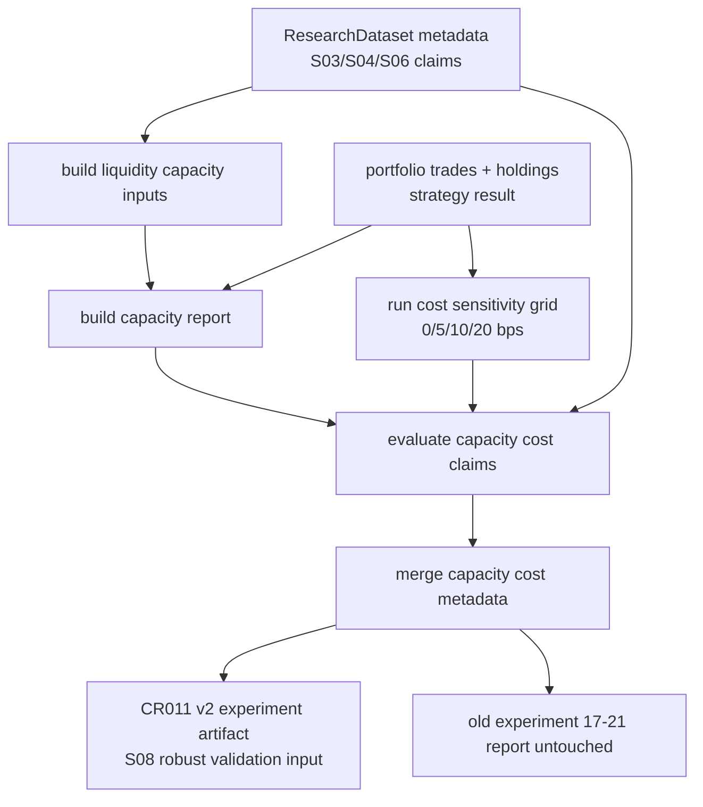

# LLD: CR011-S07 - 流动性 / 容量 / 成本敏感性

> 本文档仅覆盖 `CR011-S07-liquidity-capacity-and-cost-sensitivity` 的 Story 级低层设计。`CR011-DATA-BATCH-A` 已 verified，S03/S04/S06 上游合同已冻结；`CR011-RESEARCH-BATCH-B` 的 CP5-B 人工确认已于 2026-05-24T15:25:45+08:00 由用户 `approve`，本文档 `confirmed=true` 且 `implementation_allowed=true`，可作为后续离线实现输入。
>
> 本 Story 只设计离线研究消费侧的 liquidity / capacity / cost sensitivity 合同，不真实联网、不真实 Tushare 抓取、不写真实 lake、不读取凭据、不操作旧 `data/**`，也不覆盖旧 `reports/experiment_17_21/factor_strategy_report.md`。

修订记录：

| 版本 | 日期 | 修订人 | 变更要点 |
|---|---|---|---|
| 1.0 | 2026-05-24 | meta-dev | 基于 CR011-S07 Story、HLD §27、HLD-DATA-LAKE §14、ADR-042、S03/S04/S06 CP7 PASS 和 lld-designer 模板创建 14 章节 LLD；固定成本网格 `[0, 5, 10, 20]` bps，明确五类容量字段、缺流动性 blocked claims、单一成本点 fail 与 CP5-B 前不得实现 |

## 1. Goal

修改 `engine/research_dataset.py`、`engine/portfolio.py` 和 `experiments/run_experiment_17_21_factor_suite.py` 的离线研究消费合同，并创建 `tests/test_cr011_capacity_cost_sensitivity.py`，使新版实验 17-21 v2 在输出容量或成本相关结论前，必须消费可追溯的 amount、volume、turnover、ADV 或等价流动性输入，固定输出 `[0, 5, 10, 20]` bps 四档成本敏感性网格，并在容量报告中至少包含成交额占比、换手、持仓数、样本损失、成本侵蚀 5 类字段。

缺流动性 / 容量输入时，容量可交易声明输出次数必须为 0，并写入 `blocked_claims`；只输出单一成本点时，`cost_sensitivity_status` 必须为 `fail`，不得支撑稳健性或容量可行结论。

## 2. Requirements（Functional / Non-Functional）

### 2.1 Functional

- 固定 `cost_grid_bps=[0, 5, 10, 20]`，按 exact 顺序输出四档成本场景；不得根据历史表现自动选优、删减或重排。
- 容量报告必须结构化输出 5 类字段：成交额占比、换手、持仓数、样本损失、成本侵蚀。
- `engine.research_dataset` 必须把 liquidity / capacity 输入 availability 纳入研究 metadata，并输出 `liquidity_capacity_status`、`capacity_cost_status`、`allowed_claims`、`blocked_claims` 和 missing reason。
- `engine.portfolio` 必须提供容量和成本敏感性计算入口，基于 trades、holdings、portfolio returns、liquidity bundle 和固定成本网格输出 JSON-safe 结果。
- 缺 amount、volume、turnover、ADV 或等价 liquidity/capacity 输入时，不得声明 `capacity_tradable`、`capacity_supported`、`liquidity_screened_capacity` 或等价容量可交易 claim；相关声明输出次数为 0。
- 只提供单一成本点、缺少四档成本网格或 cost scenario 行不完整时，`cost_sensitivity_status=fail`，并写 `blocked_claims`。
- S03 tradability blocked trades、S04 execution price degradation 和 S06 exposure / size claims 不得被 S07 放宽；S07 只能合并上游 blocked claims，不能重新允许真实可成交、真实 VWAP、中性化或容量声明。
- 实验脚本只追加 CR011 v2 metadata / artifact contract，不覆盖旧实验 17-21 报告；最终版本化报告路径归 S08 / documentation 阶段消费。

### 2.2 Non-Functional

- 默认验证入口必须离线：`uv run --python 3.11 pytest -q tests/test_cr011_capacity_cost_sensitivity.py`。
- 默认验证路径 `network_calls=0`、`lake_writes=0`、`credential_reads=0`、`legacy_data_operations=0`、`old_report_overwrites=0`。
- 不读取 `.env`，不打印 token、用户名、密码、NAS 凭据、cookie、session 或真实私有路径。
- 不导入 `market_data.connectors`、`market_data.runtime`、`market_data.storage`、真实 provider SDK、联网库或自动补数入口。
- 不读取、列出、迁移、复制、比对或删除旧 `data/**`；不读取或覆盖旧 `reports/experiment_17_21/factor_strategy_report.md`。
- `confirmed=false`、CP5-B 未 approved 或 `dev_gate.implementation_allowed=false` 时不得实现。

## 3. 模块拆分与职责

| 模块 / 文件组 | 职责 | 说明 |
|---|---|---|
| `engine/research_dataset.py` | 组装 liquidity / capacity availability、missing reason、blocked claims、安全边界计数和 `ResearchDataset.metadata` 合同 | 只消费显式传入或已有 reader/catalog metadata；不得触发 provider、backfill、lake 写入或 env fallback。引用 `process/HLD-DATA-LAKE.md#14.2` 的 `liquidity_capacity_inputs` 字段契约。 |
| `engine/portfolio.py` | 提供容量报告与成本敏感性计算 helper，输出成交额占比、换手、持仓数、样本损失、成本侵蚀和四档成本场景 | 只做离线 DataFrame / dict 计算；不引入撮合系统、分钟级订单簿或完整冲击成本平台。 |
| `experiments/run_experiment_17_21_factor_suite.py` | 在新版实验 metadata 中调用容量 / 成本 helper，写入固定成本网格、capacity report、cost sensitivity status、allowed / blocked claims | 不覆盖旧报告；不把 S07 metadata 直接声明为最终生产报告，S08 负责 factor panel audit 与 robust validation 汇总。 |
| `tests/test_cr011_capacity_cost_sensitivity.py` | S07 专属离线测试，覆盖固定成本网格、五类容量字段、缺流动性 blocked claims、单一成本点 fail、旧报告隔离和安全边界 | 使用 in-memory fixture、tmp_path sentinel 和静态扫描；不依赖真实 lake、旧 data、旧报告、凭据或网络。 |
| `process/checks/CP7-CR011-S03-*-VERIFICATION-DONE.md`（只读依赖） | 证明 tradability gate matrix、blocked trades、真实可成交声明阻断语义已 verified | S07 必须消费 blocked trades，不得重新放行。 |
| `process/checks/CP7-CR011-S04-*-REVERIFY-DONE.md`（只读依赖） | 证明 execution price policy exact 四值、VWAP missing 和 close proxy degradation 语义已 verified | S07 成本分析必须保留 execution degradation metadata。 |
| `process/checks/CP7-CR011-S06-*-REVERIFY-DONE.md`（只读依赖） | 证明 exposure / float market cap availability 与 neutralization / capacity claims blocked 语义已 verified | S07 不得用容量计算覆盖 S06 的 exposure blocked claims。 |

## 4. 代码结构与文件影响范围

| 动作 | 文件路径 | 变更内容 |
|---|---|---|
| 修改 | `engine/research_dataset.py` | 新增或扩展 liquidity / capacity metadata helper：构建 `liquidity_availability`、`liquidity_capacity_status`、`capacity_cost_status`、`capacity_blocked_claims`、`capacity_allowed_claims` 和安全边界计数；缺 liquidity inputs 时写 typed missing，不声明容量可行。 |
| 修改 | `engine/portfolio.py` | 新增或扩展 `build_capacity_report()`、`run_cost_sensitivity_grid()`、`evaluate_capacity_cost_claims()` 或等价 helper；固定四档成本网格并计算成交额占比、换手、持仓数、样本损失、成本侵蚀。 |
| 修改 | `experiments/run_experiment_17_21_factor_suite.py` | 在 CR011 v2 实验路径中消费 capacity / cost helper，输出 `cost_grid_bps`、`capacity_report`、`cost_sensitivity_report`、`capacity_cost_status` 和 blocked claims metadata；旧报告路径只作为 baseline reference，不写入。 |
| 创建 | `tests/test_cr011_capacity_cost_sensitivity.py` | 创建 S07 定向测试，覆盖 Story 验收标准、异常路径、上游 blocked claims 合并和默认安全边界。 |

禁止修改：`market_data/connectors/**`、`market_data/runtime.py`、`market_data/storage.py`、`data/**`、`.env`、`reports/experiment_17_21/factor_strategy_report.md`、`delivery/**`、`process/HLD.md`、`process/HLD-DATA-LAKE.md`、`process/ARCHITECTURE-DECISION.md`、`process/STORY-BACKLOG.md`、`process/DEVELOPMENT-PLAN.yaml`、`process/STATE.md`、`process/STORY-STATUS.md`、S08 Story / LLD / 产物。

## 5. 数据模型与持久化设计

无新增数据库、无新增 lake dataset、无新增真实外部持久化。本 Story 只新增内存计算结果和实验 metadata 合同；真实 `liquidity_capacity_inputs` 数据生产由 HLD-DATA-LAKE 定义，不在 S07 中创建或写入。

| 对象 / 字段 | 类型 | 约束 | 说明 |
|---|---|---|---|
| `LiquidityCapacityInputBundle.amount` | `float | series | null` | 成交额输入，缺失时容量声明 blocked | 可来自 `execution_prices.amount` 或 `liquidity_capacity_inputs.amount`，必须保留 source / lineage。 |
| `LiquidityCapacityInputBundle.volume` | `float | series | null` | 成交量输入，缺失时 capacity status 至少 warn / blocked | 不用于静默推导真实 VWAP；S04 语义优先。 |
| `LiquidityCapacityInputBundle.turnover` | `float | series | null` | 换手率输入，缺失时换手字段写 missing reason | 容量报告 5 类字段之一。 |
| `LiquidityCapacityInputBundle.adv20` | `float | series | null` | ADV 或等价平均成交额，容量上限计算必需 | 缺失时不得声明容量可交易。 |
| `LiquidityCapacityInputBundle.participation_rate_limit` | `float | null` | 0 到 1，默认只在合同明确时使用 | 不得用模型自由推断；缺失时 capacity limit 为 unknown。 |
| `LiquidityCapacityInputBundle.lineage` | `dict` | 脱敏 source/interface/run_id/quality/readiness | 不包含 token、真实私有路径或样本明细。 |
| `LiquidityCapacityInputBundle.status` | `str` | `available`、`partial`、`required_missing`、`source_unresolved`、`quality_failed` | 非 `available` 时强容量 claim blocked。 |
| `CapacityReport.amount_participation_rate` | `float | null` | 成交额占比，交易额 / ADV 或交易额 / 当日成交额 | 五类容量字段之一。 |
| `CapacityReport.turnover` | `float | null` | portfolio turnover 或等价换手 | 五类容量字段之一。 |
| `CapacityReport.holding_count` | `int` | 持仓数，必须为非负整数 | 五类容量字段之一。 |
| `CapacityReport.sample_loss_count` | `int` | 因 liquidity/capacity 缺失或 blocked 过滤的样本数 | 五类容量字段之一。 |
| `CapacityReport.sample_loss_rate` | `float` | 0.0 到 1.0 | 与 sample_loss_count 同步输出。 |
| `CapacityReport.cost_erosion_bps` | `float | null` | 成本侵蚀 bps | 五类容量字段之一。 |
| `CapacityReport.cost_erosion_ratio` | `float | null` | 成本侵蚀 / gross return 或等价比例 | 用于解释收益是否被成本吞噬。 |
| `CostSensitivityScenario.cost_scenario_id` | `str` | `cost_0bps`、`cost_5bps`、`cost_10bps`、`cost_20bps` | exact 四档。 |
| `CostSensitivityScenario.cost_bps` | `int` | 只允许 0、5、10、20 | 非固定网格触发 fail。 |
| `CostSensitivityScenario.cost_after_return` | `float | null` | 成本后收益 | 每个场景必须输出。 |
| `CostSensitivityScenario.cost_erosion` | `float | null` | gross return 与 cost_after_return 差值或等价字段 | 用于成本侵蚀比较。 |
| `CostSensitivityReport.cost_grid_bps` | `list[int]` | 必须 exact 等于 `[0, 5, 10, 20]` | 单一成本点或缺档时 `cost_sensitivity_status=fail`。 |
| `CostSensitivityReport.cost_sensitivity_status` | `str` | `pass`、`fail`、`blocked_missing_liquidity`、`blocked_missing_trades` | 单一成本点必须 fail。 |
| `capacity_cost_status` | `str` | `pass`、`warn`、`fail`、`blocked_missing_liquidity` | 报告 metadata 顶层字段。 |
| `blocked_claims[]` | `list[dict]` | 每项至少含 `claim`、`missing_capability`、`reason`、`severity`、`source_story` | 缺流动性、缺容量、单一成本点或上游 blocked claims 均进入此列表。 |

## 6. API / Interface 设计

| 接口 / 入口 | 输入 | 输出 | 调用方 | 说明 |
|---|---|---|---|---|
| `build_liquidity_capacity_inputs(research_metadata, execution_frame, *, required=True)`（新增或等价 helper） | S03/S04/S06 metadata、execution frame、amount/volume/turnover/ADV/capacity input bundle | `LiquidityCapacityInputBundle` / JSON-safe dict | experiment runner / tests | 只读显式输入；缺输入返回 `required_missing` / `source_unresolved` 和 remediation `auto_execute=false`；T03、T08、T09 覆盖。 |
| `build_capacity_report(trades, holdings, liquidity_bundle, *, participation_limit=None)` | trades、holdings、liquidity bundle、可选 participation limit | `CapacityReport` / dict | `engine.portfolio` / experiment runner | 输出成交额占比、换手、持仓数、样本损失、成本侵蚀 5 类字段；T02、T05、T06 覆盖。 |
| `run_cost_sensitivity_grid(strategy_result, trades, *, cost_grid_bps=(0, 5, 10, 20))` | gross strategy result、trades、成本网格 | `CostSensitivityReport` / dict | `engine.portfolio` / experiment runner | exact 验证四档网格；单一成本点或缺档输出 `fail`；T01、T04、T05 覆盖。 |
| `evaluate_capacity_cost_claims(capacity_report, cost_report, upstream_claims=None)` | capacity report、cost report、S03/S04/S06 allowed / blocked claims | `allowed_claims`、`blocked_claims`、`capacity_cost_status` | research metadata / report metadata | 合并上游 blocked claims；缺 liquidity 或 cost grid fail 时容量可交易声明输出 0；T03、T04、T07 覆盖。 |
| `merge_capacity_cost_metadata(metadata, capacity_report, cost_report, claim_result)` | 既有 research metadata、容量报告、成本报告、claim gate result | JSON-safe metadata dict | experiment runner / S08 robust validation | 写入 `cost_grid_bps`、`capacity_report`、`cost_sensitivity_report`、`capacity_cost_status`；不覆盖 benchmark / PIT / tradability / execution / exposure 字段；T07、T08 覆盖。 |
| `run_experiment_17_21_factor_suite.py` CR011 v2 metadata path | CR011 v2 参数、factor result、portfolio result、research dataset metadata | 实验 metadata / artifact manifest，不覆盖旧报告 | meta-qa / S08 / tests | 输出 S07 合同字段供 S08 生成 robust validation；T01-T09 覆盖。 |

错误 / 限制暴露：

- `capacity_inputs_missing`：amount、volume、turnover、ADV 或等价 capacity input 缺失。
- `liquidity_source_unresolved`：liquidity/capacity source 或 readiness 未冻结 / 未发布。
- `capacity_sample_loss`：部分 symbol/date 因 liquidity 缺失、上游 blocked trade 或 quality fail 被剔除。
- `single_cost_point_not_allowed`：只输出一个成本点，`cost_sensitivity_status=fail`。
- `invalid_cost_grid`：成本网格不等于 `[0, 5, 10, 20]`。
- `upstream_tradability_blocked`：S03 blocked trades 未通过，不得声明真实可成交或容量可行。
- `execution_price_degraded`：S04 `close_proxy` 或 VWAP missing，不得声明真实 VWAP 成交。
- `exposure_capacity_claim_blocked`：S06 exposure / float cap / size claim 已 blocked，S07 不得重新允许容量强声明。

本节每个接口条目在第 10 节均有对应测试。

## 7. 核心处理流程

1. 实验 17-21 v2 或测试 fixture 构造 `ResearchDataset.metadata`、portfolio trades、holdings、gross returns、S03/S04/S06 allowed / blocked claims。
2. `build_liquidity_capacity_inputs(...)` 读取显式 liquidity/capacity 输入，校验 amount、volume、turnover、ADV、participation limit、lineage 和 missing reason；缺任一核心输入时标记 `required_missing` 或 `partial`。
3. `build_capacity_report(...)` 基于 trades / holdings / liquidity bundle 计算容量报告：
   - 成交额占比：交易额相对 ADV 或当日成交额的参与率。
   - 换手：portfolio turnover 或 trades notional / portfolio value。
   - 持仓数：active holdings count。
   - 样本损失：因 liquidity/capacity missing、tradability blocked、quality fail 或 upstream blocked 被排除的样本数和比例。
   - 成本侵蚀：成本 bps 对收益的扣减和侵蚀比例。
4. `run_cost_sensitivity_grid(...)` 固定按 `[0, 5, 10, 20]` 生成四行 cost scenario；每行输出 `cost_scenario_id`、`cost_bps`、`cost_after_return`、`cost_erosion` 和 status。
5. `evaluate_capacity_cost_claims(...)` 先合并上游 S03/S04/S06 blocked claims，再根据 liquidity availability、capacity report 和 cost sensitivity report 判定 S07 claims：
   - liquidity missing 时 blocked `capacity_tradable`、`capacity_supported`、`liquidity_screened_capacity`。
   - 单一成本点或 invalid grid 时 blocked `cost_robust`、`cost_sensitivity_supported`。
   - 上游 tradability / execution / exposure blocked 时不重新允许对应 claim。
6. `merge_capacity_cost_metadata(...)` 将 S07 字段写入 metadata，供 S08 factor panel audit / robust validation 消费；旧报告只记录 baseline reference，不写入、不读取、不覆盖。



异常路径：

- CP5-B 未 approved、LLD 未 confirmed 或 `implementation_allowed=false` 即开始实现：停止，回到 CP5-B 人工确认。
- liquidity/capacity input 缺失：capacity report 保留 sample loss 和 missing reason，但容量可交易声明输出次数为 0。
- 只输出单一成本点：`cost_sensitivity_status=fail`，不能通过 robust validation。
- cost grid 顺序或取值不等于 `[0, 5, 10, 20]`：测试失败，阻断交付。
- 上游 S03/S04/S06 已 blocked 的 claim 出现在 S07 allowed claims：测试失败，交回实现修复。
- 发现真实联网、真实 lake 写入、凭据读取、旧 `data/**` 操作或旧报告覆盖：测试失败并阻断 CP6。

## 8. 技术设计细节

- 关键算法 / 规则：
  - 成本固定网格规则：`DEFAULT_COST_GRID_BPS = (0, 5, 10, 20)`，所有默认路径 exact 使用该元组；传入其他网格只允许用于负向测试或显式 fail，不作为成功报告。
  - 单一成本点规则：`len(unique(cost_grid_bps)) < 4` 或不等于默认网格时，`cost_sensitivity_status=fail`，blocked reason 为 `single_cost_point_not_allowed` 或 `invalid_cost_grid`。
  - 容量 availability 规则：amount、volume、turnover、ADV / 等价输入中任一 Story 验收所需字段缺失时，`liquidity_capacity_status` 不得为 `pass`，容量强声明 blocked。
  - 成交额占比规则：优先用 trade notional / ADV；若只有 amount，可用 trade notional / daily amount；分母为 0、缺失或 non-positive 时写 missing reason，不得填 0 伪装安全。
  - 换手规则：优先复用 portfolio trades notional / portfolio value 或现有 turnover；缺 portfolio value 时写 unknown，不得自由估算。
  - 持仓数规则：active holdings 以非零目标权重或非零持仓行为准；缺 holdings 时 status blocked / partial。
  - 样本损失规则：`sample_loss_count` 覆盖 liquidity missing、tradability blocked、execution unfilled、quality fail；`sample_loss_rate = count / original_sample_count`，分母为 0 时 fail。
  - 成本侵蚀规则：每个成本场景输出 gross return、cost amount / bps、cost_after_return 和 erosion；成本越高时 cost_after_return 不应因成本项单独增加。
  - claims 合并规则：按 `claim + missing_capability + reason + source_story` ordered unique 合并上游和 S07 blocked claims。
- 依赖选择与复用点：
  - 复用 S03 verified 的 tradability gate matrix、blocked trades 和真实可成交声明阻断语义。
  - 复用 S04 verified 的 `execution_price_policy` exact 四值、VWAP missing 和 `close_proxy` degradation metadata。
  - 复用 S06 verified 的 exposure / float market cap availability、capacity 相关 size claim blocked 语义。
  - 复用现有 `ResearchDataset.metadata`、portfolio trades / holdings 结构和实验 17-21 入口；不引入新研究框架。
- 兼容性处理：
  - 若当前 `engine/portfolio.py` 已有交易成本计算入口，S07 只扩展固定网格和 capacity report，不重复创建冲突 API。
  - 若当前实验脚本已有成本参数，S07 将默认参数映射为四档网格中的一个场景，但仍必须输出全部四档。
  - 若 liquidity/capacity 数据尚未真实可用，S07 输出 blocked claims 与 sample loss，而不是伪造容量可行。
  - 若 S08 后续需要成本敏感性 robust validation，S08 只能消费 S07 metadata，不应重新定义成本网格。
- 图示类型选择：流程图。该 Story 跨 research dataset、portfolio helper、experiment runner 和上游 claims 合并，且异常分支较多。

## 9. 安全与性能设计

| 维度 | 设计措施 | 验证方式 |
|---|---|---|
| 安全 | 默认 helper 只消费显式传入的 DataFrame / dict / metadata，不读取 `.env` 或 provider 配置 | T09 monkeypatch env / path sentinel |
| 安全 | 禁止导入 connector/runtime/storage、联网库、provider SDK、subprocess shell 或下载命令 | T09 AST / rg 静态扫描 |
| 安全 | 不读取、列出、复制、迁移、删除旧 `data/**`；不读取或覆盖旧实验报告 | T08 / T09 path sentinel 与旧报告覆盖计数 |
| 安全 | blocked claims 和 lineage 只记录脱敏 source/interface/run_id，不记录 token、真实私有路径或样本明细 | T07 / T09 输出扫描 |
| 安全 | remediation 固定 `auto_execute=false`，不触发真实 Tushare 抓取或 lake 写入 | T03 / T09 断言 |
| 性能 | 容量和成本敏感性基于已有 trades / holdings 聚合，按成本网格 4 档线性计算 | T01 / T05 小 fixture 验证 |
| 性能 | 成交额占比、换手、样本损失以向量化或 groupby 聚合，不引入逐订单撮合模拟 | T02 / T05 |
| 可维护 | 五类容量字段、四档成本网格、blocked claims reason 使用表驱动常量 | T01-T04 |
| 一致性 | 不覆盖 benchmark / PIT / tradability / execution / exposure metadata，只追加 S07 字段 | T07 |

## 10. 测试设计

验证入口：`uv run --python 3.11 pytest -q tests/test_cr011_capacity_cost_sensitivity.py`

| 测试场景 | 前置条件 | 操作 | 预期结果 | 验证方式 |
|---|---|---|---|---|
| T01 固定成本网格 exact 输出 | 构造 gross strategy result 与 trades fixture | 调用 `run_cost_sensitivity_grid()` 或实验 metadata path | `cost_grid_bps == [0, 5, 10, 20]`；四个 `cost_scenario_id` 完整且顺序固定 | pytest |
| T02 容量报告五类字段完整 | liquidity bundle、trades、holdings 均可用 | 调用 `build_capacity_report()` | 输出成交额占比、换手、持仓数、样本损失、成本侵蚀 5 类字段；字段为 JSON-safe | pytest |
| T03 缺流动性阻断容量声明 | amount / ADV / turnover 任一核心输入缺失 | 构建 liquidity bundle 并评估 claims | `liquidity_capacity_status=blocked_missing_liquidity`；容量可交易声明输出次数为 0；`blocked_claims` 含 `capacity_tradable` | pytest |
| T04 单一成本点 fail | 传入 `[10]` 或只生成一个成本场景 | 调用成本敏感性 helper | `cost_sensitivity_status=fail`；blocked reason 为 `single_cost_point_not_allowed`；不得通过 robust validation 前置 | pytest |
| T05 成本侵蚀计算与单调性 | 四档成本网格、固定 gross return 和 turnover | 调用成本敏感性 helper | `cost_after_return` 随 cost_bps 上升不因成本项增加；`cost_erosion` 字段完整 | pytest |
| T06 样本损失覆盖 blocked trades | S03 blocked trades / execution unfilled fixture | 调用 capacity report | `sample_loss_count` 与 blocked / missing 行一致；blocked 行不得支撑容量可行 | pytest |
| T07 上游 claims 合并不放宽 | 输入 S03/S04/S06 blocked claims | 调用 `evaluate_capacity_cost_claims()` 与 metadata merge | 上游 blocked claims 保留；S07 不把真实可成交、真实 VWAP、中性化或 capacity size claim 加回 allowed | pytest |
| T08 实验 metadata 不覆盖旧报告 | tmp_path 中设置旧报告 sentinel，实验使用 CR011 v2 output metadata | 调用实验 metadata writer / dry-run helper | 旧报告覆盖次数为 0；metadata 含 `baseline_report_path` 引用但不写旧文件 | pytest |
| T09 forbidden boundary | 设置 fake token env、旧 data/report sentinel、无真实 lake | AST / rg scan + helper 局部调用 | connector/runtime/storage/network imports 为 0；network/lake/credential/legacy data/old report 操作计数均为 0 | pytest |
| T10 invalid cost grid fail | 传入 `[0, 10, 20]`、乱序或重复成本点 | 调用成本敏感性 helper | `cost_sensitivity_status=fail`；`blocked_claims` 含 `invalid_cost_grid`；不会静默补齐 | pytest |

接口到测试映射：

| 第 6 节接口 | 对应测试 |
|---|---|
| `build_liquidity_capacity_inputs(...)` | T03、T06、T08、T09 |
| `build_capacity_report(...)` | T02、T03、T05、T06 |
| `run_cost_sensitivity_grid(...)` | T01、T04、T05、T10 |
| `evaluate_capacity_cost_claims(...)` | T03、T04、T06、T07、T10 |
| `merge_capacity_cost_metadata(...)` | T01、T02、T07、T08、T09 |
| `run_experiment_17_21_factor_suite.py` CR011 v2 metadata path | T01-T10 |

异常路径到测试映射：

| 第 7 节异常路径 | 对应测试 |
|---|---|
| liquidity/capacity input 缺失 | T03 |
| 单一成本点 | T04 |
| invalid cost grid | T10 |
| 上游 tradability / execution / exposure blocked claim 被放宽 | T07 |
| blocked trades / execution unfilled 进入 sample loss | T06 |
| 旧报告覆盖、旧 data 操作、凭据读取、联网、真实 lake 写入 | T08、T09 |

## 11. 实施步骤

CP5-B 未 approved 前不得执行以下 TASK。本节只定义未来实现顺序。

| TASK-ID | 动作 | 目标文件 | 详细描述 | 对应测试 |
|---|---|---|---|---|
| CR011-S07-T1 | 修改 | `engine/research_dataset.py` | 新增/扩展 liquidity/capacity input availability 和 metadata merge：输出 `liquidity_capacity_status`、`capacity_cost_status`、missing reason、blocked claims、安全边界计数；缺输入时 fail-closed | T03、T07、T08、T09 |
| CR011-S07-T2 | 修改 | `engine/portfolio.py` | 新增/扩展 capacity report 与 cost sensitivity helper：固定 `[0, 5, 10, 20]` bps，输出五类容量字段、四档成本场景、单一成本点 fail 和成本侵蚀 | T01、T02、T04、T05、T06、T10 |
| CR011-S07-T3 | 修改 | `experiments/run_experiment_17_21_factor_suite.py` | 在 CR011 v2 实验 metadata path 中调用 T1/T2 helper，写入 `cost_grid_bps`、`capacity_report`、`cost_sensitivity_report`、`allowed_claims` / `blocked_claims`；旧报告只作为 baseline reference | T01、T02、T07、T08、T09 |
| CR011-S07-T4 | 创建 | `tests/test_cr011_capacity_cost_sensitivity.py` | 创建离线 fixture、固定成本网格断言、五类容量字段断言、missing liquidity blocked claims、single cost fail、upstream claims merge、安全边界和旧报告隔离测试 | T01-T10 |

每个文件影响项至少被一个 TASK-ID 覆盖；每个 TASK-ID 都有对应测试入口。实现阶段必须按 T4 先行定义失败用例、T1/T2 合同实现、T3 集成、再运行 T01-T10 的顺序推进；若现有代码结构要求先落 helper 再补测试，必须在 CP6 中记录原因和等价覆盖证据。

## 12. 风险、难点与预研建议

| 风险 / 难点 | 影响 | 缓解措施 / 预研建议 |
|---|---|---|
| CP5-B 尚未 approved | 不得实现代码、测试或实验脚本 | 本 LLD `confirmed=false` / `implementation_allowed=false`；CP5-B PASS 只允许进入人工确认，不允许实现。 |
| Story 正文仍保留早期 OPEN 阻塞说明 | 审查时可能误读当前状态 | 本轮用户只允许修改 Story LLD 状态字段；以 handoff、STATE、CP3/CP4、S03/S04/S06 CP7 PASS 和 DATA-BATCH-A approved/verified 作为当前门控事实，旧正文由 meta-po 后续状态汇总处理。 |
| `engine/research_dataset.py`、`engine/portfolio.py`、实验脚本为共享文件 | 后续实现可能与其他 Story 冲突 | 当前 `dev_running=[]`；实现前仍需 meta-po 重新计算 file ownership，不得与 S08 或其他 shared 文件并行开发。 |
| 成交额占比和 ADV 分母口径混用 | 容量结果不可比较 | LLD 固定优先 ADV，其次已确认 daily amount；分母缺失或非正时写 missing reason，不填 0。 |
| 成本侵蚀被误解为完整市场冲击模型 | Scope 膨胀到订单簿或实盘成本模型 | S07 只输出固定 bps 网格和基础侵蚀，不实现分钟级撮合、订单簿或完整 impact model。 |
| 上游 blocked claims 被 S07 metadata 覆盖 | 真实可成交、真实 VWAP、中性化或 size/capacity 声明被误放行 | claims 合并使用 ordered unique，测试 T07 断言 blocked claims 保留且不被 allowed claims 覆盖。 |
| 旧报告路径被实验脚本复用 | 破坏实验 17-21 baseline | T08/T09 使用 sentinel 和静态扫描；S07 只输出 CR011 v2 metadata，旧报告覆盖次数必须为 0。 |

### OPEN / Spike 跟踪

| ID | 类型（OPEN / Spike） | 问题 | 下一动作 | 责任方 |
|---|---|---|---|---|
| O-01 | OPEN | `CR011-RESEARCH-BATCH-B` CP5-B 人工确认尚未 approved，本 LLD 不能作为实现授权 | meta-po 基于本 LLD 与 CP5-B 自动预检生成 `checkpoints/CP5-CR011-RESEARCH-BATCH-B-LLD-BATCH.md` 并发起人工确认 | meta-po / user |
| O-02 | OPEN | S07 Story 正文中的早期阻塞说明未在本任务允许写入范围内更新，仍提到 CP3/CP4 和 DATA-BATCH-A 未满足 | meta-po 在后续状态汇总或允许范围内清理旧状态文本；本 LLD / CP5-B 记录最新门控证据 | meta-po |

## 13. 回滚与发布策略

- 发布方式：后续实现仅作为 CR011-S07 的离线研究消费增量发布；必须在本 LLD `confirmed=true`、CP5-B 人工确认 approved、依赖仍 verified、文件无冲突且 `dev_gate.implementation_allowed=true` 后才可编码。
- 回滚触发条件：
  - `cost_grid_bps` 未 exact 输出 `[0, 5, 10, 20]` 或只输出单一成本点仍通过。
  - 容量报告缺成交额占比、换手、持仓数、样本损失、成本侵蚀任一类字段。
  - 缺 liquidity/capacity 输入时，容量可交易声明仍出现在 allowed claims 或报告强文案中。
  - 上游 S03/S04/S06 blocked claims 被 S07 覆盖或重新允许。
  - 实现触碰 forbidden paths、导入 connector/runtime/storage、读取凭据、写 lake、操作旧 data 或覆盖旧报告。
  - S07 修改 S08、报告终稿或平台交付目录。
- 回滚动作：
  - 回退 `engine/research_dataset.py` 中 S07 liquidity/capacity metadata 增量，不删除其他 Story 已落地字段。
  - 回退 `engine/portfolio.py` 中 S07 capacity/cost helper 增量，不回退无关 portfolio 能力。
  - 回退实验脚本中 CR011 v2 capacity/cost metadata 集成，不覆盖旧报告。
  - 保留 `tests/test_cr011_capacity_cost_sensitivity.py` 的失败用例作为复现依据，或随 Story 回到 CP5-B 修订队列。
  - 数据回滚：无真实数据写入；tmp fixture 由 pytest 生命周期清理。不得删除、覆盖、读取或比较旧 `data/**` 与旧报告。
- 发布后验证：只运行离线 `tests/test_cr011_capacity_cost_sensitivity.py` 和必要相关回归；真实数据补齐、真实 provider、真实 lake smoke 需要用户另行授权，不属于本 Story 默认发布。

## 14. Definition of Done

- [ ] LLD 保持 14 个可见章节，frontmatter 含 `tier=M`、`confirmed=false`、`implementation_allowed=false`、`shared_fragments`、`open_items=2`。
- [ ] 文件影响范围只包含 `engine/research_dataset.py`、`engine/portfolio.py`、`experiments/run_experiment_17_21_factor_suite.py`、`tests/test_cr011_capacity_cost_sensitivity.py`。
- [ ] 固定成本网格 `[0, 5, 10, 20]` bps 有接口、流程、测试和 DoD 约束。
- [ ] 容量报告五类字段：成交额占比、换手、持仓数、样本损失、成本侵蚀，均有数据模型和测试入口。
- [ ] 缺流动性 / 容量输入时容量可交易声明输出次数为 0，并写入 `blocked_claims`。
- [ ] 单一成本点 `cost_sensitivity_status=fail`，不得支撑 robust validation。
- [ ] S03/S04/S06 verified 合同作为强输入被消费，S07 不放宽上游 blocked claims。
- [ ] 默认验证路径保持 `network_calls=0`、`lake_writes=0`、`credential_reads=0`、`legacy_data_operations=0`、`old_report_overwrites=0`。
- [ ] `confirmed=false`、CP5-B 未 approved、`dev_gate.implementation_allowed=false` 或文件所有权冲突时不进入实现。
- [ ] OPEN / Spike 已清点；当前无设计 BLOCKING，只有 CP5-B 人工确认和 Story 旧状态文本两个非实现授权开放项。

## 人工确认区

> **CP5-B - Story LLD 可实现性门**
> meta-dev 先写入 `process/checks/CP5-CR011-S07-liquidity-capacity-and-cost-sensitivity-LLD-IMPLEMENTABILITY.md` 自动预检结果。
> meta-po 收齐 `CR011-RESEARCH-BATCH-B` 的 Story LLD 与 CP5-B 自动预检后，再生成并提示用户审查 `checkpoints/CP5-CR011-RESEARCH-BATCH-B-LLD-BATCH.md`。
> 用户统一确认本批次 LLD 后，仍需满足当前 Wave、依赖门控与文件所有权门控方可进入实现；本 LLD `confirmed=false` 时不得实现。

**CP5 checklist 摘要**：

| # | 检查项 | 状态 | 证据 |
|---|---|---|---|
| 1 | LLD 覆盖 AC | 待 CP5-B 检查 | 第 2 / 10 / 14 节 |
| 2 | 与 HLD / ADR 一致 | 待 CP5-B 检查 | 第 3 / 8 / 12 节 |
| 3 | 文件影响范围明确 | 待 CP5-B 检查 | 第 4 / 11 节 |
| 4 | 接口契约完整 | 待 CP5-B 检查 | 第 6 节 |
| 5 | 测试与 dev_gate 可计算 | 待 CP5-B 检查 | 第 10 / 14 节 |

**人工确认回复**：

请直接回复以下任一整行：

```text
approve
修改: <具体修改点>
reject
```

- `approve`：LLD 设计合理，可纳入 `CR011-RESEARCH-BATCH-B` CP5-B 批次确认；仍不代表可直接实现。
- `修改: <具体修改点>`：指出具体修改点后由 meta-dev 更新重提。
- `reject`：设计方向有根本问题，需重新设计。

**人工审查结果回填**：

- 结论：`approved | changes_requested | rejected`
- 审查人：
- 审查时间：
- 修改意见：
- 风险接受项：
