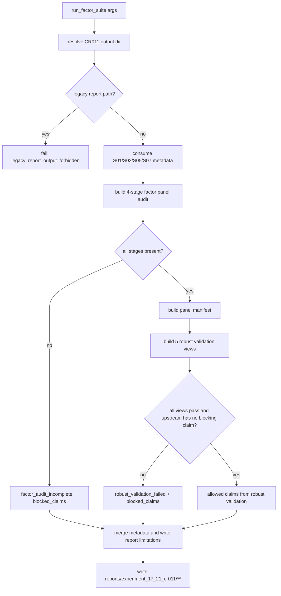

# LLD: CR011-S08 - 因子审计面板与稳健性验证

> 本文档仅覆盖 `CR011-S08-factor-panel-audit-and-robust-validation` 的 Story 级低层设计。当前只允许输出 LLD 与 Story 级 CP5-C 自动预检；`CR011-VALIDATION-BATCH-C` 批次人工确认前不得实现代码、不得生成真实报告、不得写真实 lake、不得联网、不得读取凭据、不得操作旧 `data/**`、不得覆盖旧 `reports/experiment_17_21/factor_strategy_report.md`。

## 修订记录

| 版本 | 日期 | 修订人 | 变更要点 |
|---|---|---|---|
| 1.0 | 2026-05-24 | meta-dev / dev-qin the 2nd | 初版 LLD，覆盖四阶段 factor panel、五类 robust validation、上游 S01/S02/S05/S07 合同消费、版本化报告路径、allowed/blocked claims、安全边界和最小测试集 |

## 1. Goal

修改 `experiments/run_experiment_17_21_factor_suite.py` 与 `engine/research_dataset.py` 的 CR011 v2 离线研究合同，创建 `tests/test_cr011_factor_panel_robust_validation.py`，并由实现阶段在 `reports/experiment_17_21_cr011/**` 下生成版本化 factor panel audit 与 robust validation 产物。

完成后的工程效果是：新版实验 17-21 v2 固定输出 raw、directional、winsorized、zscore 四阶段 factor panel 及 manifest；固定输出 rolling、annual、market_state、parameter_grid、cost_grid 五类 robust validation 视图；报告结论只能从合并后的 `allowed_claims` 生成，任何上游 blocked claim、缺 panel 阶段、缺验证视图、单一成本点或旧报告路径命中都必须阻断强结论。

## 2. Requirements（Functional / Non-Functional）

### 2.1 Functional

- 创建 factor panel audit 合同，保存 `raw`、`directional`、`winsorized`、`zscore` 四个 `factor_panel_stage`；每个阶段必须包含 `trade_date`、`symbol`、`factor_name`、阶段值字段、`preprocessing_version`、`lineage` 或 missing reason。
- 创建 panel manifest，记录每个阶段的 row count、factor count、symbol/date 覆盖、checksum 或稳定摘要、输入 upstream metadata、`baseline_report_path` 字符串引用和安全计数。
- 创建 robust validation 合同，固定输出 `rolling`、`annual`、`market_state`、`parameter_grid`、`cost_grid` 五类视图；每个视图必须有 `view_name`、`status`、`summary`、`allowed_claims`、`blocked_claims`、`missing_reason`。
- 消费 S01 verified 合同：继承 `benchmark_policy_id`、`benchmark_kind`、`hs300_available`、`hs300_coverage_ratio`、`proxy_baseline_used`、`benchmark_missing_reason`，不得把 proxy baseline 写入真实 `hs300_*` 指标字段。
- 消费 S02 verified 合同：继承 `metadata["universe"]`、`metadata["lifecycle"]`、`as_of_join_violation_count`、`lifecycle_status`、`survivorship_bias_note` 和 PIT / fixed snapshot blocked claims。
- 消费 S05 verified 合同：继承 `adjustment_policy`、`adj_factor_lineage`、`corporate_action_status`、`adjustment_audit_status`，公司行动缺失时阻断完整公司行动链路审计声明。
- 消费 S07 verified 合同：继承 exact `cost_grid_bps=[0, 5, 10, 20]`、五类 capacity report 字段、`cost_sensitivity_report`、`capacity_cost_status`、`liquidity_capacity_status` 和已合并的 S03/S04/S06 blocked claims。
- 新版报告、panel、manifest、validation tables 和 metadata 只能写入 `reports/experiment_17_21_cr011/**`；旧报告路径只允许作为 `baseline_report_path` 元数据字符串，不读取、不写入、不覆盖。
- 默认验证路径安全计数必须为 0：`network_calls=0`、`lake_writes=0`、`credential_reads=0`、`legacy_data_operations=0`、`old_report_overwrites=0`。

### 2.2 Non-Functional

- 安全：实现不得导入或调用 `market_data.connectors`、`market_data.runtime`、`market_data.storage`、真实 provider SDK、网络库、`.env` / token 读取逻辑或旧 `data/**` 操作。
- 可追溯：每个报告 run 必须可从 `experiment_metadata.json` 追溯到 upstream gate metadata、factor panel manifest、robust validation summary 和 blocked claims。
- 可验证：全部接口都有离线 pytest 入口，测试使用 in-memory DataFrame、`tmp_path`、fake metadata 和静态扫描，不依赖真实 lake、真实 Tushare、旧报告内容或凭据。
- 兼容：保留既有实验 17-21 v2 输出和 S01/S07 metadata 字段，不删除已验证字段；S08 只追加 audit / robust validation 字段。
- 性能：factor panel 写出和 validation 使用已有 pandas 结果，按阶段流式写表或小批量组装；不在 metadata 中嵌入完整大 DataFrame。
- 可维护：claim 合并使用 ordered unique 语义；任何 blocked claim 均优先于同名 allowed claim。

## 3. 模块拆分与职责

| 模块 / 文件组 | 职责 | 说明 |
|---|---|---|
| `experiments/run_experiment_17_21_factor_suite.py` | 在 CR011 v2 实验路径中构建四阶段 factor panel、调用 robust validation、写版本化报告产物和 metadata | 复用现有 `calculate_raw_factor_matrices`、`preprocess_factor_matrices`、strategy summary、S01 benchmark metadata、S07 capacity/cost metadata；新增路径 guard 和 manifest 写入 |
| `engine/research_dataset.py` | 聚合 factor audit readiness、upstream gate metadata、allowed/blocked claims 和安全计数 | 不读写文件；不触发 reader/backfill；只处理传入 metadata 与 in-memory manifest / validation summary |
| `reports/experiment_17_21_cr011/**` | 实现阶段生成的版本化输出目录 | 本 LLD 不创建该目录或文件；实现阶段只允许在该目录下写 factor panel、robust validation tables、manifest、metadata 和 report |
| `tests/test_cr011_factor_panel_robust_validation.py` | Story 专属离线测试 | 覆盖第 10 节全部场景，包含四阶段、五视图、旧报告隔离、安全计数和上游 blocked claims 保留 |
| S01 verified contract | benchmark policy 与 hs300/proxy 字段隔离 | 证据：`process/checks/CP7-CR011-S01-real-benchmark-and-policy-consumption-VERIFICATION-DONE.md` |
| S02 verified contract | PIT universe、stock lifecycle、fixed snapshot 降级和 survivorship claims | 证据：`process/checks/CP7-CR011-S02-pit-universe-and-stock-lifecycle-completion-VERIFICATION-DONE.md` |
| S05 verified contract | adjustment policy、adj factor lineage、corporate action status | 证据：`process/checks/CP7-CR011-S05-adjustment-and-corporate-action-audit-VERIFICATION-DONE.md` |
| S07 verified contract | liquidity / capacity / cost sensitivity 与 blocked claims | 证据：`process/checks/CP7-CR011-S07-liquidity-capacity-and-cost-sensitivity-VERIFICATION-DONE.md` |

## 4. 代码结构与文件影响范围

| 动作 | 文件路径 | 变更内容 |
|---|---|---|
| 修改 | `experiments/run_experiment_17_21_factor_suite.py` | 新增或扩展 factor panel audit helper、robust validation helper、CR011 output path resolver、manifest / validation / report metadata writer；只写 `reports/experiment_17_21_cr011/**` |
| 修改 | `engine/research_dataset.py` | 新增或扩展 `build_factor_audit_readiness`、`merge_factor_audit_metadata` 或等价 helper，合并 upstream contracts、panel manifest、validation summary、allowed/blocked claims 与安全计数 |
| 创建 | `reports/experiment_17_21_cr011/**` | 实现阶段由实验脚本生成版本化报告、factor panel 和稳健性验证产物；本 LLD 阶段不创建 |
| 创建 | `tests/test_cr011_factor_panel_robust_validation.py` | 创建离线测试，覆盖四阶段 panel、五类 validation、旧报告路径 guard、上游 claims 合并、安全计数和 forbidden path / import 扫描 |

## 5. 数据模型与持久化设计

本 Story 不新增数据库、不新增 lake dataset、不写真实 lake。实现阶段只在 `reports/experiment_17_21_cr011/**` 下生成报告侧文件。旧 `reports/experiment_17_21/factor_strategy_report.md` 不读取、不写入、不覆盖，只允许以字符串形式写入 `baseline_report_path`。

| 对象 / 字段 | 类型 | 约束 | 说明 |
|---|---|---|---|
| `FactorPanelStage.stage` | `str` | exact：`raw`、`directional`、`winsorized`、`zscore` | 四阶段缺任一项时 `factor_audit_status=fail` |
| `raw_value` | `float | null` | `stage=raw` 必填或写 missing reason | 原始因子值 |
| `directional_value` | `float | null` | `stage=directional` 必填或写 missing reason | 按因子方向统一后的值 |
| `winsorized_value` | `float | null` | `stage=winsorized` 必填或写 missing reason | 截尾后的值 |
| `zscore_value` | `float | null` | `stage=zscore` 必填或写 missing reason | 标准化后的值 |
| `preprocessing_version` | `str` | 必填 | 例如 `cr011-v1`；同一 run 内必须一致 |
| `factor_panel_manifest` | `dict` | 必填 | 记录 stages、row_count、factor_count、date range、symbol_count、lineage、checksums、upstream contract refs |
| `RobustValidationView.view_name` | `str` | exact：`rolling`、`annual`、`market_state`、`parameter_grid`、`cost_grid` | 五视图缺任一项时 `robust_validation_status=fail` |
| `RobustValidationView.status` | `str` | `pass`、`fail`、`required_missing`、`insufficient_sample` | `required_missing` / `fail` 必须进入 blocked claims |
| `allowed_claims` | `list[str]` | 必填，可为空 | 只允许来自全部 gate 和 robust validation 通过后的声明 |
| `blocked_claims` | `list[dict]` | 必填，可为空 | 上游 blocked claims、panel 缺阶段、validation 缺视图、成本网格失败均进入此列表 |
| `baseline_report_path` | `str` | 可为空；若存在只能是旧报告路径字符串 | 不读取旧报告内容 |
| `safety_counters` | `dict[str, int]` | 五项计数默认 0 | `network_calls`、`lake_writes`、`credential_reads`、`legacy_data_operations`、`old_report_overwrites` |

建议实现阶段输出布局：

```text
reports/experiment_17_21_cr011/{run_id}/
  factor_panels/factor_panel_raw.csv
  factor_panels/factor_panel_directional.csv
  factor_panels/factor_panel_winsorized.csv
  factor_panels/factor_panel_zscore.csv
  factor_panel_manifest.json
  robust_validation/rolling.csv
  robust_validation/annual.csv
  robust_validation/market_state.csv
  robust_validation/parameter_grid.csv
  robust_validation/cost_grid.csv
  robust_validation_summary.json
  experiment_metadata.json
  factor_strategy_report.md
```

`run_id` 由 CLI 参数、调用方显式传入值或测试 fixture 提供；不得用读取旧报告、真实 lake 或系统私有数据推导。

## 6. API / Interface 设计

| 接口 / 入口 | 输入 | 输出 | 调用方 | 说明 |
|---|---|---|---|---|
| `build_factor_panel_audit(raw_matrices, zscore_matrices, preprocessing_summary, definitions, *, run_metadata)`（新增或等价 helper） | raw 因子矩阵、zscore 因子矩阵、preprocessing summary、factor definitions、S01/S02/S05/S07 metadata | `panel_by_stage`、`factor_panel_manifest`、`factor_audit_status`、blocked claims | `run_factor_suite` / tests | 必须构造 raw、directional、winsorized、zscore 四阶段；T01、T03、T08 覆盖 |
| `write_factor_panel_audit_outputs(output_dir, panel_by_stage, manifest)`（新增或等价 helper） | CR011 run output dir、四阶段 panel、manifest | 写入路径清单、manifest path、安全计数 | `run_factor_suite` | 写入前校验路径在 `reports/experiment_17_21_cr011/**` 或测试 `tmp_path` 映射中；旧报告路径 fail fast；T03、T05、T07 |
| `build_robust_validation_views(panel_manifest, strategy_summary, strategy_artifacts, capacity_cost_metadata, *, market_state_labels=None, parameter_grid=None)`（新增或等价 helper） | panel manifest、strategy result、S07 cost metadata、market state labels、parameter grid | 五类 view payload、`robust_validation_status`、blocked claims | `run_factor_suite` / tests | rolling、annual、market_state、parameter_grid、cost_grid 必须全部出现；缺输入时 view 存在但 status 为 fail / required_missing；T02、T04、T06、T09 |
| `evaluate_robust_validation_claims(validation_summary, upstream_claims)`（新增或等价 helper） | 五视图 summary、S01/S02/S05/S07 allowed / blocked claims | 合并后的 `allowed_claims`、`blocked_claims`、`robust_validation_status` | `engine.research_dataset` / experiment metadata | 上游 blocked claim 优先；任何 fail view 阻断 `production_factor_research` 等强声明；T04、T06、T07 |
| `merge_factor_audit_metadata(metadata, manifest, validation_summary, claim_result)`（新增或等价 helper） | 既有 experiment metadata、panel manifest、robust validation summary、claim result | JSON-safe metadata dict | `run_factor_suite` | 追加 `factor_audit_status`、`robust_validation_status`、`factor_panel_manifest_path`、`robust_validation_summary_path`、安全计数；不覆盖 benchmark/PIT/adjustment/capacity 字段；T08、T10 |
| `resolve_cr011_validation_output_dir(output_dir, run_id=None)`（新增或等价 helper） | CLI / args output dir、可选 run id | 安全 run output dir | `run_factor_suite` / tests | 必须拒绝 `reports/experiment_17_21/factor_strategy_report.md` 及其父目录作为输出目标；T05、T10 |

错误模型：

- `factor_audit_incomplete`：四阶段 panel 缺任一阶段、字段缺失或 manifest 不一致。
- `robust_validation_view_missing`：五类 view 缺任一项。
- `robust_validation_failed`：任一 view `status=fail|required_missing|insufficient_sample`。
- `invalid_cost_grid` / `single_cost_point_not_allowed`：继承 S07，cost_grid view 必须 fail。
- `upstream_blocked_claims_present`：S01/S02/S05/S07 任一强声明被 blocked，S08 不得重新放行。
- `legacy_report_output_forbidden`：输出目标指向旧报告或旧报告目录。
- `security_boundary_violation`：安全计数非 0 或出现 forbidden import/path。

本节所有接口都必须在第 10 节测试设计中有对应验证入口。

## 7. 核心处理流程

1. `run_factor_suite` 解析 CR011 v2 输出目录和可选 `run_id`，调用 `resolve_cr011_validation_output_dir`，确认目标位于 `reports/experiment_17_21_cr011/**` 或测试隔离目录；若命中旧报告路径立即失败且不写文件。
2. 读取 / 组装既有实验内存结果：factor definitions、raw factor matrices、preprocessing summary、zscore matrices、strategy summary、strategy artifacts、S01 benchmark metadata、S07 capacity/cost metadata。
3. 从 `ResearchDataset.metadata` 或实验 metadata 消费 S01/S02/S05/S07 verified 合同：
   - S01：benchmark policy 六字段、proxy/hs300 字段隔离、`real_benchmark_research` blocked claim。
   - S02：PIT universe、lifecycle、as-of count、fixed snapshot survivorship note。
   - S05：adjustment policy、adj factor lineage、corporate action status、adjustment audit status。
   - S07：exact cost grid、capacity report、cost sensitivity report、capacity / cost blocked claims；其中 S07 已保留 S03/S04/S06 blocked claims。
4. 调用 `build_factor_panel_audit`，输出四阶段 panel：
   - raw：原始因子矩阵展开为长表。
   - directional：按 factor definition direction 统一方向。
   - winsorized：按 preprocessing summary 记录截尾结果或等价 winsor metadata。
   - zscore：使用既有标准化矩阵。
5. 生成 `factor_panel_manifest`，记录四阶段文件名、row count、factor count、date range、symbol count、preprocessing version、upstream contract refs、安全计数、`baseline_report_path` 字符串。
6. 调用 `build_robust_validation_views`，固定生成五类 view：
   - rolling：按滚动窗口或既有样本切片汇总 IC / return / drawdown 等稳定性指标；样本不足时 `insufficient_sample`。
   - annual：按年份汇总表现与 retained factor 稳定性；缺年份分组时 `insufficient_sample`。
   - market_state：按 market state labels 汇总；缺 labels 时视图仍存在但 `required_missing`。
   - parameter_grid：按 factor/strategy 参数组合汇总；只存在单一参数或无 grid 时 `fail`。
   - cost_grid：消费 S07 exact `[0, 5, 10, 20]` bps；单一成本点或 invalid grid 时 `fail`。
7. 调用 `evaluate_robust_validation_claims`，先合并上游 blocked claims，再根据 panel / validation 状态决定 S08 claims：
   - 全部四阶段和五视图通过时，才允许 `factor_panel_audited`、`robust_factor_validation_supported` 等声明。
   - 任一上游 blocked claim、缺 panel 阶段或 validation fail 时，强声明进入 `blocked_claims`。
8. 调用 `merge_factor_audit_metadata`，把 manifest、validation summary、claims、安全计数和路径写入 `experiment_metadata.json`；保留既有 benchmark、PIT、adjustment、capacity 字段。
9. 写新版 `factor_strategy_report.md` 到 CR011 run 目录，报告仅从 `allowed_claims` 生成结论；`blocked_claims` 和 `known_limitations` 必须显式列入限制项。
10. 返回 `Experiment1721Result` 或等价结果对象，包含新增 manifest / validation / metadata / report 路径。



异常路径与测试映射：

| 异常路径 | 处理 | 对应测试 |
|---|---|---|
| 缺 raw / directional / winsorized / zscore 任一阶段 | `factor_audit_status=fail`，blocked `factor_panel_audited` / `robust_factor_validation_supported` | T03 |
| 缺 rolling / annual / market_state / parameter_grid / cost_grid 任一视图 | `robust_validation_status=fail`，blocked robust claims | T04 |
| market state labels 缺失 | `market_state.status=required_missing`，视图仍写入 summary | T06 |
| S07 cost grid 不是 `[0,5,10,20]` 或单一成本点 | `cost_grid.status=fail`，继承 S07 blocked claims | T09 |
| 上游 blocked claims 存在 | 同名 allowed claim 删除，强声明保持 blocked | T07 |
| 输出目标为旧报告 | fail fast，不写任何报告产物 | T05 |
| 安全计数非 0 或 forbidden import | 测试失败，CP6 不得通过 | T10 |

## 8. 技术设计细节

- 关键算法 / 规则：
  - 四阶段完整性规则：`required_stages = {"raw", "directional", "winsorized", "zscore"}`；manifest 中的 stage 集合必须 exact 等于该集合。
  - 五视图完整性规则：`required_views = {"rolling", "annual", "market_state", "parameter_grid", "cost_grid"}`；summary 中的 view 集合必须 exact 等于该集合。
  - blocked 优先规则：合并 claims 时先收集所有 `blocked_claims[].claim`，再从 allowed list 删除同名 claim。
  - 安全计数规则：metadata 顶层和 `factor_panel_manifest["safety_counters"]` 均固定包含五项计数；默认验证路径全部为 0。
  - 路径规则：`output_dir.resolve()` 必须位于 CR011 输出根或 pytest `tmp_path` 安全根；旧报告文件和旧报告目录均 fail fast。
- 依赖选择与复用点：
  - 复用实验脚本现有 `calculate_raw_factor_matrices`、`preprocess_factor_matrices`、`build_experiment_benchmark_policy_metadata`、`build_experiment_capacity_cost_metadata` 和 report writer。
  - 复用 `engine.research_dataset` 已有 `allowed_claims` / `blocked_claims` / `known_limitations` / metadata JSON-safe 合并方式。
  - 复用 S07 `merge_capacity_cost_metadata` 输出，不新增容量 / 成本计算入口。
- 兼容性处理：
  - 不删除现有 `experiment_metadata.json` 字段；新增字段使用 `factor_audit`、`robust_validation`、`factor_panel_manifest_path`、`robust_validation_summary_path` 命名空间。
  - 若现有 output dir 已被调用方指定为 `reports/experiment_17_21_cr011`，实现可在其下创建 `run_id` 子目录；测试必须显式传入 deterministic run id。
  - 若 market state labels 或 parameter grid 暂不可用，必须生成 required_missing / fail view，而不是省略视图。
- 图示类型选择：流程图。该 Story 涉及实验脚本、research metadata、报告路径、panel manifest 和 validation claim 多分支，流程图能明确异常路径。

## 9. 安全与性能设计

| 维度 | 设计措施 | 验证方式 |
|---|---|---|
| 安全 | 禁止导入 `market_data.connectors`、`market_data.runtime`、`market_data.storage`、`requests`、`httpx`、`aiohttp`、`socket`、`tushare`；禁止读取 `.env`、`os.environ["TUSHARE_TOKEN"]` 或任何凭据 | T10 AST / 文本扫描，monkeypatch fake secret 后断言输出不含 secret |
| 安全 | 旧报告只作为 `baseline_report_path` 字符串；任何指向 `reports/experiment_17_21/factor_strategy_report.md` 的输出目标 fail fast | T05 old report sentinel；断言 `old_report_overwrites=0` |
| 安全 | 不读取、列出、迁移、复制、删除旧 `data/**`；不写真实 lake | T10 forbidden path / function scan；安全计数断言 |
| 安全 | `blocked_claims` 优先于 `allowed_claims`，不得把上游 blocked claim 在 S08 中重新允许 | T07 claims merge assertion |
| 性能 | panel audit 从已有 pandas 矩阵展开并按阶段写表，不在 metadata 中嵌入完整 DataFrame | T01 / T08 小 fixture 验证 manifest row count 与 metadata JSON-safe |
| 性能 | robust validation 使用聚合 summary 和已有 strategy artifacts；测试使用小样本，不引入外部 I/O benchmark | T02 / T06 / T09 小样本验证 |
| 性能 | 输出文件写入集中在 CR011 run 目录；manifest 记录路径和摘要，避免重复扫描旧目录 | T08 输出路径和文件清单断言 |

## 10. 测试设计

默认验证入口：`uv run --python 3.11 pytest -q tests/test_cr011_factor_panel_robust_validation.py`。

| 测试场景 | 前置条件 | 操作 | 预期结果 | 验证方式 |
|---|---|---|---|---|
| T01 四阶段 factor panel 完整 | 构造 2 个 factor、2 个 symbol、多个 trade_date 的 raw / zscore fixture 和 preprocessing summary | 调用 `build_factor_panel_audit` | manifest exact 包含 raw、directional、winsorized、zscore；每阶段 row_count > 0；字段包含 `factor_panel_stage`、阶段值、`preprocessing_version` | pytest |
| T02 五类 robust validation view 完整 | 构造 panel manifest、strategy summary、market_state labels、parameter grid、S07 exact cost grid | 调用 `build_robust_validation_views` | summary exact 包含 rolling、annual、market_state、parameter_grid、cost_grid；`robust_validation_status=pass` | pytest |
| T03 缺任一 panel 阶段 fail | 删除 winsorized stage 或构造空 stage | 调用 panel audit / claims helper | `factor_audit_status=fail`；blocked claims 包含 `factor_panel_audited` 或 `robust_factor_validation_supported` | pytest |
| T04 缺任一 robust validation view fail | 删除 annual view 或让 helper 返回缺视图 | 调用 `evaluate_robust_validation_claims` | `robust_validation_status=fail`；强结论不进入 allowed claims | pytest |
| T05 旧报告路径 guard | output target 指向 `reports/experiment_17_21/factor_strategy_report.md` 或旧目录 | 调用 `resolve_cr011_validation_output_dir` / writer | 抛出结构化错误或返回 fail；不写文件；`old_report_overwrites=0` | pytest `tmp_path` + sentinel |
| T06 market state labels 缺失 | 不提供 market state labels | 调用 `build_robust_validation_views` | `market_state` view 存在，`status=required_missing`；blocked claims 包含 market state validation | pytest |
| T07 上游 blocked claims 保留 | 输入 S01/S02/S05/S07 blocked claims，且同名 claim 同时出现在 candidate allowed | 调用 `evaluate_robust_validation_claims` | blocked claims 全部保留；同名 allowed claim 被删除；不得放宽 proxy/PIT/adjustment/capacity 限制 | pytest |
| T08 metadata merge 不覆盖上游字段 | 输入含 benchmark/PIT/adjustment/capacity 字段的 metadata | 调用 `merge_factor_audit_metadata` | 新增 factor audit / robust validation 字段；原 benchmark policy、lifecycle、adjustment_audit、capacity_cost 字段保持 | pytest dict snapshot |
| T09 cost grid invalid / single point fail | S07 metadata 中 `cost_grid_bps=[10]` 或 `[0,10,20]` | 调用 robust validation cost view | `cost_grid.status=fail`；`robust_validation_status=fail`；blocked claims 含 `single_cost_point_not_allowed` 或 `invalid_cost_grid` | pytest |
| T10 默认安全计数为 0 | monkeypatch 网络、lake write、credential read、legacy data path、old report overwrite sentinel | 运行最小 end-to-end helper | `network_calls=0`、`lake_writes=0`、`credential_reads=0`、`legacy_data_operations=0`、`old_report_overwrites=0`；无 forbidden import/path | pytest + AST / rg 等价扫描 |

接口覆盖矩阵：

| 接口 | 覆盖测试 |
|---|---|
| `build_factor_panel_audit` | T01、T03、T08、T10 |
| `write_factor_panel_audit_outputs` | T05、T08、T10 |
| `build_robust_validation_views` | T02、T04、T06、T09 |
| `evaluate_robust_validation_claims` | T03、T04、T07、T09 |
| `merge_factor_audit_metadata` | T07、T08、T10 |
| `resolve_cr011_validation_output_dir` | T05、T10 |

异常路径覆盖矩阵：

| 异常路径 | 覆盖测试 |
|---|---|
| `factor_audit_incomplete` | T03 |
| `robust_validation_view_missing` | T04 |
| `market_state_labels_missing` | T06 |
| `single_cost_point_not_allowed` / `invalid_cost_grid` | T09 |
| `upstream_blocked_claims_present` | T07 |
| `legacy_report_output_forbidden` | T05 |
| `security_boundary_violation` | T10 |

## 11. 实施步骤

| TASK-ID | 动作 | 目标文件 | 详细描述 | 对应测试 |
|---|---|---|---|---|
| CR011-S08-T1 | 修改 | `experiments/run_experiment_17_21_factor_suite.py` | 创建 / 扩展 CR011 output dir resolver、factor panel audit helper、robust validation helper、manifest / validation summary / report metadata writer；写入路径仅限 `reports/experiment_17_21_cr011/**` 或测试隔离路径 | T01、T02、T03、T04、T05、T06、T08、T09、T10 |
| CR011-S08-T2 | 修改 | `engine/research_dataset.py` | 创建 / 扩展 factor audit readiness 与 claims merge helper，消费 S01/S02/S05/S07 metadata，按 blocked 优先规则合并 `allowed_claims` / `blocked_claims` / `known_limitations`，输出安全计数 | T03、T04、T07、T08、T09、T10 |
| CR011-S08-T3 | 创建 | `reports/experiment_17_21_cr011/**` | 仅在实现阶段由实验脚本生成版本化 run 目录及 factor panel、manifest、robust validation、metadata、report；禁止旧报告覆盖；LLD 阶段不创建 | T02、T05、T08、T10 |
| CR011-S08-T4 | 创建 | `tests/test_cr011_factor_panel_robust_validation.py` | 创建离线 pytest，覆盖四阶段 panel、五视图 robust validation、缺阶段 / 缺视图 fail、旧报告路径 guard、claims 合并、安全计数和 forbidden import/path | T01-T10 |

文件影响与 TASK-ID 覆盖关系：

| 文件影响项 | 覆盖 TASK-ID |
|---|---|
| `experiments/run_experiment_17_21_factor_suite.py` | CR011-S08-T1 |
| `engine/research_dataset.py` | CR011-S08-T2 |
| `reports/experiment_17_21_cr011/**` | CR011-S08-T3 |
| `tests/test_cr011_factor_panel_robust_validation.py` | CR011-S08-T4 |

实现顺序必须按 TASK-ID 串行推进。若实现时证明需要修改 `engine/portfolio.py`、`market_data/**`、其他测试文件或旧报告路径，必须停止并交回 meta-po 扩范围，不得在 S08 内自行扩大文件所有权。

## 12. 风险、难点与预研建议

| 风险 / 难点 | 影响 | 缓解措施 / 预研建议 |
|---|---|---|
| 既有 `preprocess_factor_matrices` 只返回 zscore 和 summary，未显式返回 winsorized 矩阵 | 可能无法直接保存 winsorized 阶段 | 实现 T1 时在实验脚本内部扩展 helper 返回 winsorized 中间态；若需要改公共 API 以外文件，停止并交回 meta-po |
| market state labels 尚未有真实 source/interface | market_state view 可能无法 pass | 视图必须存在并输出 `required_missing` / blocked claims；不伪造市场状态验证通过 |
| parameter grid 来源可能只是当前默认参数 | 单一参数不能证明稳健 | 单一参数时 `parameter_grid.status=fail`，blocked robust claims；测试 T04 / T09 覆盖 |
| 上游 blocked claims 被报告文案绕过 | 旧限制项被误读为生产级结论 | claims merge 使用 blocked 优先；报告结论只读取 `allowed_claims`；T07 覆盖 |
| 输出路径 resolver 与既有 CLI 默认目录冲突 | 可能破坏既有实验输出 | 保持 `--output-dir` 语义，新增 run 子目录或显式 run id 仅在 CR011 v2 路径中使用；测试覆盖默认与 tmp_path |
| 旧报告 baseline 被误读为可写目标 | 覆盖旧实验 17-21 报告 | 输出路径 guard 拒绝旧报告路径；baseline 只写字符串；T05 覆盖 |
| 安全边界在测试中因静态扫描遗漏 | 可能读取凭据或旧数据 | T10 同时使用 AST / 文本扫描、monkeypatch sentinel 和安全计数断言 |

### OPEN / Spike 跟踪

| ID | 类型（OPEN / Spike） | 问题 | 下一动作 | 责任方 |
|---|---|---|---|---|
| 无 | OPEN | 本 LLD 无新增设计 OPEN / Spike；market state labels 和 parameter grid 不足已设计为 fail-closed 路径，不阻塞可实现性 | meta-po 收齐 S08 LLD 与 CP5-C 后发起批次人工确认 | meta-po |

## 13. 回滚与发布策略

- 发布方式：
  - CP5-C 批次人工确认 approved 后，按 `CR011-S08-T1` 至 `CR011-S08-T4` 串行离线实现。
  - 实现完成后运行 `uv run --python 3.11 pytest -q tests/test_cr011_factor_panel_robust_validation.py`，必要时追加 S01/S02/S05/S07 相关最小回归。
  - 不发布安装脚本，不写 `delivery/**`，不触发真实联网、真实 Tushare、真实 lake 或旧 `data/**` 操作。
- 回滚触发条件：
  - 四阶段 panel 不完整但 `factor_audit_status` 未 fail。
  - 五类 robust validation 不完整但 `robust_validation_status` 未 fail。
  - 上游 blocked claims 被 S08 重新加入 allowed claims。
  - 输出路径命中旧报告或旧报告目录。
  - 安全计数任一非 0，或实现导入 connector/runtime/storage/provider SDK、网络库、凭据读取、旧 data 操作。
  - 实现需要修改超出 Story 文件所有权的文件。
- 回滚动作：
  - 回退 `experiments/run_experiment_17_21_factor_suite.py` 中 S08 factor panel / robust validation / output resolver 增量。
  - 回退 `engine/research_dataset.py` 中 S08 factor audit readiness 与 claims merge 增量，不删除 S01/S02/S05/S07 已验证合同。
  - 删除或回退 `tests/test_cr011_factor_panel_robust_validation.py` 中不适配的 S08 测试变更，保留失败复现用例供修订。
  - 删除实现阶段生成的 `reports/experiment_17_21_cr011/{run_id}/**` 测试 / 临时输出；不得触碰旧报告或旧 `data/**`。

## 14. Definition of Done

- [ ] 14 个章节全部填写完成，frontmatter 保持 `confirmed=false`、`implementation_allowed=false`。
- [ ] `process/checks/CP5-CR011-S08-factor-panel-audit-and-robust-validation-LLD-IMPLEMENTABILITY.md` 已写入，结论无 BLOCKED / FAIL。
- [ ] Story 卡片 LLD 状态已更新为 `lld-ready-for-review`，但 `dev_gate.implementation_allowed=false` 保持不变。
- [ ] LLD 明确消费 S01/S02/S05/S07 verified 合同，并列出对应 CP7 证据路径。
- [ ] 文件影响范围只包含 `experiments/run_experiment_17_21_factor_suite.py`、`engine/research_dataset.py`、`reports/experiment_17_21_cr011/**`、`tests/test_cr011_factor_panel_robust_validation.py`。
- [ ] 四阶段 factor panel：raw、directional、winsorized、zscore 均有设计和测试入口。
- [ ] 五类 robust validation：rolling、annual、market_state、parameter_grid、cost_grid 均有设计和测试入口。
- [ ] 旧报告覆盖次数设计为 0；旧报告只允许作为 `baseline_report_path` 字符串引用。
- [ ] 默认安全计数设计为 0：`network_calls=0`、`lake_writes=0`、`credential_reads=0`、`legacy_data_operations=0`、`old_report_overwrites=0`。
- [ ] OPEN / Spike 已清点，设计 OPEN 为 0。
- [ ] CP5-C 批次人工确认前不进入实现。

## 人工确认区

> **CP5-C - Story LLD 可实现性门**
> meta-dev 先写入 `process/checks/CP5-CR011-S08-factor-panel-audit-and-robust-validation-LLD-IMPLEMENTABILITY.md` 自动预检结果。
> meta-po 收齐 `CR011-VALIDATION-BATCH-C` 的 S08 LLD 与 CP5-C 自动预检后，再生成并提示用户审查 `checkpoints/CP5-CR011-VALIDATION-BATCH-C-LLD-BATCH.md`。
> 用户统一确认 CP5-C 后，仍需满足当前 Wave、依赖门控与文件所有权门控方可进入实现。

**CP5 checklist 摘要**：

| # | 检查项 | 状态 | 证据 |
|---|---|---|---|
| 1 | LLD 覆盖 AC | 待人工审查 | 第 2 / 10 / 14 节 |
| 2 | 与 HLD / ADR 一致 | 待人工审查 | 第 3 / 8 / 12 节 |
| 3 | 文件影响范围明确 | 待人工审查 | 第 4 / 11 节 |
| 4 | 接口契约完整 | 待人工审查 | 第 6 节 |
| 5 | 测试与 dev_gate 可计算 | 待人工审查 | 第 10 / 14 节 |

**人工确认回复**：

请直接回复以下任一整行：

```text
approve
修改: <具体修改点>
reject
```

**人工审查结果回填**：

- 结论：`approved | changes_requested | rejected`
- 审查人：
- 审查时间：
- 修改意见：
- 风险接受项：
