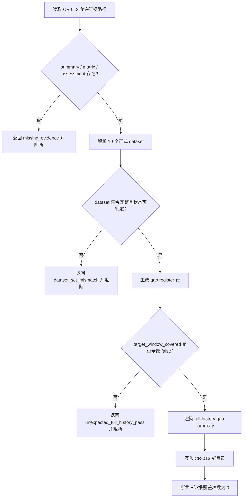

# LLD: CR013-S01 - full-history readiness gap register

> 本文档是 CR013-S01 的低层设计，已通过 CP5 全量 LLD 审查；后续实现仍必须遵守 Story dev_gate、文件所有权和权限边界。
> 本 Story 的实现范围只允许在 CP5 批次人工确认后创建版本化 CR-013 派生报告与测试，不授权 provider fetch、真实 lake 写入、凭据读取、旧 `data/**` 读取或旧报告覆盖。

## 1. Goal

创建 2020-2024 full-history readiness gap register 的实现蓝图：在未来实现阶段只读消费 CR-013 证据文件，生成新目录 `reports/data_lake_readiness_2020_2024_cr013/` 下的 gap register 与 summary，明确 CR-012 limited-window pass 只适用于 `2025-02-11..2026-02-18`，不得外推为 `2020-01-01..2024-12-31` full-history production strict。

## 2. Requirements（Functional / Non-Functional）

### 2.1 Functional

- 覆盖 REQ-083：`2020-01-01..2024-12-31` 必须保持 `blocked` / `research_limited_only`，full-history production strict allowed claim 输出次数为 0。
- 覆盖 REQ-086：默认执行路径的 `provider_fetches=0`、`lake_writes=0`、`credential_reads=0`、`legacy_data_reads=0`、`old_report_overwrites=0`。
- 覆盖 REQ-087：保留 `reports/data_lake_readiness_2020_2024/*` 作为旧证据基线，未来输出必须使用新目录和新 run metadata。
- 从 `readiness_summary.md` 与 `readiness_matrix.csv` 固化 10 个正式 dataset 的 `limited_window_only`、`target_window_covered=False`、`issue_code`、`issue_category`、`remediation` 和 evidence path。
- 输出 summary 中必须同时包含 `supported_window=2025-02-11..2026-02-18`、`blocked_window=2020-01-01..2024-12-31`、`full_history_status=research_limited_only` 和 `old_baseline_preserved=true`。

### 2.2 Non-Functional

- 安全：只读报告证据；不得访问 `/mnt/ugreen-data-lake/**`、旧 `data/**`、`.env` 或 provider SDK。
- 可追溯：每个 dataset gap 必须带 `evidence_path`、source report path、CR-013 requirement id 和 old baseline preservation flag。
- 可验证：测试必须断言 10 个 dataset 完整性、full-history allowed claim 为 0、旧证据覆盖次数为 0。
- 幂等：重复执行只覆盖 CR-013 新目录中同 run_id 的派生文件；不得写入旧证据目录。
- 可维护：字段名沿用 HLD / ADR：`supported_window`、`blocked_window`、`full_history_status`、`dataset_status_counts`、`target_window_covered`、`old_baseline_preserved`。

## 3. 模块拆分与职责

| 模块 / 文件组 | 职责 | 说明 |
|---|---|---|
| Evidence Intake | 只读加载 `readiness_summary.md`、`readiness_matrix.csv`、`data_validity_assessment.md` | 仅读取 handoff 允许的报告证据；不读取旧 `data/**` 或真实 lake |
| Gap Register Builder | 将 10 个正式 dataset 归一化为 gap register 行 | 固定 dataset 集合来自 Story 卡片和 HLD §29.1 |
| Claim Boundary Summary Renderer | 生成 full-history blocked 摘要 | 输出 supported / blocked window、status counts、permission counters |
| Evidence Baseline Guard | 检查旧证据目录不在输出目标内 | 旧 `reports/data_lake_readiness_2020_2024/*` 只读保留 |
| Test Contract | 定义未来实现阶段的 pytest 验证入口 | 只使用 fixture / snapshot / forbidden path sentinel |

## 4. 代码结构与文件影响范围

| 动作 | 文件路径 | 变更内容 |
|---|---|---|
| 创建 | `reports/data_lake_readiness_2020_2024_cr013/full_history_gap_register.csv` | 未来实现阶段生成 10 行 dataset gap register；本 LLD 不创建该业务产物 |
| 创建 | `reports/data_lake_readiness_2020_2024_cr013/full_history_gap_summary.md` | 未来实现阶段生成 full-history blocked 摘要、证据路径和安全计数；本 LLD 不创建该业务产物 |
| 创建 | `tests/test_cr013_full_history_gap_register.py` | 未来实现阶段新增最小验证入口；本 LLD 不创建测试代码 |
| 禁止修改 | `reports/data_lake_readiness_2020_2024/readiness_summary.md` | 旧证据只读保留，覆盖次数必须为 0 |
| 禁止修改 | `reports/data_lake_readiness_2020_2024/readiness_matrix.csv` | 旧证据只读保留，覆盖次数必须为 0 |
| 禁止访问 | `/mnt/ugreen-data-lake/**`、`data/**`、`.env` | 本 Story 和后续默认验证均不得读取或写入 |

## 5. 数据模型与持久化设计

| 对象 / 字段 | 类型 | 约束 | 说明 |
|---|---|---|---|
| `dataset` | string | 必填；10 个固定 dataset 之一 | `prices`、`adj_factor`、`hs300_index`、`trade_calendar`、`index_members`、`index_weights`、`stock_basic`、`trade_status`、`prices_limit`、`events` |
| `priority` | enum | `P0` / `W3` | 从 readiness matrix 继承 |
| `final_status` | enum | 必须为 `limited_window_only` 或等价 blocked 状态 | 不允许 full-history pass |
| `issue_code` | string | 必填 | 至少包含 `target_window_not_covered`；部分 dataset 可含 `coverage_denominator_empty` |
| `issue_category` | enum | 必须为 `data_gap` | 不把 data gap 降级为 pass |
| `remediation` | string | 必填 | 描述补齐 `2020-01-01..2024-12-31` 后重新审计 |
| `evidence_path` | string | 必填；只作为字符串记录 | 可以记录 lake catalog/canonical 路径字符串，但不得访问真实 lake |
| `target_window_covered` | boolean | 必须为 `false` | 阻断 full-history allowed claim |
| `source_report_path` | string | 必填 | 指向 CR-013 旧证据报告路径 |
| `old_baseline_preserved` | boolean | 必须为 `true` | 后续新报告不能覆盖旧证据 |

持久化只发生在未来实现阶段的新目录 `reports/data_lake_readiness_2020_2024_cr013/`。本 LLD 不新增数据库、不迁移 schema、不写真实 lake。

## 6. API / Interface 设计

| 接口 / 入口 | 输入 | 输出 | 调用方 | 说明 |
|---|---|---|---|---|
| `build_full_history_gap_register` | `readiness_summary_path`、`readiness_matrix_path`、`data_validity_assessment_path`、`output_dir`、`run_id` | `FullHistoryGapResult`：10 行 register、status counts、permission counters | 未来报告生成脚本或测试 fixture | 缺证据、缺 dataset 或状态不可判定时 fail-fast |
| `render_full_history_gap_summary` | `FullHistoryGapResult`、`supported_window`、`blocked_window`、`evidence_paths` | Markdown summary | 报告生成脚本 | full-history production strict allowed claim 必须为 0 |
| `assert_old_baseline_preserved` | 输出路径、forbidden old report paths | `old_baseline_preserved=true` 或 structured error | builder / tests | 输出目标命中旧报告目录时阻断 |
| `permission_counter_snapshot` | 执行上下文 | counters dict | tests / CP7 | 默认 provider/lake/credential/legacy data/old report 计数均为 0 |

错误模型：`missing_evidence`、`dataset_set_mismatch`、`unexpected_full_history_pass`、`forbidden_output_path`、`old_baseline_overwrite_attempt`。所有错误均阻断实现验收，不允许自动推断 pass。

## 7. 核心处理流程

1. 读取 handoff 允许的三个 S01 证据文件，只解析报告和 CSV 内容。
2. 校验 10 个正式 dataset 集合精确匹配；缺失或多出均阻断。
3. 将 `limited_window_only`、`target_window_not_covered`、`data_gap` 和 remediation 写入 register。
4. 渲染 summary，明确 supported window 与 blocked window 的分离。
5. 写入新目录前执行 forbidden path guard；命中旧报告目录时 fail-fast。

## 8. 技术设计细节

- 关键规则：CR-012 limited-window pass 只能作为 `limited_window_supported`，不得派生 full-history `production_strict_research`。
- Dataset 集合使用 exact 语义，不使用模糊匹配；大小写或别名不匹配时阻断。
- Evidence path 只作为 lineage 字符串写入，禁止解析 `/mnt/ugreen-data-lake/**` 实际文件。
- `stock_basic` 的 `date_min/date_max` 不解除 full-history blocked；是否覆盖目标窗口以 `target_window_covered=False` 为准。
- `events` 行可以 row_count 为 0，但仍必须进入 10 dataset gap register。
- `old_baseline_preserved=true` 和 `old_report_overwrites=0` 必须同时出现在 summary metadata。
- 依赖选择：使用标准库 CSV / pathlib 或项目既有报告 helper；不得引入 provider SDK、network client 或 lake storage 写入依赖。
- 图示类型选择：流程图；原因是存在 evidence intake、校验、阻断和写入 guard 多分支。

## 9. 安全与性能设计

| 维度 | 设计措施 | 验证方式 |
|---|---|---|
| 安全 | 只读 `reports/data_lake_readiness_2020_2024/*` 三个证据文件；输出只进入 CR-013 新目录 | forbidden path sentinel 断言旧报告覆盖次数为 0 |
| 安全 | 不读取 `.env`、不导入 provider connector、不访问 `/mnt/ugreen-data-lake/**`、不读取旧 `data/**` | monkeypatch / import scan / permission counter 断言均为 0 |
| 性能 | 处理 10 行 dataset matrix，O(n)；无需并发、无需缓存 | 单测使用小 fixture，运行时间目标小于 1 秒 |
| 可追溯 | 输出包含 evidence_paths、source report paths、run_id 和 requirement ids | snapshot 验证字段齐全 |
| 幂等 | 同 run_id 输出可重复生成；旧基线不可覆盖 | 重复执行测试比较内容稳定性和 forbidden path |

## 10. 测试设计

| 测试场景 | 前置条件 | 操作 | 预期结果 | 验证方式 |
|---|---|---|---|---|
| 10 dataset 完整性 | 使用 CR-013 readiness matrix fixture | 调用 `build_full_history_gap_register` | register 精确包含 10 个 dataset | `tests/test_cr013_full_history_gap_register.py` |
| full-history blocked | fixture 中 10 行均 `target_window_covered=False` | 渲染 summary | `full_history_status=research_limited_only`，full-history allowed claim 为 0 | snapshot / 字段断言 |
| limited-window 不外推 | fixture 包含 limited-window date range | 生成 summary | 同时输出 supported window 与 blocked window | 字符串和结构字段断言 |
| 旧证据不可覆盖 | 输出路径被设置为旧报告目录 | 调用 path guard | 返回 `forbidden_output_path`，不写文件 | tmp_path + sentinel |
| 禁止真实操作 | 执行默认验证 | 读取 counters | provider/lake/credential/legacy data/old report 计数均为 0 | monkeypatch / import scan |

## 11. 实施步骤

| TASK-ID | 动作 | 目标文件 | 详细描述 | 对应测试 |
|---|---|---|---|---|
| CR013-S01-T1 | 创建 | `reports/data_lake_readiness_2020_2024_cr013/full_history_gap_register.csv` | 实现只读 evidence intake 与 10 dataset gap register 输出 | 10 dataset 完整性、full-history blocked |
| CR013-S01-T2 | 创建 | `reports/data_lake_readiness_2020_2024_cr013/full_history_gap_summary.md` | 渲染 supported / blocked window、status counts、evidence paths、permission counters | limited-window 不外推、旧证据不可覆盖 |
| CR013-S01-T3 | 创建 | `tests/test_cr013_full_history_gap_register.py` | 覆盖 register schema、blocked claim、forbidden path 和安全计数 | 全部 S01 测试场景 |

## 12. 风险、难点与预研建议

| 风险 / 难点 | 影响 | 缓解措施 / 预研建议 |
|---|---|---|
| 把 lake catalog 路径字符串当成可读取目标 | 可能越权访问真实 lake | LLD 明确 evidence_path 仅作为字符串 lineage；测试禁止访问 `/mnt/ugreen-data-lake/**` |
| `stock_basic` 历史日期范围被误读为全历史覆盖 | 可能错误解除 blocked | 以 `target_window_covered=False` 和 10 dataset 全体状态为唯一判定 |
| 新输出目录与旧报告目录混淆 | 可能覆盖 CR-013 触发证据 | path guard 精确禁止 `reports/data_lake_readiness_2020_2024/*` |
| 后续实现遗漏 `events` 或 W3 dataset | register 不完整 | dataset exact set 测试固定 10 项 |

### OPEN / Spike 跟踪

| ID | 类型（OPEN / Spike） | 问题 | 下一动作 | 责任方 |
|---|---|---|---|---|
| 无 | OPEN | 无阻断性 OPEN；CP5 人工确认前不得实现 | 等待 meta-po 生成 CP5 批次人工审查稿 | meta-po / user |

## 13. 回滚与发布策略

- 发布方式：CP5 批次人工确认后，随 CR013-BATCH-A 进入实现；实现输出仅发布到 `reports/data_lake_readiness_2020_2024_cr013/` 新目录。
- 回滚触发条件：测试发现 full-history allowed claim 非 0、旧证据覆盖风险、provider/lake/credential/legacy data 操作计数非 0、dataset 集合不完整。
- 回滚动作：删除或废弃 CR-013 新目录中的派生文件和对应测试变更；不得修改或恢复旧 `reports/data_lake_readiness_2020_2024/*`，因为旧证据从未应被覆盖。

## 14. Definition of Done

- [ ] 14 个章节全部填写完成。
- [ ] `confirmed=false`，CP5 批次人工确认前不进入实现。
- [ ] 文件影响范围覆盖 S01 三个未来输出文件，且禁止路径明确。
- [ ] 接口设计中的每个入口均在第 10 节有对应测试场景。
- [ ] 异常路径 `missing_evidence`、`dataset_set_mismatch`、`unexpected_full_history_pass`、`forbidden_output_path` 均有测试入口。
- [ ] full-history production strict allowed claim 输出次数为 0。
- [ ] provider/lake/credential/legacy data/old report 操作计数均为 0。
- [ ] OPEN / Spike 已清点；无阻断项，等待 CP5。

## 人工确认区

> CP5 自动预检结果：`process/checks/CP5-CR013-S01-full-history-readiness-gap-register-LLD-IMPLEMENTABILITY.md`
> CP5 批次人工审查稿由 meta-po 后续创建：`checkpoints/CP5-CR013-BATCH-A-LLD-BATCH.md`

**人工审查结果回填**：

- 结论：`pending`
- 审查人：
- 审查时间：
- 修改意见：
- 风险接受项：
