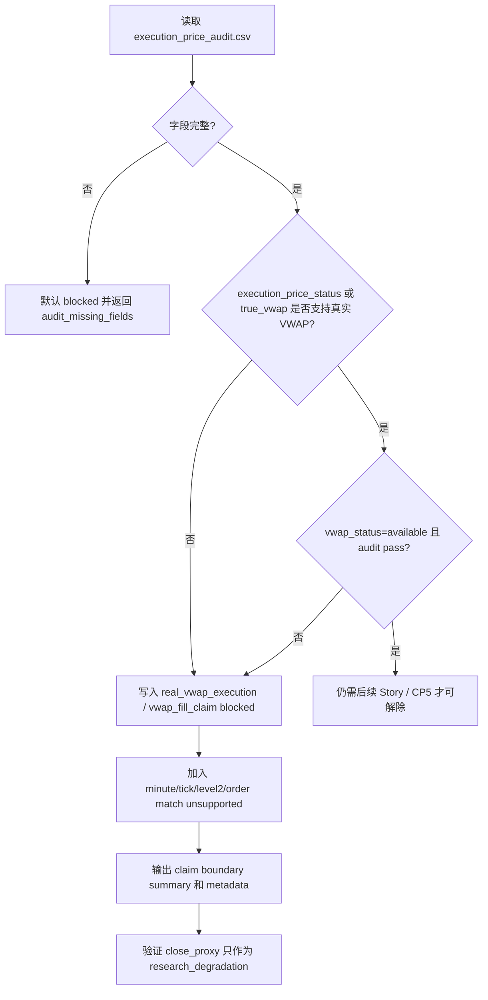

# LLD: CR013-S02 - execution / VWAP claim boundary

> 本文档是 CR013-S02 的低层设计，已通过 CP5 全量 LLD 审查；后续实现仍必须遵守 Story dev_gate、文件所有权和权限边界。
> 本 Story 固化 execution / VWAP / minute execution 的 blocked 声明边界，不接入真实 VWAP、分钟线、逐笔、盘口、委托、成交明细或真实撮合数据。

## 1. Goal

创建 execution / VWAP claim boundary 的实现蓝图：未来实现阶段只读消费 `execution_price_audit.csv`，在真实 `vwap` 字段、`vwap_status=available` 和 execution audit 通过前，将真实 VWAP、VWAP fill、分钟 / tick / Level2 / 撮合执行价声明保持 blocked / unsupported，并阻止 close proxy 或 `amount/volume` 被写成真实 VWAP claim。

## 2. Requirements（Functional / Non-Functional）

### 2.1 Functional

- 覆盖 REQ-084：`execution_price_status=required_missing`、`true_vwap_available_count=0` 或缺少 `vwap_status=available` 时，`blocked_claims` 必须包含 `real_vwap_execution` 与 `vwap_fill_claim`。
- 覆盖 REQ-086：默认执行路径不得 provider fetch、不得写真实 lake、不得读取凭据、不得读取旧 `data/**`、不得覆盖旧 audit。
- 覆盖 REQ-087：`reports/data_lake_readiness_2020_2024/execution_price_audit.csv` 作为 CR-013 旧证据只读保留。
- 在未来报告声明中输出 `execution_claim_boundary`、`unsupported_claims`、`allowed_claims` 和解除条件。
- 保留 CR011-S04 的 exact policy：`open`、`close`、`vwap`、`close_proxy`；`close_proxy` 只代表研究降级，不代表真实 VWAP。

### 2.2 Non-Functional

- 安全：不导入 `market_data/connectors/**`，不读取 `.env`，不访问真实 lake。
- 可验证：测试覆盖真实 VWAP allowed claim 为 0、`amount/volume` 派生禁止、旧 audit 覆盖次数为 0。
- 兼容：不破坏 CR011-S04 已冻结的 `execution_price_policy` 四值语义。
- 可追溯：每个 blocked claim 必须指向 `execution_price_audit.csv`、REQ-084、ADR-045。
- 可维护：字段名沿用 `execution_price_status`、`missing_ohlcv_columns`、`true_vwap_available_count`、`vwap_status`、`blocked_claims`。

## 3. 模块拆分与职责

| 模块 / 文件组 | 职责 | 说明 |
|---|---|---|
| Execution Audit Reader | 只读解析 `execution_price_audit.csv` | 缺字段时默认 blocked，不推断真实 VWAP |
| Claim Boundary Resolver | 计算 blocked / unsupported / allowed claims | 强制 real VWAP 和 VWAP fill blocked |
| Research Metadata Adapter | 将 execution blocked 信息映射到研究消费 metadata | 对应未来 `engine/research_dataset.py` 修改 |
| Report Claim Consumer | 将 execution blocked claims 纳入报告声明面 | 对应未来 `experiments/reporting.py` 修改 |
| Test Contract | 定义 derived VWAP 禁止、close proxy 降级和 old audit guard | 对应未来 pytest |

## 4. 代码结构与文件影响范围

| 动作 | 文件路径 | 变更内容 |
|---|---|---|
| 创建 | `reports/data_lake_readiness_2020_2024_cr013/execution_claim_boundary.md` | 未来实现阶段生成 execution / VWAP blocked 摘要和解除条件 |
| 修改 | `experiments/reporting.py` | 未来实现阶段将 execution blocked claims 纳入报告 metadata / claim boundary |
| 修改 | `engine/research_dataset.py` | 未来实现阶段将 close_proxy 降级 metadata 与 execution claim boundary 对齐 |
| 创建 | `tests/test_cr013_execution_vwap_claim_boundary.py` | 未来实现阶段覆盖 VWAP blocked、derived VWAP 禁止和 forbidden path |
| 禁止修改 | `reports/data_lake_readiness_2020_2024/execution_price_audit.csv` | 旧 audit 只读保留，覆盖次数必须为 0 |
| 禁止访问 | `market_data/connectors/**`、`/mnt/ugreen-data-lake/**`、`data/**`、`.env` | 本 Story 不执行真实数据接入或凭据读取 |

## 5. 数据模型与持久化设计

| 对象 / 字段 | 类型 | 约束 | 说明 |
|---|---|---|---|
| `logical_dataset` | string | 必填 | 预期为 `execution_prices` |
| `source_dataset` | string | 必填 | 当前为 `prices` |
| `execution_price_status` | enum | `required_missing` 时阻断真实执行价 claim | 来自 audit |
| `missing_ohlcv_columns` | list[string] | 只作证据，不可用于派生真实 VWAP | 当前证据为 `volume;amount` |
| `true_vwap_available_count` | integer | 为 0 时真实 VWAP allowed claim 必须为 0 | 来自 audit |
| `blocked_claims` | list[string] | 必含 `real_vwap_execution`、`vwap_fill_claim` | 来自 audit + ADR-045 |
| `unsupported_claims` | list[string] | 必含 minute/tick/level2/order match | 来自 HLD §29 与 ADR-045 |
| `allowed_claims` | list[string] | 不得包含真实 VWAP / VWAP fill / minute execution | close proxy 只能是 research degradation |
| `release_criteria` | list[string] | 必含真实 `vwap`、`vwap_status=available`、audit pass、CP5 approved | 解除 blocked 的条件 |
| `old_baseline_preserved` | boolean | 必须为 `true` | 旧 audit 不覆盖 |

持久化只发生在未来实现阶段的新文件 `reports/data_lake_readiness_2020_2024_cr013/execution_claim_boundary.md` 和研究/report metadata 输出中；本 LLD 不新增数据库、不写真实 lake。

## 6. API / Interface 设计

| 接口 / 入口 | 输入 | 输出 | 调用方 | 说明 |
|---|---|---|---|---|
| `read_execution_price_audit` | `execution_price_audit_path` | `ExecutionAudit` structured object | claim resolver / tests | 缺字段返回 `execution_audit_missing_fields` 并默认 blocked |
| `resolve_execution_claim_boundary` | `ExecutionAudit`、requested claims、CR011 execution policy metadata | `ExecutionClaimBoundary` | research dataset / reporting | real VWAP / VWAP fill / minute execution allowed count 必须为 0 |
| `attach_execution_claim_metadata` | research dataset metadata、`ExecutionClaimBoundary` | updated metadata | `engine/research_dataset.py` | 不改变价格数据，只增加声明边界 |
| `render_execution_claim_boundary` | `ExecutionClaimBoundary`、evidence paths | Markdown summary | report renderer | 输出解除条件，不输出真实 provider/lake 命令 |

错误模型：`execution_audit_missing_fields`、`real_vwap_claim_not_allowed`、`derived_vwap_claim_attempt`、`forbidden_audit_overwrite`、`forbidden_provider_or_lake_access`。

## 7. 核心处理流程

1. 只读解析 `execution_price_audit.csv`，不覆盖旧 audit。
2. 校验 `execution_price_status`、`missing_ohlcv_columns`、`true_vwap_available_count`、`blocked_claims`。
3. 当状态为 `required_missing` 或 true VWAP count 为 0 时，强制真实 VWAP / VWAP fill blocked。
4. 将 `minute_tick_level2_order_match` 与真实撮合执行价写入 unsupported。
5. 将 claim boundary 注入未来 report metadata 和 research dataset metadata。

## 8. 技术设计细节

- `amount/volume` 在本 Story 中不得作为真实 VWAP 解除条件；即使输入中出现 amount 和 volume，也只能触发 `derived_vwap_claim_attempt` 阻断。
- `close_proxy` 是 CR011 的研究降级 policy，不进入 `allowed_claims.real_vwap_execution`。
- `ExecutionClaimBoundary.allowed_claims` 必须显式排除 `real_vwap_execution`、`vwap_fill_claim`、`minute_execution`、`order_match_execution`。
- `release_criteria` 是文档化条件，不是可执行任务：真实 provider、lake、credential 和 old data 操作仍需另起 Story / CP5 / 用户授权。
- 兼容性处理：现有 CR011-S04 exact policy 不改枚举值；只新增 claim boundary metadata 和报告声明。
- 图示类型选择：流程图；原因是存在 audit 缺字段、真实 VWAP 缺失和后续授权门分支。

## 9. 安全与性能设计

| 维度 | 设计措施 | 验证方式 |
|---|---|---|
| 安全 | 只读 `execution_price_audit.csv`，不覆盖旧 audit | forbidden path sentinel |
| 安全 | 禁止导入 connector/storage/runtime、禁止读取 `.env`、禁止访问真实 lake | import scan / monkeypatch / counters |
| 安全 | release criteria 不包含 provider 命令、token、lake root 写入动作 | dangerous command / forbidden phrase scan |
| 性能 | 单行 audit CSV 解析，O(1)；metadata 合并 O(number of claims) | 单测运行小于 1 秒 |
| 兼容 | 保留 CR011-S04 execution policy 四值语义 | 回归测试校验枚举不变 |

## 10. 测试设计

| 测试场景 | 前置条件 | 操作 | 预期结果 | 验证方式 |
|---|---|---|---|---|
| required_missing 阻断真实 VWAP | audit fixture `execution_price_status=required_missing` | 调用 resolver | blocked 包含 `real_vwap_execution`、`vwap_fill_claim` | pytest |
| true VWAP count 为 0 | audit fixture `true_vwap_available_count=0` | 调用 resolver | 真实 VWAP allowed claim 输出次数为 0 | 字段断言 |
| close proxy 只能研究降级 | requested claim 包含 close proxy | 合并 metadata | 输出 `research_degradation`，不输出真实 VWAP | snapshot |
| `amount/volume` 派生禁止 | 构造 derived VWAP 请求 | 调用 resolver | 返回 `derived_vwap_claim_attempt` 或 blocked | pytest |
| 旧 audit 不覆盖 | 输出路径指向旧 audit | 调用 renderer | 返回 `forbidden_audit_overwrite` | tmp_path sentinel |
| 禁止真实操作 | 默认验证路径 | 读取 counters / import scan | provider/lake/credential/legacy data/old report 计数均为 0 | monkeypatch |

## 11. 实施步骤

| TASK-ID | 动作 | 目标文件 | 详细描述 | 对应测试 |
|---|---|---|---|---|
| CR013-S02-T1 | 创建 | `reports/data_lake_readiness_2020_2024_cr013/execution_claim_boundary.md` | 输出真实 VWAP / VWAP fill / minute execution blocked 摘要和解除条件 | required_missing 阻断、true VWAP count 为 0 |
| CR013-S02-T2 | 修改 | `experiments/reporting.py` | 将 execution blocked claims、unsupported claims 和 release criteria 纳入报告 metadata | close proxy 降级、旧 audit 不覆盖 |
| CR013-S02-T3 | 修改 | `engine/research_dataset.py` | 将 execution claim boundary 与 close_proxy 降级 metadata 对齐 | CR011 policy 兼容回归 |
| CR013-S02-T4 | 创建 | `tests/test_cr013_execution_vwap_claim_boundary.py` | 覆盖真实 VWAP claim=0、`amount/volume` 派生禁止、old audit overwrite=0 | 全部 S02 测试场景 |

## 12. 风险、难点与预研建议

| 风险 / 难点 | 影响 | 缓解措施 / 预研建议 |
|---|---|---|
| close proxy 被用户误读为真实成交价 | 报告真实性被高估 | metadata 中必须写 `research_degradation` 和 blocked claims |
| 后续开发误用 `amount/volume` 解除 VWAP blocked | 违反 ADR-045 | resolver 明确将派生请求映射为 blocked/error |
| 修改 shared 文件与 S03 冲突 | 报告 metadata merge 风险 | CP5 后由 S02 作为 shared merge owner 先冻结 execution claim boundary，S03 消费合同 |
| release criteria 被误解为执行授权 | 越权 provider/lake 操作 | release criteria 只描述条件，不包含命令、token 或 lake write |

### OPEN / Spike 跟踪

| ID | 类型（OPEN / Spike） | 问题 | 下一动作 | 责任方 |
|---|---|---|---|---|
| 无 | OPEN | 无阻断性 OPEN；真实 VWAP / 分钟数据接入不属于本 Story | 等待 CP5 后仅实现 blocked 声明边界 | meta-po / user |

## 13. 回滚与发布策略

- 发布方式：CP5 批次人工确认后，随 CR013-BATCH-A 离线实现；输出新 execution claim boundary summary，并更新研究/report metadata。
- 回滚触发条件：真实 VWAP / VWAP fill allowed claim 非 0、`amount/volume` 派生未被阻断、旧 audit 覆盖风险、真实 provider/lake/credential/old data 操作计数非 0。
- 回滚动作：撤销 S02 对 `experiments/reporting.py`、`engine/research_dataset.py`、新 summary 和测试的改动；旧 `execution_price_audit.csv` 不需要恢复，因为不应被修改。

## 14. Definition of Done

- [ ] 14 个章节全部填写完成。
- [ ] `confirmed=false`，CP5 批次人工确认前不进入实现。
- [ ] 文件影响范围覆盖 S02 的未来 summary、shared 文件和测试入口。
- [ ] 第 6 节每个接口均在第 10 节有对应测试场景。
- [ ] 第 7 节缺字段、required_missing、derived VWAP、forbidden path 异常路径均有测试入口。
- [ ] `blocked_claims` 包含 `real_vwap_execution` 和 `vwap_fill_claim`。
- [ ] 真实 VWAP / VWAP fill / minute execution allowed claim 输出次数为 0。
- [ ] provider/lake/credential/legacy data/old report 操作计数均为 0。

## 人工确认区

> CP5 自动预检结果：`process/checks/CP5-CR013-S02-execution-vwap-claim-boundary-LLD-IMPLEMENTABILITY.md`
> CP5 批次人工审查稿由 meta-po 后续创建：`checkpoints/CP5-CR013-BATCH-A-LLD-BATCH.md`

**人工审查结果回填**：

- 结论：`pending`
- 审查人：
- 审查时间：
- 修改意见：
- 风险接受项：
