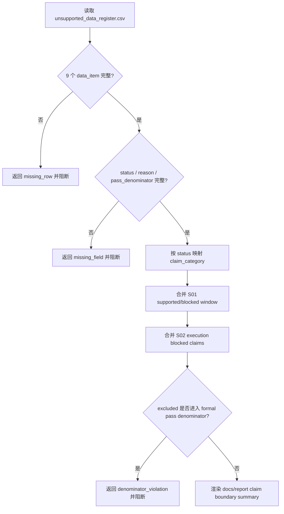

# LLD: CR013-S03 - unsupported register and docs refresh

> 本文档是 CR013-S03 的低层设计，已通过 CP5 全量 LLD 审查；后续实现仍必须遵守 Story dev_gate、文件所有权和权限边界。
> 本 Story 的实现会修改 README / USER-MANUAL / reporting 消费面，但不得覆盖旧证据报告或触发真实数据操作。

## 1. Goal

创建 unsupported register 与文档 / 报告声明刷新蓝图：未来实现阶段只读消费 `unsupported_data_register.csv`、S01 full-history gap 合同和 S02 execution claim boundary 合同，将 9 个 research-only / unsupported / contract-supported-but-unavailable 项纳入 README、USER-MANUAL 和新版报告声明边界，并保证 `pass_denominator=excluded` 项计入 formal pass denominator 的次数为 0。

## 2. Requirements（Functional / Non-Functional）

### 2.1 Functional

- 覆盖 REQ-085：9 行 unsupported register 必须进入 supported / research-only / unsupported / blocked 摘要，保留 `status`、`reason`、`pass_denominator`。
- 覆盖 REQ-086：默认实现和验证不得 provider fetch、写真实 lake、读凭据、读旧 `data/**` 或覆盖旧报告证据。
- 覆盖 REQ-087：旧 `unsupported_data_register.csv` 与 2020-2024 报告证据只读保留；新增输出必须使用 CR-013 新目录。
- 消费 S01 的 `supported_window`、`blocked_window`、`full_history_status` 合同。
- 消费 S02 的 `blocked_claims`、`unsupported_claims` 和 release criteria 合同。

### 2.2 Non-Functional

- 可追溯：每个 register item 必须回链 evidence path、REQ-085、ADR-046。
- 可验证：测试覆盖 9 行完整性、excluded denominator、README / USER-MANUAL / report summary 一致性和 old evidence overwrite=0。
- 安全：不覆盖 `reports/data_lake_readiness_limited_2025_2026/unsupported_data_register.csv` 或 `reports/data_lake_readiness_2020_2024/**`。
- 一致性：文档和报告必须同时表达 limited-window supported、2020-2024 blocked、execution/VWAP blocked、unsupported register。
- 可维护：声明字段命名固定为 `unsupported_data_items`、`research_only_items`、`blocked_claims`、`pass_denominator_policy`、`excluded_from_pass_denominator`。

## 3. 模块拆分与职责

| 模块 / 文件组 | 职责 | 说明 |
|---|---|---|
| Unsupported Register Reader | 只读解析 9 行 register | 缺行、缺字段或重复 data_item 均 fail |
| Claim Boundary Aggregator | 合并 S01 window boundary、S02 execution boundary 和 register rows | 输出统一 `claim_boundary_summary` |
| Docs Renderer | 渲染 README 与 USER-MANUAL 中的用户可见声明段落 | 未来实现阶段修改 `README.md`、`docs/USER-MANUAL.md` |
| Reporting Consumer | 将 summary 纳入新版研究报告 metadata | 未来实现阶段修改 `experiments/reporting.py` |
| Test Contract | 断言 9 行、excluded denominator、旧证据保护和文档/report 一致性 | 只使用 fixture / snapshot |

## 4. 代码结构与文件影响范围

| 动作 | 文件路径 | 变更内容 |
|---|---|---|
| 创建 | `reports/data_lake_readiness_2020_2024_cr013/unsupported_claim_boundary_summary.md` | 未来实现阶段输出 9 行 register 和 S01/S02 claim boundary 汇总 |
| 修改 | `README.md` | 未来实现阶段刷新 supported / unsupported / blocked claim 用户可见说明 |
| 修改 | `docs/USER-MANUAL.md` | 未来实现阶段刷新 full-history、VWAP 和 unsupported register 边界 |
| 修改 | `experiments/reporting.py` | 未来实现阶段将 register summary 纳入新版报告 metadata |
| 创建 | `tests/test_cr013_unsupported_register_claim_boundary.py` | 未来实现阶段覆盖 register、denominator、docs/report snapshot |
| 禁止修改 | `reports/data_lake_readiness_limited_2025_2026/unsupported_data_register.csv` | 旧 register 只读保留 |
| 禁止修改 | `reports/data_lake_readiness_2020_2024/**` | 旧 full-history 证据报告只读保留 |

## 5. 数据模型与持久化设计

| 对象 / 字段 | 类型 | 约束 | 说明 |
|---|---|---|---|
| `data_item` | enum | 必须为 9 个固定 item 之一 | exact set，不允许模糊匹配 |
| `status` | enum | `research_contract_only` / `unsupported` / `contract_supported_but_unavailable` | 不允许映射为 production available |
| `reason` | string | 必填，非空 | 用户文档和 report summary 必须保留 |
| `pass_denominator` | enum | 必须为 `excluded` | excluded 项计入 formal pass denominator 次数为 0 |
| `claim_category` | enum | `research_only` / `unsupported` / `blocked` | 从 status 确定 |
| `evidence_path` | string | 必填 | 指向旧 register 路径，作为只读证据 |
| `supported_window` | string | 来自 S01 | `2025-02-11..2026-02-18` |
| `blocked_window` | string | 来自 S01 | `2020-01-01..2024-12-31` |
| `execution_blocked_claims` | list[string] | 来自 S02 | 必含 real VWAP / VWAP fill |
| `old_baseline_preserved` | boolean | 必须为 `true` | 旧证据不覆盖 |

持久化只发生在未来实现阶段的 CR-013 新 summary、README / USER-MANUAL 文案和报告 metadata 中；本 LLD 不写业务产物。

## 6. API / Interface 设计

| 接口 / 入口 | 输入 | 输出 | 调用方 | 说明 |
|---|---|---|---|---|
| `read_unsupported_data_register` | `unsupported_register_path` | `UnsupportedRegister` 9 行 structured rows | aggregator / tests | 缺行、重复或缺字段时 fail |
| `build_claim_boundary_summary` | `UnsupportedRegister`、S01 boundary、S02 boundary、evidence paths | `ClaimBoundarySummary` | docs renderer / report consumer | excluded denominator 不进入 formal pass denominator |
| `render_user_docs_claim_boundary` | `ClaimBoundarySummary` | README / USER-MANUAL section model | docs renderer | 同时输出 supported / research-only / unsupported / blocked |
| `attach_report_claim_boundary` | report metadata、`ClaimBoundarySummary` | updated report metadata | `experiments/reporting.py` | 不覆盖旧报告证据 |
| `assert_denominator_policy` | summary rows | pass/fail | tests | 任一 excluded 项进入 pass denominator 时 fail |

错误模型：`unsupported_register_missing_row`、`unsupported_register_missing_field`、`duplicate_data_item`、`excluded_denominator_violation`、`old_register_overwrite_attempt`、`claim_boundary_contract_missing`。

## 7. 核心处理流程

1. 只读解析 register，固定校验 9 个 data_item。
2. 将 `research_contract_only` 映射为 research-only 声明，不映射为 production dataset。
3. 将 `unsupported` 和 `contract_supported_but_unavailable` 映射为 unsupported / blocked。
4. 合并 S01 的 full-history blocked 与 S02 的 execution/VWAP blocked。
5. 渲染 README、USER-MANUAL 和 report metadata 的一致声明模型。

## 8. 技术设计细节

- 9 个 data_item exact set：`industry_classification`、`market_cap`、`style_exposure_beta_size_value_quality`、`capacity_inputs_turnover_adv_constraints`、`corporate_actions_full`、`non_hs300_benchmark`、`minute_tick_level2_order_match`、`microstructure_impact_cost`、`real_vwap_execution`。
- `research_contract_only` 表示研究层入口或候选合同，不代表数据湖 current truth。
- `contract_supported_but_unavailable` 表示合同可表达但当前数据不可用，必须进入 blocked。
- S03 依赖 S01/S02 的 LLD 合同在同一 CP5 批次统一确认；CP5 未通过前不得实现文档或报告刷新。
- README 与 USER-MANUAL 渲染建议使用相同 `ClaimBoundarySummary` 数据模型，避免文档漂移。
- 图示类型选择：流程图；原因是存在 register 校验、依赖合同合并和 denominator 阻断分支。

## 9. 安全与性能设计

| 维度 | 设计措施 | 验证方式 |
|---|---|---|
| 安全 | 旧 register 与 2020-2024 旧报告只读保留 | forbidden path sentinel |
| 安全 | 文档刷新不触发 provider/lake/credential/old data 操作 | counters / import scan |
| 安全 | report metadata 不覆盖旧报告目录 | tmp_path 输出和 forbidden old path 测试 |
| 性能 | 9 行 register + 小型 metadata 合并，O(n) | 单测运行小于 1 秒 |
| 一致性 | README、USER-MANUAL、report summary 使用同一 summary model | snapshot 比对关键字段 |

## 10. 测试设计

| 测试场景 | 前置条件 | 操作 | 预期结果 | 验证方式 |
|---|---|---|---|---|
| 9 行 register 完整 | register fixture | 调用 reader | 精确包含 9 个 data_item | pytest |
| 缺字段阻断 | 删除 `reason` 或 `pass_denominator` | 调用 reader | 返回 missing_field | pytest |
| excluded denominator | summary builder 输入 9 行 excluded | 调用 denominator policy | formal pass denominator 计数为 0 | 字段断言 |
| 合并 S01/S02 合同 | 提供 S01/S02 fixture | 构建 summary | 同时包含 limited-window supported、2020-2024 blocked、execution/VWAP blocked | snapshot |
| 文档/report 一致 | 渲染 README / USER-MANUAL / report model | 比对关键字段 | 四类声明一致 | snapshot |
| 旧证据不可覆盖 | 输出路径命中旧 register 或旧报告目录 | 调用 renderer | 返回 overwrite attempt error | tmp_path sentinel |
| 禁止真实操作 | 默认验证路径 | 读取 counters | provider/lake/credential/legacy data/old report 计数均为 0 | monkeypatch |

## 11. 实施步骤

| TASK-ID | 动作 | 目标文件 | 详细描述 | 对应测试 |
|---|---|---|---|---|
| CR013-S03-T1 | 创建 | `reports/data_lake_readiness_2020_2024_cr013/unsupported_claim_boundary_summary.md` | 输出 9 行 register 的 research-only / unsupported / blocked 摘要，并合并 S01/S02 边界 | 9 行完整、合并 S01/S02、excluded denominator |
| CR013-S03-T2 | 修改 | `README.md` | 刷新 supported / unsupported / blocked claim 用户可见说明 | 文档/report 一致 |
| CR013-S03-T3 | 修改 | `docs/USER-MANUAL.md` | 刷新 full-history、VWAP 和 unsupported register 边界说明 | 文档/report 一致 |
| CR013-S03-T4 | 修改 | `experiments/reporting.py` | 将 register summary 纳入新版研究报告 metadata | report metadata snapshot、旧证据不可覆盖 |
| CR013-S03-T5 | 创建 | `tests/test_cr013_unsupported_register_claim_boundary.py` | 覆盖 9 行 register、excluded denominator、old evidence overwrite=0 | 全部 S03 测试场景 |

## 12. 风险、难点与预研建议

| 风险 / 难点 | 影响 | 缓解措施 / 预研建议 |
|---|---|---|
| README、USER-MANUAL 和 report summary 文案漂移 | 用户看到的声明不一致 | 使用同一 `ClaimBoundarySummary` model 渲染或快照验证关键字段 |
| research-only 被写成 production available | 误导生产级数据可用性 | status -> claim_category 映射强制 research-only / unsupported / blocked |
| S03 与 S02 同改 `experiments/reporting.py` | shared 文件合并冲突 | CP5 后按 dev plan 串行开发，S03 消费 S02 冻结合同 |
| 修改 docs 被误认为本 LLD 已执行 | 过程状态混淆 | LLD 明确 `confirmed=false`，本轮不修改 README/docs/代码/测试 |

### OPEN / Spike 跟踪

| ID | 类型（OPEN / Spike） | 问题 | 下一动作 | 责任方 |
|---|---|---|---|---|
| 无 | OPEN | 无阻断性 OPEN；S03 实现依赖 S01/S02 合同在 CP5 统一确认 | 等待 CP5 批次人工审查 | meta-po / user |

## 13. 回滚与发布策略

- 发布方式：CP5 批次人工确认后，在 S01/S02 合同冻结后实现 S03；刷新 README、USER-MANUAL、report metadata 和 CR-013 新 summary。
- 回滚触发条件：9 行 register 不完整、excluded 项进入 pass denominator、文档/report 声明不一致、旧证据覆盖风险、真实操作计数非 0。
- 回滚动作：撤销 README、USER-MANUAL、`experiments/reporting.py`、新 summary 和测试变更；不修改旧 register 或旧 2020-2024 报告证据。

## 14. Definition of Done

- [ ] 14 个章节全部填写完成。
- [ ] `confirmed=false`，CP5 批次人工确认前不进入实现。
- [ ] 文件影响范围覆盖 README、USER-MANUAL、reporting、summary 和测试入口。
- [ ] 第 6 节接口均在第 10 节有对应测试场景。
- [ ] 第 7 节缺行、缺字段、denominator violation、旧证据覆盖异常均有测试入口。
- [ ] 9 个 data_item 100% 进入声明摘要。
- [ ] `pass_denominator=excluded` 项计入 formal pass denominator 次数为 0。
- [ ] provider/lake/credential/legacy data/old report 操作计数均为 0。

## 人工确认区

> CP5 自动预检结果：`process/checks/CP5-CR013-S03-unsupported-register-and-doc-refresh-LLD-IMPLEMENTABILITY.md`
> CP5 批次人工审查稿由 meta-po 后续创建：`checkpoints/CP5-CR013-BATCH-A-LLD-BATCH.md`

**人工审查结果回填**：

- 结论：`pending`
- 审查人：
- 审查时间：
- 修改意见：
- 风险接受项：
