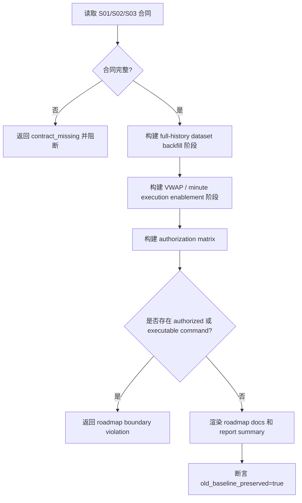

# LLD: CR013-S04 - full-history backfill roadmap

> 本文档是 CR013-S04 的低层设计，已通过 CP5 全量 LLD 审查；后续实现仍必须遵守 Story dev_gate、文件所有权和权限边界。
> 本 Story 只能设计路线图产物，不授权真实 provider fetch、真实 lake 写入、凭据读取、旧 `data/**` 读取、旧报告覆盖或可直接执行的 backfill 命令。

## 1. Goal

创建 2020-2024 full-history backfill roadmap 的实现蓝图：未来实现阶段输出路线图文档和 CR-013 新报告摘要，列出补齐 10 个正式 dataset、重新 readiness audit、刷新 unsupported register、接入真实 VWAP / 分钟数据的授权门、阶段顺序和验收条件；所有真实操作当前状态均为 `not_authorized` 或 `authorization_required`。

## 2. Requirements（Functional / Non-Functional）

### 2.1 Functional

- 覆盖 REQ-083：解除 full-history blocked 必须补齐 10 个正式 dataset 的 `2020-01-01..2024-12-31` current truth 并通过新 readiness audit。
- 覆盖 REQ-084：真实 VWAP / 分钟执行价解除条件必须包含真实 `vwap` 字段、`vwap_status=available`、execution audit pass 和对应 CP5 批次确认。
- 覆盖 REQ-086：本 Story 不授权 provider fetch、真实 lake 写入、凭据读取、旧 `data/**` 读取或旧报告覆盖。
- 覆盖 REQ-087：后续补数或刷新必须使用新 run_id、新目录或版本化文件，并写 `old_baseline_preserved=true`。
- 消费 S01 的 10 dataset gap / remediation 和 S02 的 execution / VWAP release criteria。

### 2.2 Non-Functional

- 安全：路线图不包含可直接执行的 provider/lake 命令、token、真实 lake root 写入动作或旧 data 操作。
- 可验证：测试覆盖 roadmap-only、authorization matrix、forbidden command scan、old evidence preserved。
- 可追溯：每个阶段必须回链 REQ-083..087、ADR-044/045/047、S01/S02 合同。
- 可维护：路线图必须把“当前未授权”和“未来可授权条件”分开写，防止误执行。
- 幂等：未来文档输出只写 CR-013 新报告摘要和新增 roadmap 文档；旧报告不覆盖。

## 3. 模块拆分与职责

| 模块 / 文件组 | 职责 | 说明 |
|---|---|---|
| Roadmap Builder | 基于 S01/S02/S03 合同生成阶段化路线图 | 只生成文档结构，不生成执行命令 |
| Authorization Matrix | 为每类真实操作标注 required approval / CP5 gate / current status | 当前均为 `not_authorized` 或 `authorization_required` |
| Release Criteria Catalog | 固化 full-history 与 VWAP / minute execution 解除条件 | 防止 CR-012 pass 外推 |
| Evidence Retention Plan | 规定新 run_id / 新目录 / old baseline preserved | 禁止覆盖旧报告 |
| Test Contract | 验证 roadmap-only、forbidden commands 和安全计数 | 对应未来 pytest |

## 4. 代码结构与文件影响范围

| 动作 | 文件路径 | 变更内容 |
|---|---|---|
| 创建 | `docs/DATA-LAKE-FULL-HISTORY-BACKFILL-ROADMAP.md` | 未来实现阶段新增路线图文档，列出阶段、授权门和 release criteria |
| 创建 | `reports/data_lake_readiness_2020_2024_cr013/backfill_roadmap.md` | 未来实现阶段新增路线图摘要和证据保留策略 |
| 创建 | `tests/test_cr013_backfill_roadmap_boundaries.py` | 未来实现阶段覆盖 roadmap-only、安全计数和 forbidden command scan |
| 禁止修改 | `market_data/connectors/**`、`market_data/storage.py` | S04 不实现 provider 或 lake 写入 |
| 禁止访问 | `/mnt/ugreen-data-lake/**`、`data/**`、`.env` | 本 Story 不读取真实 lake、旧 data 或凭据 |
| 禁止修改 | `reports/data_lake_readiness_2020_2024/**` | 旧 evidence baseline 只读保留 |

## 5. 数据模型与持久化设计

| 对象 / 字段 | 类型 | 约束 | 说明 |
|---|---|---|---|
| `roadmap_stage_id` | string | 必填，稳定 | 如 `FH-01`、`FH-02`、`VWAP-01` |
| `scope` | enum | `dataset_backfill` / `readiness_audit` / `unsupported_register_refresh` / `execution_vwap_enablement` / `publish_claim_update` | 阶段类型 |
| `required_inputs` | list[string] | 必填 | S01/S02/S03 合同、REQ、ADR 或 future authorization |
| `authorization_status` | enum | 当前必须为 `not_authorized` 或 `authorization_required` | 不允许 `authorized` |
| `required_gate` | string | 必填 | 单独 Story / CP5 / 用户显式授权 |
| `forbidden_until_authorized` | list[string] | 必填 | provider fetch、lake write、credential read、old data read、old report overwrite |
| `release_criteria` | list[string] | 必填 | full-history 或 VWAP 解除条件 |
| `future_run_id_rule` | string | 必填 | 新 run_id / 新目录规则 |
| `old_baseline_preserved` | boolean | 必须为 `true` | 旧证据不可覆盖 |

持久化仅为未来文档文件，不新增数据库、不新增脚本、不写真实 lake。

## 6. API / Interface 设计

| 接口 / 入口 | 输入 | 输出 | 调用方 | 说明 |
|---|---|---|---|---|
| `build_backfill_roadmap` | S01 gap contract、S02 execution boundary、S03 unsupported summary、REQ/ADR refs | `BackfillRoadmap` | docs/report renderer | 不输出执行命令 |
| `build_authorization_matrix` | operation kind、risk level、required gate | `AuthorizationMatrix` | roadmap renderer / tests | 未授权真实操作必须为 `not_authorized` |
| `render_backfill_roadmap_doc` | `BackfillRoadmap`、evidence retention policy | Markdown docs model | docs renderer | 不包含 token、provider command、lake write command |
| `assert_roadmap_only_boundary` | rendered docs text、operation counters | pass/fail | tests | 命中真实执行命令或 counters 非 0 时 fail |
| `render_backfill_roadmap_summary` | `BackfillRoadmap` | report summary Markdown | report writer | 输出 `old_baseline_preserved=true` |

错误模型：`roadmap_contains_executable_command`、`authorization_status_invalid`、`release_criteria_missing`、`old_baseline_preservation_missing`、`forbidden_real_operation_detected`。

## 7. 核心处理流程

1. 消费 S01 的 10 dataset gap 和 S02 的 VWAP release criteria；S03 summary 作为 unsupported register refresh 阶段输入。
2. 生成 full-history backfill、new readiness audit、unsupported register refresh、execution/VWAP enablement、publish claim update 五类阶段。
3. 为每个阶段标注当前授权状态、所需 CP5 / 用户授权和禁止操作。
4. 渲染路线图，不输出 provider 命令、token、lake root 写入动作或旧 data 操作。
5. 输出 evidence retention policy：future run_id、新报告目录、`old_baseline_preserved=true`。

## 8. 技术设计细节

- Full-history release criteria 固定为：10 个正式 dataset 覆盖 `2020-01-01..2024-12-31`、new readiness audit pass、新 run_id / 新报告、old baseline preserved。
- VWAP release criteria 固定为：真实 `vwap` 字段、`vwap_status=available`、execution audit pass、相关数据合同和 CP5 批次通过。
- 路线图中的真实操作只允许写为 `authorization_required` 或 `not_authorized`，不得出现 `authorized`。
- 文档禁止出现可直接执行命令，例如 provider fetch/backfill 命令、lake write 命令、token 设置命令或旧 data 复制命令。
- 依赖选择：使用 Markdown 文档和结构化表格即可，不新增脚本或共享模板。
- 图示类型选择：流程图；原因是路线图涉及合同输入、授权门和文档输出。

## 9. 安全与性能设计

| 维度 | 设计措施 | 验证方式 |
|---|---|---|
| 安全 | 所有真实操作当前状态为 `not_authorized` 或 `authorization_required` | authorization matrix 测试 |
| 安全 | 文档禁止 provider/lake/token/old data 可执行命令 | forbidden command scan |
| 安全 | 旧报告只读保留，未来输出使用新 run / 新目录 | evidence retention sentinel |
| 性能 | 纯文档生成，处理阶段数量固定 | snapshot 测试 |
| 可追溯 | 每个阶段回链 REQ、ADR、S01/S02/S03 合同 | 文档字段断言 |

## 10. 测试设计

| 测试场景 | 前置条件 | 操作 | 预期结果 | 验证方式 |
|---|---|---|---|---|
| roadmap-only 边界 | S01/S02/S03 fixture | 构建 roadmap | 不包含可执行 provider/lake 命令 | forbidden command scan |
| full-history release criteria | S01 gap fixture | 渲染路线图 | 包含 10 dataset、新 audit、新 run / report、old baseline preserved | snapshot |
| VWAP release criteria | S02 boundary fixture | 渲染路线图 | 包含 `vwap`、`vwap_status=available`、audit pass、CP5 approved | snapshot |
| authorization matrix | operation kind fixture | 构建 matrix | 所有真实操作状态为 `not_authorized` 或 `authorization_required` | 字段断言 |
| old evidence preserved | 输出 summary | 检查 metadata | `old_baseline_preserved=true`，old report overwrite=0 | sentinel |
| 禁止真实操作 | 默认验证路径 | 读取 counters | provider/lake/credential/legacy data/old report 计数均为 0 | monkeypatch |

## 11. 实施步骤

| TASK-ID | 动作 | 目标文件 | 详细描述 | 对应测试 |
|---|---|---|---|---|
| CR013-S04-T1 | 创建 | `docs/DATA-LAKE-FULL-HISTORY-BACKFILL-ROADMAP.md` | 输出后续补齐 10 dataset、复验、发布和声明解除条件路线图 | roadmap-only、full-history release criteria、VWAP release criteria |
| CR013-S04-T2 | 创建 | `reports/data_lake_readiness_2020_2024_cr013/backfill_roadmap.md` | 输出路线图摘要和证据保留策略 | old evidence preserved、authorization matrix |
| CR013-S04-T3 | 创建 | `tests/test_cr013_backfill_roadmap_boundaries.py` | 覆盖 roadmap-only、no provider/lake/credential/old data、old evidence preserved | 全部 S04 测试场景 |

## 12. 风险、难点与预研建议

| 风险 / 难点 | 影响 | 缓解措施 / 预研建议 |
|---|---|---|
| 路线图被误解为当前补数授权 | 越权真实数据操作 | 所有真实操作标注 `not_authorized` / `authorization_required`，并测试禁止命令 |
| release criteria 写得不完整 | 后续错误解除 blocked | full-history 和 VWAP release criteria 用固定字段和 snapshot 验证 |
| 旧证据保留规则遗漏 | 无法追溯 CR-013 触发依据 | 每个阶段都写 future run / new report rule 和 `old_baseline_preserved=true` |
| 文档中出现真实 lake 私有路径或 token 提示 | 安全泄露 | forbidden command / secret-like phrase scan |

### OPEN / Spike 跟踪

| ID | 类型（OPEN / Spike） | 问题 | 下一动作 | 责任方 |
|---|---|---|---|---|
| 无 | OPEN | 无阻断性 OPEN；真实 backfill / VWAP 接入必须另起 Story / CP5 / 用户授权 | 等待 CP5 批次人工审查 | meta-po / user |

## 13. 回滚与发布策略

- 发布方式：CP5 批次人工确认后，在 S01/S02 合同冻结后实现 S04；只发布新增 roadmap 文档、CR-013 新 roadmap summary 和测试。
- 回滚触发条件：路线图含可执行真实命令、authorization status 出现 `authorized`、release criteria 缺失、旧证据保留字段缺失、真实操作计数非 0。
- 回滚动作：删除或撤销新增 roadmap 文档、CR-013 新 roadmap summary 和测试；不修改旧报告、旧 register、真实 lake 或旧 `data/**`。

## 14. Definition of Done

- [ ] 14 个章节全部填写完成。
- [ ] `confirmed=false`，CP5 批次人工确认前不进入实现。
- [ ] 文件影响范围覆盖 S04 三个未来输出文件，且禁止路径明确。
- [ ] 第 6 节接口均在第 10 节有对应测试场景。
- [ ] 第 7 节合同缺失、可执行命令、授权状态异常、旧证据保留缺失均有测试入口。
- [ ] 路线图覆盖 10 dataset full-history release criteria 和真实 VWAP / minute execution release criteria。
- [ ] provider/lake/credential/legacy data/old report 操作计数均为 0。
- [ ] 路线图不包含真实 provider 命令、token、lake write 或旧 data 操作。

## 人工确认区

> CP5 自动预检结果：`process/checks/CP5-CR013-S04-full-history-backfill-roadmap-LLD-IMPLEMENTABILITY.md`
> CP5 批次人工审查稿由 meta-po 后续创建：`checkpoints/CP5-CR013-BATCH-A-LLD-BATCH.md`

**人工审查结果回填**：

- 结论：`pending`
- 审查人：
- 审查时间：
- 修改意见：
- 风险接受项：
