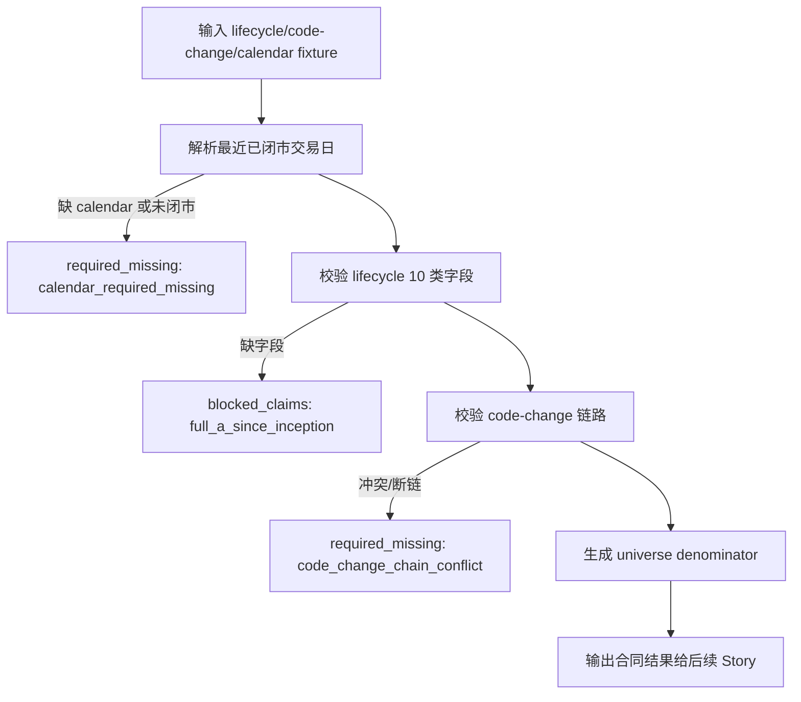

# LLD: CR014-S01 — 全 A universe / lifecycle / code-change 合同

> 本文档是 `CR014-S01-a-share-universe-lifecycle-contract` 的低层设计，纳入 `CR014-FULL-HISTORY-LAKE-BATCH-A` 全量 LLD 统一确认。CP5 已由用户按推荐全部允许，当前 `confirmed=true`、`implementation_allowed=true`；实现仍受 Story DAG、文件所有权、CP6/CP7 和禁止真实 provider / lake / credential / DuckDB 依赖边界约束。

## 1. Goal

创建 CR-014 全 A since-inception universe、证券生命周期、退市 / 摘牌、代码变更和最近已闭市交易日的静态合同，使后续 catalog、P0 pipeline、readiness 和 claim boundary 使用同一 denominator 与失败路径，不通过 provider 抓取、凭据读取、真实 lake 写入或 DuckDB 依赖变更来证明数据已覆盖。

## 2. Requirements（Functional / Non-Functional）

### 2.1 Functional

- 定义 `universe_scope=all_a_share`、`coverage_start_policy=security_inception_or_list_date`、`current_trade_date_policy=last_closed_open_trade_date`、`as_of_trade_date`、`calendar_source` 的合同字段。
- 定义 lifecycle 必需字段 10 类：`list_date`、`delist_date`、`list_status`、`code_change_mapping`、`exchange`、`board`、`effective_date`、`available_at`、`source_interface`、`run_id`。
- 定义稳定证券身份字段：`security_id`、`symbol`、`exchange`、`valid_from`、`valid_to`、`predecessor_id`、`successor_id`、`lifecycle_status`。
- lifecycle、calendar 或 code-change 缺字段时，必须输出结构化 `required_missing` / `blocked_claims`，且 `allowed_claims.full_a_since_inception` 输出次数为 0。
- 定义最近已闭市交易日策略：仅 `trade_calendar.is_open=true` 且市场已闭市的交易日可作为 `current_truth_as_of`。
- 明确本 Story 只提供合同、常量、轻量纯函数和 fixture contract test；不连接 provider，不读取 `.env`，不读取或写入 `data/**`，不写真实 lake。

### 2.2 Non-Functional

- 安全：CP5 前真实操作计数必须保持 `provider_fetch=0`、`lake_write=0`、`credential_read=0`、`duckdb_dependency_change=0`。
- 可维护：合同字段集中在 `market_data/contracts.py`，生命周期和日历策略分离到 `market_data/lifecycle.py`、`market_data/calendar.py`。
- 可验证：所有验收标准均通过静态字段检查或纯 fixture 单元测试验证，不依赖网络、旧数据或真实 provider。
- 兼容性：不移除现有 CR005/CR010/CR011/CR013 常量；新增 CR014 字段采用新增命名，避免改变既有调用方语义。

## 3. 模块拆分与职责

| 模块 / 文件组 | 职责 | 说明 |
|---|---|---|
| `market_data/contracts.py` | 创建 CR014 universe/lifecycle/code-change 合同常量、错误码、claim key 和字段集合 | 主所有权；不删除既有 dataset、quality、readiness 常量 |
| `market_data/lifecycle.py` | 创建证券生命周期记录、code-change 映射校验、denominator 构造和缺失字段汇总纯函数 | 不读取 provider 或 lake；只处理调用方传入的记录 |
| `market_data/calendar.py` | 创建最近已闭市交易日策略和 calendar 输入校验纯函数 | 不读取外部日历源；只校验 fixture / 调用方输入 |
| `market_data/validation.py` | 共享引用 `required_missing` / `blocked_claims` 错误枚举 | 仅作为后续 Story 的共享消费点，本 Story 不在 LLD 阶段修改 |
| `tests/test_cr014_universe_lifecycle_contract.py` | 创建纯 fixture contract test | 不联网、不读凭据、不读写 `data/**` |

## 4. 代码结构与文件影响范围

| 动作 | 文件路径 | 变更内容 |
|---|---|---|
| 修改 | `market_data/contracts.py` | 追加 CR014 全 A universe、lifecycle 10 类字段、security identity、code-change、calendar policy、claim boundary 和 forbidden counter 常量 |
| 创建 | `market_data/lifecycle.py` | 定义 lifecycle dataclass / typed dict、字段完整性校验、code-change 链路校验、denominator 构造和 blocked claim 输出 |
| 创建 | `market_data/calendar.py` | 定义 `current_truth_as_of` 计算、未闭市交易日阻断、calendar 缺失时 `required_missing` 输出 |
| 创建 | `tests/test_cr014_universe_lifecycle_contract.py` | 覆盖字段完整、退市纳入 denominator、代码变更身份追踪、缺字段阻断 full-A allowed claim 和 CP5 前计数为 0 |

禁止修改：`.env`、`data/**`、`reports/**`、`pyproject.toml`、`uv.lock`、provider adapter、真实 lake 写入路径和 DuckDB 依赖。

## 5. 数据模型与持久化设计

| 对象 / 字段 | 类型 | 约束 | 说明 |
|---|---|---|---|
| `SecurityLifecycleRecord.security_id` | `str` | 必填，稳定身份；同一证券跨代码变更保持不变 | 用于避免幸存者偏差和重复计数 |
| `SecurityLifecycleRecord.symbol` | `str` | 必填，交易代码；可随时间变化 | 与 `security_id` 分离 |
| `SecurityLifecycleRecord.exchange` | `str` | 必填，限定沪深北等交易所编码 | 进入 universe denominator |
| `SecurityLifecycleRecord.board` | `str` | 必填，主板 / 创业板 / 科创板 / 北交所等 | 支持分区和审计 |
| `SecurityLifecycleRecord.list_date` | `str` | 必填，`YYYY-MM-DD` | 覆盖起点候选 |
| `SecurityLifecycleRecord.delist_date` | `str | None` | 必填字段，可为空值表示未退市 | 退市后仍可追溯 |
| `SecurityLifecycleRecord.list_status` | `str` | 必填，枚举 `listed/delisted/suspended/pre_listed/unknown` | `unknown` 必须进入 blocked |
| `SecurityLifecycleRecord.lifecycle_status` | `str` | 必填，枚举 `active/delisted/suspended/not_yet_listed/required_missing` | 输出给 readiness / claim |
| `SecurityLifecycleRecord.effective_date` | `str` | 必填，`YYYY-MM-DD` | as-of 口径 |
| `SecurityLifecycleRecord.available_at` | `str` | 必填，ISO 时间或规则名 | 防未来函数输入 |
| `SecurityLifecycleRecord.source_interface` | `str` | 必填，不含凭据 | 只记录接口名 |
| `SecurityLifecycleRecord.run_id` | `str` | 必填 | 追溯来源批次 |
| `CodeChangeMapping.predecessor_id` | `str | None` | 条件必填 | 旧身份映射 |
| `CodeChangeMapping.successor_id` | `str | None` | 条件必填 | 新身份映射 |
| `CodeChangeMapping.effective_date` | `str` | 必填 | 同日多映射必须 fail-fast |
| `CurrentTruthAsOf.as_of_trade_date` | `str` | 必填；必须为最近已闭市开市交易日 | 盘中或未闭市不得 publish current truth |
| `RequiredMissingItem.code` | `str` | 必填 | 例如 `lifecycle_required_missing`、`calendar_required_missing`、`code_change_chain_conflict` |
| `BlockedClaim.claim` | `str` | 必填 | `full_a_since_inception` 等 |

无新增持久化写入。上述对象在本 Story 中作为内存合同和未来 Parquet/catalog 字段约束；不会创建或修改真实 lake 文件。

## 6. API / Interface 设计

| 接口 / 入口 | 输入 | 输出 | 调用方 | 说明 |
|---|---|---|---|---|
| `CR014_LIFECYCLE_REQUIRED_FIELDS` | 无 | `tuple[str, ...]` | S02/S03/S05、测试 | 固化 10 类 lifecycle 必需字段 |
| `CR014_UNIVERSE_METADATA_FIELDS` | 无 | `tuple[str, ...]` | readiness/catalog/claim | 固化 universe/current trade date 元数据字段 |
| `validate_lifecycle_records(records)` | `Sequence[Mapping[str, object]]` | `LifecycleValidationResult`：`passed`、`required_missing`、`blocked_claims` | planner、quality、claim audit | 缺字段时 `passed=false`，full-A allowed claim 为 0 |
| `build_universe_denominator(records, as_of_trade_date)` | lifecycle 记录、as-of date | `UniverseDenominator`：证券集合、分母、缺口 | S02/S03/S05 | 退市前日期纳入，退市后保留可追溯状态 |
| `validate_code_change_chain(mappings)` | code-change 记录 | `CodeChangeValidationResult` | lifecycle / claim audit | 同日多映射、断链或循环输出 `required_missing` |
| `resolve_current_truth_as_of(calendar_rows, now, market_close_time)` | calendar 行、当前时间、闭市规则 | `CurrentTruthAsOf` 或 `required_missing` | planner、catalog、publish | 无 calendar 或未闭市时不得发布 current truth |
| `build_full_a_blocked_claims(validation_result)` | lifecycle/calendar/code-change 校验结果 | `blocked_claims`、`allowed_claims.full_a_since_inception=false` | S05/报告输入 | 禁止自然语言兜底 |

错误暴露：所有入口返回结构化 `required_missing` / `blocked_claims`，不抛出包含凭据、路径或 provider 响应的异常。输入为 fixture 或调用方内存对象，不打开网络、`.env`、旧 `data/**` 或真实 lake。

## 7. 核心处理流程

1. 调用方提供 lifecycle、code-change 和 calendar fixture / candidate 记录。
2. `resolve_current_truth_as_of` 校验最近已闭市交易日；若 calendar 缺失或当前交易日未闭市，返回 `calendar_required_missing` 并阻断 current truth。
3. `validate_lifecycle_records` 检查 10 类必需字段覆盖率；缺任一字段时输出 `lifecycle_required_missing`。
4. `validate_code_change_chain` 检查同日多映射、断链、循环和 predecessor/successor 不一致；失败时输出 `code_change_chain_conflict`。
5. `build_universe_denominator` 按 `as_of_trade_date` 生成全 A denominator，包含退市 / 摘牌证券的历史可追溯状态。
6. `build_full_a_blocked_claims` 将任何缺口转成 `required_missing` / `blocked_claims`，并保持 `allowed_claims.full_a_since_inception=false`。
7. 若所有合同字段完整，输出可被 S02/S03/S05 引用的 denominator 和 lifecycle status；仍不声明真实数据已覆盖。



## 8. 技术设计细节

- 关键算法 / 规则：
  - `as_of_trade_date` 只接受最近已闭市且 `is_open=true` 的交易日；盘中或未来日期输出 `current_trade_date_unavailable`。
  - denominator 使用稳定 `security_id`，以 `list_date <= as_of_trade_date` 且 `delist_date is None or delist_date >= target_date` 判定历史纳入；退市后保留 `lifecycle_status=delisted` 供追溯。
  - code-change 映射要求同一 `security_id` 在同一 `effective_date` 只存在一个 successor / predecessor 路径；出现多映射、循环或断链时 fail-fast。
  - `required_missing` 和 `blocked_claims` 必须包含 `code`、`field`、`security_id/symbol`、`as_of_trade_date`、`evidence_path` 或 `evidence_ref`、`unblock_condition`。
- 依赖选择与复用点：
  - 使用 Python 标准库 dataclass / typing；不引入 DuckDB 或新依赖。
  - 复用现有 `market_data/contracts.py` 的 dataset、quality、readiness 常量命名风格。
- 兼容性处理：
  - 新增 CR014 常量使用 `CR014_` 前缀；不改变已有 `DATASETS`、`DATASET_SCHEMA_REGISTRY` 的现有语义。
  - 若后续 S02/S03 需要 catalog 字段，读取本 Story 导出的 tuple/dict，不重复定义 lifecycle 字段。
- 图示类型选择：流程图，因存在 calendar/lifecycle/code-change 三类异常分支。

CP5 前门控：`implementation_allowed=false`、`provider_fetch=0`、`lake_write=0`、`credential_read=0`、`duckdb_dependency_change=0`。本 LLD 不授权真实执行。

## 9. 安全与性能设计

| 维度 | 设计措施 | 验证方式 |
|---|---|---|
| 安全 | 所有入口只接收调用方传入的内存记录；不读取 `.env`、不打开网络、不扫描旧 `data/**`、不写 lake | 单元测试 monkeypatch provider / env / path 计数为 0；静态检查禁止范围 |
| 安全 | 错误输出只包含字段名、枚举码和脱敏 evidence ref，不包含 token、私有路径或 provider payload | contract test 检查错误字段白名单 |
| 性能 | lifecycle 校验按记录线性扫描，code-change 使用 dict/set 检查冲突 | fixture 测试覆盖千级记录；不做全历史真实扫描 |
| 性能 | denominator 生成不一次性读取真实 Parquet；由调用方提供候选记录 | 测试使用内存 fixture |
| 一致性 | 稳定 `security_id` 与 `symbol` 分离，防止代码变更导致重复计数 | code-change identity test |

## 10. 测试设计

| 测试场景 | 前置条件 | 操作 | 预期结果 | 验证方式 |
|---|---|---|---|---|
| lifecycle 字段完整 | fixture 含 10 类必需字段 | 调用 `validate_lifecycle_records` | `passed=true`，`required_missing=[]` | `tests/test_cr014_universe_lifecycle_contract.py::test_lifecycle_required_fields_complete` |
| lifecycle 缺字段 | 删除 `available_at` 或 `source_interface` | 调用 `validate_lifecycle_records` 与 `build_full_a_blocked_claims` | `allowed_claims.full_a_since_inception=false`，full-A allowed claim 输出次数为 0 | 单元测试 |
| 退市证券历史纳入 | 证券有 `delist_date`，目标日期早于退市日 | 调用 `build_universe_denominator` | 证券纳入 denominator，并输出可追溯 status | 单元测试 |
| 退市后状态追溯 | 目标日期晚于退市日 | 调用 `build_universe_denominator` | 不作为 active denominator；保留 `lifecycle_status=delisted` | 单元测试 |
| 代码变更身份追踪 | 同一 `security_id` 对应 old/new symbol | 调用 `validate_code_change_chain` | predecessor/successor 链路有效，`security_id` 稳定 | 单元测试 |
| 同日多映射阻断 | 同一 predecessor 同日两个 successor | 调用 `validate_code_change_chain` | 输出 `code_change_chain_conflict` | 单元测试 |
| 未闭市日阻断 | calendar 当前交易日未闭市 | 调用 `resolve_current_truth_as_of` | 不返回 current truth，输出 `current_trade_date_unavailable` | 单元测试 |
| CP5 前权限计数 | 无实现授权 | 读取 CR014 门控常量 / 测试 fixture | `provider_fetch=0`、`lake_write=0`、`credential_read=0`、`duckdb_dependency_change=0` | 静态 + 单元测试 |

## 11. 实施步骤

| TASK-ID | 动作 | 目标文件 | 详细描述 | 对应测试 |
|---|---|---|---|---|
| TASK-CR014-S01-01 | 修改 | `market_data/contracts.py` | 追加 CR014 universe metadata、lifecycle required fields、identity fields、calendar policy、required_missing / blocked_claim code 和 forbidden counter 常量 | lifecycle 字段完整、CP5 前权限计数 |
| TASK-CR014-S01-02 | 创建 | `market_data/lifecycle.py` | 实现 lifecycle 记录校验、code-change 链路校验、denominator 构造和 full-A blocked claim 输出纯函数 | lifecycle 缺字段、退市证券、代码变更、多映射阻断 |
| TASK-CR014-S01-03 | 创建 | `market_data/calendar.py` | 实现最近已闭市交易日解析、calendar 缺失和未闭市阻断输出 | 未闭市日阻断 |
| TASK-CR014-S01-04 | 创建 | `tests/test_cr014_universe_lifecycle_contract.py` | 编写纯 fixture contract test；断言不联网、不读凭据、不读写 `data/**` | 全部 S01 测试场景 |

每个 TASK 只对应本 Story 主要所有权文件；不得修改 S02/S03/S05 的 primary 文件。

## 12. 风险、难点与预研建议

| 风险 / 难点 | 影响 | 缓解措施 / 预研建议 |
|---|---|---|
| 当前已有 `stock_basic` 字段不足以表达完整 code-change | denominator 出现幸存者偏差或重复计数 | 合同先输出 `required_missing`，后续 provider/interface 未确认前 full-A allowed claim 为 0 |
| `symbol` 与稳定 `security_id` 混用 | 代码变更后历史追踪错误 | S01 明确 `security_id` 是主身份，`symbol` 是时间有效属性 |
| 最近已闭市交易日依赖真实 calendar | CP5 前不能抓取 provider | 本 Story 只定义策略和 fixture 校验；真实 calendar 数据由后续授权 run 提供 |
| 下游 Story 重复定义 lifecycle 字段 | 合同漂移 | S02/S03/S05 必须引用 `CR014_LIFECYCLE_REQUIRED_FIELDS`，不得复制并扩展字段 |

### OPEN / Spike 跟踪

| ID | 类型（OPEN / Spike） | 问题 | 下一动作 | 责任方 |
|---|---|---|---|---|
| 无 | N/A | 无阻塞 OPEN/Spike；真实 provider/interface 和 lake root 属于后续 CP5 + 用户显式授权范围 | CP5 批次确认后由对应实现 Story 按授权推进 | meta-po / user |

## 13. 回滚与发布策略

- 发布方式：随 CR014 批次实现以普通代码变更发布；在 CP5 前仅发布 LLD 与 CP5 自动预检，不发布代码。
- 回滚触发条件：contract test 失败、字段与 ADR-050 冲突、下游 S02/S03 无法消费、或 CP5 人工审查要求修改。
- 回滚动作：撤回本 Story 新增 CR014 常量与 `lifecycle.py` / `calendar.py` 实现，保留既有 CR005/CR010/CR011/CR013 常量；不触碰旧 `data/**`、reports 或真实 lake。

## 14. Definition of Done

- [ ] 14 个章节全部填写完成
- [ ] 文件影响范围、接口、测试与实施步骤可直接指导编码
- [x] CP5 已确认，`confirmed=true` 后才进入受控实现
- [ ] 人工确认意见已收敛
- [ ] frontmatter 已填写 `tier`
- [ ] OPEN / Spike 已清点或显式写“无”
- [ ] lifecycle 必需字段 10 类 100% 进入合同设计
- [ ] lifecycle 缺字段时 `allowed_claims.full_a_since_inception=false`
- [ ] 退市、摘牌、代码变更均有 `required_missing` / `blocked_claims` 输出路径
- [x] CP5 前门控已保持 `implementation_allowed=false`、`provider_fetch=0`、`lake_write=0`、`credential_read=0`、`duckdb_dependency_change=0`；CP5 后仍不授权真实 provider / lake / credential / DuckDB 依赖操作

## 人工确认区

> **CP5 — Story LLD 可实现性门**
> meta-dev 先写入 `process/checks/CP5-CR014-S01-a-share-universe-lifecycle-contract-LLD-IMPLEMENTABILITY.md` 自动预检结果。
> meta-po 收齐 `CR014-FULL-HISTORY-LAKE-BATCH-A` 全部目标 Story 的 LLD、CP4 自动预检摘要和 CP5 自动预检后，再生成并提示用户审查 `checkpoints/CP5-ALL-STORIES-LLD-BATCH.md`。
> 用户统一确认全部目标 Story 的 LLD 后，仍需满足当前 Wave、依赖门控与文件所有权门控方可进入实现。

**CP5 checklist 摘要**：

| # | 检查项 | 状态 | 证据 |
|---|---|---|---|
| 1 | LLD 覆盖 AC | 待检查 | 第 2 / 10 / 14 节 |
| 2 | 与 HLD / ADR 一致 | 待检查 | 第 3 / 8 / 12 节 |
| 3 | 文件影响范围明确 | 待检查 | 第 4 / 11 节 |
| 4 | 接口契约完整 | 待检查 | 第 6 节 |
| 5 | 测试与 dev_gate 可计算 | 待检查 | 第 10 / 14 节 |

**人工确认回复**：

请直接回复以下任一整行：

```text
approve
修改: <具体修改点>
reject
```

**人工审查结果回填**：

- 结论：`approved | changes_requested | rejected`
- 审查人：
- 审查时间：
- 修改意见：
- 风险接受项：
