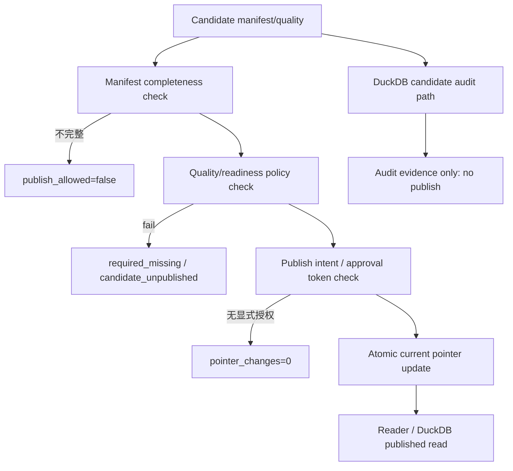

# LLD: CR014-S02 — Parquet layout / manifest / catalog current pointer / publish gate

> 本文档是 `CR014-S02-parquet-layout-manifest-catalog-publish-gate` 的低层设计，依赖 S01 的 universe/lifecycle 合同，并纳入 `CR014-FULL-HISTORY-LAKE-BATCH-A` 全量 LLD 统一确认。CP5 已由用户按推荐全部允许，当前 `confirmed=true`、`implementation_allowed=true`；实现仍受 Story DAG、文件所有权、CP6/CP7 和禁止真实 provider / lake / credential / DuckDB 依赖边界约束，且 current pointer 发布仍需 explicit publish gate。

## 1. Goal

创建 CR-014 P0 Parquet lake layout、append-only manifest、catalog current pointer 和 Explicit Publish Gate 的合同，使 candidate path、published current truth 和 DuckDB read-only 可见范围明确分离，并确保 Validate / parity PASS 自动更新 current pointer 次数为 0。

## 2. Requirements（Functional / Non-Functional）

### 2.1 Functional

- 定义 P0 dataset 的 Hive-style 分区路径合同，覆盖 `dataset`、`schema_version`、`partition_date/trade_date`、可选 `exchange/board`、`run_id` 与 `candidate/published` 状态。
- 定义 manifest append-only 记录字段，覆盖 run metadata、source/interface、schema hash、row count、quality/readiness status、lineage checksum、candidate path 和 lifecycle denominator reference。
- 定义 catalog current pointer 必填字段：`dataset`、`schema_version`、`coverage_start`、`coverage_end`、`coverage_denominator`、`latest_manifest_run_id`、`lineage_checksum`、`published_at`、`known_limitations`、`universe_scope`、`as_of_trade_date`。
- 定义 Explicit Publish Gate：只有 quality/readiness policy 满足且有显式 publish intent / approval token 时，才允许 atomic pointer update。
- Validate / parity PASS、normalize/replay candidate 输出、DuckDB audit evidence 均不得自动更新 current pointer。
- DuckDB 只能读取 catalog current pointer 指向路径，或受控 candidate audit path；DuckDB 结果不反向成为 source of truth。

### 2.2 Non-Functional

- 安全：CP5 前所有真实操作计数为 0；不真实写 raw/canonical/gold/quality/catalog，不更新 current pointer。
- 一致性：catalog pointer 更新采用单写者语义；candidate 与 published 路径分离，避免未发布候选污染研究消费。
- 可追溯：manifest 和 catalog 必须可追溯 S01 lifecycle denominator、source_interface、run_id 与 schema hash。
- 可测试：通过 fixture path / manifest / catalog dict 验证合同；不访问真实 lake root、旧 `data/**` 或 provider。

## 3. 模块拆分与职责

| 模块 / 文件组 | 职责 | 说明 |
|---|---|---|
| `market_data/lake_layout.py` | 修改路径合同，新增 CR014 candidate/published 分区、manifest/catalog 路径解析和受控 candidate audit path 表达 | 主所有权；路径解析不隐式写入 |
| `market_data/manifest.py` | 创建 CR014 append-only manifest 记录模型、schema hash / lineage checksum 字段和完整性校验 | 不写真实文件；实现阶段可提供纯序列化工具 |
| `market_data/catalog.py` | 修改 catalog current pointer 模型，新增 CR014 必填字段和只读 current pointer 读取合同 | current pointer 更新只经 publish gate |
| `market_data/publish.py` | 创建 Explicit Publish Gate 状态机、publish intent 校验、atomic pointer update 合同和未授权阻断输出 | CP5 前 `publish_allowed=false` |
| `market_data/contracts.py` | 读取 S01 导出的 CR014 lifecycle/universe 常量 | 共享文件；S02 不扩展 S01 lifecycle 字段 |
| `tests/test_cr014_catalog_publish_gate.py` | 创建 fixture contract test | 不写真实 lake；使用临时内存或 tmp_path 模拟路径 |

## 4. 代码结构与文件影响范围

| 动作 | 文件路径 | 变更内容 |
|---|---|---|
| 修改 | `market_data/lake_layout.py` | 增加 CR014 Parquet 分区 path builder、candidate/published 路径区分、catalog pointer path 和 candidate audit path 解析 |
| 创建 | `market_data/manifest.py` | 定义 `ManifestRecord`、`ManifestCompletenessResult`、append-only record 校验和 manifest 不完整阻断 publish 的纯函数 |
| 修改 | `market_data/catalog.py` | 扩展 `CatalogEntry` 或新增 `CatalogPointer` 合同字段，保留现有 catalog 读取兼容；新增 current pointer 必填校验 |
| 创建 | `market_data/publish.py` | 定义 `PublishIntent`、`PublishGateResult`、`validate_publish_candidate`、`publish_current_pointer` 合同；未授权时不更新 pointer |
| 创建 | `tests/test_cr014_catalog_publish_gate.py` | 覆盖 candidate validate PASS 不改 pointer、显式 publish 才改 pointer、candidate/published 分离、DuckDB read-only 路径白名单 |

禁止修改：`.env`、`data/**`、`reports/**`、`pyproject.toml`、`uv.lock`、真实 lake current pointer、provider adapter、DuckDB 依赖。

## 5. 数据模型与持久化设计

| 对象 / 字段 | 类型 | 约束 | 说明 |
|---|---|---|---|
| `ParquetPartition.dataset` | `str` | 必填，限定 P0 dataset 或 lifecycle/code-change 派生对象 | 路径第一层或 metadata 字段 |
| `ParquetPartition.schema_version` | `str` | 必填 | 支持 schema 演进 |
| `ParquetPartition.partition_date` | `str` | 条件必填，`YYYY-MM-DD` | trade date 或 effective date |
| `ParquetPartition.exchange` | `str | None` | 可选 | 支持全 A 分区裁剪 |
| `ParquetPartition.board` | `str | None` | 可选 | 支持板块裁剪 |
| `ParquetPartition.run_id` | `str` | candidate 必填 | 追踪 run / normalize / replay |
| `ManifestRecord.run_id` | `str` | 必填 | 与 S03 run metadata 对齐 |
| `ManifestRecord.dataset` | `str` | 必填 | P0 dataset |
| `ManifestRecord.source` | `str` | 必填；不含凭据 | provider 名称或 fixture source |
| `ManifestRecord.source_interface` | `str` | 必填 | exact interface |
| `ManifestRecord.schema_hash` | `str` | 必填 | schema 变化可追溯 |
| `ManifestRecord.row_count` | `int` | 必填，`>=0` | coverage 输入 |
| `ManifestRecord.quality_status` | `str` | 必填，`pass/warn/fail/missing` | publish gate 输入 |
| `ManifestRecord.readiness_status` | `str` | 必填 | claim boundary 输入 |
| `ManifestRecord.lifecycle_denominator_ref` | `str` | 必填 | 引用 S01 denominator 合同 |
| `ManifestRecord.candidate_path` | `str` | 必填 | 未发布候选路径 |
| `CatalogPointer.dataset` | `str` | 必填 | current truth key |
| `CatalogPointer.coverage_start` | `str` | 必填 | 全 A since-inception 起点策略输出 |
| `CatalogPointer.coverage_end` | `str` | 必填 | `as_of_trade_date` |
| `CatalogPointer.coverage_denominator` | `int` | 必填 | 来自 S01 denominator |
| `CatalogPointer.latest_manifest_run_id` | `str` | 必填 | 最新 published run |
| `CatalogPointer.lineage_checksum` | `str` | 必填 | lineage 完整性 |
| `CatalogPointer.published_at` | `str` | 必填 | publish 时间 |
| `CatalogPointer.known_limitations` | `list[dict]` | 必填，可为空 | 限制项结构化 |
| `PublishIntent.approval_token` | `str` | publish 必填 | CP5 后用户显式授权输入；CP5 前为空且阻断 |

持久化设计：本 Story 只定义未来 JSON / JSONL / Parquet metadata 合同和路径规则。CP5 前不创建、不修改、不读取真实 lake 文件；实现阶段单元测试只能使用 `tmp_path` 或内存 fixture。

## 6. API / Interface 设计

| 接口 / 入口 | 输入 | 输出 | 调用方 | 说明 |
|---|---|---|---|---|
| `LakeLayout.candidate_dataset_root(dataset, schema_version, run_id)` | dataset、schema_version、run_id | candidate Parquet root path | S03 normalize/replay、S04 audit | 只返回路径对象，不创建目录 |
| `LakeLayout.published_dataset_root(dataset, schema_version)` | dataset、schema_version | published root path | reader/DuckDB read-only | 只能由 catalog pointer 引用 |
| `LakeLayout.candidate_audit_path(dataset, run_id, audit_id)` | dataset、run_id、audit_id | 受控 audit path | DuckDB candidate audit | 不等同 published current truth |
| `validate_manifest_record(record)` | manifest dict / dataclass | `ManifestCompletenessResult` | S03/S05/publish | 不完整时 `publish_allowed=false` |
| `validate_catalog_pointer(pointer)` | catalog pointer dict / dataclass | `CatalogPointerValidationResult` | reader/DuckDB/publish | 必填字段缺失时 current truth 不可见 |
| `validate_publish_candidate(candidate, quality, manifest, lifecycle, intent)` | candidate metadata、quality/readiness、manifest、S01 denominator、publish intent | `PublishGateResult` | CLI publish / S03 | Validate PASS 但无 intent 时 `pointer_changes=0` |
| `publish_current_pointer(store, candidate, intent, dry_run=True)` | catalog store / candidate / intent / dry_run | `PointerUpdateResult` | Explicit Publish Gate | CP5 前只允许 dry-run，真实写入为 0 |
| `get_current_pointer(dataset, quality_policy)` | dataset、quality policy | catalog pointer 或 typed error | readers/DuckDB audit | 只读，不触发 publish |

错误暴露：输出 `manifest_incomplete`、`catalog_pointer_incomplete`、`candidate_unpublished`、`publish_not_authorized`、`quality_not_publishable`、`lifecycle_denominator_missing`。错误不包含 token、`.env` 内容、provider payload 或真实私有路径。

## 7. 核心处理流程

1. S03 normalize/replay 生成 candidate metadata 和 manifest record；本 Story 只定义字段，不触发生成。
2. `validate_manifest_record` 检查 run metadata、schema hash、row count、quality/readiness、lineage 和 S01 denominator ref。
3. `validate_catalog_pointer` 检查 current pointer 必填字段；缺字段时 reader/DuckDB 不可默认读取。
4. Validate / parity 阶段即使 `quality_status=pass`，也只产生 candidate quality/readiness 或 audit evidence，`pointer_changes=0`。
5. Explicit Publish Gate 接收 quality/readiness PASS、manifest 完整、lifecycle denominator 完整和 publish intent。
6. 无 publish intent、approval token 或 CP5+用户授权时，返回 `publish_not_authorized`，current pointer 保持旧值。
7. 只有 publish gate 通过时，才执行 atomic pointer update；reader 和 DuckDB published read 只读更新后的 catalog pointer。



## 8. 技术设计细节

- 关键算法 / 规则：
  - Candidate path 与 published current truth path 必须不同；candidate path 至少包含 `run_id`，published path 必须通过 catalog pointer 间接暴露。
  - Manifest 采用 append-only record 合同；同一 `run_id + dataset + partition` 的重复写入由后续 S03/S06 的 idempotency / resume 处理，本 Story 只要求 manifest record 可表达冲突状态。
  - Catalog pointer update 采用 `tmp -> replace` 的 atomic contract；CP5 前实现只能在 `dry_run=True` 或 tmp_path 测试中验证，不能触碰真实 lake。
  - Publish gate 输入必须同时包含 quality/readiness pass、manifest 完整、S01 lifecycle denominator 完整、publish intent；缺一项 current pointer 不变。
  - DuckDB 读路径白名单只接受 `catalog_pointer.path` 或 `candidate_audit_path`，不得接受任意 lake glob 作为 source of truth。
- 依赖选择与复用点：
  - 使用 Python 标准库 dataclass / pathlib / json；不新增 DuckDB 依赖。
  - 复用现有 `LakeLayout`、`CatalogStore` 方向，但通过新增合同避免改变既有 CR010/CR013 读者。
- 兼容性处理：
  - 现有 `CatalogEntry` 字段继续保留；CR014 必填字段可通过新增 `CatalogPointer` 或向后兼容字段扩展实现。
  - 旧 reports / legacy data 只能作为 evidence/baseline，不进入 current pointer source-of-truth。
- 图示类型选择：流程图，因 publish gate 包含 candidate、validate、intent 和 pointer update 异常分支。

CP5 前门控：`implementation_allowed=false`、`provider_fetch=0`、`lake_write=0`、`credential_read=0`、`duckdb_dependency_change=0`，`current_pointer_changes=0`。本 LLD 不授权真实 current pointer 更新。

## 9. 安全与性能设计

| 维度 | 设计措施 | 验证方式 |
|---|---|---|
| 安全 | publish gate 未授权时 fail-closed，`pointer_changes=0` | 单元测试 candidate validate PASS 不改 pointer |
| 安全 | Catalog/DuckDB 只读默认只能读 published pointer 或受控 candidate audit path | contract test 检查任意 glob / 未发布路径被拒绝 |
| 安全 | 不读取 `.env`、不读旧 `data/**`、不写真实 lake、不改依赖 | CP5 静态门控和 fixture 计数 |
| 性能 | 路径合同支持 dataset/date/exchange/board 分区裁剪 | path builder 测试断言分区键完整 |
| 一致性 | manifest append-only + catalog pointer atomic update 单写者 | publish gate 状态机测试 |

## 10. 测试设计

| 测试场景 | 前置条件 | 操作 | 预期结果 | 验证方式 |
|---|---|---|---|---|
| catalog pointer 必填字段完整 | fixture pointer 含 CR014 必填字段 | 调用 `validate_catalog_pointer` | `passed=true` | `tests/test_cr014_catalog_publish_gate.py::test_catalog_pointer_required_fields_complete` |
| catalog pointer 缺字段 | 删除 `coverage_denominator` 或 `latest_manifest_run_id` | 调用 `validate_catalog_pointer` | 输出 `catalog_pointer_incomplete`，reader 不可见 | 单元测试 |
| Validate PASS 不自动 publish | quality pass、manifest 完整、无 publish intent | 调用 `validate_publish_candidate` | `publish_allowed=false`，`pointer_changes=0` | 单元测试 |
| 显式批准 publish | quality pass、manifest 完整、lifecycle denominator 完整、有 approval token | 调用 `publish_current_pointer(..., dry_run=True)` | `pointer_changes=1` 的 dry-run 结果；真实 lake 写入为 0 | 单元测试 |
| candidate path 与 published 分离 | 同 dataset/run_id | 生成 candidate 和 published path | 两类 path 不相等，candidate 含 run_id | path contract test |
| DuckDB read-only path 白名单 | 提供 pointer path、candidate audit path、任意 glob | 调用 read path validator | 只接受 pointer/candidate audit；拒绝任意 source-of-truth glob | 单元测试 |
| CP5 前权限计数 | 无实现授权 | 检查门控常量 | `provider_fetch=0`、`lake_write=0`、`credential_read=0`、`duckdb_dependency_change=0` | 静态 + 单元测试 |

## 11. 实施步骤

| TASK-ID | 动作 | 目标文件 | 详细描述 | 对应测试 |
|---|---|---|---|---|
| TASK-CR014-S02-01 | 修改 | `market_data/lake_layout.py` | 新增 candidate/published/audit path builder；确保只返回路径、不隐式创建目录 | candidate path 与 published 分离、DuckDB path 白名单 |
| TASK-CR014-S02-02 | 创建 | `market_data/manifest.py` | 定义 manifest record dataclass、必填字段校验、manifest incomplete 错误输出 | manifest 完整性、publish 阻断 |
| TASK-CR014-S02-03 | 修改 | `market_data/catalog.py` | 扩展 CR014 current pointer 合同和只读校验；保持既有 `CatalogStore.get/list` 兼容 | catalog pointer 必填字段完整 / 缺字段 |
| TASK-CR014-S02-04 | 创建 | `market_data/publish.py` | 实现 Explicit Publish Gate 合同、publish intent 校验和 dry-run pointer update 结果 | Validate PASS 不自动 publish、显式批准 publish |
| TASK-CR014-S02-05 | 创建 | `tests/test_cr014_catalog_publish_gate.py` | 编写 fixture contract tests，断言真实操作计数为 0 | 全部 S02 测试场景 |

S02 实现不得修改 S01 的 `market_data/lifecycle.py` / `market_data/calendar.py`；只读取 S01 合同输出。S03 只能通过 S02 暴露的 manifest/catalog/publish 接口消费，不直接更新 current pointer。

## 12. 风险、难点与预研建议

| 风险 / 难点 | 影响 | 缓解措施 / 预研建议 |
|---|---|---|
| `validate pass` 被误认为可读 current truth | 未发布候选污染研究消费 | publish gate 明确 `pointer_changes=0`，reader/DuckDB 默认只读 catalog pointer |
| 现有 `CatalogEntry` 字段与 CR014 指针字段不完全一致 | 实现可能破坏旧调用方 | 采用向后兼容扩展或新增 `CatalogPointer`，保留旧字段默认值 |
| Candidate audit path 与任意 lake glob 混淆 | DuckDB 可能绕过 catalog | path validator 只接受受控 candidate audit path，不接受任意 source-of-truth glob |
| Manifest 与 S03 run metadata 边界重叠 | 文件职责不清 | S02 只定义 manifest record 合同和校验；S03 负责 run/normalize/replay 产生记录 |

### OPEN / Spike 跟踪

| ID | 类型（OPEN / Spike） | 问题 | 下一动作 | 责任方 |
|---|---|---|---|---|
| 无 | N/A | 无阻塞 OPEN/Spike；是否真实写 catalog current pointer 需 CP5 批次确认后再由用户对具体 publish 授权 | CP5 后按 publish intent 和授权执行 | meta-po / user |

## 13. 回滚与发布策略

- 发布方式：随 CR014 批次实现以普通代码变更发布；CP5 前只发布 LLD 与自动预检。
- 回滚触发条件：catalog pointer 必填字段无法与 S01 denominator 对齐、Validate PASS 自动 publish 测试失败、candidate/published 路径无法分离、或 CP5 人工审查要求修改。
- 回滚动作：撤回 `manifest.py`、`publish.py` 新增实现和 `lake_layout.py` / `catalog.py` CR014 扩展；保留既有 catalog 行为；不触碰真实 lake、旧 `data/**`、reports 或依赖。

## 14. Definition of Done

- [ ] 14 个章节全部填写完成
- [ ] 文件影响范围、接口、测试与实施步骤可直接指导编码
- [x] CP5 已确认，`confirmed=true` 后才进入受控实现
- [ ] 人工确认意见已收敛
- [ ] frontmatter 已填写 `tier`
- [ ] OPEN / Spike 已清点或显式写“无”
- [ ] catalog pointer 必填字段 100% 进入合同
- [ ] Validate / parity PASS 自动更新 pointer 次数为 0
- [ ] candidate path 与 published current truth 明确分离
- [ ] DuckDB 只读路径只能读取 pointer 或受控 candidate audit path
- [x] CP5 前门控已保持 `implementation_allowed=false`、`provider_fetch=0`、`lake_write=0`、`credential_read=0`、`duckdb_dependency_change=0`、`current_pointer_changes=0`；CP5 后仍不授权真实 provider / lake / credential / DuckDB 依赖操作或自动 publish

## 人工确认区

> **CP5 — Story LLD 可实现性门**
> meta-dev 先写入 `process/checks/CP5-CR014-S02-parquet-layout-manifest-catalog-publish-gate-LLD-IMPLEMENTABILITY.md` 自动预检结果。
> meta-po 收齐 `CR014-FULL-HISTORY-LAKE-BATCH-A` 全部目标 Story 的 LLD、CP4 自动预检摘要和 CP5 自动预检后，再生成并提示用户审查 `checkpoints/CP5-ALL-STORIES-LLD-BATCH.md`。
> 用户统一确认全部目标 Story 的 LLD 后，仍需满足当前 Wave、依赖门控与文件所有权门控方可进入实现。

**CP5 checklist 摘要**：

| # | 检查项 | 状态 | 证据 |
|---|---|---|---|
| 1 | LLD 覆盖 AC | 待检查 | 第 2 / 10 / 14 节 |
| 2 | 与 HLD / ADR 一致 | 待检查 | 第 3 / 8 / 12 节 |
| 3 | 文件影响范围明确 | 待检查 | 第 4 / 11 节 |
| 4 | 接口契约完整 | 待检查 | 第 6 节 |
| 5 | 测试与 dev_gate 可计算 | 待检查 | 第 10 / 14 节 |

**人工确认回复**：

请直接回复以下任一整行：

```text
approve
修改: <具体修改点>
reject
```

**人工审查结果回填**：

- 结论：`approved | changes_requested | rejected`
- 审查人：
- 审查时间：
- 修改意见：
- 风险接受项：
