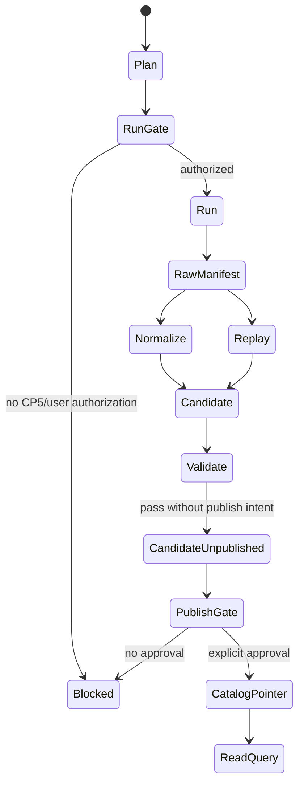

# LLD: CR014-S03 — P0 dataset plan/run/normalize/validate/publish 合同

> 本文档是 `CR014-S03-p0-plan-run-normalize-validate-publish-contract` 的低层设计，依赖 S01 的 lifecycle denominator 合同和 S02 的 layout/manifest/catalog/publish gate 合同，并纳入 `CR014-FULL-HISTORY-LAKE-BATCH-A` 全量 LLD 统一确认。CP5 已由用户按推荐全部允许，当前 `confirmed=true`、`implementation_allowed=true`；实现仍受 Story DAG、文件所有权、CP6/CP7 和禁止真实 provider / lake / credential / DuckDB 依赖边界约束，且真实抓取 / raw manifest 写湖已拆到后续 S09。

## 1. Goal

定义 P0 dataset 的 `plan -> run -> normalize/replay -> validate -> publish -> read/query` 状态机和输入输出合同，使真实抓取、raw/manifest 写入、candidate 派生、quality/readiness、publish current pointer 和 read/query 边界可计算，并确保 CP5 + 用户显式授权前真实操作计数全部为 0。

## 2. Requirements（Functional / Non-Functional）

### 2.1 Functional

- 定义 P0 dataset 最小集合：`prices`、`adj_factor`、`hs300_index`、`trade_calendar`、`index_members`、`index_weights`、`stock_basic`，并把 S01 lifecycle/code-change 作为必需合同输入。
- 定义 `plan` 阶段：只输出 dataset plan、coverage denominator、batch list、permission counters 和 `authorization_needed`，不抓 provider，不写 lake。
- 定义 `run` 阶段：仅在 Story dev_gate、CP5 approved、用户显式授权、source/interface allowlist 和 authorization_id 满足后，Provider Adapter / Run Gate 才可写 raw、manifest、run metadata。
- 定义 `normalize` 阶段：从 raw/manifest 生成 canonical/gold/quality candidate，不重新联网、不读取凭据、不更新 current pointer。
- 定义 `replay` 阶段：从 raw/manifest/run_id/batch_id 重放派生链路，必须保持 `provider_fetches=0`、`credential_reads=0`、`raw_writes=0`、`current_pointer_changes=0`。
- 定义 `validate` 阶段：输出 quality/readiness/parity candidate 或 audit evidence，即使 PASS 也不自动 publish。
- 定义 `publish` 阶段：调用 S02 Explicit Publish Gate；无显式授权时 `publish_count=0`、`current_pointer_changes=0`。
- 定义 `read/query` 阶段：只读 published catalog pointer 或受控 candidate audit evidence；不触发 provider、lake write、credential read 或 DuckDB dependency change。

### 2.2 Non-Functional

- 安全：CP5 前真实操作计数固定为 0；错误输出不得泄露 token、`.env`、provider payload 或真实私有路径。
- 可恢复：plan/run/replay 必须表达 `skip`、`retry`、`resume_conflict`，但本 Story 不执行真实恢复。
- 可验证：状态机 contract test 和 permission counter test 均使用 fixture / tmp_path，不依赖网络或真实 lake。
- 可维护：S03 只消费 S01/S02 合同，不扩展 lifecycle 字段或绕过 publish gate。

## 3. 模块拆分与职责

| 模块 / 文件组 | 职责 | 说明 |
|---|---|---|
| `market_data/cli.py` | 修改 CLI 合同，新增 CR014 plan/run/normalize/replay/validate/publish/read/query 命令状态与 dry-run 输出结构 | CP5 前命令必须 fail-closed 或 dry-run |
| `market_data/runtime.py` | 修改 Runtime / Run Gate 合同，新增 authorization_id、permission counters、source/interface allowlist 和 run_allowed 判定 | 真实 provider fetch 仅 CP5+用户授权后允许 |
| `market_data/normalization.py` | 修改 normalize/replay candidate 合同，新增 P0 dataset 输出状态和 current pointer 不变约束 | 不触发 provider、不读取凭据 |
| `market_data/validation.py` | 修改 quality/readiness/parity candidate 合同，新增 validate PASS 不 publish、P0 gate 和 permission counters 输出 | 与 S02 publish gate 解耦 |
| `market_data/contracts.py` | 读取 S01 P0/lifecycle/universe 常量 | 共享文件；S03 不新增 lifecycle 字段 |
| `market_data/manifest.py` | 读取 S02 manifest 合同 | 共享文件；S03 产生 / 消费 manifest record，不改变 manifest schema 所有权 |
| `market_data/catalog.py` | 读取 S02 catalog pointer 合同 | 共享文件；S03 不直接更新 current pointer |
| `tests/test_cr014_p0_pipeline_contract.py` | 创建状态机和权限计数 fixture tests | 不联网、不改依赖、不真实写湖 |

## 4. 代码结构与文件影响范围

| 动作 | 文件路径 | 变更内容 |
|---|---|---|
| 修改 | `market_data/cli.py` | 新增 CR014 P0 pipeline 命令合同和 dry-run / fail-closed 输出，不执行真实 provider 或 lake 操作 |
| 修改 | `market_data/runtime.py` | 新增 Run Gate 授权输入、permission counters、run_allowed 判定和 CP5 前阻断路径 |
| 修改 | `market_data/normalization.py` | 新增 P0 normalize/replay candidate 状态输出，确保 replay 不触发 provider、不写 raw、不改 pointer |
| 修改 | `market_data/validation.py` | 新增 P0 validate/readiness/parity candidate 结果结构，确保 Validate PASS 不自动 publish |
| 创建 | `tests/test_cr014_p0_pipeline_contract.py` | 覆盖 plan/run/normalize/replay/validate/publish/read/query 状态机和权限计数 |

共享但不作为 S03 primary 修改：`market_data/contracts.py`、`market_data/manifest.py`、`market_data/catalog.py`。禁止修改：`.env`、`data/**`、`reports/**`、`pyproject.toml`、`uv.lock`、provider fetch 入口、真实 lake current pointer。

## 5. 数据模型与持久化设计

| 对象 / 字段 | 类型 | 约束 | 说明 |
|---|---|---|---|
| `P0DatasetPlan.datasets` | `tuple[str, ...]` | 必须等于 7 类 P0 dataset | lifecycle/code-change 作为合同输入，不算 dataset |
| `P0DatasetPlan.as_of_trade_date` | `str` | 来自 S01 `current_truth_as_of` | 不允许盘中未闭市 |
| `P0DatasetPlan.coverage_denominator_ref` | `str` | 必填 | 引用 S01 denominator |
| `P0DatasetPlan.batch_list` | `list[dict]` | 可为空 | dry-run 输出 |
| `P0DatasetPlan.permission_counters` | `dict[str, int]` | CP5 前全 0 | 真实操作门控 |
| `RunAuthorization.authorization_id` | `str | None` | run 真实执行必填 | CP5 前为空 |
| `RunAuthorization.scope` | `dict` | run 真实执行必填 | dataset/date/source/interface 范围 |
| `RunGateResult.run_allowed` | `bool` | CP5 前 false | 未授权 fail-closed |
| `RunGateResult.provider_fetches` | `int` | CP5 前 0 | 权限计数 |
| `RunGateResult.lake_writes` | `int` | CP5 前 0 | 权限计数 |
| `NormalizeCandidate.dataset` | `str` | 必填 | canonical/gold/quality candidate |
| `NormalizeCandidate.candidate_path` | `str` | 必填 | 来自 S02 layout |
| `ReplayRequest.run_id` | `str` | 必填 | 定位 raw/manifest |
| `ReplayResult.raw_writes` | `int` | 必须 0 | replay 禁止重抓 / 写 raw |
| `ValidationResult.quality_status` | `str` | 必填 | pass/warn/fail/missing |
| `ValidationResult.publish_count` | `int` | Validate 阶段必须 0 | 防自动 publish |
| `PublishRequest.approval_token` | `str | None` | publish 必填 | 无授权 pointer 不变 |
| `ReadQueryContract.read_scope` | `str` | `published_current_truth` 或 `candidate_audit` | 不得直接扫描未发布 lake |

持久化设计：本 Story 定义未来 raw/manifest/canonical/gold/quality/catalog 的输入输出合同，但 CP5 前不创建、不修改、不读取真实 lake。测试使用内存 fixture / `tmp_path`，不得操作旧 `data/**`。

## 6. API / Interface 设计

| 接口 / 入口 | 输入 | 输出 | 调用方 | 说明 |
|---|---|---|---|---|
| `build_p0_plan(request, lifecycle_contract, catalog_pointer)` | dataset list、date range、S01 denominator、S02 pointer | `P0DatasetPlan` | CLI plan、readiness audit | CP5 前可 dry-run，真实计数为 0 |
| `evaluate_run_gate(plan, authorization, dev_gate)` | plan、authorization_id、dev_gate | `RunGateResult` | CLI run、runtime | 未满足 CP5+用户授权时 `run_allowed=false` |
| `run_p0_batches(plan, connector, layout, authorization)` | plan、connector、layout、authorization | `RunResult` | runtime | CP5 前不得调用真实 connector；实现应 fail-closed |
| `normalize_p0_candidate(manifest_record, raw_ref, dataset_contract)` | S02 manifest、raw ref、dataset schema | `NormalizeCandidate` | CLI normalize | 不更新 pointer |
| `replay_p0_candidate(run_id, batch_id, manifest_store)` | run_id/batch_id、manifest | `ReplayResult` | CLI replay | provider/credential/raw/current pointer 计数为 0 |
| `validate_p0_candidate(candidate, lifecycle, thresholds)` | candidate、S01 lifecycle、quality thresholds | `ValidationResult` | CLI validate、S05 | PASS 不 publish |
| `publish_p0_candidate(candidate, validation, publish_intent)` | candidate、validation、S02 publish intent | `PublishGateResult` | CLI publish | 只委托 S02 Explicit Publish Gate |
| `read_p0_current_truth(dataset, catalog_pointer, quality_policy)` | dataset、pointer、policy | `ReadQueryContract` | reader/DuckDB audit | 只读 published pointer |

错误暴露：`authorization_required`、`source_interface_unresolved`、`run_not_allowed`、`candidate_unpublished`、`validate_does_not_publish`、`publish_not_authorized`、`replay_source_missing`、`resume_conflict`、`claim_insufficient_evidence`。错误输出必须结构化，且包含解除条件。

## 7. 核心处理流程

1. `plan` 接收 P0 dataset、date range、S01 denominator 和 S2 catalog pointer，输出 batch list、缺口、permission counters 和 authorization_needed；不抓 provider、不写 lake。
2. `run` 先调用 `evaluate_run_gate`；CP5、LLD confirmed、dependencies_satisfied、用户 authorization_id、source/interface allowlist 缺任一项时 fail-closed，真实计数保持 0。
3. 已授权 run 才可由 Provider Adapter / Run Gate 写 raw、manifest 和 run metadata；本 LLD 不授权该行为。
4. `normalize` 从 raw/manifest 派生 canonical/gold/quality candidate，输出 candidate manifest，不更新 current pointer。
5. `replay` 按 run_id/batch_id 读取 raw/manifest 重放派生链路；缺 source 时输出 `replay_source_missing`，不触发 provider 补抓。
6. `validate` 计算 quality/readiness/parity candidate；即使 PASS，`publish_count=0`。
7. `publish` 只调用 S02 Explicit Publish Gate；无 publish intent 或授权时 `current_pointer_changes=0`。
8. `read/query` 只读 published current truth 或受控 candidate audit evidence；不得反向成为 source of truth。



## 8. 技术设计细节

- 关键算法 / 规则：
  - `build_p0_plan` 固定 P0 dataset 集合，不允许把 W3/minute/tick/Level2/VWAP 升级为 P0。
  - `evaluate_run_gate` 使用 exact gate：`cp5_approved && lld_confirmed && dependencies_satisfied && file_conflict_free && user_authorized && source_interface_allowed`；任一 false 则真实计数为 0。
  - `normalize` 和 `validate` 输出 `candidate_unpublished` 状态，直到 S02 publish gate 成功。
  - `replay` 只从 raw/manifest 派生；raw/manifest 缺失时返回 `replay_source_missing`，不触发 provider fetch。
  - `publish` 不是 validate 的副作用，而是独立显式命令 / 函数。
- 依赖选择与复用点：
  - 复用现有 `runtime.py` 的 resume/circuit breaker 方向，但新增授权 gate，避免默认执行 connector。
  - 复用 S02 `manifest.py` / `publish.py` 合同；S03 不自建 pointer update。
  - 不引入 DuckDB 依赖，不修改 `pyproject.toml` / `uv.lock`。
- 兼容性处理：
  - 现有 CLI / runtime 行为保留；CR014 新命令或参数默认 dry-run / fail-closed。
  - 旧 `data/**`、legacy reports 只作为禁止范围，不作为输入 fallback。
- 图示类型选择：状态图，因存在 plan/run/normalize/replay/validate/publish/read/query 多阶段状态转换和阻断分支。

CP5 前门控：`implementation_allowed=false`、`provider_fetch=0`、`lake_write=0`、`credential_read=0`、`duckdb_dependency_change=0`、`publish_count=0`、`current_pointer_changes=0`。本 LLD 不授权真实执行。

## 9. 安全与性能设计

| 维度 | 设计措施 | 验证方式 |
|---|---|---|
| 安全 | run gate 默认 fail-closed；CP5+用户授权缺失时 connector 不被调用 | permission counter test 和 fake connector call count |
| 安全 | 不读取 `.env`，只允许记录 credential env var 名称，不记录值 | 错误输出字段白名单测试 |
| 安全 | normalize/replay/validate/publish 分离；Validate PASS 不触发 publish | 状态机测试 |
| 安全 | read/query 不绕过 catalog，不扫描未发布 lake | read scope contract test |
| 性能 | plan 输出批次和分区过滤，不一次性扫描全历史真实数据 | fixture plan test |
| 可恢复 | resume 策略表达 `skip/retry/resume_conflict`，replay 无 provider side effect | replay/resume fixture test |

## 10. 测试设计

| 测试场景 | 前置条件 | 操作 | 预期结果 | 验证方式 |
|---|---|---|---|---|
| CP5 前 plan | 无授权，fixture lifecycle/catalog | 调用 `build_p0_plan` | 输出 plan 和 permission counters，全 0 | `tests/test_cr014_p0_pipeline_contract.py::test_plan_before_cp5_is_dry_run` |
| CP5 前 run | 无 CP5/user authorization，fake connector | 调用 `evaluate_run_gate` / `run_p0_batches` | `run_allowed=false`，connector call count=0，真实计数全 0 | 单元测试 |
| run 阶段授权条件 | 缺 source/interface allowlist 或 authorization_id | 调用 run gate | 输出 `authorization_required` 或 `source_interface_unresolved` | 单元测试 |
| normalize candidate | fixture manifest/raw ref | 调用 `normalize_p0_candidate` | 输出 candidate manifest，`current_pointer_changes=0` | 单元测试 |
| replay 不触发 provider | fixture run_id/batch_id | 调用 `replay_p0_candidate` | `provider_fetches=0`、`credential_reads=0`、`raw_writes=0`、`current_pointer_changes=0` | 单元测试 |
| validate PASS 不 publish | candidate quality pass | 调用 `validate_p0_candidate` | `publish_count=0`、`candidate_unpublished=true` | 单元测试 |
| publish 未授权 | candidate + validation pass，无 approval token | 调用 `publish_p0_candidate` | `publish_allowed=false`、`current_pointer_changes=0` | 单元测试 |
| read/query 只读 pointer | published pointer 和 candidate path fixture | 调用 `read_p0_current_truth` | 只接受 published pointer；candidate 需 explicit audit scope | 单元测试 |
| CP5 前依赖边界 | 无 DuckDB approval | 检查门控 | `duckdb_dependency_change=0`，不修改依赖 | 静态检查 |

## 11. 实施步骤

| TASK-ID | 动作 | 目标文件 | 详细描述 | 对应测试 |
|---|---|---|---|---|
| TASK-CR014-S03-01 | 修改 | `market_data/cli.py` | 增加 CR014 P0 pipeline 命令合同和 dry-run/fail-closed 输出结构，所有真实命令在 CP5 前阻断 | CP5 前 plan/run、publish 未授权 |
| TASK-CR014-S03-02 | 修改 | `market_data/runtime.py` | 增加 run authorization gate、permission counters、source/interface allowlist、run_allowed 判定 | CP5 前 run、授权条件 |
| TASK-CR014-S03-03 | 修改 | `market_data/normalization.py` | 增加 normalize/replay candidate 输出、replay side-effect counters 和 `replay_source_missing` | normalize candidate、replay 不触发 provider |
| TASK-CR014-S03-04 | 修改 | `market_data/validation.py` | 增加 P0 validate/readiness/parity candidate 结构，确保 PASS 不 publish | validate PASS 不 publish |
| TASK-CR014-S03-05 | 创建 | `tests/test_cr014_p0_pipeline_contract.py` | 编写状态机、permission counter、candidate/published 分离和 read/query 边界测试 | 全部 S03 测试场景 |

S03 不修改 `market_data/manifest.py`、`market_data/catalog.py`、`market_data/publish.py` 的所有权逻辑；只调用 S02 合同。实现前必须等待 S01/S02 LLD confirmed 和全量 CP5 人工确认。

## 12. 风险、难点与预研建议

| 风险 / 难点 | 影响 | 缓解措施 / 预研建议 |
|---|---|---|
| run gate 与既有 runtime 默认执行行为冲突 | 未授权时可能误触发 connector | CR014 run 入口必须先判 gate；测试 fake connector call count=0 |
| normalize/replay 与 publish 边界混淆 | candidate 被当成 current truth | 所有 candidate 输出显式 `candidate_unpublished`，publish 独立调用 S02 gate |
| replay 源缺失时误触发 provider 补抓 | 越权 provider fetch / credential read | `replay_source_missing` 是终态错误，解除需另行授权 run |
| S03 与 S02 同时修改 manifest/catalog/publish | 文件所有权冲突 | S03 只消费 S02 合同，不修改 S02 primary 文件 |
| DuckDB 被提前引入以做 parity | 违反依赖门控 | S03 不引入 DuckDB；S04 单独处理只读候选，CP5 前依赖变更为 0 |

### OPEN / Spike 跟踪

| ID | 类型（OPEN / Spike） | 问题 | 下一动作 | 责任方 |
|---|---|---|---|---|
| 无 | N/A | 无阻塞 OPEN/Spike；真实 provider/interface、authorization_id 和 lake root 必须在 CP5 批次确认后由用户对具体 run 显式授权 | 后续实现/运行时按授权记录执行 | meta-po / user |

## 13. 回滚与发布策略

- 发布方式：随 CR014 批次实现以普通代码变更发布；CP5 前只发布 LLD 与自动预检。
- 回滚触发条件：run gate 未授权仍调用 connector、replay 触发 provider、validate PASS 自动 publish、publish 未授权更新 pointer、或 CP5 人工审查要求修改。
- 回滚动作：撤回 `cli.py`、`runtime.py`、`normalization.py`、`validation.py` 的 CR014 pipeline 扩展和对应测试；保留 S01/S02 合同；不触碰真实 lake、旧 `data/**`、reports 或依赖。

## 14. Definition of Done

- [ ] 14 个章节全部填写完成
- [ ] 文件影响范围、接口、测试与实施步骤可直接指导编码
- [x] CP5 已确认，`confirmed=true` 后才进入受控实现
- [ ] 人工确认意见已收敛
- [ ] frontmatter 已填写 `tier`
- [ ] OPEN / Spike 已清点或显式写“无”
- [ ] run/normalize/replay/validate/publish 每阶段输入输出 100% 定义
- [ ] CP5 前 `provider_fetch=0`、`lake_write=0`、`credential_read=0`、`duckdb_dependency_change=0`
- [ ] Normalize / Replay 更新 current pointer 次数为 0
- [ ] Validate PASS 自动 publish 次数为 0
- [ ] Provider Adapter / Run Gate 仅在 CP5 + 用户显式授权后可写 raw/manifest/run metadata
- [ ] S03 只消费 S01/S02 合同，不扩大文件所有权

## 人工确认区

> **CP5 — Story LLD 可实现性门**
> meta-dev 先写入 `process/checks/CP5-CR014-S03-p0-plan-run-normalize-validate-publish-contract-LLD-IMPLEMENTABILITY.md` 自动预检结果。
> meta-po 收齐 `CR014-FULL-HISTORY-LAKE-BATCH-A` 全部目标 Story 的 LLD、CP4 自动预检摘要和 CP5 自动预检后，再生成并提示用户审查 `checkpoints/CP5-ALL-STORIES-LLD-BATCH.md`。
> 用户统一确认全部目标 Story 的 LLD 后，仍需满足当前 Wave、依赖门控与文件所有权门控方可进入实现。

**CP5 checklist 摘要**：

| # | 检查项 | 状态 | 证据 |
|---|---|---|---|
| 1 | LLD 覆盖 AC | 待检查 | 第 2 / 10 / 14 节 |
| 2 | 与 HLD / ADR 一致 | 待检查 | 第 3 / 8 / 12 节 |
| 3 | 文件影响范围明确 | 待检查 | 第 4 / 11 节 |
| 4 | 接口契约完整 | 待检查 | 第 6 节 |
| 5 | 测试与 dev_gate 可计算 | 待检查 | 第 10 / 14 节 |

**人工确认回复**：

请直接回复以下任一整行：

```text
approve
修改: <具体修改点>
reject
```

**人工审查结果回填**：

- 结论：`approved | changes_requested | rejected`
- 审查人：
- 审查时间：
- 修改意见：
- 风险接受项：
