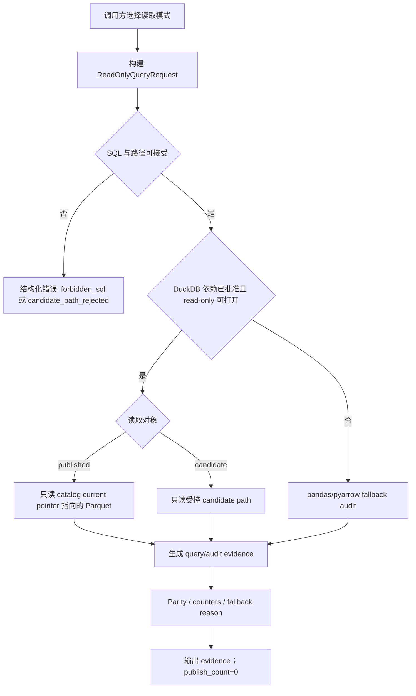

# LLD: CR014-S04 - DuckDB read-only query/audit/parity 边界

> 本文档仅覆盖 `CR014-S04-duckdb-readonly-query-audit-parity-boundary` 的 Story 级低层设计。CP5 已由用户按推荐全部允许，当前 `confirmed=true`、`implementation_allowed=true`；实现仍受 Story DAG、文件所有权、CP6/CP7 和禁止 DuckDB 依赖引入 / DuckDB 写入 / 真实 provider / lake / credential 边界约束。
>
> 本 LLD 不创建或修改任何代码、测试、依赖、真实 lake、旧 `data/**` 或旧 reports。CP5 前门控固定为：`provider_fetch=0`、`lake_write=0`、`credential_read=0`、`duckdb_dependency_change=0`。

## 1. Goal

创建未来实现阶段的 DuckDB 只读 query / audit / parity 合同蓝图，范围限定为 `market_data/duckdb_query.py`、`market_data/audit.py` 和 `tests/test_cr014_duckdb_readonly_boundary.py`。完成后，DuckDB 只能读取 catalog current pointer 指向的 published Parquet / gold / canonical，或在受控 candidate audit 中读取显式 candidate path；DuckDB query、view、parity report、feature result 不写事实源、不触发 publish、不替代 catalog。

## 2. Requirements（Functional / Non-Functional）

### 2.1 Functional

- 覆盖 AC-01：DuckDB query / view / parity / report 反向成为 source of truth 的次数必须为 0。
- 覆盖 AC-02：DuckDB 层不得触发 Provider Adapter、Run Gate、Normalize、Publish Gate 或 catalog current pointer 更新。
- 覆盖 AC-03：CP5 前 `pyproject.toml` 与 `uv.lock` 修改次数为 0，`duckdb_dependency_change_before_cp5=0`。
- 覆盖 AC-04：pandas / pyarrow fallback 策略必须进入接口、流程、异常路径和测试设计。
- Published current truth 模式只允许读取 catalog current pointer 指向的 Parquet / gold / canonical，并返回 query result、feature extraction result candidate 或 audit evidence。
- Candidate audit 模式只允许读取显式传入且通过路径策略校验的 candidate path 与 manifest refs，并输出 parity evidence / readiness audit，不自动 publish。
- Parity PASS 只能作为 evidence，不能生成 allowed full-A production claim，也不能更新 catalog current pointer。

### 2.2 Non-Functional

- 安全：默认路径不读取 `.env`、token、cookie、私钥、provider SDK、旧 `data/**` 或旧 reports 内容；权限计数固定为 `provider_fetches=0`、`lake_writes=0`、`credential_reads=0`。
- 可维护：DuckDB read-only query candidate、Parquet/catalog source of truth、claim boundary 三者职责分离；任何持久 `.duckdb`、DuckLake 或 external catalog 方案必须另起 ADR / CR。
- 可测试：所有接口均可用 fixture catalog、fake Parquet path 字符串、临时目录 sentinel 和 monkeypatch 断言只读行为。
- 性能：查询计划必须声明 projection 与 partition filter；不得要求一次性加载全历史全部列。
- 兼容：DuckDB 依赖未批准、未安装或 read-only 打开失败时，必须回退 pandas / pyarrow audit，并输出结构化 unavailable / fallback reason。
- 并发：DuckDB 只作为多读取者候选，不承担多进程写入；`.duckdb_source_of_truth_files=0`。

## 3. 模块拆分与职责

| 模块 / 文件组 | 职责 | 说明 |
|---|---|---|
| `market_data/duckdb_query.py` / ReadOnlyQueryPolicy | 定义只读连接策略、SQL 模板白名单、读对象校验和 fallback 决策 | 未来实现阶段创建；不得在本 LLD 阶段创建文件或改依赖 |
| `market_data/duckdb_query.py` / PublishedQueryRunner | 读取 catalog current pointer 指向的 published Parquet / gold / canonical 并返回查询结果 | 只读；不写 raw / manifest / canonical / gold / quality / catalog |
| `market_data/duckdb_query.py` / CandidateAuditRunner | 读取受控 candidate path 与候选 manifest，输出 audit evidence 或 parity input | Candidate audit PASS 不触发 publish |
| `market_data/audit.py` / ParityComparator | 对比 DuckDB 与 pandas / pyarrow 的 row count、key set、aggregates、null profile 和 checksum | mismatch 只输出 evidence，不修改 claim boundary 或 pointer |
| `market_data/audit.py` / FallbackAudit | 在 DuckDB 不可用、未授权或 read-only 打开失败时执行 pandas / pyarrow 等价审计 | fallback 是正式合同，不是临时异常 |
| `tests/test_cr014_duckdb_readonly_boundary.py` | 验证只读模式、fallback、forbidden SQL、no publish side effect、no dependency change | 未来实现阶段创建；本 LLD 仅定义测试入口 |

## 4. 代码结构与文件影响范围

| 动作 | 文件路径 | 变更内容 |
|---|---|---|
| 创建 | `market_data/duckdb_query.py` | 未来实现 read-only query policy、published query、candidate audit、optional DuckDB adapter 与 fallback selector |
| 创建 | `market_data/audit.py` | 未来实现 pandas / pyarrow fallback audit、DuckDB parity evidence 归一化和结构化错误输出 |
| 创建 | `tests/test_cr014_duckdb_readonly_boundary.py` | 未来实现只读边界、forbidden side effect、fallback 与 parity contract 测试 |
| 不修改 | `market_data/catalog.py` | 仅消费 S02 catalog current pointer 合同；若实现发现接口缺口，停止并交回 meta-po 发起 CR / LLD 修订 |
| 不修改 | `market_data/validation.py` | 仅消费 S03 validate / parity candidate 合同；不在 S04 写 shared validation 逻辑 |
| 禁止修改 | `pyproject.toml`、`uv.lock` | CP5 前以及本 Story LLD 阶段依赖变更为 0；后续若需依赖变更必须单独确认 |
| 禁止创建 | `*.duckdb`、`data/**`、`reports/**` | 不写持久 DuckDB 事实源、不写旧数据、不覆盖旧报告 |

## 5. 数据模型与持久化设计

本 Story 无新增持久化事实源，不创建 `.duckdb`、不创建 catalog、manifest、quality 或 report 文件。以下对象均为未来代码内的结构化运行时合同或测试 fixture。

| 对象 / 字段 | 类型 | 约束 | 说明 |
|---|---|---|---|
| `DuckDBReadMode` | enum | `published_current_truth` / `candidate_audit` / `fallback` | 控制读取对象和禁止行为 |
| `ReadOnlyQueryRequest.mode` | enum | 必填 | 读取模式必须显式传入，不允许根据路径自动猜测 |
| `ReadOnlyQueryRequest.catalog_pointer` | object / path string | published 模式必填 | 只作为 current pointer 输入；不得被 S04 更新 |
| `ReadOnlyQueryRequest.candidate_path` | path string | candidate audit 模式必填，必须通过受控路径校验 | 只能用于 audit evidence，不污染 current pointer |
| `ReadOnlyQueryRequest.sql_template_id` | string | 必填；只允许受控 SELECT 模板 | 禁止自由 SQL 写操作 |
| `ReadOnlyQueryRequest.projections` | list[string] | 必填或默认最小列集 | 支撑 projection pushdown |
| `ReadOnlyQueryRequest.partition_filters` | dict | 必填或空 dict | 支撑 Hive partition filter，不扫描全量列 |
| `PermissionCounters` | object | `provider_fetches=0`、`lake_writes=0`、`credential_reads=0`、`dependency_changes=0` | 每次 audit evidence 必须回显 |
| `ReadOnlyAuditEvidence` | object | JSON-safe | 包含 run_id、input_ref、mode、row_count、checksum、parity_status、fallback_reason、evidence_path |
| `DuckDBBoundaryError.code` | enum | `duckdb_dependency_unavailable` / `readonly_open_failed` / `forbidden_sql` / `catalog_pointer_missing` / `candidate_path_rejected` / `parity_mismatch` | 错误只暴露结构化 code 与脱敏上下文 |

## 6. API / Interface 设计

| 接口 / 入口 | 输入 | 输出 | 调用方 | 说明 |
|---|---|---|---|---|
| `build_readonly_query_request(...)` | mode、catalog pointer 或 candidate path、SQL template id、projection、partition filters | `ReadOnlyQueryRequest` 或 `DuckDBBoundaryError` | audit / feature job | 只做合同校验，不访问 provider、凭据或真实 lake |
| `run_published_current_truth_query(request)` | `mode=published_current_truth`、catalog current pointer | query result / `ReadOnlyAuditEvidence` | S05 readiness、S07 consumer 可间接消费 evidence | 只读 current pointer 指向的 published Parquet |
| `run_candidate_audit_query(request)` | `mode=candidate_audit`、candidate path、manifest refs | audit evidence / parity input | S03 validate / parity audit、S05 readiness | 只读受控 candidate；PASS 不 publish |
| `compare_duckdb_with_pandas_pyarrow(request)` | 同一 published pointer 或同一 candidate path、comparison spec | `ParityEvidence` | Quality / Readiness Gate | mismatch 输出 evidence；不改变 source Parquet 或 claim boundary |
| `run_fallback_audit(request, reason)` | request、fallback reason | pandas / pyarrow audit evidence | DuckDB dependency unavailable 或 readonly open failed 路径 | fallback 是正式输出，必须与 DuckDB evidence 字段等价 |
| `assert_no_duckdb_side_effects(evidence)` | evidence、permission counters、forbidden path sentinel | pass / structured failure | tests / CP6 自检 | 断言 publish_count、source_of_truth_update、provider_fetch、lake_write、credential_read 均为 0 |

## 7. 核心处理流程

1. 调用方显式选择 `published_current_truth`、`candidate_audit` 或 `fallback` 模式，并传入 catalog pointer 或受控 candidate path。
2. `build_readonly_query_request` 校验 SQL template、projection、partition filters、权限计数和读取对象；发现 forbidden SQL 或路径越界时返回结构化错误。
3. DuckDB adapter 仅在依赖已批准且运行时可导入时启用；未批准、未安装或 read-only 打开失败时进入 pandas / pyarrow fallback。
4. Published 模式只读 catalog current pointer 指向的 published Parquet / gold / canonical；candidate 模式只读显式 candidate path。
5. Parity comparator 生成 row count、key set、aggregate、null profile、checksum 的 evidence；PASS / FAIL 都不触发 publish。
6. Evidence 回显 permission counters：`provider_fetches=0`、`lake_writes=0`、`credential_reads=0`、`dependency_changes=0`。



异常路径：

- `duckdb_dependency_unavailable`：输出 fallback evidence，`duckdb_dependency_change=0`。
- `readonly_open_failed`：输出 fallback evidence，不重试写模式。
- `forbidden_sql`：拒绝执行，禁止 `CREATE`、`INSERT`、`UPDATE`、`DELETE`、`COPY TO`、`EXPORT`、`ATTACH`、`INSTALL`、`LOAD`、`PRAGMA` 写风险模板。
- `catalog_pointer_missing`：published 模式返回缺指针错误，不扫描 lake 根目录。
- `candidate_path_rejected`：candidate audit 返回路径越界错误，不自动降级为 published。
- `parity_mismatch`：输出 mismatch evidence，不改变 claim boundary 或 current pointer。

## 8. 技术设计细节

- 关键规则：DuckDB 是 query / audit / feature extraction 候选层，不是事实源；`.duckdb_source_of_truth_files=0`。
- SQL 控制：未来实现只接受注册模板，模板展开后必须是只读 SELECT / WITH SELECT 形态；禁止任何 DDL、DML、COPY / EXPORT、extension install / load、attach 和写路径输出。
- 读取对象控制：published 模式必须来自 catalog current pointer；candidate 模式必须来自调用方显式传入的 candidate path 与 manifest refs，不允许扫描未发布 lake 根。
- 依赖策略：本 LLD 和 CP5 前不修改 `pyproject.toml` / `uv.lock`；未来实现若未获得依赖批准，保留 pandas / pyarrow fallback 且测试仍可通过。
- 兼容性：DuckDB evidence 与 fallback evidence 使用同一字段集，S05 / S07 不需要知道底层执行引擎。
- 偏差记录：未来实现若必须修改 `market_data/catalog.py`、`market_data/validation.py` 或依赖文件，立即停止并交回 meta-po 修订 LLD / CP5。
- 图示类型选择：第 7 节使用流程图，因为存在 DuckDB / fallback / published / candidate 多分支与异常路径。

## 9. 安全与性能设计

| 维度 | 设计措施 | 验证方式 |
|---|---|---|
| 安全 | 不读取 `.env`、provider SDK、旧 `data/**`、旧 reports；权限计数固定为 0 | 测试 monkeypatch provider / credential / filesystem sentinel；CP6 禁止路径扫描 |
| 安全 | SQL 模板白名单 + forbidden keyword 检查 + candidate path 显式校验 | `forbidden_sql`、`candidate_path_rejected` 单测 |
| 安全 | DuckDB parity PASS 不触发 publish，不更新 catalog current pointer | `publish_count=0`、`source_of_truth_update=0` contract test |
| 性能 | projection 与 partition filters 是请求合同字段 | 测试断言 request 必须携带投影和过滤字段或显式空值 |
| 性能 | DuckDB 不可用时 fallback 可执行小 fixture audit | fixture audit 单测，避免全量真实数据依赖 |
| 并发 | 只读连接，不使用持久 native DB 写入 | `.duckdb` 文件创建 sentinel 断言为 0 |

## 10. 测试设计

| 测试场景 | 前置条件 | 操作 | 预期结果 | 验证方式 |
|---|---|---|---|---|
| Published current truth read-only | fixture catalog current pointer | 调用 `run_published_current_truth_query` | 只读 pointer 指向路径；`provider_fetches=0`、`lake_writes=0` | 单元测试 |
| Candidate audit read-only | fixture candidate path + manifest refs | 调用 `run_candidate_audit_query` | 输出 audit evidence；`publish_count=0` | 单元测试 |
| Forbidden SQL rejected | SQL template 含写操作关键字 | 构建 request | 返回 `forbidden_sql`；不执行 query | 单元测试 |
| DuckDB dependency unavailable fallback | monkeypatch import duckdb 失败 | 调用 query / audit | 输出 fallback evidence；`duckdb_dependency_change=0` | 单元测试 |
| Read-only open failed fallback | monkeypatch DuckDB read-only connection 抛错 | 调用 query / audit | 输出 fallback evidence；不尝试写模式 | 单元测试 |
| Parity mismatch evidence | DuckDB fixture 与 pandas fixture 聚合不同 | 调用 `compare_duckdb_with_pandas_pyarrow` | 输出 `parity_status=mismatch`；不 publish | 单元测试 |
| No source-of-truth side effect | monkeypatch catalog publish / provider / credential 函数为 fail sentinel | 执行全部 audit 接口 | sentinel 未被触发；`.duckdb` 文件数为 0 | contract test |
| CP5 pre-gate counters | 当前 LLD / CP5 阶段 | 静态检查 frontmatter 与 CP5 | `implementation_allowed=false`、四类计数为 0 | CP5 自动预检 |

## 11. 实施步骤

| TASK-ID | 动作 | 目标文件 | 详细描述 | 对应测试 |
|---|---|---|---|---|
| TASK-CR014-S04-01 | 创建 | `market_data/duckdb_query.py` | 定义 `ReadOnlyQueryRequest`、`DuckDBBoundaryError`、SQL 模板白名单、published / candidate 读取策略和 fallback selector | Published / Candidate / Forbidden SQL / fallback tests |
| TASK-CR014-S04-02 | 创建 | `market_data/audit.py` | 定义 `ReadOnlyAuditEvidence`、`ParityEvidence`、pandas / pyarrow fallback audit、parity comparator 和 side-effect counters | Parity mismatch / no side effect tests |
| TASK-CR014-S04-03 | 创建 | `tests/test_cr014_duckdb_readonly_boundary.py` | 添加 fixture catalog、candidate path、SQL 模板、monkeypatch sentinels 和 CP5 pre-gate 静态断言 | 全部 S04 测试 |
| TASK-CR014-S04-04 | 不修改 | `pyproject.toml`、`uv.lock` | 保持 DuckDB dependency change 为 0；若实现必须改依赖，停止并交回 meta-po | CP5 / CP6 guardrail |
| TASK-CR014-S04-05 | 不修改 | `market_data/catalog.py`、`market_data/validation.py` | 只消费上游合同；发现接口缺口时记录为偏差，不在 S04 扩大共享写入范围 | shared ownership review |

## 12. 风险、难点与预研建议

| 风险 / 难点 | 影响 | 缓解措施 / 预研建议 |
|---|---|---|
| DuckDB 被误解为 source of truth | 破坏 Parquet / catalog lineage 和恢复边界 | ADR-049 / ADR-052 写入 LLD；`.duckdb_source_of_truth_files=0`；测试断言 publish side effect 为 0 |
| DuckDB 依赖未批准 | DuckDB 路径无法执行 | fallback pandas / pyarrow 是正式合同；dependency change 保持 0 |
| SQL 模板绕过只读边界 | 可能写文件或创建 view | 模板白名单、forbidden keyword、路径校验、只读连接 |
| Candidate audit 与 published pointer 混淆 | 未发布数据被当作 current truth | request mode 必填；candidate evidence 标记 `candidate_unpublished` |
| S05 消费 DuckDB evidence 时放大为 allowed claim | 错误声明 production readiness | evidence 字段明确 `claim_effect=evidence_only`；S05 claim boundary 再判定 |

### OPEN / Spike 跟踪

| ID | 类型（OPEN / Spike） | 问题 | 下一动作 | 责任方 |
|---|---|---|---|---|
| O-CR014-S04-01 | OPEN | CR014 全量 8 张 LLD 尚需由 meta-po 汇总到 `checkpoints/CP5-ALL-STORIES-LLD-BATCH.md` 并统一人工确认 | 等待其他 meta-dev 完成 S01/S02/S03/S07/S08 LLD 与 CP5；meta-po 发起 CP5 批次审查 | meta-po |
| SP-CR014-S04-01 | Spike | 是否在后续实现阶段引入 DuckDB 依赖仍需 CP5 / 用户显式确认；当前设计必须在无依赖时可 fallback | CP5 人工确认时明确依赖策略；若未批准，按 pandas / pyarrow fallback 实现 | meta-po / meta-dev |

## 13. 回滚与发布策略

- 发布方式：本阶段只发布 LLD 与 CP5 自动预检；未来实现发布前必须满足全量 CP5 approved、当前 LLD `confirmed=true`、Wave / dev_gate 可执行。
- 回滚触发条件：CP5 人工审查要求修改、DuckDB 边界与 ADR-049 / ADR-052 冲突、依赖变更被拒绝、发现需要写 `.duckdb` 或修改 catalog / publish gate。
- 回滚动作：将 Story 保持或退回 `lld-ready` / `changes_requested`，修订本 LLD 和 CP5；已设计的 DuckDB 路径回退为 pandas / pyarrow fallback，不创建代码、不改依赖。

## 14. Definition of Done

- [x] 14 个章节全部填写完成。
- [x] 文件影响范围、接口、测试与 TASK-ID 实施步骤可直接指导后续编码。
- [x] CP5 已确认，`confirmed=true` 后才进入受控实现；本批仍不引入 DuckDB 依赖、不执行 DuckDB 写入。
- [x] CP5 前门控显式保留：`provider_fetch=0`、`lake_write=0`、`credential_read=0`、`duckdb_dependency_change=0`。
- [x] DuckDB 只读 published current truth / controlled candidate audit 边界明确。
- [x] 不写持久 `.duckdb` 事实源，不引入依赖，不修改 `pyproject.toml` / `uv.lock`。
- [x] OPEN / Spike 已清点：2 项，均不阻断 Story 级 LLD 可实现性，阻断实现直到 CP5 全量确认。

## 人工确认区

> **CP5 - Story LLD 可实现性门**
> meta-dev 先写入 `process/checks/CP5-CR014-S04-duckdb-readonly-query-audit-parity-boundary-LLD-IMPLEMENTABILITY.md` 自动预检结果。
> meta-po 收齐 CR014-FULL-HISTORY-LAKE-BATCH-A 全部 8 张 Story 的 LLD、CP4 自动预检摘要和 CP5 自动预检后，再生成并提示用户审查 `checkpoints/CP5-ALL-STORIES-LLD-BATCH.md`。
> 用户统一确认全部目标 Story 的 LLD 后，仍需满足当前 Wave、依赖门控与文件所有权门控方可进入实现。

**CP5 checklist 摘要**：

| # | 检查项 | 状态 | 证据 |
|---|---|---|---|
| 1 | LLD 覆盖 AC | 待检查 | 第 2 / 10 / 14 节 |
| 2 | 与 HLD / ADR 一致 | 待检查 | 第 3 / 8 / 12 节 |
| 3 | 文件影响范围明确 | 待检查 | 第 4 / 11 节 |
| 4 | 接口契约完整 | 待检查 | 第 6 节 |
| 5 | 测试与 dev_gate 可计算 | 待检查 | 第 10 / 14 节 |

**人工确认回复**：

```text
approve
修改: <具体修改点>
reject
```

**人工审查结果回填**：

- 结论：`approved | changes_requested | rejected`
- 审查人：
- 审查时间：
- 修改意见：
- 风险接受项：
