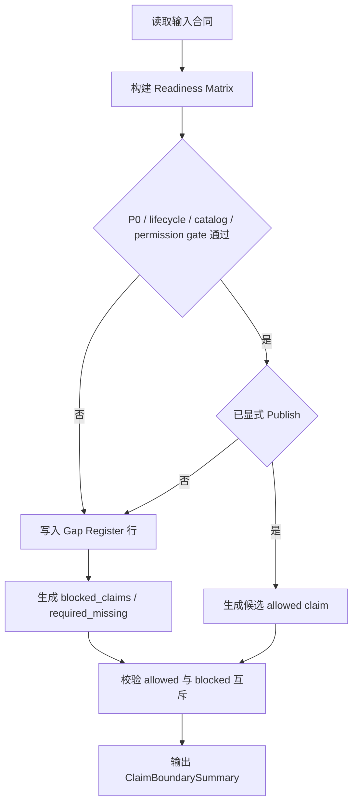

# LLD: CR014-S05 - full-history readiness audit / gap register / claim boundary

> 本文档仅覆盖 `CR014-S05-full-history-readiness-gap-claim-boundary` 的 Story 级低层设计。CP5 已由用户按推荐全部允许，当前 `confirmed=true`、`implementation_allowed=true`；实现仍受 Story DAG、文件所有权、CP6/CP7 和禁止真实 provider / lake / credential / DuckDB 依赖边界约束。
>
> 本 LLD 不创建或修改任何代码、测试、真实 lake、旧 `data/**`、旧 reports、README 或 docs。CP5 前门控固定为：`provider_fetch=0`、`lake_write=0`、`credential_read=0`、`duckdb_dependency_change=0`。

## 1. Goal

创建未来实现阶段的 full-A since-inception readiness matrix、gap register、allowed_claims、blocked_claims 和 required_missing 合同蓝图，范围限定为 `market_data/readiness.py`、`market_data/claims.py` 和 `tests/test_cr014_readiness_claim_boundary.py`。完成后，任一 P0 dataset gate、lifecycle gate、catalog pointer、permission gate 或 evidence gate 未通过时，full-A since-inception production allowed claim 输出次数必须为 0，并以结构化 blocked / required_missing 输出缺口、证据路径和解除条件。

## 2. Requirements（Functional / Non-Functional）

### 2.1 Functional

- 覆盖 AC-01：`blocked_claims` 100% 包含缺口、证据路径和解除条件。
- 覆盖 AC-02：任一 P0 gate 未通过时，full-A allowed production claim 输出次数为 0。
- 覆盖 AC-03：readiness denominator 必须使用 S01 lifecycle / current-truth 合同；不得用当前股票快照或旧窗口推断全历史分母。
- 覆盖 AC-04：默认路径 `provider_fetch=0`、`lake_write=0`、`credential_read=0`、`old_report_overwrite=0`。
- 读取 S01 universe / lifecycle、S02 catalog current pointer / publish status、S03 quality / readiness candidate、S04 DuckDB / fallback audit evidence 的合同输出。
- Candidate audit PASS 但未 publish 时，published current truth allowed claim 必须为 0，并输出 `candidate_unpublished` blocked reason。
- 旧 CR-010 / CR-012 / CR-013 evidence 只能作为传入的 evidence path / baseline reference 字段，不在默认实现中读取或覆盖旧 reports 内容。
- Claim boundary 输出必须包含 `allowed_claims`、`blocked_claims`、`required_missing`、permission counters、解除条件和 evidence paths，禁止用自由文本替代结构化字段。

### 2.2 Non-Functional

- 安全：不读取 `.env`、凭据、provider SDK、旧 `data/**`、旧 reports 内容；不写真实 lake；不覆盖历史 reports。
- 可追溯：每条 readiness / gap / claim 行必须包含 catalog pointer 或 candidate evidence、run_id / manifest ref、as_of_trade_date、evidence_paths。
- 可验证：测试必须覆盖 P0 缺口、candidate unpublished、旧 evidence 只作为引用路径、full-A allowed claim 为 0。
- 可维护：readiness、gap register、claim boundary 字段名沿用 HLD / ADR，不与 S07 / S08 文档消费层重复造自由文本。
- 幂等：未来实现仅返回结构化对象或写入明确授权的新 artifact；默认合同不覆盖旧 reports。
- 兼容：S04 DuckDB evidence 不存在时，readiness 可以消费 pandas / pyarrow fallback evidence；缺 evidence 时默认 blocked。

## 3. 模块拆分与职责

| 模块 / 文件组 | 职责 | 说明 |
|---|---|---|
| `market_data/readiness.py` / ReadinessMatrixBuilder | 汇总 lifecycle denominator、catalog pointer、manifest、quality/readiness、audit evidence，生成 dataset/window/source/readiness status | 未来实现阶段创建；不触发 provider 或 publish |
| `market_data/readiness.py` / GapRegisterBuilder | 将 P0 gate、lifecycle、coverage、PIT、catalog、permission 缺口转为 gap register | 每个 gap 必须有 gap_code、evidence_path、remediation、解除条件 |
| `market_data/claims.py` / ClaimBoundaryBuilder | 根据 gap register、publish status、unsupported register refs 和 permission counters 输出 allowed / blocked / required_missing | 任一 P0 阻断时 full-A allowed claim=0 |
| `market_data/claims.py` / ClaimValidator | 检查 allowed claims 与 blocked / missing 是否互斥，禁止 candidate unpublished 生成 current truth claim | 提供 S07 / S08 消费前校验 |
| `market_data/audit.py` / AuditEvidence Input | 作为 S04 DuckDB / fallback audit evidence 的只读输入合同 | S05 不写 shared audit 文件；仅消费 evidence 字段 |
| `tests/test_cr014_readiness_claim_boundary.py` | 验证 readiness、gap register、claim boundary、permission counters 和旧 evidence 保留 | 未来实现阶段创建；本 LLD 仅定义测试入口 |

## 4. 代码结构与文件影响范围

| 动作 | 文件路径 | 变更内容 |
|---|---|---|
| 创建 | `market_data/readiness.py` | 未来实现 readiness matrix、gap register、readiness error model 和 input contract validation |
| 创建 | `market_data/claims.py` | 未来实现 allowed_claims / blocked_claims / required_missing builder 与 claim validator |
| 创建 | `tests/test_cr014_readiness_claim_boundary.py` | 未来实现 P0 gap、claim blocking、old evidence reference-only、permission counter 测试 |
| 不修改 | `market_data/validation.py` | 仅消费 S03 quality / readiness candidate 合同；如需共享 validator 修改，停止并交回 meta-po |
| 不修改 | `market_data/audit.py` | 仅消费 S04 audit evidence 合同；S05 不写 S04 primary 文件 |
| 禁止修改 | `reports/**`、`data/**`、`.env` | 不读取或覆盖旧 reports 内容，不操作旧数据或凭据 |
| 禁止修改 | `pyproject.toml`、`uv.lock` | CP5 前以及本 LLD 阶段依赖变更为 0 |

## 5. 数据模型与持久化设计

本 Story 默认不新增持久化写入。以下对象为未来代码内结构化合同；若后续 Story / CP5 决定落盘，必须写到新 run_id / 新目录，且不能覆盖旧 reports。

| 对象 / 字段 | 类型 | 约束 | 说明 |
|---|---|---|---|
| `ReadinessMatrixRow.dataset` | string | 必填；P0 dataset 或明确 unsupported 项 | P0 默认来自 S02 / S03 / HLD §17 |
| `ReadinessMatrixRow.window` | object | 必填 | 包含 `coverage_start_policy`、`coverage_start`、`coverage_end`、`as_of_trade_date` |
| `ReadinessMatrixRow.universe_scope` | enum | `all_a_share` 或更窄范围 | full-A claim 必须为 `all_a_share` |
| `ReadinessMatrixRow.denominator_ref` | string | 必填 | 指向 S01 lifecycle denominator / current truth contract |
| `ReadinessMatrixRow.catalog_pointer_ref` | string | published claim 必填 | 缺失时输出 `catalog_pointer_missing` |
| `ReadinessMatrixRow.quality_status` | enum | `pass` / `warn` / `fail` / `required_missing` / `source_unresolved` / `candidate_unpublished` | `fail` 或 required missing 阻断 publish claim |
| `ReadinessMatrixRow.readiness_status` | enum | `available` / `warn` / `required_missing` / `quality_failed` / `pit_incomplete` / `source_unresolved` | 继承 CR-011 / CR-014 状态语义 |
| `GapRegisterRow.gap_code` | enum | 必填 | 例如 `p0_dataset_missing`、`lifecycle_required_missing`、`candidate_unpublished`、`claim_insufficient_evidence` |
| `GapRegisterRow.evidence_path` | string | 必填；可为引用路径，不默认读取 | 记录 evidence ref；不覆盖旧 evidence |
| `GapRegisterRow.remediation` | string | 必填 | 解除条件必须可执行 |
| `ClaimBoundarySummary.allowed_claims` | list[object] | P0 gate 未通过时不得包含 full-A production claim | 只允许结构化 claim |
| `ClaimBoundarySummary.blocked_claims` | list[object] | gap 非空时必填 | 每项带 reason、evidence_path、解除条件 |
| `ClaimBoundarySummary.required_missing` | list[object] | 缺必需输入时必填 | 供 S07 / S08 消费 |
| `ClaimBoundarySummary.permission_counters` | object | 默认全 0 | `provider_fetches`、`lake_writes`、`credential_reads`、`old_report_overwrites` |

## 6. API / Interface 设计

| 接口 / 入口 | 输入 | 输出 | 调用方 | 说明 |
|---|---|---|---|---|
| `build_readiness_matrix(...)` | lifecycle denominator、catalog snapshot、manifest refs、quality/readiness candidate、audit evidence refs、permission counters | `ReadinessMatrix` 或 `ReadinessBoundaryError` | S07 docs / research consumer、QA tests | 不触发 provider、lake write、publish 或旧 report read |
| `build_gap_register(matrix)` | readiness matrix | `GapRegister` | claim builder、docs/runbook consumer | 任一 P0 缺口必须转成 gap row |
| `build_claim_boundary(gap_register, publish_status, unsupported_refs, permission_counters)` | gap register、publish status、unsupported register 引用、权限计数 | `ClaimBoundarySummary` | S07 / S08 / reports docs input | P0 gate 未过时 full-A allowed claim=0 |
| `validate_claim_boundary(summary)` | claim summary | pass / structured failure | tests / CP6 自检 / S07 消费前 | 检查 allowed / blocked / missing 互斥和证据完整性 |
| `merge_audit_evidence(readiness_inputs, audit_evidence)` | S04 DuckDB 或 fallback evidence | normalized audit evidence refs | readiness matrix builder | DuckDB evidence 只作为 evidence，不改变 current truth |
| `assert_no_readiness_side_effects(summary)` | summary、permission counters、forbidden sentinel | pass / structured failure | tests / CP6 自检 | 断言 provider_fetch、lake_write、credential_read、old_report_overwrite 均为 0 |

## 7. 核心处理流程

1. 调用方传入 lifecycle denominator、catalog current pointer / publish status、manifest refs、quality / readiness candidate、S04 audit evidence refs 与 permission counters。
2. `build_readiness_matrix` 按 dataset、window、source/interface、as_of_trade_date 生成 readiness rows；缺必需输入时标记 `required_missing`，不得推断 pass。
3. `merge_audit_evidence` 将 DuckDB / fallback evidence 归一化为 evidence refs；candidate audit PASS 仍保持 `candidate_unpublished`，除非 S02 publish status 显示已显式 publish。
4. `build_gap_register` 将 P0 dataset、lifecycle、catalog pointer、quality/readiness、permission、evidence 缺口转成 gap rows。
5. `build_claim_boundary` 根据 gap register 与 publish status 输出 allowed / blocked / required_missing；任一 P0 gate 未通过时 full-A allowed production claim 为空。
6. `validate_claim_boundary` 检查每个 blocked claim 都有 evidence_path 与解除条件，且 allowed claims 不与 blocked / missing 冲突。



异常路径：

- `lifecycle_required_missing`：阻断 full-A since-inception claim，输出 required_missing。
- `catalog_pointer_missing`：阻断 published current truth claim，不扫描 lake 根目录。
- `candidate_unpublished`：candidate audit 可作为 evidence，但 allowed current truth claim=0。
- `claim_insufficient_evidence`：缺 evidence path 或解除条件时默认 blocked。
- `permission_counter_violation`：任一 provider / lake / credential / old report counter 非 0 时 claim boundary fail。

## 8. 技术设计细节

- Claim 判定规则：`allowed full-A since-inception production claim` 只有在 full-A universe、lifecycle denominator、P0 dataset readiness、catalog current pointer、quality policy、permission counters、evidence paths 全部通过时才允许生成。
- Gap register 规则：任一 P0 缺口必须写 `gap_code`、`evidence_path`、`remediation`、`release_condition`，不得只写自然语言说明。
- DuckDB evidence 规则：S04 evidence 字段只能参与 audit / parity 证明；不能直接改变 publish status 或 allowed claim。
- 旧 evidence 规则：旧 reports 只能以 `legacy_baseline_ref` 字符串进入 summary；默认实现不得读取、覆盖或迁移旧 reports。
- Permission counters：summary 必须回显 `provider_fetches=0`、`lake_writes=0`、`credential_reads=0`、`old_report_overwrites=0`。
- 偏差记录：未来实现若必须修改 `market_data/audit.py`、`market_data/validation.py`、reports 或 docs，立即停止并交回 meta-po 修订范围。
- 图示类型选择：第 7 节使用流程图，因为存在 matrix、gap、claim、publish、blocked 多分支。

## 9. 安全与性能设计

| 维度 | 设计措施 | 验证方式 |
|---|---|---|
| 安全 | 不触发 provider、真实 lake 写入、凭据读取、旧 `data/**` 或旧 reports 内容读取 | monkeypatch sentinels；permission counters 单测 |
| 安全 | Claim boundary 只接受结构化输入，不解析自由文本旧报告内容 | fixture object tests；old report overwrite counter=0 |
| 安全 | 任一证据缺失默认 blocked | `claim_insufficient_evidence` 单测 |
| 性能 | readiness matrix 按 dataset/window 聚合，不要求加载真实全历史文件 | 使用 fixture matrix 和 refs 测试 |
| 性能 | 支持消费 S04 audit summary 而非全量 query result | audit evidence ref contract test |
| 可维护 | 状态枚举沿用 CR-011 / CR-014 readiness 语义 | schema / enum 单测 |

## 10. 测试设计

| 测试场景 | 前置条件 | 操作 | 预期结果 | 验证方式 |
|---|---|---|---|---|
| P0 dataset 缺口进入 blocked | fixture matrix 缺 `prices` 或 quality fail | 调用 `build_gap_register` 和 `build_claim_boundary` | `blocked_claims` 含 gap、evidence_path、解除条件；allowed full-A claim=0 | 单元测试 |
| Candidate audit PASS 但未 publish | S04 audit evidence pass，S02 publish status 为 candidate | 构建 claim boundary | `candidate_unpublished` blocked；current truth allowed claim=0 | 单元测试 |
| Lifecycle denominator 缺失 | lifecycle denominator ref 缺失 | 构建 readiness matrix | 输出 `lifecycle_required_missing`；allowed claim=0 | 单元测试 |
| 旧 evidence 只作为引用路径 | 输入 legacy baseline refs | 构建 summary | summary 记录 ref 字符串；old_report_overwrites=0；不读取旧 reports | contract test |
| Permission counter violation | permission counters 中 `lake_writes=1` | validate claim boundary | 返回 `permission_counter_violation`；allowed claim=0 | 单元测试 |
| blocked_claims 字段完整 | gap register 多行 | validate summary | 每行都有 `gap_code`、`evidence_path`、`remediation`、`release_condition` | 单元测试 |
| DuckDB evidence 缺失 fallback | 无 S04 evidence 或 fallback reason | 构建 readiness | 输出 required_missing 或 fallback evidence ref；不推断 pass | 单元测试 |
| CP5 pre-gate counters | 当前 LLD / CP5 阶段 | 静态检查 frontmatter 与 CP5 | `implementation_allowed=false`、四类计数为 0 | CP5 自动预检 |

## 11. 实施步骤

| TASK-ID | 动作 | 目标文件 | 详细描述 | 对应测试 |
|---|---|---|---|---|
| TASK-CR014-S05-01 | 创建 | `market_data/readiness.py` | 定义 readiness matrix rows、input validator、gap register builder 和错误枚举 | P0 gap / lifecycle missing / candidate unpublished tests |
| TASK-CR014-S05-02 | 创建 | `market_data/claims.py` | 定义 claim boundary summary、allowed / blocked / required_missing builder、claim validator 和 permission counter checks | claim boundary / permission violation tests |
| TASK-CR014-S05-03 | 创建 | `tests/test_cr014_readiness_claim_boundary.py` | 添加 fixture lifecycle、catalog pointer、S04 evidence、legacy baseline refs 和 forbidden sentinel | 全部 S05 测试 |
| TASK-CR014-S05-04 | 不修改 | `market_data/audit.py`、`market_data/validation.py` | 仅消费 S04 / S03 合同；需要共享文件修改时停止并回到 meta-po | shared ownership review |
| TASK-CR014-S05-05 | 禁止 | `reports/**`、`data/**`、`.env`、`pyproject.toml`、`uv.lock` | 不读旧数据、不覆盖旧 reports、不改依赖、不读凭据 | CP5 / CP6 guardrail |

## 12. 风险、难点与预研建议

| 风险 / 难点 | 影响 | 缓解措施 / 预研建议 |
|---|---|---|
| Candidate audit PASS 被误读为 published current truth | 未发布数据生成 allowed claim | publish status 是 claim 前置；`candidate_unpublished` 必须 blocked |
| readiness denominator 漂移 | full-A 分母不一致，产生幸存者偏差 | 强制消费 S01 lifecycle denominator ref |
| 旧 CR-010/012/013 evidence 被读取或覆盖 | 违反本轮权限边界和证据保留 | 旧 evidence 只作为 ref 字符串；old_report_overwrites=0 |
| blocked_claims 缺解除条件 | 下游文档无法说明如何解除 | schema 和 validator 强制 `remediation` / `release_condition` |
| S04 DuckDB evidence 缺失 | 无法完成 audit parity 证明 | fallback evidence 或 `claim_insufficient_evidence` blocked，不推断 pass |

### OPEN / Spike 跟踪

| ID | 类型（OPEN / Spike） | 问题 | 下一动作 | 责任方 |
|---|---|---|---|---|
| O-CR014-S05-01 | OPEN | CR014 全量 8 张 LLD 尚需由 meta-po 汇总到 `checkpoints/CP5-ALL-STORIES-LLD-BATCH.md` 并统一人工确认 | 等待其他 meta-dev 完成 S01/S02/S03/S07/S08 LLD 与 CP5；meta-po 发起 CP5 批次审查 | meta-po |
| O-CR014-S05-02 | OPEN | S01/S02/S03/S04 的合同需在同一 CP5 批次确认后才能作为实现强输入 | CP5 批次 approved 后，将上游 LLD confirmed 状态作为 dev_gate 输入 | meta-po / meta-dev |

## 13. 回滚与发布策略

- 发布方式：本阶段只发布 LLD 与 CP5 自动预检；未来实现发布前必须满足全量 CP5 approved、当前 LLD `confirmed=true`、Wave / dev_gate 可执行。
- 回滚触发条件：CP5 人工审查要求修改、claim boundary 与 ADR-050 / ADR-051 冲突、需要读取或覆盖旧 reports、需要扩大到 S07 / S08 文档范围。
- 回滚动作：将 Story 保持或退回 `lld-ready` / `changes_requested`，修订本 LLD 和 CP5；claim 输出回退为 blocked / required_missing，不生成 allowed full-A production claim。

## 14. Definition of Done

- [x] 14 个章节全部填写完成。
- [x] 文件影响范围、接口、测试与 TASK-ID 实施步骤可直接指导后续编码。
- [x] CP5 已确认，`confirmed=true` 后才进入受控实现；本批仍不授权真实 provider / lake / credential / DuckDB 依赖操作。
- [x] CP5 前门控显式保留：`provider_fetch=0`、`lake_write=0`、`credential_read=0`、`duckdb_dependency_change=0`。
- [x] readiness matrix、gap register、allowed_claims / blocked_claims / required_missing 数据合同明确。
- [x] P0 gate 未通过时 full-A allowed production claim 输出次数为 0。
- [x] OPEN / Spike 已清点：2 项，均不阻断 Story 级 LLD 可实现性，阻断实现直到 CP5 全量确认。

## 人工确认区

> **CP5 - Story LLD 可实现性门**
> meta-dev 先写入 `process/checks/CP5-CR014-S05-full-history-readiness-gap-claim-boundary-LLD-IMPLEMENTABILITY.md` 自动预检结果。
> meta-po 收齐 CR014-FULL-HISTORY-LAKE-BATCH-A 全部 8 张 Story 的 LLD、CP4 自动预检摘要和 CP5 自动预检后，再生成并提示用户审查 `checkpoints/CP5-ALL-STORIES-LLD-BATCH.md`。
> 用户统一确认全部目标 Story 的 LLD 后，仍需满足当前 Wave、依赖门控与文件所有权门控方可进入实现。

**CP5 checklist 摘要**：

| # | 检查项 | 状态 | 证据 |
|---|---|---|---|
| 1 | LLD 覆盖 AC | 待检查 | 第 2 / 10 / 14 节 |
| 2 | 与 HLD / ADR 一致 | 待检查 | 第 3 / 8 / 12 节 |
| 3 | 文件影响范围明确 | 待检查 | 第 4 / 11 节 |
| 4 | 接口契约完整 | 待检查 | 第 6 节 |
| 5 | 测试与 dev_gate 可计算 | 待检查 | 第 10 / 14 节 |

**人工确认回复**：

```text
approve
修改: <具体修改点>
reject
```

**人工审查结果回填**：

- 结论：`approved | changes_requested | rejected`
- 审查人：
- 审查时间：
- 修改意见：
- 风险接受项：
